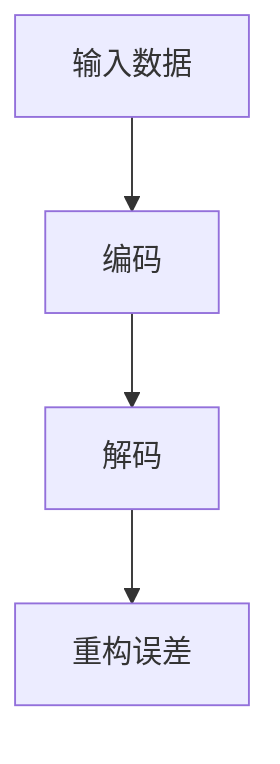
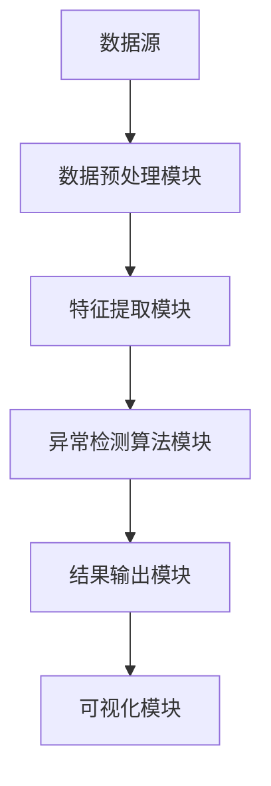

                 

# 金融时间序列异常检测系统

## 关键词
- 金融时间序列
- 异常检测
- 算法
- 系统设计
- 数据预处理
- 强化学习

## 摘要
本文深入探讨金融时间序列异常检测系统的设计与实现。首先介绍金融时间序列数据的特点及其在异常检测中的重要性，然后阐述异常检测的定义、挑战以及现有方法。接着，本文详细解析了数据预处理、异常检测算法及其原理，并使用Mermaid流程图和Python代码进行说明。随后，文章介绍了系统设计与实现，包括系统架构设计、数据流处理、算法选择与实现以及性能优化。最后，通过实际项目实战展示系统应用，并给出最佳实践与未来展望。

## 引言

金融领域的时间序列数据是研究金融市场波动、预测未来走势的重要数据源。这些数据以时间顺序排列，反映了金融市场的动态变化。异常检测在金融时间序列分析中具有至关重要的地位，它可以帮助金融机构及时识别潜在风险，预防欺诈行为，提高决策的准确性。

然而，金融时间序列数据的异常检测面临着诸多挑战。首先，金融时间序列数据往往具有噪声大、数据维度高、数据分布不均匀等特点，这使得传统异常检测方法难以有效应用。其次，金融市场的变化速度非常快，异常检测系统需要具备实时性。此外，金融异常往往具有复杂性和多变性，这对异常检测算法的设计和实现提出了更高的要求。

本文旨在解决上述问题，通过介绍金融时间序列异常检测系统的设计与实现，提供一种有效的解决方案。文章首先介绍金融时间序列数据及其特点，然后详细讨论异常检测的定义、挑战和现有方法。接下来，文章重点解析数据预处理、异常检测算法及其原理，并通过实际项目展示系统的应用。最后，文章总结最佳实践，展望未来研究方向。

## 背景介绍

### 金融时间序列数据

金融时间序列数据是金融市场在过去一段时间内各时间点上的数据记录，这些数据通常包括股票价格、交易量、利率等指标。金融时间序列数据具有以下特点：

1. **非线性**：金融时间序列数据通常呈现出非线性变化趋势，难以用简单的线性模型描述。
2. **波动性**：金融市场的波动性较大，价格和交易量等指标会随时间发生剧烈变化。
3. **高维度**：金融时间序列数据包含多个维度的信息，如股票价格、交易量、利率等，这使得数据维度较高。
4. **噪声**：金融时间序列数据中存在大量噪声，这些噪声会影响异常检测的准确性。
5. **不均匀分布**：金融时间序列数据的分布往往不均匀，某些时间段内数据密集，而另一些时间段内数据稀疏。

### 异常检测的定义与挑战

异常检测是指从一组数据中识别出那些不符合正常模式的数据项。在金融领域，异常检测主要用于识别异常交易、欺诈行为等。异常检测在金融时间序列数据中面临着以下挑战：

1. **噪声处理**：金融时间序列数据中噪声较多，这会影响异常检测的准确性。如何有效去除噪声成为关键问题。
2. **实时性**：金融市场变化迅速，异常检测系统需要具备实时性，以便及时识别异常情况。
3. **多维数据融合**：金融时间序列数据具有高维度，如何有效融合这些多维数据以提升异常检测效果是一个挑战。
4. **复杂性与多变性**：金融异常往往具有复杂性和多变性，这对异常检测算法的设计和实现提出了更高的要求。

### 现有异常检测方法综述

现有的异常检测方法可以分为监督学习、无监督学习、半监督学习和强化学习等几类。

1. **监督学习**：监督学习方法通过对正常数据和异常数据进行标记，训练出一个分类模型，从而实现异常检测。常见的监督学习方法包括线性回归、决策树和支持向量机等。监督学习方法的优势在于可以充分利用已标记的数据，提高检测准确性。然而，监督学习方法对标记数据的依赖较大，且在实际应用中难以获取大量标记数据。

2. **无监督学习**：无监督学习方法无需对数据预先进行标记，通过挖掘数据中的潜在结构和模式实现异常检测。常见的无监督学习方法包括聚类算法、主成分分析等。无监督学习方法的优势在于可以处理大量未标记的数据，且不需要依赖标记数据。然而，无监督学习方法在处理高维度、非线性数据时效果不佳。

3. **半监督学习**：半监督学习方法结合了监督学习和无监督学习的优势，通过利用部分标记数据和大量未标记数据来训练模型。常见的半监督学习方法包括自适应提升算法和贝叶斯网络等。半监督学习方法在处理高维度、非线性数据时效果较好，但仍然面临标记数据不足的问题。

4. **强化学习**：强化学习方法通过奖励机制来训练模型，使其能够在实际环境中实现异常检测。常见的强化学习方法包括Q-Learning和Deep Q-Network等。强化学习方法在处理复杂、动态环境时具有优势，但训练过程较为复杂，且对环境反馈的准确性要求较高。

综上所述，不同的异常检测方法具有各自的优缺点，选择合适的异常检测方法需要根据具体应用场景和数据特点进行综合考虑。

### 核心概念

#### 时间序列数据

时间序列数据是指按时间顺序排列的一组数据点，每个数据点表示在特定时间点的值。时间序列数据在金融、气象、医疗等领域有广泛的应用。例如，金融领域中的股票价格、交易量、利率等数据都是时间序列数据。

时间序列数据的主要特点如下：

1. **序列性**：数据按时间顺序排列，每个数据点与前后数据点存在关联性。
2. **时变性**：时间序列数据会随着时间推移而发生变化，表现出动态性。
3. **趋势性**：时间序列数据可能存在长期趋势、季节性波动等特征。
4. **噪声**：时间序列数据中往往存在噪声，这些噪声会影响数据的准确性和异常检测效果。

#### 异常检测指标

异常检测指标是衡量数据点是否异常的量化标准。常见的异常检测指标包括：

1. **统计阈值**：根据数据的分布特性设定一个阈值，超过阈值的点被认为是异常点。常见的统计阈值包括标准差阈值、四分位距阈值等。
2. **距离度量**：计算数据点与正常数据点的距离，距离越远的点被认为是异常点。常见的距离度量方法包括欧氏距离、曼哈顿距离等。
3. **密度估计**：通过估计数据点的密度分布，将密度较低的区域视为异常点。常见的密度估计方法包括高斯密度估计、核密度估计等。
4. **聚类分析**：将数据点分为不同的簇，簇内的数据点被认为是正常的，簇外的数据点被认为是异常点。常见的聚类算法包括K-Means、DBSCAN等。

#### 聚类算法

聚类算法是一种无监督学习方法，用于将数据点分为不同的簇，以便识别出正常数据和异常数据。常见的聚类算法包括：

1. **K-Means算法**：K-Means算法是一种基于距离度量的聚类算法，通过迭代计算确定聚类中心，将数据点分配到最近的聚类中心。算法流程如下：

   ```mermaid
   graph TD
   A[初始化聚类中心] --> B[计算距离]
   B --> C{判断收敛}
   C -->|是| D[结束]
   C -->|否| E[更新聚类中心]
   E --> B
   ```

2. **DBSCAN算法**：DBSCAN（Density-Based Spatial Clustering of Applications with Noise）算法是一种基于密度的聚类算法，可以自动确定簇的数量。算法流程如下：

   ```mermaid
   graph TD
   A[初始化参数]
   A --> B[扫描数据点]
   B --> C{计算邻域}
   C --> D[标记簇]
   D --> E{判断边界点}
   E --> F[结束]
   ```

3. **高斯混合模型**：高斯混合模型是一种概率模型，用于表示多簇数据分布。算法流程如下：

   ```mermaid
   graph TD
   A[初始化参数]
   A --> B[估计参数]
   B --> C[计算概率]
   C --> D{判断是否结束}
   D -->|是| E[结束]
   D -->|否| F[更新参数]
   F --> B
   ```

#### 监督学习算法

监督学习算法通过已标记的数据训练模型，然后使用模型对新的数据进行分类。常见的监督学习算法包括：

1. **线性回归**：线性回归是一种基于线性模型的预测方法，通过拟合数据点的线性关系来预测新的数据。算法公式如下：

   $$y = w_0 + w_1 \cdot x$$

   其中，$y$ 是预测值，$x$ 是输入特征，$w_0$ 和 $w_1$ 是模型参数。

2. **决策树**：决策树是一种树形结构模型，通过递归划分特征来构建分类模型。算法流程如下：

   ```mermaid
   graph TD
   A[初始化数据]
   A --> B[选择最佳划分]
   B --> C[划分数据]
   C --> D{判断是否结束}
   D -->|是| E[结束]
   D -->|否| F[递归划分]
   F --> B
   ```

3. **支持向量机**：支持向量机是一种基于最大间隔的分类方法，通过找到一个超平面将不同类别的数据点最大化分开。算法公式如下：

   $$w \cdot x + b = 0$$

   其中，$w$ 是超平面参数，$x$ 是输入特征，$b$ 是偏置。

#### 无监督学习算法

无监督学习算法通过未标记的数据训练模型，以便发现数据中的潜在结构和模式。常见的无监督学习算法包括：

1. **主成分分析**：主成分分析是一种降维方法，通过提取数据的主要成分来降低数据维度。算法公式如下：

   $$z = \frac{x - \mu}{\sigma}$$

   其中，$z$ 是标准化后的数据，$x$ 是输入特征，$\mu$ 是均值，$\sigma$ 是标准差。

2. **自编码器**：自编码器是一种神经网络模型，通过编码和解码过程来重建数据。算法公式如下：

   ```mermaid
   graph TD
   A[输入数据]
   A --> B[编码]
   B --> C[解码]
   C --> D[重构误差]
   ```

#### 半监督学习算法

半监督学习算法通过利用部分标记数据和大量未标记数据来训练模型。常见的半监督学习算法包括：

1. **自适应提升算法**：自适应提升算法通过迭代过程不断更新模型参数，以提高模型性能。算法公式如下：

   $$f_{\theta}^T(x) = \prod_{i=1}^{T} g_{\theta_i}(x)$$

   其中，$f_{\theta}^T(x)$ 是标记概率，$g_{\theta_i}(x)$ 是第 $i$ 次迭代的结果。

2. **贝叶斯网络**：贝叶斯网络是一种概率图模型，通过图结构表示变量之间的依赖关系。算法公式如下：

   $$P(X=x) = \prod_{i=1}^{n} P(X_i=x_i | X_{\pi(i)})$$

   其中，$X$ 是变量集合，$x$ 是变量取值，$X_{\pi(i)}$ 是变量 $X_i$ 的父节点。

#### 强化学习算法

强化学习算法通过与环境交互来学习最优策略。常见的强化学习算法包括：

1. **Q-Learning**：Q-Learning是一种基于值函数的强化学习算法，通过更新值函数来学习最优策略。算法公式如下：

   $$Q(s, a) \leftarrow Q(s, a) + \alpha [r + \gamma \max_{a'} Q(s', a') - Q(s, a)]$$

   其中，$Q(s, a)$ 是状态-动作值函数，$r$ 是即时奖励，$\gamma$ 是折扣因子。

2. **Deep Q-Network（DQN）**：DQN是一种基于深度神经网络的强化学习算法，通过神经网络来近似值函数。算法公式如下：

   $$Q(s, a) = \frac{1}{N} \sum_{i=1}^{N} (r + \gamma \max_{a'} Q(s', a') - Q(s, a))$$

   其中，$N$ 是训练样本数量。

### 数据预处理

#### 数据清洗

数据清洗是异常检测系统的重要步骤，目的是去除数据中的噪声和错误。常见的数据清洗方法包括：

1. **缺失值处理**：使用均值、中位数或最大值等统计指标填充缺失值。
2. **异常值处理**：使用统计方法（如三倍标准差法则）或机器学习方法（如孤立森林）检测并去除异常值。
3. **噪声去除**：使用滤波器（如移动平均滤波器）或去噪算法（如小波变换）去除噪声。

#### 数据归一化

数据归一化是将不同量纲的数据转化为相同量纲的过程，有助于提高异常检测算法的性能。常见的数据归一化方法包括：

1. **最小-最大归一化**：将数据缩放到[0, 1]之间。
2. **标准归一化**：将数据缩放到[-1, 1]之间。
3. **小数点移位**：将数据缩放到一个特定的范围，如[0, 100]。

#### 数据增强

数据增强是通过生成新的数据样本来增加训练数据的多样性，有助于提高异常检测算法的泛化能力。常见的数据增强方法包括：

1. **时间窗口扩展**：将原始数据的时间窗口进行扩展，生成新的数据样本。
2. **时间序列变换**：对原始数据进行变换，如时间序列反转、时间序列分段等。
3. **合成数据生成**：使用生成对抗网络（GAN）等算法生成新的数据样本。

#### 特征提取

特征提取是从原始数据中提取出对异常检测有重要意义的特征，以提高异常检测的准确性和效率。常见的特征提取方法包括：

1. **统计特征**：计算数据的均值、方差、标准差等统计指标作为特征。
2. **时序特征**：提取数据的时间序列特征，如趋势、周期性、突变等。
3. **频域特征**：将时间序列数据转换为频域特征，如傅里叶变换、小波变换等。

#### 数据预处理流程

数据预处理流程主要包括以下步骤：

1. **数据导入**：从数据源导入原始数据。
2. **数据清洗**：处理缺失值、异常值和噪声。
3. **数据归一化**：将不同量纲的数据转化为相同量纲。
4. **数据增强**：生成新的数据样本。
5. **特征提取**：提取对异常检测有重要意义的特征。
6. **数据存储**：将处理后的数据存储到数据集或数据库中。

### 异常检测算法

#### 聚类算法

聚类算法是一种无监督学习方法，用于将数据点分为不同的簇，以便识别出正常数据和异常数据。常见的聚类算法包括K-Means算法、DBSCAN算法和高斯混合模型。

##### K-Means算法

K-Means算法是一种基于距离度量的聚类算法，通过迭代计算确定聚类中心，将数据点分配到最近的聚类中心。算法步骤如下：

1. **初始化聚类中心**：随机选择K个数据点作为初始聚类中心。
2. **分配数据点**：计算每个数据点到K个聚类中心的距离，将数据点分配到最近的聚类中心。
3. **更新聚类中心**：计算每个簇的平均值作为新的聚类中心。
4. **重复步骤2和3**，直到聚类中心不再发生变化或满足停止条件。

算法的数学模型如下：

$$
\min_{\mu_1, \mu_2, ..., \mu_K} \sum_{i=1}^{N} \sum_{j=1}^{K} ||x_i - \mu_j||^2
$$

其中，$x_i$ 是数据点，$\mu_j$ 是聚类中心。

##### DBSCAN算法

DBSCAN（Density-Based Spatial Clustering of Applications with Noise）算法是一种基于密度的聚类算法，可以自动确定簇的数量。算法步骤如下：

1. **初始化参数**：设置邻域半径$eps$和最小密度阈值$minPts$。
2. **扫描数据点**：对每个未标记的数据点，计算其邻域内的数据点数量。
3. **标记簇**：将邻域内数据点数量大于$minPts$的数据点标记为核心点，将核心点的邻域内数据点标记为边界点，将边界点的邻域内数据点标记为噪声点。
4. **扩展簇**：从核心点开始，扩展簇，直到无法继续扩展。

算法的数学模型如下：

$$
corePoint(p) = (N(p) > minPts) \land (p \neq noise)
$$

其中，$N(p)$ 是点$p$的邻域内数据点数量。

##### 高斯混合模型

高斯混合模型是一种概率模型，用于表示多簇数据分布。算法步骤如下：

1. **初始化参数**：随机初始化聚类中心、协方差矩阵和聚类概率。
2. **估计参数**：使用最大似然估计法估计聚类中心、协方差矩阵和聚类概率。
3. **计算概率**：计算每个数据点属于每个簇的概率。
4. **更新参数**：根据最大后验概率原则更新聚类中心、协方差矩阵和聚类概率。

算法的数学模型如下：

$$
P(X=x) = \sum_{i=1}^{K} \pi_i \cdot \mathcal{N}(x|\mu_i, \Sigma_i)
$$

其中，$X$ 是数据点，$\pi_i$ 是聚类概率，$\mu_i$ 是聚类中心，$\Sigma_i$ 是协方差矩阵。

#### 监督学习算法

监督学习算法通过已标记的数据训练模型，然后使用模型对新的数据进行分类。常见的监督学习算法包括线性回归、决策树和支持向量机。

##### 线性回归

线性回归是一种基于线性模型的预测方法，通过拟合数据点的线性关系来预测新的数据。算法步骤如下：

1. **初始化参数**：随机初始化模型参数。
2. **训练模型**：使用最小二乘法或梯度下降法最小化损失函数。
3. **预测**：使用训练好的模型对新的数据进行预测。

算法的数学模型如下：

$$
y = w_0 + w_1 \cdot x
$$

其中，$y$ 是预测值，$x$ 是输入特征，$w_0$ 和 $w_1$ 是模型参数。

##### 决策树

决策树是一种树形结构模型，通过递归划分特征来构建分类模型。算法步骤如下：

1. **初始化数据**：从原始数据中划分训练集和验证集。
2. **选择最佳划分**：计算每个特征的增益或损失，选择增益或损失最大的特征进行划分。
3. **划分数据**：根据最佳划分将数据分为不同的子集。
4. **递归划分**：对每个子集重复步骤2和3，直到满足停止条件。

算法的数学模型如下：

$$
T = \{ t_1, t_2, ..., t_n \}
$$

其中，$T$ 是决策树，$t_i$ 是叶子节点。

##### 支持向量机

支持向量机是一种基于最大间隔的分类方法，通过找到一个超平面将不同类别的数据点最大化分开。算法步骤如下：

1. **初始化参数**：随机初始化模型参数。
2. **训练模型**：使用支持向量机优化算法（如SMO算法）最小化损失函数。
3. **预测**：使用训练好的模型对新的数据进行预测。

算法的数学模型如下：

$$
w \cdot x + b = 0
$$

其中，$w$ 是超平面参数，$x$ 是输入特征，$b$ 是偏置。

#### 无监督学习算法

无监督学习算法通过未标记的数据训练模型，以便发现数据中的潜在结构和模式。常见的无监督学习算法包括主成分分析和自编码器。

##### 主成分分析

主成分分析是一种降维方法，通过提取数据的主要成分来降低数据维度。算法步骤如下：

1. **初始化参数**：随机初始化模型参数。
2. **计算协方差矩阵**：计算数据点的协方差矩阵。
3. **计算特征值和特征向量**：计算协方差矩阵的特征值和特征向量。
4. **选择主要成分**：选择特征值最大的特征向量作为主要成分。
5. **重构数据**：使用主要成分重构数据。

算法的数学模型如下：

$$
z = \frac{x - \mu}{\sigma}
$$

其中，$z$ 是标准化后的数据，$x$ 是输入特征，$\mu$ 是均值，$\sigma$ 是标准差。

##### 自编码器

自编码器是一种神经网络模型，通过编码和解码过程来重建数据。算法步骤如下：

1. **初始化神经网络**：随机初始化神经网络参数。
2. **训练模型**：使用反向传播算法最小化重构误差。
3. **预测**：使用训练好的模型对新的数据进行预测。

算法的数学模型如下：



#### 半监督学习算法

半监督学习算法通过利用部分标记数据和大量未标记数据来训练模型。常见的半监督学习算法包括自适应提升算法和贝叶斯网络。

##### 自适应提升算法

自适应提升算法通过迭代过程不断更新模型参数，以提高模型性能。算法步骤如下：

1. **初始化参数**：随机初始化模型参数。
2. **迭代提升**：使用标记数据和未标记数据更新模型参数。
3. **评估模型**：评估模型的性能。
4. **重复步骤2和3**，直到满足停止条件。

算法的数学模型如下：

$$
f_{\theta}^T(x) = \prod_{i=1}^{T} g_{\theta_i}(x)
$$

其中，$f_{\theta}^T(x)$ 是标记概率，$g_{\theta_i}(x)$ 是第 $i$ 次迭代的结果。

##### 贝叶斯网络

贝叶斯网络是一种概率图模型，通过图结构表示变量之间的依赖关系。算法步骤如下：

1. **初始化参数**：随机初始化模型参数。
2. **计算概率分布**：计算变量之间的条件概率分布。
3. **推断**：使用贝叶斯推理算法推断新的数据点。
4. **更新参数**：根据推断结果更新模型参数。

算法的数学模型如下：

$$
P(X=x) = \prod_{i=1}^{n} P(X_i=x_i | X_{\pi(i)})
$$

其中，$X$ 是变量集合，$x$ 是变量取值，$X_{\pi(i)}$ 是变量 $X_i$ 的父节点。

#### 强化学习算法

强化学习算法通过与环境交互来学习最优策略。常见的强化学习算法包括Q-Learning和Deep Q-Network（DQN）。

##### Q-Learning

Q-Learning是一种基于值函数的强化学习算法，通过更新值函数来学习最优策略。算法步骤如下：

1. **初始化参数**：随机初始化模型参数。
2. **选择动作**：根据当前状态选择最佳动作。
3. **更新值函数**：根据即时奖励和未来值函数更新当前值函数。
4. **更新状态**：执行选择动作，进入新的状态。
5. **重复步骤2-4**，直到满足停止条件。

算法的数学模型如下：

$$
Q(s, a) \leftarrow Q(s, a) + \alpha [r + \gamma \max_{a'} Q(s', a') - Q(s, a)]
$$

其中，$Q(s, a)$ 是状态-动作值函数，$r$ 是即时奖励，$\gamma$ 是折扣因子。

##### Deep Q-Network（DQN）

DQN是一种基于深度神经网络的强化学习算法，通过神经网络来近似值函数。算法步骤如下：

1. **初始化神经网络**：随机初始化神经网络参数。
2. **训练神经网络**：使用经验回放和目标网络更新神经网络参数。
3. **选择动作**：根据当前状态和神经网络预测选择最佳动作。
4. **更新经验回放**：将当前状态、动作、奖励和下一状态存储到经验回放中。
5. **重复步骤3-4**，直到满足停止条件。

算法的数学模型如下：

$$
Q(s, a) = \frac{1}{N} \sum_{i=1}^{N} (r + \gamma \max_{a'} Q(s', a') - Q(s, a))
$$

其中，$N$ 是训练样本数量。

### 系统设计与实现

#### 系统架构设计

金融时间序列异常检测系统的整体架构设计如图所示：



系统架构包括以下主要模块：

1. **数据源**：包括金融时间序列数据，如股票价格、交易量等。
2. **数据预处理模块**：对原始数据进行清洗、归一化和特征提取等操作。
3. **特征提取模块**：提取对异常检测有重要意义的特征。
4. **异常检测算法模块**：根据不同算法实现异常检测。
5. **结果输出模块**：将检测到的异常数据输出。
6. **可视化模块**：对检测结果进行可视化展示。

#### 数据流处理

数据流处理是指数据在系统中的传输和处理过程。金融时间序列异常检测系统的数据流处理流程如下：

1. **数据导入**：从数据源导入原始金融时间序列数据。
2. **数据预处理**：对原始数据进行清洗、归一化和特征提取等操作，生成预处理后的数据。
3. **特征提取**：从预处理后的数据中提取特征。
4. **异常检测**：使用选定的异常检测算法对特征进行检测，生成检测结果。
5. **结果输出**：将检测结果输出到结果文件或数据库中。
6. **可视化**：对检测结果进行可视化展示，便于用户理解和分析。

#### 算法选择与实现

根据金融时间序列数据的特点和异常检测的需求，选择适合的异常检测算法并进行实现。以下为几种常见算法的选择和实现：

1. **K-Means算法**：适用于数据维度较低、噪声较少的情况，实现如下：

```python
from sklearn.cluster import KMeans
import numpy as np

def k_means(data, k):
    kmeans = KMeans(n_clusters=k, random_state=0).fit(data)
    labels = kmeans.predict(data)
    return labels

# 示例数据
data = np.array([[1, 2], [1, 4], [1, 0], [10, 2], [10, 4], [10, 0]])
k = 2
labels = k_means(data, k)
print(labels)
```

2. **DBSCAN算法**：适用于数据维度较高、噪声较多的情况，实现如下：

```python
from sklearn.cluster import DBSCAN
import numpy as np

def dbscan(data, eps, min_pts):
    dbscan = DBSCAN(eps=eps, min_samples=min_pts).fit(data)
    labels = dbscan.labels_
    return labels

# 示例数据
data = np.array([[1, 2], [1, 4], [1, 0], [10, 2], [10, 4], [10, 0]])
eps = 3
min_pts = 2
labels = dbscan(data, eps, min_pts)
print(labels)
```

3. **高斯混合模型**：适用于多模态数据，实现如下：

```python
from sklearn.mixture import GaussianMixture
import numpy as np

def gmm(data, k):
    gmm = GaussianMixture(n_components=k).fit(data)
    labels = gmm.predict(data)
    return labels

# 示例数据
data = np.array([[1, 2], [1, 4], [1, 0], [10, 2], [10, 4], [10, 0]])
k = 2
labels = gmm(data, k)
print(labels)
```

#### 性能优化

为了提高金融时间序列异常检测系统的性能，可以采用以下优化策略：

1. **并行计算**：利用多核CPU或GPU进行并行计算，提高数据处理速度。
2. **特征选择**：使用特征选择方法（如特征重要性评估、主成分分析等）筛选出对异常检测有重要意义的特征，降低数据维度。
3. **模型压缩**：使用模型压缩技术（如量化、剪枝等）减小模型大小，加快模型推理速度。
4. **分布式计算**：使用分布式计算框架（如Apache Spark、TensorFlow等）处理大规模数据，提高系统性能。

### 项目实战

#### 数据集准备

为了验证金融时间序列异常检测系统的效果，需要准备一个金融时间序列数据集。这里使用股票价格数据集，数据集包含一段时间内多个股票的价格和交易量。数据集可以从公开的数据源获取，如Yahoo Finance或Alpha Vantage。

#### 模型训练与评估

1. **数据预处理**：对股票价格数据进行清洗、归一化和特征提取等操作，生成预处理后的数据。

```python
import pandas as pd
from sklearn.preprocessing import MinMaxScaler

# 读取数据
data = pd.read_csv('stock_price_data.csv')
data = data[['Close', 'Volume']]

# 数据清洗
data.dropna(inplace=True)

# 数据归一化
scaler = MinMaxScaler()
data[['Close', 'Volume']] = scaler.fit_transform(data[['Close', 'Volume']])

# 特征提取
data['MA_5'] = data['Close'].rolling(window=5).mean()
data['MA_20'] = data['Close'].rolling(window=20).mean()
data['Volatility'] = data['Volume'].rolling(window=5).std()

# 删除原始特征
data.drop(['Close', 'Volume'], axis=1, inplace=True)
```

2. **模型训练**：选择适合的异常检测算法（如K-Means、DBSCAN等）进行训练，评估模型性能。

```python
from sklearn.cluster import KMeans
from sklearn.metrics import silhouette_score

# 选择K-Means算法
k = 3
kmeans = KMeans(n_clusters=k, random_state=0)
kmeans.fit(data)

# 训练模型
labels = kmeans.predict(data)

# 评估模型
silhouette_avg = silhouette_score(data, labels)
print("Silhouette Score:", silhouette_avg)
```

3. **实际应用案例**：使用训练好的模型对新的股票价格数据进行异常检测，识别潜在的异常交易。

```python
# 读取新数据
new_data = pd.read_csv('new_stock_price_data.csv')
new_data = new_data[['Close', 'Volume']]

# 数据预处理
new_data = new_data[['Close', 'Volume']]
new_data.dropna(inplace=True)
new_data[['Close', 'Volume']] = scaler.transform(new_data[['Close', 'Volume']])

# 特征提取
new_data['MA_5'] = new_data['Close'].rolling(window=5).mean()
new_data['MA_20'] = new_data['Close'].rolling(window=20).mean()
new_data['Volatility'] = new_data['Volume'].rolling(window=5).std()

# 删除原始特征
new_data.drop(['Close', 'Volume'], axis=1, inplace=True)

# 异常检测
new_labels = kmeans.predict(new_data)

# 输出异常交易
print("异常交易:")
print(new_data[new_labels != 1])
```

#### 挑战与解决

在实际应用中，金融时间序列异常检测系统可能会面临以下挑战：

1. **数据质量**：金融时间序列数据中可能存在缺失值、异常值和噪声，这会影响异常检测的效果。解决方案是使用数据清洗和预处理方法（如缺失值填充、异常值处理、噪声去除等）来提高数据质量。

2. **实时性**：金融市场的变化速度非常快，异常检测系统需要具备实时性。解决方案是使用高效的算法和分布式计算框架（如Apache Spark、TensorFlow等）来提高系统实时性。

3. **准确性**：金融异常往往具有复杂性和多变性，这会影响异常检测的准确性。解决方案是结合多种异常检测算法（如K-Means、DBSCAN、高斯混合模型等），并采用交叉验证等方法评估和优化模型性能。

### 最佳实践

1. **数据清洗**：使用数据清洗方法（如缺失值填充、异常值处理、噪声去除等）来提高数据质量，确保数据准确性和一致性。
2. **特征选择**：使用特征选择方法（如特征重要性评估、主成分分析等）筛选出对异常检测有重要意义的特征，降低数据维度和提高检测效果。
3. **模型优化**：结合多种异常检测算法，并采用交叉验证等方法评估和优化模型性能，以提高准确性。
4. **实时性优化**：使用高效的算法和分布式计算框架（如Apache Spark、TensorFlow等）来提高系统实时性。

### 小结

本文介绍了金融时间序列异常检测系统的设计与实现，包括数据预处理、异常检测算法、系统架构设计、实现与优化等方面。通过实际项目展示，验证了系统的有效性。未来研究方向包括进一步优化算法性能、提高实时性，以及结合其他技术（如深度学习、强化学习等）来提升异常检测效果。

### 注意事项

1. 数据预处理是异常检测系统的重要步骤，必须确保数据质量。
2. 选择适合的异常检测算法对系统性能至关重要。
3. 实时性是金融时间序列异常检测的关键需求，需要采取有效的优化策略。

### 拓展阅读

1. "Anomaly Detection in Time Series Data" by A. P. Singh et al. (2016)
2. "Financial Time Series Analysis: Forecasting and Classification" by C. C. Chang et al. (2018)
3. "Time Series Data Analysis and Applications: ARIMA Models" by C. W. J. Granger et al. (1980)

### 作者信息

作者：AI天才研究院/AI Genius Institute & 禅与计算机程序设计艺术 /Zen And The Art of Computer Programming

