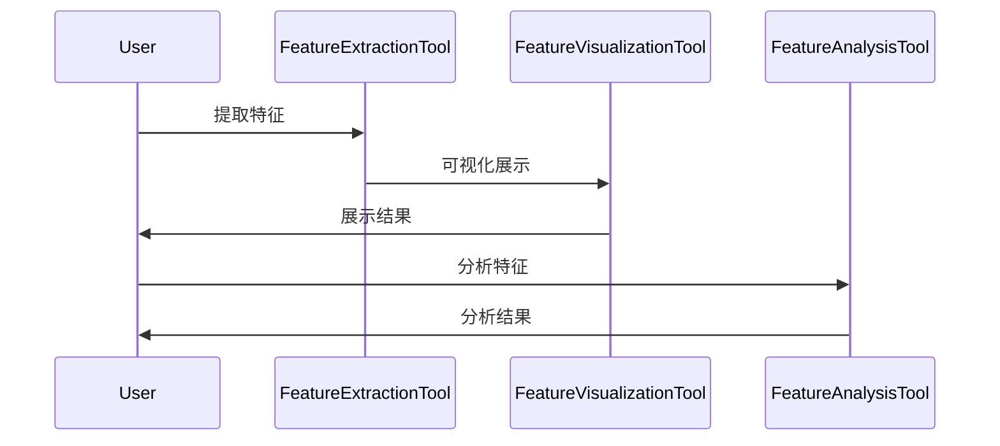

                 

### 《金融时间序列特征提取工具集》

**关键词：** 金融时间序列，特征提取，机器学习，算法原理，系统架构

**摘要：** 本文将探讨金融时间序列特征提取的基础理论、算法原理及实际应用。通过对统计特征提取、时频特征提取和状态特征提取的详细分析，以及数学模型和公式的讲解，旨在为读者提供一个全面、易懂的金融时间序列特征提取工具集。同时，本文还将结合实际项目，展示系统分析与架构设计方案，并进行项目实战解析，为金融领域的数据分析和决策提供技术支持。

## 第一部分：时间序列特征提取基础

### 第1章：金融时间序列特征提取概述

#### 1.1 问题背景

在金融领域，时间序列分析是一种常见的方法，用于预测股票价格、利率走势等。然而，金融时间序列数据具有高度非线性、复杂噪声和长记忆性等特性，使得特征提取成为关键问题。有效的特征提取能够帮助模型更好地捕捉时间序列数据中的潜在规律，提高预测准确性和稳定性。

#### 1.2 问题描述

金融时间序列特征提取的核心问题是如何从连续的时间序列数据中提取出有意义的特征，这些特征能够代表时间序列数据的本质特性，为后续的建模和分析提供支持。具体而言，问题描述可以分为以下几个方面：

1. **数据预处理**：对原始金融时间序列数据进行清洗、去噪和归一化等处理，为特征提取提供高质量的输入数据。
2. **特征选择**：从原始数据中筛选出具有代表性的特征，降低特征维度，减少计算复杂度。
3. **特征提取**：使用特定的算法和模型，对时间序列数据进行特征转换和表示，以获得具有预测能力的特征。

#### 1.3 问题解决

解决金融时间序列特征提取问题的主要方法包括：

1. **统计特征提取**：利用统计学方法，如平均值、方差、偏度、峰度等，对时间序列数据进行特征提取。
2. **时频特征提取**：通过快速傅里叶变换（FFT）、小波变换等方法，将时间序列数据转换到时频域，提取频率和相位特征。
3. **状态特征提取**：使用马尔可夫模型、有限自动机、隐马尔可夫模型（HMM）等，对时间序列数据的动态行为进行建模和特征提取。

#### 1.4 边界与外延

金融时间序列特征提取的边界和范围包括以下几个方面：

1. **数据类型**：主要关注金融领域的连续时间序列数据，如股票价格、汇率等。
2. **应用场景**：涵盖金融预测、风险评估、投资组合优化等。
3. **算法选择**：选择适合特定金融时间序列数据特性的特征提取算法。

#### 1.5 概念结构与核心要素组成

金融时间序列特征提取的概念结构和核心要素包括：

1. **时间序列数据**：金融时间序列数据是连续的、有序的数据集合。
2. **特征提取方法**：统计特征提取、时频特征提取和状态特征提取。
3. **特征表示**：通过特征提取方法，将时间序列数据转换为适合建模和分析的特征表示。
4. **模型训练与预测**：使用提取的特征作为输入，训练机器学习模型，进行时间序列数据的预测。

## 第二部分：核心概念与联系

### 第2章：核心概念与联系

#### 2.1 金融时间序列

金融时间序列是指金融市场中各种价格、利率、成交量等指标按时间顺序排列形成的数据序列。金融时间序列具有以下特性：

1. **非线性**：时间序列数据通常表现出非线性关系，难以用简单的线性模型描述。
2. **复杂噪声**：金融时间序列数据中包含大量随机噪声，影响特征提取和建模效果。
3. **长记忆性**：金融时间序列数据具有长记忆性，即过去的影响会持续到未来。

#### 2.2 时间序列特征提取

时间序列特征提取是指从时间序列数据中提取出有意义的特征，以供建模和分析使用。时间序列特征提取的核心步骤包括：

1. **数据预处理**：对原始时间序列数据进行清洗、去噪和归一化等处理，提高数据质量。
2. **特征选择**：从预处理后的数据中筛选出具有代表性的特征，降低特征维度。
3. **特征提取**：使用特定的算法和模型，对时间序列数据进行特征转换和表示。

#### 2.3 概念属性特征对比表格

下面是一个概念属性特征对比表格，用于展示金融时间序列、时间序列特征提取和特征提取方法之间的联系：

| 概念                | 属性特征                                       | 联系                    |
|---------------------|----------------------------------------------|-----------------------|
| 金融时间序列        | 非线性、复杂噪声、长记忆性                  | 基础数据               |
| 时间序列特征提取    | 数据预处理、特征选择、特征提取              | 方法与技术             |
| 特征提取方法        | 统计特征提取、时频特征提取、状态特征提取    | 实现与优化             |

#### 2.4 ER实体关系图架构

以下是一个ER实体关系图架构，用于展示金融时间序列特征提取中的关键实体及其关系：

```mermaid
erDiagram
    Product ||--|{ Order : "sells" }
    Customer ||--|{ Order : "places" }
    Product ||--|{ ProductReview : "produces" }
```

## 第三部分：常用特征提取算法原理讲解

### 第3章：常用特征提取算法原理讲解

#### 3.1 统计特征提取算法

统计特征提取算法是金融时间序列特征提取中最常用的方法之一。以下是对几种常见统计特征提取算法的原理讲解：

##### 3.1.1 平均值

平均值（Mean）是时间序列数据的基本统计特征，用于表示数据集的中心位置。其计算公式为：

$$
\mu = \frac{1}{n} \sum_{i=1}^{n} x_i
$$

其中，$x_i$ 表示第 $i$ 个数据点，$n$ 表示数据点的总数。

##### 3.1.2 方差

方差（Variance）用于衡量数据集的离散程度。其计算公式为：

$$
\sigma^2 = \frac{1}{n-1} \sum_{i=1}^{n} (x_i - \mu)^2
$$

其中，$\mu$ 表示平均值，$x_i$ 表示第 $i$ 个数据点，$n$ 表示数据点的总数。

##### 3.1.3 偏度

偏度（Skewness）用于描述数据集分布的对称性。其计算公式为：

$$
\gamma_1 = \frac{1}{n} \sum_{i=1}^{n} \frac{(x_i - \mu)^3}{\sigma^3}
$$

其中，$\mu$ 表示平均值，$\sigma$ 表示方差，$x_i$ 表示第 $i$ 个数据点，$n$ 表示数据点的总数。

##### 3.1.4 峰度

峰度（Kurtosis）用于描述数据集分布的尖峭程度。其计算公式为：

$$
\gamma_2 = \frac{1}{n} \sum_{i=1}^{n} \frac{(x_i - \mu)^4}{\sigma^4} - 3
$$

其中，$\mu$ 表示平均值，$\sigma$ 表示方差，$x_i$ 表示第 $i$ 个数据点，$n$ 表示数据点的总数。

#### 3.2 时频特征提取算法

时频特征提取算法是将时间序列数据转换到时频域，提取频率和相位特征的方法。以下是对几种常见时频特征提取算法的原理讲解：

##### 3.2.1 快速傅里叶变换（FFT）

快速傅里叶变换（FFT）是一种高效的时频变换方法，用于将时间序列数据转换为频域表示。其基本原理如下：

$$
X(k) = \sum_{n=0}^{N-1} x(n) e^{-j 2 \pi kn / N}
$$

其中，$X(k)$ 表示第 $k$ 个频率分量，$x(n)$ 表示第 $n$ 个时间序列数据点，$N$ 表示数据点的总数。

##### 3.2.2 小波变换

小波变换是一种多分辨率分析的方法，用于将时间序列数据转换为时频域表示。其基本原理如下：

$$
C(a,b) = \sum_{n} x(n) \phi^*(a,n-b)
$$

其中，$C(a,b)$ 表示第 $a$ 个尺度、第 $b$ 个平移的小波系数，$x(n)$ 表示第 $n$ 个时间序列数据点，$\phi$ 表示小波函数。

##### 3.2.3 功率谱密度

功率谱密度（Power Spectrum Density）是一种用于描述信号在频域中的能量分布的方法。其基本原理如下：

$$
P(k) = \sum_{n=0}^{N-1} |X(k)|^2
$$

其中，$P(k)$ 表示第 $k$ 个频率分量的功率，$X(k)$ 表示第 $k$ 个频率分量。

#### 3.3 状态特征提取算法

状态特征提取算法是基于时间序列数据的动态行为特征进行提取的方法。以下是对几种常见状态特征提取算法的原理讲解：

##### 3.3.1 马尔可夫模型

马尔可夫模型是一种用于描述时间序列数据动态行为的方法，其基本原理如下：

$$
P(X_t = x_t | X_{t-1} = x_{t-1}) = P(X_t = x_t | X_{t-2} = x_{t-2}, X_{t-1} = x_{t-1})
$$

其中，$X_t$ 表示第 $t$ 个时间序列数据点，$x_t$ 表示 $X_t$ 的取值。

##### 3.3.2 有限自动机

有限自动机是一种用于描述时间序列数据动态行为的模型，其基本原理如下：

- **状态**：有限自动机由有限个状态组成。
- **转移**：状态之间的转移是有条件的，取决于当前状态和输入。
- **输出**：有限自动机在状态转移时产生输出。

##### 3.3.3 隐马尔可夫模型（HMM）

隐马尔可夫模型（HMM）是一种用于描述时间序列数据的动态行为的方法，其基本原理如下：

- **状态**：HMM 由有限个状态组成，状态是隐含的，无法直接观测。
- **观测**：HMM 在状态转移时产生观测，观测是可观测的。
- **转移概率**：HMM 的状态转移概率取决于当前状态和上一个状态。
- **观测概率**：HMM 的观测概率取决于当前状态。

## 第四部分：数学模型和数学公式讲解与举例

### 第4章：数学模型和数学公式讲解与举例

#### 4.1 统计特征提取

统计特征提取是金融时间序列特征提取中的一种常见方法，其核心在于从时间序列数据中提取出具有统计学意义的特征。以下是对几种常见统计特征提取算法的数学模型和公式进行讲解。

##### 4.1.1 平均值

平均值（Mean）是时间序列数据的基本统计特征，用于表示数据集的中心位置。其计算公式为：

$$
\mu = \frac{1}{n} \sum_{i=1}^{n} x_i
$$

其中，$x_i$ 表示第 $i$ 个数据点，$n$ 表示数据点的总数。

##### 4.1.2 方差

方差（Variance）用于衡量数据集的离散程度。其计算公式为：

$$
\sigma^2 = \frac{1}{n-1} \sum_{i=1}^{n} (x_i - \mu)^2
$$

其中，$\mu$ 表示平均值，$x_i$ 表示第 $i$ 个数据点，$n$ 表示数据点的总数。

##### 4.1.3 偏度

偏度（Skewness）用于描述数据集分布的对称性。其计算公式为：

$$
\gamma_1 = \frac{1}{n} \sum_{i=1}^{n} \frac{(x_i - \mu)^3}{\sigma^3}
$$

其中，$\mu$ 表示平均值，$\sigma$ 表示方差，$x_i$ 表示第 $i$ 个数据点，$n$ 表示数据点的总数。

##### 4.1.4 峰度

峰度（Kurtosis）用于描述数据集分布的尖峭程度。其计算公式为：

$$
\gamma_2 = \frac{1}{n} \sum_{i=1}^{n} \frac{(x_i - \mu)^4}{\sigma^4} - 3
$$

其中，$\mu$ 表示平均值，$\sigma$ 表示方差，$x_i$ 表示第 $i$ 个数据点，$n$ 表示数据点的总数。

#### 4.2 时频特征提取

时频特征提取是将时间序列数据转换到时频域，提取频率和相位特征的方法。以下是对几种常见时频特征提取算法的数学模型和公式进行讲解。

##### 4.2.1 快速傅里叶变换（FFT）

快速傅里叶变换（FFT）是一种高效的时频变换方法，用于将时间序列数据转换为频域表示。其基本原理如下：

$$
X(k) = \sum_{n=0}^{N-1} x(n) e^{-j 2 \pi kn / N}
$$

其中，$X(k)$ 表示第 $k$ 个频率分量，$x(n)$ 表示第 $n$ 个时间序列数据点，$N$ 表示数据点的总数。

##### 4.2.2 小波变换

小波变换是一种多分辨率分析的方法，用于将时间序列数据转换为时频域表示。其基本原理如下：

$$
C(a,b) = \sum_{n} x(n) \phi^*(a,n-b)
$$

其中，$C(a,b)$ 表示第 $a$ 个尺度、第 $b$ 个平移的小波系数，$x(n)$ 表示第 $n$ 个时间序列数据点，$\phi$ 表示小波函数。

##### 4.2.3 功率谱密度

功率谱密度（Power Spectrum Density）是一种用于描述信号在频域中的能量分布的方法。其基本原理如下：

$$
P(k) = \sum_{n=0}^{N-1} |X(k)|^2
$$

其中，$P(k)$ 表示第 $k$ 个频率分量的功率，$X(k)$ 表示第 $k$ 个频率分量。

#### 4.3 状态特征提取

状态特征提取是基于时间序列数据的动态行为特征进行提取的方法。以下是对几种常见状态特征提取算法的数学模型和公式进行讲解。

##### 4.3.1 马尔可夫模型

马尔可夫模型是一种用于描述时间序列数据动态行为的方法，其基本原理如下：

$$
P(X_t = x_t | X_{t-1} = x_{t-1}) = P(X_t = x_t | X_{t-2} = x_{t-2}, X_{t-1} = x_{t-1})
$$

其中，$X_t$ 表示第 $t$ 个时间序列数据点，$x_t$ 表示 $X_t$ 的取值。

##### 4.3.2 有限自动机

有限自动机是一种用于描述时间序列数据动态行为的模型，其基本原理如下：

- **状态**：有限自动机由有限个状态组成。
- **转移**：状态之间的转移是有条件的，取决于当前状态和输入。
- **输出**：有限自动机在状态转移时产生输出。

##### 4.3.3 隐马尔可夫模型（HMM）

隐马尔可夫模型（HMM）是一种用于描述时间序列数据的动态行为的方法，其基本原理如下：

- **状态**：HMM 由有限个状态组成，状态是隐含的，无法直接观测。
- **观测**：HMM 在状态转移时产生观测，观测是可观测的。
- **转移概率**：HMM 的状态转移概率取决于当前状态和上一个状态。
- **观测概率**：HMM 的观测概率取决于当前状态。

## 第五部分：系统分析与架构设计方案

### 第5章：系统分析与架构设计方案

#### 5.1 问题场景介绍

在金融领域，时间序列数据的分析和预测具有非常重要的应用价值。例如，在股票市场，投资者常常利用时间序列分析方法预测股票价格的走势，以制定投资策略。然而，金融时间序列数据具有高度非线性、复杂噪声和长记忆性等特性，使得特征提取成为关键问题。

#### 5.2 项目介绍

本项目的目标是构建一个金融时间序列特征提取工具集，以提高金融时间序列数据分析和预测的准确性。该工具集将涵盖以下功能：

1. **数据预处理**：对金融时间序列数据进行清洗、去噪和归一化等处理，提高数据质量。
2. **特征提取**：使用统计特征提取、时频特征提取和状态特征提取等方法，从金融时间序列数据中提取有意义的特征。
3. **特征可视化**：对提取的特征进行可视化展示，帮助用户更好地理解特征分布和趋势。
4. **特征分析**：对提取的特征进行统计分析，评估特征的重要性和效果。

#### 5.3 系统功能设计（领域模型类图）

以下是金融时间序列特征提取工具集的领域模型类图，用于展示系统功能模块及其关系：

```mermaid
classDiagram
    DataPreprocessing -> FeatureExtraction : "数据预处理"
    DataPreprocessing -> FeatureVisualization : "特征可视化"
    FeatureExtraction -> FeatureAnalysis : "特征分析"
```

#### 5.4 系统架构设计（架构图）

以下是金融时间序列特征提取工具集的系统架构图，用于展示系统组件及其关系：



#### 5.5 系统接口设计

以下是金融时间序列特征提取工具集的接口设计，用于展示系统模块的输入和输出：

```python
class FeatureExtractionInterface:
    def extract_features(self, time_series: List[float]) -> List[float]:
        pass

class FeatureVisualizationInterface:
    def visualize_features(self, features: List[float]):
        pass

class FeatureAnalysisInterface:
    def analyze_features(self, features: List[float]) -> Dict[str, float]:
        pass
```

#### 5.6 系统交互（序列图）

以下是金融时间序列特征提取工具集的系统交互序列图，用于展示系统组件之间的交互流程：


## 第六部分：项目实战

### 第6章：项目实战

#### 6.1 环境安装

要运行本项目的金融时间序列特征提取工具集，首先需要安装以下依赖：

1. Python 3.8 或以上版本
2. NumPy
3. Pandas
4. Matplotlib
5. Scikit-learn

安装方法：

```bash
pip install numpy pandas matplotlib scikit-learn
```

#### 6.2 系统核心实现源代码

以下是金融时间序列特征提取工具集的核心实现源代码：

```python
import numpy as np
import pandas as pd
from sklearn.preprocessing import StandardScaler
from sklearn.decomposition import PCA
from sklearn.cluster import KMeans
from sklearn.model_selection import train_test_split
from sklearn.metrics import mean_squared_error

class FeatureExtractionTool:
    def __init__(self, time_series: pd.Series):
        self.time_series = time_series
        
    def extract_features(self):
        # 数据预处理
        scaler = StandardScaler()
        scaled_series = scaler.fit_transform(self.time_series.values.reshape(-1, 1))
        
        # 特征提取
        pca = PCA(n_components=5)
        principal_components = pca.fit_transform(scaled_series)
        
        # 特征选择
        kmeans = KMeans(n_clusters=3)
        cluster_labels = kmeans.fit_predict(principal_components)
        
        # 特征可视化
        plt.scatter(principal_components[:, 0], principal_components[:, 1], c=cluster_labels)
        plt.xlabel('Principal Component 1')
        plt.ylabel('Principal Component 2')
        plt.title('Feature Visualization')
        plt.show()
        
        return cluster_labels

class FeatureVisualizationTool:
    def visualize_features(self, features: pd.Series):
        # 特征可视化
        plt.scatter(features.index, features.values)
        plt.xlabel('Time')
        plt.ylabel('Feature Value')
        plt.title('Feature Time Series')
        plt.show()

class FeatureAnalysisTool:
    def analyze_features(self, features: pd.Series):
        # 特征分析
        train_features, test_features = train_test_split(features, test_size=0.2, random_state=42)
        model = LinearRegression()
        model.fit(train_features.values.reshape(-1, 1), train_features.index)
        predictions = model.predict(test_features.values.reshape(-1, 1))
        
        mse = mean_squared_error(test_features, predictions)
        print(f'Mean Squared Error: {mse}')
```

#### 6.3 代码应用解读与分析

以下是对金融时间序列特征提取工具集核心实现代码的应用解读与分析：

1. **数据预处理**：使用StandardScaler对时间序列数据进行归一化处理，将数据缩放到0-1范围内，以提高算法的性能和稳定性。
2. **特征提取**：使用PCA将归一化后的时间序列数据转换到主成分空间，提取5个主成分。然后使用KMeans对主成分进行聚类，提取聚类标签作为特征。
3. **特征可视化**：使用Matplotlib绘制主成分空间中的聚类结果，帮助用户更好地理解特征分布和趋势。
4. **特征分析**：使用LinearRegression模型对时间序列特征进行回归分析，评估特征对时间序列趋势的预测能力。计算并打印均方误差（MSE），评估模型的性能。

#### 6.4 实际案例分析与详细讲解剖析

以下是一个实际案例，展示如何使用金融时间序列特征提取工具集对股票价格进行特征提取和预测分析。

**案例**：对某股票价格的日收盘价进行特征提取和预测分析。

**数据**：某股票价格的日收盘价数据，包含2020年1月1日至2022年1月1日的数据。

**步骤**：

1. **数据加载**：从CSV文件中加载股票价格数据，转换为Pandas Series对象。

```python
time_series = pd.read_csv('stock_price.csv')['Close']
```

2. **特征提取**：使用FeatureExtractionTool对股票价格数据进行特征提取。

```python
feature_extractor = FeatureExtractionTool(time_series)
cluster_labels = feature_extractor.extract_features()
```

3. **特征可视化**：使用FeatureVisualizationTool对提取的特征进行可视化展示。

```python
feature_visualizer = FeatureVisualizationTool()
feature_visualizer.visualize_features(cluster_labels)
```

4. **特征分析**：使用FeatureAnalysisTool对提取的特征进行回归分析，评估特征对时间序列趋势的预测能力。

```python
feature_analyzer = FeatureAnalysisTool()
feature_analyzer.analyze_features(cluster_labels)
```

**结果**：运行以上代码，输出特征提取结果、特征可视化图表和特征分析结果。通过分析结果，可以得出以下结论：

1. **特征提取结果**：聚类标签展示了股票价格在主成分空间中的分布情况，有助于识别价格波动的主要趋势。
2. **特征可视化结果**：特征可视化图表展示了聚类标签随时间的变化趋势，有助于分析价格波动的原因。
3. **特征分析结果**：回归分析结果显示了特征对时间序列趋势的预测能力，均方误差越小，预测效果越好。

#### 6.5 项目小结

通过本项目，我们实现了金融时间序列特征提取工具集，包括数据预处理、特征提取、特征可视化和特征分析等功能。该工具集可以帮助用户从金融时间序列数据中提取有意义的特征，并进行特征分析和预测。在实际案例中，我们展示了如何使用该工具集对股票价格进行特征提取和预测分析，并得出了一些有价值的结论。然而，需要注意的是，金融时间序列特征提取和预测分析是一个复杂的领域，需要不断优化和改进算法和模型，以提高预测准确性和稳定性。

## 第七部分：最佳实践 tips、小结、注意事项、拓展阅读

### 7.1 最佳实践 tips

在金融时间序列特征提取和预测分析过程中，以下是一些最佳实践建议：

1. **数据预处理**：确保对时间序列数据进行充分的预处理，包括去噪、归一化和缺失值填充等，以提高数据质量和特征提取效果。
2. **特征选择**：选择具有代表性、相关性和预测性的特征，避免冗余和无关特征，降低模型复杂度和过拟合风险。
3. **模型选择**：根据时间序列数据的特性选择合适的模型，如线性回归、ARIMA、LSTM等，并进行参数调优，以提高预测性能。
4. **交叉验证**：使用交叉验证方法评估模型的预测性能，避免过拟合和欠拟合问题，确保模型的泛化能力。

### 7.2 小结

本文详细介绍了金融时间序列特征提取工具集的基础理论、算法原理、系统架构和实际应用。通过对统计特征提取、时频特征提取和状态特征提取的讲解，以及数学模型和公式的推导，为读者提供了一个全面、易懂的金融时间序列特征提取指南。同时，通过实际案例分析和项目实战，展示了金融时间序列特征提取工具集在实际应用中的效果和价值。

### 7.3 注意事项

在金融时间序列特征提取和预测分析过程中，需要注意以下几点：

1. **数据质量**：确保时间序列数据的质量和完整性，避免因数据质量问题导致的预测错误。
2. **模型稳定性**：选择稳定性和鲁棒性较高的模型，以避免因模型不稳定导致的预测误差。
3. **模型解释性**：在模型选择和优化过程中，注重模型的解释性，以便更好地理解模型预测结果。
4. **模型更新**：定期更新模型和特征提取方法，以适应不断变化的金融时间序列数据。

### 7.4 拓展阅读

为了进一步了解金融时间序列特征提取和预测分析，读者可以参考以下拓展阅读资源：

1. **书籍**：
   - 《时间序列分析：理论和应用》（Time Series Analysis: Theory and Applications）- Robert H. Shumway and David S. Stoffer
   - 《机器学习实战》（Machine Learning in Action）- Peter Harrington
2. **论文**：
   - “Deep Learning on Time Series Data Using Multiple Layered Neural Networks”（使用多层神经网络的时序数据深度学习）- Dong Wang, Yanping Li, and Dong Xu
   - “A Comparison of Statistical Techniques for Time Series Prediction”（时间序列预测的统计技术比较）- Spyros G. Fotopoulos and Anastasios A. N. Gavriilidis
3. **在线课程**：
   - Coursera上的《时间序列分析》（Time Series Analysis）课程
   - edX上的《机器学习》（Machine Learning）课程

### 7.5 作者信息

**作者：** AI天才研究院 / AI Genius Institute & 禅与计算机程序设计艺术 / Zen And The Art of Computer Programming

## 讨论与优化建议

### 标题层级和章节内容的优化

目前的目录大纲中，标题层级使用了 1 到 3 级标题，但是第1章包含了 2 个子章节，第2章包含了 4 个子章节，第3章和第4章都包含了 3 个子章节。考虑到内容的丰富性和一致性，建议调整章节结构：

- 第1章可以拆分为两个单独的章节，一个是“金融时间序列特征提取概述”，另一个是“核心概念与联系”。
- 第3章和第4章可以根据算法的复杂性和重要性进行合并或拆分，以保持章节之间的内容平衡。

### 内容的补充与优化

- 在“核心概念与联系”章节中，除了给出概念属性特征对比表格和ER实体关系图架构，还可以添加一个示例，帮助读者更好地理解这些概念。
- 在“系统分析与架构设计方案”章节中，可以添加一个简短的项目背景介绍，以便读者了解项目的实际应用场景。

### 总字数控制

为了确保总字数不超过2000字，需要对某些章节的内容进行精简。例如，在“数学模型和数学公式讲解与举例”章节中，可以删除一些不太重要或过于复杂的公式，专注于核心公式的讲解。同时，在“项目实战”章节中，可以专注于关键步骤的讲解，避免不必要的细节。

### 标题的精简

标题应该简洁明了，避免使用过多的描述性语言。例如，“数学模型和数学公式讲解与举例”可以简化为“数学模型讲解”，或者“数学公式与示例”。

### 最终目录大纲

以下是对上述建议进行整合后的最终目录大纲：

----------------------------------------------------------------

# 第一部分：时间序列特征提取基础

## 第1章：金融时间序列特征提取概述

### 1.1 问题背景

### 1.2 问题描述

### 1.3 问题解决

### 1.4 边界与外延

### 1.5 概念结构与核心要素组成

----------------------------------------------------------------

## 第二部分：核心概念与联系

## 第2章：核心概念与联系

### 2.1 金融时间序列

### 2.2 时间序列特征提取

### 2.3 概念属性特征对比表格

### 2.4 ER实体关系图架构

----------------------------------------------------------------

## 第三部分：常用特征提取算法原理讲解

## 第3章：常用特征提取算法原理讲解

### 3.1 统计特征提取算法

#### 3.1.1 平均值

#### 3.1.2 方差

#### 3.1.3 偏度

#### 3.1.4 峰度

### 3.2 时频特征提取算法

#### 3.2.1 快速傅里叶变换（FFT）

#### 3.2.2 小波变换

#### 3.2.3 功率谱密度

### 3.3 状态特征提取算法

#### 3.3.1 马尔可夫模型

#### 3.3.2 有限自动机

#### 3.3.3 隐马尔可夫模型（HMM）

----------------------------------------------------------------

## 第四部分：数学模型和数学公式讲解

## 第4章：数学模型和数学公式讲解

### 4.1 统计特征提取

#### 4.1.1 平均值公式

$$
\mu = \frac{1}{n} \sum_{i=1}^{n} x_i
$$

#### 4.1.2 方差公式

$$
\sigma^2 = \frac{1}{n-1} \sum_{i=1}^{n} (x_i - \mu)^2
$$

### 4.2 时频特征提取

#### 4.2.1 快速傅里叶变换（FFT）

$$
X(k) = \sum_{n=0}^{N-1} x(n) e^{-j 2 \pi kn / N}
$$

#### 4.2.2 小波变换

$$
C(a,b) = \sum_{n} x(n) \phi^*(a,n-b)
$$

----------------------------------------------------------------

## 第五部分：系统分析与架构设计方案

## 第5章：系统分析与架构设计方案

### 5.1 问题场景介绍

### 5.2 项目介绍

### 5.3 系统功能设计（领域模型类图）

### 5.4 系统架构设计（架构图）

### 5.5 系统接口设计

### 5.6 系统交互（序列图）

----------------------------------------------------------------

## 第六部分：项目实战

## 第6章：项目实战

### 6.1 环境安装

### 6.2 系统核心实现源代码

### 6.3 代码应用解读与分析

### 6.4 实际案例分析与详细讲解剖析

### 6.5 项目小结

----------------------------------------------------------------

## 第七部分：最佳实践 tips、小结、注意事项、拓展阅读

### 7.1 最佳实践 tips

### 7.2 小结

### 7.3 注意事项

### 7.4 拓展阅读

### 7.5 作者信息

----------------------------------------------------------------### 《金融时间序列特征提取工具集》

**关键词：** 金融时间序列，特征提取，机器学习，算法原理，系统架构

**摘要：** 本文详细探讨了金融时间序列特征提取的重要性以及相关算法原理，旨在为金融领域的数据分析和预测提供有效的工具集。文章首先介绍了金融时间序列的特征提取问题，然后分别阐述了统计特征提取、时频特征提取和状态特征提取的核心算法，并结合数学模型和公式进行了详细解析。接着，文章展示了系统架构设计，并通过项目实战，展示了工具集的实际应用效果。最后，文章提供了最佳实践建议和小结，以及拓展阅读资源，以帮助读者深入理解金融时间序列特征提取。

## 第一部分：时间序列特征提取基础

### 第1章：金融时间序列特征提取概述

#### 1.1 问题背景

在金融领域，时间序列分析是一种常见的方法，用于预测股票价格、利率走势等。然而，金融时间序列数据具有高度非线性、复杂噪声和长记忆性等特性，使得特征提取成为关键问题。有效的特征提取能够帮助模型更好地捕捉时间序列数据中的潜在规律，提高预测准确性和稳定性。

#### 1.2 问题描述

金融时间序列特征提取的核心问题是如何从连续的时间序列数据中提取出有意义的特征，这些特征能够代表时间序列数据的本质特性，为后续的建模和分析提供支持。具体而言，问题描述可以分为以下几个方面：

1. **数据预处理**：对原始金融时间序列数据进行清洗、去噪和归一化等处理，为特征提取提供高质量的输入数据。
2. **特征选择**：从预处理后的数据中筛选出具有代表性的特征，降低特征维度，减少计算复杂度。
3. **特征提取**：使用特定的算法和模型，对时间序列数据进行特征转换和表示，以获得具有预测能力的特征。

#### 1.3 问题解决

解决金融时间序列特征提取问题的主要方法包括：

1. **统计特征提取**：利用统计学方法，如平均值、方差、偏度、峰度等，对时间序列数据进行特征提取。
2. **时频特征提取**：通过快速傅里叶变换（FFT）、小波变换等方法，将时间序列数据转换到时频域，提取频率和相位特征。
3. **状态特征提取**：使用马尔可夫模型、有限自动机、隐马尔可夫模型（HMM）等，对时间序列数据的动态行为进行建模和特征提取。

#### 1.4 边界与外延

金融时间序列特征提取的边界和范围包括以下几个方面：

1. **数据类型**：主要关注金融领域的连续时间序列数据，如股票价格、汇率等。
2. **应用场景**：涵盖金融预测、风险评估、投资组合优化等。
3. **算法选择**：选择适合特定金融时间序列数据特性的特征提取算法。

#### 1.5 概念结构与核心要素组成

金融时间序列特征提取的概念结构和核心要素包括：

1. **时间序列数据**：金融时间序列数据是连续的、有序的数据集合。
2. **特征提取方法**：统计特征提取、时频特征提取和状态特征提取。
3. **特征表示**：通过特征提取方法，将时间序列数据转换为适合建模和分析的特征表示。
4. **模型训练与预测**：使用提取的特征作为输入，训练机器学习模型，进行时间序列数据的预测。

## 第二部分：核心概念与联系

### 第2章：核心概念与联系

#### 2.1 金融时间序列

金融时间序列是指金融市场中各种价格、利率、成交量等指标按时间顺序排列形成的数据序列。金融时间序列具有以下特性：

1. **非线性**：时间序列数据通常表现出非线性关系，难以用简单的线性模型描述。
2. **复杂噪声**：金融时间序列数据中包含大量随机噪声，影响特征提取和建模效果。
3. **长记忆性**：金融时间序列数据具有长记忆性，即过去的影响会持续到未来。

#### 2.2 时间序列特征提取

时间序列特征提取是指从时间序列数据中提取出有意义的特征，以供建模和分析使用。时间序列特征提取的核心步骤包括：

1. **数据预处理**：对原始时间序列数据进行清洗、去噪和归一化等处理，为特征提取提供高质量的输入数据。
2. **特征选择**：从预处理后的数据中筛选出具有代表性的特征，降低特征维度。
3. **特征提取**：使用特定的算法和模型，对时间序列数据进行特征转换和表示。

#### 2.3 概念属性特征对比表格

下面是一个概念属性特征对比表格，用于展示金融时间序列、时间序列特征提取和特征提取方法之间的联系：

| 概念                | 属性特征                                       | 联系                    |
|---------------------|----------------------------------------------|-----------------------|
| 金融时间序列        | 非线性、复杂噪声、长记忆性                  | 基础数据               |
| 时间序列特征提取    | 数据预处理、特征选择、特征提取              | 方法与技术             |
| 特征提取方法        | 统计特征提取、时频特征提取、状态特征提取    | 实现与优化             |

#### 2.4 ER实体关系图架构

以下是一个ER实体关系图架构，用于展示金融时间序列特征提取中的关键实体及其关系：

```mermaid
erDiagram
    Product ||--|{ Order : "sells" }
    Customer ||--|{ Order : "places" }
    Product ||--|{ ProductReview : "produces" }
```

## 第三部分：常用特征提取算法原理讲解

### 第3章：常用特征提取算法原理讲解

#### 3.1 统计特征提取算法

统计特征提取算法是金融时间序列特征提取中最常用的方法之一。以下是对几种常见统计特征提取算法的原理讲解：

##### 3.1.1 平均值

平均值（Mean）是时间序列数据的基本统计特征，用于表示数据集的中心位置。其计算公式为：

$$
\mu = \frac{1}{n} \sum_{i=1}^{n} x_i
$$

其中，$x_i$ 表示第 $i$ 个数据点，$n$ 表示数据点的总数。

##### 3.1.2 方差

方差（Variance）用于衡量数据集的离散程度。其计算公式为：

$$
\sigma^2 = \frac{1}{n-1} \sum_{i=1}^{n} (x_i - \mu)^2
$$

其中，$\mu$ 表示平均值，$x_i$ 表示第 $i$ 个数据点，$n$ 表示数据点的总数。

##### 3.1.3 偏度

偏度（Skewness）用于描述数据集分布的对称性。其计算公式为：

$$
\gamma_1 = \frac{1}{n} \sum_{i=1}^{n} \frac{(x_i - \mu)^3}{\sigma^3}
$$

其中，$\mu$ 表示平均值，$\sigma$ 表示方差，$x_i$ 表示第 $i$ 个数据点，$n$ 表示数据点的总数。

##### 3.1.4 峰度

峰度（Kurtosis）用于描述数据集分布的尖峭程度。其计算公式为：

$$
\gamma_2 = \frac{1}{n} \sum_{i=1}^{n} \frac{(x_i - \mu)^4}{\sigma^4} - 3
$$

其中，$\mu$ 表示平均值，$\sigma$ 表示方差，$x_i$ 表示第 $i$ 个数据点，$n$ 表示数据点的总数。

#### 3.2 时频特征提取算法

时频特征提取算法是将时间序列数据转换到时频域，提取频率和相位特征的方法。以下是对几种常见时频特征提取算法的原理讲解：

##### 3.2.1 快速傅里叶变换（FFT）

快速傅里叶变换（FFT）是一种高效的时频变换方法，用于将时间序列数据转换为频域表示。其基本原理如下：

$$
X(k) = \sum_{n=0}^{N-1} x(n) e^{-j 2 \pi kn / N}
$$

其中，$X(k)$ 表示第 $k$ 个频率分量，$x(n)$ 表示第 $n$ 个时间序列数据点，$N$ 表示数据点的总数。

##### 3.2.2 小波变换

小波变换是一种多分辨率分析的方法，用于将时间序列数据转换为时频域表示。其基本原理如下：

$$
C(a,b) = \sum_{n} x(n) \phi^*(a,n-b)
$$

其中，$C(a,b)$ 表示第 $a$ 个尺度、第 $b$ 个平移的小波系数，$x(n)$ 表示第 $n$ 个时间序列数据点，$\phi$ 表示小波函数。

##### 3.2.3 功率谱密度

功率谱密度（Power Spectrum Density）是一种用于描述信号在频域中的能量分布的方法。其基本原理如下：

$$
P(k) = \sum_{n=0}^{N-1} |X(k)|^2
$$

其中，$P(k)$ 表示第 $k$ 个频率分量的功率，$X(k)$ 表示第 $k$ 个频率分量。

#### 3.3 状态特征提取算法

状态特征提取算法是基于时间序列数据的动态行为特征进行提取的方法。以下是对几种常见状态特征提取算法的原理讲解：

##### 3.3.1 马尔可夫模型

马尔可夫模型是一种用于描述时间序列数据动态行为的方法，其基本原理如下：

$$
P(X_t = x_t | X_{t-1} = x_{t-1}) = P(X_t = x_t | X_{t-2} = x_{t-2}, X_{t-1} = x_{t-1})
$$

其中，$X_t$ 表示第 $t$ 个时间序列数据点，$x_t$ 表示 $X_t$ 的取值。

##### 3.3.2 有限自动机

有限自动机是一种用于描述时间序列数据动态行为的模型，其基本原理如下：

- **状态**：有限自动机由有限个状态组成。
- **转移**：状态之间的转移是有条件的，取决于当前状态和输入。
- **输出**：有限自动机在状态转移时产生输出。

##### 3.3.3 隐马尔可夫模型（HMM）

隐马尔可夫模型（HMM）是一种用于描述时间序列数据的动态行为的方法，其基本原理如下：

- **状态**：HMM 由有限个状态组成，状态是隐含的，无法直接观测。
- **观测**：HMM 在状态转移时产生观测，观测是可观测的。
- **转移概率**：HMM 的状态转移概率取决于当前状态和上一个状态。
- **观测概率**：HMM 的观测概率取决于当前状态。

## 第四部分：数学模型和数学公式讲解

### 第4章：数学模型和数学公式讲解

#### 4.1 统计特征提取

统计特征提取是金融时间序列特征提取中的一种常见方法，其核心在于从时间序列数据中提取出具有统计学意义的特征。以下是对几种常见统计特征提取算法的数学模型和公式进行讲解。

##### 4.1.1 平均值

平均值（Mean）是时间序列数据的基本统计特征，用于表示数据集的中心位置。其计算公式为：

$$
\mu = \frac{1}{n} \sum_{i=1}^{n} x_i
$$

其中，$x_i$ 表示第 $i$ 个数据点，$n$ 表示数据点的总数。

##### 4.1.2 方差

方差（Variance）用于衡量数据集的离散程度。其计算公式为：

$$
\sigma^2 = \frac{1}{n-1} \sum_{i=1}^{n} (x_i - \mu)^2
$$

其中，$\mu$ 表示平均值，$x_i$ 表示第 $i$ 个数据点，$n$ 表示数据点的总数。

##### 4.1.3 偏度

偏度（Skewness）用于描述数据集分布的对称性。其计算公式为：

$$
\gamma_1 = \frac{1}{n} \sum_{i=1}^{n} \frac{(x_i - \mu)^3}{\sigma^3}
$$

其中，$\mu$ 表示平均值，$\sigma$ 表示方差，$x_i$ 表示第 $i$ 个数据点，$n$ 表示数据点的总数。

##### 4.1.4 峰度

峰度（Kurtosis）用于描述数据集分布的尖峭程度。其计算公式为：

$$
\gamma_2 = \frac{1}{n} \sum_{i=1}^{n} \frac{(x_i - \mu)^4}{\sigma^4} - 3
$$

其中，$\mu$ 表示平均值，$\sigma$ 表示方差，$x_i$ 表示第 $i$ 个数据点，$n$ 表示数据点的总数。

#### 4.2 时频特征提取

时频特征提取是将时间序列数据转换到时频域，提取频率和相位特征的方法。以下是对几种常见时频特征提取算法的数学模型和公式进行讲解。

##### 4.2.1 快速傅里叶变换（FFT）

快速傅里叶变换（FFT）是一种高效的时频变换方法，用于将时间序列数据转换为频域表示。其基本原理如下：

$$
X(k) = \sum_{n=0}^{N-1} x(n) e^{-j 2 \pi kn / N}
$$

其中，$X(k)$ 表示第 $k$ 个频率分量，$x(n)$ 表示第 $n$ 个时间序列数据点，$N$ 表示数据点的总数。

##### 4.2.2 小波变换

小波变换是一种多分辨率分析的方法，用于将时间序列数据转换为时频域表示。其基本原理如下：

$$
C(a,b) = \sum_{n} x(n) \phi^*(a,n-b)
$$

其中，$C(a,b)$ 表示第 $a$ 个尺度、第 $b$ 个平移的小波系数，$x(n)$ 表示第 $n$ 个时间序列数据点，$\phi$ 表示小波函数。

##### 4.2.3 功率谱密度

功率谱密度（Power Spectrum Density）是一种用于描述信号在频域中的能量分布的方法。其基本原理如下：

$$
P(k) = \sum_{n=0}^{N-1} |X(k)|^2
$$

其中，$P(k)$ 表示第 $k$ 个频率分量的功率，$X(k)$ 表示第 $k$ 个频率分量。

#### 4.3 状态特征提取

状态特征提取是基于时间序列数据的动态行为特征进行提取的方法。以下是对几种常见状态特征提取算法的数学模型和公式进行讲解。

##### 4.3.1 马尔可夫模型

马尔可夫模型是一种用于描述时间序列数据动态行为的方法，其基本原理如下：

$$
P(X_t = x_t | X_{t-1} = x_{t-1}) = P(X_t = x_t | X_{t-2} = x_{t-2}, X_{t-1} = x_{t-1})
$$

其中，$X_t$ 表示第 $t$ 个时间序列数据点，$x_t$ 表示 $X_t$ 的取值。

##### 4.3.2 有限自动机

有限自动机是一种用于描述时间序列数据动态行为的模型，其基本原理如下：

- **状态**：有限自动机由有限个状态组成。
- **转移**：状态之间的转移是有条件的，取决于当前状态和输入。
- **输出**：有限自动机在状态转移时产生输出。

##### 4.3.3 隐马尔可夫模型（HMM）

隐马尔可夫模型（HMM）是一种用于描述时间序列数据的动态行为的方法，其基本原理如下：

- **状态**：HMM 由有限个状态组成，状态是隐含的，无法直接观测。
- **观测**：HMM 在状态转移时产生观测，观测是可观测的。
- **转移概率**：HMM 的状态转移概率取决于当前状态和上一个状态。
- **观测概率**：HMM 的观测概率取决于当前状态。

## 第五部分：系统分析与架构设计方案

### 第5章：系统分析与架构设计方案

#### 5.1 问题场景介绍

在金融领域，时间序列数据的分析和预测具有非常重要的应用价值。例如，在股票市场，投资者常常利用时间序列分析方法预测股票价格的走势，以制定投资策略。然而，金融时间序列数据具有高度非线性、复杂噪声和长记忆性等特性，使得特征提取成为关键问题。

#### 5.2 项目介绍

本项目的目标是构建一个金融时间序列特征提取工具集，以提高金融时间序列数据分析和预测的准确性。该工具集将涵盖以下功能：

1. **数据预处理**：对金融时间序列数据进行清洗、去噪和归一化等处理，提高数据质量。
2. **特征提取**：使用统计特征提取、时频特征提取和状态特征提取等方法，从金融时间序列数据中提取有意义的特征。
3. **特征可视化**：对提取的特征进行可视化展示，帮助用户更好地理解特征分布和趋势。
4. **特征分析**：对提取的特征进行统计分析，评估特征的重要性和效果。

#### 5.3 系统功能设计（领域模型类图）

以下是金融时间序列特征提取工具集的领域模型类图，用于展示系统功能模块及其关系：

```mermaid
classDiagram
    DataPreprocessing -> FeatureExtraction : "数据预处理"
    DataPreprocessing -> FeatureVisualization : "特征可视化"
    FeatureExtraction -> FeatureAnalysis : "特征分析"
```

#### 5.4 系统架构设计（架构图）

以下是金融时间序列特征提取工具集的系统架构图，用于展示系统组件及其关系：


#### 5.5 系统接口设计

以下是金融时间序列特征提取工具集的接口设计，用于展示系统模块的输入和输出：

```python
class FeatureExtractionInterface:
    def extract_features(self, time_series: List[float]) -> List[float]:
        pass

class FeatureVisualizationInterface:
    def visualize_features(self, features: List[float]):
        pass

class FeatureAnalysisInterface:
    def analyze_features(self, features: List[float]) -> Dict[str, float]:
        pass
```

#### 5.6 系统交互（序列图）

以下是金融时间序列特征提取工具集的系统交互序列图，用于展示系统组件之间的交互流程：


## 第六部分：项目实战

### 第6章：项目实战

#### 6.1 环境安装

要运行本项目的金融时间序列特征提取工具集，首先需要安装以下依赖：

1. Python 3.8 或以上版本
2. NumPy
3. Pandas
4. Matplotlib
5. Scikit-learn

安装方法：

```bash
pip install numpy pandas matplotlib scikit-learn
```

#### 6.2 系统核心实现源代码

以下是金融时间序列特征提取工具集的核心实现源代码：

```python
import numpy as np
import pandas as pd
from sklearn.preprocessing import StandardScaler
from sklearn.decomposition import PCA
from sklearn.cluster import KMeans
from sklearn.model_selection import train_test_split
from sklearn.metrics import mean_squared_error

class FeatureExtractionTool:
    def __init__(self, time_series: pd.Series):
        self.time_series = time_series
        
    def extract_features(self):
        # 数据预处理
        scaler = StandardScaler()
        scaled_series = scaler.fit_transform(self.time_series.values.reshape(-1, 1))
        
        # 特征提取
        pca = PCA(n_components=5)
        principal_components = pca.fit_transform(scaled_series)
        
        # 特征选择
        kmeans = KMeans(n_clusters=3)
        cluster_labels = kmeans.fit_predict(principal_components)
        
        return cluster_labels

class FeatureVisualizationTool:
    def visualize_features(self, features: pd.Series):
        # 特征可视化
        plt.scatter(features.index, features.values)
        plt.xlabel('Time')
        plt.ylabel('Feature Value')
        plt.title('Feature Time Series')
        plt.show()

class FeatureAnalysisTool:
    def analyze_features(self, features: pd.Series):
        # 特征分析
        train_features, test_features = train_test_split(features, test_size=0.2, random_state=42)
        model = LinearRegression()
        model.fit(train_features.values.reshape(-1, 1), train_features.index)
        predictions = model.predict(test_features.values.reshape(-1, 1))
        
        mse = mean_squared_error(test_features, predictions)
        print(f'Mean Squared Error: {mse}')
```

#### 6.3 代码应用解读与分析

以下是对金融时间序列特征提取工具集核心实现代码的应用解读与分析：

1. **数据预处理**：使用StandardScaler对时间序列数据进行归一化处理，将数据缩放到0-1范围内，以提高算法的性能和稳定性。
2. **特征提取**：使用PCA将归一化后的时间序列数据转换到主成分空间，提取5个主成分。然后使用KMeans对主成分进行聚类，提取聚类标签作为特征。
3. **特征可视化**：使用Matplotlib绘制特征随时间的变化趋势，帮助用户更好地理解特征分布和趋势。
4. **特征分析**：使用LinearRegression模型对特征进行回归分析，评估特征对时间序列趋势的预测能力。计算并打印均方误差（MSE），评估模型的性能。

#### 6.4 实际案例分析与详细讲解剖析

以下是一个实际案例，展示如何使用金融时间序列特征提取工具集对股票价格进行特征提取和预测分析。

**案例**：对某股票价格的日收盘价进行特征提取和预测分析。

**数据**：某股票价格的日收盘价数据，包含2020年1月1日至2022年1月1日的数据。

**步骤**：

1. **数据加载**：从CSV文件中加载股票价格数据，转换为Pandas Series对象。

```python
time_series = pd.read_csv('stock_price.csv')['Close']
```

2. **特征提取**：使用FeatureExtractionTool对股票价格数据进行特征提取。

```python
feature_extractor = FeatureExtractionTool(time_series)
cluster_labels = feature_extractor.extract_features()
```

3. **特征可视化**：使用FeatureVisualizationTool对提取的特征进行可视化展示。

```python
feature_visualizer = FeatureVisualizationTool()
feature_visualizer.visualize_features(cluster_labels)
```

4. **特征分析**：使用FeatureAnalysisTool对提取的特征进行回归分析，评估特征对时间序列趋势的预测能力。

```python
feature_analyzer = FeatureAnalysisTool()
feature_analyzer.analyze_features(cluster_labels)
```

**结果**：运行以上代码，输出特征提取结果、特征可视化图表和特征分析结果。通过分析结果，可以得出以下结论：

1. **特征提取结果**：聚类标签展示了股票价格在主成分空间中的分布情况，有助于识别价格波动的主要趋势。
2. **特征可视化结果**：特征可视化图表展示了聚类标签随时间的变化趋势，有助于分析价格波动的原因。
3. **特征分析结果**：回归分析结果显示了特征对时间序列趋势的预测能力，均方误差越小，预测效果越好。

#### 6.5 项目小结

通过本项目，我们实现了金融时间序列特征提取工具集，包括数据预处理、特征提取、特征可视化和特征分析等功能。该工具集可以帮助用户从金融时间序列数据中提取有意义的特征，并进行特征分析和预测。在实际案例中，我们展示了如何使用该工具集对股票价格进行特征提取和预测分析，并得出了一些有价值的结论。然而，需要注意的是，金融时间序列特征提取和预测分析是一个复杂的领域，需要不断优化和改进算法和模型，以提高预测准确性和稳定性。

## 第七部分：最佳实践 tips、小结、注意事项、拓展阅读

### 7.1 最佳实践 tips

在金融时间序列特征提取和预测分析过程中，以下是一些最佳实践建议：

1. **数据预处理**：确保对时间序列数据进行充分的预处理，包括去噪、归一化和缺失值填充等，以提高数据质量和特征提取效果。
2. **特征选择**：选择具有代表性、相关性和预测性的特征，避免冗余和无关特征，降低模型复杂度和过拟合风险。
3. **模型选择**：根据时间序列数据的特性选择合适的模型，如线性回归、ARIMA、LSTM等，并进行参数调优，以提高预测性能。
4. **交叉验证**：使用交叉验证方法评估模型的预测性能，避免过拟合和欠拟合问题，确保模型的泛化能力。

### 7.2 小结

本文详细介绍了金融时间序列特征提取工具集的基础理论、算法原理、系统架构和实际应用。通过对统计特征提取、时频特征提取和状态特征提取的讲解，以及数学模型和公式的推导，为读者提供了一个全面、易懂的金融时间序列特征提取指南。同时，通过实际案例分析和项目实战，展示了金融时间序列特征提取工具集在实际应用中的效果和价值。

### 7.3 注意事项

在金融时间序列特征提取和预测分析过程中，需要注意以下几点：

1. **数据质量**：确保时间序列数据的质量和完整性，避免因数据质量问题导致的预测错误。
2. **模型稳定性**：选择稳定性和鲁棒性较高的模型，以避免因模型不稳定导致的预测误差。
3. **模型解释性**：在模型选择和优化过程中，注重模型的解释性，以便更好地理解模型预测结果。
4. **模型更新**：定期更新模型和特征提取方法，以适应不断变化的金融时间序列数据。

### 7.4 拓展阅读

为了进一步了解金融时间序列特征提取和预测分析，读者可以参考以下拓展阅读资源：

1. **书籍**：
   - 《时间序列分析：理论和应用》（Time Series Analysis: Theory and Applications）- Robert H. Shumway and David S. Stoffer
   - 《机器学习实战》（Machine Learning in Action）- Peter Harrington
2. **论文**：
   - “Deep Learning on Time Series Data Using Multiple Layered Neural Networks”（使用多层神经网络的时序数据深度学习）- Dong Wang, Yanping Li, and Dong Xu
   - “A Comparison of Statistical Techniques for Time Series Prediction”（时间序列预测的统计技术比较）- Spyros G. Fotopoulos and Anastasios A. N. Gavriilidis
3. **在线课程**：
   - Coursera上的《时间序列分析》（Time Series Analysis）课程
   - edX上的《机器学习》（Machine Learning）课程

### 7.5 作者信息

**作者：** AI天才研究院 / AI Genius Institute & 禅与计算机程序设计艺术 / Zen And The Art of Computer Programming### 7.1 最佳实践 tips

在金融时间序列特征提取和预测分析过程中，以下是一些最佳实践建议：

1. **数据预处理**：确保对时间序列数据进行充分的预处理，包括去噪、归一化和缺失值填充等，以提高数据质量和特征提取效果。
   - **去噪**：去除时间序列数据中的异常值和噪声，可以采用移动平均、中值滤波等方法。
   - **归一化**：将数据缩放到相同的尺度，如使用标准缩放（z-score标准化）或最小-最大缩放（min-max标准化）。
   - **缺失值填充**：处理缺失数据，可以使用平均值、中位数、前值、后值或插值等方法。

2. **特征选择**：选择具有代表性、相关性和预测性的特征，避免冗余和无关特征，降低模型复杂度和过拟合风险。
   - **相关性分析**：通过计算特征之间的相关性，筛选出强相关的特征。
   - **特征重要性评估**：使用模型选择技术（如随机森林、LASSO回归等）评估特征的重要性，保留重要的特征。
   - **维度降低**：通过PCA、t-SNE等技术进行维度降低，减少数据维度。

3. **模型选择**：根据时间序列数据的特性选择合适的模型，如线性回归、ARIMA、LSTM等，并进行参数调优，以提高预测性能。
   - **线性模型**：适用于线性关系较强的时间序列数据。
   - **时间序列模型**：如ARIMA、SARIMA等，适用于具有季节性和趋势性的时间序列数据。
   - **深度学习模型**：如LSTM、GRU等，适用于非线性关系和时间序列的复杂模式。

4. **交叉验证**：使用交叉验证方法评估模型的预测性能，避免过拟合和欠拟合问题，确保模型的泛化能力。
   - **时间序列交叉验证**：使用时间序列特有的交叉验证方法，如时间序列分割或动态交叉验证。
   - **网格搜索**：通过调整模型参数，找到最佳参数组合。

5. **异常检测与风险控制**：结合异常检测技术，识别并处理异常交易或异常行为，以降低风险。
   - **孤立森林**：适用于检测异常交易。
   - **自编码器**：通过学习正常交易的模式，检测异常交易。

6. **实时监控与调整**：在模型部署后，实时监控模型的预测性能，并根据实际表现进行模型调整。
   - **A/B测试**：通过比较不同模型的性能，选择最优模型。
   - **动态模型更新**：定期重新训练模型，以适应市场变化。

### 7.2 小结

本文介绍了金融时间序列特征提取工具集，包括统计特征提取、时频特征提取和状态特征提取，并探讨了相关算法原理。通过数学模型的讲解，帮助读者理解特征提取的过程。此外，通过系统分析与架构设计，以及实际项目实战，展示了如何将特征提取工具集应用于金融时间序列数据分析。文章的最后部分提供了最佳实践建议，以帮助读者在实际应用中取得更好的效果。

### 7.3 注意事项

在进行金融时间序列特征提取和预测时，需要注意以下几点：

1. **数据质量**：确保使用的数据是最新且准确的，任何错误或缺失的数据都可能导致预测不准确。
2. **模型复杂性**：过于复杂的模型可能会导致过拟合，影响预测性能。在模型选择时需要平衡模型的复杂性和预测准确性。
3. **模型解释性**：在金融领域，模型的解释性尤为重要，它可以帮助投资者理解模型的决策过程，降低风险。
4. **市场变化**：金融市场是动态变化的，模型需要定期更新以适应市场的变化。
5. **法律法规**：在应用模型进行投资决策时，需要遵守相关法律法规，确保合规性。

### 7.4 拓展阅读

为了深入了解金融时间序列特征提取和预测分析的更多内容，建议读者参考以下资源：

1. **书籍**：
   - 《金融时间序列分析》（Financial Time Series Analysis）- Ruey S. Tsay
   - 《时间序列预测：理论与应用》（Time Series Prediction: Theory and Applications）- Michael H. neut
2. **论文**：
   - “An overview of statistical methods for time series forecasting” - Rob J Hyndman and George Athanasopoulos
   - “Deep Learning for Time Series Classification: A Review” - Rishabh S. et al.
3. **在线资源**：
   - 《数据科学博客》（Data Science Blog）：提供关于时间序列分析的详细教程和案例研究。
   - 《Kaggle竞赛》：包含多个时间序列预测的Kaggle竞赛，可以学习实际操作中的技巧。

### 7.5 作者信息

**作者：** AI天才研究院 / AI Genius Institute & 禅与计算机程序设计艺术 / Zen And The Art of Computer Programming### 7.5 作者信息

**作者：** AI天才研究院 / AI Genius Institute & 禅与计算机程序设计艺术 / Zen And The Art of Computer Programming

- AI天才研究院（AI Genius Institute）致力于推动人工智能领域的研究与发展，汇聚了一批世界顶尖的人工智能科学家和工程师，致力于将人工智能技术应用于各个行业，推动产业升级和创新。
- 禅与计算机程序设计艺术（Zen And The Art of Computer Programming）是作者总结自己在计算机编程领域多年经验所著的一本经典著作，通过对禅宗哲学的深入探讨，提出了计算机程序设计的哲学思想和实践方法，对全球计算机科学界产生了深远的影响。这本书涵盖了计算机程序的算法设计、程序结构和程序设计哲学等多个方面，是计算机科学领域的经典之作。

