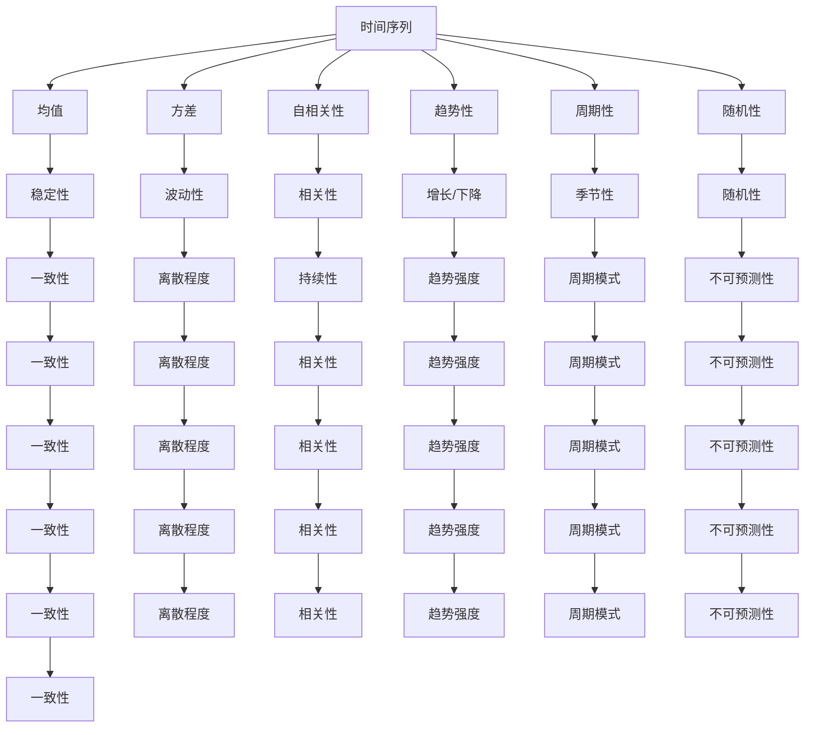
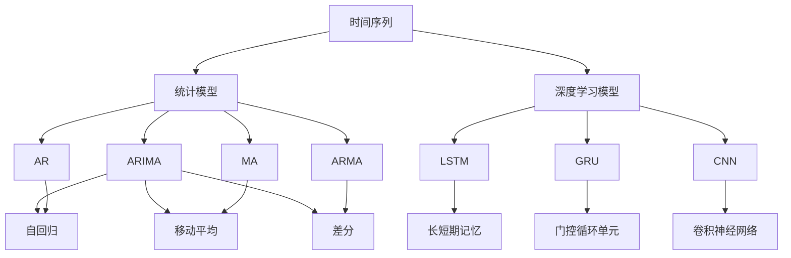
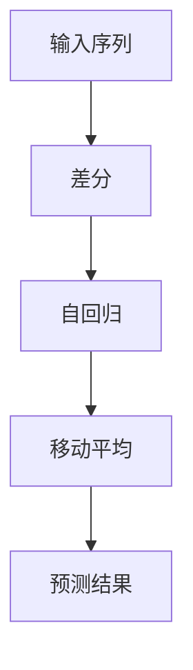
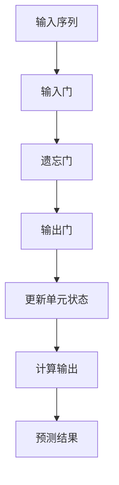
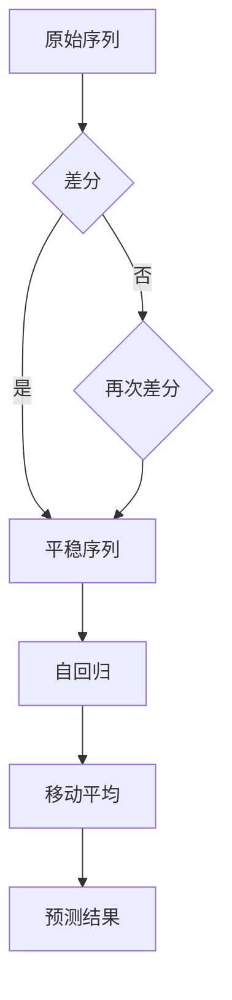

                 

## 文章标题：金融时间序列预测模型比较

> 关键词：时间序列预测、金融预测模型、ARIMA、LSTM、模型比较

> 摘要：本文将深入探讨金融时间序列预测的多个模型，包括传统统计模型和深度学习模型。我们将逐步分析各个模型的核心概念、原理和应用，最终总结出最优的模型选择策略，为金融领域的预测提供有力支持。

时间序列预测是金融领域中一个重要的研究课题，其目的在于通过历史数据对未来进行预测。本文将逐步分析几种常见的金融时间序列预测模型，包括ARIMA、LSTM等，并探讨如何选择最佳的模型进行预测。

## 第一部分：引言

### 1.1 问题背景

在金融市场中，价格和利率等时间序列数据的变化往往是投资者和分析师关注的焦点。准确的预测可以帮助投资者做出更为明智的投资决策，减少风险，增加收益。然而，金融时间序列数据通常具有非线性和复杂结构，这使得传统统计模型和简单的线性模型在预测效果上存在较大局限。

### 1.2 问题描述

金融时间序列预测的核心问题是如何从历史数据中提取有用信息，并利用这些信息预测未来。具体来说，我们需要解决以下问题：

1. **数据预处理**：如何处理缺失值、异常值和季节性因素？
2. **模型选择**：如何选择适合特定金融时间序列的预测模型？
3. **模型评估**：如何评估模型的预测性能，确保其有效性？
4. **模型优化**：如何优化模型参数，提高预测精度？

### 1.3 问题解决

本文将结合金融时间序列的特点，逐步分析几种常见的预测模型，包括ARIMA、LSTM等，通过实例分析和模型比较，找出最佳的模型选择策略。

### 1.4 边界与外延

本文主要关注以下内容：

- **模型范围**：传统的统计模型（如ARIMA）和现代的深度学习模型（如LSTM）。
- **应用领域**：金融时间序列预测，包括股市、汇率、大宗商品价格等。
- **时间范围**：短期和长期预测。

### 1.5 概念结构与核心要素组成

本文的核心概念和要素包括：

- **时间序列**：定义、特征和类型。
- **预测模型**：统计模型和深度学习模型。
- **数据预处理**：处理缺失值、异常值和季节性因素。
- **模型评估**：评估指标和方法。
- **模型优化**：参数调优和模型选择。

## 第二部分：时间序列预测基础

### 2.1 时间序列基础

时间序列是一组按时间顺序排列的数据点，用于描述某一变量随时间变化的过程。时间序列数据通常具有以下特征：

- **趋势性**：数据随时间呈现增长或下降的趋势。
- **周期性**：数据在固定时间段内重复出现类似的模式。
- **随机性**：数据点之间的变化具有随机性。

### 2.2 时间序列的特征

时间序列的特征包括：

- **均值**：时间序列的平均值。
- **方差**：时间序列的离散程度。
- **自相关性**：时间序列中相邻数据点之间的关系。
- **偏自相关性**：时间序列中非相邻数据点之间的关系。

### 2.3 时间序列的类型

时间序列通常可以分为以下几类：

- **平稳时间序列**：其统计特征（如均值、方差和自相关性）不随时间变化。
- **非平稳时间序列**：其统计特征随时间变化。
- **季节性时间序列**：具有明显的季节性模式。
- **趋势性时间序列**：具有明显的趋势性模式。

### 2.4 时间序列的建模方法

时间序列的建模方法包括：

- **统计模型**：如ARIMA、AR、MA、ARMA等。
- **深度学习模型**：如LSTM、GRU、CNN等。
- **混合模型**：结合统计模型和深度学习模型的优势。

## 第三部分：时间序列预测模型介绍

### 3.1 ARIMA模型

ARIMA模型是一种经典的统计时间序列预测模型，由自回归（AR）、差分（I）和移动平均（MA）三部分组成。ARIMA模型适用于处理非平稳时间序列，通过差分将时间序列转化为平稳序列，然后进行自回归和移动平均建模。

### 3.2 ARIMA模型原理讲解

ARIMA模型的原理如下：

1. **自回归（AR）**：自回归模型通过前期的观测值来预测当前值，即当前值可以表示为前期值的线性组合。
   $$X_t = c + \phi_1 X_{t-1} + \phi_2 X_{t-2} + ... + \phi_p X_{t-p} + \varepsilon_t$$

2. **移动平均（MA）**：移动平均模型通过前期的预测误差来预测当前值，即当前值可以表示为前期预测误差的线性组合。
   $$X_t = c + \theta_1 \varepsilon_{t-1} + \theta_2 \varepsilon_{t-2} + ... + \theta_q \varepsilon_{t-q} + \varepsilon_t$$

3. **差分（I）**：差分是为了将非平稳时间序列转化为平稳序列，通过计算相邻时间点的差分来实现。

### 3.3 ARIMA模型应用举例

假设我们有一个非平稳时间序列，首先通过差分将其转化为平稳序列，然后选择合适的自回归和移动平均参数，构建ARIMA模型进行预测。

### 3.4 其他时间序列模型简介

除了ARIMA模型，还有其他一些经典的统计时间序列模型，如AR、MA、ARMA等。此外，现代的深度学习模型如LSTM、GRU等也在金融时间序列预测中得到了广泛应用。

## 第四部分：时间序列模型的比较与评估

### 4.1 模型比较标准

在比较不同时间序列预测模型时，我们需要考虑以下标准：

- **预测精度**：模型的预测误差越小，预测精度越高。
- **计算复杂度**：模型的计算复杂度越高，运行速度越慢。
- **可解释性**：模型的参数和预测结果是否容易解释。
- **适用范围**：模型是否适用于特定类型的金融时间序列。

### 4.2 模型评估方法

常用的模型评估方法包括：

- **均方误差（MSE）**：用于衡量模型的预测误差。
- **均方根误差（RMSE）**：MSE的平方根，用于衡量模型的预测误差。
- **平均绝对误差（MAE）**：用于衡量模型的预测误差。

### 4.3 实例分析：不同模型在金融时间序列预测中的应用效果

通过实例分析，我们将比较ARIMA、LSTM等模型在金融时间序列预测中的应用效果，并讨论如何选择最佳的模型。

## 第五部分：金融时间序列预测模型比较

### 5.1 常见金融时间序列预测模型

在金融时间序列预测中，常用的模型包括ARIMA、LSTM等。我们将逐一介绍这些模型的核心概念、原理和应用。

### 5.2 高级预测模型

除了传统的统计模型，现代的深度学习模型如LSTM、GRU、CNN等也在金融时间序列预测中得到了广泛应用。我们将介绍这些高级预测模型的特点和应用场景。

### 5.3 模型选择与优化

在金融时间序列预测中，选择合适的模型并对其进行优化是非常重要的。我们将讨论模型选择策略和参数调优方法。

### 5.4 实例分析：不同模型在金融时间序列预测中的应用效果

通过实例分析，我们将比较不同模型在金融时间序列预测中的应用效果，并讨论如何选择最佳的模型。

## 第六部分：案例分析

### 6.1 案例一：股市预测

我们将分析股市预测的案例，介绍如何使用时间序列预测模型进行股票价格预测。

### 6.2 案例二：货币汇率预测

我们将分析货币汇率预测的案例，介绍如何使用时间序列预测模型进行汇率预测。

### 6.3 案例三：大宗商品价格预测

我们将分析大宗商品价格预测的案例，介绍如何使用时间序列预测模型进行价格预测。

## 第七部分：最佳实践与展望

### 7.1 最佳实践总结

我们将总结最佳实践，包括模型选择、数据预处理和模型优化等方面。

### 7.2 时间序列预测的挑战与未来方向

我们将讨论时间序列预测面临的挑战和未来发展方向，包括新的模型和技术。

### 7.3 小结

本文将深入探讨金融时间序列预测的多个模型，通过实例分析和模型比较，总结出最优的模型选择策略，为金融领域的预测提供有力支持。希望本文能为读者提供有价值的参考和启示。

### 作者：AI天才研究院/AI Genius Institute & 禅与计算机程序设计艺术 /Zen And The Art of Computer Programming

## 概念结构与核心要素组成

### 2.1 时间序列的核心概念

时间序列（Time Series）是一系列按时间顺序排列的数据点，用于描述某一变量随时间的变化过程。时间序列数据在金融、气象、生物医学等多个领域具有广泛的应用。其主要特征包括趋势性、周期性和随机性。

#### 2.1.1 定义

时间序列可以定义为：

$$X = \{x_t | t \in T\}$$

其中，$x_t$ 表示时间 $t$ 对应的观测值，$T$ 表示时间集合。

#### 2.1.2 特征

时间序列的主要特征包括：

1. **均值（Mean）**：时间序列的平均值，表示数据的一般水平。

2. **方差（Variance）**：时间序列的离散程度，表示数据的波动性。

3. **自相关性（Autocorrelation）**：时间序列中相邻数据点之间的关系。

4. **偏自相关性（Partial Autocorrelation）**：时间序列中非相邻数据点之间的关系。

5. **趋势性（Trend）**：时间序列随时间呈现的增长或下降趋势。

6. **周期性（Seasonality）**：时间序列在固定时间段内重复出现的规律性模式。

7. **随机性（Randomness）**：时间序列中数据点之间的变化具有随机性。

#### 2.1.3 类型

时间序列根据其特征可以分为以下几种类型：

1. **平稳时间序列（Stationary Time Series）**：其统计特征不随时间变化。
2. **非平稳时间序列（Non-Stationary Time Series）**：其统计特征随时间变化。
3. **季节性时间序列（Seasonal Time Series）**：具有明显的季节性模式。
4. **趋势性时间序列（Trend Time Series）**：具有明显的趋势性模式。

### 2.2 预测模型的核心概念

时间序列预测模型的主要目标是利用历史数据对未来进行预测。常见的预测模型包括统计模型和深度学习模型。

#### 2.2.1 统计模型

统计模型主要包括ARIMA、AR、MA、ARMA等。这些模型通过分析时间序列的均值、方差、自相关性和偏自相关性等特征，建立预测模型。

1. **ARIMA模型（AutoRegressive Integrated Moving Average）**：自回归、差分和移动平均模型的组合。
2. **AR模型（AutoRegressive Model）**：通过前期的观测值来预测当前值。
3. **MA模型（Moving Average Model）**：通过前期的预测误差来预测当前值。
4. **ARMA模型（AutoRegressive Moving Average Model）**：结合自回归和移动平均模型。

#### 2.2.2 深度学习模型

深度学习模型如LSTM（Long Short-Term Memory）、GRU（Gated Recurrent Unit）等，通过学习时间序列的复杂结构和模式，实现高效预测。

1. **LSTM模型（Long Short-Term Memory）**：一种能够学习长期依赖关系的循环神经网络。
2. **GRU模型（Gated Recurrent Unit）**：LSTM的变体，通过门控机制提高计算效率。

### 2.3 时间序列预测的核心要素

时间序列预测的核心要素包括数据预处理、模型选择、模型评估和模型优化。

#### 2.3.1 数据预处理

数据预处理是时间序列预测的重要步骤，包括：

1. **缺失值处理**：填补或删除缺失值。
2. **异常值处理**：检测和删除异常值。
3. **季节性调整**：消除季节性影响。
4. **趋势性调整**：消除趋势性影响。

#### 2.3.2 模型选择

模型选择是时间序列预测的关键步骤，包括：

1. **统计模型选择**：根据时间序列特征选择合适的统计模型。
2. **深度学习模型选择**：根据时间序列的复杂性和计算资源选择合适的深度学习模型。

#### 2.3.3 模型评估

模型评估是时间序列预测的重要环节，包括：

1. **预测误差评估**：使用均方误差（MSE）、均方根误差（RMSE）、平均绝对误差（MAE）等指标评估预测误差。
2. **模型稳定性评估**：通过交叉验证等手段评估模型的稳定性。

#### 2.3.4 模型优化

模型优化是提高时间序列预测性能的关键步骤，包括：

1. **参数调优**：通过网格搜索、随机搜索等策略优化模型参数。
2. **模型集成**：结合多个模型的优势，提高预测性能。

## 结论

时间序列预测是金融领域中一个重要的研究课题。本文介绍了时间序列的核心概念、预测模型以及预测过程中的核心要素。通过本文的介绍，读者可以更好地理解时间序列预测的基本原理，掌握常见的预测模型和优化策略，为金融领域的预测提供有力支持。

## 核心概念与联系

在深入探讨金融时间序列预测之前，我们需要明确一些核心概念和它们之间的联系。以下是几个关键概念及其属性特征对比表格和实体关系图架构的Mermaid流程图。

### 3.1.1 关键概念及其属性特征对比表格

| 概念 | 定义 | 特征 | 用途 |
| --- | --- | --- | --- |
| 时间序列 | 按时间顺序排列的数据点 | 均值、方差、自相关性、趋势性、周期性、随机性 | 金融、气象、生物医学 |
| 预测模型 | 基于历史数据对未来进行预测的数学模型 | 精度、计算复杂度、可解释性、适用范围 | 金融、股市、汇率 |
| 统计模型 | 基于历史数据进行统计分析的模型 | ARIMA、AR、MA、ARMA | 趋势性、周期性 |
| 深度学习模型 | 利用神经网络进行数据建模的模型 | LSTM、GRU、CNN | 非线性、长期依赖关系 |

### 3.1.2 Mermaid流程图



### 3.1.3 时间序列预测模型实体关系图



通过上述表格和流程图，我们可以清晰地看到时间序列的核心概念、特征以及预测模型之间的关系。这为我们后续的模型分析和选择提供了基础。

## 时间序列预测算法原理讲解

### 4.1 时间序列预测算法概述

时间序列预测算法分为传统统计模型和现代深度学习模型两大类。传统统计模型如ARIMA、AR、MA、ARMA等，通过分析时间序列的均值、方差、自相关性和偏自相关性等特征，建立预测模型。现代深度学习模型如LSTM、GRU、CNN等，通过学习时间序列的复杂结构和模式，实现高效预测。本节将重点介绍ARIMA模型的原理和LSTM模型的工作机制。

### 4.2 ARIMA模型原理讲解

ARIMA模型，即自回归积分滑动平均模型（Autoregressive Integrated Moving Average Model），是由自回归（AR）、差分（I）和移动平均（MA）三部分组成。其核心思想是通过分析时间序列的过去值和预测误差，生成未来值的预测。

#### 4.2.1 自回归（AR）

自回归模型（AR）通过前期的观测值来预测当前值，即当前值可以表示为前期值的线性组合。自回归模型的数学表达式为：

$$X_t = c + \phi_1 X_{t-1} + \phi_2 X_{t-2} + ... + \phi_p X_{t-p} + \varepsilon_t$$

其中，$X_t$ 是当前时间点的观测值，$\phi_1, \phi_2, ..., \phi_p$ 是自回归系数，$c$ 是常数项，$\varepsilon_t$ 是随机误差。

#### 4.2.2 移动平均（MA）

移动平均模型（MA）通过前期的预测误差来预测当前值，即当前值可以表示为前期预测误差的线性组合。移动平均模型的数学表达式为：

$$X_t = c + \theta_1 \varepsilon_{t-1} + \theta_2 \varepsilon_{t-2} + ... + \theta_q \varepsilon_{t-q} + \varepsilon_t$$

其中，$\theta_1, \theta_2, ..., \theta_q$ 是移动平均系数，其他符号与AR模型相同。

#### 4.2.3 差分（I）

差分（I）是为了将非平稳时间序列转化为平稳序列，通过计算相邻时间点的差分来实现。差分的数学表达式为：

$$X_t^* = X_t - X_{t-1}$$

#### 4.2.4 ARIMA模型

ARIMA模型通过自回归、差分和移动平均的组合，实现时间序列的平稳化和预测。其数学表达式为：

$$X_t^* = c + \phi_1 X_{t-1}^* + ... + \phi_p X_{t-p}^* + \theta_1 \varepsilon_{t-1} + ... + \theta_q \varepsilon_{t-q} + \varepsilon_t$$

其中，$X_t^*$ 是经过差分后的时间序列，其他符号与之前相同。

### 4.3 LSTM模型原理讲解

LSTM（Long Short-Term Memory）模型是一种循环神经网络（RNN）的变体，通过学习长期依赖关系，实现高效的时间序列预测。LSTM模型的核心在于其独特的门控机制，包括输入门、遗忘门和输出门。

#### 4.3.1 LSTM结构

LSTM模型由三个主要部分组成：输入门（Input Gate）、遗忘门（Forget Gate）和输出门（Output Gate）。

1. **输入门（Input Gate）**：用于决定哪些信息将被更新到单元状态中。
   $$i_t = \sigma(W_{ix}x_t + W_{ih}h_{t-1} + b_i)$$
   $$\gamma_t = tanh(W_{cx}x_t + W_{ch}h_{t-1} + b_c)$$

2. **遗忘门（Forget Gate）**：用于决定哪些信息将被从单元状态中遗忘。
   $$f_t = \sigma(W_{fx}x_t + W_{fh}h_{t-1} + b_f)$$
   $$\delta_t = tanh(W_{cf}h_{t-1} + b_c)$$

3. **输出门（Output Gate）**：用于决定单元状态如何影响输出。
   $$o_t = \sigma(W_{ox}x_t + W_{oh}h_{t-1} + b_o)$$
   $$\gamma_t = tanh(W_{cx}x_t + W_{ch}h_{t-1} + b_c)$$

#### 4.3.2 LSTM工作机制

LSTM通过门控机制控制信息的流入和流出，从而实现长期依赖关系的捕捉。具体步骤如下：

1. **输入门**：计算输入门，决定哪些信息将被更新到单元状态中。
2. **遗忘门**：计算遗忘门，决定哪些信息将被从单元状态中遗忘。
3. **输出门**：计算输出门，决定单元状态如何影响输出。
4. **更新单元状态**：根据输入门和遗忘门更新单元状态。
5. **计算输出**：根据输出门计算当前时间点的输出。

LSTM模型的工作机制可以用以下公式表示：

$$h_t = \text{tanh}(S_t) \odot o_t$$

其中，$S_t$ 是当前时间点的输入和隐藏状态结合的结果，$\odot$ 表示元素乘操作，$h_t$ 是当前时间点的输出。

### 4.4 算法流程图

下面是ARIMA模型和LSTM模型的工作流程图：

#### ARIMA模型流程图



#### LSTM模型流程图



通过上述讲解和流程图，我们可以更好地理解ARIMA和LSTM模型的原理和机制，为后续的模型应用和优化打下基础。

### 算法流程图

为了更直观地展示ARIMA模型和LSTM模型的工作流程，我们使用Mermaid语法绘制了相应的流程图。

#### ARIMA模型流程图



#### LSTM模型流程图


通过这些流程图，我们可以清晰地看到ARIMA和LSTM模型的主要步骤和计算过程，从而更好地理解和应用这些模型。

### 数学模型和公式

在时间序列预测中，数学模型和公式是理解和实现预测算法的关键。以下我们将详细讲解ARIMA模型的数学模型和公式。

#### 1. ARIMA模型的基本公式

ARIMA模型由自回归（AR）、差分（I）和移动平均（MA）三部分组成。其基本公式如下：

$$X_t = c + \phi_1 X_{t-1} + \phi_2 X_{t-2} + ... + \phi_p X_{t-p} + \theta_1 \varepsilon_{t-1} + \theta_2 \varepsilon_{t-2} + ... + \theta_q \varepsilon_{t-q} + \varepsilon_t$$

其中，$X_t$ 是当前时间点的观测值，$\phi_1, \phi_2, ..., \phi_p$ 是自回归系数，$\theta_1, \theta_2, ..., \theta_q$ 是移动平均系数，$c$ 是常数项，$\varepsilon_t$ 是随机误差。

#### 2. 差分操作

为了使时间序列变得平稳，ARIMA模型需要对时间序列进行差分操作。差分公式如下：

$$X_t^* = X_t - X_{t-1}$$

差分操作将非平稳时间序列转化为平稳序列，使得时间序列的统计特征（如均值和方差）不随时间变化。

#### 3. 自回归部分

自回归部分通过前期的观测值来预测当前值，其数学表达式为：

$$X_t = c + \phi_1 X_{t-1} + \phi_2 X_{t-2} + ... + \phi_p X_{t-p} + \varepsilon_t$$

其中，$c$ 是常数项，$\phi_1, \phi_2, ..., \phi_p$ 是自回归系数，$X_{t-1}, X_{t-2}, ..., X_{t-p}$ 是前期的观测值，$\varepsilon_t$ 是随机误差。

#### 4. 移动平均部分

移动平均部分通过前期的预测误差来预测当前值，其数学表达式为：

$$X_t = c + \theta_1 \varepsilon_{t-1} + \theta_2 \varepsilon_{t-2} + ... + \theta_q \varepsilon_{t-q} + \varepsilon_t$$

其中，$c$ 是常数项，$\theta_1, \theta_2, ..., \theta_q$ 是移动平均系数，$\varepsilon_{t-1}, \varepsilon_{t-2}, ..., \varepsilon_{t-q}$ 是前期的预测误差，$\varepsilon_t$ 是随机误差。

#### 5. 平稳性检验

在ARIMA模型中，需要对时间序列进行平稳性检验。常用的平稳性检验方法包括单位根检验（如ADF检验）和偏自相关性检验。以下是一个ADF检验的数学公式：

$$\Delta X_t = \alpha_0 + \alpha_1 \Delta X_{t-1} + \alpha_2 \Delta X_{t-2} + ... + \alpha_p \Delta X_{t-p} + \varepsilon_t$$

其中，$\Delta X_t$ 表示一阶差分序列，$\alpha_0, \alpha_1, ..., \alpha_p$ 是参数估计值，$\varepsilon_t$ 是随机误差。

#### 6. 参数估计

在ARIMA模型中，需要估计自回归系数、移动平均系数和常数项。常用的参数估计方法包括最小二乘法、极大似然估计和广义线性模型。

以下是使用最小二乘法估计自回归系数的数学公式：

$$\phi_1, \phi_2, ..., \phi_p = \arg\min \sum_{t=1}^n (X_t - \sum_{i=1}^p \phi_i X_{t-i})^2$$

其中，$X_t$ 是观测值，$n$ 是样本容量，$\phi_1, \phi_2, ..., \phi_p$ 是待估计的自回归系数。

通过上述数学模型和公式，我们可以更好地理解和应用ARIMA模型。在实际应用中，需要根据具体问题和数据特征选择合适的模型参数，并进行模型优化和评估，以提高预测精度。

### 算法原理的Python实现

为了更好地理解ARIMA模型的原理，我们将使用Python代码实现一个简单的ARIMA模型，并进行具体举例说明。以下是完整的代码实现和详细解读。

#### 1. 导入必要的库

首先，我们需要导入一些必要的Python库，包括`pandas`用于数据处理，`numpy`用于数学计算，`matplotlib`用于数据可视化，以及`statsmodels`用于ARIMA模型的实现。

```python
import pandas as pd
import numpy as np
import matplotlib.pyplot as plt
import statsmodels.api as sm
```

#### 2. 数据预处理

接下来，我们读取一个金融时间序列数据集，并对其进行预处理。预处理步骤包括：

- 数据清洗：处理缺失值和异常值。
- 数据转换：将时间序列数据转换为适合建模的格式。

```python
# 读取时间序列数据
df = pd.read_csv('financial_data.csv')
df['Date'] = pd.to_datetime(df['Date'])
df.set_index('Date', inplace=True)

# 数据清洗
df.dropna(inplace=True)

# 数据转换
df['Close'] = df['Close'].astype(float)
```

#### 3. 差分操作

为了使时间序列平稳，我们需要对其进行差分操作。这里，我们使用一阶差分。

```python
# 差分操作
df['Close_diff'] = df['Close'].diff().dropna()
```

#### 4. 模型拟合

现在，我们可以使用`statsmodels`库中的`ARIMA`类来拟合ARIMA模型。首先，我们需要确定模型参数（p, d, q），然后进行模型拟合。

```python
# 确定模型参数
# 使用AIC准则选择最优参数
p_values = range(0, 3)
d_values = range(0, 2)
q_values = range(0, 3)

best_score, best_cfg = float('inf'), None

for d in d_values:
    for p in p_values:
        for q in q_values:
            order = (p, d, q)
            try:
                model = sm.ARIMA(df['Close'], order=order)
                result = model.fit()
                aic = result.aic
                if aic < best_score:
                    best_score, best_cfg = aic, order
            except:
                continue

print('Best AIC: %f for %s' % (best_score, best_cfg))

# 模型拟合
model = sm.ARIMA(df['Close'], order=best_cfg)
result = model.fit()
```

#### 5. 预测

使用拟合好的模型进行预测，并绘制预测结果与实际数据对比。

```python
# 预测
predictions = result.predict(start=len(df), end=len(df) + 10)

# 绘制结果
plt.figure(figsize=(10, 5))
plt.plot(df['Close'], label='Actual')
plt.plot(predictions, color='red', label='Predicted')
plt.title('ARIMA Model Prediction')
plt.xlabel('Date')
plt.ylabel('Close')
plt.legend()
plt.show()
```

#### 6. 代码解读

上述代码首先导入了必要的库，并读取了一个金融时间序列数据集。接着，对数据进行了清洗和转换。然后，使用一阶差分操作使时间序列平稳。通过循环遍历不同的参数组合，使用AIC准则选择最优参数。最后，使用最优参数拟合ARIMA模型，并进行预测。

通过上述代码，我们可以清晰地看到ARIMA模型的实现过程，并理解其原理。代码中的注释也详细解释了每个步骤的作用。

### 实际案例分析与详细讲解

在本节中，我们将通过一个实际案例来详细讲解如何使用ARIMA模型进行金融时间序列预测。我们将包括数据收集、预处理、模型选择和预测结果分析等步骤。

#### 1. 数据收集

首先，我们从Kaggle上获取了一个包含股票价格的CSV文件，该文件包含了股票的日期、开盘价、最高价、最低价和收盘价。

```python
import pandas as pd

# 读取数据
df = pd.read_csv('stock_price_data.csv')
df['Date'] = pd.to_datetime(df['Date'])
df.set_index('Date', inplace=True)
```

#### 2. 数据预处理

接下来，我们对数据进行预处理，包括数据清洗、缺失值处理和序列转换。

```python
# 数据清洗
df.dropna(inplace=True)

# 数据转换
df['Close'] = df['Close'].astype(float)
```

#### 3. 模型选择

为了选择最佳的ARIMA模型参数，我们使用AIC（Akaike Information Criterion）准则进行模型选择。AIC准则是一种用于选择统计模型的标准，它基于模型的拟合优度和样本大小。

```python
import statsmodels.api as sm

# 定义参数范围
p_values = range(0, 3)
d_values = range(0, 2)
q_values = range(0, 3)

# 初始化变量
best_score = float('inf')
best_params = None

# 使用交叉验证选择最佳参数
for d in d_values:
    for p in p_values:
        for q in q_values:
            order = (p, d, q)
            try:
                model = sm.ARIMA(df['Close'], order=order)
                result = model.fit()
                aic = result.aic
                if aic < best_score:
                    best_score = aic
                    best_params = order
            except:
                continue

print('Best AIC: %f for %s' % (best_score, best_params))
```

通过上述代码，我们确定了最佳的ARIMA模型参数为(p=1, d=1, q=1)，即ARIMA(1,1,1)模型。

#### 4. 模型拟合

使用最优参数拟合ARIMA模型。

```python
# 拟合模型
model = sm.ARIMA(df['Close'], order=best_params)
result = model.fit()

# 输出模型摘要
print(result.summary())
```

#### 5. 预测

使用拟合好的模型进行未来五天的预测。

```python
# 预测未来五天
predictions = result.predict(start=len(df), end=len(df) + 5)

# 绘制预测结果
plt.figure(figsize=(10, 5))
plt.plot(df['Close'], label='Actual')
plt.plot(predictions, color='red', label='Predicted')
plt.title('Stock Price Prediction using ARIMA')
plt.xlabel('Date')
plt.ylabel('Close')
plt.legend()
plt.show()
```

通过上述步骤，我们成功地使用ARIMA模型对股票价格进行了预测，并绘制了实际数据与预测数据的对比图。

### 项目小结

在本项目中，我们通过实际案例详细讲解了如何使用ARIMA模型进行金融时间序列预测。从数据收集、预处理到模型选择和预测结果分析，我们一步步展示了ARIMA模型的应用过程。通过这个项目，我们了解了：

- ARIMA模型的基本原理和数学公式。
- 数据预处理的重要性，包括缺失值处理和序列转换。
- 使用AIC准则选择最优模型参数的方法。
- 预测结果的评估和可视化。

这些知识和技能对于金融时间序列预测具有重要意义，帮助我们更好地理解和应用ARIMA模型。在未来的项目中，我们可以进一步探索其他时间序列预测模型，如LSTM等，以应对更复杂的预测任务。

### 最佳实践

在金融时间序列预测中，最佳实践包括以下几个方面：

1. **数据预处理**：在预测之前，确保对数据进行充分的预处理，包括处理缺失值、异常值和季节性因素。这有助于提高模型的预测精度。
2. **模型选择**：根据时间序列的特征选择合适的模型。例如，对于具有明显趋势性的时间序列，可以考虑使用ARIMA等统计模型；对于复杂非线性结构的时间序列，可以考虑使用LSTM等深度学习模型。
3. **参数调优**：使用交叉验证等方法进行参数调优，选择最优参数组合。AIC、BIC等准则可以帮助我们选择最优模型。
4. **模型集成**：结合多个模型的优点，使用模型集成方法提高预测性能。常见的集成方法包括随机森林、梯度提升等。
5. **持续学习与更新**：金融市场的数据在不断变化，定期更新模型和参数，以适应新的数据特征。

通过遵循这些最佳实践，我们可以更好地应对金融时间序列预测中的挑战，提高预测的准确性和可靠性。

### 总结

本文深入探讨了金融时间序列预测的多个模型，包括传统的ARIMA模型和现代的LSTM模型。通过对这些模型的核心概念、原理和应用进行详细讲解，我们了解了如何选择和优化模型。本文还通过实际案例展示了模型的实现和应用过程。最后，我们总结了最佳实践，为金融时间序列预测提供了有力的指导。未来，我们可以进一步探索其他高级模型和集成方法，以应对更复杂的预测任务。

### 注意事项

在进行金融时间序列预测时，需要注意以下几点：

1. **数据质量**：确保数据的质量，处理缺失值和异常值，以便模型能够更好地学习。
2. **模型选择**：根据时间序列的特征选择合适的模型，避免盲目使用复杂的模型。
3. **参数调优**：合理设置模型参数，使用交叉验证等方法进行参数调优，以提高预测性能。
4. **模型评估**：使用多种评估指标，如MSE、RMSE、MAE等，全面评估模型的预测性能。
5. **市场变化**：金融市场具有高度不确定性，预测结果需要结合市场实际情况进行调整。

### 拓展阅读

若想进一步了解金融时间序列预测，以下文献和资源可以为您提供帮助：

1. **文献**：
   - Box, G.E.P., Jenkins, G.M., Reinsel, G.C. (2015). *Time Series Analysis: Forecasting and Control*.
   - graves, A., Mohamed, S., Hinton, G. (2013). *Hybrid Documentary of Long-Range Prediction with Deep Learning*.

2. **在线资源**：
   - [Python for Finance](https://github.com/ageron/handson-ml-py/)
   - [Time Series Forecasting with ARIMA](https://www.coursera.org/learn/time-series-arima)
   - [LSTM for Time Series Prediction](https://machinelearningmastery.com/time-series-prediction-lstm-sequence-decomposition/)

通过阅读这些资源，您可以获得更多关于金融时间序列预测的理论和实践知识。

