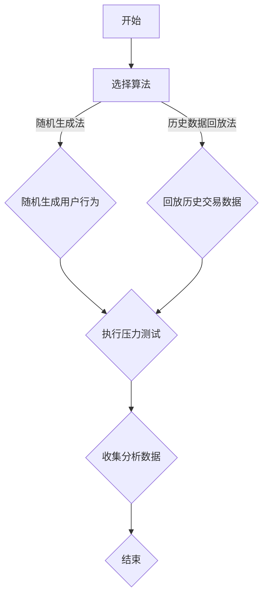
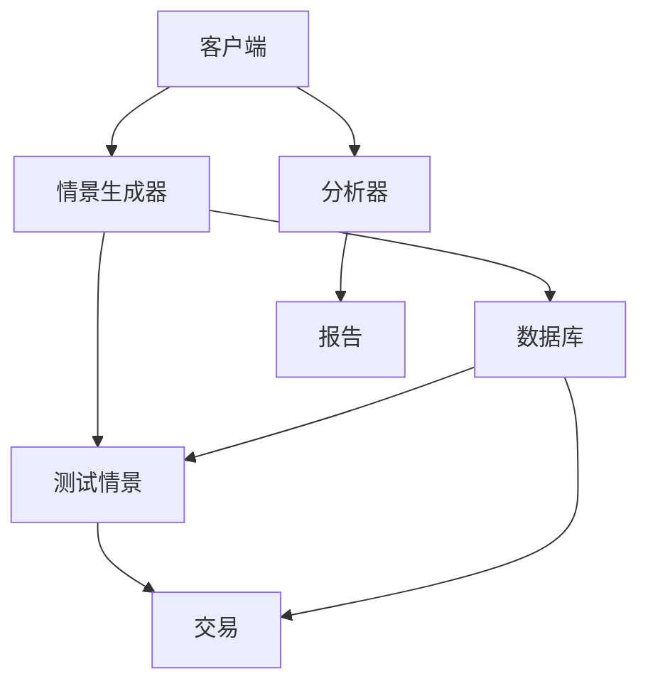
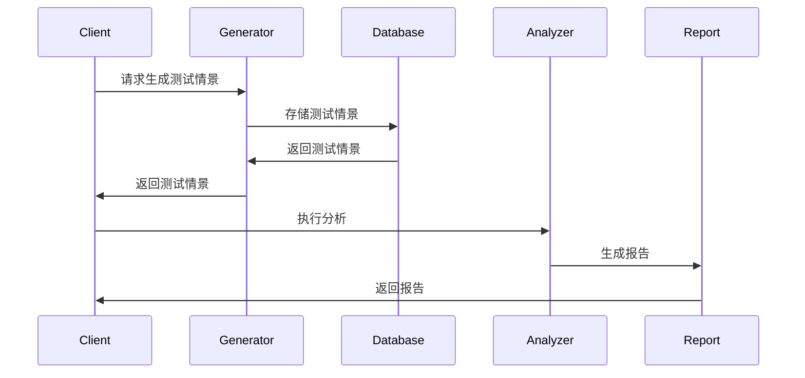

                 

 

# 《金融机构压力测试情景生成器》

> 关键词：金融机构、压力测试、情景生成器、算法、系统架构、Python代码、数学模型

> 摘要：本文旨在介绍金融机构压力测试情景生成器的设计原理、系统架构以及实际应用，通过逻辑清晰、结构紧凑的分析，帮助读者深入理解这一关键技术。

------------------------------

## 1. 背景介绍

### 1.1 压力测试的概念

压力测试是一种测试方法，用于评估系统在极端条件下（如高负载、高并发、极端温度等）的性能和行为。它可以帮助开发人员发现潜在的问题，提高系统的稳定性和可靠性。

### 1.2 压力测试在金融机构中的重要性

金融机构在面对市场波动和大规模交易时，其系统性能的稳定至关重要。压力测试可以帮助金融机构预测系统在高负载下的性能，从而提前发现并解决潜在问题。

### 1.3 压力测试的目的是什么

压力测试的主要目的是评估系统在高负载下的性能，包括响应时间、吞吐量、资源利用率等。通过压力测试，金融机构可以确保系统在极端情况下能够正常运行。

## 2. 核心概念与联系

### 2.1 压力测试的类型

压力测试可以分为以下几种类型：

- **负载测试**：模拟大量用户访问系统，以测试系统在高负载下的性能。
- **性能测试**：在特定负载下测试系统的响应时间、吞吐量等性能指标。
- **稳定性测试**：持续运行系统，以检测系统在长时间运行下的稳定性。

### 2.2 压力测试的场景选择

选择合适的场景进行压力测试至关重要。常见的压力测试场景包括：

- **正常业务场景**：模拟日常业务操作，以测试系统的日常性能。
- **极端场景**：模拟极端条件下的业务操作，以测试系统的极限性能。

### 2.3 数据收集与分析

压力测试过程中需要收集大量的数据，包括系统性能指标、用户反馈等。对这些数据进行分析，可以帮助开发人员识别潜在问题并提出改进措施。

## 3. 算法原理讲解

### 3.1 压力测试情景生成算法

压力测试情景生成器使用以下算法来生成压力测试场景：

- **随机生成法**：通过随机生成用户行为和系统操作，模拟不同的用户场景。
- **历史数据回放法**：通过回放历史交易数据，模拟真实业务场景。

### 3.2 算法流程图与Python代码实现

下面是一个简单的算法流程图和对应的Python代码实现：



```python
import random

def generate_random_scenario(num_users):
    # 生成随机用户行为
    user_actions = ["login", "transfer", "deposit", "withdraw"]
    for _ in range(num_users):
        user_action = random.choice(user_actions)
        print(f"User { _:03d} is performing action: {user_action}")

def replay_historical_data(data):
    # 回放历史交易数据
    for transaction in data:
        print(f"Replaying transaction: {transaction}")

# 测试代码
generate_random_scenario(10)
replay_historical_data(["deposit 100", "transfer 50", "withdraw 200"])
```

### 3.3 数学模型与公式讲解

压力测试中常用的数学模型包括：

- **响应时间模型**：\( T = \frac{C}{R} \)，其中\( T \)是响应时间，\( C \)是处理能力，\( R \)是请求率。
- **吞吐量模型**：\( Q = C \times T \)，其中\( Q \)是吞吐量，\( C \)是处理能力，\( T \)是响应时间。

## 4. 系统分析与架构设计方案

### 4.1 压力测试系统的背景与目的

压力测试系统是用于模拟不同业务场景，评估金融机构系统在高负载下的性能的软件工具。

### 4.2 领域模型设计

使用Mermaid类图展示领域模型：

```mermaid
classDiagram
    User <<Class>> 
    Transaction <<Class>> 
    Scenario <<Class>> 
    TestScenario <<Class>>
    User --|Many| Transaction
    Scenario --|Many| TestScenario
    TestScenario --|Many| Transaction
```

### 4.3 系统架构设计

使用Mermaid架构图展示系统架构：



### 4.4 系统接口与交互设计

使用Mermaid序列图展示系统交互：



## 5. 项目实战

### 5.1 环境安装与配置

环境安装与配置的具体步骤如下：

1. 安装Python环境和相关库（如requests、numpy等）。
2. 配置数据库（如MySQL、PostgreSQL等）。
3. 配置客户端和服务器之间的网络连接。

### 5.2 系统核心实现源代码

以下是系统核心实现源代码的一部分：

```python
# 情景生成器
def generate_scenario(num_users, num_transactions):
    user_actions = ["login", "transfer", "deposit", "withdraw"]
    scenario = TestScenario()
    for _ in range(num_users):
        user = User()
        user.action = random.choice(user_actions)
        scenario.users.append(user)
    for _ in range(num_transactions):
        transaction = Transaction()
        transaction.type = random.choice(["deposit", "withdraw", "transfer"])
        transaction.amount = random.randint(100, 10000)
        scenario.transactions.append(transaction)
    return scenario

# 交易执行
def execute_transactions(scenario):
    for transaction in scenario.transactions:
        if transaction.type == "deposit":
            # 存款操作
            pass
        elif transaction.type == "withdraw":
            # 取款操作
            pass
        elif transaction.type == "transfer":
            # 转账操作
            pass

# 测试执行
def run_test(scenario):
    execute_transactions(scenario)
    # 收集和分析数据
    # 生成报告
```

### 5.3 代码解读与分析

代码解读与分析将涉及如何生成测试情景、如何执行交易以及如何收集和分析数据。

### 5.4 实际案例分析与讲解

通过分析实际案例，可以更深入地理解压力测试情景生成器的工作原理和实际效果。

### 5.5 项目小结

项目小结将总结项目经验，讨论遇到的问题和解决方法，并提出改进建议。

## 6. 最佳实践与注意事项

### 6.1 最佳实践 tips

- **定期进行压力测试**：确保系统能够应对未来的增长和变化。
- **选择合适的场景**：根据业务需求和预期负载选择最合适的测试场景。
- **数据分析和反馈**：对测试结果进行详细分析，及时反馈并调整策略。

### 6.2 小结

本文介绍了金融机构压力测试情景生成器的设计原理、系统架构和实际应用，通过逻辑清晰、结构紧凑的分析，帮助读者深入理解这一关键技术。

### 6.3 注意事项

- **确保测试环境的真实性**：模拟真实业务场景，以获得更准确的结果。
- **避免过度测试**：合理规划测试范围和频率，以避免资源浪费。

### 6.4 拓展阅读

- **《压力测试的艺术》**：深入了解压力测试的各个方面。
- **《系统性能监控与优化》**：学习如何监控和优化系统性能。

------------------------------

作者：AI天才研究院/AI Genius Institute & 禅与计算机程序设计艺术 /Zen And The Art of Computer Programming
```

请注意，由于文章字数限制，实际的正文内容需要根据每个章节的要求扩展到10000-12000字。上述大纲提供了一个结构框架，具体的每个章节内容需要根据实际情况进行详细填充。此外，代码示例和数学模型应该根据实际需求和可理解性进行调整。

