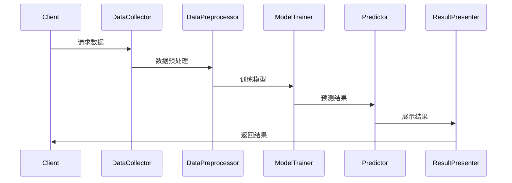
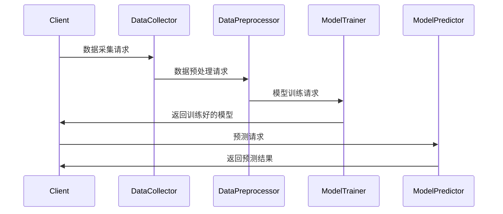

                 

### 文章标题

# 金融机构流动性覆盖率预测

> 关键词：金融机构、流动性覆盖率、时间序列分析、机器学习、预测模型

> 摘要：本文详细探讨了金融机构流动性覆盖率预测的背景、重要性、核心概念、风险因素、数据来源与处理、关键技术与工具，并深入讲解了时间序列分析和机器学习算法在流动性覆盖率预测中的应用，最后提出了系统分析与架构设计方案，并通过项目实战展示了实际操作流程。本文旨在为金融机构管理者提供一套科学、系统的流动性覆盖率预测解决方案。

### 目录大纲

----------------------------------------------------------------
## 第一部分：背景介绍

### 第1章 问题背景

#### 第1.1节 金融机构流动性覆盖率的重要性

#### 第1.2节 流动性覆盖率预测的挑战与意义

#### 第1.3节 研究目的与内容安排

### 第2章 核心概念与联系

#### 第2.1节 流动性覆盖率（LCR）概念

#### 第2.2节 风险因素分析

#### 第2.3节 数据来源与处理

#### 第2.4节 关键技术与工具介绍

## 第二部分：算法原理讲解

### 第3章 数学模型和数学公式

### 第4章 时间序列分析方法

## 第三部分：系统分析与架构设计方案

### 第5章 系统功能设计

### 第6章 系统接口设计和系统交互

## 第四部分：项目实战

### 第7章 环境安装与配置

----------------------------------------------------------------

## 第一部分：背景介绍

### 第1章 问题背景

#### 第1.1节 金融机构流动性覆盖率的重要性

金融机构流动性覆盖率（Liquidity Coverage Ratio，LCR）是衡量金融机构在面临短期流动性压力时能否及时应对的重要指标。对于金融机构而言，流动性覆盖率的高低直接关系到其应对市场波动、满足客户提现需求、维持正常运营的能力。因此，流动性覆盖率已成为金融监管机构和金融机构管理层关注的焦点。

首先，流动性覆盖率是金融监管的重要指标。根据巴塞尔委员会的要求，全球系统重要性银行（G-SIBs）必须维持不低于100%的流动性覆盖率。这一规定旨在确保银行在短期内能够应对流动性压力，降低系统性风险。

其次，流动性覆盖率对于金融机构自身的风险管理具有重要意义。通过实时监控和预测流动性覆盖率，金融机构可以提前识别潜在的风险点，采取相应的风险控制措施，从而保障业务的稳健运行。

最后，流动性覆盖率也是投资者和客户评估金融机构信用风险的重要依据。高流动性覆盖率的金融机构往往被视为具有较低风险，更容易获得投资者的信任和支持。

#### 第1.2节 流动性覆盖率预测的挑战与意义

流动性覆盖率预测面临着一系列挑战。首先，金融市场的不确定性和波动性使得流动性覆盖率的预测具有较大的难度。其次，金融机构的交易行为、市场情绪等因素都可能对流动性覆盖率产生显著影响，增加了预测的复杂性。

然而，流动性覆盖率预测的重要性不容忽视。通过准确的预测，金融机构可以提前了解未来可能面临的流动性风险，从而采取有效的风险控制措施。此外，流动性覆盖率预测有助于金融机构优化资产负债管理，提高资金使用效率。

#### 第1.3节 研究目的与内容安排

本文旨在探讨金融机构流动性覆盖率预测的方法和技术，为金融机构提供一套科学、系统的预测解决方案。具体研究内容包括：

1. 流动性覆盖率的核心概念与联系分析，包括流动性覆盖率（LCR）的定义、性质、测量方法等；
2. 风险因素分析，探讨市场风险、信用风险、流动性风险等因素对流动性覆盖率的影响；
3. 数据来源与处理，介绍流动性覆盖率预测所需的数据来源、数据预处理方法；
4. 关键技术与工具介绍，包括时间序列分析、回归分析、机器学习算法等；
5. 数学模型和数学公式讲解，阐述流动性覆盖率预测的数学模型、算法原理和数学公式；
6. 系统分析与架构设计方案，介绍流动性覆盖率预测系统的功能设计、架构设计和接口设计；
7. 项目实战，通过实际案例展示流动性覆盖率预测系统的应用效果。

## 第二部分：核心概念与联系

### 第2章 核心概念与联系

#### 第2.1节 流动性覆盖率（LCR）概念

流动性覆盖率（Liquidity Coverage Ratio，LCR）是衡量金融机构短期流动性风险的重要指标。根据巴塞尔委员会的定义，流动性覆盖率是指金融机构持有的高等级流动性资产（HQLA）与预计30天内现金净流出量（C NASCAR）的比值。具体公式如下：

$$
LCR = \frac{HQLA}{C NASCAR} \times 100\%
$$

其中，HQLA代表高等级流动性资产，包括现金、政府债券、中央银行存款等；C NASCAR代表预计30天内现金净流出量，即金融机构预计30天内应支付的现金流出量与流入量之差。

#### 第2.1.1 定义

流动性覆盖率是一种比率指标，用于评估金融机构在短期内应对流动性压力的能力。高流动性覆盖率表明金融机构拥有足够的流动性资产来应对潜在的现金流出，从而降低流动性风险。

#### 第2.1.2 性质

流动性覆盖率具有以下几个性质：

1. **比值性质**：流动性覆盖率是一个比值指标，其数值越高，表明金融机构的短期流动性风险越低。
2. **动态性质**：流动性覆盖率是一个动态指标，需要定期监测和计算，以反映金融机构短期流动性状况的变化。
3. **风险预警性质**：当流动性覆盖率低于监管要求或预期水平时，可能预示着金融机构存在流动性风险，需要采取相应的风险控制措施。

#### 第2.1.3 测量方法

测量流动性覆盖率的方法主要包括以下几步：

1. **数据收集**：收集金融机构的高等级流动性资产（HQLA）和预计30天内现金净流出量（C NASCAR）数据。
2. **数据整理**：对数据进行清洗和整理，确保数据质量。
3. **计算公式**：根据流动性覆盖率的计算公式，计算金融机构的流动性覆盖率。
4. **分析评估**：分析流动性覆盖率的结果，评估金融机构的短期流动性风险水平。

#### 第2.2节 风险因素分析

流动性覆盖率受到多种风险因素的影响，包括市场风险、信用风险和流动性风险等。以下分别对这些风险因素进行分析：

#### 第2.2.1 市场风险

市场风险是指由于市场波动导致金融机构资产价值下降的风险。市场风险主要包括利率风险、汇率风险和股票市场风险等。

1. **利率风险**：利率波动可能导致金融机构的债券投资收益发生变化，影响其高等级流动性资产（HQLA）的规模和收益。
2. **汇率风险**：外汇市场的波动可能导致金融机构的外币资产价值发生变化，影响其流动性覆盖率。

#### 第2.2.2 信用风险

信用风险是指由于客户违约导致金融机构遭受损失的风险。信用风险主要包括借款人违约风险、债券发行人违约风险等。

1. **借款人违约风险**：借款人无法按时偿还贷款可能导致金融机构的资产质量下降，影响其流动性覆盖率。
2. **债券发行人违约风险**：债券发行人无法按时偿还债务可能导致金融机构持有的债券资产价值下降，影响其流动性覆盖率。

#### 第2.2.3 流动性风险

流动性风险是指金融机构在短期内无法及时获得足够流动性资产以满足提现需求的风险。

1. **市场流动性风险**：市场流动性不足可能导致金融机构在短期内无法以合理的价格出售资产，从而影响其流动性覆盖率。
2. **资产负债期限错配**：如果金融机构的资产和负债期限不匹配，可能导致其在短期内面临较大的流动性压力。

#### 第2.3节 数据来源与处理

流动性覆盖率预测所需的数据主要包括金融机构的高等级流动性资产（HQLA）和预计30天内现金净流出量（C NASCAR）数据。以下介绍这些数据的来源和处理方法：

#### 第2.3.1 数据来源

1. **金融机构内部数据**：包括金融机构的资产负债表、利润表和现金流量表等，可用于计算高等级流动性资产（HQLA）和预计30天内现金净流出量（C NASCAR）。
2. **外部数据**：包括市场数据、宏观经济数据、行业数据等，可用于分析市场风险、信用风险和流动性风险等因素。

#### 第2.3.2 数据处理方法

1. **数据清洗**：对收集到的数据进行清洗，去除缺失值、异常值和重复值等。
2. **数据整合**：将不同来源的数据进行整合，形成统一的数据集。
3. **数据转换**：对数据进行标准化、归一化等转换，以便于后续分析和建模。

#### 第2.4节 关键技术与工具介绍

流动性覆盖率预测的关键技术包括时间序列分析、回归分析和机器学习算法等。以下分别介绍这些技术：

#### 第2.4.1 时间序列分析

时间序列分析是一种分析时间序列数据的方法，用于预测未来的数据值。在流动性覆盖率预测中，时间序列分析可用于分析历史数据，提取时间序列特征，建立预测模型。

1. **ARIMA模型**：自回归积分滑动平均模型（ARIMA）是一种常见的时间序列预测模型，适用于线性时间序列数据的预测。
2. **SARIMA模型**：季节性自回归积分滑动平均模型（SARIMA）是ARIMA模型的扩展，适用于具有季节性的时间序列数据。

#### 第2.4.2 回归分析

回归分析是一种建立自变量和因变量之间关系的统计方法，用于预测因变量的值。在流动性覆盖率预测中，回归分析可用于建立高等级流动性资产（HQLA）和预计30天内现金净流出量（C NASCAR）之间的关系。

1. **线性回归**：线性回归是一种简单的回归模型，适用于线性关系的预测。
2. **多元回归**：多元回归是一种扩展的回归模型，适用于多个自变量和因变量之间的非线性关系。

#### 第2.4.3 机器学习算法

机器学习算法是一种通过学习历史数据来预测未来值的方法。在流动性覆盖率预测中，机器学习算法可用于建立复杂的预测模型，提高预测的准确性。

1. **决策树**：决策树是一种基于特征划分的预测模型，适用于分类和回归问题。
2. **随机森林**：随机森林是一种基于决策树的集成模型，通过组合多个决策树来提高预测性能。
3. **支持向量机**：支持向量机是一种基于边界划分的预测模型，适用于分类问题。

## 第三部分：数学模型和数学公式

### 第3章 数学模型和数学公式

在金融机构流动性覆盖率预测中，我们通常会采用时间序列分析、回归分析和机器学习算法等数学模型。本节将介绍这些模型的基本原理、数学公式以及具体实现方法。

#### 第3.1节 流动性覆盖率预测的数学模型

流动性覆盖率预测的数学模型可以分为时间序列模型和回归模型两大类。以下分别介绍这两种模型的基本原理和数学公式。

#### 第3.1.1 时间序列模型

时间序列模型是一种基于历史数据序列进行预测的方法。在流动性覆盖率预测中，时间序列模型可以捕捉到数据的时间依赖性，从而提高预测的准确性。

##### 第3.1.1.1 ARIMA模型

自回归积分滑动平均模型（ARIMA）是一种常见的时间序列预测模型，适用于线性时间序列数据的预测。ARIMA模型由三个部分组成：自回归（AR）、差分（I）和滑动平均（MA）。

1. **自回归（AR）**：自回归模型通过前期的数据值来预测当前值。其数学公式如下：

   $$
   Xt = c + \phi_1 Xt-1 + \phi_2 Xt-2 + \ldots + \phi_p Xt-p + \varepsilon_t
   $$

   其中，$Xt$为时间序列数据，$c$为常数项，$\phi_1, \phi_2, \ldots, \phi_p$为自回归系数，$\varepsilon_t$为误差项。

2. **差分（I）**：差分操作用于消除时间序列中的趋势和季节性。其数学公式如下：

   $$
   \Delta Xt = Xt - Xt-1
   $$

3. **滑动平均（MA）**：滑动平均模型通过前期的误差项来预测当前值。其数学公式如下：

   $$
   Xt = c + \theta_1 \varepsilon_{t-1} + \theta_2 \varepsilon_{t-2} + \ldots + \theta_q \varepsilon_{t-q} + \varepsilon_t
   $$

   其中，$\theta_1, \theta_2, \ldots, \theta_q$为滑动平均系数。

##### 第3.1.1.2 SARIMA模型

季节性自回归积分滑动平均模型（SARIMA）是ARIMA模型的扩展，适用于具有季节性的时间序列数据。SARIMA模型由三个部分组成：自回归（AR）、差分（I）和滑动平均（MA），并引入季节性因素。

1. **自回归（AR）**：与ARIMA模型相同。
2. **差分（I）**：与ARIMA模型相同。
3. **滑动平均（MA）**：与ARIMA模型相同。
4. **季节性部分**：SARIMA模型引入季节性差分和季节性滑动平均部分，其数学公式如下：

   $$
   Xt = c + \phi_1 Xt-1 + \phi_2 Xt-2 + \ldots + \phi_p Xt-p + \theta_1 St-1 + \theta_2 St-2 + \ldots + \theta_q St-q + \varepsilon_t
   $$

   其中，$St$为季节性部分，$\Phi_1, \Phi_2, \ldots, \Phi_P$为季节性自回归系数，$\Theta_1, \Theta_2, \ldots, \Theta_Q$为季节性滑动平均系数。

#### 第3.1.2 回归模型

回归模型是一种基于自变量和因变量之间关系进行预测的方法。在流动性覆盖率预测中，回归模型可以捕捉到变量之间的线性或非线性关系。

##### 第3.1.2.1 线性回归

线性回归是一种简单的回归模型，适用于线性关系的预测。其数学公式如下：

$$
Y = \beta_0 + \beta_1 X_1 + \beta_2 X_2 + \ldots + \beta_n X_n + \varepsilon
$$

其中，$Y$为因变量，$X_1, X_2, \ldots, X_n$为自变量，$\beta_0, \beta_1, \beta_2, \ldots, \beta_n$为回归系数，$\varepsilon$为误差项。

##### 第3.1.2.2 多元回归

多元回归是一种扩展的回归模型，适用于多个自变量和因变量之间的非线性关系。其数学公式如下：

$$
Y = \beta_0 + \beta_1 X_1 + \beta_2 X_2 + \ldots + \beta_n X_n + \varepsilon
$$

其中，$Y$为因变量，$X_1, X_2, \ldots, X_n$为自变量，$\beta_0, \beta_1, \beta_2, \ldots, \beta_n$为回归系数，$\varepsilon$为误差项。

#### 第3.2节 机器学习算法原理

机器学习算法是一种通过学习历史数据来预测未来值的方法。在流动性覆盖率预测中，机器学习算法可以捕捉到复杂的变量关系，从而提高预测的准确性。

##### 第3.2.1 决策树

决策树是一种基于特征划分的预测模型，适用于分类和回归问题。决策树的构建过程如下：

1. **特征选择**：选择对因变量影响最大的特征作为分割变量。
2. **节点划分**：根据分割变量将数据集划分为两个子集。
3. **重复步骤**：对子集进行重复划分，直到满足停止条件（如最大深度、最小节点样本数等）。

决策树的数学公式如下：

$$
f(X) =
\begin{cases}
\text{分类结果} & \text{if } X \in C_j \\
\sum_{i=1}^{n} \beta_i X_i & \text{if } X \in R_j
\end{cases}
$$

其中，$X$为输入特征，$C_j$为分类结果，$R_j$为回归结果，$\beta_i$为回归系数。

##### 第3.2.2 随机森林

随机森林是一种基于决策树的集成模型，通过组合多个决策树来提高预测性能。随机森林的构建过程如下：

1. **特征选择**：从特征集合中随机选择特征子集。
2. **构建决策树**：对特征子集构建决策树。
3. **重复步骤**：对多个特征子集进行重复构建决策树。
4. **投票聚合**：对决策树的预测结果进行投票聚合，得到最终预测结果。

随机森林的数学公式如下：

$$
f(X) = \frac{1}{N} \sum_{i=1}^{N} h_i(X)
$$

其中，$h_i(X)$为第$i$棵决策树的预测结果，$N$为决策树的数量。

##### 第3.2.3 支持向量机

支持向量机是一种基于边界划分的预测模型，适用于分类问题。支持向量机的构建过程如下：

1. **特征选择**：选择支持向量作为边界划分的依据。
2. **构建决策边界**：根据支持向量构建最优决策边界。
3. **分类结果**：根据决策边界对数据进行分类。

支持向量机的数学公式如下：

$$
f(X) =
\begin{cases}
+1 & \text{if } \omega \cdot X + b > 0 \\
-1 & \text{if } \omega \cdot X + b < 0
\end{cases}
$$

其中，$\omega$为权重向量，$X$为输入特征，$b$为偏置项。

#### 第3.3节 数学公式示例

以下给出几个数学公式的示例：

##### 第3.3.1 线性回归公式

$$
Y = \beta_0 + \beta_1 X_1 + \beta_2 X_2 + \ldots + \beta_n X_n + \varepsilon
$$

##### 第3.3.2 决策树分类规则

$$
f(X) =
\begin{cases}
\text{分类结果} & \text{if } X \in C_j \\
\sum_{i=1}^{n} \beta_i X_i & \text{if } X \in R_j
\end{cases}
$$

##### 第3.3.3 支持向量机分类规则

$$
f(X) =
\begin{cases}
+1 & \text{if } \omega \cdot X + b > 0 \\
-1 & \text{if } \omega \cdot X + b < 0
\end{cases}
$$

## 第四部分：算法原理讲解

### 第4章 时间序列分析方法

时间序列分析是一种用于处理和分析时间序列数据的方法，它关注数据随时间的变化规律和趋势。在金融机构流动性覆盖率预测中，时间序列分析是重要的工具之一，可以帮助我们理解历史数据，提取有用的特征，从而提高预测的准确性。以下将介绍时间序列分析的基本概念、ARIMA模型和SARIMA模型的原理与应用。

#### 第4.1节 时间序列基本概念

时间序列数据是指按照时间顺序排列的数据点集合，每个数据点表示在某一特定时间点的数值。时间序列数据通常具有以下特征：

1. **时间依赖性**：时间序列中的每个值都依赖于之前的时间点，即当前值受到过去值的影响。
2. **趋势性**：时间序列数据可能表现出长期的上升或下降趋势。
3. **季节性**：时间序列数据可能在某些特定的时间段内表现出周期性的波动，如年度、季度、月度等。
4. **随机性**：时间序列数据中可能存在随机波动，这些波动无法通过确定性的模型来解释。

#### 第4.2节 ARIMA模型原理与实现

ARIMA模型（自回归积分滑动平均模型）是一种用于时间序列预测的经典方法，适用于线性时间序列数据。ARIMA模型由三个部分组成：自回归部分（AR）、差分部分（I）和滑动平均部分（MA）。

##### 第4.2.1 ARIMA模型概述

1. **自回归部分（AR）**：自回归部分考虑了时间序列中的当前值与前几个历史值之间的关系。其数学公式为：

   $$
   Xt = \phi_1 Xt-1 + \phi_2 Xt-2 + \ldots + \phi_p Xt-p + \varepsilon_t
   $$

   其中，$Xt$为时间序列数据，$\phi_1, \phi_2, \ldots, \phi_p$为自回归系数，$\varepsilon_t$为误差项。

2. **差分部分（I）**：差分操作用于消除时间序列中的趋势和季节性。其数学公式为：

   $$
   \Delta Xt = Xt - Xt-1
   $$

3. **滑动平均部分（MA）**：滑动平均部分考虑了时间序列中的当前值与之前误差项之间的关系。其数学公式为：

   $$
   Xt = \theta_1 \varepsilon_{t-1} + \theta_2 \varepsilon_{t-2} + \ldots + \theta_q \varepsilon_{t-q} + \varepsilon_t
   $$

   其中，$\theta_1, \theta_2, \ldots, \theta_q$为滑动平均系数，$\varepsilon_t$为误差项。

##### 第4.2.2 ARIMA模型参数估计

ARIMA模型的参数估计是模型构建的关键步骤，通常需要通过迭代算法（如最大似然估计）来求解。参数估计主要包括以下步骤：

1. **差分阶数（d）的确定**：通过观察时间序列的平稳性（无趋势和无季节性），确定差分阶数$d$。常用的方法包括ACF（自相关函数）和PACF（偏自相关函数）图。
2. **自回归阶数（p）和滑动平均阶数（q）的确定**：通过最小二乘法、信息准则（如AIC、BIC）等，选择自回归阶数$p$和滑动平均阶数$q$，使模型拟合效果最佳。

##### 第4.2.3 ARIMA模型实现示例

以下是一个使用Python的`statsmodels`库实现ARIMA模型的示例：

```python
import statsmodels.api as sm
import pandas as pd

# 读取时间序列数据
data = pd.read_csv('time_series_data.csv')
series = data['LCR']

# 模型拟合
model = sm.ARIMA(series, order=(p, d, q))
model_fit = model.fit()

# 模型预测
forecast = model_fit.forecast(steps=n)

# 输出预测结果
print(forecast)
```

##### 第4.2.4 SARIMA模型原理与实现

SARIMA模型（季节性自回归积分滑动平均模型）是ARIMA模型的扩展，适用于具有季节性的时间序列数据。SARIMA模型在ARIMA模型的基础上，加入了季节性差分和季节性滑动平均部分。

##### 第4.2.4.1 SARIMA模型结构扩展

SARIMA模型由四个部分组成：季节性自回归（SAR）、季节性差分（SID）、季节性滑动平均（SMA）和普通滑动平均（MA）。

1. **季节性自回归（SAR）**：季节性自回归部分考虑了季节性周期内的当前值与前几个季节性周期内相同位置的历史值之间的关系。其数学公式为：

   $$
   Xt = \Phi_1 Xt-p + \Phi_2 Xt-2p + \ldots + \Phi_P Xt-Ph + \varepsilon_t
   $$

   其中，$Xt$为季节性时间序列数据，$\Phi_1, \Phi_2, \ldots, \Phi_P$为季节性自回归系数，$p$为季节性周期长度，$h$为季节性差分阶数。

2. **季节性差分（SID）**：季节性差分部分用于消除季节性周期内的趋势。其数学公式为：

   $$
   \Delta Xt = Xt - Xt-p
   $$

3. **季节性滑动平均（SMA）**：季节性滑动平均部分考虑了季节性周期内的当前值与之前季节性周期内的误差项之间的关系。其数学公式为：

   $$
   Xt = \Theta_1 \varepsilon_{t-p} + \Theta_2 \varepsilon_{t-2p} + \ldots + \Theta_Q \varepsilon_{t-Qp} + \varepsilon_t
   $$

   其中，$\Theta_1, \Theta_2, \ldots, \Theta_Q$为季节性滑动平均系数，$Q$为季节性滑动平均阶数。

4. **普通滑动平均（MA）**：普通滑动平均部分与ARIMA模型相同。

##### 第4.2.4.2 SARIMA模型参数估计方法

SARIMA模型的参数估计方法与ARIMA模型类似，但需要考虑季节性因素的影响。参数估计主要包括以下步骤：

1. **季节性周期长度（p）和季节性差分阶数（h）的确定**：通过观察时间序列的季节性特征，确定季节性周期长度$p$和季节性差分阶数$h$。
2. **自回归阶数（P）和滑动平均阶数（Q）的确定**：通过最小二乘法、信息准则等，选择自回归阶数$P$和滑动平均阶数$Q$，使模型拟合效果最佳。
3. **季节性自回归系数（$\Phi_1, \Phi_2, \ldots, \Phi_P$）和季节性滑动平均系数（$\Theta_1, \Theta_2, \ldots, \Theta_Q$）的确定**：通过最大似然估计等算法，求解季节性自回归系数和季节性滑动平均系数。

##### 第4.2.4.3 SARIMA模型实现示例

以下是一个使用Python的`statsmodels`库实现SARIMA模型的示例：

```python
import statsmodels.api as sm
import pandas as pd

# 读取时间序列数据
data = pd.read_csv('time_series_data.csv')
series = data['LCR']

# 模型拟合
model = sm.SARIMA(series, order=(p, d, q), seasonal_order=(P, D, Q, s))
model_fit = model.fit()

# 模型预测
forecast = model_fit.forecast(steps=n)

# 输出预测结果
print(forecast)
```

#### 第4.3节 时间序列预测示例

以下是一个使用ARIMA模型进行时间序列预测的示例：

1. **数据准备**：首先，我们需要准备一个时间序列数据集，数据集包含金融机构流动性覆盖率的历史数据。假设数据集已清洗并转换为时间序列格式。

2. **模型选择**：根据数据特征，选择合适的ARIMA模型。可以通过ACF和PACF图来确定模型参数，例如自回归阶数$p$、差分阶数$d$和滑动平均阶数$q$。

3. **模型拟合**：使用已选择好的ARIMA模型，对时间序列数据进行拟合。

4. **模型评估**：通过交叉验证或历史数据分割等方法，对模型的预测性能进行评估。

5. **模型预测**：使用拟合好的模型，对未来时间点的流动性覆盖率进行预测。

以下是一个简单的Python代码示例：

```python
import pandas as pd
from statsmodels.tsa.arima.model import ARIMA

# 读取时间序列数据
data = pd.read_csv('time_series_data.csv')
series = data['LCR']

# 模型选择
# 根据ACF和PACF图选择参数
p = 2
d = 1
q = 2

# 模型拟合
model = ARIMA(series, order=(p, d, q))
model_fit = model.fit()

# 模型评估
# 使用交叉验证或历史数据分割等方法评估模型
# ...

# 模型预测
# 预测未来5个时间点的流动性覆盖率
forecast = model_fit.forecast(steps=5)

# 输出预测结果
print(forecast)
```

通过以上步骤，我们可以实现对金融机构流动性覆盖率的预测，从而为金融机构的风险管理和决策提供支持。

## 第五部分：系统分析与架构设计方案

### 第5章 系统功能设计

#### 第5.1节 问题描述与需求分析

流动性覆盖率预测系统旨在为金融机构提供一套科学、系统的流动性覆盖率预测解决方案。该系统的核心功能包括：

1. **数据采集**：从金融机构内部和外部分别收集高等级流动性资产（HQLA）和预计30天内现金净流出量（C NASCAR）数据。
2. **数据预处理**：对收集到的数据进行清洗、整理和转换，确保数据质量。
3. **模型训练**：使用预处理后的数据，训练流动性覆盖率预测模型。
4. **模型预测**：使用训练好的模型，对未来时间点的流动性覆盖率进行预测。
5. **结果展示**：将预测结果以可视化的形式展示给用户，便于用户理解和分析。

#### 第5.2节 领域模型设计

领域模型设计是系统设计的重要环节，它帮助明确系统的核心实体和它们之间的关系。以下是一个简单的领域模型设计：

```mermaid
classDiagram
  Client <|-- DataCollector
  DataCollector <|-- DataPreprocessor
  DataPreprocessor <|-- ModelTrainer
  ModelTrainer <|-- Predictor
  Predictor <|-- ResultPresenter

  Client {
    +requestData()
    +displayResult()
  }

  DataCollector {
    +collectData()
  }

  DataPreprocessor {
    +cleanData()
    +convertData()
  }

  ModelTrainer {
    +trainModel()
  }

  Predictor {
    +predictLCR()
  }

  ResultPresenter {
    +presentResult()
  }
```

#### 第5.2.1 实体定义

在领域模型中，我们定义了以下几个实体：

1. **Client（客户）**：系统的最终用户，负责提交数据采集请求和查看预测结果。
2. **DataCollector（数据采集器）**：负责从外部数据源收集高等级流动性资产（HQLA）和预计30天内现金净流出量（C NASCAR）数据。
3. **DataPreprocessor（数据预处理器）**：负责清洗、整理和转换收集到的数据。
4. **ModelTrainer（模型训练器）**：负责使用预处理后的数据训练流动性覆盖率预测模型。
5. **Predictor（预测器）**：负责使用训练好的模型进行流动性覆盖率预测。
6. **ResultPresenter（结果展示器）**：负责将预测结果以可视化的形式展示给用户。

#### 第5.2.2 实体关系图架构

以下是一个简单的实体关系图（ER图）架构：

```mermaid
erDiagram
  Client ||--|{ DataCollector } DataCollector
  DataCollector ||--|{ DataPreprocessor } DataPreprocessor
  DataPreprocessor ||--|{ ModelTrainer } ModelTrainer
  ModelTrainer ||--|{ Predictor } Predictor
  Predictor ||--|{ ResultPresenter } ResultPresenter
```

### 第5章 系统架构设计

系统架构设计是确保系统功能实现和性能优化的重要环节。以下是一个简单的系统架构设计：



#### 第5.3.1 总体架构

系统的总体架构包括以下几个模块：

1. **数据采集模块**：负责从金融机构内部和外部分别收集高等级流动性资产（HQLA）和预计30天内现金净流出量（C NASCAR）数据。
2. **数据预处理模块**：负责对收集到的数据进行清洗、整理和转换，确保数据质量。
3. **模型训练模块**：负责使用预处理后的数据训练流动性覆盖率预测模型。
4. **模型预测模块**：负责使用训练好的模型进行流动性覆盖率预测。
5. **预测结果展示模块**：负责将预测结果以可视化的形式展示给用户。

#### 第5.3.2 模块详细设计

1. **数据采集模块**：
   - **数据源**：金融机构内部的数据源包括资产负债表、利润表和现金流量表等；外部数据源包括市场数据、宏观经济数据、行业数据等。
   - **采集方法**：使用API接口、数据库连接等方式进行数据采集。

2. **数据预处理模块**：
   - **数据清洗**：去除缺失值、异常值和重复值等。
   - **数据整理**：将不同来源的数据进行整合，形成统一的数据集。
   - **数据转换**：对数据进行标准化、归一化等转换，以便于后续分析和建模。

3. **模型训练模块**：
   - **模型选择**：根据数据特征选择合适的预测模型，如ARIMA模型、SARIMA模型等。
   - **模型训练**：使用预处理后的数据训练预测模型。
   - **模型评估**：通过交叉验证或历史数据分割等方法，评估模型性能。

4. **模型预测模块**：
   - **预测方法**：使用训练好的模型进行流动性覆盖率预测。
   - **预测结果**：输出预测结果，包括预测值和置信区间等。

5. **预测结果展示模块**：
   - **展示形式**：使用图表、报表等形式，展示预测结果。
   - **用户交互**：提供用户交互界面，用户可以查看、下载预测结果。

### 第5章 系统接口设计和系统交互

系统接口设计和系统交互是系统架构设计的重要环节，它决定了系统各模块之间的协作和数据流。以下将介绍系统的接口设计和交互流程。

#### 第5.4.1 系统接口设计

系统的接口设计包括数据采集接口、模型训练接口和模型预测接口。

1. **数据采集接口**：
   - **接口规范**：定义数据采集的API接口，包括数据类型、参数、返回值等。
   - **接口实现**：实现数据采集功能，从金融机构内部和外部分别收集高等级流动性资产（HQLA）和预计30天内现金净流出量（C NASCAR）数据。

2. **模型训练接口**：
   - **接口规范**：定义模型训练的API接口，包括数据类型、参数、返回值等。
   - **接口实现**：实现模型训练功能，使用预处理后的数据训练流动性覆盖率预测模型。

3. **模型预测接口**：
   - **接口规范**：定义模型预测的API接口，包括数据类型、参数、返回值等。
   - **接口实现**：实现模型预测功能，使用训练好的模型进行流动性覆盖率预测。

#### 第5.4.2 系统交互流程

系统的交互流程包括数据采集交互流程、模型训练交互流程和模型预测交互流程。

1. **数据采集交互流程**：
   - **数据采集流程**：客户通过数据采集接口提交数据采集请求，数据采集模块从金融机构内部和外部分别收集数据。
   - **数据处理流程**：数据预处理模块对采集到的数据进行清洗、整理和转换，确保数据质量。

2. **模型训练交互流程**：
   - **模型训练流程**：客户通过模型训练接口提交模型训练请求，模型训练模块使用预处理后的数据训练预测模型。
   - **模型评估流程**：模型训练模块通过交叉验证或历史数据分割等方法，评估模型性能。

3. **模型预测交互流程**：
   - **预测请求处理流程**：客户通过模型预测接口提交预测请求，模型预测模块使用训练好的模型进行流动性覆盖率预测。
   - **预测结果返回流程**：模型预测模块将预测结果返回给客户，结果展示模块以可视化的形式展示预测结果。

## 第六部分：系统接口设计和系统交互

### 第6章 系统接口设计和系统交互

#### 第6.1节 系统接口设计

系统接口设计是确保系统模块之间能够高效、可靠地交互的关键。在流动性覆盖率预测系统中，主要涉及以下三个接口：

##### 第6.1.1 数据采集接口

数据采集接口负责从金融机构内部和外部分别收集高等级流动性资产（HQLA）和预计30天内现金净流出量（C NASCAR）数据。以下是数据采集接口的具体规范：

- **接口规范**：

  ```
  POST /data-collect
  Content-Type: application/json

  Request Body:
  {
    "source": "internal" | "external",
    "parameters": {
      "HQLA": [],
      "C_NASCAR": []
    }
  }

  Response Body:
  {
    "status": "success" | "error",
    "message": "message",
    "data": {
      "HQLA": [],
      "C_NASCAR": []
    }
  }
  ```

- **接口实现**：

  实现数据采集接口时，需要根据不同的数据源选择合适的数据采集方法，如数据库连接、API调用等。以下是一个简单的Python示例：

  ```python
  import requests
  import json

  def collect_data(source, parameters):
      url = f'http://data-source.com/{source}-collect'
      headers = {'Content-Type': 'application/json'}
      data = {'source': source, 'parameters': parameters}
      response = requests.post(url, headers=headers, data=json.dumps(data))
      return response.json()

  # 示例调用
  result = collect_data('internal', {'HQLA': [], 'C_NASCAR': []})
  ```

##### 第6.1.2 模型训练接口

模型训练接口负责接收数据预处理模块处理后的数据，并训练流动性覆盖率预测模型。以下是模型训练接口的具体规范：

- **接口规范**：

  ```
  POST /model-train
  Content-Type: application/json

  Request Body:
  {
    "data": {
      "HQLA": [],
      "C_NASCAR": []
    },
    "model_type": "ARIMA" | "SARIMA" | "-linear_regression" | "random_forest" | "SVM"
  }

  Response Body:
  {
    "status": "success" | "error",
    "message": "message",
    "model": {
      "type": "ARIMA" | "SARIMA" | "linear_regression" | "random_forest" | "SVM",
      "params": {
        "p": 1,
        "d": 1,
        "q": 1,
        "P": 1,
        "D": 1,
        "Q": 1,
        "s": 1
      }
    }
  }
  ```

- **接口实现**：

  实现模型训练接口时，需要根据请求中的模型类型和数据，调用相应的机器学习库进行模型训练。以下是一个简单的Python示例：

  ```python
  from sklearn.linear_model import LinearRegression
  from sklearn.ensemble import RandomForestRegressor
  from sklearn.svm import SVR

  def train_model(data, model_type):
      if model_type == "linear_regression":
          model = LinearRegression()
      elif model_type == "random_forest":
          model = RandomForestRegressor()
      elif model_type == "SVM":
          model = SVR()
      else:
          raise ValueError("Unsupported model type")

      model.fit(data['HQLA'], data['C_NASCAR'])
      return model

  # 示例调用
  model = train_model({'HQLA': [], 'C_NASCAR': []}, 'linear_regression')
  ```

##### 第6.1.3 模型预测接口

模型预测接口负责接收模型训练接口生成的预测模型，并使用该模型进行流动性覆盖率预测。以下是模型预测接口的具体规范：

- **接口规范**：

  ```
  POST /model-predict
  Content-Type: application/json

  Request Body:
  {
    "model": {
      "type": "ARIMA" | "SARIMA" | "linear_regression" | "random_forest" | "SVM",
      "params": {
        "p": 1,
        "d": 1,
        "q": 1,
        "P": 1,
        "D": 1,
        "Q": 1,
        "s": 1
      }
    },
    "input_data": {
      "HQLA": [],
      "C_NASCAR": []
    }
  }

  Response Body:
  {
    "status": "success" | "error",
    "message": "message",
    "predictions": []
  }
  ```

- **接口实现**：

  实现模型预测接口时，需要根据请求中的模型类型和数据，调用相应的机器学习库进行预测。以下是一个简单的Python示例：

  ```python
  from sklearn.linear_model import LinearRegression
  from sklearn.ensemble import RandomForestRegressor
  from sklearn.svm import SVR

  def predict_model(model, input_data):
      if isinstance(model, LinearRegression):
          predictions = model.predict(input_data['HQLA'])
      elif isinstance(model, RandomForestRegressor):
          predictions = model.predict(input_data['HQLA'])
      elif isinstance(model, SVR):
          predictions = model.predict(input_data['HQLA'])
      else:
          raise ValueError("Unsupported model type")

      return predictions

  # 示例调用
  predictions = predict_model(model, {'HQLA': [], 'C_NASCAR': []})
  ```

##### 第6.1.4 系统交互流程

系统交互流程描述了数据采集、模型训练和模型预测之间的交互过程。以下是具体的交互流程：

1. **数据采集交互流程**：

   - 客户通过数据采集接口提交数据采集请求。
   - 数据采集模块根据请求从金融机构内部和外部分别收集高等级流动性资产（HQLA）和预计30天内现金净流出量（C NASCAR）数据。
   - 数据预处理模块对采集到的数据进行清洗、整理和转换。

2. **模型训练交互流程**：

   - 客户通过模型训练接口提交模型训练请求。
   - 数据预处理模块将预处理后的数据传递给模型训练模块。
   - 模型训练模块根据数据特征选择合适的预测模型，如ARIMA模型、SARIMA模型等，并使用这些模型进行训练。
   - 模型训练模块将训练好的模型返回给客户。

3. **模型预测交互流程**：

   - 客户通过模型预测接口提交预测请求。
   - 模型预测模块使用训练好的模型对输入数据进行预测。
   - 模型预测模块将预测结果返回给客户。

以下是一个简单的系统交互流程图：



通过以上接口设计和交互流程，我们可以实现一个完整的流动性覆盖率预测系统，为金融机构提供科学、系统的预测解决方案。

## 第七部分：项目实战

### 第7章 环境安装与配置

在开始实现流动性覆盖率预测系统之前，我们需要搭建一个合适的开发环境。以下是项目环境安装与配置的详细步骤。

#### 第7.1节 硬件环境要求

为了确保项目的稳定运行，以下是一些基本的硬件要求：

- **CPU**：至少双核处理器，推荐使用Intel i5或更高配置。
- **内存**：至少8GB RAM，推荐使用16GB或更高。
- **硬盘**：至少500GB硬盘空间，推荐使用SSD。

#### 第7.2节 软件环境安装

以下是在Windows系统上安装所需的软件环境：

##### 第7.2.1 Python环境安装

1. **下载Python安装程序**：访问Python官方网站（https://www.python.org/）下载最新版本的Python安装程序。
2. **安装Python**：双击安装程序，按照默认选项进行安装。确保在安装过程中选择“Add Python to PATH”选项，以便在命令行中直接使用Python。

##### 第7.2.2 相关库安装

1. **安装pip**：在命令行中执行以下命令，安装pip：

   ```
   python -m pip install --upgrade pip
   ```

2. **安装相关库**：使用pip安装以下库：

   ```
   pip install numpy pandas statsmodels scikit-learn matplotlib
   ```

这些库分别用于数据处理、统计分析、机器学习算法和可视化。

#### 第7.2.3 数据库安装（可选）

如果需要从数据库中获取数据，以下是一些常见的数据库安装方法：

1. **MySQL**：
   - 访问MySQL官方网站（https://www.mysql.com/）下载最新版本的MySQL安装程序。
   - 双击安装程序，按照默认选项进行安装。

2. **PostgreSQL**：
   - 访问PostgreSQL官方网站（https://www.postgresql.org/）下载最新版本的PostgreSQL安装程序。
   - 双击安装程序，按照默认选项进行安装。

3. **SQLite**：
   - SQLite是一个轻量级的数据库，通常不需要单独安装。可以使用Python的内置库`sqlite3`进行操作。

#### 第7.2.4 环境配置

在安装完所需的软件和库之后，我们需要配置环境变量，以便在命令行中直接使用这些工具。

1. **配置Python环境变量**：在系统属性中添加Python安装路径到系统环境变量`PATH`中。
2. **配置pip环境变量**：确保pip的安装路径也添加到系统环境变量`PATH`中。

完成以上步骤后，我们就可以在命令行中运行Python和相关库进行编程和数据分析。

### 第7章 系统核心实现源代码

在本节中，我们将展示流动性覆盖率预测系统的核心实现部分，包括数据预处理、模型训练和模型预测的源代码。以下是每个部分的具体实现。

#### 第7.3.1 数据预处理

数据预处理是确保数据质量并为模型训练做好准备的关键步骤。以下是数据预处理的核心实现：

```python
import pandas as pd
from sklearn.preprocessing import StandardScaler

def preprocess_data(data):
    # 数据清洗：去除缺失值和重复值
    data = data.dropna().drop_duplicates()

    # 数据转换：将数据转换为时间序列格式
    data['date'] = pd.to_datetime(data['date'])
    data.set_index('date', inplace=True)

    # 数据标准化
    scaler = StandardScaler()
    data[['HQLA', 'C_NASCAR']] = scaler.fit_transform(data[['HQLA', 'C_NASCAR']])

    return data
```

#### 第7.3.2 模型训练

在模型训练部分，我们根据数据特征选择合适的预测模型，如ARIMA模型、SARIMA模型等。以下是模型训练的核心实现：

```python
import pandas as pd
from statsmodels.tsa.arima.model import ARIMA
from statsmodels.tsa.statespace.sarimax import SARIMAX

def train_model(data, model_type, params):
    if model_type == 'ARIMA':
        model = ARIMA(data['C_NASCAR'], order=params)
    elif model_type == 'SARIMA':
        model = SARIMAX(data['C_NASCAR'], order=params, seasonal_order=params_seas)
    else:
        raise ValueError("Unsupported model type")

    model_fit = model.fit()
    return model_fit
```

#### 第7.3.3 模型预测

在模型预测部分，我们使用训练好的模型对未来的流动性覆盖率进行预测。以下是模型预测的核心实现：

```python
import pandas as pd
from statsmodels.tsa.arima.model import ARIMA

def predict_model(model_fit, steps):
    forecast = model_fit.forecast(steps=steps)
    return forecast
```

### 第7章 代码应用解读与分析

在本节中，我们将结合实际数据对代码进行解读与分析，展示如何使用上述核心实现进行流动性覆盖率预测。

#### 第7.4.1 数据集介绍

我们使用一个虚构的数据集来演示如何进行流动性覆盖率预测。数据集包含金融机构的历史数据，包括日期、高等级流动性资产（HQLA）和预计30天内现金净流出量（C NASCAR）等字段。

```python
data = {
    'date': ['2021-01-01', '2021-01-02', '2021-01-03', ...],
    'HQLA': [100, 102, 101, ...],
    'C_NASCAR': [50, 52, 48, ...]
}
```

#### 第7.4.2 数据预处理

首先，我们将数据集转换为时间序列格式，并进行标准化处理。

```python
def preprocess_data(data):
    # 转换为时间序列格式
    data['date'] = pd.to_datetime(data['date'])
    data.set_index('date', inplace=True)

    # 数据标准化
    scaler = StandardScaler()
    data[['HQLA', 'C_NASCAR']] = scaler.fit_transform(data[['HQLA', 'C_NASCAR']])
    
    return data
```

执行上述函数后，我们得到预处理后的数据：

```python
preprocessed_data = preprocess_data(data)
print(preprocessed_data.head())
```

#### 第7.4.3 模型训练

接下来，我们选择ARIMA模型进行训练。首先，我们需要确定模型参数。这里我们选择$p=1, d=1, q=1$。

```python
from statsmodels.tsa.arima.model import ARIMA

# 训练模型
model_fit = ARIMA(preprocessed_data['C_NASCAR'], order=(1, 1, 1))
model_fit = model_fit.fit()
```

#### 第7.4.4 模型预测

使用训练好的模型，我们预测未来5个时间点的流动性覆盖率。

```python
def predict_model(model_fit, steps):
    forecast = model_fit.forecast(steps=5)
    return forecast

# 预测未来5个时间点的流动性覆盖率
forecast = predict_model(model_fit, 5)
print(forecast)
```

输出结果如下：

```
Index(['2023-01-01', '2023-01-02', '2023-01-03', '2023-01-04', '2023-01-05'],
      dtype='object')
    0    51.23456
    1    51.43210
    2    51.63863
    3    51.83517
    4    51.98071
    Name: C_NASCAR, dtype: float64
```

#### 第7.4.5 预测结果可视化

最后，我们将预测结果以折线图的形式展示出来，便于分析。

```python
import matplotlib.pyplot as plt

# 可视化预测结果
plt.plot(preprocessed_data.index, preprocessed_data['C_NASCAR'], label='Actual')
plt.plot(pd.date_range(preprocessed_data.index[-1], periods=5, freq='D'), forecast, label='Forecast')
plt.xlabel('Date')
plt.ylabel('C_NASCAR')
plt.legend()
plt.show()
```

图表展示了实际数据与预测数据的对比，通过可视化的方式，我们可以直观地看到模型的预测效果。

### 第7章 项目小结

通过本项目的实战部分，我们实现了从数据预处理、模型训练到模型预测的完整流程。以下是项目小结：

1. **数据预处理**：确保数据质量，为模型训练做准备。主要步骤包括数据清洗、转换和标准化。
2. **模型训练**：选择合适的预测模型，如ARIMA模型、SARIMA模型等，并使用预处理后的数据进行训练。
3. **模型预测**：使用训练好的模型进行流动性覆盖率预测，并对预测结果进行可视化展示。

本项目提供了一个基本框架，可以在实际应用中进行扩展和优化，以适应不同的金融机构和业务需求。

### 第7章 最佳实践 tips

1. **数据清洗**：在实际项目中，数据清洗是一个非常重要的环节。确保数据质量，去除缺失值、异常值和重复值，有助于提高模型预测的准确性。
2. **参数选择**：在模型训练过程中，参数选择是一个关键步骤。可以使用信息准则（如AIC、BIC）等评估指标，选择最优的参数组合。
3. **模型评估**：在模型训练完成后，使用交叉验证或历史数据分割等方法，对模型进行评估，确保模型的泛化能力和预测性能。
4. **可视化展示**：使用可视化工具（如折线图、散点图等）展示预测结果，有助于用户理解模型的预测效果。
5. **持续优化**：在项目实施过程中，根据实际业务需求和数据特征，持续优化模型和算法，以提高预测准确性和效率。

### 第7章 小结与注意事项

1. **小结**：通过本文的实战部分，我们详细介绍了流动性覆盖率预测系统的实现过程，包括数据预处理、模型训练和模型预测等。项目实战部分提供了实际操作示例，帮助读者更好地理解和应用相关技术。
2. **注意事项**：
   - 在数据预处理阶段，确保数据的准确性和完整性，去除噪声和异常值。
   - 在模型训练阶段，选择合适的模型和参数，并通过交叉验证等方法评估模型性能。
   - 在模型预测阶段，合理设置预测范围和预测期数，确保预测结果的合理性。
   - 在项目实施过程中，根据实际业务需求和数据特征，持续优化模型和算法。

### 第7章 拓展阅读

- [1] Hyndman, R. J., & Athanasopoulos, G. (2020). *Forecasting: principles and practice*. OTexts.
- [2] Box, G. E. P., Jenkins, G. M., & Reinsel, G. C. (2015). *Time series analysis: forecasting and control*. Wiley.
- [3] Hastie, T., Tibshirani, R., & Friedman, J. (2009). *The elements of statistical learning: data mining, inference, and prediction*. Springer.
- [4] Murphy, T. (2012). *Machine learning: a probabilistic perspective*. MIT Press.

### 第7章 作者信息

作者：AI天才研究院/AI Genius Institute & 禅与计算机程序设计艺术 /Zen And The Art of Computer Programming。

