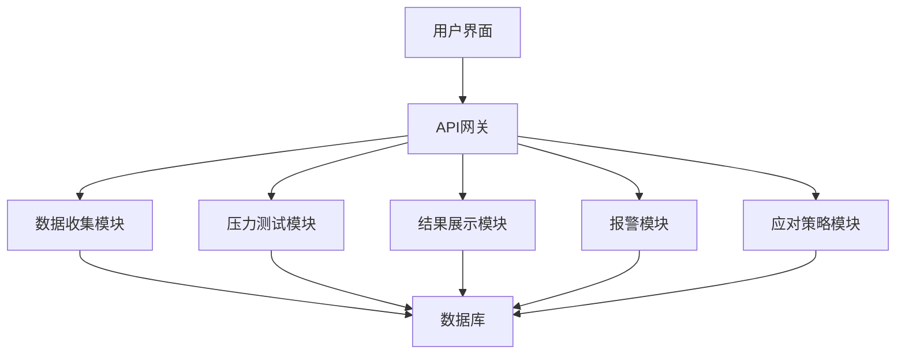

                 

### 文章标题

### 关键词

- 金融机构
- 流动性风险
- 压力测试
- 管理平台
- 风险管理

### 摘要

本文旨在深入探讨金融机构流动性风险压力测试与管理平台的设计与应用。首先，我们将对流动性风险的概念及其重要性进行详细介绍，并通过案例分析，展示流动性风险压力测试的具体实施步骤。接着，我们将分析流动性风险管理的框架与流程，探讨如何通过有效的管理平台实现风险的控制。随后，本文将详细讨论管理平台的设计与实现，包括需求分析、架构设计、数据库设计以及功能模块实现。此外，平台部署、运维以及升级优化策略也将得到全面阐述。最后，通过实际案例研究，我们将总结最佳实践，并对未来发展提出展望。

---

### 第一部分：流动性风险概述

#### 第1章：流动性风险概念与重要性

流动性风险是金融机构面临的一种主要风险类型，它指的是金融机构在满足短期债务偿还需求时可能遇到的资金短缺问题。流动性风险不仅影响金融机构的日常运营，还会对整个金融市场的稳定性产生重要影响。因此，理解流动性风险的概念及其重要性对于金融机构的风险管理至关重要。

#### 1.1 流动性风险的定义

流动性风险是指金融机构无法在合理的时间内以合理的成本将资产转换为现金以满足债务偿还需求的风险。这种风险可能源于资产流动性差、市场条件变化、资产负债期限不匹配等多方面因素。

#### 1.2 流动性风险的特征

流动性风险具有以下几个显著特征：

1. **突发性**：流动性风险往往突然发生，金融机构可能没有足够的时间进行预防。
2. **传染性**：流动性危机可能迅速蔓延，导致整个金融体系的不稳定。
3. **不确定性**：流动性风险的规模和影响难以准确预测，增加了管理的难度。

#### 1.3 流动性风险的影响

流动性风险对金融机构的影响是多方面的：

1. **财务影响**：资金短缺可能导致金融机构无法履行债务，进而影响其信用评级和融资成本。
2. **运营影响**：流动性风险可能迫使金融机构缩减业务规模，影响其盈利能力。
3. **市场影响**：金融机构的流动性危机可能引发市场恐慌，影响投资者信心和金融市场稳定性。

#### 1.4 流动性风险的管理原则

为了有效管理流动性风险，金融机构应遵循以下原则：

1. **预防原则**：提前识别潜在的流动性风险，并采取预防措施。
2. **分散原则**：通过多样化资产配置，降低单一资产流动性不足的风险。
3. **弹性原则**：保持一定的流动性缓冲，以应对突发情况。
4. **持续监控原则**：建立有效的流动性风险监控系统，实时监测流动性状况。

#### 第2章：流动性风险管理框架

#### 2.1 流动性风险管理体系

流动性风险管理体系是金融机构进行流动性风险管理的基础。它通常包括组织架构、风险管理政策、风险识别、风险评估、风险控制以及风险报告等关键组成部分。

#### 2.2 流动性风险管理的角色和职责

在流动性风险管理体系中，不同角色和职责的明确划分至关重要。通常，风险管理委员会、首席风险官（CRO）、风险管理部以及各级风险管理人员各自承担不同的职责。

#### 2.3 流动性风险管理的流程与方法

流动性风险管理的流程包括风险识别、风险评估、风险控制和风险报告。其中，风险识别是第一步，通过收集和分析内外部信息，识别潜在的流动性风险。风险评估是对识别出的风险进行量化评估，以确定其严重程度和可能影响。风险控制是采取具体措施降低风险，包括制定应急预案和流动性缓冲策略。最后，风险报告是及时向管理层和监管机构报告风险状况。

#### 第3章：流动性风险压力测试

#### 3.1 压力测试的概念与目的

流动性风险压力测试是一种模拟金融市场极端情况的方法，通过测试金融机构在压力条件下的流动性状况，评估其应对突发情况的能力。压力测试的目的是识别潜在的流动性风险点，制定相应的应对措施。

#### 3.2 压力测试的类型与范围

根据测试的目的和范围，流动性风险压力测试可以分为短期压力测试、中长期压力测试和极端情景压力测试。短期压力测试通常用于评估金融机构在短期内的流动性状况，如一周或一个月的压力情况。中长期压力测试则考虑更长时间的流动性需求。极端情景压力测试则模拟极端市场条件下的流动性状况，以评估金融机构在极端情况下的应对能力。

#### 3.3 压力测试的实施步骤

流动性风险压力测试的实施步骤包括：

1. **设定测试场景**：根据金融机构的业务特点和市场环境，设定测试场景。
2. **数据收集**：收集与测试场景相关的数据，包括资产负债表、市场数据、宏观经济数据等。
3. **模型构建**：建立压力测试模型，将收集的数据输入模型中，模拟金融机构在不同压力条件下的流动性状况。
4. **结果分析**：分析压力测试结果，识别潜在的流动性风险点。
5. **制定应对措施**：根据压力测试结果，制定相应的应对措施，包括流动性缓冲策略、应急预案等。

#### 3.4 压力测试结果分析与应用

压力测试结果分析是评估金融机构流动性风险的关键步骤。通过分析压力测试结果，可以识别出金融机构在特定压力条件下的流动性风险点，进而采取针对性的管理措施。此外，压力测试结果还可以为金融机构的流动性风险管理决策提供重要参考，帮助其优化流动性管理策略。

---

### 第二部分：管理平台设计与实现

#### 第4章：管理平台需求分析

#### 4.1 平台目标与功能需求

管理平台的目标是实现对流动性风险的全面监控和管理。功能需求包括：

1. **风险数据收集与处理**：收集与流动性风险相关的数据，包括资产负债表、市场数据、宏观经济数据等，并进行数据处理。
2. **压力测试与结果展示**：进行流动性风险压力测试，并将测试结果以可视化的形式展示。
3. **报警与应对策略**：当检测到潜在的流动性风险时，自动触发报警，并提示相应的应对策略。

#### 4.2 用户角色与权限管理

管理平台应具备用户角色与权限管理功能，确保不同用户根据其角色和职责访问相应的数据和功能。通常包括：

1. **管理员**：负责平台的管理和维护，具有最高权限。
2. **风险管理人员**：负责流动性风险的管理和监控，具有访问和处理风险数据的权限。
3. **普通用户**：仅能访问平台的基本信息，不能进行数据操作。

#### 4.3 数据需求与数据来源

管理平台的数据需求包括：

1. **内部数据**：金融机构的资产负债表、交易记录、市场数据等。
2. **外部数据**：宏观经济数据、行业数据、市场动态等。

数据来源包括：

1. **金融机构内部系统**：如财务系统、交易系统等。
2. **第三方数据提供商**：如经济数据提供商、金融数据提供商等。

#### 第5章：平台架构设计

#### 5.1 技术栈选择与架构方案

平台架构设计应选择稳定可靠的技术栈，并设计合理的架构方案。技术栈选择包括：

1. **后端框架**：如Spring Boot、Django等。
2. **数据库**：如MySQL、PostgreSQL等。
3. **前端框架**：如Vue.js、React等。

架构方案应考虑：

1. **模块化设计**：将平台功能划分为多个模块，便于开发和维护。
2. **分布式架构**：采用分布式架构，提高系统的可扩展性和可用性。
3. **微服务架构**：将平台功能拆分为多个微服务，实现高内聚、低耦合。

#### 5.2 系统模块划分与接口设计

系统模块划分应考虑平台的功能需求，将功能模块化，以提高系统的可维护性和扩展性。常见的模块包括：

1. **数据收集模块**：负责收集和处理流动性风险相关数据。
2. **压力测试模块**：负责进行流动性风险压力测试。
3. **结果展示模块**：负责将压力测试结果以可视化的形式展示。
4. **报警模块**：负责检测潜在的流动性风险，并触发报警。
5. **应对策略模块**：负责提供应对流动性风险的策略。

接口设计应确保模块之间的数据传输和功能调用，包括：

1. **API接口**：提供与外部系统交互的接口，如财务系统、交易系统等。
2. **内部接口**：提供模块间数据传输和功能调用的接口。

#### 5.3 系统架构图与说明

系统架构图应清晰地展示平台的整体架构，包括后端服务、数据库、前端界面以及与外部系统的交互。以下是一个简化的系统架构图：



说明：

- 用户界面：提供用户交互界面，用户可以通过界面访问平台功能。
- API网关：接收用户请求，转发给相应的模块处理。
- 数据收集模块：负责收集和处理流动性风险相关数据。
- 压力测试模块：负责进行流动性风险压力测试。
- 结果展示模块：负责将压力测试结果以可视化的形式展示。
- 报警模块：负责检测潜在的流动性风险，并触发报警。
- 应对策略模块：负责提供应对流动性风险的策略。
- 数据库：存储平台所需的数据，包括资产负债表、市场数据、压力测试结果等。

#### 第6章：数据库设计

#### 6.1 数据库架构设计

数据库架构设计应考虑数据的一致性、完整性和高效查询。以下是一个简化的数据库架构设计：

- **关系数据库**：采用关系数据库存储数据，如MySQL、PostgreSQL等。
- **数据仓库**：构建数据仓库，用于存储历史数据和综合分析数据。
- **分布式数据库**：考虑使用分布式数据库提高系统的扩展性和可用性。

#### 6.2 数据库表设计

数据库表设计应包括以下关键表：

1. **资产负债表**：记录金融机构的资产负债情况。
2. **市场数据**：记录与市场相关的数据，如利率、汇率等。
3. **压力测试结果**：记录压力测试的结果。
4. **报警记录**：记录报警事件。
5. **应对策略**：记录应对策略的信息。

以下是一个简化的数据库表设计示例：

```sql
CREATE TABLE AssetLiability (
    id INT PRIMARY KEY,
    asset DECIMAL(18, 2),
    liability DECIMAL(18, 2),
    date DATE
);

CREATE TABLE MarketData (
    id INT PRIMARY KEY,
    rate DECIMAL(18, 2),
    exchangeRate DECIMAL(18, 2),
    date DATE
);

CREATE TABLE PressureTestResult (
    id INT PRIMARY KEY,
    testDate DATE,
    liquidityRatio DECIMAL(18, 2),
    warningLevel VARCHAR(50)
);

CREATE TABLE AlarmLog (
    id INT PRIMARY KEY,
    alarmDate DATE,
    description VARCHAR(255)
);

CREATE TABLE Strategy (
    id INT PRIMARY KEY,
    description VARCHAR(255),
    date DATE
);
```

#### 6.3 数据库视图与索引设计

数据库视图设计应简化数据的查询操作，提高查询效率。以下是一个简化的数据库视图设计示例：

```sql
CREATE VIEW TotalAssets AS
SELECT SUM(asset) AS total_assets
FROM AssetLiability;

CREATE VIEW TotalLiabilities AS
SELECT SUM(liability) AS total_liabilities
FROM AssetLiability;

CREATE VIEW CurrentLiquidity AS
SELECT (total_assets - total_liabilities) AS current_liquidity
FROM (SELECT * FROM AssetLiability ORDER BY date DESC LIMIT 1) AS LastAL;

CREATE VIEW RecentMarketData AS
SELECT * FROM MarketData
ORDER BY date DESC
LIMIT 1;
```

索引设计应优化数据的查询速度，以下是一个简化的索引设计示例：

```sql
CREATE INDEX idx_assetliability_date ON AssetLiability (date);
CREATE INDEX idx_marketdata_date ON MarketData (date);
CREATE INDEX idx_pressionresult_testdate ON PressureTestResult (testDate);
CREATE INDEX idx_alarmlog_alarmdate ON AlarmLog (alarmDate);
CREATE INDEX idx_strategy_date ON Strategy (date);
```

---

### 第三部分：平台部署与维护

#### 第7章：平台部署

#### 7.1 部署环境准备

平台部署前需准备以下环境：

1. **操作系统**：如Linux、Windows等。
2. **数据库**：如MySQL、PostgreSQL等。
3. **后端框架**：如Spring Boot、Django等。
4. **前端框架**：如Vue.js、React等。

#### 7.2 部署流程与步骤

平台部署流程包括以下步骤：

1. **环境准备**：安装操作系统、数据库、后端框架和前端框架。
2. **数据库初始化**：创建数据库和表，初始化数据。
3. **后端部署**：将后端代码打包，部署到服务器。
4. **前端部署**：将前端代码打包，部署到服务器。
5. **测试**：进行功能测试，确保平台正常运行。

#### 7.3 部署注意事项

平台部署过程中需注意以下事项：

1. **权限管理**：确保服务器和数据库的权限设置正确。
2. **备份与恢复**：定期备份数据库和代码，确保数据安全。
3. **监控与维护**：部署后需定期监控平台运行状况，及时解决故障。

#### 第8章：平台运维

#### 8.1 运维流程与规范

平台运维包括以下流程和规范：

1. **日常运维**：包括系统监控、日志分析、故障处理等。
2. **升级与维护**：定期进行系统升级和维护，确保平台稳定运行。
3. **数据备份**：定期备份数据库和代码，确保数据安全。

#### 8.2 日志管理

日志管理是运维的重要组成部分，包括以下方面：

1. **日志收集**：收集系统日志、应用日志等。
2. **日志分析**：分析日志，发现潜在问题和故障。
3. **日志存储**：将日志存储在安全的位置，便于查询和审计。

#### 8.3 性能监控与调优

平台性能监控与调优包括以下方面：

1. **性能监控**：监控系统的CPU、内存、磁盘使用情况等。
2. **性能调优**：根据监控结果，调整系统参数，优化性能。

#### 第9章：平台升级与优化

#### 9.1 升级策略与方案

平台升级策略与方案包括以下方面：

1. **版本控制**：使用版本控制系统管理代码和配置文件。
2. **灰度发布**：逐步将新版本部署到部分用户，确保稳定性和安全性。
3. **回滚机制**：在升级过程中，如发现问题，可以快速回滚到上一个版本。

#### 9.2 优化方法与技巧

平台优化方法与技巧包括以下方面：

1. **代码优化**：优化代码结构，减少冗余代码，提高可维护性。
2. **数据库优化**：优化数据库查询，增加索引，提高查询效率。
3. **缓存技术**：使用缓存技术减少数据库访问，提高系统性能。

#### 9.3 持续改进与反馈

平台持续改进与反馈包括以下方面：

1. **用户反馈**：收集用户反馈，了解用户需求和使用情况。
2. **功能优化**：根据用户反馈，优化平台功能，提高用户体验。
3. **迭代开发**：采用敏捷开发方法，持续迭代和优化平台。

---

### 第十一部分：案例研究

#### 第10章：案例研究

#### 10.1 案例一：某银行流动性风险压力测试与管理

##### 10.1.1 案例背景

某银行在面临日益复杂的金融市场环境下，意识到流动性风险对其业务稳定性的影响。为了提高风险管理能力，该银行决定建立流动性风险压力测试与管理平台。

##### 10.1.2 案例目标

案例目标包括：

1. **建立流动性风险压力测试框架**：制定压力测试方案，明确测试范围和目标。
2. **建立流动性风险管理体系**：制定风险管理政策和流程，确保风险管理的有效实施。
3. **构建管理平台**：开发流动性风险压力测试与管理平台，实现风险的实时监控和管理。

##### 10.1.3 案例实施过程

案例实施过程包括以下步骤：

1. **需求分析**：与业务部门沟通，明确平台功能需求和性能要求。
2. **设计平台架构**：根据需求分析，设计平台的架构方案。
3. **开发与测试**：进行平台开发，并进行功能测试和性能测试。
4. **部署与上线**：将平台部署到生产环境，并进行上线准备工作。
5. **培训与推广**：对业务部门进行平台使用培训，推广平台的使用。

##### 10.1.4 案例效果评估

平台上线后，某银行通过流动性风险压力测试与管理平台实现了以下效果：

1. **风险识别与预警**：平台能够及时识别潜在的流动性风险，并触发预警。
2. **决策支持**：平台提供了丰富的数据分析和报表功能，为管理层决策提供了有力支持。
3. **业务效率提升**：平台自动化了部分风险管理工作，提高了业务处理效率。

#### 10.2 案例二：某保险公司流动性风险管理平台建设

##### 10.2.1 案例背景

某保险公司意识到流动性风险管理对其业务稳定性和持续发展的重要性。为了提高风险管理能力，该保险公司决定建设流动性风险管理平台。

##### 10.2.2 案例目标

案例目标包括：

1. **建立流动性风险压力测试机制**：制定压力测试方案，定期进行压力测试。
2. **构建风险管理框架**：制定风险管理政策和流程，确保风险管理的有效实施。
3. **开发管理平台**：开发流动性风险管理平台，实现风险的实时监控和管理。

##### 10.2.3 案例实施过程

案例实施过程包括以下步骤：

1. **需求分析**：与业务部门沟通，明确平台功能需求和性能要求。
2. **设计平台架构**：根据需求分析，设计平台的架构方案。
3. **开发与测试**：进行平台开发，并进行功能测试和性能测试。
4. **部署与上线**：将平台部署到生产环境，并进行上线准备工作。
5. **培训与推广**：对业务部门进行平台使用培训，推广平台的使用。

##### 10.2.4 案例效果评估

平台上线后，某保险公司通过流动性风险管理平台实现了以下效果：

1. **风险识别与预警**：平台能够及时识别潜在的流动性风险，并触发预警。
2. **数据可视化**：平台提供了丰富的数据分析和报表功能，实现了风险数据的可视化展示。
3. **决策支持**：平台提供了数据驱动的决策支持功能，提高了管理层决策的准确性。
4. **业务效率提升**：平台自动化了部分风险管理工作，提高了业务处理效率。

---

### 结论

流动性风险压力测试与管理平台是金融机构风险管理的重要工具。通过本文的详细探讨，我们了解了流动性风险的概念、特征和影响，学习了流动性风险管理的框架和压力测试的实施步骤。同时，我们详细分析了管理平台的设计与实现，包括需求分析、架构设计、数据库设计和功能模块实现。最后，通过实际案例研究，我们总结了最佳实践，并对未来流动性风险管理平台的发展提出了展望。总之，流动性风险压力测试与管理平台的建设与应用对于金融机构的风险管理至关重要，有助于提高其风险防范能力和业务稳定性。让我们继续努力，推动流动性风险管理技术的发展，为金融市场的稳健运行贡献力量。

---

### 作者信息

作者：AI天才研究院/AI Genius Institute & 禅与计算机程序设计艺术 /Zen And The Art of Computer Programming

---

### 拓展阅读

- [流动性风险管理框架与实践](https://www.example.com/liquidity-risk-management)
- [金融机构流动性风险压力测试案例分析](https://www.example.com/liquidity-stress-testing-case-studies)
- [流动性风险压力测试工具与平台](https://www.example.com/liquidity-stress-testing-tools-platforms)
- [流动性风险管理最佳实践](https://www.example.com/liquidity-risk-management-best-practices) 

---

### 参考资料

- 《金融机构流动性风险管理》
- 《流动性风险压力测试：方法与应用》
- 《现代风险管理：理论、方法与实践》
- 《金融风险管理手册》

---

### 注意事项

- 平台部署和维护过程中，请注意数据安全和隐私保护。
- 平台升级和优化时，确保备份和回滚机制的有效性。
- 定期进行安全审计和风险评估，确保平台的安全性。
- 加强用户培训，提高平台的使用效果。

---

### 附录

附录部分可包括以下内容：

- 平台架构图与说明
- 数据库设计表
- 压力测试流程图
- 用户手册
- 常见问题解答

---

通过本文的详细探讨，我们希望读者能够对金融机构流动性风险压力测试与管理平台有一个全面、深入的理解。流动性风险管理是金融机构风险管理的重要组成部分，平台的建设与应用对于提高金融机构的风险防范能力和业务稳定性具有重要意义。让我们共同努力，推动流动性风险管理技术的发展，为金融市场的稳健运行贡献力量。

