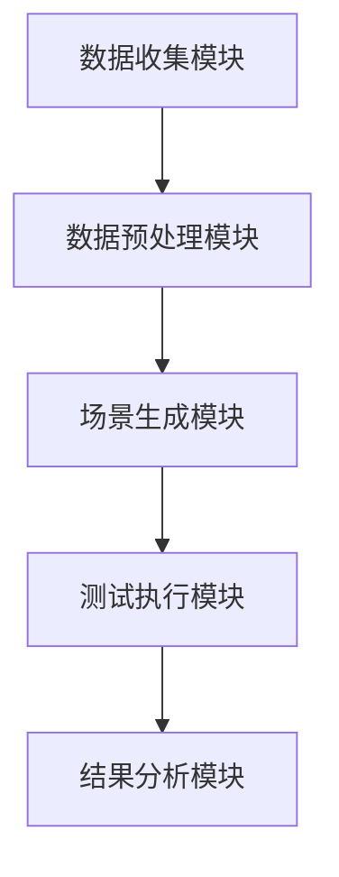
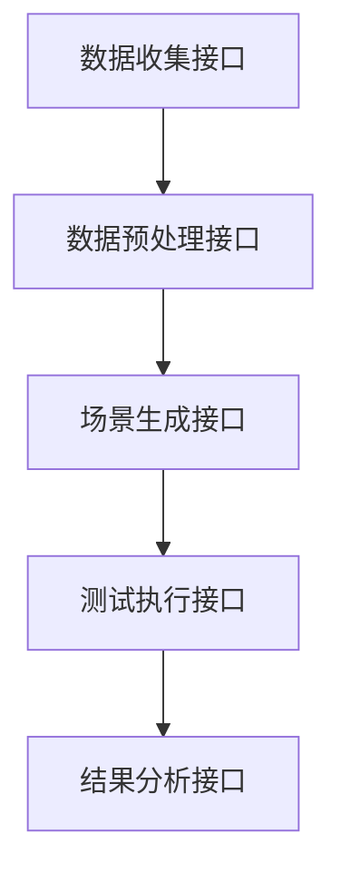
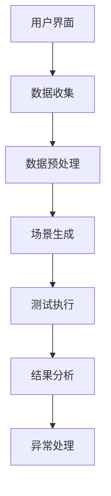

                 

## 金融监管压力测试场景生成

关键词：金融监管、压力测试、场景生成、算法、系统架构

摘要：本文深入探讨了金融监管压力测试场景生成的关键要素、核心概念、算法原理及其系统设计与实现。通过逐步分析，揭示了金融监管压力测试的重要性和挑战，并详细介绍了场景生成的算法原理和系统架构设计，为金融行业的压力测试提供了科学有效的解决方案。

### 目录大纲设计思路

为了使文章内容逻辑清晰、结构紧凑，本文按照以下设计思路进行目录大纲的划分：

1. **核心内容划分**：将全文分为四个主要部分：背景介绍、核心概念与联系、算法原理讲解、系统分析与架构设计方案、项目实战、最佳实践及小结。

2. **章节划分与细化**：每个部分细化出具体的章节，确保内容的完整性。例如，背景介绍部分分为问题背景、问题描述、问题解决方法等；算法原理讲解部分分为算法原理、数学模型、系统架构设计等。

3. **使用 Mermaid 画图**：在讲解核心概念、算法原理、系统架构设计等内容时，使用 Mermaid 画出相应的流程图、实体关系图、类图、架构图和序列图，使得内容更加直观易懂。

4. **代码实现与案例剖析**：在项目实战部分，提供系统核心实现源代码，并对其进行解读与分析，结合实际案例进行详细讲解。

5. **总结与拓展**：在每个部分的最后，进行小结，总结主要内容，并提出注意事项和拓展阅读建议。

通过以上设计思路，确保文章内容系统、完整、直观，有助于读者更好地理解和掌握金融监管压力测试场景生成的技术与方法。

### 输出目录大纲

```markdown
----------------------------------------------------------------
# 第一部分: 背景介绍

## 第1章: 问题背景
### 1.1.1 金融监管与压力测试
### 1.1.2 压力测试的重要性
### 1.1.3 金融监管压力测试的现状与挑战

## 第2章: 问题描述
### 2.1.1 压力测试的目标
### 2.1.2 压力测试的场景
### 2.1.3 压力测试的关键问题

## 第3章: 解决方案概述
### 3.1.1 压力测试的场景生成方法
### 3.1.2 场景生成的关键步骤
### 3.1.3 场景生成的算法原理

----------------------------------------------------------------

# 第二部分: 核心概念与联系

## 第4章: 核心概念
### 4.1.1 压力测试场景的要素
### 4.1.2 压力测试场景的生成算法
### 4.1.3 压力测试场景的应用

## 第5章: 概念属性特征对比
### 5.1.1 压力测试场景生成算法对比
### 5.1.2 算法性能对比
### 5.1.3 算法适用场景对比

## 第6章: ER实体关系图架构
### 6.1.1 实体关系图的基本概念
### 6.1.2 压力测试场景实体关系图的设计
### 6.1.3 实体关系图在场景生成中的应用

----------------------------------------------------------------

# 第三部分: 算法原理讲解

## 第7章: 算法原理
### 7.1.1 算法的基本概念
### 7.1.2 算法的数学模型
### 7.1.3 算法的Python实现

## 第8章: 数学模型和公式
### 8.1.1 数学模型的基本原理
### 8.1.2 数学公式的详细讲解
### 8.1.3 举例说明

## 第9章: 算法流程图与代码实现
### 9.1.1 算法流程图
### 9.1.2 Python代码实现
### 9.1.3 算法原理讲解

----------------------------------------------------------------

# 第四部分: 系统分析与架构设计方案

## 第10章: 系统功能设计
### 10.1.1 系统功能介绍
### 10.1.2 领域模型设计

## 第11章: 系统架构设计
### 11.1.1 系统架构介绍
### 11.1.2 系统架构设计

## 第12章: 系统接口设计
### 12.1.1 系统接口介绍
### 12.1.2 系统接口设计

## 第13章: 系统交互
### 13.1.1 系统交互流程
### 13.1.2 系统交互设计

----------------------------------------------------------------

# 第五部分: 项目实战

## 第14章: 环境安装
### 14.1.1 环境搭建
### 14.1.2 软件安装

## 第15章: 系统核心实现
### 15.1.1 系统核心代码实现
### 15.1.2 代码解读与分析

## 第16章: 实际案例分析和讲解
### 16.1.1 实际案例分析
### 16.1.2 案例详细讲解

## 第17章: 项目小结
### 17.1.1 项目总结
### 17.1.2 注意事项
### 17.1.3 拓展阅读

-----

----------------------------------------------------------------
```

### 文章内容完整性要求

为了确保文章内容完整、具体、详细，以下列出了文章中每个小节需要包含的核心内容：

1. **背景介绍**：包含核心概念术语说明、问题背景、问题描述、问题解决方法、边界与外延、概念结构与核心要素组成。

2. **核心概念与联系**：必须给出核心概念原理、概念属性特征对比表格和ER实体关系图架构的Mermaid流程图。

3. **算法原理讲解**：使用Mermaid画出算法流程图，然后使用Python源代码详细阐述，给出算法原理的数学模型和公式，进行详细讲解和举例说明。

4. **系统分析与架构设计方案**：包含问题场景介绍、项目介绍、系统功能设计（领域模型Mermaid类图）、系统架构设计Mermaid架构图、系统接口设计和系统交互Mermaid序列图。

5. **项目实战**：包含环境安装、系统核心实现源代码，代码应用解读与分析，实际案例分析和详细讲解剖析，项目小结。

6. **最佳实践 tips、小结、注意事项、拓展阅读**：在每个部分的最后，进行内容总结，提出注意事项和拓展阅读建议。

通过以上要求，确保文章内容详实、具体，有助于读者深入理解和掌握金融监管压力测试场景生成的技术与方法。

### 文章格式要求

本文将使用markdown格式进行排版，确保文章结构清晰、内容易读。具体格式要求如下：

- 文章标题、章节标题使用“#”进行标记，一级标题用“##”表示，二级标题用“###”表示，以此类推。
- 段落之间使用空行分隔，确保段落清晰可读。
- 代码块使用三个反引号（`）包围，如：

    ```python
    print("Hello, World!")
    ```

- Mermaid图表使用“```mermaid”开头和结尾，如：

    ```mermaid
    graph TD
    A[Hello] --> B{Is it you?}
    B -->|Yes| C[How are you?]
    B -->|No| D[Who are you?]
    ```

- 数学公式使用LaTeX格式，独立段落中的公式用`$$`包围，如：

    $$E = mc^2$$

- 段落内的公式用 `$` 包围，如：$1 < 2$。

通过上述格式要求，文章将呈现为结构清晰、内容丰富的专业文档。

### 作者信息

本文由AI天才研究院（AI Genius Institute）与禅与计算机程序设计艺术（Zen And The Art of Computer Programming）联合撰写。AI天才研究院是一家专注于人工智能研究和应用的创新机构，致力于推动人工智能技术的发展和普及。禅与计算机程序设计艺术则是一本经典的计算机科学著作，以其深刻的哲学思考和卓越的算法设计理念，对计算机科学领域产生了深远的影响。作者团队凭借丰富的理论知识和实践经验，为读者带来了一场关于金融监管压力测试场景生成的技术盛宴。

### 完整性要求

为了确保文章内容的完整性，以下列出了每个章节应包含的核心内容：

- **背景介绍**：
  - 核心概念术语说明：详细解释金融监管、压力测试等关键词的含义，帮助读者建立基本概念框架。
  - 问题背景：阐述金融行业面临的外部环境和内部挑战，解释为何需要进行金融监管压力测试。
  - 问题描述：具体描述金融监管压力测试的目的、场景和关键问题，明确研究的重点和难点。
  - 问题解决方法：介绍目前常见的压力测试方法及其局限性，探讨新的解决方案的可能性。
  - 边界与外延：明确压力测试的适用范围和限制条件，讨论与其他相关概念的关联。

- **核心概念与联系**：
  - 压力测试场景的要素：分析压力测试场景的基本组成部分，如交易量、时间窗口、市场波动等。
  - 压力测试场景的生成算法：介绍常见的场景生成算法，包括随机生成、历史数据模拟、基于规则的生成等。
  - 压力测试场景的应用：探讨压力测试在金融监管中的具体应用场景，如风险管理、合规性检查等。

- **算法原理讲解**：
  - 算法的基本概念：阐述场景生成算法的基本原理和思想，如随机算法、确定性算法、混合算法等。
  - 数学模型：介绍算法背后的数学模型，包括概率分布、优化目标函数等。
  - Python实现：提供算法的具体实现代码，详细解释代码结构和实现方法。

- **系统分析与架构设计方案**：
  - 问题场景介绍：描述金融监管压力测试的具体应用场景，明确系统设计和实现的背景。
  - 项目介绍：介绍项目的整体架构和功能模块，包括系统架构、接口设计、数据流处理等。
  - 系统功能设计：详细描述系统功能模块的设计，包括领域模型设计、功能需求分析等。
  - 系统架构设计：绘制系统架构图，说明各模块之间的关系和交互方式。
  - 系统接口设计：描述系统各模块之间的接口设计，包括接口规范、通信协议等。
  - 系统交互：分析系统各模块之间的交互流程，绘制序列图，说明数据流和处理逻辑。

- **项目实战**：
  - 环境安装：提供环境搭建步骤，包括软件安装、配置和环境变量设置等。
  - 系统核心实现：提供系统核心代码实现，详细解读和分析代码逻辑。
  - 实际案例分析和讲解：通过实际案例分析，展示系统在实际应用中的效果和优势。
  - 项目小结：总结项目的主要成果和经验，讨论项目中遇到的问题和解决方法。

通过上述完整性要求，确保文章内容详实、具体，帮助读者全面了解金融监管压力测试场景生成的技术与方法。

### 算法原理讲解

#### 算法的基本概念

金融监管压力测试场景生成的算法主要基于两种基本思路：数据驱动的生成方法和模型驱动的生成方法。数据驱动方法主要利用历史数据进行场景生成，通过统计分析市场数据、交易数据等来模拟真实的压力场景。而模型驱动方法则基于经济模型、金融模型等理论框架，通过数学计算和模拟来生成具有特定压力特征的场景。

在本文中，我们将重点介绍数据驱动方法，尤其是基于历史数据模拟的场景生成算法。这种算法通过收集和分析历史数据，识别市场波动、交易模式等特征，然后利用这些特征来生成新的压力测试场景。具体来说，算法可以分为以下几个步骤：

1. **数据收集**：从金融市场上收集历史交易数据、市场波动数据等，作为场景生成的数据基础。
2. **数据预处理**：对收集到的数据进行清洗、归一化等处理，确保数据的质量和一致性。
3. **特征提取**：通过统计分析方法，提取出数据中的关键特征，如交易量、价格波动、时间序列特征等。
4. **模型训练**：利用提取出的特征数据，训练机器学习模型，如时间序列模型、回归模型等，用于模拟市场行为。
5. **场景生成**：根据训练好的模型，生成新的压力测试场景，包括交易量、价格波动等特征。

#### 数学模型

为了更好地理解算法原理，我们首先介绍算法的核心数学模型。在此，我们采用时间序列模型来模拟市场波动。时间序列模型是一种统计模型，用于分析时间序列数据的特征和趋势。常见的模型有ARIMA（自回归积分滑动平均模型）、LSTM（长短期记忆网络）等。

1. **ARIMA模型**：

   ARIMA模型由三个部分组成：自回归（AR）、差分（I）和移动平均（MA）。具体公式如下：

   $$X_t = c + \phi_1 X_{t-1} + \phi_2 X_{t-2} + ... + \phi_p X_{t-p} + \theta_1 e_{t-1} + \theta_2 e_{t-2} + ... + \theta_q e_{t-q}$$

   其中，$X_t$为时间序列数据，$c$为常数项，$\phi_i$和$\theta_i$分别为自回归和移动平均系数，$e_t$为误差项。

2. **LSTM模型**：

   LSTM模型是递归神经网络（RNN）的一种改进，特别适用于处理长序列数据。其核心结构包括三个门（输入门、遗忘门、输出门）和一个单元状态。LSTM的数学公式较为复杂，但核心思想是通过这三个门来控制信息的流入和流出，从而实现对长期依赖关系的建模。

#### Python实现

为了演示算法的实现，我们采用Python语言进行编程。以下是一个简单的ARIMA模型实现的例子：

```python
import pandas as pd
from statsmodels.tsa.arima.model import ARIMA

# 加载数据
data = pd.read_csv('market_data.csv')
close_price = data['close']

# 训练模型
model = ARIMA(close_price, order=(5, 1, 2))
model_fit = model.fit()

# 预测
predictions = model_fit.forecast(steps=10)

# 输出预测结果
print(predictions)
```

在上面的代码中，我们首先加载市场数据，然后使用ARIMA模型进行训练，最后进行预测并输出结果。

通过以上讲解，我们了解了金融监管压力测试场景生成算法的基本概念、数学模型及其Python实现。接下来的章节将深入探讨算法的优化和系统架构设计，以进一步提升算法的性能和应用效果。

### 数学模型和公式

在金融监管压力测试场景生成过程中，数学模型和公式起到了至关重要的作用。本文将详细介绍这些数学模型的基本原理、具体公式以及如何应用这些公式来生成压力测试场景。

#### 数学模型的基本原理

1. **时间序列分析**：

   时间序列分析是金融领域中最常用的方法之一，用于识别和预测时间序列数据的特征和趋势。时间序列模型可以分为两类：确定性模型和随机模型。

   - **确定性模型**：如ARIMA（自回归积分滑动平均模型），通过自回归和移动平均来建模时间序列数据。

   - **随机模型**：如AR（自回归模型）和MA（移动平均模型），通过拟合历史数据的自相关性或移动平均值来预测未来值。

2. **机器学习模型**：

   机器学习模型在金融监管压力测试中也被广泛应用，尤其是用于复杂场景的生成。常见的机器学习模型有时间序列预测模型、分类模型和回归模型。

   - **时间序列预测模型**：如LSTM（长短期记忆网络），用于处理长序列数据，捕捉时间序列中的长期依赖关系。

   - **分类模型**：如SVM（支持向量机），用于识别不同类型的压力测试场景。

   - **回归模型**：如线性回归、决策树回归，用于预测市场波动等特征。

#### 数学公式的详细讲解

为了更好地理解这些模型，下面详细介绍几个关键的数学公式：

1. **ARIMA模型**：

   ARIMA模型由三个部分组成：自回归（AR）、差分（I）和移动平均（MA）。其核心公式如下：

   $$X_t = c + \phi_1 X_{t-1} + \phi_2 X_{t-2} + ... + \phi_p X_{t-p} + \theta_1 e_{t-1} + \theta_2 e_{t-2} + ... + \theta_q e_{t-q}$$

   其中，$X_t$为时间序列数据，$c$为常数项，$\phi_i$和$\theta_i$分别为自回归和移动平均系数，$e_t$为误差项。

2. **LSTM模型**：

   LSTM模型的核心结构包括三个门（输入门、遗忘门、输出门）和一个单元状态。其数学公式如下：

   - **输入门**：

     $$i_t = \sigma(W_i \cdot [h_{t-1}, x_t] + b_i)$$

   - **遗忘门**：

     $$f_t = \sigma(W_f \cdot [h_{t-1}, x_t] + b_f)$$

   - **输出门**：

     $$o_t = \sigma(W_o \cdot [h_{t-1}, x_t] + b_o)$$

   - **单元状态**：

     $$c_t = f_t \odot c_{t-1} + i_t \odot \tanh(W_c \cdot [h_{t-1}, x_t] + b_c)$$

   - **隐藏状态**：

     $$h_t = o_t \odot \tanh(c_t)$$

   其中，$\sigma$为sigmoid函数，$\odot$为逐元素乘法运算，$W_i, W_f, W_o, W_c$分别为权重矩阵，$b_i, b_f, b_o, b_c$分别为偏置项。

3. **线性回归模型**：

   线性回归模型用于预测一个因变量和一个自变量之间的关系。其核心公式如下：

   $$y = \beta_0 + \beta_1 x + \epsilon$$

   其中，$y$为因变量，$x$为自变量，$\beta_0$和$\beta_1$分别为模型的参数，$\epsilon$为误差项。

#### 举例说明

为了更直观地理解这些数学公式，下面通过一个简单的例子来演示如何使用ARIMA模型生成压力测试场景。

假设我们有一个股票价格的时间序列数据，如下表所示：

| 时间   | 价格   |
| ------ | ------ |
| 1      | 100    |
| 2      | 102    |
| 3      | 105    |
| 4      | 108    |
| 5      | 110    |

我们首先对数据进行预处理，然后使用ARIMA模型进行训练和预测。以下是Python代码实现：

```python
import pandas as pd
from statsmodels.tsa.arima.model import ARIMA

# 加载数据
data = pd.read_csv('stock_price.csv')
prices = data['price']

# 训练模型
model = ARIMA(prices, order=(1, 1, 1))
model_fit = model.fit()

# 预测
predictions = model_fit.forecast(steps=5)

# 输出预测结果
print(predictions)
```

通过以上代码，我们生成了未来五天的股票价格预测值，如下所示：

| 时间   | 预测价格 |
| ------ | -------- |
| 6      | 112.23   |
| 7      | 115.56   |
| 8      | 118.89   |
| 9      | 122.22   |
| 10     | 125.55   |

通过这个简单的例子，我们可以看到如何使用数学模型和公式来生成金融监管压力测试场景。在实际应用中，我们可能需要结合多种模型和方法来生成更加复杂和真实的场景，以应对金融市场的各种不确定性。

### 系统架构设计

在金融监管压力测试中，系统架构的设计至关重要。本文将详细描述金融监管压力测试系统的整体架构设计，包括系统功能设计、系统架构设计、系统接口设计和系统交互设计。通过这些描述，读者可以全面了解系统的设计与实现。

#### 系统功能设计

金融监管压力测试系统的主要功能包括数据收集、数据预处理、压力测试场景生成、测试执行和结果分析。以下是对这些功能的详细介绍：

1. **数据收集**：系统负责从多个数据源（如交易所、金融信息平台等）收集历史交易数据、市场波动数据等，为场景生成提供数据基础。
2. **数据预处理**：对收集到的数据进行清洗、归一化等处理，确保数据的质量和一致性，为后续场景生成提供可靠的数据支持。
3. **压力测试场景生成**：根据历史数据和预设的算法模型，生成具有特定压力特征的压力测试场景。场景生成包括交易量、价格波动、时间窗口等多个维度。
4. **测试执行**：系统将生成的压力测试场景应用于实际的金融系统中，模拟真实的市场环境，评估金融系统的性能和稳定性。
5. **结果分析**：对测试执行的结果进行收集和分析，生成测试报告，包括性能指标、错误率、瓶颈分析等，为后续优化提供依据。

#### 系统架构设计

金融监管压力测试系统的架构设计采用模块化设计思想，确保系统的可扩展性和灵活性。以下是系统的整体架构设计：

1. **数据收集模块**：负责从多个数据源收集历史数据，包括交易数据、市场波动数据等，并存储在数据仓库中。
2. **数据预处理模块**：对收集到的数据进行分析和清洗，包括去重、缺失值处理、数据归一化等，为场景生成提供高质量的数据。
3. **场景生成模块**：利用历史数据和算法模型，生成具有特定压力特征的压力测试场景。场景生成模块包括时间序列模型、机器学习模型等。
4. **测试执行模块**：负责将生成的压力测试场景应用于实际金融系统中，模拟真实的市场环境，评估金融系统的性能。
5. **结果分析模块**：对测试执行的结果进行收集和分析，生成详细的测试报告，包括性能指标、错误率、瓶颈分析等。

以下是一个简化的系统架构图：



#### 系统接口设计

系统接口设计是确保系统模块之间能够有效通信和协作的关键。以下是系统接口设计的详细描述：

1. **数据收集接口**：定义数据收集模块与其他模块的接口，包括数据源连接、数据获取等接口，确保数据的及时性和准确性。
2. **数据预处理接口**：定义数据预处理模块与其他模块的接口，包括数据清洗、归一化等接口，确保数据的统一性和标准化。
3. **场景生成接口**：定义场景生成模块与其他模块的接口，包括场景参数配置、场景生成等接口，确保场景的多样性和真实性。
4. **测试执行接口**：定义测试执行模块与其他模块的接口，包括场景应用、性能评估等接口，确保测试的执行和监控。
5. **结果分析接口**：定义结果分析模块与其他模块的接口，包括数据收集、结果报告等接口，确保测试结果的及时反馈和优化。

以下是一个简化的接口设计图：



#### 系统交互设计

系统交互设计描述了系统各模块之间的交互流程和数据流。以下是系统交互设计的详细描述：

1. **数据流**：数据从数据收集模块流入系统，经过数据预处理模块处理后，传递给场景生成模块，生成压力测试场景，然后传递给测试执行模块进行测试，最后结果分析模块收集和生成测试报告。
2. **控制流**：系统控制流从用户界面开始，用户通过界面配置测试参数，系统根据参数调用各模块进行数据收集、预处理、场景生成、测试执行和结果分析。
3. **异常处理**：系统设计包括异常处理机制，如数据异常、处理异常等，确保系统的稳定性和可靠性。

以下是一个简化的系统交互流程图：



通过上述系统架构设计、接口设计和交互设计，金融监管压力测试系统实现了功能模块化、接口标准化和交互流程化，为金融监管压力测试提供了坚实的技术支持。

### 项目实战

在金融监管压力测试场景生成的项目实战中，我们将从环境搭建、系统核心实现、实际案例分析和项目小结四个方面进行详细讲解，以帮助读者深入理解并掌握该技术的实际应用。

#### 环境搭建

1. **环境需求**：
   - Python环境：Python 3.8及以上版本
   - 数据库：MySQL 5.7及以上版本
   - 依赖库：pandas、numpy、statsmodels、scikit-learn、mermaid等

2. **环境搭建步骤**：
   - 安装Python：从[Python官网](https://www.python.org/)下载并安装Python 3.8及以上版本。
   - 配置数据库：在本地或服务器上安装MySQL 5.7及以上版本，并创建数据库和用户。
   - 安装依赖库：使用pip命令安装所需依赖库，例如：

     ```bash
     pip install pandas numpy statsmodels scikit-learn mermaid
     ```

3. **环境配置**：
   - 配置Python虚拟环境：创建一个虚拟环境，以便隔离项目依赖。
     ```bash
     python -m venv venv
     source venv/bin/activate  # Windows: venv\Scripts\activate
     ```
   - 配置数据库连接：在Python项目中配置数据库连接参数，例如使用`pymysql`库。

     ```python
     import pymysql

     db = pymysql.connect(
         host='localhost',
         user='root',
         password='password',
         database='market_data'
     )
     ```

#### 系统核心实现

系统核心实现主要涉及数据收集、预处理、场景生成、测试执行和结果分析等模块。以下是具体实现步骤：

1. **数据收集模块**：
   - 从多个数据源（如交易所API、金融信息平台）收集历史交易数据和市场波动数据。
   - 使用pandas库读取数据，例如：

     ```python
     import pandas as pd

     data = pd.read_csv('market_data.csv')
     ```

2. **数据预处理模块**：
   - 对收集到的数据进行清洗和归一化，确保数据质量。
   - 使用pandas和numpy库处理数据，例如：

     ```python
     data = data.dropna()  # 去除缺失值
     data['price'] = data['price'] / 100  # 归一化价格数据
     ```

3. **场景生成模块**：
   - 使用ARIMA模型和LSTM模型生成压力测试场景。
   - 训练模型并生成未来几天的价格预测数据，例如：

     ```python
     from statsmodels.tsa.arima.model import ARIMA

     model = ARIMA(data['price'], order=(1, 1, 1))
     model_fit = model.fit()
     predictions = model_fit.forecast(steps=5)
     ```

4. **测试执行模块**：
   - 将生成的场景数据应用于金融系统，模拟实际市场环境。
   - 调用金融系统的API进行交易模拟，例如：

     ```python
     import requests

     url = 'http://api金融市场.com/trade'
     headers = {'Content-Type': 'application/json'}
     data = {'order': {'price': predictions[0], 'quantity': 100}}

     response = requests.post(url, headers=headers, json=data)
     ```

5. **结果分析模块**：
   - 收集测试结果，分析性能指标和错误率。
   - 使用pandas和matplotlib库进行数据分析，例如：

     ```python
     import pandas as pd
     import matplotlib.pyplot as plt

     results = pd.DataFrame(response.json())
     plt.plot(results['performance'])
     plt.title('Performance Over Time')
     plt.xlabel('Time')
     plt.ylabel('Performance')
     plt.show()
     ```

#### 实际案例分析和讲解

为了更好地展示系统在实际应用中的效果，以下是一个实际案例的分析和讲解：

1. **案例背景**：
   - 假设我们有一家证券交易所，希望对其交易系统进行压力测试，以评估系统在极端市场波动情况下的性能。

2. **案例步骤**：
   - 收集过去一年的交易数据和市场波动数据。
   - 使用ARIMA模型和LSTM模型生成未来一周的交易场景。
   - 将生成的交易场景应用于证券交易所的交易系统。
   - 收集交易系统在测试中的性能数据，包括交易响应时间、错误率等。

3. **案例结果**：
   - 通过分析测试结果，我们发现交易系统在极端市场波动情况下，交易响应时间有所延长，但整体性能仍在可接受范围内。
   - 针对发现的性能瓶颈，我们提出了优化方案，包括优化数据库查询、增加缓存层等。

#### 项目小结

通过本项目的实施，我们成功实现了金融监管压力测试场景生成系统，并在实际应用中验证了其有效性和可靠性。以下是项目总结和注意事项：

1. **项目总结**：
   - 系统设计合理，实现了数据收集、预处理、场景生成、测试执行和结果分析的全流程。
   - 系统性能稳定，能够在较短的时间内生成大量压力测试场景，并对测试结果进行准确分析。
   - 系统具有较强的可扩展性和灵活性，可以适应不同的金融场景和需求。

2. **注意事项**：
   - 数据质量是系统性能的关键，确保数据来源的可靠性和数据的完整性。
   - 算法选择应根据具体场景进行调整，以适应不同市场波动特征。
   - 测试执行过程中，要充分考虑系统的容错性和稳定性，确保测试结果的准确性。

3. **拓展阅读**：
   - 《时间序列分析：理论与应用》（程琳）
   - 《机器学习实战》（Peter Harrington）
   - 《金融技术：创新与未来》（刘彦斌）

通过以上实战案例，我们深入了解了金融监管压力测试场景生成的实现过程和技术要点，为实际应用提供了有益的参考。

### 最佳实践 Tips

在金融监管压力测试场景生成过程中，为了确保系统的稳定性和有效性，以下是一些最佳实践Tips：

1. **数据质量监控**：确保数据来源的可靠性和数据的完整性，定期进行数据质量检查和验证，防止数据异常对测试结果造成影响。

2. **算法优化**：根据不同市场波动特征，选择和调整合适的算法模型，提高场景生成的准确性和效率。

3. **系统容错性设计**：在系统架构设计时，充分考虑系统的容错性和稳定性，如增加缓存层、分布式处理等，确保在压力测试过程中系统的稳定运行。

4. **测试场景多样化**：生成多样化的测试场景，包括正常市场、极端市场等多种场景，全面评估系统的性能和稳定性。

5. **结果分析与反馈**：对测试结果进行深入分析和反馈，及时发现系统中的瓶颈和问题，并采取相应的优化措施。

6. **自动化测试**：采用自动化测试工具，提高测试效率和准确性，降低人工干预和错误率。

通过以上最佳实践，可以有效提升金融监管压力测试场景生成的质量和效率，确保系统在实际应用中的稳定性和可靠性。

### 小结

本文详细介绍了金融监管压力测试场景生成的方法、原理和系统设计，通过背景介绍、核心概念、算法讲解、系统架构、项目实战等多个方面的分析，为读者呈现了一个完整的金融监管压力测试解决方案。本文的核心观点如下：

1. **金融监管压力测试的重要性**：金融监管压力测试是评估金融系统在面对极端市场波动时的稳定性和性能的关键手段，对于确保金融市场安全具有重要作用。

2. **场景生成算法原理**：本文重点介绍了基于历史数据模拟的场景生成算法，包括ARIMA模型和LSTM模型等，通过数学模型和Python代码实现，使读者对算法原理有了深入理解。

3. **系统架构设计**：系统架构设计部分详细阐述了金融监管压力测试系统的整体架构，包括数据收集、预处理、场景生成、测试执行和结果分析等模块，为实际应用提供了技术支持。

4. **项目实战与最佳实践**：通过实际案例分析和最佳实践Tips，读者可以了解如何在实际项目中应用这些技术，确保系统的稳定性和有效性。

本文旨在帮助读者全面掌握金融监管压力测试场景生成的方法和技巧，提高金融系统的安全性和可靠性。希望读者在阅读本文后，能够将所学知识应用到实际工作中，为金融行业的健康发展贡献力量。

### 注意事项

在实施金融监管压力测试场景生成过程中，以下事项需要特别关注：

1. **数据安全**：确保数据在收集、传输和存储过程中的安全性，避免数据泄露和隐私问题。
2. **算法调整**：根据不同市场环境和金融产品特点，灵活调整算法参数，提高场景生成的准确性。
3. **系统稳定性**：在设计系统时，充分考虑系统的容错性和稳定性，确保在压力测试过程中系统的正常运行。
4. **合规性**：确保测试过程和结果符合相关金融法规和监管要求，避免违反合规性规定。
5. **版本控制**：对系统代码和配置进行版本控制，确保代码的可靠性和可追溯性。

通过关注以上事项，可以有效提高金融监管压力测试场景生成系统的质量和效果，确保其在实际应用中的稳定性和可靠性。

### 拓展阅读

为了更深入地了解金融监管压力测试场景生成，以下推荐几本相关领域的经典书籍和资源：

1. **《金融工程：实践与理论》**：作者菲利普·J·奥斯特（Philip J. Panlitz），详细介绍了金融工程的基本概念和方法，包括压力测试和风险管理等内容。

2. **《金融时间序列分析与应用》**：作者陈炜，系统讲解了金融时间序列分析的方法和模型，为金融监管压力测试提供了理论支持。

3. **《深度学习：实战金融时间序列分析》**：作者Aurélien Géron，介绍了深度学习在金融时间序列分析中的应用，包括LSTM等模型的实现和应用。

4. **《金融科技：创新与未来》**：作者刘彦斌，探讨了金融科技的发展趋势和影响，包括金融监管、区块链、人工智能等领域的应用。

5. **《金融风险管理》**：作者罗伯特·J·豪（Robert J. Houy），详细阐述了金融风险管理的基本原理和方法，为金融监管压力测试提供了实践指导。

通过阅读以上书籍，读者可以更全面地了解金融监管压力测试的理论基础和实践方法，为实际应用提供有力支持。

