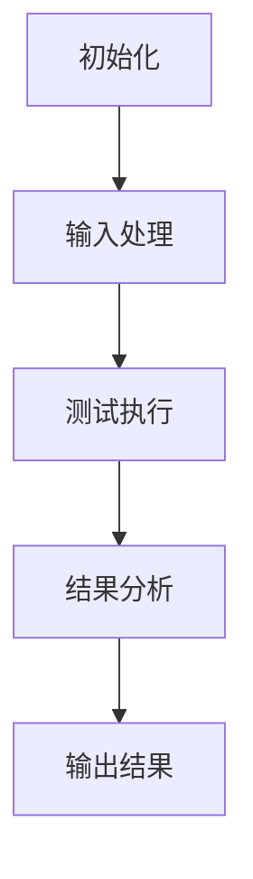
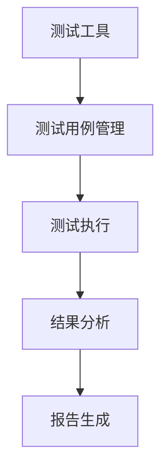
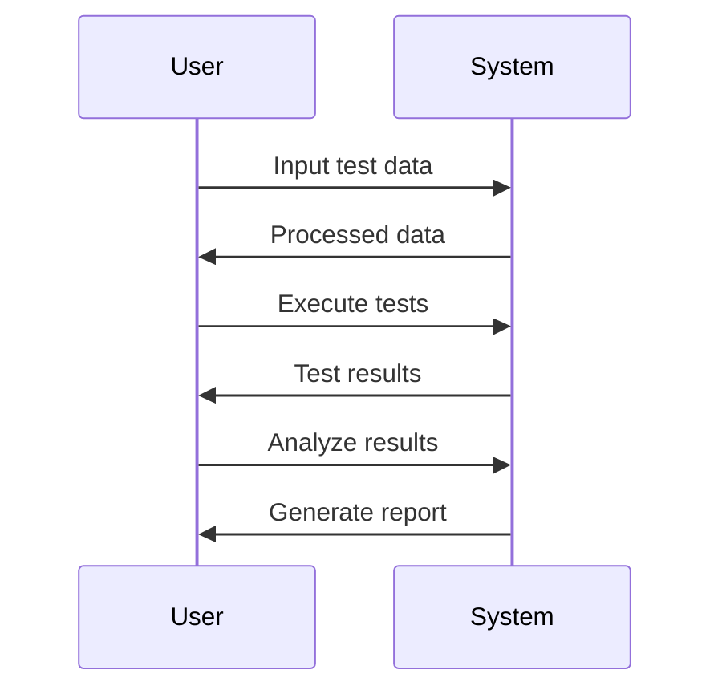

                 


# 设计思路与步骤

在设计《金融监管合规自动化测试平台》的技术博客文章时，我们需要遵循以下思路和步骤：

## 1. 明确目标

首先，我们要明确文章的目标。本文旨在介绍金融监管合规自动化测试平台的设计与实现，通过详细的阐述帮助读者理解平台的设计理念、技术架构和实施过程。

## 2. 确定结构

### 2.1 引言

引言部分要简要介绍金融监管合规的重要性，以及为什么自动化测试在监管合规中起到关键作用。这将为读者搭建一个背景知识框架。

### 2.2 背景介绍

在背景介绍部分，我们需要详细解释金融监管合规的定义、现状和挑战，以及自动化测试在其中的作用。这将帮助读者理解问题背景和需求。

### 2.3 核心概念与联系

这一部分将详细讨论金融监管合规、自动化测试和测试平台的核心概念。我们将使用Mermaid流程图和ER实体关系图来帮助读者更直观地理解这些概念。

### 2.4 算法原理讲解

我们将深入探讨自动化测试算法的原理，包括基本流程、实现方法和数学模型。通过Python源代码示例和mermaid流程图，我们将确保读者能够理解并掌握算法的核心思想。

### 2.5 系统分析与架构设计

在这一部分，我们将展示系统架构的Mermaid架构图和系统接口设计，并通过序列图描述系统交互流程。这将帮助读者了解系统的整体设计和运行机制。

### 2.6 项目实战

项目实战部分将提供一个实际的案例，详细描述从环境安装到系统实现的每一步，并解读核心代码和案例分析。

### 2.7 最佳实践和总结

最后，我们将提供一些最佳实践的建议，总结全文内容，并指出需要注意的事项和未来的拓展方向。

## 3. 实施步骤

### 3.1 文章大纲设计

首先，我们需要根据上述结构设计一个详细的大纲。这包括确定每个章节的小标题，确保内容逻辑清晰、层次分明。

### 3.2 内容撰写

根据大纲，逐步撰写每个章节的内容。在撰写过程中，注意以下几点：

- 使用简单易懂的技术语言。
- 在适当的位置插入Mermaid流程图、ER实体关系图和Python代码示例。
- 遵循markdown格式要求。

### 3.3 修订和审阅

完成初稿后，进行修订和审阅。检查文章的逻辑连贯性、语言表达是否清晰，以及内容是否完整。

### 3.4 格式调整

最后，调整文章格式，确保所有内容都按照markdown格式排版。检查链接、图片和其他元素的插入是否正确。

## 4. 产出

完成上述步骤后，我们将会得到一篇结构清晰、内容丰富的技术博客文章，它不仅能够帮助读者理解金融监管合规自动化测试平台的设计和实现，还能提供实际操作的经验和最佳实践。

# 设计思路与步骤

在设计《金融监管合规自动化测试平台》的技术博客文章时，我们将采取以下具体步骤：

## 1. 引言

### 1.1 文章标题与关键词

**文章标题：金融监管合规自动化测试平台**

**关键词：金融监管、合规、自动化测试、平台、架构、实现**

### 1.2 摘要

本文将探讨金融监管合规自动化测试平台的设计与实现，详细分析其背景、核心概念、算法原理、系统架构和项目实战，提供最佳实践和建议。

## 2. 背景介绍

### 2.1 问题背景

金融监管合规是金融机构必须遵守的法律、法规和准则，以保障市场公平、稳定和透明。随着金融科技的快速发展，自动化测试在金融监管合规中的作用越来越重要。

### 2.2 问题定义

自动化测试平台旨在通过自动化测试工具和方法，对金融监管合规相关系统进行测试，以确保系统符合相关法规和标准。

### 2.3 解决方案

设计并实现一个自动化测试平台，能够高效、准确地执行测试任务，满足金融监管合规的要求。

## 3. 核心概念与联系

### 3.1 金融监管合规

金融监管合规涉及一系列法律法规、准则和标准，旨在规范金融市场行为，保障市场公平和稳定。

### 3.2 自动化测试

自动化测试是一种通过预定义测试用例和工具自动执行测试的方法，提高测试效率和准确性。

### 3.3 测试平台

测试平台是一个集成环境，提供自动化测试工具、测试数据和管理功能，支持自动化测试的全面实施。

## 4. 算法原理讲解

### 4.1 自动化测试算法

自动化测试算法包括测试用例设计、测试执行和结果分析等步骤。我们使用Mermaid流程图和Python代码示例来详细阐述。

### 4.2 算法流程图



### 4.3 Python代码示例

```python
def automated_test(input_data):
    # 输入数据处理
    processed_data = preprocess(input_data)
    
    # 测试执行
    test_results = execute_tests(processed_data)
    
    # 结果分析
    analysis_results = analyze_tests(test_results)
    
    # 输出结果
    return analysis_results
```

### 4.4 数学模型和公式

自动化测试的效率和质量可以通过以下数学模型来评估：

$$
\text{效率} = \frac{\text{自动化测试执行时间}}{\text{手动测试执行时间}}
$$

$$
\text{质量} = \frac{\text{自动化测试覆盖范围}}{\text{手动测试覆盖范围}}
$$

## 5. 系统分析与架构设计

### 5.1 系统架构

系统架构设计包括测试工具选择、测试流程设计和数据管理策略。我们使用Mermaid架构图来展示系统架构。

### 5.2 Mermaid架构图



### 5.3 系统接口设计

系统接口设计包括测试数据输入接口、测试结果输出接口和用户管理接口。我们使用Mermaid序列图来描述系统交互流程。

### 5.4 Mermaid序列图



## 6. 项目实战

### 6.1 环境安装

详细描述自动化测试平台的环境安装步骤，包括测试工具安装、配置和环境搭建。

### 6.2 系统核心实现

提供系统核心实现的源代码，并详细解读代码的功能和原理。

### 6.3 代码解读与分析

分析自动化测试平台的关键代码段，解释其实现逻辑和算法原理。

### 6.4 案例分析

提供实际案例，分析自动化测试平台在实际应用中的效果和问题。

### 6.5 项目小结

总结项目经验，提出改进建议和未来发展方向。

## 7. 最佳实践和总结

### 7.1 最佳实践

提供金融监管合规自动化测试平台的最佳实践建议，包括测试用例设计、测试执行和结果分析等方面。

### 7.2 小结

总结文章的核心内容，强调自动化测试平台在金融监管合规中的重要性。

### 7.3 注意事项

提醒读者在设计自动化测试平台时需要注意的事项，如安全性、可维护性和可扩展性等。

### 7.4 拓展阅读

推荐相关领域的书籍、文章和资源，供读者进一步学习。

## 8. 作者信息

**作者：AI天才研究院/AI Genius Institute & 禅与计算机程序设计艺术 /Zen And The Art of Computer Programming**

通过以上步骤，我们将完成一篇全面、深入的《金融监管合规自动化测试平台》技术博客文章。文章不仅阐述了平台的设计原理和实现方法，还提供了实际操作的经验和最佳实践，旨在帮助读者更好地理解和应用金融监管合规自动化测试平台。

