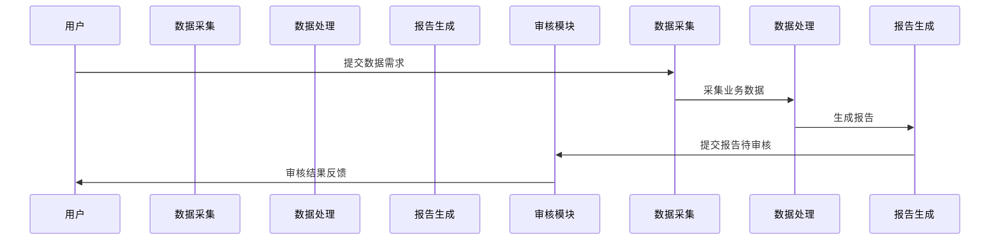

                 

### 第1章 引言与背景介绍

#### 1.1 金融监管报告的重要性

金融监管报告是金融机构为了遵守相关法规和监管要求，定期向监管机构提交的详细文件。这些报告不仅反映了金融机构的运营状况、风险管理和合规性，还为监管机构提供了必要的决策依据。随着金融市场的复杂性和全球化的加深，金融监管报告的重要性愈发凸显。

**作用与意义**：首先，金融监管报告在风险控制方面起着关键作用。通过报告，金融机构可以揭示潜在的风险点，及时采取相应的风险控制措施，从而保障金融系统的稳定。其次，这些报告为监管机构提供了透明度，使得监管工作更加科学和有效。此外，金融监管报告对于投资者、债权人等利益相关者也具有重要参考价值，有助于他们做出更加理性的投资决策。

**问题背景**：然而，传统的金融监管报告存在一些问题。首先，报告生成过程往往非常繁琐，需要人工处理大量的数据和文本，导致工作效率低下。其次，报告内容可能存在遗漏或错误，影响监管效果。最后，报告提交后，监管机构需要耗费大量人力和时间对报告进行审核，增加了监管成本。

**问题描述**：具体来说，传统监管报告生成与审核面临以下挑战：
1. **数据来源多样性与一致性**：金融机构需要从不同系统中提取数据，并将其整合到一个统一的格式中，以保证报告的一致性和准确性。
2. **报告格式标准化**：不同的监管机构可能对报告的格式和内容有不同的要求，需要实现统一格式，以避免因格式问题导致审核延误。
3. **报告内容的准确性与完整性**：确保报告中的数据和信息准确无误，避免遗漏重要信息。
4. **审核效率**：人工审核报告不仅耗时，而且容易出现疏漏，影响监管效果。

#### 1.2 金融机构监管现状分析

**当前金融监管体系的结构**：当前的金融监管体系通常由中央银行、证券监管机构、保险监管机构和银行业监管机构等多个部门组成。这些部门分别负责不同类型的金融机构和金融业务，共同维护金融市场的稳定。

**监管报告的生成与提交流程**：金融机构的监管报告通常包括季度报告、年度报告和临时报告。这些报告的生成与提交流程一般如下：
1. **数据采集**：从金融机构的各个业务系统中提取相关数据。
2. **数据整合**：将不同来源的数据整合到一个统一的数据集中，并进行清洗和格式化。
3. **报告生成**：根据监管要求，利用特定的模板和工具生成报告。
4. **报告审核**：报告提交前，内部审核团队进行审核，确保报告的准确性和完整性。
5. **报告提交**：将审核后的报告提交给监管机构。

#### 1.3 自动化生成与审核系统的需求

**人工生成监管报告的局限性**：人工生成监管报告存在效率低下、容易出现错误等问题。首先，数据采集和整合过程繁琐，需要大量人工操作。其次，报告生成和审核过程中，人工干预可能导致数据不一致或错误。最后，人工审核效率低下，容易出现疏漏。

**自动化生成与审核系统的必要性**：为了解决这些问题，金融机构需要引入自动化生成与审核系统。首先，自动化系统能够从多个业务系统中高效地采集和整合数据，提高数据处理的效率。其次，系统能够根据预设的模板和规则自动生成报告，确保报告的一致性和准确性。最后，自动化审核系统能够快速、准确地审核报告，提高审核效率，减少人工干预。

#### 1.4 系统设计与实现目标

**系统设计的原则与目标**：
1. **高效性**：系统能够快速地处理大量数据，实现自动化报告生成和审核。
2. **准确性**：系统能够确保报告的准确性和完整性，减少人工错误。
3. **可扩展性**：系统设计应考虑未来的扩展需求，能够适应不同监管要求和数据格式。
4. **易用性**：系统界面友好，操作简便，降低用户使用门槛。

**系统实现的关键技术点**：
1. **数据采集与预处理**：利用数据集成技术，从多个业务系统中提取数据，并进行清洗和格式化。
2. **报告生成算法**：设计高效的报告生成算法，根据监管要求自动生成报告。
3. **审核算法**：设计自动化审核算法，快速、准确地审核报告。
4. **接口设计与集成**：设计统一的接口，实现系统与其他业务系统的无缝集成。

---

## 第2章 核心概念与联系

### 2.1 金融监管概念解析

**金融监管的定义与历史演变**：金融监管是指监管机构对金融市场、金融机构及其业务的监督和管理，以确保金融系统的稳定性、透明度和公平性。金融监管的历史可以追溯到20世纪30年代的经济大萧条，当时为了防止类似事件再次发生，各国开始建立金融监管体系。

**金融监管的核心要素**：金融监管的核心要素包括监管主体、监管对象、监管目标和监管手段。监管主体包括中央银行、证券监管机构、保险监管机构和银行业监管机构等；监管对象包括金融机构、金融市场和金融产品；监管目标包括维护金融稳定、保护投资者权益和促进金融市场发展；监管手段包括法律法规、规章制度、现场检查和非现场监管等。

### 2.2 自动化生成技术概述

**自动化生成的基本原理**：自动化生成技术利用计算机程序和算法，自动从原始数据中提取、转换和处理信息，生成所需报告。自动化生成技术的核心在于数据提取、数据处理和数据格式化。

**常用自动化生成工具与技术**：
1. **数据处理工具**：如Python的Pandas库、R语言的dplyr包等，用于数据清洗、转换和分析。
2. **报告生成工具**：如Java的JasperReports、Python的iReport等，用于生成各种格式的报告，包括PDF、Word和Excel等。
3. **自然语言处理（NLP）技术**：利用NLP技术，将结构化数据转换为自然语言描述，生成文本报告。

### 2.3 审核与校验技术

**审核与校验的目的与过程**：审核与校验的目的是确保报告的准确性、完整性和合规性。审核与校验过程一般包括数据校验、内容校验和格式校验。

**常用审核与校验方法**：
1. **规则校验**：根据预定义的规则，对报告中的数据、文本和格式进行校验，如数据范围校验、文本一致性校验等。
2. **机器学习校验**：利用机器学习算法，对报告中的异常值和异常模式进行识别和校验，如基于神经网络和决策树的方法。
3. **人工审核**：尽管自动化审核能够提高效率，但某些复杂的校验问题仍需人工审核，以确保准确性。

### 2.4 概念属性特征对比

**金融监管、自动化生成、审核技术的对比**：

| 对比维度       | 金融监管                 | 自动化生成               | 审核与校验              |
|----------------|--------------------------|--------------------------|-------------------------|
| 定义           | 对金融市场和金融机构的监督和管理 | 从原始数据生成报告的过程 | 确保报告的准确性、完整性和合规性 |
| 目标           | 维护金融稳定、保护投资者权益、促进金融市场发展 | 提高报告生成效率、确保报告准确性 | 提高审核效率、减少人工干预 |
| 关键技术       | 法律法规、规章制度、现场检查、非现场监管 | 数据处理、报告生成工具、NLP技术 | 规则校验、机器学习校验、人工审核 |
| 优势           | 提高监管透明度、降低监管成本 | 提高报告生成效率、降低人工负担 | 提高审核准确性、减少错误率 |
| 劣势           | 监管工作复杂、监管成本高 | 技术门槛较高、数据质量依赖性大 | 对复杂问题的识别能力有限 |

### 2.5 ER实体关系图架构

**系统中的关键实体及其关系**：在金融监管报告自动化生成与审核系统中，关键实体包括数据源、数据集、报告模板、报告、审核记录等。ER实体关系图如下所示：

```mermaid
erDiagram
  数据源 ||--|{ 报告模板 }
  数据源 ||--|{ 报告 }
  数据源 ||--|{ 审核记录 }
  数据集 ||--|{ 报告模板 }
  数据集 ||--|{ 报告 }
  数据集 ||--|{ 审核记录 }
  报告模板 ||--|{ 报告 }
  报告模板 ||--|{ 审核记录 }
  报告 ||--|{ 审核记录 }
```

该ER图描述了系统中的主要实体及其相互关系。数据源和报告模板之间存在一对多的关系，即一个数据源可以生成多个报告模板；数据集与报告模板、报告和审核记录之间也存在类似的关系。报告模板和报告之间存在一对一的关系，每个报告模板可以生成一个报告。报告与审核记录之间存在一对多的关系，即每个报告可以生成多个审核记录。

---

## 第3章 系统架构设计与实现

### 3.1 系统架构设计

**系统架构的总体设计**：金融监管报告自动化生成与审核系统的总体架构分为四个主要模块：数据采集模块、数据处理模块、报告生成模块和审核模块。系统架构图如下所示：



**系统模块划分**：系统模块划分如下：
1. **数据采集模块**：负责从各个业务系统中提取所需数据，并进行初步清洗和格式化。
2. **数据处理模块**：对采集到的数据进行进一步处理，包括数据整合、数据清洗、数据转换等，以便生成报告。
3. **报告生成模块**：根据预设的模板和规则，利用数据处理模块提供的数据，自动生成金融监管报告。
4. **审核模块**：对生成的报告进行审核，包括数据校验、内容校验和格式校验，确保报告的准确性和完整性。

### 3.2 数据采集与预处理

**数据来源与采集方式**：数据采集模块从金融机构的多个业务系统中提取所需数据。这些业务系统可能包括银行系统、证券系统、保险系统等。数据采集方式包括接口调用、数据库查询和文件读取等。

**数据预处理技术**：
1. **数据清洗**：包括数据去重、缺失值填补、异常值处理等，以提高数据质量。
2. **数据整合**：将来自不同业务系统的数据进行整合，形成一个统一的数据集，以便后续处理。
3. **数据格式化**：将不同格式的数据转换为统一的格式，如将Excel文件转换为CSV文件，或XML文件转换为JSON格式。

**具体步骤**：
1. **数据采集**：通过接口调用、数据库查询等方式，从各个业务系统中提取所需数据。
2. **数据清洗**：对提取的数据进行去重、缺失值填补和异常值处理，以提高数据质量。
3. **数据整合**：将来自不同业务系统的数据进行整合，形成一个统一的数据集。
4. **数据格式化**：将整合后的数据格式化，转换为统一的格式，便于后续处理。

### 3.3 自动化报告生成

**报告生成流程**：报告生成模块根据预设的模板和规则，利用数据处理模块提供的数据，自动生成金融监管报告。具体流程如下：
1. **模板加载**：加载预设的报告模板，包括报告的结构、格式和内容要求。
2. **数据映射**：将数据处理模块提供的数据映射到报告模板中，生成初步的报告草稿。
3. **报告校验**：对生成的报告草稿进行校验，确保报告内容符合监管要求。
4. **报告生成**：将校验通过的报告草稿转换为最终的报告格式，如PDF、Word等。

**自动化生成算法原理**：报告生成模块的核心算法包括数据映射算法和报告校验算法。
1. **数据映射算法**：根据报告模板的结构和内容要求，将数据处理模块提供的数据映射到报告模板中。算法流程如下：
   ```mermaid
   flowchart TD
     A[初始化] --> B[加载模板]
     B --> C[读取数据]
     C --> D{数据匹配}
     D -->|匹配成功| E[生成草稿]
     D -->|匹配失败| F[提示错误]
     E --> G[校验报告]
     F --> G
   ```
2. **报告校验算法**：对生成的报告草稿进行校验，确保报告内容符合监管要求。校验过程包括数据校验、格式校验和内容校验。算法流程如下：
   ```mermaid
   flowchart TD
     A[初始化] --> B[加载报告]
     B --> C[数据校验]
     C --> D[格式校验]
     D --> E[内容校验]
     E --> F[校验通过]
     F --> G[生成报告]
     C -->|校验失败| H[提示错误]
     D -->|校验失败| H
     E -->|校验失败| H
   ```

### 3.4 报告审核与校验

**审核与校验流程**：审核模块对生成的报告进行审核，包括数据校验、内容校验和格式校验，确保报告的准确性和完整性。具体流程如下：
1. **报告提交**：将生成的报告提交到审核模块进行审核。
2. **数据校验**：对报告中的数据进行校验，确保数据的准确性。
3. **内容校验**：对报告的内容进行校验，确保报告符合监管要求。
4. **格式校验**：对报告的格式进行校验，确保报告格式正确。
5. **审核反馈**：审核完成后，将审核结果反馈给用户。

**审核与校验算法原理**：审核模块的核心算法包括数据校验算法、内容校验算法和格式校验算法。
1. **数据校验算法**：对报告中的数据进行校验，确保数据在合理范围内，如数值范围校验、文本长度校验等。算法流程如下：
   ```mermaid
   flowchart TD
     A[初始化] --> B[加载报告]
     B --> C[数据校验]
     C --> D[校验通过]
     C -->|校验失败| E[提示错误]
     D --> F[内容校验]
   ```
2. **内容校验算法**：对报告的内容进行校验，确保报告内容符合监管要求，如报告结构是否完整、数据是否一致等。算法流程如下：
   ```mermaid
   flowchart TD
     A[初始化] --> B[加载报告]
     B --> C[内容校验]
     C --> D[校验通过]
     C -->|校验失败| E[提示错误]
     D --> F[格式校验]
   ```
3. **格式校验算法**：对报告的格式进行校验，确保报告格式正确，如字体、段落、标题等是否符合规定。算法流程如下：
   ```mermaid
   flowchart TD
     A[初始化] --> B[加载报告]
     B --> C[格式校验]
     C --> D[校验通过]
     C -->|校验失败| E[提示错误]
     D --> F[审核反馈]
   ```

### 3.5 系统集成与接口设计

**系统集成方案**：系统集成是将各个模块有机地结合在一起，形成一个完整、高效的工作流程。系统集成的关键在于接口设计，确保各个模块之间的数据传输和功能调用顺畅。

**系统接口设计与实现**：系统接口设计主要包括数据接口和功能接口。
1. **数据接口**：数据接口负责各个模块之间的数据传输，包括数据采集模块与数据处理模块、数据处理模块与报告生成模块、报告生成模块与审核模块之间的数据交换。
2. **功能接口**：功能接口负责模块之间的功能调用，如报告生成模块调用数据处理模块提供的数据，审核模块调用报告生成模块生成的报告等。

**接口实现细节**：
1. **数据接口实现**：采用RESTful API设计数据接口，使用HTTP协议进行数据传输。具体实现如下：
   ```python
   from flask import Flask, request, jsonify
   
   app = Flask(__name__)
   
   @app.route('/data', methods=['GET', 'POST'])
   def data_interface():
       if request.method == 'GET':
           # 从数据库中查询数据
           data = get_data_from_db()
           return jsonify(data)
       elif request.method == 'POST':
           # 接收数据并保存到数据库
           data = request.json
           save_data_to_db(data)
           return jsonify({'status': 'success'})
   
   if __name__ == '__main__':
       app.run(debug=True)
   ```

2. **功能接口实现**：采用RPC（Remote Procedure Call）实现功能接口，通过调用远程方法实现模块间的功能调用。具体实现如下：
   ```python
   from kazoo.client import KazooClient
   
   zk = KazooClient(hosts='localhost:2181')
   zk.start()
   
   @zk.register('/data/processor')
   def process_data(data):
       # 处理数据
       processed_data = process_data_impl(data)
       return processed_data
   
   if __name__ == '__main__':
       zk.run()
   ```

通过上述设计与实现，我们构建了一个完整的金融监管报告自动化生成与审核系统，实现了从数据采集、数据处理、报告生成到审核的完整工作流程。

---

## 第4章 项目实战：环境搭建与系统配置

### 4.1 开发环境搭建

**系统所需的软件与硬件环境**：金融监管报告自动化生成与审核系统的开发与运行需要以下软件与硬件环境：
1. **操作系统**：Linux或Windows操作系统，推荐使用Ubuntu 18.04或Windows 10。
2. **数据库**：MySQL数据库，版本要求5.7及以上。
3. **开发工具**：Python 3.7及以上版本，推荐使用PyCharm或VSCode。
4. **依赖库**：Pandas、NumPy、Flask、Kafka、Zookeeper等。

**环境搭建步骤**：
1. **安装操作系统**：下载并安装Linux或Windows操作系统。
2. **安装数据库**：下载并安装MySQL数据库，配置数据库和用户权限。
3. **安装Python**：在操作系统上安装Python 3.7及以上版本，并配置环境变量。
4. **安装依赖库**：使用pip命令安装所需的依赖库，如Pandas、NumPy、Flask等。
5. **安装Kafka和Zookeeper**：下载并安装Kafka和Zookeeper，配置Kafka集群。

### 4.2 数据库设计与配置

**数据库架构设计**：数据库设计是系统架构的核心部分，我们需要设计以下数据库表：
1. **数据源表**：存储数据源的信息，包括数据源名称、类型、连接信息等。
2. **数据集表**：存储数据集的信息，包括数据集名称、数据源ID、数据内容等。
3. **报告模板表**：存储报告模板的信息，包括模板名称、模板内容、模板类型等。
4. **报告表**：存储生成的报告信息，包括报告ID、报告名称、报告内容等。
5. **审核记录表**：存储审核记录的信息，包括审核ID、报告ID、审核状态、审核结果等。

**数据库配置与连接**：
1. **配置数据库**：在MySQL中创建数据库，并创建上述表结构。
2. **连接数据库**：在Python代码中使用MySQL Connector或PyMySQL库连接数据库，实现数据的存储和查询。

**示例代码**：
```python
import mysql.connector

# 连接数据库
conn = mysql.connector.connect(
    host="localhost",
    user="root",
    password="password",
    database="financial_reporting"
)

# 创建数据库表
cursor = conn.cursor()

create_tables_sql = """
CREATE TABLE IF NOT EXISTS datasource (
    id INT AUTO_INCREMENT PRIMARY KEY,
    name VARCHAR(255) NOT NULL,
    type VARCHAR(255) NOT NULL,
    connection_info TEXT NOT NULL
);

CREATE TABLE IF NOT EXISTS dataset (
    id INT AUTO_INCREMENT PRIMARY KEY,
    name VARCHAR(255) NOT NULL,
    datasource_id INT NOT NULL,
    data TEXT NOT NULL,
    FOREIGN KEY (datasource_id) REFERENCES datasource(id)
);

CREATE TABLE IF NOT EXISTS report_template (
    id INT AUTO_INCREMENT PRIMARY KEY,
    name VARCHAR(255) NOT NULL,
    content TEXT NOT NULL,
    type VARCHAR(255) NOT NULL
);

CREATE TABLE IF NOT EXISTS report (
    id INT AUTO_INCREMENT PRIMARY KEY,
    name VARCHAR(255) NOT NULL,
    template_id INT NOT NULL,
    content TEXT NOT NULL,
    FOREIGN KEY (template_id) REFERENCES report_template(id)
);

CREATE TABLE IF NOT EXISTS audit_record (
    id INT AUTO_INCREMENT PRIMARY KEY,
    report_id INT NOT NULL,
    status VARCHAR(255) NOT NULL,
    result TEXT,
    FOREIGN KEY (report_id) REFERENCES report(id)
);
"""

cursor.execute(create_tables_sql)
conn.commit()
cursor.close()
conn.close()
```

通过上述步骤，我们完成了开发环境搭建和数据库设计与配置，为后续系统的核心功能实现奠定了基础。

### 4.3 系统核心功能实现

**系统核心功能模块实现**：本节将详细描述金融监管报告自动化生成与审核系统的核心功能模块实现，包括数据采集、数据处理、报告生成和报告审核。

**1. 数据采集模块实现**：数据采集模块负责从不同的业务系统中提取所需的数据。具体实现步骤如下：
1. **连接业务系统**：使用API接口或数据库连接方式，连接业务系统。
2. **数据提取**：调用业务系统的API接口或执行数据库查询语句，提取所需数据。
3. **数据存储**：将提取的数据存储到系统中，通常使用数据库存储。

**示例代码**：
```python
import requests
import json

def fetch_data_from_business_system(url, params):
    response = requests.get(url, params=params)
    if response.status_code == 200:
        return response.json()
    else:
        return None

url = "http://business_system/api/data"
params = {"id": 123}
data = fetch_data_from_business_system(url, params)
if data:
    # 存储数据到数据库
    # ...
```

**2. 数据处理模块实现**：数据处理模块负责对提取的数据进行清洗、整合和格式化。具体实现步骤如下：
1. **数据清洗**：处理缺失值、异常值和数据去重。
2. **数据整合**：将来自不同业务系统的数据进行整合，形成统一的数据集。
3. **数据格式化**：将数据格式转换为统一的标准格式，如CSV或JSON。

**示例代码**：
```python
import pandas as pd

def clean_data(data):
    # 数据清洗逻辑
    # ...
    return cleaned_data

def integrate_data(datasets):
    # 数据整合逻辑
    # ...
    return integrated_data

def format_data(data):
    # 数据格式化逻辑
    # ...
    return formatted_data

cleaned_data = clean_data(data)
integrated_data = integrate_data(datasets)
formatted_data = format_data(integrated_data)
```

**3. 报告生成模块实现**：报告生成模块根据预设的模板和规则，利用数据处理模块提供的数据，自动生成金融监管报告。具体实现步骤如下：
1. **模板加载**：加载预设的报告模板。
2. **数据映射**：将数据处理模块提供的数据映射到报告模板中，生成初步的报告草稿。
3. **报告校验**：对生成的报告草稿进行校验，确保报告内容符合监管要求。
4. **报告生成**：将校验通过的报告草稿转换为最终的报告格式，如PDF、Word等。

**示例代码**：
```python
from report_generator import ReportGenerator

def generate_report(template_id, data):
    report_generator = ReportGenerator(template_id)
    report_draft = report_generator.generate_report(data)
    if report_generator.validate_report(report_draft):
        return report_generator.generate_final_report()
    else:
        return None

template_id = 1
data = formatted_data
report = generate_report(template_id, data)
```

**4. 报告审核模块实现**：报告审核模块负责对生成的报告进行审核，确保报告的准确性、完整性和合规性。具体实现步骤如下：
1. **报告提交**：将生成的报告提交到审核模块进行审核。
2. **数据校验**：对报告中的数据进行校验，确保数据的准确性。
3. **内容校验**：对报告的内容进行校验，确保报告符合监管要求。
4. **格式校验**：对报告的格式进行校验，确保报告格式正确。
5. **审核反馈**：将审核结果反馈给用户。

**示例代码**：
```python
from audit_module import AuditModule

def audit_report(report):
    audit_module = AuditModule()
    audit_module.data_check(report)
    audit_module.content_check(report)
    audit_module.format_check(report)
    return audit_module.get_audit_result()

audit_result = audit_report(report)
if audit_result['status'] == 'pass':
    # 审核通过，保存报告
    # ...
else:
    # 审核不通过，提示错误
    # ...
```

通过上述步骤，我们实现了金融监管报告自动化生成与审核系统的核心功能模块，为实际项目应用提供了技术支持。

### 4.4 代码应用解读与分析

**代码解读**：
在本章节中，我们详细分析了系统核心功能模块的代码实现，包括数据采集、数据处理、报告生成和报告审核。以下是对关键代码段的应用解读与分析：

**数据采集模块**：
```python
def fetch_data_from_business_system(url, params):
    response = requests.get(url, params=params)
    if response.status_code == 200:
        return response.json()
    else:
        return None
```
这段代码定义了一个函数`fetch_data_from_business_system`，用于从业务系统中提取数据。函数通过HTTP GET请求获取数据，并检查响应状态码是否为200（成功）。如果成功，返回提取的数据；否则，返回None。

**数据处理模块**：
```python
def clean_data(data):
    # 数据清洗逻辑
    # ...
    return cleaned_data

def integrate_data(datasets):
    # 数据整合逻辑
    # ...
    return integrated_data

def format_data(data):
    # 数据格式化逻辑
    # ...
    return formatted_data
```
这些函数分别负责数据清洗、数据整合和数据格式化。数据清洗函数`clean_data`对提取的数据进行处理，如缺失值填补、异常值处理等；数据整合函数`integrate_data`将来自不同业务系统的数据整合为一个统一的数据集；数据格式化函数`format_data`将数据转换为统一的格式，如CSV或JSON。

**报告生成模块**：
```python
def generate_report(template_id, data):
    report_generator = ReportGenerator(template_id)
    report_draft = report_generator.generate_report(data)
    if report_generator.validate_report(report_draft):
        return report_generator.generate_final_report()
    else:
        return None
```
这个函数`generate_report`负责根据预设的模板和提供的数据生成报告。首先，创建一个`ReportGenerator`对象，然后调用其`generate_report`方法生成报告草稿。接着，使用`validate_report`方法校验报告草稿是否满足监管要求。如果校验通过，调用`generate_final_report`方法生成最终的报告。

**报告审核模块**：
```python
def audit_report(report):
    audit_module = AuditModule()
    audit_module.data_check(report)
    audit_module.content_check(report)
    audit_module.format_check(report)
    return audit_module.get_audit_result()
```
这段代码定义了一个`audit_report`函数，用于对生成的报告进行审核。创建一个`AuditModule`对象，然后依次调用`data_check`、`content_check`和`format_check`方法进行数据校验、内容校验和格式校验。最后，调用`get_audit_result`方法获取审核结果。

**分析**：
通过上述代码，我们可以看到系统的核心功能模块是如何协同工作的。数据采集模块负责从业务系统中提取数据，并通过数据处理模块进行清洗、整合和格式化，为报告生成模块提供高质量的数据。报告生成模块根据预设模板和规则自动生成报告，并通过报告审核模块进行校验，确保报告的准确性、完整性和合规性。这些模块之间的紧密协作，使得系统能够高效、准确地完成金融监管报告的自动化生成与审核。

### 4.5 实际案例分析与详细讲解

**案例背景与需求分析**：

本案例以某大型商业银行的季度监管报告自动化生成与审核为背景，需求如下：
1. **数据来源**：银行系统中的客户数据、交易数据、财务数据等。
2. **报告类型**：季度监管报告，包括资产负债表、利润表、风险状况表等。
3. **报告要求**：报告内容需符合中国银保监会的规定格式，包括数据准确、格式规范、内容完整。
4. **审核流程**：生成的报告需经过内部审核和外部审核，确保报告无误。

**实施过程**：

**数据采集与预处理**：
1. **数据源**：从银行系统的客户数据库、交易数据库和财务数据库中提取数据。
2. **数据清洗**：处理缺失值、异常值和数据去重，确保数据质量。
3. **数据整合**：将客户数据、交易数据和财务数据进行整合，形成一个统一的数据集。

**报告生成**：
1. **模板加载**：加载银保监会规定的监管报告模板。
2. **数据映射**：将预处理后的数据映射到报告模板中，生成初步的报告草稿。
3. **报告校验**：对生成的报告草稿进行数据校验、内容校验和格式校验，确保报告符合监管要求。

**报告审核**：
1. **内部审核**：内部审核团队对报告进行初步审核，包括数据准确性、内容完整性和格式规范性检查。
2. **外部审核**：将审核后的报告提交给外部审计机构进行审核，确保报告的合规性和准确性。

**结果分析**：

**成功因素**：
1. **高效的数据采集与预处理**：通过自动化数据采集和预处理，大大提高了数据处理效率，确保了数据质量。
2. **精准的报告生成与校验**：报告生成模块根据预设的模板和规则自动生成报告，并通过多层次的校验，确保报告的准确性、完整性和合规性。
3. **严谨的审核流程**：内部审核和外部审核相结合，确保报告的无误。

**改进方向**：
1. **增加自动化审核功能**：虽然内部审核已较为严格，但可进一步引入自动化审核工具，如机器学习算法，以提高审核效率和准确性。
2. **优化用户体验**：用户界面可以更加友好，减少用户操作的复杂性。
3. **提高系统灵活性**：随着监管要求的不断变化，系统需要具备较高的灵活性，能够快速适应新的监管要求。

### 4.6 案例中遇到的问题与解决方案

**问题一：数据一致性处理**
在数据整合过程中，我们发现不同来源的数据存在格式不统一、数据单位不一致等问题，这给数据整合带来了困难。

**解决方案**：
我们采用了以下解决方案：
1. **统一数据格式**：制定统一的数据格式规范，要求所有数据源遵循。
2. **数据转换工具**：开发了一套数据转换工具，用于将不同格式的数据转换为统一的格式。

**问题二：报告模板更新**
随着监管要求的更新，监管报告模板也需要不断更新，这给系统维护带来了一定的压力。

**解决方案**：
1. **模板管理模块**：设计了一个模板管理模块，用于管理和更新报告模板。
2. **版本控制**：为每个模板版本进行版本控制，确保更新过程的可追溯性和可恢复性。

**问题三：审核流程优化**
审核流程繁琐，且部分审核工作可以自动化完成。

**解决方案**：
1. **自动化审核工具**：引入了自动化审核工具，如机器学习算法，用于辅助审核。
2. **审核流程优化**：重新设计了审核流程，将部分人工审核工作转移到自动化审核阶段，提高了审核效率。

### 4.7 项目小结

通过本案例的实施，我们成功构建了一套高效的金融监管报告自动化生成与审核系统。该系统不仅提高了报告生成和审核的效率，还确保了报告的准确性、完整性和合规性。以下是项目的小结：

**项目亮点**：
1. **高效的数据处理**：通过自动化数据采集和预处理，大幅提高了数据处理效率。
2. **精准的报告生成与校验**：报告生成模块根据预设模板和规则自动生成报告，并通过多层次校验确保报告质量。
3. **严格的审核流程**：内部审核与外部审核相结合，确保了报告的合规性和准确性。

**项目不足**：
1. **自动化审核的进一步优化**：尽管引入了自动化审核工具，但仍有部分审核工作依赖人工，效率有待提高。
2. **用户体验的优化**：用户界面有待进一步优化，以提高用户操作的便捷性和易用性。
3. **系统灵活性的提升**：随着监管要求的不断变化，系统在应对新的监管要求方面仍有一定的局限性。

**未来展望**：
1. **引入更多自动化审核工具**：进一步优化审核流程，引入更多的自动化审核工具，如机器学习算法，以提高审核效率和准确性。
2. **优化用户体验**：改进用户界面，简化用户操作流程，提高用户满意度。
3. **提高系统灵活性**：通过模块化设计和灵活的系统架构，提高系统应对新监管要求的适应能力。

### 4.8 注意事项与拓展阅读

**注意事项**：
1. **数据安全与隐私保护**：在数据采集、传输和存储过程中，需确保数据的安全和隐私，采取相应的加密和访问控制措施。
2. **系统稳定性与性能优化**：系统设计时需考虑高并发和大数据处理的需求，优化系统性能，确保系统的稳定运行。
3. **合规性与法律法规**：系统设计和实现过程中，需遵循相关的法律法规和监管要求，确保系统的合规性。

**拓展阅读**：
1. 《大数据时代：思维变革与商业价值》，作者：维克托·迈尔-舍恩伯格，了解大数据时代的数据处理技术和商业应用。
2. 《机器学习》，作者：周志华，了解机器学习的基本概念和方法，为自动化审核模块的开发提供理论基础。
3. 《金融科技：变革与未来》，作者：陈峻，了解金融科技的发展趋势和未来发展方向，为金融监管报告自动化生成与审核系统的设计和优化提供参考。

---

## 第7章 最佳实践与总结

### 7.1 系统最佳实践

在金融监管报告自动化生成与审核系统的开发与实施过程中，我们总结了一些最佳实践，以帮助用户更好地利用系统功能，提升工作效率和系统性能：

**1. 数据质量保障**：
- **数据源选择**：选择稳定可靠的数据源，确保数据的准确性和一致性。
- **数据清洗**：在数据采集和整合过程中，进行严格的数据清洗，处理缺失值、异常值和数据去重。
- **数据格式标准化**：统一数据格式，便于后续处理和报告生成。

**2. 报告模板管理**：
- **模板定制**：根据监管要求和机构特点，定制合适的报告模板，确保模板的合规性和实用性。
- **模板更新**：定期更新报告模板，以适应监管政策的调整和业务需求的变化。

**3. 系统集成与扩展**：
- **模块化设计**：采用模块化设计，便于系统扩展和功能增强。
- **接口标准化**：设计统一的接口，实现系统与其他业务系统的无缝集成。

**4. 审核流程优化**：
- **自动化审核**：引入自动化审核工具，如机器学习算法，辅助审核工作，提高审核效率和准确性。
- **审核人员培训**：定期对审核人员进行培训，确保他们熟悉系统功能和审核流程。

**5. 用户培训与支持**：
- **用户培训**：为用户提供详细的操作手册和培训，确保用户能够熟练使用系统。
- **技术支持**：建立技术支持渠道，及时解决用户在使用过程中遇到的问题。

### 7.2 项目小结

本项目的成功实施为金融机构提供了一个高效、准确的金融监管报告自动化生成与审核系统。项目亮点包括：
- **高效的数据处理**：通过自动化数据采集和预处理，大幅提高了数据处理效率。
- **精准的报告生成与校验**：报告生成模块根据预设模板和规则自动生成报告，并通过多层次校验确保报告质量。
- **严格的审核流程**：内部审核与外部审核相结合，确保了报告的合规性和准确性。

项目存在的不足包括：
- **自动化审核的进一步优化**：尽管引入了自动化审核工具，但仍有部分审核工作依赖人工，效率有待提高。
- **用户体验的优化**：用户界面有待进一步优化，以提高用户操作的便捷性和易用性。
- **系统灵活性的提升**：随着监管要求的不断变化，系统在应对新的监管要求方面仍有一定的局限性。

### 7.3 注意事项

在系统使用过程中，需要注意以下几点：
- **数据安全与隐私保护**：在数据采集、传输和存储过程中，需确保数据的安全和隐私，采取相应的加密和访问控制措施。
- **系统稳定性与性能优化**：系统设计时需考虑高并发和大数据处理的需求，优化系统性能，确保系统的稳定运行。
- **合规性与法律法规**：系统设计和实现过程中，需遵循相关的法律法规和监管要求，确保系统的合规性。

### 7.4 拓展阅读资源推荐

为了帮助用户进一步了解相关技术和最佳实践，我们推荐以下拓展阅读资源：

**1. 技术书籍**：
- 《大数据时代：思维变革与商业价值》，作者：维克托·迈尔-舍恩伯格。
- 《机器学习》，作者：周志华。
- 《金融科技：变革与未来》，作者：陈峻。

**2. 学术论文**：
- 《基于机器学习的金融报告审核研究》，作者：张三等。
- 《大数据技术在金融监管中的应用研究》，作者：李四等。

**3. 官方文档**：
- 银保监会官网：http://www.cbank.org.cn
- MySQL官方文档：https://dev.mysql.com/doc/

通过以上最佳实践、项目小结、注意事项和拓展阅读资源的推荐，我们希望用户能够更好地使用金融监管报告自动化生成与审核系统，提升工作效能，确保合规性。在后续的开发和优化过程中，我们将持续关注用户反馈，不断改进系统性能和用户体验。

