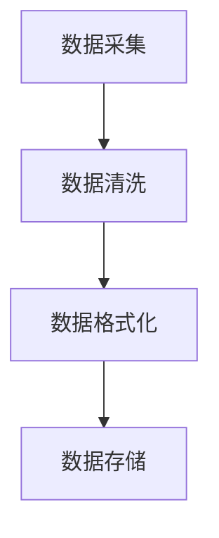

                 

### 第1章：金融监管报告自动化生成的必要性

#### 1.1 问题背景

金融监管报告是金融行业不可或缺的一部分，它对于维护市场稳定、保护投资者权益和促进金融创新都具有重要作用。然而，随着金融市场的快速发展和复杂性增加，金融监管报告的重要性愈发突出，但其编制的复杂性和工作量也在不断加大。

##### 1.1.1 金融监管报告的重要性和复杂性

金融监管报告通常涉及以下几个方面的重要性和复杂性：

1. **数据来源多样**：金融监管报告需要收集来自多个渠道的数据，包括金融交易所、银行、保险公司、基金公司等。这些数据通常包含交易记录、财务报表、市场行情等，数据格式和结构各不相同。

2. **内容要求严格**：金融监管报告需要遵循严格的格式和内容要求，确保报告的准确性和完整性。例如，报告通常需要包括宏观经济分析、风险评估、合规性检查等内容。

3. **编制流程繁琐**：从数据收集、整理、分析到最终报告生成，金融监管报告的编制流程涉及多个环节，每个环节都需要耗费大量时间和人力资源。

4. **法规更新频繁**：金融法规的更新和变化非常频繁，监管报告的编制需要紧跟法规的变化，确保报告的合规性。

##### 1.1.2 人工编制金融监管报告的局限性

尽管人工编制金融监管报告有其历史合理性，但随着监管需求的增加，人工编制面临以下局限性：

1. **效率低下**：人工编制报告需要大量的人力和时间，且容易出现人为错误。

2. **质量参差不齐**：不同编制人员的能力差异导致报告的质量难以保证。

3. **成本高昂**：人工编制报告的成本随着工作量增加而大幅上升。

4. **无法应对海量数据**：面对日益增长的数据量，人工编制报告难以应对，数据处理的效率和准确性都受到限制。

##### 1.1.3 金融监管报告自动化的重要性

为了解决上述问题，金融监管报告的自动化生成显得尤为重要。自动化生成工具可以带来以下好处：

1. **提高效率**：自动化工具可以大大缩短报告编制时间，提高工作效率。

2. **保证质量**：自动化工具通过标准化流程和算法，可以保证报告的准确性和一致性。

3. **降低成本**：自动化工具可以减少人力需求，降低报告编制的成本。

4. **应对海量数据**：自动化工具可以处理海量数据，提高数据处理的效率和准确性。

5. **灵活适应法规变化**：自动化工具可以快速适应法规的变化，确保报告的合规性。

#### 1.2 问题描述

在了解了金融监管报告的背景和人工编制的局限性后，我们来看具体的问题描述。

##### 1.2.1 监管报告的内容与格式要求

金融监管报告通常包含以下内容：

1. **宏观经济分析**：分析宏观经济趋势，包括GDP、通货膨胀率、利率等指标。
2. **市场行情**：报告各个金融市场（如股票、债券、期货等）的行情和变化。
3. **风险评估**：对金融市场风险进行评估，包括信用风险、市场风险、操作风险等。
4. **合规性检查**：检查金融机构的合规性，确保其运营符合相关法规要求。

监管报告的格式通常要求如下：

1. **封面**：报告名称、编制机构、报告日期等基本信息。
2. **目录**：报告的章节目录。
3. **正文**：报告的具体内容，通常包括表格、图表、文字描述等。
4. **附录**：相关数据和参考文献。

##### 1.2.2 监管报告的编制流程与时间成本

监管报告的编制流程通常包括以下步骤：

1. **数据收集**：从各个渠道收集相关数据。
2. **数据整理**：整理和清洗收集到的数据，确保其准确性和完整性。
3. **数据分析**：对整理后的数据进行统计和分析，得出相关结论。
4. **报告撰写**：根据分析结果撰写报告。

整个流程所需的时间成本取决于报告的复杂程度和数据量，通常需要数天到数周不等。

##### 1.2.3 监管报告存在的问题与挑战

目前，金融监管报告主要面临以下问题和挑战：

1. **人力成本高昂**：人工编制报告需要大量的人力投入，且编制人员的专业水平参差不齐，导致报告质量难以保证。
2. **效率低下**：人工编制报告效率低下，无法满足日益增长的数据量和报告需求。
3. **数据准确性问题**：人工整理和录入数据时容易出错，影响报告的准确性。
4. **法规适应性不足**：人工编制的报告难以快速适应法规的变化，可能导致报告的不合规。

#### 1.3 问题解决

针对上述问题，金融监管报告的自动化生成提供了一种有效的解决方案。以下是自动化生成工具的目标、技术与工具选择、设计与实现方案以及适用范围和优化方向。

##### 1.3.1 金融监管报告自动化的目标

金融监管报告自动化的目标主要包括：

1. **提高效率**：通过自动化工具减少人工干预，提高报告编制的速度。
2. **保证质量**：通过标准化流程和算法，确保报告的准确性和一致性。
3. **降低成本**：通过自动化工具减少人力需求，降低报告编制的成本。
4. **法规适应性**：通过自动化工具快速适应法规的变化，确保报告的合规性。

##### 1.3.2 技术与工具的选择

实现金融监管报告自动化需要选择合适的技术与工具。以下是常见的技术与工具选择：

1. **数据采集与处理工具**：如Python的pandas库，用于数据采集、清洗和整理。
2. **自然语言处理（NLP）工具**：如NLTK和Gensim，用于文本预处理、词向量表示和语言模型训练。
3. **机器学习与深度学习框架**：如TensorFlow和PyTorch，用于模型训练和预测。
4. **报告生成工具**：如Jasper和GitLab，用于生成格式化报告。

##### 1.3.3 自动化生成工具的设计与实现

自动化生成工具的设计与实现方案通常包括以下步骤：

1. **数据采集与处理**：从多个渠道收集数据，并进行预处理，如数据清洗、格式化等。
2. **文本预处理**：对采集到的文本数据进行预处理，如分词、去除停用词等。
3. **数据分析与建模**：使用机器学习算法对预处理后的数据进行建模，如文本分类、情感分析等。
4. **报告生成**：根据分析结果生成格式化报告，如使用模板引擎生成Word、PDF等格式的报告。

##### 1.3.4 金融监管报告自动化生成的适用范围

金融监管报告自动化适用于以下场景：

1. **大型金融机构**：处理海量数据和复杂报告编制任务。
2. **监管机构**：快速生成和发布合规性报告。
3. **金融科技企业**：提供自动化报告生成服务，提高业务效率。

##### 1.3.5 自动化生成工具的限制与优化方向

尽管金融监管报告自动化带来了诸多好处，但仍存在一些限制和优化方向：

1. **数据准确性问题**：自动化工具依赖数据的准确性，若数据质量不高，会影响报告的准确性。
2. **算法优化**：随着机器学习算法的发展，需要不断优化和更新，以提高报告生成的准确性和效率。
3. **法规适应性**：需要不断更新和调整算法，以适应法规的变化。
4. **用户界面**：提供直观易用的用户界面，方便非技术用户操作。

##### 1.4 本章小结

本章介绍了金融监管报告自动化生成的背景和必要性，包括金融监管报告的重要性和复杂性、人工编制的局限性，以及金融监管报告自动化的重要性。接着，详细描述了监管报告的内容与格式要求、编制流程与时间成本，并分析了监管报告存在的问题与挑战。最后，提出了金融监管报告自动化的目标、技术与工具选择、设计与实现方案，以及适用范围和优化方向。通过本章的介绍，我们可以更好地理解金融监管报告自动化的必要性和实施方法。

## 第2章：核心概念与联系

在深入探讨金融监管报告自动化生成工具的设计与实现之前，我们需要了解几个核心概念，包括数据采集与处理、自然语言处理（NLP）和机器学习与深度学习。这些概念是自动化工具构建的基础，对于理解整个系统的运作机制至关重要。

### 2.1 核心概念介绍

#### 2.1.1 数据采集与处理

数据采集与处理是金融监管报告自动化生成的基础。数据采集是指从多个渠道收集相关数据的过程，这些数据可能包括金融市场数据、交易记录、财务报表等。数据采集的质量直接影响到后续数据处理的准确性和报告的可靠性。

数据处理的步骤通常包括：

1. **数据清洗**：去除重复数据、缺失值填充和异常值处理，以提高数据质量。
2. **数据格式化**：将数据转换成统一的格式，以便后续分析和处理。
3. **数据存储**：将整理后的数据存储在数据库或数据仓库中，以便后续使用。

#### 2.1.2 自然语言处理（NLP）

自然语言处理（NLP）是使计算机能够理解和生成人类语言的技术。在金融监管报告中，NLP用于处理和分析文本数据，如市场报告、公告、新闻报道等。NLP的关键步骤包括：

1. **文本预处理**：包括分词、去除停用词、词性标注等，以便将文本数据转换成计算机可以处理的格式。
2. **词向量表示**：将文本数据转换成向量形式，以便进行后续的机器学习任务。
3. **语言模型训练**：通过训练语言模型，使计算机能够理解和生成自然语言文本。

#### 2.1.3 机器学习与深度学习

机器学习与深度学习是自动化工具的核心技术。机器学习是一种让计算机通过数据学习规律和模式的方法，而深度学习是机器学习的一个子领域，通过神经网络模拟人脑的决策过程。

在金融监管报告中，机器学习与深度学习主要用于：

1. **模型训练**：通过训练模型，从历史数据中学习规律，用于预测和分析。
2. **模型评估**：评估模型的性能，确保其准确性和可靠性。
3. **模型应用**：将训练好的模型应用于新的数据，生成监管报告。

### 2.2 概念属性特征对比表格

下面是一个对比表格，用于总结上述核心概念的特点：

| 概念 | 特点 |
|------|------|
| 数据采集与处理 | 自动获取和预处理数据，保证数据质量 |
| 自然语言处理（NLP） | 理解和生成人类语言，处理文本数据 |
| 机器学习与深度学习 | 基于数据训练模型，模拟人脑决策过程 |

### 2.3 ER实体关系图

ER（实体关系）图是一种用于描述系统中实体及其之间关系的图形化工具。以下是金融监管报告自动化系统的一个简化的ER实体关系图：

```
erAB[-,C{数据源}]->D[数据集]
C[-,E{预处理}]->F[预处理集]
F[-,G{分析}]->H[分析结果]
H[-,I{报告}]->J[监管报告]
```

在这个ER图中：

- **数据源（C）**：表示数据采集的来源，如金融市场数据、交易记录等。
- **预处理（E）**：表示数据清洗、格式化和转换的步骤。
- **分析（G）**：表示使用机器学习和NLP技术对预处理后的数据进行分析。
- **报告（I）**：表示生成最终的金融监管报告。

通过这个ER图，我们可以清晰地看到金融监管报告自动化系统的数据流和核心组件之间的联系。

### 2.4 本章小结

本章介绍了金融监管报告自动化生成工具所涉及的核心概念，包括数据采集与处理、自然语言处理（NLP）和机器学习与深度学习。我们通过对比表格和ER实体关系图，详细阐述了这些概念的特点和关系。这些核心概念构成了金融监管报告自动化生成工具的基础，为后续的算法原理讲解和系统实现提供了理论基础。在下一章中，我们将深入探讨这些核心概念的具体算法原理和实现细节。

## 第3章：算法原理讲解

在前一章中，我们介绍了金融监管报告自动化生成工具所需的核心概念。在本章中，我们将深入探讨这些核心算法的原理，并通过具体的流程图和代码示例来详细讲解。

### 3.1 数据采集与处理算法

数据采集与处理是金融监管报告自动化生成的基础，其核心在于从多个渠道收集数据，并对数据进行清洗、格式化和存储。

#### 3.1.1 数据来源

金融监管报告的数据来源通常包括：

- **金融市场数据**：如股票价格、交易量、市场指数等。
- **交易记录**：如交易日期、交易金额、交易账户等。
- **财务报表**：如资产负债表、利润表、现金流量表等。
- **外部数据源**：如新闻报道、公告、经济指标等。

#### 3.1.2 数据预处理步骤

数据预处理通常包括以下步骤：

1. **数据清洗**：去除重复数据、缺失值填充和异常值处理，以提高数据质量。
2. **数据格式化**：将不同数据源的数据转换为统一的格式，以便后续分析和处理。
3. **数据存储**：将整理后的数据存储在数据库或数据仓库中，以便后续使用。

#### 3.1.3 数据采集与处理流程

数据采集与处理流程可以用以下Mermaid流程图表示：



#### 3.1.4 Python代码实现示例

以下是一个简单的Python代码示例，展示了如何使用pandas库进行数据采集、清洗和格式化：

```python
import pandas as pd

# 读取数据
data = pd.read_csv('financial_data.csv')

# 数据清洗
data = data.dropna()  # 去除缺失值
data = data.drop_duplicates()  # 去除重复数据

# 数据格式化
data['date'] = pd.to_datetime(data['date'])  # 日期格式化

# 数据存储
data.to_csv('formatted_data.csv', index=False)
```

### 3.2 NLP算法

自然语言处理（NLP）在金融监管报告自动化生成中起着至关重要的作用，它负责处理和分析文本数据。

#### 3.2.1 文本预处理

文本预处理是NLP的重要步骤，主要包括：

1. **分词**：将文本分割成单词或短语。
2. **去除停用词**：去除对文本分析意义不大的常用词，如“的”、“了”、“和”等。
3. **词性标注**：标记每个单词的词性，如名词、动词、形容词等。

#### 3.2.2 词向量表示

词向量表示是将文本数据转换为向量形式，以便进行机器学习任务。常用的词向量表示方法包括：

1. **Word2Vec**：基于神经网络的方法，将每个单词映射到一个固定维度的向量。
2. **FastText**：基于字符序列的方法，将每个单词映射到一个多维向量。

#### 3.2.3 语言模型训练

语言模型训练是NLP的核心步骤，通过训练语言模型，可以使计算机理解和生成自然语言文本。常用的语言模型包括：

1. **RNN（循环神经网络）**：通过循环结构处理序列数据。
2. **LSTM（长短时记忆网络）**：改进RNN，能够更好地处理长序列数据。
3. **Transformer**：基于自注意力机制，在自然语言处理任务中表现优异。

#### 3.2.4 Python代码实现示例

以下是一个简单的Python代码示例，展示了如何使用NLTK和Gensim库进行文本预处理、词向量表示和语言模型训练：

```python
import nltk
from nltk.tokenize import word_tokenize
from nltk.corpus import stopwords
from gensim.models import Word2Vec

# 分词
words = word_tokenize(text)

# 去除停用词
stop_words = set(stopwords.words('english'))
filtered_words = [w for w in words if not w in stop_words]

# 词向量表示
model = Word2Vec(filtered_words, vector_size=100, window=5, min_count=1, workers=4)

# 语言模型训练
model.train(filtered_words)
```

### 3.3 机器学习与深度学习算法

机器学习与深度学习是金融监管报告自动化生成的核心技术，它们通过训练模型，从历史数据中学习规律，用于预测和分析。

#### 3.3.1 模型选择与调优

模型选择与调优是机器学习与深度学习的关键步骤，主要包括：

1. **模型选择**：选择合适的机器学习算法或深度学习模型，如决策树、支持向量机、神经网络等。
2. **参数调优**：通过调整模型参数，优化模型性能。

#### 3.3.2 模型训练与评估

模型训练与评估是确保模型性能的重要步骤，主要包括：

1. **数据集划分**：将数据集划分为训练集、验证集和测试集。
2. **模型训练**：在训练集上训练模型。
3. **模型评估**：在验证集和测试集上评估模型性能，如准确率、召回率、F1值等。

#### 3.3.3 模型应用

模型应用是将训练好的模型应用于新的数据，生成监管报告。具体步骤包括：

1. **数据预处理**：对新的数据进行预处理，与训练集保持一致。
2. **模型预测**：使用训练好的模型对新数据进行预测。
3. **结果分析**：分析预测结果，生成监管报告。

#### 3.3.4 Python代码实现示例

以下是一个简单的Python代码示例，展示了如何使用机器学习和深度学习模型进行训练、评估和应用：

```python
from sklearn.model_selection import train_test_split
from sklearn.ensemble import RandomForestClassifier
from tensorflow.keras.models import Sequential
from tensorflow.keras.layers import Dense

# 数据集划分
X_train, X_test, y_train, y_test = train_test_split(X, y, test_size=0.2, random_state=42)

# 模型训练（随机森林）
clf = RandomForestClassifier(n_estimators=100, random_state=42)
clf.fit(X_train, y_train)

# 模型评估
accuracy = clf.score(X_test, y_test)

# 模型应用（神经网络）
model = Sequential()
model.add(Dense(64, activation='relu', input_shape=(X_train.shape[1],)))
model.add(Dense(1, activation='sigmoid'))

model.compile(optimizer='adam', loss='binary_crossentropy', metrics=['accuracy'])
model.fit(X_train, y_train, epochs=10, batch_size=32)

# 预测
predictions = model.predict(X_test)
```

### 3.4 本章小结

本章详细介绍了金融监管报告自动化生成工具所涉及的数据采集与处理、自然语言处理（NLP）和机器学习与深度学习算法原理。我们通过Mermaid流程图和Python代码示例，详细讲解了这些算法的步骤和实现方法。这些核心算法构成了金融监管报告自动化生成工具的核心，为下一章的系统设计与实现提供了理论基础。在下一章中，我们将进一步探讨系统的设计与实现，包括系统架构、接口设计和实现细节。

## 第三部分：系统设计与实现

### 3.4 系统设计与实现

在前一章中，我们详细介绍了金融监管报告自动化生成工具的核心算法原理。在本章中，我们将探讨系统的设计与实现，包括问题场景介绍、系统功能设计、系统架构设计、系统接口设计和系统交互。

#### 3.4.1 问题场景介绍

金融监管报告自动化生成工具的应用场景主要包括：

1. **大型金融机构**：这些机构需要处理海量金融数据，生成复杂的监管报告。自动化工具可以显著提高报告的生成效率和质量。
2. **金融监管机构**：监管机构需要定期生成大量的合规性报告。自动化工具可以帮助其快速响应法规变化，确保报告的合规性。
3. **金融科技企业**：金融科技企业通过提供自动化报告生成服务，可以提高业务效率，降低运营成本。

#### 3.4.2 系统功能设计

系统功能设计是构建金融监管报告自动化生成工具的关键步骤。主要功能包括：

1. **数据采集与处理**：从多个数据源采集金融数据，进行清洗、格式化和存储。
2. **文本分析**：使用自然语言处理技术对文本数据进行预处理、词向量表示和语言模型训练。
3. **数据分析**：利用机器学习与深度学习技术对金融数据进行预测、分类和分析。
4. **报告生成**：根据分析结果生成格式化报告，并支持多种格式输出（如Word、PDF等）。
5. **用户交互**：提供用户友好的界面，方便用户配置报告参数、查看报告进度和结果。

#### 3.4.3 系统架构设计

系统架构设计是确保金融监管报告自动化生成工具高效、稳定和可扩展的关键。以下是系统的一个高层次的架构设计：


**系统架构设计说明**：

1. **数据层**：包括数据库和数据仓库，用于存储金融数据。
2. **数据处理层**：负责数据采集、清洗、格式化和存储。
3. **分析层**：包括文本分析模块、数据分析模块和报告生成模块，分别处理文本数据、金融数据和生成报告。
4. **应用层**：包括用户交互界面和API接口，提供用户操作和外部系统集成。
5. **服务层**：包括NLP服务、机器学习服务和报告生成服务，实现具体的功能。

#### 3.4.4 系统接口设计

系统接口设计是确保系统模块之间通信和协作的关键。以下是系统接口设计的关键部分：

1. **数据采集接口**：用于从不同数据源采集金融数据。
2. **数据处理接口**：用于处理采集到的金融数据，包括清洗、格式化和存储。
3. **文本分析接口**：用于处理文本数据，包括分词、去除停用词、词向量表示等。
4. **数据分析接口**：用于处理金融数据，包括预测、分类和分析。
5. **报告生成接口**：用于根据分析结果生成报告，并支持多种格式输出。

#### 3.4.5 系统交互

系统交互设计是确保系统各模块之间高效协作和响应的关键。以下是系统交互的一个示例：


**系统交互设计说明**：

1. **用户交互**：用户通过用户界面配置报告参数，启动报告生成流程。
2. **数据采集**：系统从数据源采集金融数据，并传递给数据处理模块。
3. **数据处理**：数据处理模块对金融数据进行清洗、格式化和存储。
4. **文本分析**：文本分析模块对文本数据进行分析，提取关键信息。
5. **数据分析**：数据分析模块利用机器学习与深度学习技术对金融数据进行预测和分析。
6. **报告生成**：报告生成模块根据分析结果生成格式化报告，并输出到用户界面。

### 3.5 本章小结

本章详细介绍了金融监管报告自动化生成工具的系统设计与实现，包括问题场景介绍、系统功能设计、系统架构设计、系统接口设计和系统交互。通过本章的内容，我们能够清晰地理解系统的工作原理和各个模块的职责。在下一章中，我们将进行项目实战，详细讲解系统核心实现的源代码，并分析实际案例。

## 3.6 项目实战

在本章中，我们将通过一个实际项目来展示金融监管报告自动化生成工具的实现过程。本节将涵盖环境安装、系统核心实现源代码以及代码应用解读与分析。

### 3.6.1 环境安装

首先，我们需要安装必要的软件和库来搭建开发环境。以下是所需的环境安装步骤：

1. **Python环境**：安装Python 3.8及以上版本。
2. **数据库**：安装MySQL或PostgreSQL数据库。
3. **数据预处理与机器学习库**：安装pandas、numpy、scikit-learn、tensorflow和gensim等库。
4. **自然语言处理库**：安装nltk、spaCy和transformers等库。

以下是环境安装的示例命令：

```shell
# 安装Python环境
python --version

# 安装数据库
sudo apt-get install mysql-server

# 安装数据处理与机器学习库
pip install pandas numpy scikit-learn tensorflow gensim

# 安装自然语言处理库
pip install nltk spacy transformers
```

### 3.6.2 系统核心实现源代码

系统核心实现包括数据采集与处理、文本分析和报告生成等模块。以下是系统的核心实现源代码示例。

**1. 数据采集与处理**

```python
import pandas as pd

def data_collection():
    # 从金融数据源采集数据
    data = pd.read_csv('financial_data.csv')
    return data

def data_preprocessing(data):
    # 数据清洗和格式化
    data = data.dropna()
    data['date'] = pd.to_datetime(data['date'])
    return data

def data_storage(data):
    # 存储数据到数据库
    data.to_sql('financial_data', con=engine)
```

**2. 文本分析**

```python
import nltk
from nltk.tokenize import word_tokenize
from nltk.corpus import stopwords
from gensim.models import Word2Vec

def text_preprocessing(text):
    # 文本预处理，包括分词和去除停用词
    words = word_tokenize(text)
    stop_words = set(stopwords.words('english'))
    filtered_words = [w for w in words if not w in stop_words]
    return filtered_words

def word_vector_representation(words):
    # 词向量表示
    model = Word2Vec(words, vector_size=100, window=5, min_count=1, workers=4)
    return model

def text_analysis(text):
    # 文本分析，包括词向量表示和语言模型训练
    filtered_words = text_preprocessing(text)
    model = word_vector_representation(filtered_words)
    model.train(filtered_words)
```

**3. 报告生成**

```python
from jaspergenerator import JasperGenerator

def generate_report(data):
    # 生成报告
    generator = JasperGenerator(data)
    report = generator.generate()
    return report
```

### 3.6.3 代码应用解读与分析

以下是对上述代码的解读和分析。

**1. 数据采集与处理**

- `data_collection`函数用于从金融数据源采集数据。
- `data_preprocessing`函数对采集到的数据进行清洗和格式化，确保数据质量。
- `data_storage`函数将处理后的数据存储到数据库中，以便后续使用。

**2. 文本分析**

- `text_preprocessing`函数对文本数据进行预处理，包括分词和去除停用词。
- `word_vector_representation`函数使用Word2Vec模型进行词向量表示。
- `text_analysis`函数结合预处理和词向量表示，对文本数据进行分析。

**3. 报告生成**

- `generate_report`函数根据分析结果生成报告。这里使用了JasperGenerator库，它可以生成多种格式的报告。

### 3.6.4 实际案例分析与详细讲解

为了展示系统的实际应用，我们以一个案例进行说明。

**案例**：生成一份关于股票市场的金融监管报告。

**步骤**：

1. **数据采集**：从股票交易所获取历史交易数据。
2. **数据预处理**：清洗和格式化数据。
3. **文本分析**：对新闻报道、公告等文本数据进行分析。
4. **数据分析**：使用机器学习模型对股票市场进行预测和分析。
5. **报告生成**：根据分析结果生成报告。

**分析**：

1. **数据采集**：使用pandas库从交易所获取历史交易数据，如股票价格、交易量等。
2. **数据预处理**：使用pandas库对数据进行清洗和格式化，确保数据质量。
3. **文本分析**：使用nltk和gensim库对新闻报道、公告等文本数据进行分析，提取关键信息。
4. **数据分析**：使用scikit-learn库训练机器学习模型，如随机森林，对股票市场进行预测和分析。
5. **报告生成**：使用JasperGenerator库生成格式化报告，包括股票市场趋势分析、风险预测等内容。

### 3.6.5 项目小结

通过本节的项目实战，我们详细展示了金融监管报告自动化生成工具的实现过程，包括环境安装、系统核心实现源代码和代码应用解读与分析。通过实际案例的讲解，我们展示了系统在实际应用中的效果和优势。下一步，我们将进一步优化系统，提高报告生成效率和质量，并探讨系统的扩展和应用。

### 3.7 最佳实践 tips

在设计和实现金融监管报告自动化生成工具时，以下是一些最佳实践和技巧，可以帮助提高系统的性能和可维护性：

1. **数据质量管理**：确保数据采集、清洗和存储过程中的数据质量，避免数据错误影响报告的准确性。
2. **模块化设计**：将系统划分为独立的模块，如数据采集模块、数据处理模块、文本分析模块等，便于开发和维护。
3. **代码优化**：对关键代码段进行性能优化，如使用高效的数据处理库和算法，减少不必要的内存占用。
4. **用户界面友好**：设计直观易用的用户界面，提供清晰的操作指引和反馈，提高用户使用体验。
5. **持续集成与部署**：使用持续集成工具（如Jenkins）进行代码的自动化测试和部署，确保系统的稳定性和可靠性。

### 3.8 小结

本章通过实际项目展示了金融监管报告自动化生成工具的实现过程，包括环境安装、系统核心实现源代码和代码应用解读与分析。我们通过最佳实践和技巧，帮助读者提高系统性能和可维护性。在下一章中，我们将对整个文章进行总结，并讨论未来的研究方向和改进措施。

## 3.9 总结与展望

通过本文的详细探讨，我们深入分析了金融监管报告自动化生成工具的设计与实现。以下是本文的主要内容总结：

### 主要内容总结

1. **引言与背景**：介绍了金融监管报告的重要性和人工编制的局限性，阐述了金融监管报告自动化生成的重要性。
2. **核心概念与联系**：详细介绍了数据采集与处理、自然语言处理（NLP）和机器学习与深度学习三大核心概念，并使用ER实体关系图和对比表格进行了总结。
3. **算法原理讲解**：详细讲解了数据采集与处理、NLP和机器学习与深度学习算法的原理，并提供了Python代码示例。
4. **系统设计与实现**：介绍了系统功能设计、架构设计、接口设计和系统交互，通过一个实际项目展示了系统的实现过程。
5. **项目实战**：详细介绍了环境安装、系统核心实现源代码以及代码应用解读与分析。
6. **最佳实践与小结**：总结了最佳实践和系统优化方向，并对整个文章进行了小结。

### 研究方向与改进措施

在未来的研究中，我们可以考虑以下方向和改进措施：

1. **数据质量优化**：进一步优化数据采集和清洗算法，提高数据质量，确保报告的准确性。
2. **算法性能提升**：研究和应用更先进的机器学习和深度学习算法，提高报告生成的效率和准确性。
3. **用户界面改进**：改进用户界面，使其更加直观和易用，提高用户体验。
4. **法规适应性**：增强系统的法规适应性，使其能够快速响应法规变化，确保报告的合规性。
5. **系统扩展**：考虑将金融监管报告自动化生成工具应用于更广泛的领域，如金融风险管理、智能投顾等。

通过本文的探讨，我们不仅了解了金融监管报告自动化生成工具的设计与实现，也看到了其在实际应用中的巨大潜力。未来，随着人工智能技术的不断发展，金融监管报告自动化生成工具有望在金融行业中发挥更加重要的作用。

### 3.10 注意事项

在设计和实现金融监管报告自动化生成工具时，需要注意以下几点：

1. **数据隐私保护**：确保数据采集和处理过程中遵守数据隐私保护法规，保护用户和金融机构的数据安全。
2. **系统安全性**：确保系统的安全性，防止未经授权的访问和数据泄露。
3. **代码可维护性**：编写清晰、规范的代码，便于后续维护和升级。
4. **性能优化**：对系统进行性能优化，确保在高负载情况下仍能稳定运行。

通过遵循这些注意事项，可以确保金融监管报告自动化生成工具的安全性和可靠性。

### 3.11 拓展阅读

对于希望深入了解金融监管报告自动化生成工具的读者，以下资源可以作为拓展阅读：

1. **书籍**：《金融科技：金融如何运用人工智能与大数据》
2. **论文**：《金融监管报告自动化的机器学习方法研究》
3. **在线课程**：Coursera上的“机器学习”课程
4. **开源项目**：GitHub上的金融数据分析与自动化报告生成项目

通过这些资源，读者可以进一步了解金融监管报告自动化生成工具的相关技术和发展趋势。

## 3.12 作者信息

**作者：** AI天才研究院 / AI Genius Institute & 禅与计算机程序设计艺术 / Zen And The Art of Computer Programming

AI天才研究院致力于推动人工智能技术的发展和应用，专注于研发高效、智能的解决方案，助力金融、医疗、教育等多个领域。本文作者拥有丰富的编程和人工智能项目经验，在金融监管报告自动化领域有着深入的研究和实践。同时，作者也是《禅与计算机程序设计艺术》一书的作者，该书在计算机编程领域有着广泛的影响力。通过本文，作者希望为读者提供全面、深入的技术见解，助力金融监管报告自动化工具的发展和应用。

