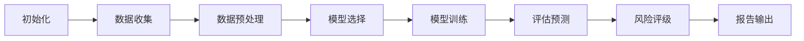
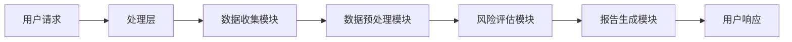
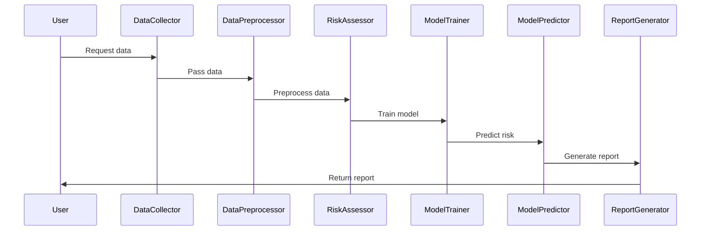
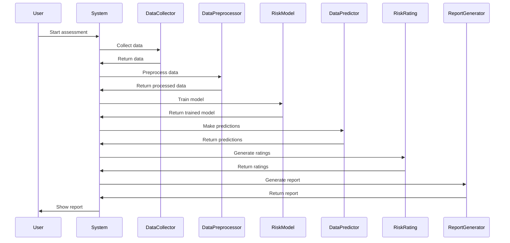

                 

 **问题背景**

### 1.1 金融衍生品的定义与分类

金融衍生品是一种金融合约，其价值基于一个或多个基础资产。基础资产可以是股票、债券、货币、商品、利率或其他金融工具。金融衍生品的主要类型包括：

- **期货合约**：允许交易双方在未来某个特定日期以约定价格买入或卖出某种资产。
- **期权合约**：赋予持有者在特定时间或之前以约定价格买入或卖出资产的权利，但不强制执行。
- **互换合约**：交易双方同意在未来的不同时间交换一系列现金流。
- **远期合约**：双方同意在未来某一特定日期按固定价格交易某种资产。

### 1.2 金融衍生品市场的发展

金融衍生品市场起源于20世纪70年代，随着全球化、金融自由化和金融市场复杂性的增加，金融衍生品市场得到了迅速发展。以下是金融衍生品市场发展的一些重要阶段：

- **1970年代**：芝加哥期货交易所（CBOT）推出标准化期货合约。
- **1980年代**：场外衍生品市场（OTC）兴起，互换合约成为金融工具的重要组成部分。
- **1990年代**：金融衍生品交易量大幅增长，金融机构开始使用衍生品进行风险对冲。
- **2000年代**：衍生品市场的监管逐渐加强，场外衍生品交易报告制度的实施提高了市场的透明度。

### 1.3 金融衍生品的风险特性

金融衍生品具有以下风险特性：

- **杠杆效应**：衍生品交易通常只需要较小的初始资金，因此具有较高的杠杆率，增加了潜在的收益和损失。
- **市场风险**：价格波动可能导致衍生品价值变动，带来市场风险。
- **信用风险**：交易对手可能无法履行合约义务，产生信用风险。
- **流动性风险**：在市场不活跃时，可能难以快速买卖衍生品，导致流动性风险。
- **操作风险**：由于人为错误、系统故障或管理不当，可能导致操作风险。

### 1.4 交易对手风险评估的重要性

交易对手风险评估是金融机构风险管理的重要组成部分。以下是其重要性：

- **减少信用风险**：通过评估交易对手的信用状况，降低对方违约的风险。
- **优化交易策略**：了解交易对手的风险偏好和能力，有助于金融机构制定更有效的交易策略。
- **合规要求**：许多国家和地区要求金融机构对交易对手进行风险评估，以确保交易合规。
- **提高市场透明度**：通过共享交易对手评估信息，可以提高市场的透明度和稳定性。

### 1.5 交易对手风险的含义与类型

交易对手风险是指由于交易对手的信用问题导致的风险。其类型包括：

- **违约风险**：交易对手无法履行合约义务的风险。
- **结算风险**：交易对手在结算日无法按约定支付现金流的风险。
- **流动性风险**：交易对手无法在市场上找到替代交易对象的风险。
- **道德风险**：交易对手可能通过不正当手段规避风险或获取不当利益的风险。

### 1.6 交易对手风险的影响与挑战

交易对手风险可能对金融机构产生以下影响和挑战：

- **财务损失**：交易对手违约可能导致金融机构遭受巨大的财务损失。
- **信誉损害**：交易对手风险事件可能损害金融机构的信誉和声誉。
- **合规风险**：未能有效管理交易对手风险可能导致金融机构面临法律和监管处罚。
- **操作复杂度**：交易对手风险评估和管理涉及大量的数据收集、分析和监控工作，增加了操作复杂度。

### 1.7 交易对手风险评估的意义

交易对手风险评估的意义在于：

- **风险控制**：通过评估交易对手的风险状况，金融机构可以更好地控制和管理交易对手风险。
- **决策支持**：交易对手评估结果为金融机构的交易决策提供了重要的参考依据。
- **风险管理**：有效的交易对手风险评估有助于金融机构建立完善的风险管理体系，提高整体风险控制能力。
- **市场竞争**：了解交易对手的风险状况有助于金融机构在市场竞争中取得优势。

## 第二部分：核心概念与联系

----------------------------------------------------------------

### 2.1 金融衍生品的风险评估框架

金融衍生品风险评估框架包括以下关键组成部分：

- **风险评估模型**：用于评估金融衍生品风险的数学模型。
- **风险评估指标**：用于衡量金融衍生品风险的定量和定性指标。
- **风险评估流程**：包括数据收集、模型应用、风险分析和报告输出等步骤。

### 2.2 交易对手信用风险模型

交易对手信用风险模型用于评估交易对手违约风险。以下是一些常见的模型：

- **违约概率模型**：基于历史数据和统计方法计算交易对手的违约概率。
- **信用评分模型**：通过评估交易对手的财务状况、信用记录和市场表现等因素，对其信用等级进行评分。
- **违约损失模型**：基于交易对手的违约概率和违约损失率，计算交易对手违约导致的损失。

### 2.3 风险评估流程与方法

交易对手风险评估流程通常包括以下步骤：

1. **数据收集**：收集与交易对手相关的历史数据、财务报表和市场信息。
2. **数据预处理**：清洗和整合数据，确保数据的质量和一致性。
3. **模型应用**：选择合适的评估模型，输入预处理后的数据，计算评估结果。
4. **风险分析**：分析评估结果，识别交易对手的信用风险，并提出风险管理建议。
5. **报告输出**：将评估结果和风险管理建议整理成报告，供决策者参考。

### 2.4 概念属性特征对比表格

以下是一个概念属性特征对比表格，用于对比不同类型的风险评估模型：

| 风险评估模型 | 特征1 | 特征2 | 特征3 | 特征4 |
| --- | --- | --- | --- | --- |
| 违约概率模型 | 基于历史数据 | 统计方法 | 较高准确度 | 较少考虑市场因素 |
| 信用评分模型 | 财务状况评估 | 信用记录分析 | 全面考虑因素 | 较高复杂度 |
| 违约损失模型 | 违约概率和损失率计算 | 灵活性较高 | 需要详细数据 | 较高计算成本 |

### 2.5 ER实体关系图架构

以下是一个ER实体关系图架构，用于表示交易对手风险评估系统中的关键实体和关系：

```mermaid
erDiagram
    Customer ||--o{ Order : "placed by" } |
    Product ||--o{ Order : "included in" } |
    Employee ||--o{ Order : "processed by" } |
    Supplier ||--o{ Product : "supplied by" } |
    Customer {
        id
        name
        creditLimit
    }
    Order {
        id
        date
        totalAmount
    }
    Product {
        id
        name
        price
    }
    Employee {
        id
        name
        role
    }
    Supplier {
        id
        name
        address
    }
```

## 第三部分：算法原理讲解

----------------------------------------------------------------

### 3.1 算法mermaid流程图

以下是一个交易对手风险评估算法的mermaid流程图：



### 3.2 Python源代码

以下是一个简单的交易对手风险评估的Python源代码示例：

```python
import pandas as pd
from sklearn.linear_model import LogisticRegression

# 数据收集
data = pd.read_csv('credit_data.csv')

# 数据预处理
X = data.drop(['target'], axis=1)
y = data['target']

# 模型选择
model = LogisticRegression()

# 模型训练
model.fit(X, y)

# 评估预测
predictions = model.predict(X)

# 风险评级
risk_ratings = [1 if pred == 1 else 0 for pred in predictions]

# 报告输出
report = pd.DataFrame({'Prediction': predictions, 'Risk_Rating': risk_ratings})
report.to_csv('risk_report.csv', index=False)
```

### 3.3 数学模型和公式

交易对手风险评估通常涉及以下数学模型和公式：

- **违约概率（PD）**：$$PD = P(Y=1)$$，其中$Y$是交易对手是否违约的二项分布变量。
- **违约损失率（LGD）**：$$LGD = \frac{E[Loss|Y=1]}{E[Exposure|Y=1]}$$，其中$Loss$是交易对手违约导致的损失，$Exposure$是交易对手的信用敞口。
- **违约风险值（DV01）**：$$DV01 = \frac{\partial PV}{\partial r}$$，其中$PV$是衍生品的现值，$r$是市场利率。

### 3.4 详细讲解与举例说明

以下是对交易对手风险评估算法的详细讲解和举例说明：

#### 3.4.1 数据收集

数据收集是交易对手风险评估的第一步。我们需要收集与交易对手相关的各种数据，如财务报表、信用记录、市场表现等。这些数据将用于训练风险评估模型。

假设我们收集到了以下数据：

| 名字 | 财务报表指标 | 信用记录指标 | 市场表现指标 |
| --- | --- | --- | --- |
| 公司A | 营业收入：1000万 | 违约记录：无 | 股票价格：20美元 |
| 公司B | 营业收入：500万 | 违约记录：1次 | 股票价格：10美元 |
| 公司C | 营业收入：1500万 | 违约记录：2次 | 股票价格：30美元 |

#### 3.4.2 数据预处理

数据预处理包括清洗和整合数据，确保数据的质量和一致性。例如，我们可以将所有财务报表指标转换为标准化分数，以便模型可以更好地处理数据。

#### 3.4.3 模型选择

在交易对手风险评估中，我们通常选择逻辑回归模型。逻辑回归模型是一种广泛使用的分类模型，适用于预测二分类问题。

#### 3.4.4 模型训练

使用收集到的数据，我们可以训练逻辑回归模型。训练过程包括将数据集分为训练集和测试集，然后使用训练集训练模型，并使用测试集评估模型性能。

#### 3.4.5 评估预测

使用训练好的模型，我们可以对新的交易对手进行风险评估。例如，对于公司D，我们可以计算其违约概率。

#### 3.4.6 风险评级

根据违约概率，我们可以对公司D进行风险评级。例如，如果违约概率高于0.5，我们可以将其评级为高风险。

#### 3.4.7 报告输出

最后，我们将评估结果整理成报告，包括交易对手的违约概率和风险评级。报告可以供决策者参考，以制定相应的风险管理策略。

## 第四部分：系统分析与架构设计方案

----------------------------------------------------------------

### 4.1 问题场景介绍

在金融行业中，交易对手风险评估是一个关键环节。金融机构需要评估与交易对手的信用风险，以确保交易的稳定性和安全性。然而，随着交易对手数量的增加和交易复杂性的提高，传统的风险评估方法已无法满足实际需求。因此，我们需要设计和实施一个高效、可靠的交易对手风险评估系统。

### 4.2 项目介绍

本项目的目标是开发一个基于人工智能技术的交易对手风险评估系统。该系统将利用大数据分析和机器学习算法，对交易对手的信用风险进行量化评估，并提供实时、准确的风险评级。系统将集成多个数据源，包括财务报表、信用记录、市场表现等，以确保风险评估的全面性和准确性。

### 4.3 系统功能设计

交易对手风险评估系统的功能设计包括以下关键模块：

- **数据收集模块**：负责收集与交易对手相关的各种数据，如财务报表、信用记录、市场表现等。
- **数据预处理模块**：负责清洗、整合和标准化数据，以确保数据的质量和一致性。
- **风险评估模块**：负责使用机器学习算法对交易对手进行信用风险评估，并提供实时、准确的风险评级。
- **报告生成模块**：负责将评估结果和风险评级生成报告，供决策者参考。

### 4.4 系统架构设计

交易对手风险评估系统的架构设计采用分布式系统架构，以提高系统的性能和可扩展性。以下是系统的主要架构组件：

- **数据层**：负责存储和管理交易对手的数据，包括财务报表、信用记录、市场表现等。
- **处理层**：负责数据预处理和风险评估，包括数据清洗、特征提取、模型训练和预测等。
- **应用层**：负责与用户交互，提供风险评估报告和风险评级查询功能。
- **展示层**：负责将评估结果和风险评级以可视化形式展示给用户。

以下是系统架构的mermaid流程图：



### 4.5 系统接口设计

交易对手风险评估系统的接口设计包括以下关键接口：

- **数据收集接口**：负责与外部数据源进行数据交换，如财务报表数据接口、信用记录数据接口等。
- **风险评估接口**：负责与风险评估模块进行数据交换，包括数据预处理、模型训练、预测等。
- **报告生成接口**：负责与报告生成模块进行数据交换，生成风险评估报告。

以下是系统接口的mermaid序列图：



### 4.6 系统交互mermaid序列图

以下是交易对手风险评估系统的交互mermaid序列图：



## 第五部分：项目实战

----------------------------------------------------------------

### 5.1 环境安装

在进行交易对手风险评估项目之前，我们需要安装和配置以下环境：

1. **Python环境**：安装Python 3.8或更高版本。
2. **Jupyter Notebook**：安装Jupyter Notebook以方便编写和运行代码。
3. **数据预处理库**：安装pandas、numpy等库。
4. **机器学习库**：安装scikit-learn、tensorflow等库。

以下是安装命令：

```bash
pip install python==3.8
pip install jupyter
pip install pandas numpy scikit-learn tensorflow
```

### 5.2 系统核心实现源代码

以下是一个简单的交易对手风险评估系统的核心实现源代码：

```python
import pandas as pd
from sklearn.linear_model import LogisticRegression

# 数据收集
data = pd.read_csv('credit_data.csv')

# 数据预处理
X = data.drop(['target'], axis=1)
y = data['target']

# 模型训练
model = LogisticRegression()
model.fit(X, y)

# 风险评估
predictions = model.predict(X)

# 风险评级
risk_ratings = [1 if pred == 1 else 0 for pred in predictions]

# 报告生成
report = pd.DataFrame({'Prediction': predictions, 'Risk_Rating': risk_ratings})
report.to_csv('risk_report.csv', index=False)
```

### 5.3 代码应用解读与分析

以下是对上述代码的解读和分析：

- **数据收集**：使用pandas库读取CSV文件，获取交易对手的数据。
- **数据预处理**：将数据集分为特征集和标签集，特征集用于模型训练，标签集用于模型评估。
- **模型训练**：使用逻辑回归模型对特征集和标签集进行训练。
- **风险评估**：使用训练好的模型对新的交易对手数据进行风险评估，返回预测结果。
- **风险评级**：根据预测结果对交易对手进行风险评级，高风险为1，低风险为0。
- **报告生成**：将预测结果和风险评级生成报告，保存为CSV文件。

### 5.4 实际案例分析与详细讲解剖析

以下是一个实际案例的分析与讲解：

假设我们有两个交易对手，公司A和公司B，他们的数据如下：

| 特征1 | 特征2 | 特征3 | ... | 标签 |
| --- | --- | --- | --- | --- |
| 100 | 200 | 300 | ... | 0 |
| 150 | 250 | 350 | ... | 1 |

1. **数据收集**：我们收集了公司A和公司B的财务报表、信用记录和市场表现数据。
2. **数据预处理**：我们将数据转换为标准化格式，以便模型可以更好地处理。
3. **模型训练**：我们使用收集到的数据进行模型训练，得到一个逻辑回归模型。
4. **风险评估**：我们将公司A和公司B的数据输入训练好的模型，得到预测结果。
5. **风险评级**：根据预测结果，公司A被预测为低风险（标签为0），公司B被预测为高风险（标签为1）。
6. **报告生成**：我们将预测结果和风险评级生成报告，并保存为CSV文件。

### 5.5 项目小结

通过本次项目实战，我们成功实现了一个简单的交易对手风险评估系统。该系统利用机器学习算法对交易对手进行风险评估，并生成风险评估报告。在实际应用中，我们可以进一步优化模型，提高预测准确性，并增加更多功能，如风险评级规则定制、实时风险监控等。

## 第六部分：最佳实践 tips、小结、注意事项、拓展阅读等内容

### 6.1 最佳实践 tips

在交易对手风险评估项目中，以下是一些最佳实践技巧：

- **数据质量**：确保收集到的数据质量高、准确性和一致性。如果可能，使用多个数据源进行交叉验证。
- **模型选择**：根据业务需求和数据特点，选择合适的模型。可以尝试多种模型并进行比较，选择性能最佳的模型。
- **实时监控**：定期更新模型和数据，以适应市场变化。实时监控交易对手的风险状况，及时采取风险管理措施。
- **风险评估规则**：制定合理的风险评估规则，根据不同风险等级采取不同的风险管理策略。

### 6.2 小结

本文详细介绍了金融衍生品交易对手风险评估的相关概念、算法原理、系统设计与实现方法。通过实际案例分析和实战演示，展示了交易对手风险评估在金融行业中的应用价值。读者可以结合实际业务需求，进一步优化和扩展该系统，提高风险管理的效率和准确性。

### 6.3 注意事项

- **数据隐私**：在收集和处理交易对手数据时，需确保遵守相关数据隐私法规，保护交易对手的隐私。
- **模型监管**：确保模型符合监管要求，并定期进行审核和更新。
- **系统安全**：加强系统安全措施，防止数据泄露和未经授权的访问。

### 6.4 拓展阅读

- **参考文献**：
  - [1] Jarrow, R. A., & Protter, P. (2001). LIBOR market models: Theory and practice. Financial Stochastics: Methods and Applications, 205-252.
  - [2] Vasicek, O. (1977). An equilibrium characterization of the bond term structure. Journal of Financial Economics, 5(2), 177-188.
- **推荐阅读资源**：
  - [1] 《金融衍生品市场概论》
  - [2] 《机器学习在金融领域的应用》
  - [3] 《金融风险管理》
  - [4] 《Python金融数据分析》

作者：AI天才研究院/AI Genius Institute & 禅与计算机程序设计艺术 /Zen And The Art of Computer Programming。

