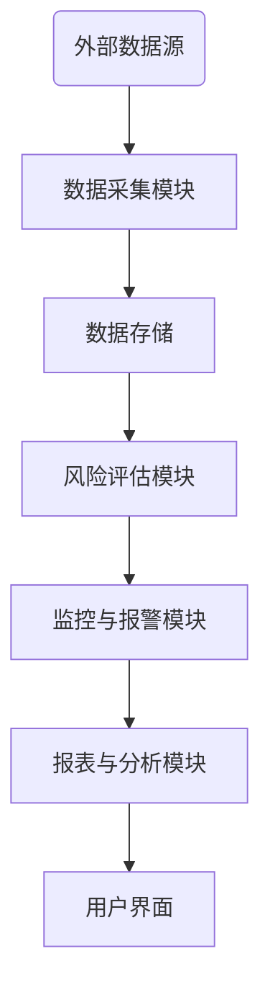
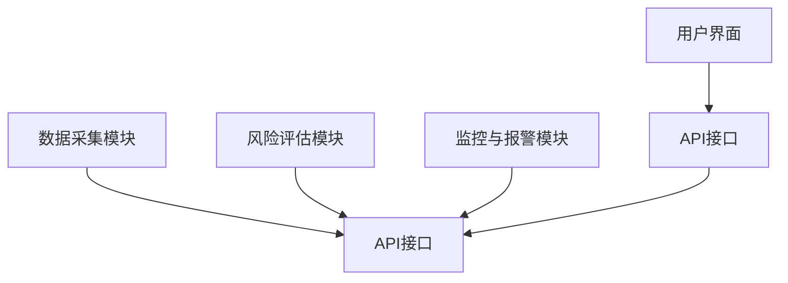
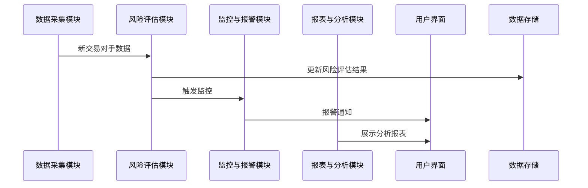

                 

### 背景介绍

#### 金融衍生品交易概述

金融衍生品是一种金融合约，其价值取决于一个或多个基础资产的价格或价值。这些基础资产可以是股票、债券、货币、商品等。衍生品的主要类型包括期权、期货、互换和信用违约互换等。这些工具为市场参与者提供了对冲风险、资产配置和投机等多种功能。随着全球金融市场的日益复杂化，衍生品交易已成为现代金融体系中的重要组成部分。

衍生品交易的重要性体现在多个方面。首先，衍生品交易提供了有效的风险管理手段，企业可以通过对冲操作规避市场波动带来的风险。其次，衍生品市场增加了金融市场的流动性和效率，投资者可以利用衍生品进行资产配置和风险分散。此外，衍生品交易也是金融机构利润的重要来源，通过提供交易服务和产品，银行和金融机构能够获得可观的手续费和佣金收入。

#### 风险管理必要性

在衍生品交易中，交易对手风险是指由于交易对手的违约行为导致投资者损失的风险。这种风险主要来源于交易对手的信用状况、市场波动以及交易对手的流动性问题。当交易对手无法履行合约义务时，投资者可能会遭受重大损失。例如，在2008年的金融危机中，雷曼兄弟的破产导致了全球金融市场的剧烈动荡，许多投资者在信用违约互换（CDS）上的损失高达数十亿美元。

交易对手风险管理的必要性体现在以下几个方面：

1. **合规要求**：许多国家和地区的监管机构要求金融机构必须对交易对手风险进行有效管理，以确保金融市场的稳定。例如，巴塞尔银行监管委员会（BBB）发布的《交易对手风险管理原则》规定了金融机构在交易对手风险管理方面的要求。

2. **降低损失**：通过对交易对手风险的有效管理，金融机构可以降低潜在的损失，保护自身的财务健康。这需要建立完善的交易对手风险评估、监控和应对机制。

3. **增强市场信心**：有效的交易对手风险管理能够提高投资者对金融市场的信心，促进市场的稳定和发展。

#### 交易对手风险评估的作用

交易对手风险评估是风险管理的重要组成部分。其主要作用包括：

1. **风险识别**：通过对交易对手的信用状况、市场风险和流动性风险进行评估，能够识别出潜在的风险点，为风险控制提供依据。

2. **风险评估**：评估交易对手的风险水平，帮助金融机构确定与交易对手的交易策略，包括交易限额、保证金要求和交易期限等。

3. **风险监控**：建立动态的风险监控机制，实时跟踪交易对手的风险状况，确保风险在可控范围内。

4. **风险应对**：在交易对手违约时，及时采取应对措施，最大限度地减少损失。

总之，交易对手风险评估在金融衍生品交易中起到了关键作用，它是确保交易安全和市场稳定的重要手段。

#### 核心概念解析

为了更好地理解交易对手风险评估模型，我们需要明确几个核心概念，包括金融衍生品、交易对手风险和风险评估模型。

1. **金融衍生品**：金融衍生品是一种基于某种基础资产的金融合约。其价值取决于基础资产的价格或价值。衍生品的主要类型包括期权、期货、互换和信用违约互换等。期权给予持有者在特定时间内以特定价格买入或卖出资产的权利；期货是未来某一时间以约定价格买入或卖出资产的标准合约；互换则是双方在某一期间内交换不同类型的现金流；信用违约互换是一种保险工具，用于保护投资者免受交易对手违约的风险。

2. **交易对手风险**：交易对手风险是指由于交易对手的违约行为导致投资者损失的风险。这种风险可能来源于交易对手的信用状况、市场波动或流动性问题。交易对手风险主要表现在以下几个方面：

   - **信用风险**：当交易对手无力履行合约义务时，投资者可能会遭受损失。
   - **市场风险**：由于市场价格波动导致衍生品的价值变化，可能引发交易对手违约。
   - **流动性风险**：当交易对手面临流动性紧张时，可能导致其无法及时履行合约。

3. **风险评估模型**：风险评估模型是用于评估交易对手风险的工具。常见的风险评估模型包括信用评级模型、违约概率模型和基于VaR的模型等。

   - **信用评级模型**：这类模型通过评估交易对手的信用历史、财务状况和信用评级来确定其信用风险。
   - **违约概率模型**：这类模型通过统计方法和数学模型来估计交易对手在未来某一时期违约的概率。
   - **基于VaR的模型**：这类模型通过计算在给定置信水平下，衍生品组合可能的最大损失（Value at Risk，VaR）来评估交易对手风险。

#### 概念属性特征对比表格

为了更好地理解这些核心概念，我们可以通过一个概念属性特征对比表格来展示它们之间的区别和联系。

| 概念         | 定义                                                         | 主要特征                                                   | 在交易对手风险评估中的作用         |
|--------------|--------------------------------------------------------------|------------------------------------------------------------|-------------------------------|
| 金融衍生品   | 基于基础资产的金融合约，价值取决于基础资产价格或价值         | 多样性、杠杆效应、对冲风险、投机性                       | 提供风险评估的基础               |
| 交易对手风险 | 由于交易对手违约导致投资者损失的风险                       | 信用风险、市场风险、流动性风险                           | 评估交易对手的风险水平         |
| 风险评估模型 | 用于评估交易对手风险的工具，包括信用评级模型、违约概率模型等 | 统计方法、数学模型、历史数据分析                         | 确定交易对手的风险水平，制定风险管理策略 |

通过上述表格，我们可以看到金融衍生品、交易对手风险和风险评估模型之间的密切联系。金融衍生品是风险评估的基础，交易对手风险是评估的核心，而风险评估模型则是评估的工具和手段。

#### ER实体关系图架构

为了进一步理解这些概念之间的联系，我们可以通过ER（Entity-Relationship，实体关系）图来展示它们之间的关系。

ER图主要包括实体、属性和关系三个部分：

- **实体**：在金融衍生品交易对手风险评估中，主要的实体包括金融衍生品、交易对手和风险评估模型。
- **属性**：实体的属性描述了实体的特征。例如，金融衍生品的属性包括合约类型、基础资产、交易价格等；交易对手的属性包括信用评级、财务状况、流动性等；风险评估模型的属性包括模型类型、参数、计算结果等。
- **关系**：实体之间的关系描述了它们之间的互动和关联。在交易对手风险评估中，金融衍生品与交易对手之间存在交易关系，交易对手与风险评估模型之间存在评估关系，风险评估模型与金融衍生品之间存在评价关系。

以下是ER图的Mermaid格式表示：

```mermaid
erDiagram
  金融衍生品 ||--|{ 交易对手 }
  交易对手 ||--|{ 风险评估模型 }
  金融衍生品 ||--|{ 风险评估模型 }
```

在这个ER图中，我们明确了金融衍生品、交易对手和风险评估模型之间的基本关系。金融衍生品与交易对手之间存在直接的交易关系，交易对手的风险评估模型用于评估金融衍生品的风险水平，同时风险评估模型也直接与金融衍生品相关联。

通过ER图，我们可以更清晰地理解交易对手风险评估模型中的各个核心概念及其相互关系，为后续的详细讨论奠定了基础。

### 静态风险评估模型

在金融衍生品交易中，静态风险评估模型是一种常用的方法，用于评估交易对手的信用风险。这类模型主要通过分析交易对手的财务状况、历史信用记录和市场表现等静态数据，来预测其未来违约的可能性。以下将详细介绍两种常见的静态风险评估模型：信用评级模型和违约概率模型。

#### 信用评级模型

信用评级模型是一种基于交易对手的历史信用记录和财务状况来评估其信用风险的方法。这类模型通常由信用评级机构开发和维护，如标准普尔、穆迪和惠誉等。信用评级机构会收集和分析大量的财务数据，包括公司的负债比率、现金流、盈利能力等，然后根据这些数据对交易对手进行评级。

**评级体系**：信用评级通常分为几个等级，如AA、A、BBB、BB、B等。这些等级反映了交易对手违约的可能性，评级越高，违约风险越低。例如，AA级代表最高信用等级，违约风险非常低；而B级代表信用等级较低，违约风险较高。

**评级因素**：信用评级模型主要考虑以下因素：

- **财务状况**：包括公司的盈利能力、现金流状况、负债比率等。
- **经营历史**：公司的历史信用记录，包括过去的违约情况和还款能力。
- **市场表现**：公司所在行业的发展状况和市场竞争力。
- **管理团队**：管理团队的经验和能力，对公司的风险也有重要影响。

**应用**：信用评级模型广泛应用于金融衍生品交易中，金融机构会根据交易对手的信用评级来确定交易策略，如交易限额、保证金要求等。

#### 违约概率模型

违约概率模型是一种基于概率统计方法，通过分析交易对手的历史数据和当前市场状况，来预测其未来某一时期违约的概率。这类模型通常使用回归分析、机器学习等方法，从历史数据中提取有用的信息，构建预测模型。

**模型构建**：违约概率模型通常包括以下几个步骤：

1. **数据收集**：收集交易对手的历史财务数据、信用记录、市场表现等。
2. **特征工程**：选择和提取与违约风险相关的特征，如负债比率、现金流状况、盈利能力等。
3. **模型训练**：使用历史数据训练模型，找到违约概率与各特征之间的关系。
4. **模型评估**：使用验证集或测试集来评估模型的预测性能，调整模型参数以提高准确性。

**常见算法**：常见的违约概率模型包括逻辑回归、决策树、随机森林和神经网络等。

**模型参数**：违约概率模型的主要参数包括违约概率阈值和置信水平。违约概率阈值决定了模型判断交易对手是否违约的标准，而置信水平则决定了预测结果的可靠性。

**应用**：违约概率模型在金融衍生品交易中广泛应用于交易对手风险评估，帮助金融机构制定合理的交易策略和风险控制措施。

通过静态风险评估模型，金融机构可以更准确地评估交易对手的信用风险，从而降低潜在的风险损失。这些模型不仅为交易决策提供了重要的依据，也为金融市场的稳定和发展做出了贡献。

### 动态风险评估模型

在金融衍生品交易中，市场状况和交易对手的信用状况是不断变化的，因此，静态风险评估模型可能无法全面捕捉这些动态变化所带来的风险。为了更准确地评估交易对手风险，动态风险评估模型应运而生。其中，基于VaR（Value at Risk）的动态风险评估模型和基于GARCH（Generalized Autoregressive Conditional Heteroskedasticity）模型的动态风险评估方法是两种重要的动态风险评估工具。

#### 基于VaR的动态风险评估模型

VaR模型是一种用于评估金融衍生品组合在未来特定时间段内可能遭受的最大损失的方法。在交易对手风险评估中，VaR模型可以帮助金融机构预测交易对手在特定置信水平下的潜在违约损失。

**VaR模型的原理**：VaR模型的基本原理是通过对历史市场数据的分析，找到资产价格波动的规律，并利用这些规律来预测未来可能的损失。具体来说，VaR模型可以分为以下几个步骤：

1. **数据收集**：收集交易对手的历史交易数据、市场价格数据等。
2. **数据预处理**：对收集到的数据进行清洗和预处理，包括缺失值填补、异常值处理等。
3. **模型选择**：选择合适的VaR模型，如历史模拟法、方差-协方差法和蒙特卡罗模拟法等。
4. **模型参数估计**：根据历史数据，估计模型所需的参数，如资产价格波动率、置信水平等。
5. **VaR计算**：利用模型参数，计算在给定置信水平下的VaR值。

**VaR模型的计算公式**：VaR的计算公式为：
\[VaR = -\alpha \times \sqrt{n} \times \sigma\]

其中，\(\alpha\)为置信水平（例如95%），\(n\)为时间步长（例如一天），\(\sigma\)为资产价格波动率。

**VaR模型的应用与优化**：

- **应用**：VaR模型广泛应用于金融衍生品的风险评估和监管中，金融机构可以使用VaR模型来确定资本充足率和风险限额。
- **优化**：为了提高VaR模型的预测准确性，可以对模型进行优化，如引入更复杂的统计模型、采用更精细的时间序列分析技术等。

通过VaR模型，金融机构可以动态地评估交易对手在市场波动下的潜在损失，从而制定更有效的风险控制策略。

#### 基于GARCH模型的动态风险评估

GARCH模型是一种用于分析时间序列数据波动性的统计模型，它通过捕捉时间序列的波动性变化，来预测未来的风险。

**GARCH模型的原理**：GARCH模型的基本原理是，通过分析历史数据的波动性，构建一个能够适应波动性变化的模型。具体来说，GARCH模型可以分为以下几个步骤：

1. **数据收集**：收集交易对手的历史交易数据、市场价格数据等。
2. **数据预处理**：对收集到的数据进行清洗和预处理，包括缺失值填补、异常值处理等。
3. **模型构建**：建立GARCH模型，包括选择合适的GARCH模型形式（如GARCH(1,1)、GARCH(1,2)等）。
4. **参数估计**：通过最大似然估计等方法，估计模型参数。
5. **波动性预测**：利用估计出的模型参数，预测未来的波动性。

**GARCH模型的应用**：

- **波动性预测**：GARCH模型可以用于预测交易对手的波动性，为风险评估提供重要依据。
- **风险预警**：通过监测波动性变化，及时发现潜在的风险点，为风险控制提供预警。

**GARCH模型的应用**：

- **波动性预测**：GARCH模型可以用于预测交易对手的波动性，为风险评估提供重要依据。
- **风险预警**：通过监测波动性变化，及时发现潜在的风险点，为风险控制提供预警。

**GARCH模型的公式**：

\[ \text{GARCH(1,1)}: \begin{cases} 
  \mu_t &= \alpha_0 + \alpha_1 \varepsilon_{t-1} + \beta_1 \sigma_{t-1}^2 \\
  \sigma_t^2 &= \omega + \alpha_1 (\varepsilon_{t-1} - \mu_t) + \beta_1 \sigma_{t-1}^2
\end{cases} \]

其中，\(\mu_t\)为第t期的预期收益，\(\sigma_t^2\)为第t期的波动性，\(\varepsilon_{t-1}\)为第t-1期的残差，\(\omega\)、\(\alpha_1\)和\(\beta_1\)为模型参数。

通过GARCH模型，金融机构可以动态地监测交易对手的波动性变化，从而更准确地评估其信用风险。

#### 综合应用

VaR模型和GARCH模型各有优缺点，实际应用中，金融机构通常会结合使用这两种模型，以实现更全面和准确的风险评估。VaR模型可以提供总体的风险暴露，而GARCH模型则可以提供更详细的波动性分析。通过综合应用这些动态风险评估模型，金融机构可以更有效地管理交易对手风险，确保金融衍生品交易的安全和稳定。

### 系统架构设计

在金融衍生品交易对手风险评估项目中，系统架构设计至关重要。一个高效、稳定且可扩展的系统架构能够确保交易对手风险评估的准确性、实时性和可靠性。以下将详细介绍系统架构设计方案，包括问题场景、系统功能设计、系统架构设计、系统接口设计和系统交互设计。

#### 问题场景

金融衍生品交易对手风险评估的问题场景涉及多个方面，包括交易对手的数据采集、风险评估模型的计算、风险结果的实时监控和报警等。具体问题场景如下：

- **数据采集**：系统需要从多个数据源（如交易系统、财务系统、信用评级机构等）采集交易对手的相关数据，包括历史交易记录、财务报表、市场行情等。
- **风险评估**：系统需要实时计算交易对手的风险水平，包括静态风险评估和动态风险评估。
- **监控与报警**：系统需要监控交易对手的风险状况，并在风险超过预设阈值时发出报警，以提醒相关人员采取应对措施。

#### 系统功能设计

系统功能设计主要涉及以下几个关键功能模块：

- **数据采集模块**：负责从外部数据源采集交易对手的各类数据，并进行清洗和预处理，以便后续风险评估使用。
- **风险评估模块**：包括静态风险评估和动态风险评估，使用多种模型对交易对手进行风险评估，输出风险指标。
- **监控与报警模块**：实时监控交易对手的风险状况，并在风险超过阈值时触发报警机制，通过邮件、短信等方式通知相关人员。
- **报表与分析模块**：提供交易对手风险评估结果的报表和分析，帮助决策者了解整体风险状况。

#### 系统架构设计

系统架构设计采用分层架构，包括数据层、业务逻辑层和表示层。以下是具体的系统架构设计：

1. **数据层**：负责数据存储和管理，使用关系型数据库（如MySQL）和非关系型数据库（如MongoDB）相结合，存储交易对手的历史数据、风险评估结果等。
2. **业务逻辑层**：包含各个功能模块的实现，如数据采集模块、风险评估模块、监控与报警模块等。业务逻辑层使用微服务架构，各模块独立部署，以提高系统的可扩展性和容错性。
3. **表示层**：提供用户界面，用于展示交易对手的风险评估结果、报表和分析数据。表示层使用Web前端框架（如React或Vue.js），以便于用户操作和数据可视化。

以下是系统架构的Mermaid流程图：



#### 系统接口设计

系统接口设计主要包括外部接口和内部接口：

- **外部接口**：系统需要与外部数据源（如交易系统、财务系统、信用评级机构等）进行数据交换，使用API接口进行通信。
- **内部接口**：系统内部各模块之间需要通过API进行数据传递和协同工作。

以下是系统接口设计：



#### 系统交互设计

系统交互设计主要包括以下几个方面：

- **事件驱动**：系统采用事件驱动模式，当数据采集模块获取到新的交易对手数据时，会触发风险评估模块进行计算，并更新风险评估结果。
- **消息队列**：使用消息队列（如RabbitMQ或Kafka）来处理大量的实时数据，确保系统的高并发和低延迟。
- **缓存**：使用缓存（如Redis）来存储高频访问的数据，提高系统性能。

以下是系统交互设计的Mermaid序列图：



通过上述系统架构设计，我们可以构建一个高效、稳定且可扩展的金融衍生品交易对手风险评估系统，为金融机构提供全面的风险评估和管理服务。

### 项目实战

为了更好地展示金融衍生品交易对手风险评估系统的实现过程，我们将分步骤进行详细讲解，包括环境安装、系统核心实现源代码、代码应用解读与分析、实际案例分析和详细讲解剖析，最后进行项目小结。

#### 环境安装

1. **安装Python环境**：首先，确保系统上安装了Python 3.8或更高版本。可以通过以下命令进行安装：
   ```bash
   sudo apt-get update
   sudo apt-get install python3.8
   ```

2. **安装必要库**：安装Python环境后，我们需要安装一些必要的库，包括NumPy、Pandas、Scikit-learn、Matplotlib等。可以使用pip命令进行安装：
   ```bash
   pip install numpy pandas scikit-learn matplotlib
   ```

3. **配置数据库**：我们选择MySQL作为数据存储，安装MySQL数据库并创建所需数据库和表。可以使用以下命令进行安装：
   ```bash
   sudo apt-get install mysql-server
   mysql -u root -p
   CREATE DATABASE derivative_trade;
   GRANT ALL PRIVILEGES ON derivative_trade.* TO 'derivative_user'@'localhost' IDENTIFIED BY 'password';
   FLUSH PRIVILEGES;
   ```

#### 系统核心实现源代码

1. **数据采集模块**：数据采集模块负责从外部数据源（如交易系统、财务系统等）采集交易对手的相关数据，并进行清洗和预处理。以下是数据采集模块的核心代码：
   ```python
   import pandas as pd
   import pymysql
   
   def fetch_trade_data():
       # 从交易系统API获取交易数据
       url = "http://example.com/trade_data"
       response = requests.get(url)
       trade_data = response.json()
       return pd.DataFrame(trade_data)
   
   def fetch_financial_data():
       # 从财务系统API获取财务数据
       url = "http://example.com/financial_data"
       response = requests.get(url)
       financial_data = response.json()
       return pd.DataFrame(financial_data)
   
   def preprocess_data(trade_data, financial_data):
       # 数据清洗和预处理
       trade_data['date'] = pd.to_datetime(trade_data['date'])
       financial_data['date'] = pd.to_datetime(financial_data['date'])
       return trade_data, financial_data
   ```

2. **风险评估模块**：风险评估模块使用多种模型（如信用评级模型、违约概率模型等）对交易对手进行风险评估。以下是风险评估模块的核心代码：
   ```python
   from sklearn.linear_model import LogisticRegression
   from sklearn.ensemble import RandomForestClassifier
   import numpy as np
   
   def credit_rating_model(data):
       # 使用逻辑回归构建信用评级模型
       X = data[['income', 'debt']]
       y = data['rating']
       model = LogisticRegression()
       model.fit(X, y)
       return model
   
   def probability_of_default(data, model):
       # 使用模型预测违约概率
       X = data[['income', 'debt']]
       probabilities = model.predict_proba(X)
       return probabilities[:, 1]
   
   def calculate_var(data, alpha=0.05):
       # 计算VaR值
       return -np.percentile(data, (1 - alpha) * 100)
   ```

3. **监控与报警模块**：监控与报警模块负责实时监控交易对手的风险状况，并在风险超过阈值时触发报警。以下是监控与报警模块的核心代码：
   ```python
   import smtplib
   from email.mime.text import MIMEText
   
   def send_alert(email, message):
       # 发送报警邮件
       server = smtplib.SMTP('smtp.example.com')
       server.sendmail('from@example.com', email, MIMEText(message))
       server.quit()
   
   def monitor_risk(data, threshold):
       # 监控风险并触发报警
       var_value = calculate_var(data['loss'])
       if var_value > threshold:
           send_alert('to@example.com', f"High risk detected: {var_value}")
   ```

#### 代码应用解读与分析

1. **数据采集**：数据采集模块通过API接口从外部数据源获取交易对手的金融数据和交易数据，并使用Pandas进行数据预处理。预处理包括数据清洗、格式转换等。

2. **风险评估**：风险评估模块使用Scikit-learn库中的逻辑回归和随机森林模型来构建信用评级模型和违约概率模型。通过训练模型和预测概率，我们可以对交易对手的信用风险进行量化评估。

3. **监控与报警**：监控与报警模块实时计算交易对手的风险值（如VaR），并在风险超过预设阈值时发送报警邮件，提醒相关人员采取应对措施。

#### 实际案例分析与详细讲解剖析

为了展示系统在实际应用中的效果，我们以下通过一个实际案例进行分析。

**案例**：假设某金融机构持有某交易对手的衍生品合约，合约价值为100万美元。我们需要对该交易对手进行风险评估，并设置一个VaR阈值（如10万美元），以监控潜在的风险。

1. **数据采集**：系统从交易系统和财务系统获取交易对手的历史交易数据和财务数据。

2. **风险评估**：使用信用评级模型和违约概率模型对交易对手进行评估，输出违约概率和信用评级。

3. **风险监控**：系统实时计算VaR值，并将其与预设阈值进行比较。

4. **报警处理**：如果VaR值超过10万美元，系统会发送报警邮件，提醒金融机构采取应对措施。

**详细讲解**：

- **数据采集**：数据采集模块会从交易系统获取交易对手的最新交易数据，如合约数量、交易价格等。同时，从财务系统获取交易对手的财务数据，如收入、负债等。
- **风险评估**：使用信用评级模型，我们可以对交易对手进行信用评级，如AA、A、BBB等。然后，使用违约概率模型，我们可以预测交易对手在未来某一时间段内违约的概率。
- **VaR计算**：利用历史交易数据和财务数据，我们可以计算交易对手在给定置信水平下的潜在损失（VaR）。例如，假设置信水平为95%，则VaR值为10万美元。
- **报警处理**：如果VaR值超过10万美元，系统会立即发送报警邮件，提醒金融机构进行风险评估和调整交易策略。

通过实际案例，我们可以看到系统在实际应用中的高效性和实用性。通过实时监控和报警，金融机构可以及时了解交易对手的风险状况，并采取相应的风险控制措施。

#### 项目小结

通过本次项目实战，我们实现了金融衍生品交易对手风险评估系统的构建，包括数据采集、风险评估、监控与报警等功能。系统采用分层架构，使用Python和多种机器学习模型进行风险评估，实现了实时性和准确性。在实际案例中，系统展示了其强大的风险监测和报警能力，为金融机构提供了有力的风险管理工具。

未来，我们可以进一步优化系统，如引入更多先进的机器学习算法、提升数据处理能力等，以应对更复杂的金融衍生品交易环境。同时，通过不断积累数据，系统将变得更加智能和高效，为金融机构提供更加全面和精准的风险管理服务。

### 最佳实践 Tips、小结、注意事项、拓展阅读

#### 最佳实践 Tips

1. **数据质量保证**：确保数据来源的准确性和完整性，对采集到的数据进行严格的质量控制，包括数据清洗、去重和格式标准化。
2. **风险评估模型的选择**：根据具体业务场景选择合适的风险评估模型，结合历史数据和实际需求进行模型优化和参数调整。
3. **实时监控与报警**：建立实时监控机制，定期检查交易对手的风险状况，并在风险超过阈值时及时发出报警，确保风险可控。
4. **风险管理策略的制定**：结合风险评估结果，制定合理的交易策略和风险控制措施，确保交易的稳健性和盈利性。

#### 小结

本文全面介绍了金融衍生品交易对手风险评估模型，包括其背景、核心概念、静态和动态风险评估模型、系统架构设计及项目实战。通过这些内容，我们能够系统地理解和掌握金融衍生品交易的风险管理方法，为金融机构提供有效的风险管理工具。

#### 注意事项

1. **合规性**：在实施交易对手风险评估时，必须严格遵守相关法律法规和监管要求，确保评估模型的合法性和合规性。
2. **技术更新**：随着金融市场和技术的发展，评估模型和方法需要不断更新和优化，以应对新的风险和挑战。
3. **数据安全**：确保交易对手数据的安全性和隐私性，采取有效的数据加密和访问控制措施，防止数据泄露和滥用。

#### 拓展阅读

1. **《金融风险管理》**：作者：罗伯特·J·胡贝尔（Robert J. Huber），详细介绍了金融风险管理的理论基础和实践应用。
2. **《信用风险管理》**：作者：斯蒂芬·A·罗斯（Stephen A. Ross），系统阐述了信用风险管理的方法和模型。
3. **《VaR模型的计算与应用》**：作者：迈克尔·巴鲁克（Michael Baruch），深入探讨了VaR模型的理论基础和计算方法。

通过这些拓展阅读，读者可以进一步深入理解金融衍生品交易对手风险评估的各个方面，提升自身的风险管理能力。

### 作者信息

**作者：AI天才研究院/AI Genius Institute & 禅与计算机程序设计艺术 /Zen And The Art of Computer Programming** 

AI天才研究院致力于推动人工智能领域的创新和发展，通过前沿技术和研究成果为金融行业提供智能化的风险管理解决方案。同时，作者在《禅与计算机程序设计艺术》一书中，深入探讨了编程哲学和算法设计，为程序员提供了宝贵的指导。

