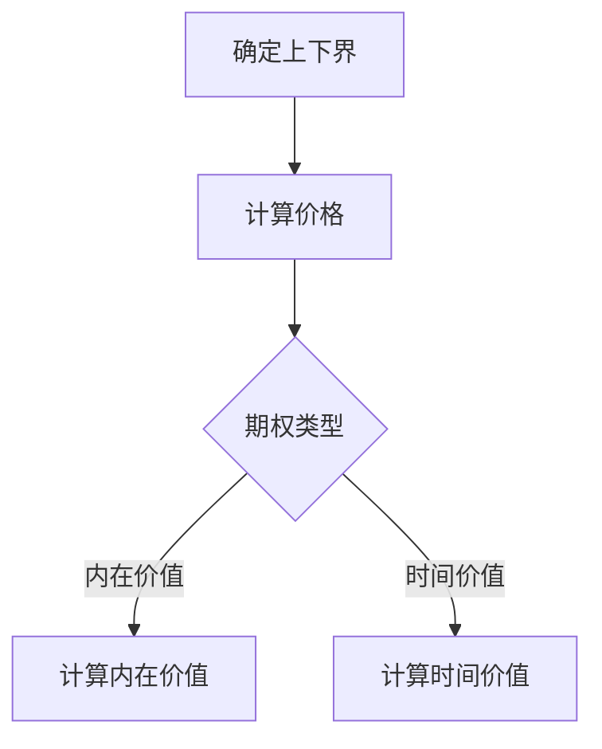
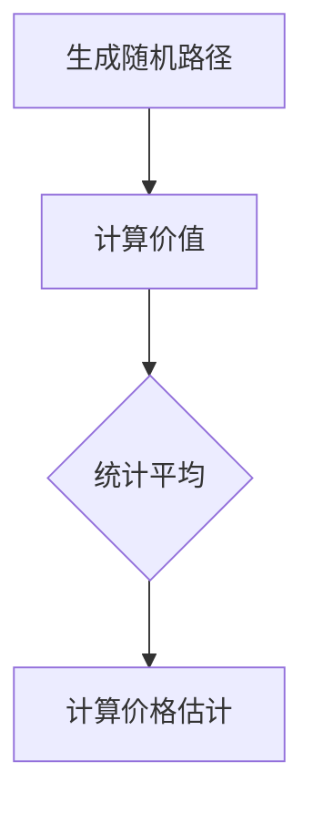

                 


### 金融衍生品定价模型优化

#### 关键词：金融衍生品、定价模型、优化、人工智能、区块链

> 摘要：本文旨在探讨金融衍生品定价模型的优化方法，从传统定价模型到现代定价模型，再到未来发展趋势，分析各类模型的优势与不足，并展望人工智能和区块链技术在金融衍生品定价中的应用前景。

----------------------------------------------------------------

## 第一部分：金融衍生品定价模型优化概述

### 第1章：金融衍生品概述

#### 1.1 金融衍生品的基本概念

金融衍生品是一种金融合约，其价值取决于一个或多个基本资产的价格。基本资产可以是股票、债券、货币、商品等。金融衍生品主要包括以下几类：

- **期权**：给予持有人在未来某个时间以特定价格购买或出售某资产的权利。
- **期货**：在未来某一特定时间以约定价格买卖某资产。
- **互换**：双方同意在未来的某个时间交换现金流。
- **远期合约**：在未来某一特定时间以约定价格买卖某资产。

#### 1.2 金融衍生品定价的重要性

金融衍生品定价直接影响金融机构的财务状况和市场风险。准确的定价有助于：

- **风险管理**：投资者和金融机构可以通过对冲策略降低风险。
- **资产配置**：投资者可以根据衍生品价格进行资产配置，实现收益最大化。
- **市场效率**：合理的衍生品定价可以提高市场流动性，促进市场效率。

#### 1.3 金融衍生品定价模型的发展历程

- **传统定价模型**：主要包括二叉树模型、Black-Scholes模型和Monte Carlo模拟。
- **现代定价模型**：在传统模型的基础上，结合机器学习和人工智能技术，开发出了一系列新的定价模型。
- **模型优化趋势**：随着金融市场的发展和复杂性增加，衍生品定价模型的优化成为研究热点。

----------------------------------------------------------------

## 第二部分：金融衍生品定价模型分析

### 第2章：传统定价模型详解

#### 2.1 二叉树模型

二叉树模型是一种离散时间模型，用于计算衍生品在每一期末的价值。其基本假设包括：

- **离散时间**：假设时间可以划分为离散的时段。
- **价格跳跃**：股票价格在每个时段末都可能发生向上的跳跃或向下的跳跃。

二叉树模型的基本步骤如下：

1. 确定股票价格的上下界。
2. 计算股票价格在每个时段末的值。
3. 根据期权类型，计算期权的内在价值和时间价值。

Mermaid流程图：



#### 2.2 Black-Scholes模型

Black-Scholes模型是一种连续时间模型，用于计算欧式期权的理论价格。其基本假设包括：

- **布朗运动**：股票价格遵循几何布朗运动。
- **无风险利率**：存在无风险利率，投资者可以无风险地持有或借入资金。

Black-Scholes模型的公式如下：

$$
C(S,t) = S_0N(d_1) - Ke^{-r(T-t)}N(d_2)
$$

其中：

- \(S_0\) 是当前股票价格。
- \(K\) 是执行价格。
- \(r\) 是无风险利率。
- \(T-t\) 是距离到期的时间。
- \(N(\cdot)\) 是累积标准正态分布函数。
- \(d_1 = \frac{\ln(S_0/K) + (r + \sigma^2/2)(T-t)}{\sigma\sqrt{T-t}}\)
- \(d_2 = d_1 - \sigma\sqrt{T-t}\)

Mermaid流程图：

```mermaid
graph TD
    A[确定参数] --> B[计算d1]
    B --> C[计算d2]
    C --> D{计算N(d1)}
    D --> E{计算N(d2)}
    E --> F[计算C(S,t)]
```

#### 2.3 Monte Carlo模拟

Monte Carlo模拟是一种基于概率统计的方法，通过模拟股票价格的随机路径，计算衍生品的价格。其基本步骤如下：

1. 生成大量股票价格的随机路径。
2. 对每条路径计算衍生品的价值。
3. 对所有路径的衍生品价值进行统计平均，得到衍生品的价格估计。

Mermaid流程图：



----------------------------------------------------------------

## 第三部分：金融衍生品定价模型优化实践

### 第3章：定价模型优化方法

#### 4.1 数据预处理优化

数据预处理是金融衍生品定价模型优化的重要步骤，主要包括：

- **数据清洗**：去除重复数据、缺失数据和异常值。
- **数据增强**：通过插值、扩充等方法增加数据量。
- **数据降维**：使用PCA等方法减少数据的维度。

#### 4.2 模型参数优化

模型参数优化是提高模型性能的关键，主要包括：

- **参数选择**：选择合适的参数范围和搜索算法。
- **参数调整**：根据模型性能调整参数。
- **参数优化方法**：如梯度下降、随机搜索等。

#### 4.3 模型集成优化

模型集成优化是将多个模型集成在一起，以提高预测性能，主要包括：

- **模型融合**：如集成学习、加权平均等。
- **模型选择**：选择性能最佳的模型。
- **模型评估**：对集成模型进行评估。

----------------------------------------------------------------

## 第四部分：金融衍生品定价模型优化展望

### 第5章：金融衍生品定价模型优化趋势

#### 6.1 人工智能在定价模型优化中的应用

人工智能技术在金融衍生品定价中的应用越来越广泛，主要包括：

- **机器学习算法**：如线性回归、决策树、神经网络等。
- **深度学习模型**：如卷积神经网络、循环神经网络等。
- **图神经网络**：用于处理复杂的图结构数据。

#### 6.2 区块链技术在定价模型优化中的应用前景

区块链技术在金融衍生品定价中的应用前景广阔，主要包括：

- **去中心化定价模型**：通过去中心化的方式，提高定价模型的透明度和可信度。
- **区块链与智能合约**：实现自动化、智能化的定价和交易。
- **定价模型优化策略**：如基于区块链的分布式计算、去中心化金融模型等。

----------------------------------------------------------------

## 第五部分：金融衍生品定价模型优化案例分析

### 第6章：金融衍生品定价模型优化案例分析

#### 5.1 案例一：股票期权定价模型优化

本案例将分析股票期权定价模型的优化过程，包括模型选择、参数优化和模型评估。

#### 5.2 案例二：外汇期权定价模型优化

本案例将分析外汇期权定价模型的优化过程，包括模型选择、参数优化和模型评估。

#### 5.3 案例三：利率期权定价模型优化

本案例将分析利率期权定价模型的优化过程，包括模型选择、参数优化和模型评估。

----------------------------------------------------------------

## 附录：金融衍生品定价模型优化工具与资源推荐

#### 附录1：常用金融衍生品定价模型软件

- 商业软件：如彭博、汤森路透等。
- 开源软件：如Python中的`futures`包、`quantlib`库等。
- 工具库：如`NumPy`、`Pandas`、`Matplotlib`等。

#### 附录2：金融衍生品定价模型学习资源

- 学术论文：如《Financial Derivatives Pricing Models: An Overview》、《Optimization Methods for Financial Derivatives Pricing》等。
- 专业书籍：如《Options, Futures, and Other Derivatives》、《Financial Engineering》等。
- 在线课程：如Coursera上的《金融衍生品定价》课程等。

----------------------------------------------------------------

作者：AI天才研究院/AI Genius Institute & 禅与计算机程序设计艺术 /Zen And The Art of Computer Programming

---

本文通过逐步分析金融衍生品定价模型的优化方法，从传统模型到现代模型，再到未来趋势，为金融衍生品定价提供了一系列优化思路和实践经验。随着人工智能和区块链技术的发展，金融衍生品定价模型将继续优化和改进，为金融市场带来更多的机遇和挑战。在接下来的案例分析和实践中，我们将进一步探讨这些优化方法在实际中的应用效果。希望本文能对您在金融衍生品定价领域的研究和实践提供有益的参考和启示。让我们继续探索，共同推动金融科技的发展。

