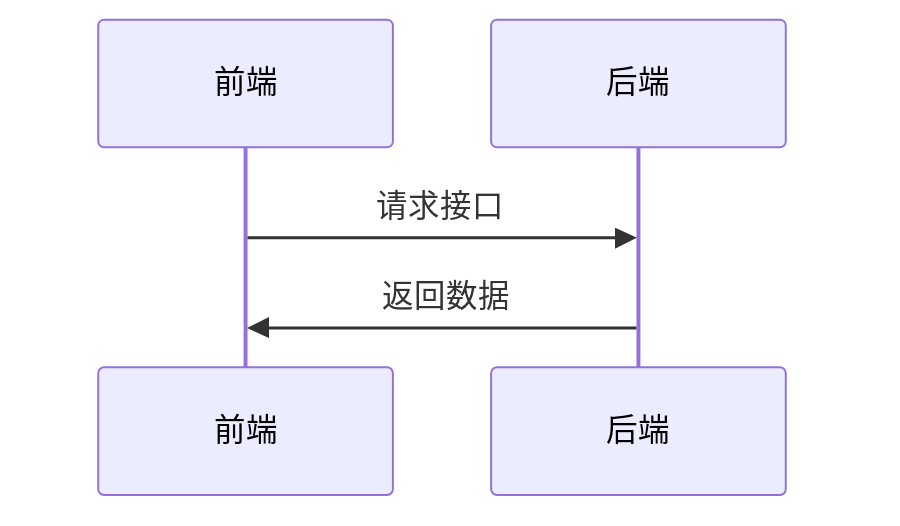
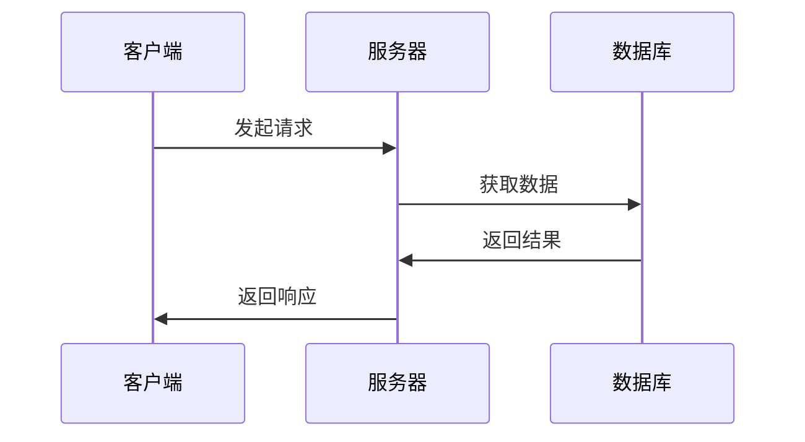

                 

### 文章标题：金融衍生品组合风险分析工具

> 关键词：金融衍生品、风险分析、组合风险、VaR模型、压力测试、蒙特卡罗模拟

> 摘要：本文旨在深入探讨金融衍生品组合风险分析工具的设计与应用。通过逐步分析，我们将从核心概念、算法原理到系统架构设计，提供全面的讲解，帮助读者理解金融衍生品组合风险分析的复杂性和必要性。

---

### 目录大纲设计构思

为了设计出《金融衍生品组合风险分析工具》这本书的完整目录大纲，我们需要按照以下步骤进行：

1. **背景介绍**：首先介绍金融衍生品组合风险分析的重要性和背景，说明为什么这本书是一个有价值的资源。
   
2. **核心概念与联系**：介绍金融衍生品、组合风险分析、工具等重要概念，并绘制相关概念属性特征对比表格和ER实体关系图架构。

3. **算法原理讲解**：选择几个关键的风险分析算法，绘制mermaid流程图，使用Python源代码和LaTeX数学公式详细阐述算法原理。

4. **系统分析与架构设计方案**：介绍项目场景、系统功能设计、系统架构设计、系统接口设计和系统交互。

5. **项目实战**：详细描述环境安装、系统核心实现源代码，以及实际案例分析和讲解。

6. **最佳实践 tips、小结、注意事项、拓展阅读**：总结书中要点，提供实用建议，并对读者进一步学习的资源进行推荐。

### 详细目录大纲

**第一部分：金融衍生品组合风险分析基础**

# 第1章：金融衍生品与组合风险分析概述

> **核心概念与联系**

## 1.1 问题背景

### 1.1.1 金融衍生品的发展历程

### 1.1.2 金融衍生品的风险特性

### 1.1.3 组合风险分析的重要性

## 1.2 问题描述

### 1.2.1 风险分析的目标

### 1.2.2 风险分析的关键挑战

### 1.2.3 风险分析的应用领域

## 1.3 问题解决思路

### 1.3.1 风险识别

### 1.3.2 风险评估

### 1.3.3 风险控制与优化

## 1.4 边界与外延

### 1.4.1 金融衍生品的种类

### 1.4.2 风险分析的范围与限制

## 1.5 概念结构与核心要素组成

### 1.5.1 金融衍生品的组成要素

### 1.5.2 风险分析的基本流程

### 1.5.3 风险分析工具的功能模块

## 1.6 本章小结

---

**第二部分：核心概念与联系**

# 第2章：核心概念原理

> **核心概念与联系**

## 2.1 金融衍生品

### 2.1.1 定义与分类

### 2.1.2 特征与属性

### 2.1.3 金融衍生品市场

## 2.2 组合风险分析

### 2.2.1 概念定义

### 2.2.2 理论基础

### 2.2.3 组合风险分析方法

## 2.3 工具与模型

### 2.3.1 传统风险分析模型

### 2.3.2 现代风险分析模型

### 2.3.3 工具应用与比较

## 2.4 概念属性特征对比表格

### 2.4.1 金融衍生品属性对比

### 2.4.2 风险分析模型对比

## 2.5 ER实体关系图架构

### 2.5.1 实体识别

### 2.5.2 关系定义

### 2.5.3 ER图绘制

## 2.6 本章小结

---

**第三部分：算法原理讲解**

# 第3章：风险分析算法原理与实现

> **算法原理讲解**

## 3.1 VaR模型

### 3.1.1 算法原理

$$
VaR = F^{-1}(1-\alpha) \times 历史模拟数据
$$

### 3.1.2 Python实现

```python
# Python代码示例
```

### 3.1.3 案例分析

---

# 第4章：风险价值模型

## 4.1 压力测试方法

### 4.1.1 算法原理

$$
\text{压力测试结果} = \frac{\sum (S_i - E(S_i))}{n}
$$

### 4.1.2 Python实现

```python
# Python代码示例
```

### 4.1.3 案例分析

---

# 第5章：蒙特卡罗模拟

## 5.1 算法原理

### 5.1.1 Monte Carlo模拟的基本思想

### 5.1.2 蒙特卡罗模拟在风险分析中的应用

$$
P(A) = \frac{\text{满足条件A的样本点数}}{\text{总样本点数}}
$$

### 5.1.3 Python实现

```python
# Python代码示例
```

### 5.1.4 案例分析

---

**第四部分：系统分析与架构设计**

# 第6章：系统功能设计与架构

> **系统分析与架构设计**

## 6.1 问题场景介绍

### 6.1.1 风险分析工具的需求

### 6.1.2 风险分析的应用场景

## 6.2 系统功能设计

### 6.2.1 领域模型

```mermaid
classDiagram
   衍生品 <<Class>> : 金融衍生品
   风险分析 <<Class>> 
```

### 6.2.2 系统架构设计

```mermaid
subgraph ModuleA
   A1 --> A2
   A3 --> A4
endModule

subgraph ModuleB
   B1 --> B2
   B3 --> B4
endModule
```

### 6.2.3 系统接口设计



### 6.2.4 系统交互



## 6.3 本章小结

---

**第五部分：项目实战**

# 第7章：项目实战

## 7.1 环境安装

### 7.1.1 系统环境配置

### 7.1.2 工具与依赖安装

## 7.2 系统核心实现源代码

### 7.2.1 风险分析模块实现

### 7.2.2 系统接口实现

## 7.3 实际案例分析与讲解

### 7.3.1 案例一：股票组合VaR分析

### 7.3.2 案例二：期权组合压力测试

## 7.4 项目小结

### 7.4.1 项目成果总结

### 7.4.2 遇到的问题与解决方案

### 7.4.3 项目展望与未来工作

## 7.5 本章小结

---

**第六部分：最佳实践、小结、注意事项、拓展阅读**

# 第8章：最佳实践、小结、注意事项、拓展阅读

## 8.1 最佳实践

### 8.1.1 风险分析工具的配置与使用

### 8.1.2 风险分析模型的优化策略

## 8.2 小结

### 8.2.1 书中核心内容的回顾

### 8.2.2 风险分析工具的应用价值

## 8.3 注意事项

### 8.3.1 使用风险分析工具的注意事项

### 8.3.2 风险分析结果的解读与应用

## 8.4 拓展阅读

### 8.4.1 推荐的书籍与论文

### 8.4.2 相关领域的研究动态与趋势

## 8.5 本章小结

---

通过上述的目录大纲设计，我们为《金融衍生品组合风险分析工具》这本书构建了一个全面而详细的框架。接下来，我们将逐一深入每个章节，详细阐述金融衍生品组合风险分析的各个方面。让我们开始这一段深入的技术之旅。

