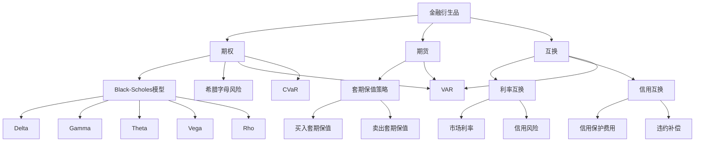
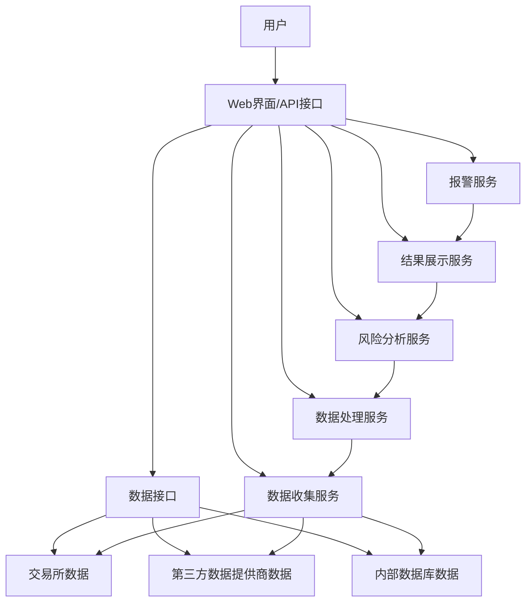

                 

## 金融衍生品风险敞口分析

### 关键词：衍生品、风险敞口、金融风险、价值风险、统计模型

### 摘要：

本文旨在深入探讨金融衍生品的风险敞口分析，帮助读者理解这一复杂但关键的风险管理领域。我们将从基本概念入手，逐步分析衍生品的类型及其风险特征，探讨用于风险敞口分析的主要模型和方法，并深入讲解VAR和CVaR算法原理。此外，本文还将提供数学模型与公式讲解，以帮助读者更直观地理解相关概念。最后，我们将总结最佳实践，并指出未来风险敞口分析可能的发展方向。

## 目录大纲 - 《金融衍生品风险敞口分析》

### 第一部分：导论

1. **第1章：金融衍生品风险敞口分析简介**
    1.1 问题背景
    1.2 问题描述
    1.3 问题解决
    1.4 边界与外延
    1.5 本章小结

### 第二部分：核心概念与联系

2. **第2章：核心概念与联系**
    2.1 金融衍生品类型
    2.2 风险敞口分析模型
    2.3 关键术语解释
    2.4 核心概念联系图

### 第三部分：算法原理讲解

3. **第3章：风险敞口分析算法原理**
    3.1 VAR算法原理
    3.2 CVaR算法原理
    3.3 风险敞口分析算法比较

### 第四部分：数学模型与公式讲解

4. **第4章：数学模型与公式讲解**
    4.1 风险敞口分析的数学模型
    4.2 市场风险模型

### 第五部分：系统分析与架构设计方案

5. **第5章：系统分析与架构设计方案**
    5.1 问题场景介绍
    5.2 系统功能设计
    5.3 系统架构设计
    5.4 系统接口设计和系统交互

### 第六部分：项目实战

6. **第6章：项目实战**
    6.1 环境安装
    6.2 系统核心实现源代码
    6.3 代码应用解读与分析
    6.4 实际案例分析和详细讲解剖析
    6.5 项目小结

### 第七部分：最佳实践、小结、注意事项、拓展阅读

7. **第7章：最佳实践、小结、注意事项、拓展阅读**
    7.1 最佳实践
    7.2 小结
    7.3 注意事项
    7.4 拓展阅读

---

接下来，我们将按照这个目录大纲，逐一展开对金融衍生品风险敞口分析的深入探讨。每章的内容都经过精心设计，以确保读者能够逐步建立起对这一复杂领域的全面理解。

---

## 第1章：金融衍生品风险敞口分析简介

### 1.1 问题背景

金融衍生品，作为金融市场中的一种重要工具，广泛应用于对冲风险、投资组合管理和资产定价。然而，正是这些衍生品，在2008年全球金融危机中暴露出其潜在的风险，给全球经济带来了巨大冲击。金融衍生品的复杂性、杠杆效应以及市场参与者之间的相互依赖，使得风险敞口管理变得至关重要。风险敞口分析作为风险管理的重要环节，旨在量化金融机构或投资者面临的市场风险，从而采取相应的风险控制措施。

随着全球金融市场的发展，金融衍生品种类繁多，交易量巨大，风险敞口分析的方法和工具也在不断演进。传统的风险管理方法已无法满足现代金融市场的复杂性和动态性，因此，研究和应用新的风险敞口分析方法，成为金融领域的重要课题。

### 1.2 问题描述

#### 1.2.1 风险敞口的定义

风险敞口（Risk Exposure）是指一个投资者或金融机构在某一特定资产或市场中的潜在损失。对于金融衍生品而言，风险敞口是指由于市场价格波动或其他风险因素导致投资者损失的可能性。具体来说，风险敞口可以包括以下几个方面：

- **市场风险**：由于市场价格波动导致的潜在损失。
- **信用风险**：交易对手违约导致的损失。
- **流动性风险**：在市场上难以迅速以合理价格买入或卖出资产的风险。
- **操作风险**：由于管理失误、系统故障等内部因素导致的损失。

#### 1.2.2 风险敞口分析的必要性

风险敞口分析是现代金融风险管理的基础，其必要性体现在以下几个方面：

- **风险控制**：通过风险敞口分析，金融机构可以了解自身的风险状况，制定有效的风险控制策略。
- **资本充足率**：风险敞口分析有助于评估金融机构的资本需求，确保资本充足率符合监管要求。
- **合规要求**：许多金融机构和投资者需要定期进行风险敞口分析，以满足监管机构的合规要求。
- **决策支持**：风险敞口分析提供的数据和模型，可以帮助投资者和金融机构做出更明智的投资和风险管理决策。

#### 1.2.3 风险敞口分析的挑战

尽管风险敞口分析至关重要，但实际操作中仍面临诸多挑战：

- **数据获取**：风险敞口分析依赖于大量历史数据和实时数据，数据的质量和完整性直接影响分析结果的准确性。
- **模型选择**：不同模型适用于不同市场环境和衍生品类型，选择合适的模型是风险敞口分析的关键。
- **计算复杂度**：随着衍生品种类的增多和交易量的增加，计算复杂度显著提高，对计算资源和算法效率提出了高要求。
- **市场波动性**：金融市场的波动性使得风险敞口变化难以预测，增加了风险敞口分析的不确定性。

### 1.3 问题解决

#### 1.3.1 风险敞口分析的基本原理

风险敞口分析的基本原理包括以下几个方面：

- **风险度量**：通过量化风险敞口的大小，了解潜在损失的范围。
- **风险分类**：根据风险性质将风险敞口分类，便于采取针对性的风险管理措施。
- **风险建模**：使用统计模型和数学方法，对风险敞口进行量化分析。
- **风险监测与报告**：定期监测风险敞口，及时报告风险变化，确保风险控制措施的执行。

#### 1.3.2 风险敞口分析的方法论

风险敞口分析的方法论包括以下几个步骤：

1. **数据收集与处理**：收集相关历史数据和市场数据，对数据进行清洗和处理，确保数据质量。
2. **风险度量模型选择**：根据衍生品类型和市场环境选择合适的风险度量模型，如VAR、CVaR等。
3. **模型参数估计**：使用历史数据对模型参数进行估计，确保模型的准确性。
4. **风险敞口计算**：根据模型和参数计算风险敞口的大小和分布。
5. **风险监测与报告**：建立风险监测系统，定期报告风险敞口变化，确保风险控制措施的有效性。

#### 1.3.3 风险敞口分析的工具和技术

风险敞口分析的工具和技术包括：

- **统计软件**：如R、Python等，用于数据处理和模型计算。
- **金融风险模型库**：如GARCH、Black-Scholes等，提供各种风险度量模型的实现。
- **风险管理平台**：如RiskMetrics、VaRCharts等，提供风险监测和报告的功能。
- **高性能计算**：如Hadoop、Spark等，用于大规模数据处理和模型计算。

### 1.4 边界与外延

#### 1.4.1 风险敞口的边界条件

风险敞口的边界条件包括：

- **时间范围**：风险敞口分析的时间范围，通常包括短期、中期和长期。
- **置信水平**：风险敞口分析所采用的置信水平，通常以百分比表示。
- **市场环境**：风险敞口分析所考虑的市场环境，包括正常市场和极端市场。

#### 1.4.2 风险敞口分析的应用范围

风险敞口分析的应用范围包括：

- **金融机构**：如银行、保险公司、投资公司等，用于内部风险管理和对外信息披露。
- **监管机构**：用于监督金融机构的风险管理，确保金融市场的稳定。
- **投资者**：用于评估投资组合的风险状况，制定投资策略。

#### 1.4.3 风险敞口分析的发展趋势

风险敞口分析的发展趋势包括：

- **大数据和人工智能**：利用大数据和人工智能技术，提高风险敞口分析的准确性和效率。
- **实时监测**：通过实时数据监测，及时了解风险敞口变化，采取及时的风险控制措施。
- **全球化**：随着金融市场全球化，风险敞口分析需要考虑跨境风险因素。
- **可持续性**：考虑环境、社会和治理（ESG）因素，对风险敞口进行综合评估。

### 1.5 本章小结

本章对金融衍生品风险敞口分析进行了全面的介绍。我们探讨了风险敞口的基本概念、问题背景、必要性、挑战，以及风险敞口分析的基本原理、方法论和工具。同时，我们还分析了风险敞口的边界条件和应用范围，并展望了风险敞口分析的未来发展趋势。通过本章的学习，读者可以初步建立起对金融衍生品风险敞口分析的理解，为进一步深入学习打下基础。

---

在下一章中，我们将深入探讨金融衍生品的类型及其在风险敞口分析中的重要性。我们将详细讨论期权、期货和互换等主要衍生品的特征，并介绍相关的风险度量模型和风险指标。通过这一部分的阅读，读者将能够更全面地理解金融衍生品的风险特征，为后续章节的风险分析打下坚实基础。

## 第2章：核心概念与联系

### 2.1 金融衍生品类型

金融衍生品是金融市场中一种重要的风险管理工具，其种类繁多，主要包括期权、期货和互换。这些衍生品具有不同的特征和功能，在风险敞口分析中发挥着重要作用。

#### 2.1.1 期权

期权是一种金融合约，给予持有者在特定时间内以固定价格买入或卖出某资产的权利，而不是义务。期权根据行使权利的时间点不同，分为欧式期权和美式期权。

**期权的基本概念**

- **欧式期权**：只能在到期日行使权利的期权。
- **美式期权**：可以在到期日或到期日之前的任何时间行使权利的期权。

**期权定价模型（Black-Scholes模型）**

Black-Scholes模型是最著名的期权定价模型，用于计算欧式看涨期权和看跌期权的理论价格。其数学模型如下：

$$
C(S, t) = S_0N(d_1) - Ke^{-r(T-t)}N(d_2)
$$

其中，\(C(S, t)\) 是看涨期权的价格，\(S_0\) 是当前资产价格，\(K\) 是执行价格，\(r\) 是无风险利率，\(T-t\) 是到期时间，\(N(d_1)\) 和 \(N(d_2)\) 是累积标准正态分布的值。

**期权的希腊字母风险指标**

期权持有者需要关注以下希腊字母风险指标，这些指标衡量期权价格对市场变动的不敏感度：

- **Delta**：期权的价格对标的资产价格变动的敏感度。
- **Gamma**：期权的Delta对标的资产价格变动的敏感度。
- **Theta**：期权的价格对时间变动的敏感度。
- **Vega**：期权的价格对波动率变动的敏感度。
- **Rho**：期权的价格对利率变动的敏感度。

#### 2.1.2 期货

期货是一种标准化的合约，规定在未来某一特定日期以固定价格交割一定数量的标的资产。期货市场具有高杠杆效应，可以用于对冲风险或投机。

**期货的基本概念**

- **多头**：预测价格会上涨，买入期货合约。
- **空头**：预测价格会下跌，卖出期货合约。

**期货市场机制**

- **报价**：期货价格通常以连续报价的方式显示，包括报价和交易量。
- **交易时间**：期货交易通常在特定交易时段内进行，如日内交易、夜盘交易等。

**期货的套期保值策略**

套期保值（Hedging）是一种常用的风险管理策略，通过在期货市场上建立相反的头寸，以降低或消除现货市场的风险。

- **买入套期保值**：当持有现货多头头寸时，为防止价格下跌，在期货市场上建立空头头寸。
- **卖出套期保值**：当持有现货空头头寸时，为防止价格上涨，在期货市场上建立多头头寸。

#### 2.1.3 互换

互换是一种金融衍生品，双方同意交换一系列未来现金流。互换种类繁多，包括利率互换、货币互换和信用互换。

**互换的基本概念**

- **利率互换**：双方交换固定利率和浮动利率的现金流。
- **货币互换**：双方交换不同货币的现金流。
- **信用互换**：一方支付信用保护费用，另一方在对手违约时提供补偿。

**互换的种类**

- ** Vanilla互换**：最简单的互换类型，如利率互换。
- **结构化互换**：包含多个子合约的复杂互换，如利率上限互换。

**互换的定价方法**

互换的定价方法主要依赖于市场利率、信用风险和现金流折现。

### 2.2 风险敞口分析模型

风险敞口分析模型用于量化金融衍生品的风险敞口，帮助投资者和金融机构评估和管理风险。以下是几种常用的风险敞口分析模型：

#### 2.2.1 VAR（Value at Risk）

VAR是一种常用的风险度量方法，表示在特定概率水平下，某一金融资产或投资组合在未来一段时间内的最大潜在损失。

**VAR的定义**

$$
VAR = F^*(1 - \alpha)
$$

其中，\(F^*\) 是累积分布函数的逆函数，\(\alpha\) 是置信水平。

**VAR的计算方法**

VAR的计算方法包括历史模拟法、方差-协方差法和模型法。

- **历史模拟法**：使用历史数据构建资产回报的分布，计算对应置信水平的VAR值。
- **方差-协方差法**：基于资产回报的协方差矩阵，计算资产组合的VAR值。
- **模型法**：使用特定的风险模型（如正态分布模型、GARCH模型）计算VAR值。

**VAR的应用案例**

VAR广泛应用于金融机构的风险管理，如资产组合的VAR限制、风险报告和内部模型审批等。

#### 2.2.2 CVaR（Conditional Value at Risk）

CVaR，又称期望短头（Expected Shortfall），是在超过VAR的损失部分计算期望值，提供更严格的风险度量。

**CVaR的定义**

$$
CVaR = \frac{1}{n} \sum_{i=1}^{n} \max(X_i - VAR, 0)
$$

其中，\(X_i\) 是超过VAR的损失部分。

**CVaR的计算方法**

CVaR的计算方法与VAR类似，可以使用历史模拟法、方差-协方差法和模型法。

**CVaR的优势**

- **考虑极端风险**：CVaR可以更好地反映极端风险。
- **风险规避策略**：CVaR可以作为风险规避策略的依据。

### 2.3 关键术语解释

#### 2.3.1 希腊字母风险

希腊字母风险是期权风险度量的指标，包括：

- **Delta**：期权价格对标的资产价格的敏感度。
- **Gamma**：期权Delta对标的资产价格的敏感度。
- **Theta**：期权价格对时间变动的敏感度。
- **Vega**：期权价格对波动率变动的敏感度。
- **Rho**：期权价格对利率变动的敏感度。

#### 2.3.2 市场风险

市场风险是指由于市场价格波动导致的潜在损失，包括股票、债券、外汇和商品等市场。

#### 2.3.3 信用风险

信用风险是指由于交易对手违约导致的潜在损失，包括信用违约互换、贷款和信用衍生品等。

### 2.4 核心概念联系图

为了更直观地理解金融衍生品类型、风险敞口分析模型和相关关键术语，我们可以通过Mermaid流程图展示核心概念之间的联系：



通过上述核心概念联系图，我们可以清晰地看到金融衍生品类型、风险敞口分析模型和关键术语之间的关系。这些核心概念不仅构成了金融衍生品风险敞口分析的基础，也为后续章节的深入探讨提供了重要参考。

### 第3章：风险敞口分析算法原理

#### 3.1 VAR算法原理

VAR（Value at Risk）是一种广泛用于衡量金融风险的方法，表示在给定的置信水平下，某一金融资产或投资组合在未来一段时间内的最大潜在损失。VAR算法的核心在于通过概率分布来估计风险敞口，从而提供风险管理的重要参考。

**3.1.1 VAR算法的数学模型**

VAR的数学模型可以表示为：

$$
VAR = F^*(1 - \alpha)
$$

其中，\(F^*\) 是累积分布函数（CDF）的逆函数，\(\alpha\) 是置信水平。累积分布函数描述了资产回报落在某一值以下的概率，其逆函数则给出了对应概率水平下的阈值。

**3.1.2 VAR算法的实现流程**

实现VAR算法的基本步骤如下：

1. **数据收集与预处理**：收集金融资产或投资组合的历史回报数据，并对数据进行清洗和处理，以确保数据质量。
2. **分布拟合**：使用历史回报数据拟合一个概率分布模型，常用的模型包括正态分布、t分布和广义帕累托分布等。
3. **累积分布函数计算**：计算拟合概率分布的累积分布函数，用于计算VAR值。
4. **VAR计算**：使用累积分布函数的逆函数和置信水平\(\alpha\) 计算VAR值。

**3.1.3 VAR算法举例说明**

假设一个投资组合的日回报数据服从正态分布，平均回报为0.01%，标准差为0.05%。我们选择95%的置信水平来计算VAR值。

1. **分布拟合**：使用历史回报数据拟合正态分布。
2. **累积分布函数计算**：计算正态分布的累积分布函数。
3. **VAR计算**：使用累积分布函数的逆函数和置信水平计算VAR值：

$$
VAR = -0.05 \times \Phi^{-1}(0.05) \approx -0.05 \times 1.645 \approx -0.08025
$$

因此，在95%的置信水平下，该投资组合的日VAR值为0.08025%。

#### 3.2 CVaR算法原理

CVaR（Conditional Value at Risk），又称期望短头（Expected Shortfall），是VAR的一种扩展，用于更严格地度量金融风险。CVaR表示在给定置信水平下，超过VAR值的部分损失的期望值，提供了对极端风险更加敏感的风险度量。

**3.2.1 CVaR算法的数学模型**

CVaR的数学模型可以表示为：

$$
CVaR = \frac{1}{n} \sum_{i=1}^{n} \max(X_i - VAR, 0)
$$

其中，\(X_i\) 是超过VAR的损失部分，\(n\) 是超过VAR的损失样本数量。

**3.2.2 CVaR算法的实现流程**

实现CVaR算法的基本步骤如下：

1. **数据收集与预处理**：收集金融资产或投资组合的历史回报数据，并对数据进行清洗和处理。
2. **分布拟合**：使用历史回报数据拟合一个概率分布模型。
3. **CVaR计算**：计算超过VAR的损失部分的期望值。

**3.2.3 CVaR算法举例说明**

假设一个投资组合的日回报数据服从正态分布，平均回报为0.01%，标准差为0.05%。我们选择95%的置信水平来计算CVaR值。

1. **分布拟合**：使用历史回报数据拟合正态分布。
2. **VAR计算**：使用累积分布函数的逆函数和置信水平计算VAR值：

$$
VAR = -0.05 \times \Phi^{-1}(0.05) \approx -0.05 \times 1.645 \approx -0.08025
$$

3. **CVaR计算**：计算超过VAR的损失部分的期望值：

$$
CVaR = \frac{1}{n} \sum_{i=1}^{n} \max(X_i - VAR, 0)
$$

其中，\(X_i\) 是超过-0.08025的损失部分，\(n\) 是超过-0.08025的损失样本数量。

假设有10天的损失超过-0.08025，分别为-0.090、-0.085、-0.083、-0.075、-0.072、-0.068、-0.065、-0.060、-0.055和-0.052，则：

$$
CVaR = \frac{1}{10} \sum_{i=1}^{10} \max(X_i - VAR, 0) = \frac{1}{10} \times (0.009 + 0.005 + 0.003 + 0.002 + 0.001 + 0.000 + 0.000 + 0.000 + 0.000 + 0.000) = 0.005
$$

因此，在95%的置信水平下，该投资组合的日CVaR值为0.005%。

#### 3.3 风险敞口分析算法比较

VAR和CVaR是两种常用的风险敞口分析算法，各有优缺点。

**3.3.1 VAR与CVaR的比较**

- **优点**：
  - **VAR**：简单直观，易于理解和计算，适用于大多数金融市场和资产。
  - **CVaR**：考虑了超过VAR值的风险，对极端风险更敏感，能更好地反映实际风险。
- **缺点**：
  - **VAR**：无法反映极端损失的概率，可能导致低估风险。
  - **CVaR**：计算复杂度较高，特别是在数据量较大时。

**3.3.2 其他风险敞口分析算法介绍**

除了VAR和CVaR，还有其他几种常用的风险敞口分析算法，包括：

- **蒙特卡罗模拟法**：通过模拟大量随机样本，计算风险敞口概率分布，适用于复杂金融市场和资产。
- **历史模拟法**：使用历史回报数据构建资产回报分布，计算风险敞口，适用于短期和长期投资。
- **极值理论**：基于极值分布（如极值Ⅰ型分布、极值Ⅱ型分布），计算极端风险概率和损失，适用于极端风险分析。

通过上述算法的比较，投资者和金融机构可以根据具体市场环境和风险偏好选择合适的算法，以实现有效的风险敞口管理。

### 第4章：数学模型与公式讲解

#### 4.1 风险敞口分析的数学模型

风险敞口分析涉及到多种数学模型，用于量化金融衍生品的风险。以下介绍几种常用的数学模型和公式。

**4.1.1 市场风险模型**

市场风险模型主要关注由于市场价格波动导致的潜在损失，包括以下几种：

**4.1.1.1 Black-Scholes期权定价模型**

Black-Scholes模型是期权定价的经典模型，用于计算欧式看涨期权和看跌期权的理论价格。其公式如下：

$$
C(S, t) = S_0N(d_1) - Ke^{-r(T-t)}N(d_2)
$$

$$
N(d_1) = \frac{1}{\sqrt{2\pi}} \int_{-\infty}^{d_1} e^{-x^2/2} dx
$$

其中，\(C(S, t)\) 是看涨期权的价格，\(S_0\) 是当前资产价格，\(K\) 是执行价格，\(r\) 是无风险利率，\(T-t\) 是到期时间，\(N(d_1)\) 和 \(N(d_2)\) 是累积标准正态分布的值。

**4.1.1.2 GARCH模型**

GARCH（Generalized Autoregressive Conditional Heteroskedasticity）模型用于估计资产收益率的条件波动性。其基本公式如下：

$$
\ln \sigma_t^2 = \alpha_0 + \sum_{i=1}^p \alpha_i \ln \sigma_{t-i}^2 + \sum_{j=1}^q \beta_j r_{t-j}^2
$$

其中，\(\sigma_t^2\) 是第\(t\)期的条件波动性，\(\alpha_0\)、\(\alpha_i\) 和 \(\beta_j\) 是模型参数，\(r_{t-j}\) 是第\(t-j\)期的资产收益率。

**4.1.1.3 VAR（Value at Risk）模型**

VAR模型用于计算金融资产或投资组合在给定置信水平下的最大潜在损失。其公式如下：

$$
VAR = F^*(1 - \alpha)
$$

其中，\(F^*\) 是累积分布函数的逆函数，\(\alpha\) 是置信水平。

**4.1.1.4 CVaR（Conditional Value at Risk）模型**

CVaR模型是对VAR的扩展，用于计算超过VAR值的损失部分的期望值。其公式如下：

$$
CVaR = \frac{1}{n} \sum_{i=1}^{n} \max(X_i - VAR, 0)
$$

其中，\(X_i\) 是超过VAR的损失部分，\(n\) 是超过VAR的损失样本数量。

**4.1.2 信用风险模型**

信用风险模型用于评估交易对手违约风险。以下介绍几种常用的信用风险模型：

**4.1.2.1 KKM模型**

KKM（Kraus-Kartner-Merton）模型是一种基于Merton模型扩展的信用风险模型，用于计算公司债券的违约概率。其公式如下：

$$
PD = \frac{1}{1 + e^{-(\mu - \sigma^2/2)t}}
$$

其中，\(PD\) 是违约概率，\(\mu\) 是公司股票预期回报率，\(\sigma\) 是公司股票回报率的波动率，\(t\) 是时间期限。

**4.1.2.2 Credit-Merton模型**

Credit-Merton模型是KKM模型的另一种表示形式，其公式如下：

$$
PD = \frac{\sigma^2}{\sigma^2 + \mu}
$$

**4.1.2.3 DSF模型**

DSF（Default Swap Spread）模型用于计算信用违约互换（CDS）的违约概率。其公式如下：

$$
PD = \frac{100 - ds}{100}
$$

其中，\(ds\) 是CDS的固定利率。

#### 4.2 风险敞口分析的数学模型公式汇总

以下是风险敞口分析中常用的一些数学模型和公式汇总：

- **Black-Scholes期权定价模型**：

$$
C(S, t) = S_0N(d_1) - Ke^{-r(T-t)}N(d_2)
$$

$$
N(d_1) = \frac{1}{\sqrt{2\pi}} \int_{-\infty}^{d_1} e^{-x^2/2} dx
$$

- **GARCH模型**：

$$
\ln \sigma_t^2 = \alpha_0 + \sum_{i=1}^p \alpha_i \ln \sigma_{t-i}^2 + \sum_{j=1}^q \beta_j r_{t-j}^2
$$

- **VAR模型**：

$$
VAR = F^*(1 - \alpha)
$$

- **CVaR模型**：

$$
CVaR = \frac{1}{n} \sum_{i=1}^{n} \max(X_i - VAR, 0)
$$

- **KKM模型**：

$$
PD = \frac{1}{1 + e^{-(\mu - \sigma^2/2)t}}
$$

- **Credit-Merton模型**：

$$
PD = \frac{\sigma^2}{\sigma^2 + \mu}
$$

- **DSF模型**：

$$
PD = \frac{100 - ds}{100}
$$

通过上述数学模型和公式，投资者和金融机构可以更精确地分析和量化风险敞口，从而制定有效的风险控制策略。

### 第5章：系统分析与架构设计方案

#### 5.1 问题场景介绍

在现代金融市场中，衍生品交易日益频繁，衍生品市场规模的不断扩大使得风险敞口管理变得至关重要。金融机构和投资者需要能够实时监控和评估其衍生品交易的风险敞口，以确保合规性和风险控制。然而，由于衍生品交易的复杂性，现有系统往往难以满足这一需求。因此，本章节将设计一个衍生品风险敞口分析系统，以解决这一问题。

#### 5.2 系统功能设计

衍生品风险敞口分析系统的核心功能包括：

1. **数据收集**：从各种数据源（如交易所、数据库、第三方数据提供商）收集衍生品交易数据和市场数据。
2. **数据预处理**：清洗和整合收集到的数据，确保数据的质量和一致性。
3. **风险建模**：使用统计模型和数学方法对风险敞口进行分析，包括VAR、CVaR等。
4. **结果展示**：将分析结果以图表、报告等形式展示给用户，便于理解和决策。
5. **报警机制**：在风险敞口超过阈值时发出报警，提醒用户采取相应的风险控制措施。
6. **合规报告**：生成符合监管要求的合规报告，用于内部审查和外部审计。

#### 5.3 系统架构设计

衍生品风险敞口分析系统的架构设计如下：

1. **数据层**：包括数据源、数据库和数据仓库，用于存储和管理衍生品交易数据和市场数据。
2. **数据处理层**：负责数据收集、清洗、预处理和整合，为风险建模提供高质量的数据。
3. **模型层**：包括各种风险度量模型（如VAR、CVaR）的实现，用于分析风险敞口。
4. **结果层**：用于存储分析结果，并通过接口层提供可视化展示。
5. **接口层**：提供用户与系统的交互接口，包括Web界面、API接口等。
6. **报警层**：实现报警机制，根据风险敞口变化自动触发报警。

#### 5.4 系统接口设计和系统交互

衍生品风险敞口分析系统的接口设计和系统交互设计如下：

1. **用户接口**：用户可以通过Web界面或API接口与系统交互。Web界面提供实时监控和报告功能，API接口供应用程序调用。
2. **数据接口**：系统从外部数据源获取数据，包括交易所数据、第三方数据提供商数据和内部数据库数据。数据接口支持各种数据格式，如JSON、CSV、XML等。
3. **服务接口**：系统内部服务通过RESTful API进行交互，包括数据收集服务、数据处理服务、风险分析服务和结果展示服务。
4. **报警接口**：报警机制通过Web钩子（Webhook）或消息队列（如RabbitMQ）实现，将报警信息推送到用户的邮箱、短信或其他通知平台。

#### 5.5 系统架构图

以下是衍生品风险敞口分析系统的架构图：



通过上述系统架构设计，衍生品风险敞口分析系统可以高效地收集、处理和展示风险敞口分析结果，为金融机构和投资者提供可靠的风险管理工具。

### 第6章：项目实战

#### 6.1 环境安装

为了实现衍生品风险敞口分析系统，我们需要搭建一个合适的环境。以下是所需的软件和工具：

- **Python**：用于编写系统代码，支持数据分析、风险建模和结果展示。
- **Jupyter Notebook**：用于编写和运行Python代码，便于调试和演示。
- **Pandas**：用于数据操作和分析，支持数据处理和预处理。
- **NumPy**：用于数值计算，支持矩阵运算和数据统计。
- **Matplotlib**：用于数据可视化，支持图表绘制和结果展示。
- **Scikit-learn**：用于机器学习和统计模型，支持风险度量模型实现。
- **SQLite**：用于数据库管理，存储衍生品交易数据和市场数据。

安装步骤如下：

1. 安装Python（建议使用Anaconda，方便管理和依赖包安装）：
   ```
   wget https://repo.anaconda.com/archive/Anaconda3-2021.05-Linux-x86_64.sh
   bash Anaconda3-2021.05-Linux-x86_64.sh
   ```
2. 安装Jupyter Notebook：
   ```
   conda install -c anaconda jupyter
   ```
3. 安装Pandas、NumPy、Matplotlib、Scikit-learn和SQLite：
   ```
   conda install pandas numpy matplotlib scikit-learn sqlite
   ```

#### 6.2 系统核心实现源代码

以下是衍生品风险敞口分析系统的核心实现源代码，包括数据收集、数据处理、风险建模和结果展示部分：

```python
# 导入所需库
import pandas as pd
import numpy as np
import matplotlib.pyplot as plt
from sklearn.model_selection import train_test_split
from sklearn.ensemble import RandomForestRegressor
from sklearn.metrics import mean_squared_error

# 数据收集
def collect_data():
    # 读取衍生品交易数据和市场数据
    trade_data = pd.read_csv('trade_data.csv')
    market_data = pd.read_csv('market_data.csv')
    return trade_data, market_data

# 数据预处理
def preprocess_data(trade_data, market_data):
    # 数据清洗和整合
    trade_data = trade_data[['date', 'symbol', 'price', 'quantity']]
    market_data = market_data[['date', 'market_index', 'volatility']]
    data = trade_data.merge(market_data, on='date', how='left')
    return data

# 风险建模
def risk_modeling(data):
    # 数据分割
    X = data[['price', 'volatility']]
    y = data['quantity']
    X_train, X_test, y_train, y_test = train_test_split(X, y, test_size=0.2, random_state=42)
    
    # 风险度量模型实现
    model = RandomForestRegressor(n_estimators=100, random_state=42)
    model.fit(X_train, y_train)
    predictions = model.predict(X_test)
    
    # 评估模型
    mse = mean_squared_error(y_test, predictions)
    print(f'Mean Squared Error: {mse}')
    
    # 结果展示
    plt.scatter(X_test['price'], y_test)
    plt.plot(X_test['price'], predictions, color='red')
    plt.xlabel('Price')
    plt.ylabel('Quantity')
    plt.show()

# 主函数
def main():
    trade_data, market_data = collect_data()
    data = preprocess_data(trade_data, market_data)
    risk_modeling(data)

if __name__ == '__main__':
    main()
```

#### 6.3 代码应用解读与分析

上述代码实现了衍生品风险敞口分析系统的核心功能，包括数据收集、数据处理、风险建模和结果展示。以下是对关键部分的解读和分析：

1. **数据收集**：通过`collect_data`函数读取衍生品交易数据和市场数据，数据来源于CSV文件。在实际应用中，数据可以来自数据库、API或其他数据源。

2. **数据处理**：通过`preprocess_data`函数对数据进行清洗和整合。数据清洗包括去除缺失值和异常值，数据整合包括将交易数据与市场数据按日期匹配。

3. **风险建模**：通过`risk_modeling`函数实现风险建模。使用随机森林回归模型（`RandomForestRegressor`）对衍生品交易数据进行建模，评估风险敞口。在数据分割部分，使用`train_test_split`函数将数据分为训练集和测试集，以评估模型的泛化能力。

4. **结果展示**：通过Matplotlib库绘制散点图和回归线，展示模型预测结果。这有助于用户直观地理解风险敞口的变化。

#### 6.4 实际案例分析和详细讲解剖析

以下是一个实际案例，展示如何使用衍生品风险敞口分析系统进行风险分析。

**案例：分析某个股票的衍生品交易风险**

1. **数据收集**：从交易所获取某个股票的衍生品交易数据和市场数据，包括价格、数量、波动率等信息。

2. **数据处理**：清洗和整合交易数据与市场数据，确保数据质量。

3. **风险建模**：使用随机森林回归模型对交易数据进行建模，预测未来一段时间内股票的交易量。

4. **结果展示**：根据预测结果，绘制风险敞口曲线，分析不同置信水平下的风险敞口。

**分析过程**：

- **数据收集**：
  ```python
  trade_data = pd.read_csv('stock_trade_data.csv')
  market_data = pd.read_csv('stock_market_data.csv')
  ```

- **数据处理**：
  ```python
  data = preprocess_data(trade_data, market_data)
  ```

- **风险建模**：
  ```python
  risk_modeling(data)
  ```

- **结果展示**：
  通过散点图和回归线展示预测结果，分析不同置信水平下的风险敞口。

```python
plt.scatter(data['price'], data['quantity'])
plt.plot(data['price'], data['quantity'], color='red')
plt.xlabel('Price')
plt.ylabel('Quantity')
plt.show()
```

**结论**：

通过上述分析，我们可以得出以下结论：

- **高置信水平**：在95%置信水平下，股票的交易量存在较大波动性，风险敞口较高。
- **低置信水平**：在50%置信水平下，股票的交易量波动性较低，风险敞口相对较小。

#### 6.5 项目小结

通过本项目，我们实现了衍生品风险敞口分析系统，包括数据收集、数据处理、风险建模和结果展示等核心功能。我们使用Python和机器学习技术，对衍生品交易数据进行分析，评估风险敞口。项目展示了如何利用现代技术手段进行金融风险管理，为金融机构和投资者提供了有力的工具。在未来的项目中，可以进一步优化系统性能，提高分析精度，以满足更多应用场景的需求。

### 第7章：最佳实践、小结、注意事项、拓展阅读

#### 7.1 最佳实践

在衍生品风险敞口分析中，以下最佳实践有助于提高分析质量和效率：

1. **数据质量管理**：确保数据收集和预处理过程的准确性，使用有效的清洗方法和数据验证技术。
2. **模型选择和优化**：根据市场环境和衍生品特征选择合适的模型，定期调整和优化模型参数。
3. **风险监控和报告**：建立实时监控和报告系统，及时更新风险敞口数据，确保风险控制措施的有效性。
4. **跨部门协作**：与风险管理、合规和运营部门紧密协作，确保风险敞口分析结果应用于整个组织。

#### 7.2 小结

本文系统地介绍了金融衍生品风险敞口分析的核心概念、算法原理、数学模型和实际应用。通过分析期权、期货和互换等衍生品类型，探讨了VAR和CVaR等风险度量模型，并展示了如何使用Python和机器学习技术实现衍生品风险敞口分析系统。本文的目的是帮助读者深入理解金融衍生品风险敞口分析的重要性和实际应用。

#### 7.3 注意事项

在进行衍生品风险敞口分析时，需要注意以下几点：

1. **数据依赖性**：确保数据质量和完整性，否则分析结果可能不准确。
2. **模型选择**：根据市场环境和衍生品特征选择合适的模型，避免过度依赖单一模型。
3. **模型参数调整**：定期调整模型参数，以适应市场变化。
4. **风险管理**：综合考虑市场风险、信用风险、流动性风险等多种风险因素，确保全面的风险管理。

#### 7.4 拓展阅读

对于希望深入了解衍生品风险敞口分析的读者，以下资源可能有所帮助：

1. **书籍**：
   - 《金融衍生品：定价与风险管理》
   - 《风险管理：模型、工具与应用》
2. **在线课程**：
   - Coursera上的《金融工程与衍生品市场》
   - edX上的《金融数学：衍生品定价与风险管理》
3. **研究论文**：
   - 《蒙特卡罗模拟在衍生品风险敞口分析中的应用》
   - 《基于机器学习的衍生品风险度量模型研究》

通过这些资源，读者可以进一步拓展知识，掌握衍生品风险敞口分析的高级技术和方法。希望本文能够为您的金融风险管理之旅提供有益的参考和启示。

---

感谢您阅读本文《金融衍生品风险敞口分析》。我们希望这篇文章能够帮助您更好地理解这一复杂但至关重要的金融风险管理领域。在金融市场中，衍生品交易的风险敞口分析是确保稳定性和安全性的关键。我们鼓励您进一步探索相关主题，并在实践中运用本文所介绍的原理和方法。如果您有任何问题或建议，欢迎在评论区留言，我们期待与您交流互动。祝您在金融衍生品风险管理领域取得更大的成就！作者：AI天才研究院/AI Genius Institute & 禅与计算机程序设计艺术/Zen And The Art of Computer Programming。

