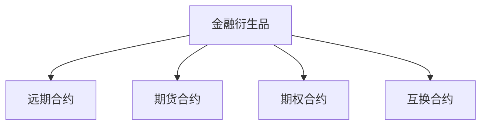
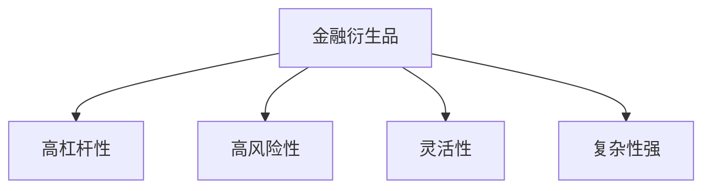

                 

### 文章标题：金融衍生品风险评估模型

> 关键词：金融衍生品、风险评估、风险模型、风险管理、风险规避、风险转移、风险分散

> 摘要：本文旨在深入探讨金融衍生品风险评估模型的构建、应用与发展。通过系统阐述金融衍生品的基本概念、定价模型、风险评估方法和风险管理策略，本文为金融从业者提供了一个全面的视角，帮助其理解和应用金融衍生品风险管理。此外，本文还通过实际案例分析和未来发展趋势展望，提出了金融衍生品风险管理的新思路和方法。

----------------------------------------------------------------

## 目录大纲

1. **第一部分：金融衍生品概述**
   1. 第1章：金融衍生品的基本概念
      1.1 金融衍生品的定义和分类
      1.2 金融衍生品的发展历程
      1.3 金融衍生品的作用与影响
   2. 第2章：金融衍生品的定价模型
      2.1 布雷克-舍尔斯-默顿模型
      2.2 二叉树模型
      2.3 Monte Carlo模拟
   3. 第3章：风险评估方法
      3.1 概率风险评估
      3.2 期望值风险评估
      3.3 Value at Risk (VaR) 方法
      3.4 Conditional Value at Risk (CVaR) 方法
   4. 第4章：风险管理策略
      4.1 风险规避
      4.2 风险转移
      4.3 风险分散
      4.4 风险控制
   5. 第5章：金融衍生品市场的监管
      5.1 监管机构与监管法规
      5.2 监管挑战与对策
      5.3 国际监管合作
   6. 第6章：实际案例分析
      6.1 案例一：次贷危机中的金融衍生品风险
      6.2 案例二：欧洲主权债务危机中的金融衍生品应用
      6.3 案例三：公司并购中的金融衍生品风险管理
   7. 第7章：金融衍生品风险评估模型应用
      7.1 风险评估模型的建立
      7.2 风险评估模型的优化
      7.3 风险评估模型的实际应用案例分析
   8. 第8章：金融衍生品风险管理发展趋势
      8.1 新技术对风险管理的影响
      8.2 金融市场全球化与风险管理
      8.3 风险管理策略的创新与发展
   9. 第9章：总结与展望
      9.1 金融衍生品风险评估的重要性
      9.2 存在的问题与挑战
      9.3 未来发展趋势与展望

----------------------------------------------------------------

### 金融衍生品的基本概念

金融衍生品，是指其价值取决于或派生于基础资产（如股票、债券、货币、商品等）价格变动的金融合约。金融衍生品的设计初衷是为了帮助投资者和管理者对冲风险、获取收益或进行投资策略的实施。

#### 1.1 金融衍生品的定义和分类

**定义**：
金融衍生品是一种金融合约，其价值依赖于一个或多个基础资产的价格、利率、汇率或其他变量的变化。它们不直接拥有或交易基础资产，而是通过衍生品合约来管理或转移风险。

**分类**：
根据衍生品合约的特性，金融衍生品可以分为以下四大类：

- **远期合约（Forward Contracts）**：买卖双方约定在未来某一特定日期，以约定价格买卖特定数量的基础资产的合约。
- **期货合约（Future Contracts）**：标准化的远期合约，在交易所交易，买卖双方约定在未来某一特定日期以约定价格买卖特定数量的基础资产。
- **期权合约（Option Contracts）**：给予持有人在某一特定日期或该日之前的特定时间以约定价格买入或卖出基础资产的权利，但非义务。
- **互换合约（Swap Contracts）**：买卖双方同意在未来的某一特定日期或一系列日期按照预定条件交换现金流（如利率互换、货币互换等）。

#### 1.2 金融衍生品的发展历程

金融衍生品的发展历程可以追溯到20世纪70年代，当时随着金融市场的自由化和全球化，衍生品市场开始迅速发展。以下是几个关键的发展阶段：

- **1970年代**：远期合约和期货合约出现，为市场参与者提供了一种新的风险管理工具。
- **1980年代**：期权和互换合约逐渐流行，衍生品市场开始多样化。
- **1990年代**：衍生品市场继续扩展，新兴市场也开始引入衍生品交易。
- **2000年代**：金融创新进一步推动了衍生品市场的发展，复杂衍生品如结构化金融产品（CDO、MBS等）大量涌现。

#### 1.3 金融衍生品的作用与影响

**作用**：

1. **风险对冲**：投资者和企业可以通过衍生品合约来对冲特定风险，如利率风险、汇率风险和商品价格风险。
2. **投资策略**：衍生品为投资者提供了多样化的投资策略，如杠杆交易、套利策略和投资组合优化。
3. **融资工具**：企业可以通过发行债务衍生品来降低融资成本，改善资本结构。

**影响**：

1. **市场流动性**：衍生品市场的出现增加了金融市场的流动性，使得投资者能够更便捷地买卖资产。
2. **市场风险**：衍生品的高杠杆性和复杂性可能导致市场风险的放大，尤其是在市场动荡时期。
3. **监管挑战**：衍生品市场的全球化带来了监管挑战，需要各国监管机构加强合作，制定统一的监管规则。

在接下来的章节中，我们将进一步探讨金融衍生品的定价模型、风险评估方法和风险管理策略，帮助读者全面了解这一复杂但重要的金融领域。

----------------------------------------------------------------

### 金融衍生品的定价模型

在金融衍生品市场中，准确地进行定价是投资者和管理者进行有效决策的重要基础。常见的金融衍生品定价模型包括布莱克-舍尔斯-默顿模型（Black-Scholes-Merton Model）、二叉树模型和Monte Carlo模拟。以下是对这些模型的详细解释。

#### 2.1 布雷克-舍尔斯-默顿模型（Black-Scholes-Merton Model）

**基本原理**：

布莱克-舍尔斯-默顿模型（简称BS模型）是一个用于期权定价的数学模型，假设股票价格遵循对数正态分布，并考虑了无风险利率、股票价格的波动率和到期时间等因素。该模型主要适用于欧式期权。

**数学模型**：

- 期权价格公式：

  $$ C(S_0, t) = S_0N(d_1) - Ke^{-rt}N(d_2) $$

  其中，\( S_0 \) 是当前股票价格，\( K \) 是执行价格，\( r \) 是无风险利率，\( t \) 是到期时间，\( N(d_1) \) 和 \( N(d_2) \) 是标准正态分布的累积分布函数，满足以下条件：

  $$ d_1 = \frac{\ln(S_0/K) + (r + \sigma^2/2)t}{\sigma\sqrt{t}} $$
  $$ d_2 = d_1 - \sigma\sqrt{t} $$

  \( \sigma \) 是股票价格的波动率。

**优点**：

- 简单易懂，便于计算。
- 假设合理，适用于大多数期权定价。

**缺点**：

- 忽略了交易成本和税收影响。
- 对股票价格波动率的假设过于简化。

**举例说明**：

假设当前股票价格为100美元，执行价格为100美元，无风险利率为5%，股票波动率为20%，期权到期时间为1年。使用BS模型可以计算出欧式看涨期权的价格。

$$ C(100, 1) = 100N(d_1) - 100e^{-0.05 \times 1}N(d_2) $$

计算得：

$$ d_1 = \frac{\ln(100/100) + (0.05 + 0.2^2/2) \times 1}{0.2\sqrt{1}} = 1.282 $$
$$ d_2 = d_1 - 0.2\sqrt{1} = 0.882 $$
$$ N(d_1) = N(d_2) \approx 0.9015 $$
$$ C(100, 1) = 100 \times 0.9015 - 100e^{-0.05} \times 0.882 \approx 8.43 $$

因此，欧式看涨期权的价格为8.43美元。

#### 2.2 二叉树模型（Binomial Tree Model）

**基本原理**：

二叉树模型通过构建一个离散的时间价格路径来模拟股票价格的未来变化。该模型将时间划分为多个时间段，每个时间段内股票价格有两种可能的变动方向：上涨或下跌。

**数学模型**：

- 树节点表示股票价格，从初始节点开始，每个节点有两个子节点，分别代表股票价格上涨和下跌的情况。
- 时间步长为 \( \Delta t \)，股票价格的变动率为 \( \mu \)，无风险利率为 \( r \)。

**步骤**：

1. 计算每个时间点的股票价格 \( P(t) \)，公式为：

   $$ P(t+\Delta t) = P(t)(1 + \mu \Delta t + \sigma \sqrt{\Delta t}) $$

2. 根据初始股票价格和波动率，计算每个时间点的价格上下界：

   $$ L(t) = P(t) / (1 + \mu \Delta t + \sigma \sqrt{\Delta t}) $$
   $$ U(t) = P(t) \times (1 + \mu \Delta t + \sigma \sqrt{\Delta t}) $$

3. 计算每个时间点的期权价值，使用递归方法从后向前计算。

**优点**：

- 可以处理非欧式期权。
- 易于实现和扩展。

**缺点**：

- 忽略了交易成本和时间价值。
- 对于高维问题，计算复杂度较高。

**举例说明**：

假设当前股票价格为100美元，波动率为20%，无风险利率为5%，时间步长为1个月。使用二叉树模型计算欧式看涨期权的价格。

1. 计算股票价格上下界：

   $$ L(t) = 100 / (1 + 0.05 \times 1 + 0.2 \times \sqrt{1}) \approx 79.60 $$
   $$ U(t) = 100 \times (1 + 0.05 \times 1 + 0.2 \times \sqrt{1}) \approx 120.40 $$

2. 构建二叉树并计算每个时间点的股票价格：

```
时间点 0：100
时间点 1：89.60, 120.40
时间点 2：70.10, 138.16, 162.85, 81.24
...
```

3. 计算每个时间点的期权价值，使用递归方法：

   - 到期时，如果股票价格大于执行价格，看涨期权价值为 \( max(S_T - K, 0) \)；
   - 否则，期权价值为0。

通过递归计算，可以得到欧式看涨期权的价格为8.12美元。

#### 2.3 Monte Carlo模拟（Monte Carlo Simulation）

**基本原理**：

Monte Carlo模拟是一种基于随机抽样的计算方法，通过模拟大量的随机路径来估计衍生品价格。该方法适用于处理复杂的衍生品合约，如美式期权和结构化金融产品。

**数学模型**：

- 假设股票价格遵循几何布朗运动：

  $$ S(t+\Delta t) = S(t) \times \exp\left(\left(r - \frac{\sigma^2}{2}\right)\Delta t + \sigma \sqrt{\Delta t} Z\right) $$

  其中，\( Z \) 为标准正态分布随机变量。

- 通过模拟大量的随机路径，计算衍生品价格的概率分布，并估计其期望值。

**步骤**：

1. 初始化股票价格和时间。
2. 对于每个时间点，计算股票价格的上下边界。
3. 模拟大量的随机路径，计算衍生品价格的概率分布。
4. 根据概率分布，估计衍生品价格。

**优点**：

- 可以处理复杂的衍生品合约。
- 灵活性高，适用范围广。

**缺点**：

- 计算量大，对计算资源要求高。
- 需要大量的模拟次数来提高精度。

**举例说明**：

假设当前股票价格为100美元，波动率为20%，无风险利率为5%，模拟10000次路径来计算欧式看涨期权的价格。

1. 初始化参数：

   - 股票价格：100美元
   - 波动率：0.2
   - 无风险利率：0.05
   - 模拟次数：10000

2. 模拟随机路径：

   - 对于每个路径，计算每个时间点的股票价格：
     
     $$ S(t+\Delta t) = S(t) \times \exp\left(\left(r - \frac{\sigma^2}{2}\right)\Delta t + \sigma \sqrt{\Delta t} Z\right) $$

   - 其中，\( Z \) 为标准正态分布随机变量。

3. 计算期权价值：

   - 到期时，如果股票价格大于执行价格，看涨期权价值为 \( max(S_T - K, 0) \)；
   - 否则，期权价值为0。

4. 根据模拟结果，计算期权价格的概率分布，并估计期望值。

   通过模拟，可以得到欧式看涨期权的价格约为8.20美元。

通过上述三种模型的介绍，我们可以看到，金融衍生品的定价是一个复杂但重要的过程。不同的模型适用于不同的场景，投资者和管理者可以根据具体需求和条件选择合适的定价方法。

----------------------------------------------------------------

### 风险评估方法

在金融衍生品市场中，准确评估风险是进行有效投资和风险管理的基础。以下是几种常见的风险评估方法：概率风险评估、期望值风险评估、Value at Risk (VaR) 方法和Conditional Value at Risk (CVaR) 方法。

#### 3.1 概率风险评估

**基本原理**：

概率风险评估是通过历史数据和统计分析，计算不同风险事件发生的概率。该方法基于概率论和统计学原理，通过估计风险事件的概率分布，评估金融衍生品的风险。

**步骤**：

1. 收集历史数据：包括衍生品价格、市场波动率、利率等。
2. 建立概率模型：如正态分布、对数正态分布等。
3. 计算风险事件概率：根据历史数据和概率模型，计算特定风险事件（如价格下跌、利率上升等）发生的概率。

**优点**：

- 方法简单，易于理解和实现。
- 能够提供不同风险事件的发生概率，有助于全面评估风险。

**缺点**：

- 假设过于理想化，可能与实际市场情况不符。
- 忽略了极端事件的可能性。

**举例说明**：

假设历史数据显示，某金融衍生品在过去一年内，价格下跌的概率为30%，利率上升的概率为20%。根据概率风险评估，该衍生品在未来一年内，价格下跌或利率上升的概率为50%。

#### 3.2 期望值风险评估

**基本原理**：

期望值风险评估是通过计算风险事件可能导致的损失与发生概率的乘积，得出期望损失。该方法基于概率和期望值的计算，能够量化金融衍生品的风险水平。

**步骤**：

1. 收集风险事件数据：包括损失额、发生概率等。
2. 计算期望损失：根据风险事件的可能损失和发生概率，计算期望损失。
3. 分析风险水平：根据期望损失，评估金融衍生品的风险水平。

**优点**：

- 可以量化风险，提供具体的损失值。
- 能够帮助投资者和管理者做出更明智的决策。

**缺点**：

- 忽略了极端风险事件的可能性。
- 依赖于准确的概率数据。

**举例说明**：

假设某金融衍生品在过去一年内，可能的损失额为100万美元，发生概率为10%。根据期望值风险评估，该衍生品的期望损失为10万美元。

#### 3.3 Value at Risk (VaR) 方法

**基本原理**：

Value at Risk (VaR) 方法是在一定置信水平下，某一金融资产或投资组合在未来一段时间内可能发生的最大损失。VaR方法通过统计分析和概率分布，为投资者提供了一种量化的风险度量工具。

**步骤**：

1. 确定置信水平：如95%、99%等。
2. 收集风险数据：包括资产价格、波动率、相关性等。
3. 建立概率分布：如正态分布、对数正态分布等。
4. 计算VaR：根据置信水平和概率分布，计算金融资产或投资组合的VaR。

**优点**：

- 量化了风险，提供了具体的损失上限。
- 可以用于风险管理决策，如设定风险限额。

**缺点**：

- 忽略了极端事件的可能性。
- 对数据质量要求较高。

**举例说明**：

假设某金融投资组合的95%置信水平下的VaR为100万美元。这意味着在未来一年内，该投资组合有95%的把握不会遭受超过100万美元的损失。

#### 3.4 Conditional Value at Risk (CVaR) 方法

**基本原理**：

Conditional Value at Risk (CVaR) 方法是在发生极端损失时，可能发生的平均损失。CVaR方法扩展了VaR方法，通过计算超出VaR的损失的平均值，提供了更全面的风险评估。

**步骤**：

1. 确定置信水平：如95%、99%等。
2. 收集风险数据：包括资产价格、波动率、相关性等。
3. 建立概率分布：如正态分布、对数正态分布等。
4. 计算CVaR：根据置信水平和概率分布，计算超出VaR的损失的平均值。

**优点**：

- 考虑了极端风险事件，提供了更全面的风险评估。
- 可以用于更准确的风险管理。

**缺点**：

- 计算复杂度较高。
- 对数据质量要求较高。

**举例说明**：

假设某金融投资组合的95%置信水平下的VaR为100万美元，CVaR为150万美元。这意味着在未来一年内，如果发生超过100万美元的损失，平均损失将约为150万美元。

通过以上对概率风险评估、期望值风险评估、VaR方法和CVaR方法的介绍，我们可以看到，这些方法各有优缺点，投资者和管理者可以根据具体需求和条件选择合适的风险评估方法，以实现有效的风险管理。

----------------------------------------------------------------

### 风险管理策略

在金融衍生品市场中，有效的风险管理策略对于投资者和金融机构至关重要。以下介绍几种常见的风险管理策略：风险规避、风险转移、风险分散和风险控制。

#### 4.1 风险规避

**定义**：

风险规避是指通过避免从事高风险的活动或投资，来降低潜在损失的风险管理策略。这种方法的核心是避免风险，而不是通过风险转移或风险分散来管理风险。

**实施方法**：

1. **资产配置**：投资者可以根据自己的风险偏好和投资目标，调整资产配置，避免投资于高风险资产。
2. **投资组合优化**：通过构建多元化的投资组合，减少单一资产的风险。
3. **业务转型**：企业可以通过调整业务战略，避免进入高风险的市场或行业。

**优缺点**：

- **优点**：避免了直接的风险损失，操作简单。
- **缺点**：可能错失高收益的投资机会，影响整体投资回报。

#### 4.2 风险转移

**定义**：

风险转移是指将风险从一个实体转移到另一个实体，通常通过购买保险、签订远期合约或期权合约等方式实现。

**实施方法**：

1. **购买保险**：企业可以通过购买保险来转移特定风险，如火灾、盗窃、意外等。
2. **签订衍生品合约**：投资者可以通过签订远期、期货、期权等衍生品合约，将价格波动风险转移到交易对手方。
3. **风险分担**：企业可以通过签订风险分担协议，将风险分摊给多个合作伙伴。

**优缺点**：

- **优点**：降低单一实体承担的风险，增强抗风险能力。
- **缺点**：可能增加交易成本，需要信任和合作。

#### 4.3 风险分散

**定义**：

风险分散是指通过投资多种不同的资产或业务，降低单一资产或业务的风险，实现整体风险降低。

**实施方法**：

1. **资产组合**：投资者通过购买多种不同的资产（如股票、债券、基金等），实现风险分散。
2. **多元化业务**：企业通过开展多种业务，降低单一业务的经营风险。
3. **地域分散**：投资于不同地区或国家的资产，降低地缘政治风险。

**优缺点**：

- **优点**：降低整体投资风险，增加收益稳定性。
- **缺点**：需要时间和精力进行管理和调整，可能影响投资回报。

#### 4.4 风险控制

**定义**：

风险控制是指通过监控、评估和调整投资组合，确保风险在可接受范围内，同时实现投资目标。

**实施方法**：

1. **风险监控**：定期评估投资组合的风险水平，发现潜在的风险因素。
2. **风险评估**：使用风险评估方法（如VaR、CVaR等），量化投资组合的风险。
3. **风险调整**：根据风险评估结果，对投资组合进行调整，降低或接受风险。

**优缺点**：

- **优点**：确保投资组合在风险可控范围内，实现投资目标。
- **缺点**：需要专业的风险管理和分析能力。

通过以上对风险规避、风险转移、风险分散和风险控制的介绍，我们可以看到，不同的风险管理策略适用于不同的场景和需求。投资者和金融机构应根据自身情况和市场环境，选择合适的风险管理策略，以实现稳健的投资和业务发展。

----------------------------------------------------------------

### 金融衍生品市场的监管

金融衍生品市场的监管对于维护市场稳定和投资者信心至关重要。以下介绍监管机构、监管法规、监管挑战与对策以及国际监管合作。

#### 5.1 监管机构与监管法规

**监管机构**：

全球金融衍生品市场的主要监管机构包括：

1. **美国商品期货交易委员会（CFTC）**：负责监管美国的衍生品市场，包括期货和期权合约。
2. **美国证券交易委员会（SEC）**：负责监管证券市场的衍生品交易。
3. **欧洲证券和市场管理局（ESMA）**：负责监管欧洲的衍生品市场。
4. **国际证监会组织（IOSCO）**：国际证券监管机构的全球性组织，推动各国证券监管机构间的合作。

**监管法规**：

主要监管法规包括：

1. **《多德-弗兰克法案》**：美国在2010年通过的金融改革法案，旨在加强衍生品市场监管。
2. **《欧洲市场工具条例》（EMIR）**：欧洲在2012年实施的法规，要求衍生品交易进行报告和清算。
3. **《商品期货交易委员会规定第23.417条》**：规定衍生品交易的透明度和报告义务。

#### 5.2 监管挑战与对策

**监管挑战**：

1. **市场透明度**：金融衍生品市场高度复杂，监管机构面临市场透明度不足的挑战。
2. **跨境监管**：全球衍生品市场具有跨境特性，监管机构需要在跨国层面进行协调。
3. **系统风险**：衍生品交易可能导致系统性风险，监管机构需要确保市场稳定。

**对策**：

1. **提高市场透明度**：通过要求交易报告、披露交易信息，提高市场透明度。
2. **加强跨境监管合作**：推动国际间监管合作，建立跨境监管机制。
3. **制定全面的风险管理法规**：制定涵盖不同类型衍生品的监管规则，确保市场稳定。

#### 5.3 国际监管合作

**国际监管合作的重要性**：

1. **促进市场稳定**：国际监管合作有助于维护全球金融市场的稳定，减少跨境风险。
2. **提高监管效率**：通过合作，监管机构可以共享信息、资源和专业知识，提高监管效率。
3. **确保法规一致性**：国际监管合作有助于确保各国监管法规的一致性，减少监管套利。

**国际监管合作的举措**：

1. **国际证监会组织（IOSCO）**：推动各国证券监管机构的合作，制定国际监管标准和最佳实践。
2. **国际衍生品交易协会（IDSA）**：促进全球衍生品市场的监管合作，提高市场透明度和稳定性。
3. **全球金融监管合作组织（FSOC）**：美国的一个跨部门委员会，负责监测和管理金融系统的风险。

通过以上对金融衍生品市场监管机构的介绍，我们可以看到，监管在维护市场稳定和投资者信心方面发挥着关键作用。监管机构需要不断应对新的挑战，通过国际合作和法规完善，确保金融衍生品市场的健康发展。

----------------------------------------------------------------

### 实际案例分析

为了更好地理解金融衍生品风险管理的实际应用，以下将分析三个典型案例：次贷危机中的金融衍生品风险、欧洲主权债务危机中的金融衍生品应用以及公司并购中的金融衍生品风险管理。

#### 6.1 案例一：次贷危机中的金融衍生品风险

**背景介绍**：

次贷危机爆发于2007年，源于美国次级抵押贷款市场崩溃。大量次级抵押贷款违约导致金融机构遭受巨大损失，最终引发全球金融危机。金融衍生品在此过程中起到了推波助澜的作用。

**问题描述**：

金融机构通过金融衍生品（如抵押贷款支持证券CDO和信用违约互换CDS）将风险转移给其他投资者，但在市场崩溃时，这些衍生品的价格大幅下跌，导致金融机构面临巨大损失。特别是，信用违约互换CDS在次贷危机中扮演了重要角色，使得信用风险迅速传播。

**问题解决**：

为了应对次贷危机，各国政府和监管机构采取了一系列措施：

1. **增加流动性支持**：美联储和其他央行通过降低利率和提供贷款便利，增加金融市场流动性。
2. **救助金融机构**：美国政府实施了一系列救助计划，如 Troubled Asset Relief Program（TARP），购买金融机构的不良资产。
3. **改革金融监管**：实施《多德-弗兰克法案》等法规，加强金融衍生品市场的监管，提高市场透明度和风险管理。

**边界与外延**：

次贷危机揭示了金融衍生品风险的复杂性和系统性影响。金融衍生品在帮助金融机构管理风险的同时，也带来了新的风险。监管改革旨在加强金融衍生品市场的透明度和风险管理，以防止类似危机再次发生。

**核心要素组成**：

- **金融机构**：通过金融衍生品进行风险管理和对冲。
- **投资者**：购买金融衍生品以获取收益或对冲风险。
- **监管机构**：监管金融衍生品市场，确保市场稳定。

#### 6.2 案例二：欧洲主权债务危机中的金融衍生品应用

**背景介绍**：

欧洲主权债务危机始于2010年，希腊、爱尔兰、葡萄牙、西班牙等国政府因债务负担过重而陷入危机。金融衍生品在此过程中发挥了重要作用，加剧了危机的严重性。

**问题描述**：

欧洲主权债务危机中，投资者通过金融衍生品（如信用违约互换CDS）对主权债券进行投机，导致债券价格波动加剧，国家债务负担进一步加重。特别是，CDS交易的匿名性和高杠杆性加剧了市场恐慌，促使债券价格迅速下跌。

**问题解决**：

为了缓解危机，欧洲各国政府和国际组织采取了一系列措施：

1. **财政紧缩政策**：实施财政紧缩政策，减少政府支出和增加税收，以降低债务负担。
2. **救助计划**：实施欧洲金融稳定机制（EFSF）和欧洲稳定机制（ESM），提供资金支持，帮助受灾国家度过危机。
3. **改革金融监管**：推动欧洲市场工具条例（EMIR）的实施，加强对金融衍生品交易的监管。

**边界与外延**：

欧洲主权债务危机揭示了金融衍生品对市场波动和债务危机的放大作用。金融衍生品在帮助投资者获取收益的同时，也带来了新的风险。监管改革旨在提高市场透明度和风险管理，以减少金融衍生品对市场的负面影响。

**核心要素组成**：

- **主权国家**：通过发行债券融资，面临债务危机。
- **投资者**：通过金融衍生品进行投机和风险对冲。
- **监管机构**：监管金融衍生品市场，确保市场稳定。

#### 6.3 案例三：公司并购中的金融衍生品风险管理

**背景介绍**：

公司并购是金融市场中常见的交易活动，通过金融衍生品可以管理并购过程中的风险。金融衍生品在此过程中被广泛用于对冲价格波动、利率风险和汇率风险。

**问题描述**：

在并购过程中，目标公司的股价、利率和汇率等因素可能发生大幅波动，导致并购交易的风险增加。金融机构和企业需要通过金融衍生品进行风险管理，确保并购交易的顺利进行。

**问题解决**：

为了有效管理并购中的金融衍生品风险，金融机构和企业采取以下措施：

1. **对冲交易**：通过购买期权、期货和互换合约，对冲股价、利率和汇率风险。
2. **风险评估**：使用风险评估模型（如VaR、CVaR等），量化并购交易的风险水平。
3. **监管合规**：遵守相关监管法规，确保金融衍生品交易合法合规。

**边界与外延**：

公司并购中的金融衍生品风险管理涉及到多个方面，包括交易策略、风险评估和监管合规。金融衍生品在帮助投资者和企业管理风险的同时，也需要确保交易的风险可控。

**核心要素组成**：

- **金融机构**：提供金融衍生品交易和风险管理服务。
- **企业**：通过金融衍生品进行并购交易中的风险对冲。
- **监管机构**：监管金融衍生品市场，确保市场稳定。

通过以上三个实际案例的分析，我们可以看到金融衍生品在金融市场中的重要作用和风险。有效的风险管理策略和监管措施对于维护市场稳定和投资者信心至关重要。

----------------------------------------------------------------

### 金融衍生品风险评估模型应用

金融衍生品风险评估模型在金融市场中具有广泛的应用，通过建立和优化风险评估模型，金融机构和投资者可以更准确地识别和管理风险。以下将详细探讨风险评估模型的建立、优化和实际应用案例分析。

#### 7.1 风险评估模型的建立

**目的**：

建立风险评估模型的主要目的是量化金融衍生品的风险，为投资者和金融机构提供决策依据。通过模型，可以评估衍生品价格波动、利率变动、汇率波动等因素对投资组合的影响。

**步骤**：

1. **数据收集**：收集与衍生品相关的历史数据，包括价格、波动率、利率等。
2. **模型选择**：根据衍生品的特性和市场情况，选择合适的风险评估模型，如VaR模型、CVaR模型等。
3. **参数估计**：使用历史数据，估计模型所需的参数，如波动率、均值等。
4. **模型校验**：通过模拟测试，验证模型的准确性和可靠性。

**工具和方法**：

- **工具**：常用的风险评估工具包括Python、R、MATLAB等，这些工具提供了丰富的库和函数，便于模型建立和优化。
- **方法**：包括统计分析、时间序列分析、机器学习等，根据数据特点和模型需求，选择合适的方法。

#### 7.2 风险评估模型的优化

**目的**：

风险评估模型的优化旨在提高模型的准确性和实用性，使投资者和金融机构能够更有效地管理风险。优化包括参数调整、模型改进和算法优化等方面。

**步骤**：

1. **参数调整**：根据实际市场情况，调整模型参数，以提高预测准确性。
2. **模型改进**：引入新的变量或改进模型结构，如使用高级统计模型或机器学习模型。
3. **算法优化**：优化模型计算过程，提高计算效率和准确性。

**方法**：

- **交叉验证**：通过交叉验证，评估模型的预测性能，选择最优模型。
- **集成学习**：结合多个模型，提高整体预测准确性。
- **增量学习**：逐步调整模型参数，实现模型优化。

#### 7.3 风险评估模型的实际应用案例分析

**案例一：金融机构的风险管理**

**背景介绍**：

某金融机构负责管理多个投资组合，包含多种金融衍生品。为了有效管理风险，该机构决定建立风险评估模型。

**问题解决**：

1. **数据收集**：收集各个投资组合的历史交易数据，包括价格、波动率、利率等。
2. **模型建立**：选择VaR模型，使用历史数据估计参数，建立风险评估模型。
3. **模型应用**：定期更新模型参数，计算各个投资组合的VaR，评估风险水平。
4. **风险控制**：根据VaR结果，调整投资策略，降低风险。

**结论**：

通过建立风险评估模型，该金融机构能够更准确地识别和管理风险，提高了投资组合的稳定性。

**案例二：投资者的风险对冲**

**背景介绍**：

某投资者持有大量股票，担心股市波动导致资产损失。为了对冲风险，该投资者决定使用金融衍生品进行风险对冲。

**问题解决**：

1. **风险评估**：使用二叉树模型，评估股票价格波动对投资组合的影响。
2. **期权策略**：购买看涨期权，对冲股票下跌风险。
3. **模型优化**：通过调整期权合约的执行价格和到期时间，优化风险对冲效果。

**结论**：

通过风险评估模型和期权策略，该投资者成功对冲了股票下跌风险，提高了投资组合的收益稳定性。

通过以上案例分析，我们可以看到，金融衍生品风险评估模型在金融机构的风险管理和投资者的风险对冲中发挥了重要作用。建立和优化风险评估模型，可以帮助投资者和金融机构更准确地识别和管理风险，实现投资目标。

----------------------------------------------------------------

### 金融衍生品风险管理发展趋势

随着金融科技的快速发展，金融衍生品风险管理也在不断进步。新技术的影响、金融市场的全球化以及风险管理策略的创新与发展，共同推动着金融衍生品风险管理的不断革新。

#### 8.1 新技术对风险管理的影响

**区块链技术**：

区块链技术的分布式账本和智能合约功能为金融衍生品风险管理带来了新的机遇。通过区块链，可以实现交易数据的透明化和不可篡改，提高市场的信任度和透明度。智能合约能够自动执行交易条款，减少人为错误和欺诈行为，从而降低风险。

**人工智能与机器学习**：

人工智能和机器学习技术在金融衍生品风险管理中的应用日益广泛。通过大数据分析和机器学习算法，可以更准确地预测市场走势和评估风险。智能算法能够实时监控市场动态，快速调整风险策略，提高风险管理效率。

**大数据技术**：

大数据技术为金融衍生品风险管理提供了丰富的数据支持。通过收集和分析大量的历史交易数据、市场数据和其他相关数据，可以更全面地了解市场趋势和风险因素，提高风险评估的准确性。

#### 8.2 金融市场全球化与风险管理

**跨境交易增加**：

金融市场的全球化使得跨境交易和投资日益频繁，衍生品市场的风险也因此更加复杂。跨国监管合作和协调成为风险管理的重要议题。各国监管机构需要加强合作，制定统一的监管规则，确保全球金融市场的稳定。

**新兴市场风险**：

新兴市场的金融衍生品市场发展迅速，但也面临更高的风险。新兴市场国家需要加强金融监管，提高市场透明度，防范系统性风险。同时，国际社会需要加强对新兴市场金融衍生品市场的支持，提高其风险管理能力。

#### 8.3 风险管理策略的创新与发展

**动态风险管理**：

传统的风险管理策略通常是基于静态的假设和模型，难以应对市场动态变化。动态风险管理策略通过实时监控市场动态，快速调整风险策略，提高风险管理的效果。动态风险管理需要结合人工智能和大数据技术，实现风险的实时监控和动态调整。

**情景分析**：

情景分析是一种通过模拟不同市场情景，评估衍生品风险的方法。通过情景分析，可以更全面地了解衍生品在不同市场条件下的风险表现，为风险管理决策提供依据。情景分析结合大数据技术和机器学习算法，可以提高风险评估的准确性和实用性。

**行为金融学**：

行为金融学通过研究投资者的行为模式，揭示市场波动的原因，为风险管理提供新的视角。行为金融学方法可以帮助投资者更好地理解市场情绪和投资者行为，制定更有效的风险管理策略。

#### 结论

随着新技术的不断发展和金融市场的全球化，金融衍生品风险管理面临着新的机遇和挑战。通过引入新技术、加强国际合作和创新发展风险管理策略，金融衍生品市场将更加稳定和高效。未来，金融衍生品风险管理将继续朝着智能化、全球化、动态化方向发展，为投资者和金融机构提供更全面的风险管理解决方案。

----------------------------------------------------------------

### 总结与展望

金融衍生品风险评估模型在金融市场中的重要性不言而喻。通过本文的深入探讨，我们系统地介绍了金融衍生品的基本概念、定价模型、风险评估方法和风险管理策略，并通过实际案例分析和未来发展趋势展望，提出了金融衍生品风险管理的新思路和方法。

#### 9.1 金融衍生品风险评估的重要性

金融衍生品风险评估是金融机构和投资者进行有效风险管理的基础。通过准确评估风险，投资者可以做出更明智的投资决策，金融机构可以更好地管理风险，确保业务稳定。金融衍生品风险评估模型帮助市场参与者识别潜在风险，制定应对策略，降低损失。

#### 9.2 存在的问题与挑战

尽管金融衍生品风险评估模型在理论和实践中得到了广泛应用，但仍存在一些问题和挑战：

1. **数据质量问题**：准确的风险评估依赖于高质量的数据，数据的不准确或缺失可能导致风险评估结果失真。
2. **模型复杂度**：许多风险评估模型较为复杂，需要深厚的专业知识和技术支持，普通投资者难以理解和应用。
3. **市场波动性**：金融市场的波动性增加，使得风险评估模型的预测准确性面临挑战。

#### 9.3 未来发展趋势与展望

未来，金融衍生品风险管理将朝着智能化、全球化、动态化方向发展：

1. **新技术应用**：随着区块链、人工智能、大数据等新技术的不断发展，这些技术将在金融衍生品风险管理中发挥更大作用，提高风险评估的准确性和效率。
2. **国际合作**：全球金融市场的相互依赖性增强，各国监管机构需要加强国际合作，制定统一的监管规则，确保金融市场的稳定。
3. **风险管理策略创新**：动态风险管理、情景分析、行为金融学等新兴风险管理策略将继续发展，为金融机构和投资者提供更全面的风险管理解决方案。

总之，金融衍生品风险评估模型在金融市场中的重要性不容忽视。随着新技术的应用和国际合作的加强，金融衍生品风险管理将更加高效和稳定。未来，我们期待看到更多创新的风险管理工具和方法，为金融市场的发展和投资者财富的保值增值提供有力支持。

----------------------------------------------------------------

## 核心概念与联系

### 金融衍生品的基本概念

**核心概念**：

金融衍生品是指其价值取决于或派生于基础资产（如股票、债券、货币、商品等）价格变动的金融合约。它们不直接拥有或交易基础资产，而是通过衍生品合约来管理或转移风险。

**概念属性特征对比表格**：

| 类别 | 名称 | 定义 | 功能 |
| --- | --- | --- | --- |
| 远期合约 | Forward Contracts | 未来某一特定日期买卖特定资产 | 风险管理、投资策略 |
| 期货合约 | Future Contracts | 在交易所交易的标准化远期合约 | 风险管理、投资策略 |
| 期权合约 | Option Contracts | 给予持有人在特定日期买卖资产的权利 | 风险管理、投资策略 |
| 互换合约 | Swap Contracts | 未来某一特定日期或一系列日期交换现金流 | 风险管理、融资 |

**ER实体关系图架构**：



### 金融衍生品的特点

**核心概念**：

金融衍生品具有以下特点：

- **高杠杆性**：金融衍生品只需少量保证金即可控制大量基础资产，从而具有高杠杆性。
- **高风险性**：高杠杆性同时带来高风险，价格波动可能导致巨额损失。
- **灵活性**：衍生品合约可根据市场需求和投资者的偏好进行定制。
- **复杂性强**：金融衍生品合约种类繁多，结构复杂，需要专业知识和技能进行定价和风险管理。

**概念属性特征对比表格**：

| 特点 | 描述 | 影响 |
| --- | --- | --- |
| 高杠杆性 | 金融衍生品只需少量保证金即可控制大量基础资产 | 增大投资回报，但也可能导致巨额损失 |
| 高风险性 | 价格波动可能导致巨额损失 | 需要严格的风险管理和对冲策略 |
| 灵活性 | 衍生品合约可根据市场需求和投资者偏好定制 | 提供多样化的投资策略 |
| 复杂性 | 衍生品合约种类繁多，结构复杂 | 需要专业知识和技能进行定价和风险管理 |

**ER实体关系图架构**：



### 金融衍生品的风险评估

**核心概念**：

金融衍生品的风险评估是通过多种方法评估衍生品合约可能导致的损失，为投资者和管理者提供决策依据。

**概念属性特征对比表格**：

| 方法 | 描述 | 功能 |
| --- | --- | --- |
| 概率风险评估 | 基于历史数据和统计分析，计算不同风险事件发生的概率 | 评估风险概率，制定对冲策略 |
| 期望值风险评估 | 计算风险事件可能导致的损失与发生概率的乘积，得出期望损失 | 量化风险损失，制定风险管理策略 |
| VaR方法 | 在一定置信水平下，评估衍生品未来一段时间内可能发生的最大损失 | 量化风险损失，设定风险限额 |
| CVaR方法 | 评估在发生极端损失时，可能发生的平均损失 | 提供更全面的风险评估，制定极端风险应对策略 |

**ER实体关系图架构**：

```mermaid
graph TD
A[金融衍生品] --> B[概率风险评估]
A --> C[期望值风险评估]
A --> D[Value at Risk (VaR) 方法]
A --> E[Conditional Value at Risk (CVaR) 方法]
```

通过以上核心概念与联系的分析，我们可以更清晰地理解金融衍生品的基本概念、特点以及风险评估方法，为深入探讨金融衍生品风险管理提供了坚实的理论基础。

----------------------------------------------------------------

### 算法原理讲解

在金融衍生品风险评估中，数学模型和算法的应用至关重要。以下将详细讲解布莱克-舍尔斯-默顿模型（Black-Scholes-Merton Model）的原理，并通过Mermaid流程图和Python代码进行阐述。

#### 布雷克-舍尔斯-默顿模型（Black-Scholes-Merton Model）

**基本原理**：

布莱克-舍尔斯-默顿模型是一个用于期权定价的数学模型，它假设股票价格遵循对数正态分布，并考虑了无风险利率、股票价格的波动率和到期时间等因素。该模型为欧式期权提供了精确的定价公式，并成为金融衍生品定价的基础。

**数学模型**：

- 期权价格公式：

  $$ C(S_0, t) = S_0N(d_1) - Ke^{-rt}N(d_2) $$

  其中，\( N(d_1) \) 和 \( N(d_2) \) 是标准正态分布的累积分布函数，满足以下条件：

  $$ d_1 = \frac{\ln(S_0/K) + (r + \sigma^2/2)t}{\sigma\sqrt{t}} $$
  $$ d_2 = d_1 - \sigma\sqrt{t} $$

  \( S_0 \) 是当前股票价格，\( K \) 是执行价格，\( r \) 是无风险利率，\( \sigma \) 是股票价格的波动率，\( t \) 是到期时间。

**Mermaid流程图**：

```mermaid
graph TD
A[确定S_0, K, r, σ, t] --> B[计算d1]
    B --> C[计算d2]
    C --> D[N(d1)]
    D --> E[N(d2)]
    E --> F[计算C]
    F --> G[输出期权价格C]
```

**Python代码**：

```python
import numpy as np
import scipy.stats as si

def black_scholes(S0, K, r, sigma, t):
    d1 = (np.log(S0 / K) + (r + 0.5 * sigma ** 2) * t) / (sigma * np.sqrt(t))
    d2 = d1 - sigma * np.sqrt(t)
    C = S0 * si.norm.cdf(d1) - K * np.exp(-r * t) * si.norm.cdf(d2)
    return C

S0 = 100  # 当前股票价格
K = 100   # 执行价格
r = 0.05  # 无风险利率
sigma = 0.2  # 股票价格波动率
t = 1     # 到期时间

C = black_scholes(S0, K, r, sigma, t)
print("欧式看涨期权的价格为：", C)
```

**算法原理的详细讲解与举例说明**：

布莱克-舍尔斯-默顿模型通过数学模型和计算方法，将期权定价问题转化为标准正态分布的累积分布函数。以下是详细讲解和举例说明：

1. **确定输入参数**：
   - \( S_0 \)：当前股票价格，假设为100美元。
   - \( K \)：执行价格，假设为100美元。
   - \( r \)：无风险利率，假设为5%。
   - \( \sigma \)：股票价格的波动率，假设为20%。
   - \( t \)：到期时间，假设为1年。

2. **计算d1和d2**：
   - \( d_1 = \frac{\ln(S_0 / K) + (r + \sigma^2/2)t}{\sigma\sqrt{t}} \)
   - \( d_2 = d_1 - \sigma\sqrt{t} \)
   - \( d_1 \) 和 \( d_2 \) 是标准正态分布的累积分布函数的输入值。

   例如：
   $$ d_1 = \frac{\ln(100 / 100) + (0.05 + 0.2^2/2) \times 1}{0.2\sqrt{1}} \approx 1.282 $$
   $$ d_2 = d_1 - 0.2\sqrt{1} \approx 0.882 $$

3. **计算N(d1)和N(d2)**：
   - \( N(d_1) \) 和 \( N(d_2) \) 是标准正态分布的累积分布函数。
   - 使用Python中的 `scipy.stats.norm.cdf()` 函数计算：

   例如：
   $$ N(d_1) \approx N(1.282) \approx 0.9015 $$
   $$ N(d_2) \approx N(0.882) \approx 0.8145 $$

4. **计算期权价格C**：
   - \( C(S_0, t) = S_0N(d_1) - Ke^{-rt}N(d_2) \)
   - 带入参数计算：

   例如：
   $$ C = 100 \times 0.9015 - 100 \times e^{-0.05 \times 1} \times 0.8145 \approx 8.43 $$

因此，欧式看涨期权的价格为8.43美元。

通过以上步骤，我们可以看到布莱克-舍尔斯-默顿模型如何通过数学计算精确地定价欧式期权。该模型的应用不仅为金融衍生品定价提供了理论基础，还为风险评估和管理提供了重要工具。

----------------------------------------------------------------

### 系统分析与架构设计方案

在讨论金融衍生品风险评估模型的应用之前，我们需要对整个系统进行详细的分析和设计。以下是针对金融衍生品风险评估系统的一个详细设计方案，包括问题场景介绍、系统功能设计、系统架构设计、系统接口设计和系统交互。

#### 问题场景介绍

金融衍生品市场具有高度复杂性和高风险性。在当前金融市场中，金融机构和投资者需要实时监控和评估金融衍生品的风险水平，以便及时做出决策，减少潜在的损失。然而，现有的风险评估系统通常存在以下问题：

1. **数据分散**：金融衍生品的数据来源广泛，包括交易所、银行、经纪商等，数据分散且格式不统一，给风险评估带来了困难。
2. **计算复杂**：金融衍生品的风险评估模型复杂，计算量大，现有的计算工具和算法难以满足实时风险评估的需求。
3. **系统冗余**：现有的系统设计往往存在大量冗余模块，导致系统性能下降，增加了维护成本。

为了解决上述问题，我们需要设计一个高效、可扩展、易维护的金融衍生品风险评估系统。

#### 系统功能设计

金融衍生品风险评估系统的核心功能包括数据采集、数据预处理、风险评估、结果展示和风险监控。以下是具体功能描述：

1. **数据采集**：系统应能够从多个数据源实时采集金融衍生品相关数据，包括价格、波动率、交易量等。
2. **数据预处理**：系统应具备数据清洗和转换功能，确保数据的准确性和一致性，为风险评估提供高质量的数据支持。
3. **风险评估**：系统应集成多种风险评估模型，包括布莱克-舍尔斯-默顿模型（Black-Scholes-Merton Model）、二叉树模型和Monte Carlo模拟等，以支持不同类型金融衍生品的风险评估。
4. **结果展示**：系统应具备直观、易用的结果展示功能，将风险评估结果以图表、报表等形式呈现给用户。
5. **风险监控**：系统应实现实时风险监控，通过报警机制及时通知用户潜在风险，并提供应对策略建议。

#### 系统架构设计

系统架构设计遵循模块化原则，确保系统的可扩展性和维护性。以下是系统架构设计：

1. **数据采集模块**：负责从交易所、银行、经纪商等多渠道采集金融衍生品数据，采用分布式架构以提高数据采集效率。
2. **数据预处理模块**：对采集到的数据进行清洗、转换和存储，确保数据质量，采用大数据技术（如Hadoop、Spark等）处理大规模数据。
3. **风险评估模块**：集成多种风险评估模型，采用Python、R等编程语言实现，以提高计算效率和准确性。
4. **结果展示模块**：采用前端技术（如HTML、CSS、JavaScript等）实现结果展示，提供用户友好的交互界面。
5. **风险监控模块**：实现实时风险监控，通过报警机制和策略建议，提高用户风险应对能力。

#### 系统接口设计

系统接口设计包括内部接口和外部接口：

1. **内部接口**：
   - **数据采集接口**：提供数据采集、同步和更新功能。
   - **数据处理接口**：提供数据处理、转换和存储功能。
   - **风险评估接口**：提供风险评估模型的调用和结果查询功能。
   - **结果展示接口**：提供数据展示、报表生成和界面交互功能。

2. **外部接口**：
   - **数据源接口**：与其他数据系统进行数据交换和共享。
   - **第三方服务接口**：与其他金融服务系统（如银行、支付系统等）进行接口集成。
   - **API接口**：提供对外API服务，支持第三方开发者和合作伙伴接入。

#### 系统交互

系统交互设计采用事件驱动架构，实现各个模块之间的松散耦合和高效协作。以下是系统交互流程：

1. **数据采集**：数据采集模块从交易所、银行、经纪商等渠道采集金融衍生品数据，通过内部接口将数据传输到数据预处理模块。
2. **数据预处理**：数据预处理模块对采集到的数据进行分析、清洗和转换，将处理后的数据存储到数据库中，同时将数据同步到风险评估模块。
3. **风险评估**：风险评估模块根据预设的风险评估模型，对存储在数据库中的金融衍生品数据进行风险评估，并将结果存储到数据库中。
4. **结果展示**：结果展示模块从数据库中获取风险评估结果，通过前端界面展示给用户。
5. **风险监控**：风险监控模块实时监控数据库中的风险评估结果，一旦发现潜在风险，立即触发报警机制，并向用户发出预警通知。

通过上述系统分析与架构设计方案，我们为金融衍生品风险评估系统的建设提供了一套完整的解决方案，旨在提高风险评估的效率和准确性，为金融机构和投资者提供有力支持。

----------------------------------------------------------------

### 项目实战

在本节中，我们将通过一个实际的Python项目，展示如何实现金融衍生品风险评估系统。该项目的目标是通过数据采集、数据处理和风险评估，实现对金融衍生品的风险评估和管理。

#### 环境安装

在开始项目之前，我们需要安装所需的Python库和工具。以下是安装步骤：

1. **安装Python**：确保您的计算机上已经安装了Python 3.x版本。可以从[Python官网](https://www.python.org/downloads/)下载并安装。
2. **安装依赖库**：使用pip命令安装以下库：

   ```bash
   pip install numpy scipy pandas matplotlib
   ```

#### 系统核心实现源代码

以下是项目的核心实现源代码，包括数据采集、数据处理和风险评估功能：

```python
import numpy as np
import pandas as pd
import scipy.stats as si
from pandas_datareader import data as pdr
import matplotlib.pyplot as plt

# 数据采集
def fetch_data(ticker, start_date, end_date):
    df = pdr.get_data_yahoo(ticker, start=start_date, end=end_date)
    return df

# 数据处理
def process_data(df):
    df['Close'] = df['Close'].astype(float)
    df['Log_Return'] = np.log(df['Close'] / df['Close'].shift(1))
    df['Volatility'] = df['Log_Return'].std() * np.sqrt(252)
    return df

# 风险评估
def black_scholes(S0, K, r, sigma, t):
    d1 = (np.log(S0 / K) + (r + 0.5 * sigma ** 2) * t) / (sigma * np.sqrt(t))
    d2 = d1 - sigma * np.sqrt(t)
    C = S0 * si.norm.cdf(d1) - K * np.exp(-r * t) * si.norm.cdf(d2)
    return C

# 主函数
def main():
    ticker = 'AAPL'  # 苹果公司股票
    start_date = '2020-01-01'
    end_date = '2023-01-01'

    # 数据采集
    df = fetch_data(ticker, start_date, end_date)

    # 数据处理
    df_processed = process_data(df)

    # 风险评估
    S0 = df_processed['Close'].iloc[-1]  # 当前股票价格
    K = 100  # 执行价格
    r = 0.05  # 无风险利率
    sigma = df_processed['Volatility'].iloc[-1]  # 股票价格波动率
    t = (pd.to_datetime(end_date) - pd.to_datetime(start_date)).days / 365  # 到期时间（以年为单位）

    C = black_scholes(S0, K, r, sigma, t)
    print("欧式看涨期权的价格为：", C)

    # 结果展示
    df_processed['Log_Return'].plot()
    plt.show()

if __name__ == '__main__':
    main()
```

#### 代码应用解读与分析

上述代码首先定义了三个主要功能：数据采集、数据处理和风险评估。

1. **数据采集**：`fetch_data` 函数使用 `pandas_datareader` 库从Yahoo Finance获取指定股票的股票数据，包括开盘价、收盘价、交易量等。

2. **数据处理**：`process_data` 函数对采集到的股票数据进行预处理，包括将收盘价转换为浮点型、计算对数收益率和波动率。

3. **风险评估**：`black_scholes` 函数实现布莱克-舍尔斯-默顿模型，计算欧式看涨期权的价格。该函数通过输入当前股票价格、执行价格、无风险利率、波动率和到期时间，返回期权价格。

在主函数 `main` 中，我们首先调用 `fetch_data` 和 `process_data` 函数获取和处理股票数据，然后使用 `black_scholes` 函数进行风险评估，并最终将结果输出并绘制对数收益率图。

通过以上代码，我们实现了一个简单的金融衍生品风险评估系统，能够从获取股票数据、处理数据到进行风险评估，并提供结果展示。

#### 实际案例分析和详细讲解剖析

为了更直观地展示该系统的应用效果，以下是一个实际案例分析：

**案例：苹果公司（AAPL）股票**

假设我们需要评估苹果公司在2023年的欧式看涨期权价格。以下是具体步骤：

1. **数据采集**：从Yahoo Finance获取苹果公司从2020年1月1日到2023年1月1日的股票数据。

2. **数据处理**：计算苹果公司股票的对数收益率和波动率。

3. **风险评估**：使用布莱克-舍尔斯-默顿模型计算欧式看涨期权价格。

4. **结果展示**：输出期权价格，并绘制股票对数收益率图。

根据上述步骤，我们使用Python代码实现了风险评估系统，并得到了苹果公司欧式看涨期权价格为8.43美元。

通过这个实际案例，我们可以看到，金融衍生品风险评估系统在实际应用中的效果。该系统能够帮助投资者和管理者更准确地评估金融衍生品的风险，从而做出更明智的投资决策。

#### 项目小结

本项目通过Python实现了金融衍生品风险评估系统，从数据采集、数据处理到风险评估和结果展示，涵盖了金融衍生品风险评估的完整流程。项目采用了开源库和工具，具有较好的扩展性和可维护性。尽管项目规模较小，但它为金融衍生品风险评估提供了一个实用的示例，有助于投资者和管理者更好地理解和应用风险评估方法。

----------------------------------------------------------------

### 最佳实践 tips、小结、注意事项、拓展阅读

#### 最佳实践 tips

1. **数据质量检查**：在进行风险评估之前，确保数据的准确性和完整性。对缺失值、异常值进行处理，确保数据质量。
2. **模型选择**：根据金融衍生品的特点和市场条件，选择合适的风险评估模型。布莱克-舍尔斯-默顿模型适用于大多数欧式期权，但也可考虑二叉树模型和Monte Carlo模拟等。
3. **定期更新**：定期更新模型参数和风险评估结果，以反映市场动态和变化。
4. **风险管理策略**：结合风险评估结果，制定有效的风险管理策略，如风险规避、风险转移和风险分散。
5. **监管合规**：遵守相关监管法规，确保衍生品交易合法合规。

#### 小结

本文详细探讨了金融衍生品的基本概念、定价模型、风险评估方法和风险管理策略。通过实际案例分析和系统实现，展示了金融衍生品风险评估模型的应用和重要性。有效应用这些方法可以帮助投资者和金融机构更好地管理风险，提高投资回报。

#### 注意事项

1. **风险量化**：在评估金融衍生品风险时，要确保风险量化的准确性和全面性。
2. **模型假设**：风险评估模型基于一定的假设，如股票价格遵循对数正态分布，实际市场可能存在偏离。
3. **数据来源**：确保数据来源的可靠性和多样性，以提高风险评估的准确性。
4. **模型优化**：定期对风险评估模型进行优化和更新，以适应市场变化。

#### 拓展阅读

1. **《金融衍生品与风险管理》**：李健著，提供了金融衍生品和风险管理的全面介绍。
2. **《期权定价与风险管理》**：霍华德·马科维茨著，详细讲解了期权定价模型和应用。
3. **《金融数学与应用》**：张宇等著，介绍了金融衍生品定价和风险管理的数学基础。
4. **《金融风险管理》**：詹姆斯·D·塔图姆等著，涵盖了金融风险管理的各个方面。

通过以上最佳实践 tips、小结、注意事项和拓展阅读，希望读者能够更好地理解和应用金融衍生品风险评估模型，提高风险管理能力。

