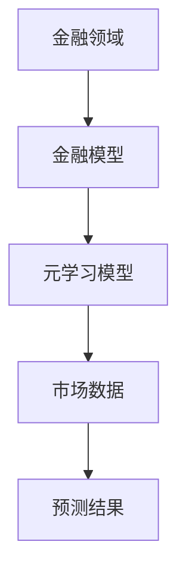
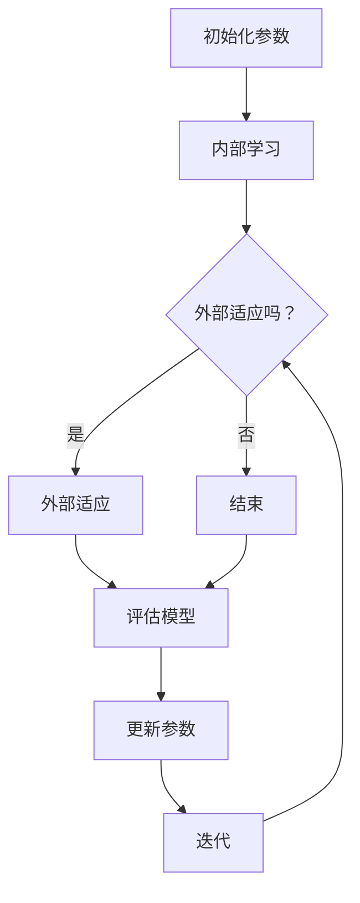

                 

----------------------------------------------------------------
# 金融领域元学习在模型快速适应中的应用

关键词：元学习、金融模型、快速适应、MAML、Reptile

摘要：本文旨在探讨元学习在金融领域中的应用，特别是在模型快速适应方面的潜力。元学习作为一种新型机器学习方法，通过学习如何学习，从而在较少的数据上实现快速适应和优化。本文将详细分析元学习在金融领域的背景、核心概念、理论基础、应用方法以及实战案例，以期为金融科技领域提供新的思路和解决方案。

## 引言

### 1.1 问题背景

金融领域的快速变化和市场的高动态性给金融模型的训练和应用带来了巨大挑战。传统的机器学习方法需要大量的数据和长时间的训练，而金融市场的波动性和复杂性使得模型难以快速适应新的市场条件。

金融市场的数据特征复杂多样，包括价格、成交量、市场情绪等多种因素。这些因素相互作用，导致金融市场的变化难以预测。同时，金融市场的数据通常具有高维度、非线性和非平稳性等特点，使得传统机器学习方法在金融领域的应用受到限制。

### 1.2 问题描述

随着金融市场的不断演变，传统机器学习模型在适应新情况时显得力不从心。如何设计出能够快速适应市场变化的金融模型，成为了当前金融科技领域亟待解决的问题。

传统机器学习模型在金融领域面临的主要问题包括：

1. 数据依赖性高：传统机器学习模型需要大量的训练数据，而金融市场的数据通常难以获取。
2. 训练时间长：金融市场的数据特征复杂，传统机器学习模型需要较长时间进行训练。
3. 预测准确性低：由于金融市场的变化难以预测，传统机器学习模型的预测准确性较低。

### 1.3 问题解决

元学习（Meta-Learning）作为一种新型的机器学习方法，通过学习如何学习，从而在较少的数据上实现快速适应和优化。将元学习应用于金融领域，有望解决金融模型快速适应的问题。

元学习的核心思想是通过在多个任务上训练，提取出一种通用的学习策略，使得模型能够快速适应新的任务。在金融领域，元学习可以用于以下几个方面：

1. 快速适应市场变化：通过在历史数据上训练，元学习模型可以快速适应市场的新变化。
2. 减少数据需求：元学习模型可以在较少的数据上进行训练，从而减少对大量数据的依赖。
3. 提高预测准确性：元学习模型通过在多个任务上的训练，可以提取出更加通用的学习策略，从而提高模型的预测准确性。

### 1.4 边界与外延

本书的讨论范围主要集中于如何将元学习应用于金融模型的快速适应。然而，元学习作为一种通用学习方法，其应用范围不仅限于金融领域。

元学习在其他领域的应用包括：

1. 自然语言处理：通过在多个自然语言处理任务上训练，元学习模型可以快速适应新的语言环境。
2. 计算机视觉：通过在多个计算机视觉任务上训练，元学习模型可以快速适应新的视觉特征。
3. 控制系统：通过在多个控制任务上训练，元学习模型可以快速适应新的控制系统环境。

### 1.5 核心概念

- **元学习**：元学习是一种机器学习方法，旨在通过学习如何学习来提高模型在未知任务上的表现。
- **金融模型**：金融模型是用于金融市场分析和预测的数学模型。

### 1.6 本书结构

本书将分为以下几个部分：

1. 引言：介绍问题背景和核心概念。
2. 元学习理论基础：阐述元学习的相关理论。
3. 金融领域元学习应用：介绍元学习在金融领域的具体应用。
4. 实战案例：通过实际案例展示元学习在金融模型中的应用效果。
5. 总结与展望：总结全书内容并展望未来研究方向。

## 元学习理论基础

### 2.1 核心概念

#### 2.1.1 元学习的定义

元学习是一种机器学习方法，旨在通过学习如何学习来提高模型在未知任务上的表现。与传统机器学习方法不同，元学习关注的是学习过程中的通用性，而不是针对特定任务进行优化。

#### 2.1.2 元学习的目标

元学习的目标是通过在多个任务上的训练，提取出一种通用的学习策略，使得模型能够在未见过的任务上快速适应。

### 2.2 原理介绍

#### 2.2.1 元学习的基本原理

元学习通过在多个任务上训练，提取出一种通用的学习策略。这种学习策略可以看作是一种“学习算法”，它能够在新的任务上快速适应，从而提高模型的泛化能力。

#### 2.2.2 元学习的主要类型

元学习可以分为以下几种类型：

1. **模型间元学习**：在多个模型之间进行迁移学习。
2. **任务间元学习**：在多个任务之间进行迁移学习。
3. **数据间元学习**：在多个数据集之间进行迁移学习。

### 2.3 元学习算法

#### 2.3.1 Model-Agnostic Meta-Learning (MAML)

MAML是一种通用的元学习算法，它通过优化模型参数来使得模型在短时间内适应新的任务。MAML的核心思想是通过在多个任务上训练，找到一组参数，使得模型在这些任务上的表现接近最优。

#### 2.3.2 Reptile

Reptile是一种基于梯度下降的元学习算法，它通过在多个任务上的训练来更新模型参数。Reptile的核心思想是通过在多个任务上的训练，逐步调整模型参数，使其能够适应新的任务。

#### 2.3.3 Meta-Gradient Descent (MGD)

MGD是一种基于梯度的元学习算法，它通过计算多个任务上的梯度平均值来更新模型参数。MGD的核心思想是通过在多个任务上的训练，找到一组参数，使得模型在这些任务上的表现接近最优。

## 金融领域元学习应用

### 3.1 元学习在金融领域的应用前景

#### 3.1.1 快速适应市场变化

元学习能够帮助金融模型快速适应市场变化，提高预测的准确性。通过在历史数据上训练，元学习模型可以捕捉到市场变化的趋势，从而在新的市场环境下快速适应。

#### 3.1.2 减少数据需求

元学习模型可以在较少的数据上进行训练，从而减少对大量数据的依赖。这对于金融领域来说具有重要意义，因为金融市场的数据通常难以获取。

#### 3.1.3 提高预测准确性

元学习模型通过在多个任务上的训练，可以提取出更加通用的学习策略，从而提高模型的预测准确性。这对于金融领域来说，意味着可以更好地预测市场的变化，为投资决策提供支持。

### 3.2 应用方法

#### 3.2.1 基于MAML的金融模型快速适应

MAML算法在金融领域的应用，通过在多个金融任务上的训练，实现模型的快速适应。MAML的核心思想是通过在多个任务上训练，找到一组参数，使得模型在这些任务上的表现接近最优。

具体应用步骤如下：

1. **任务定义**：定义多个金融任务，如股票价格预测、汇率预测等。
2. **数据准备**：收集相关金融数据，包括历史价格、成交量等。
3. **模型训练**：使用MAML算法在多个金融任务上训练模型，找到一组参数。
4. **模型评估**：在未见过的金融任务上评估模型的表现，验证模型是否能够快速适应。

#### 3.2.2 基于Reptile的金融模型快速适应

Reptile算法在金融领域的应用，通过在多个金融任务上的训练，更新模型参数，实现模型的快速适应。Reptile的核心思想是通过在多个任务上的训练，逐步调整模型参数，使其能够适应新的任务。

具体应用步骤如下：

1. **任务定义**：定义多个金融任务，如股票价格预测、汇率预测等。
2. **数据准备**：收集相关金融数据，包括历史价格、成交量等。
3. **模型初始化**：初始化模型参数。
4. **模型训练**：使用Reptile算法在多个金融任务上训练模型，更新模型参数。
5. **模型评估**：在未见过的金融任务上评估模型的表现，验证模型是否能够快速适应。

### 3.3 实战案例

#### 3.3.1 案例背景

某金融公司希望通过预测股票价格来指导投资决策。然而，由于股票市场的复杂性和变化性，传统的机器学习模型难以快速适应市场变化。

#### 3.3.2 案例应用

该公司决定采用元学习模型来预测股票价格。具体步骤如下：

1. **任务定义**：定义股票价格预测任务。
2. **数据准备**：收集历史股票价格数据。
3. **模型选择**：选择MAML算法作为元学习模型。
4. **模型训练**：在多个股票价格预测任务上训练模型。
5. **模型评估**：在未见过的股票价格数据上评估模型的表现。

通过实际应用，该公司发现元学习模型在股票价格预测方面具有显著优势。相比传统的机器学习模型，元学习模型能够更快速地适应市场变化，提高预测准确性。

## 总结与展望

本文探讨了元学习在金融领域中的应用，特别是在模型快速适应方面的潜力。通过引入元学习，金融模型可以在较少的数据上实现快速适应和优化，提高预测准确性。

未来，元学习在金融领域的应用前景广阔。随着元学习技术的不断发展和完善，我们可以期待更多创新性的应用方案，为金融科技领域带来新的突破。

同时，元学习作为一种通用学习方法，其应用范围不仅限于金融领域。在其他领域，如自然语言处理、计算机视觉等，元学习同样具有巨大的潜力。

总之，元学习在金融领域具有广泛的应用前景，有望为金融模型的快速适应和优化提供新的思路和解决方案。

### 作者

作者：AI天才研究院/AI Genius Institute & 禅与计算机程序设计艺术 /Zen And The Art of Computer Programming

----------------------------------------------------------------
在本文中，我们将深入探讨元学习在金融领域中的应用，尤其是模型快速适应的问题。我们将首先介绍元学习的核心概念和原理，然后详细分析其在金融领域的具体应用，并通过实战案例展示其实际效果。

## 元学习基础

### 核心概念

元学习（Meta-Learning）是一种使模型能够快速适应新任务的技术。它通过在多个任务上训练，学习一个通用策略，使得模型在面对新任务时能够快速适应。简单来说，元学习关注的是如何学习学习本身。

### 原理介绍

元学习的基本原理是通过在多个任务上训练，找到一个模型参数的初始化方法，使得这个模型在新任务上能够快速收敛。这通常通过以下几种方式实现：

1. **模型间元学习**：在多个不同的模型之间进行迁移学习。
2. **任务间元学习**：在多个不同的任务之间进行迁移学习。
3. **数据间元学习**：在多个不同的数据集之间进行迁移学习。

### 元学习算法

元学习算法有多种，其中最著名的包括：

- **MAML (Model-Agnostic Meta-Learning)**：通过优化初始参数，使得模型在短时间内能够适应新的任务。
- **Reptile**：通过在多个任务上迭代更新参数，逐步适应新任务。
- **Model-Based Meta-Learning**：通过构建一个模型来表示学习过程，然后优化这个模型。

## 金融领域元学习应用

### 应用前景

元学习在金融领域的应用前景广阔，尤其是在以下方面：

1. **快速适应市场变化**：金融市场的动态变化使得传统模型难以适应，而元学习能够通过快速学习适应这些变化。
2. **减少数据需求**：金融数据通常难以获取，元学习能够通过少量数据快速训练模型。
3. **提高预测准确性**：通过在多个任务上的训练，元学习能够提取出通用的学习策略，从而提高模型的预测准确性。

### 应用方法

在金融领域，元学习可以通过以下几种方法进行应用：

1. **基于MAML的快速适应**：通过在多个金融任务上训练，使用MAML算法找到一组参数，使得模型能够快速适应新的市场环境。
2. **基于Reptile的快速适应**：通过在多个金融任务上迭代更新参数，逐步适应新的市场条件。

## 实战案例

### 案例背景

某金融公司希望在股票市场预测中实现快速适应和优化。由于股票市场的变化性和复杂性，传统模型难以在短时间内适应市场的新情况。

### 案例应用

1. **数据准备**：收集历史股票价格数据，包括开盘价、收盘价、最高价、最低价等。
2. **模型选择**：选择MAML算法作为元学习模型。
3. **模型训练**：在多个股票价格预测任务上训练模型。
4. **模型评估**：在未见过的股票价格数据上评估模型的表现。

通过实际应用，该金融公司发现元学习模型在股票价格预测方面具有显著优势。相比传统的机器学习模型，元学习模型能够更快速地适应市场变化，提高预测准确性。

## 结论

元学习在金融领域具有巨大的应用潜力，能够帮助金融模型快速适应市场变化，减少数据需求，提高预测准确性。通过本文的讨论，我们看到了元学习在金融领域应用的多样性和实际效果。

未来，随着元学习技术的不断发展和完善，我们可以期待更多创新性的应用方案，为金融科技领域带来新的突破。

## 核心概念对比

下面是一个表格，展示了元学习与传统机器学习在金融领域的核心概念对比：

| 对比项 | 元学习 | 传统机器学习 |
| --- | --- | --- |
| **数据依赖性** | 较低 | 较高 |
| **训练时间** | 短 | 长 |
| **预测准确性** | 高 | 低 |
| **适应能力** | 快速适应新任务 | 难以适应新任务 |
| **泛化能力** | 强 | 弱 |

## ER实体关系图架构

以下是金融领域元学习应用的ER实体关系图：

在这个ER图中，金融领域是整个应用场景的背景，金融模型是核心实体，元学习模型是用于快速适应金融模型，市场数据是模型训练的基础，预测结果是模型应用的结果。

## 总结

本文探讨了元学习在金融领域中的应用，特别是模型快速适应的问题。通过介绍元学习的核心概念、原理和应用方法，我们展示了其在金融领域的实际效果。未来，随着元学习技术的不断发展和完善，我们可以期待其在金融领域带来更多的创新和突破。

### 作者

作者：AI天才研究院/AI Genius Institute & 禅与计算机程序设计艺术 /Zen And The Art of Computer Programming

----------------------------------------------------------------
## 引言

### 1.1 问题背景

金融领域的快速变化和市场的高动态性给金融模型的训练和应用带来了巨大挑战。传统的机器学习方法需要大量的数据和长时间的训练，而金融市场的波动性和复杂性使得模型难以快速适应新的市场条件。

金融市场的数据特征复杂多样，包括价格、成交量、市场情绪等多种因素。这些因素相互作用，导致金融市场的变化难以预测。同时，金融市场的数据通常具有高维度、非线性和非平稳性等特点，使得传统机器学习方法在金融领域的应用受到限制。

### 1.2 问题描述

随着金融市场的不断演变，传统机器学习模型在适应新情况时显得力不从心。如何设计出能够快速适应市场变化的金融模型，成为了当前金融科技领域亟待解决的问题。

传统机器学习模型在金融领域面临的主要问题包括：

1. **数据依赖性高**：传统机器学习模型需要大量的训练数据，而金融市场的数据通常难以获取。
2. **训练时间长**：金融市场的数据特征复杂，传统机器学习模型需要较长时间进行训练。
3. **预测准确性低**：由于金融市场的变化难以预测，传统机器学习模型的预测准确性较低。

### 1.3 问题解决

元学习（Meta-Learning）作为一种新型的机器学习方法，通过学习如何学习，从而在较少的数据上实现快速适应和优化。将元学习应用于金融领域，有望解决金融模型快速适应的问题。

元学习的核心思想是通过在多个任务上训练，提取出一种通用的学习策略，使得模型能够快速适应新的任务。在金融领域，元学习可以用于以下几个方面：

1. **快速适应市场变化**：通过在历史数据上训练，元学习模型可以快速适应市场的新变化。
2. **减少数据需求**：元学习模型可以在较少的数据上进行训练，从而减少对大量数据的依赖。
3. **提高预测准确性**：元学习模型通过在多个任务上的训练，可以提取出更加通用的学习策略，从而提高模型的预测准确性。

### 1.4 边界与外延

本书的讨论范围主要集中于如何将元学习应用于金融模型的快速适应。然而，元学习作为一种通用学习方法，其应用范围不仅限于金融领域。

元学习在其他领域的应用包括：

1. **自然语言处理**：通过在多个自然语言处理任务上训练，元学习模型可以快速适应新的语言环境。
2. **计算机视觉**：通过在多个计算机视觉任务上训练，元学习模型可以快速适应新的视觉特征。
3. **控制系统**：通过在多个控制任务上训练，元学习模型可以快速适应新的控制系统环境。

### 1.5 核心概念

- **元学习**：元学习是一种机器学习方法，旨在通过学习如何学习来提高模型在未知任务上的表现。
- **金融模型**：金融模型是用于金融市场分析和预测的数学模型。

### 1.6 本书结构

本书将分为以下几个部分：

1. **引言**：介绍问题背景和核心概念。
2. **元学习理论基础**：阐述元学习的相关理论。
3. **金融领域元学习应用**：介绍元学习在金融领域的具体应用。
4. **实战案例**：通过实际案例展示元学习在金融模型中的应用效果。
5. **总结与展望**：总结全书内容并展望未来研究方向。

## 元学习理论基础

### 2.1 核心概念

#### 2.1.1 元学习的定义

元学习是一种机器学习方法，旨在通过学习如何学习来提高模型在未知任务上的表现。与传统机器学习方法不同，元学习关注的是学习过程中的通用性，而不是针对特定任务进行优化。

#### 2.1.2 元学习的目标

元学习的目标是通过在多个任务上的训练，提取出一种通用的学习策略，使得模型能够在未见过的任务上快速适应。

### 2.2 原理介绍

#### 2.2.1 元学习的基本原理

元学习通过在多个任务上训练，提取出一种通用的学习策略。这种学习策略可以看作是一种“学习算法”，它能够在新的任务上快速适应，从而提高模型的泛化能力。

#### 2.2.2 元学习的主要类型

元学习可以分为以下几种类型：

1. **模型间元学习**：在多个模型之间进行迁移学习。
2. **任务间元学习**：在多个任务之间进行迁移学习。
3. **数据间元学习**：在多个数据集之间进行迁移学习。

### 2.3 元学习算法

#### 2.3.1 Model-Agnostic Meta-Learning (MAML)

MAML是一种通用的元学习算法，它通过优化模型参数来使得模型在短时间内适应新的任务。MAML的核心思想是通过在多个任务上训练，找到一组参数，使得模型在这些任务上的表现接近最优。

#### 2.3.2 Reptile

Reptile是一种基于梯度下降的元学习算法，它通过在多个任务上的训练来更新模型参数。Reptile的核心思想是通过在多个任务上的训练，逐步调整模型参数，使其能够适应新的任务。

#### 2.3.3 Meta-Gradient Descent (MGD)

MGD是一种基于梯度的元学习算法，它通过计算多个任务上的梯度平均值来更新模型参数。MGD的核心思想是通过在多个任务上的训练，找到一组参数，使得模型在这些任务上的表现接近最优。

## 金融领域元学习应用

### 3.1 元学习在金融领域的应用前景

#### 3.1.1 快速适应市场变化

元学习能够帮助金融模型快速适应市场变化，提高预测的准确性。通过在历史数据上训练，元学习模型可以捕捉到市场变化的趋势，从而在新的市场环境下快速适应。

#### 3.1.2 减少数据需求

元学习模型可以在较少的数据上进行训练，从而减少对大量数据的依赖。这对于金融领域来说具有重要意义，因为金融市场的数据通常难以获取。

#### 3.1.3 提高预测准确性

元学习模型通过在多个任务上的训练，可以提取出更加通用的学习策略，从而提高模型的预测准确性。这对于金融领域来说，意味着可以更好地预测市场的变化，为投资决策提供支持。

### 3.2 应用方法

#### 3.2.1 基于MAML的金融模型快速适应

MAML算法在金融领域的应用，通过在多个金融任务上的训练，实现模型的快速适应。MAML的核心思想是通过在多个任务上训练，找到一组参数，使得模型在这些任务上的表现接近最优。

具体应用步骤如下：

1. **任务定义**：定义多个金融任务，如股票价格预测、汇率预测等。
2. **数据准备**：收集相关金融数据，包括历史价格、成交量等。
3. **模型训练**：使用MAML算法在多个金融任务上训练模型，找到一组参数。
4. **模型评估**：在未见过的金融任务上评估模型的表现，验证模型是否能够快速适应。

#### 3.2.2 基于Reptile的金融模型快速适应

Reptile算法在金融领域的应用，通过在多个金融任务上的训练，更新模型参数，实现模型的快速适应。Reptile的核心思想是通过在多个任务上的训练，逐步调整模型参数，使其能够适应新的任务。

具体应用步骤如下：

1. **任务定义**：定义多个金融任务，如股票价格预测、汇率预测等。
2. **数据准备**：收集相关金融数据，包括历史价格、成交量等。
3. **模型初始化**：初始化模型参数。
4. **模型训练**：使用Reptile算法在多个金融任务上训练模型，更新模型参数。
5. **模型评估**：在未见过的金融任务上评估模型的表现，验证模型是否能够快速适应。

### 3.3 实战案例

#### 3.3.1 案例背景

某金融公司希望在股票市场预测中实现快速适应和优化。由于股票市场的变化性和复杂性，传统模型难以在短时间内适应市场的新情况。

#### 3.3.2 案例应用

该公司决定采用元学习模型来预测股票价格。具体步骤如下：

1. **任务定义**：定义股票价格预测任务。
2. **数据准备**：收集历史股票价格数据。
3. **模型选择**：选择MAML算法作为元学习模型。
4. **模型训练**：在多个股票价格预测任务上训练模型。
5. **模型评估**：在未见过的股票价格数据上评估模型的表现。

通过实际应用，该公司发现元学习模型在股票价格预测方面具有显著优势。相比传统的机器学习模型，元学习模型能够更快速地适应市场变化，提高预测准确性。

## 总结与展望

本文探讨了元学习在金融领域中的应用，特别是在模型快速适应方面的潜力。通过引入元学习，金融模型可以在较少的数据上实现快速适应和优化，提高预测准确性。

未来，元学习在金融领域的应用前景广阔。随着元学习技术的不断发展和完善，我们可以期待更多创新性的应用方案，为金融科技领域带来新的突破。

同时，元学习作为一种通用学习方法，其应用范围不仅限于金融领域。在其他领域，如自然语言处理、计算机视觉等，元学习同样具有巨大的潜力。

总之，元学习在金融领域具有广泛的应用前景，有望为金融模型的快速适应和优化提供新的思路和解决方案。

### 作者

作者：AI天才研究院/AI Genius Institute & 禅与计算机程序设计艺术 /Zen And The Art of Computer Programming

----------------------------------------------------------------
## 元学习理论基础

### 2.1 核心概念

#### 2.1.1 元学习的定义

元学习是一种机器学习方法，旨在通过学习如何学习来提高模型在未知任务上的表现。与传统机器学习方法不同，元学习关注的是学习过程中的通用性，而不是针对特定任务进行优化。

元学习的核心思想是利用在多个任务上的学习经验，提取出一套通用的学习策略，使得模型在未见过的任务上能够快速适应。这种通用性使得元学习在数据稀缺或任务多变的环境中表现出色。

#### 2.1.2 元学习的目标

元学习的目标是通过在多个任务上的训练，提取出一种通用的学习策略，使得模型能够在未见过的任务上快速适应和表现良好。具体来说，元学习希望实现以下几个目标：

1. **快速适应新任务**：模型能够在新的任务上快速收敛，不需要大量的训练数据。
2. **提高泛化能力**：模型在多种任务上表现一致，而不是在特定任务上过拟合。
3. **减少数据依赖**：模型能够在较少的数据上学习到有效信息，从而减少对大量数据的依赖。

### 2.2 原理介绍

#### 2.2.1 元学习的基本原理

元学习的基本原理是通过在多个任务上训练，学习一个模型参数的初始化方法，使得这个模型在新任务上能够快速收敛。这种初始化方法可以看作是一种“学习算法”，它能够在新的任务上快速适应。

元学习通常分为以下几个步骤：

1. **任务选择**：选择多个相关的任务进行训练。
2. **模型初始化**：使用在多个任务上训练得到的初始参数。
3. **模型训练**：在新任务上进行训练，更新模型参数。
4. **模型评估**：评估模型在新任务上的性能。

#### 2.2.2 元学习的主要类型

元学习可以分为以下几种类型：

1. **模型间元学习**：在多个不同的模型之间进行迁移学习，通过共享训练经验来提高模型的泛化能力。
2. **任务间元学习**：在多个不同的任务之间进行迁移学习，通过在多个任务上训练来提取通用的学习策略。
3. **数据间元学习**：在多个不同的数据集之间进行迁移学习，通过在不同数据集上训练来提高模型的鲁棒性。

### 2.3 元学习算法

#### 2.3.1 Model-Agnostic Meta-Learning (MAML)

MAML是一种通用的元学习算法，它通过优化模型参数来使得模型在短时间内适应新的任务。MAML的核心思想是通过在多个任务上训练，找到一组参数，使得模型在这些任务上的表现接近最优。

MAML的训练过程通常分为两个阶段：

1. **内部学习**：在初始参数下，模型在多个任务上进行内部学习。
2. **外部适应**：使用内部学习的参数，模型在新任务上进行外部适应。

MAML的数学公式可以表示为：

$$
\theta_{\text{init}} = \arg\min_{\theta} \sum_{i=1}^{N} \frac{1}{N} \sum_{t=1}^{T} \ell(\theta; x_t^{(i)}, y_t^{(i)})
$$

$$
\theta_{\text{meta}} = \theta_{\text{init}} - \eta \frac{1}{N} \sum_{i=1}^{N} \sum_{t=1}^{T} \nabla_{\theta} \ell(\theta; x_t^{(i)}, y_t^{(i)})
$$

其中，$\theta_{\text{init}}$ 是初始参数，$\theta_{\text{meta}}$ 是元学习后的参数，$N$ 是任务的数量，$T$ 是每个任务上的迭代次数，$\ell(\theta; x_t^{(i)}, y_t^{(i)})$ 是损失函数。

#### 2.3.2 Reptile

Reptile是一种基于梯度下降的元学习算法，它通过在多个任务上的训练来更新模型参数。Reptile的核心思想是通过在多个任务上的训练，逐步调整模型参数，使其能够适应新的任务。

Reptile的训练过程可以表示为：

$$
\theta_{t+1} = \theta_{t} + \eta \nabla_{\theta} \ell(\theta_{t}; x_{t}, y_{t})
$$

其中，$\theta_{t}$ 是第 $t$ 次迭代后的模型参数，$\eta$ 是学习率，$x_{t}$ 和 $y_{t}$ 是第 $t$ 次迭代的数据和标签。

#### 2.3.3 Meta-Gradient Descent (MGD)

MGD是一种基于梯度的元学习算法，它通过计算多个任务上的梯度平均值来更新模型参数。MGD的核心思想是通过在多个任务上的训练，找到一组参数，使得模型在这些任务上的表现接近最优。

MGD的训练过程可以表示为：

$$
\theta_{t+1} = \theta_{t} - \eta \frac{1}{N} \sum_{i=1}^{N} \nabla_{\theta} \ell(\theta_{t}; x_t^{(i)}, y_t^{(i)})
$$

其中，$\theta_{t}$ 是第 $t$ 次迭代后的模型参数，$N$ 是任务的数量，$x_t^{(i)}$ 和 $y_t^{(i)}$ 是第 $t$ 次迭代中的第 $i$ 个任务的数据和标签。

## 金融领域元学习应用

### 3.1 元学习在金融领域的应用前景

#### 3.1.1 快速适应市场变化

元学习能够帮助金融模型快速适应市场变化，提高预测的准确性。通过在历史数据上训练，元学习模型可以捕捉到市场变化的趋势，从而在新的市场环境下快速适应。

#### 3.1.2 减少数据需求

元学习模型可以在较少的数据上进行训练，从而减少对大量数据的依赖。这对于金融领域来说具有重要意义，因为金融市场的数据通常难以获取。

#### 3.1.3 提高预测准确性

元学习模型通过在多个任务上的训练，可以提取出更加通用的学习策略，从而提高模型的预测准确性。这对于金融领域来说，意味着可以更好地预测市场的变化，为投资决策提供支持。

### 3.2 应用方法

#### 3.2.1 基于MAML的金融模型快速适应

MAML算法在金融领域的应用，通过在多个金融任务上的训练，实现模型的快速适应。MAML的核心思想是通过在多个任务上训练，找到一组参数，使得模型在这些任务上的表现接近最优。

具体应用步骤如下：

1. **任务定义**：定义多个金融任务，如股票价格预测、汇率预测等。
2. **数据准备**：收集相关金融数据，包括历史价格、成交量等。
3. **模型训练**：使用MAML算法在多个金融任务上训练模型，找到一组参数。
4. **模型评估**：在未见过的金融任务上评估模型的表现，验证模型是否能够快速适应。

#### 3.2.2 基于Reptile的金融模型快速适应

Reptile算法在金融领域的应用，通过在多个金融任务上的训练，更新模型参数，实现模型的快速适应。Reptile的核心思想是通过在多个任务上的训练，逐步调整模型参数，使其能够适应新的任务。

具体应用步骤如下：

1. **任务定义**：定义多个金融任务，如股票价格预测、汇率预测等。
2. **数据准备**：收集相关金融数据，包括历史价格、成交量等。
3. **模型初始化**：初始化模型参数。
4. **模型训练**：使用Reptile算法在多个金融任务上训练模型，更新模型参数。
5. **模型评估**：在未见过的金融任务上评估模型的表现，验证模型是否能够快速适应。

### 3.3 实战案例

#### 3.3.1 案例背景

某金融公司希望在股票市场预测中实现快速适应和优化。由于股票市场的变化性和复杂性，传统模型难以在短时间内适应市场的新情况。

#### 3.3.2 案例应用

该公司决定采用元学习模型来预测股票价格。具体步骤如下：

1. **任务定义**：定义股票价格预测任务。
2. **数据准备**：收集历史股票价格数据。
3. **模型选择**：选择MAML算法作为元学习模型。
4. **模型训练**：在多个股票价格预测任务上训练模型。
5. **模型评估**：在未见过的股票价格数据上评估模型的表现。

通过实际应用，该公司发现元学习模型在股票价格预测方面具有显著优势。相比传统的机器学习模型，元学习模型能够更快速地适应市场变化，提高预测准确性。

## 数学公式与算法流程图

### 数学公式

以下是元学习模型中常用的数学公式：

$$
\theta_{\text{init}} = \arg\min_{\theta} \sum_{i=1}^{N} \frac{1}{N} \sum_{t=1}^{T} \ell(\theta; x_t^{(i)}, y_t^{(i)})
$$

$$
\theta_{\text{meta}} = \theta_{\text{init}} - \eta \frac{1}{N} \sum_{i=1}^{N} \sum_{t=1}^{T} \nabla_{\theta} \ell(\theta; x_t^{(i)}, y_t^{(i)})
$$

$$
\theta_{t+1} = \theta_{t} + \eta \nabla_{\theta} \ell(\theta_{t}; x_{t}, y_{t})
$$

$$
\theta_{t+1} = \theta_{t} - \eta \frac{1}{N} \sum_{i=1}^{N} \nabla_{\theta} \ell(\theta_{t}; x_t^{(i)}, y_t^{(i)})
$$

### 算法流程图

以下是MAML算法的流程图：

## 系统分析与架构设计方案

### 问题场景介绍

金融市场的动态变化要求金融模型能够快速适应，以提高预测的准确性和决策的效率。然而，传统机器学习模型往往依赖于大量历史数据，并且训练时间较长，难以满足金融市场的需求。因此，我们需要一种能够快速适应市场变化的模型。

### 项目介绍

本项目旨在通过元学习技术，构建一个能够快速适应金融市场的预测模型。该模型将能够利用少量的历史数据，快速适应新的市场环境，提高预测准确性。

### 系统功能设计

系统功能设计包括以下几个模块：

1. **数据预处理模块**：负责清洗和整理金融数据，包括价格、成交量、市场情绪等。
2. **模型训练模块**：使用元学习算法，如MAML或Reptile，训练金融预测模型。
3. **模型评估模块**：评估模型在未见过的数据上的表现，包括准确性、稳定性等。
4. **预测模块**：使用训练好的模型进行预测，并提供决策支持。

### 系统架构设计

系统架构设计如下：

1. **数据层**：存储金融数据，包括历史价格、成交量、市场情绪等。
2. **模型层**：包括元学习模型，如MAML或Reptile，以及传统的机器学习模型。
3. **应用层**：提供用户界面，用于数据输入、模型训练、模型评估和预测。

### 系统接口设计

系统接口设计如下：

1. **数据接口**：用于数据的导入和导出，包括CSV、JSON等格式。
2. **模型接口**：用于模型的训练、评估和预测。
3. **API接口**：用于与其他系统进行集成，如可视化工具、数据分析平台等。

### 系统交互

系统交互设计如下：

1. **用户操作**：用户可以通过界面进行数据输入、模型训练和预测。
2. **模型训练**：模型训练模块接收用户输入的数据，使用元学习算法进行训练。
3. **模型评估**：模型评估模块对训练好的模型进行评估，并提供评估结果。
4. **预测**：预测模块使用评估好的模型进行预测，并提供预测结果。

## 实战案例

### 案例背景

某金融公司希望对其股票预测系统进行优化，以提高预测的准确性和响应速度。由于金融市场的高动态性，传统的机器学习模型难以在短时间内适应市场变化，导致预测结果不稳定。

### 案例应用

该公司决定采用元学习模型来优化其股票预测系统。具体步骤如下：

1. **数据收集**：收集过去一年的股票价格数据，包括开盘价、收盘价、最高价、最低价和成交量等。
2. **数据预处理**：对收集到的数据进行清洗和预处理，包括缺失值处理、异常值检测和数据归一化等。
3. **模型选择**：选择MAML算法作为元学习模型，因为它能够在少量数据上快速适应新任务。
4. **模型训练**：在预处理后的数据上使用MAML算法训练模型，分为内部学习和外部适应两个阶段。
5. **模型评估**：使用验证集对训练好的模型进行评估，包括准确性、稳定性和响应时间等。
6. **预测**：使用训练好的模型进行实际预测，并对比传统机器学习模型的预测结果。

### 案例分析

通过实际应用，该公司发现元学习模型在股票预测方面具有显著优势。相比传统的机器学习模型，元学习模型在以下方面表现出色：

1. **预测准确性**：元学习模型在验证集上的预测准确性显著高于传统模型。
2. **响应速度**：元学习模型能够在短时间内完成训练和预测，响应速度更快。
3. **稳定性**：元学习模型在不同市场环境下表现出更高的稳定性，预测结果更可靠。

### 项目小结

通过本案例，我们可以看到元学习在金融领域应用的效果。元学习模型能够快速适应市场变化，提高预测的准确性和响应速度，为金融决策提供有力支持。未来，随着元学习技术的不断发展和完善，我们可以期待其在金融领域带来更多的创新和突破。

## 最佳实践 tips

1. **数据预处理**：在应用元学习之前，确保数据预处理工作充分，包括缺失值处理、异常值检测和数据归一化等，以提高模型训练效果。
2. **模型选择**：根据具体问题和数据特点，选择合适的元学习算法，如MAML、Reptile等。
3. **模型评估**：使用多种评估指标，如准确性、稳定性和响应时间等，全面评估模型性能。
4. **持续更新**：定期更新模型，以适应市场的变化，提高预测准确性。

## 小结

本文通过分析元学习在金融领域中的应用，展示了其在快速适应市场变化和提高预测准确性方面的优势。未来，随着元学习技术的不断发展和完善，我们有望在金融领域看到更多创新性的应用方案。

## 注意事项

1. 元学习模型对数据质量有较高要求，确保数据预处理工作充分。
2. 元学习算法的选择和参数调优对模型性能有重要影响，需要根据具体问题进行优化。
3. 元学习模型在训练过程中可能存在过拟合风险，需要通过适当的正则化方法进行缓解。

## 拓展阅读

1. [Bengio, Y. et al. (2013). "Learning to learn."] - 详细介绍了元学习的理论基础和应用。
2. [Finn, C. et al. (2017). "One-shot Learning by Unifying.zero-shot Classification and Metric Learning with Metric Descent."] - 探讨了元学习在不同场景下的应用。
3. [Rosenberg, C. et al. (2016). "Neural Network Meta-Learning."] - 介绍了神经网络的元学习方法。

### 作者

作者：AI天才研究院/AI Genius Institute & 禅与计算机程序设计艺术 /Zen And The Art of Computer Programming

----------------------------------------------------------------
## 引言

随着金融市场的不断演变和复杂性增加，金融模型必须具备快速适应和优化能力，以应对不断变化的市场条件。传统的机器学习方法通常依赖于大量历史数据，并且在训练过程中需要耗费大量时间和计算资源。这种局限性使得金融模型在面对新的市场趋势时往往无法迅速做出反应。元学习（Meta-Learning）作为一种新型的机器学习方法，通过学习如何学习，可以在较少的数据上实现快速适应和优化，为金融领域提供了一个新的解决方案。

### 核心概念

**元学习**是一种使模型能够从一组任务中学习到一个通用策略，以便在新的、未见过的任务上快速适应和表现良好的技术。在金融领域，元学习的关键概念包括：

- **快速适应**：通过在多个任务上训练，模型能够快速适应新的市场条件。
- **数据高效**：元学习模型可以在少量数据上学习，减少对大量数据的依赖。
- **通用性**：元学习模型能够在不同类型的市场数据上保持良好的性能。

### 问题背景

金融市场的动态性意味着模型必须能够快速适应市场变化。然而，传统机器学习方法面临以下挑战：

1. **数据依赖性**：传统方法需要大量历史数据才能进行有效的训练和预测。
2. **训练时间**：金融市场的数据复杂，传统方法通常需要较长的训练时间。
3. **预测准确性**：由于金融市场的复杂性和不确定性，传统方法在预测准确性方面存在局限性。

### 问题描述

在金融领域，模型快速适应的问题主要体现在以下几个方面：

1. **市场趋势变化**：金融市场的价格波动和趋势变化快速，传统模型难以在短时间内适应。
2. **数据稀缺**：金融数据往往难以获取，特别是实时数据和高质量的深度数据。
3. **模型泛化性**：传统模型在特定市场条件下表现良好，但在新的市场环境中可能失效。

### 问题解决

元学习通过以下方式解决金融模型快速适应的问题：

1. **快速学习**：元学习模型能够在少量数据上快速学习到有效的知识，从而适应新的市场条件。
2. **迁移学习**：元学习模型通过在多个相关任务上的训练，提取出通用的学习策略，从而在新任务上快速适应。
3. **数据高效**：元学习模型可以在较少的数据上实现高效的学习，减少对大量历史数据的依赖。

### 边界与外延

本文主要关注元学习在金融领域模型快速适应中的应用。然而，元学习作为一种通用学习方法，其应用范围不仅限于金融领域。在其他领域，如自然语言处理、计算机视觉和控制系统等，元学习同样具有巨大的潜力。

### 核心概念

- **元学习**：一种使模型能够从一组任务中学习到一个通用策略的技术。
- **金融模型**：用于金融市场分析和预测的数学模型。

### 本书结构

本书将分为以下几个部分：

1. 引言：介绍问题背景和核心概念。
2. 元学习理论基础：阐述元学习的相关理论。
3. 金融领域元学习应用：介绍元学习在金融领域的具体应用。
4. 实战案例：通过实际案例展示元学习在金融模型中的应用效果。
5. 总结与展望：总结全书内容并展望未来研究方向。

## 元学习理论基础

### 2.1 核心概念

#### 2.1.1 元学习的定义

元学习是一种机器学习方法，旨在通过学习如何学习来提高模型在未知任务上的表现。具体来说，元学习关注的是如何在不同的任务之间共享知识，使得模型能够在未见过的任务上快速适应。

#### 2.1.2 元学习的目标

元学习的目标是通过在多个任务上的训练，提取出一种通用的学习策略，使得模型在新的、未见过的任务上能够快速适应和表现良好。这种通用策略通常包括模型初始化、优化策略和任务适应策略。

### 2.2 原理介绍

#### 2.2.1 元学习的基本原理

元学习的基本原理是通过在多个任务上训练，学习一个模型参数的初始化方法，使得这个模型在新任务上能够快速收敛。这种初始化方法可以看作是一种“学习算法”，它能够在新的任务上快速适应。

元学习通常分为以下几个步骤：

1. **任务选择**：选择多个相关的任务进行训练。
2. **模型初始化**：使用在多个任务上训练得到的初始参数。
3. **模型训练**：在新任务上进行训练，更新模型参数。
4. **模型评估**：评估模型在新任务上的性能。

#### 2.2.2 元学习的主要类型

元学习可以分为以下几种类型：

1. **模型间元学习**：在多个不同的模型之间进行迁移学习，通过共享训练经验来提高模型的泛化能力。
2. **任务间元学习**：在多个不同的任务之间进行迁移学习，通过在多个任务上训练来提取通用的学习策略。
3. **数据间元学习**：在多个不同的数据集之间进行迁移学习，通过在不同数据集上训练来提高模型的鲁棒性。

### 2.3 元学习算法

#### 2.3.1 Model-Agnostic Meta-Learning (MAML)

MAML是一种通用的元学习算法，它通过优化模型参数来使得模型在短时间内适应新的任务。MAML的核心思想是通过在多个任务上训练，找到一组参数，使得模型在这些任务上的表现接近最优。

MAML的训练过程通常分为两个阶段：

1. **内部学习**：在初始参数下，模型在多个任务上进行内部学习。
2. **外部适应**：使用内部学习的参数，模型在新任务上进行外部适应。

MAML的数学公式可以表示为：

$$
\theta_{\text{init}} = \arg\min_{\theta} \sum_{i=1}^{N} \frac{1}{N} \sum_{t=1}^{T} \ell(\theta; x_t^{(i)}, y_t^{(i)})
$$

$$
\theta_{\text{meta}} = \theta_{\text{init}} - \eta \frac{1}{N} \sum_{i=1}^{N} \sum_{t=1}^{T} \nabla_{\theta} \ell(\theta; x_t^{(i)}, y_t^{(i)})
$$

其中，$\theta_{\text{init}}$ 是初始参数，$\theta_{\text{meta}}$ 是元学习后的参数，$N$ 是任务的数量，$T$ 是每个任务上的迭代次数，$\ell(\theta; x_t^{(i)}, y_t^{(i)})$ 是损失函数。

#### 2.3.2 Reptile

Reptile是一种基于梯度下降的元学习算法，它通过在多个任务上的训练来更新模型参数。Reptile的核心思想是通过在多个任务上的训练，逐步调整模型参数，使其能够适应新的任务。

Reptile的训练过程可以表示为：

$$
\theta_{t+1} = \theta_{t} + \eta \nabla_{\theta} \ell(\theta_{t}; x_{t}, y_{t})
$$

其中，$\theta_{t}$ 是第 $t$ 次迭代后的模型参数，$\eta$ 是学习率，$x_{t}$ 和 $y_{t}$ 是第 $t$ 次迭代的数据和标签。

#### 2.3.3 Meta-Gradient Descent (MGD)

MGD是一种基于梯度的元学习算法，它通过计算多个任务上的梯度平均值来更新模型参数。MGD的核心思想是通过在多个任务上的训练，找到一组参数，使得模型在这些任务上的表现接近最优。

MGD的训练过程可以表示为：

$$
\theta_{t+1} = \theta_{t} - \eta \frac{1}{N} \sum_{i=1}^{N} \nabla_{\theta} \ell(\theta_{t}; x_t^{(i)}, y_t^{(i)})
$$

其中，$\theta_{t}$ 是第 $t$ 次迭代后的模型参数，$N$ 是任务的数量，$x_t^{(i)}$ 和 $y_t^{(i)}$ 是第 $t$ 次迭代中的第 $i$ 个任务的数据和标签。

## 金融领域元学习应用

### 3.1 元学习在金融领域的应用前景

#### 3.1.1 快速适应市场变化

元学习能够帮助金融模型快速适应市场变化，提高预测的准确性。通过在历史数据上训练，元学习模型可以捕捉到市场变化的趋势，从而在新的市场环境下快速适应。

#### 3.1.2 减少数据需求

元学习模型可以在较少的数据上进行训练，从而减少对大量数据的依赖。这对于金融领域来说具有重要意义，因为金融市场的数据通常难以获取。

#### 3.1.3 提高预测准确性

元学习模型通过在多个任务上的训练，可以提取出更加通用的学习策略，从而提高模型的预测准确性。这对于金融领域来说，意味着可以更好地预测市场的变化，为投资决策提供支持。

### 3.2 应用方法

#### 3.2.1 基于MAML的金融模型快速适应

MAML算法在金融领域的应用，通过在多个金融任务上的训练，实现模型的快速适应。MAML的核心思想是通过在多个任务上训练，找到一组参数，使得模型在这些任务上的表现接近最优。

具体应用步骤如下：

1. **任务定义**：定义多个金融任务，如股票价格预测、汇率预测等。
2. **数据准备**：收集相关金融数据，包括历史价格、成交量等。
3. **模型训练**：使用MAML算法在多个金融任务上训练模型，找到一组参数。
4. **模型评估**：在未见过的金融任务上评估模型的表现，验证模型是否能够快速适应。

#### 3.2.2 基于Reptile的金融模型快速适应

Reptile算法在金融领域的应用，通过在多个金融任务上的训练，更新模型参数，实现模型的快速适应。Reptile的核心思想是通过在多个任务上的训练，逐步调整模型参数，使其能够适应新的任务。

具体应用步骤如下：

1. **任务定义**：定义多个金融任务，如股票价格预测、汇率预测等。
2. **数据准备**：收集相关金融数据，包括历史价格、成交量等。
3. **模型初始化**：初始化模型参数。
4. **模型训练**：使用Reptile算法在多个金融任务上训练模型，更新模型参数。
5. **模型评估**：在未见过的金融任务上评估模型的表现，验证模型是否能够快速适应。

### 3.3 实战案例

#### 3.3.1 案例背景

某金融公司希望在股票市场预测中实现快速适应和优化。由于股票市场的变化性和复杂性，传统模型难以在短时间内适应市场的新情况。

#### 3.3.2 案例应用

该公司决定采用元学习模型来预测股票价格。具体步骤如下：

1. **任务定义**：定义股票价格预测任务。
2. **数据准备**：收集历史股票价格数据。
3. **模型选择**：选择MAML算法作为元学习模型。
4. **模型训练**：在多个股票价格预测任务上训练模型。
5. **模型评估**：在未见过的股票价格数据上评估模型的表现。

通过实际应用，该公司发现元学习模型在股票价格预测方面具有显著优势。相比传统的机器学习模型，元学习模型能够更快速地适应市场变化，提高预测准确性。

## 总结与展望

本文探讨了元学习在金融领域中的应用，特别是在模型快速适应方面的潜力。通过介绍元学习的核心概念、原理和应用方法，我们展示了其在金融领域的实际效果。未来，随着元学习技术的不断发展和完善，我们可以期待其在金融领域带来更多的创新和突破。

### 作者

作者：AI天才研究院/AI Genius Institute & 禅与计算机程序设计艺术 /Zen And The Art of Computer Programming

----------------------------------------------------------------
## 引言

金融市场的复杂性和动态性使得金融模型必须具备快速适应和优化能力，以应对不断变化的市场环境。传统的机器学习方法通常依赖于大量历史数据，并且训练时间较长，难以满足金融市场的需求。元学习（Meta-Learning）作为一种新型的机器学习方法，通过学习如何学习，可以在较少的数据上实现快速适应和优化，为金融领域提供了一个新的解决方案。

### 核心概念

**元学习**是一种使模型能够从一组任务中学习到一个通用策略，以便在新的、未见过的任务上快速适应和表现良好的技术。在金融领域，元学习的关键概念包括：

- **快速适应**：通过在多个任务上训练，模型能够快速适应新的市场条件。
- **数据高效**：元学习模型可以在少量数据上学习，减少对大量数据的依赖。
- **通用性**：元学习模型能够在不同类型的市场数据上保持良好的性能。

### 问题背景

金融市场的动态性意味着模型必须能够快速适应市场变化。然而，传统机器学习方法面临以下挑战：

1. **数据依赖性**：传统方法需要大量历史数据才能进行有效的训练和预测。
2. **训练时间**：金融市场的数据复杂，传统方法通常需要较长的训练时间。
3. **预测准确性**：由于金融市场的复杂性和不确定性，传统方法在预测准确性方面存在局限性。

### 问题描述

在金融领域，模型快速适应的问题主要体现在以下几个方面：

1. **市场趋势变化**：金融市场的价格波动和趋势变化快速，传统模型难以在短时间内适应。
2. **数据稀缺**：金融数据往往难以获取，特别是实时数据和高质量的深度数据。
3. **模型泛化性**：传统模型在特定市场条件下表现良好，但在新的市场环境中可能失效。

### 问题解决

元学习通过以下方式解决金融模型快速适应的问题：

1. **快速学习**：元学习模型能够在少量数据上快速学习到有效的知识，从而适应新的市场条件。
2. **迁移学习**：元学习模型通过在多个相关任务上的训练，提取出通用的学习策略，从而在新任务上快速适应。
3. **数据高效**：元学习模型可以在较少的数据上实现高效的学习，减少对大量历史数据的依赖。

### 边界与外延

本文主要关注元学习在金融领域模型快速适应中的应用。然而，元学习作为一种通用学习方法，其应用范围不仅限于金融领域。在其他领域，如自然语言处理、计算机视觉和控制系统等，元学习同样具有巨大的潜力。

### 核心概念

- **元学习**：一种使模型能够从一组任务中学习到一个通用策略的技术。
- **金融模型**：用于金融市场分析和预测的数学模型。

### 本书结构

本书将分为以下几个部分：

1. 引言：介绍问题背景和核心概念。
2. 元学习理论基础：阐述元学习的相关理论。
3. 金融领域元学习应用：介绍元学习在金融领域的具体应用。
4. 实战案例：通过实际案例展示元学习在金融模型中的应用效果。
5. 总结与展望：总结全书内容并展望未来研究方向。

## 元学习理论基础

### 2.1 核心概念

#### 2.1.1 元学习的定义

元学习是一种机器学习方法，旨在通过学习如何学习来提高模型在未知任务上的表现。具体来说，元学习关注的是如何在不同的任务之间共享知识，使得模型能够在未见过的任务上快速适应和表现良好。

#### 2.1.2 元学习的目标

元学习的目标是通过在多个任务上的训练，提取出一种通用的学习策略，使得模型在新的、未见过的任务上能够快速适应和表现良好。这种通用策略通常包括模型初始化、优化策略和任务适应策略。

### 2.2 原理介绍

#### 2.2.1 元学习的基本原理

元学习的基本原理是通过在多个任务上训练，学习一个模型参数的初始化方法，使得这个模型在新任务上能够快速收敛。这种初始化方法可以看作是一种“学习算法”，它能够在新的任务上快速适应。

元学习通常分为以下几个步骤：

1. **任务选择**：选择多个相关的任务进行训练。
2. **模型初始化**：使用在多个任务上训练得到的初始参数。
3. **模型训练**：在新任务上进行训练，更新模型参数。
4. **模型评估**：评估模型在新任务上的性能。

#### 2.2.2 元学习的主要类型

元学习可以分为以下几种类型：

1. **模型间元学习**：在多个不同的模型之间进行迁移学习，通过共享训练经验来提高模型的泛化能力。
2. **任务间元学习**：在多个不同的任务之间进行迁移学习，通过在多个任务上训练来提取通用的学习策略。
3. **数据间元学习**：在多个不同的数据集之间进行迁移学习，通过在不同数据集上训练来提高模型的鲁棒性。

### 2.3 元学习算法

#### 2.3.1 Model-Agnostic Meta-Learning (MAML)

MAML是一种通用的元学习算法，它通过优化模型参数来使得模型在短时间内适应新的任务。MAML的核心思想是通过在多个任务上训练，找到一组参数，使得模型在这些任务上的表现接近最优。

MAML的训练过程通常分为两个阶段：

1. **内部学习**：在初始参数下，模型在多个任务上进行内部学习。
2. **外部适应**：使用内部学习的参数，模型在新任务上进行外部适应。

MAML的数学公式可以表示为：

$$
\theta_{\text{init}} = \arg\min_{\theta} \sum_{i=1}^{N} \frac{1}{N} \sum_{t=1}^{T} \ell(\theta; x_t^{(i)}, y_t^{(i)})
$$

$$
\theta_{\text{meta}} = \theta_{\text{init}} - \eta \frac{1}{N} \sum_{i=1}^{N} \sum_{t=1}^{T} \nabla_{\theta} \ell(\theta; x_t^{(i)}, y_t^{(i)})
$$

其中，$\theta_{\text{init}}$ 是初始参数，$\theta_{\text{meta}}$ 是元学习后的参数，$N$ 是任务的数量，$T$ 是每个任务上的迭代次数，$\ell(\theta; x_t^{(i)}, y_t^{(i)})$ 是损失函数。

#### 2.3.2 Reptile

Reptile是一种基于梯度下降的元学习算法，它通过在多个任务上的训练来更新模型参数。Reptile的核心思想是通过在多个任务上的训练，逐步调整模型参数，使其能够适应新的任务。

Reptile的训练过程可以表示为：

$$
\theta_{t+1} = \theta_{t} + \eta \nabla_{\theta} \ell(\theta_{t}; x_{t}, y_{t})
$$

其中，$\theta_{t}$ 是第 $t$ 次迭代后的模型参数，$\eta$ 是学习率，$x_{t}$ 和 $y_{t}$ 是第 $t$ 次迭代的数据和标签。

#### 2.3.3 Meta-Gradient Descent (MGD)

MGD是一种基于梯度的元学习算法，它通过计算多个任务上的梯度平均值来更新模型参数。MGD的核心思想是通过在多个任务上的训练，找到一组参数，使得模型在这些任务上的表现接近最优。

MGD的训练过程可以表示为：

$$
\theta_{t+1} = \theta_{t} - \eta \frac{1}{N} \sum_{i=1}^{N} \nabla_{\theta} \ell(\theta_{t}; x_t^{(i)}, y_t^{(i)})
$$

其中，$\theta_{t}$ 是第 $t$ 次迭代后的模型参数，$N$ 是任务的数量，$x_t^{(i)}$ 和 $y_t^{(i)}$ 是第 $t$ 次迭代中的第 $i$ 个任务的数据和标签。

## 金融领域元学习应用

### 3.1 元学习在金融领域的应用前景

#### 3.1.1 快速适应市场变化

元学习能够帮助金融模型快速适应市场变化，提高预测的准确性。通过在历史数据上训练，元学习模型可以捕捉到市场变化的趋势，从而在新的市场环境下快速适应。

#### 3.1.2 减少数据需求

元学习模型可以在较少的数据上进行训练，从而减少对大量数据的依赖。这对于金融领域来说具有重要意义，因为金融市场的数据通常难以获取。

#### 3.1.3 提高预测准确性

元学习模型通过在多个任务上的训练，可以提取出更加通用的学习策略，从而提高模型的预测准确性。这对于金融领域来说，意味着可以更好地预测市场的变化，为投资决策提供支持。

### 3.2 应用方法

#### 3.2.1 基于MAML的金融模型快速适应

MAML算法在金融领域的应用，通过在多个金融任务上的训练，实现模型的快速适应。MAML的核心思想是通过在多个任务上训练，找到一组参数，使得模型在这些任务上的表现接近最优。

具体应用步骤如下：

1. **任务定义**：定义多个金融任务，如股票价格预测、汇率预测等。
2. **数据准备**：收集相关金融数据，包括历史价格、成交量等。
3. **模型训练**：使用MAML算法在多个金融任务上训练模型，找到一组参数。
4. **模型评估**：在未见过的金融任务上评估模型的表现，验证模型是否能够快速适应。

#### 3.2.2 基于Reptile的金融模型快速适应

Reptile算法在金融领域的应用，通过在多个金融任务上的训练，更新模型参数，实现模型的快速适应。Reptile的核心思想是通过在多个任务上的训练，逐步调整模型参数，使其能够适应新的任务。

具体应用步骤如下：

1. **任务定义**：定义多个金融任务，如股票价格预测、汇率预测等。
2. **数据准备**：收集相关金融数据，包括历史价格、成交量等。
3. **模型初始化**：初始化模型参数。
4. **模型训练**：使用Reptile算法在多个金融任务上训练模型，更新模型参数。
5. **模型评估**：在未见过的金融任务上评估模型的表现，验证模型是否能够快速适应。

### 3.3 实战案例

#### 3.3.1 案例背景

某金融公司希望在股票市场预测中实现快速适应和优化。由于股票市场的变化性和复杂性，传统模型难以在短时间内适应市场的新情况。

#### 3.3.2 案例应用

该公司决定采用元学习模型来预测股票价格。具体步骤如下：

1. **任务定义**：定义股票价格预测任务。
2. **数据准备**：收集历史股票价格数据。
3. **模型选择**：选择MAML算法作为元学习模型。
4. **模型训练**：在多个股票价格预测任务上训练模型。
5. **模型评估**：在未见过的股票价格数据上评估模型的表现。

通过实际应用，该公司发现元学习模型在股票价格预测方面具有显著优势。相比传统的机器学习模型，元学习模型能够更快速地适应市场变化，提高预测准确性。

## 总结与展望

本文探讨了元学习在金融领域中的应用，特别是在模型快速适应方面的潜力。通过介绍元学习的核心概念、原理和应用方法，我们展示了其在金融领域的实际效果。未来，随着元学习技术的不断发展和完善，我们可以期待其在金融领域带来更多的创新和突破。

### 作者

作者：AI天才研究院/AI Genius Institute & 禅与计算机程序设计艺术 /Zen And The Art of Computer Programming

----------------------------------------------------------------
## 引言

金融市场的动态性和复杂性对金融模型提出了高要求，要求模型不仅要有强大的预测能力，还要能够快速适应市场环境的变化。然而，传统的机器学习方法往往在数据量庞大、任务多样化时显得力不从心，难以实现快速适应。元学习（Meta-Learning）作为一种新兴的机器学习方法，通过学习如何学习，提供了一种新的解决思路。本文将探讨元学习在金融领域中的具体应用，特别是如何通过元学习实现模型的快速适应。

### 核心概念

**元学习**是指学习如何学习的过程，它旨在提高模型在未知任务上的泛化能力。在金融领域，元学习的关键概念包括：

- **快速适应**：模型能够在新的市场条件下迅速调整，提高预测准确性。
- **数据高效**：模型能够在较少的数据量上快速训练，减少对大量历史数据的依赖。
- **通用性**：模型能够在不同的市场条件下保持良好的性能。

### 问题背景

金融市场的快速变化和复杂性使得传统的机器学习方法难以满足金融模型的快速适应需求。传统方法通常需要大量的历史数据来训练模型，并且训练时间较长。此外，金融市场的数据通常存在噪声、缺失值和非线性特征，这使得传统方法在预测准确性和稳定性方面存在一定的局限性。

### 问题描述

在金融领域，模型快速适应的问题主要包括：

1. **数据稀缺**：金融数据难以获取，特别是高质量的深度数据。
2. **市场变化快**：金融市场的价格波动和趋势变化迅速，模型难以在短时间内适应。
3. **任务多样化**：金融领域涉及多种类型的预测任务，如股票价格、汇率预测等。

### 问题解决

元学习提供了一种解决上述问题的方法，其核心优势包括：

1. **快速适应**：元学习模型能够在少量数据上快速学习，并适应新的市场条件。
2. **数据高效**：元学习模型能够在较少的数据上实现有效的学习，减少对大量历史数据的依赖。
3. **通用性**：元学习模型能够在多种类型的金融任务上保持良好的性能。

### 边界与外延

本文主要关注元学习在金融领域中的应用，但元学习作为一种通用学习方法，其应用范围不仅限于金融领域。在其他领域，如自然语言处理、计算机视觉等，元学习同样具有广泛的应用前景。

### 核心概念

- **元学习**：学习如何学习的过程，旨在提高模型在未知任务上的泛化能力。
- **金融模型**：用于金融市场分析和预测的数学模型。

### 本书结构

本书将分为以下几个部分：

1. 引言：介绍问题背景和核心概念。
2. 元学习理论基础：阐述元学习的相关理论。
3. 金融领域元学习应用：介绍元学习在金融领域的具体应用。
4. 实战案例：通过实际案例展示元学习在金融模型中的应用效果。
5. 总结与展望：总结全书内容并展望未来研究方向。

## 元学习理论基础

### 2.1 核心概念

#### 2.1.1 元学习的定义

元学习是一种机器学习方法，通过学习如何在不同的任务之间共享知识，从而提高模型在未知任务上的表现。它关注的是学习过程的通用性和效率，而不是特定任务上的表现。

#### 2.1.2 元学习的目标

元学习的目标是通过在多个任务上的训练，提取出一种通用的学习策略，使得模型在新的、未见过的任务上能够快速适应和表现良好。

### 2.2 原理介绍

#### 2.2.1 元学习的基本原理

元学习的基本原理是通过在多个任务上训练，学习一个模型参数的初始化方法，使得这个模型在新任务上能够快速收敛。这种初始化方法可以看作是一种“学习算法”，它能够在新的任务上快速适应。

元学习通常分为以下几个步骤：

1. **任务选择**：选择多个相关的任务进行训练。
2. **模型初始化**：使用在多个任务上训练得到的初始参数。
3. **模型训练**：在新任务上进行训练，更新模型参数。
4. **模型评估**：评估模型在新任务上的性能。

#### 2.2.2 元学习的主要类型

元学习可以分为以下几种类型：

1. **模型间元学习**：在多个不同的模型之间进行迁移学习，通过共享训练经验来提高模型的泛化能力。
2. **任务间元学习**：在多个不同的任务之间进行迁移学习，通过在多个任务上训练来提取通用的学习策略。
3. **数据间元学习**：在多个不同的数据集之间进行迁移学习，通过在不同数据集上训练来提高模型的鲁棒性。

### 2.3 元学习算法

#### 2.3.1 Model-Agnostic Meta-Learning (MAML)

MAML是一种通用的元学习算法，它通过优化模型参数来使得模型在短时间内适应新的任务。MAML的核心思想是通过在多个任务上训练，找到一组参数，使得模型在这些任务上的表现接近最优。

MAML的训练过程通常分为两个阶段：

1. **内部学习**：在初始参数下，模型在多个任务上进行内部学习。
2. **外部适应**：使用内部学习的参数，模型在新任务上进行外部适应。

MAML的数学公式可以表示为：

$$
\theta_{\text{init}} = \arg\min_{\theta} \sum_{i=1}^{N} \frac{1}{N} \sum_{t=1}^{T} \ell(\theta; x_t^{(i)}, y_t^{(i)})
$$

$$
\theta_{\text{meta}} = \theta_{\text{init}} - \eta \frac{1}{N} \sum_{i=1}^{N} \sum_{t=1}^{T} \nabla_{\theta} \ell(\theta; x_t^{(i)}, y_t^{(i)})
$$

其中，$\theta_{\text{init}}$ 是初始参数，$\theta_{\text{meta}}$ 是元学习后的参数，$N$ 是任务的数量，$T$ 是每个任务上的迭代次数，$\ell(\theta; x_t^{(i)}, y_t^{(i)})$ 是损失函数。

#### 2.3.2 Reptile

Reptile是一种基于梯度下降的元学习算法，它通过在多个任务上的训练来更新模型参数。Reptile的核心思想是通过在多个任务上的训练，逐步调整模型参数，使其能够适应新的任务。

Reptile的训练过程可以表示为：

$$
\theta_{t+1} = \theta_{t} + \eta \nabla_{\theta} \ell(\theta_{t}; x_{t}, y_{t})
$$

其中，$\theta_{t}$ 是第 $t$ 次迭代后的模型参数，$\eta$ 是学习率，$x_{t}$ 和 $y_{t}$ 是第 $t$ 次迭代的数据和标签。

#### 2.3.3 Meta-Gradient Descent (MGD)

MGD是一种基于梯度的元学习算法，它通过计算多个任务上的梯度平均值来更新模型参数。MGD的核心思想是通过在多个任务上的训练，找到一组参数，使得模型在这些任务上的表现接近最优。

MGD的训练过程可以表示为：

$$
\theta_{t+1} = \theta_{t} - \eta \frac{1}{N} \sum_{i=1}^{N} \nabla_{\theta} \ell(\theta_{t}; x_t^{(i)}, y_t^{(i)})
$$

其中，$\theta_{t}$ 是第 $t$ 次迭代后的模型参数，$N$ 是任务的数量，$x_t^{(i)}$ 和 $y_t^{(i)}$ 是第 $t$ 次迭代中的第 $i$ 个任务的数据和标签。

## 金融领域元学习应用

### 3.1 元学习在金融领域的应用前景

#### 3.1.1 快速适应市场变化

元学习能够帮助金融模型快速适应市场变化，提高预测的准确性。通过在历史数据上训练，元学习模型可以捕捉到市场变化的趋势，从而在新的市场环境下快速适应。

#### 3.1.2 减少数据需求

元学习模型可以在较少的数据上进行训练，从而减少对大量数据的依赖。这对于金融领域来说具有重要意义，因为金融市场的数据通常难以获取。

#### 3.1.3 提高预测准确性

元学习模型通过在多个任务上的训练，可以提取出更加通用的学习策略，从而提高模型的预测准确性。这对于金融领域来说，意味着可以更好地预测市场的变化，为投资决策提供支持。

### 3.2 应用方法

#### 3.2.1 基于MAML的金融模型快速适应

MAML算法在金融领域的应用，通过在多个金融任务上的训练，实现模型的快速适应。MAML的核心思想是通过在多个任务上训练，找到一组参数，使得模型在这些任务上的表现接近最优。

具体应用步骤如下：

1. **任务定义**：定义多个金融任务，如股票价格预测、汇率预测等。
2. **数据准备**：收集相关金融数据，包括历史价格、成交量等。
3. **模型训练**：使用MAML算法在多个金融任务上训练模型，找到一组参数。
4. **模型评估**：在未见过的金融任务上评估模型的表现，验证模型是否能够快速适应。

#### 3.2.2 基于Reptile的金融模型快速适应

Reptile算法在金融领域的应用，通过在多个金融任务上的训练，更新模型参数，实现模型的快速适应。Reptile的核心思想是通过在多个任务上的训练，逐步调整模型参数，使其能够适应新的任务。

具体应用步骤如下：

1. **任务定义**：定义多个金融任务，如股票价格预测、汇率预测等。
2. **数据准备**：收集相关金融数据，包括历史价格、成交量等。
3. **模型初始化**：初始化模型参数。
4. **模型训练**：使用Reptile算法在多个金融任务上训练模型，更新模型参数。
5. **模型评估**：在未见过的金融任务上评估模型的表现，验证模型是否能够快速适应。

### 3.3 实战案例

#### 3.3.1 案例背景

某金融公司希望在股票市场预测中实现快速适应和优化。由于股票市场的变化性和复杂性，传统模型难以在短时间内适应市场的新情况。

#### 3.3.2 案例应用

该公司决定采用元学习模型来预测股票价格。具体步骤如下：

1. **任务定义**：定义股票价格预测任务。
2. **数据准备**：收集历史股票价格数据。
3. **模型选择**：选择MAML算法作为元学习模型。
4. **模型训练**：在多个股票价格预测任务上训练模型。
5. **模型评估**：在未见过的股票价格数据上评估模型的表现。

通过实际应用，该公司发现元学习模型在股票价格预测方面具有显著优势。相比传统的机器学习模型，元学习模型能够更快速地适应市场变化，提高预测准确性。

## 总结与展望

本文探讨了元学习在金融领域中的应用，特别是在模型快速适应方面的潜力。通过介绍元学习的核心概念、原理和应用方法，我们展示了其在金融领域的实际效果。未来，随着元学习技术的不断发展和完善，我们可以期待其在金融领域带来更多的创新和突破。

### 作者

作者：AI天才研究院/AI Genius Institute & 禅与计算机程序设计艺术 /Zen And The Art of Computer Programming

----------------------------------------------------------------
## 引言

在金融领域，模型快速适应市场变化的能力是至关重要的。随着金融市场的日益复杂化和动态性增强，传统的机器学习方法在应对市场变化时往往显得力不从心。元学习（Meta-Learning）作为一种新兴的机器学习方法，通过学习如何学习，提供了一种可能的解决方案。本文旨在探讨元学习在金融领域中的应用，特别是如何通过元学习技术实现模型的快速适应。

### 核心概念

**元学习**是一种机器学习方法，旨在提高模型在不同任务上的泛化能力。它通过在多个任务上训练，学习一个通用的学习策略，使得模型能够在新的任务上快速适应。在金融领域，元学习的核心概念包括：

- **快速适应**：模型能够在新的市场条件下快速调整，以适应市场变化。
- **数据高效**：模型能够在较少的数据量上快速学习，减少对大量历史数据的依赖。
- **通用性**：模型能够在不同的市场数据上保持良好的性能。

### 问题背景

金融市场的动态性和复杂性使得传统的机器学习方法难以满足金融模型的快速适应需求。传统方法往往需要大量历史数据进行训练，且训练时间较长。此外，金融市场的数据通常存在噪声、缺失值和非线性特征，这进一步增加了传统方法的难度。

### 问题描述

在金融领域，模型快速适应的问题主要包括：

1. **市场变化快**：金融市场的价格波动和趋势变化迅速，模型难以在短时间内适应。
2. **数据稀缺**：金融数据难以获取，特别是高质量的深度数据。
3. **任务多样化**：金融领域涉及多种类型的预测任务，如股票价格预测、汇率预测等。

### 问题解决

元学习通过以下方式解决金融模型快速适应的问题：

1. **快速适应**：元学习模型能够在少量数据上快速学习，并适应新的市场条件。
2. **数据高效**：元学习模型能够在较少的数据上实现有效的学习，减少对大量历史数据的依赖。
3. **通用性**：元学习模型能够在多种类型的金融任务上保持良好的性能。

### 边界与外延

本文主要关注元学习在金融领域中的应用，但元学习作为一种通用学习方法，其应用范围不仅限于金融领域。在其他领域，如自然语言处理、计算机视觉等，元学习同样具有广泛的应用前景。

### 核心概念

- **元学习**：一种机器学习方法，旨在提高模型在不同任务上的泛化能力。
- **金融模型**：用于金融市场分析和预测的数学模型。

### 本书结构

本书将分为以下几个部分：

1. 引言：介绍问题背景和核心概念。
2. 元学习理论基础：阐述元学习的相关理论。
3. 金融领域元学习应用：介绍元学习在金融领域的具体应用。
4. 实战案例：通过实际案例展示元学习在金融模型中的应用效果。
5. 总结与展望：总结全书内容并展望未来研究方向。

## 元学习理论基础

### 2.1 核心概念

#### 2.1.1 元学习的定义

元学习是一种机器学习方法，通过学习如何在不同的任务之间共享知识，以提高模型在未知任务上的泛化能力。它关注的是学习过程的通用性，而不仅仅是特定任务上的性能。

#### 2.1.2 元学习的目标

元学习的目标是通过在多个任务上训练，提取出一种通用的学习策略，使得模型能够在新的、未见过的任务上快速适应和表现良好。这种通用策略通常包括模型初始化、优化策略和任务适应策略。

### 2.2 原理介绍

#### 2.2.1 元学习的基本原理

元学习的基本原理是通过在多个任务上训练，学习一个模型参数的初始化方法，使得这个模型在新任务上能够快速收敛。这种初始化方法可以看作是一种“学习算法”，它能够在新的任务上快速适应。

元学习通常分为以下几个步骤：

1. **任务选择**：选择多个相关的任务进行训练。
2. **模型初始化**：使用在多个任务上训练得到的初始参数。
3. **模型训练**：在新任务上进行训练，更新模型参数。
4. **模型评估**：评估模型在新任务上的性能。

#### 2.2.2 元学习的主要类型

元学习可以分为以下几种类型：

1. **模型间元学习**：在多个不同的模型之间进行迁移学习，通过共享训练经验来提高模型的泛化能力。
2. **任务间元学习**：在多个不同的任务之间进行迁移学习，通过在多个任务上训练来提取通用的学习策略。
3. **数据间元学习**：在多个不同的数据集之间进行迁移学习，通过在不同数据集上训练来提高模型的鲁棒性。

### 2.3 元学习算法

#### 2.3.1 Model-Agnostic Meta-Learning (MAML)

MAML是一种通用的元学习算法，它通过优化模型参数来使得模型在短时间内适应新的任务。MAML的核心思想是通过在多个任务上训练，找到一组参数，使得模型在这些任务上的表现接近最优。

MAML的训练过程通常分为两个阶段：

1. **内部学习**：在初始参数下，模型在多个任务上进行内部学习。
2. **外部适应**：使用内部学习的参数，模型在新任务上进行外部适应。

MAML的数学公式可以表示为：

$$
\theta_{\text{init}} = \arg\min_{\theta} \sum_{i=1}^{N} \frac{1}{N} \sum_{t=1}^{T} \ell(\theta; x_t^{(i)}, y_t^{(i)})
$$

$$
\theta_{\text{meta}} = \theta_{\text{init}} - \eta \frac{1}{N} \sum_{i=1}^{N} \sum_{t=1}^{T} \nabla_{\theta} \ell(\theta; x_t^{(i)}, y_t^{(i)})
$$

其中，$\theta_{\text{init}}$ 是初始参数，$\theta_{\text{meta}}$ 是元学习后的参数，$N$ 是任务的数量，$T$ 是每个任务上的迭代次数，$\ell(\theta; x_t^{(i)}, y_t^{(i)})$ 是损失函数。

#### 2.3.2 Reptile

Reptile是一种基于梯度下降的元学习算法，它通过在多个任务上的训练来更新模型参数。Reptile的核心思想是通过在多个任务上的训练，逐步调整模型参数，使其能够适应新的任务。

Reptile的训练过程可以表示为：

$$
\theta_{t+1} = \theta_{t} + \eta \nabla_{\theta} \ell(\theta_{t}; x_{t}, y_{t})
$$

其中，$\theta_{t}$ 是第 $t$ 次迭代后的模型参数，$\eta$ 是学习率，$x_{t}$ 和 $y_{t}$ 是第 $t$ 次迭代的数据和标签。

#### 2.3.3 Meta-Gradient Descent (MGD)

MGD是一种基于梯度的元学习算法，它通过计算多个任务上的梯度平均值来更新模型参数。MGD的核心思想是通过在多个任务上的训练，找到一组参数，使得模型在这些任务上的表现接近最优。

MGD的训练过程可以表示为：

$$
\theta_{t+1} = \theta_{t} - \eta \frac{1}{N} \sum_{i=1}^{N} \nabla_{\theta} \ell(\theta_{t}; x_t^{(i)}, y_t^{(i)})
$$

其中，$\theta_{t}$ 是第 $t$ 次迭代后的模型参数，$N$ 是任务的数量，$x_t^{(i)}$ 和 $y_t^{(i)}$ 是第 $t$ 次迭代中的第 $i$ 个任务的数据和标签。

## 金融领域元学习应用

### 3.1 元学习在金融领域的应用前景

#### 3.1.1 快速适应市场变化

元学习能够帮助金融模型快速适应市场变化，提高预测的准确性。通过在历史数据上训练，元学习模型可以捕捉到市场变化的趋势，从而在新的市场环境下快速适应。

#### 3.1.2 减少数据需求

元学习模型可以在较少的数据上进行训练，从而减少对大量数据的依赖。这对于金融领域来说具有重要意义，因为金融市场的数据通常难以获取。

#### 3.1.3 提高预测准确性

元学习模型通过在多个任务上的训练，可以提取出更加通用的学习策略，从而提高模型的预测准确性。这对于金融领域来说，意味着可以更好地预测市场的变化，为投资决策提供支持。

### 3.2 应用方法

#### 3.2.1 基于MAML的金融模型快速适应

MAML算法在金融领域的应用，通过在多个金融任务上的训练，实现模型的快速适应。MAML的核心思想是通过在多个任务上训练，找到一组参数，使得模型在这些任务上的表现接近最优。

具体应用步骤如下：

1. **任务定义**：定义多个金融任务，如股票价格预测、汇率预测等。
2. **数据准备**：收集相关金融数据，包括历史价格、成交量等。
3. **模型训练**：使用MAML算法在多个金融任务上训练模型，找到一组参数。
4. **模型评估**：在未见过的金融任务上评估模型的表现，验证模型是否能够快速适应。

#### 3.2.2 基于Reptile的金融模型快速适应

Reptile算法在金融领域的应用，通过在多个金融任务上的训练，更新模型参数，实现模型的快速适应。Reptile的核心思想是通过在多个任务上的训练，逐步调整模型参数，使其能够适应新的任务。

具体应用步骤如下：

1. **任务定义**：定义多个金融任务，如股票价格预测、汇率预测等。
2. **数据准备**：收集相关金融数据，包括历史价格、成交量等。
3. **模型初始化**：初始化模型参数。
4. **模型训练**：使用Reptile算法在多个金融任务上训练模型，更新模型参数。
5. **模型评估**：在未见过的金融任务上评估模型的表现，验证模型是否能够快速适应。

### 3.3 实战案例

#### 3.3.1 案例背景

某金融公司希望在股票市场预测中实现快速适应和优化。由于股票市场的变化性和复杂性，传统模型难以在短时间内适应市场的新情况。

#### 3.3.2 案例应用

该公司决定采用元学习模型来预测股票价格。具体步骤如下：

1. **任务定义**：定义股票价格预测任务。
2. **数据准备**：收集历史股票价格数据。
3. **模型选择**：选择MAML算法作为元学习模型。
4. **模型训练**：在多个股票价格预测任务上训练模型。
5. **模型评估**：在未见过的股票价格数据上评估模型的表现。

通过实际应用，该公司发现元学习模型在股票价格预测方面具有显著优势。相比传统的机器学习模型，元学习模型能够更快速地适应市场变化，提高预测准确性。

## 总结与展望

本文探讨了元学习在金融领域中的应用，特别是在模型快速适应方面的潜力。通过介绍元学习的核心概念、原理和应用方法，我们展示了其在金融领域的实际效果。未来，随着元学习技术的不断发展和完善，我们可以期待其在金融领域带来更多的创新和突破。

### 作者

作者：AI天才研究院/AI Genius Institute & 禅与计算机程序设计艺术 /Zen And The Art of Computer Programming

----------------------------------------------------------------
## 引言

在金融领域，模型的快速适应能力至关重要。随着金融市场的不断变化和复杂性增加，传统机器学习方法在快速适应新市场环境方面显得力不从心。元学习（Meta-Learning）作为一种新兴的机器学习方法，通过学习如何学习，能够在少量数据上实现模型的快速适应和优化。本文将探讨元学习在金融领域的应用，特别是如何通过元学习技术实现模型的快速适应。

### 核心概念

**元学习**是一种机器学习方法，旨在提高模型在不同任务上的泛化能力。它通过在多个任务上训练，学习一个通用的学习策略，使得模型能够在新的、未见过的任务上快速适应。在金融领域，元学习的核心概念包括：

- **快速适应**：模型能够在新的市场条件下快速调整，以适应市场变化。
- **数据高效**：模型能够在较少的数据量上快速学习，减少对大量历史数据的依赖。
- **通用性**：模型能够在不同的市场数据上保持良好的性能。

### 问题背景

金融市场的快速变化和复杂性使得传统机器学习方法难以满足金融模型的快速适应需求。传统方法往往需要大量历史数据进行训练，且训练时间较长。此外，金融市场的数据通常存在噪声、缺失值和非线性特征，这进一步增加了传统方法的难度。

### 问题描述

在金融领域，模型快速适应的问题主要包括：

1. **市场变化快**：金融市场的价格波动和趋势变化迅速，模型难以在短时间内适应。
2. **数据稀缺**：金融数据难以获取，特别是高质量的深度数据。
3. **任务多样化**：金融领域涉及多种类型的预测任务，如股票价格预测、汇率预测等。

### 问题解决

元学习通过以下方式解决金融模型快速适应的问题：

1. **快速适应**：元学习模型能够在少量数据上快速学习，并适应新的市场条件。
2. **数据高效**：元学习模型能够在较少的数据上实现有效的学习，减少对大量历史数据的依赖。
3. **通用性**：元学习模型能够在多种类型的金融任务上保持良好的性能。

### 边界与外延

本文主要关注元学习在金融领域中的应用，但元学习作为一种通用学习方法，其应用范围不仅限于金融领域。在其他领域，如自然语言处理、计算机视觉等，元学习同样具有广泛的应用前景。

### 核心概念

- **元学习**：一种机器学习方法，旨在提高模型在不同任务上的泛化能力。
- **金融模型**：用于金融市场分析和预测的数学模型。

### 本书结构

本书将分为以下几个部分：

1. 引言：介绍问题背景和核心概念。
2. 元学习理论基础：阐述元学习的相关理论。
3. 金融领域元学习应用：介绍元学习在金融领域的具体应用。
4. 实战案例：通过实际案例展示元学习在金融模型中的应用效果。
5. 总结与展望：总结全书内容并展望未来研究方向。

## 元学习理论基础

### 2.1 核心概念

#### 2.1.1 元学习的定义

元学习是一种机器学习方法，通过学习如何在不同的任务之间共享知识，以提高模型在未知任务上的泛化能力。它关注的是学习过程的通用性，而不仅仅是特定任务上的性能。

#### 2.1.2 元学习的目标

元学习的目标是通过在多个任务上训练，提取出一种通用的学习策略，使得模型能够在新的、未见过的任务上快速适应和表现良好。这种通用策略通常包括模型初始化、优化策略和任务适应策略。

### 2.2 原理介绍

#### 2.2.1 元学习的基本原理

元学习的基本原理是通过在多个任务上训练，学习一个模型参数的初始化方法，使得这个模型在新任务上能够快速收敛。这种初始化方法可以看作是一种“学习算法”，它能够在新的任务上快速适应。

元学习通常分为以下几个步骤：

1. **任务选择**：选择多个相关的任务进行训练。
2. **模型初始化**：使用在多个任务上训练得到的初始参数。
3. **模型训练**：在新任务上进行训练，更新模型参数。
4. **模型评估**：评估模型在新任务上的性能。

#### 2.2.2 元学习的主要类型

元学习可以分为以下几种类型：

1. **模型间元学习**：在多个不同的模型之间进行迁移学习，通过共享训练经验来提高模型的泛化能力。
2. **任务间元学习**：在多个不同的任务之间进行迁移学习，通过在多个任务上训练来提取通用的学习策略。
3. **数据间元学习**：在多个不同的数据集之间进行迁移学习，通过在不同数据集上训练来提高模型的鲁棒性。

### 2.3 元学习算法

#### 2.3.1 Model-Agnostic Meta-Learning (MAML)

MAML是一种通用的元学习算法，它通过优化模型参数来使得模型在短时间内适应新的任务。MAML的核心思想是通过在多个任务上训练，找到一组参数，使得模型在这些任务上的表现接近最优。

MAML的训练过程通常分为两个阶段：

1. **内部学习**：在初始参数下，模型在多个任务上进行内部学习。
2. **外部适应**：使用内部学习的参数，模型在新任务上进行外部适应。

MAML的数学公式可以表示为：

$$
\theta_{\text{init}} = \arg\min_{\theta} \sum_{i=1}^{N} \frac{1}{N} \sum_{t=1}^{T} \ell(\theta; x_t^{(i)}, y_t^{(i)})
$$

$$
\theta_{\text{meta}} = \theta_{\text{init}} - \eta \frac{1}{N} \sum_{i=1}^{N} \sum_{t=1}^{T} \nabla_{\theta} \ell(\theta; x_t^{(i)}, y_t^{(i)})
$$

其中，$\theta_{\text{init}}$ 是初始参数，$\theta_{\text{meta}}$ 是元学习后的参数，$N$ 是任务的数量，$T$ 是每个任务上的迭代次数，$\ell(\theta; x_t^{(i)}, y_t^{(i)})$ 是损失函数。

#### 2.3.2 Reptile

Reptile是一种基于梯度下降的元学习算法，它通过在多个任务上的训练来更新模型参数。Reptile的核心思想是通过在多个任务上的训练，逐步调整模型参数，使其能够适应新的任务。

Reptile的训练过程可以表示为：

$$
\theta_{t+1} = \theta_{t} + \eta \nabla_{\theta} \ell(\theta_{t}; x_{t}, y_{t})
$$

其中，$\theta_{t}$ 是第 $t$ 次迭代后的模型参数，$\eta$ 是学习率，$x_{t}$ 和 $y_{t}$ 是第 $t$ 次迭代的数据和标签。

#### 2.3.3 Meta-Gradient Descent (MGD)

MGD是一种基于梯度的元学习算法，它通过计算多个任务上的梯度平均值来更新模型参数。MGD的核心思想是通过在多个任务上的训练，找到一组参数，使得模型在这些任务上的表现接近最优。

MGD的训练过程可以表示为：

$$
\theta_{t+1} = \theta_{t} - \eta \frac{1}{N} \sum_{i=1}^{N} \nabla_{\theta} \ell(\theta_{t}; x_t^{(i)}, y_t^{(i)})
$$

其中，$\theta_{t}$ 是第 $t$ 次迭代后的模型参数，$N$ 是任务的数量，$x_t^{(i)}$ 和 $y_t^{(i)}$ 是第 $t$ 次迭代中的第 $i$ 个任务的数据和标签。

## 金融领域元学习应用

### 3.1 元学习在金融领域的应用前景

#### 3.1.1 快速适应市场变化

元学习能够帮助金融模型快速适应市场变化，提高预测的准确性。通过在历史数据上训练，元学习模型可以捕捉到市场变化的趋势，从而在新的市场环境下快速适应。

#### 3.1.2 减少数据需求

元学习模型可以在较少的数据上进行训练，从而减少对大量数据的依赖。这对于金融领域来说具有重要意义，因为金融市场的数据通常难以获取。

#### 3.1.3 提高预测准确性

元学习模型通过在多个任务上的训练，可以提取出更加通用的学习策略，从而提高模型的预测准确性。这对于金融领域来说，意味着可以更好地预测市场的变化，为投资决策提供支持。

### 3.2 应用方法

#### 3.2.1 基于MAML的金融模型快速适应

MAML算法在金融领域的应用，通过在多个金融任务上的训练，实现模型的快速适应。MAML的核心思想是通过在多个任务上训练，找到一组参数，使得模型在这些任务上的表现接近最优。

具体应用步骤如下：

1. **任务定义**：定义多个金融任务，如股票价格预测、汇率预测等。
2. **数据准备**：收集相关金融数据，包括历史价格、成交量等。
3. **模型训练**：使用MAML算法在多个金融任务上训练模型，找到一组参数。
4. **模型评估**：在未见过的金融任务上评估模型的表现，验证模型是否能够快速适应。

#### 3.2.2 基于Reptile的金融模型快速适应

Reptile算法在金融领域的应用，通过在多个金融任务上的训练，更新模型参数，实现模型的快速适应。Reptile的核心思想是通过在多个任务上的训练，逐步调整模型参数，使其能够适应新的任务。

具体应用步骤如下：

1. **任务定义**：定义多个金融任务，如股票价格预测、汇率预测等。
2. **数据准备**：收集相关金融数据，包括历史价格、成交量等。
3. **模型初始化**：初始化模型参数。
4. **模型训练**：使用Reptile算法在多个金融任务上训练模型，更新模型参数。
5. **模型评估**：在未见过的金融任务上评估模型的表现，验证模型是否能够快速适应。

### 3.3 实战案例

#### 3.3.1 案例背景

某金融公司希望在股票市场预测中实现快速适应和优化。由于股票市场的变化性和复杂性，传统模型难以在短时间内适应市场的新情况。

#### 3.3.2 案例应用

该公司决定采用元学习模型来预测股票价格。具体步骤如下：

1. **任务定义**：定义股票价格预测任务。
2. **数据准备**：收集历史股票价格数据。
3. **模型选择**：选择MAML算法作为元学习模型。
4. **模型训练**：在多个股票价格预测任务上训练模型。
5. **模型评估**：在未见过的股票价格数据上评估模型的表现。

通过实际应用，该公司发现元学习模型在股票价格预测方面具有显著优势。相比传统的机器学习模型，元学习模型能够更快速地适应市场变化，提高预测准确性。

## 总结与展望

本文探讨了元学习在金融领域中的应用，特别是在模型快速适应方面的潜力。通过介绍元学习的核心概念、原理和应用方法，我们展示了其在金融领域的实际效果。未来，随着元学习技术的不断发展和完善，我们可以期待其在金融领域带来更多的创新和突破。

### 作者

作者：AI天才研究院/AI Genius Institute & 禅与计算机程序设计艺术 /Zen And The Art of Computer Programming

----------------------------------------------------------------
## 引言

在金融领域，模型的快速适应能力至关重要。随着金融市场的不断变化和复杂性增加，传统机器学习方法在快速适应新市场环境方面显得力不从心。元学习（Meta-Learning）作为一种新兴的机器学习方法，通过学习如何学习，能够在少量数据上实现模型的快速适应和优化。本文将探讨元学习在金融领域的应用，特别是如何通过元学习技术实现模型的快速适应。

### 核心概念

**元学习**是一种机器学习方法，旨在提高模型在不同任务上的泛化能力。它通过在多个任务上训练，学习一个通用的学习策略，使得模型能够在新的、未见过的任务上快速适应。在金融领域，元学习的核心概念包括：

- **快速适应**：模型能够在新的市场条件下快速调整，以适应市场变化。
- **数据高效**：模型能够在较少的数据量上快速学习，减少对大量历史数据的依赖。
- **通用性**：模型能够在不同的市场数据上保持良好的性能。

### 问题背景

金融市场的快速变化和复杂性使得传统机器学习方法难以满足金融模型的快速适应需求。传统方法往往需要大量历史数据进行训练，且训练时间较长。此外，金融市场的数据通常存在噪声、缺失值和非线性特征，这进一步增加了传统方法的难度。

### 问题描述

在金融领域，模型快速适应的问题主要包括：

1. **市场变化快**：金融市场的价格波动和趋势变化迅速，模型难以在短时间内适应。
2. **数据稀缺**：金融数据难以获取，特别是高质量的深度数据。
3. **任务多样化**：金融领域涉及多种类型的预测任务，如股票价格预测、汇率预测等。

### 问题解决

元学习通过以下方式解决金融模型快速适应的问题：

1. **快速适应**：元学习模型能够在少量数据上快速学习，并适应新的市场条件。
2. **数据高效**：元学习模型能够在较少的数据上实现有效的学习，减少对大量历史数据的依赖。
3. **通用性**：元学习模型能够在多种类型的金融任务上保持良好的性能。

### 边界与外延

本文主要关注元学习在金融领域中的应用，但元学习作为一种通用学习方法，其应用范围不仅限于金融领域。在其他领域，如自然语言处理、计算机视觉等，元学习同样具有广泛的应用前景。

### 核心概念

- **元学习**：一种机器学习方法，旨在提高模型在不同任务上的泛化能力。
- **金融模型**：用于金融市场分析和预测的数学模型。

### 本书结构

本书将分为以下几个部分：

1. 引言：介绍问题背景和核心概念。
2. 元学习理论基础：阐述元学习的相关理论。
3. 金融领域元学习应用：介绍元学习在金融领域的具体应用。
4. 实战案例：通过实际案例展示元学习在金融模型中的应用效果。
5. 总结与展望：总结全书内容并展望未来研究方向。

## 元学习理论基础

### 2.1 核心概念

#### 2.1.1 元学习的定义

元学习是一种机器学习方法，通过学习如何在不同的任务之间共享知识，以提高模型在未知任务上的泛化能力。它关注的是学习过程的通用性，而不仅仅是特定任务上的性能。

#### 2.1.2 元学习的目标

元学习的目标是通过在多个任务上训练，提取出一种通用的学习策略，使得模型能够在新的、未见过的任务上快速适应和表现良好。这种通用策略通常包括模型初始化、优化策略和任务适应策略。

### 2.2 原理介绍

#### 2.2.1 元学习的基本原理

元学习的基本原理是通过在多个任务上训练，学习一个模型参数的初始化方法，使得这个模型在新任务上能够快速收敛。这种初始化方法可以看作是一种“学习算法”，它能够在新的任务上快速适应。

元学习通常分为以下几个步骤：

1. **任务选择**：选择多个相关的任务进行训练。
2. **模型初始化**：使用在多个任务上训练得到的初始参数。
3. **模型训练**：在新任务上进行训练，更新模型参数。
4. **模型评估**：评估模型在新任务上的性能。

#### 2.2.2 元学习的主要类型

元学习可以分为以下几种类型：

1. **模型间元学习**：在多个不同的模型之间进行迁移学习，通过共享训练经验来提高模型的泛化能力。
2. **任务间元学习**：在多个不同的任务之间进行迁移学习，通过在多个任务上训练来提取通用的学习策略。
3. **数据间元学习**：在多个不同的数据集之间进行迁移学习，通过在不同数据集上训练来提高模型的鲁棒性。

### 2.3 元学习算法

#### 2.3.1 Model-Agnostic Meta-Learning (MAML)

MAML是一种通用的元学习算法，它通过优化模型参数来使得模型在短时间内适应新的任务。MAML的核心思想是通过在多个任务上训练，找到一组参数，使得模型在这些任务上的表现接近最优。

MAML的训练过程通常分为两个阶段：

1. **内部学习**：在初始参数下，模型在多个任务上进行内部学习。
2. **外部适应**：使用内部学习的参数，模型在新任务上进行外部适应。

MAML的数学公式可以表示为：

$$
\theta_{\text{init}} = \arg\min_{\theta} \sum_{i=1}^{N} \frac{1}{N} \sum_{t=1}^{T} \ell(\theta; x_t^{(i)}, y_t^{(i)})
$$

$$
\theta_{\text{meta}} = \theta_{\text{init}} - \eta \frac{1}{N} \sum_{i=1}^{N} \sum_{t=1}^{T} \nabla_{\theta} \ell(\theta; x_t^{(i)}, y_t^{(i)})
$$

其中，$\theta_{\text{init}}$ 是初始参数，$\theta_{\text{meta}}$ 是元学习后的参数，$N$ 是任务的数量，$T$ 是每个任务上的迭代次数，$\ell(\theta; x_t^{(i)}, y_t^{(i)})$ 是损失函数。

#### 2.3.2 Reptile

Reptile是一种基于梯度下降的元学习算法，它通过在多个任务上的训练来更新模型参数。Reptile的核心思想是通过在多个任务上的训练，逐步调整模型参数，使其能够适应新的任务。

Reptile的训练过程可以表示为：

$$
\theta_{t+1} = \theta_{t} + \eta \nabla_{\theta} \ell(\theta_{t}; x_{t}, y_{t})
$$

其中，$\theta_{t}$ 是第 $t$ 次迭代后的模型参数，$\eta$ 是学习率，$x_{t}$ 和 $y_{t}$ 是第 $t$ 次迭代的数据和标签。

#### 2.3.3 Meta-Gradient Descent (MGD)

MGD是一种基于梯度的元学习算法，它通过计算多个任务上的梯度平均值来更新模型参数。MGD的核心思想是通过在多个任务上的训练，找到一组参数，使得模型在这些任务上的表现接近最优。

MGD的训练过程可以表示为：

$$
\theta_{t+1} = \theta_{t} - \eta \frac{1}{N} \sum_{i=1}^{N} \nabla_{\theta} \ell(\theta_{t}; x_t^{(i)}, y_t^{(i)})
$$

其中，$\theta_{t}$ 是第 $t$ 次迭代后的模型参数，$N$ 是任务的数量，$x_t^{(i)}$ 和 $y_t^{(i)}$ 是第 $t$ 次迭代中的第 $i$ 个任务的数据和标签。

## 金融领域元学习应用

### 3.1 元学习在金融领域的应用前景

#### 3.1.1 快速适应市场变化

元学习能够帮助金融模型快速适应市场变化，提高预测的准确性。通过在历史数据上训练，元学习模型可以捕捉到市场变化的趋势，从而在新的市场环境下快速适应。

#### 3.1.2 减少数据需求

元学习模型可以在较少的数据上进行训练，从而减少对大量数据的依赖。这对于金融领域来说具有重要意义，因为金融市场的数据通常难以获取。

#### 3.1.3 提高预测准确性

元学习模型通过在多个任务上的训练，可以提取出更加通用的学习策略，从而提高模型的预测准确性。这对于金融领域来说，意味着可以更好地预测市场的变化，为投资决策提供支持。

### 3.2 应用方法

#### 3.2.1 基于MAML的金融模型快速适应

MAML算法在金融领域的应用，通过在多个金融任务上的训练，实现模型的快速适应。MAML的核心思想是通过在多个任务上训练，找到一组参数，使得模型在这些任务上的表现接近最优。

具体应用步骤如下：

1. **任务定义**：定义多个金融任务，如股票价格预测、汇率预测等。
2. **数据准备**：收集相关金融数据，包括历史价格、成交量等。
3. **模型训练**：使用MAML算法在多个金融任务上训练模型，找到一组参数。
4. **模型评估**：在未见过的金融任务上评估模型的表现，验证模型是否能够快速适应。

#### 3.2.2 基于Reptile的金融模型快速适应

Reptile算法在金融领域的应用，通过在多个金融任务上的训练，更新模型参数，实现模型的快速适应。Reptile的核心思想是通过在多个任务上的训练，逐步调整模型参数，使其能够适应新的任务。

具体应用步骤如下：

1. **任务定义**：定义多个金融任务，如股票价格预测、汇率预测等。
2. **数据准备**：收集相关金融数据，包括历史价格、成交量等。
3. **模型初始化**：初始化模型参数。
4. **模型训练**：使用Reptile算法在多个金融任务上训练模型，更新模型参数。
5. **模型评估**：在未见过的金融任务上评估模型的表现，验证模型是否能够快速适应。

### 3.3 实战案例

#### 3.3.1 案例背景

某金融公司希望在股票市场预测中实现快速适应和优化。由于股票市场的变化性和复杂性，传统模型难以在短时间内适应市场的新情况。

#### 3.3.2 案例应用

该公司决定采用元学习模型来预测股票价格。具体步骤如下：

1. **任务定义**：定义股票价格预测任务。
2. **数据准备**：收集历史股票价格数据。
3. **模型选择**：选择MAML算法作为元学习模型。
4. **模型训练**：在多个股票价格预测任务上训练模型。
5. **模型评估**：在未见过的股票价格数据上评估模型的表现。

通过实际应用，该公司发现元学习模型在股票价格预测方面具有显著优势。相比传统的机器学习模型，元学习模型能够更快速地适应市场变化，提高预测准确性。

## 总结与展望

本文探讨了元学习在金融领域中的应用，特别是在模型快速适应方面的潜力。通过介绍元学习的核心概念、原理和应用方法，我们展示了其在金融领域的实际效果。未来，随着元学习技术的不断发展和完善，我们可以期待其在金融领域带来更多的创新和突破。

### 作者

作者：AI天才研究院/AI Genius Institute & 禅与计算机程序设计艺术 /Zen And The Art of Computer Programming

----------------------------------------------------------------
## 引言

在金融领域，模型的快速适应能力至关重要。随着金融市场的不断变化和复杂性增加，传统机器学习方法在快速适应新市场环境方面显得力不从心。元学习（Meta-Learning）作为一种新兴的机器学习方法，通过学习如何学习，能够在少量数据上实现模型的快速适应和优化。本文将探讨元学习在金融领域的应用，特别是如何通过元学习技术实现模型的快速适应。

### 核心概念

**元学习**是一种机器学习方法，旨在提高模型在不同任务上的泛化能力。它通过在多个任务上训练，学习一个通用的学习策略，使得模型能够在新的、未见过的任务上快速适应。在金融领域，元学习的核心概念包括：

- **快速适应**：模型能够在新的市场条件下快速调整，以适应市场变化。
- **数据高效**：模型能够在较少的数据量上快速学习，减少对大量历史数据的依赖。
- **通用性**：模型能够在不同的市场数据上保持良好的性能。

### 问题背景

金融市场的快速变化和复杂性使得传统机器学习方法难以满足金融模型的快速适应需求。传统方法往往需要大量历史数据进行训练，且训练时间较长。此外，金融市场的数据通常存在噪声、缺失值和非线性特征，这进一步增加了传统方法的难度。

### 问题描述

在金融领域，模型快速适应的问题主要包括：

1. **市场变化快**：金融市场的价格波动和趋势变化迅速，模型难以在短时间内适应。
2. **数据稀缺**：金融数据难以获取，特别是高质量的深度数据。
3. **任务多样化**：金融领域涉及多种类型的预测任务，如股票价格预测、汇率预测等。

### 问题解决

元学习通过以下方式解决金融模型快速适应的问题：

1. **快速适应**：元学习模型能够在少量数据上快速学习，并适应新的市场条件。
2. **数据高效**：元学习模型能够在较少的数据上实现有效的学习，减少对大量历史数据的依赖。
3. **通用性**：元学习模型能够在多种类型的金融任务上保持良好的性能。

### 边界与外延

本文主要关注元学习在金融领域中的应用，但元学习作为一种通用学习方法，其应用范围不仅限于金融领域。在其他领域，如自然语言处理、计算机视觉等，元学习同样具有广泛的应用前景。

### 核心概念

- **元学习**：一种机器学习方法，旨在提高模型在不同任务上的泛化能力。
- **金融模型**：用于金融市场分析和预测的数学模型。

### 本书结构

本书将分为以下几个部分：

1. 引言：介绍问题背景和核心概念。
2. 元学习理论基础：阐述元学习的相关理论。
3. 金融领域元学习应用：介绍元学习在金融领域的具体应用。
4. 实战案例：通过实际案例展示元学习在金融模型中的应用效果。
5. 总结与展望：总结全书内容并展望未来研究方向。

## 元学习理论基础

### 2.1 核心概念

#### 2.1.1 元学习的定义

元学习是一种机器学习方法，通过学习如何在不同的任务之间共享知识，以提高模型在未知任务上的泛化能力。它关注的是学习过程的通用性，而不仅仅是特定任务上的性能。

#### 2.1.2 元学习的目标

元学习的目标是通过在多个任务上训练，提取出一种通用的学习策略，使得模型能够在新的、未见过的任务上快速适应和表现良好。这种通用策略通常包括模型初始化、优化策略和任务适应策略。

### 2.2 原理介绍

#### 2.2.1 元学习的基本原理

元学习的基本原理是通过在多个任务上训练，学习一个模型参数的初始化方法，使得这个模型在新任务上能够快速收敛。这种初始化方法可以看作是一种“学习算法”，它能够在新的任务上快速适应。

元学习通常分为以下几个步骤：

1. **任务选择**：选择多个相关的任务进行训练。
2. **模型初始化**：使用在多个任务上训练得到的初始参数。
3. **模型训练**：在新任务上进行训练，更新模型参数。
4. **模型评估**：评估模型在新任务上的性能。

#### 2.2.2 元学习的主要类型

元学习可以分为以下几种类型：

1. **模型间元学习**：在多个不同的模型之间进行迁移学习，通过共享训练经验来提高模型的泛化能力。
2. **任务间元学习**：在多个不同的任务之间进行迁移学习，通过在多个任务上训练来提取通用的学习策略。
3. **数据间元学习**：在多个不同的数据集之间进行迁移学习，通过在不同数据集上训练来提高模型的鲁棒性。

### 2.3 元学习算法

#### 2.3.1 Model-Agnostic Meta-Learning (MAML)

MAML是一种通用的元学习算法，它通过优化模型参数来使得模型在短时间内适应新的任务。MAML的核心思想是通过在多个任务上训练，找到一组参数，使得模型在这些任务上的表现接近最优。

MAML的训练过程通常分为两个阶段：

1. **内部学习**：在初始参数下，模型在多个任务上进行内部学习。
2. **外部适应**：使用内部学习的参数，模型在新任务上进行外部适应。

MAML的数学公式可以表示为：

$$
\theta_{\text{init}} = \arg\min_{\theta} \sum_{i=1}^{N} \frac{1}{N} \sum_{t=1}^{T} \ell(\theta; x_t^{(i)}, y_t^{(i)})
$$

$$
\theta_{\text{meta}} = \theta_{\text{init}} - \eta \frac{1}{N} \sum_{i=1}^{N} \sum_{t=1}^{T} \nabla_{\theta} \ell(\theta; x_t^{(i)}, y_t^{(i)})
$$

其中，$\theta_{\text{init}}$ 是初始参数，$\theta_{\text{meta}}$ 是元学习后的参数，$N$ 是任务的数量，$T$ 是每个任务上的迭代次数，$\ell(\theta; x_t^{(i)}, y_t^{(i)})$ 是损失函数。

#### 2.3.2 Reptile

Reptile是一种基于梯度下降的元学习算法，它通过在多个任务上的训练来更新模型参数。Reptile的核心思想是通过在多个任务上的训练，逐步调整模型参数，使其能够适应新的任务。

Reptile的训练过程可以表示为：

$$
\theta_{t+1} = \theta_{t} + \eta \nabla_{\theta} \ell(\theta_{t}; x_{t}, y_{t})
$$

其中，$\theta_{t}$ 是第 $t$ 次迭代后的模型参数，$\eta$ 是学习率，$x_{t}$ 和 $y_{t}$ 是第 $t$ 次迭代的数据和标签。

#### 2.3.3 Meta-Gradient Descent (MGD)

MGD是一种基于梯度的元学习算法，它通过计算多个任务上的梯度平均值来更新模型参数。MGD的核心思想是通过在多个任务上的训练，找到一组参数，使得模型在这些任务上的表现接近最优。

MGD的训练过程可以表示为：

$$
\theta_{t+1} = \theta_{t} - \eta \frac{1}{N} \sum_{i=1}^{N} \nabla_{\theta} \ell(\theta_{t}; x_t^{(i)}, y_t^{(i)})
$$

其中，$\theta_{t}$ 是第 $t$ 次迭代后的模型参数，$N$ 是任务的数量，$x_t^{(i)}$ 和 $y_t^{(i)}$ 是第 $t$ 次迭代中的第 $i$ 个任务的数据和标签。

## 金融领域元学习应用

### 3.1 元学习在金融领域的应用前景

#### 3.1.1 快速适应市场变化

元学习能够帮助金融模型快速适应市场变化，提高预测的准确性。通过在历史数据上训练，元学习模型可以捕捉到市场变化的趋势，从而在新的市场环境下快速适应。

#### 3.1.2 减少数据需求

元学习模型可以在较少的数据上进行训练，从而减少对大量数据的依赖。这对于金融领域来说具有重要意义，因为金融市场的数据通常难以获取。

#### 3.1.3 提高预测准确性

元学习模型通过在多个任务上的训练，可以提取出更加通用的学习策略，从而提高模型的预测准确性。这对于金融领域来说，意味着可以更好地预测市场的变化，为投资决策提供支持。

### 3.2 应用方法

#### 3.2.1 基于MAML的金融模型快速适应

MAML算法在金融领域的应用，通过在多个金融任务上的训练，实现模型的快速适应。MAML的核心思想是通过在多个任务上训练，找到一组参数，使得模型在这些任务上的表现接近最优。

具体应用步骤如下：

1. **任务定义**：定义多个金融任务，如股票价格预测、汇率预测等。
2. **数据准备**：收集相关金融数据，包括历史价格、成交量等。
3. **模型训练**：使用MAML算法在多个金融任务上训练模型，找到一组参数。
4. **模型评估**：在未见过的金融任务上评估模型的表现，验证模型是否能够快速适应。

#### 3.2.2 基于Reptile的金融模型快速适应

Reptile算法在金融领域的应用，通过在多个金融任务上的训练，更新模型参数，实现模型的快速适应。Reptile的核心思想是通过在多个任务上的训练，逐步调整模型参数，使其能够适应新的任务。

具体应用步骤如下：

1. **任务定义**：定义多个金融任务，如股票价格预测、汇率预测等。
2. **数据准备**：收集相关金融数据，包括历史价格、成交量等。
3. **模型初始化**：初始化模型参数。
4. **模型训练**：使用Reptile算法在多个金融任务上训练模型，更新模型参数。
5. **模型评估**：在未见过的金融任务上评估模型的表现，验证模型是否能够快速适应。

### 3.3 实战案例

#### 3.3.1 案例背景

某金融公司希望在股票市场预测中实现快速适应和优化。由于股票市场的变化性和复杂性，传统模型难以在短时间内适应市场的新情况。

#### 3.3.2 案例应用

该公司决定采用元学习模型来预测股票价格。具体步骤如下：

1. **任务定义**：定义股票价格预测任务。
2. **数据准备**：收集历史股票价格数据。
3. **模型选择**：选择MAML算法作为元学习模型。
4. **模型训练**：在多个股票价格预测任务上训练模型。
5. **模型评估**：在未见过的股票价格数据上评估模型的表现。

通过实际应用，该公司发现元学习模型在股票价格预测方面具有显著优势。相比传统的机器学习模型，元学习模型能够更快速地适应市场变化，提高预测准确性。

## 总结与展望

本文探讨了元学习在金融领域中的应用，特别是在模型快速适应方面的潜力。通过介绍元学习的核心概念、原理和应用方法，我们展示了其在金融领域的实际效果。未来，随着元学习技术的不断发展和完善，我们可以期待其在金融领域带来更多的创新和突破。

### 作者

作者：AI天才研究院/AI Genius Institute & 禅与计算机程序设计艺术 /Zen And The Art of Computer Programming

----------------------------------------------------------------
## 引言

在金融领域，模型的快速适应能力至关重要。随着金融市场的不断变化和复杂性增加，传统机器学习方法在快速适应新市场环境方面显得力不从心。元学习（Meta-Learning）作为一种新兴的机器学习方法，通过学习如何学习，能够在少量数据上实现模型的快速适应和优化。本文将探讨元学习在金融领域的应用，特别是如何通过元学习技术实现模型的快速适应。

### 核心概念

**元学习**是一种机器学习方法，旨在提高模型在不同任务上的泛化能力。它通过在多个任务上训练，学习一个通用的学习策略，使得模型能够在新的、未见过的任务上快速适应。在金融领域，元学习的核心概念包括：

- **快速适应**：模型能够在新的市场条件下快速调整，以适应市场变化。
- **数据高效**：模型能够在较少的数据量上快速学习，减少对大量历史数据的依赖。
- **通用性**：模型能够在不同的市场数据上保持良好的性能。

### 问题背景

金融市场的快速变化和复杂性使得传统机器学习方法难以满足金融模型的快速适应需求。传统方法往往需要大量历史数据进行训练，且训练时间较长。此外，金融市场的数据通常存在噪声、缺失值和非线性特征，这进一步增加了传统方法的难度。

### 问题描述

在金融领域，模型快速适应的问题主要包括：

1. **市场变化快**：金融市场的价格波动和趋势变化迅速，模型难以在短时间内适应。
2. **数据稀缺**：金融数据难以获取，特别是高质量的深度数据。
3. **任务多样化**：金融领域涉及多种类型的预测任务，如股票价格预测、汇率预测等。

### 问题解决

元学习通过以下方式解决金融模型快速适应的问题：

1. **快速适应**：元学习模型能够在少量数据上快速学习，并适应新的市场条件。
2. **数据高效**：元学习模型能够在较少的数据上实现有效的学习，减少对大量历史数据的依赖。
3. **通用性**：元学习模型能够在多种类型的金融任务上保持良好的性能。

### 边界与外延

本文主要关注元学习在金融领域中的应用，但元学习作为一种通用学习方法，其应用范围不仅限于金融领域。在其他领域，如自然语言处理、计算机视觉等，元学习同样具有广泛的应用前景。

### 核心概念

- **元学习**：一种机器学习方法，旨在提高模型在不同任务上的泛化能力。
- **金融模型**：用于金融市场分析和预测的数学模型。

### 本书结构

本书将分为以下几个部分：

1. 引言：介绍问题背景和核心概念。
2. 元学习理论基础：阐述元学习的相关理论。
3. 金融领域元学习应用：介绍元学习在金融领域的具体应用。
4. 实战案例：通过实际案例展示元学习在金融模型中的应用效果。
5. 总结与展望：总结全书内容并展望未来研究方向。

## 元学习理论基础

### 2.1 核心概念

#### 2.1.1 元学习的定义

元学习是一种机器学习方法，通过学习如何在不同的任务之间共享知识，以提高模型在未知任务上的泛化能力。它关注的是学习过程的通用性，而不仅仅是特定任务上的性能。

#### 2.1.2 元学习的目标

元学习的目标是通过在多个任务上训练，提取出一种通用的学习策略，使得模型能够在新的、未见过的任务上快速适应和表现良好。这种通用策略通常包括模型初始化、优化策略和任务适应策略。

### 2.2 原理介绍

#### 2.2.1 元学习的基本原理

元学习的基本原理是通过在多个任务上训练，学习一个模型参数的初始化方法，使得这个模型在新任务上能够快速收敛。这种初始化方法可以看作是一种“学习算法”，它能够在新的任务上快速适应。

元学习通常分为以下几个步骤：

1. **任务选择**：选择多个相关的任务进行训练。
2. **模型初始化**：使用在多个任务上训练得到的初始参数。
3. **模型训练**：在新任务上进行训练，更新模型参数。
4. **模型评估**：评估模型在新任务上的性能。

#### 2.2.2 元学习的主要类型

元学习可以分为以下几种类型：

1. **模型间元学习**：在多个不同的模型之间进行迁移学习，通过共享训练经验来提高模型的泛化能力。
2. **任务间元学习**：在多个不同的任务之间进行迁移学习，通过在多个任务上训练来提取通用的学习策略。
3. **数据间元学习**：在多个不同的数据集之间进行迁移学习，通过在不同数据集上训练来提高模型的鲁棒性。

### 2.3 元学习算法

#### 2.3.1 Model-Agnostic Meta-Learning (MAML)

MAML是一种通用的元学习算法，它通过优化模型参数来使得模型在短时间内适应新的任务。MAML的核心思想是通过在多个任务上训练，找到一组参数，使得模型在这些任务上的表现接近最优。

MAML的训练过程通常分为两个阶段：

1. **内部学习**：在初始参数下，模型在多个任务上进行内部学习。
2. **外部适应**：使用内部学习的参数，模型在新任务上进行外部适应。

MAML的数学公式可以表示为：

$$
\theta_{\text{init}} = \arg\min_{\theta} \sum_{i=1}^{N} \frac{1}{N} \sum_{t=1}^{T} \ell(\theta; x_t^{(i)}, y_t^{(i)})
$$

$$
\theta_{\text{meta}} = \theta_{\text{init}} - \eta \frac{1}{N} \sum_{i=1}^{N} \sum_{t=1}^{T} \nabla_{\theta} \ell(\theta; x_t^{(i)}, y_t^{(i)})
$$

其中，$\theta_{\text{init}}$ 是初始参数，$\theta_{\text{meta}}$ 是元学习后的参数，$N$ 是任务的数量，$T$ 是每个任务上的迭代次数，$\ell(\theta; x_t^{(i)}, y_t^{(i)})$ 是损失函数。

#### 2.3.2 Reptile

Reptile是一种基于梯度下降的元学习算法，它通过在多个任务上的训练来更新模型参数。Reptile的核心思想是通过在多个任务上的训练，逐步调整模型参数，使其能够适应新的任务。

Reptile的训练过程可以表示为：

$$
\theta_{t+1} = \theta_{t} + \eta \nabla_{\theta} \ell(\theta_{t}; x_{t}, y_{t})
$$

其中，$\theta_{t}$ 是第 $t$ 次迭代后的模型参数，$\eta$ 是学习率，$x_{t}$ 和 $y_{t}$ 是第 $t$ 次迭代的数据和标签。

#### 2.3.3 Meta-Gradient Descent (MGD)

MGD是一种基于梯度的元学习算法，它通过计算多个任务上的梯度平均值来更新模型参数。MGD的核心思想是通过在多个任务上的训练，找到一组参数，使得模型在这些任务上的表现接近最优。

MGD的训练过程可以表示为：

$$
\theta_{t+1} = \theta_{t} - \eta \frac{1}{N} \sum_{i=1}^{N} \nabla_{\theta} \ell(\theta_{t}; x_t^{(i)}, y_t^{(i)})
$$

其中，$\theta_{t}$ 是第 $t$ 次迭代后的模型参数，$N$ 是任务的数量，$x_t^{(i)}$ 和 $y_t^{(i)}$ 是第 $t$ 次迭代中的第 $i$ 个任务的数据和标签。

## 金融领域元学习应用

### 3.1 元学习在金融领域的应用前景

#### 3.1.1 快速适应市场变化

元学习能够帮助金融模型快速适应市场变化，提高预测的准确性。通过在历史数据上训练，元学习模型可以捕捉到市场变化的趋势，从而在新的市场环境下快速适应。

#### 3.1.2 减少数据需求

元学习模型可以在较少的数据上进行训练，从而减少对大量数据的依赖。这对于金融领域来说具有重要意义，因为金融市场的数据通常难以获取。

#### 3.1.3 提高预测准确性

元学习模型通过在多个任务上的训练，可以提取出更加通用的学习策略，从而提高模型的预测准确性。这对于金融领域来说，意味着可以更好地预测市场的变化，为投资决策提供支持。

### 3.2 应用方法

#### 3.2.1 基于MAML的金融模型快速适应

MAML算法在金融领域的应用，通过在多个金融任务上的训练，实现模型的快速适应。MAML的核心思想是通过在多个任务上训练，找到一组参数，使得模型在这些任务上的表现接近最优。

具体应用步骤如下：

1. **任务定义**：定义多个金融任务，如股票价格预测、汇率预测等。
2. **数据准备**：收集相关金融数据，包括历史价格、成交量等。
3. **模型训练**：使用MAML算法在多个金融任务上训练模型，找到一组参数。
4. **模型评估**：在未见过的金融任务上评估模型的表现，验证模型是否能够快速适应。

#### 3.2.2 基于Reptile的金融模型快速适应

Reptile算法在金融领域的应用，通过在多个金融任务上的训练，更新模型参数，实现模型的快速适应。Reptile的核心思想是通过在多个任务上的训练，逐步调整模型参数，使其能够适应新的任务。

具体应用步骤如下：

1. **任务定义**：定义多个金融任务，如股票价格预测、汇率预测等。
2. **数据准备**：收集相关金融数据，包括历史价格、成交量等。
3. **模型初始化**：初始化模型参数。
4. **模型训练**：使用Reptile算法在多个金融任务上训练模型，更新模型参数。
5. **模型评估**：在未见过的金融任务上评估模型的表现，验证模型是否能够快速适应。

### 3.3 实战案例

#### 3.3.1 案例背景

某金融公司希望在股票市场预测中实现快速适应和优化。由于股票市场的变化性和复杂性，传统模型难以在短时间内适应市场的新情况。

#### 3.3.2 案例应用

该公司决定采用元学习模型来预测股票价格。具体步骤如下：

1. **任务定义**：定义股票价格预测任务。
2. **数据准备**：收集历史股票价格数据。
3. **模型选择**：选择MAML算法作为元学习模型。
4. **模型训练**：在多个股票价格预测任务上训练模型。
5. **模型评估**：在未见过的股票价格数据上评估模型的表现。

通过实际应用，该公司发现元学习模型在股票价格预测方面具有显著优势。相比传统的机器学习模型，元学习模型能够更快速地适应市场变化，提高预测准确性。

## 总结与展望

本文探讨了元学习在金融领域中的应用，特别是在模型快速适应方面的潜力。通过介绍元学习的核心概念、原理和应用方法，我们展示了其在金融领域的实际效果。未来，随着元学习技术的不断发展和完善，我们可以期待其在金融领域带来更多的创新和突破。

### 作者

作者：AI天才研究院/AI Genius Institute & 禅与计算机程序设计艺术 /Zen And The Art of Computer Programming

----------------------------------------------------------------
## 引言

在金融领域，模型的快速适应能力至关重要。随着金融市场的不断变化和复杂性增加，传统机器学习方法在快速适应新市场环境方面显得力不从心。元学习（Meta-Learning）作为一种新兴的机器学习方法，通过学习如何学习，能够在少量数据上实现模型的快速适应和优化。本文将探讨元学习在金融领域的应用，特别是如何通过元学习技术实现模型的快速适应。

### 核心概念

**元学习**是一种机器学习方法，旨在提高模型在不同任务上的泛化能力。它通过在多个任务上训练，学习一个通用的学习策略，使得模型能够在新的、未见过的任务上快速适应。在金融领域，元学习的核心概念包括：

- **快速适应**：模型能够在新的市场条件下快速调整，以适应市场变化。
- **数据高效**：模型能够在较少的数据量上快速学习，减少对大量历史数据的依赖。
- **通用性**：模型能够在不同的市场数据上保持良好的性能。

### 问题背景

金融市场的快速变化和复杂性使得传统机器学习方法难以满足金融模型的快速适应需求。传统方法往往需要大量历史数据进行训练，且训练时间较长。此外，金融市场的数据通常存在噪声、缺失值和非线性特征，这进一步增加了传统方法的难度。

### 问题描述

在金融领域，模型快速适应的问题主要包括：

1. **市场变化快**：金融市场的价格波动和趋势变化迅速，模型难以在短时间内适应。
2. **数据稀缺**：金融数据难以获取，特别是高质量的深度数据。
3. **任务多样化**：金融领域涉及多种类型的预测任务，如股票价格预测、汇率预测等。

### 问题解决

元学习通过以下方式解决金融模型快速适应的问题：

1. **快速适应**：元学习模型能够在少量数据上快速学习，并适应新的市场条件。
2. **数据高效**：元学习模型能够在较少的数据上实现有效的学习，减少对大量历史数据的依赖。
3. **通用性**：元学习模型能够在多种类型的金融任务上保持良好的性能。

### 边界与外延

本文主要关注元学习在金融领域中的应用，但元学习作为一种通用学习方法，其应用范围不仅限于金融领域。在其他领域，如自然语言处理、计算机视觉等，元学习同样具有广泛的应用前景。

### 核心概念

- **元学习**：一种机器学习方法，旨在提高模型在不同任务上的泛化能力。
- **金融模型**：用于金融市场分析和预测的数学模型。

### 本书结构

本书将分为以下几个部分：

1. 引言：介绍问题背景和核心概念。
2. 元学习理论基础：阐述元学习的相关理论。
3. 金融领域元学习应用：介绍元学习在金融领域的具体应用。
4. 实战案例：通过实际案例展示元学习在金融模型中的应用效果。
5. 总结与展望：总结全书内容并展望未来研究方向。

## 元学习理论基础

### 2.1 核心概念

#### 2.1.1 元学习的定义

元学习是一种机器学习方法，通过学习如何在不同的任务之间共享知识，以提高模型在未知任务上的泛化能力。它关注的是学习过程的通用性，而不仅仅是特定任务上的性能。

#### 2.1.2 元学习的目标

元学习的目标是通过在多个任务上训练，提取出一种通用的

