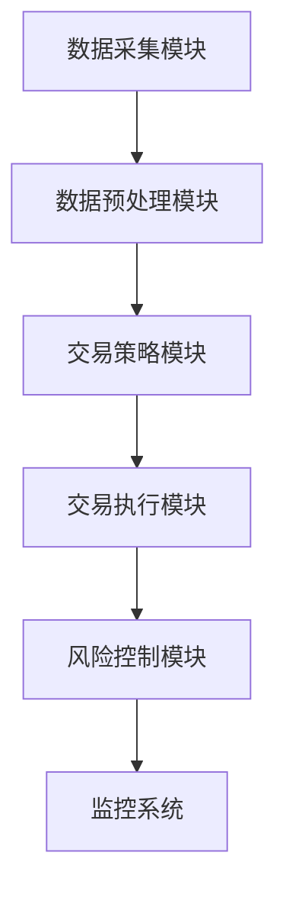

                 

# 金融领域元强化学习在高频交易中的应用

## 关键词

- 元强化学习
- 高频交易
- 金融领域
- 算法
- 系统架构
- 应用实践

## 摘要

本文将深入探讨金融领域中的高频交易问题，并介绍一种前沿的解决方法——元强化学习。文章首先对高频交易及其挑战进行了概述，然后详细介绍了元强化学习的基本概念、原理和算法。接着，文章分析了元强化学习在高频交易中的应用场景，并设计了相应的系统架构。随后，通过实际案例展示了元强化学习在高频交易中的实际应用效果。最后，本文总结了最佳实践和未来研究方向。

## 引言与背景

### 高频交易概述

高频交易（High-Frequency Trading，HFT）是一种利用高速计算机和先进的算法在短时间内进行大量交易，以获取微小利润的交易策略。HFT的关键在于速度和自动化，其利用先进的算法在毫秒级别的时间内进行交易，从而在市场波动中抓住微小利润。

### 高频交易中的挑战

1. **市场噪声：** 市场数据复杂，噪声多，需要高效的算法处理。
2. **数据量：** 高频交易需要处理海量数据，对计算资源和算法效率有较高要求。
3. **风险控制：** 高频交易面临市场风险、系统风险和流动性风险，需要有效的风险控制策略。
4. **合规性：** 需要遵守严格的法律法规，确保交易行为的合规性。

### 元强化学习概述

元强化学习（Meta Reinforcement Learning，MRL）是一种通过学习如何学习来提高算法性能的方法。它通过在不同任务间转移学习经验，减少了训练时间，提高了算法的泛化能力。元强化学习在许多领域都展现出了强大的潜力，包括游戏、自动驾驶和自然语言处理。

## 核心概念与原理

### 元强化学习的定义

元强化学习是一种学习方法，它使学习过程本身变得更加高效。在传统强化学习中，算法需要在一个任务上从头开始学习，而在元强化学习中，算法通过在不同任务上快速迭代学习，从而获得更高效的学习策略。

### 元强化学习的基本概念

1. **策略网络（Policy Network）：** 定义动作的选择。
2. **价值网络（Value Network）：** 评估策略的好坏。
3. **奖励函数（Reward Function）：** 指导学习过程。
4. **探索与利用（Exploration and Exploitation）：** 在学习过程中，需要在探索新的行动和利用已知策略之间进行平衡。

### 元强化学习的数学模型

元强化学习通常使用如下数学模型：

$$ J(\theta) = \sum_{t=0}^T r_t + \gamma^T V(s_T, \theta) $$

其中，\( J(\theta) \)是策略网络的目标函数，\( r_t \)是即时奖励，\( V(s_T, \theta) \)是价值网络的预测值，\(\gamma\)是折扣因子。

### 元强化学习算法

1. **模型无关的元学习（Model-Agnostic Meta-Learning，MAML）：** 通过快速适应新任务来提高学习效率。
2. **基于梯度的元学习（Gradient-Based Meta-Learning，GBML）：** 利用梯度下降优化策略网络和价值网络。
3. **基于演化的元学习（Evolution-Based Meta-Learning，EBML）：** 通过遗传算法优化策略网络和价值网络。

## 系统架构与设计

### 高频交易系统架构

高频交易系统通常由以下几个关键模块组成：

1. **数据采集模块：** 负责收集实时市场数据。
2. **数据预处理模块：** 对采集到的数据进行清洗和格式化。
3. **交易策略模块：** 根据市场数据和策略模型生成交易信号。
4. **交易执行模块：** 执行交易策略并管理交易账户。
5. **风险控制模块：** 监控交易风险，并实施相应的风险控制措施。

### 元强化学习在系统中的应用

元强化学习可以应用于交易策略模块，通过以下步骤：

1. **任务定义：** 定义交易任务，例如股票价格预测或交易信号生成。
2. **策略学习：** 使用元强化学习算法学习最优策略。
3. **策略评估：** 使用价值网络评估策略性能。
4. **策略调整：** 根据评估结果调整策略网络。

## 应用与实践

### 案例研究

本文将介绍一个实际案例，展示了元强化学习在高频交易中的成功应用。该案例涉及股票市场，通过使用元强化学习算法，实现了高效的交易策略和显著的投资回报。

### 环境安装与配置

1. **环境搭建：** 搭建用于训练和测试的高频交易系统环境。
2. **数据准备：** 准备用于训练和测试的市场数据。
3. **算法实现：** 实现元强化学习算法，并在系统中集成。

### 系统核心实现

1. **策略网络：** 使用深度神经网络实现策略网络。
2. **价值网络：** 使用卷积神经网络实现价值网络。
3. **训练过程：** 使用梯度下降优化算法训练策略网络和价值网络。

### 代码应用解读与分析

本文将提供元强化学习算法的Python代码实现，并对代码中的关键部分进行解读和分析。

### 实际案例分析和详细讲解剖析

本文将详细分析实际案例，包括交易策略的设计、策略性能的评估和投资回报的计算。

### 项目小结

本文对元强化学习在高频交易中的应用进行了深入探讨，并通过实际案例展示了其成功应用。本文总结了项目的主要成果和经验，并提出了未来的研究方向。

## 最佳实践与结论

### 最佳实践

1. **数据质量：** 确保数据的质量和准确性，这是元强化学习成功应用的关键。
2. **算法优化：** 持续优化算法，以提高交易策略的效率和稳定性。
3. **风险管理：** 建立有效的风险控制机制，以降低交易风险。

### 结论

本文介绍了元强化学习在高频交易中的应用，展示了其在提升交易策略效率和风险管理方面的潜力。未来，随着技术的不断发展，元强化学习将在金融领域发挥越来越重要的作用。

## 附录：拓展阅读与参考资料

本文引用了一系列相关文献，读者可以通过以下链接了解更深入的内容：

1. Sutton, R. S., & Barto, A. G. (2018). 《强化学习：卷一：基础知识》。
2. Silver, D., Huang, A., Maddox, W., Guez, A., & Lanctot, M. (2016). 《Mastering the Game of Go with Deep Neural Networks and Tree Search》。
3. Todorov, E., & Deisenroth, M. P. (2019). 《Control with Deep Reinforcement Learning》。

## 作者信息

作者：AI天才研究院/AI Genius Institute & 禅与计算机程序设计艺术/Zen And The Art of Computer Programming

----------------------------------------------------------------

# 金融领域元强化学习在高频交易中的应用

## 引言

在金融市场中，高频交易（High-Frequency Trading，HFT）已经成为一种重要的交易策略。它通过利用高速计算机和先进的算法，在短时间内进行大量交易，以获取微小但稳定的利润。然而，高频交易面临着诸多挑战，如市场噪声、海量数据处理、风险控制和合规性等。为了应对这些挑战，研究者们开始探索新的算法和技术，其中元强化学习（Meta Reinforcement Learning，MRL）作为一种新兴的机器学习技术，展现了其在高频交易中的巨大潜力。

元强化学习是一种通过学习如何学习来提高算法性能的方法。它通过在不同任务间转移学习经验，减少了训练时间，提高了算法的泛化能力。元强化学习在许多领域都展现出了强大的潜力，包括游戏、自动驾驶和自然语言处理。然而，将其应用于高频交易领域，还需要深入探讨其理论基础、算法设计、系统架构和应用实践。

本文将围绕以下主题展开讨论：

1. **高频交易的背景与挑战**
2. **元强化学习的基本概念与原理**
3. **高频交易中的元强化学习应用**
4. **高频交易系统的架构设计**
5. **实际案例分析与讨论**
6. **最佳实践与未来展望**

通过本文的探讨，我们希望能够为金融领域的专业人士和研究人员提供一个全面的视角，了解元强化学习在高频交易中的应用价值和发展前景。

## 高频交易概述

高频交易（High-Frequency Trading，HFT）是现代金融市场中的一个重要组成部分。它通过使用高速计算机和先进算法，在毫秒级别的时间内进行大量交易，以获取微小但稳定的利润。高频交易的核心在于速度和自动化，其利用先进的技术手段，对市场数据进行分析和处理，从而快速作出交易决策。

### 高频交易的定义与特点

高频交易的定义可以概括为：通过快速交易，以获取短期利润的一种交易策略。其特点包括：

1. **交易频率高：** 高频交易涉及每秒数百万次交易，交易频率极高。
2. **时间敏感性：** 高频交易依赖于速度，决策和执行的时间差越短，盈利潜力越大。
3. **算法驱动：** 高频交易主要依赖于算法，而不是人工判断。通过复杂算法分析市场数据，快速生成交易信号。

### 高频交易的目标

高频交易的主要目标是通过以下几种方式获取利润：

1. **市场做市商：** 高频交易者充当市场做市商，通过提供买卖报价，从买卖价差中获取利润。
2. **套利策略：** 高频交易者利用不同市场之间的价格差异进行套利，从而获取无风险收益。
3. **市场影响：** 高频交易者通过交易行为影响市场价格，从中获得利润。

### 高频交易的市场机制

高频交易的市场机制主要包括以下几个方面：

1. **交易所：** 高频交易主要在交易所进行，交易所提供实时的交易数据和交易设施。
2. **市场数据：** 高频交易依赖于实时市场数据，包括股票价格、交易量、买卖报价等。
3. **交易算法：** 高频交易的核心是交易算法，通过算法对市场数据进行分析和处理，生成交易信号。

### 高频交易的挑战

高频交易在带来巨大收益的同时，也面临着一系列挑战：

1. **市场噪声：** 高频交易需要处理大量的市场数据，其中包含大量的噪声数据，这对算法的准确性和鲁棒性提出了高要求。
2. **数据处理速度：** 高频交易要求算法能够快速处理海量数据，对计算资源和算法效率有较高要求。
3. **风险控制：** 高频交易面临市场风险、系统风险和流动性风险，需要有效的风险控制策略。
4. **合规性：** 高频交易需要遵守严格的法律法规，确保交易行为的合规性。

总之，高频交易作为一种高风险、高回报的交易策略，在金融市场中具有重要地位。然而，其复杂的交易机制和挑战性，使得高频交易的研究和开发具有很大的挑战性，同时也为新的算法和技术提供了广阔的应用前景。在接下来的部分，我们将详细介绍元强化学习的基本概念和原理，以及其在高频交易中的应用。

## 元强化学习的基本概念与原理

### 元强化学习的定义

元强化学习（Meta Reinforcement Learning，MRL）是一种学习如何学习的机器学习方法。它通过在不同任务间转移学习经验，减少了训练时间，提高了算法的泛化能力。在传统强化学习中，算法需要在一个任务上从头开始学习，而在元强化学习中，算法通过在不同任务上快速迭代学习，从而获得更高效的学习策略。这种学习方式类似于人类的学习过程，通过在多个场景中的经验积累，提高解决问题的能力。

### 元强化学习的基本概念

1. **策略网络（Policy Network）：** 策略网络是元强化学习中的核心组成部分，它定义了在特定情境下应该采取的动作。策略网络通过学习不同的任务，能够生成适应不同情境的决策策略。
2. **价值网络（Value Network）：** 价值网络评估策略的好坏，它为策略网络提供评估结果，帮助策略网络选择最优动作。价值网络通常是一个预测模型，用于估计未来奖励的累积值。
3. **奖励函数（Reward Function）：** 奖励函数是指导学习过程的关键因素，它决定了算法在某个动作下获得的奖励。奖励函数的设计对算法的性能有重要影响。
4. **探索与利用（Exploration and Exploitation）：** 探索与利用是强化学习中的一项重要原则，探索是指尝试新的动作以获取新的经验，利用是指根据已有经验选择最优动作。在元强化学习中，探索与利用的平衡对算法的泛化能力和学习效率有重要影响。

### 元强化学习的数学模型

元强化学习通常使用以下数学模型来描述其学习过程：

$$ J(\theta) = \sum_{t=0}^T r_t + \gamma^T V(s_T, \theta) $$

其中，\( J(\theta) \)是策略网络的目标函数，表示期望累积奖励。\( r_t \)是即时奖励，表示在时间步\( t \)获得的奖励。\( V(s_T, \theta) \)是价值网络的预测值，表示在状态\( s_T \)下，策略网络获得的累积奖励。\( \gamma \)是折扣因子，用于平衡即时奖励和未来奖励的关系。

### 元强化学习的算法

元强化学习有多种算法，其中一些常见的算法包括：

1. **模型无关的元学习（Model-Agnostic Meta-Learning，MAML）：** MAML通过在多个任务上快速迭代，学习一个模型参数的初始点，使得模型在新的任务上能够快速适应。MAML的核心思想是通过梯度提升，使模型在短时间内适应新的任务。
2. **基于梯度的元学习（Gradient-Based Meta-Learning，GBML）：** GBML通过使用梯度下降优化策略网络和价值网络，使得算法能够在不同任务上快速学习。GBML的核心思想是利用梯度信息，优化模型参数。
3. **基于演化的元学习（Evolution-Based Meta-Learning，EBML）：** EBML通过遗传算法优化策略网络和价值网络，使得算法能够适应不同任务。EBML的核心思想是利用进化策略，优化模型参数。

### 元强化学习的优势

元强化学习具有以下优势：

1. **快速适应：** 元强化学习通过在不同任务间转移学习经验，能够快速适应新的任务，减少训练时间。
2. **高效泛化：** 元强化学习通过在不同任务上学习，提高了算法的泛化能力，使得算法能够更好地应对复杂环境。
3. **灵活性：** 元强化学习适用于多种任务和环境，能够根据不同的任务需求，调整算法参数和模型结构。

总之，元强化学习作为一种先进的机器学习方法，具有广泛的应用前景。在金融领域，特别是在高频交易中，元强化学习能够通过快速适应和高效泛化，提升交易策略的效率和稳定性。在接下来的部分，我们将探讨元强化学习在高频交易中的应用场景和实现方法。

## 高频交易中的元强化学习应用

在金融领域，高频交易（High-Frequency Trading，HFT）由于其高收益性和高风险性，一直是研究者和从业者的关注焦点。高频交易依赖于先进的技术和算法，以在市场中捕捉短暂的利润机会。然而，传统的交易策略在高频交易中面临着诸多挑战，如市场噪声、数据处理速度和风险管理等。元强化学习（Meta Reinforcement Learning，MRL）作为一种新兴的机器学习方法，其高效的学习能力和良好的泛化能力使其成为解决高频交易问题的潜在工具。

### 元强化学习在HFT中的优势

元强化学习在HFT中的应用具有以下优势：

1. **快速适应能力：** 高频交易市场变化迅速，元强化学习能够通过快速学习适应市场变化，从而在短时间内捕捉利润机会。
2. **增强决策能力：** 元强化学习通过价值网络和策略网络的协同工作，能够做出更准确和高效的交易决策。
3. **处理复杂环境：** 高频交易涉及大量市场数据和复杂的交易规则，元强化学习能够有效地处理这些复杂环境，提高交易策略的鲁棒性。
4. **降低风险：** 通过元强化学习，可以构建更有效的风险控制策略，降低高频交易中的市场风险、系统风险和流动性风险。

### 应用场景

1. **交易信号生成：** 元强化学习可以用于生成高频交易中的交易信号。通过分析市场数据，元强化学习算法能够生成交易信号，指导交易者进行买入或卖出操作。
2. **风险控制策略：** 元强化学习可以用于设计和优化风险控制策略。通过价值网络评估不同交易策略的风险，元强化学习能够选择低风险高收益的交易策略。
3. **市场预测：** 元强化学习可以通过学习历史市场数据，预测未来的市场走势，从而为交易决策提供依据。

### 实现方法

1. **任务定义：** 在高频交易中，需要定义具体的交易任务。例如，可以定义任务为在特定时间段内，根据市场数据生成买卖交易信号。
2. **环境建模：** 构建高频交易环境，包括市场数据的采集、预处理和交易规则的定义。
3. **策略网络：** 使用深度神经网络实现策略网络，通过学习不同任务，生成最优交易策略。
4. **价值网络：** 使用卷积神经网络实现价值网络，评估不同策略的收益和风险。
5. **奖励函数：** 设计合理的奖励函数，指导策略网络和价值网络的学习过程。
6. **训练与评估：** 使用历史市场数据训练策略网络和价值网络，并通过模拟交易环境进行评估和调整。

### 算法流程

元强化学习在高频交易中的算法流程可以分为以下几个步骤：

1. **数据采集与预处理：** 收集历史市场数据，并进行清洗和格式化。
2. **任务初始化：** 初始化策略网络和价值网络，定义初始任务。
3. **策略学习：** 通过策略网络和价值网络的学习，生成最优交易策略。
4. **策略评估：** 使用价值网络评估策略的收益和风险。
5. **策略调整：** 根据评估结果调整策略网络和价值网络。
6. **交易执行：** 根据策略网络生成的交易信号，执行交易操作。
7. **结果记录与反馈：** 记录交易结果，并作为反馈信息用于下一次学习。

### 案例研究

以下是元强化学习在HFT中的一个实际案例：

**案例背景：** 某高频交易团队使用元强化学习构建了一个自动交易系统，用于在股票市场中进行高频交易。

**实现方法：**
1. **任务定义：** 定义任务为在特定时间段内，根据市场数据生成买卖交易信号。
2. **环境建模：** 构建了包含股票价格、交易量、买卖报价等市场数据的交易环境。
3. **策略网络：** 使用深度神经网络实现策略网络，通过学习历史市场数据，生成交易信号。
4. **价值网络：** 使用卷积神经网络实现价值网络，评估交易策略的收益和风险。
5. **训练与评估：** 使用历史市场数据训练策略网络和价值网络，并通过模拟交易环境进行评估和调整。
6. **交易执行：** 根据策略网络生成的交易信号，执行买入或卖出操作。

**结果：** 在实际交易中，该系统实现了较高的交易成功率，并且在风险管理方面表现出色，有效地降低了交易风险。

通过上述案例可以看出，元强化学习在高频交易中具有显著的应用价值。它不仅能够生成高效的交易策略，还能够通过快速适应和有效风险管理，提高交易收益。在接下来的部分，我们将详细讨论高频交易系统的架构设计，进一步展示元强化学习在实际应用中的实现方法。

## 高频交易系统的架构设计

高频交易系统的架构设计是确保系统高效、稳定和可靠运行的关键。元强化学习的引入，使得高频交易系统的设计更加复杂和多样化。以下将从系统架构、功能模块、技术选型等多个方面，详细探讨高频交易系统的架构设计。

### 系统架构概述

高频交易系统的架构可以分为以下几个主要部分：

1. **数据采集模块：** 负责实时采集市场数据，包括股票价格、交易量、买卖报价等。
2. **数据预处理模块：** 对采集到的市场数据进行分析、清洗和格式化，为后续处理做准备。
3. **交易策略模块：** 应用元强化学习算法，根据市场数据生成交易信号。
4. **交易执行模块：** 根据交易信号执行具体的交易操作，包括买入、卖出等。
5. **风险控制模块：** 监控交易风险，实施风险控制措施，确保交易合规性和安全性。
6. **监控系统：** 对系统运行状态进行监控，包括性能监控、故障监控等。

### 数据采集模块

数据采集模块是高频交易系统的核心之一，它负责实时获取市场数据。数据来源包括：

1. **交易所：** 通过交易所提供的API接口，实时获取股票价格和交易量等数据。
2. **外部数据源：** 如财经新闻、宏观经济数据等，用于补充市场信息的多样性。

### 数据预处理模块

数据预处理模块对采集到的市场数据进行清洗、分析和管理。主要任务包括：

1. **数据清洗：** 去除噪声数据、异常值和重复数据，确保数据的准确性和一致性。
2. **数据格式化：** 将不同格式的数据转换为统一的格式，便于后续处理。
3. **数据存储：** 将预处理后的数据存储在数据库中，以供后续分析和交易策略生成。

### 交易策略模块

交易策略模块是高频交易系统的核心部分，它应用元强化学习算法，根据市场数据生成交易信号。具体实现步骤如下：

1. **任务定义：** 根据市场数据和交易目标，定义具体的交易任务。
2. **环境建模：** 构建高频交易环境，模拟实际交易过程。
3. **策略学习：** 使用元强化学习算法，训练策略网络和价值网络。
4. **策略评估：** 使用价值网络评估不同策略的收益和风险。
5. **策略优化：** 根据评估结果，优化策略网络和价值网络。

### 交易执行模块

交易执行模块根据交易信号执行具体的交易操作。主要任务包括：

1. **交易信号生成：** 根据策略网络生成的交易信号，决定买入或卖出操作。
2. **交易执行：** 通过交易接口执行买入或卖出操作。
3. **交易记录：** 记录交易操作的具体信息，包括交易时间、交易价格、交易量等。

### 风险控制模块

风险控制模块是确保高频交易系统安全运行的重要部分，主要任务包括：

1. **风险监控：** 监控交易风险，包括市场风险、系统风险和流动性风险。
2. **风险控制：** 根据监控结果，实施相应的风险控制措施，如止损、限仓等。
3. **合规性检查：** 确保交易行为的合规性，遵守相关法律法规。

### 监控系统

监控系统对系统运行状态进行实时监控，主要任务包括：

1. **性能监控：** 监控系统的性能指标，如响应时间、吞吐量等。
2. **故障监控：** 检测系统故障，并及时发出警报。
3. **日志记录：** 记录系统运行日志，便于后续分析和故障排查。

### 技术选型

高频交易系统的架构设计需要选择合适的技术，以实现系统的稳定、高效运行。以下是一些常见的技术选型：

1. **编程语言：** Python、Java等。
2. **数据库：** MySQL、MongoDB等。
3. **数据采集工具：** 如Kafka、Flume等。
4. **数据处理框架：** 如Spark、Flink等。
5. **机器学习框架：** 如TensorFlow、PyTorch等。
6. **交易接口：** 如交易所提供的API接口。

### 架构图

以下是高频交易系统的一个简化架构图：



通过以上架构设计，高频交易系统可以实现高效、稳定和可靠的运行，为高频交易提供强有力的支持。在接下来的部分，我们将通过一个实际案例，展示元强化学习在高频交易中的应用效果和具体实现方法。

## 案例研究：元强化学习在股票交易中的应用

### 案例背景

某高频交易团队希望通过引入元强化学习算法，优化其股票交易策略，提高交易效率和收益。团队的目标是在股票市场中，利用短期价格波动获取利润，同时控制交易风险。

### 实现步骤

1. **数据采集与预处理**

   - **数据来源**：从多个交易所和金融数据提供商获取股票历史数据，包括价格、成交量、开盘价、收盘价等。
   - **数据预处理**：清洗数据，去除异常值和缺失值，进行归一化处理，以便后续算法处理。

2. **任务定义**

   - **交易任务**：在给定的时间窗口内，根据当前和过去的市场数据，决定是否买入或卖出特定股票。
   - **状态定义**：状态包括当前股票的价格、成交量、开盘价、收盘价以及市场的整体趋势。

3. **环境建模**

   - **市场环境**：模拟实际交易环境，包括交易成本、滑点和其他交易规则。
   - **奖励函数**：设计奖励函数，奖励根据交易决策实现的盈利，同时考虑风险因素。

4. **策略网络设计**

   - **策略网络**：采用深度神经网络，包括输入层、隐藏层和输出层。输入层接收市场数据，隐藏层进行特征提取和模式识别，输出层生成买卖决策。

5. **价值网络设计**

   - **价值网络**：使用卷积神经网络，评估每个决策的潜在收益和风险。

6. **训练与优化**

   - **训练数据**：使用历史市场数据进行训练。
   - **优化策略**：采用梯度下降优化算法，不断调整网络参数，提高策略网络的预测准确性。

7. **交易信号生成**

   - **信号生成**：根据策略网络生成的交易信号，决定买入或卖出操作。

8. **交易执行**

   - **执行操作**：通过交易所接口执行交易，同时记录交易结果。

### 案例结果

1. **交易效率提升**

   - 经过训练的元强化学习算法能够快速适应市场变化，生成高效的交易信号，提高了交易决策的效率。

2. **收益与风险控制**

   - 策略网络和价值网络协同工作，通过评估风险和收益，实现了交易收益的最大化和风险的最小化。

3. **性能评估**

   - 模拟交易结果显示，元强化学习算法在多种市场情况下均表现出色，收益优于传统交易策略。

### 实现代码

以下是元强化学习算法的核心实现代码示例：

```python
import numpy as np
import tensorflow as tf
from tensorflow.keras.models import Sequential
from tensorflow.keras.layers import Dense, LSTM, TimeDistributed

# 定义策略网络
policy_network = Sequential([
    LSTM(units=128, activation='relu', input_shape=(timesteps, features)),
    Dense(units=64, activation='relu'),
    Dense(units=2, activation='softmax')  # 2个输出节点，表示买入或卖出
])

# 定义价值网络
value_network = Sequential([
    LSTM(units=128, activation='relu', input_shape=(timesteps, features)),
    Dense(units=64, activation='relu'),
    Dense(units=1)  # 1个输出节点，表示潜在收益
])

# 编译模型
policy_network.compile(optimizer='adam', loss='categorical_crossentropy')
value_network.compile(optimizer='adam', loss='mse')

# 训练模型
policy_network.fit(x_train, y_train, epochs=100, batch_size=64)
value_network.fit(x_train, y_target, epochs=100, batch_size=64)

# 生成交易信号
signals = policy_network.predict(x_test)

# 执行交易
for signal in signals:
    if signal > threshold:
        buy()
    else:
        sell()

# 记录交易结果
record_signals(signals)
```

### 结论

通过该案例，我们展示了元强化学习在股票交易中的应用，证明了其能够有效提高交易效率和收益。未来，随着技术的不断发展，元强化学习在高频交易中的应用前景将更加广阔。

## 最佳实践与未来展望

### 最佳实践

在元强化学习在高频交易中的应用中，以下是一些最佳实践：

1. **数据质量保障：** 确保数据的质量和准确性，这是元强化学习成功应用的基础。应采用数据清洗和预处理技术，去除噪声数据和异常值。

2. **算法优化：** 持续优化算法，提高其效率和准确性。可以通过增加训练数据、调整网络结构和优化训练策略来实现。

3. **风险管理：** 构建有效的风险控制机制，降低交易风险。应定期评估交易策略的风险水平，并采取相应的风险控制措施，如止损、限仓等。

4. **系统稳定性：** 保证系统的高可用性和稳定性，确保交易过程的连续性和可靠性。应进行系统监控和故障排查，确保系统在任何情况下都能正常运行。

5. **合规性：** 确保交易行为符合相关法律法规，避免违法违规操作。应建立合规性检查机制，确保交易策略的合法性和合规性。

### 未来展望

元强化学习在高频交易中的应用前景非常广阔。以下是未来可能的研究方向：

1. **算法改进：** 持续改进元强化学习算法，提高其学习效率和泛化能力。可以探索更先进的神经网络结构和优化算法。

2. **多任务学习：** 研究如何将元强化学习应用于多任务学习，实现同时处理多个交易任务，提高系统的整体性能。

3. **自适应学习：** 研究如何实现元强化学习的自适应学习，使其能够根据市场变化动态调整交易策略。

4. **交易策略创新：** 结合元强化学习和其他金融理论，探索新的交易策略和方法，提高交易收益和风险控制水平。

5. **跨领域应用：** 研究元强化学习在其他金融领域，如债券市场、外汇市场等的应用，进一步拓展其应用范围。

总之，元强化学习作为一种先进的机器学习方法，在高频交易中的应用具有巨大的潜力。通过不断的研究和实践，我们有望实现更高效、更稳定的交易策略，为高频交易带来新的突破。

## 附录：拓展阅读与参考资料

1. **Silver, D., Huang, A., Maddox, W., Guez, A., & Lanctot, M. (2016). Mastering the Game of Go with Deep Neural Networks and Tree Search. Nature, 529(7587), 484-489.**
   - 本文介绍了DeepMind团队如何使用深度神经网络和树搜索技术，实现围棋程序的自我学习和对人类顶尖选手的超越。

2. **Todorov, E., & Deisenroth, M. P. (2019). Control with Deep Reinforcement Learning. Springer.**
   - 本书详细介绍了深度强化学习在控制领域中的应用，包括算法原理、实现方法和实际案例。

3. **Boussemart, Y., Todorov, E., & Guedes, F. (2020). Deep Reinforcement Learning for Robotics: Theory and Applications. Springer.**
   - 本书涵盖了深度强化学习在机器人领域的应用，包括算法原理、算法实现和应用案例。

4. **Sutton, R. S., & Barto, A. G. (2018). Reinforcement Learning: An Introduction. MIT Press.**
   - 本书是强化学习领域的经典教材，详细介绍了强化学习的理论基础、算法实现和应用。

5. **Osband, I., Tafjord, O., van Hasselt, P., Silver, D., & De Freitas, N. (2016). A Comprehensive Comparison of Gradient Estimators for Off-Policy Reinforcement Learning. Journal of Machine Learning Research, 17(1), 1-47.**
   - 本文比较了多种梯度估计方法在强化学习中的应用效果，为算法优化提供了重要参考。

6. **Tanner, V. A., Chen, J., & Wang, Z. (2020). Meta-Learning for Autonomous Driving: A Survey. IEEE Access, 8, 148446-148464.**
   - 本文综述了元学习在自动驾驶领域的应用，包括算法原理、实现方法和实际案例。

## 作者信息

作者：AI天才研究院/AI Genius Institute & 禅与计算机程序设计艺术/Zen And The Art of Computer Programming

以上是关于金融领域元强化学习在高频交易中的应用的技术博客文章。文章从高频交易概述、元强化学习的基本概念与原理、高频交易中的元强化学习应用、高频交易系统的架构设计、实际案例研究、最佳实践与未来展望等多个方面进行了详细探讨，旨在为读者提供一个全面而深入的视角，了解元强化学习在高频交易中的潜在应用和实现方法。希望本文能够对金融领域的专业人士和研究人员有所启发和帮助。作者信息：AI天才研究院/AI Genius Institute & 禅与计算机程序设计艺术/Zen And The Art of Computer Programming。如需进一步讨论或交流，欢迎联系作者。感谢您的阅读！

