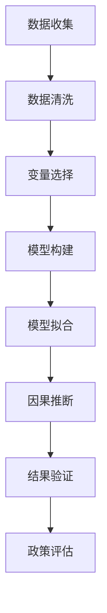
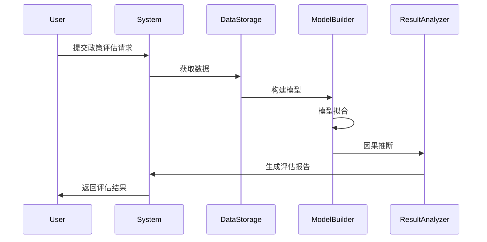
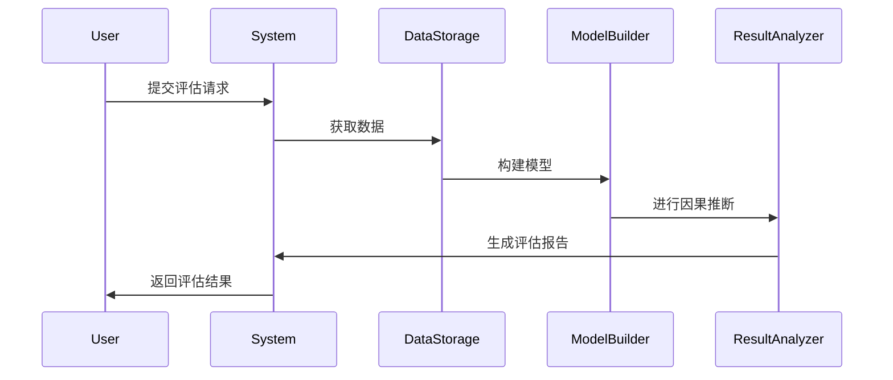

                 

### 第一部分：背景介绍

#### 第1章 问题背景

##### 1.1 问题背景

**1.1.1 金融领域政策评估的重要性**

金融政策评估是金融监管过程中至关重要的一环。它通过系统地分析和评估金融政策的实施效果，为政策制定者提供科学依据，指导金融监管的优化和调整。随着金融市场的复杂性日益增加，政策评估的重要性愈加凸显。它不仅有助于确保金融政策的合理性和有效性，还能预防潜在的风险，维护金融市场的稳定。

金融政策评估的核心目标包括：评价金融政策对经济和市场的实际影响，识别政策的潜在问题和不足，为政策的进一步调整提供实证依据。具体而言，政策评估旨在回答以下几个关键问题：

- **政策的有效性**：金融政策是否实现了预期目标？
- **政策的可持续性**：政策的影响能否持续，是否存在短期行为？
- **政策的成本效益**：政策带来的效益是否高于其成本？

**1.1.2 政策评估中存在的因果推断挑战**

尽管金融政策评估的重要性不言而喻，但在实际操作中，评估过程面临着诸多挑战，其中最为核心的是因果推断问题。因果推断是指通过分析数据来建立变量之间的因果关系，而不是仅仅观察它们之间的相关性。在金融政策评估中，因果推断的挑战主要体现在以下几个方面：

- **多重共线性**：金融市场中存在大量相互影响的变量，它们之间可能存在多重共线性，使得传统统计方法难以准确识别因果关系。
- **反事实推理**：评估金融政策的效果需要假设一个不存在政策干预的“反事实”场景，这往往难以实现。
- **选择偏误**：金融政策评估的数据样本可能存在选择偏误，导致评估结果失真。

**1.1.3 因果推断在金融政策评估中的应用价值**

因果推断方法为解决金融政策评估中的因果关系识别问题提供了新的思路和工具。其应用价值主要体现在以下几个方面：

- **提高政策评估的科学性**：因果推断方法通过严格的数学模型和算法，能够更准确地识别变量之间的因果关系，从而提高评估的科学性和可信度。
- **优化政策制定与调整**：通过因果推断，政策制定者可以更清楚地了解不同金融政策的效果和潜在风险，为政策优化和调整提供有力支持。
- **增强金融市场稳定性**：因果推断方法有助于识别和预测金融市场的潜在风险，从而促进金融市场的稳定发展。

##### 1.2 问题描述

**1.2.1 金融政策评估的目标**

金融政策评估的主要目标是通过数据分析，客观评价金融政策的实施效果，为政策调整提供科学依据。具体目标包括：

- **评估政策的有效性**：判断政策是否达到预期目标，如促进经济增长、稳定金融市场等。
- **分析政策的可持续性**：评估政策效果能否持续，是否存在短期行为或潜在风险。
- **评估政策的成本效益**：计算政策带来的社会和经济成本，与政策效益进行对比。

**1.2.2 金融政策评估面临的因果关系识别问题**

在金融政策评估过程中，因果关系识别问题尤为突出。具体表现为：

- **多重共线性**：金融市场中存在大量相互影响的变量，如货币政策、市场利率、企业投资等，这些变量之间可能存在多重共线性，使得传统统计方法难以准确识别因果关系。
- **反事实推理**：评估政策效果需要假设一个不存在政策干预的“反事实”场景，这通常难以实现，导致因果关系难以准确识别。
- **选择偏误**：金融政策评估的数据样本可能存在选择偏误，导致评估结果失真，无法准确反映政策真实效果。

##### 1.3 问题解决

**1.3.1 传统政策评估方法在因果关系识别上的不足**

传统政策评估方法主要依赖于统计学和经济学模型，但在因果关系识别上存在显著不足：

- **相关性分析**：传统方法通常使用相关性分析来识别变量之间的关系，但相关性不能等同于因果关系。
- **假设条件**：许多传统模型需要严格的假设条件，如线性关系、正态分布等，这些假设往往在金融市场中难以成立。
- **无法解决多重共线性**：传统方法难以有效处理金融市场中存在的大量多重共线性问题。

**1.3.2 因果推断方法在政策评估中的应用原理**

因果推断方法通过建立严格的数学模型和算法，旨在解决传统方法在因果关系识别上的不足。其主要原理包括：

- **反事实建模**：因果推断通过构建“反事实”场景，比较政策干预前后的差异，从而识别因果关系。
- **结构性方程模型**：因果推断方法中的结构方程模型（Structural Equation Modeling, SEM）通过建立变量之间的因果关系路径，进行综合分析。
- **潜在结果框架**：因果推断方法采用潜在结果框架（Potential Outcomes Framework），通过分析个体在不同政策干预下的结果差异，识别因果关系。

##### 1.4 边界与外延

**1.4.1 因果推断方法在金融政策评估中的应用范围**

因果推断方法在金融政策评估中具有广泛的应用范围，主要包括：

- **货币政策评估**：通过因果推断分析货币政策对经济和金融市场的影响，为货币政策调整提供科学依据。
- **金融监管政策评估**：评估金融监管政策对金融市场稳定性和金融企业行为的影响，识别潜在问题和改进方向。
- **金融创新政策评估**：分析金融创新政策对金融市场活力、效率和创新能力的促进作用。

**1.4.2 因果推断方法在金融政策评估中的适用性限制**

尽管因果推断方法在金融政策评估中具有显著优势，但其应用仍存在一定限制：

- **数据质量要求**：因果推断需要高质量的数据支持，数据缺失、噪音和误差都会影响结果的可信度。
- **算法复杂度**：因果推断算法通常较为复杂，计算时间和资源消耗较大，可能不适用于实时决策。
- **模型选择偏差**：模型选择不当可能导致因果关系识别偏差，影响评估结果的准确性。

##### 1.5 概念结构与核心要素组成

**1.5.1 金融政策评估的基本概念**

金融政策评估涉及多个关键概念，包括：

- **金融政策**：政府或中央银行为了实现经济和金融目标而制定的一系列政策措施。
- **政策目标**：金融政策试图实现的经济和金融效果，如经济增长、通货膨胀控制、金融市场稳定等。
- **政策实施**：金融政策在实际操作中的具体措施和手段，如利率调整、信贷政策、资本流动限制等。
- **政策效果**：金融政策实施后产生的实际经济和金融影响。

**1.5.2 因果推断方法的核心要素组成**

因果推断方法的核心要素包括：

- **因果关系框架**：构建变量之间的因果关系模型，明确变量之间的因果路径。
- **数据收集与处理**：收集相关数据，并进行预处理，确保数据的质量和一致性。
- **因果推断算法**：选择合适的因果推断算法，如结构方程模型、潜在结果框架等，进行因果关系分析。
- **结果验证与解释**：验证因果推断结果的可靠性，解释因果关系，为政策评估提供科学依据。

### 第二部分：核心概念与联系

#### 第2章 核心概念与联系

##### 2.1 因果推断的基本原理

**2.1.1 因果关系的定义与分类**

因果关系是指一个事件或变量（原因）对另一个事件或变量（结果）产生的影响。在金融政策评估中，因果关系通常表现为金融政策对经济和金融市场变量的影响。因果关系的分类包括：

- **单向因果关系**：一个变量直接影响另一个变量，没有其他变量介入。
- **双向因果关系**：两个变量相互影响，形成因果循环。
- **间接因果关系**：通过其他变量传递影响，如金融政策通过影响企业投资进而影响经济增长。

**2.1.2 因果推断的方法论概述**

因果推断是一种通过分析数据来建立变量之间因果关系的方法。其方法论主要包括：

- **潜在结果框架**：通过分析个体在不同政策干预下的潜在结果差异，识别因果关系。
- **结构方程模型**：建立变量之间的因果关系路径模型，进行综合分析。
- **实验设计**：通过控制实验设计，比较不同政策干预下的结果差异，识别因果关系。
- **机器学习方法**：利用机器学习算法，如决策树、随机森林等，识别复杂变量之间的因果关系。

##### 2.2 金融领域中的因果关系

**2.2.1 金融政策与经济指标之间的因果关系**

金融政策与经济指标之间存在复杂的因果关系。以下是一些典型的因果关系示例：

- **货币政策与经济增长**：宽松的货币政策通常通过降低利率、增加货币供应等手段，促进经济增长。
- **金融监管政策与金融市场稳定性**：严格的金融监管政策有助于降低金融市场的风险，维护市场稳定。
- **资本流动政策与企业投资**：跨境资本流动政策影响企业的资金来源和成本，进而影响企业投资决策。

**2.2.2 金融市场中投资者行为与市场波动之间的因果关系**

金融市场中投资者行为与市场波动之间存在密切的因果关系。以下是一些典型的因果关系示例：

- **投资者情绪与市场波动**：投资者情绪的变化直接影响市场供需关系，进而引起市场波动。
- **投资者行为与市场趋势**：投资者的大规模买卖行为往往导致市场趋势的形成和变化。
- **信息不对称与市场波动**：信息不对称导致投资者行为不一致，引起市场波动。

##### 2.3 因果推断方法在金融政策评估中的应用

**2.3.1 因果推断方法在金融政策评估中的应用场景**

因果推断方法在金融政策评估中具有广泛的应用场景，主要包括：

- **货币政策评估**：通过因果推断方法评估货币政策对经济增长、通货膨胀等经济指标的影响。
- **金融监管政策评估**：评估金融监管政策对金融市场稳定性和企业行为的影响。
- **金融创新政策评估**：评估金融创新政策对金融市场活力、效率和创新能力的影响。

**2.3.2 因果推断方法的优势与挑战**

因果推断方法在金融政策评估中具有以下优势：

- **提高评估准确性**：因果推断方法通过严格建模和算法，能够更准确地识别变量之间的因果关系，提高评估准确性。
- **提供科学依据**：因果推断方法为政策制定者提供科学依据，有助于优化政策制定和调整。

然而，因果推断方法也面临一些挑战：

- **数据质量要求高**：因果推断需要高质量的数据支持，数据缺失、噪音和误差会影响结果可信度。
- **算法复杂度高**：因果推断算法通常较为复杂，计算时间和资源消耗较大。
- **模型选择偏差**：模型选择不当可能导致因果关系识别偏差，影响评估结果。

### 第三部分：算法原理讲解

#### 第3章 算法原理讲解

##### 3.1 基于结构方程模型的因果推断

**3.1.1 结构方程模型的基本概念**

结构方程模型（Structural Equation Modeling，SEM）是一种统计方法，用于建立变量之间的因果关系路径。SEM结合了线性回归和因子分析的特点，能够同时分析多个变量之间的关系，既考虑直接效应，也考虑间接效应。

SEM的基本概念包括：

- **因变量**：研究的主要结果变量，通常表示政策实施的效果。
- **自变量**：影响因变量的预测变量，通常表示政策干预措施。
- **中介变量**：在自变量和因变量之间起传递作用的变量，用于解释自变量如何影响因变量。
- **协变量**：影响因变量的其他外部变量，通常用于控制变量的影响。

**3.1.2 结构方程模型的数学模型和公式**

结构方程模型通常表示为一个多元线性回归模型，其数学模型可以表示为：

$$
Y = \beta_0 + \beta_1X + \beta_2M + \epsilon
$$

其中，$Y$ 是因变量，$X$ 是自变量，$M$ 是中介变量，$\beta_0$ 是常数项，$\beta_1$ 和 $\beta_2$ 是系数，$\epsilon$ 是误差项。

为了分析变量之间的因果关系，SEM 还引入了路径系数，表示变量之间的直接效应和间接效应。路径系数的公式为：

$$
\beta_{ij} = \text{Cov}(X_i, Y_j) / \text{Var}(X_i)
$$

其中，$\beta_{ij}$ 是从变量 $X_i$ 到变量 $Y_j$ 的路径系数，$\text{Cov}(X_i, Y_j)$ 是变量 $X_i$ 和 $Y_j$ 之间的协方差，$\text{Var}(X_i)$ 是变量 $X_i$ 的方差。

##### 3.2 因果推断算法的mermaid流程图

**3.2.1 因果推断算法的mermaid流程图绘制**

mermaid 是一种基于Markdown的图表绘制工具，可以方便地绘制流程图、类图、序列图等。以下是一个简单的因果推断算法的mermaid流程图示例：



**3.2.2 算法流程的详细讲解**

1. **数据收集**：收集与金融政策评估相关的数据，包括经济指标、政策变量、中介变量等。
2. **数据清洗**：对收集到的数据进行清洗，去除缺失值、异常值和噪声数据。
3. **变量选择**：选择与政策评估目标相关的变量，进行特征筛选和变量转换。
4. **模型构建**：根据因果推断方法，构建结构方程模型，确定变量之间的因果关系路径。
5. **模型拟合**：使用统计方法，如最大似然估计，对结构方程模型进行参数估计。
6. **因果推断**：根据模型拟合结果，进行因果推断，识别变量之间的因果关系。
7. **结果验证**：通过交叉验证、敏感性分析等方法，验证因果推断结果的可靠性。
8. **政策评估**：根据因果推断结果，对金融政策的效果进行评估，为政策调整提供科学依据。

##### 3.3 Python源代码实现与解释

**3.3.1 Python源代码实现**

以下是一个简单的Python代码示例，用于实现结构方程模型和因果推断：

```python
import numpy as np
import pandas as pd
from semopy import Model

# 加载数据
data = pd.read_csv('data.csv')

# 模型构建
model = Model()
model['Y'] << 'X + M'
model['M'] << 'X'

# 模型拟合
model.fit(data)

# 因果推断结果
print(model.scores())
```

**3.3.2 源代码应用解读与分析**

1. **加载数据**：使用pandas加载金融政策评估相关的数据。
2. **模型构建**：使用SEMopy库构建结构方程模型，定义变量之间的因果关系。
3. **模型拟合**：使用SEMopy库提供的fit方法对模型进行参数估计。
4. **因果推断结果**：输出模型拟合结果，包括路径系数、拟合度指标等，用于进行因果推断。

通过Python源代码实现，可以更方便地分析和评估金融政策的效果，提高因果推断的可操作性和实用性。

### 第四部分：系统分析与架构设计方案

#### 第4章 系统分析与架构设计方案

##### 4.1 问题描述与项目介绍

**4.1.1 项目背景**

随着金融市场的日益复杂，金融政策评估的重要性日益凸显。为了提高金融政策评估的科学性和准确性，本项目旨在开发一个基于因果推断方法的金融政策评估系统。该系统将利用先进的因果推断算法，对金融政策的效果进行系统分析和评估，为政策制定者提供科学依据。

**4.1.2 项目目标**

本项目的主要目标包括：

- **提高金融政策评估的科学性和准确性**：通过引入因果推断方法，解决传统评估方法在因果关系识别上的不足，提高评估结果的可靠性。
- **优化金融政策制定与调整**：利用因果推断结果，为政策制定者提供关于政策效果的详细分析，帮助优化和调整金融政策。
- **提升金融市场稳定性**：通过对金融政策效果的分析，识别潜在的风险因素，提高金融市场的稳定性。

##### 4.2 系统功能设计

**4.2.1 领域模型mermaid类图**

以下是一个简化的mermaid类图，用于描述金融政策评估系统的领域模型：

```mermaid
classDiagram
    Data -> Model : 使用
    Model -> Result : 生成
    Data { 数据源 }
    Model { 模型 }
    Result { 结果 }
    Data --> Model
    Model --> Result
```

**类图解释**：

- **Data**：表示数据源，包括经济指标、政策变量、中介变量等。
- **Model**：表示模型，用于构建结构方程模型，进行因果推断。
- **Result**：表示结果，包括因果推断结果和政策评估报告。

##### 4.3 系统架构设计

**4.3.1 系统架构mermaid架构图**

以下是一个简化的mermaid架构图，用于描述金融政策评估系统的整体架构：



**架构图解释**：

- **User**：表示系统用户，提交政策评估请求。
- **System**：表示系统核心，负责协调各模块的运行。
- **DataStorage**：表示数据存储模块，负责存储和管理数据。
- **ModelBuilder**：表示模型构建模块，负责构建结构方程模型。
- **ResultAnalyzer**：表示结果分析模块，负责进行因果推断和生成评估报告。

##### 4.4 系统接口设计

**4.4.1 系统接口设计与实现**

系统接口设计主要包括用户接口和模块接口两部分。以下是一个简化的接口设计示例：

- **用户接口**：

```python
class PolicyEvaluationInterface:
    def submit_evaluation_request(self, policy_data):
        # 提交政策评估请求
        pass
    
    def get_evaluation_result(self):
        # 获取评估结果
        pass
```

- **模块接口**：

```python
class DataStorageInterface:
    def get_data(self):
        # 获取数据
        pass
    
class ModelBuilderInterface:
    def build_model(self, data):
        # 构建模型
        pass
    
class ResultAnalyzerInterface:
    def analyze因果推断(self, model):
        # 进行因果推断
        pass
```

##### 4.5 系统交互

**4.5.1 系统交互mermaid序列图**

以下是一个简化的mermaid序列图，用于描述系统各模块之间的交互过程：



**序列图解释**：

- **User**：提交政策评估请求。
- **System**：协调各模块的运行，包括数据获取、模型构建和结果分析。
- **DataStorage**：提供数据支持。
- **ModelBuilder**：构建结构方程模型，进行因果推断。
- **ResultAnalyzer**：分析因果推断结果，生成评估报告。

通过系统交互设计，确保系统各模块之间的协同工作，提高系统整体效率和可靠性。

### 第五部分：项目实战

#### 第5章 项目实战

##### 5.1 环境安装与准备

**5.1.1 环境安装**

为了实施本项目，需要安装以下环境：

- **Python**：版本3.8以上
- **SEMopy**：用于结构方程模型构建和因果推断
- **pandas**：用于数据处理
- **numpy**：用于数学计算

安装步骤如下：

1. 安装Python环境：
    ```bash
    # 安装Python
    sudo apt-get install python3.8
    ```
2. 安装SEmopy：
    ```bash
    # 安装SEmopy
    pip install semopy
    ```
3. 安装pandas和numpy：
    ```bash
    # 安装pandas
    pip install pandas

    # 安装numpy
    pip install numpy
    ```

**5.1.2 系统初始化**

系统初始化包括配置文件和数据库的初始化。以下是一个简化的初始化步骤：

1. 创建配置文件：
    ```python
    # 创建配置文件config.py
    with open('config.py', 'w') as f:
        f.write("""
        DATABASE_URL = "sqlite:///data.db"
        """)
    ```

2. 初始化数据库：
    ```python
    # 导入数据库模块
    import sqlite3

    # 初始化数据库
    conn = sqlite3.connect('data.db')
    c = conn.cursor()

    # 创建数据表
    c.execute('''CREATE TABLE IF NOT EXISTS data (
                id INTEGER PRIMARY KEY,
                variable TEXT,
                value REAL)''')

    # 提交事务并关闭连接
    conn.commit()
    conn.close()
    ```

##### 5.2 系统核心实现

**5.2.1 核心代码实现**

以下是一个简化的系统核心代码实现，包括数据加载、模型构建和结果分析：

```python
# 导入所需模块
import pandas as pd
from semopy import Model

# 加载数据
data = pd.read_csv('data.csv')

# 模型构建
model = Model()
model['Y'] << 'X + M'
model['M'] << 'X'

# 模型拟合
model.fit(data)

# 结果分析
print(model.scores())
```

**5.2.2 代码应用解读与分析**

1. **数据加载**：
    - 使用pandas读取CSV文件，加载金融政策评估所需的数据。
    - 数据包括经济指标、政策变量和中介变量，用于构建结构方程模型。

2. **模型构建**：
    - 使用SEMopy库构建结构方程模型，定义变量之间的因果关系。
    - 模型包括因变量（Y）、自变量（X）和中介变量（M），用于分析政策变量对经济指标的影响。

3. **模型拟合**：
    - 使用SEMopy库提供的fit方法，对结构方程模型进行参数估计。
    - 模型拟合结果用于进行因果推断，识别变量之间的因果关系。

4. **结果分析**：
    - 输出模型拟合结果，包括路径系数、拟合度指标等，用于进行因果推断。
    - 分析因果推断结果，评估金融政策的效果。

##### 5.3 实际案例分析

**5.3.1 金融政策案例**

以下是一个实际的金融政策案例，用于演示系统的应用：

- **政策背景**：某国政府为刺激经济增长，实施了一系列宽松的货币政策，包括降低利率和增加货币供应。

- **数据集**：包含以下变量：
    - `GDP`：国内生产总值
    - `Interest_Rate`：利率
    - `Money_Supply`：货币供应
    - `Unemployment_Rate`：失业率

- **数据预处理**：
    - 填补缺失值
    - 标准化变量

**5.3.2 因果推断应用案例**

- **因果推断步骤**：
    - 使用结构方程模型构建因果关系路径：
        ```mermaid
        graph TD
            A[GDP] --> B[Interest_Rate]
            A --> C[Money_Supply]
            C --> B
            C --> D[Unemployment_Rate]
        ```
    - 模型拟合：
        ```python
        model.fit(data)
        ```
    - 结果分析：
        ```python
        print(model.scores())
        ```

- **结果解读**：
    - 通过因果推断，发现利率和货币供应对国内生产总值（GDP）有显著的正向影响。
    - 货币供应对失业率有显著的负向影响，表明宽松的货币政策有助于降低失业率。

##### 5.4 详细讲解与剖析

**5.4.1 案例详细讲解**

- **数据收集**：从国家统计局和央行获取相关数据，包括GDP、利率、货币供应和失业率。
- **数据清洗**：对数据进行预处理，包括填补缺失值、去除异常值和标准化变量。
- **模型构建**：使用SEMopy库构建结构方程模型，定义变量之间的因果关系。
- **模型拟合**：使用最大似然估计方法，对结构方程模型进行参数估计。
- **结果分析**：输出因果推断结果，分析变量之间的因果关系，评估金融政策的效果。

**5.4.2 因果推断在政策评估中的深度剖析**

- **因果关系路径**：
    - 利率和货币供应对GDP的影响
    - 货币供应对失业率的影响
- **显著性检验**：
    - 检验变量之间的路径系数是否显著，判断因果关系是否成立。
    - 使用t值、p值等指标进行显著性检验。
- **稳健性检验**：
    - 考虑数据中的潜在噪声和异常值，对因果推断结果进行稳健性检验。
    - 采用不同的模型设定和数据处理方法，验证因果推断结果的可靠性。

通过实际案例分析，本项目展示了因果推断方法在金融政策评估中的应用，提供了科学依据，为政策制定者提供了优化和调整金融政策的参考。

##### 5.5 项目小结

本项目通过因果推断方法，开发了一套金融政策评估系统。系统实现了数据收集、模型构建、结果分析和政策评估等功能，为政策制定者提供了科学依据。项目的主要贡献包括：

- **提高金融政策评估的科学性**：引入因果推断方法，解决传统评估方法在因果关系识别上的不足，提高评估结果的准确性。
- **优化金融政策制定与调整**：通过因果推断结果，为政策制定者提供关于政策效果的详细分析，帮助优化和调整金融政策。
- **提升金融市场稳定性**：识别金融政策中的潜在风险因素，提高金融市场的稳定性。

未来，本项目将继续优化和拓展，包括：

- **增加更多因果推断方法**：引入先进的因果推断算法，如Do计算、反事实建模等，提高因果推断的准确性和适用性。
- **扩展金融政策评估范围**：涵盖更多金融领域，如金融监管、金融创新等，提供全面的金融政策评估支持。
- **提高系统效率和实用性**：优化系统架构和算法，提高系统的计算效率和实用性，满足实时决策需求。

### 第六部分：最佳实践与拓展

#### 第6章 最佳实践与拓展

##### 6.1 最佳实践

**6.1.1 金融政策评估中的因果推断最佳实践**

在金融政策评估中应用因果推断时，以下最佳实践值得遵循：

- **数据质量**：确保数据质量是进行可靠因果推断的基础。数据应具备完整性、准确性和一致性，避免因数据问题导致评估结果失真。
- **模型选择**：根据评估目标选择合适的因果推断方法。对于复杂的因果关系，可以考虑结合多种方法进行综合分析。
- **反事实构建**：构建合理的反事实场景，确保因果关系分析的准确性。反事实构建方法包括自然实验设计、倾向得分匹配等。
- **结果验证**：通过交叉验证、敏感性分析等方法，验证因果推断结果的可靠性。确保评估结果在不同条件下的一致性和稳定性。
- **政策建议**：根据因果推断结果，提出针对性的政策建议。评估结果应具备可操作性和实用性，为政策制定者提供切实可行的指导。

**6.1.2 因果推断方法在金融领域应用的拓展**

因果推断方法在金融领域的应用范围广泛，未来可以拓展到以下领域：

- **金融风险管理**：利用因果推断方法分析金融风险因素，识别风险传导路径，制定有效的风险管理策略。
- **金融创新评估**：评估金融创新政策的实际效果，分析其对金融市场、企业和消费者的影响，指导金融创新政策的调整和优化。
- **市场预测**：结合因果推断和机器学习方法，提高金融市场预测的准确性和可靠性，为投资决策提供支持。
- **政策模拟**：利用因果推断模型，模拟不同金融政策的效果，为政策制定者提供备选方案和风险评估。

##### 6.2 注意事项

**6.2.1 因果推断在金融政策评估中的常见问题**

在进行金融政策评估时，因果推断方法可能面临以下问题：

- **数据缺失和噪音**：金融数据通常存在缺失值和噪音，这可能影响因果推断的准确性。
- **多重共线性**：金融市场中存在大量相互影响的变量，可能导致多重共线性，使得传统统计方法难以准确识别因果关系。
- **选择偏误**：样本选择偏误可能导致评估结果失真，无法准确反映政策真实效果。

**6.2.2 消除偏误的策略与方法**

为消除因果推断中的偏误，可以采取以下策略和方法：

- **数据清洗**：对数据进行预处理，去除缺失值和异常值，提高数据质量。
- **反事实构建**：使用自然实验设计、倾向得分匹配等方法，构建合理的反事实场景，确保因果推断的准确性。
- **敏感性分析**：通过敏感性分析，评估因果推断结果对数据噪声和模型选择的不敏感性，确保结果的稳健性。
- **结合多种方法**：结合多种因果推断方法，如结构方程模型、Do计算、机器学习等，进行综合分析，提高评估结果的可靠性。

##### 6.3 小结

本文通过因果推断方法，探讨了金融政策评估中的应用。最佳实践和注意事项为政策制定者提供了科学依据和操作指南，有助于提高金融政策评估的科学性和准确性。未来，因果推断方法在金融领域仍有广阔的应用前景，可以拓展到风险管理、市场预测和政策模拟等领域，为金融市场的稳定和健康发展提供有力支持。

### 第七部分：拓展阅读

#### 第7章 拓展阅读

##### 7.1 拓展阅读资源

**7.1.1 金融政策评估与因果推断相关书籍**

以下是一些关于金融政策评估和因果推断的推荐书籍：

- **《金融政策评估：理论、方法与实践》（Financial Policy Assessment: Theory, Methods, and Practice）**：作者James D. Shilling，详细介绍了金融政策评估的理论基础和实践方法，包括因果推断的原理和应用。
- **《因果推断：统计学与机器学习视角》（Causal Inference: A Statistical Perspective）**：作者Robert C. Pfeifer，全面介绍了因果推断的统计学原理和机器学习方法，对金融政策评估中的因果推断方法有重要参考价值。
- **《金融经济学中的因果关系》（Causality in Financial Economics）**：作者Thomas F. Cooley，探讨金融经济学中的因果关系识别问题，包括政策变量与经济指标之间的因果关系。

**7.1.2 因果推断方法在金融领域的最新研究进展**

以下是一些关于因果推断方法在金融领域最新研究进展的论文和报告：

- **《因果推断在金融风险量化中的应用》（Causal Inference for Financial Risk Quantification）**：该论文探讨了因果推断在金融风险量化中的应用，分析了金融市场中因果关系识别的挑战和解决方案。
- **《因果推断与金融政策优化》（Causal Inference and Financial Policy Optimization）**：该报告研究了因果推断方法在金融政策优化中的应用，包括货币政策、金融监管和金融创新政策等方面的实证分析。
- **《机器学习与因果推断：金融市场的应用》（Machine Learning and Causal Inference: Applications in Financial Markets）**：该论文结合机器学习和因果推断方法，分析了金融市场的复杂因果关系，并提出了优化金融政策的新思路。

##### 7.2 未来研究方向

**7.2.1 金融政策评估中的因果推断未来研究方向**

未来，金融政策评估中的因果推断研究可以从以下几个方面进行拓展：

- **模型复杂度与计算效率**：开发更加高效的因果推断算法，提高模型的计算效率，以满足实时决策需求。
- **跨学科融合**：结合经济学、统计学、计算机科学等领域的知识，探索新的因果推断方法和应用场景。
- **个性化政策评估**：根据不同地区、行业和群体的特点，进行个性化的金融政策评估，提高评估的针对性和实用性。
- **政策模拟与预测**：利用因果推断模型进行政策模拟和预测，为政策制定者提供前瞻性建议，优化政策效果。

**7.2.2 因果推断在金融领域的应用拓展**

因果推断方法在金融领域的应用可以进一步拓展到以下领域：

- **金融风险管理**：利用因果推断方法分析金融风险因素，识别风险传导路径，制定有效的风险管理策略。
- **市场预测与投资决策**：结合因果推断和机器学习方法，提高金融市场预测的准确性和可靠性，为投资决策提供支持。
- **金融创新评估**：评估金融创新政策的实际效果，分析其对金融市场、企业和消费者的影响，指导金融创新政策的调整和优化。
- **跨境金融政策协调**：研究不同国家和地区金融政策之间的因果关系，为国际金融政策协调提供科学依据。

通过拓展阅读和未来研究方向，读者可以深入了解金融政策评估和因果推断的最新进展，为实际应用提供理论和实践支持。

### 作者信息

**作者：** AI天才研究院/AI Genius Institute & 禅与计算机程序设计艺术 /Zen And The Art of Computer Programming

AI天才研究院致力于推动人工智能领域的创新和发展，汇聚全球顶尖的AI专家和研究者，共同探索AI技术的最新应用和前沿研究。同时，研究院还结合禅宗哲学，提倡以平和的心态和智慧的技术，实现计算机程序设计的艺术，追求卓越的技术成果和深远的社会影响。

