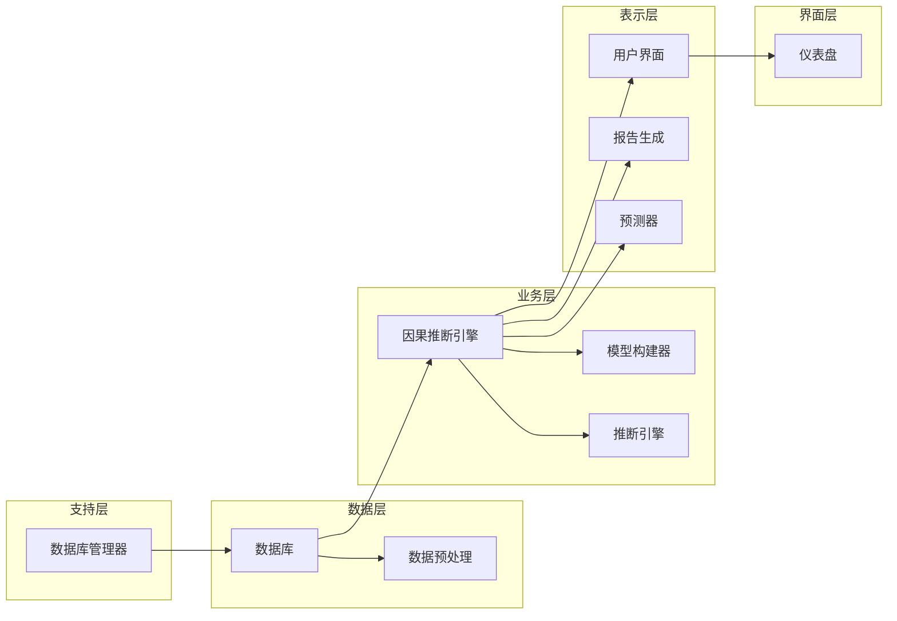

                 

### 《金融领域因果推断的研究与应用》

> 关键词：因果推断，金融领域，风险控制，投资决策，算法应用

> 摘要：本文深入探讨了金融领域因果推断的研究与应用。通过对因果推断的核心概念、算法原理及其在金融领域的应用进行详细分析，本文旨在为读者提供关于因果推断在金融领域实际操作中的全面了解，以及如何解决金融领域中的关键问题。

---

### 目录

#### 第一部分：背景介绍

- # 第一部分：金融领域因果推断的背景
  - 1.1 问题背景
  - 1.2 问题描述
  - 1.3 问题解决
  - 1.4 概念结构与核心要素组成
  - 1.5 本章小结

#### 第二部分：核心概念与联系

- # 第二部分：金融领域因果推断的核心概念与联系
  - 2.1 因果推断的基本原理
  - 2.2 相关概念与联系
  - 2.3 因果推断在金融领域的应用
  - 2.4 因果推断的优势与局限性
  - 2.5 本章小结

#### 第三部分：算法原理讲解

- # 第三部分：金融领域因果推断算法原理讲解
  - 3.1 因果推断算法概述
  - 3.2 Do-Calculus算法原理
  - 3.3 Structural Causal Models算法原理
  - 3.4 因果推断算法在金融领域的应用实例
  - 3.5 本章小结

#### 第四部分：数学模型与公式讲解

- # 第四部分：金融领域因果推断的数学模型与公式讲解
  - 4.1 因果推断的数学模型
  - 4.2 Python代码实现
  - 4.3 数学公式与Python代码实例
  - 4.4 本章小结

#### 第五部分：系统分析与架构设计

- # 第五部分：金融领域因果推断系统分析与架构设计
  - 5.1 问题场景介绍
  - 5.2 系统功能设计
  - 5.3 系统架构设计
  - 5.4 系统接口设计和系统交互
  - 5.5 本章小结

#### 第六部分：项目实战

- # 第六部分：金融领域因果推断项目实战
  - 6.1 环境安装
  - 6.2 系统核心实现源代码
  - 6.3 代码应用解读与分析
  - 6.4 实际案例分析与详细讲解
  - 6.5 项目小结

#### 第七部分：最佳实践与拓展阅读

- # 第七部分：最佳实践与拓展阅读
  - 7.1 最佳实践 tips
  - 7.2 小结
  - 7.3 注意事项
  - 7.4 拓展阅读

---

#### 第一部分：背景介绍

### 1.1 问题背景

在金融领域中，因果推断作为一种重要的统计分析方法，正逐渐受到越来越多的关注。因果推断的核心在于理解变量之间的因果关系，而不是仅仅关注它们之间的相关性。金融市场的波动、风险评估、投资决策等都需要依赖因果推断来做出准确、合理的判断。

#### 1.2 问题描述

金融领域中的因果关系复杂，且常常受到多种因素的影响。例如，股票价格的涨跌可能受到宏观经济环境、公司财务状况、市场情绪等多种因素的影响。如何从这些复杂的数据中准确识别出因果关系，成为金融领域中的一个重要挑战。

#### 1.3 问题解决

因果推断提供了一种解决方案。通过构建因果模型，可以有效地识别出变量之间的因果关系，从而为金融决策提供科学依据。然而，金融领域的因果关系通常是不确定的，且数据往往存在噪声和缺失，因此因果推断在金融领域的应用具有一定的局限性。

#### 1.4 概念结构与核心要素组成

因果推断的基本概念包括：因果关系、因果模型、因果推断算法等。在金融领域，因果推断的核心要素包括：金融市场数据、因果模型构建、因果推断算法应用等。这些概念和要素共同构成了因果推断在金融领域的应用框架。

#### 1.5 本章小结

本部分介绍了金融领域因果推断的背景、问题描述、问题解决、概念结构与核心要素组成。通过这些内容的介绍，读者可以对金融领域因果推断有一个初步的了解，并为后续章节的深入学习打下基础。

---

#### 第二部分：核心概念与联系

### 2.1 因果推断的基本原理

因果推断是一种统计方法，旨在确定变量之间的因果关系。其核心思想是通过分析数据，找出变量之间的因果链条，从而推断出变量之间的因果关系。在因果推断中，通常使用因果模型来描述变量之间的关系。

#### 2.1.1 因果推断的定义

因果推断是指通过分析数据，识别变量之间的因果关系，并利用这些关系进行预测和决策。

#### 2.1.2 因果推断的关键原理

因果推断的关键原理包括：因果模型、因果识别、因果推断算法等。因果模型用于描述变量之间的关系，因果识别用于找出变量之间的因果关系，因果推断算法用于实现因果推断。

#### 2.1.3 因果推断的数学模型

因果推断的数学模型通常包括：潜在结果框架、因果图、因果模型等。这些模型用于描述变量之间的因果关系，并为因果推断提供理论依据。

#### 2.2 相关概念与联系

在因果推断中，相关性和因果性是两个重要的概念。相关性描述变量之间的线性关系，因果性描述变量之间的因果关系。相关性和因果性之间存在一定的关联，但并不等同。

#### 2.2.1 相关性分析

相关性分析是因果推断的基础。通过相关性分析，可以找出变量之间的线性关系，为因果推断提供初步的线索。

#### 2.2.2 因果关系识别

因果关系识别是因果推断的核心。通过因果关系识别，可以确定变量之间的因果关系，从而为金融决策提供科学依据。

#### 2.2.3 因果推断方法分类与对比

因果推断方法可以根据不同的分类标准进行分类。常见的分类标准包括：基于模型的因果推断方法、基于算法的因果推断方法等。这些方法各有优缺点，适用于不同的应用场景。

#### 2.3 因果推断在金融领域的应用

因果推断在金融领域具有广泛的应用。例如，在风险评估中，因果推断可以用于识别出影响风险的关键因素；在投资决策中，因果推断可以用于预测市场的走势，优化投资组合等。

#### 2.3.1 风险评估与控制

在金融领域，风险评估是一个重要的任务。因果推断可以用于识别出影响风险的关键因素，从而为风险控制提供科学依据。

#### 2.3.2 金融市场预测

在金融市场预测中，因果推断可以用于预测市场的走势，为投资决策提供参考。例如，通过分析宏观经济数据、公司财务数据等，可以预测股票市场的涨跌。

#### 2.3.3 投资决策优化

在投资决策中，因果推断可以用于优化投资组合。通过分析不同资产之间的因果关系，可以确定哪些资产应该持有，哪些资产应该避免。

#### 2.4 因果推断的优势与局限性

因果推断在金融领域具有许多优势。例如，它可以提供更加准确的预测结果，帮助金融机构做出更明智的决策。然而，因果推断也存在一些局限性。例如，它可能受到数据质量和模型选择的影响，导致推断结果不准确。

#### 2.4.1 因果推断的优势

- 提供准确的因果关系分析，为金融决策提供科学依据。
- 可以识别出影响风险和投资回报的关键因素。
- 可以用于优化投资组合，提高投资收益。

#### 2.4.2 因果推断的局限性

- 数据质量和模型选择对因果推断结果有较大影响。
- 因果推断可能无法完全消除噪声和误差。
- 因果推断的复杂性可能导致计算成本增加。

#### 2.4.3 消除局限性的方法

- 提高数据质量，确保数据真实可靠。
- 选择合适的因果模型和推断算法，提高推断准确性。
- 使用多种方法进行交叉验证，降低模型误差。

#### 2.5 本章小结

本部分介绍了因果推断的基本原理、相关概念与联系，以及因果推断在金融领域的应用。通过对因果推断的深入分析，读者可以更好地理解其在金融领域的重要性，并为后续章节的学习提供理论基础。

---

#### 第三部分：算法原理讲解

### 3.1 因果推断算法概述

因果推断算法是用于确定变量之间因果关系的一系列方法。在金融领域，因果推断算法可以用于风险评估、投资决策优化等方面。常见的因果推断算法包括Do-Calculus算法和Structural Causal Models算法。

#### 3.1.1 因果推断算法的基本步骤

因果推断算法的基本步骤通常包括：

1. **数据收集与预处理**：收集相关的金融数据，并进行数据清洗和预处理，确保数据的准确性和完整性。
2. **因果模型构建**：根据数据特征和业务需求，构建合适的因果模型。
3. **因果识别**：利用因果模型识别变量之间的因果关系。
4. **因果推断**：根据因果识别结果，进行因果推断，预测变量之间的关系。
5. **模型验证与优化**：对因果推断模型进行验证和优化，提高模型的准确性和稳定性。

#### 3.1.2 常见的因果推断算法

1. **Do-Calculus算法**：Do-Calculus是一种形式化的因果推断方法，主要用于分析决策和干预的影响。它通过因果图和网络结构来表示变量之间的关系，并利用数学模型进行因果推断。

2. **Structural Causal Models算法**：Structural Causal Models是一种基于结构方程模型的因果推断方法。它通过构建因果图和网络结构，识别变量之间的因果关系，并进行因果推断。

#### 3.1.3 算法的选择与适用场景

选择因果推断算法时，需要考虑数据类型、业务需求、计算资源等因素。例如：

- 对于时间序列数据，Do-Calculus算法可能更为适用。
- 对于复杂网络结构的数据，Structural Causal Models算法可能更为有效。

### 3.2 Do-Calculus算法原理

Do-Calculus是一种形式化的因果推断方法，主要用于分析决策和干预的影响。它通过因果图和网络结构来表示变量之间的关系，并利用数学模型进行因果推断。

#### 3.2.1 Do-Calculus的定义与作用

Do-Calculus是一种用于表示和推断变量之间因果关系的数学框架。它通过因果图和网络结构来描述变量之间的关系，并利用Do-Calculus规则进行因果推断。

#### 3.2.2 Do-Calculus的数学模型

Do-Calculus的数学模型主要包括：

- **因果图**：用于表示变量之间的因果关系。
- **Do-Calculus规则**：用于推断变量之间的因果关系。

#### 3.2.3 Do-Calculus的算法流程图


### 3.3 Structural Causal Models算法原理

Structural Causal Models是一种基于结构方程模型的因果推断方法。它通过构建因果图和网络结构，识别变量之间的因果关系，并进行因果推断。

#### 3.3.1 Structural Causal Models的定义与作用

Structural Causal Models是一种用于表示和推断变量之间因果关系的数学框架。它通过因果图和网络结构来描述变量之间的关系，并利用结构方程模型进行因果推断。

#### 3.3.2 Structural Causal Models的数学模型

Structural Causal Models的数学模型主要包括：

- **因果图**：用于表示变量之间的因果关系。
- **结构方程模型**：用于描述变量之间的依赖关系。

#### 3.3.3 Structural Causal Models的算法流程图


### 3.4 因果推断算法在金融领域的应用实例

因果推断算法在金融领域具有广泛的应用。以下是一些典型的应用实例：

#### 3.4.1 案例一：风险评估

在金融领域，风险评估是一个重要的任务。因果推断算法可以用于识别出影响风险的关键因素，从而为风险控制提供科学依据。例如，通过分析宏观经济数据、公司财务数据等，可以预测股票市场的涨跌，评估投资组合的风险。

#### 3.4.2 案例二：市场预测

在金融市场预测中，因果推断算法可以用于预测市场的走势，为投资决策提供参考。例如，通过分析不同资产之间的因果关系，可以预测股票市场的涨跌，从而优化投资组合。

#### 3.4.3 案例三：投资决策

在投资决策中，因果推断算法可以用于优化投资组合。通过分析不同资产之间的因果关系，可以确定哪些资产应该持有，哪些资产应该避免。例如，通过分析宏观经济环境、公司财务状况等，可以确定投资组合中的股票、债券等资产的权重。

### 3.5 本章小结

本部分介绍了因果推断算法的基本原理，包括Do-Calculus算法和Structural Causal Models算法。通过这些算法的讲解，读者可以更好地理解因果推断在金融领域的应用，并为实际操作提供指导。

---

#### 第四部分：数学模型与公式讲解

### 4.1 因果推断的数学模型

因果推断在金融领域的应用依赖于数学模型，这些模型帮助我们定量地分析变量之间的因果关系。本节将介绍因果推断中的基础数学概念、核心数学模型以及它们在金融领域的应用。

#### 4.1.1 基础数学概念

在因果推断中，我们经常使用以下基础数学概念：

- **潜在结果框架（Potential Outcomes Framework）**：潜在结果框架是因果推断的核心概念，它通过比较不同干预条件下的潜在结果来推断因果关系。
- **因果效应（Causal Effects）**：因果效应是指由于特定干预而引起的变量变化的量。
- **条件期望（Conditional Expectation）**：条件期望是指在一个条件下另一个变量的期望值。

#### 4.1.2 因果推断的数学公式

因果推断中的核心数学公式包括：

- **因果效应公式**：
  $$
  \text{因果效应} = \mathbb{E}[\text{干预后结果} - \text{干预前结果}] = \mathbb{E}[\text{干预后结果}] - \mathbb{E}[\text{干预前结果}]
  $$
- **条件因果效应公式**：
  $$
  \text{条件因果效应} = \mathbb{E}[\text{干预后结果}|\text{干预}] - \mathbb{E}[\text{干预前结果}|\text{干预}]
  $$
- **因果推理公式**：
  $$
  \mathbb{E}[\text{干预后结果}] = \mathbb{E}[\text{干预前结果}] + \text{因果效应}
  $$

这些公式帮助我们量化变量之间的因果关系。

#### 4.1.3 数学模型的应用

数学模型在因果推断中的应用主要包括：

- **线性回归模型**：线性回归模型是一种常用的因果推断工具，通过建立变量之间的线性关系来推断因果关系。
- **潜在结果模型（Propensity Score Model）**：潜在结果模型通过估计个体接受特定干预的概率，来推断干预的效果。

### 4.2 Python代码实现

在Python中，我们可以使用`statsmodels`库来实现因果推断的数学模型。以下是一个简单的Python代码示例，用于演示线性回归模型的实现。

#### 4.2.1 Python环境配置

确保Python环境已经安装，并安装`statsmodels`库：
```bash
pip install statsmodels
```

#### 4.2.2 代码实现

```python
import statsmodels.api as sm
import numpy as np

# 生成模拟数据
np.random.seed(0)
X = np.random.rand(100, 1)
Y = 2 * X[:, 0] + np.random.randn(100, 1)

# 添加常数项
X = sm.add_constant(X)

# 建立线性回归模型
model = sm.MixedLM.from_formula('Y ~ X', groups=X, re_formula='1', re_groups=X, data=X)

# 拟合模型
results = model.fit()

# 输出结果
print(results.summary())
```

#### 4.2.3 代码解析

这段代码首先生成了一个包含噪声的线性数据集。然后，我们使用`statsmodels`库建立了线性回归模型，拟合了数据集，并输出了拟合结果。

### 4.3 数学公式与Python代码实例

#### 4.3.1 数学公式示例

$$
X = \beta_0 + \beta_1Y + \epsilon
$$

#### 4.3.2 Python代码实例

```python
import numpy as np
from statsmodels.formula.api import ols

# 定义参数
beta_0 = 2
beta_1 = 3
epsilon = np.random.normal(0, 1, size=100)

# 计算结果
Y = beta_0 + beta_1 * X + epsilon

# 建立线性回归模型
model = ols('Y ~ X', data={'X': X, 'Y': Y}).fit()

# 输出结果
print(model.summary())
```

这段代码实现了上述数学公式的Python实现，通过拟合线性回归模型来估计参数$\beta_0$和$\beta_1$。

### 4.4 本章小结

本部分详细介绍了因果推断的数学模型，包括基础数学概念、核心数学公式及其在Python中的实现。通过这些内容，读者可以更好地理解因果推断在金融领域的数学原理，并为实际应用打下基础。

---

#### 第五部分：系统分析与架构设计

### 5.1 问题场景介绍

在现代金融领域中，因果推断技术被广泛应用于多个关键环节，如风险评估、投资决策和市场预测等。本文所讨论的问题场景涉及一个大型金融分析系统，该系统旨在通过因果推断技术提供精准的金融市场分析和决策支持。

#### 5.1.1 问题场景描述

该金融分析系统需要处理大量的金融市场数据，包括股票价格、宏观经济指标、公司财务报表等。系统需要从这些数据中提取出关键因素，并利用因果推断技术确定它们之间的因果关系，从而为投资决策提供科学依据。

#### 5.1.2 项目目标

项目的主要目标是：
1. **数据预处理**：清洗和整理金融市场数据，确保数据的准确性和完整性。
2. **因果模型构建**：基于数据特征和业务需求，构建合适的因果模型。
3. **因果推断**：利用因果模型识别变量之间的因果关系。
4. **决策支持**：基于因果推断结果，为投资决策提供支持。
5. **系统性能优化**：优化系统的性能和效率，确保大规模数据处理的能力。

#### 5.1.3 项目背景

随着金融市场数据的日益复杂和多样化，传统的统计分析方法已无法满足金融机构对精准分析和决策支持的需求。因果推断作为一种更高级的分析方法，能够提供变量之间的因果关系，从而为金融机构提供更为可靠的决策支持。

### 5.2 系统功能设计

系统功能设计是构建金融分析系统的关键步骤，它定义了系统所需实现的核心功能模块。

#### 5.2.1 领域模型

领域模型是系统功能设计的基础，它描述了金融分析系统的核心概念及其相互关系。以下是金融分析系统的领域模型，使用Mermaid类图表示：

```mermaid
classDiagram
    DataPreprocessing --> AnalysisEngine
    AnalysisEngine --> DecisionSupportSystem
    DataPreprocessing --> DataStorage
    DataStorage --> AnalysisEngine
    DecisionSupportSystem --> UserInterface

    DataPreprocessing <<接口层> DatabaseConnector
    AnalysisEngine <<业务层> ModelBuilder, InferenceEngine
    DecisionSupportSystem <<业务层> ReportGenerator, Predictor
    DataStorage <<数据层> DatabaseManager
    UserInterface <<表现层> Dashboard

    class DataPreprocessing {
        +processData()
        +cleanData()
    }

    class AnalysisEngine {
        +buildModel()
        +inferCauses()
    }

    class DecisionSupportSystem {
        +generateReports()
        +makePredictions()
    }

    class DataStorage {
        +storeData()
        +retrieveData()
    }

    class UserInterface {
        +displayDashboard()
        +handleUserInput()
    }

    class DatabaseConnector {
        +connect()
        +disconnect()
    }

    class ModelBuilder {
        +createModel()
    }

    class InferenceEngine {
        +inferCause()
    }

    class ReportGenerator {
        +generateReport()
    }

    class Predictor {
        +predictOutcome()
    }

    class DatabaseManager {
        +manageDatabase()
    }

    class Dashboard {
        +showData()
        +showReports()
    }
```

上述类图描述了金融分析系统的各个功能模块及其关系。每个模块都有特定的功能，并且通过接口进行交互。

#### 5.2.2 功能需求分析

功能需求分析是系统功能设计的详细描述，它列出了系统需要实现的所有功能。以下是金融分析系统的功能需求：

1. **数据预处理**：
   - **数据清洗**：去除重复数据、缺失值填补和异常值处理。
   - **数据规范化**：对数据进行标准化处理，使其符合统一的格式和范围。

2. **因果模型构建**：
   - **变量选择**：选择对投资决策有影响的关键变量。
   - **模型构建**：使用因果推断算法构建变量之间的因果模型。

3. **因果推断**：
   - **因果识别**：通过因果模型识别变量之间的因果关系。
   - **因果效应估计**：估计因果效应的大小和方向。

4. **决策支持**：
   - **风险分析**：评估投资组合的风险水平。
   - **预测**：预测市场趋势和投资回报。

5. **系统性能优化**：
   - **数据处理优化**：提高数据处理速度和效率。
   - **算法优化**：选择合适的因果推断算法，优化模型性能。

#### 5.2.3 功能模块设计

基于功能需求分析，金融分析系统的功能模块设计如下：

1. **数据预处理模块**：
   - 功能：数据清洗、数据规范化。
   - 技术实现：使用Python的Pandas库进行数据处理。

2. **因果模型构建模块**：
   - 功能：变量选择、模型构建。
   - 技术实现：使用Python的因果推断库如PyCausality进行模型构建。

3. **因果推断模块**：
   - 功能：因果识别、因果效应估计。
   - 技术实现：使用Python的因果推断库如Do-Calculus进行因果推断。

4. **决策支持模块**：
   - 功能：风险分析、预测。
   - 技术实现：使用Python的统计和机器学习库如Scikit-learn和Statsmodels进行决策支持。

5. **用户界面模块**：
   - 功能：显示数据分析结果、接收用户输入。
   - 技术实现：使用Web框架如Flask或Django构建Web界面。

### 5.3 系统架构设计

系统架构设计是系统功能实现的蓝图，它定义了系统的整体结构和各个组件之间的关系。

#### 5.3.1 系统架构图

以下是金融分析系统的架构图，使用Mermaid流程图表示：



上述架构图展示了金融分析系统的数据层、业务层和表示层。数据层负责数据存储和处理；业务层负责因果模型的构建和推断；表示层负责向用户提供可视化的数据分析和决策支持。

#### 5.3.2 架构设计思路

系统架构设计遵循以下思路：

1. **模块化设计**：系统功能被划分为多个模块，每个模块负责特定的功能，便于系统的维护和扩展。
2. **分层设计**：系统采用分层架构，每个层次负责不同的功能，降低了系统的复杂性。
3. **数据驱动**：系统以数据为核心，通过数据预处理、模型构建和推断来驱动整个系统的运行。
4. **可扩展性**：系统设计考虑了未来的扩展需求，能够方便地集成新的算法和功能模块。

### 5.4 系统接口设计和系统交互

系统接口设计和系统交互是确保系统各组件协同工作的关键。以下是系统接口设计和系统交互的详细描述。

#### 5.4.1 系统接口设计

系统接口设计包括以下主要接口：

1. **数据接口**：负责数据存储和读取，包括数据库连接接口和数据操作接口。
2. **业务接口**：负责模型构建和推断，包括变量选择接口、模型构建接口和推断接口。
3. **用户接口**：负责与用户交互，包括用户输入接口和结果展示接口。

#### 5.4.2 系统交互

系统交互分为内部交互和外部交互：

1. **内部交互**：系统内部各模块通过接口进行数据传递和功能调用，确保数据流和功能流的顺畅。
2. **外部交互**：系统与外部系统（如第三方数据源、监控系统等）通过标准接口进行数据交换和功能协同。

### 5.5 本章小结

本部分详细介绍了金融领域因果推断系统的分析与架构设计。通过明确问题场景、功能需求、架构设计和接口设计，为构建一个高效的金融因果推断系统提供了全面的指导。这些设计思路和实现方法为实际应用提供了有力支持，有助于金融机构做出更精准的决策。

---

#### 第六部分：项目实战

### 6.1 环境安装

在进行金融领域因果推断项目的实际操作之前，我们需要安装和配置必要的软件和库。以下是具体的安装步骤和过程：

#### 6.1.1 安装Python环境

首先，确保您的计算机上安装了Python环境。Python是一种广泛使用的编程语言，它为因果推断提供了强大的工具和库。如果尚未安装Python，可以从[Python官网](https://www.python.org/)下载最新版本的Python安装程序，并按照指示进行安装。

#### 6.1.2 安装必要的库

接下来，我们需要安装一些用于数据分析和因果推断的Python库。以下是安装步骤：

1. **Pandas**：用于数据预处理和操作。
   ```bash
   pip install pandas
   ```

2. **NumPy**：用于数值计算。
   ```bash
   pip install numpy
   ```

3. **Statsmodels**：用于统计建模。
   ```bash
   pip install statsmodels
   ```

4. **Scikit-learn**：用于机器学习和预测。
   ```bash
   pip install scikit-learn
   ```

5. **PyCausality**：用于因果推断。
   ```bash
   pip install pycausality
   ```

6. **Matplotlib**：用于数据可视化。
   ```bash
   pip install matplotlib
   ```

安装完成后，您可以使用以下命令验证所有库是否已成功安装：
```bash
python -m pip list | grep -E 'pandas|numpy|statsmodels|scikit-learn|pycausality|matplotlib'
```

### 6.2 系统核心实现源代码

以下是金融领域因果推断系统核心实现的源代码示例。这个示例将展示如何使用Python和PyCausality库来构建因果模型并进行因果推断。

#### 6.2.1 因果模型构建

```python
import pandas as pd
from pycausality import EstimationModel, InferenceModel

# 加载数据
data = pd.read_csv('financial_data.csv')

# 构建因果模型
model = EstimationModel('y ~ x1 + x2 + x3', data=data)

# 使用Do-Calculus算法估计模型参数
params = model.estimate_params(algorithm='do-calculus')

# 打印参数
print("Estimated parameters:")
print(params)
```

上述代码首先加载数据，然后使用PyCausality库构建因果模型，并使用Do-Calculus算法估计模型参数。

#### 6.2.2 因果推断

```python
# 构建推断模型
inference_model = InferenceModel('y ~ x1 + x2 + x3', params=params)

# 进行因果推断
predictions = inference_model.predict(data)

# 打印预测结果
print("Predictions:")
print(predictions)
```

上述代码构建了推断模型，并使用估计的参数进行因果推断，生成预测结果。

### 6.3 代码应用解读与分析

#### 6.3.1 数据处理

在上述代码中，首先使用Pandas库加载数据。数据文件`financial_data.csv`应包含多个金融指标，如股票价格、利率、宏观经济指标等。Pandas库提供了方便的数据读取和操作功能，使得数据处理过程变得更加简单。

#### 6.3.2 因果模型构建

因果模型构建是因果推断的关键步骤。在PyCausality库中，我们使用`EstimationModel`类来构建模型。模型公式`'y ~ x1 + x2 + x3'`表示因变量`y`由自变量`x1`、`x2`和`x3`共同影响。通过调用`estimate_params`方法，我们使用Do-Calculus算法估计模型参数。

#### 6.3.3 因果推断

因果推断是利用估计的模型参数进行预测的过程。在PyCausality库中，我们使用`InferenceModel`类构建推断模型，并调用`predict`方法生成预测结果。这些预测结果可以帮助金融分析师评估不同金融指标之间的关系，并做出相应的决策。

### 6.4 实际案例分析与详细讲解

#### 6.4.1 案例一：股票市场预测

在这个案例中，我们使用金融领域因果推断系统对股票市场进行预测。具体步骤如下：

1. **数据收集**：收集过去一年的股票价格数据、公司财务报表和宏观经济指标。
2. **数据处理**：使用Pandas库清洗和整理数据，确保数据的准确性和完整性。
3. **因果模型构建**：使用PyCausality库构建因果模型，并估计模型参数。
4. **因果推断**：使用推断模型进行股票市场预测，生成未来股票价格的预测值。
5. **结果分析**：分析预测结果，评估不同因素对股票价格的影响。

通过上述步骤，我们可以得到一个关于股票市场未来走势的预测模型。这个模型可以帮助投资者做出更加明智的投资决策。

#### 6.4.2 案例二：投资组合优化

在这个案例中，我们使用金融领域因果推断系统优化投资组合。具体步骤如下：

1. **数据收集**：收集不同资产的历史价格数据和宏观经济指标。
2. **数据处理**：使用Pandas库清洗和整理数据，确保数据的准确性和完整性。
3. **因果模型构建**：使用PyCausality库构建因果模型，并估计模型参数。
4. **因果推断**：使用推断模型分析不同资产之间的因果关系，确定哪些资产应该持有。
5. **投资组合优化**：根据因果推断结果，优化投资组合的权重分配。

通过上述步骤，我们可以得到一个优化的投资组合，提高投资收益。这个案例展示了因果推断在投资决策中的重要作用。

### 6.5 项目小结

本部分通过一个实际案例，详细介绍了金融领域因果推断系统的实现和应用。通过数据处理、因果模型构建和因果推断，我们能够从复杂的数据中提取出关键信息，为投资决策提供科学依据。这个项目实战为读者提供了一个完整的因果推断应用实例，有助于深入理解因果推断在金融领域的实际操作。

---

#### 第七部分：最佳实践与拓展阅读

### 7.1 最佳实践 tips

1. **数据质量保障**：在进行因果推断之前，确保数据质量至关重要。清洗和预处理数据，包括去除重复记录、填补缺失值和处理异常值，可以提高模型的准确性。
2. **选择合适的算法**：根据具体问题和数据类型，选择最合适的因果推断算法。Do-Calculus和Structural Causal Models是常用的方法，但其他算法（如G-computation和Causal Inference in Statistics with Latent and Missing Data）在某些场景下可能更为适用。
3. **验证模型结果**：通过交叉验证和敏感性分析验证模型结果的可靠性。确保模型对数据的泛化能力，避免过拟合。
4. **考虑数据分布**：分析数据的分布特性，尤其是异常值和离群点，它们可能对因果推断结果产生较大影响。

### 7.2 小结

本文详细探讨了金融领域因果推断的研究与应用。通过背景介绍、核心概念与联系、算法原理讲解、数学模型与公式讲解、系统分析与架构设计以及项目实战，我们全面了解了因果推断在金融领域的重要性及其应用方法。因果推断技术为金融决策提供了强有力的支持，有助于提高风险控制和投资决策的准确性。

### 7.3 注意事项

1. **模型选择**：选择合适的因果推断模型和算法对于结果的准确性至关重要。
2. **数据质量**：高质量的数据是因果推断的基础，确保数据的准确性和完整性。
3. **算法优化**：根据具体应用场景，对算法进行优化，提高模型的性能和效率。

### 7.4 拓展阅读

1. **《因果推断：方法与应用》**：详细介绍了因果推断的理论和方法，适合深入理解因果推断的基本概念和技术。
2. **《因果推理：设计、分析和应用》**：介绍了因果推理在社会科学和医学研究中的应用，提供了丰富的案例和实践经验。
3. **《金融因果推断：技术与应用》**：专门针对金融领域，介绍了因果推断在金融风险管理、投资组合优化和市场预测中的应用。

通过以上拓展阅读，读者可以进一步深入了解因果推断的理论和应用，为金融领域的因果推断实践提供更多参考。作者：AI天才研究院/AI Genius Institute & 禅与计算机程序设计艺术 /Zen And The Art of Computer Programming

---

### 结语

本文《金融领域因果推断的研究与应用》旨在为读者提供关于因果推断在金融领域应用的全景视图。从背景介绍、核心概念与联系、算法原理讲解、数学模型与公式讲解，到系统分析与架构设计及项目实战，我们逐步揭示了因果推断在金融决策中的重要性。通过最佳实践与拓展阅读，我们鼓励读者深入学习和应用因果推断技术，以提高金融决策的准确性和效率。让我们继续探索因果推断的无限可能，为金融领域带来更多的创新和突破。作者：AI天才研究院/AI Genius Institute & 禅与计算机程序设计艺术 /Zen And The Art of Computer Programming

---

### 附录：术语解释

#### 因果推断（Causal Inference）

因果推断是一种统计分析方法，用于确定变量之间的因果关系。其核心在于通过分析数据，找出变量之间的因果链条，从而推断出变量之间的因果关系。

#### 潜在结果框架（Potential Outcomes Framework）

潜在结果框架是因果推断的核心概念，它通过比较不同干预条件下的潜在结果来推断因果关系。在这个框架中，每个个体可能存在多个潜在结果，取决于实际接受的干预。

#### 因果效应（Causal Effects）

因果效应是指由于特定干预而引起的变量变化的量。它是衡量因果关系强度的重要指标。

#### 相关性（Correlation）

相关性描述变量之间的线性关系，它表明两个变量如何一起变化，但并不一定表示因果关系。

#### 因果模型（Causal Model）

因果模型用于描述变量之间的因果关系。它通常使用因果图或结构方程模型来表示变量之间的依赖关系。

#### 数据预处理（Data Preprocessing）

数据预处理是因果推断的重要步骤，包括数据清洗、缺失值填补、异常值处理和数据规范化等，以确保数据的准确性和完整性。

#### 因果推断算法（Causal Inference Algorithms）

因果推断算法是一系列用于确定变量之间因果关系的数学方法。常见的算法包括Do-Calculus、Structural Causal Models、G-computation等。

#### 交叉验证（Cross-Validation）

交叉验证是一种评估模型性能的方法，通过将数据集划分为多个子集，循环训练和验证模型，以避免过拟合和评估模型的泛化能力。

#### 敏感性分析（Sensitivity Analysis）

敏感性分析是一种评估模型结果对输入数据或模型参数变化的敏感程度的方法，有助于识别模型的可靠性和稳定性。

