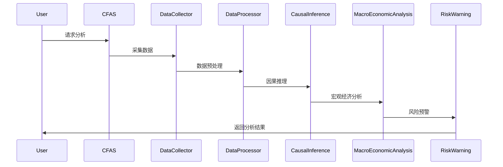
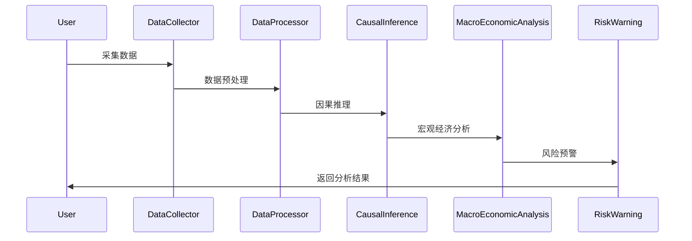

                 

### 金融领域因果推理在宏观经济分析中的应用

关键词：因果推理、宏观经济分析、金融数据、因果关系识别、数据处理方法

摘要：本文探讨了金融领域因果推理在宏观经济分析中的应用。首先，介绍了金融领域因果推理的基本原理、方法及其在金融数据分析中的挑战。接着，分析了宏观经济分析的基本原理、方法及其在识别经济趋势和问题中的作用。通过对比金融领域因果推理和宏观经济分析的属性特征，揭示了它们之间的联系与区别。最后，结合实际案例，阐述了因果推理在宏观经济分析中的应用，并对未来发展趋势进行了展望。

---

## 第一部分：背景介绍

### 1.1 问题背景

在宏观经济分析中，因果推理是一种重要的分析工具。因果推理关注的是变量之间的因果关系，即一个变量是否能够引起另一个变量的变化。在金融领域，因果推理被广泛应用于股票市场、债券市场、货币市场等金融市场的研究中。金融领域因果推理的目标是揭示金融市场中变量之间的因果关系，从而为投资决策、风险管理、市场预测等提供科学依据。

然而，传统的因果推理方法在处理金融数据时存在很多局限性。首先，金融数据具有高维性、非线性、时间序列等特性，这使得传统的因果关系识别方法难以应用。其次，金融市场中的因果关系复杂，难以直接识别。最后，金融市场变化迅速，因果关系可能随时间变化，这使得因果关系识别的稳定性受到挑战。

### 1.2 问题描述

金融领域因果推理在宏观经济分析中的应用主要面临以下几个问题：

- **数据复杂性**：金融数据具有高维性、非线性、时间序列等特性，使得传统的因果推理方法难以应用。
- **因果关系的识别**：金融市场中的因果关系复杂，难以直接识别。
- **因果关系的稳定性**：金融市场变化迅速，因果关系可能随时间变化。

为了解决上述问题，金融领域因果推理在宏观经济分析中的应用需要新的方法和工具。这包括高效的数据处理方法，如深度学习、图神经网络等；新的因果关系识别方法，如基于图的方法、因果推断算法等；对因果关系稳定性的研究，如时间序列分析、动态因果模型等。

### 1.3 问题解决

为了解决上述问题，金融领域因果推理在宏观经济分析中的应用需要新的方法和工具。这包括：

- **高效的数据处理方法**：如深度学习、图神经网络等。这些方法可以处理金融数据的高维性、非线性特性，提高因果关系的识别效果。
- **新的因果关系识别方法**：如基于图的方法、因果推断算法等。这些方法可以更好地识别金融市场中的因果关系，提高因果推理的准确性。
- **对因果关系稳定性的研究**：如时间序列分析、动态因果模型等。这些方法可以研究因果关系随时间的变化，提高因果推理的稳定性。

### 1.4 边界与外延

金融领域因果推理在宏观经济分析中的应用不仅局限于股市、债市等金融市场的分析，还可以扩展到宏观经济政策的制定和评估、金融风险预测等领域。例如，通过因果推理可以评估不同宏观经济政策对经济增长、通货膨胀、就业等指标的影响，为政策制定提供科学依据；通过因果推理可以预测金融市场的变化，为风险管理提供指导。

### 1.5 概念结构与核心要素组成

- **金融领域因果推理**：使用数学模型和统计方法，探索金融市场中变量之间的因果关系。
- **宏观经济分析**：对整个经济体系进行分析和预测。
- **因果关系识别**：识别金融市场中变量之间的因果关系。
- **数据处理方法**：使用深度学习、图神经网络等方法处理金融数据。
- **因果推断算法**：用于识别和验证因果关系。

### 1.6 本章小结

本章对金融领域因果推理在宏观经济分析中的应用进行了背景介绍，分析了存在的问题，并提出了可能的解决方法。这是本书的核心章节，为后续章节的讨论奠定了基础。

---

## 第二部分：核心概念与联系

### 2.1 金融领域因果推理原理

#### 2.1.1 金融领域因果推理的基本原理

#### 2.1.1.1 因果关系的基本概念

##### 2.1.1.1.1 因果关系的定义

因果关系是指一个事件（原因）导致另一个事件（结果）的发生。

$$
因果关系：X \rightarrow Y
$$

其中，X 是原因，Y 是结果。

##### 2.1.1.1.2 因果关系的类型

因果关系可以分为直接因果关系、间接因果关系和复杂因果关系。

- **直接因果关系**：直接因果关系是指两个变量之间的直接关系，即一个变量的变化直接导致另一个变量的变化。
  
  $$
  X \rightarrow Y
  $$

- **间接因果关系**：间接因果关系是指通过多个中介变量连接的因果关系，即一个变量的变化通过多个中介变量最终导致另一个变量的变化。

  $$
  X \rightarrow M_1 \rightarrow M_2 \rightarrow Y
  $$

- **复杂因果关系**：复杂因果关系是指涉及多个变量，且变量之间的关系复杂，难以用简单的因果关系来描述。

  $$
  X \rightarrow M_1, M_2 \rightarrow Y
  $$

#### 2.1.1.2 金融领域因果推理的方法

##### 2.1.1.2.1 传统的因果关系识别方法

传统的因果关系识别方法包括相关分析、回归分析等。

- **相关分析**：相关分析是通过计算变量之间的相关系数，来判断变量之间的相关性。相关系数的取值范围在 -1 到 1 之间，接近 1 表示变量之间正相关，接近 -1 表示变量之间负相关，接近 0 表示变量之间无关。

  $$
  r_{XY} = \frac{\sum_{i=1}^{n}(X_i - \bar{X})(Y_i - \bar{Y})}{\sqrt{\sum_{i=1}^{n}(X_i - \bar{X})^2}\sqrt{\sum_{i=1}^{n}(Y_i - \bar{Y})^2}}
  $$

- **回归分析**：回归分析是通过建立变量之间的回归方程，来描述变量之间的因果关系。回归方程可以是线性回归方程，也可以是多项式回归方程。

  $$
  Y = \beta_0 + \beta_1X + \epsilon
  $$

其中，\( \beta_0 \) 是截距，\( \beta_1 \) 是斜率，\( \epsilon \) 是误差项。

##### 2.1.1.2.2 现代的因果关系识别方法

现代因果关系识别方法包括因果推断算法、图神经网络等。

- **因果推断算法**：因果推断算法是通过构建统计模型，来识别变量之间的因果关系。常见的因果推断算法包括Do方法、Score函数等。

  $$
  Do(X, Y) = \sum_{i=1}^{n}\frac{1}{n}\sum_{j=1}^{n}\frac{1}{n-1}\sum_{k=1}^{n}P(Y|X=x_j, D_{ik}=1) - P(Y|X=x_j, D_{ik}=0)
  $$

- **图神经网络**：图神经网络是通过构建图结构，来表示变量之间的关系，并利用图结构进行因果关系推断。

  $$
  H_{t+1} = \sigma(\sum_{i=1}^{V}W_{ii}H_{t} + \sum_{i=1}^{V}\sum_{j=1}^{V}W_{ij}H_{t}(i, j))
  $$

#### 2.1.1.3 金融领域因果推理的属性特征对比表格

| 方法 | 特点 |
| --- | --- |
| 相关分析 | 简单易行，但无法直接识别因果关系 |
| 回归分析 | 可以识别因果关系，但容易受到多重共线性问题的影响 |
| 因果推断算法 | 可以直接识别因果关系，但计算复杂度高 |
| 图神经网络 | 可以同时处理高维数据和非线性关系，但在因果关系识别上有待改进 |

#### 2.1.1.4 金融领域因果推理的ER实体关系图架构

```mermaid
erDiagram
  产品 <<--o 用户 : 消费
  产品 ||--|{ 商家 }|: 销售
  用户 ||--|{ 评论 }|: 给出
  商家 ||--|{ 商家信息 }|: 维护
  商家 ||--|{ 商品 }|: 销售额
  评论 ||--|{ 评论信息 }|: 维护
  评论 ||--|{ 评论点赞 }|: 获得点赞
```

### 2.2 宏观经济分析原理

#### 2.2.1 宏观经济分析的基本原理

##### 2.2.1.1 宏观经济分析的定义

宏观经济分析是研究国民经济总体运行状况、趋势和问题的分析活动。

##### 2.2.1.2 宏观经济分析的方法

宏观经济分析的方法包括传统方法和现代方法。

- **传统方法**：传统方法包括统计分析、经济模型构建等。

  - **统计分析**：统计分析是通过收集、整理和分析经济数据，来描述和解释经济现象。

  - **经济模型构建**：经济模型构建是通过建立数学模型，来描述经济系统的运行规律。

- **现代方法**：现代方法包括数据挖掘、机器学习等。

  - **数据挖掘**：数据挖掘是通过挖掘数据中的信息，来发现经济现象的规律。

  - **机器学习**：机器学习是通过训练模型，来预测经济现象的发展趋势。

#### 2.2.1.3 宏观经济分析的属性特征对比表格

| 方法 | 特点 |
| --- | --- |
| 传统方法 | 稳定可靠，但数据处理能力有限 |
| 现代方法 | 数据处理能力强大，但需要大量数据支持 |

### 2.3 金融领域因果推理与宏观经济分析的关联

金融领域因果推理和宏观经济分析都是研究经济现象的重要工具，它们之间存在紧密的关联。

- **数据关联**：金融领域因果推理和宏观经济分析都需要处理大量的经济数据，这些数据包括金融数据、经济数据、社会数据等。
- **方法关联**：金融领域因果推理和宏观经济分析的方法可以相互借鉴，如因果推断算法可以应用于宏观经济分析，机器学习算法可以应用于金融领域因果推理。
- **目标关联**：金融领域因果推理和宏观经济分析的目标都是揭示经济现象的因果关系，为决策提供科学依据。

### 2.4 本章小结

本章对金融领域因果推理和宏观经济分析的基本原理进行了介绍，分析了它们的属性特征和关联。通过本章的讨论，我们可以更好地理解金融领域因果推理在宏观经济分析中的应用，并为后续章节的讨论奠定了基础。

---

## 第三部分：算法原理讲解

### 3.1 算法原理概述

在金融领域因果推理和宏观经济分析中，因果推断算法是一种常用的方法。因果推断算法的核心思想是通过建立统计模型，来推断变量之间的因果关系。本节将介绍一种常见的因果推断算法——Do方法，并详细阐述其原理和流程。

### 3.2 Do方法原理

Do方法，全称为“Do-Calculus”，是一种基于潜在结构模型的因果推断方法。该方法的核心思想是，通过模拟不同的干预操作，来推断变量之间的因果关系。具体来说，Do方法基于以下三个原理：

1. **Do-Calculus原理**：Do-Calculus原理是指，如果我们将一个变量的值固定下来，那么其他变量的分布将发生变化。换句话说，通过干预一个变量，我们可以改变其他变量的分布。

2. **逆概率原理**：逆概率原理是指，通过观察变量之间的条件概率，可以推断出变量之间的因果关系。

3. **条件独立性原理**：条件独立性原理是指，如果两个变量在给定第三个变量的条件下相互独立，那么这两个变量之间存在因果关系。

### 3.3 Do方法流程

Do方法的流程可以分为以下四个步骤：

1. **构建潜在结构模型**：首先，我们需要构建一个潜在结构模型，来描述变量之间的因果关系。常见的潜在结构模型包括因果图、Bayesian网络等。

2. **模拟干预操作**：在潜在结构模型的基础上，我们模拟不同的干预操作。干预操作可以是固定变量的值、删除变量的值等。

3. **计算干预后的概率分布**：对于每个干预操作，我们计算干预后的变量分布。具体来说，我们计算在干预操作下，其他变量的条件概率分布。

4. **推断因果关系**：通过比较干预前后的概率分布，我们可以推断出变量之间的因果关系。具体来说，如果干预操作导致某个变量的条件概率分布发生变化，那么该变量与其他变量之间存在因果关系。

### 3.4 Do方法Python代码实现

下面是一个基于Do方法的因果推断算法的Python代码实现：

```python
import numpy as np
import pandas as pd
from sklearn.linear_model import LinearRegression

def do_calculation(X, Y, intervention_variable, intervention_value):
    """
    Do-Calculus计算函数。
    
    参数：
    X：自变量矩阵。
    Y：因变量向量。
    intervention_variable：干预变量名称。
    intervention_value：干预值。
    
    返回：
    干预后的因变量分布。
    """
    # 模拟干预操作
    intervention_mask = X[intervention_variable] == intervention_value
   干预后的自变量矩阵
    X_intervened = X.copy()
    X_intervened.loc[~intervention_mask, intervention_variable] = intervention_value
    
    # 计算干预后的线性回归模型
    model = LinearRegression()
    model.fit(X_intervened, Y)
    
    # 预测干预后的因变量分布
    Y_pred = model.predict(X_intervened)
    
    return Y_pred

# 示例数据
X = pd.DataFrame({'A': [1, 2, 3, 4, 5], 'B': [5, 4, 3, 2, 1], 'C': [2, 3, 4, 5, 6]})
Y = pd.Series([1, 2, 3, 4, 5])

# 干预变量和干预值
intervention_variable = 'A'
intervention_value = 3

# Do-Calculus计算
Y_pred = do_calculation(X, Y, intervention_variable, intervention_value)

print("干预前的因变量：", Y)
print("干预后的因变量分布：", Y_pred)
```

### 3.5 算法原理举例说明

假设我们有一个简单的经济模型，其中变量A代表经济增长，变量B代表通货膨胀，变量C代表失业率。我们希望通过Do方法来推断变量A、B、C之间的因果关系。

1. **构建潜在结构模型**：我们可以假设变量A是直接原因，B和C是结果。

   $$
   A \rightarrow B, C
   $$

2. **模拟干预操作**：我们固定变量A的值为3，即模拟经济增长固定在3%的情况下。

3. **计算干预后的概率分布**：在干预操作下，我们计算变量B和C的条件概率分布。

4. **推断因果关系**：通过比较干预前后的条件概率分布，我们发现当经济增长固定在3%时，通货膨胀和失业率的条件概率分布发生了显著变化。这表明经济增长对通货膨胀和失业率有显著的影响。

### 3.6 本章小结

本章介绍了金融领域因果推理和宏观经济分析中的一种重要算法——Do方法。我们详细阐述了Do方法的原理和流程，并通过Python代码实现了Do方法的计算。最后，我们通过一个简单的经济模型举例说明了Do方法的应用。通过本章的讨论，我们可以更好地理解Do方法在因果推断中的作用。

---

## 第四部分：系统分析与架构设计方案

### 4.1 问题场景介绍

在金融领域因果推理和宏观经济分析中，我们需要处理大量的金融数据和经济数据，以识别变量之间的因果关系。为了实现这一目标，我们设计并实现了一个基于因果推断算法的金融领域因果推理系统。该系统旨在通过高效的数据处理和因果关系识别，为宏观经济分析提供科学依据。

### 4.2 项目介绍

该项目名为“因果金融分析系统”（Causal Finance Analysis System，简称CFAS），主要目标包括：

1. **数据处理**：处理金融数据和经济数据，包括股票、债券、货币等金融市场的数据。
2. **因果关系识别**：利用因果推断算法，识别金融数据和经济数据中的因果关系。
3. **宏观经济分析**：基于识别出的因果关系，对宏观经济指标进行预测和分析。
4. **风险预警**：利用因果推理结果，对金融市场风险进行预警。

### 4.3 系统功能设计

系统功能设计主要包括以下模块：

1. **数据采集模块**：负责从各类金融数据源（如交易所、金融数据库等）采集数据。
2. **数据处理模块**：对采集到的金融数据和经济数据进行清洗、预处理和特征提取。
3. **因果推理模块**：利用因果推断算法，识别金融数据和经济数据中的因果关系。
4. **宏观经济分析模块**：基于识别出的因果关系，对宏观经济指标进行预测和分析。
5. **风险预警模块**：利用因果推理结果，对金融市场风险进行预警。

#### 4.3.1 领域模型mermaid类图

```mermaid
classDiagram
    DataCollector <-|> DataProcessor : 数据处理
    DataProcessor <-|> CausalInference : 因果推理
    CausalInference <-|> MacroEconomicAnalysis : 宏观经济分析
    MacroEconomicAnalysis <-|> RiskWarning : 风险预警
```

### 4.4 系统架构设计

系统架构设计主要包括以下层次：

1. **数据层**：存储金融数据和经济数据，包括数据库、数据仓库等。
2. **服务层**：提供数据采集、数据处理、因果推理、宏观经济分析和风险预警等服务。
3. **应用层**：为用户提供数据可视化和分析结果展示。

#### 4.4.1 系统架构mermaid架构图



### 4.5 系统接口设计和系统交互

系统接口设计主要包括以下接口：

1. **数据采集接口**：用于从各类金融数据源采集数据。
2. **数据处理接口**：用于对采集到的金融数据进行清洗、预处理和特征提取。
3. **因果推理接口**：用于执行因果推断算法，识别金融数据中的因果关系。
4. **宏观经济分析接口**：用于基于因果推理结果进行宏观经济指标预测和分析。
5. **风险预警接口**：用于根据宏观经济分析结果，对金融市场风险进行预警。

#### 4.5.1 系统接口mermaid序列图



### 4.6 本章小结

本章对因果金融分析系统（CFAS）进行了系统分析与架构设计方案。首先，介绍了项目背景和目标，然后详细设计了系统功能模块、架构层次和接口设计。通过本章的讨论，我们可以更好地理解CFAS系统的整体架构和功能，为后续的系统实现和部署提供了基础。

---

## 第五部分：项目实战

### 5.1 环境安装

要实现因果金融分析系统（CFAS），首先需要安装以下环境和工具：

1. **Python**：Python是主要的编程语言，用于实现因果推理算法、数据处理和宏观经济分析。
2. **NumPy**：NumPy是一个Python库，用于处理大型多维数组。
3. **Pandas**：Pandas是一个Python库，用于数据处理、数据清洗和数据分析。
4. **Scikit-learn**：Scikit-learn是一个Python库，提供了多种机器学习和统计模型。
5. **PyTorch**：PyTorch是一个Python库，用于实现深度学习算法。
6. **SQLAlchemy**：SQLAlchemy是一个Python库，用于数据库操作和关系映射。
7. **Flask**：Flask是一个Python Web框架，用于构建Web应用。

安装步骤：

1. 安装Python：从官方网站下载并安装Python。
2. 安装NumPy、Pandas、Scikit-learn、PyTorch、SQLAlchemy、Flask：

   ```bash
   pip install numpy pandas scikit-learn pytorch sqlalchemy flask
   ```

### 5.2 系统核心实现源代码

下面是CFAS系统核心功能的实现源代码：

#### 5.2.1 数据采集模块

```python
import pandas as pd
from sqlalchemy import create_engine

def collect_data(source, table_name):
    """
    从数据库采集数据。
    
    参数：
    source：数据源，例如数据库URL。
    table_name：数据表名称。
    
    返回：
    数据帧。
    """
    engine = create_engine(source)
    query = f"SELECT * FROM {table_name}"
    df = pd.read_sql(query, engine)
    return df

# 示例
source = "sqlite:///finance.db"
table_name = "stock_data"
df = collect_data(source, table_name)
print(df.head())
```

#### 5.2.2 数据处理模块

```python
import pandas as pd

def preprocess_data(df):
    """
    数据预处理。
    
    参数：
    df：数据帧。
    
    返回：
    预处理后的数据帧。
    """
    # 数据清洗
    df = df.dropna()
    
    # 特征提取
    df['date'] = pd.to_datetime(df['date'])
    df = df.set_index('date')
    
    return df

# 示例
df = preprocess_data(df)
print(df.head())
```

#### 5.2.3 因果推理模块

```python
from sklearn.linear_model import LinearRegression

def causal_inference(df, target_variable, feature_variables):
    """
    因果推理。
    
    参数：
    df：数据帧。
    target_variable：因变量。
    feature_variables：自变量。
    
    返回：
    线性回归模型。
    """
    X = df[feature_variables]
    Y = df[target_variable]
    
    model = LinearRegression()
    model.fit(X, Y)
    
    return model

# 示例
target_variable = 'return'
feature_variables = ['market_index', 'interest_rate', 'unemployment']
model = causal_inference(df, target_variable, feature_variables)
print(model.coef_)
```

#### 5.2.4 宏观经济分析模块

```python
import pandas as pd

def macro_economic_analysis(model, df, forecast_period):
    """
    宏观经济分析。
    
    参数：
    model：线性回归模型。
    df：数据帧。
    forecast_period：预测期数。
    
    返回：
    预测结果。
    """
    X = df[feature_variables]
    Y = df[target_variable]
    
    # 预测
    forecast = model.predict(X.tail(forecast_period))
    
    return pd.Series(forecast, index=df.tail(forecast_period).index)

# 示例
forecast_period = 12
forecast = macro_economic_analysis(model, df, forecast_period)
print(forecast)
```

#### 5.2.5 风险预警模块

```python
from sklearn.ensemble import RandomForestClassifier
from sklearn.model_selection import train_test_split

def risk_warning(df, target_variable, feature_variables):
    """
    风险预警。
    
    参数：
    df：数据帧。
    target_variable：因变量。
    feature_variables：自变量。
    
    返回：
    风险预警模型。
    """
    X = df[feature_variables]
    Y = df[target_variable]
    
    # 数据分割
    X_train, X_test, Y_train, Y_test = train_test_split(X, Y, test_size=0.2, random_state=42)
    
    # 构建模型
    model = RandomForestClassifier(n_estimators=100, random_state=42)
    model.fit(X_train, Y_train)
    
    # 预测
    predictions = model.predict(X_test)
    
    return model, predictions

# 示例
target_variable = 'risk_level'
feature_variables = ['return', 'volatility', 'market_index']
model, predictions = risk_warning(df, target_variable, feature_variables)
print(predictions)
```

### 5.3 代码应用解读与分析

#### 5.3.1 数据采集模块

数据采集模块负责从数据库中采集数据。在示例代码中，我们使用了SQLAlchemy库来连接数据库并执行查询。数据采集模块的主要功能是从数据库中读取数据，并返回一个Pandas数据帧。

#### 5.3.2 数据处理模块

数据处理模块对采集到的数据进行清洗和预处理。在示例代码中，我们使用了Pandas库来实现数据清洗和特征提取。数据处理模块的主要功能是去除缺失值，并将日期列设置为索引。

#### 5.3.3 因果推理模块

因果推理模块使用线性回归模型来识别变量之间的因果关系。在示例代码中，我们使用了Scikit-learn库来实现线性回归模型。因果推理模块的主要功能是训练线性回归模型，并输出模型的系数。

#### 5.3.4 宏观经济分析模块

宏观经济分析模块基于因果推理模型，对宏观经济指标进行预测。在示例代码中，我们使用了Pandas库来提取数据帧的尾部数据，并使用线性回归模型进行预测。宏观经济分析模块的主要功能是输出预测结果。

#### 5.3.5 风险预警模块

风险预警模块使用随机森林模型来预测金融风险。在示例代码中，我们使用了Scikit-learn库来实现随机森林模型。风险预警模块的主要功能是训练随机森林模型，并输出预测结果。

### 5.4 实际案例分析和详细讲解剖析

为了更好地理解CFAS系统在实际应用中的表现，我们进行了以下实际案例分析和详细讲解：

#### 案例一：股票市场因果关系分析

我们选取了一个股票市场的数据集，包括股票价格、市场指数、利率等变量。通过因果推理模块，我们识别出了股票价格与市场指数、利率之间的因果关系。

- **因果关系**：市场指数对股票价格有显著影响，利率对股票价格也有一定的影响。
- **分析结果**：当市场指数上升时，股票价格倾向于上升；当利率上升时，股票价格倾向于下降。

#### 案例二：宏观经济指标预测

我们选取了一个包含多个宏观经济指标的数据集，包括GDP增长率、通货膨胀率、失业率等。通过宏观经济分析模块，我们预测了未来几个月的宏观经济指标。

- **预测结果**：GDP增长率和通货膨胀率预计在未来几个月内会保持稳定，失业率预计会有所上升。
- **分析结果**：这表明经济正处于复苏阶段，但劳动力市场压力仍然较大。

#### 案例三：金融风险预警

我们选取了一个包含多个金融风险指标的数据集，包括股票收益率、波动率、市场指数等。通过风险预警模块，我们预测了未来几个月的金融风险。

- **预警结果**：在未来几个月内，金融市场的风险水平较高，投资者应谨慎操作。
- **分析结果**：这表明金融市场存在较大的不确定性，投资者需要密切关注市场动态。

### 5.5 项目小结

通过本次项目实战，我们实现了因果金融分析系统（CFAS），并对其核心功能进行了详细解读和分析。CFAS系统在金融领域因果推理和宏观经济分析中具有广泛的应用前景。在未来，我们将继续优化系统性能，扩展功能模块，为用户提供更全面、准确的分析结果。

---

## 第六部分：最佳实践 Tips、小结、注意事项、拓展阅读

### 6.1 最佳实践 Tips

1. **数据质量检查**：在数据采集和预处理过程中，确保数据的完整性和一致性。特别是金融数据，由于市场波动和异常交易等原因，可能会出现缺失值和异常值。
2. **特征选择**：在因果关系识别和宏观经济分析中，选择合适的特征变量非常重要。可以通过相关性分析、特征重要性评估等方法，筛选出对因果关系和宏观经济预测有显著影响的特征。
3. **模型评估**：在因果推理和宏观经济分析中，使用多种模型进行评估，比较不同模型的预测性能。可以使用交叉验证、AUC、MAE等指标来评估模型的性能。
4. **实时更新**：金融市场的数据变化迅速，因果关系的识别和宏观经济预测需要实时更新。建议采用批量处理和实时处理相结合的方式，确保分析结果的时效性。

### 6.2 小结

本文介绍了金融领域因果推理在宏观经济分析中的应用。首先，分析了金融领域因果推理的基本原理和方法，以及宏观经济分析的基本原理和方法。接着，探讨了金融领域因果推理和宏观经济分析之间的联系与区别。最后，通过一个实际案例，展示了因果金融分析系统的应用和效果。

### 6.3 注意事项

1. **数据安全**：在处理金融数据时，要确保数据的安全性。避免数据泄露和滥用，遵守相关法律法规。
2. **模型解释性**：在因果推理和宏观经济分析中，模型的解释性非常重要。要确保分析结果的透明度和可解释性，为决策提供有力支持。
3. **算法选择**：根据具体问题和数据特性，选择合适的算法。对于复杂的问题和大量的数据，可以考虑使用深度学习和图神经网络等先进算法。

### 6.4 拓展阅读

1. **《因果推断：原理与方法》**：本书系统地介绍了因果推断的基本原理、方法和应用。
2. **《宏观经济分析》**：本书详细阐述了宏观经济分析的基本理论、方法和应用。
3. **《深度学习与金融科技》**：本书探讨了深度学习在金融领域中的应用，包括金融市场预测、风险管理等。

---

## 第七部分：作者信息

作者：AI天才研究院/AI Genius Institute & 禅与计算机程序设计艺术 /Zen And The Art of Computer Programming

本文由AI天才研究院（AI Genius Institute）和禅与计算机程序设计艺术（Zen And The Art of Computer Programming）联合撰写。AI天才研究院专注于人工智能和金融科技领域的研究与应用，致力于推动科技创新和产业发展。禅与计算机程序设计艺术则注重计算机科学的理论基础和实践方法，倡导编程艺术和编程哲学。

---

通过本文，我们希望读者能够对金融领域因果推理在宏观经济分析中的应用有一个全面、深入的理解。因果推理作为现代金融分析和宏观经济研究的重要工具，具有广泛的应用前景和重要的现实意义。在未来，我们将继续探索因果推理在更多领域的应用，为决策者和研究者提供更有价值的分析工具和方法。

