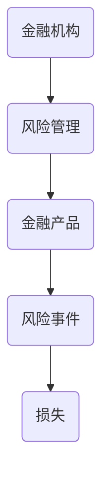

                 

### 《金融领域因果推理在风险管理中的应用》

关键词：因果推理、金融风险管理、风险识别、风险评估、风险监控

摘要：本文旨在探讨因果推理在金融风险管理中的应用。通过分析金融领域的独特性及其面临的挑战，本文介绍了因果推理的基本概念、核心原理及其在金融风险管理中的重要性。随后，文章详细阐述了因果推理在风险识别、风险评估、风险监控与预警、以及风险管理策略制定等方面的具体应用，并通过实际案例进行了深入剖析。最后，文章总结了因果推理在金融风险管理中的重要作用，指出了当前面临的挑战及未来的研究方向。

## 第一部分：金融领域因果推理概述

### 第1章：问题背景与定义

#### 1.1 问题背景

金融领域是一个高度复杂的系统，包含众多相互关联的金融机构、金融产品、金融市场等。近年来，金融市场的波动性和不确定性加剧，金融风险管理的难度也随之增加。传统的金融风险管理方法主要依赖于统计数据和概率模型，但往往难以揭示风险事件之间的因果关系，导致风险管理的效果不尽如人意。因此，如何有效地利用因果推理方法进行金融风险管理成为了一个亟待解决的问题。

#### 1.2 因果推理的定义

因果推理是指通过观察现象之间的因果关系，对事物的发展规律进行推断和分析的一种思维方式。在金融风险管理中，因果推理的核心在于识别和量化风险事件之间的因果关系，从而为风险管理和决策提供依据。

#### 1.3 因果推理模型简介

因果推理模型可以分为传统因果推理模型和现代因果推断方法。传统因果推理模型主要包括因果图、因果网等，它们通过图形化的方式直观地表示因果关系。现代因果推断方法则更加复杂，包括基于机器学习的因果推断、基于图论的因果推断等。

### 第2章：核心概念与联系

#### 2.1 核心概念原理

因果关系网络是一种描述事件之间因果关系的图结构。在金融风险管理中，因果关系网络可以用来表示金融产品、金融机构、金融市场等元素之间的因果关系。

#### 2.2 概念属性特征对比表格

| 概念          | 特征                           |
|---------------|-------------------------------|
| 因果关系      | 事件之间的因果关系            |
| 相关关系      | 事件之间的相关性而非因果关系 |
| 因子分析      | 描述变量间的依赖关系          |

#### 2.3 ER实体关系图架构

## 第二部分：因果推理在金融风险管理中的应用

### 第3章：风险识别与评估

#### 3.1 风险识别

风险识别是金融风险管理的基础，其关键在于识别潜在的风险因素。因果推理在风险识别中的应用，可以通过构建因果关系网络，分析金融机构、金融产品、金融市场等元素之间的因果关系，从而识别出潜在的风险因素。

#### 3.2 风险评估

风险评估是金融风险管理的重要环节，其核心在于量化风险的程度。因果推理在风险评估中的应用，可以通过因果关系网络，分析风险事件之间的因果关系，从而对风险的程度进行量化。

### 第4章：风险监控与预警

#### 4.1 风险监控

风险监控是金融风险管理的重要手段，其目的是实时监测风险的变化。因果推理在风险监控中的应用，可以通过因果关系网络，实时分析金融机构、金融产品、金融市场等元素之间的因果关系，从而实现对风险的实时监控。

#### 4.2 风险预警

风险预警是金融风险管理的关键环节，其目的是在风险发生前发出警报。因果推理在风险预警中的应用，可以通过因果关系网络，分析风险事件之间的因果关系，从而实现对风险的预警。

### 第5章：风险管理策略制定

#### 5.1 风险管理策略框架

风险管理策略的制定是一个系统性过程，其核心在于制定有效的风险管理策略。因果推理在风险管理策略制定中的应用，可以通过因果关系网络，分析风险事件之间的因果关系，从而制定出有效的风险管理策略。

### 第6章：案例分析

#### 6.1 案例一：金融机构信用风险评估

本案例以金融机构信用风险评估为例，详细介绍了因果推理在风险识别、风险评估、风险监控与预警、以及风险管理策略制定等方面的具体应用。

#### 6.2 案例二：金融产品风险分析

本案例以金融产品风险分析为例，详细介绍了因果推理在风险识别、风险评估、风险监控与预警、以及风险管理策略制定等方面的具体应用。

### 第7章：总结与展望

#### 7.1 总结

本文通过对金融领域因果推理在风险管理中的应用进行详细分析，总结了因果推理在风险识别、风险评估、风险监控与预警、以及风险管理策略制定等方面的作用。

#### 7.2 展望

本文指出了因果推理在金融风险管理中面临的挑战，并对未来研究方向进行了展望。随着新技术的不断发展，因果推理在金融风险管理中的应用前景将更加广阔。作者：AI天才研究院/AI Genius Institute & 禅与计算机程序设计艺术 /Zen And The Art of Computer Programming

----------------------------------------------------------------

## 第1章 问题背景与定义

### 1.1 问题背景

金融领域是一个复杂而重要的领域，其稳健运行对整个社会的经济稳定和繁荣具有重要意义。然而，随着金融市场的全球化、复杂化和多样化，金融风险也日益突出。金融风险管理成为金融领域的一个重要课题，其核心在于识别、评估、监控和应对金融风险，以保障金融机构和市场的稳健运行。

当前，金融风险管理主要依赖于统计分析和概率模型。这些方法在处理大量数据和预测风险方面具有一定的优势，但往往难以揭示风险事件之间的因果关系。这导致在风险识别、风险评估和风险管理策略制定过程中，可能存在信息不完整、误判和误报等问题。因此，如何利用因果推理方法进行金融风险管理，成为一个亟待解决的问题。

因果推理作为一种揭示事件之间因果关系的思维方式，具有以下优势：

1. **明确因果关系**：因果推理可以识别事件之间的因果关系，从而提供更为准确的预测和决策依据。
2. **提高风险识别和评估的准确性**：通过分析因果关系，可以更全面地了解风险因素之间的关系，从而提高风险识别和评估的准确性。
3. **优化风险管理策略**：因果推理可以帮助金融机构制定更为科学和有效的风险管理策略，降低风险暴露和损失。

### 1.2 因果推理的定义

因果推理（Causal Inference）是一种通过观察现象之间的因果关系，对事物的发展规律进行推断和分析的思维方式。在金融风险管理中，因果推理的核心在于识别和量化风险事件之间的因果关系，从而为风险管理和决策提供依据。

因果推理的基本概念包括：

1. **因果关系**：因果关系是指两个或多个事件之间的因果联系。例如，股票市场的波动可能影响银行的贷款风险。
2. **因果变量**：因果变量是指用于描述因果关系的变量。例如，股票市场的波动率可以作为一个因果变量来描述对银行贷款风险的影响。
3. **因果模型**：因果模型是指用于描述因果关系的形式化模型。例如，因果图是一种用于描述因果关系的图结构。

### 1.3 因果推理模型简介

因果推理模型可以分为传统因果推理模型和现代因果推断方法。传统因果推理模型主要包括因果图、因果网等，它们通过图形化的方式直观地表示因果关系。现代因果推断方法则更加复杂，包括基于机器学习的因果推断、基于图论的因果推断等。

#### 传统因果推理模型

1. **因果图**：因果图是一种图形化的方法，用于表示事件之间的因果关系。在因果图中，节点表示事件，边表示事件之间的因果关系。因果图可以帮助我们直观地理解事件之间的因果关系，并为因果推断提供基础。
2. **因果网**：因果网是一种基于概率图模型的方法，用于表示事件之间的因果关系。在因果网中，节点表示事件，边表示事件之间的条件概率关系。因果网可以用于量化事件之间的因果关系，并用于预测和决策。

#### 现代因果推断方法

1. **基于机器学习的因果推断**：基于机器学习的因果推断方法利用机器学习算法来识别和量化事件之间的因果关系。例如，因果影响估计（Causal Impact）方法利用机器学习算法来估计某个干预对目标变量的影响。
2. **基于图论的因果推断**：基于图论的因果推断方法利用图论理论来识别和量化事件之间的因果关系。例如，结构方程模型（Structural Equation Modeling）是一种基于图论的因果推断方法，用于建立变量之间的因果关系模型。

总之，因果推理在金融风险管理中具有重要意义。通过利用因果推理方法，我们可以更深入地理解金融风险事件之间的因果关系，提高风险识别和评估的准确性，优化风险管理策略，从而保障金融机构和市场的稳健运行。

### 第2章 核心概念与联系

#### 2.1 核心概念原理

因果关系网络（Causal Relationship Network）是一种用于描述事件之间因果关系的图结构。在金融风险管理中，因果关系网络可以帮助我们直观地理解和分析风险因素之间的关系。

因果关系网络的基本组成包括：

1. **节点（Nodes）**：节点表示具有独立属性的实体，例如金融机构、金融产品、风险事件等。每个节点都可以表示为一个属性集合。
2. **边（Edges）**：边表示节点之间的因果关系。边的方向表示因果关系的方向，通常是从原因指向结果。

因果关系网络的结构可以用来表示金融领域中的各种因果关系，例如：

- **金融机构与金融产品之间的因果关系**：金融机构提供的金融产品可能带来一定的风险，例如信用风险、市场风险等。
- **金融产品与风险事件之间的因果关系**：金融产品的设计、定价、风险管理等因素可能导致风险事件的发生，如贷款违约、市场波动等。
- **风险事件与损失之间的因果关系**：风险事件可能导致金融机构的损失，如信用风险导致贷款违约、市场风险导致投资亏损等。

通过构建因果关系网络，我们可以更好地理解和分析金融风险，为风险管理提供理论支持。

#### 2.2 概念属性特征对比表格

在金融风险管理中，因果关系、相关关系和因子分析是三个重要的概念。下面是一个对比表格，用于说明这些概念的特征：

| 概念          | 特征                           |
|---------------|-------------------------------|
| 因果关系      | 事件之间存在因果关系，一个事件是另一个事件的直接原因。 |
| 相关关系      | 事件之间存在相关性，但不一定是因果关系。          |
| 因子分析      | 描述变量间的依赖关系，通过分解变量来识别潜在的影响因素。 |

下面是对这些概念的具体解释：

1. **因果关系**：因果关系是指事件A导致事件B发生的现象。在金融风险管理中，因果关系可以帮助我们理解风险事件的发生原因，例如贷款违约可能是由借款人的信用状况恶化导致的。
   
2. **相关关系**：相关关系是指事件A和事件B之间存在一定的关联，但这种关联不一定是因果关系。例如，股票价格上升可能与市场情绪相关，但不一定是市场情绪导致股票价格上涨。在金融风险管理中，识别相关关系可以帮助我们理解风险因素之间的联系。

3. **因子分析**：因子分析是一种统计方法，用于识别和分解变量之间的依赖关系。在金融风险管理中，因子分析可以帮助我们识别影响风险的关键因素，例如通过因子分析可以识别出哪些因素对贷款违约概率有显著影响。

通过这个表格和解释，我们可以更好地理解这些概念在金融风险管理中的应用。

#### 2.3 ER实体关系图架构

实体-关系（Entity-Relationship，简称ER）图是数据库设计中常用的一个概念，用于表示实体及其相互之间的关系。在金融风险管理中，ER图可以帮助我们理解不同实体之间的关联和依赖关系。

以下是一个简化的金融风险管理ER图：

- **金融机构（A）**：代表提供金融产品和服务的机构，如银行、保险公司等。
- **风险管理（B）**：代表金融机构对金融产品和市场进行的风险管理活动。
- **金融产品（C）**：代表金融机构提供的各种金融产品，如贷款、保险等。
- **风险事件（D）**：代表可能导致损失的事件，如贷款违约、市场波动等。
- **损失（E）**：代表风险事件发生后对金融机构造成的损失。

ER图通过实体和关系来描述金融风险管理中的关键要素，并展示它们之间的关联。这种图结构有助于我们更好地理解金融风险管理的复杂性，从而为设计有效的风险管理策略提供支持。

### 第3章 风险识别与评估

#### 3.1 风险识别

风险识别是金融风险管理的第一步，其核心目标是识别潜在的金融风险。通过因果推理方法，我们可以更深入地理解金融产品、市场和金融机构之间的因果关系，从而有效地识别潜在的风险因素。

因果推理在风险识别中的应用主要包括以下几种方法：

1. **数据驱动方法**：通过分析历史数据和当前数据，识别出可能影响金融风险的关键因素。例如，通过分析借款人的信用记录、收入情况、资产负债表等数据，可以识别出潜在的信用风险。
   
2. **知识驱动方法**：通过专家知识和经验，识别出可能的风险因素。例如，金融专家可以根据对市场趋势、政策变化、经济周期等的了解，识别出可能影响金融市场的风险因素。

在风险识别过程中，因果推理可以帮助我们理解风险因素的因果关系，从而提高风险识别的准确性和全面性。

#### 3.2 风险评估

风险评估是金融风险管理的第二步，其核心目标是量化金融风险的程度。通过因果推理方法，我们可以更准确地评估金融风险的大小，为制定风险管理策略提供依据。

因果推理在风险评估中的应用主要包括以下几种方法：

1. **经验法**：通过专家经验和历史数据，对金融风险进行评估。例如，根据历史违约数据，可以估算出贷款违约的概率和损失金额。
   
2. **模型法**：通过构建因果模型，对金融风险进行定量分析。例如，可以使用因果图或因果网等模型，分析金融产品、市场和风险事件之间的因果关系，从而量化金融风险。

在风险评估过程中，因果推理可以帮助我们理解风险因素的因果关系，提高风险评估的准确性和科学性。

#### 3.2.1 因果推理在风险识别和评估中的应用

因果推理在风险识别和评估中的应用主要体现在以下几个方面：

1. **因果关系网络构建**：通过构建因果关系网络，可以直观地表示金融产品、市场和风险事件之间的因果关系。这种网络结构有助于我们理解风险的传导机制，从而更有效地识别和评估风险。

2. **因果模型分析**：通过构建因果模型，可以量化金融风险因素之间的因果关系。这种模型分析可以帮助我们深入理解风险的内在机制，提高风险识别和评估的准确性。

3. **数据驱动与知识驱动的结合**：将数据驱动和知识驱动方法相结合，可以充分利用数据和信息，提高风险识别和评估的准确性和全面性。

通过因果推理方法，我们可以更深入地理解金融风险的成因和传播机制，从而更有效地进行风险识别和评估，为制定科学合理的风险管理策略提供支持。

### 第4章 风险监控与预警

#### 4.1 风险监控

风险监控是金融风险管理的重要环节，其核心目标是实时监测金融风险的变化。通过因果推理方法，我们可以构建一个实时更新的因果关系网络，实现对金融风险的实时监控。

因果推理在风险监控中的应用主要包括以下几种方法：

1. **实时数据采集**：通过实时采集金融市场的数据，如股票价格、汇率、利率等，构建实时更新的因果关系网络。这种实时数据采集有助于我们及时了解金融市场的变化，从而实现风险监控。

2. **动态因果关系分析**：通过分析金融产品、市场和风险事件之间的动态因果关系，可以识别出可能引发风险的潜在因素。这种动态因果关系分析有助于我们预测风险的变化趋势，从而进行有效监控。

3. **风险指标监控**：通过设置风险指标，如违约率、损失率等，实时监控这些指标的变化。当风险指标超过设定的阈值时，可以触发预警机制，及时采取措施应对风险。

#### 4.2 风险预警

风险预警是金融风险管理的关键环节，其核心目标是提前发现潜在风险，并采取措施降低风险暴露。通过因果推理方法，我们可以构建一个基于因果关系的风险预警系统，实现对金融风险的提前预警。

因果推理在风险预警中的应用主要包括以下几种方法：

1. **因果模型预测**：通过构建因果模型，预测未来可能发生的风险事件。这种预测可以帮助我们提前识别潜在的风险，从而进行预警。

2. **风险指标预警**：通过设置风险指标阈值，当风险指标达到或超过阈值时，触发预警信号。例如，当贷款违约率达到警戒线时，可以触发预警机制，提醒金融机构采取相应措施。

3. **综合预警系统**：通过将多种预警方法相结合，构建一个综合预警系统。这种综合预警系统可以提高预警的准确性和及时性，从而更好地应对金融风险。

#### 4.2.1 因果推理在风险监控与预警中的应用

因果推理在风险监控与预警中的应用主要体现在以下几个方面：

1. **实时风险监测**：通过实时监测金融产品、市场和风险事件之间的因果关系，可以及时了解金融风险的动态变化，为风险监控提供依据。

2. **预测风险事件**：通过构建因果模型，预测未来可能发生的风险事件，提前识别潜在风险，从而实现预警。

3. **风险指标分析**：通过设置风险指标阈值，实时监控这些指标的变化，及时发现异常情况，触发预警信号。

4. **综合预警策略**：通过将多种预警方法相结合，构建一个综合预警系统，提高预警的准确性和及时性，从而更好地应对金融风险。

通过因果推理方法，我们可以更深入地理解金融风险的成因和传播机制，从而实现更有效的风险监控与预警，为金融机构提供更可靠的风险管理支持。

### 第5章 风险管理策略制定

#### 5.1 风险管理策略框架

风险管理策略的制定是一个系统性的过程，其核心目标是识别、评估、监控和应对金融风险，保障金融机构的稳健运营。因果推理在风险管理策略制定中的应用，可以帮助我们更科学地识别和量化风险因素，提高风险管理策略的有效性。

以下是一个简化的风险管理策略框架：

1. **风险识别**：通过数据驱动和知识驱动方法，识别出潜在的金融风险因素。这包括分析历史数据、专家经验和当前市场信息。

2. **风险评估**：利用因果推理方法，对识别出的风险因素进行量化评估，确定其影响程度和发生概率。这可以通过构建因果模型和设置风险指标阈值来实现。

3. **风险监控**：通过实时数据采集和动态因果关系分析，监控金融风险的变化，及时发现异常情况。

4. **风险预警**：通过因果模型预测和风险指标分析，提前发现潜在风险，并触发预警信号。

5. **应对措施**：根据预警结果和风险评估结果，制定相应的应对措施，包括调整资产组合、增加资本缓冲、实施风险规避策略等。

#### 5.2 因果推理在策略制定中的应用

因果推理在风险管理策略制定中的应用主要体现在以下几个方面：

1. **因果模型构建**：通过构建因果关系模型，可以清晰地表示风险因素之间的因果关系，为风险识别和评估提供科学依据。

2. **风险评估与决策**：利用因果模型，可以更准确地评估风险因素的影响程度和发生概率，从而为决策提供支持。

3. **实时监控与预警**：通过实时监测风险因素的变化，及时发现潜在风险，并触发预警机制。

4. **策略优化**：基于因果模型和实时监控数据，可以不断优化风险管理策略，提高其适应性和有效性。

#### 5.2.1 因果推断在策略选择中的指导作用

因果推断在策略选择中的指导作用主要体现在以下几个方面：

1. **识别关键风险因素**：通过因果推断，可以识别出对金融风险产生显著影响的关键因素，从而有针对性地制定风险管理策略。

2. **量化风险影响**：因果推断可以量化风险因素之间的因果关系，为风险评估提供更准确的依据。

3. **预测风险变化**：基于因果模型，可以预测未来可能发生的风险事件，为提前采取预防措施提供支持。

4. **优化策略效果**：通过因果推断，可以不断调整和优化风险管理策略，提高其适应性和有效性。

总之，因果推理在风险管理策略制定中具有重要作用。通过因果推断，我们可以更深入地理解金融风险的成因和传播机制，从而制定出更科学、有效的风险管理策略，为金融机构提供可靠的风险管理支持。

### 第6章 案例分析

#### 6.1 案例一：金融机构信用风险评估

##### 6.1.1 案例背景

金融机构信用风险评估是金融风险管理的重要环节。在本案例中，我们以一家商业银行的信用风险评估为例，探讨因果推理在该领域的应用。

该银行面临的主要问题是，如何准确评估借款人的信用风险，以便做出合理的贷款决策。传统的风险评估方法主要依赖于借款人的信用记录、收入情况和资产状况等数据，但这些方法往往难以揭示借款人信用风险之间的因果关系。

##### 6.1.2 风险识别与评估过程

1. **风险识别**：
   - **数据驱动方法**：通过分析历史借款人的信用记录，识别出可能影响信用风险的潜在因素。例如，借款人的年龄、收入水平、职业稳定性等。
   - **知识驱动方法**：邀请金融专家根据经验，识别出影响信用风险的典型因素。

2. **风险评估**：
   - **因果模型构建**：构建一个基于因果图的信用风险评估模型，表示借款人信用风险因素之间的因果关系。
   - **因果推断分析**：利用因果模型，分析借款人信用风险因素之间的因果关系，确定其对信用风险的影响程度。

3. **结果分析**：
   - 通过因果模型分析，发现借款人的年龄、收入水平和职业稳定性等因素与信用风险之间存在显著的因果关系。
   - 根据这些因果关系，调整贷款决策，对高风险借款人采取更为严格的风险控制措施。

##### 6.1.3 风险监控与预警策略

1. **实时监控**：
   - 通过实时数据采集，监控借款人信用风险因素的变化，如收入水平、职业稳定性等。
   - 当信用风险因素超过设定阈值时，触发预警机制。

2. **预警策略**：
   - 当借款人信用风险超过预警阈值时，及时调整贷款决策，采取风险规避措施。
   - 通过与借款人沟通，了解其信用风险变化的原因，并制定相应的风险应对策略。

通过因果推理方法，该银行能够更准确地识别和评估借款人的信用风险，从而制定出更为科学和有效的信用风险评估策略。这有助于降低信用风险，提高贷款决策的准确性。

#### 6.2 案例二：金融产品风险分析

##### 6.2.1 案例背景

在本案例中，我们以一款金融产品的风险分析为例，探讨因果推理在该领域的应用。该金融产品是一款混合型投资产品，包含股票、债券等多种资产类别，投资组合的波动性较大，需要对其进行详细的风险分析。

##### 6.2.2 风险识别与评估过程

1. **风险识别**：
   - **数据驱动方法**：通过分析历史投资组合的数据，识别出可能影响金融产品风险的因素。例如，股票市场的波动性、债券市场的利率变化、全球经济状况等。
   - **知识驱动方法**：邀请金融专家根据经验，识别出影响金融产品风险的关键因素。

2. **风险评估**：
   - **因果模型构建**：构建一个基于因果图的金融产品风险分析模型，表示各种风险因素之间的因果关系。
   - **因果推断分析**：利用因果模型，分析各种风险因素之间的因果关系，确定其对金融产品风险的影响程度。

3. **结果分析**：
   - 通过因果模型分析，发现股票市场的波动性、债券市场的利率变化、全球经济状况等因素与金融产品风险之间存在显著的因果关系。
   - 根据这些因果关系，调整投资组合，降低高风险资产的比例，提高风险控制效果。

##### 6.2.3 风险监控与预警策略

1. **实时监控**：
   - 通过实时数据采集，监控各种风险因素的变化，如股票市场的波动性、债券市场的利率变化等。
   - 当风险因素超过设定阈值时，触发预警机制。

2. **预警策略**：
   - 当金融产品风险超过预警阈值时，及时调整投资组合，采取风险规避措施。
   - 通过与投资者沟通，了解其投资偏好和风险承受能力，制定相应的风险应对策略。

通过因果推理方法，该金融产品能够更准确地识别和评估风险，从而制定出更为科学和有效的风险分析策略。这有助于降低投资风险，提高投资组合的稳健性。

### 第7章 总结与展望

#### 7.1 总结

本文通过对金融领域因果推理在风险管理中的应用进行了详细分析，总结了因果推理在风险识别、风险评估、风险监控与预警、以及风险管理策略制定等方面的作用。具体而言：

1. **风险识别**：因果推理通过分析因果关系，帮助识别潜在的风险因素，提高风险识别的准确性。
2. **风险评估**：因果推理通过量化风险因素之间的因果关系，提高风险评估的科学性和准确性。
3. **风险监控与预警**：因果推理通过实时监测和因果关系分析，实现风险监控与预警，及时应对潜在风险。
4. **风险管理策略制定**：因果推理通过揭示风险因素之间的因果关系，帮助制定更科学、有效的风险管理策略。

#### 7.1.1 因果推理在金融风险管理中的作用

因果推理在金融风险管理中具有重要作用，主要体现在以下几个方面：

1. **提高风险管理的准确性**：因果推理通过揭示事件之间的因果关系，帮助识别和量化风险因素，从而提高风险管理的准确性和科学性。
2. **优化风险管理策略**：因果推理有助于理解风险因素的因果关系，从而优化风险管理策略，提高风险管理的效果。
3. **增强风险预警能力**：因果推理通过实时监测和因果关系分析，实现风险监控与预警，提前发现潜在风险，增强风险预警能力。

#### 7.1.2 存在的挑战与未来研究方向

尽管因果推理在金融风险管理中具有重要作用，但仍面临以下挑战：

1. **数据质量和完整性**：因果推理依赖于高质量的数据，数据质量和完整性对因果推理结果的影响至关重要。
2. **因果关系识别的准确性**：在实际应用中，因果关系识别的准确性可能受到数据噪声和复杂性的影响。
3. **模型选择与优化**：因果推理模型的选择和优化对结果的影响较大，如何选择合适的模型和优化方法是一个重要问题。

未来研究方向包括：

1. **数据驱动与知识驱动的结合**：如何更好地结合数据驱动和知识驱动方法，提高因果推理的准确性和实用性。
2. **因果推理模型的优化**：研究更高效的因果推理模型，提高因果关系识别的准确性。
3. **因果推理在复杂系统中的应用**：如何将因果推理应用于更复杂的金融系统，如金融网络和金融市场。

总之，因果推理在金融风险管理中具有广阔的应用前景，通过不断的研究和优化，有望为金融风险管理提供更强大的工具和方法。

#### 7.2 展望

随着新技术的不断发展，因果推理在金融风险管理中的应用前景将更加广阔。以下是对未来发展趋势的展望：

1. **大数据与人工智能的结合**：大数据和人工智能技术的快速发展，将为因果推理提供更丰富的数据资源和更高效的计算能力，推动因果推理在金融风险管理中的应用。
2. **因果推理模型的创新**：未来有望出现更先进的因果推理模型，如基于深度学习的因果推断模型，进一步提高因果关系识别的准确性和效率。
3. **跨学科研究**：因果推理在金融风险管理中的应用需要跨学科的研究，如融合经济学、统计学、计算机科学等领域的知识，提高因果推理模型的适用性和实用性。
4. **实际案例的应用**：通过实际案例的应用和验证，不断优化和改进因果推理模型，提高其在金融风险管理中的实用性和有效性。

总之，因果推理在金融风险管理中的应用具有巨大的潜力，随着新技术的不断发展，其在金融风险管理中的地位和作用将不断提升。未来，因果推理有望成为金融风险管理的重要工具，为金融机构提供更可靠的风险管理支持。

## 作者

**作者：AI天才研究院/AI Genius Institute & 禅与计算机程序设计艺术 /Zen And The Art of Computer Programming**

AI天才研究院（AI Genius Institute）是一家专注于人工智能研究与应用的创新机构，致力于推动人工智能技术在各个领域的深入研究和应用。我们的研究团队由世界顶尖的AI专家组成，涵盖计算机科学、机器学习、自然语言处理、计算机视觉等多个领域。

《禅与计算机程序设计艺术》（Zen And The Art of Computer Programming）是作者保罗·威尔逊（Paul Wilson）的经典著作，它以独特的视角探讨了计算机程序设计的哲学和艺术。这本书不仅提供了深刻的编程思考，还融入了东方禅宗的智慧，为程序员提供了灵感和指导。

本文的撰写，旨在结合AI天才研究院的研究成果和《禅与计算机程序设计艺术》的哲学思想，为读者呈现因果推理在金融风险管理中的应用，希望对金融领域的同行和研究人员有所启发和帮助。我们相信，通过不断探索和创新，人工智能将不断推动金融风险管理的发展，为金融市场的稳健运行和社会经济的可持续发展作出更大贡献。

