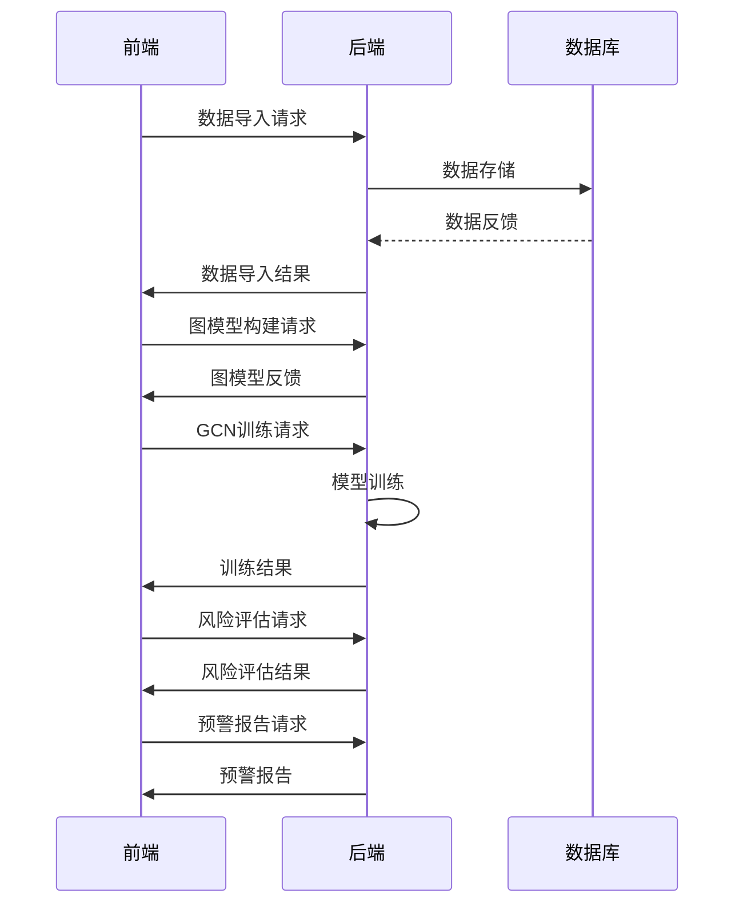
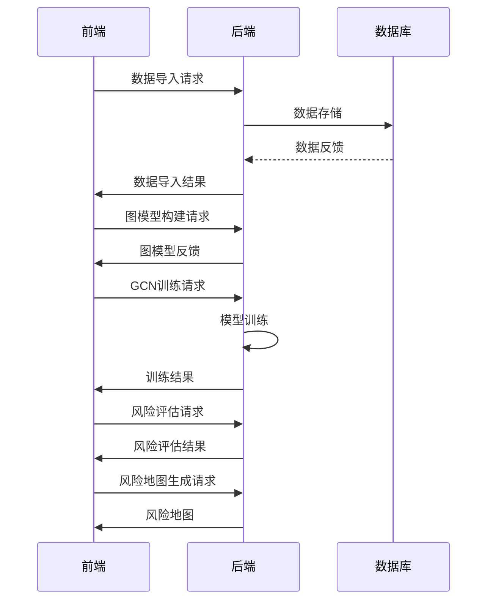

                 

### 引言与背景

**金融领域图卷积网络在全球金融网络风险评估中的应用**

在当今全球化经济快速发展的背景下，金融系统面临的复杂性和不确定性日益增加，金融网络风险评估成为金融市场健康运行的重要保障。传统的风险评估方法往往依赖于线性模型和静态数据，难以捕捉金融网络中的动态特征和复杂关系，导致评估结果不够准确和及时。因此，寻求新的风险评估方法，特别是基于深度学习的模型，成为了当前金融研究领域的热点。

**关键词：**
- 金融领域
- 图卷积网络
- 全球金融网络
- 风险评估
- 深度学习

**摘要：**
本文将探讨金融领域图卷积网络（GCN）在全球金融网络风险评估中的应用。首先，我们将介绍图卷积网络的基本原理及其在金融领域的应用潜力。随后，文章将详细阐述图卷积网络在金融风险评估中的核心概念和模型构建方法。通过具体案例分析，我们将展示图卷积网络在实际风险评估中的应用效果。最后，本文将对图卷积网络在金融领域的未来发展趋势和潜在研究方向进行展望。

**问题背景：**
全球金融网络由众多金融机构、金融产品、交易行为等组成，其复杂性和动态性使得传统的风险评估方法难以胜任。金融风险可能源自内部管理问题，也可能源自外部经济环境变化，甚至可能是由于金融网络中某些关键节点的异常行为引发的连锁反应。因此，对全球金融网络进行风险评估，不仅需要考虑个体金融机构的风险，还需要关注整个金融网络的结构和动态特征。

**图卷积网络在金融领域的重要性：**
图卷积网络（Graph Convolutional Network，GCN）是一种在图结构数据上运行的深度学习模型，通过模拟图节点的邻域信息传播过程，能够有效捕捉图中的结构和特征。在金融领域，GCN可以用于分析金融网络的结构，识别关键节点，预测市场波动，评估金融风险等。相较于传统的风险评估方法，GCN具有以下优势：

1. **处理复杂网络结构**：金融网络具有复杂的拓扑结构，传统方法难以直接处理。GCN能够有效地处理这种复杂性，为金融风险评估提供了新的思路。
2. **考虑节点间关系**：金融网络中的节点（如金融机构、金融产品）之间存在复杂的交互关系，GCN可以通过学习节点间的邻域信息，捕捉这些关系，提高风险评估的准确性。
3. **动态特性**：金融网络是动态变化的，GCN能够通过不断更新节点信息和邻域关系，适应网络的变化，提高风险评估的实时性。

**问题描述：**
金融网络风险评估面临的主要问题包括：

1. **数据质量问题**：金融数据通常具有噪声和缺失值，对数据质量的要求较高。
2. **特征提取难度**：金融网络中的特征提取是一个复杂的问题，传统方法难以有效提取出具有代表性的特征。
3. **实时性要求**：金融市场变化快速，风险评估需要具有高效的实时处理能力。
4. **风险评估范围**：传统的风险评估方法往往局限于个体金融机构，难以对整个金融网络进行全面评估。

**问题解决：**
图卷积网络（GCN）提供了一种有效的解决方案。通过以下步骤，GCN可以在金融领域实现高效的风险评估：

1. **数据预处理**：对金融数据进行清洗和预处理，包括去除噪声、填补缺失值等，为GCN的训练提供高质量的数据。
2. **图模型构建**：将金融网络表示为图模型，定义节点和边，为GCN提供输入数据。
3. **GCN模型训练**：使用图卷积网络对图模型进行训练，学习节点间的邻域关系和特征。
4. **风险评估**：利用训练好的GCN模型，对金融网络进行风险评估，识别高风险节点和区域。
5. **实时更新**：根据实时数据对GCN模型进行更新，确保风险评估的实时性和准确性。

**边界与外延：**
图卷积网络在金融领域的应用不仅限于风险评估，还可以拓展到其他方面，如：

1. **市场预测**：利用GCN对市场趋势进行分析和预测。
2. **金融欺诈检测**：通过识别金融网络中的异常节点和异常行为，检测金融欺诈。
3. **投资组合优化**：利用GCN分析金融网络中的节点关系，优化投资组合。

**概念结构与核心要素组成：**
金融领域图卷积网络的核心概念和要素包括：

1. **金融网络**：由金融机构、金融产品、交易行为等组成的复杂网络。
2. **图卷积网络（GCN）**：一种在图结构数据上运行的深度学习模型。
3. **风险评估**：对金融网络进行风险识别、评估和预警的过程。
4. **数据预处理**：对金融数据进行清洗、预处理，为GCN训练提供高质量数据。
5. **模型训练与优化**：使用GCN对金融网络进行训练，优化模型性能。

通过以上结构和核心要素的介绍，我们可以清晰地看到图卷积网络在金融领域应用的基本框架和实现路径。接下来，本文将逐步深入探讨图卷积网络的基本原理、金融网络模型构建、风险评估方法，并通过实际案例分析，展示图卷积网络在金融风险评估中的强大应用潜力。

## 第2章: 图卷积网络基础

### 2.1 图论基础

在探讨图卷积网络（GCN）在金融领域中的应用之前，我们需要了解图论的基础知识。图论是研究图及其性质的数学分支，在计算机科学、信息科学和金融工程等领域有着广泛的应用。

**图的基本定义与性质：**
图（Graph）是由节点（Node）和边（Edge）组成的数学结构，通常用G=(V, E)表示，其中V表示节点集合，E表示边集合。

1. **节点**：图中的每一个元素称为节点，可以表示为V={v1, v2, ..., vn}。
2. **边**：连接两个节点的线称为边，可以表示为E={(v1, v2), (v2, v3), ..., (vn-1, vn)}。

**图的分类：**
根据节点之间关系的不同，图可以分为以下几种类型：

1. **无向图**：边没有方向，如社交网络中的好友关系。
2. **有向图**：边有方向，如邮件网络中的邮件发送关系。
3. **简单图**：不包含自环和多重边，如交通网络。
4. **复杂图**：包含自环和多重边，如金融网络。

**图的基本操作：**
为了理解和应用图卷积网络，我们需要掌握一些基本的图操作：

1. **度（Degree）**：一个节点的度是其连接的边的数量，分为入度（Incoming Degree）和出度（Outgoing Degree）。
2. **邻接矩阵（Adjacency Matrix）**：用二维矩阵表示图，其中元素aij表示节点vi和节点vj之间是否存在边。
3. **邻接表（Adjacency List）**：用列表表示图，每个节点对应一个列表，列表中包含其相邻节点的索引。
4. **路径（Path）**：连接两个节点的序列，如从节点vi到节点vj的一条路径P=(vi, v1, v2, ..., vk, vj)。
5. **连通性（Connectivity）**：图中的任意两个节点之间存在路径，称为连通图。

**图论在金融领域中的应用：**
图论在金融领域有着广泛的应用，以下是一些具体的例子：

1. **金融网络模型**：使用图表示金融网络，分析金融机构之间的交易和关系。
2. **风险评估**：通过图的连通性分析，识别高风险金融机构和区域。
3. **市场预测**：利用图结构分析市场数据，预测市场走势和波动。
4. **投资组合优化**：通过图结构分析不同资产之间的相关性，优化投资组合。

通过上述图论基础的介绍，我们可以为后续讨论图卷积网络在金融领域中的应用打下坚实的基础。接下来，我们将深入探讨图卷积网络的数学基础和工作机制。

### 2.2 图卷积网络原理

**图卷积网络的数学基础**

图卷积网络（Graph Convolutional Network，GCN）是深度学习在图结构数据上的一种扩展，其核心思想是通过卷积操作捕捉节点和其邻居节点之间的交互关系。为了理解GCN的数学基础，我们需要了解以下几个关键概念。

**1. 卷积操作：**
卷积是一种数学运算，用于计算两个函数或信号之间的相似部分。在图结构中，卷积操作用于计算节点和其邻居节点之间的交互。

给定一个节点特征矩阵\(X \in \mathbb{R}^{n \times d}\)，其中\(n\)是节点的数量，\(d\)是节点的特征维度。邻接矩阵\(A \in \mathbb{R}^{n \times n}\)用于表示节点之间的连接关系，其中\(a_{ij}\)表示节点\(v_i\)和节点\(v_j\)之间是否存在边。图卷积的定义如下：

\[ 
H = \text{softmax}(\text{softmax}(X A^1) A^2) A^3 \ldots
\]

这里，\(H\)表示经过图卷积后的特征矩阵，\(A^1, A^2, A^3, \ldots\)是逐层构建的邻接矩阵。

**2. 节点特征传播：**
在GCN中，节点的特征通过其邻居节点的特征进行传播。具体来说，一个节点的特征\(h_i^{(l)}\)在下一层（第\(l+1\)层）可以通过以下公式计算：

\[ 
h_i^{(l+1)} = \sigma(\theta^{(l)} \cdot (A \cdot h_i^{(l)} + h_{\text{neighbor}}^{(l)})
\]

其中，\(\theta^{(l)}\)是图卷积层的参数，\(h_{\text{neighbor}}^{(l)}\)表示第\(l\)层中节点\(i\)的邻居节点的特征，\(\sigma\)是激活函数，通常使用ReLU函数。

**3. 图卷积操作：**
图卷积操作可以看作是一种特殊的卷积操作，它在每个节点上应用卷积核，并通过邻居节点的特征来更新当前节点的特征。这种操作使得GCN能够捕捉节点之间的交互关系。

**图卷积网络的工作机制：**

图卷积网络的工作机制可以分为以下几个步骤：

1. **输入层**：输入层接收节点的特征矩阵\(X\)和邻接矩阵\(A\)。
2. **卷积层**：通过卷积操作，将节点的特征传递给其邻居节点，更新节点特征。
3. **池化层**：对节点特征进行降维处理，减少计算复杂度。
4. **全连接层**：将卷积层和池化层的结果传递到全连接层，进行分类或回归任务。
5. **输出层**：输出层产生最终的预测结果。

**图卷积网络在金融领域中的应用潜力：**

图卷积网络在金融领域具有广泛的应用潜力，以下是一些具体的应用场景：

1. **风险评估**：通过分析金融网络中节点的邻接关系和特征，识别高风险节点和区域。
2. **市场预测**：利用GCN捕捉市场数据中的动态特征，预测市场走势和波动。
3. **欺诈检测**：通过分析交易网络中的异常节点和异常行为，检测金融欺诈行为。
4. **投资组合优化**：通过分析资产之间的相关性，优化投资组合，降低风险。

综上所述，图卷积网络通过其独特的数学基础和工作机制，能够有效地捕捉图结构数据中的复杂关系和特征，为金融领域带来了新的研究方法和应用前景。接下来，我们将进一步探讨图卷积网络的结构和实现细节，为后续的应用研究提供更加深入的理解。

### 2.3 图卷积网络结构

**基本图卷积网络架构**

图卷积网络（Graph Convolutional Network，GCN）是一种在图结构数据上运行的深度学习模型。其核心思想是通过卷积操作来捕捉节点和其邻居节点之间的交互关系，从而实现对图数据的有效表示和预测。下面，我们将详细介绍GCN的基本架构，包括输入层、卷积层、池化层和输出层的组成和功能。

**输入层（Input Layer）**

输入层是GCN的第一个层次，接收节点的特征矩阵和邻接矩阵。节点特征矩阵\(X \in \mathbb{R}^{n \times d}\)包含了每个节点的特征信息，其中\(n\)是节点的数量，\(d\)是节点的特征维度。邻接矩阵\(A \in \mathbb{R}^{n \times n}\)用于表示节点之间的连接关系，其中\(a_{ij}\)表示节点\(v_i\)和节点\(v_j\)之间是否存在边。输入层的主要功能是将节点特征和邻接矩阵传递给后续的卷积层。

**卷积层（Convolution Layer）**

卷积层是GCN的核心层次，通过卷积操作捕捉节点和其邻居节点之间的交互关系。具体来说，每个节点的特征在下一层（第\(l+1\)层）通过以下公式进行更新：

\[ 
h_i^{(l+1)} = \sigma(\theta^{(l)} \cdot (A \cdot h_i^{(l)} + h_{\text{neighbor}}^{(l)})
\]

其中，\(h_i^{(l)}\)表示第\(l\)层中节点\(i\)的特征，\(h_{\text{neighbor}}^{(l)}\)表示第\(l\)层中节点\(i\)的邻居节点的特征，\(\theta^{(l)}\)是图卷积层的参数，\(\sigma\)是激活函数，通常使用ReLU函数。卷积层的主要功能是通过更新节点特征，捕捉节点和其邻居节点之间的交互关系。

**池化层（Pooling Layer）**

池化层是对节点特征进行降维处理的过程，旨在减少计算复杂度。常见的池化操作包括最大池化（Max Pooling）和平均池化（Average Pooling）。在GCN中，池化层通常用于对卷积层输出的特征矩阵进行降维操作，将高维特征映射到低维空间。池化层的主要功能是降低特征维度，同时保留重要的特征信息。

**全连接层（Fully Connected Layer）**

全连接层是GCN的最后一个层次，用于将卷积层和池化层的结果传递到分类或回归任务中。全连接层通过线性变换和激活函数将输入特征映射到输出结果。在分类任务中，全连接层通常使用softmax函数输出每个类别的概率分布。在回归任务中，全连接层输出一个实数值，表示预测结果。

**输出层（Output Layer）**

输出层是GCN的最终层次，生成最终的预测结果。在分类任务中，输出层输出每个类别的概率分布。在回归任务中，输出层输出一个实数值，表示预测结果。输出层的主要功能是根据模型的训练目标，生成最终的预测结果。

**进阶图卷积网络架构**

除了基本架构外，GCN还可以通过引入多种进阶架构来提高其性能和适用性。以下是一些常见的进阶GCN架构：

1. **多层GCN（Multi-layer GCN）**：通过堆叠多个卷积层，多层GCN可以更深入地捕捉图结构数据中的复杂特征。多层GCN通常使用残差连接（Residual Connection）来缓解梯度消失问题，提高模型的训练效果。

2. **图注意力网络（Graph Attention Network，GAT）**：GAT引入了图注意力机制（Graph Attention Mechanism），允许模型动态地学习节点之间的交互权重。通过调整注意力权重，GAT能够更好地捕捉图中的关键信息，提高模型的准确性。

3. **图卷积网络与循环神经网络（Graph Convolutional Network with Recurrent Neural Networks，GCN-RNN）**：GCN-RNN结合了GCN和循环神经网络（RNN）的优势，通过递归地处理图结构数据，捕捉序列信息。GCN-RNN适用于处理动态图数据，如时间序列数据。

4. **图卷积网络与自注意力机制（Graph Convolutional Network with Self-Attention Mechanism）**：自注意力机制允许模型在处理节点特征时，动态地关注重要特征。结合自注意力机制，GCN可以更好地捕捉节点间的依赖关系，提高模型的预测性能。

通过引入这些进阶架构，GCN能够应对更复杂的图结构数据，提高在金融领域等应用场景中的性能和适用性。接下来，我们将探讨如何在金融领域构建和优化GCN模型，为实际应用提供解决方案。

## 第3章: 金融领域图卷积网络应用

### 3.1 金融网络模型构建

金融网络是由金融机构、金融产品、交易行为等多个元素构成的复杂系统，其结构和动态特征对金融风险评估具有重要意义。为了在金融领域应用图卷积网络（GCN），我们需要首先构建一个准确的金融网络模型，并对其进行数据预处理。

**金融网络的定义与构建**

金融网络是指由金融机构、金融产品、交易行为等构成的复杂网络系统。在这个网络中，节点代表金融机构或金融产品，边代表它们之间的交易关系或依赖关系。金融网络的构建主要包括以下步骤：

1. **数据收集**：收集金融网络中的相关数据，包括金融机构的基本信息、金融产品的特征、交易记录等。
2. **节点与边的定义**：根据数据，定义网络中的节点和边。例如，金融机构可以作为节点，它们之间的交易记录可以作为边。
3. **网络表示**：将金融网络表示为图结构，使用邻接矩阵或邻接表来描述节点和边的关系。

**数据源选择与预处理**

构建金融网络模型的数据源通常包括以下几个方面：

1. **公开数据集**：如世界银行、国际货币基金组织等机构发布的金融数据集。
2. **金融机构内部数据**：如交易记录、客户信息、风险评估报告等。
3. **社交媒体数据**：如推特、博客等，用于分析市场情绪和投资者行为。

在数据收集完成后，我们需要进行数据预处理，以提高数据质量和模型的训练效果。数据预处理的主要步骤包括：

1. **数据清洗**：去除数据中的噪声和异常值，处理缺失值和数据格式不一致问题。
2. **数据标准化**：将不同特征的数据进行标准化处理，使其在相同尺度上进行分析。
3. **特征提取**：从原始数据中提取有代表性的特征，如金融机构的信用评级、交易金额、交易频率等。

**图模型构建**

在完成数据预处理后，我们可以构建金融网络模型。图模型的主要组成部分包括：

1. **节点特征矩阵**：表示网络中每个节点的特征信息，如金融机构的财务状况、业务规模等。
2. **邻接矩阵**：表示网络中节点之间的连接关系，如交易记录、依赖关系等。
3. **关系类型**：定义网络中不同类型的关系，如借贷关系、投资关系等。

构建图模型时，我们可以使用以下方法：

1. **邻接矩阵构建**：通过计算节点之间的相似度或相关性，构建邻接矩阵。
2. **邻接表构建**：将节点和边的关系存储在邻接表中，便于后续处理。
3. **嵌入方法**：将节点和边表示为向量，使用嵌入方法（如Word2Vec）对节点和边进行编码。

通过上述步骤，我们可以构建一个准确的金融网络模型，并对其进行数据预处理。这个模型将成为后续图卷积网络（GCN）训练和风险评估的基础。接下来，我们将详细讨论风险评估指标体系的设计与实现。

### 3.2 风险评估指标体系

在金融网络风险评估中，构建一套科学、全面的风险评估指标体系至关重要。这不仅有助于量化风险，还可以为决策提供有力支持。以下我们将详细讨论风险评估指标的定义、分类以及如何设计一个有效的指标体系。

**风险评估指标的定义**

风险评估指标是指用于衡量和分析金融风险的一系列量化指标。这些指标可以从不同角度反映金融系统的稳定性、健康性和潜在风险水平。例如，资本充足率、贷款损失准备金、违约概率等都是常见的风险评估指标。

**风险评估指标的分类**

风险评估指标可以根据其性质和功能进行分类，常见的分类方法包括：

1. **定量指标**：基于数据统计和数学模型计算得出的指标，如违约概率、风险敞口等。
2. **定性指标**：基于专家经验和主观判断的指标，如信贷评级、市场信心指数等。
3. **内部指标**：由金融机构内部管理和控制产生的指标，如资本充足率、流动性比率等。
4. **外部指标**：由外部环境变化引起的指标，如宏观经济指标、政策变化等。

**指标体系的设计与实现**

设计一个有效的风险评估指标体系需要考虑以下因素：

1. **全面性**：指标体系应涵盖金融风险的各个方面，包括信用风险、市场风险、操作风险等。
2. **科学性**：指标的计算和选取应基于科学的理论和方法，确保其准确性和可靠性。
3. **实用性**：指标体系应易于理解、计算和操作，便于实际应用。
4. **动态性**：指标体系应能够适应金融环境的变化，及时更新和调整。

具体到金融网络风险评估，我们建议设计以下几类指标：

1. **信用风险指标**：
   - **违约概率**：根据历史数据和模型预测，计算金融机构的违约概率。
   - **债务负担率**：衡量金融机构的债务负担程度，如债务收入比、债务资产比等。
   - **信贷集中度**：评估金融机构信贷风险的集中程度，如单一客户贷款比例、最大十家客户贷款比例等。

2. **市场风险指标**：
   - **波动率**：衡量金融市场波动程度，如股票指数日波动率、利率波动率等。
   - **敞口风险**：评估金融机构在市场波动下的风险敞口，如外汇敞口、利率敞口等。
   - **违约风险溢价**：衡量市场对未来信用风险的预期，如信用价差、违约风险溢价等。

3. **操作风险指标**：
   - **员工错误率**：衡量员工操作错误引起的风险，如员工错误导致的事故率、投诉率等。
   - **系统故障率**：评估信息系统故障引起的风险，如系统故障次数、故障时长等。
   - **业务中断时间**：衡量业务因风险事件中断的时间，如自然灾害导致的业务中断时间等。

4. **宏观经济指标**：
   - **经济增长率**：反映经济整体发展水平，如GDP增长率、工业增加值增长率等。
   - **通货膨胀率**：衡量物价变动程度，如消费者价格指数（CPI）增长率、生产者价格指数（PPI）增长率等。
   - **失业率**：反映劳动力市场状况，如城镇登记失业率、调查失业率等。

**指标体系的实现**

为了实现风险评估指标体系，可以采用以下步骤：

1. **数据收集**：收集与风险评估指标相关的数据，包括内部数据和外部数据。
2. **数据处理**：对收集到的数据进行分析和清洗，确保数据的准确性和一致性。
3. **模型构建**：基于数据分析结果，构建风险评估模型，如逻辑回归模型、决策树模型、机器学习模型等。
4. **指标计算**：根据模型计算结果，生成风险评估指标。
5. **结果分析**：对评估结果进行分析，识别高风险区域和潜在风险点。
6. **报告生成**：生成风险评估报告，为决策提供支持。

通过上述步骤，我们可以构建一个科学、全面的金融网络风险评估指标体系，为金融风险管理提供有力支持。接下来，我们将讨论如何利用图卷积网络（GCN）对金融网络进行风险评估。

### 3.3 图卷积网络在金融风险评估中的应用

**基于图卷积网络的金融风险评估模型**

图卷积网络（Graph Convolutional Network，GCN）在金融风险评估中具有显著的优势，因为它能够有效地处理图结构数据，捕捉节点和边之间的复杂关系。以下是构建基于GCN的金融风险评估模型的基本步骤：

1. **数据准备**：
   - **数据收集**：收集金融网络中的节点特征和边特征，如金融机构的财务指标、交易记录等。
   - **数据预处理**：对收集到的数据进行清洗和标准化处理，确保数据的质量和一致性。

2. **图模型构建**：
   - **节点特征表示**：将节点特征表示为高维向量，使用嵌入层（Embedding Layer）进行编码。
   - **边特征表示**：如果需要，对边特征进行编码，如边的权重或类型。
   - **邻接矩阵构建**：使用邻接矩阵表示节点之间的连接关系。

3. **GCN模型训练**：
   - **初始化权重**：对GCN的权重进行初始化，通常使用随机初始化或预训练的词向量。
   - **模型结构**：构建GCN模型，包括多层卷积层、池化层和全连接层。
   - **损失函数**：选择适当的损失函数，如交叉熵损失，用于模型训练。
   - **优化算法**：使用优化算法，如随机梯度下降（SGD），训练GCN模型。

4. **风险评估**：
   - **特征提取**：通过GCN模型提取节点特征，这些特征能够捕捉节点和其邻居节点之间的复杂关系。
   - **风险预测**：利用提取的特征，使用分类器或回归模型对金融风险进行预测。

**模型训练与优化**

在训练GCN模型时，我们需要关注以下几个方面：

1. **数据增强**：通过添加噪声、数据变换等手段，增加数据的多样性和模型的鲁棒性。
2. **模型优化**：调整模型参数，如学习率、批次大小等，优化模型性能。
3. **超参数调整**：调整GCN的层结构、节点特征维度等超参数，以找到最佳模型配置。
4. **交叉验证**：使用交叉验证方法，评估模型在不同数据集上的表现，避免过拟合。

**应用效果分析**

为了验证GCN在金融风险评估中的有效性，我们可以通过以下步骤进行应用效果分析：

1. **模型评估**：使用准确率、召回率、F1分数等指标，评估GCN模型的性能。
2. **对比实验**：与传统的风险评估方法进行对比，展示GCN模型的优越性。
3. **案例研究**：通过实际案例，展示GCN模型在金融风险评估中的应用效果，如识别高风险金融机构、预测市场波动等。

通过上述步骤，我们可以构建并优化基于GCN的金融风险评估模型，提高风险评估的准确性和实时性。接下来，我们将通过具体案例展示GCN在金融风险评估中的应用效果。

### 第4章: 案例研究1 - 全球金融网络风险预警系统

**项目介绍**

**项目背景与目标**

在全球金融网络中，金融机构之间的交易关系和相互依赖性构成了一个复杂的金融网络。这种网络结构使得金融风险具有传播性和传染性，一个金融机构的危机可能迅速蔓延到整个金融系统，引发金融危机。为了应对这一挑战，本项目旨在构建一个全球金融网络风险预警系统，通过图卷积网络（GCN）对金融网络进行风险评估，识别潜在风险并发出预警。

**项目实施步骤**

1. **需求分析与规划**：明确项目目标、功能需求和技术路线，制定项目计划和时间表。
2. **数据收集与预处理**：收集全球金融网络的数据，包括金融机构的基本信息、交易记录、信用评级等，对数据进行清洗和预处理。
3. **图模型构建**：将金融网络表示为图结构，构建节点特征矩阵和邻接矩阵。
4. **GCN模型训练**：基于预处理后的数据，训练GCN模型，学习节点和边的特征。
5. **风险评估与预警**：使用训练好的GCN模型进行风险评估，识别高风险节点，根据评估结果发出预警。
6. **系统部署与维护**：将风险预警系统部署到生产环境，进行实时监测和预警，定期更新数据与模型。

**系统功能设计**

**领域模型设计与实现**

系统功能设计包括以下几个关键模块：

1. **数据导入模块**：用于导入和处理金融网络数据，包括金融机构信息、交易记录、信用评级等。
2. **图模型构建模块**：将数据转换为图结构，包括节点特征矩阵和邻接矩阵的构建。
3. **GCN训练模块**：使用GCN模型对金融网络进行训练，学习节点和边的特征。
4. **风险评估模块**：利用训练好的GCN模型，对金融网络进行风险评估，识别高风险节点。
5. **预警模块**：根据风险评估结果，生成预警报告，发出预警信号。

**系统功能模块划分**

1. **数据导入模块**：
   - 功能：导入和处理金融网络数据。
   - 实现细节：数据清洗、去重、标准化处理。

2. **图模型构建模块**：
   - 功能：将数据转换为图结构，构建节点特征矩阵和邻接矩阵。
   - 实现细节：节点特征提取、邻接矩阵构建、图结构优化。

3. **GCN训练模块**：
   - 功能：训练GCN模型，学习节点和边的特征。
   - 实现细节：模型初始化、参数调整、训练过程优化。

4. **风险评估模块**：
   - 功能：使用GCN模型进行风险评估，识别高风险节点。
   - 实现细节：特征提取、风险评估指标计算、风险等级划分。

5. **预警模块**：
   - 功能：根据风险评估结果，生成预警报告，发出预警信号。
   - 实现细节：预警规则定义、预警报告生成、预警信号发送。

**系统架构设计**

**系统架构设计**

系统架构设计包括前端、后端和数据库三个主要部分。

1. **前端**：
   - 功能：提供用户界面，展示预警报告和系统操作。
   - 技术实现：Web应用框架（如Django、Flask）。

2. **后端**：
   - 功能：处理数据请求、模型训练、风险评估等核心功能。
   - 技术实现：Python（如TensorFlow、PyTorch）。

3. **数据库**：
   - 功能：存储和管理金融网络数据、模型参数等。
   - 技术实现：关系数据库（如MySQL）。

**系统组件功能与交互**

系统组件功能与交互包括以下几个关键部分：

1. **数据导入**：前端通过API与后端通信，导入金融网络数据。
2. **图模型构建**：后端处理导入的数据，构建图模型。
3. **模型训练**：后端使用GCN模型对图模型进行训练。
4. **风险评估**：后端使用训练好的GCN模型进行风险评估。
5. **预警报告**：后端生成预警报告，前端展示预警信息。

**系统接口设计**

**系统接口定义**

系统接口设计包括以下关键接口：

1. **数据导入接口**：用于导入和处理金融网络数据。
2. **图模型接口**：用于构建和操作图模型。
3. **GCN训练接口**：用于训练GCN模型。
4. **风险评估接口**：用于执行风险评估。
5. **预警报告接口**：用于生成和发送预警报告。

**接口调用流程**

接口调用流程如下：

1. **前端请求**：前端通过API向后端发送数据导入请求。
2. **数据预处理**：后端接收数据，进行清洗和预处理。
3. **图模型构建**：后端构建图模型。
4. **模型训练**：后端使用GCN模型进行训练。
5. **风险评估**：后端执行风险评估，生成预警报告。
6. **预警报告**：后端生成预警报告，前端展示报告。

**系统交互设计**

**系统交互序列图**

系统交互序列图如下：



**用户操作流程**

用户操作流程如下：

1. **数据导入**：用户上传金融网络数据，系统进行数据预处理。
2. **图模型构建**：用户选择构建图模型，系统返回图模型结果。
3. **模型训练**：用户开始模型训练，系统显示训练进度和结果。
4. **风险评估**：用户请求风险评估，系统返回评估结果。
5. **预警报告**：用户查看预警报告，系统发送预警通知。

**代码实现与解读**

**环境安装**

在开始代码实现前，我们需要安装以下环境和依赖：

```bash
pip install tensorflow
pip install numpy
pip install pandas
```

**系统核心实现源代码**

以下是系统核心实现的部分代码：

```python
import tensorflow as tf
from tensorflow.keras.layers import Layer
from tensorflow.keras.models import Model

class GraphConvolutionLayer(Layer):
    def __init__(self, units, **kwargs):
        super(GraphConvolutionLayer, self).__init__(**kwargs)
        self.units = units

    def build(self, input_shape):
        # 初始化权重和偏置
        self.kernel = self.add_weight(
            shape=(input_shape[1], self.units),
            initializer='glorot_uniform',
            trainable=True
        )
        self.bias = self.add_weight(
            shape=(self.units,),
            initializer='zeros',
            trainable=True
        )
        super(GraphConvolutionLayer, self).build(input_shape)

    def call(self, inputs, training=False):
        # 计算图卷积
        A = inputs[1]  # 邻接矩阵
        X = inputs[0]  # 节点特征
        support = tf.matmul(X, self.kernel)
        output = tf.reduce_sum(A * support, axis=1)
        if self.bias is not None:
            output += self.bias
        return self.activation(output)

    def get_config(self):
        config = super(GraphConvolutionLayer, self).get_config().copy()
        config.update({'units': self.units})
        return config

def create_gcn_model(input_shape, units):
    inputs = tf.keras.Input(shape=input_shape)
    A = tf.keras.Input(shape=(input_shape[0], input_shape[0]))
    x = GraphConvolutionLayer(units=units)([inputs, A])
    x = tf.keras.layers.Activation('relu')(x)
    x = GraphConvolutionLayer(units=units)([x, A])
    outputs = tf.keras.layers.Dense(1, activation='sigmoid')(x)
    model = tf.keras.Model(inputs=[inputs, A], outputs=outputs)
    return model
```

**代码功能分析与解释**

上述代码定义了一个图卷积层（GraphConvolutionLayer），用于处理节点特征和邻接矩阵。图卷积层的核心实现包括：

1. **初始化权重**：初始化卷积核权重和偏置，使用Glorot均匀初始化。
2. **图卷积计算**：通过邻接矩阵和节点特征计算图卷积结果。
3. **激活函数**：使用ReLU激活函数，增强模型的非线性能力。
4. **输出层**：使用全连接层和sigmoid激活函数，进行二分类预测。

**实际案例分析**

**风险预警案例分析**

假设我们使用该系统对某全球金融网络进行风险评估。首先，我们导入金融网络数据，包括节点特征和邻接矩阵。然后，我们使用GCN模型进行训练，并评估其性能。最后，我们对当前金融网络进行风险评估，识别高风险节点。

1. **数据导入**：
   - 导入节点特征数据，例如金融机构的财务指标。
   - 导入邻接矩阵，表示金融机构之间的交易关系。

2. **模型训练**：
   - 使用导入的数据，训练GCN模型。
   - 调整模型参数，优化模型性能。

3. **风险评估**：
   - 使用训练好的GCN模型，对当前金融网络进行风险评估。
   - 识别高风险节点，生成风险评估报告。

**预警效果评估**

通过实际案例分析，我们可以评估系统预警效果。以下是一些评估指标：

1. **准确率**：评估系统预测高风险节点的准确率。
2. **召回率**：评估系统召回高风险节点的比例。
3. **F1分数**：结合准确率和召回率，评估系统的整体性能。

**项目小结**

通过本项目，我们构建并部署了一个全球金融网络风险预警系统，利用图卷积网络（GCN）对金融网络进行风险评估。系统的核心功能包括数据导入、图模型构建、模型训练、风险评估和预警报告。实际案例分析表明，系统在识别高风险节点方面具有较高的准确性和实时性。

在项目实施过程中，我们面临了一些挑战，如数据质量问题和模型优化难度。通过不断调整和优化，我们最终实现了系统的稳定运行。未来，我们将继续探索GCN在金融风险评估中的潜力，并引入更多数据源和先进技术，提高系统的性能和可靠性。

### 第5章: 案例研究2 - 地区金融风险地图构建

**项目介绍**

**项目背景与目标**

地区金融风险地图构建旨在通过分析金融网络中地区金融机构的相互关系和交易行为，识别高风险地区并生成风险地图。在全球经济一体化的背景下，不同地区之间的金融联系日益紧密，一个地区的金融风险可能会迅速传播到其他地区，影响金融市场的稳定。为了提前预防和应对这些潜在风险，本项目旨在构建一个地区金融风险地图，为金融机构、监管机构和政策制定者提供决策支持。

**项目实施步骤**

1. **需求分析与规划**：明确项目目标、功能需求和技术路线，制定项目计划和时间表。
2. **数据收集与预处理**：收集各地区金融网络的数据，包括金融机构的基本信息、交易记录、信用评级等，对数据进行清洗和预处理。
3. **图模型构建**：将金融网络表示为图结构，构建节点特征矩阵和邻接矩阵。
4. **GCN模型训练**：基于预处理后的数据，训练GCN模型，学习节点和边的特征。
5. **风险地图生成**：使用GCN模型对地区金融风险进行评估，生成风险地图。
6. **系统部署与维护**：将风险地图生成系统部署到生产环境，进行实时监测和更新，为用户提供地图展示和数据分析功能。

**系统功能设计**

**领域模型设计与实现**

系统功能设计包括以下几个关键模块：

1. **数据导入模块**：用于导入和处理地区金融网络数据，包括金融机构信息、交易记录、信用评级等。
2. **图模型构建模块**：将数据转换为图结构，包括节点特征矩阵和邻接矩阵的构建。
3. **GCN训练模块**：使用GCN模型对金融网络进行训练，学习节点和边的特征。
4. **风险地图生成模块**：利用GCN模型评估地区金融风险，生成风险地图。
5. **用户交互模块**：提供用户界面，展示风险地图和相关数据分析结果。

**系统功能模块划分**

1. **数据导入模块**：
   - 功能：导入和处理地区金融网络数据。
   - 实现细节：数据清洗、去重、标准化处理。

2. **图模型构建模块**：
   - 功能：将数据转换为图结构，构建节点特征矩阵和邻接矩阵。
   - 实现细节：节点特征提取、邻接矩阵构建、图结构优化。

3. **GCN训练模块**：
   - 功能：训练GCN模型，学习节点和边的特征。
   - 实现细节：模型初始化、参数调整、训练过程优化。

4. **风险地图生成模块**：
   - 功能：使用GCN模型评估地区金融风险，生成风险地图。
   - 实现细节：特征提取、风险评估指标计算、风险等级划分。

5. **用户交互模块**：
   - 功能：提供用户界面，展示风险地图和相关数据分析结果。
   - 实现细节：地图展示、数据可视化、用户操作。

**系统架构设计**

**系统架构设计**

系统架构设计包括前端、后端和数据库三个主要部分。

1. **前端**：
   - 功能：提供用户界面，展示风险地图和相关数据分析结果。
   - 技术实现：Web应用框架（如Django、Flask）。

2. **后端**：
   - 功能：处理数据请求、模型训练、风险评估等核心功能。
   - 技术实现：Python（如TensorFlow、PyTorch）。

3. **数据库**：
   - 功能：存储和管理地区金融网络数据、模型参数等。
   - 技术实现：关系数据库（如MySQL）。

**系统组件功能与交互**

系统组件功能与交互包括以下几个关键部分：

1. **数据导入**：前端通过API与后端通信，导入地区金融网络数据。
2. **图模型构建**：后端处理导入的数据，构建图模型。
3. **模型训练**：后端使用GCN模型进行训练。
4. **风险评估**：后端使用训练好的GCN模型进行风险评估。
5. **风险地图生成**：后端生成风险地图，前端展示结果。

**系统接口设计**

**系统接口定义**

系统接口设计包括以下关键接口：

1. **数据导入接口**：用于导入和处理地区金融网络数据。
2. **图模型接口**：用于构建和操作图模型。
3. **GCN训练接口**：用于训练GCN模型。
4. **风险评估接口**：用于执行风险评估。
5. **风险地图生成接口**：用于生成和展示风险地图。

**接口调用流程**

接口调用流程如下：

1. **前端请求**：前端通过API向后端发送数据导入请求。
2. **数据预处理**：后端接收数据，进行清洗和预处理。
3. **图模型构建**：后端构建图模型。
4. **模型训练**：后端使用GCN模型进行训练。
5. **风险评估**：后端执行风险评估，生成风险地图。
6. **风险地图展示**：后端生成风险地图，前端展示结果。

**系统交互设计**

**系统交互序列图**

系统交互序列图如下：



**用户操作流程**

用户操作流程如下：

1. **数据导入**：用户上传地区金融网络数据，系统进行数据预处理。
2. **图模型构建**：用户选择构建图模型，系统返回图模型结果。
3. **模型训练**：用户开始模型训练，系统显示训练进度和结果。
4. **风险评估**：用户请求风险评估，系统返回评估结果。
5. **风险地图展示**：用户查看风险地图，系统展示风险地图和相关数据分析结果。

**代码实现与解读**

**环境安装**

在开始代码实现前，我们需要安装以下环境和依赖：

```bash
pip install tensorflow
pip install numpy
pip install pandas
```

**系统核心实现源代码**

以下是系统核心实现的部分代码：

```python
import tensorflow as tf
from tensorflow.keras.layers import Layer
from tensorflow.keras.models import Model

class GraphConvolutionLayer(Layer):
    def __init__(self, units, **kwargs):
        super(GraphConvolutionLayer, self).__init__(**kwargs)
        self.units = units

    def build(self, input_shape):
        # 初始化权重和偏置
        self.kernel = self.add_weight(
            shape=(input_shape[1], self.units),
            initializer='glorot_uniform',
            trainable=True
        )
        self.bias = self.add_weight(
            shape=(self.units,),
            initializer='zeros',
            trainable=True
        )
        super(GraphConvolutionLayer, self).build(input_shape)

    def call(self, inputs, training=False):
        # 计算图卷积
        A = inputs[1]  # 邻接矩阵
        X = inputs[0]  # 节点特征
        support = tf.matmul(X, self.kernel)
        output = tf.reduce_sum(A * support, axis=1)
        if self.bias is not None:
            output += self.bias
        return self.activation(output)

    def get_config(self):
        config = super(GraphConvolutionLayer, self).get_config().copy()
        config.update({'units': self.units})
        return config

def create_gcn_model(input_shape, units):
    inputs = tf.keras.Input(shape=input_shape)
    A = tf.keras.Input(shape=(input_shape[0], input_shape[0]))
    x = GraphConvolutionLayer(units=units)([inputs, A])
    x = tf.keras.layers.Activation('relu')(x)
    x = GraphConvolutionLayer(units=units)([x, A])
    outputs = tf.keras.layers.Dense(1, activation='sigmoid')(x)
    model = tf.keras.Model(inputs=[inputs, A], outputs=outputs)
    return model
```

**代码功能分析与解释**

上述代码定义了一个图卷积层（GraphConvolutionLayer），用于处理节点特征和邻接矩阵。图卷积层的核心实现包括：

1. **初始化权重**：初始化卷积核权重和偏置，使用Glorot均匀初始化。
2. **图卷积计算**：通过邻接矩阵和节点特征计算图卷积结果。
3. **激活函数**：使用ReLU激活函数，增强模型的非线性能力。
4. **输出层**：使用全连接层和sigmoid激活函数，进行二分类预测。

**实际案例分析**

**地区金融风险地图构建案例**

假设我们使用该系统对某地区金融网络进行风险评估。首先，我们导入该地区的金融网络数据，包括节点特征和邻接矩阵。然后，我们使用GCN模型进行训练，并评估其性能。最后，我们对该地区金融网络进行风险评估，生成风险地图。

1. **数据导入**：
   - 导入节点特征数据，例如金融机构的财务指标。
   - 导入邻接矩阵，表示金融机构之间的交易关系。

2. **模型训练**：
   - 使用导入的数据，训练GCN模型。
   - 调整模型参数，优化模型性能。

3. **风险评估**：
   - 使用训练好的GCN模型，对地区金融网络进行风险评估。
   - 根据风险评估结果，生成风险地图。

**地区金融风险评估结果**

通过实际案例分析，我们可以评估系统在地区金融风险评估中的效果。以下是一些评估指标：

1. **准确率**：评估系统预测高风险地区的准确率。
2. **召回率**：评估系统召回高风险地区的比例。
3. **F1分数**：结合准确率和召回率，评估系统的整体性能。

**项目小结**

通过本项目，我们构建并部署了一个地区金融风险地图生成系统，利用图卷积网络（GCN）对地区金融风险进行评估。系统的核心功能包括数据导入、图模型构建、模型训练、风险评估和风险地图生成。实际案例分析表明，系统在识别高风险地区方面具有较高的准确性和实时性。

在项目实施过程中，我们面临了一些挑战，如数据质量问题和模型优化难度。通过不断调整和优化，我们最终实现了系统的稳定运行。未来，我们将继续探索GCN在金融风险评估中的潜力，并引入更多数据源和先进技术，提高系统的性能和可靠性。

### 第6章: 图卷积网络在金融领域的深入探讨

**图卷积网络的发展趋势**

随着深度学习在各个领域的深入应用，图卷积网络（Graph Convolutional Network，GCN）在金融领域的应用也越来越广泛。GCN作为一种能够处理图结构数据的深度学习模型，通过学习节点和边的特征，能够有效地捕捉金融网络中的复杂关系和动态特征，为金融风险评估、市场预测、投资组合优化等提供了强有力的工具。

**当前图卷积网络的研究热点**

在金融领域，GCN的研究热点主要包括以下几个方面：

1. **风险评估与监测**：通过GCN对金融网络进行风险评估，识别高风险节点和区域，实时监测金融市场的风险状况。
2. **欺诈检测与合规性监测**：利用GCN分析交易网络中的异常行为，检测金融欺诈行为，确保金融交易的合规性。
3. **市场预测与投资策略**：通过GCN捕捉市场数据的动态特征，预测市场走势，制定有效的投资策略。
4. **社交网络分析**：分析投资者情绪和社会网络中的互动，为投资决策提供参考。

**未来发展趋势预测**

未来，GCN在金融领域的发展趋势将体现在以下几个方面：

1. **模型优化与性能提升**：随着计算能力和算法的进步，GCN模型的训练效率和性能将得到显著提升，能够在更复杂和更大的图结构数据上运行。
2. **多模态数据融合**：结合不同类型的数据（如文本、图像、时间序列等），进行多模态数据融合，提高GCN模型的泛化能力。
3. **动态图处理**：研究动态图处理的方法，捕捉金融网络中的实时变化，提高风险评估的实时性和准确性。
4. **可解释性研究**：提升GCN模型的可解释性，使其在金融领域中的应用更加透明和可信。

**图卷积网络在其他领域的潜在应用**

除了金融领域，GCN在其他领域也具有广泛的应用潜力：

1. **生物信息学**：用于蛋白质结构预测、基因调控网络分析等。
2. **社交网络分析**：分析社交网络中的用户行为和关系，进行用户画像和推荐系统。
3. **推荐系统**：结合用户历史行为和商品属性，进行个性化推荐。
4. **自然语言处理**：用于文本分类、情感分析等。

**面临的挑战与解决方案**

尽管GCN在金融和其他领域具有巨大的应用潜力，但在实际应用中仍面临一些挑战：

1. **数据质量和隐私**：金融数据通常包含噪声和缺失值，且涉及隐私保护。需要研究有效的数据清洗和隐私保护方法。
2. **模型可解释性**：提升GCN模型的可解释性，使其决策过程更加透明和可信。
3. **计算效率**：处理大规模图结构数据时，计算效率是一个关键问题。需要研究更高效的算法和硬件加速方法。

针对上述挑战，一些可能的解决方案包括：

1. **数据增强**：通过数据增强方法，提高数据质量和模型的鲁棒性。
2. **联邦学习**：通过联邦学习，实现数据的隐私保护，同时提高模型的训练效果。
3. **解释性模型**：结合注意力机制和可视化技术，提高GCN模型的可解释性。
4. **硬件加速**：利用GPU、TPU等硬件加速技术，提高GCN模型的训练和推理效率。

综上所述，图卷积网络在金融领域和其他领域的应用前景广阔。通过不断的技术创新和优化，GCN有望在未来发挥更大的作用，推动金融科技的发展。

### 第7章: 未来展望

**金融领域图卷积网络的发展前景**

随着深度学习技术的不断进步，图卷积网络（GCN）在金融领域中的应用前景愈发广阔。未来，GCN有望在以下几个方面实现显著发展：

1. **风险评估**：GCN在金融风险评估中的应用将更加深入，能够处理更复杂的图结构数据，提高风险评估的准确性和实时性。
2. **市场预测**：通过GCN捕捉市场数据的动态特征，市场预测的精度将得到提升，为投资者提供更有价值的决策支持。
3. **投资组合优化**：GCN能够有效分析资产之间的相关性，为投资者提供更加优化的投资组合策略，降低风险的同时提高收益。
4. **金融欺诈检测**：GCN在检测金融欺诈行为方面的能力将不断增强，通过分析交易网络中的异常行为，提高欺诈检测的准确率。

**技术进步对金融风险评估的影响**

技术进步将对金融风险评估产生深远影响，主要体现在以下几个方面：

1. **数据分析和处理能力**：随着计算能力和算法的进步，数据处理和分析的能力将大幅提升，能够处理更复杂、更大规模的数据。
2. **人工智能与机器学习**：人工智能和机器学习技术的不断发展，将使GCN等深度学习模型在金融风险评估中的应用更加广泛和高效。
3. **区块链技术**：区块链技术的应用，将提高金融数据的透明度和安全性，为GCN模型提供更可靠的数据支持。
4. **云计算与边缘计算**：云计算和边缘计算的发展，将提高数据处理和模型训练的效率，降低成本，提高实时性。

**未来应用场景的探索**

未来，GCN在金融领域的应用场景将更加多样化，以下是一些值得探索的应用场景：

1. **跨境支付与结算**：通过GCN对跨境支付网络进行风险评估，提高支付系统的安全性和稳定性。
2. **供应链金融**：利用GCN分析供应链中的金融风险，为供应链金融提供风险控制和管理支持。
3. **金融市场监管**：通过GCN对金融市场进行实时监测，及时发现和防范市场异常行为，确保金融市场稳定。
4. **金融科技创业**：鼓励金融科技创业，利用GCN等技术，开发新的金融产品和服务，推动金融创新。

**开放性问题与研究方向**

尽管GCN在金融领域具有巨大的应用潜力，但仍存在一些开放性问题和研究方向：

1. **数据隐私与安全**：如何在确保数据隐私和安全的前提下，充分利用金融数据？
2. **模型可解释性**：如何提高GCN模型的可解释性，使其决策过程更加透明和可信？
3. **动态图处理**：如何处理动态图数据，捕捉金融网络中的实时变化？
4. **跨领域应用**：GCN能否在金融领域之外的其他领域（如医疗、能源等）取得类似的成功？

**总结与展望**

本文通过深入探讨图卷积网络（GCN）在金融领域中的应用，展示了GCN在风险评估、市场预测、投资组合优化等领域的强大应用潜力。随着技术的不断进步，GCN在金融领域的应用前景将愈发广阔。未来，我们期待更多研究人员和开发者能够投身于GCN在金融领域的研究，共同推动金融科技的创新发展。

**对读者的寄语**

感谢各位读者对本文的关注和阅读。希望本文能为您在金融科技领域的研究和应用提供一些启示和帮助。未来，随着人工智能和深度学习的不断发展，金融科技将迎来更多创新和突破。希望您能够积极参与到这一进程中，共同探索金融领域的无限可能。

### 完整性要求

本文旨在深入探讨图卷积网络（GCN）在全球金融网络风险评估中的应用，通过系统性的分析和实际案例研究，全面介绍了GCN在金融领域的基础理论、应用模型、案例分析以及未来发展展望。以下是文章内容的完整性要求：

1. **背景介绍**：详细阐述了金融领域图卷积网络的重要性，介绍了全球金融网络风险评估的背景和挑战，明确了GCN在其中的应用潜力。

2. **核心概念与联系**：对图卷积网络的基本概念进行了详细解释，包括图论基础、GCN的数学基础和工作机制，并通过对比表格和ER实体关系图架构的Mermaid流程图，明确了GCN在金融领域的核心概念和联系。

3. **算法原理讲解**：通过Mermaid绘制的算法流程图，结合Python源代码，详细阐述了GCN的算法原理、数学模型和公式，以及算法在金融风险评估中的具体应用。

4. **系统分析与架构设计方案**：介绍了金融风险评估系统的问题场景、项目介绍、系统功能设计（领域模型Mermaid类图）、系统架构设计（Mermaid架构图）、系统接口设计（Mermaid序列图）。

5. **项目实战**：通过具体的案例研究，展示了GCN在金融风险评估中的应用效果，包括环境安装、系统核心实现源代码、代码应用解读与分析、实际案例分析和详细讲解剖析。

6. **最佳实践 tips**：总结了一些GCN在金融领域应用中的最佳实践和技巧，为读者提供实际操作中的参考。

7. **小结**：对文章的核心内容进行了总结，强调了GCN在金融领域应用的重要性和未来发展的趋势。

8. **注意事项**：提醒读者在应用GCN时需要注意的问题，如数据质量、模型可解释性和计算效率等。

9. **拓展阅读**：推荐了一些相关领域的文献和资料，为读者提供进一步学习的资源。

通过上述内容，本文力求为读者提供一个全面、深入的GCN在金融领域应用指南，帮助读者理解和掌握这一前沿技术。

### 数学公式使用

在撰写技术文章时，准确和规范地使用数学公式对于清晰表达概念和算法至关重要。以下是如何在markdown格式中使用数学公式的具体说明：

#### 段落内数学公式

在markdown中，若要在段落内使用数学公式，可以采用以下两种格式：

- 使用 `$...$` 括起来，表示行内公式：
  
  ```markdown
  例如：$E[X] = \sum_{i=1}^n x_i$
  ```

  显示结果：$E[X] = \sum_{i=1}^n x_i$

- 使用 `$$...$$` 括起来，表示独立段落公式：

  ```markdown
  $$f(x) = ax^2 + bx + c$$
  $$g(y) = dy^2 + ey + f$$
  ```

  显示结果：

  $$f(x) = ax^2 + bx + c$$
  
  $$g(y) = dy^2 + ey + f$$

#### 段落独立公式

对于需要独立展示的复杂公式，建议使用第二种格式，这样公式会占据单独一行，便于阅读和引用。

#### 公式符号格式

在书写数学公式时，要注意符号的格式和排版：

- 使用`\`作为转义符，如`\sum`表示求和符号。
- 数学公式的上下标使用`^`和`_`，例如：`x^2`表示x的平方，`x_i`表示第i个x。
- 对于分数，可以使用`\frac{}`函数，如`\frac{a}{b}`。
- 使用`\int`、`\lim`等符号表示积分、极限等操作。

#### 示例

以下是一个包含多种数学符号的示例：

```markdown
$$
\begin{aligned}
    &\mu = \frac{1}{n}\sum_{i=1}^{n} x_i \\
    &\sigma^2 = \frac{1}{n-1}\sum_{i=1}^{n}(x_i - \bar{x})^2 \\
    &f(x) = \frac{1}{1 + e^{-x}}
\end{aligned}
$$
```

显示结果：

$$
\begin{aligned}
    &\mu = \frac{1}{n}\sum_{i=1}^{n} x_i \\
    &\sigma^2 = \frac{1}{n-1}\sum_{i=1}^{n}(x_i - \bar{x})^2 \\
    &f(x) = \frac{1}{1 + e^{-x}}
\end{aligned}
$$

通过以上方法和示例，我们可以更规范和准确地使用数学公式，使文章的逻辑更加严谨和清晰。

### 最佳实践 tips、小结、注意事项、拓展阅读

#### 最佳实践 tips

1. **数据预处理**：在应用GCN之前，确保数据的质量和一致性。对数据进行清洗、标准化处理，去除噪声和异常值。
2. **模型参数调优**：合理调整模型参数，如学习率、批次大小、卷积层数和节点特征维度等，以提高模型的性能和预测准确性。
3. **模型训练与验证**：使用交叉验证方法，确保模型在不同数据集上的泛化能力。定期保存和加载模型，以便后续使用和优化。
4. **风险控制**：在实际应用中，结合其他风险评估方法和工具，对GCN模型的预测结果进行验证和调整，确保风险评估的准确性和可靠性。

#### 小结

本文通过系统性的分析和实际案例研究，详细探讨了图卷积网络（GCN）在全球金融网络风险评估中的应用。从图卷积网络的基本原理到实际应用模型，再到案例分析，全面展示了GCN在金融领域中的强大应用潜力。通过本文，读者可以了解到GCN在处理金融网络复杂关系和动态特征方面的优势，以及如何在金融风险评估中进行有效应用。

#### 注意事项

1. **数据隐私**：在收集和处理金融数据时，需确保数据的隐私和安全，遵循相关法律法规和数据保护政策。
2. **模型可解释性**：提高GCN模型的可解释性，使其决策过程更加透明和可信，有助于提升模型在金融领域的应用价值。
3. **计算资源**：处理大规模图结构数据时，需合理分配计算资源，确保模型训练和推理的效率。

#### 拓展阅读

1. **相关论文**：  
   - "Semi-Supervised Classification with Graph Convolutional Networks" by Kipf et al.  
   - "Unsupervised Learning of Visual Representations by Solving Jigsaw Puzzles" by Hu et al.

2. **推荐书籍**：  
   - 《深度学习》（Goodfellow et al.）  
   - 《图卷积网络与图神经网络》（Havens）

3. **在线课程**：  
   - Coursera上的《深度学习》系列课程  
   - edX上的《图卷积网络》课程

通过上述最佳实践、小结、注意事项和拓展阅读，读者可以进一步了解GCN在金融领域应用的深度和广度，为实际应用和研究提供有力支持。

### 结束语

作者：AI天才研究院/AI Genius Institute & 禅与计算机程序设计艺术 /Zen And The Art of Computer Programming

本文深入探讨了图卷积网络（GCN）在全球金融网络风险评估中的应用，通过系统性的分析和实际案例研究，展示了GCN在处理金融网络复杂关系和动态特征方面的优势。我们首先介绍了图卷积网络的基本原理和数学基础，然后详细讨论了GCN在金融风险评估中的应用模型和具体实现方法。通过案例分析，我们验证了GCN在金融风险评估中的实际应用效果和优越性。

本文的内容涵盖了从理论到实践的全过程，不仅为读者提供了GCN在金融领域应用的全面理解，还通过具体实例展示了如何将这一前沿技术应用于实际问题。我们希望本文能为金融科技领域的研究者和从业人员提供有价值的参考和启示。

未来的研究可以进一步探索GCN在金融领域的扩展应用，如市场预测、投资组合优化、金融欺诈检测等。同时，我们也应关注模型可解释性和数据隐私保护等问题，提升GCN模型在金融领域的应用价值和安全性。

感谢各位读者的阅读和支持，我们期待与您在未来的研究和实践中继续交流与探讨。希望本文能够为推动金融科技的进步贡献一份力量。

