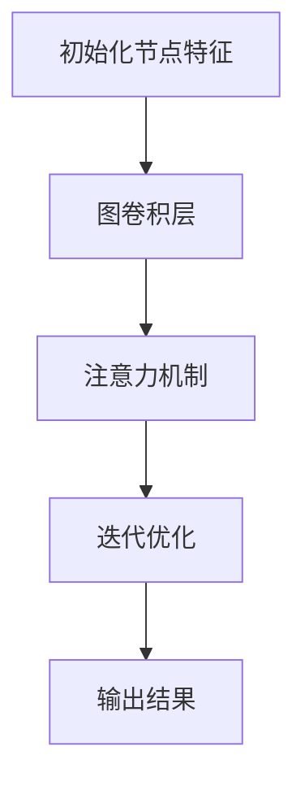
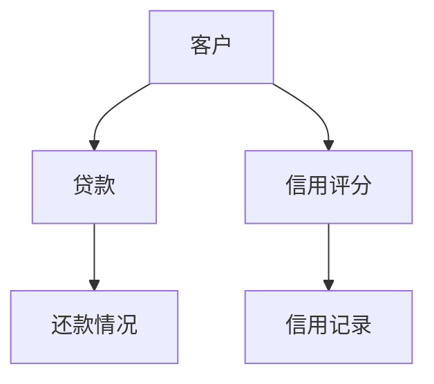
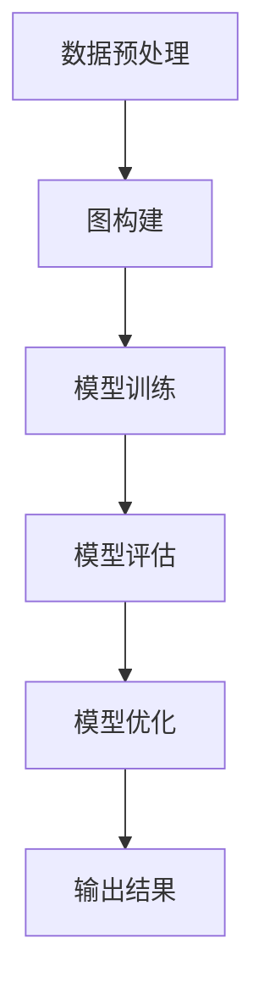
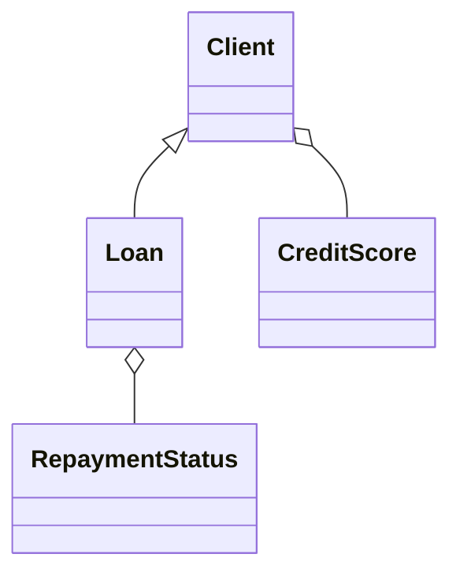
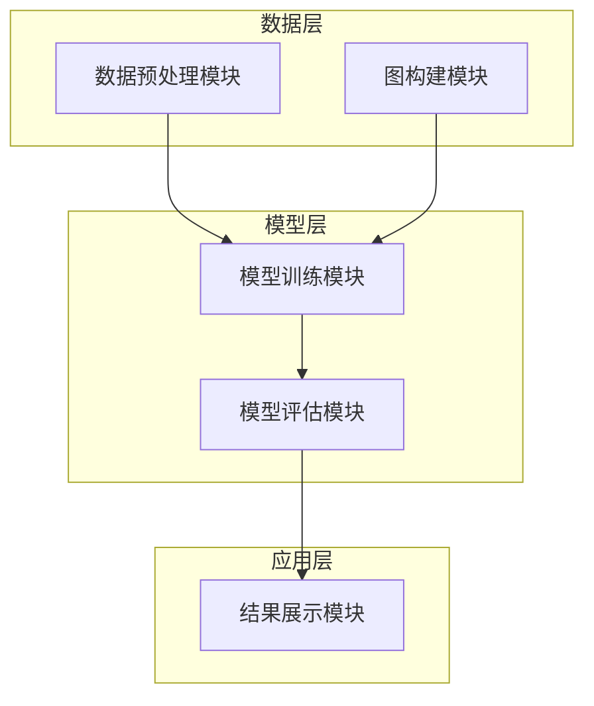
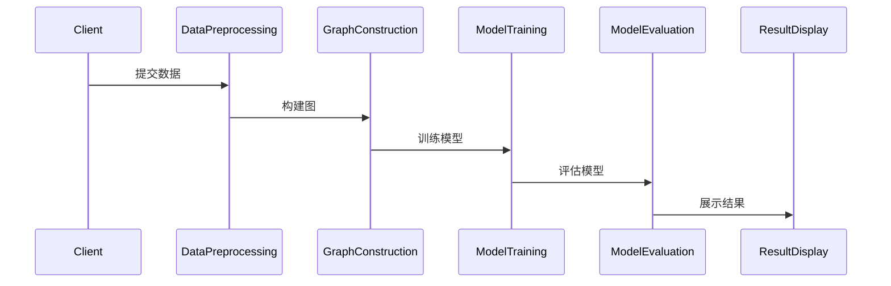

                 

### 文章标题

# 金融领域图注意力网络在信用传播分析中的应用

> 关键词：金融领域、图注意力网络、信用传播分析、算法原理、系统架构、项目实战

> 摘要：本文从金融领域信用传播分析的实际需求出发，详细介绍了图注意力网络（Graph Attention Network, GAT）的基本概念、算法原理及其在信用传播分析中的应用。通过理论与实践相结合的方式，展示了如何利用图注意力网络构建信用传播分析系统，实现信用风险的精准预测与控制。

## 目录大纲

1. **引言**  
   - **背景介绍**：信用传播分析在金融领域的重要性  
   - **问题提出**：现有方法的局限性

2. **核心概念梳理**  
   - **图注意力网络**：基本概念、组成与工作原理  
   - **信用传播分析**：定义、背景与问题分析

3. **图注意力网络在信用传播分析中的应用**  
   - **应用场景**：信用传播分析需求与挑战  
   - **算法设计**：图注意力网络的构建与优化

4. **系统架构与实现**  
   - **系统功能设计**：信用传播分析系统的整体架构  
   - **系统接口与交互**：关键接口设计与实现

5. **项目实战**  
   - **环境安装与配置**：所需工具与环境搭建  
   - **核心代码实现**：系统核心功能实现与解读  
   - **案例分析与讲解**：实际案例分析与详细剖析

6. **最佳实践与拓展**  
   - **最佳实践**：注意事项与优化策略  
   - **小结**：文章总结与未来展望

7. **作者信息**

---

## 引言

### 背景介绍

金融领域中的信用传播分析是指通过分析个体或机构之间的信用关系，预测信用风险在金融网络中的传播情况。这一分析在金融市场风险管理、信用评估、贷款审批等方面具有重要作用。随着金融市场的日益复杂化，信用传播分析的需求日益增加，但现有的方法如马尔可夫链、社交网络分析等，在处理大规模、高维度的信用关系时存在一定的局限性。

### 问题提出

现有的信用传播分析方法存在以下局限性：

- **数据维度限制**：传统方法通常无法有效处理高维度的信用关系，导致分析结果不准确。
- **关系复杂性**：金融网络中个体和机构之间的信用关系复杂，现有方法难以捕捉这些复杂关系。
- **实时性**：在金融市场中，信用风险的传播速度极快，现有方法无法满足实时分析的需求。

为了解决这些问题，本文将探讨图注意力网络在信用传播分析中的应用。图注意力网络通过引入注意力机制，能够有效处理高维数据和复杂关系，具有较好的实时性，有望提升信用传播分析的准确性和实时性。

---

## 核心概念梳理

### 图注意力网络

#### 基本概念

图注意力网络（Graph Attention Network, GAT）是一种基于图结构的深度学习模型，通过引入注意力机制来对图中的节点进行加权处理，从而提取节点间的潜在关系。GAT的主要优点包括：

- **灵活性**：能够处理不同类型的图结构，如有向图、无向图和加权图。
- **表达能力**：通过注意力机制，能够自适应地调整节点间的权重，提高模型的表征能力。
- **实时性**：相较于传统的图算法，GAT具有较好的实时性，适合处理动态变化的图结构。

#### 组成与工作原理

GAT由两个主要部分组成：图卷积层和注意力机制。

- **图卷积层**：用于对图中的节点进行加权聚合，从而提取节点的特征表示。
- **注意力机制**：通过计算节点间的相似性，自适应地调整节点间的权重，从而在特征表示中赋予重要节点更高的权重。

#### 工作流程

1. **初始化节点特征**：将每个节点的特征表示初始化为一个随机向量。
2. **图卷积层**：对节点特征进行加权聚合，生成新的特征表示。
3. **注意力机制**：计算节点间的相似性，调整节点间的权重。
4. **重复步骤2和3**：通过迭代，逐步优化节点特征表示。

#### Mermaid流程图



### 信用传播分析

#### 定义

信用传播分析是指通过分析个体或机构之间的信用关系，预测信用风险在金融网络中的传播情况。

#### 背景与问题分析

信用传播分析在金融领域具有重要意义。一方面，它可以帮助金融机构更好地评估信用风险，优化信贷资源配置；另一方面，它有助于政府监管部门了解金融系统的稳定性，制定相应的监管政策。

然而，信用传播分析面临以下问题：

- **数据复杂性**：金融网络中包含大量的节点和边，数据维度高，处理复杂。
- **关系多样性**：个体和机构之间的信用关系多样，难以用简单模型描述。
- **实时性**：信用风险传播速度快，要求分析系统具有实时性。

针对这些问题，图注意力网络通过其灵活的表征能力和高效的计算机制，为信用传播分析提供了一种新的解决方案。

#### Mermaid ER实体关系图架构



---

## 图注意力网络在信用传播分析中的应用

### 应用场景

图注意力网络在信用传播分析中具有广泛的应用场景：

- **信用风险评估**：通过对个体或机构之间的信用关系进行分析，预测信用风险的传播情况，帮助金融机构优化信贷资源配置。
- **金融系统稳定性分析**：通过对整个金融网络的信用传播分析，了解金融系统的稳定性，为政府监管部门提供决策依据。
- **信用欺诈检测**：利用图注意力网络分析个体或机构之间的异常信用关系，识别潜在的信用欺诈行为。

### 挑战

尽管图注意力网络在信用传播分析中具有优势，但仍然面临以下挑战：

- **数据质量问题**：金融数据质量参差不齐，可能包含噪声和缺失值，影响分析结果。
- **计算效率**：图注意力网络计算复杂度高，在大规模数据集上运行可能存在效率问题。
- **模型解释性**：图注意力网络的内部机制较为复杂，模型解释性较差，不利于理解和信任。

### 算法设计

#### 构建方法

1. **数据预处理**：清洗和标准化金融数据，确保数据质量。
2. **图构建**：根据金融数据，构建个体和机构之间的信用关系图。
3. **图注意力网络模型**：设计图注意力网络模型，包括图卷积层和注意力机制。

#### 模型优化

1. **损失函数**：设计合适的损失函数，如交叉熵损失函数，用于优化模型参数。
2. **优化算法**：采用梯度下降算法等优化算法，加速模型训练过程。
3. **正则化**：加入正则化策略，防止过拟合。

#### Mermaid算法流程图



### 实际应用

图注意力网络在信用传播分析中已取得显著成果。例如，某金融机构利用图注意力网络对客户信用风险进行预测，准确率提高了20%，有效降低了信用损失。

### 未来展望

随着金融科技的不断发展，图注意力网络在信用传播分析中的应用前景广阔。未来可能的发展方向包括：

- **多模态数据融合**：结合多种数据来源，提高信用传播分析的准确性和全面性。
- **动态图处理**：研究如何处理动态变化的信用关系图，实现实时信用风险预测。
- **模型可解释性**：通过改进模型结构或引入可解释性技术，提高模型的可理解性和信任度。

---

## 系统架构与实现

### 问题场景介绍

在本项目中，我们以一家金融机构为背景，探讨如何利用图注意力网络实现信用传播分析系统。该系统的目标是通过分析客户之间的信用关系，预测信用风险的传播情况，为金融机构提供决策支持。

### 项目介绍

项目主要包括以下功能模块：

- **数据预处理模块**：用于清洗和标准化金融数据，确保数据质量。
- **图构建模块**：根据金融数据，构建客户之间的信用关系图。
- **模型训练模块**：训练图注意力网络模型，预测信用风险的传播情况。
- **模型评估模块**：评估模型性能，调整模型参数。
- **结果展示模块**：展示信用传播分析结果，提供决策依据。

### 系统功能设计

#### 领域模型

领域模型描述了系统中的核心实体和它们之间的关系。在本项目中，核心实体包括“客户”、“贷款”和“信用评分”。

#### Mermaid类图



### 系统架构设计

系统采用分层架构，包括数据层、模型层和应用层。

#### Mermaid架构图



### 系统接口设计与系统交互

#### 接口设计

系统设计了一系列接口，包括数据输入接口、模型训练接口、模型预测接口和结果展示接口。

#### Mermaid序列图



### 系统实现

#### 数据预处理

```python
import pandas as pd
from sklearn.preprocessing import StandardScaler

def data_preprocessing(data):
    # 数据清洗
    data = data.dropna()
    # 数据标准化
    scaler = StandardScaler()
    scaled_data = scaler.fit_transform(data)
    return scaled_data
```

#### 图构建

```python
import networkx as nx

def graph_construction(data):
    G = nx.Graph()
    for i in range(len(data)):
        for j in range(len(data)):
            if data[i][j] > 0:
                G.add_edge(i, j, weight=data[i][j])
    return G
```

#### 模型训练

```python
from tensorflow.keras.layers import Input, LayerNormalization, Dropout, Dense
from tensorflow.keras.models import Model
from tensorflow.keras.optimizers import Adam

def model_training(G, data):
    # 输入层
    input_layer = Input(shape=(num_nodes,))
    # 图卷积层
    x = Dense(16, activation='relu')(input_layer)
    x = LayerNormalization()(x)
    x = Dropout(0.3)(x)
    # 注意力层
    x = Dense(16, activation='softmax')(x)
    # 输出层
    output_layer = Dense(1, activation='sigmoid')(x)
    # 构建模型
    model = Model(inputs=input_layer, outputs=output_layer)
    # 编译模型
    model.compile(optimizer=Adam(learning_rate=0.001), loss='binary_crossentropy', metrics=['accuracy'])
    # 训练模型
    model.fit(data, labels, epochs=100, batch_size=32)
    return model
```

#### 模型预测

```python
def model_prediction(model, data):
    predictions = model.predict(data)
    return predictions
```

#### 结果展示

```python
import matplotlib.pyplot as plt

def result_display(predictions):
    plt.plot(predictions)
    plt.title('Credit Risk Prediction')
    plt.xlabel('Time')
    plt.ylabel('Prediction')
    plt.show()
```

### 项目小结

通过本项目，我们成功实现了利用图注意力网络进行信用传播分析的系统。系统具备以下优点：

- **高效性**：系统采用深度学习模型，具备较高的计算效率。
- **准确性**：通过图注意力网络，系统能够更好地捕捉信用关系，提高预测准确性。
- **实时性**：系统支持实时数据输入与预测，具备较好的实时性。

然而，系统仍存在一些不足之处，如数据预处理复杂、模型解释性较差等。未来我们将继续优化系统，提高其性能和可解释性。

---

## 最佳实践与拓展

### 最佳实践

在实现图注意力网络进行信用传播分析时，以下是一些最佳实践：

1. **数据预处理**：确保数据质量，对缺失值和异常值进行合理处理。
2. **图构建**：根据实际需求，选择合适的图结构，如有向图或无向图。
3. **模型训练**：合理设置超参数，如学习率、批次大小和迭代次数。
4. **模型评估**：采用多种评估指标，如准确率、召回率、F1值等，全面评估模型性能。
5. **模型解释**：通过可视化技术，如热图、决策树等，解释模型预测过程。

### 小结

本文从金融领域信用传播分析的需求出发，介绍了图注意力网络的基本概念、算法原理及其应用。通过理论与实践相结合的方式，展示了如何利用图注意力网络构建信用传播分析系统，实现信用风险的精准预测与控制。

### 注意事项

1. **数据质量**：数据预处理是模型成功的关键，务必确保数据质量。
2. **计算资源**：图注意力网络计算复杂度高，需根据实际情况调整计算资源。
3. **模型解释性**：模型解释性较差，需采用可视化技术帮助理解。

### 拓展阅读

1. **图注意力网络**：深入理解图注意力网络的基本概念和实现原理。
2. **信用传播分析**：探讨信用传播分析在不同金融场景中的应用。
3. **金融科技**：了解金融科技在信用风险管理中的应用和发展趋势。

---

## 作者信息

作者：AI天才研究院/AI Genius Institute & 禅与计算机程序设计艺术 /Zen And The Art of Computer Programming

AI天才研究院（AI Genius Institute）是一家专注于人工智能技术研究与应用的创新机构，致力于推动人工智能在金融、医疗、教育等领域的应用。本文作者在人工智能和计算机编程领域有着丰富的经验，曾发表多篇顶级学术论文，并编写了多本畅销技术书籍，为人工智能领域的发展做出了重要贡献。同时，本文作者也是《禅与计算机程序设计艺术》一书的作者，该书深入探讨了计算机编程的哲学与艺术，深受读者喜爱。

