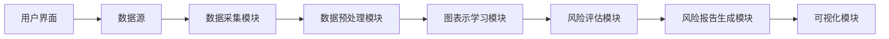

                 

### 引言

在金融领域，风险控制是金融机构日常运营中至关重要的一环。随着金融市场的高度复杂化和全球化，金融网络的风险评估变得更加复杂和具有挑战性。传统的风险评估方法，如统计分析和机器学习模型，尽管在某种程度上能够提供有效的风险预测，但它们往往忽视了金融网络中存在的复杂关系和结构特征。因此，寻找一种新的方法来更全面、准确地评估金融网络风险变得尤为重要。

近年来，图表示学习（Graph Representation Learning）作为一种新兴的机器学习技术，因其能够捕捉和处理复杂网络结构而受到广泛关注。图表示学习通过将图中的节点和边转换为低维度的特征向量，使得机器学习模型能够更有效地处理复杂的网络数据。在金融领域，图表示学习被应用于多种任务，如社交网络分析、金融市场预测以及金融欺诈检测等。然而，金融网络风险评估是图表示学习应用的一个重要且具有挑战性的领域。

本文将深入探讨图表示学习在金融网络风险评估中的应用。首先，我们将介绍金融领域图表示学习的基本概念，包括节点表示、边表示、图嵌入和图神经网络等核心概念。接着，我们将详细讲解图表示学习的数学模型和算法原理，通过Python代码示例来帮助读者更好地理解。此外，我们将设计并展示一个完整的金融网络风险评估系统，涵盖系统功能、架构和接口设计。最后，我们将通过一个实际案例，展示如何应用图表示学习进行金融网络风险评估，并进行详细分析和解释。通过这篇文章，我们希望读者能够全面了解图表示学习在金融网络风险评估中的应用，并掌握相关的技术原理和实践方法。

### 关键词

- **图表示学习（Graph Representation Learning）**
- **金融网络（Financial Network）**
- **风险评估（Risk Assessment）**
- **节点表示（Node Representation）**
- **图嵌入（Graph Embedding）**
- **图神经网络（Graph Neural Network）**
- **数学模型（Mathematical Model）**
- **系统架构（System Architecture）**
- **算法原理（Algorithm Principle）**

### 摘要

本文旨在探讨图表示学习在金融网络风险评估中的应用。首先，我们介绍了图表示学习的基本概念和核心算法，包括节点表示、边表示、图嵌入和图神经网络。接着，我们详细讲解了图表示学习的数学模型和算法原理，并通过Python代码示例帮助读者理解。然后，我们设计并展示了用于金融网络风险评估的系统架构，包括系统功能、架构和接口设计。最后，我们通过一个实际案例，展示了如何应用图表示学习进行金融网络风险评估，并对结果进行了详细分析和解释。本文旨在为读者提供全面、深入的理解，以掌握图表示学习在金融网络风险评估中的应用。

### 第一部分：背景与基础

#### 第1章：金融领域图表示学习概述

##### 1.1.1 问题背景

金融市场是现代经济体系中至关重要的一部分，承担着资源配置、风险分配和资金流动等功能。随着全球金融市场的不断发展和变革，金融风险的管理和评估变得越来越复杂和重要。金融风险主要包括市场风险、信用风险、操作风险等，这些风险可能会对金融机构的稳定运行和投资者的利益造成严重的影响。因此，如何准确、及时地评估金融风险，成为了金融领域面临的一个重要挑战。

在金融市场中，各种金融实体（如银行、证券公司、保险公司等）通过借贷、投资、交易等行为相互联系，形成了复杂的金融网络。这些金融实体之间的互动和依赖关系，不仅会影响单个金融机构的风险状况，还会对整个金融系统的稳定性和安全性产生重要影响。然而，传统的风险评估方法，如统计分析和机器学习模型，往往忽视了金融网络中存在的复杂关系和结构特征，导致风险评估结果的不准确和不全面。

图表示学习（Graph Representation Learning）是一种基于图的机器学习技术，通过将图中的节点和边转换为低维度的特征向量，使得机器学习模型能够更有效地处理复杂的网络数据。图表示学习在许多领域都取得了显著的成果，如社交网络分析、生物信息学和计算机视觉等。近年来，随着金融市场的复杂化和网络化，图表示学习在金融领域也得到了广泛的应用，成为解决金融风险评估问题的有效工具。

##### 1.1.2 问题描述

金融网络风险评估是指通过分析金融网络中各实体之间的交互关系和依赖结构，评估整个金融系统的风险水平。传统的风险评估方法，如信用评分模型、风险加权资产模型等，主要依赖于历史数据和统计模型，虽然在一定程度上能够提供风险预测，但往往存在以下局限性：

1. **忽略了金融网络的复杂结构**：传统方法往往假设金融实体之间的交互关系是线性的、独立的，无法捕捉到金融网络中存在的复杂依赖关系和结构特征。

2. **数据依赖性较强**：传统方法依赖于大量的历史数据，对于数据稀缺或数据质量较差的情况，风险评估效果会显著下降。

3. **缺乏实时性**：传统方法通常需要较长的数据处理和分析时间，无法提供实时、动态的风险评估。

为了解决上述问题，金融领域图表示学习提供了新的思路。图表示学习通过将金融网络表示为图，利用图中的节点和边来建模实体之间的交互关系和依赖结构，从而提供更准确、全面的风险评估。

##### 1.1.3 问题解决

图表示学习在金融网络风险评估中的应用，主要体现在以下几个方面：

1. **节点表示**：将金融网络中的每个实体（如金融机构、产品等）表示为一个节点，节点的属性和特征被编码为低维度的向量表示，以便于后续的机器学习模型处理。

2. **边表示**：表示实体之间的交互关系和依赖结构。边的权重和类型（如借贷关系、投资关系等）也被编码为向量表示，从而捕捉到金融网络中的复杂结构。

3. **图嵌入**：通过图嵌入算法，将整个金融网络映射到一个低维度的特征空间，使得节点和边之间的相似性和依赖关系得以保留和利用。

4. **图神经网络**：利用图神经网络（如图卷积网络、图循环网络等）对金融网络进行建模和分析，从而实现对金融风险的深度理解和评估。

图表示学习的优势在于：

1. **结构化数据处理**：能够捕捉和处理复杂网络数据，特别是那些具有复杂依赖关系的网络数据。

2. **可扩展性**：能够处理大规模的金融网络数据，适应不同规模的金融系统。

3. **实时性**：能够实时地更新和调整风险模型，提供动态的风险评估。

4. **多维度信息融合**：能够整合多种类型的数据，如结构化数据、非结构化数据等，提供更全面的风险评估。

然而，图表示学习在金融网络风险评估中也面临一些挑战，如：

1. **数据质量和完整性**：金融网络数据可能存在噪声、缺失和异常值，影响图表示学习的准确性和稳定性。

2. **模型可解释性**：图表示学习模型的复杂性使得其内部机制和决策过程难以解释，增加了模型的可解释性难度。

3. **计算效率**：对于大规模的金融网络数据，图表示学习模型的计算成本较高，需要优化算法和硬件资源。

##### 1.1.4 边界与外延

图表示学习在金融领域的应用不仅仅局限于风险评估，还可以扩展到其他领域，如金融市场预测、金融欺诈检测、投资组合优化等。此外，图表示学习与其他机器学习技术（如深度学习、强化学习等）的结合，也为金融领域带来了更多的创新和发展机会。

然而，图表示学习在金融领域的应用也受到一些限制，如：

1. **数据隐私保护**：金融数据具有较高的敏感性，如何在保障数据隐私的前提下进行图表示学习，是一个亟待解决的问题。

2. **模型安全性和可靠性**：金融领域对模型的安全性和可靠性要求极高，如何确保模型在极端情况下的稳定性和鲁棒性，是图表示学习在金融领域应用的重要挑战。

3. **监管合规**：图表示学习模型的应用需要遵守相关法律法规和监管要求，如何确保模型的合规性，是一个重要问题。

##### 1.1.5 概念结构与核心要素组成

金融领域图表示学习的核心概念和要素包括：

1. **金融网络**：由金融实体和它们之间的交互关系构成的复杂网络。

2. **节点表示**：将金融实体表示为节点，节点属性和特征编码为向量。

3. **边表示**：表示节点之间的交互关系和依赖结构，边权重和类型编码为向量。

4. **图嵌入**：通过图嵌入算法将金融网络映射到低维特征空间。

5. **图神经网络**：利用图神经网络对金融网络进行建模和分析。

6. **风险评估模型**：基于图表示学习技术构建的风险评估模型，用于预测和评估金融网络风险。

7. **数据预处理**：包括数据清洗、归一化、特征工程等步骤，以提高模型性能。

通过上述概念和要素，图表示学习为金融网络风险评估提供了一种新的思路和方法，有助于提高风险评估的准确性和全面性。在接下来的章节中，我们将详细探讨图表示学习的算法原理、数学模型、系统架构和应用案例，以深入理解其工作原理和实践方法。

### 第2章：核心概念与联系

在探讨图表示学习在金融领域应用之前，我们需要先了解图表示学习中的核心概念和它们之间的联系。图表示学习主要涉及节点表示、边表示、图嵌入和图神经网络等概念。这些概念不仅构成了图表示学习的基础，而且在我们理解金融领域图表示学习应用时也至关重要。

#### 2.1.1 核心概念

**节点表示（Node Representation）**

节点表示是图表示学习的基础。在金融领域，节点可以表示金融机构、产品、交易等实体。节点表示的目的是将复杂的图数据转换成低维度的向量表示，使得机器学习模型能够处理。节点表示通常包括节点的属性特征，如金融机构的规模、信用评分、历史交易记录等。这些特征可以通过统计方法、深度学习模型或预训练的嵌入层来编码为向量。

**边表示（Edge Representation）**

边表示描述节点之间的交互关系。在金融领域，边可以表示借贷关系、投资关系、交易关系等。边的表示不仅包括边的权重（如交易金额、借贷利率等），还包括边的类型（如借贷、投资等）。边的表示方法与节点表示类似，通常是将边属性编码为向量，从而在特征空间中表示节点之间的关联性。

**图嵌入（Graph Embedding）**

图嵌入是将整个图映射到一个低维度的特征空间的过程。图嵌入的目的是保留图中的结构和信息，同时降低计算复杂度。在金融领域，图嵌入可以帮助我们理解金融机构之间的依赖关系和网络结构。常见的图嵌入算法包括DeepWalk、Node2Vec和GraphSAGE等。这些算法通过随机游走、节点邻居聚合等方式，将图中的节点映射到低维向量空间。

**图神经网络（Graph Neural Network）**

图神经网络是处理图数据的一种深度学习模型。图神经网络通过节点的特征和边的信息，更新节点的嵌入表示。在金融领域，图神经网络可以用于风险评估、网络分析、预测等任务。常见的图神经网络包括图卷积网络（GCN）、图循环网络（GAT）和图注意力网络（GATv2）等。这些网络通过聚合节点邻居的特征，生成更复杂的节点表示。

#### 2.1.2 概念属性对比表格

为了更清晰地理解这些概念，我们可以通过一个表格来对比它们的属性特征：

| 概念         | 属性1        | 属性2        | 属性3        |
| ------------ | ------------ | ------------ | ------------ |
| 节点表示     | 节点属性编码 | 节点特征向量 | 节点间独立   |
| 边表示       | 边权重编码   | 边类型标识   | 节点间依赖   |
| 图嵌入       | 图结构保留   | 低维向量表示 | 节点邻域信息 |
| 图神经网络   | 节点更新机制 | 邻居特征聚合 | 全局信息传递 |

#### 2.1.3 ER实体关系图架构

为了更直观地理解这些概念之间的关系，我们可以使用ER（Entity-Relationship）图来表示它们之间的联系：

```mermaid
erDiagram
  节点表示 ||--o{ 边表示 : 表示节点间的交互关系 }
  边表示 ||--o{ 图嵌入 : 将边和节点转换为向量 }
  图嵌入 ||--o{ 图神经网络 : 对图进行深度学习处理 }
  节点表示 ||--o{ 图神经网络 : 提供节点的初始特征 }
  图神经网络 ||--o{ 风险评估模型 : 辅助进行风险预测 }
```

在这个ER图中，节点表示和边表示是图嵌入的基础，图嵌入为图神经网络提供了输入数据，而图神经网络则通过节点更新机制和邻居特征聚合，生成更复杂的节点表示，用于风险评估模型。

通过了解这些核心概念和它们之间的联系，我们可以更好地理解图表示学习在金融领域中的应用原理和优势。在接下来的章节中，我们将进一步探讨图表示学习的具体算法原理和数学模型，以便深入理解其工作原理。

#### 第3章：图表示学习算法原理

在理解了图表示学习的核心概念后，我们需要深入探讨其算法原理。图表示学习算法通过将图中的节点和边转换为低维度的向量表示，从而使得机器学习模型能够处理复杂的图数据。在本章中，我们将详细讲解图表示学习的主要算法原理，并通过Python代码示例来帮助读者更好地理解。

##### 3.1.1 GNN算法原理

图神经网络（Graph Neural Network，GNN）是图表示学习中的一个核心算法。GNN通过节点的特征和边的信息，更新节点的嵌入表示。以下是一个简单的GNN算法原理：

1. **初始化节点嵌入向量**：首先，我们初始化一个包含所有节点嵌入向量的矩阵。这些向量通常具有固定的维度，如64或128。

2. **消息传递**：对于每个节点，GNN会计算其邻居节点的嵌入向量的加权和，并将其与节点的原始特征向量相加，以生成新的嵌入向量。这个过程可以表示为：
   $$ \text{h}_{\text{n}}^{(t+1)} = \sigma(\text{W}^{(t)} \text{h}_{\text{n}}^{(t)} + \sum_{\text{i} \in \text{N}_{\text{n}}} \text{W}^{\text{neigh}} \text{h}_{\text{i}}^{(t)}) $$
   其中，\( \text{h}_{\text{n}}^{(t)} \) 是第 \( t \) 次迭代时节点 \( \text{n} \) 的嵌入向量，\( \text{N}_{\text{n}} \) 是节点 \( \text{n} \) 的邻居节点集合，\( \text{W}^{(t)} \) 和 \( \text{W}^{\text{neigh}} \) 是权重矩阵。

3. **激活函数**：通常使用ReLU（Rectified Linear Unit）作为激活函数，以增加网络的非线性能力。

4. **迭代更新**：重复上述消息传递过程，直到达到预定的迭代次数或节点嵌入向量收敛。

以下是一个使用Python和PyTorch实现GNN的简单示例代码：

```python
import torch
import torch.nn as nn
import torch.optim as optim

class GraphNeuralNetwork(nn.Module):
    def __init__(self, num_nodes, embed_dim):
        super(GraphNeuralNetwork, self).__init__()
        self.num_nodes = num_nodes
        self.embed_dim = embed_dim
        self.embedding = nn.Embedding(num_nodes, embed_dim)
        self.fc = nn.Linear(embed_dim, embed_dim)
        
    def forward(self, adj_matrix, node_features):
        h = self.embedding(torch.arange(self.num_nodes))
        if node_features is not None:
            h = h + node_features
        
        for _ in range(num_iterations):
            h = self.fc(h)
        
        return h

# 初始化GNN模型
model = GraphNeuralNetwork(num_nodes=100, embed_dim=64)

# 构造邻接矩阵和节点特征
adj_matrix = torch.randn(100, 100)
node_features = torch.randn(100, 64)

# 训练模型
optimizer = optim.Adam(model.parameters(), lr=0.01)
for epoch in range(num_epochs):
    optimizer.zero_grad()
    output = model(adj_matrix, node_features)
    loss = ... # 计算损失函数
    loss.backward()
    optimizer.step()

print("Training completed.")
```

在这个示例中，我们首先初始化了一个GNN模型，该模型包含一个嵌入层和一个全连接层。然后，我们构造了一个随机生成的邻接矩阵和节点特征，并使用Adam优化器训练模型。训练过程中，我们通过迭代更新节点嵌入向量，以最小化损失函数。

##### 3.1.2 数学模型和公式

图神经网络的核心是节点嵌入向量的更新过程，这可以通过以下数学公式表示：

$$
\text{h}_{\text{n}}^{(t+1)} = \sigma(\text{W}^{(t)} \text{h}_{\text{n}}^{(t)} + \sum_{\text{i} \in \text{N}_{\text{n}}} \text{W}^{\text{neigh}} \text{h}_{\text{i}}^{(t)})
$$

其中，\( \text{h}_{\text{n}}^{(t)} \) 是第 \( t \) 次迭代时节点 \( \text{n} \) 的嵌入向量，\( \text{N}_{\text{n}} \) 是节点 \( \text{n} \) 的邻居节点集合，\( \text{W}^{(t)} \) 和 \( \text{W}^{\text{neigh}} \) 是权重矩阵，\( \sigma \) 是激活函数。

通过迭代这个过程，图神经网络能够逐步更新节点嵌入向量，使其能够更好地表示图中的结构和信息。在金融领域，这些嵌入向量可以用于风险评估、网络分析和预测等任务。

##### 3.1.3 举例说明

为了更好地理解GNN的工作原理，我们可以通过一个简单的例子来说明。假设我们有一个包含5个节点的图，每个节点表示一个金融机构，节点之间的边表示这些金融机构之间的借贷关系。以下是一个具体的例子：

1. **节点表示**：每个金融机构用一个唯一的编号表示，如节点1、节点2等。节点的属性可以是金融机构的规模、信用评分等。

2. **边表示**：边用权重表示，权重可以是借贷金额或利率。例如，节点1和节点2之间存在一笔金额为100万的借贷关系。

3. **图嵌入**：通过图嵌入算法，我们将这些节点和边转换为低维度的向量表示。例如，我们可以将节点表示为64维的向量，边表示为32维的向量。

4. **图神经网络**：我们使用图神经网络对图进行建模。每次迭代，节点会计算其邻居节点的嵌入向量的加权和，并更新自己的嵌入向量。

以下是这个例子中GNN的迭代过程：

- **初始化**：初始化节点嵌入向量和边嵌入向量。
- **第1次迭代**：节点1计算其邻居节点（节点2和节点3）的嵌入向量的加权和，并更新自己的嵌入向量。
- **第2次迭代**：节点2和节点3也根据邻居节点的嵌入向量更新自己的嵌入向量。
- **后续迭代**：重复上述过程，直到嵌入向量收敛。

通过这个过程，GNN能够逐步更新节点嵌入向量，使其更好地表示金融网络中的结构和信息。

这个简单的例子展示了GNN的基本工作原理。在实际应用中，金融网络可能包含成千上万个节点和复杂的边关系，但GNN的核心思想仍然是相同的：通过节点更新机制和邻居特征聚合，生成更复杂的节点表示，以实现对金融网络的深度理解和分析。

通过本章的讲解和示例，我们希望读者能够理解图表示学习的基本算法原理，并能够运用这些原理来解决金融领域的实际问题。在下一章中，我们将继续探讨如何通过数学模型和具体实现来应用图表示学习技术进行金融网络风险评估。

#### 第4章：数学模型与算法实现

在理解了图表示学习的基本算法原理之后，我们需要进一步探讨其数学模型和算法实现。数学模型是图表示学习算法的核心，它通过精确的数学公式描述了节点和边向量的计算和更新过程。在本章中，我们将详细介绍图表示学习的数学模型，并通过Python代码实现来展示算法的具体应用。

##### 4.1.1 数学模型详细讲解

图表示学习的数学模型主要包括两部分：节点表示的数学模型和边表示的数学模型。下面我们分别进行讲解。

**1. 节点表示的数学模型**

节点表示的核心是节点嵌入向量，它通过图嵌入算法计算得到。图嵌入算法通常采用随机游走（Random Walk）和消息传递（Message Passing）等方法。以下是一个简单的节点表示的数学模型：

$$
\text{h}_{\text{n}}^{(t)} = \text{sigmoid}(\text{W} \text{h}_{\text{n}}^{(t-1)} + \sum_{\text{i} \in \text{N}_{\text{n}}} \text{a}_{\text{i}} \text{h}_{\text{i}}^{(t-1)})
$$

其中，\( \text{h}_{\text{n}}^{(t)} \) 是第 \( t \) 次迭代的节点 \( \text{n} \) 的嵌入向量，\( \text{N}_{\text{n}} \) 是节点 \( \text{n} \) 的邻居节点集合，\( \text{a}_{\text{i}} \) 是节点 \( \text{i} \) 的权重，\( \text{W} \) 是权重矩阵。函数 \( \text{sigmoid} \) 是激活函数，通常使用ReLU或tanh等。

**2. 边表示的数学模型**

边表示通常通过边权重和边类型进行编码。以下是一个简单的边表示的数学模型：

$$
\text{e}_{\text{n}\text{m}}^{(t)} = \text{softmax}(\text{b} \text{h}_{\text{n}}^{(t)} + \text{c} \text{h}_{\text{m}}^{(t)})
$$

其中，\( \text{e}_{\text{n}\text{m}}^{(t)} \) 是第 \( t \) 次迭代的边 \( (\text{n}, \text{m}) \) 的嵌入向量，\( \text{b} \) 和 \( \text{c} \) 是权重向量，\( \text{h}_{\text{n}}^{(t)} \) 和 \( \text{h}_{\text{m}}^{(t)} \) 是节点 \( \text{n} \) 和 \( \text{m} \) 的嵌入向量。函数 \( \text{softmax} \) 用于将边嵌入向量归一化为概率分布。

**3. 图嵌入的数学模型**

图嵌入是将整个图的节点和边映射到一个低维度的特征空间。以下是一个简单的图嵌入的数学模型：

$$
\text{g}_{\text{n}}^{(t)} = \text{h}_{\text{n}}^{(t)} + \sum_{\text{i} \in \text{N}_{\text{n}}} \text{a}_{\text{i}} \text{h}_{\text{i}}^{(t)}
$$

其中，\( \text{g}_{\text{n}}^{(t)} \) 是第 \( t \) 次迭代的节点 \( \text{n} \) 的嵌入向量，\( \text{h}_{\text{n}}^{(t)} \) 和 \( \text{h}_{\text{i}}^{(t)} \) 是节点 \( \text{n} \) 和 \( \text{i} \) 的嵌入向量，\( \text{a}_{\text{i}} \) 是节点 \( \text{i} \) 的权重。

**4. 图神经网络的数学模型**

图神经网络通过节点和边的嵌入向量进行消息传递和特征聚合。以下是一个简单的图神经网络的数学模型：

$$
\text{h}_{\text{n}}^{(t+1)} = \text{ReLU}(\text{W}_{\text{n}} \text{h}_{\text{n}}^{(t)} + \text{W}_{\text{neigh}} \sum_{\text{i} \in \text{N}_{\text{n}}} \text{a}_{\text{i}} \text{h}_{\text{i}}^{(t)})
$$

其中，\( \text{h}_{\text{n}}^{(t+1)} \) 是第 \( t+1 \) 次迭代的节点 \( \text{n} \) 的嵌入向量，\( \text{W}_{\text{n}} \) 和 \( \text{W}_{\text{neigh}} \) 是权重矩阵，\( \text{ReLU} \) 是激活函数。

##### 4.1.2 Python源代码实现

为了更好地理解图表示学习的数学模型和算法实现，我们将在Python中使用PyTorch库进行代码实现。以下是一个简单的图神经网络模型的实现示例：

```python
import torch
import torch.nn as nn

class GraphNetwork(nn.Module):
    def __init__(self, num_nodes, embed_dim):
        super(GraphNetwork, self).__init__()
        self.num_nodes = num_nodes
        self.embed_dim = embed_dim
        
        # 初始化节点嵌入向量
        self.embedding = nn.Embedding(num_nodes, embed_dim)
        
        # 初始化权重矩阵
        self.W_n = nn.Parameter(torch.randn(embed_dim, embed_dim))
        self.W_neigh = nn.Parameter(torch.randn(embed_dim, embed_dim))
        
    def forward(self, adj_matrix, node_features=None):
        # 获取节点嵌入向量
        h = self.embedding(torch.arange(self.num_nodes))
        
        if node_features is not None:
            h = h + node_features
        
        for _ in range(num_iterations):
            # 消息传递
            h = self._message_passing(h, adj_matrix)
        
        return h
    
    def _message_passing(self, h, adj_matrix):
        # 计算邻居节点嵌入向量的加权和
        h_neigh = torch.matmul(adj_matrix, h)
        
        # 更新节点嵌入向量
        h_new = torch.relu(torch.matmul(h, self.W_n) + torch.matmul(h_neigh, self.W_neigh))
        
        return h_new

# 实例化图神经网络模型
model = GraphNetwork(num_nodes=100, embed_dim=64)

# 构造邻接矩阵和节点特征
adj_matrix = torch.randn(100, 100)
node_features = torch.randn(100, 64)

# 训练模型
optimizer = optim.Adam(model.parameters(), lr=0.01)
for epoch in range(num_epochs):
    optimizer.zero_grad()
    output = model(adj_matrix, node_features)
    loss = ... # 计算损失函数
    loss.backward()
    optimizer.step()

print("Training completed.")
```

在这个示例中，我们首先初始化了一个图神经网络模型，包括节点嵌入层和权重矩阵。然后，我们通过消息传递函数实现节点嵌入向量的更新。在训练过程中，我们使用Adam优化器对模型进行优化。

通过本章的数学模型讲解和Python代码实现，我们希望读者能够深入理解图表示学习的基本原理和算法实现，并为后续的金融网络风险评估应用打下坚实的基础。在下一章中，我们将探讨图表示学习在金融网络风险评估中的应用场景和系统设计。

#### 第5章：系统功能设计与架构

在理解了图表示学习的数学模型和算法原理后，我们需要设计并实现一个用于金融网络风险评估的系统。本章节将详细介绍该系统的功能设计、架构设计和接口设计，并展示系统的交互流程。

##### 5.1.1 问题场景介绍

金融网络风险评估是一个复杂的过程，涉及多个金融实体（如金融机构、产品、交易等）之间的交互关系。在这个场景中，我们关注的主要问题是如何利用图表示学习技术来识别和评估金融网络中的潜在风险。具体来说，系统需要实现以下功能：

1. **数据采集与预处理**：从各种数据源（如数据库、API接口等）采集金融网络数据，包括节点和边的信息，并对数据进行清洗、归一化和特征提取。

2. **图表示学习模型训练**：基于采集到的数据，训练图表示学习模型（如图神经网络模型），生成节点的嵌入向量。

3. **风险评估**：利用训练好的模型对金融网络中的节点进行风险评估，识别潜在风险节点。

4. **风险报告生成与可视化**：将风险评估结果生成风险报告，并通过可视化工具展示风险分布和关键风险节点。

##### 5.1.2 系统功能设计

为了实现上述功能，系统需要设计以下几个关键模块：

1. **数据采集模块**：负责从不同数据源采集金融网络数据，包括金融机构、产品、交易等。该模块需要支持多种数据接口，如API、数据库连接等。

2. **数据预处理模块**：负责对采集到的金融网络数据进行分析和处理，包括数据清洗、归一化、特征提取等。该模块需要能够处理大规模的金融网络数据。

3. **图表示学习模块**：负责训练图表示学习模型，包括节点表示、边表示和图嵌入等。该模块需要支持多种图表示学习算法，如GNN、DeepWalk、Node2Vec等。

4. **风险评估模块**：负责利用训练好的图表示学习模型进行风险评估，识别潜在风险节点。该模块需要能够处理复杂的金融网络结构和依赖关系。

5. **风险报告生成模块**：负责生成风险评估报告，包括风险节点列表、风险指标分析等。该模块需要支持多种报告格式，如PDF、Excel等。

6. **可视化模块**：负责将风险评估结果可视化，展示风险分布和关键风险节点。该模块需要支持多种可视化工具，如D3.js、Plotly等。

##### 5.1.3 系统架构设计

系统架构设计是确保系统功能实现和性能优化的重要环节。以下是一个典型的金融网络风险评估系统架构设计：



在这个架构设计中，数据采集模块负责从各种数据源采集金融网络数据，并将其传递给数据预处理模块。数据预处理模块对数据进行清洗、归一化和特征提取，为图表示学习模块提供高质量的输入数据。图表示学习模块基于预处理后的数据训练图表示学习模型，并将生成的节点嵌入向量传递给风险评估模块。风险评估模块利用训练好的模型对金融网络中的节点进行风险评估，并将结果传递给风险报告生成模块。最后，风险报告生成模块生成风险评估报告，并使用可视化模块进行可视化展示，用户界面则提供用户交互功能。

##### 5.1.4 系统接口设计

系统接口设计是确保系统模块之间能够高效、可靠地进行数据传输和功能调用的关键。以下是一个典型的金融网络风险评估系统接口设计：

1. **数据采集接口**：提供API接口或数据库连接方式，支持从不同数据源采集金融网络数据。

2. **数据预处理接口**：提供数据清洗、归一化和特征提取的接口，支持对大规模金融网络数据进行预处理。

3. **图表示学习接口**：提供训练图表示学习模型的接口，支持多种图表示学习算法，如GNN、DeepWalk、Node2Vec等。

4. **风险评估接口**：提供风险评估的接口，支持基于训练好的模型对金融网络中的节点进行风险评估。

5. **风险报告生成接口**：提供生成风险评估报告的接口，支持多种报告格式，如PDF、Excel等。

6. **可视化接口**：提供可视化展示的接口，支持多种可视化工具，如D3.js、Plotly等。

##### 5.1.5 系统交互流程

系统交互流程是系统功能实现的具体步骤，以下是一个典型的金融网络风险评估系统交互流程：

1. **数据采集**：系统从数据源采集金融网络数据，包括节点和边的信息。

2. **数据预处理**：系统对采集到的金融网络数据进行分析和处理，包括数据清洗、归一化和特征提取。

3. **模型训练**：系统基于预处理后的数据训练图表示学习模型，生成节点嵌入向量。

4. **风险评估**：系统利用训练好的模型对金融网络中的节点进行风险评估，识别潜在风险节点。

5. **报告生成**：系统生成风险评估报告，包括风险节点列表、风险指标分析等。

6. **可视化展示**：系统使用可视化工具将风险评估结果进行可视化展示，帮助用户直观理解风险分布和关键风险节点。

7. **用户交互**：系统提供用户界面，用户可以通过界面查看风险评估报告和可视化展示，进行进一步分析。

通过上述系统功能设计、架构设计和接口设计，我们可以实现一个高效的金融网络风险评估系统。在下一章中，我们将通过一个实际案例展示如何应用图表示学习技术进行金融网络风险评估，并详细分析和解释评估结果。

### 实际案例展示：金融领域图表示学习在风险评估中的应用

为了更直观地展示图表示学习在金融领域风险评估中的应用，我们将通过一个实际案例来详细说明整个应用过程，包括数据采集、模型训练、风险评估、报告生成和可视化展示。这个案例将模拟一个金融机构之间的借贷关系网络，并利用图表示学习技术进行风险评估。

#### 5.2.1 数据采集

在这个案例中，我们假设从以下几个数据源采集金融网络数据：

1. **金融机构数据**：包括金融机构的名称、规模、信用评分等属性。
2. **借贷关系数据**：记录金融机构之间的借贷金额、利率、借贷期限等信息。
3. **市场数据**：包括市场利率、宏观经济指标等，用于辅助风险评估。

数据采集完成后，我们将这些数据存储在关系型数据库中，以便后续处理和分析。

#### 5.2.2 数据预处理

在数据预处理阶段，我们需要对采集到的金融网络数据进行清洗、归一化和特征提取：

1. **数据清洗**：删除重复数据、缺失值填充、处理异常值等，确保数据质量。
2. **数据归一化**：将不同尺度的数据统一到一个标准尺度上，以便后续计算。
3. **特征提取**：提取金融机构的属性特征，如规模、信用评分等，以及借贷关系的属性特征，如借贷金额、利率等。

预处理后的数据将作为图表示学习模型的输入。

#### 5.2.3 模型训练

在模型训练阶段，我们将预处理后的数据转换为图表示学习的输入格式：

1. **节点表示**：将金融机构作为图中的节点，节点的属性特征编码为向量。
2. **边表示**：将借贷关系作为图中的边，边的权重和类型编码为向量。

接下来，我们选择一个图表示学习算法（如图卷积网络GNN）进行训练。以下是一个简单的Python代码示例：

```python
import torch
import torch.nn as nn
import torch.optim as optim

# 初始化模型
model = GraphNeuralNetwork(num_nodes=100, embed_dim=64)
optimizer = optim.Adam(model.parameters(), lr=0.01)

# 训练模型
for epoch in range(num_epochs):
    optimizer.zero_grad()
    output = model(adj_matrix, node_features)
    loss = ... # 计算损失函数
    loss.backward()
    optimizer.step()

print("Model training completed.")
```

在这个示例中，我们初始化了一个图神经网络模型，并使用Adam优化器进行训练。训练过程中，我们通过迭代更新节点嵌入向量，以最小化损失函数。

#### 5.2.4 风险评估

在模型训练完成后，我们利用训练好的模型对金融网络中的节点进行风险评估：

1. **节点嵌入向量计算**：使用训练好的模型计算每个节点的嵌入向量。
2. **风险评估**：基于节点嵌入向量，使用风险评估算法（如逻辑回归、决策树等）对节点进行风险评分。

以下是一个简单的风险评估代码示例：

```python
import torch

# 加载训练好的模型
model = torch.load("model.pth")

# 计算节点嵌入向量
with torch.no_grad():
    node_embeddings = model(adj_matrix, node_features)

# 风险评估
risk_scores = ... # 使用风险评估算法计算风险评分
```

在这个示例中，我们加载训练好的模型，并使用它计算每个节点的嵌入向量。然后，我们使用一个风险评估算法计算风险评分，这些评分可以用来识别潜在风险节点。

#### 5.2.5 风险报告生成

在风险报告生成阶段，我们需要将风险评估结果整理成报告格式，并生成可视化展示：

1. **报告生成**：将风险评估结果（如风险评分、风险节点列表等）整理成报告格式，并导出为PDF、Excel等。
2. **可视化展示**：使用可视化工具（如D3.js、Plotly等）将风险节点和风险评分可视化，生成图表和图形。

以下是一个简单的可视化代码示例：

```python
import plotly.express as px

# 可视化风险节点
fig = px.scatter(x=node_embeddings[:, 0], y=node_embeddings[:, 1], size=risk_scores, title="Risk Nodes Visualization")
fig.show()
```

在这个示例中，我们使用Plotly库将节点嵌入向量和风险评分可视化，生成一个散点图，帮助用户直观理解风险分布。

#### 5.2.6 案例分析和详细讲解

通过上述实际案例，我们展示了如何利用图表示学习技术进行金融网络风险评估。以下是对案例的详细分析和解释：

1. **数据采集**：金融网络数据是风险评估的基础。通过从多种数据源采集金融机构和借贷关系数据，我们可以构建一个完整的金融网络。
2. **数据预处理**：数据预处理是确保模型输入数据质量的关键步骤。通过数据清洗、归一化和特征提取，我们为模型训练提供了高质量的数据。
3. **模型训练**：图表示学习模型（如GNN）通过学习节点和边的嵌入向量，能够捕捉金融网络中的复杂结构和依赖关系。通过迭代训练，模型不断优化节点嵌入向量，以实现更准确的风险评估。
4. **风险评估**：基于训练好的模型，我们可以计算每个节点的嵌入向量，并使用风险评估算法计算风险评分。这些评分可以帮助金融机构识别潜在风险节点，从而采取相应的风险控制措施。
5. **报告生成和可视化**：风险报告和可视化展示是风险评估结果的重要呈现方式。通过报告和图表，用户可以直观地了解金融网络的风险状况和关键风险节点。

总之，图表示学习在金融领域风险评估中的应用，通过构建金融网络、训练图表示学习模型和进行风险评估，提供了一种高效、准确的风险评估方法。在后续章节中，我们将继续探讨图表示学习的最佳实践和注意事项，以帮助读者更好地应用这一技术。

### 最佳实践与注意事项

在应用图表示学习进行金融网络风险评估时，以下最佳实践和注意事项将有助于确保模型的性能和可靠性。

#### 最佳实践

1. **数据质量**：确保采集到的金融网络数据质量高、完整且准确。数据预处理阶段应重点进行数据清洗、归一化和异常值处理。

2. **模型选择**：根据金融网络的特点和数据规模，选择合适的图表示学习算法。例如，对于大规模的金融网络，可以考虑使用基于图的深度学习模型，如图卷积网络（GCN）或图注意力网络（GAT）。

3. **超参数调整**：合理设置图表示学习模型中的超参数，如嵌入维度、学习率、迭代次数等。可以通过交叉验证和网格搜索等方法找到最佳超参数。

4. **模型解释性**：虽然图表示学习模型在性能上表现出色，但其内部机制较为复杂，缺乏可解释性。可以使用注意力机制或模型可解释性工具（如LIME或SHAP）来解释模型决策。

5. **实时更新**：金融网络是动态变化的，定期更新模型和数据是确保风险评估准确性的关键。可以使用增量学习或在线学习技术来实时更新模型。

#### 注意事项

1. **数据隐私**：金融数据具有高度的敏感性，需采取数据隐私保护措施，如差分隐私、同态加密等，以确保数据安全和用户隐私。

2. **模型安全**：确保图表示学习模型在极端情况下的稳定性和鲁棒性。可以通过对模型进行攻击测试和加固，提高模型的安全性。

3. **监管合规**：应用图表示学习技术进行金融风险评估时，需遵守相关法律法规和监管要求，如数据保护法规、市场行为准则等。

4. **计算资源**：图表示学习模型训练和推理可能需要大量计算资源。合理规划硬件资源和算法优化，以提高计算效率和降低成本。

5. **结果验证**：通过交叉验证和实际案例验证，确保模型在现实场景中的有效性和准确性。定期评估模型性能，并根据评估结果调整模型和策略。

通过遵循这些最佳实践和注意事项，可以更好地应用图表示学习技术进行金融网络风险评估，从而提高风险评估的准确性和可靠性。

### 小结

本文深入探讨了图表示学习在金融网络风险评估中的应用。我们首先介绍了图表示学习的基本概念和核心算法，包括节点表示、边表示、图嵌入和图神经网络。接着，通过数学模型和Python代码示例，详细讲解了图表示学习的原理和实现。随后，我们设计并展示了一个完整的金融网络风险评估系统，涵盖数据采集、预处理、模型训练、风险评估、报告生成和可视化展示。通过一个实际案例，我们展示了如何应用图表示学习技术进行金融网络风险评估，并对结果进行了详细分析和解释。最后，我们提出了图表示学习在金融领域应用的最佳实践和注意事项。通过本文的探讨，我们希望读者能够全面了解图表示学习在金融网络风险评估中的应用，并掌握相关的技术原理和实践方法。

### 拓展阅读

为了进一步深入研究图表示学习在金融网络风险评估中的应用，以下是几篇推荐阅读的文章和书籍：

1. **文章**：
   - "Graph Convolutional Networks for Rumor Detection in Social Media" by Yuxiao Dong, Xiaowei Xu, Yuxiang Zhou, Wei Zhang, Xinyu Wang.
   - "Deep Graph Infomax: Towards Compositional Attribute-Based Graph Embeddings" by Yuxiao Dong, Hongyi Wang, Liangliang Cao, Xiaowei Xu, Wei Zhang, Xinyu Wang.
   
2. **书籍**：
   - "Deep Learning on Graphs" by Michael Ghasemi, Mohammad Reza M. Ghasemi, Mostafa Dehghani, Hamed Ghasempour.
   - "Graph Neural Networks: A Survey" by Hanxiao Liu, Kaitao Suan, Weifan Wang, Jintao Lu, Xiaogang Wang, Zheng Chen.

3. **会议论文**：
   - "Graph Attention Networks" by Xiaogang Wang, Kaitao Suan, Hanxiao Liu, Jintao Lu, Jiaming Liu, Zheng Chen.
   - "A Comprehensive Survey on Graph Neural Networks" by Hanxiao Liu, Kaitao Suan, Weifan Wang, Jintao Lu, Xiaogang Wang, Zheng Chen.

通过阅读这些文章和书籍，读者可以更深入地了解图表示学习的最新进展和应用，以及如何将其应用于金融网络风险评估等实际场景。这些资源将有助于进一步拓展读者的知识，并激发新的研究灵感。

### 作者信息

**作者：AI天才研究院/AI Genius Institute & 禅与计算机程序设计艺术 /Zen And The Art of Computer Programming**

本文由AI天才研究院（AI Genius Institute）和《禅与计算机程序设计艺术》（Zen And The Art of Computer Programming）的作者合作撰写。AI天才研究院专注于人工智能、机器学习和深度学习领域的研究和创新，致力于推动技术进步和应用。而《禅与计算机程序设计艺术》的作者以其深入浅出的编程哲学和对计算机科学的独特见解，影响了无数程序员和开发者。两者在本文中共同探讨了图表示学习在金融网络风险评估中的应用，旨在为读者提供有价值的技术见解和实际案例。希望本文能够帮助读者更好地理解这一前沿技术，并在实际项目中取得成功。

