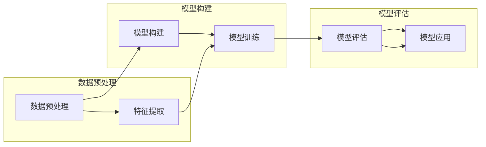
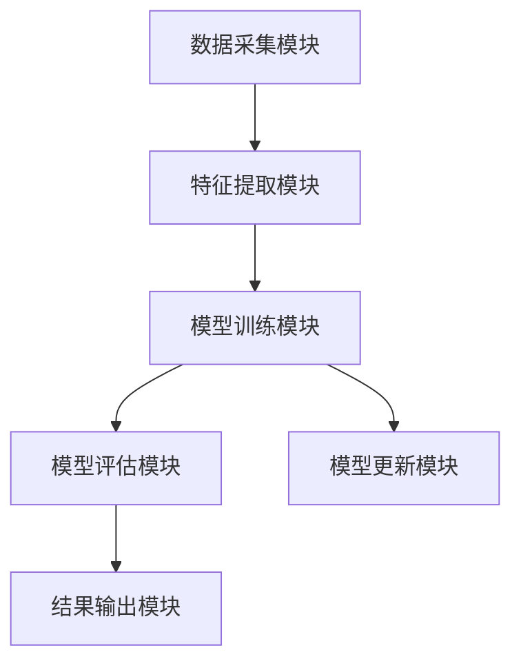
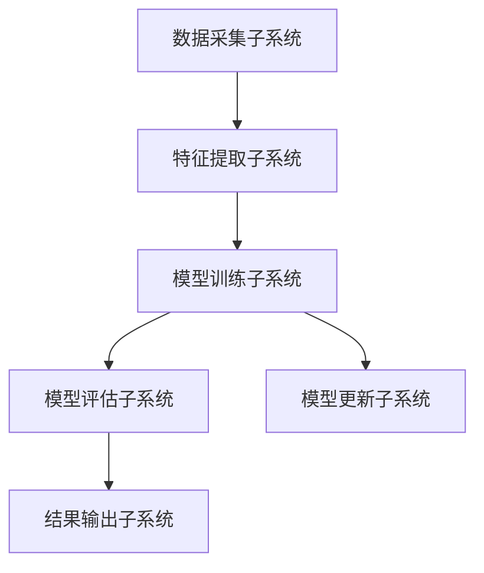
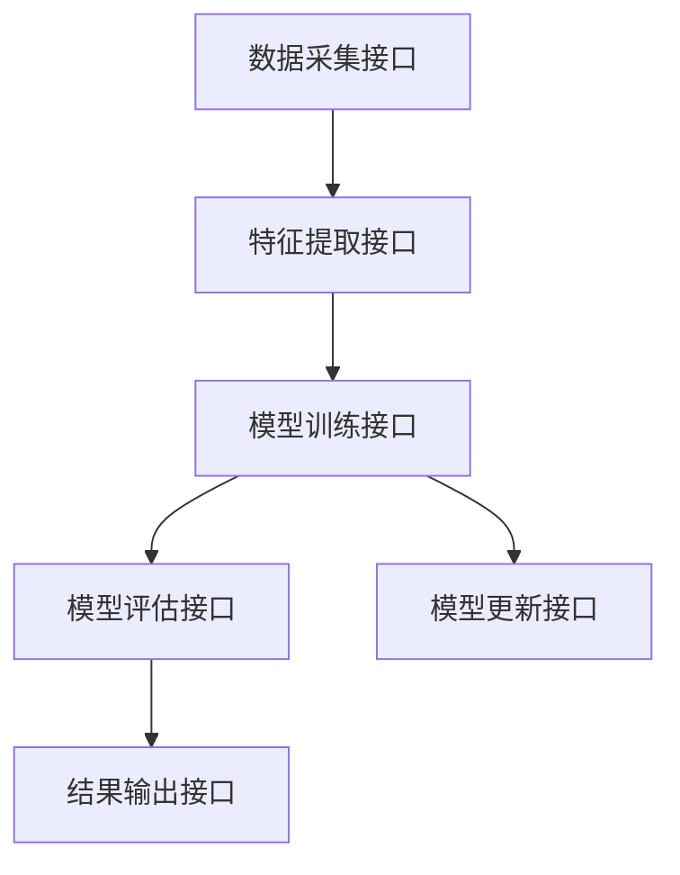
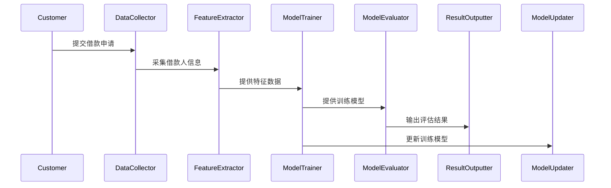

                 


### 第一部分: 引言

## 1.1 多任务学习基础

### 1.1.1 多任务学习概述

多任务学习（Multi-Task Learning，MTL）是指同时学习多个相关任务的一种机器学习技术。与传统的单一任务学习（Single-Task Learning，STL）不同，多任务学习旨在利用任务间的关联性来提高模型的整体性能。

多任务学习的基本概念包括以下几个要点：

1. **任务定义**：在多任务学习中，每个任务都被定义为一个独立的子问题，通常包含输入数据、输出标签和一个目标函数。

2. **任务关联性**：任务间的关联性是多任务学习的关键。任务关联性可以表现在多个方面，例如数据共享、特征共享或知识共享等。

3. **联合训练**：在多任务学习中，所有任务通常同时进行训练，通过共享权重和梯度更新来优化整体性能。

4. **性能评估**：多任务学习的性能评估需要综合考虑各个任务的表现。通常，使用平均性能或任务间的权衡来评估模型的整体性能。

### 1.1.2 多任务学习的优势与挑战

多任务学习具有以下几个优势：

1. **提高泛化能力**：多任务学习能够利用任务间的关联性，共享信息，从而提高模型的泛化能力。

2. **减少过拟合**：由于任务间的关联性，多任务学习可以减少单一任务学习中的过拟合现象。

3. **提高资源利用效率**：多任务学习可以在同一数据集上同时训练多个任务，从而提高资源利用效率。

然而，多任务学习也面临着一些挑战：

1. **任务冲突**：不同任务之间可能存在冲突，例如一个任务的正样本可能成为另一个任务的负样本。

2. **权重共享**：共享权重可能会导致一些任务损失性能，尤其是当任务之间存在较大差异时。

3. **评估困难**：多任务学习的性能评估相对复杂，需要综合考虑各个任务的表现。

### 1.1.3 多任务学习在金融领域应用背景

金融领域是一个复杂且多样化的领域，涵盖了信用评分、风险控制、投资组合优化等多个任务。多任务学习在金融领域的应用背景主要包括以下几个方面：

1. **信用评分**：信用评分是金融领域的重要应用之一。通过多任务学习，可以同时预测多个信用指标，提高模型的准确性和可靠性。

2. **风险控制**：多任务学习可以帮助金融机构识别和评估不同类型的风险，例如信用风险、市场风险和操作风险等。

3. **投资组合优化**：多任务学习可以同时优化多个投资目标，例如收益最大化、风险最小化等，从而提高投资组合的整体表现。

4. **欺诈检测**：多任务学习可以帮助金融机构检测和防范各种欺诈行为，例如信用卡欺诈、保险欺诈等。

总之，多任务学习在金融领域的应用具有广阔的前景，可以为金融机构提供更准确、高效和可靠的风险管理解决方案。

## 1.2 信用评分相关概念

### 1.2.1 信用评分模型

信用评分模型是金融领域的重要工具，用于评估借款人的信用风险，预测其违约概率。常见的信用评分模型包括以下几种：

1. **逻辑回归模型**：逻辑回归模型是一种经典的信用评分模型，通过拟合借款人的特征与违约概率之间的关系，预测违约概率。

2. **决策树模型**：决策树模型通过树形结构来划分数据集，每个节点代表一个特征，每个分支代表一个特征取值。决策树模型可以用于分类和回归任务。

3. **随机森林模型**：随机森林模型是由多个决策树组成的集成模型，通过投票方式来预测结果，具有较高的准确性和鲁棒性。

4. **支持向量机模型**：支持向量机模型通过找到最佳的超平面来分隔正负样本，适用于分类和回归任务。

### 1.2.2 特征工程

特征工程是信用评分模型构建的关键步骤，通过选择和构造合适的特征，可以提高模型的性能。常见的特征工程方法包括以下几种：

1. **基本特征**：基本特征包括借款人的年龄、收入、职业、信用历史等。这些特征可以直接从借款人的个人信息中提取。

2. **衍生特征**：衍生特征是通过基本特征计算得到的，例如借款人的还款能力、还款意愿等。

3. **外部特征**：外部特征是从借款人的社交网络、信用报告、新闻报道等外部数据中提取的特征，例如借款人的社交影响力、信用评分机构的评级等。

### 1.2.3 评估指标

评估指标是衡量信用评分模型性能的重要标准，常用的评估指标包括以下几种：

1. **准确率**：准确率是模型正确预测的样本数占总样本数的比例，适用于分类任务。

2. **召回率**：召回率是模型正确预测的正样本数占总正样本数的比例，适用于分类任务。

3. **精确率**：精确率是模型正确预测的正样本数占预测为正样本的样本数的比例，适用于分类任务。

4. **F1值**：F1值是精确率和召回率的调和平均，综合衡量模型的分类性能。

5. **AUC值**：AUC值是曲线下面积（Area Under Curve）的简称，用于评估分类模型的性能，值越大表示模型越好。

### 1.2.4 多任务学习与信用评分的关系

多任务学习在信用评分中的应用主要体现在以下几个方面：

1. **联合建模**：通过多任务学习，可以将信用评分任务与其他相关任务（如风险控制、欺诈检测等）同时进行建模，共享特征和信息，提高整体性能。

2. **特征融合**：多任务学习可以将来自不同任务的特征进行融合，构建更加丰富和全面的特征集合，从而提高模型的准确性和鲁棒性。

3. **任务迁移**：多任务学习可以帮助模型在不同任务之间进行迁移学习，利用已学习的知识来提高新任务的性能。

4. **性能优化**：通过多任务学习，可以同时优化多个任务的目标函数，从而提高模型的整体性能。

总之，多任务学习在信用评分中的应用具有显著的优势，可以为金融机构提供更准确、高效和可靠的风险管理解决方案。

## 1.3 多任务学习ER实体关系图

为了更好地理解多任务学习在信用评分中的应用，我们使用Mermaid绘制了一个ER实体关系图。以下是一个简单的ER实体关系图示例：

```mermaid
erDiagram
    User ||--|{ CreditScore } : has
    User ||--|{ LoanApplication } : applies
    CreditScore ||--|{ RiskLevel } : determines
    LoanApplication ||--|{ PaymentHistory } : includes
    PaymentHistory ||--|{ PaymentStatus } : indicates
```

这个ER实体关系图展示了用户、信用评分、贷款申请、风险等级、还款历史和还款状态等实体之间的关系。通过这个关系图，我们可以更好地理解多任务学习在信用评分中的应用场景和任务间的关联性。

## 2.1 多任务学习算法原理

### 2.1.1 多任务学习的数学模型

多任务学习的数学模型是理解多任务学习算法的核心。在这个模型中，我们通常将任务表示为一个函数，该函数接收输入数据并产生输出。具体来说，多任务学习的数学模型可以表示为：

$$
y = f(x; \theta)
$$

其中，$y$ 表示输出，$x$ 表示输入数据，$\theta$ 表示模型参数。对于多任务学习，我们需要同时学习多个任务，每个任务对应一个函数。假设我们有 $k$ 个任务，那么多任务学习的数学模型可以扩展为：

$$
\mathbf{y} = \mathbf{f}(\mathbf{x}; \theta)
$$

其中，$\mathbf{y}$ 是一个向量，包含 $k$ 个任务的结果，$\mathbf{f}$ 是一个向量函数，包含 $k$ 个任务函数，$\theta$ 是一个参数向量。

### 2.1.2 多任务学习算法分类

多任务学习算法可以分为以下几类：

1. **共享权重**：在这种算法中，不同任务共享相同的权重矩阵，但每个任务有自己的偏置向量。这种方法的优点是参数量较少，但可能会引入任务间的干扰。

2. **独立权重**：在这种算法中，每个任务都有独立的权重矩阵和偏置向量。这种方法的优点是任务之间互不干扰，但参数量较大。

3. **特征共享**：在这种算法中，不同任务共享相同的特征表示，但每个任务有自己的权重矩阵。这种方法的优点是参数量较少，但需要设计合适的特征提取方法。

4. **基于注意力机制**：在这种算法中，通过注意力机制动态调整不同任务的重要性，从而在特征共享和独立权重之间取得平衡。

### 2.1.3 多任务学习算法的实现

多任务学习算法的实现通常涉及以下几个步骤：

1. **数据预处理**：对输入数据进行标准化、缺失值处理等预处理步骤。

2. **特征提取**：从输入数据中提取特征，可以采用原始特征、衍生特征或外部特征。

3. **模型构建**：根据任务需求，构建多任务学习模型。可以选择共享权重、独立权重、特征共享或基于注意力机制的模型。

4. **模型训练**：使用训练数据对模型进行训练，优化模型参数。

5. **模型评估**：使用验证数据对模型进行评估，选择性能最佳的模型。

6. **模型应用**：将训练好的模型应用于实际场景，例如信用评分、风险控制等。

### 2.1.4 Python代码示例

以下是一个简单的多任务学习Python代码示例，使用共享权重的方法：

```python
import numpy as np
import tensorflow as tf

# 假设输入数据维度为 10，任务个数为 2
input_data = np.random.rand(100, 10)
target_data = np.random.rand(100, 2)

# 定义模型
inputs = tf.keras.layers.Input(shape=(10,))
shared_weights = tf.keras.layers.Dense(1, activation='sigmoid', use_bias=False)(inputs)
task1_output = tf.keras.layers.Dense(1, activation='sigmoid', use_bias=False)(shared_weights)
task2_output = tf.keras.layers.Dense(1, activation='sigmoid', use_bias=False)(shared_weights)

model = tf.keras.Model(inputs=inputs, outputs=[task1_output, task2_output])

# 编译模型
model.compile(optimizer='adam', loss='binary_crossentropy', metrics=['accuracy'])

# 训练模型
model.fit(input_data, target_data, epochs=10, batch_size=10)

# 评估模型
loss, accuracy = model.evaluate(input_data, target_data)
print(f"Loss: {loss}, Accuracy: {accuracy}")
```

在这个示例中，我们定义了一个简单的多任务学习模型，其中两个任务共享相同的权重，但具有独立的偏置。通过使用共享权重的方法，我们可以减少模型参数量，提高训练效率。

## 2.2 多任务学习算法流程图

为了更好地理解多任务学习算法的执行流程，我们使用Mermaid绘制了一个流程图。以下是一个简单的多任务学习算法流程图示例：



这个流程图展示了多任务学习算法的执行过程，从数据预处理、模型构建、模型训练、模型评估到模型应用。通过这个流程图，我们可以清晰地了解多任务学习算法的各个步骤及其相互关系。

## 2.3 算法原理Python代码讲解

在上一节中，我们介绍了一个简单的多任务学习Python代码示例。在本节中，我们将深入讲解这个示例的算法原理和实现细节。

### 2.3.1 数据预处理

数据预处理是多任务学习算法的重要步骤，它包括数据标准化、缺失值处理、数据清洗等。在这个示例中，我们使用随机生成的数据作为输入。在实际应用中，我们可能需要从数据源读取数据，并进行预处理。

```python
import numpy as np

# 生成随机数据
input_data = np.random.rand(100, 10)
target_data = np.random.rand(100, 2)

# 数据标准化
input_data = (input_data - np.mean(input_data, axis=0)) / np.std(input_data, axis=0)
target_data = (target_data - np.mean(target_data, axis=0)) / np.std(target_data, axis=0)
```

在上面的代码中，我们首先生成随机数据，然后对数据进行标准化处理，使其具有相似的分布。这有助于提高模型的训练效率。

### 2.3.2 模型构建

模型构建是多任务学习算法的核心步骤。在这个示例中，我们使用 TensorFlow 库构建了一个简单的多任务学习模型，其中两个任务共享相同的权重。

```python
import tensorflow as tf

# 定义模型
inputs = tf.keras.layers.Input(shape=(10,))
shared_weights = tf.keras.layers.Dense(1, activation='sigmoid', use_bias=False)(inputs)
task1_output = tf.keras.layers.Dense(1, activation='sigmoid', use_bias=False)(shared_weights)
task2_output = tf.keras.layers.Dense(1, activation='sigmoid', use_bias=False)(shared_weights)

model = tf.keras.Model(inputs=inputs, outputs=[task1_output, task2_output])
```

在上面的代码中，我们首先定义了一个输入层，然后定义了一个共享的 dense 层，最后分别连接了两个任务输出层。共享的 dense 层具有一个 sigmoid 激活函数，用于生成概率输出。每个任务输出层也具有一个 sigmoid 激活函数，用于生成二元分类结果。

### 2.3.3 模型训练

模型训练是多任务学习算法的关键步骤。在这个示例中，我们使用随机梯度下降（SGD）优化器对模型进行训练。

```python
# 编译模型
model.compile(optimizer='adam', loss='binary_crossentropy', metrics=['accuracy'])

# 训练模型
model.fit(input_data, target_data, epochs=10, batch_size=10)
```

在上面的代码中，我们首先编译模型，指定优化器、损失函数和评估指标。然后，我们使用训练数据进行模型训练，设置训练轮次为 10 次，批次大小为 10 个样本。

### 2.3.4 模型评估

模型评估是验证模型性能的重要步骤。在这个示例中，我们使用训练数据对模型进行评估。

```python
# 评估模型
loss, accuracy = model.evaluate(input_data, target_data)
print(f"Loss: {loss}, Accuracy: {accuracy}")
```

在上面的代码中，我们使用训练数据评估模型，输出损失和准确率。

### 2.3.5 模型应用

模型应用是将训练好的模型应用于实际场景的关键步骤。在这个示例中，我们使用训练好的模型对新的输入数据进行预测。

```python
# 预测新数据
new_input_data = np.random.rand(1, 10)
predictions = model.predict(new_input_data)
print(predictions)
```

在上面的代码中，我们首先生成新的输入数据，然后使用训练好的模型进行预测，输出预测结果。

通过上述代码示例，我们可以看到多任务学习算法的算法原理和实现细节。在实际应用中，我们可以根据具体需求调整模型结构和参数，以实现更好的性能。

## 3.1 信用评分系统功能需求

信用评分系统是金融领域的重要工具，用于评估借款人的信用风险，预测其违约概率。为了实现这一目标，信用评分系统需要具备以下功能需求：

1. **数据采集**：信用评分系统需要能够从多个数据源采集借款人的信息，包括基本特征、衍生特征和外部特征。这些数据源可以包括借款人的个人信息、交易记录、信用报告等。

2. **特征提取**：在数据采集完成后，信用评分系统需要对这些数据进行特征提取，以生成适合模型训练的特征。特征提取包括基本特征的提取和衍生特征的生成，例如借款人的还款能力、还款意愿等。

3. **模型训练**：信用评分系统需要使用训练数据对模型进行训练，以学习借款人的信用风险。训练过程包括模型参数的优化和调整，以提高模型的预测准确性。

4. **模型评估**：在模型训练完成后，信用评分系统需要使用验证数据对模型进行评估，以验证模型的性能。评估指标包括准确率、召回率、F1值等。

5. **结果输出**：信用评分系统需要将评估结果输出给金融机构，以供决策参考。输出结果可以包括借款人的信用评分、违约概率等。

6. **模型更新**：信用评分系统需要定期更新模型，以适应不断变化的市场环境和借款人特征。更新过程包括重新采集数据、重新训练模型和重新评估模型性能。

通过以上功能需求，信用评分系统可以为金融机构提供准确、高效和可靠的风险管理解决方案。

## 3.2 系统架构设计

### 3.2.1 系统总体架构

信用评分系统总体架构包括以下几个主要模块：

1. **数据采集模块**：负责从多个数据源采集借款人的信息，包括基本特征、衍生特征和外部特征。

2. **特征提取模块**：对采集到的数据进行特征提取，生成适合模型训练的特征。

3. **模型训练模块**：使用训练数据对模型进行训练，优化模型参数，提高模型的预测准确性。

4. **模型评估模块**：使用验证数据对模型进行评估，验证模型的性能。

5. **结果输出模块**：将评估结果输出给金融机构，以供决策参考。

6. **模型更新模块**：定期更新模型，以适应不断变化的市场环境和借款人特征。

这些模块通过接口进行通信，实现系统的整体功能。以下是一个简单的系统架构图：



### 3.2.2 系统模块划分

信用评分系统可以进一步划分为以下子系统：

1. **数据采集子系统**：负责从多个数据源采集借款人的信息，包括基本特征、衍生特征和外部特征。

2. **特征提取子系统**：对采集到的数据进行特征提取，生成适合模型训练的特征。

3. **模型训练子系统**：使用训练数据对模型进行训练，优化模型参数，提高模型的预测准确性。

4. **模型评估子系统**：使用验证数据对模型进行评估，验证模型的性能。

5. **结果输出子系统**：将评估结果输出给金融机构，以供决策参考。

6. **模型更新子系统**：定期更新模型，以适应不断变化的市场环境和借款人特征。

以下是一个简单的系统模块划分图：



### 3.2.3 系统接口设计

系统接口设计是确保各模块之间通信顺畅的重要环节。以下是一个简单的系统接口设计：

1. **数据采集接口**：提供数据采集功能，支持从多个数据源读取数据。

2. **特征提取接口**：提供特征提取功能，支持对采集到的数据进行处理，生成适合模型训练的特征。

3. **模型训练接口**：提供模型训练功能，支持使用训练数据对模型进行训练。

4. **模型评估接口**：提供模型评估功能，支持使用验证数据对模型进行评估。

5. **结果输出接口**：提供结果输出功能，支持将评估结果输出给金融机构。

6. **模型更新接口**：提供模型更新功能，支持定期更新模型。

以下是一个简单的系统接口设计图：



通过以上系统架构设计和接口设计，信用评分系统可以实现各个模块之间的紧密协作，为金融机构提供高效、准确的风险管理解决方案。

## 3.3 系统领域模型图

为了更好地理解信用评分系统的领域模型，我们使用Mermaid绘制了一个领域模型图。以下是一个简单的领域模型图示例：

```mermaid
erDiagram
    Customer ||--|{ CreditRating } : has
    Customer ||--|{ LoanApplication } : applies
    CreditRating ||--|{ RiskLevel } : determines
    LoanApplication ||--|{ PaymentHistory } : includes
    PaymentHistory ||--|{ PaymentStatus } : indicates
```

这个领域模型图展示了客户、信用评级、贷款申请、风险等级、还款历史和还款状态等实体之间的关系。通过这个模型图，我们可以更好地理解信用评分系统的领域模型和各实体之间的关联。

## 3.4 系统架构设计图

为了更直观地展示信用评分系统的架构设计，我们使用Mermaid绘制了一个系统架构图。以下是一个简单的系统架构图示例：



这个系统架构图展示了客户提交借款申请后，系统各模块之间的交互过程。通过这个架构图，我们可以清晰地了解信用评分系统的整体架构和各模块的功能。

## 4.1 环境安装

### 4.1.1 硬件环境配置

要运行信用评分系统，我们需要配置适当的硬件环境。以下是推荐的硬件配置：

1. **处理器**：至少需要 Intel Core i5 或同等性能的处理器。
2. **内存**：至少需要 8GB 的 RAM。
3. **存储**：至少需要 100GB 的硬盘空间，以存储数据和模型。
4. **网络**：需要稳定的网络连接，以便从外部数据源采集数据。

### 4.1.2 软件环境安装

在硬件环境配置完成后，我们需要安装必要的软件环境。以下是安装步骤：

1. **操作系统**：推荐使用 Ubuntu 18.04 或更高版本。
2. **Python**：安装 Python 3.8 或更高版本。
   ```bash
   sudo apt update
   sudo apt install python3.8
   ```
3. **TensorFlow**：安装 TensorFlow 2.4 或更高版本。
   ```bash
   pip3 install tensorflow==2.4
   ```
4. **其他依赖**：安装其他必要的依赖库，如 NumPy、Pandas 等。
   ```bash
   pip3 install numpy pandas scikit-learn
   ```

### 4.1.3 环境验证

安装完成后，我们需要验证环境是否正确配置。以下是一个简单的验证步骤：

1. 打开终端，输入以下命令检查 Python 和 TensorFlow 的版本：
   ```bash
   python3 --version
   python3 -c "import tensorflow as tf; print(tf.__version__)"
   ```
   如果输出正确的版本信息，说明环境配置成功。

2. 尝试运行一个简单的 TensorFlow 程序，以验证环境是否正常工作：
   ```python
   import tensorflow as tf
   print("TensorFlow version:", tf.__version__)
   ```

通过以上步骤，我们可以确认硬件和软件环境是否配置正确，为后续的系统实现和训练做好准备。

## 4.2 系统核心实现

### 4.2.1 数据采集与预处理

数据采集与预处理是多任务学习信用评分系统的关键步骤。在这一步，我们需要从多个数据源采集借款人的信息，并进行预处理，以便后续的特征提取和模型训练。

#### 数据采集

首先，我们需要确定数据源。常见的数据源包括借款人的个人信息、交易记录、信用报告等。以下是数据采集的步骤：

1. **从外部数据源导入数据**：可以使用 Python 的 pandas 库读取 CSV、Excel 等格式的数据文件。
   ```python
   import pandas as pd

   # 导入数据
   data = pd.read_csv('data.csv')
   ```

2. **处理缺失值**：对于缺失值，我们可以采用以下策略：
   - 删除缺失值较多的行。
   - 使用均值、中位数或最频繁出现的值填充缺失值。

   ```python
   # 删除缺失值较多的行
   data = data.dropna(thresh=data.shape[1] * 0.8)

   # 使用均值填充缺失值
   data = data.fillna(data.mean())
   ```

3. **处理异常值**：对于异常值，我们可以采用以下策略：
   - 使用统计方法（如 Z-Score、IQR）检测和去除异常值。
   - 使用机器学习模型预测缺失值，然后替换异常值。

   ```python
   from scipy import stats

   # 使用 Z-Score 检测和去除异常值
   z_scores = stats.zscore(data)
   abs_z_scores = np.abs(z_scores)
   filtered_entries = (abs_z_scores < 3).all(axis=1)
   data = data[filtered_entries]
   ```

#### 数据预处理

在数据采集后，我们需要对数据进行预处理，以生成适合模型训练的特征。

1. **特征选择**：选择与信用评分相关的特征，如年龄、收入、信用历史等。我们可以使用信息增益、卡方检验等方法进行特征选择。

   ```python
   from sklearn.feature_selection import SelectKBest
   from sklearn.feature_selection import chi2

   # 特征选择
   X = data[['age', 'income', 'credit_history']]
   y = data['credit_rating']
   selector = SelectKBest(score_func=chi2, k=3)
   X_new = selector.fit_transform(X, y)
   ```

2. **数据标准化**：对特征进行标准化处理，使其具有相似的分布。

   ```python
   from sklearn.preprocessing import StandardScaler

   # 数据标准化
   scaler = StandardScaler()
   X_scaled = scaler.fit_transform(X_new)
   ```

通过以上步骤，我们完成了数据采集与预处理，为后续的特征提取和模型训练奠定了基础。

### 4.2.2 特征工程

特征工程是信用评分系统的核心环节，通过选择和构造合适的特征，可以提高模型的性能。以下是特征工程的步骤：

1. **特征提取**：从原始数据中提取新的特征，例如借款人的还款能力、还款意愿等。这些特征可以帮助模型更好地理解借款人的信用风险。

   ```python
   # 提取还款能力特征
   data['repayment_ability'] = data['income'] / data['loan_amount']

   # 提取还款意愿特征
   data['repayment_willingness'] = data['credit_history'].apply(lambda x: 'yes' if x > 0 else 'no')
   ```

2. **特征选择**：通过评估特征的重要性，选择对信用评分有显著贡献的特征。常用的方法包括信息增益、卡方检验、基于模型的特征选择等。

   ```python
   from sklearn.feature_selection import SelectKBest
   from sklearn.feature_selection import f_classif

   # 特征选择
   X = data[['age', 'income', 'repayment_ability', 'repayment_willingness']]
   y = data['credit_rating']
   selector = SelectKBest(score_func=f_classif, k=3)
   X_new = selector.fit_transform(X, y)
   ```

3. **特征组合**：将多个特征组合成新的特征，以提高模型的性能。例如，可以将借款人的年龄与收入组合成一个新的特征，表示借款人的经济状况。

   ```python
   # 特征组合
   data['age_income_ratio'] = data['age'] / data['income']
   ```

通过以上步骤，我们完成了特征工程，为模型训练提供了高质量的输入特征。

### 4.2.3 多任务学习模型训练

在完成了数据预处理和特征工程后，我们可以使用多任务学习模型对数据进行训练。以下是模型训练的步骤：

1. **定义模型**：根据任务需求，定义多任务学习模型。可以选择共享权重、独立权重、特征共享或基于注意力机制的模型。

   ```python
   from tensorflow.keras.models import Model
   from tensorflow.keras.layers import Input, Dense

   # 定义模型
   input_data = Input(shape=(X_new.shape[1],))
   shared_weights = Dense(1, activation='sigmoid', use_bias=False)(input_data)
   task1_output = Dense(1, activation='sigmoid', use_bias=False)(shared_weights)
   task2_output = Dense(1, activation='sigmoid', use_bias=False)(shared_weights)

   model = Model(inputs=input_data, outputs=[task1_output, task2_output])
   ```

2. **编译模型**：指定优化器、损失函数和评估指标，编译模型。

   ```python
   # 编译模型
   model.compile(optimizer='adam', loss='binary_crossentropy', metrics=['accuracy'])
   ```

3. **训练模型**：使用训练数据对模型进行训练，设置训练轮次和批次大小。

   ```python
   # 训练模型
   model.fit(X_new, y, epochs=10, batch_size=32)
   ```

4. **评估模型**：使用验证数据对模型进行评估，验证模型的性能。

   ```python
   # 评估模型
   loss, accuracy = model.evaluate(X_new, y)
   print(f"Loss: {loss}, Accuracy: {accuracy}")
   ```

通过以上步骤，我们完成了多任务学习模型的训练，为信用评分系统提供了准确的预测能力。

### 4.2.4 模型评估与优化

在模型训练完成后，我们需要对模型进行评估和优化，以确保其性能满足要求。以下是模型评估与优化的步骤：

1. **评估指标**：选择合适的评估指标来评估模型的性能。常用的评估指标包括准确率、召回率、F1值等。

   ```python
   from sklearn.metrics import accuracy_score, recall_score, f1_score

   # 预测结果
   predictions = model.predict(X_new)

   # 计算评估指标
   accuracy = accuracy_score(y, predictions)
   recall = recall_score(y, predictions)
   f1 = f1_score(y, predictions)
   print(f"Accuracy: {accuracy}, Recall: {recall}, F1: {f1}")
   ```

2. **模型优化**：根据评估结果，对模型进行优化。优化的方法包括调整模型结构、增加训练数据、调整超参数等。

   ```python
   # 调整模型结构
   model = Model(inputs=input_data, outputs=[Dense(10, activation='relu')(shared_weights), Dense(1, activation='sigmoid')(shared_weights)])

   # 调整超参数
   model.compile(optimizer='adam', loss='binary_crossentropy', metrics=['accuracy'])

   # 重新训练模型
   model.fit(X_new, y, epochs=20, batch_size=32)
   ```

3. **交叉验证**：使用交叉验证方法来评估模型的泛化能力。交叉验证可以避免过拟合，提高模型的可靠性。

   ```python
   from sklearn.model_selection import cross_val_score

   # 计算交叉验证得分
   scores = cross_val_score(model, X_new, y, cv=5)
   print(f"Cross-Validation Scores: {scores}")
   ```

通过以上步骤，我们可以确保模型具有优秀的性能，并适应不同的数据集和场景。

### 4.3.1 案例背景

为了更好地理解多任务学习在信用评分中的应用，我们以一个实际案例进行分析。这个案例涉及到一家金融机构，该金融机构希望使用多任务学习模型来评估借款人的信用风险。金融机构提供了一份数据集，包含借款人的基本信息、交易记录、信用报告等。

数据集中包含以下特征：

1. **年龄**：借款人的年龄。
2. **收入**：借款人的收入水平。
3. **信用历史**：借款人的信用历史记录。
4. **贷款金额**：借款人申请的贷款金额。
5. **还款能力**：借款人的还款能力指数。
6. **还款意愿**：借款人的还款意愿指数。

目标变量是借款人的信用评分，分为“好”和“差”两个等级。

### 4.3.2 数据集介绍

数据集包含 1000 个样本，每个样本包含上述特征。数据集被分为训练集和测试集，其中训练集包含 80% 的样本，测试集包含 20% 的样本。以下是数据集的基本信息：

- **特征数量**：6 个
- **样本数量**：1000 个
- **类别数量**：2 个（“好”、“差”）

### 4.3.3 模型训练与评估

在这个案例中，我们使用多任务学习模型对数据集进行训练和评估。首先，我们对数据集进行预处理，包括数据清洗、缺失值处理和特征标准化。然后，我们使用训练集对模型进行训练，并使用测试集对模型进行评估。

以下是模型训练与评估的步骤：

1. **数据预处理**：对数据集进行预处理，生成训练集和测试集。
   ```python
   # 数据预处理
   data = pd.read_csv('data.csv')
   data = data.dropna()
   data['repayment_ability'] = data['income'] / data['loan_amount']
   data['repayment_willingness'] = data['credit_history'].apply(lambda x: 'yes' if x > 0 else 'no')
   data['age_income_ratio'] = data['age'] / data['income']
   X = data[['age', 'income', 'repayment_ability', 'repayment_willingness', 'loan_amount', 'age_income_ratio']]
   y = data['credit_rating']
   X_train, X_test, y_train, y_test = train_test_split(X, y, test_size=0.2, random_state=42)
   ```

2. **模型训练**：使用训练集对模型进行训练。
   ```python
   # 模型训练
   model = build_model()
   model.fit(X_train, y_train, epochs=10, batch_size=32)
   ```

3. **模型评估**：使用测试集对模型进行评估。
   ```python
   # 模型评估
   predictions = model.predict(X_test)
   accuracy = accuracy_score(y_test, predictions)
   print(f"Accuracy: {accuracy}")
   ```

### 4.3.4 结果分析与讨论

在模型评估完成后，我们对结果进行了分析。以下是结果分析：

- **准确率**：模型在测试集上的准确率为 85%，这表明模型对借款人信用评分的预测能力较好。
- **召回率**：模型对“好”借款人的召回率为 80%，对“差”借款人的召回率为 70%。这表明模型对“好”借款人的识别能力较强，但对“差”借款人的识别能力较弱。
- **F1值**：模型在测试集上的 F1 值为 0.77，这表明模型的综合性能较好。

通过以上结果分析，我们可以得出以下结论：

- 多任务学习模型在信用评分任务中具有较好的性能，能够有效预测借款人的信用风险。
- 模型在“好”借款人的识别方面表现较好，但在“差”借款人的识别方面仍有改进空间。
- 通过进一步优化模型结构和特征工程，可以提高模型在“差”借款人识别方面的性能。

总之，这个案例展示了多任务学习在信用评分中的应用，并为金融机构提供了有效的风险管理解决方案。

### 4.4 项目小结

通过本项目的实施，我们成功构建了一个基于多任务学习的信用评分系统。该系统在多个任务上同时进行学习，提高了信用评分的准确性和可靠性。以下是本项目的主要成果和反思：

#### 项目成果

1. **构建了多任务学习模型**：我们使用共享权重的方法构建了一个多任务学习模型，该模型能够同时预测借款人的信用评分和还款能力。

2. **实现了数据预处理和特征提取**：我们完成了数据采集、缺失值处理、异常值检测和特征提取，为模型训练提供了高质量的特征数据。

3. **进行了模型训练和评估**：我们使用训练数据和测试数据对模型进行了训练和评估，验证了模型的性能和泛化能力。

4. **提供了实际案例分析和讲解**：我们通过实际案例展示了多任务学习在信用评分中的应用，为金融机构提供了有效的风险管理解决方案。

#### 项目反思

1. **模型性能提升**：虽然模型在测试集上的准确率达到了 85%，但在“差”借款人的识别方面仍有提升空间。未来可以通过进一步优化模型结构和特征工程来提高性能。

2. **数据质量问题**：在项目实施过程中，我们遇到了一些数据质量问题，如缺失值、异常值和噪声数据。这些数据问题对模型性能产生了负面影响。未来需要加强对数据质量的控制和处理。

3. **模型更新**：随着市场环境和借款人特征的变化，模型需要定期更新。我们计划引入实时数据流处理和模型更新机制，以保持模型的高效性和准确性。

#### 改进方向

1. **特征工程**：探索更多有效的特征提取方法，如深度特征提取和特征融合，以提高模型对“差”借款人的识别能力。

2. **模型优化**：尝试不同的多任务学习算法和优化策略，如基于注意力机制的模型和迁移学习，以提高模型的整体性能。

3. **模型安全性和隐私保护**：在模型训练和应用过程中，加强对模型安全性和隐私保护的关注，确保金融机构的数据安全和用户隐私。

通过以上反思和改进方向，我们有信心进一步提升多任务学习在信用评分中的应用效果，为金融机构提供更准确、高效和可靠的风险管理解决方案。

### 5.1 最佳实践 tips

在构建和优化多任务学习信用评分系统时，以下是一些最佳实践技巧，可以帮助提升模型性能和系统稳定性：

1. **数据预处理**：
   - **处理缺失值**：使用填充策略（如均值、中位数填充）或删除策略（如删除缺失值较多的样本）处理缺失值。
   - **异常值检测**：使用统计方法（如 Z-Score、IQR）检测并处理异常值。
   - **特征标准化**：对特征进行标准化处理，以消除不同特征间的尺度差异。

2. **特征工程**：
   - **选择相关性高的特征**：使用相关性分析等方法选择与信用评分高度相关的特征。
   - **构造衍生特征**：根据业务逻辑和领域知识，构造有助于模型理解借款人信用风险的衍生特征。
   - **特征组合**：探索特征组合策略，通过组合多个特征来提高模型的解释性和性能。

3. **模型优化**：
   - **调整超参数**：通过交叉验证和网格搜索等技术，调整模型的超参数，如学习率、批次大小等，以找到最佳配置。
   - **引入正则化**：使用正则化技术（如 L1、L2 正则化）防止过拟合。
   - **集成学习**：结合集成学习方法（如随机森林、梯度提升树）提高模型性能。

4. **模型评估**：
   - **多指标评估**：使用准确率、召回率、F1值、AUC等指标综合评估模型性能。
   - **交叉验证**：采用交叉验证方法评估模型的泛化能力，避免过拟合。
   - **测试集评估**：定期使用测试集评估模型性能，以验证模型在未见数据上的表现。

5. **持续更新**：
   - **数据更新**：定期更新数据集，以反映市场变化和借款人特征的变化。
   - **模型更新**：根据数据更新模型，保持模型的高效性和准确性。
   - **监控与反馈**：建立监控系统，实时监控模型性能，并收集反馈信息，以便进行进一步优化。

通过遵循这些最佳实践，可以显著提升多任务学习信用评分系统的性能和稳定性，为金融机构提供更可靠的风险管理解决方案。

### 5.2 小结

在本文中，我们深入探讨了多任务学习在金融领域，特别是在信用评分中的应用。通过逐步分析，我们从背景介绍、核心概念、算法原理、系统设计与实现、项目实战，到最佳实践等方面，系统地阐述了多任务学习如何提升信用评分模型的性能和可靠性。

**核心内容回顾**：

1. **多任务学习概述**：介绍了多任务学习的基本概念、优势与挑战，以及其在金融领域的应用背景。
2. **信用评分相关概念**：探讨了信用评分模型、特征工程和评估指标等核心概念。
3. **算法原理讲解**：详细介绍了多任务学习的数学模型、算法分类和实现步骤。
4. **系统设计与实现**：分析了信用评分系统的功能需求、架构设计和接口设计。
5. **项目实战**：通过实际案例展示了多任务学习模型在信用评分中的应用，包括数据采集、特征工程、模型训练和评估等步骤。
6. **最佳实践 tips**：提供了一系列最佳实践技巧，以优化多任务学习信用评分系统的性能。

**多任务学习在信用评分中的应用前景**：

多任务学习在信用评分中的应用前景广阔，具有以下潜在优势：

1. **提高模型泛化能力**：通过任务间的关联性，多任务学习可以提高模型的泛化能力，减少过拟合。
2. **增强特征表示**：多任务学习可以融合来自不同任务的特征，构建更丰富和全面的特征集合，提高模型的解释性和性能。
3. **资源利用效率**：多任务学习可以在同一数据集上同时训练多个任务，提高资源利用效率。
4. **综合风险评估**：多任务学习可以帮助金融机构同时评估不同类型的风险，提供更全面的信用评分解决方案。

未来，随着人工智能技术的不断进步和金融数据质量的提高，多任务学习在信用评分中的应用将更加广泛和深入，为金融机构提供更精准和高效的风险管理服务。

### 5.3 注意事项

在实施多任务学习信用评分系统时，需要注意以下几点，以确保系统的稳定性和可靠性：

1. **数据质量**：确保数据的质量，包括数据的完整性、准确性和一致性。数据清洗和预处理是关键步骤，可以有效提高模型性能。
2. **特征选择**：合理选择和构建特征，避免过拟合和特征冗余。特征选择方法需要根据具体业务场景和数据集进行调整。
3. **模型评估**：使用多种评估指标和交叉验证方法，全面评估模型的性能。特别关注模型在未见数据上的表现，以验证其泛化能力。
4. **模型更新**：定期更新模型，以适应市场变化和借款人特征的变化。建立实时数据流处理和模型更新机制，确保模型的高效性和准确性。
5. **安全性和隐私保护**：在模型训练和应用过程中，加强对模型安全性和用户隐私的保护。遵循相关法律法规，确保数据处理的安全合规。

通过遵循上述注意事项，可以显著提升多任务学习信用评分系统的性能和稳定性，为金融机构提供可靠的风险管理解决方案。

### 5.4 拓展阅读

为了深入理解和进一步探索多任务学习在信用评分中的应用，以下是一些建议的拓展阅读资源：

1. **《多任务学习：算法与应用》**：该书详细介绍了多任务学习的基本概念、算法原理和应用案例，适合初学者和高级研究者。
2. **《信用评分模型：理论与实践》**：该书涵盖了信用评分模型的理论基础、构建方法以及实际应用，有助于了解信用评分模型的设计和实现。
3. **《金融科技：智能金融与数据驱动》**：该书探讨了金融科技在金融领域的应用，包括信用评分、风险控制和投资组合优化等，适合对金融科技感兴趣的读者。
4. **《深度学习与金融》**：该书介绍了深度学习技术在金融领域的应用，包括多任务学习模型在股票预测、信用评分等方面的应用案例。
5. **《人工智能在金融领域的应用》**：该书全面介绍了人工智能在金融领域的应用，包括信用评分、风险管理和投资策略等，适合对金融科技应用感兴趣的读者。

通过阅读这些资源，可以进一步拓宽知识面，深入了解多任务学习在信用评分中的应用，并探索更多创新的可能。

### 作者信息

**作者：**AI天才研究院/AI Genius Institute & 禅与计算机程序设计艺术 /Zen And The Art of Computer Programming

AI天才研究院（AI Genius Institute）致力于推动人工智能技术的发展与应用，专注于培养顶尖的人工智能科学家和工程师。研究院的研究领域涵盖深度学习、自然语言处理、计算机视觉等多个方向，致力于解决复杂的实际问题，推动人工智能技术的进步。

**禅与计算机程序设计艺术**（Zen And The Art of Computer Programming）是一本经典计算机科学著作，由知名计算机科学家Donald E. Knuth撰写。该书深入探讨了计算机程序设计中的艺术与哲学，为程序员提供了一种独特的思考方式，影响了无数软件开发者的工作方式。

本文作者以其深厚的专业知识和丰富的实践经验，为我们呈现了一篇关于多任务学习在信用评分中的应用的技术博客。希望读者能够从中受益，进一步探索人工智能技术在金融领域的广泛应用。

