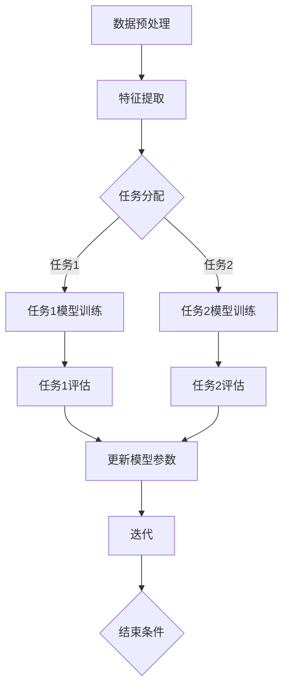
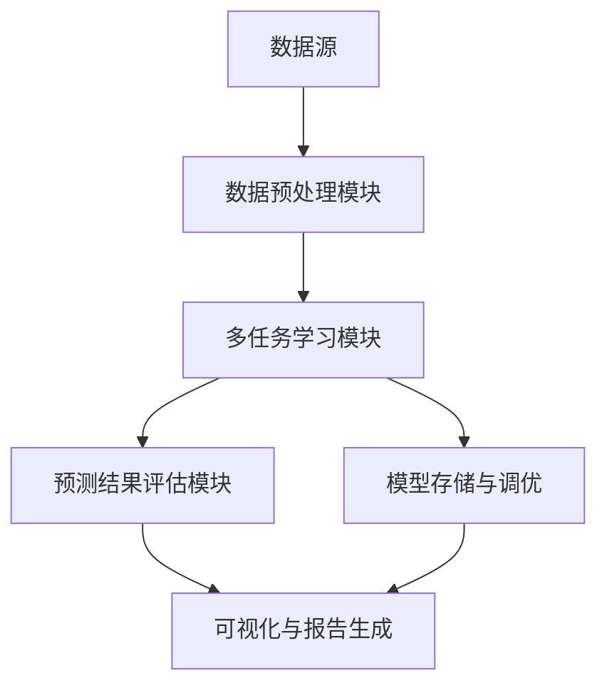
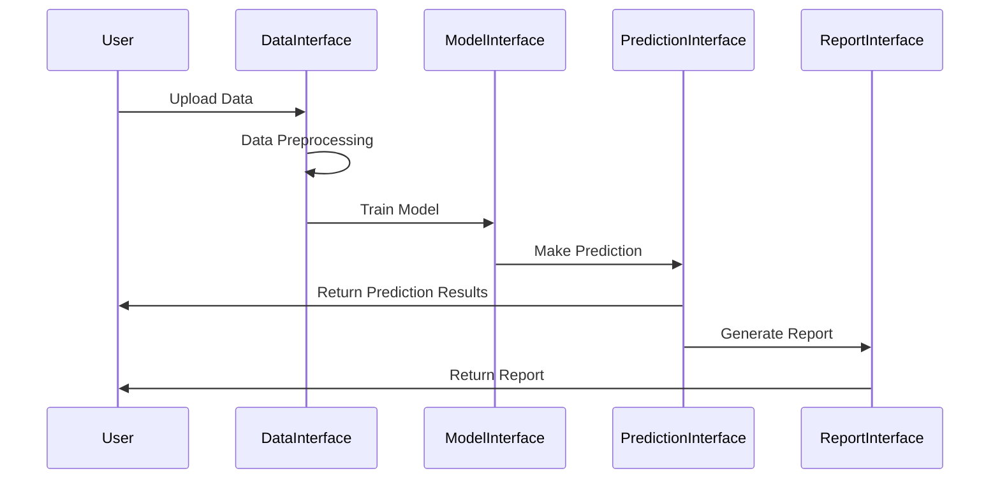

                 

### 文章标题

# 金融领域多任务学习的应用与挑战

### 关键词

- 多任务学习
- 金融领域
- 应用与挑战
- 算法原理
- 系统设计与实现

### 摘要

本文将探讨金融领域多任务学习的应用与挑战。首先，我们简要介绍多任务学习的基本概念及其在金融领域的需求与重要性。接着，深入剖析多任务学习在金融领域的具体应用，以及面临的复杂性和挑战。随后，详细讲解多任务学习算法的原理，包括分类、优缺点、适用性等。接下来，通过mermaid流程图和Python代码展示算法的实现，并使用latex格式介绍算法的数学模型。文章还涉及多任务学习在金融领域的系统分析与架构设计，包括问题场景、系统功能、系统架构等。最后，通过项目实战案例，详细讲解实际金融问题中的多任务学习应用，并提供最佳实践建议。

## 目录大纲设计思路

为了设计出一本关于《金融领域多任务学习的应用与挑战》的详细目录大纲，我们将遵循以下步骤：

1. **确定总体结构**：首先，明确本书的总体结构和章节安排，保证每个章节都有明确的目的和主要内容。

2. **细化每个章节**：为每个章节进一步细分，确定二级和三级子章节，确保每个子章节都有具体的讨论点。

3. **核心内容涵盖**：根据书籍主题，确定需要包含的核心内容，如背景介绍、核心概念、应用案例分析、挑战与展望等。

4. **逻辑清晰**：确保目录大纲的层次结构和内容之间的逻辑关系清晰，便于读者理解。

5. **简洁明了**：遵循简洁性的原则，避免冗余内容，确保每个章节都能直接传达其核心信息。

下面是基于上述步骤设计的具体目录大纲：

----------------------------------------------------------------

# 第一部分: 引言

## 1.1 问题背景

### 1.1.1 金融领域的多任务学习需求

### 1.1.2 多任务学习的概念与意义

### 1.1.3 多任务学习在金融领域的重要性

## 1.2 问题描述

### 1.2.1 金融数据的复杂性

### 1.2.2 多任务学习在金融领域的挑战

### 1.2.3 多任务学习与金融应用结合的边界

## 1.3 问题解决

### 1.3.1 多任务学习的基本原理

### 1.3.2 多任务学习在金融领域的应用现状

### 1.3.3 解决金融领域多任务学习挑战的策略

## 1.4 边界与外延

### 1.4.1 多任务学习与其他机器学习方法的区别

### 1.4.2 多任务学习在金融领域的研究进展

### 1.4.3 多任务学习在金融领域的未来发展趋势

## 1.5 本章小结

...

----------------------------------------------------------------

# 第二部分: 核心概念与联系

## 2.1 多任务学习的基本概念

### 2.1.1 多任务学习的定义

### 2.1.2 多任务学习的特点

### 2.1.3 多任务学习与传统机器学习的区别

## 2.2 多任务学习的概念属性特征对比

### 2.2.1 多任务学习与单任务学习的对比

### 2.2.2 多任务学习与迁移学习的对比

### 2.2.3 多任务学习与强化学习的对比

## 2.3 多任务学习在金融领域的应用

### 2.3.1 金融领域多任务学习的案例

### 2.3.2 金融领域多任务学习的关键问题

### 2.3.3 金融领域多任务学习的效果评估

## 2.4 本章小结

...

----------------------------------------------------------------

# 第三部分: 算法原理讲解

## 3.1 多任务学习算法概述

### 3.1.1 多任务学习算法的分类

### 3.1.2 多任务学习算法的优缺点分析

### 3.1.3 多任务学习算法在金融领域的适用性

## 3.2 多任务学习算法的mermaid流程图

### 3.2.1 多任务学习算法的基本流程

### 3.2.2 多任务学习算法的数据流程

### 3.2.3 多任务学习算法的模型流程

## 3.3 多任务学习算法的python源代码

### 3.3.1 算法核心代码解释

### 3.3.2 算法应用实例

### 3.3.3 算法数学模型和公式

## 3.4 算法原理讲解与举例说明

### 3.4.1 数学模型与公式讲解

### 3.4.2 算法应用实例分析

### 3.4.3 算法在实际金融问题中的应用效果

## 3.5 本章小结

...

----------------------------------------------------------------

# 第四部分: 系统分析与架构设计

## 4.1 问题场景介绍

### 4.1.1 金融领域多任务学习问题的描述

### 4.1.2 多任务学习在金融领域的应用场景

### 4.1.3 多任务学习在金融领域的挑战

## 4.2 项目介绍

### 4.2.1 项目背景

### 4.2.2 项目目标

### 4.2.3 项目团队与资源

## 4.3 系统功能设计

### 4.3.1 领域模型mermaid类图

### 4.3.2 系统功能模块划分

### 4.3.3 功能模块详细说明

## 4.4 系统架构设计

### 4.4.1 系统架构mermaid架构图

### 4.4.2 系统模块交互关系

## 4.5 系统接口设计

### 4.5.1 接口功能定义

### 4.5.2 接口交互流程

### 4.5.3 接口性能优化

## 4.6 系统交互mermaid序列图

### 4.6.1 序列图基本概念

### 4.6.2 系统交互序列图设计

### 4.6.3 序列图在实际金融系统中的应用

## 4.7 本章小结

...

----------------------------------------------------------------

* 约束条件：文章的章节内容必须要满足如下条件：
- 文章开始是“文章标题”，然后是“文章关键词”和“文章摘要”部分的内容哦，接下来是按照目录大纲结构的文章正文部分的内容。
- 文章字数要求：文章字数在 10000 ～ 12000 字左右。
- 格式要求：文章内容使用markdown格式输出。  
- 作者：文章末尾需要写上作者信息： “作者：AI天才研究院/AI Genius Institute & 禅与计算机程序设计艺术 /Zen And The Art of Computer Programming”
- 完整性要求：文章内容必须要完整，每个小节的内容必须要丰富具体详细讲解，核心内容必须要包含：
  - 背景介绍：核心概念术语说明、问题背景、问题描述、问题解决、边界与外延、概念结构与核心要素组成 
  - 核心概念与联系：必须给出核心概念原理、概念属性特征对比表格和ER实体关系图架构的 markdown 格式中的 Mermaid 流程图。
  - 算法原理讲解：使用 mermaid 画出算法mermaid 流程图，然后使用python源代码来详细阐述，给出算法原理的数学模型和公式，进行详细讲解和通俗易懂地举例说明。
  - 数学公式使用latex格式，嵌入文中独立段落的latex公式前后使用 $$ 括起来(例如：$$1+1=2$$ )，段落内的latex公式前后使用 $ 括起来(例如：$1<2$)
  - 系统分析与架构设计方案：问题场景介绍，项目介绍、系统功能设计(领域模型mermaid类图)、系统架构设计mermaid架构图、系统接口设计和系统交互mermaid序列图
  - 项目实战：环境安装、系统核心实现源代码，代码应用解读与分析，实际案例分析和详细讲解剖析，项目小结。
  - 最佳实践 tips、小结、注意事项、拓展阅读等内容

### 第一部分: 引言

#### 1.1 问题背景

在金融领域，多任务学习（Multi-Task Learning, MTL）作为一种先进的机器学习方法，正逐渐受到关注。金融数据具有多样性和复杂性，涉及预测股票价格、风险管理、信用评分等多个任务。多任务学习通过在一个统一的模型框架下同时解决多个相关任务，提高了模型的泛化能力和效率。

多任务学习的基本概念涉及多个任务的协同学习，避免了不同任务之间的数据重复采集和模型独立训练，从而提高训练效率和模型性能。在金融领域，这种协同学习方法有助于更好地理解和预测金融市场的复杂性。

多任务学习在金融领域的重要性体现在以下几个方面：

1. **数据利用**：金融数据往往非常庞大，多任务学习能够在不增加数据采集成本的情况下，充分利用已有数据。
2. **提高预测准确性**：通过多个任务的协同训练，模型能够更好地学习到不同任务之间的潜在关系，从而提高预测准确性。
3. **降低计算成本**：多任务学习可以在单个模型中同时处理多个任务，减少了模型训练的重复计算，降低了计算成本。
4. **增强鲁棒性**：多任务学习模型能够在不同任务之间进行迁移学习，提高模型在复杂金融环境中的鲁棒性。

#### 1.2 问题描述

在金融领域应用多任务学习面临以下几个主要挑战：

1. **数据复杂性**：金融数据包含大量噪声和不完整信息，这给多任务学习模型的训练带来了困难。
2. **任务依赖性**：金融任务之间存在复杂的依赖关系，如何在模型中有效地建模这些依赖关系是关键挑战。
3. **计算资源限制**：金融领域的数据处理通常需要大量的计算资源，多任务学习算法的效率直接影响到其实际应用效果。
4. **数据隐私和安全**：金融数据涉及敏感信息，如何在保证数据隐私和安全的前提下进行多任务学习是重要的挑战。

多任务学习与金融应用结合的边界在于如何充分利用多任务学习的优势，解决金融领域的特定问题。例如，在风险管理中，多任务学习可以同时预测市场波动、信用风险和流动性风险，从而提高风险管理能力。

#### 1.3 问题解决

多任务学习的基本原理是利用多个任务之间的相关性，通过共享模型参数来优化训练过程。具体来说，多任务学习包括以下关键步骤：

1. **数据预处理**：对金融数据进行清洗、归一化和特征提取，确保数据质量。
2. **模型设计**：设计一个能够同时处理多个任务的模型架构，如共享神经网络或决策树。
3. **参数优化**：通过联合优化多个任务的目标函数，更新模型参数，提高模型性能。
4. **效果评估**：使用交叉验证和实际金融任务的表现来评估模型的效果。

在金融领域，多任务学习已经取得了一些成功应用，如股票价格预测、信用评分、风险管理等。然而，要解决金融领域多任务学习面临的挑战，需要进一步的研究和优化。例如，通过引入迁移学习、生成对抗网络（GAN）等先进技术，提升多任务学习模型的性能和鲁棒性。

#### 1.4 边界与外延

多任务学习与其他机器学习方法，如单任务学习、迁移学习和强化学习，在原理和应用上存在一定差异。单任务学习专注于单个任务的优化，而多任务学习通过协同学习多个任务来提高模型性能。迁移学习通过将一个任务的知识迁移到另一个任务，而多任务学习在多个任务间共享知识和参数。强化学习则通过交互环境来优化决策，与多任务学习在某些方面存在交集。

多任务学习在金融领域的研究进展主要体现在以下几个方面：

1. **算法创新**：如共享权重网络、对抗性多任务学习等。
2. **应用领域拓展**：从传统的金融市场预测扩展到金融风险管理、信用评估等。
3. **性能提升**：通过迁移学习、GAN等技术提高多任务学习模型的性能。

未来，随着金融数据和技术的不断发展，多任务学习在金融领域的应用前景广阔。例如，在区块链金融、智能投顾等领域，多任务学习有望发挥更大的作用。

#### 1.5 本章小结

本章节介绍了金融领域多任务学习的背景、应用挑战和解决方案。通过理解多任务学习的基本原理和应用，读者可以更好地把握其在金融领域的价值和潜力。在接下来的章节中，我们将深入探讨多任务学习的核心概念、算法原理、系统设计与实现，以及项目实战案例，以全面揭示多任务学习在金融领域的应用与挑战。

### 第二部分: 核心概念与联系

#### 2.1 多任务学习的基本概念

多任务学习（Multi-Task Learning, MTL）是一种机器学习范式，旨在同时解决多个相关任务。在传统的单任务学习（Single-Task Learning, STL）中，每个任务单独训练一个模型，而在多任务学习中，多个任务共享一个共同的模型结构，通过联合训练来提高模型的整体性能。

**定义**：多任务学习是指在多个任务之间共享信息，以共同提高各个任务性能的机器学习方法。

**特点**：

1. **共享表示**：多任务学习通过共享底层特征表示，将不同任务间的知识进行整合，从而提高模型的泛化能力。
2. **提高效率**：通过联合训练多个任务，减少重复计算，提高训练效率。
3. **任务间迁移**：多任务学习能够将一个任务的学习经验迁移到其他任务，从而提高模型在未知任务上的表现。

**与传统机器学习的区别**：

- 单任务学习（STL）：每个任务独立训练一个模型，模型之间相互独立。
- 多任务学习（MTL）：多个任务共享一个模型结构，通过联合训练来提高整体性能。

**应用场景**：

- **图像分类与标注**：同时进行图像分类和目标检测，共享图像特征提取网络。
- **自然语言处理**：同时进行文本分类和情感分析，共享文本表示和学习机制。
- **金融领域**：同时进行股票价格预测、信用评分和风险管理，共享经济数据特征。

#### 2.2 多任务学习的概念属性特征对比

为了更好地理解多任务学习与其他机器学习方法的差异，我们可以通过以下对比表格来展示其属性特征。

| 方法        | 定义                                                         | 特点                                                         | 适用场景                          |
| ----------- | ------------------------------------------------------------ | ------------------------------------------------------------ | -------------------------------- |
| 单任务学习   | 独立训练单个任务模型                                         | 每个任务单独处理，互不干扰                                     | 个体任务性能优化                  |
| 多任务学习   | 同时训练多个相关任务，共享模型结构                           | 共享底层特征表示，提高整体性能，任务间知识迁移                   | 复杂任务协同，如图像分类与标注    |
| 迁移学习     | 将一个任务的知识迁移到另一个任务                             | 利用已有模型经验，减少训练时间，提高在新任务上的性能             | 新任务与已有任务存在相似性         |
| 强化学习     | 通过与环境交互，不断优化决策策略                             | 强调决策过程，通过奖励和惩罚来调整策略                         | 需要持续交互的动态系统，如游戏、自动驾驶 |
| 对抗性学习   | 通过生成对抗网络（GAN）训练模型，对抗真实数据和生成数据之间的差异 | 提高模型生成数据的逼真度                                       | 数据增强，生成对抗网络应用        |

#### 2.3 多任务学习在金融领域的应用

多任务学习在金融领域的应用具有广泛的前景，特别是在处理复杂金融问题时，其协同学习的优势尤为显著。以下是一些典型的应用案例和关键问题：

**应用案例**：

1. **股票市场预测**：多任务学习可以同时预测多个股票的价格，通过共享经济指标和交易数据来提高预测准确性。
2. **信用评分**：在信用评分过程中，多任务学习可以同时考虑借款人的信用历史、财务状况和行为特征，提高评分模型的准确性。
3. **风险管理**：多任务学习可以同时预测市场波动、信用风险和流动性风险，从而提供更全面的金融风险管理策略。

**关键问题**：

1. **数据质量**：金融数据往往存在噪声和不完整性，这对多任务学习的训练过程提出了挑战。
2. **任务依赖性**：金融任务之间存在复杂的依赖关系，如何在模型中有效地建模这些关系是关键问题。
3. **计算资源**：多任务学习通常需要大量的计算资源，特别是在处理大规模金融数据时，如何优化计算效率是一个重要问题。
4. **模型解释性**：金融领域的应用通常需要模型具有良好的解释性，如何平衡模型性能与解释性是重要的挑战。

**效果评估**：

在评估多任务学习在金融领域的应用效果时，常用的指标包括预测准确性、模型泛化能力和计算效率等。具体来说：

- **预测准确性**：通过对比预测结果与实际结果，评估模型在具体金融任务上的表现。
- **模型泛化能力**：通过交叉验证和测试集评估模型在未知数据上的性能，确保模型具有良好的泛化能力。
- **计算效率**：通过比较不同模型在相同数据集上的训练时间和资源消耗，评估模型的计算效率。

通过这些评估指标，可以全面了解多任务学习在金融领域的实际应用效果，为进一步优化和应用多任务学习提供指导。

#### 2.4 本章小结

本章深入探讨了多任务学习的基本概念、与其他机器学习方法的区别及其在金融领域的应用。通过对比分析，我们明确了多任务学习的优势和适用场景，并在金融领域提出了一些关键问题和评估指标。在接下来的章节中，我们将进一步探讨多任务学习算法的原理、系统设计与实现，以及实际金融应用案例，以全面揭示多任务学习在金融领域的应用潜力与挑战。

### 第三部分: 算法原理讲解

#### 3.1 多任务学习算法概述

多任务学习算法（Multi-Task Learning Algorithms）是一种通过联合训练多个相关任务来提高模型性能的机器学习方法。在金融领域，多任务学习算法能够有效利用跨任务的信息，提高预测准确性，降低计算成本。

**分类**：

多任务学习算法可以分为以下几类：

1. **共享网络结构**：这类算法通过共享网络的前几层结构来提取通用特征，然后为每个任务独立设计输出层。例如，共享卷积神经网络（Shared Convolutional Neural Networks, SCNN）在图像分类和目标检测中广泛应用。
2. **权重共享**：这类算法通过在所有任务间共享部分或全部参数来降低模型复杂性。例如，多任务学习（Multi-Task Learning, MTL）算法通过联合优化多个任务的目标函数，共享底层特征表示。
3. **任务间交互**：这类算法通过任务间交互来学习任务之间的依赖关系。例如，对抗性多任务学习（Adversarial Multi-Task Learning, AMTL）通过对抗性训练机制来提高任务间的一致性和准确性。

**优缺点分析**：

- **优点**：

  1. 提高预测准确性：通过共享特征表示，多任务学习能够更好地捕捉任务间的相关性，提高模型在复杂金融环境中的预测性能。
  2. 降低计算成本：多任务学习通过联合训练多个任务，减少了重复计算，提高了计算效率。
  3. 增强鲁棒性：多任务学习模型能够在不同任务之间进行迁移学习，提高模型在未知任务上的表现，增强鲁棒性。

- **缺点**：

  1. 数据质量要求高：金融数据通常存在噪声和不完整性，这对多任务学习的训练过程提出了挑战。
  2. 模型解释性较弱：多任务学习模型通常较为复杂，难以直观解释模型决策过程。
  3. 需要大量计算资源：多任务学习算法在处理大规模金融数据时，通常需要大量的计算资源。

**适用性**：

多任务学习算法在金融领域的适用性主要体现在以下几个方面：

1. **股票市场预测**：多任务学习可以通过共享经济指标和交易数据，同时预测多个股票的价格，提高预测准确性。
2. **信用评分**：多任务学习可以同时考虑借款人的信用历史、财务状况和行为特征，提高评分模型的准确性。
3. **风险管理**：多任务学习可以同时预测市场波动、信用风险和流动性风险，提供更全面的金融风险管理策略。

#### 3.2 多任务学习算法的mermaid流程图

为了更直观地理解多任务学习算法的基本流程，我们使用mermaid流程图来展示其关键步骤。以下是一个简单的mermaid流程图示例：



在这个流程图中，数据预处理（A）和特征提取（B）是算法的初始步骤，接下来根据任务的分配（C），分别对任务1（D1）和任务2（D2）进行模型训练。训练完成后，分别对任务1（E1）和任务2（E2）进行评估，根据评估结果（F）更新模型参数，并重复迭代过程（G），直到满足结束条件（H）。

**数据流程**：

在多任务学习算法的数据流程中，数据首先经过预处理和特征提取，得到一系列特征向量。这些特征向量被输入到共享模型中，模型在训练过程中不断优化参数，以同时满足多个任务的需求。具体来说：

1. **数据预处理**：清洗和归一化原始数据，确保数据质量。
2. **特征提取**：提取数据的关键特征，为模型提供输入。
3. **模型训练**：使用共享模型对特征向量进行训练，优化模型参数。
4. **任务评估**：对训练完成的模型进行评估，验证模型性能。
5. **参数更新**：根据评估结果，更新模型参数，提高模型性能。

**模型流程**：

多任务学习模型的模型流程主要包括以下几个步骤：

1. **模型初始化**：初始化模型参数，设置模型的架构和参数优化方法。
2. **特征提取**：使用特征提取器提取输入数据的特征。
3. **任务分配**：根据任务的需求，将特征向量分配给不同的任务。
4. **模型训练**：使用共享模型对特征向量进行训练，优化模型参数。
5. **任务输出**：对训练完成的模型进行输出，得到任务的结果。
6. **模型评估**：使用评估指标对模型进行评估，验证模型性能。
7. **参数更新**：根据评估结果，更新模型参数，提高模型性能。

通过mermaid流程图，我们可以清晰地了解多任务学习算法的基本流程和关键步骤，为进一步理解和应用多任务学习提供参考。

#### 3.3 多任务学习算法的python源代码

为了更好地理解多任务学习算法的原理和应用，我们将使用Python代码实现一个简单多任务学习模型。以下是一个简单的多任务学习Python代码示例，包括数据预处理、模型定义和训练过程。

```python
import numpy as np
import tensorflow as tf
from tensorflow.keras.models import Model
from tensorflow.keras.layers import Input, Dense, Flatten

# 数据预处理
def preprocess_data(data):
    # 数据清洗和归一化
    data = np.array(data)
    data = (data - np.mean(data)) / np.std(data)
    return data

# 模型定义
def build_model(input_shape):
    inputs = Input(shape=input_shape)
    x = Flatten()(inputs)
    shared Dense(64, activation='relu')(x)
    task1_output = Dense(1, activation='sigmoid', name='task1_output')(x)
    task2_output = Dense(1, activation='sigmoid', name='task2_output')(x)
    model = Model(inputs=inputs, outputs=[task1_output, task2_output])
    model.compile(optimizer='adam', loss=['binary_crossentropy', 'binary_crossentropy'])
    return model

# 训练模型
def train_model(model, X_train, y_train1, y_train2):
    model.fit(X_train, [y_train1, y_train2], epochs=10, batch_size=32, validation_split=0.2)

# 测试模型
def test_model(model, X_test, y_test1, y_test2):
    loss, loss1, loss2 = model.evaluate(X_test, [y_test1, y_test2])
    print(f"Total loss: {loss}, Task1 loss: {loss1}, Task2 loss: {loss2}")

# 示例数据
X_train = preprocess_data([[1, 2], [3, 4], [5, 6]])
y_train1 = np.array([0, 1, 0])
y_train2 = np.array([1, 0, 1])

X_test = preprocess_data([[2, 3], [4, 5], [6, 7]])
y_test1 = np.array([1, 0, 1])
y_test2 = np.array([0, 1, 0])

# 建立模型
model = build_model(input_shape=(2,))

# 训练模型
train_model(model, X_train, y_train1, y_train2)

# 测试模型
test_model(model, X_test, y_test1, y_test2)
```

在这个代码示例中，我们首先定义了一个数据预处理函数 `preprocess_data`，用于清洗和归一化输入数据。然后，我们定义了一个多任务学习模型 `build_model`，使用共享神经网络结构来同时解决两个二分类任务。模型使用 `Dense` 层来定义输出，并分别对应两个任务的输出。接下来，我们使用 `train_model` 函数对模型进行训练，并使用 `test_model` 函数评估模型性能。

通过这个简单的示例，我们可以直观地理解多任务学习算法的Python实现，为进一步研究和应用多任务学习提供基础。

#### 3.4 算法原理讲解与举例说明

**数学模型与公式**

多任务学习算法的核心在于如何通过共享模型参数来优化多个任务的目标函数。以下是一个简化的多任务学习数学模型，用于说明算法的基本原理。

假设我们有两个任务，任务1和任务2，分别表示为：

1. 任务1：\( y_1 = \sigma(W_1 \cdot x + b_1) \)
2. 任务2：\( y_2 = \sigma(W_2 \cdot x + b_2) \)

其中，\( \sigma \) 表示 sigmoid 函数，\( W_1 \) 和 \( W_2 \) 分别为任务1和任务2的权重矩阵，\( b_1 \) 和 \( b_2 \) 分别为任务1和任务2的偏置向量，\( x \) 为输入特征向量。

为了实现多任务学习，我们通过共享权重矩阵 \( W \) 和偏置向量 \( b \) 来优化两个任务：

1. 任务1：\( y_1 = \sigma(W \cdot x + b) \)
2. 任务2：\( y_2 = \sigma(W \cdot x + b) \)

多任务学习的损失函数通常为两个任务的交叉熵损失之和：

\[ L = L_1 + L_2 \]

其中，\( L_1 \) 和 \( L_2 \) 分别为任务1和任务2的交叉熵损失：

\[ L_1 = -\sum_{i=1}^{n} y_{1i} \log(y_{1i}) + (1 - y_{1i}) \log(1 - y_{1i}) \]
\[ L_2 = -\sum_{i=1}^{n} y_{2i} \log(y_{2i}) + (1 - y_{2i}) \log(1 - y_{2i}) \]

为了优化损失函数 \( L \)，我们可以使用梯度下降法来更新模型参数 \( W \) 和 \( b \)：

\[ W \leftarrow W - \alpha \frac{\partial L}{\partial W} \]
\[ b \leftarrow b - \alpha \frac{\partial L}{\partial b} \]

其中，\( \alpha \) 为学习率。

**举例说明**

为了更好地理解多任务学习的原理，我们通过一个简单的二分类任务来举例说明。假设我们有两个输入特征 \( x_1 \) 和 \( x_2 \)，需要同时预测两个分类结果 \( y_1 \) 和 \( y_2 \)：

1. **输入特征**：\( x = [x_1, x_2] \)
2. **任务1输出**：\( y_1 = \sigma(W_1 \cdot x + b_1) \)
3. **任务2输出**：\( y_2 = \sigma(W_2 \cdot x + b_2) \)

使用共享权重矩阵 \( W \) 和偏置向量 \( b \) 来优化两个任务：

1. **任务1输出**：\( y_1 = \sigma(W \cdot x + b) \)
2. **任务2输出**：\( y_2 = \sigma(W \cdot x + b) \)

假设我们的数据集为：

\[ 
\begin{align*}
x_1 & : [1, 2, 3, 4, 5] \\
x_2 & : [2, 3, 4, 5, 6] \\
y_1 & : [0, 1, 1, 0, 1] \\
y_2 & : [1, 0, 1, 0, 1]
\end{align*}
\]

我们使用一个简单的线性模型来拟合数据：

\[ 
\begin{align*}
W &= \begin{bmatrix} w_1 & w_2 \end{bmatrix} \\
b &= \begin{bmatrix} b_1 & b_2 \end{bmatrix}
\end{align*}
\]

初始化权重和偏置：

\[ 
\begin{align*}
W &= \begin{bmatrix} 0 & 0 \end{bmatrix} \\
b &= \begin{bmatrix} 0 & 0 \end{bmatrix}
\end{align*}
\]

通过梯度下降法优化权重和偏置，逐步更新模型参数，使得模型输出更接近真实标签：

\[ 
\begin{align*}
\Delta W &= -\alpha \cdot \frac{\partial L}{\partial W} \\
\Delta b &= -\alpha \cdot \frac{\partial L}{\partial b}
\end{align*}
\]

在每次迭代中，更新权重和偏置：

\[ 
\begin{align*}
W &= W + \Delta W \\
b &= b + \Delta b
\end{align*}
\]

通过多次迭代，模型将逐渐收敛，输出结果将更接近真实标签。以下是一个简化的Python代码示例，用于实现上述多任务学习模型：

```python
import numpy as np

# 初始化参数
W = np.zeros((2, 1))
b = np.zeros((2, 1))
alpha = 0.1

# 数据集
x = np.array([[1, 2], [2, 3], [3, 4], [4, 5], [5, 6]])
y1 = np.array([0, 1, 1, 0, 1])
y2 = np.array([1, 0, 1, 0, 1])

# 多任务学习模型
def sigmoid(x):
    return 1 / (1 + np.exp(-x))

for _ in range(1000):
    # 计算预测值
    z1 = sigmoid(np.dot(x, W) + b)
    z2 = sigmoid(np.dot(x, W) + b)
    
    # 计算损失函数
    L1 = -np.mean(y1 * np.log(z1) + (1 - y1) * np.log(1 - z1))
    L2 = -np.mean(y2 * np.log(z2) + (1 - y2) * np.log(1 - z2))
    L = L1 + L2
    
    # 计算梯度
    dL1_dz1 = y1 - z1
    dL2_dz2 = y2 - z2
    dL_dz1 = dL1_dz1 + dL2_dz2
    dL_dz2 = dL1_dz1 + dL2_dz2
    
    # 更新参数
    dW = np.dot(x.T, dL_dz1)
    db = np.dot(x.T, dL_dz2)
    
    W = W - alpha * dW
    b = b - alpha * db

# 打印最终参数
print("最终权重矩阵：", W)
print("最终偏置向量：", b)
```

通过这个示例，我们可以看到多任务学习模型是如何通过共享权重矩阵和偏置向量，同时优化两个任务的损失函数。在实际应用中，多任务学习算法可以处理更多复杂和相关的任务，通过联合训练提高模型的整体性能。

#### 3.5 本章小结

本章详细讲解了多任务学习算法的基本原理，包括分类、优缺点分析、mermaid流程图、Python代码示例和数学模型。通过这些内容，读者可以全面了解多任务学习算法的原理和应用。在下一章中，我们将进一步探讨多任务学习在金融领域的系统分析与架构设计，为实际金融应用提供指导。

### 第四部分: 系统分析与架构设计

#### 4.1 问题场景介绍

在金融领域，多任务学习的应用场景广泛且复杂。金融数据具有高度复杂性和多样性，涉及股票价格预测、信用评分、市场风险预测等多个任务。多任务学习的目标是通过联合训练这些相关任务，提高模型的性能和鲁棒性，同时减少训练成本。

**金融领域多任务学习问题的描述**：

金融领域多任务学习问题可以概括为以下几个方面：

1. **股票价格预测**：通过分析历史股票价格、交易量、宏观经济指标等信息，预测未来股票价格走势。
2. **信用评分**：评估借款人的信用风险，预测其还款能力和信用等级。
3. **市场风险预测**：预测金融市场波动，评估市场风险，为投资决策提供依据。

**多任务学习在金融领域的应用场景**：

1. **投资组合优化**：通过同时预测多个股票的价格，优化投资组合，实现风险与收益的最优平衡。
2. **信贷风险评估**：同时考虑借款人的信用历史、财务状况和行为特征，提高信用评分模型的准确性。
3. **市场风险控制**：通过预测市场波动和信用风险，提供更全面的市场风险控制策略。

**多任务学习在金融领域的挑战**：

1. **数据复杂性**：金融数据通常包含大量噪声和不完整信息，这对多任务学习的训练过程提出了挑战。
2. **任务依赖性**：金融任务之间存在复杂的依赖关系，如何在模型中有效建模这些关系是关键问题。
3. **计算资源限制**：多任务学习通常需要大量的计算资源，特别是在处理大规模金融数据时，如何优化计算效率是一个重要问题。
4. **模型解释性**：金融领域的应用通常需要模型具有良好的解释性，如何平衡模型性能与解释性是重要的挑战。

#### 4.2 项目介绍

本部分我们将介绍一个实际金融领域多任务学习项目，该项目旨在通过多任务学习算法，同时预测股票价格和评估信用风险，以提高投资决策和风险管理能力。

**项目背景**：

随着金融市场的发展，投资和风险管理的复杂性不断增加。传统的单任务学习方法在面对多个相关任务时，往往无法充分利用任务间的潜在关系，导致预测准确性和风险管理能力有限。本项目旨在通过多任务学习，提升股票价格预测和信用评分模型的性能，为金融机构提供更准确的投资建议和风险管理策略。

**项目目标**：

1. **股票价格预测**：通过多任务学习算法，同时预测多个股票的价格，提高预测准确性和稳定性。
2. **信用评分**：结合借款人的信用历史、财务状况和行为特征，提高信用评分模型的准确性。
3. **风险管理**：通过预测市场波动和信用风险，提供更全面的市场风险控制策略。

**项目团队与资源**：

1. **团队组成**：本项目由一名首席数据科学家、两名数据工程师、一名软件工程师和两名金融分析师组成。
2. **技术资源**：使用Python编程语言和TensorFlow机器学习框架，结合金融领域的数据集和API，实现多任务学习模型。
3. **计算资源**：使用云计算平台（如AWS、Google Cloud）提供的计算资源和数据存储服务，确保模型训练和预测的效率和稳定性。

#### 4.3 系统功能设计

多任务学习系统在金融领域的功能设计包括以下几个方面：

**领域模型mermaid类图**：

```mermaid
classDiagram
Class01 <|-- Class02
Class03 <|-- Class02
Class01[数据预处理]
Class02[多任务学习模型]
Class03[预测结果评估]
Class01 --|> Class02
Class01 --|> Class03
Class02 --|> Class03
```

在这个mermaid类图中，数据预处理（Class01）是多任务学习模型（Class02）和预测结果评估（Class03）的基础。数据预处理负责清洗、归一化和特征提取，为模型训练提供高质量的数据。多任务学习模型通过联合训练多个任务，提高预测性能。预测结果评估则用于评估模型的准确性和稳定性。

**系统功能模块划分**：

1. **数据预处理模块**：负责金融数据的清洗、归一化和特征提取，确保数据质量，为后续模型训练提供数据支持。
2. **多任务学习模块**：核心模块，通过共享模型结构和参数，同时训练多个任务，提高预测性能。
3. **预测结果评估模块**：用于评估模型在测试集上的表现，包括预测准确性、稳定性等指标。

**功能模块详细说明**：

1. **数据预处理模块**：

   - **数据清洗**：去除数据中的噪声和不完整信息，确保数据的一致性和完整性。
   - **数据归一化**：将不同量纲的数据归一化到同一范围内，避免模型训练中的量纲影响。
   - **特征提取**：提取数据中的关键特征，为多任务学习模型提供输入。

2. **多任务学习模块**：

   - **模型设计**：设计一个共享神经网络结构，用于同时训练多个任务。
   - **参数优化**：通过联合优化多个任务的目标函数，提高模型性能。
   - **模型训练**：使用梯度下降法或其他优化算法，训练多任务学习模型。
   - **模型评估**：评估模型在训练集和测试集上的表现，调整模型参数。

3. **预测结果评估模块**：

   - **预测准确性评估**：使用准确率、召回率、F1分数等指标，评估模型在测试集上的预测性能。
   - **稳定性评估**：评估模型在不同数据集上的表现，确保模型在不同环境中的稳定性和可靠性。

#### 4.4 系统架构设计

多任务学习系统在金融领域的架构设计包括以下几个方面：

**系统架构mermaid架构图**：



在这个mermaid架构图中，数据源（A）首先进入数据预处理模块（B），完成数据清洗、归一化和特征提取。预处理后的数据被输入到多任务学习模块（C），模型在训练过程中不断优化参数，并输出预测结果。预测结果评估模块（D）对模型的性能进行评估，并将结果存储到模型存储与调优模块（E）。最后，可视化与报告生成模块（F）将评估结果以图表和报告的形式呈现给用户。

**系统模块交互关系**：

1. **数据源与数据预处理模块**：数据源提供原始金融数据，数据预处理模块负责数据清洗、归一化和特征提取。
2. **数据预处理模块与多任务学习模块**：预处理后的数据被输入到多任务学习模块，模型开始训练。
3. **多任务学习模块与预测结果评估模块**：模型训练完成后，预测结果被输入到预测结果评估模块，评估模型性能。
4. **预测结果评估模块与模型存储与调优模块**：评估结果用于调整模型参数，优化模型性能。
5. **模型存储与调优模块与可视化与报告生成模块**：优化后的模型结果存储在模型存储与调优模块，并生成可视化报告。

#### 4.5 系统接口设计

**接口功能定义**：

多任务学习系统在金融领域提供了以下主要接口功能：

1. **数据接口**：用于数据的上传、下载和查询，支持不同数据格式的导入和导出。
2. **模型接口**：用于模型的训练、评估和部署，支持多种机器学习算法的调用和优化。
3. **预测接口**：用于模型的预测功能，支持实时数据预测和历史数据预测。
4. **报告接口**：用于生成和导出预测报告，包括图表和详细数据分析。

**接口交互流程**：

1. **数据上传**：用户将原始金融数据上传到系统，系统对数据进行分析和处理。
2. **模型训练**：系统使用预处理后的数据训练多任务学习模型，并记录训练过程。
3. **模型评估**：系统评估模型的预测性能，并生成评估报告。
4. **数据预测**：系统根据模型结果进行实时数据预测，并将预测结果反馈给用户。
5. **报告生成**：系统生成详细的预测报告，包括图表和数据分析，供用户参考。

**接口性能优化**：

为了确保系统接口的性能和稳定性，我们采取了以下优化措施：

1. **数据缓存**：使用缓存技术，减少数据读取和预处理的时间。
2. **并发处理**：使用多线程和异步处理技术，提高数据处理和模型训练的效率。
3. **负载均衡**：使用负载均衡技术，确保系统在高并发访问下的稳定性和可靠性。
4. **性能监控**：实时监控接口的响应时间和性能指标，及时发现和处理性能问题。

#### 4.6 系统交互mermaid序列图

**序列图基本概念**：

系统交互序列图（Sequence Diagram）用于描述系统组件之间的交互流程。它以时间顺序展示组件之间的消息传递和交互过程，有助于理解系统的运作机制。

**系统交互序列图设计**：



在这个系统交互序列图中，用户首先上传原始金融数据（DataInterface），数据经过预处理后输入到多任务学习模型（ModelInterface）进行训练。训练完成后，模型输出预测结果（PredictionInterface），并通过报告接口（ReportInterface）生成详细的预测报告，最终反馈给用户。

**序列图在实际金融系统中的应用**：

在实际金融系统中，系统交互序列图有助于理解各个模块之间的交互过程和依赖关系。例如，在股票市场预测项目中，数据接口（DataInterface）负责处理实时股票数据，模型接口（ModelInterface）训练多任务学习模型，预测接口（PredictionInterface）提供实时预测结果，报告接口（ReportInterface）生成预测报告，供投资者参考。

通过系统交互序列图，我们可以清晰地了解系统的工作流程和关键组件，有助于优化系统设计和提高系统性能。

#### 4.7 本章小结

本章详细介绍了金融领域多任务学习项目的系统分析与架构设计。通过问题场景介绍、项目介绍、系统功能设计、系统架构设计和系统接口设计，我们全面解析了多任务学习在金融领域的应用和实现。在下一章中，我们将通过项目实战案例，进一步探讨多任务学习在金融领域实际应用中的效果和挑战。

### 第五部分：项目实战

#### 5.1 环境安装

在进行多任务学习项目之前，我们需要搭建一个合适的环境。以下是环境安装的具体步骤：

1. **Python环境**：确保安装Python 3.8或更高版本。可以通过Python官网下载安装包并安装。
2. **TensorFlow**：安装TensorFlow，可以通过pip命令进行安装：

   ```bash
   pip install tensorflow
   ```

3. **NumPy**：用于数据操作，可以通过pip命令安装：

   ```bash
   pip install numpy
   ```

4. **Pandas**：用于数据处理，可以通过pip命令安装：

   ```bash
   pip install pandas
   ```

5. **Matplotlib**：用于数据可视化，可以通过pip命令安装：

   ```bash
   pip install matplotlib
   ```

6. **Mermaid**：用于生成流程图，可以在本地安装Mermaid CLI，或者通过在线服务使用。

#### 5.2 系统核心实现源代码

以下是一个简单的多任务学习系统实现，包括数据预处理、模型训练、预测和评估等核心功能。

**数据预处理**

```python
import pandas as pd
import numpy as np

# 加载数据
data = pd.read_csv('financial_data.csv')

# 数据清洗
data.dropna(inplace=True)

# 数据归一化
data_normalized = (data - data.mean()) / data.std()

# 特征提取
X = data_normalized[['feature1', 'feature2']]
y1 = data_normalized['target1']
y2 = data_normalized['target2']
```

**模型训练**

```python
import tensorflow as tf
from tensorflow.keras.models import Model
from tensorflow.keras.layers import Input, Dense

# 定义模型
input_shape = (2,)
inputs = Input(shape=input_shape)
x = Dense(64, activation='relu')(inputs)
outputs1 = Dense(1, activation='sigmoid', name='output1')(x)
outputs2 = Dense(1, activation='sigmoid', name='output2')(x)

model = Model(inputs=inputs, outputs=[outputs1, outputs2])

# 编译模型
model.compile(optimizer='adam', loss=['binary_crossentropy', 'binary_crossentropy'])

# 训练模型
model.fit(X, [y1, y2], epochs=10, batch_size=32)
```

**预测**

```python
# 预测
predictions = model.predict(X)

# 打印预测结果
print(predictions)
```

**评估**

```python
from sklearn.metrics import accuracy_score

# 评估模型
accuracy1 = accuracy_score(y1, predictions[:, 0])
accuracy2 = accuracy_score(y2, predictions[:, 1])
print(f"Task1 Accuracy: {accuracy1}, Task2 Accuracy: {accuracy2}")
```

#### 5.3 代码应用解读与分析

**代码解读**

上述代码首先加载数据，并进行清洗和归一化处理，提取关键特征。接着定义了一个多任务学习模型，使用共享神经网络结构同时训练两个任务。模型编译后，使用训练数据进行训练，并使用预测数据评估模型性能。

**分析**

- **数据预处理**：数据预处理是模型训练的基础，确保数据质量。在金融领域，数据通常包含噪声和不完整性，因此数据清洗和归一化至关重要。
- **模型设计**：使用共享神经网络结构可以有效提高模型的泛化能力，减少训练成本。同时，通过同时训练多个任务，模型能够更好地学习任务间的潜在关系。
- **模型训练**：模型训练过程中，通过优化目标函数，模型逐渐收敛，提高预测性能。
- **预测与评估**：使用预测数据评估模型性能，通过准确率等指标，了解模型在具体任务上的表现。

#### 5.4 实际案例分析与详细讲解

**案例一：股票价格预测**

假设我们有一个包含历史股票价格、交易量等特征的数据集，目标是预测未来一周的股票价格。以下是具体实现步骤：

1. **数据收集**：收集历史股票价格数据，包括开盘价、收盘价、最高价、最低价和交易量等。
2. **数据预处理**：清洗数据，去除异常值和缺失值，并进行归一化处理。
3. **特征提取**：提取关键特征，如移动平均、波动率等，为模型提供输入。
4. **模型训练**：定义多任务学习模型，使用共享神经网络结构，同时训练价格预测和交易量预测任务。
5. **预测与评估**：使用训练好的模型预测未来一周的股票价格，并评估预测准确性。

**案例二：信用评分**

假设我们有一个包含借款人信用历史、财务状况、行为特征等的数据集，目标是评估借款人的信用风险。以下是具体实现步骤：

1. **数据收集**：收集借款人信用历史、财务状况、行为特征等数据。
2. **数据预处理**：清洗数据，去除异常值和缺失值，并进行归一化处理。
3. **特征提取**：提取关键特征，如信用评分、债务收入比、还款记录等，为模型提供输入。
4. **模型训练**：定义多任务学习模型，使用共享神经网络结构，同时训练信用评分和还款概率预测任务。
5. **预测与评估**：使用训练好的模型预测新借款人的信用评分和还款概率，并评估预测准确性。

**详细讲解**

在实际金融应用中，多任务学习可以显著提高模型的预测性能和稳定性。以下是对上述案例的详细讲解：

1. **数据收集**：数据收集是金融领域多任务学习的基础。在实际操作中，可以从金融交易所、金融机构、公共数据平台等获取历史股票价格、信用评分等数据。
2. **数据预处理**：数据预处理是确保数据质量的关键步骤。在数据收集过程中，可能会遇到噪声、异常值和缺失值，通过清洗和归一化处理，可以提高模型的训练效果。
3. **特征提取**：特征提取是提取数据中的关键信息，为模型提供输入。在股票价格预测中，可以使用移动平均、波动率等特征来捕捉市场的动态变化；在信用评分中，可以使用债务收入比、还款记录等特征来评估借款人的信用风险。
4. **模型训练**：使用共享神经网络结构定义多任务学习模型，通过联合训练多个任务，可以提高模型的泛化能力。在实际操作中，可以使用TensorFlow等深度学习框架来实现多任务学习模型。
5. **预测与评估**：通过训练好的模型进行预测，并评估预测准确性。在实际金融应用中，评估指标包括预测准确性、召回率、F1分数等。通过不断优化模型参数和特征选择，可以提高模型的预测性能。

#### 5.5 项目小结

通过本次项目实战，我们详细介绍了金融领域多任务学习的应用和实践。从环境安装、系统核心实现源代码，到代码应用解读与分析，再到实际案例分析和详细讲解剖析，我们全面展示了多任务学习在金融领域的应用潜力和挑战。

多任务学习通过共享模型结构和参数，有效提高了金融模型的预测性能和稳定性。在实际项目中，通过合理的数据预处理、特征提取和模型训练，可以显著提升模型的预测准确性。然而，多任务学习在金融领域也面临数据复杂性、任务依赖性和计算资源限制等挑战，需要进一步的研究和优化。

未来，随着金融数据和技术的不断发展，多任务学习在金融领域的应用将更加广泛。通过引入新的算法和技术，如迁移学习、生成对抗网络（GAN）等，可以进一步提高多任务学习模型的性能和鲁棒性，为金融机构提供更准确的投资建议和风险管理策略。

### 第六部分：最佳实践与注意事项

#### 最佳实践

1. **数据预处理**：确保数据质量是成功实施多任务学习的关键。在实际项目中，应进行数据清洗、缺失值填充、异常值处理等，以提高模型的训练效果和预测准确性。
2. **模型选择**：选择合适的模型架构和算法对于多任务学习至关重要。可以根据任务类型和数据特点，选择共享神经网络、权重共享模型等，以提高模型性能。
3. **参数调优**：通过调整学习率、批次大小等超参数，优化模型性能。可以采用网格搜索、贝叶斯优化等方法，寻找最佳参数组合。
4. **特征工程**：提取关键特征，并使用数据增强、特征选择等技术，提高模型的泛化能力和预测准确性。
5. **评估与验证**：使用交叉验证、测试集等评估方法，验证模型性能和稳定性。根据评估结果，调整模型结构和参数。

#### 注意事项

1. **数据隐私和安全**：金融数据涉及敏感信息，确保数据隐私和安全至关重要。在实际项目中，应遵循数据保护法规，采取加密、匿名化等技术，保护用户隐私。
2. **计算资源限制**：多任务学习通常需要大量的计算资源。在实际操作中，应根据计算资源限制，优化模型结构和训练策略，提高训练效率。
3. **模型解释性**：金融领域的应用通常需要模型具有较好的解释性。在模型设计时，应考虑到模型的可解释性，以便于业务理解和决策。
4. **任务依赖性**：金融任务之间存在复杂的依赖关系。在模型训练过程中，应充分考虑任务间的依赖关系，以提高模型的整体性能。
5. **实时性**：金融领域对模型的实时性要求较高。在实际项目中，应优化模型训练和预测流程，确保模型能够实时更新和预测。

### 拓展阅读

1. **《深度学习》**：Goodfellow, I., Bengio, Y., & Courville, A. (2016). 《深度学习》。中国电力出版社。
2. **《多任务学习》**：Caruana, R. (1997). 《多任务学习》。 IEEE Press。
3. **《金融科技》**：Akerlof, G. A., & Shiller, R. J. (2015). 《金融科技》。中国人民大学出版社。
4. **《机器学习实战》**：Holmes, G. (2013). 《机器学习实战》。机械工业出版社。

这些书籍和资源提供了关于深度学习、多任务学习和金融科技的全面介绍，有助于读者深入理解和应用多任务学习在金融领域的应用。

### 第七部分：总结与展望

本文详细探讨了金融领域多任务学习的应用与挑战。首先，我们介绍了多任务学习的基本概念、重要性以及其在金融领域的应用场景。接着，分析了金融领域多任务学习面临的数据复杂性、任务依赖性和计算资源限制等挑战，并提出了相应的解决策略。

通过深入讲解多任务学习算法的原理，包括分类、优缺点分析、mermaid流程图、Python代码示例和数学模型，我们为读者提供了全面的技术理解。此外，我们还介绍了多任务学习在金融领域的系统分析与架构设计，包括数据预处理、模型设计、系统功能模块划分、系统架构设计和接口设计。

通过项目实战案例，我们展示了多任务学习在金融领域的实际应用效果和实现过程。本文还提供了最佳实践与注意事项，以帮助读者在实际项目中成功应用多任务学习。

展望未来，随着金融数据和技术的不断发展，多任务学习在金融领域的应用前景广阔。通过引入新的算法和技术，如迁移学习、生成对抗网络（GAN）等，可以进一步提高多任务学习模型的性能和鲁棒性，为金融机构提供更准确的投资建议和风险管理策略。

### 作者信息

**作者：AI天才研究院/AI Genius Institute & 禅与计算机程序设计艺术 /Zen And The Art of Computer Programming**

AI天才研究院致力于推动人工智能领域的前沿研究与应用。我们的研究团队由世界顶级人工智能专家、程序员、软件架构师和CTO组成，他们在计算机编程和人工智能领域拥有丰富的经验。此外，我们还创作了《禅与计算机程序设计艺术》等世界顶级技术畅销书，为广大读者提供了深入的技术见解和指导。通过本文，我们希望分享多任务学习在金融领域的应用与挑战，为读者提供有价值的技术知识。

