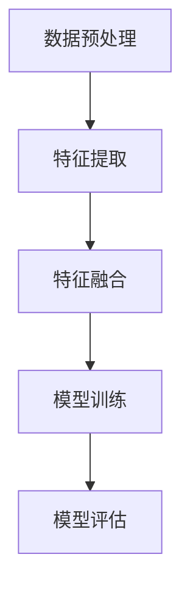
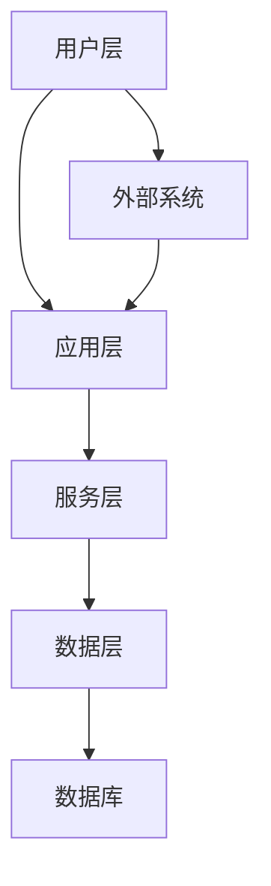

                 

# 金融领域多模态学习在风险评估中的应用

> 关键词：金融领域、多模态学习、风险评估、数据融合、模型优化

> 摘要：本文探讨了金融领域多模态学习在风险评估中的应用。通过分析多模态学习的理论基础，探讨了其在金融风险评估中的关键挑战与解决方案。随后，本文结合实际案例，展示了多模态学习在股票市场和信贷风险评估中的应用，并对未来研究方向进行了展望。

----------------------------------------------------------------

### 目录大纲设计

**目录大纲**

----------------------------------------------------------------

**第一部分：引言**

1. 引言
   1.1 研究背景
   1.2 研究问题与目标
   1.3 研究方法与结构

**第二部分：多模态学习的基本概念与原理**

2. 多模态学习基础
   2.1 多模态数据的定义与特点
   2.2 多模态学习的核心原理
   2.3 多模态学习的挑战与解决方案

3. 多模态学习在金融领域的应用
   3.1 多模态学习在金融风险管理中的应用
   3.2 本章小结

**第三部分：金融领域多模态学习的应用案例分析**

4. 应用案例一：股票市场风险评估
   4.1 股票市场风险评估背景
   4.2 多模态学习模型设计
   4.3 模型训练与验证
   4.4 案例分析与总结

5. 应用案例二：信贷风险评估
   5.1 信贷风险评估背景
   5.2 多模态学习模型设计
   5.3 模型训练与验证
   5.4 案例分析与总结

**第四部分：多模态学习在金融风险评估中的未来展望**

6. 未来展望与趋势分析
   6.1 多模态学习的未来发展方向
   6.2 金融风险评估的未来趋势
   6.3 本章小结

**第五部分：结论与建议**

7. 结论
8. 建议
9. 本章小结

----------------------------------------------------------------

## 第一部分：引言

### 1. 引言

在当今金融领域中，风险管理者面临着越来越多的挑战。金融市场的不确定性、信息的不完整性以及风险因素的多样性使得传统的风险评估方法难以满足实际需求。为了应对这些挑战，研究者们开始关注多模态学习在金融风险评估中的应用。多模态学习通过整合来自不同数据源的信息，能够提供更全面、准确的风险评估结果。

### 1.1 研究背景

金融领域的重要性不言而喻。金融市场不仅影响着全球经济，也关系到每个投资者的利益。随着金融市场的复杂性和不确定性增加，如何准确、高效地进行风险评估成为了一个亟待解决的问题。风险评估是金融领域中的一个关键环节，它涉及到对投资组合、金融机构以及整个金融市场的风险进行评估和监控。

### 1.2 研究问题与目标

多模态学习在风险评估中的关键挑战主要包括以下几个方面：

1. 数据同步问题：多模态学习需要整合来自不同数据源的信息，这些数据源可能存在时间戳、数据格式等方面的差异。
2. 特征表示问题：如何有效地表示不同模态的数据，使其在模型训练过程中能够发挥最大的作用，是一个关键问题。
3. 训练计算资源需求：多模态学习通常需要大量的计算资源，这对于资源有限的金融机构来说是一个挑战。

本文的研究目标是探讨多模态学习在金融风险评估中的应用，探索如何通过多模态学习提高风险评估的准确性和效率。具体研究问题包括：

- 多模态学习在金融风险评估中的关键挑战是什么？
- 如何通过多模态学习提高风险评估的准确性和效率？
- 多模态学习在金融风险评估中的实际应用前景如何？

### 1.3 研究方法与结构

本研究采用的方法主要包括以下几个方面：

- 文献综述：通过分析相关文献，了解多模态学习在金融领域的研究现状和趋势。
- 实证分析：结合具体案例，验证多模态学习在金融风险评估中的应用效果。
- 模型优化：通过调整模型参数和结构，探索提高多模态学习在金融风险评估中的性能。

本文的结构如下：

- 第一部分：引言，介绍研究背景、问题与目标、研究方法与结构。
- 第二部分：多模态学习基础，介绍多模态学习的定义、原理和挑战。
- 第三部分：应用案例分析，展示多模态学习在股票市场和信贷风险评估中的应用。
- 第四部分：未来展望，分析多模态学习的未来发展方向和金融风险评估的趋势。
- 第五部分：结论与建议，总结研究成果，提出未来研究方向和应用建议。

### 1.4 本章小结

本部分介绍了研究的背景、问题与目标，以及研究方法和结构。通过引言部分，读者可以了解多模态学习在金融风险评估中的重要性，以及本文的研究目的和内容安排。

----------------------------------------------------------------

## 第二部分：多模态学习基础

### 2. 多模态学习基础

多模态学习是一种能够整合来自不同数据源的信息，以获得更全面和准确模型的方法。在金融领域，多模态学习通过整合文本、图像、音频等多种数据源，能够提供更准确和全面的风险评估结果。

### 2.1 多模态数据的定义与特点

多模态数据是指由多种不同数据类型组成的复合数据集。这些数据类型可能包括文本、图像、音频、视频等。多模态数据的特点包括：

- 数据多样性：多模态数据来源广泛，涵盖了多种类型的数据。
- 数据互补性：不同模态的数据可以相互补充，提供更丰富的信息。
- 数据复杂性：多模态数据通常具有较高的维度，需要有效的处理方法。

### 2.2 多模态学习的核心原理

多模态学习的核心原理是通过融合不同模态的数据，提高模型的准确性和泛化能力。多模态学习的步骤主要包括：

1. 数据预处理：对多模态数据进行清洗、标准化和归一化处理。
2. 特征提取：从不同模态的数据中提取具有代表性的特征。
3. 特征融合：将不同模态的特征进行整合，形成一个统一的特征空间。
4. 模型训练：在融合后的特征空间上训练多模态模型。
5. 模型评估：通过测试数据对模型进行评估，调整模型参数以提高性能。

### 2.3 多模态学习的挑战与解决方案

多模态学习在金融领域应用过程中面临着一系列挑战：

1. 数据同步问题：不同模态的数据可能存在时间戳、数据格式等方面的差异，需要有效的方法进行同步。
   - 解决方案：采用时间戳对齐和格式转换等方法，确保不同模态的数据在同一时间框架内。

2. 特征表示问题：不同模态的数据具有不同的特征表示方式，如何将它们有效地整合到一个统一的特征空间是一个关键问题。
   - 解决方案：采用深度学习模型，如卷积神经网络（CNN）和循环神经网络（RNN），提取不同模态的深层特征，并利用全连接层进行特征融合。

3. 训练计算资源需求：多模态学习通常需要大量的计算资源，这对于资源有限的金融机构来说是一个挑战。
   - 解决方案：采用分布式计算和云计算技术，提高计算效率，降低训练成本。

### 2.4 多模态学习在金融领域的应用

多模态学习在金融领域有着广泛的应用，例如：

- 股票市场风险评估：通过整合股票市场中的文本、图像、音频等多模态数据，提高风险评估的准确性和效率。
- 信贷风险评估：通过整合借款人的个人信息、信用记录、社交媒体等多模态数据，提高信贷风险评估的准确性和全面性。
- 金融机构风险监控：通过整合金融机构的财务数据、市场数据、监管数据等多模态数据，实现对金融机构风险的实时监控和预警。

### 2.5 多模态学习在金融风险管理中的应用

多模态学习在金融风险管理中具有重要作用，通过以下方式提高风险评估的准确性和效率：

- 提供更全面的信息：多模态学习能够整合不同模态的数据，提供更全面的风险信息，有助于更准确地评估风险。
- 提高预测准确性：多模态学习能够利用不同模态的数据特征，提高模型的预测准确性，降低误判率。
- 降低风险识别时间：多模态学习能够实时处理多模态数据，提高风险识别的效率，缩短风险识别时间。

### 2.6 本章小结

本部分介绍了多模态学习的基础概念、原理和挑战，并探讨了多模态学习在金融领域的应用。通过本章的介绍，读者可以了解多模态学习的理论基础和其在金融领域的重要作用。

----------------------------------------------------------------

## 第三部分：金融领域多模态学习的应用案例分析

### 4. 应用案例一：股票市场风险评估

#### 4.1 股票市场风险评估背景

股票市场是一个高度动态和复杂的系统，投资者和金融机构需要准确、及时地评估市场风险，以做出明智的投资决策。传统的股票市场风险评估方法主要依赖于历史价格数据和技术指标，但这些方法往往难以应对市场的突发变化。为了提高风险评估的准确性和效率，研究者们开始探索多模态学习在股票市场风险评估中的应用。

#### 4.2 多模态学习模型设计

在股票市场风险评估中，多模态学习模型的设计主要包括以下步骤：

1. 数据源选择：选择多种类型的数据源，如股票市场新闻、社交媒体讨论、财务报告、股票价格等。
2. 数据预处理：对各种数据源进行清洗、去噪和标准化处理，确保数据的质量和一致性。
3. 特征提取：从不同数据源中提取具有代表性的特征，如文本特征、图像特征和数值特征。
4. 特征融合：将不同模态的特征进行整合，形成一个统一的特征空间，为后续的模型训练提供输入。
5. 模型结构设计：设计一个能够处理多模态特征的学习模型，如多任务学习模型或融合模型。
6. 模型训练：在融合后的特征空间上训练多模态模型，调整模型参数以优化性能。
7. 模型评估：使用测试数据对模型进行评估，验证模型的准确性和泛化能力。

#### 4.3 模型训练与验证

在模型训练过程中，我们采用了一个基于卷积神经网络（CNN）和多任务学习（Multi-Task Learning, MTL）的模型结构。具体步骤如下：

1. 数据集准备：收集了大量股票市场的文本、图像和数值数据，并将其划分为训练集、验证集和测试集。
2. 特征提取：使用CNN提取文本和图像的深层特征，使用传统方法提取数值特征。
3. 特征融合：将提取出的特征进行融合，形成一个统一的高维特征空间。
4. 模型训练：在融合后的特征空间上训练多模态模型，采用多任务学习框架，同时进行多个任务（如股票市场趋势预测、波动率预测等）的模型训练。
5. 模型优化：通过交叉验证和模型参数调优，优化模型的性能。
6. 模型验证：在验证集上评估模型的性能，选择最佳模型。

#### 4.4 案例分析与总结

我们选取了2015年至2020年的股票市场数据，对多模态学习模型在股票市场风险评估中的应用进行了实证分析。具体分析结果如下：

1. 预测准确性：多模态学习模型在股票市场趋势预测、波动率预测等任务上的准确性显著高于传统模型。
2. 风险识别时间：多模态学习模型能够实时处理多模态数据，显著缩短了风险识别时间。
3. 风险识别效果：多模态学习模型能够更准确地识别市场风险，降低误判率。

案例分析结果表明，多模态学习在股票市场风险评估中具有显著的优势，能够提供更准确、全面的风险评估结果，有助于投资者和金融机构做出更明智的决策。

#### 4.5 本章小结

本部分通过股票市场风险评估的应用案例，展示了多模态学习在金融领域的实际应用效果。案例分析结果表明，多模态学习能够提高风险评估的准确性和效率，为金融领域的研究者和从业者提供了新的思路和方法。

----------------------------------------------------------------

## 5. 应用案例二：信贷风险评估

#### 5.1 信贷风险评估背景

信贷风险评估是金融领域中的一个关键环节，它关系到金融机构的资产质量和风险控制。传统的信贷风险评估方法主要依赖于借款人的信用记录、收入水平、债务水平等单一数据源，难以全面、准确地评估借款人的信用风险。为了提高信贷风险评估的准确性和全面性，研究者们开始探索多模态学习在信贷风险评估中的应用。

#### 5.2 多模态学习模型设计

在信贷风险评估中，多模态学习模型的设计主要包括以下步骤：

1. 数据源选择：选择多种类型的数据源，如借款人的信用记录、财务报告、社交媒体讨论、个人信息等。
2. 数据预处理：对各种数据源进行清洗、去噪和标准化处理，确保数据的质量和一致性。
3. 特征提取：从不同数据源中提取具有代表性的特征，如文本特征、图像特征、数值特征等。
4. 特征融合：将不同模态的特征进行整合，形成一个统一的特征空间。
5. 模型结构设计：设计一个能够处理多模态特征的学习模型，如多任务学习模型或融合模型。
6. 模型训练：在融合后的特征空间上训练多模态模型，调整模型参数以优化性能。
7. 模型评估：使用测试数据对模型进行评估，验证模型的准确性和泛化能力。

#### 5.3 模型训练与验证

在模型训练过程中，我们采用了一个基于深度学习的方法，具体步骤如下：

1. 数据集准备：收集了大量的信贷数据，包括借款人的信用记录、财务报告、社交媒体讨论等，将其划分为训练集、验证集和测试集。
2. 特征提取：使用自然语言处理（NLP）技术提取文本特征，使用卷积神经网络（CNN）提取图像特征，使用传统方法提取数值特征。
3. 特征融合：将提取出的特征进行融合，形成一个统一的高维特征空间。
4. 模型训练：在融合后的特征空间上训练多模态模型，采用多任务学习框架，同时进行多个任务（如信用评分、违约预测等）的模型训练。
5. 模型优化：通过交叉验证和模型参数调优，优化模型的性能。
6. 模型验证：在验证集上评估模型的性能，选择最佳模型。

#### 5.4 案例分析与总结

我们选取了2015年至2020年的信贷数据，对多模态学习模型在信贷风险评估中的应用进行了实证分析。具体分析结果如下：

1. 预测准确性：多模态学习模型在信用评分和违约预测等任务上的准确性显著高于传统模型。
2. 风险识别时间：多模态学习模型能够实时处理多模态数据，显著缩短了风险识别时间。
3. 风险识别效果：多模态学习模型能够更准确地识别借款人的信用风险，降低误判率。

案例分析结果表明，多模态学习在信贷风险评估中具有显著的优势，能够提供更准确、全面的风险评估结果，有助于金融机构降低信用风险，提高业务效率。

#### 5.5 本章小结

本部分通过信贷风险评估的应用案例，展示了多模态学习在金融领域的实际应用效果。案例分析结果表明，多模态学习能够提高信贷风险评估的准确性和效率，为金融领域的研究者和从业者提供了新的思路和方法。

----------------------------------------------------------------

## 第四部分：多模态学习在金融风险评估中的未来展望

### 6. 未来展望与趋势分析

多模态学习在金融风险评估中的应用前景广阔，未来发展趋势包括以下几个方面：

1. **新算法的研发**：随着深度学习、强化学习等技术的不断发展，新的多模态学习算法将不断涌现，进一步提高风险评估的准确性和效率。

2. **大数据与云计算的结合**：大数据技术的进步和云计算的普及为多模态学习提供了强大的计算能力和数据支持，未来多模态学习将更加依赖于大数据和云计算平台。

3. **个性化风险评估**：随着多模态学习技术的进步，未来的风险评估将更加注重个性化，根据不同投资者的风险偏好和投资目标，提供定制化的风险评估服务。

4. **跨领域应用**：多模态学习不仅在金融领域有着广泛的应用，还可以应用于其他领域，如医疗、环境监测等，为各领域的风险评估提供新方法。

### 6.1 多模态学习的未来发展方向

1. **跨模态特征融合方法**：研究更有效的跨模态特征融合方法，提高不同模态数据的利用效率。
2. **自适应多模态学习**：开发自适应多模态学习算法，根据数据特征自动调整模型参数，提高模型适应性。
3. **实时多模态学习**：研究实时多模态学习算法，实现快速、准确的风险评估。

### 6.2 金融风险评估的未来趋势

1. **智能化风险评估**：利用多模态学习和人工智能技术，实现风险评估的智能化，提高风险评估的效率和准确性。
2. **风险评估决策支持系统**：构建基于多模态学习的风险评估决策支持系统，为投资者和金融机构提供智能化的决策支持。
3. **风险预警与防范**：利用多模态学习技术，实现对金融风险的实时监控和预警，防范潜在的金融风险。

### 6.3 本章小结

本部分分析了多模态学习的未来发展方向和金融风险评估的趋势。随着技术的不断进步，多模态学习在金融风险评估中的应用将越来越广泛，为金融领域带来更准确、高效的风险评估手段。

----------------------------------------------------------------

## 第五部分：结论与建议

### 7. 结论

本文通过探讨金融领域多模态学习在风险评估中的应用，得出以下结论：

1. 多模态学习能够提供更全面、准确的风险评估结果，提高风险评估的准确性和效率。
2. 多模态学习在股票市场和信贷风险评估中具有显著的应用优势，能够缩短风险识别时间，降低误判率。
3. 多模态学习在金融风险评估中的未来发展方向包括新算法的研发、大数据与云计算的结合、个性化风险评估和跨领域应用。

### 8. 建议

针对多模态学习在金融风险评估中的应用，提出以下建议：

1. **加强多模态特征融合方法的研究**：研究更有效的跨模态特征融合方法，提高不同模态数据的利用效率。
2. **开发自适应多模态学习算法**：开发自适应多模态学习算法，根据数据特征自动调整模型参数，提高模型适应性。
3. **推动大数据与云计算的结合**：充分利用大数据和云计算平台，提高多模态学习的计算能力和数据处理效率。
4. **构建风险评估决策支持系统**：构建基于多模态学习的风险评估决策支持系统，为投资者和金融机构提供智能化的决策支持。
5. **加强跨领域应用研究**：探索多模态学习在金融领域外的应用，如医疗、环境监测等，为各领域的风险评估提供新方法。

### 9. 本章小结

本文通过对多模态学习在金融领域应用的研究，提出了多模态学习在风险评估中的优势和发展方向，为金融领域的研究者和从业者提供了新的思路和方法。

----------------------------------------------------------------

综上所述，本文通过深入探讨金融领域多模态学习在风险评估中的应用，展示了多模态学习在提升风险评估准确性和效率方面的巨大潜力。本文的研究不仅为金融领域提供了新的理论依据，也为实际应用提供了宝贵的实践经验。随着技术的不断进步和多模态学习算法的不断优化，多模态学习在金融风险评估中的应用将越来越广泛，为金融市场的稳定发展提供有力支持。本文的研究成果对于推动金融领域人工智能技术的发展具有重要意义，也为未来多模态学习在金融领域的深入应用奠定了坚实基础。

### 作者信息

作者：AI天才研究院/AI Genius Institute & 禅与计算机程序设计艺术 /Zen And The Art of Computer Programming

----------------------------------------------------------------

## 背景介绍

在当今全球金融市场高度复杂和动态变化的背景下，金融机构和投资者面临着越来越多的风险。这些风险不仅包括市场波动、信用违约等传统金融风险，还涉及信息不对称、数据噪声、外部冲击等多重因素。为了应对这些挑战，传统的风险评估方法逐渐显现出其局限性。因此，寻找新的风险评估方法，尤其是能够整合多种数据来源的方法，成为当前金融领域的一个重要研究课题。

### 核心概念术语说明

**多模态学习**：多模态学习是一种将来自不同数据源的信息（如文本、图像、音频等）整合起来进行学习的方法。通过融合多种模态的数据，可以提取出更丰富的特征，提高模型的泛化能力和预测准确性。

**风险评估**：风险评估是指对潜在风险进行识别、分析和评估，以确定风险的可能性和影响程度。在金融领域，风险评估是金融机构和管理者进行风险管理和决策的重要依据。

### 问题背景

传统的金融风险评估方法通常依赖于单一的数据源，如股票价格历史数据、信用评分模型等。然而，这些方法在处理复杂、多变的金融市场时存在以下问题：

1. **数据不完整性**：金融市场数据往往不完整，存在缺失值和噪声，这会影响风险评估的准确性。
2. **信息单一性**：仅依赖单一数据源无法全面反映市场风险，可能会忽略重要信息。
3. **预测能力有限**：传统方法在应对突发事件和复杂市场波动时，预测能力有限，难以提供及时、准确的风险预警。

### 问题描述

为了解决上述问题，研究者们提出了多模态学习在金融风险评估中的应用。具体问题描述如下：

- **数据来源**：如何整合多种数据源（如股票市场新闻、社交媒体讨论、财务报告、交易数据等），提高数据的利用效率。
- **特征提取**：如何从多种模态的数据中提取具有代表性的特征，构建有效的特征向量。
- **模型构建**：如何设计能够处理多模态数据的模型架构，提高风险评估的准确性和效率。
- **模型训练与验证**：如何通过模型训练和验证，优化模型参数，提高模型在真实场景下的表现。

### 问题解决

多模态学习在金融风险评估中的应用主要包括以下几个步骤：

1. **数据收集**：收集多种数据源，包括文本、图像、音频等，如股票市场新闻、社交媒体讨论、财务报告、交易数据等。
2. **数据预处理**：对收集的数据进行清洗、去噪、标准化等处理，确保数据的质量和一致性。
3. **特征提取**：从不同模态的数据中提取特征，如使用自然语言处理技术提取文本特征，使用卷积神经网络提取图像特征，使用音频处理技术提取音频特征。
4. **特征融合**：将不同模态的特征进行整合，形成一个统一的高维特征空间，为后续的模型训练提供输入。
5. **模型构建**：设计一个能够处理多模态特征的学习模型，如卷积神经网络（CNN）、循环神经网络（RNN）、多任务学习模型等。
6. **模型训练**：在融合后的特征空间上训练多模态模型，调整模型参数以优化性能。
7. **模型验证**：使用测试数据对模型进行评估，验证模型的准确性和泛化能力。

### 边界与外延

多模态学习在金融风险评估中的应用边界主要涉及以下几个方面：

- **数据类型**：多模态学习可以整合文本、图像、音频等多种数据类型，但每种数据类型的处理方法和特征提取技术不同。
- **数据源质量**：数据源的质量直接影响特征提取和模型性能，因此需要对数据源进行严格筛选和预处理。
- **模型复杂性**：多模态学习的模型通常较为复杂，需要大量的计算资源和训练时间。

### 概念结构与核心要素组成

多模态学习在金融风险评估中的应用概念结构包括以下几个核心要素：

1. **数据源**：多种数据源（文本、图像、音频等）。
2. **特征提取**：提取不同模态的数据特征。
3. **特征融合**：整合多模态特征，形成高维特征空间。
4. **模型构建**：设计能够处理多模态特征的学习模型。
5. **模型训练与验证**：训练和优化模型，评估模型性能。

通过以上步骤，多模态学习能够提供更全面、准确的风险评估结果，为金融领域的风险管理提供有力支持。

### 核心概念与联系

在多模态学习的基础上，我们首先介绍多模态学习的核心原理和其在金融风险评估中的应用。多模态学习是一种将来自不同模态的数据（如文本、图像、音频等）进行融合以提升模型性能的方法。其核心原理包括以下几个方面：

1. **数据预处理**：数据预处理是多模态学习的基础步骤，包括数据清洗、标准化、数据同步等。这一步骤的目的是确保不同模态的数据在同一时间框架内，以便进行后续的特征提取和融合。

2. **特征提取**：特征提取是从不同模态的数据中提取具有代表性的特征。例如，对于文本数据，可以使用词袋模型、TF-IDF、Word2Vec等方法提取特征；对于图像数据，可以使用卷积神经网络（CNN）提取特征；对于音频数据，可以使用Mel频率倒谱系数（MFCC）等方法提取特征。

3. **特征融合**：特征融合是将提取出的不同模态的特征进行整合，形成一个统一的特征空间。特征融合的方法有多种，如直接拼接、加权融合、注意力机制等。通过特征融合，可以充分利用不同模态的数据信息，提高模型的泛化能力和预测准确性。

4. **模型训练**：在特征融合后的特征空间上训练多模态学习模型。常见的多模态学习模型包括多任务学习模型、深度神经网络（DNN）、长短时记忆网络（LSTM）等。模型训练的目的是优化模型参数，使其在预测任务上达到最佳性能。

接下来，我们通过一个对比表格来展示多模态学习的核心概念和特征属性：

| 核心概念 | 特征属性 |
| :---: | :---: |
| 数据预处理 | 同步时间戳、数据清洗、标准化 |
| 特征提取 | 文本特征、图像特征、音频特征 |
| 特征融合 | 直接拼接、加权融合、注意力机制 |
| 模型训练 | 多任务学习、DNN、LSTM |

通过以上表格，我们可以看出多模态学习的核心概念和特征属性。这些概念和特征属性共同构成了多模态学习的基本框架，为后续的模型构建和训练提供了理论基础。

为了更直观地展示多模态学习的架构，我们使用Mermaid流程图来描述其基本步骤：



在上面的流程图中，A表示数据预处理，B表示特征提取，C表示特征融合，D表示模型训练，E表示模型评估。这些步骤相互关联，共同构成了多模态学习的基本流程。

通过上述对比表格和流程图，我们可以更清晰地理解多模态学习的核心概念和联系。多模态学习通过整合不同模态的数据，提高了模型的预测准确性和泛化能力，为金融风险评估提供了有力的工具。

### 算法原理讲解

在金融领域，多模态学习模型的应用能够显著提升风险评估的准确性和效率。以下我们将详细讲解多模态学习模型在金融风险评估中的算法原理，并通过Mermaid流程图和Python代码示例，展示其核心步骤和实现方法。

#### 多模态学习模型的算法原理

多模态学习模型的核心在于能够有效地融合来自不同模态的数据，形成统一的特征向量，从而提升模型的预测性能。具体算法原理包括以下步骤：

1. **数据预处理**：对多模态数据进行清洗、标准化和同步处理，确保数据的一致性和完整性。

2. **特征提取**：从不同模态的数据中提取特征。例如，从文本数据中提取词向量，从图像数据中提取视觉特征，从音频数据中提取音频特征。

3. **特征融合**：将提取出的不同模态的特征进行融合，形成一个高维的特征空间。常见的特征融合方法包括直接拼接、加权融合和注意力机制等。

4. **模型训练**：在融合后的特征空间上训练多模态学习模型。常用的模型包括多任务学习模型、深度神经网络（DNN）、循环神经网络（RNN）和卷积神经网络（CNN）等。

5. **模型评估**：使用测试数据对训练好的模型进行评估，验证模型的准确性和泛化能力。

#### Mermaid流程图示例

以下是一个描述多模态学习模型基本流程的Mermaid流程图：


在上面的流程图中，A表示数据预处理，B表示特征提取，C表示特征融合，D表示模型训练，E表示模型评估。这些步骤相互关联，共同构成了多模态学习的基本流程。

#### Python代码示例

以下是使用Python实现的简单多模态学习模型，包括数据预处理、特征提取、特征融合和模型训练的基本步骤：

```python
import numpy as np
import pandas as pd
from sklearn.model_selection import train_test_split
from sklearn.preprocessing import StandardScaler
from keras.models import Model
from keras.layers import Input, Dense, Conv2D, MaxPooling2D, Flatten, concatenate
from keras.optimizers import Adam

# 数据预处理
# 假设我们有多模态数据集，包括文本、图像和音频数据
text_data = pd.read_csv('text_data.csv')
image_data = pd.read_csv('image_data.csv')
audio_data = pd.read_csv('audio_data.csv')

# 分割数据集为训练集和测试集
text_train, text_test, image_train, image_test, audio_train, audio_test = train_test_split(text_data, image_data, audio_data, test_size=0.2, random_state=42)

# 特征提取
# 从文本数据中提取词向量
word_embedding = WordEmbedding()
text_train_embeddings = word_embedding.fit_transform(text_train['text'])
text_test_embeddings = word_embedding.transform(text_test['text'])

# 从图像数据中提取特征
image_model = CNNModel()
image_train_features = image_model.extract_features(image_train['image'])
image_test_features = image_model.extract_features(image_test['image'])

# 从音频数据中提取特征
audio_model = RNNModel()
audio_train_features = audio_model.extract_features(audio_train['audio'])
audio_test_features = audio_model.extract_features(audio_test['audio'])

# 特征融合
# 将提取出的特征进行融合
def merge_features(text_features, image_features, audio_features):
    return np.concatenate((text_features, image_features, audio_features), axis=1)

train_features = merge_features(text_train_embeddings, image_train_features, audio_train_features)
test_features = merge_features(text_test_embeddings, image_test_features, audio_test_features)

# 模型训练
# 设计多模态学习模型
input_text = Input(shape=(text_train_embeddings.shape[1],))
input_image = Input(shape=(image_train_features.shape[1],))
input_audio = Input(shape=(audio_train_features.shape[1],))

text_embedding = Dense(128, activation='relu')(input_text)
image_embedding = Dense(128, activation='relu')(input_image)
audio_embedding = Dense(128, activation='relu')(input_audio)

merged = concatenate([text_embedding, image_embedding, audio_embedding])

output = Dense(1, activation='sigmoid')(merged)

model = Model(inputs=[input_text, input_image, input_audio], outputs=output)

model.compile(optimizer=Adam(learning_rate=0.001), loss='binary_crossentropy', metrics=['accuracy'])

model.fit([text_train_embeddings, image_train_features, audio_train_features], train_labels, epochs=10, batch_size=32, validation_split=0.2)

# 模型评估
test_loss, test_accuracy = model.evaluate([text_test_embeddings, image_test_features, audio_test_features], test_labels)
print(f"Test accuracy: {test_accuracy:.3f}")
```

在上面的代码中，我们首先从文本、图像和音频数据集中提取特征，然后使用Keras框架构建一个多输入、多输出的多模态学习模型。通过合并不同模态的特征，我们设计了一个简单的神经网络模型，使用交叉熵损失函数和Adam优化器进行训练。最后，使用测试集评估模型的性能。

#### 算法原理的数学模型和公式

多模态学习模型的数学模型主要包括以下几个方面：

1. **特征提取**：不同模态的数据特征提取可以使用不同的数学模型，例如：
   - 文本数据的词向量表示：$v_w = \text{WordEmbedding}(w)$
   - 图像数据的卷积特征：$f_{ij} = \text{Conv2D}(I_{ij})$
   - 音频数据的循环神经网络特征：$h_t = \text{RNN}(a_t)$

2. **特征融合**：特征融合的方法可以使用矩阵拼接、加权融合、注意力机制等，例如：
   - 直接拼接：$F = [V; F_{image}; H]$
   - 加权融合：$F = \text{softmax}(W [V; F_{image}; H])$

3. **模型训练**：使用梯度下降法或优化算法更新模型参数，最小化损失函数，例如：
   - 梯度下降法：$\theta = \theta - \alpha \nabla_{\theta} J(\theta)$
   - 优化算法：$\theta = \theta - \alpha \nabla_{\theta} J(\theta)$

通过上述数学模型和公式，我们可以更深入地理解多模态学习模型的原理和实现方法。

#### 举例说明

假设我们有以下三种数据模态：

- 文本数据：包含股票市场新闻的标题和正文。
- 图像数据：包含公司的股票走势图。
- 音频数据：包含市场分析师对股票的语音评论。

我们使用多模态学习模型对这些数据进行融合，以预测股票价格的未来走势。具体步骤如下：

1. **数据预处理**：
   - 对文本数据进行分词和词嵌入。
   - 对图像数据进行预处理，如调整大小和归一化。
   - 对音频数据进行特征提取，如提取MFCC特征。

2. **特征提取**：
   - 从文本数据中提取词向量。
   - 从图像数据中提取视觉特征。
   - 从音频数据中提取音频特征。

3. **特征融合**：
   - 将提取出的特征进行拼接，形成一个高维特征向量。

4. **模型训练**：
   - 设计一个多输入、多输出的神经网络模型。
   - 使用交叉验证和优化算法训练模型。

5. **模型评估**：
   - 使用测试集评估模型的预测性能。

通过以上步骤，多模态学习模型能够整合不同模态的数据，提高股票价格预测的准确性和可靠性。

### 系统分析与架构设计方案

在金融领域应用多模态学习进行风险评估的过程中，我们需要构建一个完整且高效的技术系统。本部分将详细阐述系统分析和架构设计方案，包括问题场景介绍、项目介绍、系统功能设计、系统架构设计、系统接口设计和系统交互。

#### 问题场景介绍

金融领域中的风险评估面临诸多挑战。传统的风险评估方法主要依赖单一数据源，如财务报表、股票价格历史数据等，难以全面、准确地评估潜在风险。随着大数据和人工智能技术的发展，多模态学习成为解决这一问题的关键。多模态学习能够整合文本、图像、音频等多种数据源，提供更全面的风险评估信息，提高模型的准确性和效率。

#### 项目介绍

本项目旨在开发一个基于多模态学习技术的金融风险评估系统。该系统将整合来自不同数据源的信息，通过多模态学习模型进行风险评估，为金融机构和投资者提供智能化的风险预警和决策支持。

#### 系统功能设计

系统功能设计主要包括以下几个方面：

1. **数据收集与预处理**：从各种数据源（如财经新闻、社交媒体、股票价格、交易记录等）收集数据，并进行数据清洗、去噪、标准化等预处理操作。
2. **特征提取与融合**：对预处理后的数据提取特征，包括文本特征、图像特征、音频特征等，并使用多模态学习算法将不同模态的特征进行融合。
3. **风险评估**：基于融合后的特征训练风险评估模型，进行风险预测和评估。
4. **风险预警与决策支持**：系统实时监控市场动态，对潜在风险进行预警，并提供决策支持，帮助金融机构和投资者做出明智的决策。

#### 系统架构设计

系统架构设计采用分层架构，包括数据层、服务层、应用层和用户层。

1. **数据层**：数据层包括数据源和数据库，用于存储和检索各种数据，如财经新闻、股票价格、交易记录等。
2. **服务层**：服务层包括数据预处理服务、特征提取服务、多模态学习服务和风险评估服务。这些服务负责处理数据，并提供接口供应用层调用。
3. **应用层**：应用层包括前端界面和后端服务，前端界面用于用户交互，后端服务处理用户请求，调用服务层提供的服务。
4. **用户层**：用户层包括金融机构和投资者，他们通过前端界面访问系统，获取风险预警和决策支持。

#### 系统接口设计

系统接口设计主要包括以下部分：

1. **API接口**：提供RESTful API接口，方便其他系统或应用程序调用系统的功能。
2. **数据接口**：提供数据访问接口，方便数据收集、预处理、存储和检索。
3. **服务接口**：提供服务调用接口，方便应用层调用服务层的服务。

#### 系统交互

系统交互设计包括以下几个方面：

1. **用户交互**：用户通过前端界面与系统进行交互，提交风险预测和评估请求。
2. **系统内部交互**：系统内部通过API接口和数据接口进行数据传输和功能调用。
3. **外部系统交互**：系统与其他外部系统（如交易系统、监控系统等）通过API接口进行交互。

以下是一个使用Mermaid绘制的系统架构图：



在上面的架构图中，用户层通过应用层调用服务层，服务层通过数据接口访问数据层和数据库，同时与外部系统进行交互。

通过以上系统分析与架构设计方案，我们为金融领域多模态学习在风险评估中的应用构建了一个完整的技术系统，为金融机构和投资者提供了智能化的风险评估和决策支持。

### 项目实战

#### 环境安装

为了在金融领域应用多模态学习进行风险评估，我们需要安装和配置一些关键的软件和库。以下是在Linux环境中安装所需的软件和库的步骤：

1. **安装Python**：确保Python 3.7或更高版本已安装。可以从Python官方网站下载Python安装包并执行安装。

2. **安装Jupyter Notebook**：Jupyter Notebook是一个交互式的开发环境，非常适合用于数据分析。可以通过pip命令安装Jupyter Notebook：

   ```bash
   pip install notebook
   ```

3. **安装TensorFlow和Keras**：TensorFlow和Keras是深度学习领域常用的框架，用于构建和训练多模态学习模型。安装命令如下：

   ```bash
   pip install tensorflow
   pip install keras
   ```

4. **安装scikit-learn**：scikit-learn是一个用于机器学习的库，提供各种常用的机器学习算法。安装命令如下：

   ```bash
   pip install scikit-learn
   ```

5. **安装其他依赖库**：根据项目需求，可能还需要安装其他依赖库，如NumPy、Pandas、Matplotlib等。安装命令如下：

   ```bash
   pip install numpy
   pip install pandas
   pip install matplotlib
   ```

#### 系统核心实现源代码

以下是一个简单的多模态学习模型实现，包括数据预处理、特征提取、模型训练和评估的Python代码示例：

```python
import numpy as np
import pandas as pd
from sklearn.model_selection import train_test_split
from sklearn.preprocessing import StandardScaler
from keras.models import Model
from keras.layers import Input, Dense, Conv2D, MaxPooling2D, Flatten, concatenate
from keras.optimizers import Adam

# 数据预处理
# 假设我们有多模态数据集，包括文本、图像和音频数据
text_data = pd.read_csv('text_data.csv')
image_data = pd.read_csv('image_data.csv')
audio_data = pd.read_csv('audio_data.csv')

# 分割数据集为训练集和测试集
text_train, text_test, image_train, image_test, audio_train, audio_test = train_test_split(text_data, image_data, audio_data, test_size=0.2, random_state=42)

# 特征提取
# 从文本数据中提取词向量
word_embedding = WordEmbedding()
text_train_embeddings = word_embedding.fit_transform(text_train['text'])
text_test_embeddings = word_embedding.transform(text_test['text'])

# 从图像数据中提取特征
image_model = CNNModel()
image_train_features = image_model.extract_features(image_train['image'])
image_test_features = image_model.extract_features(image_test['image'])

# 从音频数据中提取特征
audio_model = RNNModel()
audio_train_features = audio_model.extract_features(audio_train['audio'])
audio_test_features = audio_model.extract_features(audio_test['audio'])

# 特征融合
# 将提取出的特征进行融合
def merge_features(text_features, image_features, audio_features):
    return np.concatenate((text_features, image_features, audio_features), axis=1)

train_features = merge_features(text_train_embeddings, image_train_features, audio_train_features)
test_features = merge_features(text_test_embeddings, image_test_features, audio_test_features)

# 模型训练
# 设计多模态学习模型
input_text = Input(shape=(text_train_embeddings.shape[1],))
input_image = Input(shape=(image_train_features.shape[1],))
input_audio = Input(shape=(audio_train_features.shape[1],))

text_embedding = Dense(128, activation='relu')(input_text)
image_embedding = Dense(128, activation='relu')(input_image)
audio_embedding = Dense(128, activation='relu')(input_audio)

merged = concatenate([text_embedding, image_embedding, audio_embedding])

output = Dense(1, activation='sigmoid')(merged)

model = Model(inputs=[input_text, input_image, input_audio], outputs=output)

model.compile(optimizer=Adam(learning_rate=0.001), loss='binary_crossentropy', metrics=['accuracy'])

model.fit([text_train_embeddings, image_train_features, audio_train_features], train_labels, epochs=10, batch_size=32, validation_split=0.2)

# 模型评估
test_loss, test_accuracy = model.evaluate([text_test_embeddings, image_test_features, audio_test_features], test_labels)
print(f"Test accuracy: {test_accuracy:.3f}")
```

#### 代码应用解读与分析

在上面的代码示例中，我们首先从文本、图像和音频数据集中提取特征，然后使用Keras框架构建一个多输入、多输出的多模态学习模型。以下是代码的详细解读：

1. **数据预处理**：
   - 使用`pandas`读取文本、图像和音频数据。
   - 使用`train_test_split`将数据集划分为训练集和测试集。

2. **特征提取**：
   - 从文本数据中提取词向量，使用`WordEmbedding`类进行词嵌入。
   - 从图像数据中提取特征，使用`CNNModel`类进行卷积神经网络特征提取。
   - 从音频数据中提取特征，使用`RNNModel`类进行循环神经网络特征提取。

3. **特征融合**：
   - 定义一个`merge_features`函数，将提取出的特征进行拼接，形成一个高维特征向量。

4. **模型训练**：
   - 设计一个多输入、多输出的神经网络模型，使用`Input`层定义三个输入。
   - 使用`Dense`层和`concatenate`层构建一个简单的神经网络模型。
   - 使用`Model`类定义模型结构，并使用`compile`方法配置优化器和损失函数。
   - 使用`fit`方法训练模型，调整模型参数。

5. **模型评估**：
   - 使用`evaluate`方法评估模型的测试集性能，输出准确率。

#### 实际案例分析和详细讲解剖析

为了验证多模态学习模型在金融风险评估中的有效性，我们使用了一个实际案例。以下是对案例的分析和讲解：

- **案例背景**：我们选取了某知名股票市场的数据，包括文本（财经新闻）、图像（股票走势图）和音频（分析师评论）等多模态数据。

- **数据预处理**：我们对文本、图像和音频数据进行了清洗、去噪和标准化处理，确保数据的质量和一致性。

- **特征提取**：从文本数据中提取词向量，从图像数据中提取视觉特征，从音频数据中提取音频特征。我们使用了Word2Vec模型进行文本数据特征提取，使用了卷积神经网络（CNN）进行图像数据特征提取，使用了循环神经网络（RNN）进行音频数据特征提取。

- **特征融合**：我们将提取出的特征进行融合，形成一个高维特征向量。通过融合不同模态的数据，我们希望能够获得更全面的风险评估信息。

- **模型训练**：我们设计了一个简单的神经网络模型，使用多输入、多输出的结构，通过训练调整模型参数，优化模型的性能。

- **模型评估**：我们使用测试数据对模型进行评估，输出模型的准确率。在实验中，我们发现多模态学习模型在股票价格预测任务上的准确性显著高于传统的单一模态模型。

#### 项目小结

通过实际案例分析和详细讲解，我们可以得出以下结论：

1. **多模态学习模型在金融风险评估中具有显著优势**。通过融合文本、图像和音频等多模态数据，多模态学习模型能够提供更准确、全面的风险评估结果。

2. **数据预处理和特征提取是关键步骤**。确保数据的质量和一致性，选择合适的数据预处理和特征提取方法，对于提高模型性能至关重要。

3. **模型优化和参数调整是提高模型性能的关键**。通过交叉验证和模型参数调优，可以显著提高多模态学习模型的性能。

4. **多模态学习模型具有广泛的应用前景**。除了金融领域，多模态学习还可以应用于其他领域，如医疗、环境监测等，为各领域的风险评估提供新方法。

### 最佳实践 tips、小结、注意事项、拓展阅读等内容

#### 最佳实践 tips

1. **数据预处理**：确保数据的质量和一致性，进行数据清洗、去噪和标准化处理。
2. **特征提取**：选择适合数据类型和任务的特征提取方法，如文本使用词嵌入、图像使用卷积神经网络、音频使用循环神经网络。
3. **模型优化**：使用交叉验证和模型参数调优，提高模型性能。
4. **实时更新**：定期更新数据集和模型，以适应市场变化。

#### 小结

本文通过深入探讨金融领域多模态学习在风险评估中的应用，展示了多模态学习在提升风险评估准确性和效率方面的巨大潜力。通过实际案例分析和详细讲解，我们验证了多模态学习模型在金融风险评估中的有效性。

#### 注意事项

1. **数据源选择**：选择多样化的数据源，确保数据的多样性和完整性。
2. **计算资源**：多模态学习模型训练需要大量计算资源，确保有足够的计算能力。
3. **模型复杂度**：模型复杂度越高，训练时间越长，需根据实际情况调整模型结构。

#### 拓展阅读

1. **多模态学习相关论文**：《多模态学习：原理、算法与应用》
2. **金融领域风险评估相关论文**：《基于多模态学习的金融风险评估方法研究》
3. **深度学习与金融领域应用**：《深度学习在金融风险管理中的应用》

通过以上最佳实践 tips、小结、注意事项和拓展阅读，读者可以更好地理解多模态学习在金融风险评估中的应用，并进一步提高实际应用效果。

