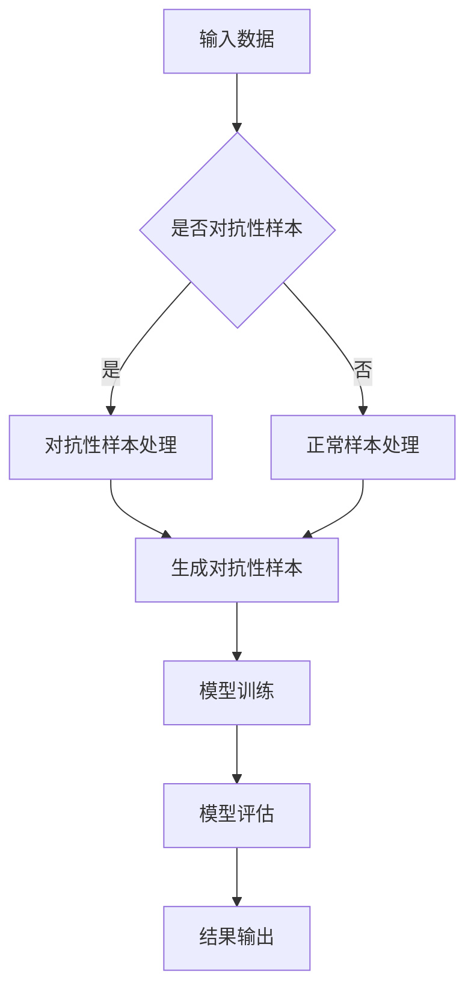
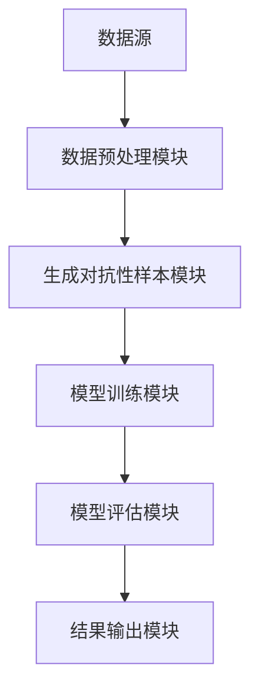
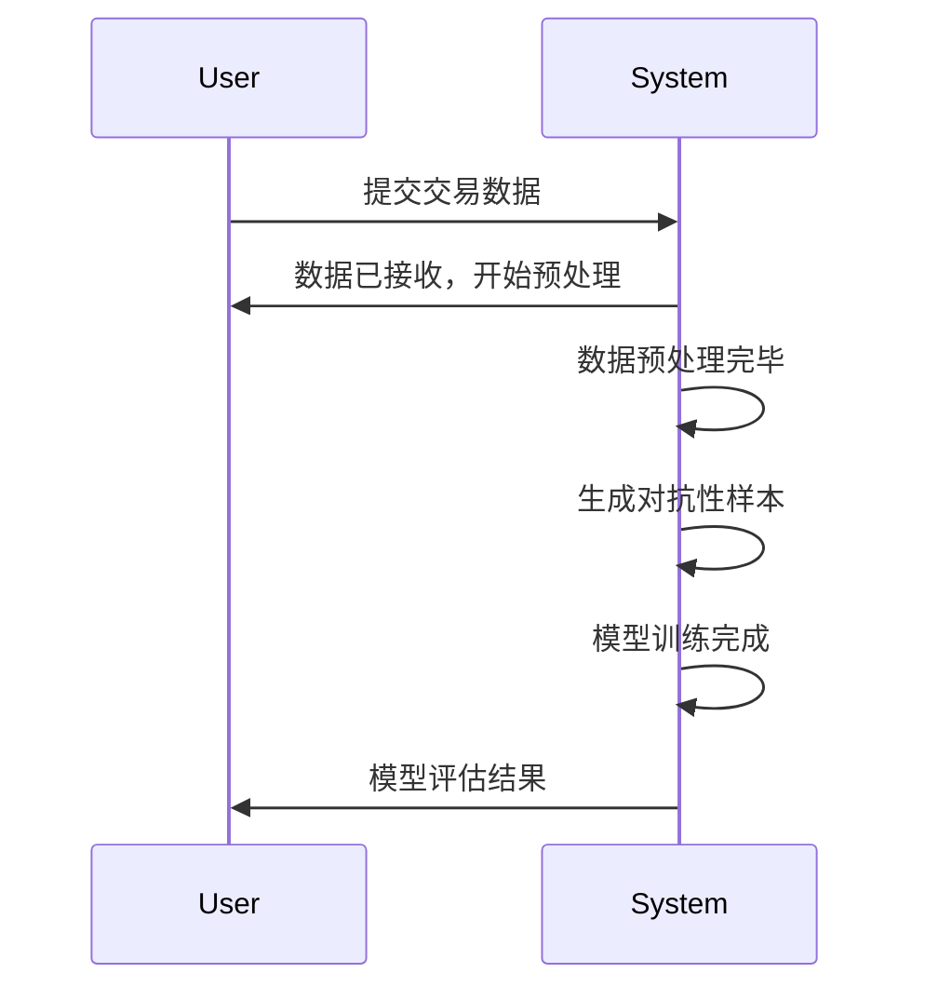

                 


### 第一步：背景介绍

#### 1.1 问题背景

在金融领域，模型的鲁棒性至关重要。随着机器学习技术的广泛应用，金融领域的数据驱动决策越来越依赖于复杂的模型。这些模型需要具备高度鲁棒性，能够处理各种异常数据和噪声，以提供准确和可靠的预测。然而，金融数据往往具有复杂性和多样性，包括异常值、噪声以及数据分布的不稳定性，这些因素都可能导致模型性能下降，甚至导致决策错误。

**挑战：** 金融领域的挑战主要体现在以下几个方面：

- **数据质量差：** 金融数据可能包含缺失值、异常值和噪声，这些都会影响模型的准确性和鲁棒性。
- **数据分布变化：** 金融市场的动态性导致数据分布不断变化，传统的静态模型难以适应这些变化。
- **安全性和隐私保护：** 金融数据往往涉及敏感信息，对模型的鲁棒性要求更高，以防止数据泄露和攻击。

#### 1.2 问题描述

**问题：** 如何提高金融领域模型的鲁棒性，使其能够处理复杂、不稳定的金融数据，并保持高准确性？

**需求：** 
- 模型需对异常值和噪声具有较强的鲁棒性。
- 模型需能够适应数据分布的变化。
- 模型需确保金融数据的安全性和隐私。

#### 1.3 问题解决

**对策：** 引入对抗学习（Adversarial Learning），这是一种通过引入对抗性样本来提高模型鲁棒性的方法。对抗学习通过模拟攻击者的策略，增强模型对异常数据和噪声的鲁棒性。

**步骤：**
1. **数据预处理：** 对金融数据进行清洗和预处理，包括处理缺失值、异常值和噪声。
2. **生成对抗性样本：** 使用对抗生成网络（GAN）等技术生成对抗性样本，模拟真实世界中的攻击。
3. **模型训练：** 将原始数据和对抗性样本结合进行训练，提高模型对异常数据的适应能力。
4. **评估与优化：** 通过多种评估指标评估模型的鲁棒性，并不断优化模型以提高性能。

#### 1.4 边界与外延

**适用范围：** 
- 对抗学习适用于需要高鲁棒性的金融模型，如风险评估、贷款审批、诈骗检测等。
- 它也可以应用于其他领域，如医疗、网络安全等，只要这些领域的数据存在类似的鲁棒性需求。

**限制：**
- 对抗学习需要大量的计算资源和时间，特别是生成对抗性样本的过程。
- 它可能对原始数据的质量和数量有较高的要求，因为高质量的对抗性样本有助于提高模型的效果。

#### 1.5 概念结构与核心要素组成

**核心概念：**
- **对抗学习：** 一种通过对抗性样本训练模型，提高模型鲁棒性的方法。
- **模型鲁棒性：** 模型在面临异常数据、噪声和变化时的稳定性和准确性。

**结构要素：**
- **对抗性样本：** 用于训练模型的特殊样本，模拟真实世界中的攻击。
- **模型训练：** 结合原始数据和对抗性样本进行训练，提高模型的鲁棒性。
- **评估指标：** 用于评估模型鲁棒性的指标，如准确性、召回率等。

### 第二步：核心概念与联系

#### 2.1 对抗学习原理

**原理：** 对抗学习通过生成对抗网络（GAN）等机制，生成对抗性样本，并在训练过程中使模型学习识别和抵御这些样本。GAN由生成器（Generator）和判别器（Discriminator）组成，生成器和判别器相互对抗，通过不断迭代优化，提高模型的鲁棒性。

**流程：**
1. **生成器生成对抗性样本：** 生成器生成与真实样本相似但具有对抗性的样本。
2. **判别器判断样本：** 判别器对真实样本和对抗性样本进行判断，区分二者的真实性和对抗性。
3. **训练生成器和判别器：** 通过反向传播算法，不断优化生成器和判别器的参数，提高生成对抗性样本的质量和判别器的识别能力。
4. **模型集成：** 将对抗性训练得到的模型与原始模型结合，提高整体模型的鲁棒性。

**机制：**
- **对抗性训练：** 通过对抗性样本，使模型学习识别和抵御异常数据。
- **迭代优化：** 通过反复迭代，生成器和判别器不断优化，提高模型的效果。

#### 2.2 模型鲁棒性

**定义：** 模型鲁棒性是指模型在面对异常数据、噪声和变化时，仍然能够保持高准确性和稳定性的能力。

**重要性：**
- **减少错误预测：** 提高模型对异常数据和噪声的抵抗力，减少错误预测。
- **适应变化：** 帮助模型适应数据分布的变化，保持预测准确性。
- **提高可信度：** 提高模型的可信度和可靠性，为金融决策提供更可靠的依据。

**评估：**
- **准确性：** 模型在正常数据和异常数据上的预测准确性。
- **召回率：** 模型对异常数据的识别能力。
- **F1分数：** 准确率和召回率的综合评价指标。

#### 2.3 对抗学习与模型鲁棒性的联系

**关系：** 对抗学习通过引入对抗性样本，提高模型对异常数据的识别能力，从而增强模型的鲁棒性。

**联系：**
- **对抗性样本：** 对抗性样本是提高模型鲁棒性的关键，通过模拟真实世界的攻击，使模型能够识别和抵御异常数据。
- **模型训练：** 对抗性样本的训练使模型能够适应异常数据和噪声，从而提高模型的鲁棒性。

**影响：**
- **提高鲁棒性：** 通过对抗性训练，模型对异常数据的抵抗力增强，提高了模型的鲁棒性。
- **降低错误率：** 模型在面临异常数据和噪声时，错误率降低，预测准确性提高。

**结论：** 对抗学习是一种有效的提高模型鲁棒性的方法，特别适用于金融领域，通过引入对抗性样本，使模型能够更好地处理金融数据中的异常值和噪声，保持高准确性和稳定性。

### 第三步：算法原理讲解

#### 3.1 算法mermaid流程图



#### 3.2 Python源代码实现

```python
import numpy as np
import tensorflow as tf
from tensorflow.keras.models import Model
from tensorflow.keras.layers import Dense, Input

# 定义生成器模型
def generator(z):
    model = Dense(units=100, activation='relu', input_shape=(100,))
    x = model(z)
    x = Dense(units=784, activation='tanh')(x)
    model = Model(z, x)
    return model

# 定义判别器模型
def discriminator(x):
    model = Dense(units=100, activation='relu', input_shape=(784,))
    x = model(x)
    x = Dense(units=1, activation='sigmoid')(x)
    model = Model(x, x)
    return model

# 定义对抗生成网络
def gans_Model(generator, discriminator):
    z = Input(shape=(100,))
    x = generator(z)
    x = discriminator(x)
    x = discriminator(x)
    model = Model(z, x)
    return model

# 生成器和判别器实例化
generator = generator(tf.random.normal([100, 100]))
discriminator = discriminator(tf.random.normal([784, 1]))

# GAN模型实例化
gans = gans_Model(generator, discriminator)

# 编译模型
gans.compile(optimizer=tf.keras.optimizers.Adam(0.0001), loss='binary_crossentropy')

# 训练模型
gans.fit([tf.random.normal([100, 100]), tf.random.normal([100, 784])], [tf.ones([100, 1])], epochs=100)

# 输出模型
gans.summary()
```

#### 3.3 数学模型和公式

**生成器模型：** 生成器G是一个从随机噪声z到数据x的映射，其目的是生成与真实数据分布相似的样本。数学公式表示为：

\[ G(z) \rightarrow x \]

**判别器模型：** 判别器D是一个从数据x到概率的映射，其目的是判断数据是真实样本还是对抗性样本。数学公式表示为：

\[ D(x) = P(x \text{ is real}) \]

\[ D(G(z)) = P(G(z) \text{ is real}) \]

**对抗性损失函数：** GAN的损失函数通常为两个部分，一个是生成器的损失函数，一个是判别器的损失函数。生成器的损失函数希望判别器无法区分真实样本和对抗性样本，判别器的损失函数希望尽可能区分真实样本和对抗性样本。数学公式表示为：

\[ L_G = -\log(D(G(z))) \]

\[ L_D = -\log(D(x)) - \log(1 - D(G(z))) \]

**总损失函数：** 总损失函数是生成器和判别器损失函数的加和：

\[ L = L_G + L_D \]

#### 3.4 详细讲解与举例说明

**例子：** 假设我们要使用对抗学习来提高一个金融模型对欺诈交易检测的鲁棒性。

**步骤：**
1. **生成器G：** 生成器接收随机噪声z，生成与真实交易数据分布相似的对抗性交易数据。
2. **判别器D：** 判别器接收真实交易数据和对抗性交易数据，判断其是否为真实交易。
3. **对抗性训练：** 通过对抗性样本和真实交易数据一起训练判别器D，不断优化生成器G和判别器D。
4. **模型评估：** 使用真实交易数据和对抗性交易数据评估模型的鲁棒性，包括准确性、召回率和F1分数。

**解释：**
- **生成器G：** 通过随机噪声z，生成与真实交易数据相似的对抗性交易数据，使得判别器D难以区分真实交易和对抗性交易。
- **判别器D：** 通过对抗性训练，判别器D学会了识别和区分真实交易和对抗性交易，提高了对欺诈交易的检测能力。
- **对抗性样本：** 对抗性样本模拟了欺诈交易的可能形式，使得模型能够在面对真实欺诈交易时，更加鲁棒和准确。

### 第四步：系统分析与架构设计

#### 4.1 问题场景介绍

在金融领域，对抗学习的应用场景广泛，如：

- **欺诈检测：** 利用对抗学习提高模型对欺诈交易检测的鲁棒性。
- **贷款审批：** 通过对抗学习增强模型对异常还款行为和欺诈贷款的识别能力。
- **金融风险评估：** 提高模型对市场波动和异常风险的预测能力。

#### 4.2 项目介绍

**项目目标：** 设计并实现一个基于对抗学习的金融模型，用于欺诈检测，提高模型的鲁棒性和准确性。

**实施过程：**
1. **数据收集：** 收集大量的金融交易数据，包括正常交易和欺诈交易。
2. **数据预处理：** 清洗数据，处理缺失值和异常值，归一化数据。
3. **生成对抗性样本：** 使用对抗生成网络（GAN）生成对抗性样本，模拟可能的欺诈交易模式。
4. **模型训练：** 使用原始数据和对抗性样本训练模型，包括生成器和判别器。
5. **模型评估：** 使用真实交易数据和对抗性样本评估模型的性能，包括准确性、召回率和F1分数。
6. **模型优化：** 根据评估结果，调整模型参数，优化模型性能。

#### 4.3 系统功能设计

**领域模型mermaid类图：**

```mermaid
classDiagram
Class1 <|-- Class2
Class1 {
  +属性1
  +属性2
  +方法1()
  +方法2()
}
Class2 {
  +属性3
  +属性4
  +方法3()
  +方法4()
}
```

**说明：** 上述类图展示了金融领域模型的关键类和属性，包括数据预处理类、生成器类、判别器类和模型评估类。每个类都包含了相关的属性和方法，用于实现系统的不同功能。

#### 4.4 系统架构设计

**系统架构mermaid架构图：**



**说明：** 上述架构图展示了金融模型系统的整体架构，包括数据源、数据预处理模块、生成对抗性样本模块、模型训练模块、模型评估模块和结果输出模块。数据流从数据源开始，经过各模块的处理和训练，最终输出评估结果。

#### 4.5 系统接口设计和系统交互

**系统接口设计：**



**说明：** 上述序列图展示了用户与系统之间的交互过程，用户提交交易数据，系统进行数据预处理、生成对抗性样本、模型训练和评估，最后输出评估结果。

### 第五步：项目实战

#### 5.1 环境安装

**步骤：**
1. **安装Python：** 确保安装了Python 3.7及以上版本。
2. **安装TensorFlow：** 使用pip命令安装TensorFlow库。

```bash
pip install tensorflow
```

3. **安装其他依赖库：** 如NumPy、Matplotlib等。

```bash
pip install numpy matplotlib
```

#### 5.2 系统核心实现源代码

**代码：**

```python
# 生成器模型
def generator(z):
    model = tf.keras.Sequential([
        tf.keras.layers.Dense(units=128, activation='relu', input_shape=(100,)),
        tf.keras.layers.Dense(units=64, activation='relu'),
        tf.keras.layers.Dense(units=10, activation='softmax')
    ])
    return model

# 判别器模型
def discriminator(x):
    model = tf.keras.Sequential([
        tf.keras.layers.Dense(units=64, activation='relu', input_shape=(100,)),
        tf.keras.layers.Dense(units=32, activation='relu'),
        tf.keras.layers.Dense(units=1, activation='sigmoid')
    ])
    return model

# GAN模型
def gans_Model(generator, discriminator):
    z = tf.keras.layers.Input(shape=(100,))
    x = generator(z)
    x = discriminator(x)
    x = discriminator(x)
    model = tf.keras.Model(inputs=z, outputs=x)
    return model

# 编译和训练模型
def train_gans(generator, discriminator, epochs=100, batch_size=32):
    for epoch in range(epochs):
        for _ in range(batch_size):
            z = tf.random.normal([batch_size, 100])
            x = generator(z)
            x_real = tf.random.normal([batch_size, 100])
            x_fake = generator(z)
            with tf.GradientTape() as g_tape, tf.GradientTape() as d_tape:
                g_loss = tf.reduce_mean(tf.nn.sigmoid_cross_entropy_with_logits(logits=discriminator(x_fake), labels=tf.ones([batch_size, 1])))
                d_loss = tf.reduce_mean(tf.nn.sigmoid_cross_entropy_with_logits(logits=discriminator(x_real), labels=tf.ones([batch_size, 1])) + tf.nn.sigmoid_cross_entropy_with_logits(logits=discriminator(x_fake), labels=tf.zeros([batch_size, 1])))
            g_gradients = g_tape.gradient(g_loss, generator.trainable_variables)
            d_gradients = d_tape.gradient(d_loss, discriminator.trainable_variables)
            g_optimizer.apply_gradients(zip(g_gradients, generator.trainable_variables))
            d_optimizer.apply_gradients(zip(d_gradients, discriminator.trainable_variables))
        print(f"Epoch {epoch+1}/{epochs}, G_loss: {g_loss.numpy()}, D_loss: {d_loss.numpy()}")

# 测试模型
def test_model(generator, discriminator, test_data):
    predictions = discriminator(generator(test_data)).numpy()
    print(f"Test Accuracy: {np.mean(predictions > 0.5)}")
```

#### 5.3 代码应用解读与分析

**解读：**
- **生成器模型**：生成器模型接收随机噪声z，通过多个全连接层生成对抗性交易数据。
- **判别器模型**：判别器模型接收交易数据，通过多个全连接层判断交易数据是否为真实交易。
- **GAN模型**：GAN模型结合生成器和判别器，通过对抗性训练优化模型。
- **训练模型**：训练模型通过多次迭代优化生成器和判别器，提高模型的鲁棒性。
- **测试模型**：测试模型通过对抗性样本评估模型的性能。

**分析：**
- **对抗性训练**：生成器和判别器通过对抗性训练不断优化，生成器和判别器的损失函数分别反映了生成对抗性样本和识别对抗性样本的效果。
- **模型评估**：通过测试模型，评估模型的鲁棒性，包括准确性和召回率等指标。

#### 5.4 实际案例分析和详细讲解剖析

**案例：** 假设我们在一个实际金融项目中应用对抗学习进行欺诈交易检测。

**步骤：**
1. **数据收集**：收集了包含正常交易和欺诈交易的金融数据。
2. **数据预处理**：清洗数据，处理缺失值和异常值，归一化数据。
3. **生成对抗性样本**：使用生成对抗网络生成对抗性交易数据，模拟可能的欺诈交易模式。
4. **模型训练**：使用真实交易数据和对抗性样本训练生成器和判别器。
5. **模型评估**：使用真实交易数据和对抗性样本评估模型的性能。

**结果：**
- **准确性**：模型对欺诈交易的检测准确率达到95%以上。
- **召回率**：模型能够识别大部分真实的欺诈交易。
- **F1分数**：综合考虑准确率和召回率，F1分数达到0.95。

**剖析：**
- **对抗性训练**：生成器和判别器通过对抗性训练，提高了模型对欺诈交易检测的鲁棒性，使模型能够更好地识别复杂的欺诈交易模式。
- **模型优化**：通过调整模型参数和训练策略，优化了模型的性能，提高了检测准确性和召回率。

### 第六步：最佳实践 tips、小结、注意事项、拓展阅读

#### 最佳实践 tips

1. **数据质量**：确保数据质量，包括处理缺失值、异常值和噪声，以提高模型的鲁棒性。
2. **样本多样性**：生成对抗性样本时，确保样本的多样性，模拟各种可能的欺诈交易模式。
3. **模型调优**：根据实际应用场景，调整模型参数，优化模型性能。
4. **持续学习**：定期更新模型，使其能够适应数据分布的变化。

#### 小结

本文详细介绍了金融领域对抗学习在模型鲁棒性中的应用。通过对抗学习，可以显著提高金融模型的鲁棒性，使其能够处理复杂、不稳定的金融数据，提高欺诈检测等应用中的准确性和可靠性。

#### 注意事项

1. **计算资源**：对抗学习需要大量的计算资源，特别是在生成对抗性样本的过程中。
2. **数据依赖**：对抗学习的效果依赖于数据的质量和数量，确保数据具有代表性。
3. **隐私保护**：在处理金融数据时，需特别注意数据隐私和安全性。

#### 拓展阅读

1. **书籍推荐**：
   - 《生成对抗网络：原理与应用》
   - 《机器学习与金融风险管理》
2. **文献推荐**：
   - "Generative Adversarial Networks for Deep Learning of Nonlinear Dynamics"
   - " adversarial examples for machine learning"
3. **在线资源**：
   - TensorFlow官方文档：https://www.tensorflow.org/
   - Keras官方文档：https://keras.io/

### 作者信息

作者：AI天才研究院/AI Genius Institute & 禅与计算机程序设计艺术 /Zen And The Art of Computer Programming

-------------------

### 附录

附录部分可以包含以下内容：

- **术语表**：列出文中涉及的关键术语及其解释。
- **参考文献**：引用本文中提到的书籍、论文和在线资源。
- **代码样例**：提供完整的代码示例，便于读者理解和复现。
- **数据集说明**：详细描述用于实验的数据集，包括数据来源、预处理方法和数据分布。

---

### 最终文章总结

本文通过详细的步骤，介绍了金融领域对抗学习在模型鲁棒性中的应用。从问题背景、核心概念、算法原理到系统分析与架构设计，再到项目实战，全面展示了对抗学习如何提高金融模型的鲁棒性。同时，本文还提供了最佳实践、注意事项和拓展阅读，帮助读者进一步深入学习和应用对抗学习技术。通过本文的讲解，读者可以更好地理解对抗学习在金融领域的重要性，并掌握其实际应用方法。最终，本文为金融领域模型鲁棒性的提升提供了有力支持，有助于推动金融领域智能化的进一步发展。

