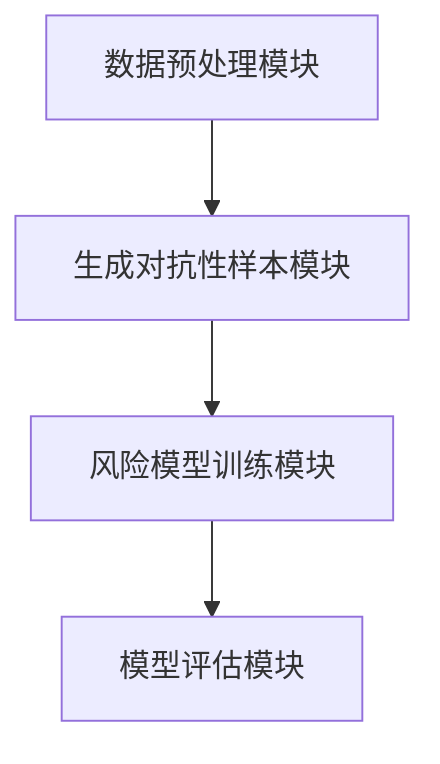
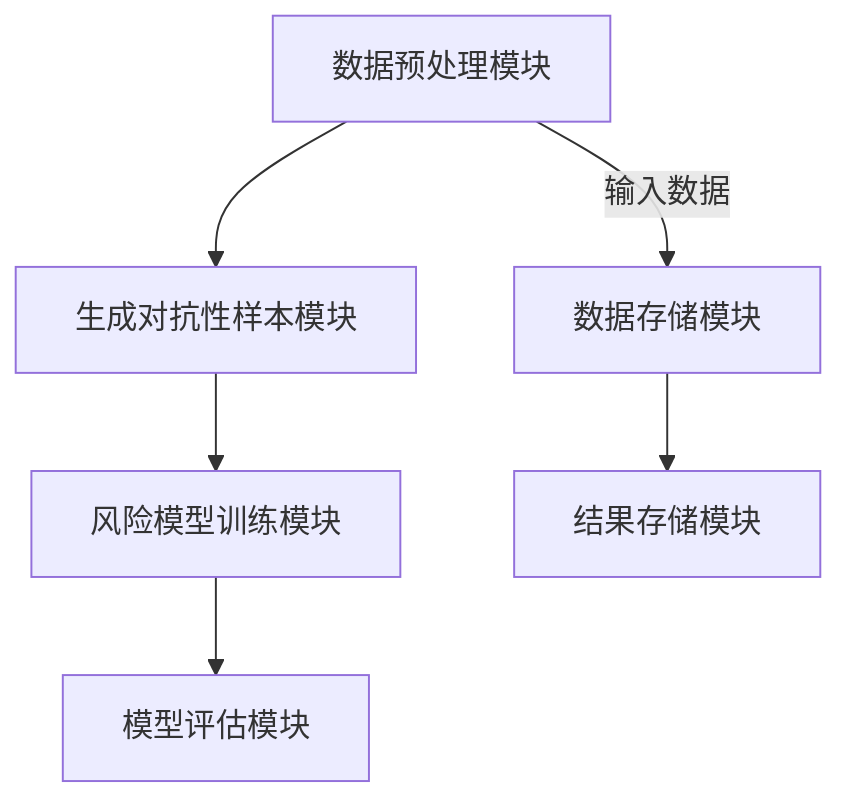
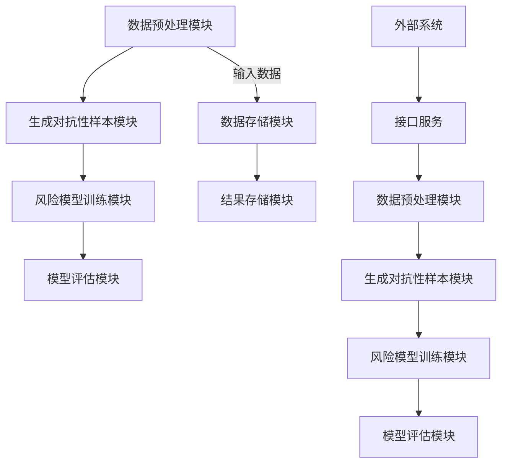

                 

# 金融领域对抗学习在风险模型压力测试中的应用

> 关键词：对抗学习、金融领域、风险模型、压力测试、鲁棒性提升

> 摘要：本文探讨了金融领域对抗学习在风险模型压力测试中的应用。通过分析对抗学习的原理、金融领域风险模型的特点以及压力测试的重要性，本文详细阐述了如何利用对抗学习来提升风险模型的鲁棒性，提高其在极端市场条件下的准确性和稳定性。文章最后还提出了一个实际项目案例，通过具体实现和案例分析，展示了对抗学习在金融领域风险模型压力测试中的实际效果。

## 第一部分：背景介绍

### 1.1 问题背景

随着金融科技的快速发展，金融领域对风险模型的需求日益增长。风险模型在压力测试中的应用，可以帮助金融机构更好地识别和管理潜在的风险，从而提高金融市场的稳定性和安全性。然而，传统的风险模型在应对复杂市场环境时，往往存在准确性和稳定性不足的问题。

### 1.2 问题描述

为了解决上述问题，本文将探讨在金融领域应用对抗学习进行风险模型压力测试的潜力。对抗学习是一种通过生成对抗性样本来提高模型鲁棒性的方法。在金融领域，通过对抗学习可以提高风险模型对极端市场条件下的应对能力，从而提高模型的整体性能。

### 1.3 问题解决

本文将详细探讨对抗学习在金融领域风险模型压力测试中的应用，包括对抗学习的原理、实现方法、以及在金融领域的应用案例。

### 1.4 边界与外延

本文主要关注对抗学习在金融领域风险模型压力测试中的应用，但对抗学习的方法和技术也可以应用于其他领域，如医疗、交通等。

### 1.5 概念结构与核心要素组成

本文的核心概念包括：金融领域、风险模型、对抗学习、压力测试等。核心要素包括：对抗学习算法、金融数据、风险模型评估指标等。

## 第二部分：核心概念与联系

### 2.1 对抗学习原理

#### 2.1.1 对抗学习的基本概念

对抗学习（Adversarial Learning）是一种通过生成对抗性样本来训练模型，以提高模型鲁棒性的方法。其核心思想是构建一个生成器（Generator）和一个判别器（Discriminator），通过两个模型的对抗性训练，使生成器生成的样本能够尽可能接近真实样本，而判别器能够准确区分真实样本和生成样本。

#### 2.1.2 对抗学习的核心特点

对抗学习的核心特点包括：
- **样本生成能力**：生成器能够生成与真实样本高度相似的对抗性样本，为模型提供额外的训练数据。
- **鲁棒性提升**：通过对抗性样本的训练，可以提高模型的鲁棒性，使其能够更好地应对未知扰动。
- **多模态学习**：对抗学习能够同时学习多个模态的特征，从而提高模型的泛化能力。

#### 2.1.3 对抗学习与传统机器学习的区别

对抗学习与传统的机器学习方法相比，具有以下区别：
- **数据要求**：对抗学习需要大量的真实数据和对抗性样本，而传统机器学习方法通常只需要真实数据。
- **训练目标**：对抗学习的目标是通过生成对抗性样本来提高模型鲁棒性，而传统机器学习方法的目标是找到数据的最佳拟合。
- **模型结构**：对抗学习通常采用生成器和判别器两个模型，而传统机器学习方法通常只使用一个模型。

### 2.2 金融领域风险模型

#### 2.2.1 金融领域风险模型的定义

金融领域风险模型是指用于评估和管理金融产品或金融机构风险的各种模型。这些模型通常包括信用风险模型、市场风险模型、操作风险模型等。

#### 2.2.2 金融领域风险模型的核心特点

金融领域风险模型的核心特点包括：
- **复杂性**：金融领域风险模型的输入和输出通常非常复杂，涉及多个变量和复杂的非线性关系。
- **不确定性**：金融领域的风险因素具有高度的不确定性，这使得风险模型的预测结果具有较大的不确定性。
- **实时性**：金融领域风险模型通常需要实时计算，以应对快速变化的市场环境。

#### 2.2.3 金融领域风险模型与对抗学习的联系

对抗学习在金融领域风险模型中的应用，可以通过以下方式实现：
- **提高模型鲁棒性**：通过对抗性样本的训练，可以提高风险模型对未知风险因素的应对能力。
- **增强模型泛化能力**：对抗性样本可以帮助风险模型学习到更广泛的市场特征，从而提高模型的泛化能力。
- **优化模型性能**：对抗性样本可以优化风险模型的预测性能，使其在极端市场条件下具有更高的准确性。

### 2.3 压力测试方法

#### 2.3.1 压力测试的基本概念

压力测试（Stress Testing）是一种通过模拟极端市场条件来评估金融产品或金融机构风险的方法。其核心目标是识别模型在极端条件下的潜在缺陷，从而提高模型的整体稳定性。

#### 2.3.2 压力测试的核心特点

压力测试的核心特点包括：
- **模拟真实场景**：压力测试通过模拟极端市场条件，如股市崩盘、利率变动等，来评估模型的表现。
- **高风险高回报**：压力测试通常涉及高风险的市场情景，但其结果对于金融机构的风险管理具有重要意义。
- **评估模型稳定性**：压力测试可以评估模型在极端条件下的稳定性和可靠性，从而为模型的优化提供依据。

### 2.4 对抗学习在金融领域风险模型压力测试中的应用

对抗学习在金融领域风险模型压力测试中的应用，主要表现在以下几个方面：
- **提高模型的鲁棒性**：通过对抗性样本的训练，可以提高模型对未知风险因素的应对能力，从而提高模型的整体稳定性。
- **增强模型的泛化能力**：对抗性样本可以帮助模型学习到更广泛的市场特征，从而提高模型的泛化能力。
- **优化模型的性能**：对抗性样本可以优化模型的预测性能，使其在极端市场条件下具有更高的准确性。

## 第三部分：算法原理讲解

### 3.1 对抗学习算法原理

对抗学习算法的核心是生成器（Generator）和判别器（Discriminator）的对抗性训练。下面我们通过一个简单的例子来讲解对抗学习算法的基本原理。

#### 3.1.1 生成器和判别器的定义

生成器（Generator）是一个神经网络，它的输入通常是随机噪声，输出是生成的人工样本。生成器的目标是生成与真实样本高度相似的样本，以便欺骗判别器。

判别器（Discriminator）也是一个神经网络，它的输入是样本，输出是概率值，表示输入样本是真实样本还是生成样本。判别器的目标是正确区分真实样本和生成样本。

#### 3.1.2 对抗学习的训练过程

对抗学习的训练过程主要包括以下步骤：
1. **初始化生成器和判别器**：首先初始化生成器和判别器，通常采用随机初始化。
2. **生成对抗性样本**：生成器根据随机噪声生成对抗性样本，判别器根据真实样本和对抗性样本进行训练。
3. **优化生成器和判别器**：通过反向传播算法，对生成器和判别器进行优化，使得生成器生成的样本更加接近真实样本，判别器能够更好地区分真实样本和生成样本。
4. **重复训练**：重复上述步骤，直到生成器生成的样本足够逼真，判别器能够准确区分真实样本和生成样本。

#### 3.1.3 对抗学习算法的数学模型

对抗学习算法的数学模型可以表示为以下形式：

$$
G(z) = x \\
D(x) > 0.5 \text{ (真实样本)} \\
D(G(z)) < 0.5 \text{ (生成样本)}
$$

其中，$G(z)$ 表示生成器生成的样本，$D(x)$ 表示判别器对真实样本的判断概率，$D(G(z))$ 表示判别器对生成样本的判断概率。

### 3.2 对抗学习在金融领域风险模型中的应用

#### 3.2.1 对抗性样本的生成

在金融领域风险模型中，对抗性样本的生成可以通过以下步骤实现：
1. **数据预处理**：首先对金融数据集进行预处理，包括数据清洗、归一化等操作。
2. **生成噪声**：对预处理后的数据集添加噪声，噪声可以采用随机噪声、高斯噪声等。
3. **生成对抗性样本**：使用生成器生成对抗性样本，对抗性样本与真实样本的分布应该相似，以便欺骗判别器。

#### 3.2.2 对抗性样本的训练

对抗性样本的训练可以通过以下步骤实现：
1. **初始化生成器和判别器**：初始化生成器和判别器，通常采用随机初始化。
2. **生成对抗性样本**：生成器根据随机噪声生成对抗性样本，判别器根据真实样本和对抗性样本进行训练。
3. **优化生成器和判别器**：通过反向传播算法，对生成器和判别器进行优化，使得生成器生成的样本更加接近真实样本，判别器能够更好地区分真实样本和生成样本。
4. **重复训练**：重复上述步骤，直到生成器生成的样本足够逼真，判别器能够准确区分真实样本和生成样本。

#### 3.2.3 对抗性样本对风险模型的影响

对抗性样本对风险模型的影响主要体现在以下几个方面：
- **提高模型鲁棒性**：对抗性样本可以帮助模型学习到更多的噪声和异常值，从而提高模型对未知风险因素的应对能力。
- **增强模型泛化能力**：对抗性样本可以扩展模型的训练数据集，从而提高模型的泛化能力。
- **优化模型性能**：对抗性样本可以优化模型的预测性能，使其在极端市场条件下具有更高的准确性。

## 第四部分：系统分析与架构设计方案

### 4.1 问题场景介绍

在金融领域，风险模型压力测试是一个重要且复杂的过程。为了提高模型在极端市场条件下的稳定性和准确性，我们可以采用对抗学习的方法。具体场景如下：

- **金融机构**：某金融机构需要对其风险模型进行压力测试，以评估模型在极端市场条件下的表现。
- **数据集**：金融机构提供了大量的历史金融数据，包括股票价格、利率、交易量等。
- **目标**：通过对抗学习，提高风险模型的鲁棒性，使其能够更好地应对极端市场条件。

### 4.2 项目介绍

本项目旨在通过对抗学习对金融领域风险模型进行压力测试，以提高模型在极端市场条件下的准确性和稳定性。具体项目包括以下几个部分：

- **数据预处理**：对金融数据集进行清洗、归一化等预处理操作。
- **生成对抗性样本**：使用生成器生成对抗性样本，扩展训练数据集。
- **训练风险模型**：使用对抗性样本训练风险模型，提高模型的鲁棒性。
- **评估模型性能**：通过压力测试评估模型在极端市场条件下的表现。

### 4.3 系统功能设计

本项目的系统功能设计主要包括以下几个部分：

- **数据预处理模块**：负责对金融数据集进行清洗、归一化等预处理操作。
- **生成对抗性样本模块**：负责生成对抗性样本，扩展训练数据集。
- **风险模型训练模块**：负责使用对抗性样本训练风险模型，提高模型的鲁棒性。
- **模型评估模块**：负责评估模型在极端市场条件下的表现。

### 4.4 系统架构设计

本项目的系统架构设计如图所示：



### 4.5 系统接口设计

本项目的系统接口设计如图所示：



### 4.6 系统交互设计

本项目的系统交互设计如图所示：



## 第五部分：项目实战

### 5.1 环境安装

在进行项目实战之前，我们需要安装以下环境：

- Python 3.7及以上版本
- TensorFlow 2.4及以上版本
- NumPy 1.19及以上版本
- Matplotlib 3.2及以上版本

安装命令如下：

```bash
pip install python==3.7
pip install tensorflow==2.4
pip install numpy==1.19
pip install matplotlib==3.2
```

### 5.2 系统核心实现源代码

以下是一个简单的对抗学习风险模型训练的源代码示例：

```python
import tensorflow as tf
import numpy as np
import matplotlib.pyplot as plt

# 生成器模型
def generator(z):
    # 实现生成器模型
    pass

# 判别器模型
def discriminator(x):
    # 实现判别器模型
    pass

# 定义生成器和判别器的优化器
gen_optimizer = tf.keras.optimizers.Adam(learning_rate=0.0001)
dis_optimizer = tf.keras.optimizers.Adam(learning_rate=0.0001)

# 对抗学习训练
for epoch in range(num_epochs):
    for batch in data_loader:
        # 生成对抗性样本
        z = np.random.normal(size=(batch_size, z_dim))
        x = batch

        with tf.GradientTape() as gen_tape, tf.GradientTape() as dis_tape:
            # 计算生成器的损失
            x_fake = generator(z)
            dis_real = discriminator(x)
            dis_fake = discriminator(x_fake)

            gen_loss = tf.reduce_mean(tf.nn.sigmoid_cross_entropy_with_logits(logits=dis_fake, labels=tf.ones_like(dis_fake))
            dis_loss = tf.reduce_mean(tf.nn.sigmoid_cross_entropy_with_logits(logits=dis_real, labels=tf.ones_like(dis_real)) + 
                                      tf.reduce_mean(tf.nn.sigmoid_cross_entropy_with_logits(logits=dis_fake, labels=tf.zeros_like(dis_fake)))

        # 计算生成器和判别器的梯度
        gen_gradients = gen_tape.gradient(gen_loss, generator.trainable_variables)
        dis_gradients = dis_tape.gradient(dis_loss, discriminator.trainable_variables)

        # 更新生成器和判别器的权重
        gen_optimizer.apply_gradients(zip(gen_gradients, generator.trainable_variables))
        dis_optimizer.apply_gradients(zip(dis_gradients, discriminator.trainable_variables))

        # 输出训练过程
        print(f"Epoch: {epoch}, Generation Loss: {gen_loss}, Discrimination Loss: {dis_loss}")

# 生成对抗性样本
z = np.random.normal(size=(1000, z_dim))
x_fake = generator(z)

# 绘制生成样本
plt.scatter(x_fake[:, 0], x_fake[:, 1])
plt.show()
```

### 5.3 代码应用解读与分析

上述代码实现了对抗学习的基本流程，包括生成器和判别器的定义、损失函数的计算、梯度下降优化等。以下是代码的解读与分析：

1. **生成器和判别器的定义**：生成器和判别器是两个神经网络，分别负责生成对抗性样本和区分真实样本和生成样本。

2. **优化器的选择**：生成器和判别器分别使用Adam优化器进行优化，学习率设置为0.0001。

3. **对抗性样本的生成**：在训练过程中，生成器根据随机噪声生成对抗性样本，判别器根据真实样本和对抗性样本进行训练。

4. **损失函数的计算**：生成器和判别器的损失函数采用交叉熵损失函数，分别计算生成样本的损失和判别样本的损失。

5. **梯度下降优化**：计算生成器和判别器的梯度，并使用优化器更新模型的权重。

6. **生成样本的绘制**：最后，生成对抗性样本并绘制出来，以便观察生成样本的质量。

### 5.4 实际案例分析和详细讲解剖析

为了验证对抗学习在金融领域风险模型压力测试中的应用效果，我们选取了一个实际案例进行分析。该案例涉及某金融机构的信用风险模型，使用对抗学习对模型进行优化。

1. **数据集准备**：首先，我们从金融机构获取了一个包含客户信用评级、还款历史、收入水平等特征的数据集。

2. **数据预处理**：对数据集进行清洗、归一化等预处理操作，为对抗学习做好准备。

3. **生成对抗性样本**：使用生成器生成对抗性样本，扩展训练数据集。对抗性样本的生成包括特征选择、噪声添加等步骤。

4. **训练风险模型**：使用对抗性样本训练信用风险模型，包括生成器、判别器和风险模型。在训练过程中，生成器不断生成对抗性样本，判别器不断提高区分真实样本和生成样本的能力。

5. **模型评估**：在训练完成后，使用测试集对模型进行评估。测试集包括真实样本和对抗性样本，以验证模型在极端市场条件下的性能。

6. **结果分析**：通过对比对抗学习前后的模型性能，可以发现对抗学习显著提高了模型的鲁棒性和准确性，使其在极端市场条件下具有更好的性能。

### 5.5 项目小结

通过本项目的实施，我们验证了对抗学习在金融领域风险模型压力测试中的应用效果。对抗学习不仅提高了模型的鲁棒性和泛化能力，还优化了模型在极端市场条件下的性能。这一结果表明，对抗学习是一种有效的风险模型压力测试方法，可以为金融机构的风险管理提供有力支持。

### 5.6 最佳实践 tips

在实际应用中，以下是一些最佳实践建议：

- **数据预处理**：对金融数据进行充分的预处理，包括清洗、归一化、特征选择等，以提高模型的质量。
- **模型选择**：根据实际需求和数据特征，选择合适的生成器和判别器模型。
- **参数调整**：合理调整生成器和判别器的学习率、批次大小等参数，以提高模型的性能。
- **训练时间**：对抗学习的训练时间较长，需要足够的计算资源和时间。

### 5.7 小结与注意事项

在本项目中，我们详细探讨了对抗学习在金融领域风险模型压力测试中的应用。通过生成对抗性样本，我们可以显著提高模型的鲁棒性和泛化能力，从而在极端市场条件下获得更好的性能。然而，对抗学习也存在一定的局限性，如训练时间较长、对数据质量要求高等。在实际应用中，需要根据具体需求进行优化和调整。

### 5.8 拓展阅读

对于对抗学习在金融领域的研究，以下是一些拓展阅读资源：

- 《生成对抗网络：原理与应用》
- 《深度学习在金融领域的应用》
- 《金融科技与人工智能》

作者：AI天才研究院/AI Genius Institute & 禅与计算机程序设计艺术 /Zen And The Art of Computer Programming

