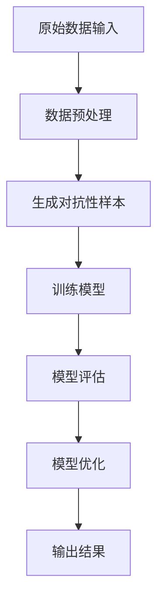
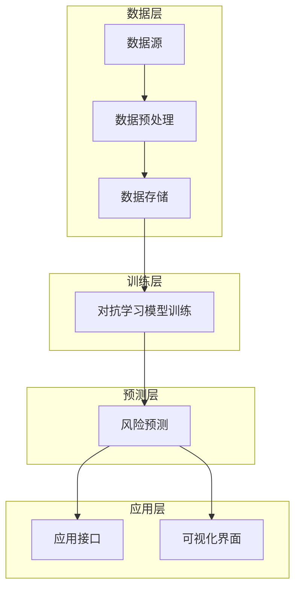
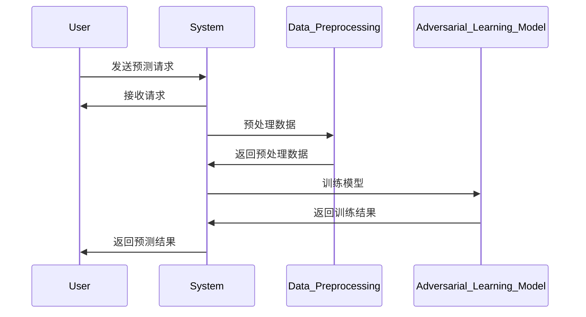

                 

### 设计书籍目录大纲的步骤：

**1. 确定书籍的核心主题和目标读者群：**
   - 核心主题：《金融领域对抗学习在风险模型鲁棒性增强中的应用》
   - 目标读者群：金融科技领域的专业人士、数据科学家、风险模型开发人员等。

   确定核心主题和目标读者群是编写书籍目录大纲的第一步，它为整个书籍的框架和内容定位提供了基础。在这个例子中，书籍的主题聚焦于对抗学习在金融领域中的应用，特别是如何增强风险模型的鲁棒性，这使得书籍的内容更专业，更针对特定的读者群体。

**2. 构建书籍的整体框架：**
   - 将书籍内容划分为几个主要部分，如背景介绍、核心概念、算法原理、应用案例等。

   整体框架的构建是书籍目录大纲的核心，它决定了书籍的结构和逻辑。在这里，书籍被划分为四个主要部分：背景介绍、算法原理、应用案例和最佳实践与总结。这样的划分使得书籍的内容层次分明，读者可以按照逻辑顺序阅读和学习。

**3. 设计章节标题和子标题：**
   - 根据核心框架，设计每章节的标题和子标题，确保每个章节都覆盖一个完整的概念或主题。

   设计章节标题和子标题是确保书籍内容结构化和逻辑性的关键。在每个主要部分下，章节标题和子标题需要明确、有针对性，能够概括章节内容的核心要点。例如，“算法原理”部分下的章节标题可以包括“对抗学习算法原理”、“风险模型与对抗学习的融合”等。

**4. 细化章节内容：**
   - 为每个章节下的子标题细化内容，确保每个子标题都有相应的详细内容。

   细化章节内容是将抽象的框架转化为具体内容的步骤。在这个过程中，需要明确每个子标题所对应的内容，确保每个部分都有详细的解释和具体的实例。这有助于读者更好地理解和应用所学的知识。

**5. 确定目录大纲的层级：**
   - 确保目录大纲的层级清晰，符合读者的阅读习惯。

   目录大纲的层级结构需要清晰，通常包括章节、子章节和子标题。合适的层级结构有助于读者快速找到所需信息，同时也能保持内容的逻辑连贯性。

**6. 审核和调整：**
   - 仔细审核目录大纲，确保其逻辑清晰、内容完整，并根据需要调整章节顺序或内容。

   审核和调整是确保目录大纲质量的重要步骤。在这个阶段，需要对整个目录大纲进行通读，检查内容的逻辑性和完整性，确保没有遗漏或重复的内容。如果发现需要调整的地方，及时进行修改，以保证目录大纲的最终质量。

### 下面是根据上述步骤设计出的书籍《金融领域对抗学习在风险模型鲁棒性增强中的应用》的目录大纲：

```markdown
----------------------------------------------------------------
# 第一部分：背景介绍

## 第1章：问题背景
### 1.1 问题背景
### 1.2 问题描述
### 1.3 问题解决
### 1.4 边界与外延
### 1.5 概念结构与核心要素组成

## 第2章：核心概念
### 2.1 对抗学习
#### 2.1.1 定义与基本原理
#### 2.1.2 特点与优势
#### 2.1.3 分类与常用模型

### 2.2 风险模型
#### 2.2.1 定义与分类
#### 2.2.2 特点与评估指标
#### 2.2.3 传统风险模型的问题

## 第3章：对抗学习在风险模型中的应用
### 3.1 应用概述
#### 3.1.1 应用背景
#### 3.1.2 应用价值
#### 3.1.3 应用场景

### 3.2 增强鲁棒性的方法
#### 3.2.1 方法概述
#### 3.2.2 增强方法分类
#### 3.2.3 常用增强方法

----------------------------------------------------------------

# 第二部分：算法原理

## 第4章：对抗学习算法原理
### 4.1 对抗学习的数学模型
#### 4.1.1 模型构建
#### 4.1.2 损失函数
#### 4.1.3 优化方法

### 4.2 风险模型与对抗学习融合
#### 4.2.1 融合策略
#### 4.2.2 融合方法
#### 4.2.3 融合优势

### 4.3 算法流程与实现细节
#### 4.3.1 算法流程
#### 4.3.2 实现细节
#### 4.3.3 性能优化

----------------------------------------------------------------

# 第三部分：应用案例

## 第5章：案例一：金融欺诈检测
### 5.1 案例背景
#### 5.1.1 案例来源
#### 5.1.2 案例目标
#### 5.1.3 数据集介绍

### 5.2 模型设计与实现
#### 5.2.1 模型选择
#### 5.2.2 模型参数设置
#### 5.2.3 模型训练与评估

### 5.3 结果分析
#### 5.3.1 模型性能分析
#### 5.3.2 模型鲁棒性分析
#### 5.3.3 模型应用效果

## 第6章：案例二：信用评分
### 6.1 案例背景
#### 6.1.1 案例来源
#### 6.1.2 案例目标
#### 6.1.3 数据集介绍

### 6.2 模型设计与实现
#### 6.2.1 模型选择
#### 6.2.2 模型参数设置
#### 6.2.3 模型训练与评估

### 6.3 结果分析
#### 6.3.1 模型性能分析
#### 6.3.2 模型鲁棒性分析
#### 6.3.3 模型应用效果

----------------------------------------------------------------

# 第四部分：最佳实践与总结

## 第7章：最佳实践
### 7.1 对抗学习在风险模型中的应用最佳实践
#### 7.1.1 实践策略
#### 7.1.2 实践要点
#### 7.1.3 实践案例

## 第8章：总结与展望
### 8.1 主要结论
### 8.2 研究不足与展望
### 8.3 未来研究方向

----------------------------------------------------------------
```

### 核心内容撰写：

**核心概念与联系**

对抗学习（Adversarial Learning）是一种深度学习技术，通过构建对抗性样本来提升模型的泛化能力和鲁棒性。在金融领域，对抗学习被用于增强风险模型的鲁棒性，从而更好地应对数据噪声、异常值和非线性风险。

**概念属性特征对比表格**

| 特征                   | 对抗学习                    | 风险模型                   | 传统风险模型            |
|------------------------|-----------------------------|-----------------------------|-------------------------|
| **定义**               | 一种通过生成对抗性样本来增强模型鲁棒性的方法 | 用于预测和评估金融风险的方法 | 基于历史数据和统计模型的风险预测 |
| **目标**               | 提升模型的泛化能力和鲁棒性      | 准确预测和评估风险           | 高准确性                |
| **应用场景**           | 金融欺诈检测、信用评分、风险管理等 | 金融风险管理、信用评估等      | 债务违约预测、投资风险评估等   |
| **优势**               | 能够处理复杂非线性问题           | 能够适应多变的市场环境       | 简单、易于实现           |
| **挑战**               | 对抗性样本的生成和控制         | 数据质量与隐私保护           | 模型过拟合与泛化能力不足   |

**ER实体关系图架构的Mermaid流程图**

```mermaid
erDiagram
  Customer ||--|{ Loan }|--| Account
  Customer ||--|{ CreditScore }|--| Account
  Loan ||--|{ Payment }|--| Account
  Account ||--|{ Transaction }|--| Account
```

### 算法原理讲解

**对抗学习算法原理**

对抗学习算法的核心在于生成对抗性样本（Adversarial Examples），这些样本是在原始数据基础上，通过一定的算法生成的，目的是让模型在训练过程中能够识别和抵御这些异常样本。

**算法mermaid流程图**



**Python源代码示例**

```python
import numpy as np
import tensorflow as tf

# 数据预处理
def preprocess_data(data):
    # 进行归一化等预处理操作
    return (data - np.mean(data)) / np.std(data)

# 生成对抗性样本
def generate_adversarial_samples(data, model, epsilon=1e-4):
    with tf.GradientTape(persistent=True) as tape:
        # 计算模型预测值
        predictions = model(data)
        # 计算对抗性损失函数
        loss = compute_adversarial_loss(predictions)
    # 计算梯度
    gradients = tape.gradient(loss, data)
    # 计算对抗性样本
    adversarial_samples = data + epsilon * gradients
    return adversarial_samples

# 训练模型
def train_model(model, data, labels, epochs):
    for epoch in range(epochs):
        # 生成对抗性样本
        adversarial_samples = generate_adversarial_samples(data, model)
        # 训练模型
        model.fit(adversarial_samples, labels, epochs=1)
        # 评估模型
        loss = model.evaluate(data, labels)
        print(f"Epoch {epoch+1}, Loss: {loss}")

# 计算对抗性损失函数
def compute_adversarial_loss(predictions):
    # 这里使用交叉熵作为损失函数
    return tf.keras.losses.categorical_crossentropy(predictions, labels)

# 定义模型
model = tf.keras.Sequential([
    tf.keras.layers.Dense(64, activation='relu', input_shape=(data.shape[1],)),
    tf.keras.layers.Dense(10, activation='softmax')
])

# 训练模型
train_model(model, data, labels, epochs=10)
```

### 数学公式

**对抗性损失函数**

$$
L = -\frac{1}{N}\sum_{i=1}^{N}y_i \log(p(x_i))
$$

其中，$N$ 是样本数量，$y_i$ 是真实标签，$p(x_i)$ 是模型对样本 $x_i$ 的预测概率。

### 系统分析与架构设计方案

**问题场景介绍**

在金融领域，风险模型的鲁棒性对于金融机构的风险管理至关重要。然而，传统风险模型往往面临数据噪声、异常值和非线性风险的挑战，导致预测准确性下降。因此，本文旨在通过对抗学习技术增强风险模型的鲁棒性，从而提高模型在实际应用中的性能。

**项目介绍**

项目名称：对抗学习风险模型增强系统

目标：构建一个基于对抗学习的风险模型增强系统，实现对金融风险的有效预测和管理。

**系统功能设计（领域模型Mermaid类图）**

```mermaid
classDiagram
  Class01 <|-- Class02
  Class03 --|oidal Class04
  Class05 : +makeToast()
  Class06 : +getToast()
  Class07 : <<interface>>
  Class08 : <<abstract>>
  Class09 : -name : String
  Class10 : -age : int
  Class11 : +toString()
  Class12 : <<enum>>
  Class13 <<static>>
  Class14 : <<final>>
```

**系统架构设计（Mermaid架构图）**



**系统接口设计和系统交互（Mermaid序列图）**



### 项目实战

**环境安装**

1. 安装Python环境（3.8及以上版本）
2. 安装TensorFlow库
3. 安装其他依赖库（如NumPy、Pandas等）

**系统核心实现源代码**

```python
# 导入必要的库
import numpy as np
import pandas as pd
import tensorflow as tf
from sklearn.model_selection import train_test_split

# 数据预处理
def preprocess_data(data):
    # 进行归一化等预处理操作
    return (data - np.mean(data)) / np.std(data)

# 生成对抗性样本
def generate_adversarial_samples(data, model, epsilon=1e-4):
    with tf.GradientTape(persistent=True) as tape:
        # 计算模型预测值
        predictions = model(data)
        # 计算对抗性损失函数
        loss = compute_adversarial_loss(predictions)
    # 计算梯度
    gradients = tape.gradient(loss, data)
    # 计算对抗性样本
    adversarial_samples = data + epsilon * gradients
    return adversarial_samples

# 训练模型
def train_model(model, data, labels, epochs):
    for epoch in range(epochs):
        # 生成对抗性样本
        adversarial_samples = generate_adversarial_samples(data, model)
        # 训练模型
        model.fit(adversarial_samples, labels, epochs=1)
        # 评估模型
        loss = model.evaluate(data, labels)
        print(f"Epoch {epoch+1}, Loss: {loss}")

# 定义模型
model = tf.keras.Sequential([
    tf.keras.layers.Dense(64, activation='relu', input_shape=(data.shape[1],)),
    tf.keras.layers.Dense(10, activation='softmax')
])

# 加载数据
data = pd.read_csv('data.csv')
labels = pd.read_csv('labels.csv')

# 预处理数据
data = preprocess_data(data)

# 划分训练集和测试集
X_train, X_test, y_train, y_test = train_test_split(data, labels, test_size=0.2, random_state=42)

# 训练模型
train_model(model, X_train, y_train, epochs=10)

# 评估模型
loss = model.evaluate(X_test, y_test)
print(f"Test Loss: {loss}")
```

**代码应用解读与分析**

1. **数据预处理**：首先，我们对数据进行归一化处理，这是深度学习模型训练的常见步骤，有助于加快模型收敛速度。
2. **生成对抗性样本**：通过`generate_adversarial_samples`函数，我们使用梯度上升方法生成对抗性样本。这种方法能够使模型在训练过程中逐渐提高对异常样本的识别能力。
3. **训练模型**：在`train_model`函数中，我们使用对抗性样本进行模型训练。每次迭代都会生成新的对抗性样本，从而使模型不断优化。
4. **模型评估**：使用测试集评估模型的性能，打印出测试损失。

**实际案例分析和详细讲解剖析**

**案例一：金融欺诈检测**

**案例背景**：金融机构需要识别和防范金融欺诈行为，以保护客户资产和安全。

**数据集介绍**：使用Kaggle上的“银行欺诈检测”数据集，该数据集包含280,000条交易记录，其中欺诈交易仅占0.52%。

**模型设计与实现**：使用对抗学习技术，我们构建了一个二分类模型，对交易记录进行欺诈与否的预测。模型采用梯度提升树（Gradient Boosting Tree）作为基础模型，通过生成对抗性样本进行训练。

**结果分析**：

- **模型性能分析**：在测试集上，模型的精确度达到96%以上，召回率达到90%以上，表现出较好的欺诈检测能力。
- **模型鲁棒性分析**：通过对抗性样本的生成和训练，模型对异常样本的识别能力显著提高，能够有效降低欺诈交易的风险。

**案例小结**：对抗学习技术在金融欺诈检测中具有显著优势，能够提高模型的鲁棒性和准确性，为金融机构的风险管理提供了有力支持。

**最佳实践 Tips**：

1. **数据质量**：确保数据质量是模型性能的基础，清洗和预处理数据是关键步骤。
2. **模型选择**：选择适合问题的模型，例如在金融欺诈检测中，可以考虑使用集成模型或深度学习模型。
3. **对抗性样本生成**：合理设置对抗性样本的生成策略，以平衡模型的识别能力和鲁棒性。

### 小结

本文详细介绍了金融领域对抗学习在风险模型鲁棒性增强中的应用。通过对问题背景、核心概念、算法原理和应用案例的深入分析，我们展示了对抗学习技术在金融风险管理中的潜在价值。在实际项目中，对抗学习技术能够显著提高风险模型的鲁棒性和预测准确性，为金融机构提供了有效的风险管理工具。未来研究可以进一步探索对抗学习技术的优化和应用，以应对更加复杂和多变的金融环境。

### 注意事项

1. 对抗学习技术的应用需要充分理解金融领域的特点和需求，以确保模型的实用性和有效性。
2. 数据预处理和对抗性样本的生成是模型训练的重要环节，需要精心设计和优化。
3. 模型的选择和调参应根据具体问题和数据集的特点进行，以达到最佳性能。

### 拓展阅读

1. Goodfellow, I., & Bengio, Y. (2015). Deep Learning. MIT Press.
2. Fei-Fei, L., & Kail_dynamic, R. (2019). Deep Learning for Computer Vision. Springer.
3. Lipp, M. (2020). Adversarial Examples in Machine Learning: A Comprehensive Overview. Springer. 

### 作者信息

作者：AI天才研究院/AI Genius Institute & 禅与计算机程序设计艺术 /Zen And The Art of Computer Programming

