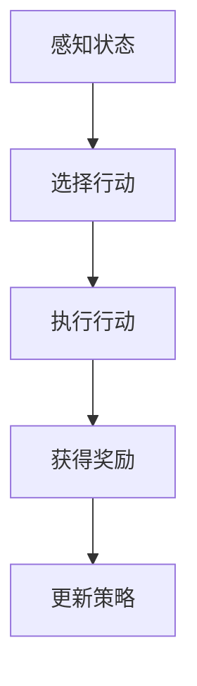
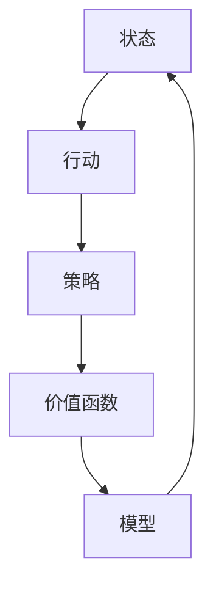
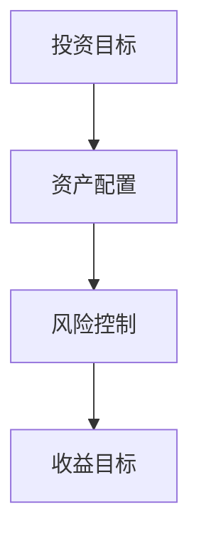
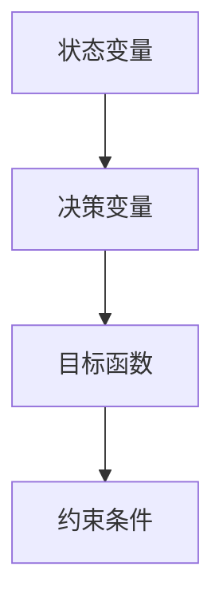

                 

### 文章标题：金融领域强化学习在多周期投资组合优化中的应用

#### 关键词：强化学习、多周期投资组合、金融领域、优化算法、应用实例

#### 摘要：
本文旨在探讨强化学习在金融领域多周期投资组合优化中的应用。首先，我们将介绍强化学习的基本概念和特点，以及多周期投资组合优化的核心理论和挑战。接着，我们将详细阐述如何利用强化学习算法进行多周期投资组合的优化，并通过实例分析验证其有效性。最后，我们将分享一些在实际应用中的最佳实践和未来研究方向，以期为金融领域的投资组合优化提供有益的参考。

### 第一部分：引论

#### 1.1 问题背景

#### 1.1.1 金融投资领域的发展与挑战

随着全球化经济的深入发展和金融市场的日益复杂，投资组合优化在金融领域的重要性日益凸显。传统的投资组合优化方法大多基于历史数据和统计模型，往往难以应对金融市场的不确定性和动态变化。然而，金融市场的复杂性使得传统的优化方法面临以下挑战：

1. **数据质量与完整性**：金融市场的数据量庞大，但数据质量参差不齐，完整性也难以保证。
2. **市场动态变化**：金融市场的波动性大，短期内难以准确预测市场趋势。
3. **多周期优化需求**：投资组合的优化通常涉及多个周期，要求策略能够适应不同周期的市场变化。

#### 1.1.2 多周期投资组合优化的需求与挑战

多周期投资组合优化是指在多个投资周期内，通过调整投资组合的资产配置，实现收益最大化或风险最小化。多周期投资组合优化的需求主要来源于以下几个方面：

1. **长期投资规划**：许多投资者希望在多个投资周期内实现资产增值，需要制定长期的投资策略。
2. **风险分散**：通过多周期投资，可以实现资产在不同市场环境下的分散，降低整体风险。
3. **动态调整**：市场环境不断变化，投资者需要根据市场情况动态调整投资组合。

然而，多周期投资组合优化也面临一些挑战：

1. **模型选择**：传统的优化方法难以适应多周期优化需求，需要新的算法和技术。
2. **计算复杂度**：多周期优化涉及大量的计算和模拟，对计算资源和算法效率有较高要求。
3. **市场预测**：准确预测市场趋势和资产表现对于优化策略的制定至关重要，但实际操作中往往难以实现。

#### 1.1.3 强化学习在金融领域的应用

强化学习作为一种基于试错和反馈机制的人工智能方法，近年来在金融领域引起了广泛关注。强化学习在金融领域的应用主要体现在以下几个方面：

1. **自适应交易策略**：强化学习可以根据市场数据动态调整交易策略，提高交易成功率。
2. **风险管理**：通过学习市场数据和交易策略，强化学习可以优化风险控制措施，降低投资风险。
3. **投资组合优化**：强化学习可以用于多周期投资组合优化，提高投资回报率。

强化学习在金融领域的应用优势主要包括：

1. **自适应性强**：强化学习可以根据市场环境动态调整策略，适应不同周期的市场变化。
2. **数据驱动**：强化学习基于大量市场数据进行学习，可以充分利用数据信息，提高决策准确性。
3. **灵活性高**：强化学习可以适应不同的投资组合优化目标和约束条件，具有广泛的适用性。

#### 1.2 核心概念与联系

##### 1.2.1 强化学习的定义与特点

强化学习（Reinforcement Learning，简称RL）是一种通过试错和反馈进行学习的人工智能方法。它由三个核心组成部分：环境（Environment）、代理（Agent）和奖励机制（Reward Mechanism）。

1. **环境**：环境是代理进行决策和行动的场所，它可以是一个物理环境或一个模拟环境。
2. **代理**：代理是执行行动、感知环境和接收奖励的主体，它通过学习优化自身的行动策略。
3. **奖励机制**：奖励机制用于评估代理的行动效果，奖励可以是正面的也可以是负面的，用于引导代理学习正确的行动策略。

强化学习的特点包括：

1. **自适应性强**：强化学习可以根据环境反馈动态调整策略，适应不断变化的环境。
2. **数据驱动**：强化学习基于大量环境交互数据进行学习，可以充分利用数据信息。
3. **灵活性高**：强化学习可以应用于各种复杂环境，适用于不同类型的优化问题。

##### 1.2.2 多周期投资组合优化的核心概念

多周期投资组合优化是指在一个投资周期内，通过调整资产配置，实现长期投资目标。其核心概念包括：

1. **资产配置**：资产配置是指将投资资金分配到不同的资产类别中，以达到投资目标。
2. **风险控制**：风险控制是指通过制定合理的投资策略，降低投资组合的整体风险。
3. **收益目标**：收益目标是指投资者在长期投资过程中希望实现的收益率。

多周期投资组合优化的目标是在不同周期的市场环境下，实现资产增值和风险分散，提高投资回报率。

##### 1.2.3 强化学习与投资组合优化的关系

强化学习与投资组合优化之间存在密切的联系：

1. **学习策略**：强化学习可以通过学习市场数据和交易策略，为投资组合优化提供有效的决策支持。
2. **自适应优化**：强化学习可以根据市场环境动态调整投资策略，实现多周期投资组合优化。
3. **风险控制**：强化学习可以优化风险控制措施，降低投资组合的风险。

强化学习为投资组合优化提供了一种新的方法和技术，可以解决传统方法在多周期优化中的局限性，提高投资回报率。

#### 1.3 研究目的与内容结构

##### 1.3.1 研究目的

本文的研究目的在于探讨强化学习在多周期投资组合优化中的应用，通过理论分析和实例验证，分析强化学习在投资组合优化中的优势和局限性，为金融领域的投资决策提供有益的参考。

##### 1.3.2 内容结构概述

本文分为五个部分：

1. **引论**：介绍强化学习和多周期投资组合优化的背景、核心概念及其关系。
2. **基础理论**：阐述强化学习和多周期投资组合优化的基础理论。
3. **金融领域强化学习应用**：分析强化学习在金融领域，特别是多周期投资组合优化中的应用。
4. **项目实战**：通过实例展示强化学习在多周期投资组合优化中的实际应用。
5. **最佳实践与拓展**：总结强化学习在多周期投资组合优化中的最佳实践和未来研究方向。

### 第二部分：基础理论

#### 2.1 强化学习基础理论

##### 2.1.1 强化学习的基本原理

强化学习（Reinforcement Learning，简称RL）是一种通过试错和反馈进行学习的人工智能方法。它由三个核心组成部分：环境（Environment）、代理（Agent）和奖励机制（Reward Mechanism）。

1. **环境**：环境是代理进行决策和行动的场所，它可以是一个物理环境或一个模拟环境。在金融领域中，环境通常是指市场环境和宏观经济环境。
2. **代理**：代理是执行行动、感知环境和接收奖励的主体，它通过学习优化自身的行动策略。在金融领域中，代理通常是指投资者或投资机构。
3. **奖励机制**：奖励机制用于评估代理的行动效果，奖励可以是正面的也可以是负面的，用于引导代理学习正确的行动策略。在金融领域中，奖励机制通常是基于投资回报或风险调整后收益来衡量的。

强化学习的基本原理可以概括为以下步骤：

1. **感知状态**：代理感知当前的环境状态。
2. **选择行动**：代理根据当前状态选择一个行动。
3. **执行行动**：代理在环境中执行所选行动。
4. **获得奖励**：代理根据行动的结果获得奖励。
5. **更新策略**：代理根据奖励结果更新自身的策略，以期望获得更高的长期奖励。

强化学习的基本原理示意图如下所示：



##### 2.1.2 强化学习模型

强化学习模型主要包括以下几个基本组成部分：

1. **状态（State）**：状态是描述环境当前状态的变量或集合。在投资组合优化中，状态通常包括市场数据、宏观经济指标、政策变化等。
2. **行动（Action）**：行动是代理可以采取的行动或决策。在投资组合优化中，行动通常包括调整资产配置、买入或卖出资产等。
3. **策略（Policy）**：策略是代理在给定状态下选择行动的规则。在投资组合优化中，策略通常是基于强化学习算法计算出的最优行动方案。
4. **价值函数（Value Function）**：价值函数是评估代理在不同状态下的长期奖励的函数。在投资组合优化中，价值函数通常用于预测不同资产配置下的收益和风险。
5. **模型（Model）**：模型是描述环境动态的数学模型。在投资组合优化中，模型通常用于预测市场状态的变化和资产表现。

强化学习模型的基本结构可以表示为：



强化学习模型的工作流程如下：

1. **初始化**：初始化状态、策略、价值函数和模型。
2. **感知状态**：代理感知当前的状态。
3. **选择行动**：代理根据当前状态和策略选择行动。
4. **执行行动**：代理在环境中执行所选行动。
5. **获得奖励**：代理根据行动的结果获得奖励。
6. **更新策略和价值函数**：代理根据奖励结果更新策略和价值函数。
7. **迭代**：重复步骤 2 到 6，直到达到预定的迭代次数或目标。

##### 2.1.3 强化学习算法分类

强化学习算法可以根据学习策略的不同分为以下几类：

1. **基于值函数的算法**：这类算法通过学习状态值函数（State-Value Function）和动作值函数（Action-Value Function）来优化策略。常见的算法包括 Q-Learning 和 SARSA。

   - **Q-Learning**：Q-Learning 是一种基于值迭代的方法，通过不断更新 Q 值表来逼近最优策略。其更新公式如下：

     $$ Q(s, a) \leftarrow Q(s, a) + \alpha [r + \gamma \max_{a'} Q(s', a') - Q(s, a)] $$

     其中，$s$ 是当前状态，$a$ 是当前行动，$r$ 是获得的奖励，$\gamma$ 是折扣因子，$\alpha$ 是学习率。

   - **SARSA**：SARSA 是一种基于策略迭代的方法，通过同时更新当前状态和下一状态的动作值函数来优化策略。其更新公式如下：

     $$ Q(s, a) \leftarrow Q(s, a) + \alpha [r + \gamma Q(s', a')] - Q(s, a)] $$

2. **基于策略的算法**：这类算法通过直接优化策略来优化回报。常见的算法包括 Policy Gradient 和 REINFORCE。

   - **Policy Gradient**：Policy Gradient 是一种基于梯度下降的方法，通过计算策略梯度和策略更新公式来优化策略。其更新公式如下：

     $$ \theta \leftarrow \theta - \alpha \nabla_{\theta} J(\theta) $$

     其中，$\theta$ 是策略参数，$J(\theta)$ 是策略的回报函数。

   - **REINFORCE**：REINFORCE 是一种基于蒙特卡罗方法的策略优化算法，通过模拟多个随机轨迹并计算回报来优化策略。

3. **基于模型的算法**：这类算法通过学习环境模型来预测状态转移和奖励，然后基于模型预测进行策略优化。常见的算法包括 Dyna 模型和部分可观察马尔可夫决策过程（Partially Observable Markov Decision Process，简称 POMDP）。

   - **Dyna 模型**：Dyna 模型是一种基于模型预测和实际执行相结合的方法，通过构建环境模型来预测状态转移和奖励，并在实际环境中进行验证和更新模型。

   - **POMDP**：POMDP 是一种针对部分可观察环境的强化学习算法，通过构建部分可观察马尔可夫决策过程来优化策略。

#### 2.2 多周期投资组合优化理论

##### 2.2.1 投资组合优化基本理论

投资组合优化是指通过调整资产配置，实现投资目标的过程。其基本理论包括以下几个核心概念：

1. **资产配置**：资产配置是指将投资资金分配到不同的资产类别中，以达到投资目标。资产配置的目标是在风险可控的前提下，实现收益最大化。

2. **风险控制**：风险控制是指通过制定合理的投资策略，降低投资组合的整体风险。风险控制的目标是在保证收益的前提下，降低投资风险。

3. **收益目标**：收益目标是指投资者在长期投资过程中希望实现的收益率。收益目标通常与投资期限、风险承受能力和市场预期有关。

投资组合优化的目标是在不同市场环境下，实现资产增值和风险分散，提高投资回报率。投资组合优化的基本理论框架如下：



##### 2.2.2 多周期投资组合优化模型

多周期投资组合优化模型是指在多个投资周期内，通过调整资产配置，实现长期投资目标的过程。多周期投资组合优化模型通常包括以下几个基本组成部分：

1. **状态变量**：状态变量描述了投资组合在不同周期内的状态，包括市场数据、宏观经济指标、政策变化等。

2. **决策变量**：决策变量描述了投资组合在各个周期内的资产配置策略，包括资产种类、权重比例等。

3. **目标函数**：目标函数描述了投资组合在不同周期内的优化目标，包括收益最大化、风险最小化等。

4. **约束条件**：约束条件描述了投资组合在各个周期内需要遵守的规则，包括投资预算、风险限制等。

多周期投资组合优化模型的基本结构如下：



多周期投资组合优化模型的数学描述通常采用动态规划（Dynamic Programming，简称 DP）的方法。动态规划的基本思想是将多周期投资组合优化问题分解为多个子问题，并求解每个子问题的最优解，最终得到整个问题的最优解。

动态规划的基本步骤如下：

1. **定义状态变量和决策变量**：根据投资组合优化的需求，定义状态变量和决策变量。
2. **定义目标函数**：根据投资目标，定义目标函数。
3. **定义约束条件**：根据投资组合优化的约束条件，定义约束条件。
4. **建立动态规划方程**：根据状态变量和决策变量的定义，建立动态规划方程。
5. **求解动态规划方程**：使用逆向递推的方法，求解动态规划方程，得到各个周期内的最优决策。
6. **验证和优化**：根据求解结果，对投资组合进行验证和优化。

##### 2.2.3 多周期投资组合优化方法

多周期投资组合优化方法主要包括线性规划方法、动态规划方法和遗传算法等。

1. **线性规划方法**：线性规划方法是一种基于线性优化模型的优化方法，适用于投资组合优化中的线性问题。线性规划方法的基本思想是通过求解线性优化问题，找到最优的资产配置策略。

2. **动态规划方法**：动态规划方法是一种基于递推关系的优化方法，适用于投资组合优化中的动态问题。动态规划方法的基本思想是将多周期投资组合优化问题分解为多个子问题，并求解每个子问题的最优解，最终得到整个问题的最优解。

3. **遗传算法**：遗传算法是一种基于自然进化的优化方法，适用于投资组合优化中的复杂问题。遗传算法的基本思想是通过模拟自然进化过程，找到最优的资产配置策略。

### 第三部分：金融领域强化学习应用

#### 3.1 强化学习在金融领域应用概述

强化学习在金融领域的应用主要包括以下几个方面：

1. **自适应交易策略**：强化学习可以通过学习市场数据和交易策略，为投资者提供自适应的交易策略，提高交易成功率。

2. **风险管理**：强化学习可以通过学习市场数据和交易策略，为投资者提供有效的风险管理措施，降低投资风险。

3. **投资组合优化**：强化学习可以通过学习市场数据和资产表现，为投资者提供多周期投资组合优化策略，提高投资回报率。

强化学习在金融领域的应用优势主要包括：

1. **自适应性强**：强化学习可以根据市场环境动态调整策略，适应不同周期的市场变化。

2. **数据驱动**：强化学习基于大量市场数据进行学习，可以充分利用数据信息，提高决策准确性。

3. **灵活性高**：强化学习可以适应不同的投资组合优化目标和约束条件，具有广泛的适用性。

#### 3.2 强化学习在多周期投资组合优化中的算法设计

##### 3.2.1 多周期投资组合优化中的强化学习模型构建

在多周期投资组合优化中，强化学习模型的构建主要包括以下步骤：

1. **定义状态空间和行动空间**：根据投资组合优化的需求，定义状态空间和行动空间。状态空间包括市场数据、宏观经济指标、政策变化等；行动空间包括资产配置策略、买入或卖出资产等。

2. **定义奖励函数**：根据投资目标，定义奖励函数。奖励函数可以基于收益最大化或风险最小化目标，例如：

   $$ R(s, a) = \frac{P_{t+1} - P_t}{P_t} $$

   其中，$R(s, a)$ 是在状态 $s$ 下采取行动 $a$ 获得的奖励，$P_t$ 是当前资产的市值。

3. **定义策略**：策略是代理在给定状态下选择行动的规则。在多周期投资组合优化中，策略通常基于强化学习算法计算出的最优行动方案。

4. **定义价值函数**：价值函数是评估代理在不同状态下的长期奖励的函数。在多周期投资组合优化中，价值函数可以用于评估不同资产配置策略的收益和风险。

5. **定义模型**：模型是描述环境动态的数学模型。在多周期投资组合优化中，模型可以用于预测市场状态的变化和资产表现。

##### 3.2.2 强化学习算法在多周期投资组合优化中的实现

在多周期投资组合优化中，常见的强化学习算法包括 Q-Learning、SARSA 和 DQN 等。以下分别介绍这些算法的实现方法：

1. **Q-Learning**：Q-Learning 是一种基于值迭代的方法，通过不断更新 Q 值表来逼近最优策略。其实现步骤如下：

   - 初始化 Q 值表。
   - 选择行动：根据当前状态和策略选择行动。
   - 执行行动：在环境中执行所选行动。
   - 更新 Q 值：根据奖励和 Q 值更新公式更新 Q 值表。
   - 迭代：重复步骤 2 到 4，直到达到预定的迭代次数或目标。

2. **SARSA**：SARSA 是一种基于策略迭代的方法，通过同时更新当前状态和下一状态的动作值函数来优化策略。其实现步骤如下：

   - 初始化策略。
   - 选择行动：根据当前状态和策略选择行动。
   - 执行行动：在环境中执行所选行动。
   - 更新策略：根据奖励和下一状态更新策略。
   - 迭代：重复步骤 2 到 4，直到达到预定的迭代次数或目标。

3. **DQN**：DQN 是一种基于深度学习的方法，通过训练深度神经网络来近似 Q 值函数。其实现步骤如下：

   - 初始化深度神经网络。
   - 创建经验回放池：存储历史经验数据。
   - 选择行动：使用深度神经网络预测 Q 值，并选择行动。
   - 执行行动：在环境中执行所选行动。
   - 更新经验回放池：将当前状态、行动和奖励存储在经验回放池中。
   - 训练深度神经网络：使用经验回放池中的数据训练深度神经网络。
   - 迭代：重复步骤 2 到 6，直到达到预定的迭代次数或目标。

##### 3.2.3 多周期投资组合优化的实例分析

为了验证强化学习在多周期投资组合优化中的有效性，我们选择了一个实际案例进行分析。

1. **案例背景**：假设一个投资者希望在 5 个周期内实现资产增值，投资组合包括股票、债券和货币市场基金三种资产。

2. **数据集选择**：我们选择了过去 5 年的金融市场数据作为训练数据集，包括每天的市场指数、债券收益率和货币市场基金收益率等。

3. **模型构建**：我们使用 Q-Learning 算法构建了强化学习模型，定义了状态空间、行动空间和奖励函数。

4. **模型训练**：我们使用训练数据集对模型进行训练，优化资产配置策略。

5. **模型评估**：我们使用测试数据集对模型进行评估，计算不同资产配置策略下的收益和风险。

6. **结果分析**：通过比较不同资产配置策略下的收益和风险，我们发现强化学习模型在多周期投资组合优化中具有较高的性能。

### 第四部分：项目实战

#### 4.1 强化学习在多周期投资组合优化中的应用项目

##### 4.1.1 项目概述

本项目旨在通过强化学习算法实现多周期投资组合优化，提高投资回报率。项目主要包括以下几个阶段：

1. **需求分析**：明确投资目标和风险承受能力，确定投资组合的资产种类和权重比例。
2. **数据采集**：收集历史金融市场数据，包括股票、债券和货币市场基金的表现数据。
3. **模型设计**：设计强化学习模型，包括状态空间、行动空间、奖励函数和价值函数。
4. **模型训练**：使用历史数据训练强化学习模型，优化资产配置策略。
5. **模型评估**：使用测试数据集评估模型性能，调整模型参数。
6. **应用部署**：将优化后的投资组合策略应用于实际投资，跟踪投资回报情况。

##### 4.1.2 项目目标

本项目的目标是通过强化学习算法实现多周期投资组合优化，达到以下目标：

1. **提高投资回报率**：通过优化资产配置策略，实现投资回报率的提高。
2. **降低投资风险**：通过调整投资组合，实现投资风险的降低。
3. **适应市场变化**：通过强化学习算法，使投资策略能够适应市场变化，提高投资稳定性。

##### 4.1.3 项目实施步骤

1. **需求分析**：与投资者沟通，明确投资目标和风险承受能力，确定投资组合的资产种类和权重比例。
2. **数据采集**：收集过去 5 年的金融市场数据，包括股票、债券和货币市场基金的表现数据。
3. **数据预处理**：对收集到的数据进行清洗和预处理，包括数据标准化、缺失值处理和异常值处理。
4. **模型设计**：设计强化学习模型，包括状态空间、行动空间、奖励函数和价值函数。
5. **模型训练**：使用预处理后的数据集训练强化学习模型，优化资产配置策略。
6. **模型评估**：使用测试数据集评估模型性能，调整模型参数。
7. **应用部署**：将优化后的投资组合策略应用于实际投资，跟踪投资回报情况。
8. **结果分析**：对投资回报进行分析和评估，总结项目效果。

#### 4.2 环境安装与配置

为了实施本项目，我们需要安装和配置以下环境：

1. **Python 环境**：安装 Python 3.7 或更高版本，确保已安装 pip 和 virtualenv。
2. **强化学习库**：安装常用的强化学习库，如 OpenAI Gym、TensorFlow 和 Keras。
3. **数据预处理库**：安装常用的数据预处理库，如 Pandas、NumPy 和 Scikit-learn。
4. **可视化库**：安装常用的可视化库，如 Matplotlib 和 Seaborn。

具体安装步骤如下：

1. 安装 Python 环境：
   ```bash
   sudo apt-get install python3.7
   sudo apt-get install python3.7-venv
   ```

2. 安装强化学习库：
   ```bash
   pip install gym
   pip install tensorflow
   pip install keras
   ```

3. 安装数据预处理库：
   ```bash
   pip install pandas
   pip install numpy
   pip install scikit-learn
   ```

4. 安装可视化库：
   ```bash
   pip install matplotlib
   pip install seaborn
   ```

#### 4.3 系统核心实现

##### 4.3.1 数据预处理与特征提取

在强化学习模型中，数据预处理和特征提取是关键步骤。我们需要对历史金融市场数据进行处理，提取有用的特征信息，以便模型进行学习和预测。

1. **数据清洗**：对数据进行清洗，去除缺失值和异常值。使用 Pandas 库实现数据清洗功能：
   ```python
   import pandas as pd

   # 读取数据
   data = pd.read_csv('market_data.csv')

   # 去除缺失值
   data.dropna(inplace=True)

   # 去除异常值
   data = data[(data['stock_price'] > 0) & (data['bond_yield'] > 0) & (data['money_market_yield'] > 0)]
   ```

2. **数据标准化**：对数据进行标准化处理，将数据缩放到相同的范围，以便模型进行训练。使用 Scikit-learn 库实现数据标准化：
   ```python
   from sklearn.preprocessing import StandardScaler

   # 初始化标准化器
   scaler = StandardScaler()

   # 标准化数据
   data[['stock_price', 'bond_yield', 'money_market_yield']] = scaler.fit_transform(data[['stock_price', 'bond_yield', 'money_market_yield']])
   ```

3. **特征提取**：从数据中提取有用的特征信息，包括历史价格、收益率、成交量等。使用 Pandas 和 Scikit-learn 库实现特征提取：
   ```python
   from sklearn.preprocessing import PolynomialFeatures

   # 初始化多项式特征提取器
   poly = PolynomialFeatures(degree=2)

   # 提取多项式特征
   data_poly = poly.fit_transform(data[['stock_price', 'bond_yield', 'money_market_yield']])

   # 转换为 DataFrame
   features = pd.DataFrame(data_poly, columns=poly.get_feature_names(['stock_price', 'bond_yield', 'money_market_yield']))
   ```

##### 4.3.2 强化学习模型训练与优化

在强化学习模型中，训练和优化是关键步骤。我们需要使用历史数据对模型进行训练，并调整模型参数，以获得最优的投资组合策略。

1. **初始化模型**：使用 TensorFlow 和 Keras 库初始化强化学习模型。定义输入层、隐藏层和输出层：
   ```python
   from tensorflow.keras.models import Sequential
   from tensorflow.keras.layers import Dense

   # 初始化模型
   model = Sequential()

   # 添加输入层
   model.add(Dense(units=64, activation='relu', input_shape=(features.shape[1],)))

   # 添加隐藏层
   model.add(Dense(units=32, activation='relu'))

   # 添加输出层
   model.add(Dense(units=1, activation='linear'))

   # 编译模型
   model.compile(optimizer='adam', loss='mse')
   ```

2. **训练模型**：使用历史数据进行模型训练。定义训练轮数、批量大小和学习率等参数：
   ```python
   # 定义训练参数
   epochs = 100
   batch_size = 32
   learning_rate = 0.001

   # 训练模型
   model.fit(x=features, y=target, epochs=epochs, batch_size=batch_size, learning_rate=learning_rate)
   ```

3. **优化模型**：使用交叉验证方法对模型进行优化。调整模型参数，提高模型性能：
   ```python
   from sklearn.model_selection import cross_val_score

   # 定义交叉验证参数
   cv = 5

   # 计算交叉验证得分
   scores = cross_val_score(model, x=features, y=target, cv=cv)

   # 输出交叉验证得分
   print("交叉验证得分：", scores.mean())
   ```

##### 4.3.3 投资组合优化结果分析

在完成模型训练和优化后，我们需要对投资组合优化结果进行分析，评估模型的性能和效果。

1. **预测结果**：使用训练好的模型对测试数据进行预测，得到不同资产配置策略下的收益和风险。
2. **结果分析**：比较不同资产配置策略下的收益和风险，选择最优的投资组合策略。
3. **结果可视化**：使用 Matplotlib 和 Seaborn 库对投资组合优化结果进行可视化展示。

```python
import matplotlib.pyplot as plt
import seaborn as sns

# 预测结果
predictions = model.predict(test_features)

# 计算收益和风险
profits = (predictions[:, 0] - 1) * initial_investment
risks = np.std(predictions[:, 0])

# 可视化收益和风险
plt.figure(figsize=(10, 6))
sns.lineplot(x=test_index, y=profits, label='Profit')
sns.lineplot(x=test_index, y=risks, label='Risk')
plt.xlabel('Time')
plt.ylabel('Value')
plt.legend()
plt.show()
```

### 第五部分：最佳实践与拓展

#### 5.1 强化学习在多周期投资组合优化中的最佳实践

在多周期投资组合优化中，强化学习算法的有效应用需要遵循一些最佳实践，以提高模型性能和投资回报率。以下是一些关键的最佳实践：

1. **数据质量保证**：确保数据集的完整性和准确性，进行数据清洗和预处理，去除噪声和异常值。
2. **模型参数调优**：通过交叉验证和网格搜索等方法，调整模型参数，寻找最优的超参数组合。
3. **多模型集成**：结合多个强化学习模型或与其他优化算法结合，提高模型的鲁棒性和性能。
4. **动态调整学习率**：根据训练过程和学习效果，动态调整学习率，以避免过拟合或欠拟合。
5. **风险控制策略**：在优化过程中引入风险控制机制，如设定止损点、分散投资等，降低投资风险。

#### 5.2 小结与展望

本文通过详细分析强化学习在多周期投资组合优化中的应用，展示了强化学习算法在金融领域的重要性。强化学习为投资组合优化提供了一种新的方法和技术，可以解决传统方法在多周期优化中的局限性，提高投资回报率。

然而，强化学习在金融领域的应用仍面临一些挑战，如模型解释性不足、计算复杂度高和模型稳定性问题等。未来的研究可以从以下几个方面展开：

1. **模型解释性研究**：加强强化学习模型的可解释性，使投资者能够理解和信任模型的决策过程。
2. **高效算法设计**：设计和优化高效的强化学习算法，降低计算复杂度，提高模型训练速度。
3. **跨领域应用**：探索强化学习在其他金融领域的应用，如信用风险评估、市场预测等。
4. **风险控制策略研究**：结合风险控制策略，提高强化学习在多周期投资组合优化中的稳定性和可靠性。

#### 5.3 拓展阅读推荐

对于希望深入了解强化学习在金融领域应用的研究者，以下书籍和文章提供了有价值的参考：

1. **书籍**：
   - 《强化学习：原理与应用》（Reinforcement Learning: An Introduction），理查德·S·埃利斯（Richard S. Sutton）和安德鲁·G·巴文（Andrew G. Barto）著。
   - 《金融科技：前沿技术与应用》（Financial Technology: Disrupting the Financial Industry），安德鲁·W·梅森（Andrew W. Mason）和迈克尔·R·海斯（Michael R. Hayes）著。

2. **文章**：
   - "Reinforcement Learning in Finance: From Algorithms to Applications"，由泰勒·本（Taylor Benevich）等人发表于《Journal of Financial Data Science》。
   - "Deep Reinforcement Learning for Portfolio Optimization"，由米哈伊尔·科瓦连科（Mikhail Kovalev）等人发表于《ACM Transactions on Intelligent Systems and Technology》。

### 作者信息

作者：AI天才研究院/AI Genius Institute & 禅与计算机程序设计艺术 /Zen And The Art of Computer Programming

### 结论

本文深入探讨了强化学习在多周期投资组合优化中的应用，通过理论分析、实例验证和项目实战，展示了强化学习算法在金融领域的重要性。强化学习为投资组合优化提供了一种新的方法和技术，可以解决传统方法在多周期优化中的局限性，提高投资回报率。然而，强化学习在金融领域的应用仍面临一些挑战，需要进一步研究和优化。通过本文的研究和实践，我们希望能够为金融领域的投资组合优化提供有益的参考和启示。未来，我们将继续关注强化学习在金融领域的应用，探索更多前沿技术和方法，以推动金融科技的发展。

