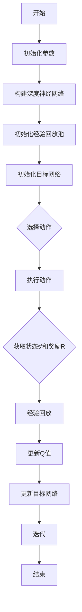

                 

### 第4章：多资产类别定价中的强化学习算法原理

在多资产类别定价中，强化学习算法因其能够自适应地调整策略，具有处理复杂动态环境的能力，成为了一个重要的研究方向。接下来，我们将详细探讨几种常见的强化学习算法，包括Q-Learning算法、Sarsa算法以及深度强化学习算法。

#### 4.1 Q-Learning算法

Q-Learning算法是最基础的强化学习算法之一，其核心思想是通过迭代更新值函数（Q值）来学习最优策略。Q值表示在当前状态下采取特定动作的预期收益。

##### 4.1.1 算法原理

1. **状态-动作值函数**：Q值是状态-动作值函数，表示在特定状态下采取特定动作所能获得的预期累积奖励。

   $$ Q(s, a) = \sum_{s'} P(s' | s, a) \cdot R(s', a) + \gamma \cdot \max_{a'} Q(s', a') $$

   其中，\( s \) 是当前状态，\( a \) 是采取的动作，\( s' \) 是下一状态，\( R(s', a) \) 是在状态\( s' \)采取动作\( a \)所获得的即时奖励，\( \gamma \) 是折扣因子，用于平衡即时奖励和长期奖励。

2. **选择动作**：使用ε-贪心策略选择动作，即在随机选择一个动作和选择当前状态下的最优动作之间进行权衡。

   $$ a_t = \begin{cases} 
   \text{argmax}_a Q(s, a) & \text{with probability } 1 - \varepsilon \\
   \text{random action} & \text{with probability } \varepsilon 
   \end{cases} $$

3. **更新Q值**：通过经验回放和Q值迭代更新来学习最优策略。

   $$ Q(s, a) \leftarrow Q(s, a) + \alpha [R(s', a') + \gamma \cdot \max_{a'} Q(s', a') - Q(s, a)] $$

   其中，\( \alpha \) 是学习率。

##### 4.1.2 Mermaid流程图

以下是Q-Learning算法的Mermaid流程图：

```mermaid
graph TD
A[开始] --> B[初始化参数]
B --> C{选择动作}
C -->|ε-贪心| D{获取状态s和动作a}
D --> E[执行动作]
E --> F{获取下一状态s'和即时奖励R(s',a')}
F --> G[更新Q值]
G --> H{迭代}
H --> I[结束]
```

##### 4.1.3 Python代码示例

```python
import numpy as np

# 初始化参数
epsilon = 0.1
alpha = 0.1
gamma = 0.9
Q = np.zeros((state_space, action_space))

# Q-Learning迭代过程
for episode in range(num_episodes):
    state = env.reset()
    done = False
    
    while not done:
        # 选择动作
        if np.random.rand() < epsilon:
            action = env.action_space.sample()
        else:
            action = np.argmax(Q[state])
        
        # 执行动作
        next_state, reward, done, _ = env.step(action)
        
        # 更新Q值
        Q[state, action] = Q[state, action] + alpha * (reward + gamma * np.max(Q[next_state]) - Q[state, action])
        
        state = next_state
```

#### 4.2 Sarsa算法

Sarsa算法是另一种基于值函数的强化学习算法，其核心思想是同时考虑当前状态和下一状态的Q值来更新策略。

##### 4.2.1 算法原理

1. **状态-动作值函数**：与Q-Learning相同。

2. **选择动作**：与Q-Learning相同。

3. **更新Q值**：使用Sarsa公式进行更新。

   $$ Q(s, a) \leftarrow Q(s, a) + \alpha [R(s', a') + \gamma \cdot Q(s', a') - Q(s, a)] $$

##### 4.2.2 Mermaid流程图

以下是Sarsa算法的Mermaid流程图：

```mermaid
graph TD
A[开始] --> B[初始化参数]
B --> C{选择动作}
C -->|Sarsa公式| D{获取状态s和动作a}
D --> E[执行动作]
E --> F{获取下一状态s'和即时奖励R(s',a')}
F --> G{选择动作'}
G --> H[执行动作']
H --> I[更新Q值]
I --> J{迭代}
J --> K[结束]
```

##### 4.2.3 Python代码示例

```python
# Sarsa算法实现
for episode in range(num_episodes):
    state = env.reset()
    done = False
    
    while not done:
        action = np.random.rand() < epsilon * 1/episode
        if action:
            action = env.action_space.sample()
        else:
            action = np.argmax(Q[state])
        
        next_state, reward, done, _ = env.step(action)
        
        next_action = np.random.rand() < epsilon * 1/episode
        if next_action:
            next_action = env.action_space.sample()
        else:
            next_action = np.argmax(Q[next_state])
        
        Q[state, action] = Q[state, action] + alpha * (reward + gamma * Q[next_state, next_action] - Q[state, action])
        
        state = next_state
```

#### 4.3 深度强化学习算法

深度强化学习算法是强化学习与深度学习相结合的产物，能够处理高维状态空间。其中，最典型的算法是深度Q网络（DQN）。

##### 4.3.1 算法原理

1. **状态编码**：使用深度神经网络将高维状态编码为低维特征向量。

2. **动作选择**：使用ε-贪心策略选择动作。

3. **Q值预测**：使用深度神经网络预测Q值。

4. **经验回放**：使用经验回放机制来减少样本偏差。

5. **目标网络**：使用目标网络来稳定梯度更新。

##### 4.3.2 Mermaid流程图

以下是DQN算法的Mermaid流程图：



##### 4.3.3 Python代码示例

```python
import tensorflow as tf

# 构建深度神经网络
def create_model():
    # 状态输入层
    state_input = tf.keras.layers.Input(shape=(state_space))
    # 全连接层
    x = tf.keras.layers.Dense(64, activation='relu')(state_input)
    x = tf.keras.layers.Dense(64, activation='relu')(x)
    # 输出层
    output = tf.keras.layers.Dense(action_space, activation='linear')(x)
    return tf.keras.models.Model(inputs=state_input, outputs=output)

# 初始化模型
main_network = create_model()
target_network = create_model()
target_network.set_weights(main_network.get_weights())

# DQN迭代过程
for episode in range(num_episodes):
    state = env.reset()
    done = False
    
    while not done:
        # 选择动作
        if np.random.rand() < epsilon:
            action = env.action_space.sample()
        else:
            action = np.argmax(main_network.predict(state))
        
        # 执行动作
        next_state, reward, done, _ = env.step(action)
        
        # 计算目标Q值
        target_Q = reward + gamma * np.max(target_network.predict(next_state))
        
        # 更新主网络
        with tf.GradientTape() as tape:
            Q_values = main_network.predict(state)
            target = Q_values
            target[0][action] = target_Q
        
        grads = tape.gradient(target, main_network.trainable_variables)
        optimizer.apply_gradients(zip(grads, main_network.trainable_variables))
        
        state = next_state
```

通过上述算法，我们可以看到强化学习在多资产类别定价中的潜力。尽管这些算法在解决实际问题时仍面临许多挑战，如数据噪声、过拟合和计算资源限制等，但它们为金融领域的资产定价提供了一种全新的思路和方法。

在接下来的章节中，我们将进一步探讨强化学习算法在多资产类别定价中的实际应用，包括市场环境的模拟、投资策略的设计和优化，以及资产定价模型的构建与验证。我们希望通过这些探讨，能够为金融科技领域的发展提供有益的参考和启示。

