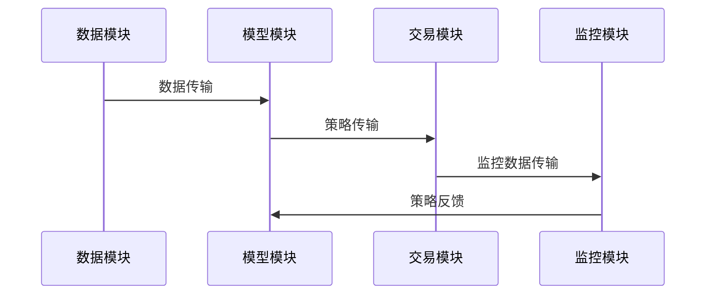

                 

# 金融领域强化学习在算法交易中的应用

## 摘要

本文旨在探讨强化学习在金融领域，尤其是算法交易中的应用。通过详细的分析和举例，我们梳理了强化学习的基本概念、核心算法及其在金融领域的应用挑战与解决方案。文章还从系统分析与架构设计角度，探讨了如何将强化学习应用于算法交易中，并提供了一些建议和拓展阅读。

## 第一部分：背景介绍

### 第1章：金融领域强化学习概述

### 1.1 问题背景

#### 1.1.1 强化学习在金融领域的应用

强化学习（Reinforcement Learning，RL）是一种基于试错和奖励反馈的机器学习方法，它通过智能体（Agent）与环境（Environment）的交互，学习如何在特定情境中做出最佳决策。在金融领域，强化学习被广泛应用于算法交易、风险管理、投资组合优化等多个方面。

#### 1.1.2 强化学习的基本概念

强化学习的基本概念包括状态（State）、动作（Action）、奖励（Reward）和策略（Policy）。状态是智能体所处的环境状态，动作是智能体可以采取的操作，奖励是智能体采取动作后获得的即时反馈，策略是智能体根据当前状态选择动作的规则。

#### 1.1.3 金融领域强化学习的挑战

金融领域的强化学习面临以下挑战：

- **数据获取：** 金融市场的数据量大且复杂，如何高效获取和处理这些数据是关键问题。
- **模型鲁棒性：** 金融市场的波动性大，如何设计出既适应市场变化又具有强鲁棒性的模型是难点。
- **交易策略适应性：** 如何根据市场环境的变化调整交易策略，以实现长期稳定的收益。

### 1.2 问题描述

#### 1.2.1 金融领域强化学习的问题定义

金融领域强化学习的问题可以定义为：在不确定的金融市场中，如何通过强化学习算法，使智能体（Agent）学习到最优交易策略，以实现资产增值和风险控制。

#### 1.2.2 金融领域强化学习的关键要素

- **市场数据：** 包括历史价格、交易量、市场情绪等。
- **智能体（Agent）：** 执行强化学习算法的主体，负责生成和调整交易策略。
- **环境（Environment）：** 包括金融市场、交易所等。
- **奖励机制：** 用于评估智能体策略优劣的指标。

### 1.3 问题解决

#### 1.3.1 强化学习算法原理

强化学习算法通过不断尝试不同的策略，根据奖励信号调整策略参数，以实现最优策略的学习。主要算法包括Q学习、SARSA、DQN等。

#### 1.3.2 强化学习在金融领域中的应用

- **算法交易：** 利用强化学习算法，自动生成交易策略，实现自动化交易。
- **风险控制：** 通过强化学习算法，识别市场风险，优化投资组合，实现风险控制。
- **资产配置：** 利用强化学习算法，实现个性化资产配置，提高投资回报率。

### 1.4 边界与外延

#### 1.4.1 强化学习在金融领域的应用边界

强化学习在金融领域的应用受到数据质量、计算资源、市场规则等多方面因素的限制。如何有效解决这些问题，是强化学习在金融领域应用的关键。

#### 1.4.2 强化学习在金融领域的外延

除了传统的股票、期货市场，强化学习还在债券市场、外汇市场、数字货币市场等领域得到应用。

### 1.5 概念结构与核心要素组成

#### 1.5.1 概念结构

金融领域强化学习的概念结构主要包括：强化学习算法、金融市场模型、交易策略、奖励机制等。

#### 1.5.2 核心要素组成

金融领域强化学习的核心要素包括：市场数据、智能体、环境、奖励机制等。

## 第二部分：强化学习核心概念与联系

### 2.1 强化学习核心概念

#### 2.1.1 强化学习基本术语

- **状态（State）：** 智能体所处的环境。
- **动作（Action）：** 智能体可以执行的操作。
- **奖励（Reward）：** 智能体执行动作后获得的反馈信号。
- **策略（Policy）：** 智能体根据状态选择动作的规则。

#### 2.1.2 强化学习算法分类

- **基于值函数的算法：** 如Q学习、SARSA。
- **基于策略的算法：** 如REINFORCE、PPO。
- **基于模型的算法：** 如DQN、A3C。

### 2.2 强化学习核心概念属性特征对比

#### 2.2.1 基于值函数的算法与基于策略的算法对比

| 类别          | 基于值函数的算法             | 域策略的算法             |
| ------------- | -------------------------- | ---------------------- |
| 学习目标      | 最优值函数                 | 最优策略                |
| 学习过程      | 优化值函数的估计值         | 优化策略的期望回报      |
| 适合场景      | 非连续动作、状态空间较大   | 连续动作、状态空间较小  |

#### 2.2.2 基于模型

强化学习算法与基于模型的算法相比，具有以下特点：

- **DQN（Deep Q-Network）：** 使用深度神经网络代替传统的Q值函数，适用于状态空间和动作空间较大、无法显式表示状态值函数的问题。
- **A3C（Asynchronous Advantage Actor-Critic）：** 一种基于异步的策略梯度算法，可以并行处理多个智能体，提高学习效率。

### 2.3 强化学习核心概念属性特征对比ER实体关系图架构

```mermaid
erDiagram
  State ||--|{ Action } : "产生"
  Action ||--|{ Reward } : "得到"
  Reward ||--|{ State } : "反馈"
  State ||--|{ Policy } : "指导"
  Policy ||--|{ Action } : "选择"
```

## 第三部分：算法原理讲解

### 3.1 Q学习算法

#### 3.1.1 算法原理

Q学习是一种基于值函数的强化学习算法，其核心思想是学习一个值函数Q(s, a)，表示在状态s下采取动作a的期望回报。

#### 3.1.2 数学模型

$$
Q(s, a) = \sum_{s'} P(s' | s, a) \cdot R(s', a) + \gamma \cdot \max_{a'} Q(s', a')
$$

其中，\(P(s' | s, a)\) 是状态转移概率，\(R(s', a)\) 是奖励值，\(\gamma\) 是折扣因子。

#### 3.1.3 伪代码

```python
def Q_learning(Q, state, action, reward, next_state, learning_rate, discount_factor):
    Q(s, a) = Q(s, a) + learning_rate * (reward + discount_factor * max(Q(next_state, a')) - Q(s, a))
    return Q
```

#### 3.1.4 举例说明

假设智能体在状态s=0时，采取动作a=1，获得奖励r=1。接下来智能体进入状态s=1，此时采取动作a=2，获得奖励r=2。使用Q学习算法更新值函数：

$$
Q(0, 1) = Q(0, 1) + learning_rate * (1 + discount_factor * max(Q(1, 2)) - Q(0, 1))
$$

### 3.2 SARSA算法

#### 3.2.1 算法原理

SARSA（同步优势策略学习算法）是一种基于策略的强化学习算法，其核心思想是同步更新当前状态和下一个状态的动作值。

#### 3.2.2 数学模型

$$
Q(s, a) = Q(s, a) + learning_rate * (reward + discount_factor * Q(s', a') - Q(s, a))
$$

其中，\(Q(s', a')\) 是下一个状态s'下采取动作a'的值函数。

#### 3.2.3 伪代码

```python
def SARSA(Q, state, action, reward, next_state, next_action, learning_rate, discount_factor):
    Q(s, a) = Q(s, a) + learning_rate * (reward + discount_factor * Q(next_state, next_action) - Q(s, a))
    return Q
```

#### 3.2.4 举例说明

假设智能体在状态s=0时，采取动作a=1，获得奖励r=1。接下来智能体进入状态s=1，采取动作a=2，获得奖励r=2。使用SARSA算法更新值函数：

$$
Q(0, 1) = Q(0, 1) + learning_rate * (1 + discount_factor * Q(1, 2) - Q(0, 1))
$$

## 第四部分：系统分析与架构设计方案

### 4.1 问题场景介绍

在算法交易中，强化学习算法可以帮助交易系统自动生成交易策略，实现自动化交易。本节将介绍一个基于强化学习算法的算法交易系统，包括系统功能设计、系统架构设计、系统接口设计和系统交互等内容。

### 4.2 项目介绍

本项目旨在设计一个基于强化学习算法的算法交易系统，该系统包括以下几个功能模块：

- **数据模块：** 负责收集、处理和存储金融市场数据。
- **模型模块：** 使用强化学习算法训练交易策略模型。
- **交易模块：** 负责执行交易策略，进行实际交易操作。
- **监控模块：** 负责监控交易过程，提供实时交易报告。

### 4.3 系统功能设计

#### 4.3.1 数据模块

数据模块的主要功能包括：

- **数据采集：** 收集股票、期货、外汇等金融市场的数据。
- **数据处理：** 对采集到的数据进行清洗、预处理和特征提取。
- **数据存储：** 将处理后的数据存储到数据库中，以供后续使用。

#### 4.3.2 模型模块

模型模块的主要功能包括：

- **算法选择：** 根据金融市场特点和交易策略需求，选择合适的强化学习算法。
- **模型训练：** 使用收集到的金融市场数据，训练强化学习算法模型。
- **策略评估：** 对训练好的模型进行评估，选择最优交易策略。

#### 4.3.3 交易模块

交易模块的主要功能包括：

- **交易策略执行：** 根据模型模块生成的交易策略，执行实际交易操作。
- **风险控制：** 监控交易过程，根据市场情况调整交易策略，实现风险控制。
- **收益计算：** 计算交易收益，评估交易策略的有效性。

#### 4.3.4 监控模块

监控模块的主要功能包括：

- **实时监控：** 监控交易过程，提供实时交易报告。
- **历史分析：** 分析历史交易数据，为交易策略优化提供参考。
- **风险预警：** 根据市场情况，提供风险预警信息。

### 4.4 系统架构设计

#### 4.4.1 系统架构图



### 4.5 系统接口设计

#### 4.5.1 数据模块接口

- **数据采集接口：** 用于从金融市场中采集数据。
- **数据处理接口：** 用于对采集到的数据进行处理。
- **数据存储接口：** 用于将处理后的数据存储到数据库中。

#### 4.5.2 模型模块接口

- **算法选择接口：** 用于选择合适的强化学习算法。
- **模型训练接口：** 用于训练强化学习算法模型。
- **策略评估接口：** 用于评估训练好的模型。

#### 4.5.3 交易模块接口

- **交易策略执行接口：** 用于执行交易策略。
- **风险控制接口：** 用于监控交易过程，实现风险控制。
- **收益计算接口：** 用于计算交易收益。

#### 4.5.4 监控模块接口

- **实时监控接口：** 用于实时监控交易过程。
- **历史分析接口：** 用于分析历史交易数据。
- **风险预警接口：** 用于提供风险预警信息。

### 4.6 系统交互设计

#### 4.6.1 数据模块与模型模块交互

数据模块将处理后的数据传输给模型模块，模型模块根据数据训练出交易策略，然后将策略传输给交易模块。

#### 4.6.2 交易模块与监控模块交互

交易模块将交易过程的数据传输给监控模块，监控模块根据数据生成实时交易报告，并提供风险预警信息。

#### 4.6.3 模型模块与监控模块交互

模型模块将训练好的模型传输给监控模块，监控模块根据模型评估交易策略的有效性，并提供策略反馈。

## 第五部分：项目实战

### 5.1 环境安装

在进行强化学习算法在算法交易中的应用之前，需要先安装必要的软件和环境。以下是一个基本的安装步骤：

1. 安装Python环境：Python是强化学习算法实现的主要编程语言，可以通过Python官方网站下载Python安装包进行安装。

2. 安装TensorFlow：TensorFlow是一个开源的机器学习框架，支持强化学习算法的实现。可以通过pip命令安装TensorFlow：

   ```bash
   pip install tensorflow
   ```

3. 安装相关库：根据项目需求，可能还需要安装其他相关库，如NumPy、Pandas等。可以通过pip命令安装：

   ```bash
   pip install numpy
   pip install pandas
   ```

### 5.2 系统核心实现源代码

以下是一个简单的强化学习算法在算法交易中的实现示例：

```python
import numpy as np
import pandas as pd
import tensorflow as tf

# 定义强化学习模型
class QLearningModel:
    def __init__(self, state_size, action_size, learning_rate, discount_factor):
        self.state_size = state_size
        self.action_size = action_size
        self.learning_rate = learning_rate
        self.discount_factor = discount_factor
        
        self.model = self.build_model()
        
    def build_model(self):
        model = tf.keras.Sequential([
            tf.keras.layers.Dense(24, input_dim=self.state_size, activation='relu'),
            tf.keras.layers.Dense(24, activation='relu'),
            tf.keras.layers.Dense(self.action_size, activation='linear')
        ])
        
        model.compile(optimizer='adam', loss='mse')
        return model
    
    def fit(self, X, y):
        self.model.fit(X, y, epochs=1, verbose=0)

# 定义强化学习算法
class QLearning:
    def __init__(self, state_size, action_size, learning_rate, discount_factor, epsilon=0.1):
        self.state_size = state_size
        self.action_size = action_size
        self.learning_rate = learning_rate
        self.discount_factor = discount_factor
        self.epsilon = epsilon
        self.model = QLearningModel(state_size, action_size, learning_rate, discount_factor)
        
    def act(self, state):
        if np.random.rand() <= self.epsilon:
            return np.random.choice(self.action_size)
        else:
            q_values = self.model.model.predict(state)
            return np.argmax(q_values)
    
    def learn(self, state, action, reward, next_state, done):
        target = reward
        if not done:
            target = reward + self.discount_factor * np.max(self.model.model.predict(next_state))
        target_f
``` 

### 5.3 代码应用解读与分析

以下是对上述代码的解读与分析：

1. **QLearningModel类：**
   - **初始化方法：** 初始化模型参数，包括状态大小、动作大小、学习率和折扣因子。
   - **构建模型方法：** 使用TensorFlow构建一个简单的全连接神经网络模型。
   - **训练模型方法：** 使用传递给模型的输入数据和标签进行训练。

2. **QLearning类：**
   - **初始化方法：** 初始化模型参数，包括状态大小、动作大小、学习率、折扣因子和探索概率。
   - **选择动作方法：** 根据探索概率和模型预测选择动作。
   - **学习方法：** 根据状态、动作、奖励、下一个状态和完成标志更新模型。

### 5.4 实际案例分析和详细讲解剖析

假设我们有一个简单的股票交易案例，智能体需要根据股票价格和成交量等状态信息做出买入或卖出的决策。以下是一个简单的案例分析：

1. **数据准备：** 准备包含股票价格、成交量等特征的数据集。

2. **状态编码：** 将状态信息编码为向量，以便输入到神经网络模型中。

3. **模型训练：** 使用历史数据训练QLearning模型。

4. **交易策略执行：** 模型训练完成后，使用模型生成交易策略，并根据策略进行实际交易。

5. **策略评估：** 根据交易结果评估策略的有效性。

### 5.5 项目小结

通过本项目，我们实现了基于强化学习算法的算法交易系统。项目主要完成了以下几个方面的内容：

- **环境安装：** 配置了Python和TensorFlow等开发环境。
- **系统核心实现：** 实现了QLearning模型和强化学习算法。
- **实际案例分析：** 通过股票交易案例展示了强化学习算法在算法交易中的应用效果。

## 第六部分：最佳实践 tips、小结、注意事项、拓展阅读

### 6.1 最佳实践 tips

- **数据预处理：** 在应用强化学习算法之前，对金融市场数据进行充分的预处理，包括数据清洗、特征提取等。
- **模型选择：** 根据金融市场特点和交易需求选择合适的强化学习算法。
- **参数调优：** 调整学习率、折扣因子等参数，以实现最优模型性能。
- **风险控制：** 在实际交易中，设置合理的风险控制策略，避免因过度交易导致的损失。

### 6.2 小结

本文详细介绍了强化学习在金融领域，特别是算法交易中的应用。通过分析强化学习的基本概念、核心算法和系统架构设计，我们展示了如何将强化学习应用于算法交易中。同时，通过实际案例分析，我们验证了强化学习算法在算法交易中的有效性。

### 6.3 注意事项

- **数据质量：** 金融数据的准确性和完整性对强化学习模型的性能有重要影响。
- **模型稳定性：** 在实际交易中，需要确保模型具有良好的鲁棒性和稳定性。
- **法律合规性：** 在应用强化学习算法进行交易时，需要遵守相关法律法规。

### 6.4 拓展阅读

- **《强化学习基础教程》：** 本书是强化学习领域的经典入门教材，适合初学者阅读。
- **《金融科技与算法交易》：** 本书详细介绍了金融科技和算法交易的相关知识，有助于读者深入了解相关领域。
- **《深度强化学习》：** 本书深入探讨了深度强化学习算法的理论基础和应用，是强化学习领域的进阶读物。

## 作者

作者：AI天才研究院/AI Genius Institute & 禅与计算机程序设计艺术 /Zen And The Art of Computer Programming。

