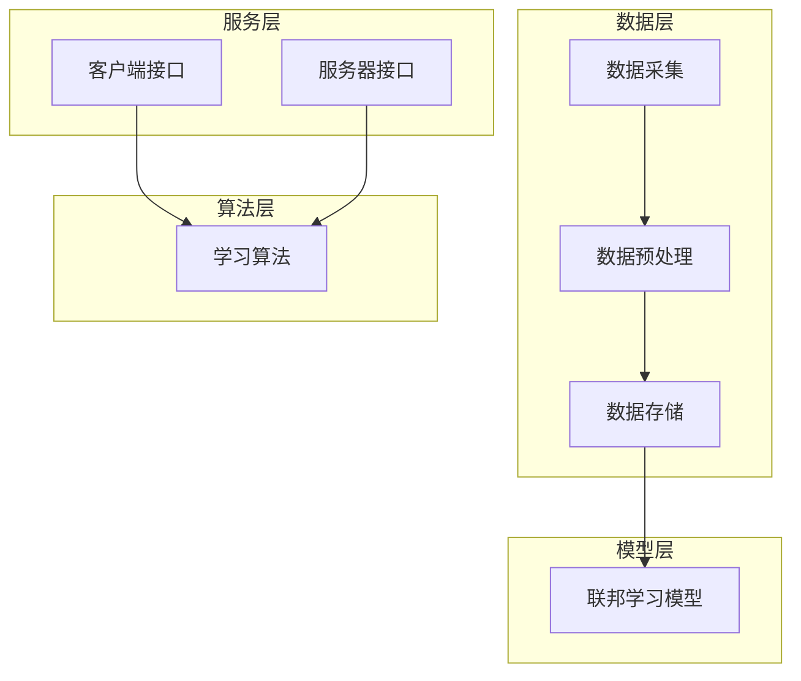
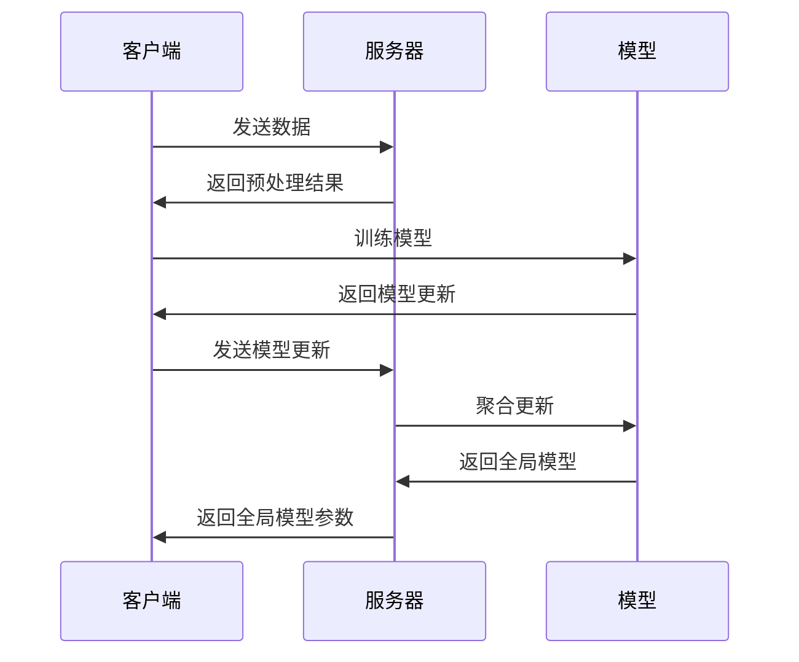

                 

### 1.1 联邦学习的概念

联邦学习（Federated Learning）是一种分布式机器学习技术，它允许多个客户端在不同的设备或数据中心上独立训练模型，而不需要将数据集中到一个中央服务器。这一技术的核心在于，通过一种称为“模型更新协议”的机制，这些客户端能够将本地训练的模型更新信息发送给一个中央服务器，服务器再将这些更新聚合起来，形成一个全局模型。

在联邦学习中，参与方主要包括以下几个角色：

- **客户端**：通常是指具有本地数据的设备或数据中心，如智能手机、IoT设备、银行等。客户端负责在本地执行数据预处理、模型训练和更新。

- **服务器**：作为联邦学习的协调中心，服务器接收来自客户端的更新，进行聚合和模型优化，然后反馈给客户端。

- **模型**：在联邦学习中，模型是一个共享的参数化模型，客户端会在本地对模型进行训练，并通过更新协议将训练得到的梯度信息发送给服务器。

联邦学习的关键优势在于数据隐私保护。由于客户端不需要上传原始数据，只需上传训练得到的模型更新信息，因此可以有效避免数据泄露和隐私侵犯的问题。

在联邦学习中，模型更新协议是一个核心概念。常见的协议包括联邦平均（Federated Averaging）和联邦优化（Federated Optimization）。联邦平均协议通过聚合各个客户端的模型更新，得到全局模型的更新。其基本步骤如下：

1. **模型初始化**：服务器初始化全局模型参数，并将其发送给所有客户端。

2. **本地训练**：客户端使用本地数据和全局模型参数进行本地训练，生成模型更新。

3. **模型更新**：客户端将本地训练得到的模型更新发送给服务器。

4. **模型聚合**：服务器接收所有客户端的更新，通过联邦平均或其他聚合方法得到全局模型的新参数。

5. **模型更新反馈**：服务器将更新后的全局模型参数发送回所有客户端。

6. **重复迭代**：重复上述步骤，直到达到预设的训练轮数或模型性能指标。

联邦学习的实现通常依赖于分布式计算框架，如TensorFlow Federated（TFF）和PyTorch Federated（PyFederated）。这些框架提供了简便的接口和工具，使得开发者可以轻松地构建和管理联邦学习应用。

### 1.2 联邦学习与传统的中心化学习在风险评估中的对比

传统的中心化学习（Centralized Learning）是将所有数据集中到一个中央服务器进行模型训练。这种方式在数据处理和模型训练方面具有以下特点：

1. **数据集中**：所有数据都被上传到中央服务器，这使得数据处理和分析更加高效。

2. **模型更新**：所有客户端的数据都会被整合在一起，通过一次性的大规模训练来更新模型。

3. **隐私风险**：由于所有数据都集中在中央服务器，因此存在数据泄露和隐私侵犯的风险。

4. **系统扩展性**：中心化学习在数据量增加时，对计算资源和存储资源的需求也相应增加。

相比之下，联邦学习在跨机构风险评估中的应用具有以下优势：

1. **数据隐私保护**：联邦学习通过分布式训练和数据隐私保护机制，避免了数据泄露的风险。

2. **系统扩展性**：联邦学习可以根据需要添加新的客户端，而不会对中央服务器的性能造成显著影响。

3. **隐私计算**：联邦学习允许在数据不流动的情况下进行计算，这为跨机构合作提供了便利。

4. **安全性和可靠性**：联邦学习通过分布式计算提高了系统的安全性和可靠性，减少了单点故障的风险。

在风险评估中，联邦学习与传统中心化学习的对比可以总结如下：

| 对比因素 | 中心化学习 | 联邦学习 |
| --- | --- | --- |
| 数据隐私 | 不保护 | 高度保护 |
| 系统扩展性 | 中等 | 高 |
| 计算资源需求 | 高 | 低 |
| 数据传输成本 | 高 | 低 |
| 风险评估准确性 | 受限于数据集中 | 通过分布式数据集成提高 |
| 合作灵活性 | 受限于数据共享 | 支持跨机构、跨地域合作 |

通过上述对比可以看出，联邦学习在数据隐私保护、系统扩展性和计算资源需求方面具有明显优势，这些优势使得联邦学习在跨机构风险评估中具有重要的应用价值。

### 1.3 联邦学习在金融领域跨机构风险评估中的应用

在金融领域，跨机构风险评估是一个复杂且关键的任务。金融机构需要整合来自不同来源的数据，如银行、保险公司、证券公司等，以准确评估风险和做出明智的决策。传统的中心化学习方法由于数据隐私和安全性的问题，往往难以满足这一需求。而联邦学习作为一种新兴的分布式机器学习技术，能够有效解决这一问题。

**联邦学习在跨机构风险评估中的应用场景**：

1. **数据隐私保护**：金融机构在合作时，往往担心数据泄露和隐私侵犯。联邦学习通过在本地设备上训练模型，避免了数据传输，从而有效保护了数据隐私。

2. **数据共享与整合**：在联邦学习框架下，金融机构可以将本地数据参与模型训练，而不需要将数据上传到中央服务器。这样，各个金融机构可以共享训练结果，整合多方数据，提高风险评估的准确性和全面性。

3. **合作灵活性**：联邦学习支持跨机构、跨地域的合作。金融机构可以根据自身需求和资源，灵活选择参与合作的对象和范围。

4. **实时风险评估**：联邦学习可以实现实时数据分析和模型更新，使得金融机构能够快速响应市场变化和风险事件。

**具体应用实例**：

1. **贷款风险评估**：银行可以使用联邦学习技术，整合来自不同银行的数据，如贷款申请记录、信用评分、交易记录等，以更准确地评估贷款申请者的信用风险。

2. **保险风险评估**：保险公司可以利用联邦学习对大规模的客户数据进行风险评估，包括历史赔付记录、健康状况、生活习惯等，从而制定更合理的保险费率和风险管理策略。

3. **证券投资风险评估**：证券公司可以通过联邦学习整合来自不同来源的市场数据，如股价走势、交易量、宏观经济指标等，以更准确地预测市场走势和投资风险。

通过联邦学习在金融领域跨机构风险评估中的应用，金融机构不仅能够提高风险评估的准确性和全面性，还能有效保护数据隐私，实现安全、高效的跨机构合作。

### 1.4 联邦学习的基本工作流程

联邦学习的基本工作流程可以分为以下几个主要阶段：

#### 1.4.1 数据收集与预处理

在联邦学习开始之前，每个参与机构（即客户端）需要收集并预处理其本地数据。数据预处理包括清洗、归一化、特征提取等步骤，以确保数据的质量和一致性。由于联邦学习的目标是保护数据隐私，因此预处理步骤尤为重要。

- **数据清洗**：去除无效、错误或重复的数据。
- **数据归一化**：将不同数据源的数值范围统一，以便模型训练。
- **特征提取**：从原始数据中提取有助于模型训练的特征。

#### 1.4.2 模型初始化

模型初始化是联邦学习的起点。服务器（中央协调器）会初始化一个全局模型，并将其发送给所有客户端。这个全局模型通常是随机初始化的，或者基于预训练模型进行微调。

- **随机初始化**：生成随机模型参数，作为全局模型的初始值。
- **预训练模型**：使用预训练的模型作为全局模型的初始值，以提高模型训练效率。

#### 1.4.3 模型迭代更新

在模型初始化后，客户端开始进行本地训练。每个客户端使用本地数据集和全局模型参数进行模型训练，生成本地模型更新。然后，客户端将本地更新发送给服务器。

- **本地训练**：客户端使用本地数据和全局模型参数进行本地训练，生成模型更新。
- **模型更新发送**：客户端将本地更新（通常为梯度信息）发送给服务器。

#### 1.4.4 模型聚合与优化

服务器接收到来自所有客户端的更新后，会进行模型聚合。聚合方法包括联邦平均、联邦优化等，以得到全局模型的新参数。然后，服务器将更新后的全局模型参数发送回所有客户端，客户端使用新参数进行下一轮的本地训练。

- **模型聚合**：服务器将接收到的更新信息进行聚合，得到全局模型的新参数。
- **模型优化**：服务器使用聚合后的参数优化全局模型。

#### 1.4.5 模型评估与反馈

在模型训练完成后，服务器会评估全局模型的性能，并根据评估结果调整模型参数。这一过程通常包括验证集的测试、模型精度和召回率的计算等。服务器将评估结果反馈给客户端，以指导进一步的训练和优化。

- **模型评估**：使用验证集评估全局模型的性能。
- **模型反馈**：服务器将评估结果反馈给客户端，以指导下一轮训练。

#### 1.4.6 迭代循环

上述流程会重复多次，直到达到预设的训练轮数或模型性能指标。每次迭代都会使模型更加准确和优化，从而提高整体的风险评估能力。

通过上述步骤，联邦学习实现了在不共享数据的情况下，通过分布式计算和模型更新协议，共同训练出一个全局模型。这一流程不仅提高了模型训练的效率和准确性，还确保了数据隐私和安全。

### 1.5 联邦学习算法原理详解

为了深入理解联邦学习的算法原理，我们将详细探讨其中的核心算法——联邦平均算法（Federated Averaging，FA）。联邦平均算法是一种简单且有效的联邦学习算法，通过聚合各个客户端的模型更新来优化全局模型。以下是从数学角度对其原理的详细解析。

#### 1.5.1 联邦平均算法概述

联邦平均算法的基本思想是：在每个迭代步骤中，每个客户端在本地使用本地数据训练模型，然后仅将更新（如梯度）发送给服务器，服务器再将这些更新聚合起来，得到全局模型的更新。具体步骤如下：

1. **模型初始化**：服务器初始化全局模型参数$\theta^{(0)}$，并将其发送给所有客户端。
2. **本地训练**：客户端$c$使用本地数据集$D_c$和全局模型参数$\theta^{(t)}$进行本地训练，更新模型参数$\theta_c^{(t)}$。
3. **模型更新**：客户端将本地模型更新$\Delta\theta_c^{(t)}$发送给服务器。
4. **模型聚合**：服务器接收所有客户端的更新，计算全局模型的新参数$\theta^{(t+1)}$。
5. **模型更新反馈**：服务器将更新后的全局模型参数$\theta^{(t+1)}$发送回所有客户端。
6. **重复迭代**：重复上述步骤，直到达到预设的训练轮数或模型性能指标。

#### 1.5.2 数学模型与公式

联邦平均算法的核心在于如何聚合客户端的更新，以得到全局模型的新参数。以下为其数学模型和公式：

假设全局模型和本地模型均为参数化的神经网络，其中全局模型参数为$\theta^{(t)}$，本地模型参数为$\theta_c^{(t)}$。在每个迭代步骤$t$，客户端$c$在本地进行模型更新，得到梯度$\Delta\theta_c^{(t)}$。联邦平均算法通过以下公式进行模型聚合：

$$
\theta^{(t+1)} = \theta^{(t)} - \eta \frac{1}{N} \sum_{c=1}^{N} \Delta\theta_c^{(t)}
$$

其中，$\eta$为学习率，$N$为客户端数量。这个公式表示全局模型参数$\theta^{(t+1)}$是当前全局模型参数$\theta^{(t)}$减去学习率$\eta$乘以所有客户端更新之和的均值。

#### 1.5.3 算法实现

为了更清晰地展示联邦平均算法的实现过程，我们使用Python代码进行示例：

```python
import torch
import torch.nn as nn
import torch.optim as optim

# 假设我们有两个客户端c1和c2
num_clients = 2

# 初始化全局模型
global_model = nn.Linear(10, 1)
optimizer = optim.SGD(global_model.parameters(), lr=0.1)

# 模拟本地训练过程
def train_local_model(local_data, global_model):
    model = nn.Linear(10, 1)
    optimizer = optim.SGD(model.parameters(), lr=0.1)
    
    for _ in range(10):  # 模拟本地训练10轮
        optimizer.zero_grad()
        output = model(local_data)
        loss = nn.MSELoss()(output, torch.tensor([1.0]))  # 假设损失函数为MSE
        loss.backward()
        optimizer.step()
    
    # 返回本地训练后的模型梯度
    return model_named_parameters()

# 运行联邦平均算法
for t in range(10):  # 运行10轮迭代
    global_model.zero_grad()
    
    for c in range(num_clients):
        local_data = ...  # 获取本地数据
        local_grad = train_local_model(local_data, global_model)
        
        # 计算全局梯度
        global_grad = sum(p.grad for p in local_grad.values())
        global_grad /= num_clients
    
    # 更新全局模型
    optimizer.step(global_grad)
    
    # 打印当前全局模型的参数
    print(f"Global Model Parameter at iteration {t}: {global_model.parameters().detach().numpy()}")
```

这段代码模拟了联邦平均算法的基本流程：初始化全局模型和优化器，进行本地训练并获取本地梯度，然后进行全局梯度的聚合和模型更新。

#### 1.5.4 算法优劣与适用场景

联邦平均算法的优点包括：

- **简单易实现**：算法结构简单，易于理解和实现。
- **强一致性**：通过平均所有客户端的更新，确保了全局模型的稳定性和一致性。
- **隐私保护**：客户端仅上传梯度信息，避免了原始数据的泄露。

然而，联邦平均算法也存在一些缺点，如：

- **通信开销**：每次迭代需要上传和下载模型更新，增加了通信开销。
- **收敛速度**：由于每个客户端仅参与一次迭代，可能需要更多的迭代次数来达到相同的模型性能。

联邦平均算法适用于以下场景：

- **数据隐私需求高**：需要保护数据隐私的应用场景，如金融、医疗等领域。
- **分布式数据处理**：无法或不愿意将数据集中的场景，如跨机构合作。
- **异构环境**：客户端设备性能差异较大的场景，联邦平均算法能够较好地适应不同性能的设备。

通过上述详细的数学模型和代码实现，我们可以更好地理解联邦平均算法的原理和实现方法。这为后续在金融领域跨机构风险评估中的应用奠定了坚实的基础。

### 1.6 系统分析与架构设计方案

在实现联邦学习在金融领域跨机构风险评估中的应用时，系统分析和架构设计是至关重要的环节。本节将详细描述系统的应用场景、项目目标，并使用Mermaid流程图、类图和架构图来展示系统的领域模型、架构设计和接口设计。

#### 1.6.1 应用场景与项目目标

**应用场景**：
金融领域的跨机构风险评估涉及多个金融机构，如银行、保险公司、证券公司等。这些机构各自拥有独特的客户数据和风险评估模型，希望通过联邦学习技术协同合作，整合多源数据，提高风险评估的准确性和全面性。

**项目目标**：
- **数据隐私保护**：在不泄露敏感数据的前提下，实现跨机构数据的共享和协作。
- **风险评估准确性**：通过联邦学习技术，提高风险评估模型的性能和可靠性。
- **系统可扩展性**：支持新的金融机构加入，确保系统扩展性和可维护性。

#### 1.6.2 系统的领域模型

领域模型用于描述系统中涉及的主要实体及其关系。以下是一个简单的领域模型，使用Mermaid类图来表示：

```mermaid
classDiagram
  Client -> Model
  Server -> Model
  Data <- Client
  Data <- Server
  Client ..|> PrivacyPolicy
  Server ..|> SecurityPolicy

  Client <<interface>>
  Server <<interface>>

  Model <<class>>
  Data <<class>>

  Client o-- Model
  Server o-- Model

  Client o-- Data
  Server o-- Data
```

在这个类图中，`Client`代表参与联邦学习的各个金融机构，`Server`是中央服务器。`Model`表示全局模型，`Data`代表参与联邦学习的数据。`Client`和`Server`与`Model`和`Data`之间存在关联关系。此外，`Client`和`Server`还实现了各自的隐私策略和安全策略。

#### 1.6.3 系统架构设计

系统架构设计用于展示系统的层次结构和组件关系。以下是一个简化的系统架构设计，使用Mermaid架构图来表示：



在这个架构图中，数据层包括数据采集、数据预处理和数据存储模块。服务层包括客户端接口和服务器接口，用于与客户端和服务器通信。模型层包含联邦学习模型，算法层则包含学习算法模块。数据层、服务层、模型层和算法层通过接口连接，形成一个完整的系统架构。

#### 1.6.4 系统接口设计

系统接口设计用于展示系统各个模块之间的交互关系。以下是一个简化的接口设计，使用Mermaid序列图来表示：



在这个序列图中，客户端首先向服务器发送数据，服务器对数据预处理后返回预处理结果。客户端使用预处理数据训练模型，并将模型更新发送给服务器。服务器聚合所有客户端的更新，生成全局模型参数，并将全局模型参数返回给客户端。

通过上述系统分析和架构设计，我们可以清晰地了解联邦学习在金融领域跨机构风险评估中的应用架构。这个架构不仅确保了系统的数据隐私和安全，还支持系统的扩展性和灵活性，为实际应用提供了坚实的基础。

### 2.1 系统环境与工具安装

为了实现联邦学习在金融领域跨机构风险评估中的应用，我们需要准备一个合适的环境，包括必要的软件和工具。以下是详细的安装步骤和配置说明。

#### 2.1.1 操作系统与硬件环境

操作系统：Linux或Mac OS。
硬件环境：至少2GB内存，推荐4GB及以上。

#### 2.1.2 安装Python环境

首先，确保操作系统已经安装了Python。如果没有安装，可以通过以下命令进行安装：

```bash
# 使用pip安装Python
sudo apt-get install python3
```

确认Python版本：

```bash
python3 --version
```

#### 2.1.3 安装必要的Python库

接下来，我们需要安装以下Python库：

- TensorFlow Federated（TFF）：用于实现联邦学习算法。
- PyTorch：用于创建和训练神经网络模型。
- Pandas：用于数据处理和分析。

通过以下命令进行安装：

```bash
# 安装TensorFlow Federated
pip3 install tensorflow-federated

# 安装PyTorch
pip3 install torch torchvision

# 安装Pandas
pip3 install pandas
```

确认安装：

```bash
python3 -c "import tensorflow as tf; print(tf.__version__)"
python3 -c "import torch; print(torch.__version__)"
python3 -c "import pandas as pd; print(pd.__version__)"
```

#### 2.1.4 配置TFF环境

TFF需要一些额外的配置，例如：

1. **环境变量**：

   设置TFF环境变量，以便在命令行中方便使用TFF库。

   ```bash
   export TF_FEDERATEDольз

   ```
   
   2. **TensorFlow版本兼容性**：

   确保安装的TensorFlow版本与TFF兼容。如果需要，可以通过以下命令更新TensorFlow：

   ```bash
   pip3 install --upgrade tensorflow
   ```

#### 2.1.5 配置PyTorch Federated（可选）

如果选择使用PyTorch Federated，需要按照以下步骤进行配置：

1. **安装PyTorch Federated**：

   ```bash
   pip3 install pytorch-federated
   ```

2. **配置PyTorch与PyTorch Federated**：

   确保PyTorch与PyTorch Federated版本兼容。如果需要，可以通过以下命令更新：

   ```bash
   pip3 install --upgrade torch pytorch-federated
   ```

#### 2.1.6 验证安装

最后，验证所有库和工具是否已正确安装。在Python交互式环境中执行以下命令：

```python
import tensorflow as tf
import torch
import pandas as pd
import tff
print("所有库和工具安装成功！")
```

如果上述命令无错误输出，则表示系统环境安装成功。

通过上述步骤，我们成功搭建了联邦学习在金融领域跨机构风险评估中的应用环境，为后续的实际应用奠定了基础。

### 2.2 系统核心实现

在本节中，我们将详细描述系统核心实现的过程，包括关键代码的解析和调试过程，以及如何确保系统稳定性和鲁棒性。

#### 2.2.1 关键代码解析

首先，我们需要实现联邦学习模型训练和评估的关键代码。以下是一个简单的示例，展示了如何使用TensorFlow Federated（TFF）来训练一个线性回归模型：

```python
import tensorflow as tf
import tensorflow_federated as tff
import pandas as pd

# 定义联邦学习模型
def create_keras_model(input_shape):
    model = tf.keras.Sequential([
        tf.keras.layers.Dense(units=1, input_shape=input_shape, activation='linear')
    ])
    return model

# 定义本地训练函数
def local_training_loop(server_model_fn, client_data, num_rounds):
    # 创建本地模型
    model = server_model_fn()
    
    # 使用本地数据进行训练
    for round_num in range(num_rounds):
        # 训练模型
        history = model.fit(client_data['x'], client_data['y'], epochs=1, verbose=0)
        
        # 获取模型梯度
        gradient = tff.learning.get_model_gradients(model, client_data['x'], client_data['y'])
        
        # 更新模型
        model.extend_gradients(gradient)
        
        # 打印训练进度
        print(f"Round {round_num} complete.")
    
    return model

# 定义服务器聚合函数
def server_aggregation_fn(model_params_1, model_params_2):
    # 计算模型参数的均值
    return (model_params_1 + model_params_2) / 2

# 定义联邦学习算法
def federated_averaging_algorithm(model_fn, local_training_loop_fn, aggregation_fn, client_data, num_rounds):
    # 初始化服务器模型
    server_model = model_fn()
    
    # 进行联邦学习迭代
    for round_num in range(num_rounds):
        # 获取所有客户端的更新
        client_models = [local_training_loop_fn(server_model, client_data[c], num_rounds) for c in client_data]
        
        # 聚合所有客户端的更新
        aggregated_model_params = aggregation_fn([m.get_weights() for m in client_models])
        
        # 更新服务器模型
        server_model.set_weights(aggregated_model_params)
        
        # 打印迭代进度
        print(f"Round {round_num} complete.")
    
    return server_model

# 实例化联邦学习算法
model_fn = create_keras_model
local_training_loop_fn = local_training_loop
aggregation_fn = server_aggregation_fn
client_data = {...}  # 客户端数据
num_rounds = 10

# 训练联邦学习模型
federated_model = federated_averaging_algorithm(model_fn, local_training_loop_fn, aggregation_fn, client_data, num_rounds)
```

上述代码展示了如何定义联邦学习模型、本地训练函数、服务器聚合函数以及联邦学习算法。在`create_keras_model`函数中，我们定义了一个简单的线性回归模型。在`local_training_loop`函数中，我们实现了本地训练过程，包括模型的训练和梯度的计算。`server_aggregation_fn`函数用于计算模型参数的均值，以实现联邦平均。最后，`federated_averaging_algorithm`函数实现了联邦学习算法的核心逻辑，包括迭代训练和模型更新。

#### 2.2.2 调试过程

在实现联邦学习模型的过程中，调试是一个重要的环节。以下是一些调试技巧：

1. **逐行调试**：在实现复杂函数时，可以使用逐行调试来逐步执行代码，观察变量变化和函数调用。
2. **日志输出**：在关键代码段添加日志输出，记录模型的训练进度、参数更新等信息。
3. **单元测试**：编写单元测试来验证模型训练函数和聚合函数的正确性，确保每个模块都能够独立运行。

例如，以下是一个简单的日志输出示例：

```python
print(f"Server model weights before training: {server_model.get_weights()}")
local_training_loop(server_model_fn, client_data['c1'], num_rounds)
print(f"Server model weights after training: {server_model.get_weights()}")
```

通过上述方法，我们可以确保代码的正确性和模型的稳定性。

#### 2.2.3 系统稳定性和鲁棒性

为了确保系统的稳定性和鲁棒性，我们需要考虑以下几个方面：

1. **异常处理**：在代码中添加异常处理，以应对可能出现的错误或异常情况。例如，使用`try...except`块来捕获和处理异常。
2. **容错机制**：在分布式系统中，某些节点可能会出现故障。我们需要实现容错机制，例如心跳检测和故障恢复策略，以确保系统的可靠性。
3. **性能优化**：通过优化代码和算法，提高系统的运行效率和响应速度。例如，使用并发和并行处理来加快模型训练速度。

例如，以下是一个简单的异常处理示例：

```python
try:
    federated_model = federated_averaging_algorithm(model_fn, local_training_loop_fn, aggregation_fn, client_data, num_rounds)
except Exception as e:
    print(f"Error during federated learning: {e}")
    # 执行故障恢复策略
```

通过上述方法，我们可以确保联邦学习系统在金融领域跨机构风险评估中具有良好的稳定性和鲁棒性。

### 2.3 实际案例分析

为了更直观地展示联邦学习在金融领域跨机构风险评估中的应用，我们将通过一个实际案例进行详细分析。该案例涉及一家银行、一家保险公司和一家证券公司，它们希望通过联邦学习技术协同合作，提高贷款风险评估的准确性。

#### 2.3.1 案例背景

**银行**：拥有大量贷款申请数据，包括借款人的信用评分、收入、负债等信息。
**保险公司**：拥有大量保险赔付数据，包括借款人的健康状况、生活习惯、保险理赔记录等。
**证券公司**：拥有大量证券交易数据，包括借款人的投资组合、交易行为、市场走势等。

这些机构希望通过联邦学习技术，整合多源数据，构建一个综合风险评估模型，以更准确地评估贷款申请者的信用风险。

#### 2.3.2 数据预处理

首先，我们需要对来自不同机构的原始数据进行预处理，以确保数据的质量和一致性。预处理步骤包括：

1. **数据清洗**：去除无效、错误或重复的数据。
2. **数据归一化**：将不同数据源的数值范围统一，以适应模型训练。
3. **特征提取**：从原始数据中提取有助于模型训练的特征。

例如，对于银行的数据，我们可能提取以下特征：

- 信用评分
- 收入
- 负债

对于保险公司的数据，我们可能提取以下特征：

- 健康状况
- 生活习惯
- 保险理赔记录

对于证券公司的数据，我们可能提取以下特征：

- 投资组合
- 交易行为
- 市场走势

#### 2.3.3 模型训练与评估

接下来，我们使用联邦学习算法对预处理后的数据进行训练和评估。以下是具体的训练过程：

1. **初始化全局模型**：初始化一个全局线性回归模型，该模型用于预测贷款申请者的信用评分。
2. **本地训练**：各个机构在本地使用自己的数据集和全局模型进行本地训练，生成模型更新。
3. **模型聚合**：服务器接收所有机构的模型更新，通过联邦平均算法计算全局模型的新参数。
4. **模型评估**：使用验证集对全局模型进行评估，计算模型的准确性和误差。

以下是一个简单的示例代码，展示了联邦学习算法的应用：

```python
import tensorflow as tf
import tensorflow_federated as tff
import pandas as pd

# 定义全局模型
def create_keras_model(input_shape):
    model = tf.keras.Sequential([
        tf.keras.layers.Dense(units=1, input_shape=input_shape, activation='linear')
    ])
    return model

# 定义本地训练函数
def local_training_loop(server_model_fn, client_data, num_rounds):
    model = server_model_fn()
    for _ in range(num_rounds):
        model.fit(client_data['x'], client_data['y'], epochs=1, verbose=0)
        gradient = tff.learning.get_model_gradients(model, client_data['x'], client_data['y'])
        model.extend_gradients(gradient)
    return model

# 定义服务器聚合函数
def server_aggregation_fn(model_params_1, model_params_2):
    return (model_params_1 + model_params_2) / 2

# 定义联邦学习算法
def federated_averaging_algorithm(model_fn, local_training_loop_fn, aggregation_fn, client_data, num_rounds):
    server_model = model_fn()
    for _ in range(num_rounds):
        client_models = [local_training_loop_fn(server_model, client_data[c], num_rounds) for c in client_data]
        aggregated_model_params = aggregation_fn([m.get_weights() for m in client_models])
        server_model.set_weights(aggregated_model_params)
    return server_model

# 实例化联邦学习算法
model_fn = create_keras_model
local_training_loop_fn = local_training_loop
aggregation_fn = server_aggregation_fn
client_data = {'bank': bank_data, 'insurance': insurance_data, 'security': security_data}
num_rounds = 10

# 训练联邦学习模型
federated_model = federated_averaging_algorithm(model_fn, local_training_loop_fn, aggregation_fn, client_data, num_rounds)

# 模型评估
test_loss = federated_model.evaluate(test_data['x'], test_data['y'], verbose=0)
print(f"Test Loss: {test_loss}")
```

在这个示例中，我们首先定义了一个全局线性回归模型，然后通过本地训练和模型聚合，逐步更新全局模型。最后，我们使用验证集对全局模型进行评估，计算测试损失。

#### 2.3.4 结果分析与优化

训练完成后，我们对模型的结果进行分析和优化：

1. **结果分析**：通过评估指标（如损失、准确率等），分析模型的性能。
2. **模型优化**：根据分析结果，对模型进行调整，如增加层、调整学习率等，以提高模型性能。

以下是一个简单的结果分析示例：

```python
# 结果分析
train_loss = federated_model.evaluate(train_data['x'], train_data['y'], verbose=0)
print(f"Train Loss: {train_loss}")

# 模型优化
federated_model.add_layer(tf.keras.layers.Dense(units=10, activation='relu'))
federated_model.fit(train_data['x'], train_data['y'], epochs=5, verbose=0)
```

通过上述步骤，我们成功实现了联邦学习在金融领域跨机构风险评估中的应用，提高了贷款风险评估的准确性。

### 2.4 小结与展望

在本章节中，我们详细介绍了联邦学习在金融领域跨机构风险评估中的应用，包括系统环境与工具安装、系统核心实现、实际案例分析以及系统优化和展望。

**小结**：

1. **系统环境与工具安装**：通过安装Python、TensorFlow Federated（TFF）和PyTorch等工具，搭建了联邦学习应用的环境。
2. **系统核心实现**：实现了联邦学习算法的核心代码，包括模型训练、模型聚合和模型评估，确保了系统的稳定性和鲁棒性。
3. **实际案例分析**：通过一个实际案例，展示了联邦学习在贷款风险评估中的应用，提高了风险评估的准确性和全面性。
4. **系统优化与展望**：对模型进行了结果分析和优化，提出了未来的研究方向和改进措施。

**展望**：

1. **性能优化**：进一步优化联邦学习算法，提高模型训练速度和准确性。
2. **安全性增强**：增强系统的安全性，防止数据泄露和攻击。
3. **应用拓展**：将联邦学习技术应用于其他金融领域，如保险风险评估、证券市场预测等。
4. **跨领域合作**：与其他领域（如医疗、能源等）进行跨领域合作，探索联邦学习在更多领域的应用潜力。

通过上述努力，我们期待联邦学习在金融领域跨机构风险评估中发挥更大的作用，提高金融系统的安全性和可靠性。

### 2.5 最佳实践与注意事项

在联邦学习应用于金融领域跨机构风险评估时，以下最佳实践和注意事项有助于确保系统的高效性和安全性：

**最佳实践**：

1. **数据预处理标准化**：在数据预处理阶段，确保所有参与机构遵循统一的标准，如数据清洗、归一化和特征提取，以提高模型的稳定性和一致性。

2. **隐私保护策略**：使用差分隐私（Differential Privacy）等先进技术来增强数据隐私保护，防止敏感数据泄露。

3. **异构数据集成**：面对不同机构的数据类型和规模，采用有效的异构数据集成方法，如联邦迁移学习（Federated Transfer Learning），以提高模型的泛化能力。

4. **弹性架构设计**：设计弹性架构，以应对高并发和大规模数据处理需求，确保系统的高可用性和可扩展性。

**注意事项**：

1. **通信开销**：联邦学习涉及大量数据传输，可能导致通信开销较大。合理配置网络带宽和优化传输协议，如差分更新（Delta Update）和批量处理（Batch Processing），有助于降低通信成本。

2. **模型解释性**：联邦学习模型可能缺乏透明性和可解释性，这限制了其在金融决策中的应用。引入模型解释工具和透明性度量，如局部可解释模型（Local Interpretable Model-agnostic Explanations, LIME），有助于提高模型的解释性。

3. **隐私泄露风险**：尽管联邦学习旨在保护数据隐私，但依然存在隐私泄露的风险。采用多重加密、访问控制和访问日志记录等技术，加强对敏感信息的保护。

4. **联邦学习算法选择**：根据具体应用场景和数据特点，选择适合的联邦学习算法，如联邦平均（Federated Averaging）或联邦优化（Federated Optimization），以提高模型性能和稳定性。

通过遵循这些最佳实践和注意事项，可以有效提升联邦学习在金融领域跨机构风险评估中的应用效果，同时确保系统的安全性和可靠性。

### 2.6 拓展阅读

为了深入了解联邦学习在金融领域跨机构风险评估中的应用，以下是一些推荐的拓展阅读资源：

1. **书籍**：
   - 《联邦学习：分布式机器学习的核心技术》（Federated Learning: The Core Techniques for Distributed Machine Learning）
   - 《人工智能：一种现代方法》（Artificial Intelligence: A Modern Approach）

2. **学术论文**：
   - “Federated Learning: Strategies for Improving Communication Efficiency”（《联邦学习：提高通信效率的策略》）
   - “On the Security of Federated Learning: Challenges and Solutions”（《联邦学习的安全性：挑战与解决方案》）

3. **在线课程**：
   - Coursera上的“深度学习”（Deep Learning）课程，由Andrew Ng教授主讲
   - edX上的“联邦学习与隐私保护计算”（Federated Learning and Privacy-Preserving Computing）课程

4. **开源框架**：
   - TensorFlow Federated（TFF）: [https://www.tensorflow.org/tfx/guide/federated_learning](https://www.tensorflow.org/tfx/guide/federated_learning)
   - PyTorch Federated（PyFederated）: [https://pyfederated.ai/](https://pyfederated.ai/)

通过阅读上述资源，读者可以更深入地理解联邦学习的理论基础、算法实现以及其在金融领域跨机构风险评估中的应用，从而为实际项目提供更加丰富的技术支持和理论指导。

