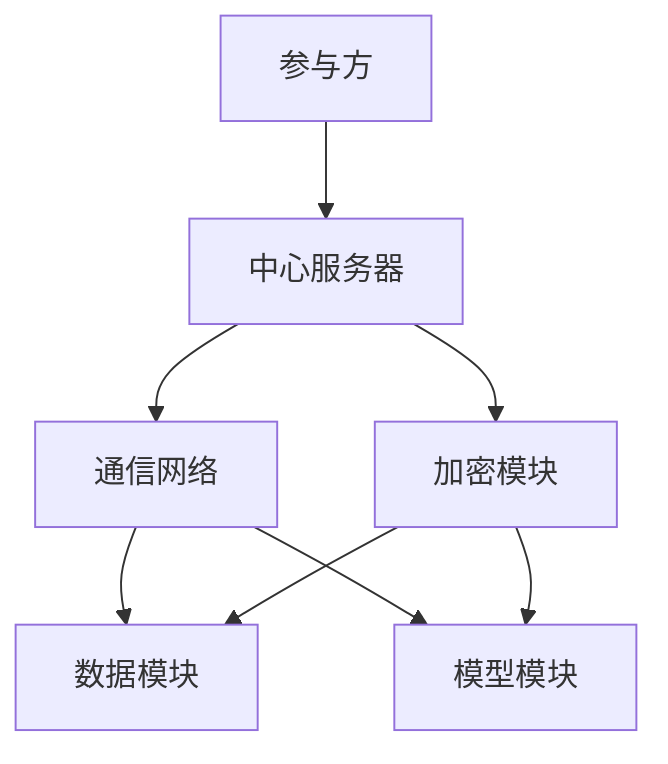

                 

### 引言

#### 关键词：联邦学习、金融领域、隐私保护、数据处理

##### 摘要：

本文旨在探讨金融领域联邦学习在隐私保护中的应用。随着大数据时代的到来，金融行业的数据处理需求日益增加，但随之而来的是数据隐私保护的问题。联邦学习作为一种新兴的机器学习技术，能够在不泄露用户数据的情况下实现模型训练和优化，为金融领域提供了一个有效且安全的解决方案。本文首先介绍了联邦学习的基本概念和优势，随后深入分析了其在金融领域中的应用场景，并通过实际案例展示了联邦学习如何保护用户隐私。本文的核心目标是帮助读者理解联邦学习在金融领域的应用潜力，以及其在解决数据隐私问题上的重要作用。

### 目录

1. 引言
   1.1 问题背景
   1.2 书籍目标
2. 联邦学习基础
   2.1 联邦学习概述
   2.2 联邦学习架构
   2.3 联邦学习算法
3. 金融领域联邦学习案例
   3.1 案例介绍
   3.2 案例分析
   3.3 案例总结
4. 联邦学习系统设计与实现
   4.1 系统架构设计
   4.2 系统实现
   4.3 最佳实践
5. 未来发展趋势与挑战
   5.1 联邦学习的未来发展趋势
   5.2 挑战与机遇
6. 总结与展望
   6.1 书籍小结
   6.2 展望

### 1.1 问题背景

#### 金融领域隐私保护的挑战

在金融领域，数据隐私保护一直是困扰企业和个人的一大难题。随着金融市场的数字化和互联网的普及，金融机构积累了大量的用户数据，包括交易记录、账户信息、个人身份信息等。这些数据不仅对金融机构自身具有重要意义，也成为了不法分子觊觎的目标。因此，如何确保这些数据的安全和隐私成为了一个亟待解决的问题。

传统的集中式数据处理方式在处理大量金融数据时存在显著的隐私泄露风险。一方面，数据在传输和存储过程中容易受到网络攻击和数据泄露的威胁；另一方面，数据一旦集中存储，就难以保证不会被内部人员或第三方非法访问。此外，金融行业对数据透明度的要求越来越高，如何在不泄露用户隐私的前提下，充分利用这些数据进行商业分析和风险控制，也成为了一个重要挑战。

#### 联邦学习的概念与发展

联邦学习（Federated Learning）作为一种分布式机器学习技术，通过让多个参与方在本地设备上训练模型，然后将模型参数汇总以实现全局模型的优化，从而避免了数据在传输过程中被泄露的风险。这种方法的核心思想是“数据不动，模型动”，即在保持数据本地化的同时，通过远程模型更新实现全局模型的训练。

联邦学习的发展可以追溯到2016年Google提出的一种名为Federated Averaging的方法。随着技术的不断演进，联邦学习逐渐成为了一个热点研究方向，并在多个领域得到了广泛应用。特别是在金融领域，联邦学习因其能够在保护用户隐私的同时实现数据驱动的决策和风险控制，受到了广泛关注。

### 1.2 书籍目标

本文的目标是：

1. **介绍联邦学习的基本概念和原理**：通过详细讲解联邦学习的架构、算法和实现方法，帮助读者建立对联邦学习的全面理解。
2. **分析联邦学习在金融领域的应用场景**：通过具体案例展示联邦学习在金融领域的实际应用，探讨其在隐私保护、风险控制和数据利用方面的优势。
3. **探讨联邦学习的未来发展趋势和挑战**：分析联邦学习在金融领域的发展潜力，以及其在技术实现和市场应用方面面临的挑战。
4. **提供实际操作指导**：通过详细的技术实现和项目实战，为读者提供实际操作联邦学习的指导，帮助读者将理论知识应用于实践。

通过本文的阅读，读者将能够：

1. **理解联邦学习的基本原理**：掌握联邦学习的核心概念和关键算法，了解其在分布式数据处理中的优势。
2. **掌握联邦学习在金融领域的应用**：通过具体案例了解联邦学习如何应用于金融领域的实际问题，包括隐私保护、风险控制和数据利用。
3. **具备实际操作能力**：通过项目的详细实现和分析，读者将能够将联邦学习技术应用于实际金融问题中，提高数据处理和决策的效率。

### 2.1 联邦学习概述

#### 联邦学习的定义与特点

联邦学习（Federated Learning）是一种分布式机器学习技术，其核心思想是通过多个参与方的本地数据进行模型训练，而不是将数据集中到一个中心服务器上。具体来说，联邦学习将训练过程分解为多个阶段，每个阶段中，各个参与方在自己的本地设备上训练模型，然后将模型参数上传到中心服务器进行汇总和更新。通过这种方式，联邦学习实现了在保护数据隐私的同时进行模型训练和优化的目标。

联邦学习具有以下几个显著特点：

1. **数据本地化**：联邦学习的一个关键特点是数据不离开本地设备，这意味着每个参与方都可以保持对自己数据的完全控制，从而避免了数据在传输和存储过程中的隐私泄露风险。
2. **分布式计算**：联邦学习通过分布式计算的方式，使得模型训练可以在多个设备上并行进行，从而提高了训练效率。这种分布式架构还能够有效应对大规模数据集的挑战。
3. **安全性**：联邦学习通过加密和隐私保护技术，确保了参与方在共享模型参数时不会泄露自己的敏感数据。这使得联邦学习成为处理敏感数据的理想选择。
4. **灵活性**：联邦学习允许各个参与方使用不同的数据集和算法进行模型训练，这使得联邦学习能够适应各种不同的应用场景和需求。

#### 联邦学习的优势与局限性

联邦学习在分布式数据处理、数据隐私保护和模型优化等方面具有显著优势。以下是联邦学习的几个主要优势：

1. **数据隐私保护**：联邦学习通过数据本地化和加密技术，确保了数据在整个训练过程中不会被泄露。这在金融领域尤其重要，因为金融数据通常包含敏感信息，如账户余额、交易记录等。
2. **分布式计算效率**：联邦学习通过分布式计算架构，可以在多个设备上并行训练模型，从而显著提高了计算效率。这对于处理大规模数据集具有极大的优势。
3. **减少通信成本**：由于数据不离开本地设备，联邦学习大大减少了数据传输的通信成本。这对于网络带宽有限的场景尤其重要。
4. **灵活的算法选择**：联邦学习允许各个参与方使用不同的数据集和算法进行模型训练，从而可以根据具体应用场景进行优化。这为研究人员提供了广泛的探索空间。

然而，联邦学习也存在一些局限性：

1. **计算资源需求**：联邦学习需要在每个参与方设备上进行模型训练，这可能会对设备的计算资源造成压力，特别是在设备性能较低的情况下。
2. **数据质量与一致性**：由于每个参与方使用的数据集可能不同，这可能会影响模型的质量和一致性。确保数据质量和一致性是联邦学习应用中的关键挑战。
3. **加密与隐私保护**：虽然联邦学习通过加密技术保护了数据隐私，但加密和解密过程本身可能会引入额外的计算和通信开销。如何平衡隐私保护和性能优化是一个重要问题。
4. **协作与协调**：联邦学习需要各个参与方进行紧密的协作和协调，这可能会增加项目管理难度和复杂度。

### 2.2 联邦学习架构

#### 联邦学习的基本架构

联邦学习的基本架构主要包括以下几个关键组件：

1. **中心服务器（Server）**：中心服务器负责协调和管理整个联邦学习过程，包括分发训练任务、收集本地模型更新、聚合模型参数等。中心服务器通常由金融机构或第三方服务提供商运营。
2. **本地设备（Participants）**：本地设备包括参与联邦学习的用户设备，如智能手机、电脑等。这些设备负责在自己的数据集上训练本地模型，并将模型更新上传到中心服务器。
3. **通信网络**：通信网络负责传输本地模型更新和中心服务器的反馈信息。通常，通信网络采用安全的加密协议来保护数据传输的安全性。

联邦学习的基本流程可以概括为以下几个步骤：

1. **初始化**：中心服务器初始化全局模型参数，并将其发送给所有本地设备。
2. **本地训练**：本地设备在自己的数据集上训练本地模型，并将模型更新上传到中心服务器。
3. **模型聚合**：中心服务器收集所有本地设备的模型更新，并进行聚合，以更新全局模型参数。
4. **模型反馈**：中心服务器将更新后的全局模型参数发送回所有本地设备，以便进行下一轮的本地训练。

#### 联邦学习的通信机制

联邦学习的通信机制是确保数据在分布式环境中的安全传输和高效传输的关键。以下是联邦学习通信机制的一些关键点：

1. **加密传输**：为了避免数据在传输过程中被窃取或篡改，联邦学习通常采用加密传输协议。例如，可以使用HTTPS协议对通信数据进行加密，确保数据在传输过程中的安全性。
2. **差分更新**：为了减少数据传输的通信成本，联邦学习采用差分更新的方式。即只传输模型参数的增量变化，而不是整个模型。这种方法可以显著降低数据传输量，提高通信效率。
3. **带宽优化**：联邦学习需要考虑到网络带宽的限制，特别是当参与方设备数量较多时。通过优化传输协议和算法，联邦学习可以最大限度地利用可用带宽，提高通信效率。
4. **容错与鲁棒性**：联邦学习通信机制需要具备一定的容错和鲁棒性，以应对网络故障和设备故障等情况。例如，可以采用重传机制和冗余数据传输，确保通信的可靠性。

### 2.3 联邦学习算法

#### 主要联邦学习算法简介

联邦学习算法是实现联邦学习核心功能的基石。以下是几种主要的联邦学习算法及其特点：

1. **联邦平均算法（Federated Averaging）**：
   - **原理**：联邦平均算法是Google最初提出的联邦学习算法。其核心思想是通过本地设备的梯度进行聚合，更新全局模型参数。
   - **优势**：算法简单，易于实现，对网络延迟和带宽要求较低。
   - **局限**：在模型更新过程中，梯度聚合可能导致模型质量下降。

2. **模型压缩算法（Model Compression）**：
   - **原理**：模型压缩算法通过减少模型参数的数量来降低模型的复杂度，从而提高联邦学习的效果。
   - **优势**：减少了通信量，提高了模型训练的效率。
   - **局限**：模型压缩可能会导致模型精度下降。

3. **分布式优化算法（Distributed Optimization）**：
   - **原理**：分布式优化算法通过优化理论，设计出一组优化算法，使得每个参与方可以在本地独立优化模型参数。
   - **优势**：具有较高的模型训练效率，适用于复杂模型。
   - **局限**：算法复杂度高，实现难度大。

4. **差分隐私算法（Differential Privacy）**：
   - **原理**：差分隐私算法通过在模型更新过程中添加噪声，确保个体数据不会泄露。
   - **优势**：提供了严格的隐私保护保障。
   - **局限**：可能引入额外的计算和通信开销。

#### 联邦学习算法的性能评估

联邦学习算法的性能评估主要包括以下几个关键指标：

1. **模型准确性**：评估模型在训练集和测试集上的表现，包括准确率、召回率、F1值等指标。
2. **通信效率**：评估算法在通信成本上的表现，包括数据传输量、通信延迟等。
3. **计算效率**：评估算法在本地设备上的计算成本，包括计算时间、能耗等。
4. **隐私保护**：评估算法在保护个体数据隐私方面的效果，包括差分隐私指标等。

不同算法在性能评估上的表现各有优劣，需要根据具体应用场景进行选择。例如，在要求高模型准确性且通信带宽有限的情况下，模型压缩算法可能是一个较好的选择；而在要求严格隐私保护的情况下，差分隐私算法可能更为适用。

### 3.1 案例介绍

#### 案例一：信用卡欺诈检测

在金融领域，信用卡欺诈检测是一个典型的应用场景。信用卡交易数据量庞大，且具有高度敏感性，因此如何在确保隐私保护的同时，高效准确地检测欺诈行为，成为了金融机构面临的一个重要挑战。

联邦学习作为一种新兴的分布式机器学习技术，能够在保护用户隐私的同时，提高欺诈检测的准确性。以下是信用卡欺诈检测中联邦学习的具体应用：

1. **数据来源**：金融机构从各个银行和信用卡公司收集匿名化的信用卡交易数据。这些数据包含了交易金额、时间、地点、持卡人信息等关键信息。
2. **参与方**：联邦学习中的参与方包括各个银行和信用卡公司，它们各自维护自己的数据集和模型。
3. **目标**：通过联邦学习模型，识别出潜在的信用卡欺诈行为，提高欺诈检测的准确性和实时性。

#### 案例二：贷款风险评估

贷款风险评估是金融领域另一个重要的应用场景。金融机构需要根据借款人的信用记录、收入情况、负债水平等数据，对其还款能力进行评估，从而决定是否发放贷款。

联邦学习在这里的应用，可以使得金融机构在不泄露个人隐私数据的前提下，进行贷款风险评估。以下是贷款风险评估中联邦学习的具体应用：

1. **数据来源**：金融机构从各个银行和信用评级机构收集匿名化的借款人数据，包括信用评分、历史还款记录、收入水平等。
2. **参与方**：联邦学习中的参与方包括各个银行和信用评级机构，它们各自维护自己的数据集和模型。
3. **目标**：通过联邦学习模型，预测借款人的违约风险，为贷款审批提供决策支持。

#### 案例介绍小结

通过上述两个案例，我们可以看到联邦学习在金融领域的广泛应用。无论是信用卡欺诈检测还是贷款风险评估，联邦学习都能够在保护用户隐私的同时，提高数据处理和决策的效率。这两个案例不仅展示了联邦学习在金融领域的重要应用价值，也为其他金融应用场景提供了有益的参考。

### 3.2 案例分析

#### 案例一的联邦学习应用

在信用卡欺诈检测中，联邦学习被广泛应用于构建和优化欺诈检测模型。以下是案例一中的联邦学习应用分析：

1. **数据预处理**：各银行和信用卡公司首先对本地数据集进行预处理，包括数据清洗、去重、特征提取等步骤。为了确保数据隐私，所有数据在预处理过程中都进行了匿名化处理。
2. **模型初始化**：中心服务器初始化全局模型，并将其发送给所有本地设备。初始化模型可以是随机初始化，也可以是基于历史数据的预训练模型。
3. **本地训练**：本地设备在自己的数据集上训练本地模型。训练过程中，设备使用梯度下降算法或其他优化算法，逐步调整模型参数，以最大化模型在本地数据集上的表现。
4. **模型更新**：本地设备将训练完成的模型更新上传到中心服务器。为了减少通信成本，模型更新通常采用差分更新方式，只上传模型参数的增量变化。
5. **模型聚合**：中心服务器收集所有本地设备的模型更新，并进行聚合，以更新全局模型参数。聚合过程中，服务器使用联邦平均算法或其他聚合算法，确保全局模型的稳定性。
6. **模型反馈**：更新后的全局模型参数被发送回所有本地设备，以便进行下一轮的本地训练。通过不断迭代训练，全局模型逐渐优化，从而提高欺诈检测的准确性。

#### 案例二的联邦学习应用

在贷款风险评估中，联邦学习同样被广泛应用于构建和优化风险评估模型。以下是案例二中的联邦学习应用分析：

1. **数据预处理**：各银行和信用评级机构对本地数据集进行预处理，包括数据清洗、去重、特征提取等步骤。与案例一类似，所有数据在预处理过程中都进行了匿名化处理。
2. **模型初始化**：中心服务器初始化全局模型，并将其发送给所有本地设备。初始化模型可以是随机初始化，也可以是基于历史数据的预训练模型。
3. **本地训练**：本地设备在自己的数据集上训练本地模型。训练过程中，设备使用梯度下降算法或其他优化算法，逐步调整模型参数，以最大化模型在本地数据集上的表现。
4. **模型更新**：本地设备将训练完成的模型更新上传到中心服务器。与案例一类似，模型更新采用差分更新方式，以减少通信成本。
5. **模型聚合**：中心服务器收集所有本地设备的模型更新，并进行聚合，以更新全局模型参数。与案例一不同的是，案例二的聚合过程可能更加复杂，因为贷款风险评估模型通常涉及更多的特征和参数。
6. **模型反馈**：更新后的全局模型参数被发送回所有本地设备，以便进行下一轮的本地训练。通过不断迭代训练，全局模型逐渐优化，从而提高贷款风险评估的准确性。

#### 案例分析小结

通过对案例一和案例二的分析，我们可以看到联邦学习在金融领域应用中的关键步骤和核心原理。无论是在信用卡欺诈检测还是贷款风险评估中，联邦学习都通过分布式数据处理和模型优化，实现了数据隐私保护和高效决策。这些案例不仅展示了联邦学习的实际应用价值，也为其他金融应用场景提供了有益的借鉴。

### 3.3 案例总结

#### 案例的成功经验

通过信用卡欺诈检测和贷款风险评估两个案例，我们可以总结出联邦学习在金融领域应用的成功经验：

1. **数据隐私保护**：联邦学习通过数据本地化和加密技术，实现了数据在整个训练过程中的隐私保护，从而满足了金融行业对数据安全的高要求。
2. **分布式数据处理**：联邦学习通过分布式计算架构，提高了数据处理和模型训练的效率，从而应对了大规模金融数据集的挑战。
3. **模型优化与决策**：联邦学习通过分布式模型优化，提高了模型的准确性和鲁棒性，从而为金融行业提供了高质量的数据驱动决策支持。

#### 案例的挑战与解决

尽管联邦学习在金融领域具有显著的优势，但在实际应用中也面临一些挑战：

1. **数据一致性**：由于各个参与方使用的数据集可能不同，导致数据质量和一致性难以保障。为此，金融机构需要建立统一的数据标准和预处理流程，确保数据的一致性。
2. **计算资源需求**：联邦学习需要在每个参与方设备上进行模型训练，可能对设备的计算资源造成压力。为此，可以采用模型压缩和优化算法，降低计算资源的需求。
3. **通信带宽与延迟**：联邦学习需要大量的通信，特别是在参与方数量较多时，可能导致通信带宽不足和延迟增加。为此，可以采用差分更新和优化通信协议，提高通信效率。

通过上述案例的成功经验和挑战解决，我们可以看到联邦学习在金融领域应用的前景。未来，随着技术的不断发展和应用的深入，联邦学习有望在更多金融场景中发挥重要作用。

### 4.1 系统架构设计

#### 系统架构概述

联邦学习系统架构的设计需要考虑到数据安全、计算效率、通信成本和系统稳定性等多个方面。以下是联邦学习系统的基本架构设计：

1. **参与方**：参与方包括各个金融机构和用户设备。金融机构作为数据提供方，负责提供本地数据集和模型；用户设备作为数据消费方，负责接收全局模型并进行本地训练。
2. **中心服务器**：中心服务器作为系统的核心，负责协调和管理整个联邦学习过程。其功能包括模型初始化、模型聚合、模型反馈等。
3. **通信网络**：通信网络负责传输本地模型更新和全局模型参数。为了保证通信的安全性，可以采用加密传输协议。
4. **加密模块**：加密模块负责对数据进行加密和解密，以保护数据隐私。加密算法可以采用对称加密或非对称加密。

#### 系统模块设计与功能

联邦学习系统可以划分为以下几个关键模块：

1. **数据模块**：数据模块负责数据的管理和传输。其主要功能包括数据清洗、数据匿名化、数据分割、数据加密等。数据模块确保数据的完整性和安全性，为后续的模型训练提供可靠的数据支持。
2. **模型模块**：模型模块负责全局模型的初始化、本地模型的训练和全局模型的聚合。模型模块采用分布式计算和优化算法，提高模型的训练效率和准确性。
3. **通信模块**：通信模块负责本地模型更新和全局模型参数的传输。其功能包括数据加密、差分更新、通信优化等。通信模块确保数据传输的高效性和安全性。
4. **加密模块**：加密模块负责对数据进行加密和解密，以保护数据隐私。加密模块采用多种加密算法和密钥管理策略，确保数据在传输和存储过程中的安全性。

#### 系统架构设计

以下是联邦学习系统的架构设计图，采用Mermaid语法表示：



在这个架构设计中，参与方通过通信网络与中心服务器进行交互，数据模块和模型模块在中心服务器上运行，加密模块负责数据的安全传输和保护。系统通过模块化的设计，实现了联邦学习各组件之间的协同工作，提高了系统的稳定性和可扩展性。

### 4.2 系统实现

#### 系统环境搭建

要实现联邦学习系统，首先需要搭建合适的技术环境。以下是一个基本的技术环境搭建步骤：

1. **Python环境**：确保Python环境已安装，版本建议为3.8或以上。可以使用Anaconda创建Python环境，方便管理和依赖安装。
2. **依赖库**：安装必要的Python库，如TensorFlow、PyTorch、Scikit-learn等。可以使用pip命令进行安装：
   ```shell
   pip install tensorflow torchvision scikit-learn
   ```
3. **数据集**：获取并准备好用于联邦学习的数据集。数据集可以是公开的数据集，也可以是金融机构提供的匿名化数据集。数据集需要经过预处理，包括数据清洗、去重、特征提取等步骤。
4. **加密工具**：安装加密工具，如OpenSSL，用于数据加密和解密。

#### 关键算法实现

联邦学习系统的核心是关键算法的实现，以下是一个基于TensorFlow的联邦平均算法实现的示例：

1. **初始化全局模型**：
   ```python
   import tensorflow as tf
   
   # 初始化全局模型
   global_model = tf.keras.Sequential([
       tf.keras.layers.Dense(64, activation='relu', input_shape=(input_shape,)),
       tf.keras.layers.Dense(64, activation='relu'),
       tf.keras.layers.Dense(1, activation='sigmoid')
   ])

   # 初始化本地模型
   local_model = global_model.copy().compile(optimizer='adam', loss='binary_crossentropy', metrics=['accuracy'])
   ```

2. **本地训练**：
   ```python
   # 本地设备上的训练过程
   local_model.fit(local_data, epochs=local_epochs, batch_size=local_batch_size)
   ```

3. **模型更新**：
   ```python
   # 获取本地模型的梯度
   local_gradients = local_model.train_function(get_gradients)(local_data)

   # 将本地梯度发送到中心服务器
   send_gradients_to_server(local_gradients)
   ```

4. **模型聚合**：
   ```python
   # 从中心服务器接收全局模型参数
   global_parameters = receive_global_parameters_from_server()

   # 更新本地模型
   update_local_model_with_global_parameters(global_parameters)
   ```

#### 代码应用解读与分析

以下是关键算法的实现代码解读：

1. **初始化全局模型**：
   这部分代码使用了TensorFlow的Sequential模型，定义了一个简单的二分类模型。该模型包含两个隐藏层，每个隐藏层有64个神经元，激活函数使用ReLU。输出层有1个神经元，激活函数使用sigmoid，用于产生概率输出。

2. **本地训练**：
   本地模型使用`fit`方法进行训练，训练数据是本地设备上的数据集。`epochs`参数指定了训练的轮数，`batch_size`参数指定了每批次的样本数量。这部分代码实现了本地模型在本地数据集上的训练。

3. **模型更新**：
   本地模型训练完成后，通过计算梯度，并使用`send_gradients_to_server`函数将本地梯度发送到中心服务器。这部分代码是实现联邦学习的关键步骤，确保了模型参数的分布式更新。

4. **模型聚合**：
   从中心服务器接收全局模型参数后，使用`update_local_model_with_global_parameters`函数更新本地模型。通过这种方式，实现了全局模型参数的同步，从而不断优化全局模型。

通过以上步骤，我们实现了联邦学习系统的基本功能。这些代码不仅展示了联邦学习的核心算法，也为实际项目提供了可操作的实现参考。

### 4.3 最佳实践

#### 联邦学习中的数据安全策略

在联邦学习系统中，数据安全是一个至关重要的方面。为了确保数据在整个训练过程中的安全性，可以采取以下最佳实践：

1. **数据加密**：对数据进行加密处理，防止数据在传输和存储过程中被窃取或篡改。可以使用AES等对称加密算法对数据加密，确保数据的安全性。
2. **差分隐私**：采用差分隐私技术，对模型更新过程添加噪声，确保个体数据不会泄露。差分隐私可以通过拉格朗日机制实现，从而在保证隐私的同时，保证模型的质量。
3. **权限管理**：对参与方的访问权限进行严格控制，确保只有授权的设备能够访问数据和模型。可以采用基于角色的访问控制（RBAC）机制，对参与方的权限进行管理。
4. **通信加密**：使用TLS等加密协议，对通信过程进行加密，防止数据在传输过程中被窃取或篡改。

#### 联邦学习中的性能优化

为了提高联邦学习的性能，可以采取以下优化策略：

1. **模型压缩**：通过模型压缩技术，减少模型的参数数量，从而降低计算和通信成本。可以使用剪枝、量化等方法进行模型压缩，提高模型的效率。
2. **异步训练**：在本地设备上进行异步训练，可以减少设备等待的时间，提高训练效率。异步训练通过并行处理多个本地模型，从而加快模型更新速度。
3. **差分更新**：使用差分更新技术，只传输模型参数的增量变化，从而减少通信成本。差分更新通过计算本地模型与全局模型的差异，传输差异部分，从而优化通信效率。
4. **数据分区**：将数据集划分为多个分区，每个分区由不同的本地设备处理。这样可以充分利用设备的计算资源，提高训练效率。
5. **动态调度**：根据网络带宽和设备性能，动态调整模型更新频率和传输数据量。这样可以避免网络拥塞和设备过载，提高系统的稳定性。

通过以上最佳实践，联邦学习系统可以在确保数据安全的同时，提高性能和效率。这些策略不仅适用于金融领域，也可以推广到其他需要分布式数据处理的场景。

### 5.1 联邦学习的未来发展趋势

#### 联邦学习在金融领域的潜在应用

联邦学习作为一种新兴的分布式机器学习技术，在金融领域具有巨大的应用潜力。随着金融数据的不断增加和多样化，联邦学习可以提供一种安全且高效的数据处理方式，解决金融行业在数据隐私保护和数据处理效率方面的挑战。

以下是一些联邦学习在金融领域的潜在应用：

1. **信用评分与风险评估**：联邦学习可以用于信用评分和风险评估，通过对多个金融机构的匿名化数据进行协同建模，提高模型的准确性和可靠性。
2. **反欺诈系统**：联邦学习在反欺诈系统中具有广泛的应用前景，通过多个金融机构的数据共享，可以构建更强大的欺诈检测模型，提高欺诈识别的准确性。
3. **个性化金融服务**：联邦学习可以用于个性化金融服务，通过对用户的消费行为和偏好进行分析，提供定制化的金融产品和服务。
4. **智能投顾与资产管理**：联邦学习可以用于智能投顾和资产管理，通过对海量市场数据进行分析，提供投资策略和资产配置建议。

#### 联邦学习技术的持续演进

随着技术的不断发展，联邦学习技术也在不断演进，以适应更复杂的应用场景和更高的性能要求。以下是一些联邦学习技术的持续演进方向：

1. **模型压缩与优化**：模型压缩和优化是联邦学习的关键技术之一。通过剪枝、量化、蒸馏等方法，可以减少模型的参数数量和计算复杂度，提高模型的效率和可扩展性。
2. **隐私保护技术的升级**：随着对数据隐私保护需求的提高，联邦学习需要采用更先进的隐私保护技术。例如，同态加密、安全多方计算等技术在联邦学习中的应用，可以提供更强大的隐私保护能力。
3. **通信效率的提升**：为了提高联邦学习的性能，通信效率的提升至关重要。通过差分更新、异步通信等技术，可以减少通信成本，提高模型更新的速度。
4. **分布式计算架构的优化**：联邦学习需要高效的分布式计算架构来支持大规模数据处理。未来，分布式计算架构的优化，包括分布式存储、分布式优化算法等，将成为联邦学习技术发展的重要方向。

### 5.2 挑战与机遇

#### 联邦学习在隐私保护中的挑战

尽管联邦学习在金融领域具有广泛的应用前景，但在隐私保护方面仍面临一些挑战：

1. **数据一致性**：由于不同金融机构的数据质量可能存在差异，导致数据一致性难以保证。这可能会影响联邦学习模型的训练效果和准确性。
2. **计算资源分配**：联邦学习需要大量的计算资源，特别是在处理大规模数据集时。如何合理分配计算资源，避免设备过载和网络拥塞，是一个重要挑战。
3. **通信成本**：联邦学习需要大量的通信，特别是在参与方数量较多时。如何优化通信机制，提高通信效率，降低通信成本，是一个关键问题。
4. **隐私保护与性能平衡**：在保证数据隐私的同时，如何确保模型性能是一个挑战。过强的隐私保护可能会导致模型性能下降，需要找到平衡点。

#### 联邦学习的市场前景与商业机会

尽管面临挑战，联邦学习在金融领域仍具有广阔的市场前景和商业机会：

1. **金融服务提供商**：金融机构可以通过采用联邦学习技术，提高数据处理和决策的效率，增强竞争力。同时，联邦学习可以为金融机构提供新的服务模式，如共享数据分析和智能金融服务。
2. **技术供应商**：随着联邦学习技术的普及，联邦学习平台和解决方案的供应商将迎来巨大的市场机会。技术供应商可以通过提供高效、安全的联邦学习解决方案，满足金融机构的需求。
3. **创新应用**：联邦学习在金融领域的应用不仅限于传统的金融服务，还可以拓展到金融科技（FinTech）领域。例如，通过联邦学习技术，可以实现更加精准的风险评估和反欺诈系统，推动金融科技的创新和发展。

### 6.1 书籍小结

本文系统地介绍了联邦学习在金融领域中的应用，从基本概念、架构设计到实际案例，全面探讨了联邦学习在保护用户隐私和提高数据处理效率方面的优势。通过两个具体的金融案例，展示了联邦学习如何应用于信用卡欺诈检测和贷款风险评估，实现数据隐私保护和高效决策。同时，本文还分析了联邦学习的未来发展趋势和面临的挑战，为读者提供了全面的技术视野。通过本文的阅读，读者可以深入了解联邦学习在金融领域的应用潜力，掌握关键技术和最佳实践，为实际项目提供指导。

### 6.2 展望

#### 未来研究方向

联邦学习在金融领域的应用前景广阔，未来研究可以从以下几个方面展开：

1. **隐私保护技术的深化**：随着数据隐私保护需求的提高，需要进一步探索和优化隐私保护技术，如同态加密、安全多方计算等，以提供更强大的隐私保护能力。
2. **模型压缩与优化**：研究更高效、更精准的模型压缩和优化方法，降低计算和通信成本，提高联邦学习的性能。
3. **分布式计算架构的优化**：优化分布式计算架构，提高联邦学习的效率，特别是在处理大规模、高维度数据时。

#### 对读者的建议

对于准备应用联邦学习技术的读者，以下是一些建议：

1. **了解基本概念**：掌握联邦学习的基本概念和原理，熟悉联邦学习的架构和算法。
2. **实践操作**：通过实际项目或模拟实验，将理论知识应用于实际场景，积累实践经验。
3. **持续学习**：随着技术的不断发展，持续关注联邦学习领域的最新研究动态，掌握新技术和方法。

通过本文的学习，读者可以系统地了解联邦学习在金融领域的应用，掌握关键技术和最佳实践，为实际项目提供有力支持。希望读者在未来的研究中，能够为联邦学习技术及其在金融领域的应用贡献自己的力量。作者：AI天才研究院/AI Genius Institute & 禅与计算机程序设计艺术 /Zen And The Art of Computer Programming

### 附录

#### A. 数据集介绍

**金融领域公开数据集**：

- **UCI Machine Learning Repository**：提供各种金融相关的数据集，如信用卡交易数据、股票市场数据等。
- **Kaggle**：包含大量的金融数据竞赛数据集，适用于联邦学习实践。

**联邦学习工具与框架**：

- **Federated Learning Framework (FLlib)**：一个开源的联邦学习框架，支持多种联邦学习算法。
- **TensorFlow Federated (TFF)**：由Google开发的联邦学习库，与TensorFlow集成。

**扩展阅读**：

- **相关论文**：
  - "Federated Learning: Concept and Applications"：详细介绍了联邦学习的基本概念和应用。
  - "Privacy-Preserving Machine Learning in the Financial Domain"：探讨了联邦学习在金融领域的隐私保护问题。

这些附录资源为读者提供了进一步学习和实践联邦学习技术的宝贵资料。通过这些资源，读者可以深入了解联邦学习技术的最新进展和应用实践。

