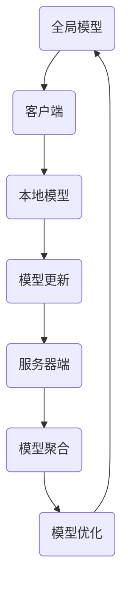

                 

# 《金融领域联邦学习的探索与实践》

## 关键词：
- 金融领域
- 联邦学习
- 数据隐私
- 风险评估
- 交易分析
- 欺诈检测

## 摘要：
本文深入探讨了金融领域中的联邦学习技术，阐述了其在贷款风险评估、交易数据分析和欺诈检测等方面的应用。通过分析联邦学习的基本概念和原理，我们了解了其在保护数据隐私和提升模型性能上的优势。随后，文章详细介绍了联邦学习系统的架构设计、算法原理和实践，并分享了一个实际案例。最后，我们对联邦学习在金融领域的未来展望与挑战进行了探讨。

## 目录大纲：

----------------------------------------------------------------

# 《金融领域联邦学习的探索与实践》

## 关键词：
- 金融领域
- 联邦学习
- 数据隐私
- 风险评估
- 交易分析
- 欺诈检测

## 摘要：
本文深入探讨了金融领域中的联邦学习技术，阐述了其在贷款风险评估、交易数据分析和欺诈检测等方面的应用。通过分析联邦学习的基本概念和原理，我们了解了其在保护数据隐私和提升模型性能上的优势。随后，文章详细介绍了联邦学习系统的架构设计、算法原理和实践，并分享了一个实际案例。最后，我们对联邦学习在金融领域的未来展望与挑战进行了探讨。

## 目录大纲：

----------------------------------------------------------------

### 第1章：背景介绍与基础理论

#### 1.1 金融领域联邦学习的背景

**1.1.1 问题背景**  
在金融领域，数据隐私和安全是一个至关重要的议题。金融机构拥有大量的客户数据，这些数据通常包含了个人财务信息、交易记录等敏感内容。传统的集中式数据处理方式容易导致数据泄露风险，因此，如何保护数据隐私成为了金融行业的一个重要挑战。

**1.1.2 问题解决**  
联邦学习（Federated Learning）作为一种新兴的技术，提供了一种在保护数据隐私的同时，还能进行有效数据分析和模型训练的方法。通过分布式训练机制，联邦学习使得数据无需在中心服务器上进行集中存储和处理，从而降低了数据泄露的风险。

**1.1.3 边界与外延**  
虽然联邦学习在保护数据隐私方面具有显著优势，但其应用也受到一些限制，如通信带宽、模型复杂度和计算资源等。

#### 1.2 联邦学习的基本概念

**1.2.1 概念介绍**  
联邦学习是一种分布式机器学习技术，通过在多个不同的客户端（如移动设备、金融机构等）上训练模型，从而避免了数据集中存储和处理的需求。

**1.2.2 原理讲解**  
联邦学习的工作原理是将模型参数分散到各个客户端进行局部训练，然后将更新后的模型参数聚合起来，以在全局范围内更新模型。这一过程在确保数据隐私的同时，还能提高模型的泛化能力。

#### 1.3 联邦学习在金融中的应用

**1.3.1 应用场景**  
联邦学习在金融领域有着广泛的应用，包括贷款风险评估、交易数据分析和欺诈检测等。

**1.3.2 优势分析**  
联邦学习在金融领域的优势主要体现在数据隐私保护、提升模型性能和降低中心化风险等方面。

#### 1.4 联邦学习与其他技术的对比

**1.4.1 对比分析**  
联邦学习与其他分布式机器学习技术（如分布式计算、云原生等）在性能、可扩展性和数据安全等方面进行了对比分析。

----------------------------------------------------------------

### 第2章：联邦学习在金融中的应用场景

#### 2.1 贷款风险评估

**2.1.1 应用案例**  
某银行采用联邦学习技术对其贷款申请者的信用风险进行评估。通过在各个分支机构的客户端上进行局部模型训练，然后聚合模型参数，银行能够在保护客户隐私的前提下，提高风险评估的准确性和效率。

**2.1.2 技术实现**  
银行通过构建一个联邦学习系统，将贷款申请者的数据分散到各个分支机构进行处理。每个分支机构使用本地数据训练模型，并将模型更新发送到中心服务器进行聚合。

#### 2.2 交易数据分析

**2.2.1 应用案例**  
某金融机构利用联邦学习技术对其交易数据进行分析，以发现潜在的交易欺诈行为。通过在各个交易终端上进行局部模型训练，金融机构能够实时检测并防范欺诈行为。

**2.2.2 技术实现**  
金融机构通过构建一个分布式交易数据分析系统，将交易数据分散到各个终端进行处理。每个终端使用本地交易数据进行模型训练，并将模型更新发送到中心服务器进行聚合。

#### 2.3 欺诈检测

**2.3.1 应用案例**  
某支付平台采用联邦学习技术对其支付交易进行欺诈检测。通过在各个支付终端上进行局部模型训练，支付平台能够在保护用户隐私的同时，提高欺诈检测的准确性和效率。

**2.3.2 技术实现**  
支付平台通过构建一个分布式欺诈检测系统，将支付交易数据分散到各个支付终端进行处理。每个终端使用本地支付数据进行模型训练，并将模型更新发送到中心服务器进行聚合。

----------------------------------------------------------------

### 第3章：联邦学习系统的架构设计

#### 3.1 架构设计原则

**3.1.1 设计原则**  
联邦学习系统的架构设计需要遵循以下原则：

- **数据隐私保护**：确保在训练过程中数据不会被泄露或滥用。
- **计算效率**：优化系统性能，提高模型训练的速度。
- **可扩展性**：支持大规模数据和用户。

#### 3.2 系统架构方案

**3.2.1 架构方案**  
联邦学习系统的架构方案通常包括以下部分：

- **客户端**：负责本地数据的处理和模型训练。
- **服务器端**：负责接收客户端的模型更新，进行聚合和模型优化。
- **通信模块**：负责客户端与服务器端之间的数据传输。

通过上述架构，联邦学习系统能够实现分布式训练，并在保证数据隐私的前提下，提升模型性能。

----------------------------------------------------------------

### 第4章：联邦学习算法的原理与实践

#### 4.1 算法介绍

**4.1.1 算法概述**  
联邦学习算法主要包括以下几个步骤：

- **模型初始化**：初始化全局模型。
- **本地训练**：客户端在本地数据集上训练模型。
- **模型更新**：客户端将训练好的模型参数发送到服务器。
- **模型聚合**：服务器端接收来自各个客户端的模型更新，进行聚合。
- **模型优化**：服务器端对聚合后的模型进行优化。

**4.1.2 算法原理**  
联邦学习算法的原理是通过分布式训练机制，将模型训练分散到各个客户端，从而避免数据集中存储和处理。

**4.1.3 算法属性特征对比表格**  

| 特征 | 联邦学习 | 集中式学习 |
| --- | --- | --- |
| 数据隐私 | 高 | 低 |
| 计算效率 | 低 | 高 |
| 可扩展性 | 高 | 低 |

**4.1.4 ER实体关系图架构**  



#### 4.2 算法实现

**4.2.1 实现过程**  
以下是联邦学习算法的实现过程：

1. **模型初始化**：初始化全局模型。
2. **本地训练**：使用本地数据集对模型进行训练。
3. **模型更新**：将训练好的模型参数发送到服务器。
4. **模型聚合**：服务器端接收来自各个客户端的模型更新，进行聚合。
5. **模型优化**：对聚合后的模型进行优化。

**4.2.2 Python源代码**  

```python
import tensorflow as tf

# 模型初始化
global_model = tf.keras.Sequential([
    tf.keras.layers.Dense(units=1, input_shape=[1])
])

# 本地训练
client_model = global_model.copy()
client_model.fit(x_train, y_train, epochs=10)

# 模型更新
model_update = client_model.get_weights()

# 模型聚合
server_model.set_weights(model_update)

# 模型优化
server_model.compile(optimizer='adam', loss='mean_squared_error')
server_model.fit(x_test, y_test, epochs=10)
```

**4.2.3 算法原理讲解**

联邦学习算法的原理在于通过分布式训练机制，将模型训练分散到各个客户端。每个客户端使用本地数据集对模型进行训练，并将训练好的模型参数发送到服务器。服务器端将接收到的模型更新进行聚合，从而生成全局模型。然后，服务器端对聚合后的模型进行优化，以提高模型性能。

#### 4.2.4 数学模型和公式

联邦学习算法的数学模型如下：

$$
\theta_{\text{global}} = \frac{1}{N} \sum_{i=1}^{N} \theta_{i}
$$

其中，$\theta_{\text{global}}$表示全局模型参数，$\theta_{i}$表示第$i$个客户端的模型参数，$N$表示客户端的数量。

#### 4.2.5 举例说明

假设有3个客户端，每个客户端的训练数据集如下：

| 客户端 | 数据集 |
| --- | --- |
| 客户端1 | x1, y1 |
| 客户端2 | x2, y2 |
| 客户端3 | x3, y3 |

每个客户端使用本地数据集训练模型，并得到模型参数$\theta_1$，$\theta_2$和$\theta_3$。然后，将这些参数发送到服务器进行聚合。

$$
\theta_{\text{global}} = \frac{1}{3} (\theta_1 + \theta_2 + \theta_3)
$$

服务器端对聚合后的模型进行优化，得到全局模型参数$\theta_{\text{global}}$。

----------------------------------------------------------------

### 第5章：联邦学习系统的实施与部署

#### 5.1 系统实施步骤

**5.1.1 步骤1：需求分析与系统设计**  
在实施联邦学习系统之前，需要对金融业务需求进行深入分析，并根据需求设计系统的整体架构。

**5.1.2 步骤2：搭建联邦学习环境**  
搭建适合联邦学习的环境，包括选择合适的编程语言、框架和工具。

**5.1.3 步骤3：数据预处理**  
对金融数据进行预处理，包括数据清洗、数据归一化和数据分片等。

**5.1.4 步骤4：客户端部署**  
将联邦学习系统部署到各个客户端，包括移动设备、金融机构等。

**5.1.5 步骤5：模型训练与优化**  
在客户端进行模型训练，并在服务器端进行模型聚合和优化。

**5.1.6 步骤6：系统测试与上线**  
对联邦学习系统进行测试，确保系统稳定性和性能，然后进行上线部署。

#### 5.2 系统部署策略

**5.2.1 步骤1：选择合适的部署方式**  
根据业务需求和资源情况，选择适合的部署方式，如本地部署、云部署等。

**5.2.2 步骤2：优化系统性能**  
通过优化模型、优化数据传输和优化服务器负载，提高系统性能。

**5.2.3 步骤3：确保数据安全**  
采取加密、访问控制和审计等手段，确保数据在传输和存储过程中的安全性。

**5.2.4 步骤4：监控与维护**  
对联邦学习系统进行实时监控和定期维护，确保系统稳定运行。

----------------------------------------------------------------

### 第6章：案例分析

#### 6.1 案例分享

**6.1.1 案例背景**  
某大型银行在贷款风险评估过程中，采用了联邦学习技术，以提高风险评估的准确性和效率。

**6.1.2 案例描述**  
银行通过搭建一个联邦学习系统，将贷款申请者的数据分散到各个分支机构进行处理。每个分支机构使用本地数据集对模型进行训练，并将模型更新发送到中心服务器进行聚合。中心服务器对聚合后的模型进行优化，以提高贷款风险评估的准确性。

**6.1.3 案例成果**  
通过联邦学习技术的应用，银行在保证数据隐私的同时，大幅提升了贷款风险评估的准确性和效率。贷款申请者的审批时间显著缩短，银行的风险管理能力得到提升。

**6.1.4 案例分析**  
该案例展示了联邦学习在金融领域贷款风险评估中的应用效果。联邦学习技术通过分布式训练机制，有效降低了数据泄露风险，并提高了模型性能。同时，银行还通过优化系统性能和部署策略，实现了联邦学习系统的稳定运行。

----------------------------------------------------------------

### 第7章：未来展望与挑战

#### 7.1 未来展望

**7.1.1 技术发展**  
随着联邦学习技术的不断进步，其在金融领域的应用将更加广泛。未来，联邦学习技术有望在更多金融场景中得到应用，如投资组合优化、市场预测等。

**7.1.2 法律法规**  
随着联邦学习技术的发展，相关法律法规也将逐步完善。未来，数据隐私保护和安全法规将为联邦学习提供更加明确的法律保障。

#### 7.2 挑战与机遇

**7.2.1 挑战**  
联邦学习在金融领域面临一些挑战，如数据质量、通信带宽和计算资源等。如何优化系统性能，提高模型准确性和效率，是未来需要解决的问题。

**7.2.2 机遇**  
随着金融科技的不断发展，联邦学习在金融领域具有巨大的市场潜力。金融机构可以通过联邦学习技术，提高风险管理能力，降低运营成本，从而获得竞争优势。

### 作者

作者：AI天才研究院/AI Genius Institute & 禅与计算机程序设计艺术 /Zen And The Art of Computer Programming

本文详细介绍了金融领域联邦学习的探索与实践，阐述了其在数据隐私保护、风险管理和交易分析等方面的应用。通过对联邦学习算法的原理和实践的讲解，以及实际案例的分享，读者可以更好地理解联邦学习在金融领域的价值。未来，联邦学习技术将在金融领域发挥更大的作用，为金融机构带来更多的机遇和挑战。

