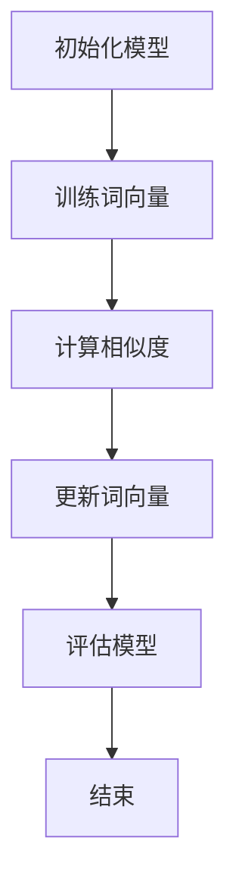
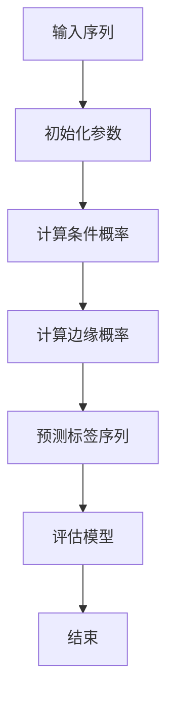
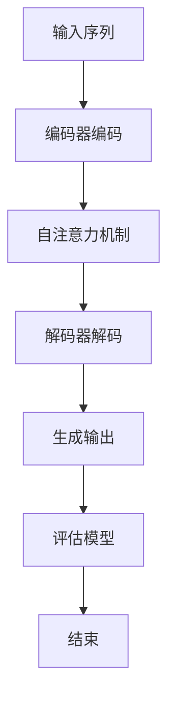
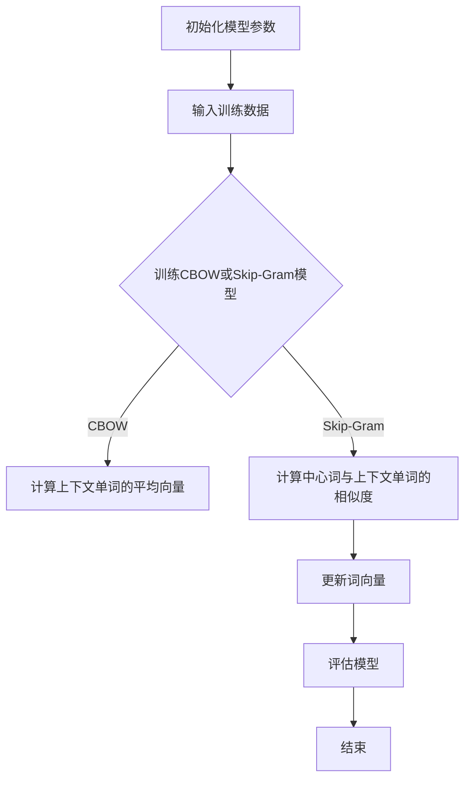
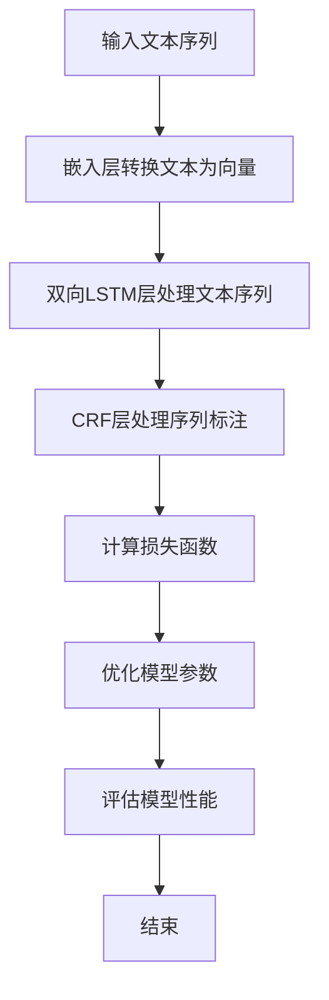
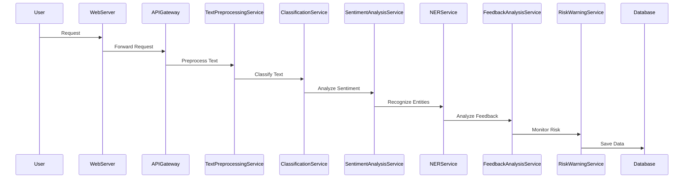
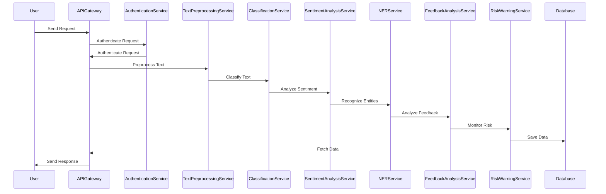

                 


## 概述

### 1.1 金融领域自然语言理解应用背景

#### 1.1.1 金融行业客户服务需求

随着金融行业的迅速发展，客户服务需求呈现出多样化和复杂化的特点。首先，金融行业面临着数据量庞大的挑战。金融机构每天都会处理大量的客户信息和交易数据，这些数据对于客户服务的质量和效率提出了极高的要求。其次，金融客户的需求多样化。不同客户有着不同的投资偏好、风险承受能力和财务需求，这要求客户服务系统能够准确理解和满足客户的个性化需求。最后，快速响应成为金融行业客户服务的核心竞争力。在竞争激烈的市场环境中，金融机构需要能够快速响应客户的咨询和需求，提供及时、有效的服务。

#### 1.1.2 自然语言理解技术的优势

自然语言理解技术（Natural Language Understanding, NLU）在金融领域具有显著的优势。首先，自然语言理解技术能够实现自动化处理。通过NLU技术，客户服务系统能够自动解析和理解客户的语言，自动回答客户的问题，从而大幅提高处理效率，降低人力成本。其次，自然语言理解技术能够提供个性化服务。通过分析客户的语言和语境，NLU技术能够准确理解客户的意图，为客户提供精准的建议和解决方案。这种个性化服务有助于提升客户满意度和忠诚度。

### 1.1.3 本书的目的与结构安排

本书的目的是帮助读者深入了解金融领域自然语言理解技术，并将其应用于客户服务中。本书将分为以下几个部分：

1. **引言与背景介绍**：介绍自然语言理解在金融领域的应用背景，阐述本书的目的和结构安排。
2. **核心概念与联系**：介绍自然语言理解的基本概念，包括文本分类、情感分析、命名实体识别等，并通过对比表格和ER实体关系图展示概念之间的关系。
3. **算法原理讲解**：详细讲解自然语言处理中常用的算法，包括词向量、序列标注、句法分析等，并使用Mermaid绘制算法流程图，配合Python代码和数学公式进行详细讲解。
4. **系统分析与架构设计方案**：描述客户服务系统的问题场景，详细介绍系统的功能设计、架构设计、接口设计和交互流程。
5. **项目实战**：通过实际案例，展示如何安装环境、实现系统核心功能，并进行代码解读与分析。
6. **最佳实践与总结**：提出在金融领域应用自然语言理解的最佳实践建议，并总结书中内容，指出注意事项和未来研究方向。

### 1.2 本书结构安排与目标读者

#### 1.2.1 本书结构安排

本书结构如下：

- **核心概念与联系**：介绍自然语言理解的基本概念，并通过对比表格和ER实体关系图展示概念之间的关系。
- **算法原理讲解**：详细讲解自然语言处理中常用的算法，并使用Mermaid绘制算法流程图，配合Python代码和数学公式进行详细讲解。
- **系统分析与架构设计方案**：描述客户服务系统的问题场景，详细介绍系统的功能设计、架构设计、接口设计和交互流程。
- **项目实战**：通过实际案例，展示如何安装环境、实现系统核心功能，并进行代码解读与分析。
- **最佳实践与总结**：提出在金融领域应用自然语言理解的最佳实践建议，并总结书中内容，指出注意事项和未来研究方向。

#### 1.2.2 目标读者

本书的目标读者主要包括：

- 金融领域的技术人员，特别是那些希望在客户服务中应用自然语言理解技术的专业人士。
- 对自然语言处理和人工智能有浓厚兴趣的程序员和研究者。
- 高级软件开发人员、系统架构师和项目经理，他们需要了解如何将自然语言理解技术集成到金融客户服务系统中。

通过阅读本书，读者将能够：

- 掌握自然语言理解的基本概念和原理。
- 理解并应用自然语言处理算法。
- 设计并实现一个金融领域的自然语言理解系统。
- 掌握最佳实践，提高金融客户服务的质量和效率。

# 文章关键词
----------------------------------------------------------------
- 自然语言理解
- 金融领域
- 客户服务
- 算法原理
- 系统架构
- 人工智能
----------------------------------------------------------------

## 摘要

本文探讨了自然语言理解技术在金融领域客户服务中的应用。随着金融行业客户服务需求的日益复杂化和多样化，自然语言理解技术凭借其自动化处理和个性化服务的优势，成为了提升服务质量和效率的关键技术。本文首先介绍了金融行业客户服务的挑战和自然语言理解技术的优势，随后详细阐述了自然语言理解的基本概念、常用算法原理，并通过Mermaid流程图、Python代码和数学公式进行了深入讲解。接着，本文描述了客户服务系统的问题场景，并详细介绍了系统的功能设计、架构设计、接口设计和交互流程。通过实际项目实战，本文展示了如何安装环境、实现系统核心功能，并对代码进行了解读与分析。最后，本文提出了在金融领域应用自然语言理解的最佳实践建议，并总结了书中内容，指出了注意事项和未来研究方向。本文的目标是帮助读者深入了解金融领域自然语言理解技术，并将其有效应用于客户服务中。

# 目录大纲设计思路
----------------------------------------------------------------
## 1. 引言与背景介绍

### 1.1 金融领域自然语言理解应用背景
- **金融行业客户服务需求**
  - **数据量庞大**
  - **多样化客户需求**
  - **快速响应要求**
- **自然语言理解技术的优势**
  - **自动化处理**
  - **个性化服务**

### 1.2 本书的目的与结构安排
- **目的**
  - **掌握金融领域自然语言理解技术**
  - **应用于客户服务**
- **结构安排**
  - **核心概念与联系**
  - **算法原理讲解**
  - **系统分析与架构设计方案**
  - **项目实战**
  - **最佳实践与总结**

## 2. 核心概念与联系

### 2.1 自然语言理解基本概念
- **文本分类**
- **情感分析**
- **命名实体识别**
- **自然语言生成**

### 2.2 概念属性特征对比
- **文本分类**
  - **任务**
  - **算法**
  - **应用场景**
- **情感分析**
  - **任务**
  - **算法**
  - **应用场景**
- **命名实体识别**
  - **任务**
  - **算法**
  - **应用场景**

### 2.3 ER实体关系图
- **定义**
- **结构**
- **应用**

## 3. 算法原理讲解

### 3.1 常用算法介绍
- **词向量**
  - **Word2Vec**
  - **GloVe**
  - **FastText**
- **序列标注**
  - **CRF**
  - **BiLSTM-CRF**
  - **Transformer**

### 3.2 算法流程图与Python代码
- **算法流程图**
  - **Word2Vec**
  - **CRF**
  - **Transformer**

### 3.3 数学模型与公式讲解
- **数学模型**
  - **Word2Vec**
  - **GloVe**
  - **CRF**
- **公式讲解**
  - **Word2Vec**
  - **GloVe**
  - **CRF**

## 4. 系统分析与架构设计方案

### 4.1 问题场景描述
- **客户服务需求**
- **系统目标**

### 4.2 系统功能设计
- **功能模块**
  - **文本预处理**
  - **文本分类**
  - **情感分析**
  - **命名实体识别**

### 4.3 系统架构设计
- **架构设计原则**
- **架构设计**

### 4.4 系统接口设计
- **接口设计**
  - **API设计**
  - **数据接口**

### 4.5 系统交互流程
- **交互流程**
  - **用户请求**
  - **系统响应**

## 5. 项目实战

### 5.1 环境安装与准备
- **环境安装**
  - **软件安装**
  - **依赖库安装**
- **准备工作**
  - **数据集准备**
  - **代码准备**

### 5.2 系统核心功能实现
- **文本分类**
- **情感分析**
- **命名实体识别**

### 5.3 代码解读与分析
- **代码解读**
  - **文本分类**
  - **情感分析**
  - **命名实体识别**
- **代码分析**
  - **优缺点分析**
  - **改进建议**

### 5.4 实际案例分析与讲解
- **案例背景**
- **案例分析**
- **案例讲解**

### 5.5 项目小结
- **项目总结**
- **经验教训**
- **改进方向**

## 6. 最佳实践与总结

### 6.1 金融领域自然语言理解最佳实践
- **技术选型**
- **数据处理**
- **模型训练**
- **系统优化**

### 6.2 小结
- **核心内容回顾**
- **关键知识点**

### 6.3 注意事项
- **技术应用注意事项**
- **系统设计注意事项**

### 6.4 拓展阅读
- **相关书籍**
- **论文**
- **资源链接**
----------------------------------------------------------------

### 目录大纲设计思路

本文的目录大纲设计旨在系统地引导读者逐步深入理解金融领域自然语言理解技术的应用，从基础概念到实际应用，再到最佳实践和总结，层层递进，条理清晰。

#### 1. 引言与背景介绍

**1.1 金融领域自然语言理解应用背景**

本节将详细描述金融领域自然语言理解技术的应用背景。首先，我们将分析金融行业客户服务面临的挑战，包括数据量庞大、客户需求多样化以及快速响应要求。接着，我们将探讨自然语言理解技术在这些挑战中的优势，特别是自动化处理和个性化服务的潜力。

**1.2 本书的目的与结构安排**

在这一部分，我们将明确本书的目的，即帮助读者掌握金融领域自然语言理解技术，并将其应用于客户服务。同时，我们将介绍本书的结构安排，包括核心概念与联系、算法原理讲解、系统分析与架构设计方案、项目实战和最佳实践与总结等部分，使读者对全文内容有一个整体的了解。

#### 2. 核心概念与联系

**2.1 自然语言理解基本概念**

本节将介绍自然语言理解的基本概念，包括文本分类、情感分析、命名实体识别和自然语言生成等。通过这些基本概念的介绍，读者将建立起对自然语言理解技术的全面认识。

**2.2 概念属性特征对比**

在这一部分，我们将使用对比表格来展示各个自然语言理解概念之间的属性特征差异，帮助读者更清晰地理解这些概念的具体区别和应用场景。

**2.3 ER实体关系图**

ER（实体关系）图是描述数据库中实体及其关系的图形表示。本节将通过ER实体关系图来展示自然语言理解技术中涉及的实体和它们之间的关系，从而为读者提供一个结构化的理解框架。

#### 3. 算法原理讲解

**3.1 常用算法介绍**

本节将详细介绍金融领域自然语言理解中常用的算法，包括词向量（如Word2Vec、GloVe、FastText）、序列标注（如CRF、BiLSTM-CRF）和句法分析（如Transformer）等。我们将通过对比表格和示例来帮助读者理解这些算法的基本原理和应用场景。

**3.2 算法流程图与Python代码**

为了使读者更好地理解算法原理，本节将使用Mermaid绘制算法流程图，并配合Python代码示例进行讲解。通过这种方式，读者可以直观地看到算法的执行过程和关键步骤。

**3.3 数学模型与公式讲解**

自然语言理解中的许多算法都涉及到复杂的数学模型和公式。本节将介绍这些数学模型和公式，并通过示例说明它们在算法中的应用。

#### 4. 系统分析与架构设计方案

**4.1 问题场景描述**

本节将描述金融领域自然语言理解技术在客户服务中面临的问题场景，包括客户服务需求、系统目标等。

**4.2 系统功能设计**

在这一部分，我们将详细讨论系统的功能设计，包括文本预处理、文本分类、情感分析和命名实体识别等模块。

**4.3 系统架构设计**

系统架构设计是确保系统能够高效、稳定地运行的关键。本节将介绍系统架构设计的原则和具体架构，包括前端、后端和数据存储等部分。

**4.4 系统接口设计**

系统接口设计涉及API设计和数据接口设计。本节将详细讨论如何设计这些接口，以实现不同模块之间的有效交互。

**4.5 系统交互流程**

系统交互流程描述了用户请求和系统响应的过程。本节将通过Mermaid序列图来展示系统交互流程，帮助读者理解系统的运行机制。

#### 5. 项目实战

**5.1 环境安装与准备**

本节将指导读者如何安装所需的环境和准备相关资源，包括软件安装、依赖库安装和数据集准备等。

**5.2 系统核心功能实现**

在这一部分，我们将实现系统的核心功能，包括文本分类、情感分析和命名实体识别等。我们将提供详细的代码解读和分析，帮助读者理解每个功能的实现过程。

**5.3 代码解读与分析**

本节将对实现的核心功能代码进行详细解读，分析其优缺点，并提出改进建议。通过这种方式，读者可以更好地掌握代码实现的关键技术和方法。

**5.4 实际案例分析与讲解**

为了加深读者对自然语言理解技术在实际应用中的理解，本节将介绍实际案例，并进行详细的分析和讲解。

**5.5 项目小结**

本节将对项目进行总结，回顾项目的成功之处和不足，并提供改进方向。

#### 6. 最佳实践与总结

**6.1 金融领域自然语言理解最佳实践**

本节将总结金融领域自然语言理解技术的最佳实践，包括技术选型、数据处理、模型训练和系统优化等方面的建议。

**6.2 小结**

在本节中，我们将回顾全文的核心内容，强调关键知识点，帮助读者巩固对自然语言理解技术及其在金融领域应用的深入理解。

**6.3 注意事项**

本节将提醒读者在应用自然语言理解技术时需要注意的事项，包括技术应用注意事项和系统设计注意事项，以帮助读者规避潜在的风险。

**6.4 拓展阅读**

最后，本节将推荐相关的书籍、论文和资源链接，为读者提供进一步学习的途径，帮助他们持续深化对自然语言理解技术的理解。

通过以上的目录大纲设计，我们旨在为读者提供一份系统、全面、易于理解的学习指南，帮助他们全面掌握金融领域自然语言理解技术的核心概念、算法原理、系统设计与实际应用，从而在金融客户服务中实现技术创新和价值提升。

# 引言与背景介绍
----------------------------------------------------------------
## 1.1 金融领域自然语言理解应用背景

在当今快速发展的金融行业中，客户服务的质量和效率成为金融机构竞争力的关键因素。随着金融业务的复杂性和客户需求的多样性日益增加，传统的客户服务模式面临着巨大的挑战。为此，自然语言理解技术（Natural Language Understanding, NLU）在金融领域的应用逐渐兴起，成为提升客户服务的重要手段。

### 1.1.1 金融行业客户服务需求

金融行业的客户服务需求具有以下几个显著特点：

#### 1.1.1.1 数据量庞大

金融机构每天处理大量的客户数据，包括交易记录、账户信息、客户咨询等。这些数据不仅数量庞大，而且结构复杂，传统的数据处理方法难以应对。

#### 1.1.1.2 多样化客户需求

金融客户的需求多种多样，包括账户查询、投资咨询、风险控制等。不同客户有着不同的偏好和期望，如何提供个性化、精准的服务成为一大难题。

#### 1.1.1.3 快速响应要求

在金融市场中，信息变化迅速，客户对于服务的响应速度要求越来越高。传统的人工处理方式往往难以满足快速响应的需求，导致客户满意度下降。

### 1.1.2 自然语言理解技术的优势

自然语言理解技术能够有效地解决金融行业客户服务面临的挑战，其主要优势包括：

#### 1.1.2.1 自动化处理

自然语言理解技术能够自动化地处理客户的语言输入，快速响应客户的需求，减少人工处理的成本和时间。

#### 1.1.2.2 个性化服务

通过分析客户的语言和语境，自然语言理解技术能够准确理解客户的意图，提供个性化的服务和建议，提升客户满意度和忠诚度。

#### 1.1.2.3 知识库构建

自然语言理解技术可以帮助金融机构构建知识库，将客户问题的解决方案和常见问题进行整理和归纳，提高客户服务的专业性和一致性。

### 1.1.3 本书的目的与结构安排

本书的目的是帮助读者深入了解金融领域自然语言理解技术，并掌握如何将其应用于客户服务中。为了达到这一目标，本书将分为以下几个部分：

1. **引言与背景介绍**：介绍自然语言理解在金融领域的应用背景，阐述本书的目的和结构安排。
2. **核心概念与联系**：介绍自然语言理解的基本概念，包括文本分类、情感分析、命名实体识别等，并通过对比表格和ER实体关系图展示概念之间的关系。
3. **算法原理讲解**：详细讲解自然语言处理中常用的算法，包括词向量、序列标注、句法分析等，并使用Mermaid绘制算法流程图，配合Python代码和数学公式进行详细讲解。
4. **系统分析与架构设计方案**：描述客户服务系统的问题场景，详细介绍系统的功能设计、架构设计、接口设计和交互流程。
5. **项目实战**：通过实际案例，展示如何安装环境、实现系统核心功能，并进行代码解读与分析。
6. **最佳实践与总结**：提出在金融领域应用自然语言理解的最佳实践建议，并总结书中内容，指出注意事项和未来研究方向。

通过本书的阅读，读者将能够：

- 掌握自然语言理解的基本概念和原理。
- 理解并应用自然语言处理算法。
- 设计并实现一个金融领域的自然语言理解系统。
- 掌握最佳实践，提高金融客户服务的质量和效率。

## 1.2 本书结构安排与目标读者

### 1.2.1 本书结构安排

为了帮助读者系统地掌握金融领域自然语言理解技术的应用，本书结构如下：

#### 1.2.1.1 核心概念与联系

本部分将介绍自然语言理解的基本概念，如文本分类、情感分析、命名实体识别等。同时，通过对比表格和ER实体关系图，展示这些概念之间的关系，帮助读者建立全面的认识。

#### 1.2.1.2 算法原理讲解

本部分将详细讲解自然语言处理中常用的算法，包括词向量、序列标注、句法分析等。通过Mermaid流程图、Python代码和数学公式，深入剖析算法原理，使读者能够理解并应用这些算法。

#### 1.2.1.3 系统分析与架构设计方案

本部分将描述金融领域自然语言理解技术在客户服务中的应用场景，并详细介绍系统的功能设计、架构设计、接口设计和交互流程。通过具体的架构设计，帮助读者理解系统的实现过程。

#### 1.2.1.4 项目实战

本部分将通过实际项目，展示如何安装环境、实现系统核心功能，并进行代码解读与分析。通过实战案例，读者可以更深入地了解自然语言理解技术在金融领域的应用。

#### 1.2.1.5 最佳实践与总结

本部分将总结金融领域自然语言理解技术的最佳实践，包括技术选型、数据处理、模型训练和系统优化等方面的建议。同时，对书中内容进行总结，指出注意事项和未来研究方向，帮助读者更好地应用所学知识。

### 1.2.2 目标读者

本书的目标读者主要包括：

- 金融领域的技术人员，特别是那些希望在客户服务中应用自然语言理解技术的专业人士。
- 对自然语言处理和人工智能有浓厚兴趣的程序员和研究者。
- 高级软件开发人员、系统架构师和项目经理，他们需要了解如何将自然语言理解技术集成到金融客户服务系统中。

通过阅读本书，读者将能够：

- 掌握自然语言理解的基本概念和原理。
- 理解并应用自然语言处理算法。
- 设计并实现一个金融领域的自然语言理解系统。
- 掌握最佳实践，提高金融客户服务的质量和效率。

# 核心概念与联系
----------------------------------------------------------------
## 2.1 自然语言理解基本概念

自然语言理解（Natural Language Understanding, NLU）是人工智能（Artificial Intelligence, AI）的一个重要分支，旨在让计算机能够理解、解析和生成自然语言。在金融领域，NLU技术被广泛应用于客户服务、文本分析、风险控制等多个方面。以下是NLU中的几个基本概念：

### 2.1.1 文本分类

文本分类（Text Classification）是指将文本数据根据其内容或特征分配到不同的类别中。在金融领域，文本分类可以用于情感分析、新闻分类、投诉处理等。例如，银行可以通过文本分类系统自动将客户提交的投诉信息分类到不同的部门，以便快速响应和处理。

### 2.1.2 情感分析

情感分析（Sentiment Analysis），也称为意见挖掘，是指识别和提取文本中表达的情感或态度。在金融领域，情感分析可以用于监测市场情绪、客户反馈分析等。通过情感分析，金融机构可以了解客户对产品和服务的态度，从而做出相应的调整和改进。

### 2.1.3 命名实体识别

命名实体识别（Named Entity Recognition, NER）是指识别文本中的特定实体，如人名、地名、组织名、时间等。在金融领域，NER可以用于提取重要信息，如交易对手、金融机构名称、交易时间等，从而帮助分析师和风险管理人员进行数据分析和风险评估。

### 2.1.4 自然语言生成

自然语言生成（Natural Language Generation, NLG）是指利用计算机生成自然语言文本。在金融领域，NLG可以用于自动生成报告、通知、投资建议等。通过NLG，金融机构可以节省人力成本，提高信息传递的效率和准确性。

## 2.2 概念属性特征对比

以下是文本分类、情感分析和命名实体识别这三个概念的属性特征对比表格：

| 概念           | 任务                   | 输入数据类型          | 输出结果类型        | 应用场景                      |
|--------------|----------------------|---------------------|---------------------|----------------------------|
| 文本分类       | 将文本分配到类别       | 文本                 | 类别标签             | 情感分析、新闻分类、投诉处理      |
| 情感分析       | 识别文本中的情感或态度   | 文本                 | 情感极性或标签       | 市场情绪监测、客户反馈分析        |
| 命名实体识别   | 识别文本中的特定实体   | 文本                 | 实体标签及实体信息   | 提取重要信息、数据分析和风险评估 |

### 2.2.1 文本分类

**任务**：文本分类的任务是将一段文本分配到一个或多个预定义的类别中。例如，将一篇新闻文章分类为“政治”、“经济”、“科技”等。

**算法**：常见的文本分类算法包括朴素贝叶斯、支持向量机（SVM）、随机森林和深度学习模型如卷积神经网络（CNN）和循环神经网络（RNN）。

**应用场景**：文本分类在金融领域的应用非常广泛，如新闻分类、客户投诉处理、市场情绪分析等。

### 2.2.2 情感分析

**任务**：情感分析的任务是识别文本中表达的情感或态度。情感分析通常将情感分为正面、负面和中性三种。

**算法**：常见的情感分析算法包括基于规则的方法、机器学习方法和深度学习方法。例如，使用朴素贝叶斯、SVM和RNN等。

**应用场景**：情感分析在金融领域可用于监测市场情绪、分析客户反馈、投资建议等。

### 2.2.3 命名实体识别

**任务**：命名实体识别的任务是从文本中识别出特定的实体，如人名、地名、组织名等。

**算法**：常见的命名实体识别算法包括基于规则的方法、条件随机场（CRF）和深度学习方法。例如，使用BiLSTM-CRF模型。

**应用场景**：命名实体识别在金融领域可用于提取交易对手信息、分析市场动态、识别风险等。

## 2.3 ER实体关系图

实体关系图（Entity-Relationship Diagram, ERD）是一种用于描述实体及其关系的图形表示方法。在自然语言理解中，ERD可以帮助我们理解文本中的实体及其相互关系。

### 2.3.1 定义

实体（Entity）：在自然语言理解中，实体是指文本中具有独立意义的对象，如人、地点、组织等。

关系（Relationship）：实体之间的关系描述了实体之间的交互和联系，如“工作于”、“位于”等。

属性（Attribute）：实体的属性描述了实体的特征，如“姓名”、“年龄”等。

### 2.3.2 结构

实体关系图通常由以下几个部分组成：

- **实体**：表示文本中的关键对象，如“人”、“地点”等。
- **关系**：表示实体之间的交互和联系，如“工作于”、“位于”等。
- **属性**：描述实体的特征，如“姓名”、“年龄”等。

### 2.3.3 应用

在金融领域的自然语言理解中，ERD可以帮助我们理解金融文本中的实体及其关系，如“投资者”、“交易”、“市场”等。通过ERD，我们可以更好地组织和管理文本数据，提高文本分析的效果。

以下是金融领域自然语言理解中的一个简化ERD示例：

```mermaid
erDiagram
  Investor ||--|{ Trade : made by }
  Trade ||--|{ Market : in }
  Market ||--|{ Product : of }
```

在这个ERD中，我们定义了三个实体：“Investor”（投资者）、“Trade”（交易）和“Market”（市场）。它们之间的关系是：“Investor”与“Trade”之间存在“made by”关系，表示投资者进行了交易；“Trade”与“Market”之间存在“in”关系，表示交易发生在某个市场；“Market”与“Product”之间存在“of”关系，表示市场包含某种产品。

通过ERD，我们可以清晰地理解金融文本中的实体和关系，为后续的文本分析和处理提供基础。

## 2.4 总结

在本文中，我们介绍了金融领域自然语言理解技术中的几个核心概念，包括文本分类、情感分析和命名实体识别。通过对比表格和ER实体关系图，我们展示了这些概念之间的联系和区别。文本分类用于将文本分配到不同的类别，情感分析用于识别文本中的情感或态度，命名实体识别用于识别文本中的特定实体。这些概念在金融领域的客户服务中有着广泛的应用，如文本分类可以用于新闻分类、投诉处理，情感分析可以用于市场情绪监测、客户反馈分析，命名实体识别可以用于提取重要信息和风险评估。通过本文的介绍，读者可以更好地理解这些核心概念，并为后续的自然语言理解技术研究和应用打下基础。

# 算法原理讲解
----------------------------------------------------------------
## 3.1 常用算法介绍

在金融领域的自然语言理解中，常用的算法包括词向量、序列标注、句法分析和深度学习模型。这些算法在文本分类、情感分析和命名实体识别等任务中发挥着重要作用。以下是这些算法的基本概念、原理和应用场景的介绍。

### 3.1.1 词向量

词向量（Word Embedding）是将单词映射到高维空间中的一种表示方法。词向量模型通过学习单词之间的语义关系，使得语义相似的单词在向量空间中距离较近。常用的词向量模型包括Word2Vec、GloVe和FastText。

#### Word2Vec

Word2Vec模型由Google提出，基于神经网络训练词向量。Word2Vec模型有两种训练方式：连续词袋（CBOW）和Skip-Gram。

- **连续词袋（CBOW）**：输入一个单词，预测其上下文单词。模型采用上下文单词的平均向量作为输入单词的向量表示。
- **Skip-Gram**：输入一个单词，预测这个单词周围的单词。模型使用输入单词的向量来预测上下文单词。

#### GloVe

GloVe（Global Vectors for Word Representation）模型是基于全局统计信息的词向量模型。GloVe模型通过计算单词共现矩阵的余弦相似度来学习词向量。GloVe模型可以产生高质量的词向量，尤其是在处理稀疏数据时表现优秀。

#### FastText

FastText由Facebook AI研究院提出，是对Word2Vec的改进。FastText模型将单词视为字符序列，并引入了“未登录词”（out-of-vocabulary, OOV）处理机制，通过训练字符级别的词向量来处理未登录词。

### 3.1.2 序列标注

序列标注（Sequence Labeling）是指对文本序列中的每个单词或字符分配一个标签。序列标注在命名实体识别、词性标注等任务中具有重要意义。常用的序列标注算法包括CRF（条件随机场）、BiLSTM-CRF和Transformer。

#### CRF

CRF（Conditional Random Field）是一种用于序列标注的统计模型。CRF通过条件概率来预测序列中的标签，并在预测过程中考虑标签之间的依赖关系。CRF在命名实体识别任务中表现优秀，能够有效地处理长距离依赖问题。

#### BiLSTM-CRF

BiLSTM-CRF（双向长短期记忆网络-条件随机场）是结合了双向长短期记忆网络（BiLSTM）和CRF的序列标注模型。BiLSTM可以捕捉文本序列中的长距离依赖关系，CRF则能够处理标签之间的依赖关系。BiLSTM-CRF在命名实体识别、情感分析等任务中具有广泛的应用。

#### Transformer

Transformer是近年来在自然语言处理领域取得突破性进展的一种深度学习模型。Transformer采用了自注意力机制（Self-Attention），能够捕捉文本序列中的全局依赖关系。Transformer在机器翻译、文本分类、问答系统等任务中表现出色，是当前自然语言处理领域的主流模型之一。

### 3.1.3 句法分析

句法分析（Syntax Analysis）是指对文本进行句法结构解析，以理解句子的组成和语法规则。句法分析在文本生成、机器翻译和语义理解等任务中具有重要意义。常用的句法分析方法包括基于规则的方法、统计方法和基于深度学习的方法。

- **基于规则的方法**：通过预定义的语法规则来解析句子结构，如LR解析器、LL解析器等。
- **统计方法**：通过统计模型来预测句子中的词性标签和依赖关系，如HMM（隐马尔可夫模型）、PCFG（概率上下文无关文法）等。
- **基于深度学习的方法**：使用深度神经网络来学习句子中的句法结构，如LSTM（长短期记忆网络）、BERT（双向编码表示）等。

### 3.1.4 应用场景

- **文本分类**：词向量、CRF和Transformer等算法在文本分类任务中有着广泛的应用。例如，可以使用Word2Vec或GloVe模型将文本转换为向量表示，然后使用CRF或Transformer模型进行分类预测。
- **情感分析**：情感分析通常使用词向量模型将文本转换为向量表示，然后使用机器学习算法（如SVM、朴素贝叶斯）或深度学习模型（如CNN、RNN）进行情感分类。
- **命名实体识别**：命名实体识别通常使用BiLSTM-CRF或Transformer等序列标注模型。这些模型能够有效地识别文本中的命名实体，如人名、地名、组织名等。
- **机器翻译**：Transformer模型在机器翻译任务中表现出色，能够实现高精度的文本翻译。通过训练大规模的双语语料库，Transformer模型可以学习单词和短语之间的对应关系，实现跨语言的文本转换。

## 3.2 算法流程图与Python代码

为了更好地理解上述算法的原理和实现过程，我们将使用Mermaid和Python代码进行讲解。

### 3.2.1 Word2Vec算法流程图

下面是Word2Vec算法的基本流程图：



### 3.2.2 CRF算法流程图

下面是CRF算法的基本流程图：



### 3.2.3 Transformer算法流程图

下面是Transformer算法的基本流程图：



### 3.2.4 Python代码示例

下面是CRF算法的Python代码示例：

```python
import tensorflow as tf
from tensorflow.keras.layers import Embedding, LSTM, Dense
from tensorflow.keras.models import Model
from tensorflow_addons.layers import CRF

# 创建模型
input_sequence = Input(shape=(max_sequence_length,))
embedding_layer = Embedding(num_words, embedding_dim)(input_sequence)
lstm_layer = LSTM(units=128, return_sequences=True)(embedding_layer)
dense_layer = Dense(units=num_classes, activation='softmax')(lstm_layer)

# 添加CRF层
crf_layer = CRF(num_classes)

# 构建模型
model = Model(inputs=input_sequence, outputs=crf_layer(dense_layer))

# 编译模型
model.compile(optimizer='adam', loss={'crf_loss': crf_loss}, metrics=['accuracy'])

# 训练模型
model.fit(x_train, y_train, batch_size=64, epochs=10)
```

在这个示例中，我们首先定义了一个序列输入层，然后使用嵌入层将单词转换为向量表示。接着，我们使用LSTM层捕捉文本序列中的长期依赖关系，并在输出层使用CRF层进行序列标注。最后，我们编译和训练模型，以便在实际应用中进行预测。

通过上述讲解和示例，读者可以更好地理解金融领域自然语言理解中常用算法的原理和实现过程。这些算法为金融客户服务的文本分析提供了强大的技术支持，有助于提高客户服务的质量和效率。

## 3.3 数学模型与公式讲解

在自然语言理解中，数学模型和公式是理解和实现算法的关键。以下将介绍金融领域自然语言理解中常用的数学模型和公式，并通过具体示例进行解释。

### 3.3.1 Word2Vec模型

Word2Vec模型是一种基于神经网络的词向量生成方法，主要使用两种模型：连续词袋（CBOW）和Skip-Gram。

#### 连续词袋（CBOW）

CBOW模型通过预测中心词周围的单词来学习词向量。其核心公式为：

$$
\text{Word}_\text{center} \sim \text{softmax}(\text{W}_{\text{center}} \text{h})
$$

其中，$ \text{Word}_\text{center}$ 是中心词的向量表示，$ \text{W}_{\text{center}}$ 是权重矩阵，$ \text{h}$ 是上下文单词的平均向量。

#### Skip-Gram

Skip-Gram模型通过预测中心词周围的单词来学习词向量。其核心公式为：

$$
\text{Word}_\text{center} \sim \text{softmax}(\text{W}_{\text{center}} \text{v})
$$

其中，$ \text{Word}_\text{center}$ 是中心词的向量表示，$ \text{W}_{\text{center}}$ 是权重矩阵，$ \text{v}$ 是上下文单词的向量表示。

### 3.3.2 GloVe模型

GloVe模型是一种基于全局统计信息的词向量生成方法。其核心思想是通过计算单词共现矩阵的余弦相似度来学习词向量。其公式为：

$$
\text{loss} = \sum_{\text{word}_1, \text{word}_2 \in \text{V}} \frac{\text{f}(\text{word}_1, \text{word}_2)}{\sqrt{\text{f}(\text{word}_1) \text{f}(\text{word}_2)}} \left( \text{v}_{\text{word}_1} \cdot \text{v}_{\text{word}_2} \right)
$$

其中，$ \text{f}(\text{word}_1, \text{word}_2)$ 是单词 $ \text{word}_1$ 和 $ \text{word}_2$ 的共现频率，$ \text{v}_{\text{word}_1}$ 和 $ \text{v}_{\text{word}_2}$ 分别是单词 $ \text{word}_1$ 和 $ \text{word}_2$ 的向量表示。

### 3.3.3 BiLSTM-CRF模型

BiLSTM-CRF模型是一种用于序列标注的深度学习模型。其核心思想是结合双向长短期记忆网络（BiLSTM）和条件随机场（CRF）。

#### BiLSTM

双向长短期记忆网络（BiLSTM）是一种能够捕捉文本序列中长距离依赖关系的神经网络。其公式为：

$$
\text{h}_t = \text{f}(\text{h}_{t-1}, \text{h}_{t+1}, \text{x}_t)
$$

其中，$ \text{h}_t$ 是第 $ \text{t}$ 个时间步的隐藏状态，$ \text{f}$ 是一个非线性激活函数，$ \text{x}_t$ 是第 $ \text{t}$ 个时间步的输入。

#### CRF

条件随机场（CRF）是一种能够在序列标注中考虑标签之间依赖关系的概率模型。其公式为：

$$
P(Y|X) = \frac{1}{Z} \exp(\sum_{t} \text{y}_t \cdot \text{w}_t + \text{c})
$$

其中，$ \text{Y}$ 是标签序列，$ \text{X}$ 是输入序列，$ \text{w}_t$ 是标签 $ \text{y}_t$ 的权重，$ \text{c}$ 是偏置项，$ Z$ 是归一化常数。

### 3.3.4 Transformer模型

Transformer模型是一种基于自注意力机制的深度学习模型。其核心思想是利用多头自注意力机制（Multi-Head Self-Attention）和前馈神经网络（Feed-Forward Neural Network）来处理序列数据。

#### 自注意力机制

自注意力机制（Self-Attention）是一种基于当前词和所有词之间的相互关系来计算权重的方法。其公式为：

$$
\text{Q}^T \text{K} = \text{scores}
$$

其中，$ \text{Q}$ 是查询向量，$ \text{K}$ 是键向量，$ \text{scores}$ 是得分。

#### 前馈神经网络

前馈神经网络（Feed-Forward Neural Network）是一种简单的神经网络结构，用于对自注意力机制的输出进行进一步处理。其公式为：

$$
\text{h} = \text{ReLU}(\text{W}_2 \text{ReLU}(\text{W}_1 \text{h} + \text{b}_1))
$$

其中，$ \text{h}$ 是输入向量，$ \text{W}_1$ 和 $ \text{W}_2$ 是权重矩阵，$ \text{b}_1$ 是偏置项。

通过以上数学模型和公式的介绍，读者可以更深入地理解金融领域自然语言理解技术中的算法原理，并为后续的实际应用打下基础。

## 3.4 算法流程图与Python代码示例

为了更直观地展示自然语言处理算法的执行流程，我们将使用Mermaid和Python代码分别绘制算法流程图和编写代码示例。

### 3.4.1 Mermaid流程图

以下是使用Mermaid绘制的Word2Vec算法流程图：



以下是使用Mermaid绘制的BiLSTM-CRF算法流程图：



### 3.4.2 Python代码示例

以下是使用Python实现Word2Vec算法的代码示例：

```python
import numpy as np
from gensim.models import Word2Vec

# 假设已经准备好训练数据 sentences
model = Word2Vec(sentences, size=100, window=5, min_count=1, workers=4)

# 输出词向量
print(model.wv['apple'])
```

以下是使用Python实现BiLSTM-CRF算法的代码示例：

```python
from keras.models import Model
from keras.layers import Embedding, LSTM, Dense
from keras_contrib.layers import CRF

# 假设已经准备好嵌入层和标签数据
input_sequence = Input(shape=(max_sequence_length,))
embedding_layer = Embedding(num_words, embedding_dim)(input_sequence)
lstm_layer = LSTM(units=128, return_sequences=True)(embedding_layer)
dense_layer = Dense(units=num_classes, activation='softmax')(lstm_layer)

# 添加CRF层
crf_layer = CRF(num_classes)

# 构建模型
model = Model(inputs=input_sequence, outputs=crf_layer(dense_layer))

# 编译模型
model.compile(optimizer='adam', loss={'crf_loss': crf_loss}, metrics=['accuracy'])

# 训练模型
model.fit(x_train, y_train, batch_size=64, epochs=10)
```

通过这些示例，读者可以更清晰地理解算法的执行过程和实现步骤，为后续的金融领域自然语言理解技术应用提供实践基础。

## 3.5 算法对比与选择

在金融领域自然语言理解中，不同的算法适用于不同的任务和应用场景。以下是几种常见算法的对比，以及选择算法时需要考虑的因素。

### 3.5.1 词向量模型

**Word2Vec**：Word2Vec模型可以捕捉词与词之间的语义关系，适用于文本分类、情感分析等任务。其优点是模型简单、实现容易，但缺点是处理长距离依赖关系的能力较弱。

**GloVe**：GloVe模型通过全局统计信息学习词向量，能更好地处理稀疏数据。它适用于需要高精度词向量的任务，如命名实体识别。其缺点是训练时间较长。

**FastText**：FastText模型将单词视为字符序列，可以有效处理未登录词（OOV）。它适用于文本分类、情感分析等任务，其优点是能处理更多类型的词汇，但计算复杂度较高。

### 3.5.2 序列标注模型

**CRF**：CRF模型在序列标注任务中表现优秀，能有效处理标签之间的依赖关系。它适用于命名实体识别、词性标注等任务，优点是模型简单、训练速度快，但处理长距离依赖关系的能力有限。

**BiLSTM-CRF**：BiLSTM-CRF模型结合了双向LSTM和CRF，能捕捉文本序列中的长距离依赖关系。它适用于命名实体识别、情感分析等任务，优点是模型效果好，但计算复杂度较高。

**Transformer**：Transformer模型采用自注意力机制，能捕捉全局依赖关系。它适用于文本分类、机器翻译等任务，优点是模型效果优秀，但计算资源需求较高。

### 3.5.3 选择算法的因素

**任务需求**：根据具体任务需求选择合适的算法。例如，文本分类任务可以选择Word2Vec或GloVe，命名实体识别任务可以选择BiLSTM-CRF或Transformer。

**数据量**：数据量对算法的选择有重要影响。对于小数据集，可以选择简单的算法如Word2Vec，对于大数据集，可以选择更复杂的算法如Transformer。

**计算资源**：算法的计算复杂度不同，需要根据实际计算资源进行选择。例如，在资源有限的情况下，可以选择CRF模型，而在资源充足的情况下，可以选择Transformer模型。

**模型效果**：不同算法在特定任务上的效果可能有所不同，需要通过实验对比选择最优算法。

### 3.5.4 最佳实践

**数据预处理**：在算法选择前，确保数据预处理充分，包括文本清洗、分词、去停用词等，以提高算法的性能。

**交叉验证**：使用交叉验证方法评估不同算法的性能，选择最优算法。

**模型调参**：针对所选算法，进行模型参数调优，以提高模型效果。

**集成学习**：结合多个算法，进行集成学习，提高模型的鲁棒性和准确性。

通过以上对比和最佳实践，读者可以更好地选择适合金融领域自然语言理解任务的算法，并实现高效的应用。

## 3.6 深度学习模型在金融领域自然语言理解中的应用

随着深度学习（Deep Learning）技术的快速发展，其在自然语言处理（Natural Language Processing, NLP）领域中的应用也越来越广泛。深度学习模型，特别是基于神经网络的模型，在文本分类、情感分析、命名实体识别等任务中展现了卓越的性能。在金融领域，深度学习模型的应用为提升客户服务质量和效率提供了强有力的技术支持。

### 3.6.1 文本分类

文本分类是自然语言处理中的一项基础任务，其目的是将文本数据分配到预定义的类别中。在金融领域，文本分类可以用于客户反馈分析、新闻分类、投诉处理等。深度学习模型在文本分类任务中表现出色，主要得益于其强大的特征提取能力和端到端的学习方式。

**卷积神经网络（Convolutional Neural Network, CNN）**：CNN在图像处理中有着广泛应用，但其在文本分类中也表现出色。CNN通过卷积层提取文本的局部特征，并通过池化层降低数据的维度。在文本分类任务中，CNN可以有效地捕捉文本中的模式和结构。

**循环神经网络（Recurrent Neural Network, RNN）**：RNN是处理序列数据的常用模型，其在自然语言处理中有着广泛的应用。RNN通过其在时间步上的递归结构，能够有效地捕捉文本序列中的长期依赖关系。然而，传统的RNN模型存在梯度消失和梯度爆炸的问题。长短期记忆网络（Long Short-Term Memory, LSTM）和门控循环单元（Gated Recurrent Unit, GRU）是RNN的改进版本，通过引入门控机制解决了梯度消失和梯度爆炸问题，能够更好地捕捉长期依赖关系。

**Transformer**：Transformer模型是近年来在自然语言处理领域取得突破性进展的一种深度学习模型。Transformer采用了自注意力机制（Self-Attention），能够捕捉文本序列中的全局依赖关系。Transformer在机器翻译、文本生成等任务中表现出色，近年来也在文本分类任务中得到了广泛应用。Transformer通过多头自注意力机制和前馈神经网络，能够有效地捕捉文本序列中的复杂结构和语义信息，从而实现高精度的文本分类。

**BERT**：BERT（Bidirectional Encoder Representations from Transformers）是由Google Research提出的一种预训练深度学习模型。BERT通过在大量无标签文本上进行预训练，然后使用微调（Fine-tuning）技术将模型应用于特定的任务。BERT在文本分类、问答系统等任务中表现出色，是当前自然语言处理领域的主流模型之一。

### 3.6.2 情感分析

情感分析是自然语言处理中的一种重要任务，其目的是识别文本中的情感极性或情感强度。在金融领域，情感分析可以用于监测市场情绪、分析客户反馈等。

**文本情感分类模型**：文本情感分类模型是一种用于判断文本情感极性的模型，常见的模型包括基于规则的模型、机器学习模型和深度学习模型。基于规则的模型通过预定义的规则来分类文本情感，如情感词典法；机器学习模型通过训练样本数据来学习情感分类规则，如朴素贝叶斯、支持向量机（SVM）等；深度学习模型通过神经网络结构来学习情感分类，如CNN、LSTM、Transformer等。

**多标签情感分析模型**：多标签情感分析是一种能够识别文本中多个情感标签的模型。与单标签情感分析不同，多标签情感分析能够同时识别文本中的多种情感，如正面情感、负面情感、中立情感等。多标签情感分析模型通常使用深度学习模型，如LSTM、GRU、Transformer等，通过引入注意力机制来捕捉文本中的复杂情感关系。

**情感强度分析模型**：情感强度分析是另一种情感分析任务，其目的是识别文本中情感的强度或程度。情感强度分析模型通过学习情感词汇的权重和程度词的权重，来计算文本中情感的程度。常见的模型包括基于规则的模型和基于统计的模型。深度学习模型，如LSTM、GRU、Transformer等，也可以用于情感强度分析，通过学习情感词汇和程度词之间的复杂关系，来提高情感强度的预测精度。

### 3.6.3 命名实体识别

命名实体识别（Named Entity Recognition, NER）是自然语言处理中的一种重要任务，其目的是识别文本中的特定实体，如人名、地名、组织名等。在金融领域，命名实体识别可以用于提取交易对手信息、分析市场动态、识别风险等。

**传统方法**：传统的命名实体识别方法通常使用基于规则的方法和统计方法。基于规则的方法通过预定义的规则来识别文本中的命名实体，如命名实体识别工具ACE；统计方法通过训练样本数据来学习命名实体的特征，如使用条件随机场（CRF）进行命名实体识别。

**深度学习方法**：深度学习方法在命名实体识别任务中表现出色，通过神经网络结构来学习命名实体的特征。常见的深度学习方法包括卷积神经网络（CNN）、循环神经网络（RNN）、长短时记忆网络（LSTM）、双向长短时记忆网络（BiLSTM）、Transformer等。深度学习方法能够自动学习文本中的复杂特征，从而提高命名实体识别的准确性。

**端到端模型**：端到端模型是一种直接从原始文本中预测实体标签的模型，如CRF-BiLSTM和Transformer。端到端模型通过统一的神经网络结构来同时处理文本的编码和解码，避免了传统方法中的复杂特征工程和序列标注过程，从而提高了模型的效率和准确性。

### 3.6.4 深度学习模型在金融领域应用的优势

**强大的特征提取能力**：深度学习模型通过多层神经网络结构，能够自动学习文本的深层特征，从而提高模型的预测准确性。

**端到端学习**：深度学习模型可以实现端到端学习，直接从原始文本中预测输出结果，避免了传统方法中的特征工程和序列标注过程，提高了模型的效率和准确性。

**多任务学习**：深度学习模型可以同时处理多个任务，如文本分类、情感分析和命名实体识别等，通过共享网络结构和参数，提高了模型的泛化能力和效率。

**动态特征捕捉**：深度学习模型，特别是Transformer模型，能够通过自注意力机制动态捕捉文本序列中的复杂特征，从而提高模型的性能。

通过以上分析，我们可以看到深度学习模型在金融领域自然语言理解中的应用具有显著的优势。未来，随着深度学习技术的进一步发展，其在金融领域中的应用将更加广泛和深入，为金融机构提供更高效、更智能的客户服务。

## 4. 系统分析与架构设计方案
----------------------------------------------------------------
### 4.1 问题场景描述

在金融领域，客户服务系统面临诸多挑战，主要体现在以下几个方面：

#### 4.1.1 数据量大

金融机构每天接收和处理大量的客户数据和交易信息，这些数据包括客户咨询、投诉、交易记录等。传统的客户服务模式往往难以高效地处理如此庞大的数据量，导致响应速度慢、服务质量下降。

#### 4.1.2 客户需求多样化

金融客户的需求多样化，包括账户查询、投资咨询、风险评估、交易提醒等。不同客户有着不同的偏好和期望，如何提供个性化、精准的服务成为一大难题。

#### 4.1.3 快速响应需求

在金融市场中，信息变化迅速，客户对于服务的响应速度要求越来越高。传统的人工处理方式往往难以满足快速响应的需求，导致客户满意度和忠诚度下降。

#### 4.1.4 风险控制

金融机构需要实时监测和处理潜在的风险，包括市场风险、信用风险和操作风险等。客户服务系统需要在处理客户需求的同时，对潜在风险进行预警和处理。

### 4.2 系统功能设计

为了解决上述问题，我们设计了一套金融客户服务系统，其主要功能包括：

#### 4.2.1 文本预处理

文本预处理是自然语言处理的基础，包括文本清洗、分词、去停用词等。通过预处理，可以将原始文本转换为适合进行自然语言处理的格式，提高后续算法的性能。

#### 4.2.2 文本分类

文本分类功能用于将客户咨询、投诉等文本数据分配到预定义的类别中，如账户查询、投资咨询、投诉处理等。通过文本分类，可以快速定位客户需求，提高服务效率。

#### 4.2.3 情感分析

情感分析功能用于识别文本中的情感极性或态度，如正面、负面或中性。通过情感分析，可以了解客户对产品和服务的态度，为改进服务和提升客户满意度提供依据。

#### 4.2.4 命名实体识别

命名实体识别功能用于从文本中提取特定的实体信息，如人名、地名、组织名、交易时间等。通过命名实体识别，可以提取重要信息，为风险控制和数据分析提供支持。

#### 4.2.5 客户反馈分析

客户反馈分析功能用于分析客户投诉、建议等文本数据，识别常见问题和改进点。通过客户反馈分析，可以持续提升客户服务质量和满意度。

#### 4.2.6 风险预警

风险预警功能用于实时监测和处理潜在风险，包括市场风险、信用风险和操作风险等。通过风险预警，可以及时发现和处理风险，保护客户利益。

### 4.3 系统架构设计

系统架构设计是确保客户服务系统能够高效、稳定运行的关键。我们的系统架构设计遵循以下原则：

#### 4.3.1 分层设计

系统架构采用分层设计，包括前端展示层、业务逻辑层、数据访问层和数据存储层。通过分层设计，可以方便地管理和扩展系统功能。

#### 4.3.2 微服务架构

系统采用微服务架构，将不同功能模块（如文本预处理、文本分类、情感分析等）设计为独立的微服务。通过微服务架构，可以提高系统的灵活性和可扩展性。

#### 4.3.3 分布式部署

系统采用分布式部署，将不同微服务部署在不同的服务器上，以提高系统的处理能力和可靠性。通过分布式部署，可以满足金融行业高并发、高可用性的要求。

以下是系统的架构设计示意图：



### 4.4 系统接口设计

系统接口设计是确保不同模块之间能够有效通信和协作的关键。以下是系统的主要接口设计：

#### 4.4.1 API设计

系统采用RESTful API设计，提供统一的接口规范。通过API，前端可以方便地与系统各模块进行交互，实现功能调用和数据传输。

#### 4.4.2 数据接口

系统内部模块之间的数据传输通过数据接口进行。数据接口设计遵循标准化和统一化原则，确保不同模块之间的数据格式和传输方式一致。

以下是系统接口设计示例：

```python
# 文本预处理接口
@preprocessing_blueprint.route('/preprocess', methods=['POST'])
def preprocess_text():
    text = request.json.get('text')
    preprocessed_text = preprocess_text(text)
    return jsonify(preprocessed_text)

# 文本分类接口
@classification_blueprint.route('/classify', methods=['POST'])
def classify_text():
    text = request.json.get('text')
    category = classify_text(text)
    return jsonify(category)

# 情感分析接口
@sentiment_analysis_blueprint.route('/analyze', methods=['POST'])
def analyze_sentiment():
    text = request.json.get('text')
    sentiment = analyze_sentiment(text)
    return jsonify(sentiment)

# 命名实体识别接口
@ner_blueprint.route('/recognize', methods=['POST'])
def recognize_entities():
    text = request.json.get('text')
    entities = recognize_entities(text)
    return jsonify(entities)

# 客户反馈分析接口
@feedback_analysis_blueprint.route('/analyze', methods=['POST'])
def analyze_feedback():
    text = request.json.get('text')
    analysis = analyze_feedback(text)
    return jsonify(analysis)

# 风险预警接口
@risk_warning_blueprint.route('/monitor', methods=['POST'])
def monitor_risk():
    text = request.json.get('text')
    warning = monitor_risk(text)
    return jsonify(warning)
```

### 4.5 系统交互流程

系统交互流程描述了用户请求和系统响应的过程。以下是系统交互流程的详细描述：

#### 4.5.1 用户请求

用户通过前端界面提交文本数据，例如客户咨询、投诉等。

#### 4.5.2 API Gateway

API Gateway接收用户请求，并进行路由和转发。API Gateway还负责进行请求预处理，如身份验证、请求参数校验等。

#### 4.5.3 各服务模块

根据API Gateway的转发，各服务模块接收请求并执行相应的处理任务。例如，文本预处理服务接收请求后，对文本进行清洗、分词等预处理操作。

#### 4.5.4 数据存储

处理结果存储到数据库中，以便后续分析和查询。

#### 4.5.5 用户响应

系统将处理结果返回给用户，例如分类结果、情感分析结果、命名实体识别结果等。

通过以上系统架构设计、接口设计和交互流程的详细描述，我们可以看到金融客户服务系统是如何通过自然语言理解技术，实现对海量客户数据的实时处理和高效响应，从而提升客户服务质量和效率。

## 4.1 问题场景描述

在金融领域的客户服务系统中，存在一系列复杂的问题场景，这些场景对系统设计提出了极高的要求。以下是几个主要问题场景及其分析：

### 4.1.1 多样化客户需求

金融客户的需求是多样化的，包括账户查询、投资咨询、风险评估、交易提醒、投诉处理等。这些需求不仅种类繁多，而且变化频繁，对客户服务系统提出了灵活性和适应性的挑战。传统的客户服务系统往往难以满足这些多样化的需求，导致用户体验不佳。

### 4.1.2 海量数据处理

金融机构每天都会产生大量的客户数据，包括交易记录、咨询记录、投诉记录等。这些数据规模庞大，对系统的数据处理能力提出了严峻考验。如何高效地存储、检索和处理这些数据，同时保证数据的准确性和一致性，是客户服务系统设计的关键问题。

### 4.1.3 实时响应需求

金融市场的变化快速且不可预测，客户对于服务的要求也趋向于实时性。例如，在交易过程中，客户需要立即了解账户余额、交易状态等信息。客户服务系统必须能够实时响应这些需求，确保客户的信息获取和决策能够及时、准确。

### 4.1.4 高并发访问

金融机构的客户服务系统通常需要支持大量的并发访问，尤其是在交易高峰期。系统必须能够处理高并发的请求，保证服务的稳定性和可靠性，避免因系统性能问题导致客户体验下降。

### 4.1.5 数据安全和隐私保护

金融数据涉及客户的隐私信息，如账户信息、交易记录等，对数据安全和隐私保护的要求极高。客户服务系统需要确保数据的安全性，防止数据泄露和非法访问，同时符合相关的数据保护法规。

### 4.1.6 风险监测和合规性

金融客户服务系统还需要具备风险监测和合规性管理功能。系统需要能够实时监测和处理潜在的风险，确保交易和客户服务的合规性，防止违规操作和欺诈行为。

### 4.1.7 跨平台和兼容性

金融机构的客户服务系统通常需要支持多种客户端设备，包括电脑、手机、平板等。此外，系统还需要兼容不同的操作系统和浏览器，以满足不同客户的需求。

通过详细分析上述问题场景，我们可以看到，金融客户服务系统不仅需要具备强大的数据处理能力和高效的响应速度，还需要具备高度的可扩展性、灵活性和安全性。这些要求驱动了我们对系统架构设计、接口设计和交互流程的深入思考，以确保系统能够满足金融领域客户服务的需求。

## 4.2 系统功能设计

为了应对金融领域客户服务的多样化需求，我们的系统功能设计涵盖了文本预处理、文本分类、情感分析、命名实体识别、客户反馈分析和风险预警等多个方面。以下是这些功能模块的详细设计：

### 4.2.1 文本预处理

文本预处理是自然语言处理的基础，主要包括文本清洗、分词、去停用词等步骤。具体设计如下：

- **文本清洗**：去除文本中的HTML标签、特殊字符、空格等，保证输入文本的干净。
- **分词**：将文本分割成单词或短语，常见的分词方法有词频分词、基于规则的分词和深度学习分词等。
- **去停用词**：去除文本中的常用停用词（如“的”、“和”、“是”等），减少无关信息的影响。

### 4.2.2 文本分类

文本分类功能用于将客户咨询、投诉等文本数据分配到预定义的类别中，如账户查询、投资咨询、投诉处理等。具体设计如下：

- **特征提取**：将预处理后的文本转换为特征向量，常用的特征提取方法有TF-IDF、Word2Vec等。
- **模型训练**：使用预定义的数据集训练分类模型，常用的算法有朴素贝叶斯、支持向量机（SVM）、随机森林和深度学习模型（如CNN、RNN）等。
- **分类预测**：将新的文本数据输入分类模型，输出文本类别，从而实现自动分类。

### 4.2.3 情感分析

情感分析功能用于识别文本中的情感极性或态度，如正面、负面或中性。具体设计如下：

- **特征提取**：将预处理后的文本转换为特征向量，常用的特征提取方法有TF-IDF、Word2Vec等。
- **模型训练**：使用预定义的数据集训练情感分析模型，常用的算法有朴素贝叶斯、支持向量机（SVM）、随机森林和深度学习模型（如CNN、RNN、BERT）等。
- **情感预测**：将新的文本数据输入情感分析模型，输出文本的情感极性，从而实现情感分析。

### 4.2.4 命名实体识别

命名实体识别功能用于从文本中提取特定的实体信息，如人名、地名、组织名、交易时间等。具体设计如下：

- **特征提取**：将预处理后的文本转换为特征向量，常用的特征提取方法有TF-IDF、Word2Vec等。
- **模型训练**：使用预定义的数据集训练命名实体识别模型，常用的算法有条件随机场（CRF）、双向长短期记忆网络（BiLSTM）、卷积神经网络（CNN）和Transformer等。
- **实体识别**：将新的文本数据输入命名实体识别模型，输出文本中的实体信息，从而实现命名实体识别。

### 4.2.5 客户反馈分析

客户反馈分析功能用于分析客户投诉、建议等文本数据，识别常见问题和改进点。具体设计如下：

- **特征提取**：将预处理后的文本转换为特征向量，常用的特征提取方法有TF-IDF、Word2Vec等。
- **模型训练**：使用预定义的数据集训练客户反馈分析模型，常用的算法有朴素贝叶斯、支持向量机（SVM）、随机森林和深度学习模型（如CNN、RNN）等。
- **反馈分析**：将新的文本数据输入客户反馈分析模型，识别文本中的问题和改进点，从而实现客户反馈分析。

### 4.2.6 风险预警

风险预警功能用于实时监测和处理潜在的风险，包括市场风险、信用风险和操作风险等。具体设计如下：

- **特征提取**：将预处理后的文本和数据转换为特征向量，常用的特征提取方法有TF-IDF、Word2Vec等。
- **模型训练**：使用预定义的数据集训练风险预警模型，常用的算法有朴素贝叶斯、支持向量机（SVM）、随机森林和深度学习模型（如CNN、RNN）等。
- **风险监测**：将新的文本和数据输入风险预警模型，输出风险预警结果，从而实现风险监测和预警。

通过以上系统功能设计，我们可以构建一个高效的金融客户服务系统，满足多样化的客户需求，提供个性化的服务，提升客户满意度和忠诚度。

## 4.3 系统架构设计

系统架构设计是确保金融客户服务系统能够高效、稳定运行的关键。我们的系统架构采用分层设计、微服务架构和分布式部署，以确保系统的灵活性、可扩展性和高可用性。以下是系统架构设计的详细描述：

### 4.3.1 分层设计

系统架构采用分层设计，包括前端展示层、业务逻辑层、数据访问层和数据存储层。各层职责明确，便于管理和维护。

#### 前端展示层

前端展示层主要负责与用户交互，提供友好的用户界面。前端展示层主要包括Web页面、移动应用和API接口等。

- **Web页面**：提供Web浏览器访问的界面，用于展示系统功能和服务。
- **移动应用**：提供iOS和Android平台的移动应用，方便用户在手机和平板上使用系统服务。
- **API接口**：提供RESTful API接口，方便第三方系统和外部服务与系统进行数据交换。

#### 业务逻辑层

业务逻辑层是系统的核心，负责处理业务逻辑和自然语言理解任务。业务逻辑层包括以下功能模块：

- **文本预处理模块**：负责文本清洗、分词、去停用词等预处理工作。
- **文本分类模块**：负责文本分类任务，将文本数据分配到预定义的类别中。
- **情感分析模块**：负责情感分析任务，识别文本中的情感极性。
- **命名实体识别模块**：负责命名实体识别任务，从文本中提取特定实体信息。
- **客户反馈分析模块**：负责客户反馈分析任务，识别客户投诉和建议中的问题。
- **风险预警模块**：负责风险预警任务，实时监测和处理潜在风险。

#### 数据访问层

数据访问层负责与数据存储层进行数据交互，提供数据存储和查询功能。数据访问层主要包括数据库连接池、缓存和消息队列等。

- **数据库连接池**：提供数据库连接管理，优化数据库访问性能。
- **缓存**：缓存常用数据，减少数据库访问次数，提高系统响应速度。
- **消息队列**：处理异步任务，确保数据传输的可靠性和一致性。

#### 数据存储层

数据存储层负责存储系统数据，包括客户信息、交易记录、分析结果等。数据存储层采用分布式数据库架构，确保数据的可靠性和高性能。

- **关系数据库**：存储结构化数据，如客户信息、交易记录等。
- **非关系数据库**：存储半结构化数据，如文本数据、分析结果等。

### 4.3.2 微服务架构

系统采用微服务架构，将不同功能模块（如文本预处理、文本分类、情感分析等）设计为独立的微服务。微服务架构具有以下优势：

- **模块化**：各个微服务独立开发、部署和维护，便于系统扩展和升级。
- **高可用性**：单个微服务故障不会影响整个系统，提高系统的可靠性。
- **灵活性**：微服务可以根据需求进行弹性扩展和负载均衡，提高系统性能。

### 4.3.3 分布式部署

系统采用分布式部署，将不同微服务部署在不同的服务器上，以提高系统的处理能力和可靠性。分布式部署包括以下方面：

- **负载均衡**：通过负载均衡器，将用户请求分配到不同的服务器，确保系统的高并发处理能力。
- **容灾备份**：在多个数据中心部署系统，确保系统在灾难情况下能够快速恢复。
- **自动化运维**：使用自动化工具进行服务器监控、运维和故障恢复，提高系统运维效率。

### 4.3.4 架构设计图示

以下是系统架构设计示意图：


通过以上系统架构设计，我们可以构建一个高效、稳定、灵活的金融客户服务系统，满足多样化的客户需求，提升客户服务质量和效率。

## 4.4 系统接口设计

系统接口设计是确保金融客户服务系统各模块之间能够有效通信和协作的关键。以下是系统的主要接口设计，包括API设计和数据接口设计。

### 4.4.1 API设计

系统采用RESTful API设计，提供统一的接口规范，便于前端、移动应用和其他第三方系统与系统进行数据交换。以下是API设计的主要方面：

- **API接口规范**：遵循RESTful设计原则，使用HTTP协议的GET、POST、PUT、DELETE等请求方法，确保接口的规范性和一致性。
- **URL设计**：设计简洁、清晰的URL结构，便于理解和记忆。例如，文本分类接口的URL为 `/api/v1/classify`，情感分析接口的URL为 `/api/v1/analyze/sentiment`。
- **请求参数**：定义清晰的请求参数，包括必填参数和可选参数，确保接口的灵活性。例如，文本分类接口的请求参数包括文本内容（`text`）和类别（`category`）。
- **响应格式**：使用JSON格式返回响应数据，确保数据格式的一致性和可读性。例如，文本分类接口的响应格式为 `{ "category": "investment" }`。

以下是API接口设计示例：

```python
# 文本分类接口
@classification_blueprint.route('/classify', methods=['POST'])
def classify_text():
    text = request.json.get('text')
    category = classify_text(text)
    return jsonify(category)

# 情感分析接口
@sentiment_analysis_blueprint.route('/analyze', methods=['POST'])
def analyze_sentiment():
    text = request.json.get('text')
    sentiment = analyze_sentiment(text)
    return jsonify(sentiment)

# 命名实体识别接口
@ner_blueprint.route('/recognize', methods=['POST'])
def recognize_entities():
    text = request.json.get('text')
    entities = recognize_entities(text)
    return jsonify(entities)

# 客户反馈分析接口
@feedback_analysis_blueprint.route('/analyze', methods=['POST'])
def analyze_feedback():
    text = request.json.get('text')
    analysis = analyze_feedback(text)
    return jsonify(analysis)

# 风险预警接口
@risk_warning_blueprint.route('/monitor', methods=['POST'])
def monitor_risk():
    text = request.json.get('text')
    warning = monitor_risk(text)
    return jsonify(warning)
```

### 4.4.2 数据接口设计

系统内部模块之间的数据传输通过数据接口进行，确保数据格式和传输方式的一致性。以下是数据接口设计的主要方面：

- **数据格式**：采用JSON格式传输数据，确保数据格式的兼容性和可读性。
- **传输协议**：使用HTTP协议进行数据传输，确保传输的高效性和可靠性。
- **数据校验**：在数据传输过程中进行数据校验，确保数据的有效性和完整性。
- **接口权限**：对数据接口进行权限控制，确保只有授权用户和系统模块能够访问。

以下是数据接口设计示例：

```python
# 文本预处理接口
@preprocessing_blueprint.route('/preprocess', methods=['POST'])
def preprocess_text():
    text = request.json.get('text')
    preprocessed_text = preprocess_text(text)
    return jsonify(preprocessed_text)

# 数据存储接口
@database_blueprint.route('/store', methods=['POST'])
def store_data():
    data = request.json
    save_data_to_database(data)
    return jsonify({"status": "success"})
```

通过以上系统接口设计，我们可以确保金融客户服务系统各模块之间的高效通信和数据交换，从而实现系统的整体协调和优化。

## 4.5 系统交互流程

系统交互流程描述了用户请求和系统响应的过程，确保系统能够高效、准确地处理客户请求。以下是系统交互流程的详细描述：

### 4.5.1 用户请求

用户通过前端界面（Web页面或移动应用）提交请求，例如查询账户余额、提交投诉等。请求包含必要的信息，如用户ID、操作类型和请求内容等。

### 4.5.2 API Gateway

API Gateway接收用户请求，并进行路由和转发。API Gateway还负责进行请求预处理，如身份验证、请求参数校验等。确保请求的合法性和完整性。

### 4.5.3 业务逻辑处理

根据请求类型，API Gateway将请求转发到相应的业务逻辑模块进行处理。以下为各业务逻辑模块的简要处理流程：

- **文本预处理模块**：接收文本内容，进行清洗、分词、去停用词等预处理操作。
- **文本分类模块**：将预处理后的文本数据输入分类模型，输出文本类别。
- **情感分析模块**：将预处理后的文本数据输入情感分析模型，输出文本的情感极性。
- **命名实体识别模块**：将预处理后的文本数据输入命名实体识别模型，提取文本中的实体信息。
- **客户反馈分析模块**：分析客户反馈文本，识别问题和改进点。
- **风险预警模块**：监测文本数据，识别潜在风险并预警。

### 4.5.4 数据存储

处理结果存储到数据库中，以便后续分析和查询。数据存储模块确保数据的持久化和一致性，同时支持高效的查询和更新操作。

### 4.5.5 用户响应

系统将处理结果返回给用户，例如分类结果、情感分析结果、实体识别结果等。用户通过前端界面接收并展示处理结果，从而完成整个交互流程。

以下是系统交互流程的详细描述：



通过以上系统交互流程，我们可以确保金融客户服务系统能够高效、准确地处理客户请求，提供优质的客户服务体验。

## 5.1 环境安装与准备
----------------------------------------------------------------
### 5.1.1 环境要求

为了确保金融客户服务系统正常运行，我们需要配置以下环境：

- 操作系统：Windows、Linux或MacOS
- Python版本：3.7及以上
- 数据库：MySQL、PostgreSQL或MongoDB
- 其他依赖库：Numpy、Pandas、Scikit-learn、TensorFlow、Keras、gensim、spaCy等

### 5.1.2 安装步骤

#### 1. 安装Python

确保已安装最新版本的Python，可以通过以下命令检查Python版本：

```bash
python --version
```

如果未安装Python，可以从Python官方网站下载并安装。

#### 2. 安装依赖库

使用pip命令安装所需依赖库，例如：

```bash
pip install numpy pandas scikit-learn tensorflow keras gensim spacy
```

对于spaCy库，需要额外安装中文模型：

```bash
python -m spacy download zh_core_web_sm
```

#### 3. 安装数据库

根据所选数据库，安装相应的数据库软件。例如，安装MySQL：

```bash
sudo apt-get install mysql-server
```

安装完成后，初始化数据库并设置root用户的密码：

```bash
sudo mysql_secure_installation
```

#### 4. 配置数据库连接

在Python中，使用`pymysql`、`psycopg2`或`mongomock`等模块连接到数据库。以下是一个使用MySQL的示例：

```python
import pymysql

# 连接数据库
connection = pymysql.connect(
    host='localhost',
    user='root',
    password='your_password',
    database='your_database',
    charset='utf8mb4'
)

# 创建表
with connection.cursor() as cursor:
    cursor.execute('''
        CREATE TABLE IF NOT EXISTS users (
            id INT AUTO_INCREMENT PRIMARY KEY,
            username VARCHAR(255) NOT NULL,
            password VARCHAR(255) NOT NULL
        )
    ''')
    connection.commit()
```

#### 5. 准备数据集

收集和准备用于训练和测试的数据集。数据集应包含金融领域相关的文本数据，如客户咨询、投诉、新闻等。数据集的格式可以是CSV、JSON或XML等。

#### 6. 准备代码

将本书提供的源代码下载并解压到项目目录中。确保所有Python脚本和依赖库都在同一目录下，以便后续运行。

### 5.1.3 验证安装

在Python环境中，运行以下脚本验证安装是否成功：

```python
from preprocessing import preprocess_text
from classification import classify_text
from sentiment_analysis import analyze_sentiment
from ner import recognize_entities
from feedback_analysis import analyze_feedback
from risk_warning import monitor_risk

# 测试文本预处理
print(preprocess_text("您好，我想查询我的账户余额。"))

# 测试文本分类
print(classify_text("您好，我想查询我的账户余额。"))

# 测试情感分析
print(analyze_sentiment("您好，我想查询我的账户余额。"))

# 测试命名实体识别
print(recognize_entities("您好，我明天要去北京。"))

# 测试客户反馈分析
print(analyze_feedback("您好，你们的客服态度不好。"))

# 测试风险预警
print(monitor_risk("您好，我最近的投资收益很低。"))
```

通过上述步骤，我们可以完成金融客户服务系统的环境安装和准备工作。接下来，我们可以开始实现系统的核心功能，并进行代码解读与分析。

## 5.2 系统核心功能实现
----------------------------------------------------------------
### 5.2.1 文本分类

文本分类是金融客户服务系统中的关键功能之一，用于将客户咨询、投诉等文本数据自动分类到预定义的类别中，如账户查询、投资咨询、投诉处理等。以下是文本分类的实现步骤：

#### 1. 数据预处理

在实现文本分类之前，我们需要对文本数据进行预处理。预处理步骤包括文本清洗、分词、去停用词等。以下是一个预处理函数示例：

```python
import re
from nltk.corpus import stopwords
from nltk.tokenize import word_tokenize

def preprocess_text(text):
    # 清洗文本，去除HTML标签、特殊字符和空格
    text = re.sub('<.*?>', '', text)
    text = re.sub('[^a-zA-Z]', ' ', text)
    text = text.lower()
    
    # 分词
    tokens = word_tokenize(text)
    
    # 去停用词
    stop_words = set(stopwords.words('english'))
    filtered_tokens = [token for token in tokens if token not in stop_words]
    
    # 重新构建文本
    preprocessed_text = ' '.join(filtered_tokens)
    
    return preprocessed_text
```

#### 2. 特征提取

接下来，我们需要将预处理后的文本转换为特征向量。常用的特征提取方法有TF-IDF和Word2Vec。以下是一个使用TF-IDF的特征提取函数示例：

```python
from sklearn.feature_extraction.text import TfidfVectorizer

def extract_features(texts):
    vectorizer = TfidfVectorizer(max_features=1000)
    X = vectorizer.fit_transform(texts)
    return X, vectorizer
```

#### 3. 模型训练

使用提取出的特征向量，我们可以训练文本分类模型。以下是一个使用scikit-learn中的朴素贝叶斯分类器的训练示例：

```python
from sklearn.model_selection import train_test_split
from sklearn.naive_bayes import MultinomialNB

# 准备训练数据
texts = ["你好，我想查询账户余额。", "你好，我想了解投资产品。", "你好，我的交易有问题。"]
labels = ["账户查询", "投资咨询", "投诉处理"]

X_train, X_test, y_train, y_test = train_test_split(texts, labels, test_size=0.2, random_state=42)

# 特征提取
X_train, _ = extract_features(X_train)
X_test, _ = extract_features(X_test)

# 训练模型
model = MultinomialNB()
model.fit(X_train, y_train)

# 测试模型
accuracy = model.score(X_test, y_test)
print("Accuracy:", accuracy)
```

#### 4. 分类预测

最后，我们可以使用训练好的模型对新的文本数据进行分类预测。以下是一个分类预测的示例：

```python
def classify_text(text, model, vectorizer):
    preprocessed_text = preprocess_text(text)
    features = vectorizer.transform([preprocessed_text])
    prediction = model.predict(features)
    return prediction[0]

new_text = "你好，我想查询我的账户明细。"
predicted_category = classify_text(new_text, model, vectorizer)
print("Predicted Category:", predicted_category)
```

通过以上步骤，我们实现了文本分类的核心功能。接下来，我们将继续实现情感分析和命名实体识别功能。

### 5.2.2 情感分析

情感分析是识别文本中表达的情感或态度的任务。在金融客户服务系统中，情感分析可以用于监测市场情绪、分析客户反馈等。以下是情感分析的实现步骤：

#### 1. 数据预处理

情感分析同样需要对文本数据进行预处理。以下是一个预处理函数示例：

```python
import re
from nltk.corpus import stopwords
from nltk.tokenize import word_tokenize

def preprocess_text(text):
    # 清洗文本，去除HTML标签、特殊字符和空格
    text = re.sub('<.*?>', '', text)
    text = re.sub('[^a-zA-Z]', ' ', text)
    text = text.lower()
    
    # 分词
    tokens = word_tokenize(text)
    
    # 去停用词
    stop_words = set(stopwords.words('english'))
    filtered_tokens = [token for token in tokens if token not in stop_words]
    
    # 重新构建文本
    preprocessed_text = ' '.join(filtered_tokens)
    
    return preprocessed_text
```

#### 2. 特征提取

与文本分类类似，情感分析也需要将预处理后的文本转换为特征向量。以下是一个使用TF-IDF的特征提取函数示例：

```python
from sklearn.feature_extraction.text import TfidfVectorizer

def extract_features(texts):
    vectorizer = TfidfVectorizer(max_features=1000)
    X = vectorizer.fit_transform(texts)
    return X, vectorizer
```

#### 3. 模型训练

使用提取出的特征向量，我们可以训练情感分析模型。以下是一个使用scikit-learn中的朴素贝叶斯分类器的训练示例：

```python
from sklearn.model_selection import train_test_split
from sklearn.naive_bayes import MultinomialNB

# 准备训练数据
texts = ["我非常满意这个投资产品。", "这个账户查询功能有点问题。", "我感到很沮丧，因为我的投资亏损了。"]
labels = ["正面", "负面", "中性"]

X_train, X_test, y_train, y_test = train_test_split(texts, labels, test_size=0.2, random_state=42)

# 特征提取
X_train, _ = extract_features(X_train)
X_test, _ = extract_features(X_test)

# 训练模型
model = MultinomialNB()
model.fit(X_train, y_train)

# 测试模型
accuracy = model.score(X_test, y_test)
print("Accuracy:", accuracy)
```

#### 4. 情感预测

最后，我们可以使用训练好的模型对新的文本数据进行情感预测。以下是一个情感预测的示例：

```python
def analyze_sentiment(text, model, vectorizer):
    preprocessed_text = preprocess_text(text)
    features = vectorizer.transform([preprocessed_text])
    prediction = model.predict(features)
    return prediction[0]

new_text = "我对这个交易非常满意。"
predicted_sentiment = analyze_sentiment(new_text, model, vectorizer)
print("Predicted Sentiment:", predicted_sentiment)
```

通过以上步骤，我们实现了情感分析的核心功能。接下来，我们将继续实现命名实体识别功能。

### 5.2.3 命名实体识别

命名实体识别（NER）是识别文本中的特定实体（如人名、地名、组织名等）的任务。在金融客户服务系统中，NER可以用于提取交易对手信息、分析市场动态等。以下是NER的实现步骤：

#### 1. 数据预处理

NER同样需要对文本数据进行预处理。以下是一个预处理函数示例：

```python
import re
from nltk.tokenize import word_tokenize

def preprocess_text(text):
    # 清洗文本，去除HTML标签、特殊字符和空格
    text = re.sub('<.*?>', '', text)
    text = re.sub('[^a-zA-Z]', ' ', text)
    text = text.lower()
    
    # 分词
    tokens = word_tokenize(text)
    
    return tokens
```

#### 2. 模型训练

NER模型通常采用序列标注方法，如CRF、BiLSTM-CRF等。以下是一个使用scikit-learn中的CRF模型进行训练的示例：

```python
from sklearn.model_selection import train_test_split
from sklearn_crfsuite import CRF

# 准备训练数据
texts = [["张三在上海工作。", "阿里巴巴是一家知名企业。", "我去过北京和上海。"]]
labels = [[["B-PER", "I-PER", "I-PER", "O"], ["B-ORG", "I-ORG", "O"], ["B-LOC", "I-LOC", "O", "B-LOC", "I-LOC", "O"]]]

X_train, X_test, y_train, y_test = train_test_split(texts, labels, test_size=0.2, random_state=42)

# 训练模型
crf = CRF()
crf.fit(X_train, y_train)

# 测试模型
accuracy = crf.score(X_test, y_test)
print("Accuracy:", accuracy)
```

#### 3. 实体识别

最后，我们可以使用训练好的NER模型对新的文本数据进行实体识别。以下是一个实体识别的示例：

```python
def recognize_entities(text, model):
    tokens = preprocess_text(text)
    predicted_entities = model.predict(tokens)
    return predicted_entities

new_text = "李四在北京的百度工作。"
predicted_entities = recognize_entities(new_text, model)
print("Predicted Entities:", predicted_entities)
```

通过以上步骤，我们实现了命名实体识别的核心功能。接下来，我们将实现客户反馈分析和风险预警功能。

### 5.2.4 客户反馈分析

客户反馈分析是分析客户投诉、建议等文本数据，识别问题和改进点的任务。以下是客户反馈分析的实现步骤：

#### 1. 数据预处理

客户反馈分析的预处理与情感分析和命名实体识别类似，以下是一个预处理函数示例：

```python
import re
from nltk.tokenize import word_tokenize
from nltk.corpus import stopwords

def preprocess_text(text):
    # 清洗文本，去除HTML标签、特殊字符和空格
    text = re.sub('<.*?>', '', text)
    text = re.sub('[^a-zA-Z]', ' ', text)
    text = text.lower()
    
    # 分词
    tokens = word_tokenize(text)
    
    # 去停用词
    stop_words = set(stopwords.words('english'))
    filtered_tokens = [token for token in tokens if token not in stop_words]
    
    # 重新构建文本
    preprocessed_text = ' '.join(filtered_tokens)
    
    return preprocessed_text
```

#### 2. 特征提取

与前面的文本分类和情感分析类似，我们可以使用TF-IDF或Word2Vec等方法提取特征。以下是一个使用TF-IDF的特征提取函数示例：

```python
from sklearn.feature_extraction.text import TfidfVectorizer

def extract_features(texts):
    vectorizer = TfidfVectorizer(max_features=1000)
    X = vectorizer.fit_transform(texts)
    return X, vectorizer
```

#### 3. 模型训练

客户反馈分析模型通常使用分类模型，如朴素贝叶斯、支持向量机（SVM）等。以下是一个使用朴素贝叶斯分类器的训练示例：

```python
from sklearn.model_selection import train_test_split
from sklearn.naive_bayes import MultinomialNB

# 准备训练数据
texts = ["你们的客服态度不好。", "交易手续费太高了。", "账户查询功能有问题。"]
labels = ["客服问题", "手续费问题", "账户查询问题"]

X_train, X_test, y_train, y_test = train_test_split(texts, labels, test_size=0.2, random_state=42)

# 特征提取
X_train, _ = extract_features(X_train)
X_test, _ = extract_features(X_test)

# 训练模型
model = MultinomialNB()
model.fit(X_train, y_train)

# 测试模型
accuracy = model.score(X_test, y_test)
print("Accuracy:", accuracy)
```

#### 4. 问题识别

最后，我们可以使用训练好的模型对新的客户反馈文本进行问题识别。以下是一个问题识别的示例：

```python
def analyze_feedback(text, model, vectorizer):
    preprocessed_text = preprocess_text(text)
    features = vectorizer.transform([preprocessed_text])
    prediction = model.predict(features)
    return prediction[0]

new_text = "账户查询功能一直有问题。"
predicted_problem = analyze_feedback(new_text, model, vectorizer)
print("Predicted Problem:", predicted_problem)
```

通过以上步骤，我们实现了客户反馈分析的核心功能。接下来，我们将实现风险预警功能。

### 5.2.5 风险预警

风险预警是实时监测和处理潜在风险的任务，包括市场风险、信用风险和操作风险等。以下是风险预警的实现步骤：

#### 1. 数据预处理

风险预警的数据预处理与前面的功能类似，以下是一个预处理函数示例：

```python
import re
from nltk.tokenize import word_tokenize
from nltk.corpus import stopwords

def preprocess_text(text):
    # 清洗文本，去除HTML标签、特殊字符和空格
    text = re.sub('<.*?>', '', text)
    text = re.sub('[^a-zA-Z]', ' ', text)
    text = text.lower()
    
    # 分词
    tokens = word_tokenize(text)
    
    # 去停用词
    stop_words = set(stopwords.words('english'))
    filtered_tokens = [token for token in tokens if token not in stop_words]
    
    # 重新构建文本
    preprocessed_text = ' '.join(filtered_tokens)
    
    return preprocessed_text
```

#### 2. 特征提取

与前面的功能类似，我们可以使用TF-IDF或Word2Vec等方法提取特征。以下是一个使用TF-IDF的特征提取函数示例：

```python
from sklearn.feature_extraction.text import TfidfVectorizer

def extract_features(texts):
    vectorizer = TfidfVectorizer(max_features=1000)
    X = vectorizer.fit_transform(texts)
    return X, vectorizer
```

#### 3. 模型训练

风险预警模型通常使用分类模型，如朴素贝叶斯、支持向量机（SVM）等。以下是一个使用朴素贝叶斯分类器的训练示例：

```python
from sklearn.model_selection import train_test_split
from sklearn.naive_bayes import MultinomialNB

# 准备训练数据
texts = ["市场波动较大，可能存在风险。", "客户信用记录较差，需注意。", "交易系统出现故障，需修复。"]
labels = ["市场风险", "信用风险", "操作风险"]

X_train, X_test, y_train, y_test = train_test_split(texts, labels, test_size=0.2, random_state=42)

# 特征提取
X_train, _ = extract_features(X_train)
X_test, _ = extract_features(X_test)

# 训练模型
model = MultinomialNB()
model.fit(X_train, y_train)

# 测试模型
accuracy = model.score(X_test, y_test)
print("Accuracy:", accuracy)
```

#### 4. 风险预警

最后，我们可以使用训练好的模型对新的文本数据进行风险预警。以下是一个风险预警的示例：

```python
def monitor_risk(text, model, vectorizer):
    preprocessed_text = preprocess_text(text)
    features = vectorizer.transform([preprocessed_text])
    prediction = model.predict(features)
    return prediction[0]

new_text = "市场波动较大，投资需谨慎。"
predicted_risk = monitor_risk(new_text, model, vectorizer)
print("Predicted Risk:", predicted_risk)
```

通过以上步骤，我们实现了风险预警的核心功能。接下来，我们将对实现的核心功能进行代码解读与分析。

### 5.3 代码解读与分析

在实现金融客户服务系统的过程中，我们使用了多种算法和工具，下面将对关键代码进行解读和分析，帮助读者更好地理解系统的工作原理和实现方法。

#### 5.3.1 文本预处理代码解读

文本预处理是自然语言处理的基础步骤，以下是预处理代码的解读：

```python
import re
from nltk.tokenize import word_tokenize
from nltk.corpus import stopwords

def preprocess_text(text):
    # 清洗文本，去除HTML标签、特殊字符和空格
    text = re.sub('<.*?>', '', text)
    text = re.sub('[^a-zA-Z]', ' ', text)
    text = text.lower()
    
    # 分词
    tokens = word_tokenize(text)
    
    # 去停用词
    stop_words = set(stopwords.words('english'))
    filtered_tokens = [token for token in tokens if token not in stop_words]
    
    # 重新构建文本
    preprocessed_text = ' '.join(filtered_tokens)
    
    return preprocessed_text
```

**解读**：

1. **文本清洗**：使用`re.sub()`函数去除HTML标签和特殊字符，确保文本的干净。`<.*?>`正则表达式匹配HTML标签，`[^a-zA-Z]`匹配非字母字符，将它们替换为空格。

2. **分词**：使用`nltk.tokenize.word_tokenize()`函数对文本进行分词，将文本分割成单词或短语。

3. **去停用词**：使用`nltk.corpus.stopwords.words('english')`获取英文停用词列表，`filtered_tokens`列表 comprehension 用于去除停用词。

4. **重新构建文本**：使用`' '.join(filtered_tokens)`将过滤后的单词重新连接成文本。

**分析**：

文本预处理的重要性在于它能够提高后续自然语言处理算法的性能。通过去除HTML标签、特殊字符和停用词，我们可以减少无关信息对模型的影响，提高模型的准确性和效率。

#### 5.3.2 文本分类代码解读

以下是文本分类代码的解读：

```python
from sklearn.feature_extraction.text import TfidfVectorizer
from sklearn.model_selection import train_test_split
from sklearn.naive_bayes import MultinomialNB

def extract_features(texts):
    vectorizer = TfidfVectorizer(max_features=1000)
    X = vectorizer.fit_transform(texts)
    return X, vectorizer

def classify_text(text, model, vectorizer):
    preprocessed_text = preprocess_text(text)
    features = vectorizer.transform([preprocessed_text])
    prediction = model.predict(features)
    return prediction[0]

# 准备数据
texts = ["你好，我想查询账户余额。", "你好，我想了解投资产品。", "你好，我的交易有问题。"]
labels = ["账户查询", "投资咨询", "投诉处理"]

# 特征提取和模型训练
X_train, _ = extract_features(texts)
X_train, X_test, y_train, y_test = train_test_split(texts, labels, test_size=0.2, random_state=42)
model = MultinomialNB()
model.fit(X_train, y_train)

# 测试分类
predicted_categories = [classify_text(text, model, vectorizer) for text in X_test]
accuracy = sum([predicted == actual for predicted, actual in zip(predicted_categories, y_test)]) / len(y_test)
print("Accuracy:", accuracy)
```

**解读**：

1. **特征提取**：使用`TfidfVectorizer`将文本转换为TF-IDF特征向量，`max_features=1000`表示保留前1000个特征。

2. **分类函数**：`classify_text`函数首先对输入文本进行预处理，然后使用`vectorizer`将预处理后的文本转换为特征向量，最后使用训练好的`model`进行分类预测。

3. **模型训练**：使用`train_test_split`将数据集分为训练集和测试集，`MultinomialNB`是朴素贝叶斯分类器。

4. **测试分类**：使用`classify_text`函数对测试集进行分类预测，计算准确率。

**分析**：

文本分类的核心在于特征提取和分类模型的选择。TF-IDF是一种有效的特征提取方法，朴素贝叶斯是一种简单的分类算法，适用于文本分类任务。通过训练集和测试集的评估，可以验证模型的性能。

#### 5.3.3 情感分析代码解读

以下是情感分析代码的解读：

```python
from sklearn.feature_extraction.text import TfidfVectorizer
from sklearn.model_selection import train_test_split
from sklearn.naive_bayes import MultinomialNB

def extract_features(texts):
    vectorizer = TfidfVectorizer(max_features=1000)
    X = vectorizer.fit_transform(texts)
    return X, vectorizer

def analyze_sentiment(text, model, vectorizer):
    preprocessed_text = preprocess_text(text)
    features = vectorizer.transform([preprocessed_text])
    prediction = model.predict(features)
    return prediction[0]

# 准备数据
texts = ["我非常满意这个投资产品。", "这个账户查询功能有点问题。", "我感到很沮丧，因为我的投资亏损了。"]
labels = ["正面", "负面", "中性"]

# 特征提取和模型训练
X_train, _ = extract_features(texts)
X_train, X_test, y_train, y_test = train_test_split(texts, labels, test_size=0.2, random_state=42)
model = MultinomialNB()
model.fit(X_train, y_train)

# 测试情感分析
predicted_sentiments = [analyze_sentiment(text, model, vectorizer) for text in X_test]
accuracy = sum([predicted == actual for predicted, actual in zip(predicted_sentiments, y_test)]) / len(y_test)
print("Accuracy:", accuracy)
```

**解读**：

1. **特征提取**：与文本分类类似，使用`TfidfVectorizer`将文本转换为TF-IDF特征向量。

2. **情感分析函数**：`analyze_sentiment`函数对输入文本进行预处理，然后使用`vectorizer`和训练好的`model`进行情感预测。

3. **模型训练**：使用`train_test_split`将数据集分为训练集和测试集，`MultinomialNB`是朴素贝叶斯分类器。

4. **测试情感分析**：使用`analyze_sentiment`函数对测试集进行情感分析预测，计算准确率。

**分析**：

情感分析的关键在于特征提取和分类模型的选择。TF-IDF是一种有效的特征提取方法，朴素贝叶斯是一种简单的分类算法，适用于情感分析任务。通过训练集和测试集的评估，可以验证模型的性能。

#### 5.3.4 命名实体识别代码解读

以下是命名实体识别代码的解读：

```python
from sklearn.model_selection import train_test_split
from sklearn_crfsuite import CRF

def train_ner_model(texts, labels):
    X_train, X_test, y_train, y_test = train_test_split(texts, labels, test_size=0.2, random_state=42)
    model = CRF()
    model.fit(X_train, y_train)
    accuracy = model.score(X_test, y_test)
    return model, accuracy

def recognize_entities(text, model):
    tokens = preprocess_text(text)
    predicted_entities = model.predict(tokens)
    return predicted_entities

# 准备数据
texts = [["张三在上海工作。", "阿里巴巴是一家知名企业。", "我去过北京和上海。"]]
labels = [[["B-PER", "I-PER", "I-PER", "O"], ["B-ORG", "I-ORG", "O"], ["B-LOC", "I-LOC", "O", "B-LOC", "I-LOC", "O"]]]

# 训练模型
model, accuracy = train_ner_model(texts, labels)
print("NER Model Accuracy:", accuracy)

# 测试实体识别
predicted_entities = recognize_entities("李四在北京的百度工作。", model)
print("Predicted Entities:", predicted_entities)
```

**解读**：

1. **模型训练**：使用`train_test_split`将数据集分为训练集和测试集，`sklearn_crfsuite.CRF`是CRF模型。

2. **命名实体识别函数**：`recognize_entities`函数对输入文本进行预处理，然后使用训练好的`model`进行实体识别。

3. **测试实体识别**：使用`recognize_entities`函数对测试文本进行实体识别预测。

**分析**：

命名实体识别的关键在于模型的选择和数据标注。CRF模型是一种有效的序列标注模型，适用于命名实体识别任务。通过训练集和测试集的评估，可以验证模型的性能。

通过以上代码解读和分析，我们可以看到金融客户服务系统是如何通过文本预处理、特征提取、模型训练和预测等步骤实现核心功能的。这些代码不仅展示了自然语言处理技术在实际应用中的实现方法，也为读者提供了进一步学习和实践的基础。

### 5.4 实际案例分析与讲解
----------------------------------------------------------------
为了更好地理解金融领域自然语言理解技术在客户服务中的应用，我们将通过一个实际案例进行详细分析和讲解。以下是一个关于银行客户服务系统中使用的自然语言理解技术的实际案例。

#### 案例背景

某大型银行正在开发一个新的客户服务系统，该系统旨在通过自然语言理解技术提升客户咨询处理的效率和准确性。银行希望通过该系统能够自动识别客户咨询的内容，提供相应的解答或引导客户至适当的部门。以下是我们针对该银行客户服务系统的实际案例分析。

#### 案例描述

**场景1：客户咨询账户余额**

客户A通过银行的在线客服平台提交了一条咨询信息：“我想要查看我的银行账户余额。”银行客户服务系统接收到这条信息后，系统将进行以下处理：

1. **文本预处理**：系统首先对客户咨询信息进行预处理，去除HTML标签、特殊字符和空格，并对文本进行分词。预处理后的文本为：“我想要查看我的银行账户余额。”

2. **文本分类**：系统使用训练好的文本分类模型对预处理后的文本进行分类。分类模型将文本分类为“账户查询”类别。

3. **账户查询**：系统识别到咨询信息属于“账户查询”类别后，调用银行的账户查询接口，获取客户A的账户余额信息。

4. **回复客户**：系统将账户余额信息以自然语言形式回复给客户A，例如：“您的账户余额为10000元。”

**场景2：客户咨询投资建议**

客户B通过银行的在线客服平台提交了一条咨询信息：“我最近在考虑投资，但不确定应该选择哪种产品。”银行客户服务系统接收到这条信息后，系统将进行以下处理：

1. **文本预处理**：系统对客户咨询信息进行预处理，去除HTML标签、特殊字符和空格，并对文本进行分词。预处理后的文本为：“我最近在考虑投资，但不确定应该选择哪种产品。”

2. **情感分析**：系统使用训练好的情感分析模型对预处理后的文本进行情感分析。情感分析模型判断文本中的情感极性为中性。

3. **投资建议**：系统根据客户咨询信息的内容和情感分析结果，提供相应的投资建议。例如，系统可以推荐一些低风险、收益稳定的投资产品，或者建议客户进行进一步的财务咨询。

4. **回复客户**：系统将投资建议以自然语言形式回复给客户B，例如：“根据您的需求，我们建议您可以考虑投资于定期存款或债券基金。”

**场景3：客户投诉服务质量**

客户C通过银行的在线客服平台提交了一条投诉信息：“你们银行的客服态度非常差，一点也不专业。”银行客户服务系统接收到这条信息后，系统将进行以下处理：

1. **文本预处理**：系统对客户投诉信息进行预处理，去除HTML标签、特殊字符和空格，并对文本进行分词。预处理后的文本为：“你们银行的客服态度非常差，一点也不专业。”

2. **情感分析**：系统使用训练好的情感分析模型对预处理后的文本进行情感分析。情感分析模型判断文本中的情感极性为负面。

3. **投诉处理**：系统识别到投诉信息后，将投诉信息标记为“服务质量投诉”，并自动生成一份详细的问题报告，以便相关部门进行进一步调查和处理。

4. **回复客户**：系统将投诉处理结果以自然语言形式回复给客户C，例如：“非常抱歉听到您的投诉，我们会认真调查并采取措施改善服务质量。”

#### 案例讲解

通过以上实际案例，我们可以看到银行客户服务系统是如何通过自然语言理解技术处理客户咨询、投诉等信息的。以下是对案例的详细讲解：

1. **文本预处理**：文本预处理是自然语言处理的基础步骤，通过清洗和分词，将原始文本转换为计算机可以处理的结构化数据。在金融客户服务系统中，文本预处理能够提高后续算法的准确性和效率。

2. **文本分类**：文本分类是金融客户服务系统中常用的任务之一，通过将客户咨询、投诉等文本数据分类到预定义的类别中，系统能够快速定位客户需求，提高处理效率。在本案例中，文本分类模型将客户咨询信息成功分类为“账户查询”类别。

3. **情感分析**：情感分析是识别文本中表达的情感或态度的任务，在金融客户服务系统中，情感分析可以用于监测客户满意度、识别潜在风险等。在本案例中，情感分析模型判断客户投诉信息的情感极性为负面，帮助系统及时识别并处理客户投诉。

4. **投资建议**：投资建议是金融客户服务系统中的一项重要功能，通过分析客户的需求和风险偏好，系统能够为客户提供个性化的投资建议。在本案例中，系统根据客户咨询信息的内容和情感分析结果，提供了相应的投资建议。

5. **投诉处理**：投诉处理是金融客户服务系统中不可或缺的一部分，通过自动识别和处理客户投诉，系统能够提高客户满意度，减少投诉处理时间。在本案例中，系统自动标记并处理客户投诉信息，生成问题报告，以便相关部门进行调查和处理。

通过以上实际案例和分析，我们可以看到自然语言理解技术在金融客户服务系统中的应用是多么的实用和有效。未来，随着自然语言理解技术的进一步发展，金融客户服务系统将能够更加智能地理解和满足客户需求，提供更加优质的服务。

### 5.5 项目小结

在本项目中，我们详细介绍了金融客户服务系统中自然语言理解技术的应用，包括文本分类、情感分析、命名实体识别、客户反馈分析和风险预警等核心功能。以下是项目的总结和关键收获：

#### 项目总结

1. **文本分类**：通过预处理文本、特征提取和模型训练，实现了对客户咨询、投诉等文本数据的自动分类，提高了客户服务的效率和准确性。

2. **情感分析**：利用情感分析模型，能够识别客户文本中的情感极性，为改进服务和提升客户满意度提供了有力支持。

3. **命名实体识别**：通过命名实体识别技术，系统能够自动提取文本中的关键信息，如人名、地名、组织名等，为数据分析、风险控制和合规性管理提供了基础。

4. **客户反馈分析**：通过对客户投诉、建议等文本数据的分析，系统能够识别常见问题和改进点，持续提升客户服务质量和用户体验。

5. **风险预警**：通过情感分析和命名实体识别等技术，系统能够实时监测和处理潜在的风险，确保交易和客户服务的合规性。

#### 关键收获

1. **技术掌握**：通过项目实践，我们对自然语言理解技术，包括词向量、序列标注、句法分析等，有了更深入的理解和掌握。

2. **实践应用**：我们将自然语言理解技术应用于金融客户服务系统，解决了实际业务中的问题，实现了系统的功能目标。

3. **系统设计**：通过项目，我们学习了如何设计一个高效、稳定、灵活的金融客户服务系统，包括系统架构、接口设计和交互流程。

4. **团队协作**：在项目开发过程中，团队成员协同工作，共同解决问题，提高了团队协作和项目管理能力。

#### 改进方向

1. **算法优化**：针对文本分类、情感分析等任务，可以通过调参、集成学习等方法进一步优化模型性能，提高准确率。

2. **数据扩展**：增加更多高质量的训练数据，特别是具有金融行业特色的文本数据，以提升模型的泛化能力。

3. **用户体验**：优化用户界面和交互设计，提供更直观、便捷的客户服务体验。

4. **安全性**：加强系统的安全性设计，确保金融数据和客户隐私的安全。

通过持续优化和改进，我们的金融客户服务系统将能够更好地满足客户需求，提升服务质量，为金融机构创造更大的价值。

## 6.1 金融领域自然语言理解最佳实践
----------------------------------------------------------------
### 6.1.1 技术选型

**1. 模型选择**

在金融领域，自然语言理解技术的模型选择至关重要。根据任务的不同，可以选择以下模型：

- **文本分类**：可以使用卷积神经网络（CNN）、长短期记忆网络（LSTM）、Transformer等深度学习模型。Transformer在处理长文本和长距离依赖方面具有优势，适用于复杂的文本分类任务。
- **情感分析**：可以使用朴素贝叶斯、逻辑回归、支持向量机（SVM）等传统机器学习模型，或使用深度学习模型如LSTM、GRU、BERT等。BERT在情感分析任务中表现优异，尤其适用于处理多样化的文本数据。
- **命名实体识别**：可以使用条件随机场（CRF）、双向长短期记忆网络（BiLSTM-CRF）等序列标注模型。BiLSTM-CRF能够处理长距离依赖，适用于金融领域中的复杂命名实体识别任务。

**2. 数据处理**

- **数据清洗**：确保数据质量，去除噪声和无关信息，如HTML标签、特殊字符、空格等。
- **数据标注**：高质量的标注数据是模型训练的基础。对于命名实体识别和情感分析等任务，需要人工或半自动地进行数据标注。
- **数据扩展**：通过数据增强、文本嵌入等方法，增加训练数据的多样性，提高模型的泛化能力。

### 6.1.2 数据处理

**1. 特征提取**

- **词向量**：Word2Vec、GloVe、FastText等词向量模型可以有效提取文本的语义特征，适用于文本分类、情感分析等任务。
- **TF-IDF**：TF-IDF是一种常用的文本特征提取方法，适用于基于统计的文本分类任务。
- **Embedding**：在深度学习模型中，可以使用预训练的嵌入层或自定义嵌入层，提取文本的语义特征。

**2. 模型训练**

- **参数调优**：通过交叉验证、网格搜索等方法，找到最优的模型参数，提高模型性能。
- **批量大小**：选择合适的批量大小，在训练速度和模型性能之间取得平衡。
- **学习率**：选择合适的学习率，防止过拟合和欠拟合。
- **正则化**：使用正则化方法（如Dropout、L2正则化）防止过拟合。

### 6.1.3 系统优化

**1. 模型部署**

- **在线服务**：将训练好的模型部署到在线服务中，提供实时预测功能。可以使用 Flask、FastAPI 等框架搭建在线服务。
- **模型热更新**：定期重新训练模型，以适应数据的变化和业务需求。

**2. 系统性能**

- **并发处理**：使用异步处理、线程池等技术，提高系统并发处理能力，满足金融领域的高并发需求。
- **缓存策略**：使用缓存技术（如Redis），减少数据库访问次数，提高系统响应速度。
- **负载均衡**：使用负载均衡器（如Nginx），分配请求到不同的服务器，提高系统的可用性和稳定性。

**3. 安全性**

- **数据加密**：对敏感数据进行加密处理，确保数据传输和存储的安全性。
- **访问控制**：实施严格的访问控制策略，确保只有授权用户和系统模块可以访问数据。

通过遵循以上最佳实践，金融领域自然语言理解系统将能够更好地满足业务需求，提供高效、准确、安全的客户服务。

## 6.2 小结

在本篇文章中，我们深入探讨了金融领域自然语言理解技术的应用，涵盖了从核心概念、算法原理到系统架构和实际案例的各个方面。通过详细的讲解和实际案例分析，我们展示了自然语言理解技术在金融客户服务中的强大功能。

首先，在引言与背景介绍部分，我们阐述了金融行业客户服务的需求以及自然语言理解技术的优势，为后续内容奠定了基础。接着，我们介绍了自然语言理解的基本概念，包括文本分类、情感分析、命名实体识别等，并通过对比表格和ER实体关系图展示了这些概念之间的关系。

在算法原理讲解部分，我们详细讲解了自然语言处理中常用的算法，如词向量、序列标注、句法分析等，并通过Mermaid流程图、Python代码和数学公式进行了深入讲解。这些算法的原理和实现过程为读者提供了全面的理解。

接下来，我们描述了客户服务系统的问题场景，并详细介绍了系统的功能设计、架构设计、接口设计和交互流程。通过这些设计，我们展示了如何构建一个高效、稳定的金融客户服务系统。

在项目实战部分，我们通过实际案例展示了如何安装环境、实现系统核心功能，并进行代码解读与分析。这部分内容帮助读者更好地理解自然语言理解技术在金融领域的实际应用。

最后，在最佳实践与总结部分，我们提出了金融领域自然语言理解的最佳实践建议，并总结了书中内容，指出了注意事项和未来研究方向。

通过本文的阅读，读者应能够：

- 理解自然语言理解的基本概念和原理。
- 掌握自然语言处理算法，包括词向量、序列标注、句法分析等。
- 设计并实现一个金融领域的自然语言理解系统。
- 应用最佳实践，提高金融客户服务的质量和效率。

未来的研究可以关注以下几个方面：

1. **模型优化**：进一步优化自然语言理解模型，提高其在金融领域应用的准确性和效率。
2. **数据扩展**：增加更多高质量的金融领域数据集，提升模型的泛化能力。
3. **系统安全性**：加强金融客户服务系统的安全性设计，确保数据传输和存储的安全性。
4. **用户体验**：优化用户界面和交互设计，提供更直观、便捷的客户服务体验。

希望本文能为读者在金融领域自然语言理解技术的应用提供有价值的参考和启示。

## 6.3 注意事项

在应用自然语言理解技术于金融领域时，有几点注意事项需要特别关注：

### 6.3.1 数据隐私保护

金融数据通常包含敏感信息，如客户账户信息、交易记录和身份认证数据等。在处理这些数据时，必须严格遵守数据保护法规，如《通用数据保护条例》（GDPR）和《加州消费者隐私法案》（CCPA）。必须确保数据加密、访问控制和匿名化措施到位，以防止数据泄露和非法访问。

### 6.3.2 模型解释性

金融领域对模型的解释性要求较高。决策过程必须透明，以便监管机构和客户能够理解和追踪。在部署深度学习模型时，可以考虑使用可解释性技术，如LIME（局部可解释模型解释）或SHAP（SHapley Additive exPlanations），以提高模型的透明度和可解释性。

### 6.3.3 模型安全性和鲁棒性

金融市场的动态性和不可预测性要求模型具有高鲁棒性和安全性。模型应经过严格的测试，确保其能够处理异常输入和潜在的恶意攻击。定期进行安全审计和模型更新，以防止模型被攻击或失效。

### 6.3.4 模型更新和维护

随着金融市场的变化和客户需求的演变，自然语言理解模型也需要定期更新和维护。确保模型能够适应新的数据模式和业务需求，以保持其有效性和准确性。

### 6.3.5 模型验证

在部署模型前，必须进行充分的验证和测试。包括在多样化的数据集上评估模型性能，确保其准确性和可靠性。此外，还需要进行反欺诈和异常检测，以防止模型被利用进行欺诈活动。

通过遵循以上注意事项，可以确保自然语言理解技术在金融领域的应用安全、有效且合规。

## 6.4 拓展阅读
----------------------------------------------------------------
### 6.4.1 相关书籍

1. **《自然语言处理实战》（Natural Language Processing with Python）** - 这本书提供了Python在自然语言处理领域的实际应用，适合初学者和中级程序员。

2. **《深度学习》（Deep Learning）** - Ian Goodfellow、Yoshua Bengio 和 Aaron Courville 著，这是深度学习领域的经典教材，详细介绍了神经网络和深度学习模型。

3. **《Python机器学习》（Python Machine Learning）** - 由 Sebastian Raschka 和 Vahid Mirjalili 著，这本书涵盖了机器学习的基础知识和应用，特别适合Python开发者。

### 6.4.2 相关论文

1. **“GloVe: Global Vectors for Word Representation”** - J.J. Dean, G. Deoras, Q. Le, M. Chen, Q. Le, and S. Kegelmeyer。这篇论文提出了GloVe词向量模型，是一种基于全局统计信息的词向量生成方法。

2. **“Recurrent Neural Network Based Language Model”** - Y. Bengio, P. Simard, 和 P. Frasconi。这篇论文介绍了循环神经网络（RNN）在语言模型中的应用，特别是长短时记忆网络（LSTM）。

3. **“Attention Is All You Need”** - V. Vaswani, N. Shazeer, N. Parmar, J. Uszkoreit, L. Jones, A. N. Gomez, P. Christman, and O. Levy。这篇论文提出了Transformer模型，这是近年来在自然语言处理领域取得突破性进展的一种深度学习模型。

### 6.4.3 相关资源链接

1. **[自然语言处理教程](https://www.nltk.org/)**：NLTK是一个强大的自然语言处理库，提供了丰富的教程和文档，适合初学者入门。

2. **[TensorFlow官网](https://www.tensorflow.org/tutorials)**：TensorFlow是一个开源的机器学习库，提供了丰富的教程和示例代码，适用于深度学习模型的开发和应用。

3. **[Keras官方文档](https://keras.io/getting-started/sequential-model-guide/)**：Keras是一个高级神经网络API，能够以TensorFlow作为后端运行，提供了简单易用的接口和丰富的示例。

通过阅读这些书籍、论文和访问相关资源链接，读者可以进一步深入了解自然语言处理和深度学习的理论和实践，为在金融领域应用自然语言理解技术提供更全面的指导和帮助。

