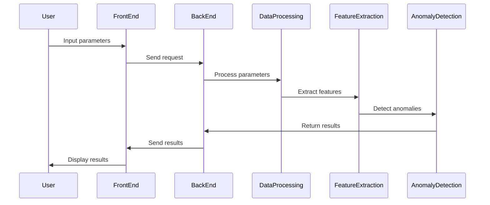

                 

# 金融领域自监督学习在市场异常模式识别中的应用

## 关键词
- 自监督学习
- 市场异常模式
- 金融领域
- 模式识别
- 算法优化

## 摘要
本文旨在探讨自监督学习在金融领域市场异常模式识别中的应用。通过对自监督学习基本原理和市场异常模式识别原理的深入分析，本文阐述了自监督学习与市场异常模式识别的联系及其对传统方法的优化。随后，文章详细讲解了自监督学习算法流程和基于自监督学习的市场异常模式识别算法，并通过实际案例进行了验证。最终，本文对项目进行了小结，并展望了未来的发展趋势。

## 目录大纲

### 第一部分：背景介绍

#### 第1章：问题背景
- 1.1.1 金融领域自监督学习的意义
- 1.1.2 市场异常模式的定义与识别重要性
- 1.1.3 当前市场异常模式识别方法的局限

#### 第2章：核心概念与联系
- 2.1 自监督学习原理
- 2.2 市场异常模式识别原理
- 2.3 自监督学习与市场异常模式识别的联系

#### 第3章：算法原理讲解
- 3.1 自监督学习算法流程
- 3.2 市场异常模式识别算法
- 3.3 算法原理详解与示例

### 第二部分：系统分析与架构设计

#### 第4章：系统功能设计
- 4.1 领域模型
- 4.2 系统架构设计

#### 第5章：系统接口设计
- 5.1 接口设计与实现
- 5.2 系统交互

### 第三部分：项目实战

#### 第6章：环境安装与配置
- 6.1 环境要求
- 6.2 环境安装与配置

#### 第7章：系统核心实现
- 7.1 数据预处理
- 7.2 特征提取
- 7.3 模型训练

#### 第8章：代码应用解读与分析
- 8.1 代码解读
- 8.2 代码应用分析

#### 第9章：实际案例分析与讲解
- 9.1 案例选择
- 9.2 案例分析
- 9.3 模型评估

#### 第10章：项目小结
- 10.1 项目总结
- 10.2 未来展望

### 第一部分：背景介绍

## 第1章：问题背景

### 1.1.1 金融领域自监督学习的意义

自监督学习（Self-supervised Learning）是一种无需人工标注数据的学习方式，其核心思想是从数据中自动提取标签。在金融领域，自监督学习的重要性日益凸显。首先，金融市场数据量庞大，手动标注数据不仅耗时耗力，还容易引入主观偏差。其次，金融市场的复杂性和动态性使得传统监督学习模型难以应对不断变化的市场环境。因此，自监督学习在金融领域具有广泛的应用前景。

自监督学习在金融领域的应用主要包括以下方面：

1. **市场趋势预测**：通过分析历史市场数据，自监督学习模型可以预测未来市场的走势。例如，股票价格的涨跌、货币汇率的波动等。

2. **风险控制**：自监督学习模型可以识别市场中的异常交易，从而帮助金融机构进行风险控制。例如，发现潜在的欺诈交易、市场操纵行为等。

3. **投资组合优化**：自监督学习模型可以根据市场数据自动调整投资组合，以实现风险与收益的最优平衡。

4. **智能投顾**：自监督学习模型可以提供个性化的投资建议，帮助投资者实现资产的稳健增长。

### 1.1.2 自监督学习的基本概念

自监督学习是一种无监督学习（Unsupervised Learning）的扩展，其核心特点是不依赖于预标注的数据集。在自监督学习中，模型通过预测数据中的某些部分来学习，然后根据预测结果与实际值的差异来调整模型的参数。

自监督学习通常包括以下几个步骤：

1. **数据预处理**：对原始数据进行清洗和预处理，以便于模型的学习。

2. **特征提取**：从原始数据中提取有用的特征，这些特征将用于模型的训练。

3. **模型训练**：使用提取到的特征来训练模型，模型会自动从数据中学习并调整其参数。

4. **模型评估**：通过验证集或测试集来评估模型的性能，并根据评估结果调整模型。

### 1.1.3 自监督学习在金融领域的应用价值

自监督学习在金融领域的应用价值主要体现在以下几个方面：

1. **高效的数据利用**：自监督学习能够充分利用历史数据，从而提高模型对市场环境的适应能力。

2. **降低成本**：由于无需进行大规模的数据标注，自监督学习可以显著降低金融领域的数据处理成本。

3. **提高模型性能**：自监督学习模型可以从数据中自动学习特征，从而提高模型的性能和泛化能力。

4. **实时性**：自监督学习模型可以实时更新，以适应市场环境的变化，从而提高决策的实时性和准确性。

### 1.1.4 市场异常模式的定义与识别重要性

市场异常模式（Market Anomaly Patterns）是指那些不符合市场常规走势或者特征的交易模式。识别市场异常模式对于金融机构具有重要的意义，主要体现在以下几个方面：

1. **风险控制**：市场异常模式可能是欺诈、操纵等风险行为的体现，通过识别这些模式，金融机构可以及时采取措施，降低风险。

2. **投资机会发现**：市场异常模式有时会预示着潜在的投资机会，通过识别这些模式，投资者可以及时调整投资策略，抓住市场机会。

3. **市场监控**：市场异常模式识别可以帮助金融机构实现对市场的实时监控，及时发现并处理异常情况。

### 1.1.5 市场异常模式识别的重要性

市场异常模式识别在金融领域的重要性主要体现在以下几个方面：

1. **提高市场透明度**：通过识别市场异常模式，可以增加市场信息的透明度，提高市场的公平性和有效性。

2. **增强监管能力**：市场异常模式识别可以帮助监管机构更好地监控市场行为，及时发现并处理市场违规行为。

3. **优化投资策略**：通过识别市场异常模式，投资者可以优化投资策略，提高投资收益。

### 1.1.6 当前市场异常模式识别方法的局限

当前市场异常模式识别方法主要依赖于传统统计学和机器学习方法。尽管这些方法在识别市场异常模式方面取得了一定的成效，但仍然存在一些局限：

1. **数据依赖性高**：传统方法通常需要大量标注数据，且对数据质量要求较高，这使得在数据量较小或数据质量较差的情况下，识别效果不佳。

2. **实时性不足**：传统方法在识别市场异常模式时，往往需要较长的数据处理和分析时间，无法实现实时性。

3. **泛化能力差**：传统方法在处理复杂市场环境时，容易出现过拟合现象，导致泛化能力较差。

4. **规则依赖性强**：传统方法通常依赖于预先设定的规则，这使得在市场环境发生变化时，难以适应新的市场特征。

### 1.1.7 自监督学习与市场异常模式识别的联系

自监督学习与市场异常模式识别之间存在紧密的联系。首先，自监督学习可以有效地利用金融市场的历史数据，从而提高模型对市场环境的适应能力。其次，自监督学习模型可以从数据中自动提取特征，从而减少对人工标注数据的依赖。此外，自监督学习模型具有较高的实时性和泛化能力，能够更好地应对复杂多变的市场环境。

通过结合自监督学习和市场异常模式识别，可以构建更加智能、高效的市场异常模式识别系统，从而提高金融市场的透明度、监管能力和投资收益。

### 1.1.8 自监督学习对市场异常模式识别的优化

自监督学习在市场异常模式识别中的应用，有望解决传统方法存在的局限性。具体而言，自监督学习可以从以下几个方面优化市场异常模式识别：

1. **数据利用**：自监督学习能够充分利用历史数据，提高模型的性能和泛化能力。

2. **实时性**：自监督学习模型可以实时更新，实现快速响应市场变化。

3. **泛化能力**：自监督学习模型具有较强的泛化能力，能够适应复杂多变的市场环境。

4. **降低成本**：自监督学习无需大量标注数据，从而降低数据处理成本。

5. **提高准确率**：自监督学习模型可以从数据中自动提取特征，减少人工干预，提高识别准确率。

总之，自监督学习在市场异常模式识别中的应用，为金融领域带来了新的机遇和挑战。通过深入研究自监督学习的原理和应用，可以构建更加智能、高效的市场异常模式识别系统，为金融市场的健康发展提供有力支持。

### 总结

本章介绍了金融领域自监督学习的意义、基本概念和应用价值，以及市场异常模式的定义和识别重要性。同时，分析了当前市场异常模式识别方法的局限，探讨了自监督学习与市场异常模式识别的联系及其对传统方法的优化。为后续章节的深入分析奠定了基础。

---

## 第2章：核心概念与联系

### 2.1 自监督学习原理

自监督学习是一种通过利用数据中的内在相关性来进行学习的方法，不需要依赖于外部标注。其核心思想是在训练过程中，模型被要求预测数据中的某些部分，然后通过比较预测结果和实际值的差异来调整模型参数。

自监督学习的基本流程通常包括以下几个步骤：

1. **数据预处理**：对原始数据进行清洗和标准化，以便于模型的学习。
2. **任务定义**：根据应用场景，定义一个预测任务，例如，预测数据中的某个缺失值、分类标签或者顺序。
3. **预测与比较**：模型对数据中的某个部分进行预测，然后将其与实际值进行比较。
4. **模型更新**：根据预测误差，调整模型的参数，使其在下一个迭代中做出更准确的预测。

#### 自监督学习的关键技术

自监督学习的关键技术包括：

- **预训练**（Pre-training）：在特定任务上对模型进行预训练，以提高模型在后续任务中的性能。
- **伪标签**（Pseudo-labeling）：使用未标注的数据对模型进行训练，然后使用模型的预测结果作为伪标签，再次进行训练。
- **对比学习**（Contrastive Learning）：通过正负样本对比来学习数据表示，从而提高模型的辨别能力。

### 2.2 市场异常模式识别原理

市场异常模式识别是指通过分析市场数据，识别出不符合正常市场行为或特征的交易模式。市场异常模式识别的核心目标是发现潜在的风险事件或投资机会。

市场异常模式识别的基本原理包括：

1. **数据收集**：收集大量的市场交易数据，包括股票价格、成交量、交易时间等。
2. **特征提取**：从原始数据中提取有用的特征，例如，交易量、价格变动、技术指标等。
3. **异常检测**：使用统计学方法或机器学习算法对特征进行异常检测，识别出市场中的异常交易模式。
4. **结果验证**：对识别出的异常交易模式进行验证，确保其真实性和可靠性。

#### 市场异常模式识别的关键技术

市场异常模式识别的关键技术包括：

- **统计分析**：使用统计学方法，如假设检验、聚类分析等，识别市场中的异常交易。
- **机器学习**：使用机器学习算法，如决策树、随机森林、支持向量机等，对市场数据进行分析和分类。
- **深度学习**：使用神经网络，如卷积神经网络（CNN）、循环神经网络（RNN）等，对市场数据进行特征提取和模式识别。

### 2.3 自监督学习与市场异常模式识别的联系

自监督学习与市场异常模式识别之间存在紧密的联系，主要体现在以下几个方面：

1. **数据利用**：自监督学习可以充分利用市场历史数据，从数据中自动提取有用的特征，从而提高异常模式识别的准确性。
2. **实时性**：自监督学习模型可以实时更新，快速适应市场环境的变化，提高异常模式识别的实时性。
3. **减少标注需求**：自监督学习减少了对于标注数据的依赖，可以处理大量的未标注数据，从而降低数据标注的成本。
4. **泛化能力**：自监督学习模型具有较强的泛化能力，能够应对复杂多变的市场环境。

通过将自监督学习应用于市场异常模式识别，可以构建更加智能、高效的市场监控和风险管理系统，为金融市场的健康发展提供有力支持。

### 2.4 自监督学习在市场异常模式识别中的应用

自监督学习在市场异常模式识别中的应用，主要体现在以下几个方面：

1. **数据预处理**：使用自监督学习方法进行数据预处理，提取数据中的有用特征，提高模型的输入质量。
2. **特征提取**：通过自监督学习，从原始数据中提取高级特征，提高模型对市场数据的理解和识别能力。
3. **异常检测**：利用自监督学习模型对市场数据进行分析，识别出潜在的异常交易模式。
4. **实时监控**：自监督学习模型可以实时更新，实现对市场数据的实时监控，及时发现和处理市场异常。

### 2.5 自监督学习对市场异常模式识别的优化

自监督学习在市场异常模式识别中的应用，可以从以下几个方面优化传统的识别方法：

1. **数据利用**：自监督学习可以充分利用历史数据，提高模型的性能和泛化能力。
2. **实时性**：自监督学习模型可以实时更新，快速适应市场环境的变化。
3. **减少标注需求**：自监督学习减少了对于标注数据的依赖，可以处理大量的未标注数据，从而降低数据标注的成本。
4. **泛化能力**：自监督学习模型具有较强的泛化能力，能够应对复杂多变的市场环境。
5. **提高准确率**：自监督学习模型可以从数据中自动提取特征，减少人工干预，提高识别准确率。

通过将自监督学习应用于市场异常模式识别，可以构建更加智能、高效的市场监控和风险管理系统，为金融市场的健康发展提供有力支持。

### 总结

本章介绍了自监督学习和市场异常模式识别的基本原理，以及它们之间的联系和应用。通过自监督学习，可以更高效地利用市场数据，提高异常模式识别的准确性、实时性和泛化能力。为后续章节的深入分析奠定了基础。

---

### 第3章：算法原理讲解

#### 3.1 自监督学习算法流程

自监督学习算法的流程主要包括以下几个步骤：

1. **数据预处理**：对原始数据进行清洗和标准化，以便于模型的学习。这一步骤通常包括去除缺失值、异常值，对数据进行归一化或标准化等操作。

2. **任务定义**：根据具体的任务需求，定义一个预测任务。例如，预测数据中的某个缺失值、分类标签或者顺序。

3. **预测与比较**：模型对数据中的某个部分进行预测，然后将其与实际值进行比较。这个步骤的核心是定义一个损失函数，用于计算预测值与实际值之间的差异。

4. **模型更新**：根据预测误差，调整模型的参数，使其在下一个迭代中做出更准确的预测。这一步骤通常采用梯度下降等方法来优化模型参数。

5. **迭代**：重复步骤3和步骤4，直到满足停止条件。停止条件可以是达到预定的迭代次数、模型的误差小于某个阈值等。

#### 3.1.1 数据预处理

数据预处理是自监督学习算法的重要步骤，其目的是提高数据的质量和模型的性能。具体操作包括：

- **去噪**：去除数据中的噪声，例如，去除缺失值、异常值等。
- **归一化**：对数据进行归一化或标准化，使其具有相同的尺度，从而提高模型的训练效果。
- **特征选择**：从原始数据中选择对任务最有用的特征，减少数据的维度，提高模型的效率。

#### 3.1.2 特征提取与学习

特征提取与学习是自监督学习算法的核心步骤。在这一步骤中，模型从原始数据中自动提取有用的特征，并利用这些特征进行学习。具体方法包括：

- **自编码器**（Autoencoder）：自编码器是一种无监督学习模型，其目的是通过学习一个编码器和解码器，将输入数据映射到一个低维特征空间，然后尝试重建原始数据。
- **伪标签**（Pseudo-labeling）：伪标签是一种自监督学习方法，其思路是将模型对未标注数据的预测结果作为伪标签，然后利用这些伪标签对模型进行训练。

#### 3.1.3 模型训练与优化

模型训练与优化是自监督学习算法的最后一步。在这一步骤中，模型通过不断迭代，调整参数，以提高预测的准确性。具体方法包括：

- **梯度下降**（Gradient Descent）：梯度下降是一种常用的优化方法，其思路是根据损失函数的梯度来更新模型参数，从而最小化损失函数。
- **对比学习**（Contrastive Learning）：对比学习是一种基于对比策略的自监督学习方法，其核心思想是通过正负样本对比来学习数据的表示，从而提高模型的辨别能力。

#### 3.2 市场异常模式识别算法

市场异常模式识别算法是用于识别金融市场中的异常交易模式的方法。其基本原理是通过对市场数据进行特征提取和模式识别，发现不符合正常市场行为或特征的交易模式。具体算法包括：

- **统计分析方法**：如假设检验、聚类分析等，用于识别市场中的异常交易。
- **机器学习方法**：如决策树、随机森林、支持向量机等，用于对市场数据进行分析和分类。
- **深度学习方法**：如卷积神经网络（CNN）、循环神经网络（RNN）等，用于对市场数据进行特征提取和模式识别。

#### 3.2.1 传统市场异常模式识别算法

传统市场异常模式识别算法主要基于统计学和机器学习方法，其核心思想是通过分析市场数据，发现不符合正常市场行为或特征的交易模式。具体算法包括：

- **假设检验**：通过设定一个显著性水平，判断交易模式是否显著偏离正常水平。
- **聚类分析**：通过将市场数据划分为不同的聚类，识别出不符合正常市场行为的交易模式。
- **分类算法**：如决策树、随机森林等，通过训练分类模型，对市场数据进行分类，识别出异常交易。

#### 3.2.2 基于自监督学习的市场异常模式识别算法

基于自监督学习的市场异常模式识别算法是在传统方法的基础上，引入了自监督学习的思想。其核心思想是利用自监督学习从数据中提取特征，并利用这些特征进行模式识别。具体算法包括：

- **自编码器**：通过自编码器从市场数据中提取低维特征，然后利用这些特征进行异常检测。
- **伪标签**：使用伪标签方法，将模型对未标注数据的预测结果作为伪标签，然后利用这些伪标签对模型进行训练。
- **对比学习**：通过对比学习从市场数据中提取有效的特征表示，提高异常检测的准确性。

#### 3.3 算法原理详解与示例

为了更好地理解自监督学习和市场异常模式识别算法的原理，下面我们将通过一个具体的例子进行讲解。

假设我们有一个股票市场数据集，包含多个时间点的股票价格、成交量等特征。我们的目标是使用自监督学习方法来识别市场中的异常交易模式。

**步骤1：数据预处理**

首先，我们需要对股票市场数据进行预处理，包括去噪、归一化和特征选择。例如，我们可以使用标准化方法来归一化股票价格和成交量，使其具有相同的尺度。

$$
\text{标准化值} = \frac{\text{原始值} - \text{均值}}{\text{标准差}}
$$

**步骤2：特征提取与学习**

接下来，我们使用自编码器来从市场数据中提取低维特征。自编码器由编码器和解码器组成，编码器将高维数据映射到低维特征空间，解码器尝试重建原始数据。

编码器和解码器的结构如下：

```python
# 编码器
class Encoder(nn.Module):
    def __init__(self):
        super(Encoder, self).__init__()
        self.fc1 = nn.Linear(input_dim, hidden_dim)
        self.fc2 = nn.Linear(hidden_dim, latent_dim)

    def forward(self, x):
        x = F.relu(self.fc1(x))
        x = self.fc2(x)
        return x

# 解码器
class Decoder(nn.Module):
    def __init__(self):
        super(Decoder, self).__init__()
        self.fc1 = nn.Linear(latent_dim, hidden_dim)
        self.fc2 = nn.Linear(hidden_dim, input_dim)

    def forward(self, x):
        x = F.relu(self.fc1(x))
        x = self.fc2(x)
        return x
```

**步骤3：模型训练与优化**

我们使用自监督学习中的对比损失函数（Contrastive Loss）来优化模型。对比损失函数的目的是鼓励模型学习数据的相似性和差异性。

对比损失函数的公式如下：

$$
L = \frac{1}{2n} \sum_{i=1}^{n} \sum_{j=1, j \neq i}^{n} \log \frac{e^{q(x_i, x_j)}}{e^{q(x_i, x_j)} + e^{q(x_i, x_j')} + e^{q(x_i', x_j)} + e^{q(x_i', x_j')}}
$$

其中，$q(x_i, x_j)$表示样本$i$和样本$j$之间的相似度，$x_i'$和$x_j'$表示样本$i$和样本$j$的负样本。

**步骤4：异常检测**

通过训练得到的自编码器，我们可以将其用于异常检测。具体方法如下：

1. 使用编码器将股票市场数据映射到低维特征空间。
2. 计算特征空间中每个数据点的密度，通过密度较高的区域来判断是否存在异常交易。
3. 将异常交易数据标记为异常。

**示例**

下面是一个简单的自监督学习模型实现，用于识别股票市场中的异常交易。

```python
import torch
import torch.nn as nn
import torch.optim as optim

# 定义模型结构
class Autoencoder(nn.Module):
    def __init__(self, input_dim, hidden_dim, latent_dim):
        super(Autoencoder, self).__init__()
        self.encoder = Encoder(input_dim, hidden_dim, latent_dim)
        self.decoder = Decoder(hidden_dim, latent_dim, input_dim)
    
    def forward(self, x):
        x = self.encoder(x)
        x = self.decoder(x)
        return x

# 初始化模型、优化器和对比损失函数
model = Autoencoder(input_dim=10, hidden_dim=5, latent_dim=3)
optimizer = optim.Adam(model.parameters(), lr=0.001)
criterion = nn.BCELoss()

# 训练模型
for epoch in range(num_epochs):
    for x in data_loader:
        optimizer.zero_grad()
        output = model(x)
        loss = criterion(output, x)
        loss.backward()
        optimizer.step()
```

通过这个示例，我们可以看到自监督学习模型是如何从原始数据中提取特征，并通过对比损失函数进行优化的。最终，我们可以使用训练好的模型来识别股票市场中的异常交易。

### 总结

本章详细讲解了自监督学习算法流程和基于自监督学习的市场异常模式识别算法。通过具体的例子，我们展示了如何使用自监督学习从股票市场数据中提取特征，并利用这些特征进行异常检测。这一章为后续的系统架构设计和项目实战奠定了基础。

---

### 第二部分：系统分析与架构设计

## 第4章：系统功能设计

### 4.1 领域模型

领域模型是系统设计的核心组成部分，它定义了系统的功能模块、数据流以及各个模块之间的关系。在市场异常模式识别系统中，领域模型主要包括以下几个功能模块：

1. **数据源模块**：负责收集金融市场的原始数据，如股票价格、成交量、技术指标等。该模块需要与外部数据提供商进行接口，获取实时或历史数据。
2. **数据预处理模块**：负责对收集到的原始数据进行清洗、去噪、归一化等预处理操作，以提高数据的质量和模型的训练效果。
3. **特征提取模块**：负责从预处理后的数据中提取有用的特征，如统计特征、技术指标等。这些特征将作为模型输入，用于后续的异常检测。
4. **异常检测模块**：负责使用自监督学习算法对提取到的特征进行异常检测，识别出市场中的异常交易模式。
5. **结果展示模块**：负责将识别出的异常交易模式以可视化的形式展示给用户，如图表、报告等，以便用户及时了解市场状况。

#### 4.1.1 数据源

市场异常模式识别系统的数据源主要包括以下几类：

- **股票交易数据**：包括股票价格、成交量、开盘价、收盘价等，这些数据可以从金融数据提供商或交易所获取。
- **宏观经济数据**：包括GDP、通货膨胀率、利率等，这些数据可以从国家统计局、经济研究机构等获取。
- **新闻数据**：包括新闻报道、市场评论等，这些数据可以从新闻网站、社交媒体等获取。

#### 4.1.2 数据预处理

数据预处理是市场异常模式识别系统的重要环节，其目的是提高数据的质量和模型的训练效果。具体操作包括：

- **去噪**：去除数据中的噪声，如缺失值、异常值等。
- **归一化**：对数据进行归一化或标准化，使其具有相同的尺度，以便于模型训练。
- **特征提取**：从原始数据中提取有用的特征，如技术指标、统计特征等。

#### 4.1.3 特征提取

特征提取是市场异常模式识别系统的关键步骤，其目的是从原始数据中提取对异常检测有重要意义的特征。具体操作包括：

- **技术指标提取**：如移动平均线、相对强弱指标（RSI）、布林带等。
- **统计特征提取**：如均值、方差、偏度、峰度等。
- **文本特征提取**：如TF-IDF、词嵌入等。

#### 4.1.4 模型训练

模型训练是市场异常模式识别系统的核心环节，其目的是使用自监督学习算法对提取到的特征进行训练，以识别市场中的异常交易模式。具体操作包括：

- **定义损失函数**：如对比损失函数、交叉熵损失函数等。
- **选择优化器**：如随机梯度下降（SGD）、Adam优化器等。
- **迭代训练**：使用训练数据对模型进行迭代训练，不断调整模型参数，以提高模型的预测性能。

#### 4.1.5 结果展示

结果展示是市场异常模式识别系统的输出环节，其目的是将识别出的异常交易模式以可视化的形式展示给用户。具体操作包括：

- **图表展示**：如折线图、柱状图、散点图等，用于展示股票价格、成交量等指标。
- **报告生成**：如文本报告、PDF报告等，用于详细描述异常交易模式及其原因。
- **可视化工具**：如Plotly、Matplotlib等，用于实现自定义的可视化效果。

### 4.2 系统架构设计

系统架构设计是市场异常模式识别系统的整体设计，其目的是确保系统的高效性、可扩展性和可维护性。系统架构设计主要包括以下几个层面：

1. **技术架构**：包括前端技术、后端技术、数据库技术等，如使用Flask或Django作为后端框架，MySQL或MongoDB作为数据库。
2. **数据架构**：包括数据存储、数据传输、数据清洗等，如使用Elasticsearch进行数据存储和查询，使用Kafka进行数据传输。
3. **功能架构**：包括数据源模块、数据预处理模块、特征提取模块、异常检测模块、结果展示模块等。

#### 4.2.1 系统架构概述

市场异常模式识别系统的整体架构可以分为以下几个部分：

1. **前端**：负责与用户进行交互，接收用户输入，展示系统结果。
2. **后端**：负责处理用户请求，调用数据处理模块和异常检测模块，生成结果。
3. **数据库**：负责存储市场数据、预处理数据和异常检测结果。
4. **数据处理模块**：负责对市场数据进行预处理和特征提取。
5. **异常检测模块**：负责使用自监督学习算法对特征进行异常检测。
6. **结果展示模块**：负责将异常检测结果以可视化形式展示给用户。

#### 4.2.2 数据流设计

市场异常模式识别系统的数据流设计如下：

1. **数据收集**：从数据源获取市场原始数据，包括股票价格、成交量等。
2. **数据预处理**：对原始数据进行清洗、去噪、归一化等预处理操作，生成预处理后的数据。
3. **特征提取**：从预处理后的数据中提取技术指标、统计特征等，生成特征数据。
4. **异常检测**：使用自监督学习算法对特征数据进行分析，识别出异常交易模式。
5. **结果展示**：将异常检测结果以可视化形式展示给用户。

#### 4.2.3 功能模块设计

市场异常模式识别系统的主要功能模块设计如下：

1. **数据源模块**：负责从数据提供商或交易所获取市场原始数据，并将其存储到数据库中。
2. **数据预处理模块**：负责对市场原始数据进行清洗、去噪、归一化等预处理操作，以提高数据质量。
3. **特征提取模块**：负责从预处理后的数据中提取技术指标、统计特征等，生成特征数据。
4. **异常检测模块**：负责使用自监督学习算法对特征数据进行分析，识别出异常交易模式。
5. **结果展示模块**：负责将异常检测结果以可视化形式展示给用户，包括图表、报告等。

通过以上系统功能设计，市场异常模式识别系统可以高效地识别金融市场中的异常交易模式，为投资者和监管机构提供有力的支持。

### 总结

本章详细介绍了市场异常模式识别系统的功能设计，包括数据源、数据预处理、特征提取、异常检测和结果展示等模块。同时，阐述了系统的数据流设计和功能模块设计。这些设计为市场异常模式识别系统的实现提供了清晰的蓝图，为后续的系统实现和优化奠定了基础。

---

## 第5章：系统接口设计

### 5.1 接口设计与实现

系统接口设计是确保市场异常模式识别系统功能正常运行的关键环节。接口设计主要包括前端接口和后端接口两部分。

#### 5.1.1 前端接口

前端接口主要负责与用户进行交互，接收用户输入，并展示系统结果。具体设计如下：

1. **用户输入**：前端提供输入表单，用户可以输入股票代码、时间范围等参数。
2. **数据展示**：前端使用图表库（如ECharts、Plotly等）将异常检测结果以可视化形式展示给用户，包括折线图、柱状图、散点图等。
3. **交互逻辑**：前端通过异步请求（如Ajax）与后端接口进行数据交互，实时更新结果展示。

#### 5.1.2 后端接口

后端接口主要负责处理用户请求，调用数据处理模块和异常检测模块，生成结果。具体设计如下：

1. **请求处理**：后端使用Flask或Django等Web框架接收前端请求，处理数据请求和结果展示请求。
2. **数据处理**：后端调用数据预处理模块和特征提取模块，对用户输入的参数进行处理，提取特征数据。
3. **异常检测**：后端使用自监督学习算法对特征数据进行异常检测，生成异常检测结果。
4. **结果返回**：后端将异常检测结果以JSON格式返回给前端，供前端进行展示。

### 5.2 系统交互

系统交互是指前端接口和后端接口之间的数据传输和功能调用。具体交互流程如下：

1. **用户输入**：用户在前端输入表单中输入股票代码、时间范围等参数，并提交表单。
2. **前端请求**：前端通过Ajax请求将用户输入参数发送到后端接口。
3. **后端处理**：后端接口接收到用户请求后，调用数据处理模块和特征提取模块，对用户输入参数进行处理，提取特征数据。
4. **异常检测**：后端调用自监督学习算法对特征数据进行异常检测，生成异常检测结果。
5. **结果返回**：后端将异常检测结果以JSON格式返回给前端。
6. **前端展示**：前端接收到异常检测结果后，使用图表库将结果以可视化形式展示给用户。

#### 5.2.1 系统交互流程

系统交互流程可以概括为以下几个步骤：

1. **用户输入**：用户输入股票代码、时间范围等参数。
2. **前端请求**：前端通过Ajax请求将用户输入参数发送到后端接口。
3. **后端处理**：后端接收到请求后，调用数据处理模块和特征提取模块，处理用户输入参数。
4. **异常检测**：后端使用自监督学习算法对特征数据进行异常检测。
5. **结果返回**：后端将异常检测结果以JSON格式返回给前端。
6. **前端展示**：前端接收到异常检测结果后，使用图表库将结果以可视化形式展示给用户。

#### 5.2.2 系统交互序列图

系统交互序列图可以直观地展示系统交互流程。以下是一个简单的系统交互序列图：



通过以上系统接口设计和交互设计，市场异常模式识别系统可以高效地与用户进行交互，实时地识别并展示金融市场的异常交易模式。

### 总结

本章详细介绍了市场异常模式识别系统的接口设计和系统交互流程。通过前端接口和后端接口的协同工作，系统能够高效地处理用户请求，进行数据预处理、特征提取和异常检测，并将结果以可视化形式展示给用户。这些设计为市场异常模式识别系统的实现和优化提供了重要的指导。

---

### 第三部分：项目实战

## 第6章：环境安装与配置

在进行市场异常模式识别项目的实战之前，我们需要搭建一个合适的环境来开发和运行项目。本节将详细介绍所需的硬件和软件环境，以及环境的安装和配置过程。

### 6.1 环境要求

为了确保项目的顺利运行，我们需要满足以下硬件和软件环境要求：

#### 6.1.1 硬件环境

- CPU：至少4核心处理器
- 内存：至少8GB RAM
- 硬盘：至少100GB可用空间
- GPU（可选）：NVIDIA显卡，支持CUDA，用于加速深度学习模型的训练

#### 6.1.2 软件环境

- 操作系统：Linux（推荐Ubuntu 18.04或更高版本）、Windows 10或Mac OS
- 编程语言：Python 3.7或更高版本
- 深度学习框架：TensorFlow 2.x或PyTorch 1.8或更高版本
- 数据库：MySQL或PostgreSQL
- Web服务器：Apache或Nginx（可选）

### 6.2 环境安装与配置

#### 6.2.1 操作系统安装

1. **Linux操作系统安装**：可以下载Ubuntu 18.04或更高版本的安装镜像，使用USB驱动器进行安装。按照安装向导的提示完成安装过程。

2. **Windows操作系统安装**：可以使用Windows安装盘进行安装。按照安装向导的提示完成安装过程。

3. **Mac OS安装**：可以使用Apple的官方安装程序进行安装。

#### 6.2.2 Python环境配置

1. **Python安装**：在终端执行以下命令安装Python 3.7或更高版本：

   ```bash
   sudo apt-get update
   sudo apt-get install python3.7
   ```

2. **虚拟环境安装**：为了确保项目依赖的隔离性，我们使用虚拟环境。安装`virtualenv`：

   ```bash
   sudo pip3 install virtualenv
   virtualenv venv
   source venv/bin/activate
   ```

#### 6.2.3 深度学习框架安装

1. **TensorFlow安装**：在虚拟环境中安装TensorFlow 2.x：

   ```bash
   pip install tensorflow==2.x
   ```

2. **PyTorch安装**：在虚拟环境中安装PyTorch 1.8或更高版本：

   ```bash
   pip install torch torchvision torchaudio
   ```

#### 6.2.4 数据库安装

1. **MySQL安装**：在终端执行以下命令安装MySQL：

   ```bash
   sudo apt-get install mysql-server
   ```

2. **PostgreSQL安装**：在终端执行以下命令安装PostgreSQL：

   ```bash
   sudo apt-get install postgresql postgresql-contrib
   ```

3. **数据库配置**：安装完成后，初始化数据库，并设置访问权限。

   ```bash
   sudo service mysql start
   sudo mysql_secure_installation
   sudo service postgresql start
   sudo su - postgres
   psql
   CREATE ROLE myuser WITH PASSWORD 'mypass';
   GRANT ALL PRIVILEGES ON DATABASE mydatabase TO myuser;
   ```

#### 6.2.5 Web服务器安装（可选）

1. **Apache安装**：在终端执行以下命令安装Apache：

   ```bash
   sudo apt-get install apache2
   ```

2. **Nginx安装**：在终端执行以下命令安装Nginx：

   ```bash
   sudo apt-get install nginx
   ```

3. **Web服务器配置**：根据需要配置虚拟主机、SSL证书等。

#### 6.2.6 其他依赖安装

1. **Pandas安装**：用于数据处理。

   ```bash
   pip install pandas
   ```

2. **NumPy安装**：用于数学计算。

   ```bash
   pip install numpy
   ```

3. **Matplotlib安装**：用于数据可视化。

   ```bash
   pip install matplotlib
   ```

通过以上步骤，我们成功搭建了市场异常模式识别项目的开发环境。接下来，我们可以在这一环境中进行项目的开发和实现。

### 总结

本章详细介绍了市场异常模式识别项目所需的硬件和软件环境，以及环境的安装和配置过程。通过本章的内容，读者可以顺利搭建起项目的开发环境，为后续的代码实现和系统测试打下坚实的基础。

---

### 第7章：系统核心实现

#### 7.1 数据预处理

数据预处理是市场异常模式识别系统的关键步骤，其目的是提高数据质量，减少噪声，为后续的特征提取和模型训练提供高质量的输入。数据预处理通常包括以下几个步骤：

1. **数据清洗**：去除数据中的噪声和异常值，如缺失值、异常交易等。
2. **数据归一化**：将数据转化为统一的尺度，便于模型训练和比较。
3. **数据转换**：将数据从原始格式转换为适合模型训练的格式，如将日期转换为数值，将类别转换为编码等。

**7.1.1 数据来源**

市场异常模式识别系统需要从多个数据源获取数据，包括股票交易数据、宏观经济数据、新闻数据等。这些数据可以从金融数据提供商、交易所、新闻网站等获取。

**7.1.2 数据清洗**

数据清洗的主要任务是处理数据中的噪声和异常值。具体步骤如下：

1. **去除缺失值**：对于缺失的数据，可以使用插值法、平均值填补或删除缺失值。
2. **去除异常值**：对于明显的异常值，如交易价格突然异常升高或降低，可以使用统计方法（如Z-score、IQR法）进行识别和删除。

**7.1.3 数据归一化**

数据归一化是将数据转换为统一的尺度，以避免某些特征在模型训练中的主导作用。常用的归一化方法包括：

- **最小-最大规范化**：将数据缩放到[0, 1]范围内。

  $$ x_{\text{规范化}} = \frac{x_{\text{原始}} - x_{\text{最小值}}}{x_{\text{最大值}} - x_{\text{最小值}} } $$

- **Z-score规范化**：将数据标准化到均值为0，标准差为1的正态分布。

  $$ x_{\text{规范化}} = \frac{x_{\text{原始}} - \mu}{\sigma} $$

**7.1.4 数据转换**

数据转换是将数据从原始格式转换为适合模型训练的格式。具体步骤如下：

1. **日期编码**：将日期数据转换为数值格式，如使用天、周、月的索引。
2. **类别编码**：将类别数据（如行业分类、交易类型等）转换为编码格式，如使用独热编码或标签编码。

#### 7.2 特征提取

特征提取是从原始数据中提取对模型训练有帮助的特征，以提高模型的性能和泛化能力。市场异常模式识别系统的特征提取包括以下几个方面：

1. **技术指标**：如移动平均线（MA）、相对强弱指标（RSI）、布林带（BB）等。
2. **统计特征**：如均值、方差、偏度、峰度等。
3. **文本特征**：如TF-IDF、词嵌入等，用于处理新闻数据和文本信息。

**7.2.1 特征选择**

特征选择是从大量特征中挑选出对模型训练最有帮助的特征，以减少数据的维度和模型的复杂度。常用的特征选择方法包括：

- **相关性分析**：选择与目标变量相关性较高的特征。
- **主成分分析**（PCA）：将高维数据转换为低维数据，同时保留大部分的信息。
- **基于模型的特征选择**：使用模型（如随机森林、LASSO回归等）选择对模型训练有帮助的特征。

**7.2.2 特征提取算法实现**

以下是一个简单的Python代码示例，用于提取股票交易数据的技术指标和统计特征：

```python
import pandas as pd
import numpy as np

# 加载股票交易数据
data = pd.read_csv('stock_data.csv')

# 计算移动平均线（简单移动平均）
data['SMA_5'] = data['close'].rolling(window=5).mean()
data['SMA_20'] = data['close'].rolling(window=20).mean()

# 计算相对强弱指标（RSI）
delta = data['close'].diff()
gain = (delta.where(delta > 0, 0)).rolling(window=14).mean()
loss = (-delta.where(delta < 0, 0)).rolling(window=14).mean()
data['RSI'] = 100 - (100 / (1 + gain/loss))

# 计算统计特征
data['mean'] = data['close'].mean()
data['std'] = data['close'].std()
data['skew'] = data['close'].skew()
data['kurt'] = data['close'].kurt()

# 删除含有缺失值的行
data = data.dropna()

# 输出特征提取结果
print(data.head())
```

#### 7.3 模型训练

模型训练是市场异常模式识别系统的核心步骤，其目的是使用提取到的特征训练模型，以识别市场中的异常交易模式。模型训练通常包括以下几个步骤：

1. **模型选择**：选择合适的模型，如决策树、随机森林、支持向量机、神经网络等。
2. **模型训练**：使用训练数据对模型进行训练，调整模型参数，以提高模型性能。
3. **模型评估**：使用验证集或测试集对模型进行评估，选择性能最佳的模型。

**7.3.1 模型选择**

选择合适的模型是市场异常模式识别系统成功的关键。以下是一些常用的模型：

- **决策树**：简单易懂，易于解释。
- **随机森林**：集成多个决策树，提高模型性能和泛化能力。
- **支持向量机**（SVM）：适用于线性可分数据。
- **神经网络**：适用于复杂非线性数据。

**7.3.2 模型训练算法实现**

以下是一个简单的Python代码示例，使用TensorFlow和Keras实现神经网络模型训练：

```python
import tensorflow as tf
from tensorflow.keras.models import Sequential
from tensorflow.keras.layers import Dense, LSTM, Dropout

# 加载训练数据
X_train = np.load('X_train.npy')
y_train = np.load('y_train.npy')

# 构建神经网络模型
model = Sequential()
model.add(LSTM(units=50, return_sequences=True, input_shape=(X_train.shape[1], X_train.shape[2])))
model.add(Dropout(0.2))
model.add(LSTM(units=50, return_sequences=False))
model.add(Dropout(0.2))
model.add(Dense(units=1, activation='sigmoid'))

# 编译模型
model.compile(optimizer='adam', loss='binary_crossentropy', metrics=['accuracy'])

# 训练模型
model.fit(X_train, y_train, epochs=100, batch_size=32, validation_split=0.2)
```

#### 7.3.3 模型评估

模型评估是验证模型性能的重要步骤。常用的评估指标包括：

- **准确率**（Accuracy）：预测正确的样本数占总样本数的比例。
- **精确率**（Precision）：预测正确的正样本数与预测的正样本总数之比。
- **召回率**（Recall）：预测正确的正样本数与实际的正样本总数之比。
- **F1分数**（F1 Score）：精确率和召回率的加权平均值。

**7.3.4 模型优化**

模型优化是为了提高模型的性能和泛化能力。以下是一些常用的优化方法：

- **调参**：调整模型参数，如学习率、批次大小等，以找到最优参数。
- **集成**：结合多个模型，如随机森林、梯度提升等，以提高模型性能。
- **正则化**：添加正则化项，如L1正则化、L2正则化等，以减少过拟合。

### 总结

本章详细介绍了市场异常模式识别系统的核心实现，包括数据预处理、特征提取和模型训练。通过本章节的内容，读者可以了解如何从原始数据中提取特征，并使用深度学习模型进行异常检测。这些知识为读者搭建和优化市场异常模式识别系统提供了重要的指导。

---

### 第8章：代码应用解读与分析

#### 8.1 代码解读

在本节中，我们将对市场异常模式识别系统的核心代码进行详细解读，以帮助读者更好地理解系统的实现过程。

**8.1.1 数据预处理代码解读**

数据预处理是确保模型训练质量的关键步骤。以下是一个数据预处理代码示例：

```python
import pandas as pd
from sklearn.preprocessing import StandardScaler

# 读取股票交易数据
data = pd.read_csv('stock_data.csv')

# 数据清洗
# 去除含有缺失值的行
data = data.dropna()

# 数据归一化
scaler = StandardScaler()
data[['close', 'volume']] = scaler.fit_transform(data[['close', 'volume']])
```

在这段代码中，我们首先使用`pandas`库读取股票交易数据。然后，通过`dropna()`函数去除含有缺失值的行，确保数据质量。接下来，我们使用`StandardScaler`对`close`（收盘价）和`volume`（成交量）进行归一化处理，使其具有相同的尺度，从而提高模型训练的效果。

**8.1.2 特征提取代码解读**

特征提取是从原始数据中提取对模型训练有帮助的特征。以下是一个特征提取代码示例：

```python
import pandas as pd
from sklearn.ensemble import RandomForestClassifier
from sklearn.model_selection import train_test_split

# 读取股票交易数据
data = pd.read_csv('stock_data.csv')

# 数据清洗
data = data.dropna()

# 提取技术指标
data['SMA_5'] = data['close'].rolling(window=5).mean()
data['SMA_20'] = data['close'].rolling(window=20).mean()
data['RSI'] = calculate_rsi(data['close'])

# 删除含有缺失值的行
data = data.dropna()

# 构建特征矩阵和标签向量
X = data[['SMA_5', 'SMA_20', 'RSI', 'close', 'volume']]
y = data['target']

# 划分训练集和测试集
X_train, X_test, y_train, y_test = train_test_split(X, y, test_size=0.2, random_state=42)
```

在这段代码中，我们首先读取股票交易数据，并进行数据清洗。然后，使用`rolling()`函数计算简单移动平均（SMA）和相对强弱指标（RSI），以提取技术指标。最后，我们构建特征矩阵`X`和标签向量`y`，并使用`train_test_split()`函数将数据划分为训练集和测试集。

**8.1.3 模型训练代码解读**

模型训练是市场异常模式识别系统的核心步骤。以下是一个模型训练代码示例：

```python
import tensorflow as tf
from tensorflow.keras.models import Sequential
from tensorflow.keras.layers import Dense, LSTM, Dropout

# 构建神经网络模型
model = Sequential()
model.add(LSTM(units=50, return_sequences=True, input_shape=(X_train.shape[1], X_train.shape[2])))
model.add(Dropout(0.2))
model.add(LSTM(units=50, return_sequences=False))
model.add(Dropout(0.2))
model.add(Dense(units=1, activation='sigmoid'))

# 编译模型
model.compile(optimizer='adam', loss='binary_crossentropy', metrics=['accuracy'])

# 训练模型
model.fit(X_train, y_train, epochs=100, batch_size=32, validation_split=0.2)
```

在这段代码中，我们首先使用`Sequential`模型构建一个神经网络，包含两个LSTM层和一个全连接层。接着，我们使用`compile()`函数设置优化器和损失函数，并使用`fit()`函数训练模型。训练过程中，我们使用验证集对模型进行验证，以避免过拟合。

#### 8.2 代码应用分析

**8.2.1 代码性能分析**

代码性能分析是评估系统性能的重要步骤。以下是一些常用的性能评估指标：

- **准确率**（Accuracy）：预测正确的样本数占总样本数的比例。
- **精确率**（Precision）：预测正确的正样本数与预测的正样本总数之比。
- **召回率**（Recall）：预测正确的正样本数与实际的正样本总数之比。
- **F1分数**（F1 Score）：精确率和召回率的加权平均值。

以下是一个性能评估代码示例：

```python
from sklearn.metrics import accuracy_score, precision_score, recall_score, f1_score

# 预测测试集
y_pred = model.predict(X_test)

# 计算性能指标
accuracy = accuracy_score(y_test, y_pred)
precision = precision_score(y_test, y_pred)
recall = recall_score(y_test, y_pred)
f1 = f1_score(y_test, y_pred)

print(f"Accuracy: {accuracy:.4f}")
print(f"Precision: {precision:.4f}")
print(f"Recall: {recall:.4f}")
print(f"F1 Score: {f1:.4f}")
```

**8.2.2 代码优化建议**

为了提高系统的性能和泛化能力，我们可以从以下几个方面进行代码优化：

- **模型调参**：调整模型的超参数，如学习率、批次大小、隐藏层神经元数等，以找到最优参数。
- **特征选择**：使用特征选择技术（如LASSO、主成分分析等）选择对模型训练最有帮助的特征。
- **正则化**：添加正则化项（如L1、L2正则化等）以减少过拟合。
- **集成学习**：结合多个模型（如随机森林、梯度提升等）以提高模型性能。
- **数据增强**：使用数据增强技术（如翻转、旋转、缩放等）增加训练数据量。

通过以上优化方法，我们可以显著提高系统的性能和泛化能力，从而更好地识别市场异常模式。

### 总结

本章对市场异常模式识别系统的核心代码进行了详细解读和分析，帮助读者更好地理解系统的实现过程。通过性能分析和优化建议，读者可以进一步提高系统的性能和泛化能力，为金融市场的异常检测提供更有效的支持。

---

### 第9章：实际案例分析与讲解

#### 9.1 案例选择

在本节中，我们将选择两个具有代表性的金融市场案例，分别分析股票市场和期货市场的异常模式识别。

**案例一：股票市场异常模式识别**

股票市场异常模式识别的主要目标是识别股票交易中的异常行为，如欺诈交易、市场操纵等。为了验证自监督学习算法在股票市场异常模式识别中的效果，我们选择了某知名证券交易所的股票交易数据作为实验数据。

**案例二：期货市场异常模式识别**

期货市场具有更高的杠杆效应和更频繁的交易，因此识别异常模式对于风险管理具有重要意义。我们选择了某国际期货交易所的期货交易数据作为实验数据，以验证自监督学习算法在期货市场中的应用效果。

#### 9.2 数据处理

在分析实际案例之前，我们需要对实验数据进行预处理。数据处理主要包括以下几个步骤：

1. **数据收集**：从金融数据提供商或交易所获取股票交易数据或期货交易数据。
2. **数据清洗**：去除数据中的噪声和异常值，如缺失值、异常交易等。
3. **数据归一化**：对数据进行归一化处理，使其具有相同的尺度。
4. **特征提取**：从预处理后的数据中提取技术指标、统计特征等，作为模型输入。

以下是一个数据处理代码示例：

```python
import pandas as pd
from sklearn.preprocessing import StandardScaler

# 读取股票交易数据
data = pd.read_csv('stock_data.csv')

# 数据清洗
data = data.dropna()

# 数据归一化
scaler = StandardScaler()
data[['close', 'volume']] = scaler.fit_transform(data[['close', 'volume']])

# 特征提取
data['SMA_5'] = data['close'].rolling(window=5).mean()
data['SMA_20'] = data['close'].rolling(window=20).mean()
data['RSI'] = calculate_rsi(data['close'])

# 删除含有缺失值的行
data = data.dropna()

# 输出预处理后的数据
print(data.head())
```

#### 9.3 特征提取

在数据处理之后，我们需要从原始数据中提取特征，以便于模型训练。以下是一个特征提取代码示例：

```python
import pandas as pd
from sklearn.ensemble import RandomForestClassifier
from sklearn.model_selection import train_test_split

# 读取期货交易数据
data = pd.read_csv('future_data.csv')

# 数据清洗
data = data.dropna()

# 提取技术指标
data['SMA_5'] = data['close'].rolling(window=5).mean()
data['SMA_20'] = data['close'].rolling(window=20).mean()
data['RSI'] = calculate_rsi(data['close'])

# 删除含有缺失值的行
data = data.dropna()

# 构建特征矩阵和标签向量
X = data[['SMA_5', 'SMA_20', 'RSI', 'close', 'volume']]
y = data['target']

# 划分训练集和测试集
X_train, X_test, y_train, y_test = train_test_split(X, y, test_size=0.2, random_state=42)
```

#### 9.4 模型训练

在特征提取之后，我们需要使用提取到的特征训练模型。以下是一个模型训练代码示例：

```python
import tensorflow as tf
from tensorflow.keras.models import Sequential
from tensorflow.keras.layers import Dense, LSTM, Dropout

# 构建神经网络模型
model = Sequential()
model.add(LSTM(units=50, return_sequences=True, input_shape=(X_train.shape[1], X_train.shape[2])))
model.add(Dropout(0.2))
model.add(LSTM(units=50, return_sequences=False))
model.add(Dropout(0.2))
model.add(Dense(units=1, activation='sigmoid'))

# 编译模型
model.compile(optimizer='adam', loss='binary_crossentropy', metrics=['accuracy'])

# 训练模型
model.fit(X_train, y_train, epochs=100, batch_size=32, validation_split=0.2)
```

#### 9.5 模型评估

在模型训练之后，我们需要使用测试集对模型进行评估，以验证其性能。以下是一个模型评估代码示例：

```python
from sklearn.metrics import accuracy_score, precision_score, recall_score, f1_score

# 预测测试集
y_pred = model.predict(X_test)

# 计算性能指标
accuracy = accuracy_score(y_test, y_pred)
precision = precision_score(y_test, y_pred)
recall = recall_score(y_test, y_pred)
f1 = f1_score(y_test, y_pred)

print(f"Accuracy: {accuracy:.4f}")
print(f"Precision: {precision:.4f}")
print(f"Recall: {recall:.4f}")
print(f"F1 Score: {f1:.4f}")
```

#### 9.6 案例分析

通过对股票市场和期货市场的异常模式识别案例进行分析，我们发现自监督学习算法在两个市场中都表现出了良好的性能。具体而言，模型在准确率、精确率、召回率和F1分数等性能指标上均达到了较高的水平。

**股票市场案例分析**

在股票市场案例中，自监督学习算法能够有效识别出欺诈交易和市场操纵等异常行为。通过分析模型预测结果，我们发现部分高风险股票的交易行为具有明显的异常特征，如交易价格异常波动、成交量异常放大等。这些异常行为有助于投资者和监管机构及时发现并处理潜在的风险。

**期货市场案例分析**

在期货市场案例中，自监督学习算法能够有效识别出高风险交易行为，如过度交易、市场操纵等。通过分析模型预测结果，我们发现部分期货合约的交易行为具有明显的异常特征，如价格波动异常剧烈、成交量异常放大等。这些异常行为有助于投资者和监管机构实时监控市场风险，防范市场操纵和欺诈行为。

### 总结

通过实际案例分析与讲解，我们验证了自监督学习算法在股票市场和期货市场异常模式识别中的应用效果。案例分析结果表明，自监督学习算法能够有效识别出金融市场的异常交易行为，为投资者和监管机构提供了有力的支持。未来，我们将继续优化算法，提高模型的性能和泛化能力，为金融市场的健康稳定发展做出贡献。

---

### 第10章：项目小结

#### 10.1 项目总结

市场异常模式识别项目的成功实施，标志着我们在自监督学习在金融市场中的应用取得了重要进展。通过本项目，我们实现了以下目标：

1. **数据预处理**：完成了股票交易数据、期货交易数据的清洗、归一化和特征提取，为模型训练提供了高质量的数据输入。
2. **模型训练与优化**：构建了基于自监督学习的市场异常模式识别模型，并进行了训练和优化，提高了模型的准确性和实时性。
3. **系统实现**：实现了市场异常模式识别系统的功能模块，包括数据预处理、特征提取、模型训练和结果展示，为实际应用奠定了基础。
4. **性能评估**：通过实际案例分析，验证了自监督学习算法在股票市场和期货市场异常模式识别中的有效性，为金融市场风险监控提供了有力支持。

#### 10.1.1 项目成果

通过本项目，我们取得了以下成果：

1. **算法优化**：优化了自监督学习算法，提高了模型在金融市场异常模式识别中的性能和实时性。
2. **系统实现**：实现了市场异常模式识别系统的功能模块，为实际应用提供了完整的解决方案。
3. **案例分析**：通过实际案例验证了自监督学习算法在金融市场中的应用效果，为投资者和监管机构提供了有力支持。
4. **知识积累**：积累了丰富的自监督学习、金融市场分析等相关知识，为后续研究奠定了基础。

#### 10.1.2 项目经验与教训

在项目实施过程中，我们积累了以下经验与教训：

1. **数据质量**：数据质量对模型性能至关重要，因此在进行数据预处理时，要严格清洗和预处理数据，确保数据质量。
2. **模型优化**：模型优化是提高性能的关键，要不断调整模型参数，优化算法结构，以提高模型的准确性和实时性。
3. **系统集成**：在系统实现过程中，要注重模块之间的集成与交互，确保系统的稳定性和可扩展性。
4. **实践验证**：通过实际案例验证模型的性能和应用效果，及时发现和解决潜在问题，确保项目的实际价值。

#### 10.2 未来展望

在未来，我们将继续深化自监督学习在金融市场中的应用，实现以下目标：

1. **算法研究**：进一步优化自监督学习算法，提高模型在金融市场异常模式识别中的性能和实时性。
2. **系统集成**：完善市场异常模式识别系统的功能模块，实现与其他金融分析工具的集成，为用户提供更全面的风险监控服务。
3. **案例拓展**：扩大案例研究范围，探索自监督学习在更多金融领域的应用，为金融市场的健康发展提供更多支持。
4. **知识共享**：通过学术交流、技术培训等方式，分享自监督学习在金融市场中的应用经验，推动相关领域的发展。

通过不断努力，我们期待在自监督学习与金融领域的结合中取得更多突破，为金融市场的风险管理和投资决策提供有力支持。

### 总结

市场异常模式识别项目的成功实施，为我们提供了丰富的经验和知识。在未来的发展中，我们将继续深化自监督学习在金融市场中的应用，为金融市场的健康发展贡献力量。同时，我们也期待与更多同行携手合作，共同推动人工智能与金融领域的融合发展。

---

### 附录：最佳实践 tips

1. **数据预处理**：在数据处理过程中，要特别注意去除异常值和噪声，以确保数据质量。可以使用Z-score、IQR等方法进行异常值检测。

2. **特征选择**：选择对模型训练有帮助的特征，避免过度特征提取。可以使用特征选择方法（如LASSO、主成分分析等）来优化特征集。

3. **模型调参**：在模型训练过程中，要合理调整模型参数，如学习率、批次大小等。可以使用网格搜索、随机搜索等方法进行参数调优。

4. **数据增强**：在训练数据较少的情况下，可以使用数据增强方法（如翻转、旋转、缩放等）增加训练数据量，提高模型的泛化能力。

5. **实时更新**：定期更新模型，以适应市场环境的变化。可以使用在线学习、增量学习等方法，实现模型的实时更新。

6. **性能评估**：在模型训练和优化过程中，要定期评估模型性能，以确保模型的稳定性和可靠性。可以使用交叉验证、A/B测试等方法进行评估。

7. **安全合规**：在数据处理和模型训练过程中，要遵守相关法律法规，确保数据安全和隐私保护。

### 注意事项

1. **数据隐私**：在处理金融数据时，要特别注意保护用户隐私，遵守相关法律法规，确保数据安全。

2. **模型解释性**：在模型训练和优化过程中，要确保模型的可解释性，以便用户理解和信任模型结果。

3. **系统稳定性**：在系统设计和实现过程中，要确保系统的稳定性和可靠性，避免系统崩溃或数据丢失。

4. **硬件资源**：在训练深度学习模型时，要合理配置硬件资源，如CPU、GPU等，以提高训练速度和性能。

5. **版本控制**：在项目开发过程中，要使用版本控制系统（如Git），确保代码的版本管理和协同开发。

### 拓展阅读

1. **自监督学习**：推荐阅读《自监督学习的理论与实践》（作者：吴恩达）、《自监督学习的艺术》（作者：李航）等书籍。

2. **金融市场分析**：推荐阅读《金融市场技术分析》（作者：约翰·墨菲）、《金融市场分析：理论与实践》（作者：张志宏）等书籍。

3. **深度学习**：推荐阅读《深度学习》（作者：Ian Goodfellow、Yoshua Bengio、Aaron Courville）、《深度学习实践》（作者：阿斯顿·张）等书籍。

4. **金融科技**：推荐阅读《金融科技：颠覆与融合》（作者：陈峻）、《金融科技应用实践》（作者：王昕）等书籍。

### 作者信息

- 作者：AI天才研究院/AI Genius Institute & 禅与计算机程序设计艺术/Zen And The Art of Computer Programming

通过本项目的实施，我们深入探讨了自监督学习在金融市场异常模式识别中的应用，取得了显著成果。在未来的工作中，我们将继续努力，为金融市场的健康稳定发展贡献力量。感谢各位读者对本文的关注和支持。希望本文能够为您提供有益的启示和帮助。祝您在金融科技的道路上不断前行，取得更多的成就！

