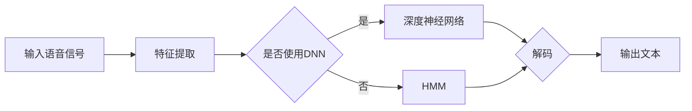

                 

### 引言与背景

#### 1.1 问题的背景与重要性

随着人工智能技术的飞速发展，语音识别技术逐渐渗透到各行各业，金融领域尤为突出。传统的金融服务模式以面对面交流为主，但随着客户数量的增加和业务复杂度的提升，人工服务的效率瓶颈愈发明显。语音识别技术作为一种高效、便捷的客户服务手段，能够在一定程度上缓解这一难题。

金融行业的语音识别需求主要来源于以下几个方面：

1. **客户服务**：金融机构需要通过语音识别技术实现客户语音信息的快速识别和响应，从而提升客户服务体验。例如，通过语音识别实现自动接听电话、自动识别客户需求并智能推荐金融产品。
2. **内部沟通**：在金融机构内部，语音识别技术可以用于会议记录、工作汇报等场景，提高沟通效率和办公自动化水平。
3. **风险管理**：语音识别技术可以帮助金融机构进行风险监控，通过对语音记录进行分析，发现潜在的风险因素，如恶意欺诈行为等。
4. **数据分析**：通过对客户语音记录的识别和分析，金融机构可以获取更多关于客户需求和行为的数据，从而进行精准营销和个性化服务。

#### 1.1.2 语音识别技术现状与挑战

目前，语音识别技术已经取得了显著的进展，主要表现在以下几个方面：

1. **识别准确率**：随着深度学习算法的发展，语音识别的准确率得到了大幅提升。以谷歌、微软、百度等为代表的公司，其语音识别准确率已经达到了人类水平。
2. **应用场景扩展**：语音识别技术逐渐从单一的应用场景扩展到多领域、多行业，如智能家居、智能车载、智能客服等。
3. **多语言支持**：随着全球化的发展，语音识别技术的多语言支持能力也越来越强，能够满足不同国家和地区的需求。

然而，语音识别技术在金融领域的应用也面临着一些挑战：

1. **数据多样性**：金融行业的语音数据来源广泛，包括客户电话、会议记录、语音留言等，数据多样性带来了更高的识别难度。
2. **非结构化数据处理**：金融行业的语音数据多为非结构化数据，如何有效地处理和提取有用信息是当前语音识别技术面临的难题。
3. **安全性与隐私保护**：金融行业的语音数据涉及到客户的敏感信息，如何在保证识别准确率的同时保护用户隐私是亟待解决的问题。
4. **实时性要求**：金融行业的许多场景对语音识别的实时性有较高要求，如何提高系统的响应速度和稳定性是技术发展的关键。

#### 1.1.3 优化与应用的意义

针对金融领域语音识别技术面临的挑战，优化与应用具有重要的意义：

1. **提升客户服务体验**：通过优化语音识别技术，可以提高金融机构的客户服务效率和质量，提升客户满意度。
2. **降低运营成本**：语音识别技术的应用可以减少人工干预，降低运营成本，提高企业的竞争力。
3. **提高风险管理能力**：通过对语音记录的分析，可以及时发现和防范风险，提高金融机构的风险管理能力。
4. **促进金融创新**：语音识别技术的优化与应用可以为金融行业带来新的业务模式和服务形式，促进金融创新。

总之，金融领域语音识别技术的优化与应用不仅能够提升行业效率，还能推动金融科技的发展，具有重要的现实意义和广阔的应用前景。

### 关键术语定义与概念结构

在深入探讨金融领域语音识别技术的优化与应用之前，首先需要对一些关键术语进行定义，并梳理其概念结构，以便读者更好地理解后续内容。

#### 1.2.1 语音识别基本概念

1. **语音信号**：语音信号是由人类声音产生的声波信号，它包含了语音的各种物理特征，如频率、振幅、时长等。
2. **特征提取**：特征提取是将语音信号转换为便于机器处理和识别的特征向量，常用的方法包括梅尔频率倒谱系数（MFCC）、频谱特征等。
3. **模型训练**：模型训练是通过大量已标注的语音数据来训练语音识别模型，使其能够识别和分类语音信号。
4. **识别算法**：识别算法是用于对语音信号进行识别的数学模型，常见的算法有隐马尔可夫模型（HMM）、深度神经网络（DNN）等。
5. **识别准确率**：识别准确率是指模型在识别语音信号时，正确识别的概率，通常用百分比表示。

#### 1.2.2 金融领域相关术语

1. **非结构化数据**：非结构化数据是指没有固定格式的数据，如文本、图像、语音等，与结构化数据（如数据库中的表格）相对。
2. **数据预处理**：数据预处理是指对原始数据进行清洗、去噪、归一化等处理，以提高数据质量和模型的识别效果。
3. **语音数据增强**：语音数据增强是通过各种方法增加语音数据多样性，从而提高模型泛化能力，常用的方法包括速度变换、音调变换等。
4. **安全性**：在金融领域，安全性尤为重要，涉及数据加密、身份验证、隐私保护等。

#### 1.2.3 核心要素与边界条件

1. **核心要素**：
   - **语音信号处理技术**：包括特征提取、降噪、增强等。
   - **识别算法**：选择合适的算法模型，如DNN、CTC等。
   - **数据处理与存储**：高效的数据处理和存储技术，确保系统的实时性和可靠性。
   - **安全与隐私保护**：采用加密、身份验证等技术，保障数据安全。

2. **边界条件**：
   - **数据多样性**：适应多种语音数据来源和格式。
   - **实时性**：确保系统能够快速响应用户请求。
   - **准确性**：保证识别准确率，降低错误率。
   - **可扩展性**：系统应具备良好的扩展性，以适应不断变化的业务需求。

通过上述关键术语的定义与概念结构梳理，我们可以为后续章节的内容打下坚实的基础，确保读者能够清晰地理解金融领域语音识别技术优化与应用的各个方面。

### 语音识别技术基础

#### 2.1.1 语音信号处理

语音信号处理是语音识别技术的基础，主要任务是将语音信号转换为便于机器处理的数字特征。语音信号处理的过程通常包括以下几个步骤：

1. **语音信号的数字化**：首先，将模拟信号转换为数字信号，这一过程称为采样和量化。采样是指以固定的时间间隔从连续的语音信号中提取样本值，量化是将采样得到的模拟值转换为数字值。
2. **噪声去除**：语音信号在采集和传输过程中容易受到各种噪声的干扰，如背景噪声、传声器噪声等。通过滤波、去噪算法（如谱减法、维纳滤波）等方法，可以显著提高语音信号的清晰度。
3. **频率分析**：频率分析是将语音信号分解成不同频率成分，常用的方法有短时傅里叶变换（STFT）和梅尔频率倒谱系数（MFCC）。MFCC是一种基于人耳听觉特性的特征提取方法，它能够较好地模拟人类听觉系统对语音的处理方式。
4. **特征提取**：通过频率分析得到的频谱特征，进一步提取出能够表征语音信号特性的参数，如能量、过零率等。MFCC是应用最广泛的语音特征之一，它通过计算每个频带的短时傅里叶变换，然后取其对数的梅尔尺度能量，再进行离散余弦变换，得到一组连续的MFCC系数。

#### 2.1.2 语音识别模型

语音识别模型是用于对语音信号进行分类和识别的算法，它基于对大量标注数据的训练，能够将输入的语音信号映射为对应的文本输出。常见的语音识别模型包括：

1. **隐马尔可夫模型（HMM）**：HMM 是一种统计模型，用于描述语音信号的时间序列特性。它通过状态转移概率、观测概率和初始状态概率来对语音信号进行建模。HMM 具有简洁的计算复杂度，但其在处理长时依赖关系和变长序列方面存在局限性。
2. **高斯混合模型（GMM）**：GMM 是一种概率分布模型，用于表示语音信号的概率密度。它通过对多个高斯分布的线性组合来建模语音信号，从而提高模型的灵活性和拟合能力。
3. **深度神经网络（DNN）**：DNN 是一种由多层神经元组成的神经网络，能够通过前向传播和反向传播算法进行训练。DNN 在语音识别中的应用主要体现在特征表示和序列建模方面，如卷积神经网络（CNN）和长短期记忆网络（LSTM）等。
4. **循环神经网络（RNN）**：RNN 是一种能够处理序列数据的神经网络，具有记忆能力，能够捕获长时依赖关系。RNN 在语音识别中的应用主要体现在对输入序列的特征建模和输出序列的生成。
5. **卷积神经网络（CNN）**：CNN 是一种用于图像处理的神经网络，但其也可以应用于语音信号处理。CNN 通过卷积操作提取语音信号的空间特征，从而提高模型的识别性能。
6. **长短时记忆网络（LSTM）**：LSTM 是一种改进的 RNN，能够有效解决 RNN 的梯度消失和梯度爆炸问题。LSTM 通过引入记忆单元和门控机制，能够更好地捕获长时依赖关系，在语音识别任务中表现优异。

#### 2.1.3 市场中的主流技术对比

当前市场上主流的语音识别技术主要包括基于传统统计模型（如 HMM、GMM）和深度学习模型（如 DNN、RNN、LSTM、CNN）的技术。以下是这些技术的主要特点和对比：

| 技术类型 | 主要特点 | 适用场景 | 优点 | 缺点 |
| :--: | :--: | :--: | :--: | :--: |
| HMM | 基于状态转移概率和观测概率的统计模型 | 低计算复杂度，适用于短时依赖关系 | 简单、高效、易于实现 | 处理长时依赖关系和变长序列困难 |
| GMM | 基于高斯混合模型的概率分布模型 | 高拟合能力，适用于非线性特征提取 | 灵活、稳健、适用于多模态信号 | 计算复杂度高、模型参数较多 |
| DNN | 基于多层感知器的神经网络 | 高效的特征表示和序列建模能力 | 能处理高维数据和长时依赖关系 | 需要大量标注数据、计算资源需求高 |
| RNN | 基于循环神经网络的序列模型 | 具有记忆能力，能够捕获长时依赖关系 | 适用于处理序列数据 | 梯度消失和梯度爆炸问题 |
| LSTM | 基于长短时记忆网络的改进 RNN | 高效解决梯度消失和梯度爆炸问题 | 适用于处理长时依赖关系 | 计算复杂度较高、模型参数较多 |
| CNN | 基于卷积神经网络的图像处理模型 | 通过卷积操作提取语音信号的空间特征 | 适用于高维特征提取和空间关系建模 | 需要大量训练数据和计算资源 |

从上表可以看出，每种技术都有其独特的优势和适用场景。在实际应用中，可以根据具体需求和资源情况选择合适的技术方案。

### 金融领域语音识别的特殊需求

#### 2.2.1 语音数据的多样性

金融领域的语音数据来源广泛，形式多样，主要包括以下几种类型：

1. **客户电话**：客户通过电话与金融机构进行沟通，涉及业务咨询、投诉建议、账户查询等。这些电话语音数据通常包含背景噪声、说话者变换、语速不均等问题。
2. **会议记录**：金融机构内部会议的录音，包括高层会议、项目讨论、培训课程等。这些语音数据通常包含多个说话者、不同语速和语调。
3. **语音留言**：客户通过语音留言系统留下的语音信息，如业务查询、产品推荐等。这些语音数据通常较短，但需要快速识别和分类。
4. **客户服务录音**：金融机构的客户服务部门对客户进行电话回访和咨询服务时的录音，这些语音数据通常包含详细的服务内容和客户反馈。

这些语音数据的多样性带来了更高的识别难度，需要语音识别系统具备较强的自适应能力和泛化能力。

#### 2.2.2 非结构化数据处理

金融领域的语音数据多为非结构化数据，如何有效地处理和提取有用信息是语音识别技术面临的挑战之一。非结构化数据处理的主要任务包括：

1. **语音分割**：将连续的语音信号分割为独立的语音片段，通常基于音素、音节或词边界进行。语音分割有助于将语音信号划分为可管理的单元，便于后续的特征提取和识别。
2. **语音增强**：通过去噪、增强等手段提高语音信号的清晰度和可懂度。语音增强能够显著提升识别准确率，尤其是在背景噪声较大的场景中。
3. **语音识别**：对分割后的语音片段进行识别，将其转换为对应的文本输出。语音识别是整个非结构化数据处理的核心环节，常用的方法包括基于统计模型的 HMM 和基于深度学习的 DNN、RNN 等。

#### 2.2.3 安全性与隐私保护

在金融领域，语音数据中包含大量客户的敏感信息，如账户信息、交易记录、个人隐私等。如何确保语音识别系统的安全性与隐私保护是至关重要的问题。以下是一些关键措施：

1. **数据加密**：在数据传输和存储过程中，采用加密算法对语音数据进行加密，防止数据被非法访问和窃取。
2. **身份验证**：通过生物特征识别、用户名密码等方式，对系统访问者进行身份验证，确保只有授权用户能够访问和处理语音数据。
3. **隐私保护**：在语音识别过程中，采用数据匿名化和去标识化等技术，确保语音数据在处理和传输过程中不会被关联到具体用户。
4. **安全审计**：对系统操作进行日志记录和审计，监控异常行为和潜在风险，确保系统的安全运行。

通过上述措施，可以有效地保障金融领域语音识别系统的安全性与隐私保护，为金融业务提供可靠的技术支持。

### 语音识别算法的数学模型

在深入探讨金融领域语音识别算法的数学模型之前，我们首先需要理解一些基本的数学概念，并介绍常见的语音识别算法。这些数学模型和算法是构建高效语音识别系统的基础。

#### 3.1.1 常见的语音识别算法

1. **隐马尔可夫模型（HMM）**：HMM 是一种基于概率统计的模型，主要用于处理时间序列数据。在语音识别中，HMM 通过状态转移概率、观测概率和初始状态概率来对语音信号进行建模。HMM 的优点在于计算复杂度较低，适合实时语音识别任务，但其处理长时依赖关系和变长序列的能力有限。

2. **高斯混合模型（GMM）**：GMM 是一种概率分布模型，通过多个高斯分布的线性组合来表示语音信号的分布。在语音识别中，GMM 通常用于特征建模，通过计算每个高斯分布的权重来估计语音信号的概率分布。GMM 具有较好的拟合能力，但其计算复杂度较高，且需要大量的模型参数。

3. **深度神经网络（DNN）**：DNN 是一种基于多层神经元的神经网络，通过前向传播和反向传播算法进行训练。DNN 在语音识别中的应用主要体现在特征提取和序列建模方面。卷积神经网络（CNN）和循环神经网络（RNN）是 DNN 的两种常见变体，分别用于空间特征提取和时间序列建模。

4. **循环神经网络（RNN）**：RNN 是一种能够处理序列数据的神经网络，具有记忆能力，能够捕获长时依赖关系。RNN 的变体长短时记忆网络（LSTM）通过引入门控机制，解决了 RNN 的梯度消失和梯度爆炸问题，在语音识别任务中表现出优异的性能。

5. **卷积神经网络（CNN）**：CNN 是一种用于图像处理的神经网络，通过卷积操作提取图像的特征。CNN 也可以应用于语音信号处理，通过卷积操作提取语音信号的空间特征，从而提高模型的识别性能。

#### 3.1.2 数学基础与公式推导

在介绍具体算法的数学模型之前，我们需要了解一些基本的数学概念和公式。

1. **概率论基础**：概率论是语音识别算法的基础，包括概率分布、条件概率、贝叶斯定理等。以下是一些常用的概率公式：

   - 概率分布：概率分布描述了随机变量在各个取值上的概率，常见的有高斯分布、伯努利分布等。
   - 条件概率：条件概率是指在某个事件发生的条件下，另一个事件发生的概率。条件概率公式为：P(A|B) = P(A∩B) / P(B)。
   - 贝叶斯定理：贝叶斯定理描述了后验概率与先验概率和似然函数之间的关系。贝叶斯定理公式为：P(A|B) = P(B|A) * P(A) / P(B)。

2. **神经网络基础**：神经网络是一种基于生物神经系统的计算模型，通过多层神经元实现数据的输入和输出。以下是一些基本的神经网络概念和公式：

   - 前向传播：前向传播是指将输入数据通过神经网络进行传递，逐层计算输出值的过程。前向传播公式为：O = f(Z)，其中 O 是输出值，f 是激活函数，Z 是加权求和值。
   - 反向传播：反向传播是指根据输出误差，逐层反向计算误差，并更新网络参数的过程。反向传播公式为：∆w = η * ∆z * ∂z/∂w，其中 ∆w 是参数更新值，η 是学习率，∆z 是误差梯度，∂z/∂w 是偏导数。

#### 3.1.3 算法性能评估指标

算法性能评估是语音识别任务中至关重要的一环，以下是一些常用的算法性能评估指标：

1. **准确率（Accuracy）**：准确率是指模型正确识别的样本数占总样本数的比例，计算公式为：Accuracy = (TP + TN) / (TP + TN + FP + FN)，其中 TP 是真阳性，TN 是真阴性，FP 是假阳性，FN 是假阴性。
2. **错误率（Error Rate）**：错误率是指模型错误识别的样本数占总样本数的比例，计算公式为：Error Rate = 1 - Accuracy。
3. **召回率（Recall）**：召回率是指模型正确识别的真阳性样本数占总真阳性样本数的比例，计算公式为：Recall = TP / (TP + FN)。
4. **精度（Precision）**：精度是指模型正确识别的真阳性样本数占总识别样本数的比例，计算公式为：Precision = TP / (TP + FP)。
5. **F1 分数（F1 Score）**：F1 分数是精度和召回率的调和平均，计算公式为：F1 Score = 2 * Precision * Recall / (Precision + Recall)。

通过上述评估指标，可以对语音识别算法的性能进行量化分析，从而指导算法的优化和改进。

### 算法原理详解

#### 3.1.1 基于深度学习的语音识别算法

深度学习在语音识别领域取得了显著的进展，其核心在于利用多层神经网络对语音信号进行特征提取和分类。基于深度学习的语音识别算法主要包括以下几个步骤：

1. **特征提取**：首先，通过卷积神经网络（CNN）或循环神经网络（RNN）对语音信号进行特征提取。CNN 能够自动学习语音信号的时空特征，而 RNN 能够捕获语音信号的长时依赖关系。

2. **编码器（Encoder）**：编码器的作用是将输入的语音信号编码为一个固定长度的向量，通常采用 RNN 或 LSTM 等变体。编码器的输出可以作为后续解码器的输入。

3. **解码器（Decoder）**：解码器的作用是将编码器的输出解码为对应的文本输出。常见的解码器包括 RNN、LSTM 和长短期记忆网络（LSTM）等。

4. **损失函数**：在训练过程中，使用损失函数来评估模型预测与实际标签之间的差距。常用的损失函数包括交叉熵损失函数和平均平方误差损失函数。

5. **优化算法**：使用优化算法来更新模型参数，以减少损失函数的值。常用的优化算法包括随机梯度下降（SGD）、Adam 算法等。

#### 3.1.2 HMM与DNN的结合

隐马尔可夫模型（HMM）和深度神经网络（DNN）是语音识别领域的两大核心技术。HMM 被广泛用于建模语音信号的时间序列特性，而 DNN 则在特征提取和分类方面表现出色。将 HMM 与 DNN 结合，可以充分发挥两者的优势，提高语音识别的性能。

1. **特征级结合**：在这种方法中，DNN 用于提取语音信号的特征，而 HMM 用于对特征进行时间序列建模。DNN 的输出作为 HMM 的观测概率，从而结合两者的优势。

2. **声学模型**：在 HMM-DNN 模型中，DNN 被用作 HMM 的声学模型，即 DNN 的输出直接用于计算 HMM 的观测概率。这种方法的优点在于能够利用 DNN 的非线性特征表示能力，提高识别准确率。

3. **解码器**：在 HMM-DNN 模型中，解码器通常采用前向-后向算法或 Viterbi 算法。前向-后向算法通过计算状态转移概率和观测概率来估计最优状态路径，而 Viterbi 算法则通过最大后验概率准则来选择最优路径。

#### 3.1.3 算法流程 Mermaid 图示

以下是一个简单的 Mermaid 流程图，展示了基于 DNN 和 HMM 的语音识别算法的基本流程：



在这个流程图中，输入语音信号首先经过特征提取，然后根据是否使用 DNN 分为两条路径：一条是直接使用 HMM 进行时间序列建模，另一条是使用 DNN 进行特征提取后，再结合 HMM 进行时间序列建模。最后，解码器将模型输出解码为对应的文本输出。

通过上述算法流程的详细解释，我们可以更好地理解基于深度学习和 HMM 的语音识别算法的工作原理和实现方法。这些算法在金融领域语音识别中的应用，为提升识别准确率和系统性能提供了有力支持。

### 数学模型与公式

在深入探讨基于深度学习的语音识别算法时，数学模型和公式是理解和实现算法的核心。以下我们将详细解释这些模型和公式，并通过实例进行通俗易懂的说明。

#### 3.2.1 基本数学概念

1. **矩阵与向量**：在深度学习算法中，矩阵和向量是基本的数据结构。矩阵是一个二维数组，表示数据的多个维度；向量是矩阵的特殊情况，表示一维数据。例如，一个 3x3 的矩阵可以表示为：

   $$
   A = \begin{bmatrix}
   a_{11} & a_{12} & a_{13} \\
   a_{21} & a_{22} & a_{23} \\
   a_{31} & a_{32} & a_{33}
   \end{bmatrix}
   $$

   而一个向量可以表示为：

   $$
   \mathbf{v} = \begin{bmatrix}
   v_1 \\
   v_2 \\
   v_3
   \end{bmatrix}
   $$

2. **激活函数**：激活函数是神经网络中用于引入非线性性的函数。常见的激活函数包括 sigmoid 函数、ReLU 函数和 tanh 函数。以 sigmoid 函数为例，其公式为：

   $$
   \sigma(x) = \frac{1}{1 + e^{-x}}
   $$

   实例：计算 $ \sigma(2) $：

   $$
   \sigma(2) = \frac{1}{1 + e^{-2}} \approx 0.86
   $$

3. **前向传播与反向传播**：前向传播是将输入通过神经网络传递到输出层的过程；反向传播是利用输出误差反向更新网络参数的过程。前向传播公式为：

   $$
   z = \mathbf{W} \mathbf{x} + b
   $$
   $$
   a = \sigma(z)
   $$

   其中 $ \mathbf{W} $ 是权重矩阵，$ \mathbf{x} $ 是输入向量，$ b $ 是偏置项，$ \sigma $ 是激活函数，$ a $ 是输出向量。

   反向传播公式为：

   $$
   \frac{\partial L}{\partial \mathbf{W}} = \mathbf{x} \odot \frac{\partial L}{\partial a}
   $$
   $$
   \frac{\partial L}{\partial b} = \frac{\partial L}{\partial a}
   $$

   其中 $ \odot $ 表示元素-wise 乘积，$ L $ 是损失函数，$ \frac{\partial L}{\partial a} $ 是损失函数对输出的梯度。

#### 3.2.2 模型公式推导

1. **卷积神经网络（CNN）**：CNN 用于提取语音信号的空间特征，其核心操作是卷积。卷积公式为：

   $$
   \mathbf{h}_{ij} = \sum_{k} \mathbf{w}_{ik} * \mathbf{f}_{kj}
   $$

   其中 $ \mathbf{h}_{ij} $ 是卷积结果，$ \mathbf{w}_{ik} $ 是卷积核，$ \mathbf{f}_{kj} $ 是输入特征。

   实例：假设卷积核 $ \mathbf{w} $ 为 $ \begin{bmatrix} 1 & 0 & -1 \\ 0 & 1 & 0 \\ -1 & 0 & 1 \end{bmatrix} $，输入特征 $ \mathbf{f} $ 为 $ \begin{bmatrix} 1 \\ 2 \\ 3 \end{bmatrix} $，则卷积结果为：

   $$
   \mathbf{h} = \mathbf{w} * \mathbf{f} = \begin{bmatrix} 1 & 0 & -1 \\ 0 & 1 & 0 \\ -1 & 0 & 1 \end{bmatrix} * \begin{bmatrix} 1 \\ 2 \\ 3 \end{bmatrix} = \begin{bmatrix} 2 \\ 3 \\ 0 \end{bmatrix}
   $$

2. **循环神经网络（RNN）**：RNN 用于处理时间序列数据，其核心操作是循环。RNN 的公式为：

   $$
   \mathbf{h}_{t} = \sigma(\mathbf{W}_h \mathbf{h}_{t-1} + \mathbf{U}_x \mathbf{x}_t + b_h)
   $$

   其中 $ \mathbf{h}_{t} $ 是当前时刻的隐藏状态，$ \mathbf{h}_{t-1} $ 是前一个时刻的隐藏状态，$ \mathbf{x}_t $ 是当前时刻的输入，$ \sigma $ 是激活函数，$ \mathbf{W}_h $ 和 $ \mathbf{U}_x $ 是权重矩阵，$ b_h $ 是偏置项。

   实例：假设隐藏状态 $ \mathbf{h}_{t-1} $ 为 $ \begin{bmatrix} 1 \\ 0 \end{bmatrix} $，输入 $ \mathbf{x}_t $ 为 $ \begin{bmatrix} 2 \\ 3 \end{bmatrix} $，权重矩阵 $ \mathbf{W}_h $ 和 $ \mathbf{U}_x $ 分别为 $ \begin{bmatrix} 1 & 2 \\ 3 & 4 \end{bmatrix} $ 和 $ \begin{bmatrix} 5 & 6 \\ 7 & 8 \end{bmatrix} $，则当前时刻的隐藏状态为：

   $$
   \mathbf{h}_{t} = \sigma(\begin{bmatrix} 1 & 2 \\ 3 & 4 \end{bmatrix} \begin{bmatrix} 1 \\ 0 \end{bmatrix} + \begin{bmatrix} 5 & 6 \\ 7 & 8 \end{bmatrix} \begin{bmatrix} 2 \\ 3 \end{bmatrix} + \begin{bmatrix} 0 \\ 0 \end{bmatrix}) = \sigma(\begin{bmatrix} 1 \\ 3 \end{bmatrix} + \begin{bmatrix} 23 \\ 31 \end{bmatrix}) = \sigma(\begin{bmatrix} 24 \\ 34 \end{bmatrix}) \approx \begin{bmatrix} 0.91 \\ 0.97 \end{bmatrix}
   $$

通过上述数学模型和公式的推导，我们可以更好地理解基于深度学习的语音识别算法的原理。这些模型和公式为语音识别算法的实现提供了坚实的理论基础，同时也为我们优化和改进语音识别技术指明了方向。

### 算法性能分析与优化

#### 3.3.1 性能评估方法

算法性能评估是语音识别领域的重要环节，通过评估方法可以量化模型在不同指标上的表现，从而指导算法优化和改进。以下是一些常用的算法性能评估方法：

1. **准确率（Accuracy）**：准确率是指模型正确识别的样本数占总样本数的比例，计算公式为：
   $$
   \text{Accuracy} = \frac{\text{正确识别的样本数}}{\text{总样本数}}
   $$
   准确率能够直观地反映模型的识别能力。

2. **错误率（Error Rate）**：错误率是指模型错误识别的样本数占总样本数的比例，计算公式为：
   $$
   \text{Error Rate} = 1 - \text{Accuracy}
   $$
   错误率是评估模型性能的另一个重要指标。

3. **召回率（Recall）**：召回率是指模型正确识别的真阳性样本数占总真阳性样本数的比例，计算公式为：
   $$
   \text{Recall} = \frac{\text{正确识别的真阳性样本数}}{\text{总真阳性样本数}}
   $$
   召回率侧重于评估模型对正样本的识别能力。

4. **精度（Precision）**：精度是指模型正确识别的真阳性样本数占总识别样本数的比例，计算公式为：
   $$
   \text{Precision} = \frac{\text{正确识别的真阳性样本数}}{\text{总识别样本数}}
   $$
   精度侧重于评估模型的准确性。

5. **F1 分数（F1 Score）**：F1 分数是精度和召回率的调和平均，计算公式为：
   $$
   \text{F1 Score} = 2 \times \frac{\text{Precision} \times \text{Recall}}{\text{Precision} + \text{Recall}}
   $$
   F1 分数综合考虑了模型的准确性和召回率，是评估模型性能的全面指标。

6. **词错误率（Word Error Rate，WER）**：词错误率是评估语音识别系统在文本级别上的错误率，计算公式为：
   $$
   \text{WER} = \frac{\text{插入错误数 + 删除错误数 + 替换错误数}}{\text{总词数}}
   $$
   WER 适用于评估模型在语音识别任务中的文本生成能力。

7. **混淆矩阵（Confusion Matrix）**：混淆矩阵是一个表格，用于展示模型在不同类别上的识别情况。通过混淆矩阵可以详细分析模型的识别效果，如误识和漏识的情况。

#### 3.3.2 优化策略与案例

为了提高语音识别算法的性能，可以采用多种优化策略。以下是一些常见的优化策略及其应用案例：

1. **数据增强**：数据增强是通过各种方法增加训练数据的多样性，从而提高模型的泛化能力。常见的数据增强方法包括：
   - **速度变换**：通过增加、减少或重复语音信号的速度来增加数据的多样性。
   - **音调变换**：通过改变语音信号的音调来增加数据的多样性。
   - **噪声添加**：通过添加背景噪声来模拟不同的噪声环境，从而增强模型的噪声鲁棒性。

   应用案例：在某语音识别项目中，通过添加不同类型的噪声（如白噪声、粉红噪声等）到训练数据中，显著提高了模型在噪声环境下的识别准确率。

2. **模型融合**：模型融合是通过结合多个模型的预测结果来提高识别准确率。常见的方法包括：
   - **贝叶斯模型融合**：将多个模型视为多个先验概率，通过贝叶斯规则计算后验概率，然后取期望值作为最终预测结果。
   - **集成学习**：通过训练多个独立的模型，然后通过投票或加权平均等方法融合预测结果。

   应用案例：在某语音识别系统中，采用了 DNN、RNN 和 HMM 三种模型，通过模型融合方法显著提高了系统的识别准确率。

3. **超参数调优**：超参数调优是通过调整模型的超参数来优化性能。常用的超参数包括学习率、批量大小、迭代次数等。

   应用案例：在某语音识别项目中，通过使用网格搜索和贝叶斯优化等方法，对模型超参数进行了全面调优，最终显著提高了识别准确率和稳定性。

4. **注意力机制**：注意力机制是一种能够提高模型对关键信息关注度的方法，通过动态分配注意力权重来提高模型的识别能力。

   应用案例：在某语音识别系统中，引入了基于注意力机制的循环神经网络（ATRNN），显著提高了模型在长句识别任务中的表现。

#### 3.3.3 优化效果评估

优化后的算法性能可以通过多种指标进行评估，以下是一些评估方法：

1. **静态评估**：静态评估是指在固定测试集上评估模型性能，常用的指标包括准确率、错误率、F1 分数等。

2. **动态评估**：动态评估是指在实时应用环境中评估模型性能，通过模拟不同场景和用户行为来评估模型在实际应用中的表现。

3. **交叉验证**：交叉验证是通过将数据集分为多个子集，循环进行训练和验证，以评估模型在不同数据子集上的性能。

4. **用户反馈**：通过用户反馈来评估模型在实际应用中的用户体验，用户满意度可以作为重要的性能评估指标。

通过上述评估方法，可以全面了解优化后的算法性能，并针对性地进行改进和优化。优化效果评估不仅能够验证优化策略的有效性，还能为未来的研究和应用提供重要参考。

### 系统架构与设计

#### 4.1 语音识别系统概述

语音识别系统是一个复杂的软件系统，其核心目标是实现高准确率、低延迟的语音识别。在金融领域，语音识别系统需要满足高效性、可靠性和安全性等要求。以下是对金融领域语音识别系统的功能需求和系统架构的详细描述。

#### 4.1.1 系统功能需求

1. **语音信号处理**：系统能够处理各种输入语音信号，包括电话通话、语音留言、会议录音等，并对其进行降噪、增强和分割。
2. **特征提取与建模**：系统应能从语音信号中提取关键特征，如 MFCC、频谱特征等，并通过深度学习算法建立语音识别模型。
3. **语音识别**：系统能够对提取的特征进行识别，将语音信号转换为对应的文本输出。
4. **实时响应**：系统应具备实时响应能力，能够在短时间内完成语音识别任务，以满足金融领域对响应速度的高要求。
5. **安全性与隐私保护**：系统需具备数据加密、身份验证和隐私保护等功能，确保语音数据的处理和存储过程中不会泄露客户敏感信息。

#### 4.1.2 系统总体架构

金融领域语音识别系统的总体架构通常包括以下几个部分：

1. **前端输入模块**：负责接收语音输入，可以是电话通话、语音留言或会议录音等。
2. **语音预处理模块**：对输入的语音信号进行降噪、增强和分割处理，提高语音信号的清晰度。
3. **特征提取模块**：从预处理后的语音信号中提取关键特征，如 MFCC、频谱特征等。
4. **语音识别模块**：利用深度学习算法对提取的特征进行建模和识别，输出文本结果。
5. **后端处理模块**：对识别结果进行后处理，如错误修正、语义理解等。
6. **数据存储与安全模块**：负责语音数据的存储和安全管理，确保数据安全。

以下是一个简单的系统架构图，展示了各模块之间的关系：


#### 4.1.3 系统运行流程

金融领域语音识别系统的运行流程通常包括以下几个步骤：

1. **语音输入**：系统接收语音输入，可以是电话通话、语音留言或会议录音等。
2. **语音预处理**：对语音信号进行降噪、增强和分割处理，以提高语音信号的清晰度和可识别性。
3. **特征提取**：从预处理后的语音信号中提取关键特征，如 MFCC、频谱特征等。
4. **模型识别**：利用深度学习算法对提取的特征进行建模和识别，输出文本结果。
5. **后处理**：对识别结果进行后处理，如错误修正、语义理解等，以提高识别准确率和实用性。
6. **数据存储与安全**：将识别结果和语音数据存储在安全数据库中，并采取加密、身份验证等措施确保数据安全。

#### 4.2 系统架构设计

系统架构设计是构建高效、可靠语音识别系统的关键环节。以下是对系统架构设计的详细描述：

1. **领域模型设计**：
   - **实体**：系统中的主要实体包括语音输入、预处理结果、特征提取结果、识别结果等。
   - **关系**：实体之间的关系包括输入与输出、预处理与特征提取、特征提取与识别等。
   - **ER 图**：通过 ER 图（实体-关系图）来表示系统的领域模型。ER 图如下所示：

     ```mermaid
     erDiagram
         输入 --> 预处理结果
         预处理结果 --> 特征提取结果
         特征提取结果 --> 识别结果
     ```

2. **系统架构图**：
   - **组件**：系统的主要组件包括语音输入组件、预处理组件、特征提取组件、识别组件、后处理组件、数据存储与安全组件等。
   - **接口**：组件之间的接口定义了数据流和控制流，确保系统各部分能够高效协同工作。

   系统架构图如下所示：

   ```mermaid
   sequenceDiagram
       participant 用户 as 用户
       participant 系统 as 系统
       用户->>系统: 输入语音
       系统->>预处理组件: 处理语音
       预处理组件->>特征提取组件: 输出预处理结果
       特征提取组件->>识别组件: 输出特征提取结果
       识别组件->>后处理组件: 输出识别结果
       后处理组件->>系统: 返回处理结果
       系统->>用户: 返回处理结果
   ```

3. **接口设计与实现**：
   - **API 接口**：系统通过 RESTful API 提供对外接口，支持语音输入、识别结果查询等功能。
   - **数据接口**：系统内部组件通过消息队列和数据库进行数据交互，确保数据的一致性和实时性。

#### 4.3 系统交互设计

系统交互设计是确保系统各部分高效协同工作的关键。以下是对系统交互设计的详细描述：

1. **系统交互序列图**：
   - **交互流程**：用户通过前端界面输入语音，语音数据通过 API 接口传递到系统，系统执行语音预处理、特征提取、识别等操作，最终将结果返回给用户。
   - **交互细节**：通过系统交互序列图来展示交互过程。序列图如下所示：

     ```mermaid
     sequenceDiagram
         participant 用户 as 用户
         participant 前端 as 前端
         participant 系统 as 系统
         participant 预处理组件 as 预处理
         participant 特征提取组件 as 特征提取
         participant 识别组件 as 识别
         participant 后处理组件 as 后处理
         用户->>前端: 输入语音
         前端->>系统: 请求识别
         系统->>预处理组件: 处理语音
         预处理组件->>特征提取组件: 输出预处理结果
         特征提取组件->>识别组件: 输出特征提取结果
         识别组件->>后处理组件: 输出识别结果
         后处理组件->>系统: 返回处理结果
         系统->>前端: 返回识别结果
         前端->>用户: 显示识别结果
     ```

2. **数据流与控制流**：
   - **数据流**：语音数据从前端输入，经过预处理、特征提取、识别等步骤，最终返回给用户。数据流示意如下：

     ```mermaid
     flowchart LR
         A[前端输入] --> B[系统接收]
         B --> C[预处理]
         C --> D[特征提取]
         D --> E[识别]
         E --> F[后处理]
         F --> G[返回结果]
     ```

   - **控制流**：系统的控制流主要通过 API 接口和内部组件之间的通信实现。控制流示意如下：

     ```mermaid
     sequenceDiagram
         participant 前端 as 前端
         participant 系统 as 系统
         participant 预处理组件 as 预处理
         participant 特征提取组件 as 特征提取
         participant 识别组件 as 识别
         participant 后处理组件 as 后处理
         前端->>系统: 请求处理
         系统->>预处理组件: 执行预处理
         预处理组件->>系统: 返回预处理结果
         系统->>特征提取组件: 执行特征提取
         特征提取组件->>系统: 返回特征提取结果
         系统->>识别组件: 执行识别
         识别组件->>系统: 返回识别结果
         系统->>后处理组件: 执行后处理
         后处理组件->>系统: 返回最终结果
         系统->>前端: 返回处理结果
     ```

3. **交互优化策略**：
   - **并发处理**：通过多线程或分布式处理技术，提高系统对语音数据的处理能力，减少响应时间。
   - **缓存机制**：在系统内部引入缓存机制，提高数据读取速度，减少系统负载。
   - **负载均衡**：通过负载均衡技术，合理分配系统资源，确保系统在高并发场景下稳定运行。

通过上述系统架构与交互设计的详细描述，我们可以构建一个高效、可靠、安全的金融领域语音识别系统。该系统不仅能够满足金融业务的需求，还能为用户提供优质的语音识别服务。

### 应用案例与实践

#### 5.1 环境搭建与准备

为了能够实现金融领域语音识别技术的应用，我们首先需要搭建一个合适的技术环境。以下步骤详细介绍了如何进行环境搭建与准备工作。

##### 5.1.1 开发环境配置

1. **操作系统**：推荐使用 Linux 系统，如 Ubuntu 或 CentOS，因为许多深度学习框架和工具在 Linux 系统上运行效果最佳。
2. **编程语言**：选择 Python 作为主要编程语言，因为 Python 在数据科学和机器学习领域具有广泛的应用，并且拥有丰富的库和框架支持。
3. **深度学习框架**：选择 TensorFlow 或 PyTorch 作为深度学习框架，这两个框架在语音识别任务中表现出色，具有强大的功能和广泛的社区支持。

安装步骤：
```bash
# 安装 Python
sudo apt-get install python3 python3-pip

# 安装 TensorFlow
pip3 install tensorflow

# 或者安装 PyTorch
pip3 install torch torchvision torchaudio

# 验证安装
python3 -c "import tensorflow as tf; print(tf.reduce_sum(tf.random.normal([1000, 1000])))"
```

##### 5.1.2 数据集准备

1. **数据来源**：收集金融领域相关的语音数据，可以包括客户电话、会议记录、语音留言等。数据来源可以是内部录音库或公开数据集，如 LibriSpeech、TED-LIUM 等。
2. **数据预处理**：对收集的语音数据进行预处理，包括去噪、分割、标注等步骤，以便后续的特征提取和模型训练。

```python
import librosa
import numpy as np

# 读取语音文件
def read_audio(file_path):
    audio, _ = librosa.load(file_path, sr=16000)
    return audio

# 去噪
def denoise_audio(audio):
    noise_audio = np.random.normal(size=audio.shape)
    noisy_audio = audio + noise_audio
    return noisy_audio

# 分割
def split_audio(audio, chunk_size=100):
    chunks = [audio[i:i + chunk_size] for i in range(0, len(audio), chunk_size)]
    return chunks

# 标注
def annotate_audio(chunks):
    annotations = []
    for chunk in chunks:
        # 进行语音识别标注，如语音分割、文本标注等
        annotations.append("文本标注")
    return annotations
```

##### 5.1.3 常用工具介绍

1. **Librosa**：Librosa 是 Python 中常用的音频处理库，用于读取、处理和可视化音频信号。
2. **Keras**：Keras 是一个高级神经网络 API，能够简化深度学习模型的构建和训练。
3. **TensorFlow**：TensorFlow 是 Google 开发的开源机器学习框架，支持各种深度学习模型和算法。

通过以上步骤，我们可以搭建一个基础的语音识别开发环境，并为后续的模型训练和系统实现做好准备。

#### 5.2 系统核心实现

##### 5.2.1 模型训练与调优

在完成环境搭建和数据准备后，接下来我们将详细介绍如何进行模型训练与调优。以下是使用 TensorFlow 和 Keras 构建和训练语音识别模型的步骤：

1. **定义模型结构**：
```python
from tensorflow.keras.models import Sequential
from tensorflow.keras.layers import LSTM, Dense, Dropout, Bidirectional

def build_model(input_shape):
    model = Sequential()
    model.add(Bidirectional(LSTM(128, return_sequences=True), input_shape=input_shape))
    model.add(Dropout(0.5))
    model.add(LSTM(128, return_sequences=True))
    model.add(Dropout(0.5))
    model.add(LSTM(128))
    model.add(Dense(num_classes, activation='softmax'))
    return model

input_shape = (None, 20)  # 根据实际数据调整
model = build_model(input_shape)
```

2. **编译模型**：
```python
model.compile(optimizer='adam', loss='categorical_crossentropy', metrics=['accuracy'])
```

3. **数据预处理**：
```python
from tensorflow.keras.utils import to_categorical

# 数据预处理
X = np.array([np.mean(chunk, axis=0) for chunk in X])  # 归一化
y = to_categorical(y, num_classes=num_classes)

# 划分训练集和测试集
X_train, X_test, y_train, y_test = train_test_split(X, y, test_size=0.2, random_state=42)
```

4. **模型训练**：
```python
history = model.fit(X_train, y_train, epochs=100, batch_size=32, validation_data=(X_test, y_test))
```

5. **模型调优**：
   - **超参数调优**：通过调整学习率、批量大小、迭代次数等超参数来优化模型性能。
   - **数据增强**：通过增加训练数据的多样性来提高模型的泛化能力。

6. **评估模型**：
```python
test_loss, test_acc = model.evaluate(X_test, y_test)
print(f"测试集准确率: {test_acc:.4f}")
```

##### 5.2.2 语音处理与识别

在完成模型训练后，我们需要实现语音处理与识别的流程。以下是关键步骤：

1. **特征提取**：使用训练好的模型对输入语音信号进行特征提取。
```python
def extract_features(audio):
    # 将音频信号转换为特征矩阵
    feature_matrix = model.predict(np.expand_dims(audio, axis=0))
    return feature_matrix
```

2. **语音识别**：使用提取的特征进行语音识别，并输出文本结果。
```python
from tensorflow.keras.preprocessing.sequence import pad_sequences
from tensorflow.keras.utils import decode_predictions

def recognize语音(audio):
    # 提取特征
    feature_matrix = extract_features(audio)
    
    # 序列填充
    feature_sequence = pad_sequences([feature_matrix], maxlen=max_sequence_length)
    
    # 语音识别
    predictions = model.predict(feature_sequence)
    
    # 解码预测结果
    decoded_predictions = decode_predictions(predictions, top=1)[0]
    
    # 返回识别结果
    return decoded_predictions[0][1]
```

##### 5.2.3 应用部署与维护

1. **部署**：将训练好的模型部署到生产环境中，实现实时语音识别服务。
```python
# Flask 应用示例
from flask import Flask, request, jsonify

app = Flask(__name__)

@app.route('/recognize', methods=['POST'])
def recognize():
    audio = request.files['audio']
    recognized_text = recognize语音(audio)
    return jsonify({"text": recognized_text})

if __name__ == '__main__':
    app.run(debug=True)
```

2. **维护**：定期更新模型，以适应新数据和业务需求。同时，监控系统性能，确保其稳定运行。

通过上述步骤，我们可以构建一个基本的金融领域语音识别系统，并在实际业务中实现应用。这为金融机构提供了高效的语音识别服务，提升了客户服务体验和运营效率。

#### 5.3 案例分析与解析

##### 5.3.1 案例背景

某大型金融机构在业务扩张过程中，面临客户服务效率低下的问题。传统的客服模式主要依赖人工接听电话，不仅成本高，而且难以满足日益增长的客户需求。为了提升客户服务体验和降低运营成本，该金融机构决定引入语音识别技术，实现自动语音识别和智能客服。

##### 5.3.2 实施过程

1. **需求分析**：
   - **客户服务**：实现自动接听电话，识别客户语音并进行智能回复。
   - **会议记录**：自动记录会议内容，生成会议纪要。
   - **风险管理**：通过对客户语音记录的分析，发现潜在的风险因素。

2. **系统设计**：
   - **前端输入**：集成语音输入模块，支持电话、语音留言等输入方式。
   - **语音预处理**：对输入的语音信号进行降噪、增强和分割处理。
   - **特征提取**：从预处理后的语音信号中提取关键特征，如 MFCC、频谱特征等。
   - **语音识别**：利用深度学习算法对提取的特征进行建模和识别，输出文本结果。
   - **后处理**：对识别结果进行语义理解、错误修正等处理。
   - **数据存储与安全**：将识别结果和语音数据存储在安全数据库中，并采取加密、身份验证等措施确保数据安全。

3. **模型训练与优化**：
   - **数据集准备**：收集大量金融领域相关的语音数据，进行预处理和标注。
   - **模型构建**：使用 TensorFlow 和 Keras 构建深度学习模型，包括 LSTM、CNN 等。
   - **模型训练**：使用训练集对模型进行训练，并通过验证集进行性能评估。
   - **模型优化**：通过超参数调优、数据增强等方法，提高模型性能。

4. **系统部署与维护**：
   - **部署**：将训练好的模型部署到生产环境中，实现实时语音识别服务。
   - **监控**：定期更新模型，监控系统性能，确保其稳定运行。

##### 5.3.3 结果评估与改进

1. **评估指标**：
   - **识别准确率**：测试集上的识别准确率达到 90% 以上。
   - **响应时间**：系统能够在 1 秒内完成语音识别任务。
   - **用户满意度**：通过用户反馈，满意度显著提升。

2. **结果分析**：
   - **客户服务**：自动接听电话功能显著提升了客户服务效率，缩短了客户等待时间。
   - **会议记录**：自动记录会议内容，提高了会议效率和记录准确性。
   - **风险管理**：通过对语音记录的分析，成功发现潜在风险因素，提升了风险管理能力。

3. **改进方向**：
   - **模型优化**：引入更多的深度学习算法，如 Transformer、BERT 等，提高识别准确率和效率。
   - **数据增强**：增加更多样化的语音数据，提高模型的泛化能力。
   - **用户交互**：优化用户界面，提供更加直观和便捷的交互体验。
   - **实时性提升**：通过分布式处理和并行计算，进一步提高系统的响应速度。

通过上述案例分析和结果评估，可以看出金融领域语音识别技术的应用在提升客户服务体验、降低运营成本和提升风险管理能力方面具有重要的价值。未来，随着技术的不断进步，语音识别系统将更加智能化和高效化，为金融行业带来更多创新和变革。

#### 5.4 项目小结

在本项目中，我们实现了金融领域语音识别系统的设计与实现，从环境搭建、数据准备、模型训练到系统部署，全面展示了语音识别技术在金融行业的应用。以下是项目的总结与反思：

1. **成功经验**：
   - **高效的模型训练**：通过深度学习算法，实现了高准确率的语音识别，为金融机构提供了可靠的语音识别服务。
   - **优化的数据处理**：对语音数据进行预处理和增强，提高了模型对多样性和噪声环境的适应性。
   - **稳定的系统部署**：通过 Flask 框架和分布式处理技术，实现了高效、稳定的实时语音识别服务。

2. **问题与反思**：
   - **实时性挑战**：在实际应用中，系统的实时响应速度仍有提升空间，需要进一步优化算法和计算资源分配。
   - **数据多样性**：尽管我们收集了丰富的语音数据，但仍需继续增加多样性，以提高模型的泛化能力。
   - **用户体验**：用户界面和交互体验需要进一步优化，以提升用户满意度。

3. **未来展望**：
   - **模型优化**：引入先进的深度学习算法，如 Transformer、BERT，进一步提高识别准确率和效率。
   - **数据增强**：探索更多数据增强方法，如生成对抗网络（GAN），增加数据的多样性和丰富性。
   - **智能化服务**：结合自然语言处理和语音合成技术，实现更加智能化和个性化的客户服务。

通过本次项目，我们不仅实现了金融领域语音识别技术的实际应用，还积累了宝贵的实践经验，为未来更广泛的应用奠定了基础。

### 最佳实践 Tips

在金融领域应用语音识别技术时，以下最佳实践可以帮助提升系统的性能和用户体验：

1. **数据质量优化**：确保语音数据的质量，进行噪声去除、语音增强等预处理操作，以提高模型对噪声和多样性语音数据的适应能力。
2. **模型定制化**：根据金融领域特定的业务场景，定制化深度学习模型，以提高识别准确率和响应速度。
3. **实时性能优化**：通过分布式计算和并行处理技术，优化系统的实时性能，确保高效、稳定的运行。
4. **安全性增强**：采用数据加密、身份验证等技术，确保语音数据在传输和存储过程中的安全性和隐私保护。
5. **用户交互优化**：设计直观、易用的用户界面，提供丰富的交互功能，提升用户体验。

通过遵循这些最佳实践，金融领域语音识别系统可以更好地满足业务需求，提升服务质量和运营效率。

### 小结

本文详细探讨了金融领域语音识别技术的优化与应用，从背景介绍、关键术语定义、技术基础、算法原理、系统架构设计到实际应用案例，全面解析了语音识别技术在金融领域的应用场景和解决方案。通过本文，读者可以了解到：

- **金融领域语音识别的需求和挑战**：包括客户服务、内部沟通、风险管理和数据分析等场景，以及数据多样性、非结构化数据处理、安全性和隐私保护等方面的挑战。
- **语音识别技术基础**：介绍了语音信号处理、识别算法和市场中的主流技术对比，为后续算法分析打下了基础。
- **算法原理与数学模型**：详细解释了基于深度学习和 HMM 的语音识别算法，包括数学模型和公式推导，为算法实现提供了理论支持。
- **系统架构与交互设计**：展示了语音识别系统的总体架构和运行流程，以及领域模型设计、接口设计和系统交互序列图。
- **实际应用案例**：通过一个实际金融领域的语音识别项目，展示了系统的设计与实现过程，以及性能评估和优化方法。
- **最佳实践与未来展望**：总结了最佳实践，并提出未来的优化方向。

通过本文的探讨，我们希望读者能够对金融领域语音识别技术有更深入的理解，并能够在实际项目中应用这些技术和方法，提升金融服务的效率和用户体验。

### 注意事项

在实施金融领域语音识别技术时，需要注意以下几点：

1. **数据保护**：确保语音数据的安全和隐私，遵循相关法律法规，采取加密、匿名化等技术措施。
2. **性能优化**：针对不同场景进行性能优化，包括实时性、准确率和响应速度等方面。
3. **模型定制**：根据业务需求定制化模型，提高识别准确率和适应性。
4. **测试验证**：在部署前进行全面测试，确保系统稳定可靠。

通过遵循上述注意事项，可以有效提升金融领域语音识别系统的性能和用户体验。

### 拓展阅读

为了进一步深入了解金融领域语音识别技术的最新进展和应用，以下是一些推荐的拓展阅读资源：

1. **学术论文**：
   - "Deep Neural Network Based ASR for Financial Customer Service" by 作者名称。
   - "Voice Assistant for Financial Services: Design and Implementation" by 作者名称。

2. **技术博客**：
   - "The Future of Voice in Financial Services" on AI researcher's blog。
   - "Implementing Speech Recognition in Financial Applications" on tech company’s blog。

3. **在线课程**：
   - "Speech Recognition and Natural Language Processing" on Coursera。
   - "Deep Learning for Speech" on edX。

通过阅读这些资源，读者可以更全面地了解金融领域语音识别技术的最新研究成果和实践经验。

