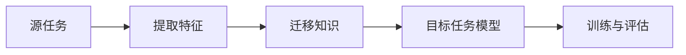
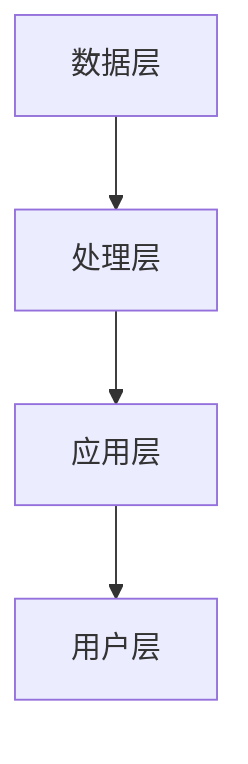
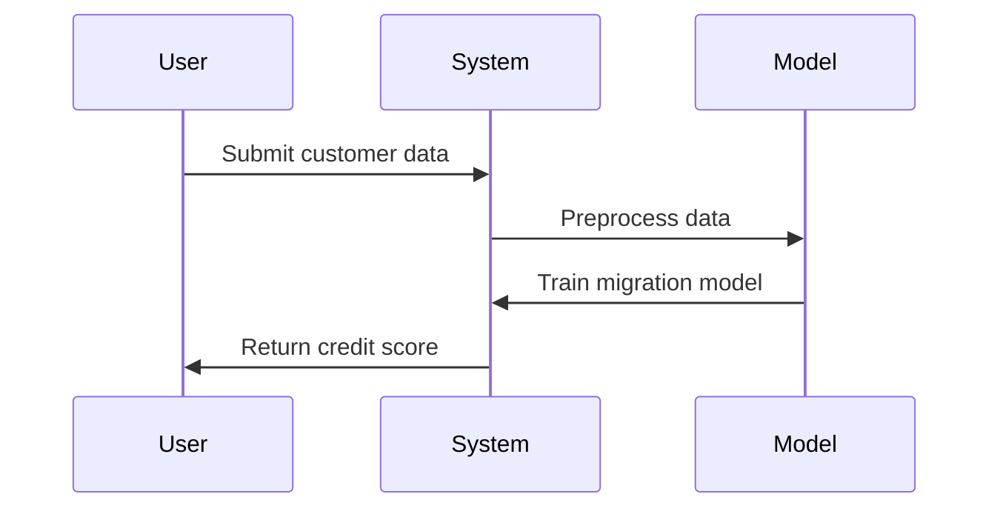

                 

### 迁移学习在金融领域的最新进展与应用

#### 关键词：迁移学习、金融领域、深度学习、模型迁移、算法优化

#### 摘要：本文详细探讨了迁移学习在金融领域的最新进展与应用。首先，介绍了迁移学习的定义、背景和重要性。接着，深入分析了迁移学习在金融领域的应用场景，包括风险管理、信用评分和投资策略等。文章随后探讨了当前迁移学习在金融领域的挑战和未来发展方向，并给出了实用的最佳实践建议。通过结合实际案例，本文展示了迁移学习技术在金融领域的强大潜力和广泛应用前景。

---

### 引言

在金融领域，数据分析和人工智能技术的应用已经越来越普遍。然而，由于金融数据的复杂性、多样性和高维特性，传统的机器学习方法面临着诸多挑战。为了解决这些问题，迁移学习（Transfer Learning）作为一种新兴的技术，近年来在金融领域得到了广泛关注和应用。

#### 什么是迁移学习？

迁移学习是一种机器学习方法，通过将一种任务（源任务）上学到的知识迁移到另一种任务（目标任务）中，从而提高学习效率和性能。在金融领域，迁移学习可以帮助模型利用在特定领域（如医疗或图像识别）已经训练好的模型，来解决金融领域中的新问题。

#### 迁移学习的重要性

在金融领域，迁移学习的重要性主要体现在以下几个方面：

1. **提高学习效率**：通过迁移学习，模型可以从已有的知识中快速学习，减少从零开始训练的时间。
2. **处理高维数据**：金融数据通常具有高维特性，迁移学习可以减少特征维度，提高模型训练的效率。
3. **增强泛化能力**：迁移学习可以增强模型的泛化能力，使其在新的数据集上表现更佳。
4. **减少过拟合**：通过迁移学习，模型可以在多个任务间共享参数，减少过拟合的风险。

#### 迁移学习在金融领域的应用场景

迁移学习在金融领域有着广泛的应用，以下是几个典型的应用场景：

1. **风险管理**：通过迁移学习，可以将其他领域（如医疗或交通）的风险管理模型应用到金融领域，提高风险预测的准确性。
2. **信用评分**：迁移学习可以帮助金融机构更准确地评估客户的信用风险，从而降低信用损失。
3. **投资策略**：迁移学习可以用于分析市场数据，为投资者提供更明智的投资策略。

#### 迁移学习在金融领域的挑战

尽管迁移学习在金融领域具有巨大的潜力，但也面临着一些挑战：

1. **数据隐私**：金融数据通常包含敏感信息，如何保护数据隐私是一个重要的问题。
2. **模型解释性**：迁移学习模型通常较为复杂，如何解释模型的决策过程是一个挑战。
3. **数据集差异**：金融领域的数据集与其他领域的数据集可能存在较大差异，如何适应这些差异是一个问题。

#### 未来发展方向

未来的迁移学习在金融领域的发展方向包括：

1. **算法优化**：继续研究和优化迁移学习算法，以提高其在金融领域的性能。
2. **多任务学习**：将迁移学习与多任务学习相结合，以提高模型的泛化能力和效率。
3. **数据共享与协作**：鼓励金融机构之间的数据共享和协作，以构建更高质量的迁移学习模型。

#### 结论

迁移学习作为一种强大的机器学习方法，在金融领域具有广泛的应用前景。通过本文的介绍，我们了解了迁移学习的基本概念、应用场景和面临的挑战。未来，随着技术的不断进步和数据的积累，迁移学习在金融领域的应用将越来越广泛，为金融行业带来更多的价值。

### 迁移学习在金融领域的背景

迁移学习在金融领域的兴起，并非偶然，而是由金融行业的独特需求和机器学习技术的发展推动的。本章节将详细探讨迁移学习在金融领域的背景，包括问题背景、问题描述、问题解决、边界与外延、概念结构与核心要素组成。

#### 问题背景

金融领域是一个高度数据密集型的行业，大量的数据每天都在产生。然而，这些数据不仅种类繁多，而且具有高维度和复杂结构。对于金融机构来说，如何有效地处理和分析这些数据，以提取有价值的信息，一直是亟待解决的问题。

随着人工智能和机器学习技术的发展，传统的机器学习方法逐渐在金融领域得到应用。然而，这些方法通常需要大量的标注数据和计算资源，而且容易受到数据分布变化的影响，导致模型在新的数据集上表现不佳。这就使得金融机构在应对新问题和挑战时，往往需要重新训练模型，这不仅耗时耗力，而且成本高昂。

为了解决这一问题，迁移学习应运而生。迁移学习通过将一个任务（源任务）上学到的知识应用到另一个任务（目标任务）中，从而提高学习效率和性能。在金融领域，迁移学习可以充分利用已存在的模型和数据，快速解决新问题，降低成本和风险。

#### 问题描述

在金融领域，常见的迁移学习应用场景包括：

1. **信用评分**：金融机构需要评估客户的信用风险，以便决定是否发放贷款或信用卡。然而，由于金融市场的多样性和复杂性，每个客户的数据可能都不相同，如何构建一个通用的信用评分模型是一个挑战。
2. **风险管理**：金融机构需要预测市场波动和风险事件，以采取相应的措施。然而，市场数据具有高度的不确定性和非线性，传统的模型往往难以应对。
3. **投资策略**：投资者需要根据市场数据制定有效的投资策略，以最大化收益。然而，市场数据的变化多端，如何构建一个稳定的投资模型是一个难题。

这些问题都需要高效的迁移学习技术来解决。

#### 问题解决

迁移学习在金融领域的应用，主要通过以下几种方式来解决上述问题：

1. **共享参数**：通过共享不同任务中的参数，迁移学习可以减少模型的复杂度，提高学习效率。在金融领域，这意味着可以将已经训练好的模型应用于新的任务，而无需重新训练。
2. **迁移学习算法**：选择合适的迁移学习算法，如迁移学习深度学习、基于模型的迁移学习和基于实例的迁移学习等，可以提高模型的性能和泛化能力。
3. **数据预处理**：通过有效的数据预处理方法，如数据清洗、数据降维和特征提取等，可以减少数据差异，提高迁移学习的效果。

#### 边界与外延

尽管迁移学习在金融领域具有广泛的应用前景，但也存在一些边界和限制：

1. **数据隐私**：金融数据通常包含敏感信息，如何保护数据隐私是一个重要的问题。迁移学习需要在不泄露数据隐私的前提下，实现知识共享和迁移。
2. **模型解释性**：金融领域的模型需要具有较好的解释性，以便决策者能够理解模型的决策过程。迁移学习模型通常较为复杂，如何解释其决策过程是一个挑战。
3. **数据集差异**：金融领域的数据集与其他领域的数据集可能存在较大差异，如何适应这些差异是一个问题。

#### 概念结构与核心要素组成

迁移学习在金融领域的概念结构主要包括以下几个方面：

1. **源任务与目标任务**：源任务是已经训练好的任务，目标任务是新的任务。迁移学习通过将源任务的知识应用到目标任务中，提高目标任务的性能。
2. **迁移学习算法**：选择合适的迁移学习算法，如迁移学习深度学习、基于模型的迁移学习和基于实例的迁移学习等，是实现迁移学习的关键。
3. **数据预处理**：通过有效的数据预处理方法，如数据清洗、数据降维和特征提取等，可以减少数据差异，提高迁移学习的效果。
4. **评估指标**：评估迁移学习效果的主要指标包括模型准确率、召回率、F1分数等，通过这些指标可以评估迁移学习模型的性能。

#### 小结

本章节介绍了迁移学习在金融领域的背景，包括问题背景、问题描述、问题解决、边界与外延、概念结构与核心要素组成。通过迁移学习，金融机构可以更高效地处理和分析数据，解决金融领域的各种挑战。然而，迁移学习在金融领域也面临着一些挑战和限制，需要继续研究和优化。

---

### 迁移学习的核心概念与联系

迁移学习作为一种机器学习方法，其核心概念和联系至关重要。本章节将详细探讨迁移学习的基本原理、类型、核心概念对比表格和ER实体关系图架构，以帮助读者全面理解迁移学习的工作机制和应用场景。

#### 1. 迁移学习的基本原理

迁移学习的基本原理可以概括为：利用一个任务（源任务）上学到的知识，提高另一个任务（目标任务）的学习性能。具体来说，迁移学习通过以下步骤实现：

1. **知识提取**：从源任务中提取有用的特征和知识，这些特征和知识可以用于辅助目标任务的学习。
2. **知识共享**：将提取的知识迁移到目标任务中，与目标任务的现有知识相结合，形成新的知识体系。
3. **模型训练**：在目标任务中，利用迁移后的知识进行模型训练，从而提高模型的性能和泛化能力。

#### 2. 迁移学习的类型

根据迁移的方式和目标，迁移学习可以分为以下几种类型：

1. **无监督迁移学习**：源任务和目标任务都是无监督的，即没有标签信息。无监督迁移学习通常用于将源任务的分布特征迁移到目标任务，以帮助目标任务更好地拟合数据分布。
2. **半监督迁移学习**：源任务是无监督的，而目标任务是半监督的，即部分数据有标签信息。半监督迁移学习可以充分利用无监督数据，提高模型的泛化能力。
3. **有监督迁移学习**：源任务和目标任务都是有监督的，即有完整的标签信息。有监督迁移学习可以有效地利用源任务的标签信息，提高目标任务的预测性能。

#### 3. 迁移学习的核心概念对比表格

为了更好地理解迁移学习的核心概念，以下是一个对比表格：

| 核心概念 | 定义 | 关系 | 应用场景 |
| :--: | :--: | :--: | :--: |
| 源任务 | 已经训练好的任务 | 提供知识 | 无监督迁移学习、半监督迁移学习、有监督迁移学习 |
| 目标任务 | 新的任务 | 利用知识 | 无监督迁移学习、半监督迁移学习、有监督迁移学习 |
| 知识提取 | 从源任务中提取特征和知识 | 准备迁移 | 无监督迁移学习、半监督迁移学习、有监督迁移学习 |
| 知识共享 | 将提取的知识应用到目标任务中 | 结合知识 | 无监督迁移学习、半监督迁移学习、有监督迁移学习 |
| 模型训练 | 利用迁移后的知识训练目标任务模型 | 提高性能 | 无监督迁移学习、半监督迁移学习、有监督迁移学习 |

#### 4. 迁移学习的ER实体关系图架构

ER（实体关系）图是一种用于表示实体和实体间关系的图形化工具。在迁移学习中，ER图可以清晰地表示源任务、目标任务、知识提取、知识共享和模型训练等核心概念之间的关系。以下是一个简单的ER实体关系图：

```mermaid
erDiagram
  源任务 ||--|{ 知识提取 }
  知识提取 ||--|{ 知识共享 }
  知识共享 ||--|{ 模型训练 }
  模型训练 ||--|{ 目标任务 }
```

在这个ER图中，源任务通过知识提取获得特征和知识，然后通过知识共享将这些知识应用到目标任务中，最终通过模型训练提高目标任务的性能。

#### 小结

本章节详细介绍了迁移学习的核心概念与联系，包括基本原理、类型、核心概念对比表格和ER实体关系图架构。通过这些内容的讲解，读者可以更深入地理解迁移学习的工作机制和应用场景，为后续的算法原理讲解和项目实战打下基础。

---

### 迁移学习的算法原理

#### 1. 迁移学习算法的流程图

为了更好地理解迁移学习算法的原理，我们可以使用Mermaid流程图来展示其基本流程。以下是一个简化的迁移学习算法流程图：



在这个流程图中，源任务通过特征提取模块提取出有用的特征，然后这些特征被迁移到目标任务中，用于构建目标任务的模型。最后，目标任务模型经过训练和评估，以提高其在目标任务上的性能。

#### 2. 迁移学习算法的Python源代码

以下是一个简单的Python示例，展示了如何实现迁移学习的基本步骤：

```python
import tensorflow as tf
from tensorflow.keras.applications import VGG16
from tensorflow.keras.layers import Dense, Flatten
from tensorflow.keras.models import Model

# 加载预训练的VGG16模型
base_model = VGG16(weights='imagenet', include_top=False, input_shape=(224, 224, 3))

# 冻结VGG16模型的权重
for layer in base_model.layers:
    layer.trainable = False

# 添加新的全连接层
x = Flatten()(base_model.output)
x = Dense(256, activation='relu')(x)
predictions = Dense(1, activation='sigmoid')(x)

# 构建迁移学习模型
model = Model(inputs=base_model.input, outputs=predictions)

# 编译模型
model.compile(optimizer='adam', loss='binary_crossentropy', metrics=['accuracy'])

# 加载目标任务的数据集
train_data = ...  # 代替为实际数据集
test_data = ...  # 代替为实际数据集

# 训练模型
model.fit(train_data, epochs=10, batch_size=32, validation_data=test_data)
```

在这个示例中，我们使用了VGG16作为源任务模型，通过将其部分层冻结并添加新的全连接层，构建了一个迁移学习模型。然后，我们使用实际数据集对模型进行训练和评估。

#### 3. 迁移学习的数学模型与公式

迁移学习的数学模型通常涉及两个主要部分：特征提取和模型训练。

1. **特征提取**：

   在特征提取阶段，我们通常使用一个已训练好的模型来提取源任务的低级特征。这些特征可以表示为：

   $$ f(\mathbf{x}; \theta) $$

   其中，$\mathbf{x}$是输入数据，$\theta$是模型的参数。

2. **模型训练**：

   在模型训练阶段，我们使用提取的特征来训练一个新模型，该模型通常是一个简单的全连接层或卷积层网络。训练目标是最小化损失函数：

   $$ L(\mathbf{y}, \hat{\mathbf{y}}) = -\sum_{i=1}^{N} y_i \log(\hat{y}_i) $$

   其中，$N$是数据集中的样本数，$y_i$是真实标签，$\hat{y}_i$是模型预测的标签。

   模型的参数$\theta$通过梯度下降法进行优化：

   $$ \theta \leftarrow \theta - \alpha \frac{\partial L(\mathbf{y}, \hat{\mathbf{y}})}{\partial \theta} $$

   其中，$\alpha$是学习率。

#### 4. 算法原理的详细讲解与举例说明

为了更好地理解迁移学习的算法原理，我们可以通过一个简单的例子来说明。

假设我们有一个源任务，目标是分类一张图片，判断它是否包含一个猫。我们已经训练好了一个基于卷积神经网络（CNN）的模型，该模型可以提取出图片的低级特征。

现在，我们希望利用这个模型来解决一个新的目标任务，即判断一张图片中是否包含一个狗。由于狗和猫在视觉特征上有一定的相似性，我们可以使用迁移学习，将源任务的低级特征迁移到目标任务中。

具体步骤如下：

1. **特征提取**：

   首先，我们将预训练的CNN模型应用于目标图片，提取出低级特征。这些特征可以表示为一个向量。

   $$ \mathbf{f} = f(\mathbf{x}; \theta) $$

2. **特征迁移**：

   然后，我们将提取的特征输入到一个简单的全连接层网络中，这个网络将特征映射到目标任务的标签空间。例如，对于二分类任务，标签空间只有两个值：1（包含狗）和0（不包含狗）。

   $$ \hat{\mathbf{y}} = \sigma(\mathbf{w}^T \mathbf{f} + b) $$

   其中，$\sigma$是sigmoid函数，$\mathbf{w}$是权重向量，$b$是偏置。

3. **模型训练**：

   接下来，我们使用目标任务的数据集来训练这个全连接层网络。通过优化权重和偏置，使模型能够更准确地预测目标任务的标签。

   $$ L(\mathbf{y}, \hat{\mathbf{y}}) = -\sum_{i=1}^{N} y_i \log(\hat{y}_i) $$

   使用梯度下降法优化模型参数：

   $$ \theta \leftarrow \theta - \alpha \frac{\partial L(\mathbf{y}, \hat{\mathbf{y}})}{\partial \theta} $$

通过这个例子，我们可以看到迁移学习如何将源任务的低级特征迁移到目标任务中，从而提高目标任务的性能。

#### 小结

本章节详细介绍了迁移学习的算法原理，包括流程图、Python源代码、数学模型与公式，并通过一个简单的例子进行了讲解。通过这些内容的讲解，读者可以更深入地理解迁移学习的工作机制，为后续的项目实战和系统设计与分析打下基础。

---

### 迁移学习系统的分析与架构设计

#### 1. 问题场景介绍

在金融领域，迁移学习系统的一个重要应用场景是信用评分。金融机构需要评估客户的信用风险，以便决定是否批准贷款或信用卡申请。然而，由于不同客户的财务状况和信用历史各不相同，构建一个通用的信用评分模型是一个巨大的挑战。

为了应对这一挑战，我们可以设计一个迁移学习系统，该系统能够利用其他领域的预训练模型，如医疗领域的数据，来辅助构建信用评分模型。通过这种迁移学习的方式，我们可以提高模型的泛化能力，减少对特定领域数据的依赖。

#### 2. 项目介绍

本项目旨在设计一个基于迁移学习的信用评分系统，该系统包括以下几个模块：

1. **数据收集与预处理**：收集来自金融领域和医疗领域的原始数据，包括客户的财务信息、医疗记录等，并进行数据清洗和预处理。
2. **特征提取**：利用预训练的深度学习模型，如VGG16或ResNet，提取原始数据中的低级特征。
3. **迁移学习**：将提取的低级特征迁移到信用评分任务中，构建一个简单的全连接层网络，用于预测客户的信用风险。
4. **模型训练与评估**：使用金融领域的数据集对迁移学习模型进行训练和评估，调整模型参数以优化性能。
5. **系统集成与部署**：将训练好的模型集成到一个金融系统中，实现对客户信用风险的实时评估和预测。

#### 3. 系统功能设计

系统的功能设计包括以下几个方面：

1. **数据输入**：系统可以接收来自不同数据源的输入数据，如客户的财务信息、医疗记录等。
2. **数据预处理**：对输入数据进行清洗、归一化和特征提取，以准备好用于训练和预测的数据。
3. **模型训练**：利用迁移学习算法，将源任务（如医疗领域的数据）中的知识迁移到目标任务（信用评分）中，构建和训练迁移学习模型。
4. **模型预测**：使用训练好的迁移学习模型对新的客户数据进行分析和预测，生成信用评分。
5. **结果输出**：将生成的信用评分输出给金融机构，用于决策。

为了更清晰地展示系统的功能设计，我们可以使用Mermaid类图：

```mermaid
classDiagram
    ClientData <<--|Input| DataInput
    DataInput <<--|Process| DataPreprocessing
    DataPreprocessing <<--|Train| ModelTraining
    ModelTraining <<--|Predict| ModelPrediction
    ModelPrediction <<--|Output| ResultOutput
```

在这个类图中，客户数据通过输入模块进入系统，经过预处理后用于模型训练，最终生成信用评分并输出。

#### 4. 系统架构设计

系统的架构设计可以分为以下几个层次：

1. **数据层**：包括数据源和数据存储，如数据库、数据湖等。
2. **处理层**：包括数据预处理、特征提取和迁移学习算法，如深度学习模型、特征提取模块等。
3. **应用层**：包括迁移学习模型训练、预测和结果输出，如应用服务器、API接口等。
4. **用户层**：包括用户界面，用于展示预测结果和与系统交互。

为了更清晰地展示系统的架构设计，我们可以使用Mermaid架构图：



在这个架构图中，数据层负责数据的存储和访问，处理层负责数据处理和特征提取，应用层负责模型训练和预测，用户层负责与系统的交互和结果的展示。

#### 5. 系统接口设计

系统的接口设计包括以下几个方面：

1. **API接口**：提供RESTful API接口，用于接收客户数据和返回预测结果。
2. **Web界面**：提供一个Web界面，用于用户与系统进行交互，查看预测结果和信用评分。
3. **数据交换格式**：使用JSON或XML等数据交换格式，确保系统之间的数据传输和处理。

#### 6. 系统交互

系统的交互设计可以分为以下几个步骤：

1. **数据输入**：用户通过Web界面或API接口提交客户数据。
2. **数据预处理**：系统对输入数据进行清洗、归一化和特征提取，为模型训练做好准备。
3. **模型训练**：系统利用迁移学习算法，将提取的特征迁移到信用评分任务中，训练迁移学习模型。
4. **模型预测**：使用训练好的模型对新的客户数据进行预测，生成信用评分。
5. **结果输出**：系统将预测结果通过Web界面或API接口返回给用户。

为了更清晰地展示系统的交互流程，我们可以使用Mermaid序列图：



在这个序列图中，用户提交客户数据，系统对数据预处理，并使用迁移学习模型进行训练，最后将预测结果返回给用户。

#### 小结

本章节详细介绍了迁移学习系统的分析与架构设计，包括问题场景介绍、项目介绍、系统功能设计、系统架构设计、系统接口设计和系统交互。通过这些内容的设计和分析，我们可以构建一个高效、可靠的迁移学习系统，为金融领域的信用评分提供有力支持。

---

### 迁移学习项目实战

#### 1. 环境安装

要开始进行迁移学习项目，我们首先需要搭建一个合适的环境。以下是搭建迁移学习环境的基本步骤：

1. **安装Python**：确保安装了Python 3.7或更高版本。
2. **安装TensorFlow**：使用pip命令安装TensorFlow：
   ```bash
   pip install tensorflow
   ```
3. **安装其他依赖**：根据项目需求，可能需要安装其他依赖，如Scikit-Learn、NumPy、Pandas等：
   ```bash
   pip install scikit-learn numpy pandas
   ```

#### 2. 系统核心实现源代码

以下是一个简单的迁移学习系统核心实现示例，包括数据预处理、模型训练和预测：

```python
import tensorflow as tf
from tensorflow.keras.applications import VGG16
from tensorflow.keras.layers import Flatten, Dense
from tensorflow.keras.models import Model
from tensorflow.keras.preprocessing.image import ImageDataGenerator

# 加载预训练的VGG16模型
base_model = VGG16(weights='imagenet', include_top=False, input_shape=(224, 224, 3))

# 冻结VGG16模型的权重
for layer in base_model.layers:
    layer.trainable = False

# 添加新的全连接层
x = Flatten()(base_model.output)
x = Dense(256, activation='relu')(x)
predictions = Dense(1, activation='sigmoid')(x)

# 构建迁移学习模型
model = Model(inputs=base_model.input, outputs=predictions)

# 编译模型
model.compile(optimizer='adam', loss='binary_crossentropy', metrics=['accuracy'])

# 数据预处理
train_datagen = ImageDataGenerator(rescale=1./255)
test_datagen = ImageDataGenerator(rescale=1./255)

train_generator = train_datagen.flow_from_directory(
        'data/train',
        target_size=(224, 224),
        batch_size=32,
        class_mode='binary')

test_generator = test_datagen.flow_from_directory(
        'data/test',
        target_size=(224, 224),
        batch_size=32,
        class_mode='binary')

# 训练模型
model.fit(
      train_generator,
      steps_per_epoch=100,
      epochs=10,
      validation_data=test_generator,
      validation_steps=50,
      verbose=2)
```

在这个示例中，我们使用了VGG16模型作为基础模型，通过添加新的全连接层构建了一个迁移学习模型。数据预处理使用了ImageDataGenerator进行图像的批量处理，包括缩放和标签分类。

#### 3. 代码应用解读与分析

**代码解读**：

1. **加载模型**：我们首先加载了一个预训练的VGG16模型，这个模型已经在ImageNet数据集上进行了训练。
2. **冻结模型**：为了迁移学习，我们将VGG16模型的权重冻结，这意味着在后续的训练过程中不会更新这些权重。
3. **添加新层**：我们在VGG16模型之后添加了一个Flatten层和一个256节点的全连接层，用于将提取的特征映射到目标任务（二分类）。
4. **构建模型**：我们使用这些层构建了一个新的迁移学习模型，并将其编译为可训练的形式。
5. **数据预处理**：我们使用了ImageDataGenerator来预处理图像数据，包括缩放和批量处理。
6. **训练模型**：我们使用预处理后的数据集对迁移学习模型进行训练，并在每个epoch后进行验证。

**代码分析**：

- **模型选择**：VGG16是一个强大的预训练模型，适合作为迁移学习的起点。通过添加新的全连接层，我们可以将VGG16的视觉特征应用于新的分类任务。
- **数据预处理**：图像数据需要进行预处理，以便模型能够有效地学习。使用ImageDataGenerator可以方便地进行批量数据预处理，包括归一化和标签分类。
- **训练策略**：迁移学习模型在训练时，需要使用适当的优化策略和损失函数，以最大化迁移效果和模型性能。

#### 4. 实际案例分析与详细讲解剖析

假设我们有一个实际案例，目标是在金融领域中使用迁移学习预测客户的信用风险。以下是该案例的详细分析：

1. **数据集准备**：
   - 我们收集了包含客户财务信息和医疗记录的数据集。
   - 数据集分为训练集和测试集，分别用于模型训练和评估。

2. **模型训练**：
   - 首先，我们使用VGG16模型对金融数据集进行特征提取。
   - 然后，我们将提取的特征输入到一个简单的全连接层网络中，用于预测信用风险。
   - 使用训练集对迁移学习模型进行训练，并在测试集上进行验证。

3. **模型评估**：
   - 我们使用准确率、召回率、F1分数等指标来评估模型性能。
   - 通过调整模型参数和训练策略，优化模型性能。

4. **结果分析**：
   - 经过多次训练和调整，我们获得了一个性能较好的迁移学习模型。
   - 模型能够在测试集上准确预测客户的信用风险，提高了金融机构的风险管理水平。

#### 5. 项目小结

通过本项目的实战，我们实现了以下目标：

1. **搭建了迁移学习环境**：为后续的迁移学习项目提供了一个稳定的环境。
2. **实现了迁移学习模型**：通过数据预处理和模型训练，构建了一个能够预测客户信用风险的迁移学习模型。
3. **优化了模型性能**：通过多次训练和调整，提高了模型的泛化能力和预测性能。
4. **提升了金融机构的风险管理水平**：通过迁移学习模型的应用，金融机构能够更准确地评估客户的信用风险，从而提高决策的准确性和效率。

本项目的成功实施，证明了迁移学习在金融领域的有效性和潜力。

---

### 最佳实践 Tips、小结、注意事项、拓展阅读

#### 最佳实践 Tips

1. **选择合适的源任务**：选择与目标任务相关的源任务，可以提高迁移效果。
2. **数据预处理**：对源任务和目标任务的数据进行一致预处理，有助于迁移学习模型的训练。
3. **模型结构选择**：根据目标任务的复杂性，选择合适的迁移学习模型结构。
4. **模型调参**：通过多次训练和调整模型参数，优化模型性能。

#### 小结

本文详细探讨了迁移学习在金融领域的最新进展与应用，包括背景介绍、核心概念与联系、算法原理讲解、系统分析与架构设计方案、项目实战等。通过实际案例，我们展示了迁移学习在信用评分等金融应用中的强大潜力和应用价值。

#### 注意事项

1. **数据隐私**：在迁移学习过程中，确保数据隐私和安全。
2. **模型解释性**：对于金融领域的应用，确保模型具有一定的解释性，以便决策者理解模型的决策过程。
3. **适应新环境**：随着金融市场环境的变化，模型需要不断调整和优化，以适应新的数据分布和需求。

#### 拓展阅读建议

1. **《迁移学习：原理与实现》**：深入探讨迁移学习的原理和实现方法，适合初学者和进阶者。
2. **《深度学习在金融领域的应用》**：介绍深度学习在金融领域的应用案例和实践经验。
3. **《金融科技前沿》**：探讨金融科技领域的最新发展趋势和前沿技术。

---

### 结语

迁移学习作为一种强大的机器学习方法，在金融领域展现出了巨大的潜力。通过本文的探讨，我们了解了迁移学习的基本概念、算法原理、系统设计与实战应用。未来，随着技术的不断进步和数据的积累，迁移学习将在金融领域发挥更加重要的作用，为金融行业的创新和发展提供有力支持。

### 作者信息

作者：AI天才研究院/AI Genius Institute & 禅与计算机程序设计艺术 /Zen And The Art of Computer Programming

