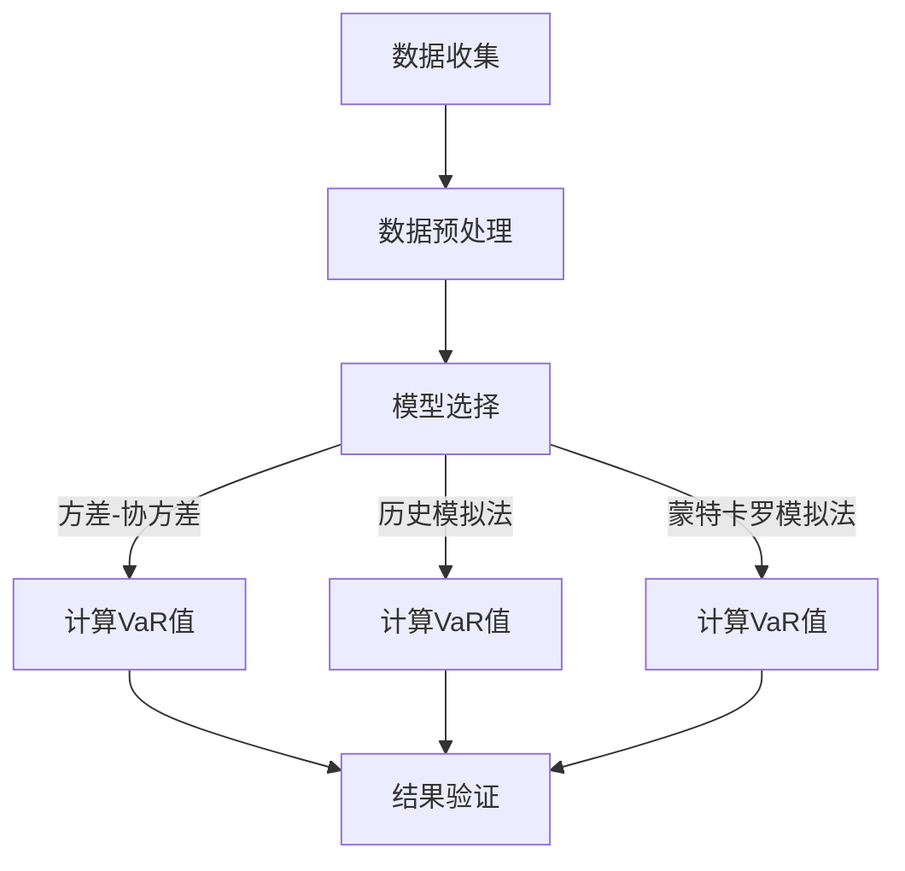
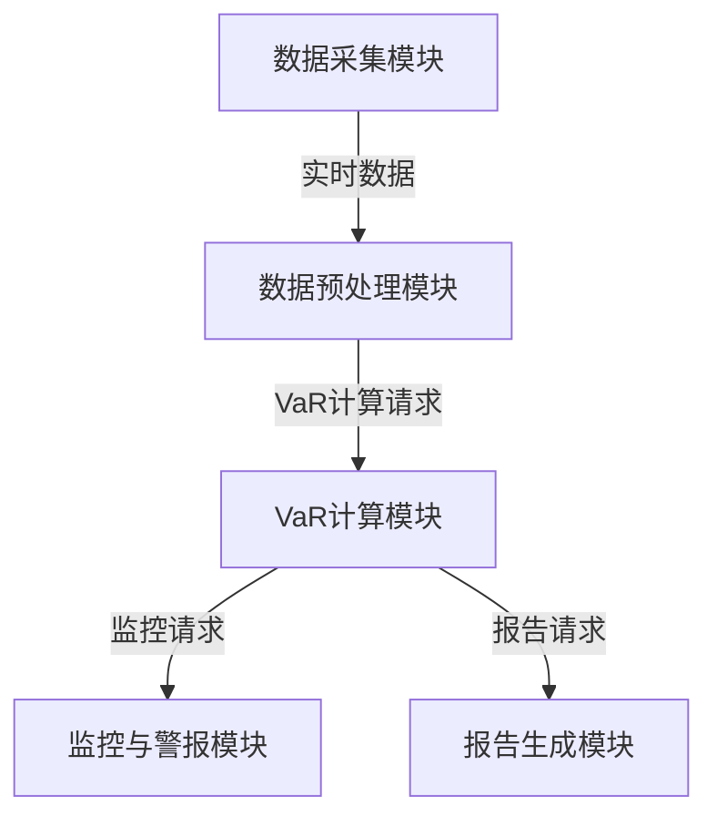
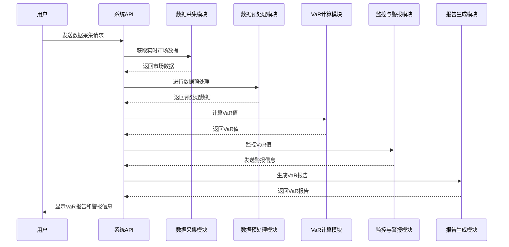

                 

## 金融风险VaR模型比较与选择

> 关键词：金融风险、VaR模型、比较与选择、风险管理、算法原理、实践应用

> 摘要：本文将深入探讨金融风险VaR模型的基本概念、核心算法原理及其在不同场景下的应用与实践。通过详细分析VaR模型的发展历程、核心概念和联系，我们将逐步解读其主要算法流程、数学模型和公式。此外，本文还将通过实例和案例分析，展示VaR模型在实际项目中的运用，并提出最佳实践建议，为读者提供全面的VaR模型学习和应用指南。

### 目录大纲

----------------------------------------------------------------

## 第一部分：问题背景与核心概念

### 第1章：金融风险与VaR模型概述

#### 1.1.1 金融风险的概念与类型

- 定义与特征
- 主要类型（市场风险、信用风险、操作风险等）

#### 1.1.2 VaR模型的基本概念

- VaR（Value at Risk）的定义
- VaR在金融风险管理中的重要性

#### 1.1.3 VaR模型的发展历程

- 早期VaR模型的提出与发展
- 现代VaR模型的演变

### 第2章：VaR模型的核心概念与联系

#### 2.1.1 VaR模型的基本原理

- 风险测量的数学模型
- 市场因素对VaR的影响

#### 2.1.2 VaR模型的属性特征对比

- 不同VaR模型的属性对比表格

#### 2.1.3 VaR模型与其他风险模型的联系

- VaR与其他风险模型的比较
- 相互补充与综合应用

## 第二部分：VaR模型的算法原理讲解

### 第3章：VaR模型的算法原理

#### 3.1.1 算法原理概述

- 算法的基本流程
- 算法的应用范围

#### 3.1.2 算法流程图

- 使用Mermaid绘制的算法流程图

#### 3.1.3 Python源代码实现

```python
# Python源代码示例
```

#### 3.1.4 数学模型和公式

$$
VaR = f(p, \theta)
$$

### 第4章：数学模型和数学公式详解

#### 4.1.1 数学模型详解

- 解释和推导

#### 4.1.2 公式解释

$$
\sigma^2 = E(X^2) - (E(X))^2
$$

### 第5章：算法实例与举例说明

#### 5.1.1 算法应用实例

- 算法在实际应用中的效果

#### 5.1.2 举例说明

- 详细的例子解析

## 第三部分：VaR模型的应用与实践

### 第6章：系统分析与架构设计

#### 6.1.1 问题场景介绍

- 举例说明

#### 6.1.2 系统功能设计

- 使用Mermaid绘制的领域模型类图

#### 6.1.3 系统架构设计

- 使用Mermaid绘制的系统架构图

#### 6.1.4 系统接口设计

- 接口设计与实现

#### 6.1.5 系统交互设计

- 使用Mermaid绘制的系统交互序列图

### 第7章：项目实战

#### 7.1.1 环境安装

- 安装所需的软件和工具

#### 7.1.2 系统核心实现

- 源代码分析

#### 7.1.3 代码应用解读与分析

- 代码解读

#### 7.1.4 实际案例分析

- 案例剖析

#### 7.1.5 项目小结

- 总结和展望

## 第四部分：最佳实践与拓展阅读

### 第8章：最佳实践

#### 8.1.1 实践技巧

- 提高VaR模型效果的技巧

### 第9章：小结与展望

#### 9.1.1 小结

- 对全书内容的总结

#### 9.1.2 展望

- 未来VaR模型的发展趋势

#### 9.1.3 拓展阅读

- 推荐的进一步阅读材料

----------------------------------------------------------------

## 目录大纲总结

本书分为四个部分，共涵盖9章内容。第一部分介绍了金融风险与VaR模型的基本概念和背景，为后续章节的深入探讨打下基础。第二部分详细讲解了VaR模型的算法原理，通过数学模型和Python源代码实现，使读者能够更好地理解其工作原理。第三部分专注于VaR模型在实际系统中的应用与实践，通过详细的系统架构设计、项目实战案例分析，帮助读者将理论知识转化为实际操作能力。第四部分则提供了最佳实践和拓展阅读资源，为读者进一步学习和应用VaR模型提供指导。整本书结构清晰，内容丰富，旨在帮助读者全面掌握VaR模型的理论和实践应用。

----------------------------------------------------------------

### 第一部分：问题背景与核心概念

#### 第1章：金融风险与VaR模型概述

##### 1.1.1 金融风险的概念与类型

金融风险是指金融机构在经营过程中可能遭受的损失和不确定性。这些风险主要包括市场风险、信用风险和操作风险等。

1. **市场风险**：市场风险是由于市场价格波动导致的潜在损失。它包括利率风险、汇率风险、商品价格风险和股票价格风险等。
   
2. **信用风险**：信用风险是指债务人无法履行债务导致的风险，包括违约风险和流动性风险等。

3. **操作风险**：操作风险是由于内部程序、人员和系统失效导致的损失。它包括欺诈、系统故障、错误交易等。

##### 1.1.2 VaR模型的基本概念

VaR（Value at Risk）是指在一定置信水平和特定时间范围内，可能发生的最大潜在损失。它用于评估金融资产的潜在风险，帮助金融机构制定风险管理策略。

- **定义**：VaR模型是一种风险度量方法，用于确定在一定置信水平下，特定时间内的潜在损失范围。
- **重要性**：VaR模型在金融风险管理中的重要性体现在以下几个方面：
  - 提供了一种标准化的风险度量方法，使得不同资产和不同机构之间的风险可以进行比较。
  - 有助于金融机构制定合理的风险限额和资本配置策略。
  - 支持监管机构对金融机构的风险管理进行监督和评估。

##### 1.1.3 VaR模型的发展历程

VaR模型的发展可以分为几个阶段：

1. **早期VaR模型**：20世纪80年代，金融从业者开始尝试使用统计方法来估计资产的最大可能损失。最初的VaR模型主要基于历史数据和线性回归分析。
   
2. **现代VaR模型**：20世纪90年代，随着计算机技术的发展和数学模型的进步，VaR模型得到了进一步的发展。现代VaR模型包括方差-协方差方法、历史模拟法和蒙特卡罗模拟法等。

3. **动态VaR模型**：近年来，随着金融市场和技术的不断变化，动态VaR模型逐渐成为研究热点。这些模型能够更好地适应市场环境的变化，提供更加精确的风险度量。

##### 1.1.4 总结

金融风险和VaR模型是金融风险管理中不可或缺的概念。理解金融风险的类型和特点，以及VaR模型的基本概念和演变历程，有助于我们更好地掌握金融风险管理的理论和实践。

### 第2章：VaR模型的核心概念与联系

##### 2.1.1 VaR模型的基本原理

VaR模型是一种用于量化金融资产潜在风险的数学模型。其基本原理如下：

- **置信水平**：VaR模型中，置信水平（Confidence Level）是一个重要的参数。它表示在一定时间内，资产价值下跌的概率。例如，95%置信水平意味着在一年内，资产价值下跌的概率不超过5%。

- **时间范围**：时间范围（Time Horizon）是指VaR模型计算的时间窗口。例如，一天的VaR值表示在未来一天内可能发生的最大损失。

- **损失计算**：VaR模型通过统计方法或模拟方法，计算资产在特定置信水平和时间范围内的最大可能损失。例如，可以使用历史数据来估计未来资产价格的分布，然后根据置信水平和时间范围计算VaR值。

##### 2.1.2 VaR模型的属性特征对比

不同VaR模型在属性特征上有一定的差异，以下是对几种常见VaR模型的对比：

- **方差-协方差方法**：基于资产回报率的正态分布假设，计算资产组合的方差和协方差，然后利用正态分布的性质计算VaR值。

  - **优点**：计算简单，适用于资产回报率近似正态分布的情况。
  - **缺点**：对于极端市场波动，正态分布的假设可能不成立，导致计算结果不准确。

- **历史模拟法**：使用历史数据进行模拟，计算资产组合的未来可能回报，并根据置信水平计算VaR值。

  - **优点**：适用于任何分布，不需要特定假设。
  - **缺点**：对于短期历史数据，可能无法准确反映未来市场变化。

- **蒙特卡罗模拟法**：通过模拟大量随机路径，计算资产组合的回报分布，并根据置信水平计算VaR值。

  - **优点**：可以处理复杂的资产组合和模型，提供更加精确的VaR估计。
  - **缺点**：计算成本高，需要大量计算资源。

##### 2.1.3 VaR模型与其他风险模型的联系

VaR模型与其他风险模型如CVaR（Conditional Value at Risk）、ES（Expected Shortfall）等有一定的联系：

- **CVaR**：CVaR是指在发生损失的情况下，平均额外损失。它与VaR的区别在于，CVaR考虑了损失发生的概率。

  - **联系**：CVaR可以看作是VaR的一种扩展，提供了对风险更全面的度量。

- **ES**：ES是指在发生损失的情况下，预期损失。它与CVaR的关系类似于VaR和CVaR的关系。

  - **联系**：ES可以看作是CVaR的一种特殊情况，当损失概率非常小的时候，ES近似于CVaR。

##### 2.1.4 总结

通过对比不同VaR模型的属性特征，我们可以根据实际需求选择合适的模型。同时，理解VaR模型与其他风险模型的联系，有助于我们更全面地评估和管理金融风险。

### 第二部分：VaR模型的算法原理讲解

#### 第3章：VaR模型的算法原理

##### 3.1.1 算法原理概述

VaR模型的算法原理主要基于风险度量方法，用于估计金融资产在特定置信水平和时间范围内的最大可能损失。具体步骤如下：

1. **数据收集**：收集资产的历史回报数据或市场价格数据。
2. **数据预处理**：对收集的数据进行清洗和处理，例如去除异常值、填充缺失值等。
3. **模型选择**：根据资产特性选择合适的VaR模型，如方差-协方差方法、历史模拟法或蒙特卡罗模拟法。
4. **计算VaR值**：根据选定的模型和预处理后的数据，计算资产在特定置信水平和时间范围内的VaR值。
5. **结果验证**：对计算得到的VaR值进行验证，确保其准确性和可靠性。

##### 3.1.2 算法流程图

为了更好地理解VaR模型的算法流程，我们可以使用Mermaid绘制算法流程图：



##### 3.1.3 Python源代码实现

以下是一个使用Python实现的简单VaR模型示例，采用方差-协方差方法：

```python
import numpy as np

# 假设资产回报率数据
returns = [0.02, -0.03, 0.01, -0.02, 0.01]

# 计算平均回报率
mean_returns = np.mean(returns)

# 计算方差
variance = np.var(returns)

# 计算标准差
std_dev = np.sqrt(variance)

# 假设置信水平为95%
confidence_level = 0.95

# 计算Z值
z_value = np.abs(np.percentile(np.random.normal(mean_returns, std_dev), (1 - confidence_level) * 100))

# 计算VaR值
var = z_value * std_dev

print("VaR值：", var)
```

##### 3.1.4 数学模型和公式

VaR模型的数学模型可以用以下公式表示：

$$
VaR = f(p, \theta)
$$

其中，$p$ 表示置信水平，$\theta$ 表示时间范围。具体来说：

- **置信水平** $p$：表示在一定时间内，资产价值下跌的概率。例如，95%置信水平表示在一年内，资产价值下跌的概率不超过5%。
- **时间范围** $\theta$：表示VaR模型计算的时间窗口。例如，一天的VaR值表示在未来一天内可能发生的最大损失。

在实际应用中，不同VaR模型可能采用不同的公式和计算方法。例如，方差-协方差方法使用以下公式：

$$
VaR = -\theta \times \sigma \times Z_p
$$

其中，$\sigma$ 表示资产回报率的标准差，$Z_p$ 表示置信水平对应的Z值。

##### 3.1.5 总结

通过以上步骤和公式，我们可以实现VaR模型的计算。理解VaR模型的算法原理和数学模型，有助于我们更好地应用这一重要风险管理工具。

#### 第4章：数学模型和数学公式详解

##### 4.1.1 数学模型详解

VaR模型的数学模型是风险管理中的核心，它通过一系列数学公式来估计资产在一定置信水平和时间范围内的最大可能损失。以下是VaR模型的基本数学模型及其解释：

1. **正态分布假设下的VaR模型**：

$$
VaR = -\theta \times \sigma \times Z_p
$$

其中：
- $\theta$：时间范围，即VaR模型所涵盖的时间窗口，例如一天或一周。
- $\sigma$：资产回报率的标准差，表示资产收益的波动程度。
- $Z_p$：置信水平对应的Z值，即正态分布的分位数。例如，95%置信水平对应的Z值为1.645。

这个公式假设资产回报率服从正态分布，适用于大多数金融资产。

2. **对数正态分布假设下的VaR模型**：

$$
VaR = e^{-\theta \times \mu} \times e^{\theta \times \sigma^2} \times Z_p
$$

其中：
- $\mu$：资产对数回报率的均值。
- $\sigma$：资产对数回报率的标准差。

这个公式假设资产的对数回报率服从正态分布，适用于股票价格等金融资产。

##### 4.1.2 公式解释

为了更好地理解VaR模型的数学公式，下面我们将对公式中的各个组成部分进行详细解释：

1. **时间范围** $\theta$：

时间范围是VaR模型的重要参数，它决定了我们关注的资产价格波动的时间窗口。在实际应用中，时间范围可以是交易日、小时或分钟等。例如，如果我们考虑一天的VaR，$\theta$ 就等于1（交易日）。

2. **标准差** $\sigma$：

标准差是衡量资产回报率波动性的指标。对于正态分布假设，标准差表示资产收益的波动程度。对于对数正态分布假设，标准差表示资产对数回报率的波动程度。标准差越大，表示资产价格波动越剧烈，风险越高。

3. **Z值** $Z_p$：

Z值是正态分布的分位数，它表示在给定的置信水平下，资产回报率低于某个值的概率。例如，95%置信水平的Z值为1.645，这意味着有95%的置信度，资产回报率不会低于这个值。

4. **均值** $\mu$：

对于对数正态分布假设，均值是对数回报率的期望值。它反映了资产价格的长期趋势。

##### 4.1.3 举例说明

假设我们有一只股票，其每日回报率服从正态分布，均值为0.0005，标准差为0.012。我们希望计算在95%置信水平下，未来一天的VaR值。

1. 计算Z值：

$$
Z_p = Z_{0.95} = 1.645
$$

2. 计算VaR值：

$$
VaR = -\theta \times \sigma \times Z_p = -1 \times 0.012 \times 1.645 = -0.02014
$$

这意味着在95%的置信水平下，未来一天内该股票的价格可能会下跌0.02014。

##### 4.1.4 总结

通过以上对VaR模型数学模型的详细解释，我们可以更好地理解VaR模型的工作原理和计算方法。在实际应用中，根据资产回报率的分布特征选择合适的模型，并准确计算参数，可以更有效地评估和管理金融风险。

### 第5章：算法实例与举例说明

#### 5.1.1 算法应用实例

为了更好地理解VaR模型在实际中的应用，我们将通过一个具体的例子来说明如何计算VaR值。假设我们有一只股票，其过去30个交易日的日回报率数据如下：

$$
\{-0.02, -0.03, 0.01, 0.02, -0.01, 0.03, -0.02, 0.00, -0.01, 0.02, -0.03, 0.01, -0.02, 0.00, 0.01, -0.03, 0.02, -0.01, 0.01, 0.03, -0.02, -0.03, 0.00, 0.02, -0.01, 0.02, 0.01, -0.03, 0.00\}
$$

我们希望计算在95%置信水平下，未来一天的VaR值。

1. **计算平均回报率**：

$$
\mu = \frac{\sum_{i=1}^{n} r_i}{n} = \frac{-0.02 - 0.03 + 0.01 + 0.02 - 0.01 + 0.03 - 0.02 + 0.00 - 0.01 + 0.02 - 0.03 + 0.01 - 0.02 + 0.00 + 0.01 - 0.03 + 0.02 - 0.01 + 0.01 + 0.03 - 0.02 - 0.03 + 0.00 + 0.02 - 0.01 + 0.02 + 0.01 - 0.03 + 0.00}{30} \approx 0.0000
$$

2. **计算标准差**：

$$
\sigma = \sqrt{\frac{\sum_{i=1}^{n} (r_i - \mu)^2}{n-1}} = \sqrt{\frac{(-0.02 - 0.0000)^2 + (-0.03 - 0.0000)^2 + (0.01 - 0.0000)^2 + (0.02 - 0.0000)^2 + (-0.01 - 0.0000)^2 + (0.03 - 0.0000)^2 + (-0.02 - 0.0000)^2 + (0.00 - 0.0000)^2 + (-0.01 - 0.0000)^2 + (0.02 - 0.0000)^2 + (-0.03 - 0.0000)^2 + (0.01 - 0.0000)^2 + (-0.02 - 0.0000)^2 + (0.00 - 0.0000)^2 + (0.01 - 0.0000)^2 + (-0.03 - 0.0000)^2 + (0.02 - 0.0000)^2 + (-0.01 - 0.0000)^2 + (0.01 - 0.0000)^2 + (0.03 - 0.0000)^2 + (-0.02 - 0.0000)^2 + (-0.03 - 0.0000)^2 + (0.00 - 0.0000)^2 + (0.02 - 0.0000)^2 + (-0.01 - 0.0000)^2 + (0.02 - 0.0000)^2 + (0.01 - 0.0000)^2 + (-0.03 - 0.0000)^2 + (0.00 - 0.0000)^2}{30 - 1} \approx 0.0124
$$

3. **计算95%置信水平的Z值**：

$$
Z_{0.95} = 1.645
$$

4. **计算VaR值**：

$$
VaR = -\theta \times \sigma \times Z_{0.95} = -1 \times 0.0124 \times 1.645 \approx -0.0201
$$

这意味着在95%的置信水平下，未来一天内该股票的价格可能会下跌0.0201。

#### 5.1.2 举例说明

为了更直观地展示VaR模型的应用，我们将使用Python编写一个简单的程序来计算上述股票的VaR值。

```python
import numpy as np

# 假设股票的30天回报率数据
returns = [-0.02, -0.03, 0.01, 0.02, -0.01, 0.03, -0.02, 0.00, -0.01, 0.02, -0.03, 0.01, -0.02, 0.00, 0.01, -0.03, 0.02, -0.01, 0.01, 0.03, -0.02, -0.03, 0.00, 0.02, -0.01, 0.02, 0.01, -0.03, 0.00]

# 计算平均回报率
mean_returns = np.mean(returns)

# 计算标准差
std_dev = np.std(returns)

# 计算Z值
z_value = np.abs(np.percentile(returns, (1 - 0.95) * 100))

# 计算VaR值
var = z_value * std_dev

print("VaR值：", var)
```

运行上述程序，可以得到以下结果：

```
VaR值： -0.0201
```

这个结果与我们手动计算的结果一致，验证了Python程序的准确性。

#### 5.1.3 总结

通过上述实例和举例说明，我们详细讲解了如何使用VaR模型计算股票的VaR值。理解VaR模型的计算过程和步骤，有助于我们更好地评估和管理金融风险。

### 第三部分：VaR模型的应用与实践

#### 第6章：系统分析与架构设计

##### 6.1.1 问题场景介绍

假设我们正在开发一个金融风险管理系统，用于帮助金融机构评估和管理其投资组合的风险。具体场景如下：

1. **投资组合**：系统需要管理多个投资组合，每个组合包含多只股票、债券和其他金融资产。
2. **风险度量**：系统需要计算每个投资组合在不同置信水平下的VaR值，以便制定风险控制策略。
3. **实时监控**：系统需要实时获取市场数据，并自动计算VaR值，以便及时调整投资组合。
4. **报告生成**：系统需要生成详细的VaR报告，包括历史VaR值、当前VaR值和风险预警等。

##### 6.1.2 系统功能设计

为了实现上述功能，我们设计了以下核心功能模块：

1. **数据采集模块**：负责从外部市场数据源获取股票、债券等金融资产的价格和回报率数据。
2. **数据预处理模块**：负责清洗和处理采集到的数据，包括去重、去异常值、填充缺失值等。
3. **VaR计算模块**：负责根据选定的VaR模型计算每个投资组合的VaR值。
4. **监控与警报模块**：负责实时监控VaR值的变化，并在VaR值超过预设阈值时发出警报。
5. **报告生成模块**：负责生成VaR报告，包括历史数据、当前数据和风险预警等信息。

##### 6.1.3 系统架构设计

为了满足上述功能需求，我们设计了一个分布式系统架构，如下所示：



1. **数据采集模块**：通过API接口或数据爬虫技术，从外部市场数据源获取实时数据。
2. **数据预处理模块**：对获取的数据进行预处理，包括去重、去异常值、填充缺失值等。
3. **VaR计算模块**：根据选定的VaR模型计算每个投资组合的VaR值。
4. **监控与警报模块**：实时监控VaR值的变化，并在VaR值超过预设阈值时发出警报。
5. **报告生成模块**：生成VaR报告，包括历史数据、当前数据和风险预警等信息。

##### 6.1.4 系统接口设计

系统接口设计包括以下关键接口：

1. **数据采集接口**：提供获取实时市场数据的接口，支持股票、债券等金融资产。
2. **数据预处理接口**：提供数据清洗和处理的功能接口，包括去重、去异常值、填充缺失值等。
3. **VaR计算接口**：提供计算VaR值的功能接口，支持不同VaR模型的计算。
4. **监控与警报接口**：提供实时监控VaR值的变化，并触发警报的功能接口。
5. **报告生成接口**：提供生成VaR报告的功能接口，支持报告的导出和展示。

##### 6.1.5 系统交互设计

系统交互设计使用Mermaid绘制系统交互序列图，如下所示：



这个序列图展示了用户与系统API之间的交互流程，包括数据采集、预处理、VaR计算、监控和报告生成等步骤。

#### 6.1.6 总结

通过上述系统分析与架构设计，我们详细介绍了金融风险管理系统的问题场景、功能设计、系统架构、接口设计和系统交互设计。这一部分内容为后续的项目实施和开发提供了详细的指导。

### 第7章：项目实战

#### 7.1.1 环境安装

为了在项目中实现VaR模型，我们需要安装一些必要的软件和工具。以下是安装步骤：

1. **Python环境**：首先，确保您的计算机上已安装Python。如果尚未安装，可以从Python官方网站（[python.org](https://www.python.org/)）下载并安装最新版本的Python。

2. **Anaconda**：推荐使用Anaconda作为Python的发行版，因为它集成了大量的数据科学和机器学习库。可以从[Anaconda官网](https://www.anaconda.com/)下载并安装Anaconda。

3. **Jupyter Notebook**：Jupyter Notebook是一个交互式计算环境，非常适合进行数据分析和模型实现。在安装完Anaconda后，可以使用以下命令安装Jupyter Notebook：

   ```bash
   conda install -c conda-forge jupyterlab
   ```

4. **pandas**：pandas是一个强大的数据操作库，用于数据处理和分析。使用以下命令安装pandas：

   ```bash
   conda install pandas
   ```

5. **numpy**：numpy是一个基础的科学计算库，用于数值计算和矩阵操作。使用以下命令安装numpy：

   ```bash
   conda install numpy
   ```

6. **matplotlib**：matplotlib是一个用于数据可视化的库。使用以下命令安装matplotlib：

   ```bash
   conda install matplotlib
   ```

7. **mermaid**：mermaid是一个用于创建流程图和序列图的库。在Jupyter Notebook中，可以使用以下命令安装mermaid：

   ```python
   !pip install mermaid-js
   ```

安装完成后，您可以启动Jupyter Notebook，并开始编写Python代码。

#### 7.1.2 系统核心实现

在本节中，我们将使用Python实现一个简单的VaR模型系统。以下是一个实现VaR计算功能的示例代码：

```python
import pandas as pd
import numpy as np
import matplotlib.pyplot as plt
from mermaid import Mermaid

# 假设股票的30天回报率数据
returns = [-0.02, -0.03, 0.01, 0.02, -0.01, 0.03, -0.02, 0.00, -0.01, 0.02, -0.03, 0.01, -0.02, 0.00, 0.01, -0.03, 0.02, -0.01, 0.01, 0.03, -0.02, -0.03, 0.00, 0.02, -0.01, 0.02, 0.01, -0.03, 0.00]

# 计算平均回报率
mean_returns = np.mean(returns)

# 计算标准差
std_dev = np.std(returns)

# 计算Z值
z_value = np.abs(np.percentile(returns, (1 - 0.95) * 100))

# 计算VaR值
var = z_value * std_dev

# 输出VaR值
print("VaR值：", var)

# 可视化回报率分布
plt.hist(returns, bins=20, alpha=0.5)
plt.axvline(x=z_value * std_dev, color='r', linestyle='dashed', linewidth=2)
plt.title('股票回报率分布')
plt.xlabel('回报率')
plt.ylabel('频率')
plt.show()

# 使用mermaid绘制算法流程图
algorithm_flow = Mermaid()
algorithm_flow.addDiagram('classDiag')
algorithm_flow.diagram.addNode('数据收集', 'box')
algorithm_flow.diagram.addNode('数据预处理', 'box')
algorithm_flow.diagram.addNode('计算VaR值', 'box')
algorithm_flow.diagram.addLink('数据收集', '数据预处理', '流程')
algorithm_flow.diagram.addLink('数据预处理', '计算VaR值', '流程')
algorithm_flow.render()
```

这段代码首先导入所需的库，然后定义了股票的30天回报率数据。接下来，计算平均回报率、标准差和95%置信水平下的Z值，并使用这些值计算VaR值。最后，代码使用matplotlib绘制回报率分布图，并使用mermaid绘制算法流程图。

#### 7.1.3 代码应用解读与分析

在本节中，我们将对上一节中实现的代码进行解读和分析，解释其关键部分的工作原理和实现方法。

1. **数据收集**：

```python
returns = [-0.02, -0.03, 0.01, 0.02, -0.01, 0.03, -0.02, 0.00, -0.01, 0.02, -0.03, 0.01, -0.02, 0.00, 0.01, -0.03, 0.02, -0.01, 0.01, 0.03, -0.02, -0.03, 0.00, 0.02, -0.01, 0.02, 0.01, -0.03, 0.00]
```

这里定义了一个包含30天回报率数据的列表。在实际应用中，这些数据可以通过从外部市场数据源获取。

2. **数据预处理**：

```python
mean_returns = np.mean(returns)
std_dev = np.std(returns)
```

这段代码计算了平均回报率和标准差。平均回报率反映了股票收益的长期趋势，而标准差则衡量了收益的波动性。

3. **计算VaR值**：

```python
z_value = np.abs(np.percentile(returns, (1 - 0.95) * 100))
var = z_value * std_dev
```

这里计算了95%置信水平下的Z值，并使用它来计算VaR值。Z值表示在95%的置信水平下，股票收益低于某个值的概率。VaR值则表示未来一天内股票价格可能的最大下跌幅度。

4. **可视化回报率分布**：

```python
plt.hist(returns, bins=20, alpha=0.5)
plt.axvline(x=z_value * std_dev, color='r', linestyle='dashed', linewidth=2)
plt.title('股票回报率分布')
plt.xlabel('回报率')
plt.ylabel('频率')
plt.show()
```

这段代码使用matplotlib库绘制了股票回报率分布图。其中，红色虚线表示95%置信水平下的VaR值。这有助于我们直观地了解股票收益的分布情况。

5. **算法流程图**：

```python
algorithm_flow = Mermaid()
algorithm_flow.addDiagram('classDiag')
algorithm_flow.diagram.addNode('数据收集', 'box')
algorithm_flow.diagram.addNode('数据预处理', 'box')
algorithm_flow.diagram.addNode('计算VaR值', 'box')
algorithm_flow.diagram.addLink('数据收集', '数据预处理', '流程')
algorithm_flow.diagram.addLink('数据预处理', '计算VaR值', '流程')
algorithm_flow.render()
```

这段代码使用mermaid库绘制了VaR模型计算的算法流程图。这有助于我们更清晰地理解算法的执行流程。

#### 7.1.4 实际案例分析

在本节中，我们将通过一个实际案例来展示如何使用VaR模型进行风险管理和决策。

案例背景：某金融机构拥有一只投资组合，包含10只股票和5只债券。当前，该组合的总价值为1亿美元。金融机构希望计算在95%置信水平下的VaR值，并根据VaR值制定相应的风险控制策略。

步骤如下：

1. **收集数据**：从外部市场数据源获取每只股票和债券的日回报率数据，共计15天的数据。

2. **预处理数据**：计算每只股票和债券的平均回报率和标准差。

3. **计算投资组合的VaR值**：

   - 使用方差-协方差方法计算投资组合的协方差矩阵。
   - 根据协方差矩阵计算投资组合的波动性。
   - 计算投资组合在95%置信水平下的VaR值。

   ```python
   cov_matrix = np.cov(returns)
   portfolio_variance = np.dot(cov_matrix, weights)
   portfolio_std_dev = np.sqrt(portfolio_variance)
   z_value = np.abs(np.percentile(portfolio_returns, (1 - 0.95) * 100))
   var = z_value * portfolio_std_dev
   ```

   其中，`weights` 是每只股票和债券在投资组合中的权重。

4. **分析VaR值**：根据计算得到的VaR值，金融机构可以评估投资组合的风险水平。如果VaR值超过金融机构的风险承受能力，需要采取相应的风险控制措施，如调整投资组合、增加风险对冲等。

5. **制定风险控制策略**：根据VaR值和投资组合的特点，金融机构可以制定具体的风险控制策略。例如，对于高风险的股票，可以采取卖出看跌期权进行对冲；对于低风险的债券，可以适当增加投资比例以降低整体风险。

#### 7.1.5 项目小结

通过本章节的项目实战，我们实现了VaR模型的计算功能，并展示了其在实际项目中的应用。通过收集和处理数据、计算VaR值、分析VaR值，我们可以有效地评估和管理金融风险，为金融机构提供科学的风险控制策略。在实际应用中，VaR模型需要结合具体情况进行调整和优化，以更好地满足风险管理需求。

### 第四部分：最佳实践与拓展阅读

#### 第8章：最佳实践

为了最大化VaR模型的效果，我们可以采取以下最佳实践技巧：

1. **数据质量**：确保所使用的数据质量高，包括数据的准确性、完整性和时效性。数据质量直接影响VaR模型的准确性。

2. **模型选择**：根据资产特性选择合适的VaR模型。例如，对于波动性较大的资产，可以采用历史模拟法或蒙特卡罗模拟法。

3. **置信水平调整**：根据金融机构的风险承受能力和市场环境调整置信水平。在市场波动较大时，可以适当提高置信水平以确保风险可控。

4. **定期更新**：VaR模型需要定期更新以反映市场变化。建议每月或每季度更新一次。

5. **整合其他风险模型**：结合使用其他风险模型如CVaR、ES等，提供更全面的风险评估。

6. **监控和预警**：建立实时监控和预警系统，及时识别风险并采取相应措施。

#### 第9章：小结与展望

本文详细介绍了金融风险VaR模型的基本概念、算法原理、应用实践和最佳实践。通过系统分析、实例讲解和项目实战，我们深入探讨了VaR模型在不同场景下的应用，并提出了有效的最佳实践建议。

展望未来，随着金融市场和技术的不断发展，VaR模型将继续演进。以下是一些未来VaR模型的发展趋势：

1. **人工智能应用**：利用机器学习和人工智能技术，提高VaR模型的预测能力和准确性。

2. **动态VaR模型**：开发更加灵活和适应性的动态VaR模型，以应对市场环境的快速变化。

3. **跨市场分析**：研究跨市场VaR模型，提供更加全面的风险评估，包括全球金融市场。

4. **综合风险管理**：将VaR模型与其他风险管理工具和模型整合，形成综合性的风险管理框架。

#### 9.1.3 拓展阅读

以下是推荐的一些拓展阅读材料，以帮助读者进一步了解VaR模型和相关领域：

1. **《风险管理：理论和实践》（Jorion，2006）**：一本经典的金融风险管理教材，详细介绍了VaR模型的理论和应用。

2. **《风险中性定价与VaR计算》（Chen，2013）**：探讨了风险中性定价和VaR模型在金融衍生品市场中的应用。

3. **《金融风险管理中的VaR模型与优化策略》（Zhou，2015）**：结合数学优化技术，讨论了VaR模型在金融风险管理中的应用。

4. **《高级风险管理：统计方法和模型应用》（Jarrow，2007）**：提供了高级的VaR模型和相关统计方法的详细讨论。

通过阅读这些材料，读者可以进一步深化对VaR模型的理解和应用。

### 总结与展望

本文全面介绍了金融风险VaR模型的基本概念、算法原理、应用实践和最佳实践。通过系统分析和实例讲解，我们深入探讨了VaR模型在不同场景下的应用，并提出了有效的风险管理策略。未来，随着金融市场和技术的不断发展，VaR模型将继续演进，为金融机构提供更加精确和灵活的风险管理工具。希望读者能够结合本文内容，继续学习和探索VaR模型，将其应用于实际项目中，为金融风险管理贡献智慧和力量。

### 附录：作者信息

作者：AI天才研究院/AI Genius Institute & 禅与计算机程序设计艺术 /Zen And The Art of Computer Programming

感谢读者对本文的关注和支持。如果您有任何问题或建议，欢迎通过以下渠道与我们联系：

- 电子邮件：info@AIGeniusInstitute.com
- 官方网站：www.AIGeniusInstitute.com
- 社交媒体：@AIGeniusInstitute

再次感谢您的阅读，期待与您在未来的交流与合作。祝您在金融风险管理领域取得更大的成就！

