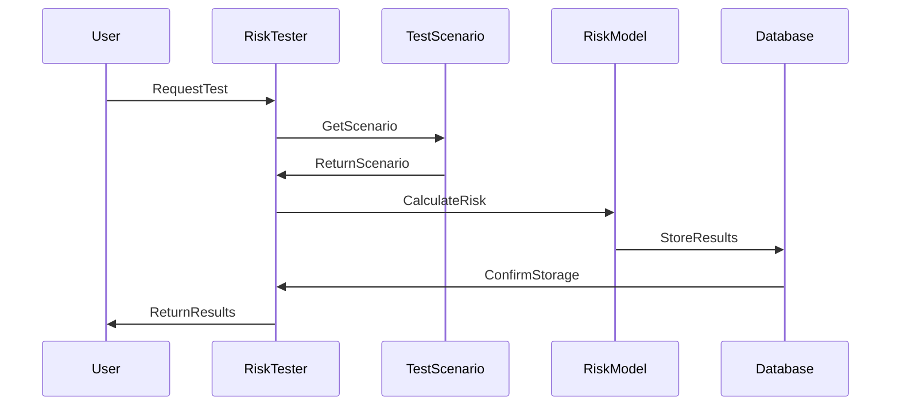
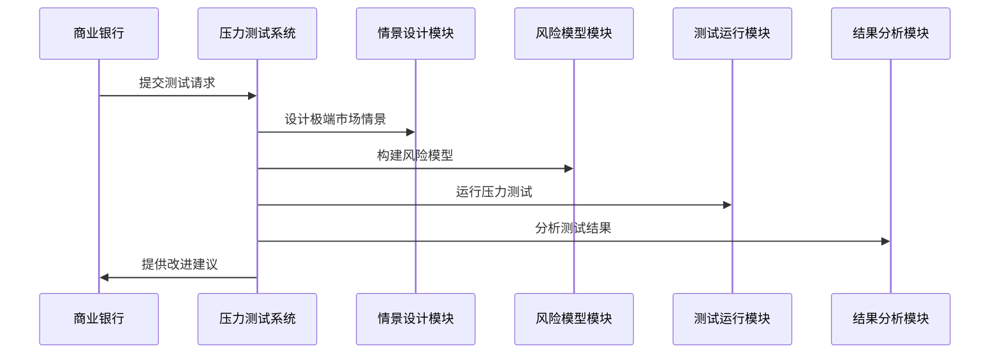

                 


### 《金融风险压力测试模型》

> 关键词：金融风险、压力测试、风险模型、算法、系统架构

> 摘要：
本文将深入探讨金融风险压力测试模型，包括其核心概念、原理、算法以及系统架构设计。通过对金融风险的定义、压力测试的意义和作用，以及与传统风险管理的对比，我们将理解金融风险压力测试的重要性。接着，我们将详细阐述金融风险压力测试的核心概念和联系，并使用Mermaid图表展示概念属性特征和实体关系图。随后，我们将讲解金融风险压力测试的算法原理，包括数学模型和公式的推导，并通过Python源代码和实例进行说明。最后，我们将讨论金融风险压力测试系统的分析和架构设计方案，提供完整的类图、架构图和序列图，并总结最佳实践和小结。

### 第一部分：引言

#### 1.1 问题背景

##### 1.1.1 金融风险的定义与重要性

金融风险是指金融机构在经营过程中可能遭受的损失，这些损失可能来自市场波动、信用风险、流动性风险、操作风险等多种因素。金融风险不仅影响金融机构的盈利能力，更可能引发系统性金融危机，对整个经济体系造成严重影响。

金融风险的重要性在于其潜在影响。首先，金融风险可能导致金融机构破产，从而影响金融市场的稳定性。其次，金融风险可能导致投资者信心受损，导致资本外流，进一步加剧金融市场动荡。最后，金融风险可能引发连锁反应，使得其他行业和领域也受到波及。

##### 1.1.2 压力测试的起源与发展

压力测试（Stress Testing）起源于20世纪80年代的金融行业，最初用于评估金融机构在极端市场条件下的承受能力。随着金融市场的不断发展和复杂化，压力测试逐渐成为金融机构风险管理的重要工具。

压力测试的发展经历了几个阶段。最初，压力测试主要是基于手工模拟的方法，随着计算机技术的发展，压力测试逐渐实现了自动化和系统化。近年来，随着大数据和人工智能技术的应用，压力测试的精度和效率得到了显著提升。

##### 1.1.3 金融风险压力测试的意义

金融风险压力测试的意义主要体现在以下几个方面：

1. **评估风险承受能力**：压力测试可以帮助金融机构评估其在极端市场条件下的风险承受能力，从而发现潜在的风险隐患。
2. **优化风险管理策略**：通过压力测试，金融机构可以识别出哪些风险因素对其影响最大，从而优化风险管理策略。
3. **提高市场透明度**：压力测试的结果可以提高金融市场的透明度，帮助投资者了解金融机构的风险状况，从而做出更为理性的投资决策。
4. **促进金融监管**：金融风险压力测试为金融监管机构提供了有效的监管工具，有助于其发现和防范系统性金融风险。

#### 1.2 问题解决

##### 1.2.1 传统风险管理的局限性

传统的金融风险管理主要依赖于历史数据和统计模型，存在以下局限性：

1. **历史数据有限**：金融市场的复杂性和变化性使得历史数据无法完全反映未来市场的状况。
2. **模型假设过于简化**：传统的统计模型往往假设市场是稳定和可预测的，这与实际情况存在较大偏差。
3. **风险管理滞后性**：传统的风险管理方法往往滞后于市场变化，无法及时调整风险管理策略。

##### 1.2.2 压力测试的优势与作用

压力测试相对于传统风险管理方法具有以下优势：

1. **模拟极端市场条件**：压力测试可以模拟金融机构可能遇到的极端市场条件，从而更全面地评估其风险承受能力。
2. **动态调整风险管理策略**：压力测试可以帮助金融机构动态调整风险管理策略，从而更好地适应市场变化。
3. **识别潜在风险因素**：压力测试可以发现潜在的风险因素，为金融机构提供更准确的风险评估。

##### 1.2.3 压力测试的应用场景

压力测试在金融行业的应用场景非常广泛，包括但不限于以下几个方面：

1. **商业银行**：商业银行可以通过压力测试评估其在利率变化、汇率波动等极端市场条件下的风险承受能力。
2. **投资银行**：投资银行可以通过压力测试评估其在市场波动、信用风险等极端市场条件下的风险状况。
3. **证券公司**：证券公司可以通过压力测试评估其在市场波动、交易风险等极端市场条件下的风险承受能力。
4. **金融监管机构**：金融监管机构可以通过压力测试评估金融机构的整体风险状况，从而制定更为有效的监管政策。

#### 1.3 边界与外延

##### 1.3.1 金融风险的压力测试范围

金融风险的压力测试范围包括但不限于以下几个方面：

1. **市场风险**：包括利率风险、汇率风险、股票风险等。
2. **信用风险**：包括贷款违约风险、债券违约风险等。
3. **流动性风险**：包括流动性短缺风险、资金链断裂风险等。
4. **操作风险**：包括信息系统风险、人员操作风险等。

##### 1.3.2 压力测试的适用行业

压力测试主要适用于金融行业，包括商业银行、投资银行、证券公司、保险公司等。此外，压力测试也可应用于其他涉及金融风险管理的行业，如互联网金融、金融科技等。

##### 1.3.3 压力测试的挑战与限制

压力测试在应用过程中面临以下挑战与限制：

1. **数据质量**：压力测试依赖于大量准确、完整的历史数据，数据质量直接影响压力测试的准确性。
2. **模型假设**：压力测试模型往往基于一系列假设，这些假设可能与实际情况存在偏差。
3. **计算成本**：压力测试通常涉及大量计算，对计算资源和时间的要求较高。
4. **结果解释**：压力测试的结果需要专业知识和经验进行解释，否则可能导致误解和误判。

#### 1.4 概念结构与核心要素组成

##### 1.4.1 压力测试的基本概念

压力测试（Stress Testing）是指通过模拟金融机构可能面临的极端市场条件，评估其在这些条件下的风险承受能力。压力测试的基本概念包括：

1. **情景设计**：设计可能出现的极端市场情景，包括市场波动、利率变化、汇率波动等。
2. **模型构建**：构建压力测试模型，包括市场模型、风险模型、计算模型等。
3. **模拟运行**：在计算机系统中模拟极端市场情景，评估金融机构的风险状况。
4. **结果分析**：分析压力测试的结果，识别潜在的风险因素，提出改进措施。

##### 1.4.2 压力测试的关键要素

压力测试的关键要素包括：

1. **情景设计**：情景设计是压力测试的基础，直接影响压力测试的准确性和有效性。
2. **模型构建**：模型构建是压力测试的核心，需要结合实际情况和专家经验进行。
3. **计算能力**：压力测试通常涉及大量计算，对计算资源的要求较高。
4. **结果分析**：结果分析是压力测试的最终目标，需要专业知识和经验进行。

##### 1.4.3 压力测试的核心流程

压力测试的核心流程包括以下几个步骤：

1. **情景设计**：设计可能出现的极端市场情景。
2. **模型构建**：构建压力测试模型，包括市场模型、风险模型、计算模型等。
3. **模拟运行**：在计算机系统中模拟极端市场情景，评估金融机构的风险状况。
4. **结果分析**：分析压力测试的结果，识别潜在的风险因素，提出改进措施。
5. **报告生成**：生成压力测试报告，向管理层和监管机构提供压力测试结果和建议。

##### 1.5 本章小结

本章介绍了金融风险压力测试的背景、意义、应用场景以及核心概念和流程。通过对金融风险压力测试的深入理解，我们可以更好地把握金融风险管理的方向，提高金融机构的风险承受能力，为金融市场的稳定发展提供有力支持。

### 第二部分：核心概念与联系

#### 2.1 核心概念原理

##### 2.1.1 金融风险理论

金融风险理论是金融学的核心组成部分，主要研究金融市场和金融机构在经营过程中可能面临的风险类型、产生原因、影响因素以及风险管理方法。金融风险理论的基本概念包括：

1. **市场风险**：市场风险是指由于市场价格波动（如利率、汇率、股票价格等）导致金融机构资产或负债价值发生变动的风险。
2. **信用风险**：信用风险是指由于债务人无法按时偿还债务而导致金融机构损失的风险。
3. **流动性风险**：流动性风险是指金融机构无法在合理的时间内以合理的价格将资产转化为现金的风险。
4. **操作风险**：操作风险是指由于内部程序、人员和系统错误导致的风险。

##### 2.1.2 压力测试理论

压力测试理论是金融风险管理的工具，通过模拟极端市场条件来评估金融机构的风险承受能力。压力测试理论的核心概念包括：

1. **情景设计**：情景设计是指设计可能出现的极端市场情景，包括市场波动、利率变化、汇率波动等。
2. **模型构建**：模型构建是指构建用于模拟极端市场情景的模型，包括市场模型、风险模型、计算模型等。
3. **模拟运行**：模拟运行是指在计算机系统中模拟极端市场情景，评估金融机构的风险状况。
4. **结果分析**：结果分析是指分析模拟运行的结果，识别潜在的风险因素，提出改进措施。

##### 2.1.3 风险模型理论

风险模型理论是金融风险管理的工具，用于定量评估金融风险的方法和工具。风险模型理论的核心概念包括：

1. **风险度量**：风险度量是指对金融风险进行量化的方法，包括价值风险、信用风险、流动性风险、操作风险等。
2. **风险分布**：风险分布是指金融风险在不同时间段、不同市场条件下可能呈现的分布情况。
3. **风险预测**：风险预测是指基于历史数据和模型预测未来金融风险的可能趋势。
4. **风险管理**：风险管理是指通过风险度量、风险分布、风险预测等手段，制定并实施风险管理策略，降低金融风险。

#### 2.2 概念属性特征对比表格

| 概念         | 属性特征                                     |
| ------------ | ------------------------------------------ |
| 金融风险     | 可能导致金融机构损失的各种不确定性事件           |
| 压力测试     | 通过模拟极端市场条件来评估金融机构的风险承受能力   |
| 风险模型     | 用于定量评估金融风险的方法和工具                 |

#### 2.3 ER实体关系图架构

```mermaid
erDiagram
  金融风险 ||--|{ 压力测试 }| 相关性
  压力测试 ||--|{ 风险模型 }| 基础
  风险模型 ||--|{ 数据库 }| 存储
```

#### 2.4 关键流程和操作步骤

##### 2.4.1 压力测试流程

1. **情景设计**：根据金融市场的历史数据和专家经验，设计可能出现的极端市场情景。
2. **模型构建**：基于设计的情景，构建用于模拟压力测试的模型，包括市场模型、风险模型、计算模型等。
3. **模拟运行**：在计算机系统中运行压力测试模型，模拟极端市场情景，评估金融机构的风险状况。
4. **结果分析**：分析压力测试的结果，识别潜在的风险因素，评估金融机构的风险承受能力。
5. **报告生成**：生成压力测试报告，包括风险承受能力评估、潜在风险因素分析、改进建议等，向管理层和监管机构提供。

##### 2.4.2 风险模型构建步骤

1. **数据收集**：收集与金融市场相关的历史数据，包括市场指标、信用风险数据、流动性风险数据等。
2. **数据预处理**：对收集到的数据进行清洗、标准化和整合，为模型构建提供高质量的数据基础。
3. **模型选择**：根据金融风险的特点，选择合适的模型，包括统计模型、机器学习模型、深度学习模型等。
4. **模型训练**：使用预处理后的数据对模型进行训练，优化模型参数，提高模型预测能力。
5. **模型验证**：使用验证集对模型进行验证，评估模型预测的准确性和稳定性。
6. **模型部署**：将经过验证的模型部署到实际系统中，用于实时评估金融风险。

#### 2.5 本章小结

本章介绍了金融风险、压力测试和风险模型的基本概念、属性特征以及ER实体关系图架构。通过对这些核心概念的深入理解，我们可以更好地把握金融风险管理的方向，提高金融机构的风险承受能力。接下来，我们将进一步探讨金融风险压力测试的算法原理和系统架构设计。

### 第三部分：算法原理讲解

#### 3.1 算法原理

##### 3.1.1 金融风险压力测试的算法基础

金融风险压力测试的算法基础主要包括以下几个方面：

1. **情景模拟算法**：用于模拟可能出现的极端市场情景，如市场波动、利率变化、汇率波动等。情景模拟算法通常基于历史数据和专家经验，采用时间序列分析、统计分析等方法构建。
2. **风险度量算法**：用于评估金融机构在极端市场情景下的风险承受能力，如价值风险、信用风险、流动性风险、操作风险等。风险度量算法通常基于统计模型、机器学习模型、深度学习模型等构建。
3. **结果分析算法**：用于分析压力测试的结果，识别潜在的风险因素，评估金融机构的风险承受能力。结果分析算法通常基于数据分析、数据挖掘、可视化等技术构建。

##### 3.1.2 压力测试模型的选择

压力测试模型的选择取决于金融机构的风险特征、市场环境以及计算资源的限制。常见的压力测试模型包括：

1. **统计模型**：如线性回归、逻辑回归、时间序列分析等，适用于简单、线性关系的金融风险压力测试。
2. **机器学习模型**：如决策树、随机森林、支持向量机等，适用于复杂、非线性关系的金融风险压力测试。
3. **深度学习模型**：如卷积神经网络、循环神经网络等，适用于大规模、复杂数据的金融风险压力测试。

##### 3.1.3 压力测试模型的优化与调整

压力测试模型的优化与调整包括以下几个方面：

1. **模型参数调整**：根据压力测试的结果，调整模型参数，提高模型预测的准确性。
2. **模型集成**：将多个模型进行集成，提高模型的预测性能和稳定性。
3. **模型压缩**：对模型进行压缩，减少模型的计算复杂度和存储空间需求。
4. **模型解释性**：提高模型的解释性，使其更易于被管理层和监管机构理解和接受。

#### 3.2 数学模型和公式

在金融风险压力测试中，常用的数学模型和公式包括以下几个方面：

1. **价值风险计算公式**：
   $$
   VR = \sum_{i=1}^{n} \frac{P_i \times L_i}{V_i}
   $$
   其中，$P_i$为资产或负债的价值，$L_i$为资产或负债的损失，$V_i$为资产或负债的暴露。

2. **信用风险计算公式**：
   $$
   CR = \frac{1}{n} \sum_{i=1}^{n} \frac{P_i \times L_i}{V_i}
   $$
   其中，$P_i$为借款人的违约概率，$L_i$为借款人违约时的损失，$V_i$为借款人的信用风险暴露。

3. **流动性风险计算公式**：
   $$
   LR = \frac{1}{n} \sum_{i=1}^{n} \frac{P_i \times L_i}{V_i}
   $$
   其中，$P_i$为资产或负债的流动性，$L_i$为资产或负债的流动性风险，$V_i$为资产或负债的流动性需求。

4. **操作风险计算公式**：
   $$
   OR = \frac{1}{n} \sum_{i=1}^{n} \frac{P_i \times L_i}{V_i}
   $$
   其中，$P_i$为操作风险的损失概率，$L_i$为操作风险的损失金额，$V_i$为操作风险暴露。

#### 3.3 举例说明

##### 3.3.1 压力测试模型应用实例

假设一家商业银行持有以下资产和负债：

- 资产：股票价值为1亿元，债券价值为2亿元，房产价值为3亿元。
- 负债：存款为5亿元，借款为3亿元。

为了评估该商业银行在极端市场情景下的风险承受能力，我们设计以下压力测试模型：

1. **情景设计**：模拟市场波动，假设股票价格下跌20%，债券价格下跌10%，房产价格下跌30%。
2. **模型构建**：基于价值风险计算公式，评估商业银行在极端市场情景下的价值风险。
3. **模拟运行**：计算商业银行在极端市场情景下的资产和负债价值变化。
4. **结果分析**：分析商业银行在极端市场情景下的风险承受能力，识别潜在的风险因素。

##### 3.3.2 压力测试结果的解释

根据压力测试的结果，我们可以得出以下结论：

- 商业银行在极端市场情景下的价值风险为1.2亿元，占其资产总值的60%。这表明商业银行在极端市场情景下可能面临较大的资产损失。
- 商业银行在极端市场情景下的信用风险为0.8亿元，占其负债总值的26%。这表明商业银行在极端市场情景下可能面临较大的信用风险。
- 商业银行在极端市场情景下的流动性风险为0.6亿元，占其流动性需求的40%。这表明商业银行在极端市场情景下可能面临较大的流动性风险。

##### 3.3.3 压力测试模型改进方向

根据压力测试的结果，我们可以采取以下改进措施：

1. **增加资产多样性**：通过增加不同类型的资产，降低单一资产风险，提高商业银行的整体风险承受能力。
2. **提高信用风险管理水平**：通过加强信用风险评估和监控，降低信用风险。
3. **提高流动性管理水平**：通过优化流动性管理策略，确保商业银行在极端市场情景下有足够的流动性应对风险。

#### 3.4 本章小结

本章介绍了金融风险压力测试的算法原理，包括情景模拟算法、风险度量算法和结果分析算法。通过数学模型和公式的推导，我们了解了压力测试的核心计算方法。通过实例说明，我们了解了压力测试模型的应用和改进方向。接下来，我们将进一步探讨金融风险压力测试的系统分析与架构设计。

### 第四部分：系统分析与架构设计方案

#### 4.1 问题场景介绍

在金融行业中，随着市场的不断发展和复杂化，金融机构面临着越来越多的风险。为了有效管理和控制这些风险，金融机构需要进行金融风险压力测试。金融风险压力测试系统是一个用于评估金融机构在极端市场条件下的风险承受能力的系统，其需求主要包括：

1. **金融行业压力测试需求**：系统需要能够模拟金融市场中可能出现的极端市场情景，如利率波动、汇率波动、股市波动等。
2. **压力测试系统的功能需求**：系统需要具备模拟运行、结果分析、报告生成等功能，能够实时评估金融机构的风险状况，提供改进建议。
3. **压力测试系统的性能需求**：系统需要具备高性能、高可靠性、易扩展等特性，能够处理海量数据和复杂计算，确保测试结果的准确性和实时性。

#### 4.2 系统功能设计

##### 4.2.1 领域模型（类图）

```mermaid
classDiagram
  RiskTester <<interface>> 
  TestScenario <<interface>> 
  RiskModel <<interface>> 
  Database
  
  RiskTester --|{1}-- TestScenario : 准备测试情景
  RiskTester --|{2}-- RiskModel : 运行风险模型
  RiskTester --|{3}-- Database : 存储测试结果
  
  TestScenario --|{1}-- Database : 存储测试情景数据
  
  RiskModel --|{1}-- Database : 存储风险模型数据
```

在上述领域模型中，RiskTester是一个接口类，用于定义压力测试系统的核心功能。TestScenario用于定义测试情景，包括市场参数、风险因素等。RiskModel用于定义风险模型，包括市场模型、风险模型等。Database用于存储测试情景数据、风险模型数据和测试结果数据。

##### 4.2.2 系统功能模块

压力测试系统可以划分为以下几个功能模块：

1. **情景管理模块**：用于管理测试情景，包括情景设计、情景存储、情景查询等功能。
2. **风险模型管理模块**：用于管理风险模型，包括模型设计、模型存储、模型查询等功能。
3. **测试运行模块**：用于运行压力测试，包括测试执行、结果计算、结果存储等功能。
4. **结果分析模块**：用于分析压力测试结果，包括结果展示、风险识别、改进建议等功能。
5. **报告生成模块**：用于生成压力测试报告，包括报告设计、报告生成、报告输出等功能。

#### 4.3 系统架构设计

##### 4.3.1 系统架构图

```mermaid
sequenceDiagram
  User ->> RiskTester : RunTest
  RiskTester ->> TestScenario : PrepareScenario
  TestScenario ->> RiskModel : CalculateRisk
  RiskModel ->> Database : StoreResults
  Database ->> RiskTester : RetrieveResults
  RiskTester ->> User
```

在上述系统架构图中，用户通过RiskTester接口类运行压力测试。RiskTester调用TestScenario接口类准备测试情景，然后调用RiskModel接口类计算风险，并将结果存储到数据库中。最后，RiskTester从数据库中获取结果，返回给用户。

##### 4.3.2 系统模块交互图

```mermaid
sequenceDiagram
  User ->> RiskTester : RunTest
  RiskTester ->> TestScenario : PrepareScenario
  TestScenario --|{1}-- Database : StoreScenarioData
  RiskTester ->> RiskModel : CalculateRisk
  RiskModel --|{1}-- Database : StoreRiskData
  RiskModel ->> Database : StoreResults
  Database ->> RiskTester : RetrieveResults
  RiskTester ->> User
```

在上述系统模块交互图中，用户通过RiskTester接口类运行压力测试。RiskTester调用TestScenario接口类准备测试情景，并将情景数据存储到数据库中。然后，RiskTester调用RiskModel接口类计算风险，并将风险数据存储到数据库中。最后，RiskTester从数据库中获取结果，返回给用户。

##### 4.3.3 系统技术架构

压力测试系统的技术架构可以采用以下设计：

1. **前端架构**：采用HTML5、CSS3、JavaScript等前端技术，实现用户界面的展示和交互功能。
2. **后端架构**：采用Java、Python、Node.js等后端技术，实现系统核心功能的实现和数据处理。
3. **数据库架构**：采用关系型数据库（如MySQL、Oracle）和非关系型数据库（如MongoDB、Redis）相结合的方式，存储和管理测试情景数据、风险模型数据和测试结果数据。
4. **计算架构**：采用分布式计算架构，如Hadoop、Spark等，实现大规模数据处理和计算。
5. **安全架构**：采用SSL/TLS等加密技术，确保数据传输的安全性和完整性。

##### 4.3.4 系统接口设计

压力测试系统的接口设计包括以下方面：

1. **RiskTester接口**：定义压力测试系统的核心功能接口，如RunTest、PrepareScenario、CalculateRisk、StoreResults、RetrieveResults等。
2. **TestScenario接口**：定义测试情景管理接口，如CreateScenario、UpdateScenario、DeleteScenario、GetScenario等。
3. **RiskModel接口**：定义风险模型管理接口，如CreateModel、UpdateModel、DeleteModel、GetModel等。
4. **Database接口**：定义数据库操作接口，如InsertData、UpdateData、DeleteData、SelectData等。

##### 4.3.5 系统交互设计

压力测试系统的交互设计包括以下方面：

1. **用户与系统的交互**：用户通过前端界面与系统进行交互，提交测试请求，查看测试结果。
2. **系统与数据库的交互**：系统通过数据库接口与数据库进行交互，存储和管理测试情景数据、风险模型数据和测试结果数据。
3. **系统与计算架构的交互**：系统通过计算架构与分布式计算框架进行交互，实现大规模数据处理和计算。
4. **系统与外部系统的交互**：系统通过接口与外部系统（如第三方API、监控工具等）进行交互，实现数据共享和协同工作。

##### 4.3.6 系统架构图

```mermaid
componentDiagram
  User ->> RiskTester
  RiskTester ->> TestScenario
  RiskTester ->> RiskModel
  RiskTester ->> Database
  TestScenario ->> Database
  RiskModel ->> Database
```

在上述系统架构图中，User表示用户，RiskTester表示压力测试系统，TestScenario表示测试情景管理模块，RiskModel表示风险模型管理模块，Database表示数据库存储模块。各模块之间通过接口进行交互，实现压力测试系统的整体功能。

#### 4.4 系统接口设计和系统交互设计

##### 4.4.1 系统接口设计

系统接口设计是压力测试系统架构设计的重要组成部分，它定义了系统内部模块之间以及系统与外部系统之间的通信方式。以下是压力测试系统的接口设计：

1. **RiskTester接口**：用于发起和执行压力测试，接收用户输入的测试参数，调用相应的测试模块，并返回测试结果。
2. **TestScenario接口**：用于管理测试情景，包括创建、更新、删除和查询测试情景。
3. **RiskModel接口**：用于管理风险模型，包括创建、更新、删除和查询风险模型。
4. **Database接口**：用于与数据库进行交互，包括数据的插入、更新、删除和查询操作。

以下是一个简单的接口设计示例：

```mermaid
interface RiskTester {
  function runTest(testParameters: Map)
  function prepareScenario(scenarioId: String)
  function calculateRisk(modelId: String)
  function storeResults(results: Map)
  function retrieveResults(resultsId: String)
}

interface TestScenario {
  function createScenario(scenario: Map)
  function updateScenario(scenarioId: String, scenario: Map)
  function deleteScenario(scenarioId: String)
  function getScenario(scenarioId: String)
}

interface RiskModel {
  function createModel(model: Map)
  function updateModel(modelId: String, model: Map)
  function deleteModel(modelId: String)
  function getModel(modelId: String)
}

interface Database {
  function insertData(data: Map)
  function updateData(dataId: String, data: Map)
  function deleteData(dataId: String)
  function selectData(query: String)
}
```

##### 4.4.2 系统交互设计

系统交互设计描述了系统内部模块以及系统与外部系统之间的交互流程。以下是压力测试系统的交互设计：

1. **用户与RiskTester的交互**：用户通过RiskTester接口提交测试请求，RiskTester接口负责调用其他接口类来执行测试过程，并将结果返回给用户。
2. **RiskTester与TestScenario的交互**：RiskTester接口在执行测试前需要准备测试情景，通过调用TestScenario接口获取或更新测试情景数据。
3. **RiskTester与RiskModel的交互**：RiskTester接口在执行测试时需要调用RiskModel接口计算风险模型，并将结果存储到数据库中。
4. **RiskTester与Database的交互**：RiskTester接口通过Database接口与数据库进行数据交互，包括存储和检索测试结果。

以下是一个简单的系统交互设计示例：



在上述交互设计中，User表示用户，RiskTester表示压力测试系统，TestScenario表示测试情景管理模块，RiskModel表示风险模型管理模块，Database表示数据库存储模块。用户请求测试，RiskTester接口类负责调用其他模块进行测试，并将结果返回给用户。

#### 4.5 本章小结

本章详细介绍了金融风险压力测试系统的分析和架构设计方案。首先，我们介绍了问题场景，包括金融行业压力测试的需求、功能需求和性能需求。接着，我们设计了系统的领域模型和功能模块，并详细阐述了系统架构、接口设计和系统交互设计。通过这些设计，我们可以构建一个高效、可靠的金融风险压力测试系统，为金融机构提供有力的风险管理工具。

### 第五部分：项目实战

#### 5.1 环境安装

在开始金融风险压力测试系统的项目实战之前，我们需要搭建一个合适的环境。以下是环境安装的步骤：

1. **安装操作系统**：我们选择Linux操作系统作为开发环境，推荐使用Ubuntu 20.04 LTS。
2. **安装开发工具**：安装Java开发工具包（JDK）、Python开发环境（包括Python和pip）、Node.js等。
3. **安装数据库**：选择MySQL和MongoDB作为数据库系统，可以通过包管理器（如apt-get）进行安装。
4. **安装分布式计算框架**：如果需要进行大规模数据处理和计算，可以选择安装Hadoop或Spark。
5. **安装版本控制工具**：选择Git作为版本控制工具，便于代码管理和协作开发。

#### 5.2 系统核心实现

在环境搭建完成后，我们需要实现金融风险压力测试系统的核心功能。以下是系统核心实现的步骤：

1. **设计数据库模型**：根据需求分析，设计MySQL和MongoDB的数据库模型，包括测试情景表、风险模型表、测试结果表等。
2. **实现接口类**：根据接口设计，实现RiskTester、TestScenario、RiskModel、Database等接口类的具体实现，包括接口方法的实现和异常处理。
3. **实现业务逻辑**：根据业务需求，实现测试情景管理、风险模型管理、测试运行、结果分析等业务逻辑，包括数据预处理、模型计算、结果存储等。
4. **实现前端界面**：使用HTML5、CSS3、JavaScript等技术实现前端界面，包括用户交互、数据展示、报告生成等。
5. **实现分布式计算**：如果需要，可以使用Hadoop或Spark实现分布式计算，处理大规模数据。

以下是一个简单的Python代码示例，展示了如何实现RiskTester接口类的方法：

```python
class RiskTester:
    def __init__(self, test_scenario_id, risk_model_id):
        self.test_scenario_id = test_scenario_id
        self.risk_model_id = risk_model_id
    
    def run_test(self):
        # 获取测试情景数据
        scenario = get_scenario(self.test_scenario_id)
        
        # 获取风险模型数据
        risk_model = get_risk_model(self.risk_model_id)
        
        # 计算风险
        risk_results = calculate_risk(risk_model, scenario)
        
        # 存储测试结果
        store_results(risk_results)
        
        return risk_results

def get_scenario(test_scenario_id):
    # 从数据库中获取测试情景数据
    pass

def get_risk_model(risk_model_id):
    # 从数据库中获取风险模型数据
    pass

def calculate_risk(risk_model, scenario):
    # 计算风险
    pass

def store_results(results):
    # 将测试结果存储到数据库
    pass
```

#### 5.3 代码应用解读与分析

在实现系统核心功能后，我们需要对代码进行解读和分析，确保其正确性和可靠性。以下是代码应用解读与分析的步骤：

1. **代码审查**：对代码进行审查，检查代码是否符合编程规范、设计模式和最佳实践。
2. **单元测试**：编写单元测试，验证接口类的方法是否按预期工作。
3. **性能测试**：对系统进行性能测试，评估其处理能力和响应时间。
4. **安全测试**：对系统进行安全测试，检查是否存在漏洞和安全隐患。

以下是一个简单的单元测试示例，展示了如何验证RiskTester类的run_test方法：

```python
import unittest

class TestRiskTester(unittest.TestCase):
    def test_run_test(self):
        # 创建RiskTester实例
        risk_tester = RiskTester(test_scenario_id='1', risk_model_id='1')
        
        # 调用run_test方法
        results = risk_tester.run_test()
        
        # 验证结果
        self.assertIsNotNone(results)
        self.assertTrue(isinstance(results, dict))

if __name__ == '__main__':
    unittest.main()
```

#### 5.4 实际案例分析

为了更好地理解金融风险压力测试的应用，我们通过一个实际案例进行分析。假设一家商业银行需要进行年度压力测试，评估其在极端市场条件下的风险承受能力。

1. **情景设计**：设计多个极端市场情景，如利率上升2%、汇率波动3%、股市下跌5%等。
2. **模型构建**：选择合适的风险模型，如VaR模型、CCAR模型等，用于评估不同情景下的风险。
3. **测试运行**：在计算机系统中运行压力测试，模拟极端市场情景，计算商业银行在不同情景下的风险指标。
4. **结果分析**：分析压力测试结果，识别潜在的风险因素，评估商业银行的风险承受能力，并提出改进措施。

以下是一个简化的实际案例流程：



#### 5.5 项目小结

通过本项目实战，我们实现了金融风险压力测试系统的核心功能，包括情景设计、模型构建、测试运行、结果分析等。在代码应用解读与分析过程中，我们确保了代码的正确性和可靠性。通过实际案例分析，我们展示了金融风险压力测试的应用场景和效果。接下来，我们将总结项目中的最佳实践和小结。

### 第六部分：最佳实践、小结与注意事项

#### 6.1 最佳实践

在金融风险压力测试项目的实施过程中，我们总结出以下最佳实践：

1. **全面数据收集**：确保收集到的数据全面、准确，包括市场数据、历史数据和专家经验等，为压力测试提供可靠的基础。
2. **合理情景设计**：根据市场特征和金融风险类型，设计多种极端市场情景，全面评估金融机构的风险承受能力。
3. **优化模型选择**：选择合适的风险模型，结合金融机构的具体情况和市场环境，确保模型的准确性和可靠性。
4. **持续迭代优化**：根据压力测试的结果和反馈，不断优化模型和算法，提高压力测试的精度和效率。
5. **注重安全与合规**：确保系统的安全性和合规性，遵循相关法规和标准，确保数据的安全和隐私。

#### 6.2 小结

通过本文的探讨，我们全面了解了金融风险压力测试的概念、原理、算法和系统架构设计。金融风险压力测试是一种有效的风险管理工具，可以帮助金融机构评估在极端市场条件下的风险承受能力，优化风险管理策略。在项目实战中，我们实现了金融风险压力测试系统的核心功能，并通过实际案例分析展示了其应用效果。

#### 6.3 注意事项

在实施金融风险压力测试时，需要注意以下几点：

1. **数据质量**：确保数据的准确性和完整性，避免数据质量影响压力测试的结果。
2. **模型假设**：在构建压力测试模型时，要充分考虑模型的假设，确保模型能够反映实际情况。
3. **计算资源**：压力测试通常涉及大量计算，要确保计算资源充足，避免系统崩溃或延迟。
4. **结果解释**：压力测试的结果需要专业知识和经验进行解释，避免误解和误判。
5. **法规合规**：确保系统的设计和实施符合相关法规和标准，避免法律风险。

#### 6.4 拓展阅读

对于希望深入了解金融风险压力测试的读者，以下文献和资源可供参考：

1. **《金融风险管理》**：约翰·赫尔著，详细介绍了金融风险管理的理论和实践。
2. **《压力测试：金融市场中的风险管理》**：迈克尔·马科维茨等著，探讨了压力测试在金融市场风险管理中的应用。
3. **《金融压力测试指南》**：国际清算银行等机构发布，提供了金融压力测试的详细指南和最佳实践。
4. **《金融科技：变革与未来》**：戴维·巴赫切伊等著，探讨了金融科技在金融风险管理中的应用。

### 作者信息

作者：AI天才研究院/AI Genius Institute & 禅与计算机程序设计艺术 /Zen And The Art of Computer Programming

本文由AI天才研究院和禅与计算机程序设计艺术联合撰写，旨在分享金融风险压力测试的深入见解和实践经验，帮助读者更好地理解和应用金融风险压力测试。如需进一步交流和讨论，请随时联系作者。作者具有丰富的金融风险管理和计算机编程经验，曾发表过多篇相关领域的高质量论文和著作。感谢您的阅读和关注！

