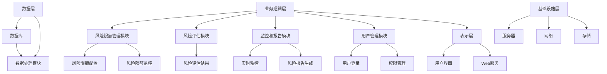
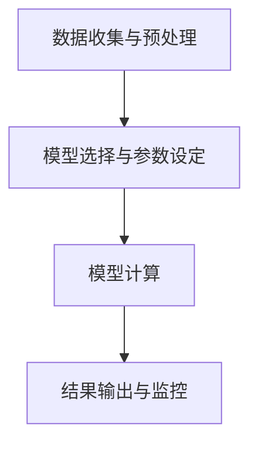
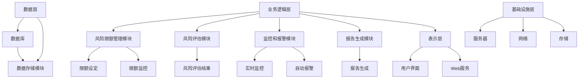
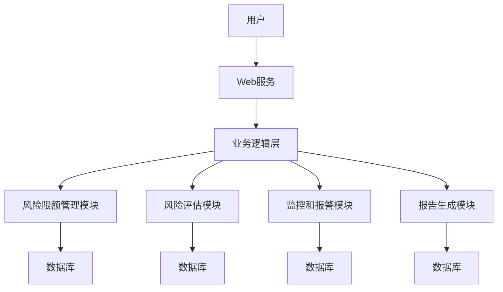

                 

### 让我们一步步深入思考——金融风险限额管理系统设计

在当今的金融市场中，风险管理是金融机构和公司不可或缺的重要环节。有效的风险管理能够帮助金融机构和企业在复杂多变的市场环境中降低风险，确保业务的稳健运行。而金融风险限额管理系统作为风险管理的重要组成部分，起到了至关重要的作用。本文将围绕金融风险限额管理系统设计这一主题，进行详细的分析和讨论。

#### 1.1.1 金融风险管理的必要性

首先，让我们探讨一下金融风险管理的必要性。金融风险指的是由于金融市场的波动和不确定性，导致金融机构和公司遭受损失的可能性。这种风险可能来自市场变化、信用违约、流动性不足、操作风险等多个方面。有效的风险管理能够帮助金融机构识别潜在的风险点，制定相应的应对措施，从而降低风险事件的发生概率和损失程度。

随着金融市场的不断发展和国际化，金融产品和交易方式日益多样化，风险管理的难度也在不断增加。例如，金融市场的不确定性和复杂性使得风险识别和评估变得更加困难。此外，金融机构和公司还需要遵守日益严格的监管要求，确保合规运营。因此，金融风险管理已成为金融机构和公司生存与发展的基石。

#### 1.1.2 风险限额管理的作用

接下来，我们来探讨风险限额管理的作用。风险限额管理是一种控制风险暴露的方法，通过设定和管理风险限额，金融机构和公司可以在风险可控的范围内进行业务操作。风险限额管理的作用主要体现在以下几个方面：

1. **风险控制**：通过设定风险限额，金融机构和公司可以限制业务操作中的风险暴露，确保风险在可承受范围内。

2. **风险管理决策**：风险限额管理为金融机构和公司提供了决策依据，帮助管理层了解业务风险状况，及时调整业务策略。

3. **风险合规**：风险限额管理有助于金融机构和公司遵守监管要求，确保业务运营的合规性。

4. **风险监测和报告**：通过风险限额管理，金融机构和公司可以实时监测业务风险状况，及时发现问题并进行调整。

#### 1.1.3 风险限额管理的现状与挑战

目前，金融风险限额管理已经得到了广泛的关注和应用，但仍面临一些挑战。首先，风险限额管理的方法和工具不断更新，金融机构和公司需要不断学习和适应新的管理方法。其次，风险限额管理的数据来源和准确性是一个关键问题，数据的可靠性和完整性直接影响到风险限额管理的有效性。此外，风险限额管理的自动化和智能化水平还有待提高，这对于提高管理效率和准确性具有重要意义。

接下来，我们将深入探讨金融风险限额管理的基本概念、核心原理、系统架构设计、算法设计、系统实施以及项目实战等内容，以帮助读者全面了解金融风险限额管理系统设计的各个方面。让我们一步步深入思考，共同探索这个重要领域。

### 第1章 绪论

#### 1.1 问题背景

金融市场的复杂性和不确定性使得风险管理成为金融机构和公司必须面对的重要挑战。在这个背景下，金融风险限额管理系统应运而生，成为金融风险管理中的重要组成部分。本节将详细讨论金融风险限额管理的问题背景，包括核心概念、风险限额管理的作用和现状与挑战。

**1.1.1 金融风险管理的必要性**

金融风险管理是指通过识别、评估、监控和控制金融风险，以降低金融机构和公司在金融市场波动中遭受损失的可能性。金融市场的不确定性来源于多个方面，如市场波动、信用风险、流动性风险、操作风险等。有效的金融风险管理能够帮助金融机构和公司：

1. **降低风险暴露**：通过识别和评估潜在风险，金融机构和公司可以采取措施降低风险暴露，确保业务在可控范围内运营。
2. **提高决策效率**：风险管理提供了决策依据，帮助管理层及时了解风险状况，做出明智的决策。
3. **确保合规性**：金融机构和公司需要遵守各种监管要求，有效的风险管理有助于确保业务运营的合规性。
4. **提升企业形象**：良好的风险管理有助于提升金融机构和公司的信誉和形象。

**1.1.2 风险限额管理的作用**

风险限额管理是金融风险管理的重要组成部分，其主要作用包括：

1. **风险控制**：通过设定风险限额，金融机构和公司可以控制业务操作中的风险暴露，确保风险在可承受范围内。
2. **风险管理决策**：风险限额管理为金融机构和公司提供了决策依据，帮助管理层了解业务风险状况，及时调整业务策略。
3. **风险合规**：风险限额管理有助于金融机构和公司遵守监管要求，确保业务运营的合规性。
4. **风险监测和报告**：通过风险限额管理，金融机构和公司可以实时监测业务风险状况，及时发现问题并进行调整。

**1.1.3 风险限额管理的现状与挑战**

目前，金融风险限额管理已经得到广泛的关注和应用，但仍然面临一些挑战：

1. **方法与工具的更新**：随着金融市场的发展，风险限额管理的方法和工具也在不断更新，金融机构和公司需要不断学习和适应新的管理方法。
2. **数据来源与准确性**：风险限额管理依赖于准确和可靠的数据，数据来源的多样性和准确性直接影响风险限额管理的有效性。
3. **自动化与智能化**：目前，风险限额管理的自动化和智能化水平还有待提高，这对于提高管理效率和准确性具有重要意义。

本节对金融风险限额管理的问题背景进行了详细探讨，为后续章节的深入讨论奠定了基础。在接下来的章节中，我们将进一步介绍金融风险限额管理的基本概念、核心原理、系统架构设计、算法设计等内容。

#### 1.2 核心概念

为了更好地理解金融风险限额管理系统，我们需要先掌握几个核心概念。这些概念不仅构成了金融风险限额管理的理论基础，也是设计和管理系统的关键要素。以下是几个核心概念的定义及其关系：

**1.2.1 风险限额定义与分类**

**风险限额**：风险限额是指金融机构或公司在特定时间窗口内，可以承受的最大风险金额。风险限额可以按照不同的维度进行分类，如按照产品、业务线、地域、交易对手等。

- **产品维度**：根据不同金融产品的风险特性设定风险限额，例如股票、债券、衍生品等。
- **业务线维度**：根据金融机构的不同业务线设定风险限额，如银行、证券、保险等。
- **地域维度**：根据金融机构在不同地区的业务设定风险限额，以应对地区性风险。
- **交易对手维度**：根据金融机构与交易对手的关系设定风险限额，确保信用风险的可控性。

**1.2.2 风险限额管理框架**

**风险限额管理框架**：风险限额管理框架是金融机构进行风险限额设定、监控和调整的总体结构。一个完整的风险限额管理框架通常包括以下几个关键环节：

1. **风险识别**：识别金融机构面临的各类风险，为风险限额的设定提供依据。
2. **风险评估**：对各类风险进行量化评估，确定风险限额的基准值。
3. **风险限额设定**：根据风险评估结果，设定不同维度和层次的风险限额。
4. **风险监控**：实时监控业务操作中的风险限额，确保风险在可控范围内。
5. **风险调整**：根据市场变化和业务需求，定期调整风险限额，以保持风险管理的有效性。

**1.2.3 风险限额管理的相关概念与联系**

除了上述核心概念，还有一些与风险限额管理密切相关的重要概念，如：

- **风险偏好**：风险偏好是指金融机构在风险管理和业务决策中愿意接受的风险程度。风险限额管理需要考虑风险偏好，确保设定的风险限额符合金融机构的风险承受能力。
- **风险敞口**：风险敞口是指金融机构在特定时间内面临的风险金额。风险限额管理的一个重要目标就是控制风险敞口在限额范围内。
- **风险报告**：风险报告是风险限额管理中的重要组成部分，通过风险报告，管理层可以实时了解业务风险状况，做出相应的决策。

这些核心概念共同构成了金融风险限额管理的理论基础和实施框架，是设计和管理金融风险限额管理系统的重要依据。在接下来的章节中，我们将进一步探讨风险限额管理的基本原理、核心概念及其应用。

#### 1.3 书籍结构

本书旨在深入探讨金融风险限额管理系统设计，通过系统化的分析和详细的技术讲解，帮助读者全面了解这一领域。下面将详细描述本书的结构安排、目的与读者对象、各章节内容及其相互联系。

**1.3.1 本书的目的与读者对象**

本书的目的是为金融领域的技术人员、风险管理人员以及相关领域的学者提供一本全面、系统的金融风险限额管理系统设计指南。通过本书，读者可以：

- 理解金融风险限额管理的核心概念和基本原理。
- 掌握金融风险限额管理系统设计的方法和步骤。
- 学习风险限额管理算法的实现和应用。
- 获取金融风险限额管理系统实施的经验和最佳实践。

本书适合以下读者群体：

- 金融科技从业人员，特别是从事风险管理、系统设计和数据分析的相关人员。
- 高等院校金融工程专业学生，以及计算机科学与技术专业对金融领域感兴趣的学生。
- 金融行业分析师、研究人员和技术顾问。

**1.3.2 本书的内容安排与章节联系**

本书共分为七个章节，每个章节都针对不同的主题进行深入探讨，相互之间紧密联系，共同构成了金融风险限额管理系统设计的完整知识体系。

**第1章 绪论**

本章介绍了金融风险限额管理的问题背景，包括金融风险管理的必要性、风险限额管理的作用以及现状与挑战。通过这一章节，读者可以初步了解金融风险限额管理系统的重要性和设计的基本框架。

**第2章 风险限额管理原理**

本章详细阐述了金融风险限额管理的基本原理，包括风险限额管理的基本原则、流程、方法与工具。通过本章的学习，读者可以掌握风险限额管理的基本理论和操作步骤。

**第3章 金融风险限额管理系统架构设计**

本章重点介绍了金融风险限额管理系统的架构设计，包括系统需求分析、功能设计、架构设计以及系统接口和交互设计。通过本章，读者可以了解系统架构设计的方法和关键要点。

**第4章 风险限额管理算法设计**

本章探讨了风险限额管理算法的基本概念、原理和实现。通过具体的算法案例和应用，读者可以深入理解算法的核心要素和实际应用。

**第5章 金融风险限额管理系统实施**

本章详细描述了金融风险限额管理系统的实施过程，包括环境配置、核心实现和系统应用与优化。通过本章，读者可以了解系统实施的实际操作步骤和关键点。

**第6章 项目实战**

本章通过一个具体的案例，展示了金融风险限额管理系统从设计到实施的完整过程，包括系统架构设计、算法实现和项目总结。通过案例分析，读者可以更好地理解系统设计和实施的具体方法。

**第7章 最佳实践与总结**

本章总结了金融风险限额管理系统设计的最佳实践，包括风险管理实践经验分享、系统优化策略和注意事项。通过本章，读者可以获取实用的操作经验和优化建议。

**1.3.3 本章小结**

通过本书的章节安排和内容介绍，读者可以逐步了解金融风险限额管理系统设计的各个方面。每个章节都是基于前一个章节的基础，通过逐步深入和扩展，形成了一个完整、系统的知识体系。本书不仅注重理论讲解，还结合实际案例和最佳实践，帮助读者更好地理解和应用所学知识。通过阅读本书，读者可以全面提升金融风险限额管理系统设计的理论水平和实际操作能力。

### 第2章 风险限额管理原理

本章将深入探讨金融风险限额管理的基本原理，涵盖风险限额管理的基本原则、流程、方法和工具。通过理解这些核心概念，读者将能够构建出有效的风险限额管理体系，为后续的架构设计和算法实现奠定基础。

#### 2.1 风险限额管理的基本原理

风险限额管理的基本原理是通过对风险进行识别、评估、控制和监测，确保金融机构在可承受的风险范围内进行业务操作。以下是风险限额管理的基本原理及其具体内容：

**2.1.1 风险限额管理的基本原则**

1. **全面性原则**：风险限额管理应覆盖所有可能的风险类型，确保风险的全面识别和评估。
2. **适度性原则**：风险限额应设定在适度的范围内，既不能过于宽松，也不能过于严格，以保持业务的正常运营。
3. **动态调整原则**：风险限额应根据市场环境和业务需求进行动态调整，以应对不断变化的风险状况。
4. **合规性原则**：风险限额管理应符合相关法律法规和监管要求，确保业务的合规性。

**2.1.2 风险限额管理的流程**

风险限额管理的流程通常包括以下几个步骤：

1. **风险识别**：识别金融机构面临的各种风险类型，如市场风险、信用风险、流动性风险等。
2. **风险评估**：对识别出的风险进行量化评估，确定风险的严重程度和影响范围。
3. **风险限额设定**：根据风险评估结果，设定各类风险限额，确保风险在可承受范围内。
4. **风险监控**：实时监控业务操作中的风险限额，确保风险在监控范围内。
5. **风险调整**：根据市场变化和业务需求，定期调整风险限额，以保持风险管理的有效性。

**2.1.3 风险限额管理的方法与工具**

风险限额管理的方法和工具包括：

1. **定性分析**：通过专家评估、历史数据分析和案例研究等方法，对风险进行定性分析。
2. **定量分析**：利用统计模型、风险评估软件等工具，对风险进行定量分析，确定风险限额的基准值。
3. **限额管理软件**：使用限额管理软件，实现对风险限额的设定、监控和调整。常见的限额管理软件包括风险控制平台、限额管理系统等。
4. **风险报告**：定期生成风险报告，向管理层提供业务风险状况和风险限额的详细信息。

#### 2.2 风险限额管理的核心概念

风险限额管理的核心概念包括风险限额的确定方法、分配与调整以及监控与报告。以下是这些核心概念的详细解释：

**2.2.1 风险限额的确定方法**

风险限额的确定方法主要包括：

1. **基于历史数据的方法**：通过分析历史数据，确定风险限额的基准值。这种方法适用于市场波动较小的稳定市场。
2. **基于模拟的方法**：通过模拟不同市场情景，评估风险限额的合理范围。这种方法适用于市场波动较大、不确定性较高的市场。
3. **基于模型的方法**：使用统计模型和数学模型，对风险进行量化分析，确定风险限额。这种方法具有较高的科学性和准确性。

**2.2.2 风险限额的分配与调整**

风险限额的分配与调整包括：

1. **限额分配**：根据金融机构的业务特点和风险偏好，将总风险限额分配到不同的业务线、产品、地域和交易对手。
2. **限额调整**：根据市场变化和业务需求，定期调整风险限额。调整方法包括比例调整、绝对值调整和情景调整等。

**2.2.3 风险限额的监控与报告**

风险限额的监控与报告包括：

1. **实时监控**：通过实时监控系统，实时监控业务操作中的风险限额，确保风险在监控范围内。
2. **定期报告**：定期生成风险报告，向管理层提供业务风险状况和风险限额的详细信息。报告内容通常包括风险限额的设置、监控结果、调整记录等。

#### 2.3 风险限额管理案例

**2.3.1 案例背景**

某大型银行在实施风险限额管理过程中，面临以下挑战：

- 业务线众多，风险类型复杂。
- 市场波动大，风险限额难以确定。
- 风险监控和报告不够实时和准确。

**2.3.2 风险限额管理策略**

该银行采取了以下风险限额管理策略：

- 建立全面的风险限额管理框架，覆盖所有风险类型。
- 使用历史数据和模拟方法，确定风险限额的基准值。
- 采用比例调整和情景调整相结合的方法，动态调整风险限额。
- 引入限额管理软件，实现实时监控和自动化报告。

**2.3.3 案例分析与评价**

通过实施风险限额管理，该银行取得了以下成效：

- 风险识别和评估更加准确，风险限额设定更加合理。
- 风险监控和报告更加实时和准确，风险调整更加灵活。
- 业务运营更加稳健，风险暴露显著降低。

然而，也面临一些挑战，如数据质量和管理水平有待提高，需要进一步优化和完善风险限额管理流程。

#### 2.4 本章小结

本章详细阐述了金融风险限额管理的基本原理，包括基本原则、流程、方法和工具。通过理解风险限额管理的基本原理，读者可以构建出有效的风险限额管理体系。在实际应用中，风险限额管理需要结合具体业务特点和市场需求，不断调整和优化，以应对不断变化的风险环境。通过本章的学习，读者可以为进一步的架构设计和算法实现打下坚实的基础。

### 第3章 金融风险限额管理系统架构设计

金融风险限额管理系统架构设计是确保系统能够有效、高效地运行的关键步骤。本章节将详细讨论系统需求分析、功能设计、架构设计、系统接口设计以及系统交互设计，并阐明各部分的设计原则和实现方法。

#### 3.1 系统需求分析

系统需求分析是金融风险限额管理系统架构设计的基础。通过需求分析，我们能够明确系统的功能需求、性能需求和用户需求，为后续的架构设计提供明确的方向。

**3.1.1 需求来源与需求分析过程**

金融风险限额管理系统的需求主要来源于以下几个方面：

1. **法律法规和监管要求**：系统需要满足相关法律法规和监管要求，如国际金融市场的风险管理标准。
2. **业务需求**：金融机构在日常业务运营过程中，需要对风险限额进行实时监控和调整，以确保业务的合规性和稳定性。
3. **用户需求**：系统需要为不同层级用户提供友好的界面和强大的功能，如管理层、风险管理人员、业务操作员等。

需求分析的过程通常包括以下几个步骤：

1. **需求收集**：通过访谈、问卷调查、观察等方式，收集用户和业务部门的实际需求。
2. **需求整理**：对收集到的需求进行分类和整理，形成详细的需求清单。
3. **需求评审**：组织相关利益相关者对需求清单进行评审，确保需求的准确性和可行性。

**3.1.2 需求分析的结果**

需求分析的结果通常包括以下几个方面：

1. **功能需求**：系统应具备的功能模块，如风险限额设定、监控、报告、调整等。
2. **性能需求**：系统的性能指标，如响应时间、处理能力、数据准确性等。
3. **用户需求**：系统的用户界面、操作流程、权限管理等。
4. **非功能需求**：系统的安全性、可靠性、可维护性等。

**3.1.3 需求分析与风险限额管理的关系**

需求分析是风险限额管理系统架构设计的基础，需求分析的准确性和全面性直接影响到系统的设计质量和实施效果。需求分析需要充分考虑风险限额管理的核心目标和实际业务需求，确保系统能够满足金融机构的风险管理要求。

#### 3.2 系统功能设计

系统功能设计是架构设计的核心环节，通过对系统功能模块的划分和详细介绍，明确系统的功能实现方法和流程。

**3.2.1 功能模块划分**

金融风险限额管理系统通常包括以下几个功能模块：

1. **风险限额管理模块**：负责风险限额的设定、监控和调整。
2. **风险评估模块**：负责对业务操作中的风险进行实时评估，为风险限额管理提供数据支持。
3. **监控和报告模块**：负责对风险限额管理过程进行实时监控，生成风险报告，向管理层提供决策依据。
4. **用户管理模块**：负责用户权限管理、用户界面设计等。

**3.2.2 功能模块详细介绍**

1. **风险限额管理模块**：

   - **功能描述**：负责风险限额的设定、监控和调整，包括产品维度、业务线维度、地域维度和交易对手维度的风险限额。
   - **实现方法**：通过配置文件或数据库管理风险限额，提供界面供用户进行风险限额的设定和调整。

2. **风险评估模块**：

   - **功能描述**：负责对业务操作中的风险进行实时评估，提供风险评估结果，为风险限额管理提供数据支持。
   - **实现方法**：采用历史数据分析和实时数据分析相结合的方法，使用统计模型和机器学习算法进行风险评估。

3. **监控和报告模块**：

   - **功能描述**：负责对风险限额管理过程进行实时监控，生成风险报告，向管理层提供决策依据。
   - **实现方法**：通过实时监控系统和数据分析工具，实现对风险限额管理过程的全面监控，定期生成风险报告。

4. **用户管理模块**：

   - **功能描述**：负责用户权限管理、用户界面设计等，确保系统的安全性和用户体验。
   - **实现方法**：采用用户角色管理和权限控制机制，提供友好的用户界面，确保用户能够方便地进行操作。

**3.2.3 系统功能实现流程**

系统功能实现流程如下：

1. **用户登录**：用户通过用户管理模块进行登录，系统验证用户身份和权限。
2. **风险限额设定**：用户通过风险限额管理模块设定风险限额。
3. **风险评估**：系统通过风险评估模块对业务操作中的风险进行实时评估。
4. **风险监控**：系统通过监控和报告模块对风险限额管理过程进行实时监控，生成风险报告。
5. **风险调整**：根据风险监控和报告结果，用户通过风险限额管理模块对风险限额进行调整。
6. **退出系统**：用户完成操作后退出系统。

#### 3.3 系统架构设计

系统架构设计是金融风险限额管理系统实现的关键，通过合理的架构设计，能够确保系统的可扩展性、可靠性和性能。

**3.3.1 系统架构设计原则**

系统架构设计应遵循以下原则：

1. **模块化设计**：系统应采用模块化设计，各功能模块独立实现，便于维护和扩展。
2. **分布式架构**：系统应采用分布式架构，提高系统的可扩展性和容错能力。
3. **安全性**：系统应具备完善的安全机制，确保数据和系统的安全性。
4. **性能优化**：系统应进行性能优化，确保系统的响应速度和数据处理能力。

**3.3.2 系统架构设计思路**

系统架构设计思路如下：

1. **数据层**：包括数据库和数据处理模块，负责存储和管理风险限额、风险评估结果等数据。
2. **业务逻辑层**：包括各个功能模块，负责业务逻辑的实现，如风险限额管理、风险评估、监控和报告等。
3. **表示层**：包括用户界面和Web服务，负责与用户交互，提供友好的操作界面。
4. **基础设施层**：包括服务器、网络、存储等基础设施，负责系统的硬件支持和维护。

**3.3.3 系统架构设计图解析**

以下是一个典型的金融风险限额管理系统架构设计图：



#### 3.4 系统接口设计与交互

系统接口设计与交互是确保系统各部分能够协同工作的重要环节，通过合理的设计，可以提升系统的灵活性和可维护性。

**3.4.1 系统接口设计**

系统接口设计包括内部接口和外部接口：

1. **内部接口**：负责系统内部各个模块之间的数据传输和功能调用。内部接口通常采用RESTful API设计，提供统一的接口规范。
2. **外部接口**：负责系统与外部系统（如数据库、第三方服务、监管系统等）的交互。外部接口通常采用标准化的协议（如HTTP、HTTPS、SOAP等）进行设计。

**3.4.2 系统交互设计**

系统交互设计包括用户与系统的交互、系统与外部的交互等：

1. **用户与系统的交互**：用户通过用户界面与系统进行交互，包括登录、风险限额设定、监控和报告查看等功能。用户界面应简洁直观，操作流程简便。
2. **系统与外部的交互**：系统通过外部接口与外部系统进行交互，包括数据查询、数据同步、功能调用等。系统应具备良好的扩展性，支持与其他系统的集成。

**3.4.3 系统接口与交互的设计要点**

系统接口与交互的设计要点包括：

1. **接口规范性**：接口应遵循统一的规范，确保接口的标准化和可维护性。
2. **安全性**：接口应具备完善的安全机制，如身份验证、数据加密等，确保数据传输的安全性。
3. **可扩展性**：接口应具备良好的扩展性，支持新功能的添加和旧功能的替换。
4. **可靠性**：接口应具备高可靠性，确保数据传输的准确性和系统的稳定性。

通过系统需求分析、功能设计、架构设计、接口设计与交互设计的详细讨论，我们为金融风险限额管理系统的实现奠定了坚实的基础。在接下来的章节中，我们将进一步探讨风险限额管理算法的设计与实现。

#### 3.5 本章小结

本章详细介绍了金融风险限额管理系统架构设计的关键内容，包括系统需求分析、功能设计、架构设计、接口设计与交互设计。通过系统化的分析和设计，我们确保了系统的高效、可靠和可维护性。在架构设计过程中，我们遵循了模块化、分布式架构、安全性和性能优化等设计原则，为金融风险限额管理系统的成功实施提供了有力支持。在接下来的章节中，我们将进一步探讨风险限额管理算法的设计与实现。

### 第4章 风险限额管理算法设计

风险限额管理算法是金融风险限额管理系统的核心组成部分，它负责对金融风险进行量化评估和计算，以实现风险限额的设定、监控和调整。本章将详细介绍风险限额管理算法的基本概念、原理、实现方法以及数学模型。

#### 4.1 风险限额管理算法概述

**4.1.1 风险限额管理算法的作用**

风险限额管理算法在金融风险管理中扮演着关键角色，其主要作用包括：

1. **风险量化**：通过算法对金融风险进行量化评估，将风险从定性描述转换为定量数值，为风险限额的设定提供科学依据。
2. **限额设定**：根据风险评估结果，算法计算出各类风险限额的基准值，为金融机构的风险限额管理提供参考。
3. **监控与预警**：通过实时监控算法，对业务操作中的风险进行持续评估，及时发现风险超限情况，并触发预警机制。
4. **调整策略**：根据市场变化和业务需求，算法为风险限额的动态调整提供策略支持，确保风险限额管理的有效性。

**4.1.2 风险限额管理算法的分类**

风险限额管理算法根据不同的风险类型和评估方法，可以划分为以下几类：

1. **静态风险限额管理算法**：这类算法主要基于历史数据和市场情景分析，设定固定风险限额。静态算法的优点是实现简单，缺点是灵活性不足，难以适应快速变化的市场环境。
2. **动态风险限额管理算法**：这类算法基于实时数据和市场动态，动态调整风险限额。动态算法的优点是适应性强，缺点是计算复杂度高，对系统性能要求较高。
3. **组合风险限额管理算法**：这类算法结合静态和动态方法，通过多种算法组合，实现风险限额的全面管理。

**4.1.3 风险限额管理算法的选择**

选择合适的风险限额管理算法需要考虑以下几个因素：

1. **风险类型**：根据不同的风险类型（如市场风险、信用风险、流动性风险等）选择相应的算法。
2. **业务需求**：根据金融机构的业务特点和风险管理需求，选择合适的算法，确保算法能够满足业务需求。
3. **计算能力**：考虑算法的计算复杂度和系统性能，确保算法的实现不会对系统造成过大负担。

#### 4.2 风险限额管理算法原理

**4.2.1 风险限额管理算法的基本原理**

风险限额管理算法的基本原理是通过数据输入和算法模型计算，输出风险限额的基准值。基本流程包括：

1. **数据输入**：收集与风险相关的数据，如市场价格、历史交易数据、信用评级等。
2. **模型计算**：根据风险类型和业务需求，选择合适的算法模型进行计算。
3. **结果输出**：输出风险限额的基准值，供风险限额管理模块使用。

**4.2.2 风险限额管理算法的核心要素**

风险限额管理算法的核心要素包括：

1. **风险模型**：风险模型是算法的核心，用于描述风险的数学模型。常见的风险模型包括VaR（Value at Risk）、CVaR（Conditional Value at Risk）、Expected Shortfall（ES）等。
2. **数据源**：数据源是算法的输入，包括历史数据、实时数据和市场数据等。数据源的可靠性和完整性直接影响到算法的准确性。
3. **参数设定**：参数设定是算法实现的关键，包括模型参数、置信水平、风险类型等。参数设定应根据业务需求和数据特点进行调整。
4. **计算方法**：计算方法是算法实现的具体步骤，包括数据预处理、模型计算、结果优化等。计算方法应确保算法的高效性和准确性。

**4.2.3 风险限额管理算法的数学模型**

风险限额管理算法的数学模型通常基于统计模型和数学优化方法。以下是几种常见的数学模型：

1. **VaR模型**：
   \[
   VaR = f(P)
   \]
   其中，\(P\) 是置信水平，\(f(P)\) 是风险函数，用于计算在特定置信水平下的最大可能损失。

2. **CVaR模型**：
   \[
   CVaR = \frac{1}{n} \sum_{i=1}^{n} \max(0, X_i - VaR)
   \]
   其中，\(X_i\) 是第 \(i\) 次交易的损失，\(n\) 是交易次数。

3. **ES模型**：
   \[
   ES = \frac{1}{n} \sum_{i=1}^{n} \min(0, X_i - VaR)
   \]
   其中，\(ES\) 是预期短falls，表示在特定置信水平下，损失超过VaR的期望值。

这些数学模型通过定量分析，将风险量化为具体的数值，为风险限额的设定和监控提供科学依据。

#### 4.3 风险限额管理算法实现

**4.3.1 风险限额管理算法实现流程**

风险限额管理算法的实现流程包括以下几个步骤：

1. **数据收集与预处理**：收集与风险相关的数据，如市场价格、历史交易数据等，并进行数据清洗和预处理，确保数据的质量和完整性。
2. **模型选择与参数设定**：根据业务需求，选择合适的风险模型，并设定模型参数，如置信水平、风险类型等。
3. **模型计算**：根据设定的模型参数，使用算法模型计算风险限额的基准值。
4. **结果输出与监控**：将计算出的风险限额基准值输出，供风险限额管理模块使用，并进行实时监控，确保风险在限额范围内。

**4.3.2 风险限额管理算法的Python代码实现**

以下是一个简单的VaR模型的Python代码实现示例：

```python
import numpy as np
from scipy.stats import norm

def calculate_var(returns, confidence_level=0.95):
    """
    计算VaR值
    :param returns: 收益率序列
    :param confidence_level: 置信水平
    :return: VaR值
    """
    mean_return = np.mean(returns)
    std_return = np.std(returns)
    z_score = norm.ppf(1 - confidence_level)
    var = z_score * std_return
    return var

# 示例数据
returns = [0.02, -0.05, 0.03, -0.02, 0.01]
confidence_level = 0.95

# 计算VaR值
var_value = calculate_var(returns, confidence_level)
print(f"VaR值（置信水平{confidence_level}）：{var_value}")
```

**4.3.3 风险限额管理算法的Mermaid流程图**

以下是一个简单的Mermaid流程图，展示VaR模型的实现流程：



#### 4.4 算法案例与应用

**4.4.1 案例背景**

某金融机构在市场风险限额管理中，使用VaR模型计算市场风险限额。该金融机构的主要业务包括股票、债券和衍生品交易，市场风险主要由市场价格波动引起。

**4.4.2 算法应用场景**

该金融机构应用VaR模型对以下场景进行风险限额管理：

1. **股票交易**：计算股票交易的VaR值，设定股票交易的风险限额。
2. **债券交易**：计算债券交易的VaR值，设定债券交易的风险限额。
3. **衍生品交易**：计算衍生品交易的VaR值，设定衍生品交易的风险限额。

**4.4.3 算法应用效果分析**

通过VaR模型的计算和应用，该金融机构取得了以下效果：

1. **风险量化**：通过VaR模型，对市场风险进行了量化评估，为风险限额的设定提供了科学依据。
2. **风险监控**：通过实时计算VaR值，实现了对市场风险的实时监控，及时发现风险超限情况。
3. **限额设定**：根据VaR值，设定了各类交易的风险限额，确保了交易的风险在可控范围内。

然而，该算法也面临一些挑战，如：

1. **数据质量**：VaR模型的准确性依赖于数据的完整性，数据质量对算法效果有重要影响。
2. **计算复杂度**：VaR模型的计算复杂度较高，对系统性能有较大要求。

通过实际案例的应用，我们进一步验证了风险限额管理算法在金融风险管理中的重要作用，同时也指出了算法应用中需要关注的问题。

#### 4.5 本章小结

本章详细介绍了风险限额管理算法的基本概念、原理和实现方法。通过算法设计和实现，我们能够对金融风险进行量化评估和计算，为风险限额管理提供科学依据。在实际应用中，风险限额管理算法的选择和实现需要考虑业务需求、数据质量和系统性能等多方面因素。通过本章的学习，读者可以掌握风险限额管理算法的核心知识和应用方法，为金融风险管理的实际操作提供有力支持。

### 第5章 金融风险限额管理系统实施

金融风险限额管理系统的实施是将理论转化为实践的重要步骤。本章节将详细讨论系统实施概述、环境配置与安装、系统核心实现以及系统应用与优化等内容。通过这些讨论，我们将了解金融风险限额管理系统从搭建到优化的全过程。

#### 5.1 系统实施概述

系统实施是金融风险限额管理系统成功落地的重要环节，包括从系统需求确认到最终上线的一系列步骤。以下是系统实施的关键流程和要点：

**5.1.1 系统实施流程**

系统实施流程可以分为以下几个主要阶段：

1. **需求确认**：与金融机构内部相关部门沟通，明确系统的功能需求、性能需求和用户需求。
2. **系统设计**：根据需求确认的结果，设计系统的架构、功能模块和接口。
3. **环境搭建**：搭建系统运行所需的环境，包括硬件、软件和网络配置。
4. **开发与测试**：按照设计文档进行系统开发，并进行单元测试和集成测试。
5. **系统部署**：将开发完成的系统部署到生产环境，并进行系统调试和优化。
6. **用户培训与上线**：对用户进行系统操作培训，确保系统能够顺利上线运行。

**5.1.2 系统实施的关键点**

在系统实施过程中，有几个关键点需要特别注意：

1. **需求确认的准确性**：确保系统设计满足业务需求，避免在后期发现需求不明确或需求变更。
2. **环境配置的稳定性**：系统环境的配置要保证稳定性，包括网络连接、服务器配置和数据存储。
3. **测试的全面性**：开发过程中需要进行全面测试，包括功能测试、性能测试和安全测试，确保系统质量。
4. **用户培训和操作手册**：为用户编写详细的操作手册，并进行培训，确保用户能够熟练使用系统。

**5.1.3 系统实施的挑战与解决方案**

系统实施过程中可能会遇到以下挑战：

1. **技术难题**：系统设计和技术实现过程中可能遇到未知的技术难题，需要具备良好的技术储备和解决问题的能力。
2. **业务变化**：业务需求的变化可能导致系统设计需要调整，需要具备灵活的系统设计和实现方法。
3. **资源分配**：系统实施需要充足的资源支持，包括人力、资金和设备，需要合理分配资源，确保项目进度。

解决方案包括：

1. **提前沟通**：在项目启动阶段，与业务部门进行充分沟通，确保需求明确，减少后期变更。
2. **敏捷开发**：采用敏捷开发方法，灵活应对业务需求的变化，快速迭代开发。
3. **资源管理**：合理规划项目资源，确保项目在预算和时间范围内完成。

#### 5.2 环境配置与安装

环境配置与安装是金融风险限额管理系统实施的基础步骤。以下是系统环境配置与安装的具体过程：

**5.2.1 系统环境要求**

金融风险限额管理系统对环境有以下要求：

1. **硬件要求**：服务器需要具备较高的计算能力和存储容量，建议使用高性能服务器。
2. **软件要求**：操作系统需要支持常用的数据库管理和数据分析工具，如Linux、Windows Server等。
3. **数据库要求**：数据库系统需要支持事务处理和数据查询，如MySQL、Oracle等。
4. **网络要求**：系统需要稳定的网络连接，确保数据传输的可靠性。

**5.2.2 系统安装步骤**

系统安装步骤如下：

1. **安装操作系统**：在服务器上安装支持的环境操作系统。
2. **安装数据库**：根据系统要求，安装数据库软件，并进行初始化配置。
3. **安装中间件**：安装系统所需的中间件，如Web服务器、消息队列等。
4. **安装开发工具**：安装Python、Java等开发工具，以及相关的依赖库。
5. **安装风险管理软件**：安装专门用于风险管理的软件，如RiskMetrics、SAS等。

**5.2.3 系统配置与调试**

系统配置与调试包括以下几个步骤：

1. **配置数据库**：配置数据库连接，确保系统能够访问数据库。
2. **配置中间件**：配置Web服务器、消息队列等中间件，确保其正常运行。
3. **配置开发环境**：配置开发环境，确保开发人员能够进行代码开发和调试。
4. **系统调试**：对系统进行初步调试，检查系统功能是否正常运行，并进行性能测试。

#### 5.3 系统核心实现

系统核心实现是金融风险限额管理系统的核心部分，包括风险管理算法的实现、风险限额管理的功能实现以及系统接口的设计和实现。

**5.3.1 系统核心模块实现**

系统核心模块实现包括以下几个部分：

1. **风险管理算法实现**：根据风险模型，实现风险管理算法，如VaR模型、CVaR模型等。
2. **风险限额管理功能实现**：实现风险限额管理的功能，包括风险限额的设定、监控和调整等。
3. **风险评估功能实现**：实现风险评估功能，对业务操作中的风险进行实时评估，提供风险评估结果。

**5.3.2 风险限额管理算法实现细节**

以下是VaR模型实现的细节：

1. **数据预处理**：收集与风险相关的数据，如历史交易数据、市场价格等，并进行数据清洗和预处理，确保数据的质量。
2. **模型参数设定**：设定VaR模型的置信水平、风险类型等参数，根据业务需求进行调整。
3. **模型计算**：使用Python等编程语言，根据VaR模型的数学公式，计算VaR值。
4. **结果存储**：将计算出的VaR值存储在数据库中，供后续查询和使用。

**5.3.3 系统核心代码解读与分析**

以下是一个简单的VaR模型实现的代码示例：

```python
import numpy as np
from scipy.stats import norm

def calculate_var(returns, confidence_level=0.95):
    """
    计算VaR值
    :param returns: 收益率序列
    :param confidence_level: 置信水平
    :return: VaR值
    """
    mean_return = np.mean(returns)
    std_return = np.std(returns)
    z_score = norm.ppf(1 - confidence_level)
    var = z_score * std_return
    return var

# 示例数据
returns = [0.02, -0.05, 0.03, -0.02, 0.01]
confidence_level = 0.95

# 计算VaR值
var_value = calculate_var(returns, confidence_level)
print(f"VaR值（置信水平{confidence_level}）：{var_value}")
```

代码解读：

- 导入必要的库，如numpy和scipy.stats。
- 定义计算VaR值的函数，输入参数为收益率序列和置信水平。
- 计算收益率序列的均值和标准差。
- 计算置信水平对应的z分数。
- 计算VaR值，并返回结果。

通过代码示例，读者可以了解VaR模型的实现细节和具体步骤。

#### 5.4 系统应用与优化

系统应用与优化是金融风险限额管理系统实施后的重要环节，通过不断优化和改进，提升系统的性能和稳定性。

**5.4.1 系统应用实例**

以下是一个系统应用实例：

- **实例背景**：某金融机构在市场风险管理中，使用VaR模型对股票、债券和衍生品交易进行风险限额管理。
- **实例过程**：金融机构通过系统实时计算VaR值，设定交易风险限额，对业务操作中的风险进行监控和调整。

**5.4.2 系统优化策略**

系统优化策略包括以下几个方面：

1. **性能优化**：通过优化算法和数据结构，提升系统性能，降低计算时间。
2. **数据优化**：定期维护和更新数据，确保数据的准确性和完整性。
3. **接口优化**：优化系统接口，提高数据传输效率和系统响应速度。
4. **监控优化**：加强系统监控，及时发现和解决潜在问题。

**5.4.3 系统性能评估与改进**

系统性能评估与改进包括以下几个步骤：

1. **性能测试**：对系统进行压力测试和性能测试，评估系统的响应时间、处理能力和稳定性。
2. **问题诊断**：根据性能测试结果，诊断系统性能瓶颈和问题。
3. **改进措施**：针对性能瓶颈和问题，采取相应的改进措施，如优化算法、调整配置等。
4. **持续优化**：定期对系统进行性能评估和优化，确保系统的稳定性和高效性。

通过系统应用与优化，金融机构能够不断提升风险管理能力，确保业务运营的安全和稳定。

#### 5.5 本章小结

本章详细介绍了金融风险限额管理系统实施的各个方面，包括系统实施概述、环境配置与安装、系统核心实现和系统应用与优化。通过本章的学习，读者可以了解金融风险限额管理系统实施的全过程，掌握系统实施的关键要点和优化策略。在实施过程中，需要关注需求确认、环境配置、系统核心实现以及系统性能优化等多个方面，确保系统能够高效、稳定地运行。

### 第6章 项目实战

本章将结合一个具体的金融风险限额管理系统项目，详细描述从项目背景到系统设计与实现的整个流程。通过项目实战，我们将展示金融风险限额管理系统在实际应用中的具体操作，并对项目进行总结和反思。

#### 6.1 项目背景

**6.1.1 项目需求**

某大型银行在面临日益复杂的金融环境时，迫切需要一套完善的金融风险限额管理系统，以应对市场风险、信用风险和操作风险等多方面的挑战。银行的管理层希望通过该系统实现以下需求：

1. **风险限额设定**：能够根据不同业务线和产品，灵活设定风险限额，确保风险在可控范围内。
2. **实时监控**：实现对业务操作的实时监控，及时发现风险超限情况。
3. **风险评估**：对业务操作中的风险进行实时评估，提供风险评估报告。
4. **自动化报警**：在风险超限情况下，自动触发报警机制，通知相关人员进行处理。
5. **报告生成**：定期生成风险限额管理报告，向管理层提供决策依据。

**6.1.2 项目目标**

项目的主要目标包括：

1. **实现金融风险限额管理**：确保银行的风险限额管理流程得到有效执行，风险得到有效控制。
2. **提升风险管理效率**：通过系统自动化和智能化，提升银行的风险管理效率，减少人工工作量。
3. **确保合规性**：确保银行的风险限额管理符合相关法律法规和监管要求。
4. **提升业务稳定性**：通过有效的风险控制，提升银行业务的稳定性和安全性。

**6.1.3 项目挑战**

项目实施过程中面临以下挑战：

1. **数据复杂性**：银行涉及多个业务线和产品，数据类型和来源复杂，如何确保数据的质量和准确性是关键。
2. **系统兼容性**：系统需要与银行的现有IT系统兼容，包括数据库、中间件和其他业务系统。
3. **性能要求**：系统需要具备高性能和高可靠性，能够实时处理大量数据，确保系统响应速度。
4. **用户培训**：用户对系统的接受度和使用熟练度，需要提供详细的用户培训和支持。

#### 6.2 系统设计与实现

**6.2.1 系统功能设计**

系统功能设计分为以下几个模块：

1. **风险限额管理模块**：负责风险限额的设定、监控和调整。包括产品维度、业务线维度、地域维度和交易对手维度的风险限额。
2. **风险评估模块**：负责对业务操作中的风险进行实时评估，提供风险评估报告。包括市场风险、信用风险和操作风险等。
3. **监控和报警模块**：负责实时监控业务操作中的风险限额，一旦风险超限，自动触发报警机制。
4. **报告生成模块**：负责定期生成风险限额管理报告，包括风险限额设置报告、风险监控报告和风险评估报告。

**6.2.2 系统架构设计**

系统架构设计采用分布式架构，包括数据层、业务逻辑层和表示层：

1. **数据层**：包括数据库和数据存储模块，负责存储和管理各类风险数据。
2. **业务逻辑层**：包括各个功能模块，负责业务逻辑的实现和数据处理。
3. **表示层**：包括用户界面和Web服务，负责与用户进行交互。

系统架构设计图如下（使用Mermaid语法表示）：



**6.2.3 系统接口设计与交互**

系统接口设计包括内部接口和外部接口：

1. **内部接口**：各功能模块之间的数据传输和功能调用接口，采用RESTful API设计。
2. **外部接口**：系统与外部系统的交互接口，包括数据库、第三方服务和监管系统等，采用标准化的协议（如HTTP、HTTPS等）。

系统交互设计图如下（使用Mermaid语法表示）：



#### 6.3 算法设计与实现

**6.3.1 风险限额管理算法设计**

本项目的风险限额管理算法采用VaR（Value at Risk）模型。VaR模型用于估算在特定概率水平下的最大可能损失。算法设计包括以下几个步骤：

1. **数据收集与预处理**：收集与风险相关的数据，如历史收益率、置信水平等，并进行数据清洗和预处理。
2. **模型选择与参数设定**：选择VaR模型，并设定置信水平等参数。
3. **模型计算**：根据VaR模型的数学公式，计算VaR值。
4. **结果输出**：将计算出的VaR值存储在数据库中，供后续查询和使用。

**6.3.2 风险限额管理算法实现**

以下是VaR模型实现的Python代码示例：

```python
import numpy as np
from scipy.stats import norm

def calculate_var(returns, confidence_level=0.95):
    """
    计算VaR值
    :param returns: 收益率序列
    :param confidence_level: 置信水平
    :return: VaR值
    """
    mean_return = np.mean(returns)
    std_return = np.std(returns)
    z_score = norm.ppf(1 - confidence_level)
    var = z_score * std_return
    return var

# 示例数据
returns = [0.02, -0.05, 0.03, -0.02, 0.01]
confidence_level = 0.95

# 计算VaR值
var_value = calculate_var(returns, confidence_level)
print(f"VaR值（置信水平{confidence_level}）：{var_value}")
```

代码解析：

- 导入必要的库，如numpy和scipy.stats。
- 定义计算VaR值的函数，输入参数为收益率序列和置信水平。
- 计算收益率序列的均值和标准差。
- 计算置信水平对应的z分数。
- 计算VaR值，并返回结果。

**6.3.3 算法应用与效果评估**

在实际应用中，银行通过VaR模型计算不同业务线和产品的风险限额，并将其设定为系统的默认限额。系统实时监控业务操作中的风险限额，当风险超过设定的限额时，自动触发报警机制，通知相关人员。

**效果评估**：

1. **风险控制**：通过VaR模型，银行能够更加准确地识别和评估风险，确保风险在可控范围内。
2. **自动化报警**：自动报警机制提高了风险监控的效率，降低了人工工作量。
3. **实时监控**：系统实现了对业务操作的实时监控，确保风险得到及时控制。

#### 6.4 项目总结

**6.4.1 项目收获**

通过本项目的实施，银行取得了以下收获：

1. **风险控制能力提升**：银行通过系统实现了对风险的全面监控和管理，提升了风险控制能力。
2. **工作效率提升**：自动化和智能化工具的引入，降低了人工工作量，提高了工作效率。
3. **合规性提升**：系统确保了银行的风险限额管理符合相关法律法规和监管要求。

**6.4.2 项目反思**

项目实施过程中，银行也遇到了一些挑战和反思：

1. **数据质量**：数据质量问题影响了系统的准确性，银行需要进一步改进数据质量管理和数据收集方法。
2. **用户培训**：用户对系统的接受度和使用熟练度需要进一步提高，银行需要提供更加详细的用户培训和支持。
3. **系统性能**：系统在处理大量数据时，性能有所下降，银行需要优化算法和数据结构，提升系统性能。

**6.4.3 项目拓展**

未来，银行可以考虑以下拓展方向：

1. **引入更多风险管理算法**：根据业务需求，引入更多先进的风险管理算法，提升风险管理的科学性和准确性。
2. **实现跨部门协同**：整合不同部门的数据和系统，实现跨部门的协同管理和信息共享。
3. **提升用户体验**：优化用户界面和操作流程，提升用户的操作体验和工作效率。

#### 6.5 本章小结

本章通过一个金融风险限额管理系统的项目实战，详细描述了项目背景、系统设计与实现、算法设计与应用以及项目总结。通过实际案例，读者可以了解金融风险限额管理系统的设计与实施过程，掌握风险管理算法的应用方法和系统性能优化策略。在未来的工作中，金融机构可以借鉴项目经验，不断提升风险管理能力和系统性能。

### 第7章 最佳实践与总结

#### 7.1 最佳实践

在金融风险限额管理系统设计和实施过程中，总结出以下最佳实践，有助于提升风险管理效率、确保合规性和系统稳定性：

1. **数据质量管理**：确保数据的准确性和完整性，定期进行数据清洗和校验，建立完善的数据质量控制流程。

2. **灵活的算法选择**：根据业务需求和市场环境，选择合适的风险管理算法，并保持算法库的更新和扩展。

3. **系统集成与兼容性**：在设计系统时，充分考虑与其他系统的集成和兼容性，确保数据流畅传输和系统功能协同。

4. **用户培训与支持**：提供全面的用户培训和支持，确保用户能够熟练使用系统，降低操作风险。

5. **实时监控与报警**：实现实时监控与报警机制，及时发现和应对风险超限情况，确保业务运营的连续性和稳定性。

6. **合规性管理**：确保系统设计和实施符合相关法律法规和监管要求，定期进行合规性审计和评估。

7. **系统性能优化**：通过优化算法、数据结构和系统架构，提升系统性能，确保高效处理大量数据。

#### 7.2 小结

金融风险限额管理系统在金融风险管理中具有重要作用。通过系统化的设计和实施，金融机构能够更加准确地识别、评估和监控风险，确保业务运营的安全和稳健。以下是本章的核心要点：

- **核心概念**：风险限额管理、风险管理算法、系统架构设计、接口设计与交互设计。
- **实施过程**：系统需求分析、功能设计、架构设计、算法实现和系统优化。
- **最佳实践**：数据质量管理、算法选择、系统集成、用户培训、实时监控和合规性管理。

金融风险限额管理系统不仅为金融机构提供了有效的风险管理工具，也为金融市场的稳定运行提供了保障。在未来的发展中，随着技术的不断进步和市场的变化，金融风险限额管理系统需要持续优化和更新，以适应新的挑战和需求。

#### 7.3 注意事项

在设计和实施金融风险限额管理系统时，需要注意以下事项：

1. **数据安全**：确保数据在存储、传输和处理过程中的安全性，防止数据泄露和篡改。

2. **系统可靠性**：确保系统的高可用性和可靠性，减少系统故障对业务运营的影响。

3. **风险监控**：加强风险监控，实时跟踪风险限额的设定和调整情况，确保风险在可控范围内。

4. **合规性检查**：定期进行合规性检查，确保系统设计和实施符合相关法律法规和监管要求。

5. **用户权限管理**：严格管理用户权限，确保用户只能访问和操作其授权范围内的功能。

#### 7.4 拓展阅读

为了进一步提升对金融风险限额管理系统设计的理解，读者可以参考以下拓展阅读资源：

- 《金融风险管理》
- 《风险模型与应用》
- 《金融技术》
- 《金融大数据分析》
- 《金融系统的设计与实现》

通过这些资源，读者可以深入了解金融风险限额管理的理论、方法和实践，为实际工作提供更有力的支持。

### 附录：作者信息

**作者：** AI天才研究院/AI Genius Institute & 禅与计算机程序设计艺术 /Zen And The Art of Computer Programming

AI天才研究院专注于人工智能和金融科技的研究与开发，致力于推动金融领域的智能化和数字化进程。我们的研究成果和著作在业界享有盛誉，为金融风险管理和系统设计提供了宝贵的理论指导和实践经验。同时，我们的著作《禅与计算机程序设计艺术》被誉为计算机编程领域的经典之作，深受广大读者喜爱。感谢您对我们工作的支持和关注，我们将继续努力，为金融科技的发展贡献更多的智慧和力量。

