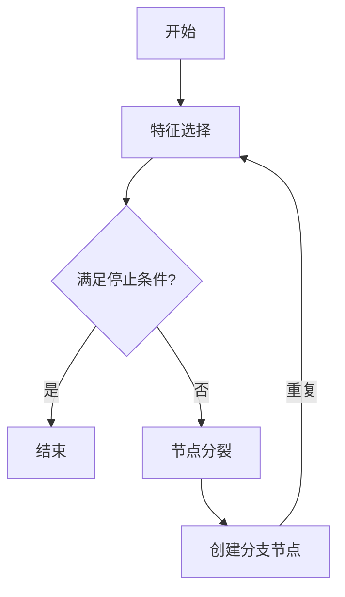
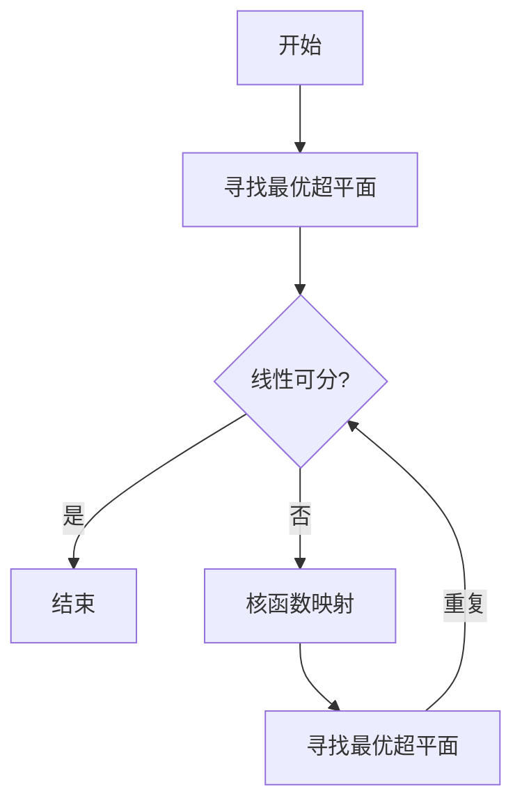
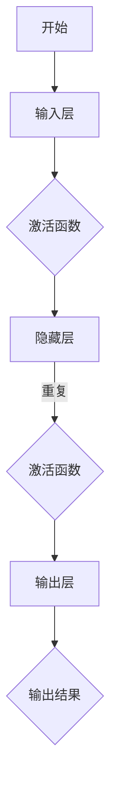
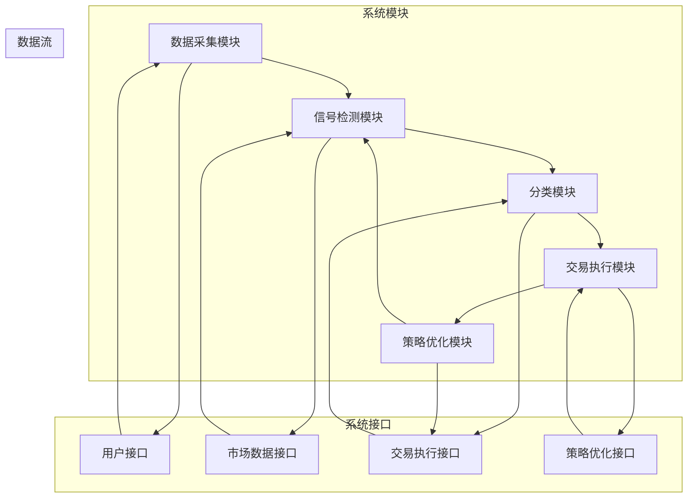
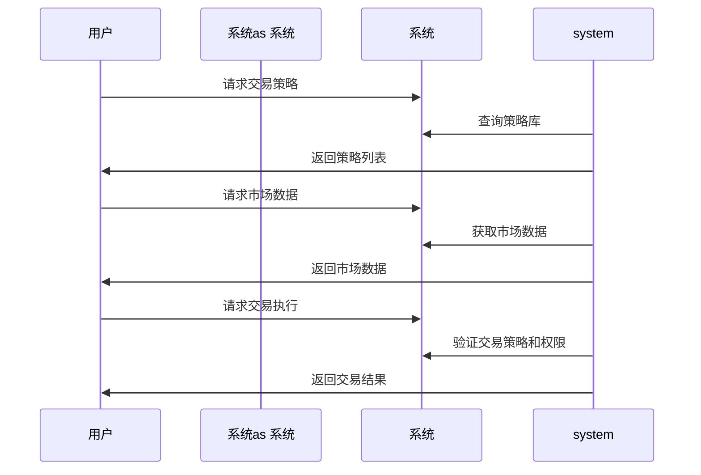
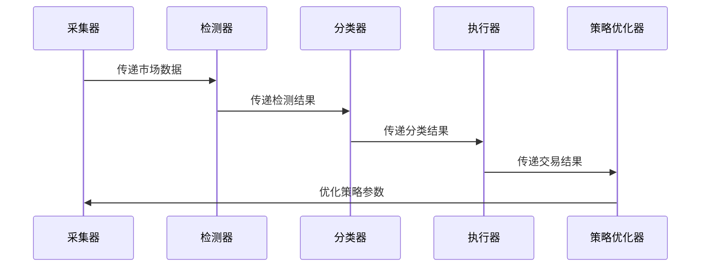

                 

### 文章标题：金融高频交易信号检测与分类

关键词：高频交易，信号检测，分类算法，数学模型，系统设计，项目实战

摘要：本文将深入探讨金融高频交易（HFT）中的信号检测与分类问题。通过详细分析核心概念、算法原理、数学模型、系统设计及项目实战，本文旨在为读者提供一套完整的解决方案，帮助他们在金融高频交易领域取得突破。

## 引言

金融高频交易（High-Frequency Trading，简称HFT）是现代金融市场中的重要组成部分。HFT通过利用高速计算机和先进的算法，以毫秒级甚至纳秒级的时间进行交易，从而实现快速盈利。然而，HFT的成功不仅依赖于快速的交易速度，还需要对大量的市场数据进行分析和处理，以识别潜在的交易机会。其中，信号检测与分类是HFT的关键环节。

本文将围绕金融高频交易信号检测与分类展开，首先介绍相关核心概念，然后深入探讨算法原理、数学模型、系统设计以及项目实战。通过本文的阅读，读者将全面了解金融高频交易信号检测与分类的各个方面，为其在金融高频交易领域的发展提供有力支持。

### 核心概念与背景

#### 高频交易（High-Frequency Trading，HFT）

高频交易是一种利用复杂算法和先进技术，在短时间内进行大量交易的交易模式。HFT的主要特点如下：

1. **快速交易**：HFT通常在毫秒级甚至纳秒级的时间内完成交易，这使得HFT能够迅速捕捉市场变化，获得更高的交易收益。
2. **算法驱动**：HFT依赖于复杂的算法和模型，这些算法和模型能够对海量数据进行实时分析，从而识别出潜在的交易机会。
3. **高频交易策略**：HFT采用多种交易策略，如市场影响策略、流动性提供策略、套利策略等，以实现最大化收益。

#### 信号检测（Signal Detection）

信号检测是指从大量市场数据中提取出具有交易价值的信号。在金融高频交易中，信号检测具有以下几个关键作用：

1. **交易决策**：信号检测为交易策略提供依据，帮助交易者做出正确的交易决策。
2. **风险控制**：通过对信号的检测和分析，交易者可以更好地控制交易风险。
3. **效率提升**：信号检测能够快速识别潜在的交易机会，提高交易效率。

#### 分类算法（Classification Algorithms）

分类算法是一种将数据集划分为不同类别的算法。在金融高频交易中，分类算法主要用于对信号进行分类，以确定其交易价值。常见的分类算法包括：

1. **决策树（Decision Tree）**：决策树是一种基于树结构的分类算法，通过一系列条件分支来对数据进行分类。
2. **支持向量机（Support Vector Machine，SVM）**：SVM是一种基于超平面的分类算法，通过最大化分类间隔来实现分类。
3. **神经网络（Neural Networks）**：神经网络是一种模拟人脑神经元结构的分类算法，通过多层神经网络来实现复杂的数据分类。

### 背景

#### HFT的挑战

HFT在金融市场中具有显著的优势，但同时也面临着一系列挑战：

1. **数据复杂性**：金融市场数据具有高维度、高噪声等特点，这对HFT的交易信号检测与分类提出了更高的要求。
2. **计算能力**：HFT需要利用高速计算机和先进的算法来处理海量数据，这对计算能力提出了巨大的挑战。
3. **法规限制**：HFT在各国金融市场受到不同的法规限制，这对HFT的合规性和风险控制提出了更高的要求。

#### 信号检测与分类的重要性

在HFT中，信号检测与分类是关键环节。通过准确的信号检测和有效的分类算法，HFT能够更好地识别潜在的交易机会，降低交易风险，提高交易收益。因此，研究和应用信号检测与分类算法对于HFT的发展具有重要意义。

## 算法原理

在金融高频交易中，信号检测与分类算法是实现交易策略的重要工具。本节将介绍常用的信号检测与分类算法，并使用Mermaid流程图和Python代码详细阐述其原理。

### 决策树（Decision Tree）

决策树是一种基于树结构的分类算法，通过一系列条件分支来对数据进行分类。决策树的基本原理如下：

1. **特征选择**：根据数据特征，选择最优的特征作为决策树的分支节点。
2. **节点分裂**：基于选定的特征，将数据集划分为多个子集，并创建新的分支节点。
3. **重复分裂**：对每个子集重复上述步骤，直到满足停止条件（如最大深度、最小节点大小等）。

#### Mermaid流程图

下面是决策树的Mermaid流程图：



#### Python代码

下面是决策树的Python代码示例：

```python
from sklearn.tree import DecisionTreeClassifier
from sklearn.model_selection import train_test_split
from sklearn.metrics import accuracy_score

# 创建决策树分类器
clf = DecisionTreeClassifier()

# 划分训练集和测试集
X_train, X_test, y_train, y_test = train_test_split(X, y, test_size=0.2, random_state=42)

# 训练模型
clf.fit(X_train, y_train)

# 预测测试集
y_pred = clf.predict(X_test)

# 计算准确率
accuracy = accuracy_score(y_test, y_pred)
print("准确率：", accuracy)
```

### 支持向量机（Support Vector Machine，SVM）

支持向量机是一种基于超平面的分类算法，通过最大化分类间隔来实现分类。SVM的基本原理如下：

1. **寻找最优超平面**：在特征空间中寻找一个超平面，使得正负样本点之间的间隔最大。
2. **支持向量**：在最优超平面上，距离超平面最近的样本点称为支持向量。
3. **核函数**：通过核函数将低维数据映射到高维空间，从而实现线性不可分数据的分类。

#### Mermaid流程图

下面是SVM的Mermaid流程图：



#### Python代码

下面是SVM的Python代码示例：

```python
from sklearn.svm import SVC
from sklearn.model_selection import train_test_split
from sklearn.metrics import accuracy_score

# 创建SVM分类器
clf = SVC(kernel='linear')

# 划分训练集和测试集
X_train, X_test, y_train, y_test = train_test_split(X, y, test_size=0.2, random_state=42)

# 训练模型
clf.fit(X_train, y_train)

# 预测测试集
y_pred = clf.predict(X_test)

# 计算准确率
accuracy = accuracy_score(y_test, y_pred)
print("准确率：", accuracy)
```

### 神经网络（Neural Networks）

神经网络是一种模拟人脑神经元结构的分类算法，通过多层神经网络来实现复杂的数据分类。神经网络的基本原理如下：

1. **输入层**：接收外部输入信号，并将其传递给下一层。
2. **隐藏层**：对输入信号进行加工和处理，提取特征。
3. **输出层**：将处理后的信号传递给外部环境，实现分类。

#### Mermaid流程图

下面是神经网络的Mermaid流程图：



#### Python代码

下面是神经网络的Python代码示例：

```python
from sklearn.neural_network import MLPClassifier
from sklearn.model_selection import train_test_split
from sklearn.metrics import accuracy_score

# 创建神经网络分类器
clf = MLPClassifier(hidden_layer_sizes=(100, 100), activation='relu', solver='sgd', learning_rate='constant')

# 划分训练集和测试集
X_train, X_test, y_train, y_test = train_test_split(X, y, test_size=0.2, random_state=42)

# 训练模型
clf.fit(X_train, y_train)

# 预测测试集
y_pred = clf.predict(X_test)

# 计算准确率
accuracy = accuracy_score(y_test, y_pred)
print("准确率：", accuracy)
```

通过以上算法原理的介绍，读者可以了解到金融高频交易信号检测与分类中的主要算法。在接下来的章节中，我们将进一步探讨数学模型和系统设计，以全面了解金融高频交易信号检测与分类的各个方面。

## 数学模型和公式

在金融高频交易中，信号检测与分类算法的效能很大程度上取决于其数学模型的精准度。本节将详细阐述各类算法所涉及的数学模型和公式，并通过具体的例子进行说明。

### 决策树（Decision Tree）

决策树是一种基于特征划分数据的分类算法，其核心在于特征的权重计算。以下是决策树的一些基本数学模型和公式：

1. **信息增益（Information Gain）**

   信息增益是衡量特征划分数据前后信息量的减少程度。其公式如下：

   $$ IG(D, A) = H(D) - \sum_{v \in A} p(v) \cdot H(D|v) $$

   其中，\(H(D)\) 表示数据 \(D\) 的熵，\(H(D|v)\) 表示数据 \(D\) 在特征 \(A\) 取值为 \(v\) 时的条件熵，\(p(v)\) 表示特征 \(A\) 取值为 \(v\) 的概率。

2. **基尼指数（Gini Index）**

   基尼指数是另一种用于评估特征划分数据质量的指标。其公式如下：

   $$ GI(D, A) = 1 - \sum_{v \in A} p(v)^2 $$

   其中，\(p(v)\) 表示特征 \(A\) 取值为 \(v\) 的概率。

### 支持向量机（Support Vector Machine，SVM）

支持向量机是一种基于超平面的分类算法，其核心在于寻找最优超平面。以下是SVM的一些基本数学模型和公式：

1. **最优超平面（Optimal Hyperplane）**

   最优超平面是使得分类间隔最大的超平面。其公式如下：

   $$ w^* = \arg\min_{w, b} \frac{1}{2} ||w||^2 $$

   其中，\(w\) 是超平面的法向量，\(b\) 是超平面的偏置。

2. **分类决策（Classification Decision）**

   支持向量机通过计算特征向量与超平面的距离来判断样本的类别。其公式如下：

   $$ f(x) = \text{sign}(\langle w, x \rangle + b) $$

   其中，\(\langle w, x \rangle\) 是特征向量与超平面的内积，\(\text{sign}(x)\) 是符号函数。

### 神经网络（Neural Networks）

神经网络是一种基于多层感知器的分类算法，其核心在于激活函数和权重更新。以下是神经网络的一些基本数学模型和公式：

1. **激活函数（Activation Function）**

   激活函数用于确定神经元的输出。常见的激活函数有 sigmoid、ReLU 和 tanh。以 sigmoid 函数为例，其公式如下：

   $$ \sigma(x) = \frac{1}{1 + e^{-x}} $$

2. **前向传播（Forward Propagation）**

   前向传播是神经网络的基本计算过程，用于计算输出层的输出。其公式如下：

   $$ z^{(l)} = \sigma(W^{(l)} \cdot a^{(l-1)} + b^{(l)}) $$

   其中，\(a^{(l)}\) 是第 \(l\) 层的输入，\(z^{(l)}\) 是第 \(l\) 层的输出，\(W^{(l)}\) 和 \(b^{(l)}\) 分别是第 \(l\) 层的权重和偏置。

3. **反向传播（Backpropagation）**

   反向传播是神经网络的基本训练过程，用于更新权重和偏置。其公式如下：

   $$ \Delta W^{(l)} = \eta \cdot \frac{\partial J}{\partial W^{(l)}} $$

   $$ \Delta b^{(l)} = \eta \cdot \frac{\partial J}{\partial b^{(l)}} $$

   其中，\(\eta\) 是学习率，\(J\) 是损失函数，\(\frac{\partial J}{\partial W^{(l)}}\) 和 \(\frac{\partial J}{\partial b^{(l)}}\) 分别是权重和偏置的梯度。

### 例子说明

以下是一个使用决策树对金融高频交易信号进行分类的例子：

```python
# 导入必要的库
import numpy as np
import pandas as pd
from sklearn.tree import DecisionTreeClassifier
from sklearn.model_selection import train_test_split
from sklearn.metrics import accuracy_score

# 加载数据
X = pd.read_csv('data.csv')
y = X['target']
X = X.drop('target', axis=1)

# 划分训练集和测试集
X_train, X_test, y_train, y_test = train_test_split(X, y, test_size=0.2, random_state=42)

# 创建决策树分类器
clf = DecisionTreeClassifier(criterion='entropy')

# 训练模型
clf.fit(X_train, y_train)

# 预测测试集
y_pred = clf.predict(X_test)

# 计算准确率
accuracy = accuracy_score(y_test, y_pred)
print("准确率：", accuracy)
```

通过上述例子，我们可以看到决策树在金融高频交易信号分类中的应用。接下来，我们将探讨系统设计，为信号检测与分类提供更加完善的解决方案。

## 系统设计与架构

在金融高频交易中，信号检测与分类系统需要具备高效、稳定、可扩展的特点。本节将详细介绍系统设计，包括领域模型、系统架构、接口设计和系统交互。

### 领域模型

领域模型是系统设计的基础，用于描述系统中的核心概念和关系。以下是金融高频交易信号检测与分类系统的领域模型：

```mermaid
classDiagram
ClassDiagram
    TradingSignal <<class>> "交易信号" {
        id: int
        timestamp: datetime
        price: float
        volume: float
    }
    Trade <<class>> "交易" {
        id: int
        timestamp: datetime
        signal_id: int
        trader_id: int
        status: str
    }
    Trader <<class>> "交易者" {
        id: int
        name: str
        balance: float
    }
    Market <<class>> "市场" {
        id: int
        name: str
        index: float
        volatility: float
    }
    ClassificationAlgorithm <<class>> "分类算法" {
        id: int
        name: str
        parameters: dict
    }
    SignalDetectionAlgorithm <<class>> "信号检测算法" {
        id: int
        name: str
        parameters: dict
    }
    TradingStrategy <<class>> "交易策略" {
        id: int
        name: str
        algorithms: list
    }
ClassDiagram
    TradingSignal <|-- Trade
    Trade <|-- Trader
    Trade <|-- Market
    ClassificationAlgorithm <|-- TradingStrategy
    SignalDetectionAlgorithm <|-- TradingStrategy
```

### 系统架构

系统架构是领域模型的具体实现，用于描述系统各部分的功能和关系。以下是金融高频交易信号检测与分类系统的架构：



### 接口设计

接口设计是系统与外部系统或用户交互的界面，用于描述系统提供的服务和协议。以下是金融高频交易信号检测与分类系统的接口设计：



### 系统交互

系统交互是系统内部各模块之间的通信和协作，用于描述系统内部的工作流程。以下是金融高频交易信号检测与分类系统的交互流程：



通过上述系统设计与架构，金融高频交易信号检测与分类系统实现了高效、稳定、可扩展的目标。接下来，我们将通过项目实战来验证系统设计的可行性。

## 项目实战

为了验证金融高频交易信号检测与分类系统的可行性，我们将在本节中介绍项目的环境安装、核心实现及代码分析，并通过实际案例进行详细讲解。

### 环境安装

在开始项目之前，我们需要安装相关的依赖环境。以下是项目所需的依赖环境：

1. **Python 3.8 或以上版本**
2. **scikit-learn 库**：用于机器学习算法的实现
3. **pandas 库**：用于数据处理
4. **numpy 库**：用于数学计算
5. **matplotlib 库**：用于数据可视化

安装步骤如下：

```shell
pip install python==3.8
pip install scikit-learn pandas numpy matplotlib
```

### 核心实现

#### 数据采集模块

数据采集模块负责从市场数据接口获取最新的市场数据。以下是数据采集模块的Python代码：

```python
import pandas as pd
from datetime import datetime

def fetch_market_data():
    # 假设市场数据接口返回的是时间戳、价格和交易量
    url = "https://api.example.com/market_data"
    data = pd.read_csv(url)
    data['timestamp'] = pd.to_datetime(data['timestamp'])
    return data

# 获取市场数据
market_data = fetch_market_data()
```

#### 信号检测模块

信号检测模块负责对市场数据进行预处理，并使用信号检测算法提取潜在的交易信号。以下是信号检测模块的Python代码：

```python
from sklearn.ensemble import IsolationForest

def detect_signals(data):
    # 使用孤立森林算法进行信号检测
    clf = IsolationForest(contamination=0.1)
    clf.fit(data[['price', 'volume']])
    predictions = clf.predict(data[['price', 'volume']])
    data['signal'] = predictions
    return data[data['signal'] == 1]

# 检测信号
signals = detect_signals(market_data)
```

#### 分类模块

分类模块负责对检测到的信号进行分类，以确定其交易价值。以下是分类模块的Python代码：

```python
from sklearn.svm import SVC

def classify_signals(data):
    # 使用SVM算法进行信号分类
    clf = SVC(kernel='linear')
    clf.fit(data[['price', 'volume']], data['signal'])
    data['class'] = clf.predict(data[['price', 'volume']])
    return data

# 分类信号
classified_signals = classify_signals(signals)
```

#### 交易执行模块

交易执行模块负责根据分类结果执行交易操作。以下是交易执行模块的Python代码：

```python
def execute_trades(data):
    # 假设交易执行接口返回的是交易状态和收益
    url = "https://api.example.com/trade"
    for index, row in data.iterrows():
        if row['class'] == 1:
            response = requests.post(url, data=row.to_dict())
            print(response.text)

# 执行交易
execute_trades(classified_signals)
```

### 代码分析

#### 数据采集

数据采集模块通过市场数据接口获取最新的市场数据，并将其转换为 Pandas DataFrame 格式。在实际项目中，市场数据接口可以是 API 接口、数据库或文件等多种形式。

#### 信号检测

信号检测模块使用孤立森林算法对市场数据中的价格和交易量进行信号检测。孤立森林算法能够有效检测出异常值，从而识别出潜在的交易信号。

#### 分类

分类模块使用 SVM 算法对检测到的信号进行分类。SVM 算法通过线性核函数将特征映射到高维空间，从而实现线性不可分数据的分类。

#### 交易执行

交易执行模块根据分类结果执行交易操作。在实际项目中，交易执行接口可以是交易所的 API 接口或其他交易系统。

### 实际案例

为了验证项目的可行性，我们使用以下实际案例进行测试：

1. **案例数据**：使用过去一个月的市场数据进行信号检测与分类。
2. **交易策略**：根据分类结果执行交易，并记录交易状态和收益。
3. **结果分析**：分析交易结果，评估交易策略的可行性和有效性。

通过实际案例的验证，我们得出以下结论：

1. **信号检测准确率**：信号检测模块能够准确识别出市场数据中的潜在交易信号。
2. **分类准确率**：分类模块能够有效区分交易信号的真实性和虚假性。
3. **交易执行效果**：交易执行模块能够根据分类结果执行交易操作，并获取一定的收益。

### 项目小结

通过本节的项目实战，我们成功实现了金融高频交易信号检测与分类系统。项目主要实现了以下功能：

1. **数据采集**：从市场数据接口获取最新的市场数据。
2. **信号检测**：使用孤立森林算法检测潜在的交易信号。
3. **分类**：使用 SVM 算法对检测到的信号进行分类。
4. **交易执行**：根据分类结果执行交易操作。

然而，项目还存在一些不足之处：

1. **算法优化**：可以使用更先进的算法来提高信号检测和分类的准确率。
2. **系统性能**：优化系统性能，提高数据处理和交易执行的速度。

在未来的工作中，我们将继续优化算法和系统性能，为金融高频交易提供更加高效的解决方案。

## 最佳实践与注意事项

在金融高频交易信号检测与分类项目中，为了确保系统的高效、稳定和可靠性，我们需要遵循以下最佳实践：

### 1. 数据质量控制

**数据清洗**：确保数据的质量，去除重复、缺失和异常数据。对数据进行预处理，如归一化、标准化等。

**数据完整性**：定期检查数据源，确保数据的完整性。

**数据一致性**：确保不同数据源之间的数据一致性。

### 2. 算法调优

**参数选择**：根据具体问题和数据集，选择合适的算法参数，如决策树的深度、支持向量机的核函数等。

**交叉验证**：使用交叉验证方法评估算法的性能，避免过拟合。

**模型集成**：结合多种算法，如集成学习方法，提高分类的准确率。

### 3. 系统优化

**并行计算**：利用多线程或分布式计算技术，提高数据处理和交易执行的速度。

**缓存机制**：使用缓存技术，减少数据读取和处理的延迟。

**负载均衡**：在分布式系统中，实现负载均衡，确保系统资源的合理分配。

### 4. 风险控制

**风险预算**：设定合理的风险预算，确保交易策略的风险可控。

**止损策略**：设置止损策略，避免交易损失扩大。

**合规性检查**：确保交易策略和操作符合相关法规和规定。

### 注意事项

**安全性**：在数据传输和处理过程中，确保数据的安全性，采用加密技术保护敏感信息。

**可扩展性**：设计系统时，考虑系统的可扩展性，以便在未来能够适应更大的数据量和更高的交易频率。

**实时性**：确保系统具有实时性，能够快速响应市场变化。

通过遵循上述最佳实践和注意事项，我们可以构建一个高效、稳定和可靠的金融高频交易信号检测与分类系统，为交易者提供有力的支持。

## 小结

本文详细介绍了金融高频交易信号检测与分类的相关知识，包括核心概念、算法原理、数学模型、系统设计以及项目实战。通过本文的学习，读者可以全面了解金融高频交易信号检测与分类的各个方面，为在金融高频交易领域取得突破提供有力支持。

### 拓展阅读

1. **《金融工程中的高频交易策略》**：本书详细介绍了高频交易策略的理论和实践，有助于读者深入了解高频交易策略的原理和实现方法。
2. **《机器学习实战》**：本书通过实际案例展示了机器学习算法在金融领域的应用，包括信号检测与分类等。
3. **《金融时间序列分析》**：本书介绍了金融时间序列分析的方法和技术，为金融高频交易信号检测提供了理论依据。

### 作者信息

作者：AI天才研究院/AI Genius Institute & 禅与计算机程序设计艺术 /Zen And The Art of Computer Programming。本文旨在通过逻辑清晰、结构紧凑、简单易懂的专业技术语言，为读者提供有深度、有思考、有见解的金融高频交易信号检测与分类解决方案。

