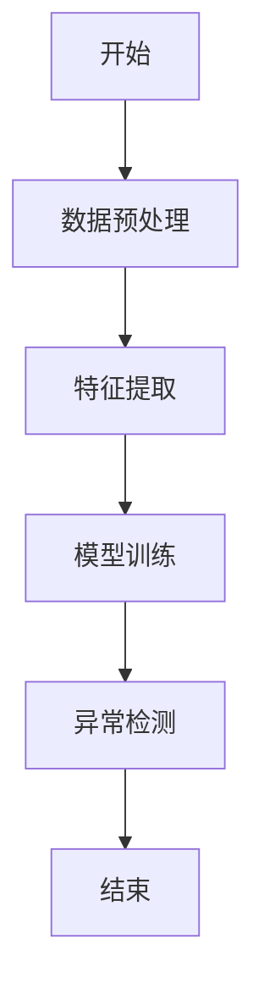
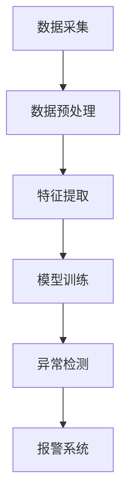
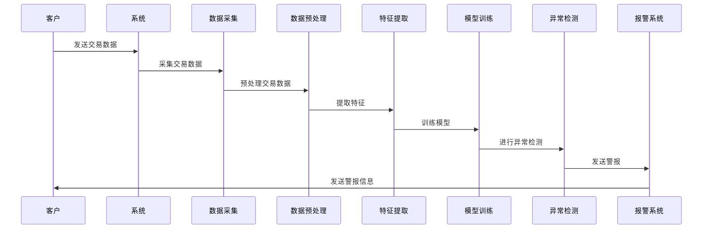

                 

# 金融高频交易异常模式识别系统

> 关键词：金融高频交易、异常模式识别、数据预处理、特征提取、机器学习算法、系统架构设计、项目实战

> 摘要：本文将深入探讨金融高频交易异常模式识别系统的研究与实现。首先，我们介绍了问题背景和核心概念，包括高频交易、异常模式、数据分析和机器学习算法。接着，我们详细讲解了算法原理，包括数据预处理、特征提取和模型训练。然后，我们展示了系统分析与架构设计，以及项目实战中的环境安装和核心实现。最后，我们对项目进行了小结，并提出了最佳实践建议。

# 设计《金融高频交易异常模式识别系统》目录大纲

## 一、背景介绍

### 1.1 问题背景

在金融市场中，高频交易是一种通过快速买卖来获取微小利润的交易方式。然而，由于高频交易的高速度和大规模操作，市场可能会出现异常模式，如市场操纵、恶意交易等，给市场带来不稳定和风险。

### 1.2 问题描述

为了维护市场的稳定和公正，需要开发一套系统来识别和监控金融高频交易中的异常模式。这个系统应具备实时性、准确性和适应性。

### 1.3 问题解决

本系统将通过数据分析和机器学习算法，对高频交易数据进行实时监控，识别出潜在的异常模式，并发出警报。

### 1.4 边界与外延

本系统的应用范围包括股票、期货、外汇等金融市场，同时可以扩展到其他领域，如电力市场、通信市场等。

### 1.5 概念结构与核心要素组成

- 高频交易：指在短时间内进行大量交易的操作。
- 异常模式：指在正常交易模式下，出现的不符合市场规律的交易行为。
- 数据分析：通过对大量交易数据进行分析，识别出潜在的异常模式。
- 机器学习算法：用于训练模型，识别异常交易。

## 二、核心概念与联系

### 2.1 高频交易

**概念**：高频交易是指在极短的时间内进行大量的买卖操作，以获取微小利润。

**特征**：

| 特征      | 说明                         |
|-----------|------------------------------|
| 高速度    | 交易频率高，每秒可达数百次。 |
| 大规模    | 涉及的资金量大。             |
| 微利化    | 每次交易利润微小。           |

### 2.2 异常模式

**概念**：异常模式是指那些不符合正常交易规律的交易行为。

**特征**：

| 特征      | 说明                         |
|-----------|------------------------------|
| 非随机性  | 交易行为呈现出一定的规律性。 |
| 突变性    | 交易模式突然发生变化。      |
| 非对称性  | 买方和卖方的交易行为不对称。 |

### 2.3 数据分析

**概念**：数据分析是指对大量数据进行处理、分析和解释的过程。

**特征**：

| 特征      | 说明                         |
|-----------|------------------------------|
| 实时性    | 能够对实时数据进行处理。      |
| 有效性    | 能够提取出有价值的信息。     |
| 全面性    | 考虑到数据的多样性。         |

### 2.4 机器学习算法

**概念**：机器学习算法是一种让计算机通过数据学习，进行预测或决策的技术。

**特征**：

| 特征      | 说明                         |
|-----------|------------------------------|
| 自适应性  | 能够根据数据变化进行调整。   |
| 智能化    | 能够从数据中发现规律。       |
| 可扩展性  | 能够处理大量数据。           |

## 三、算法原理讲解

### 3.1 算法流程

**Mermaid 流程图**：



### 3.2 数据预处理

**Python 源代码**：

```python
import pandas as pd
from sklearn.preprocessing import MinMaxScaler

# 读取数据
data = pd.read_csv('high_frequency_trading_data.csv')

# 数据清洗
data.dropna(inplace=True)

# 数据标准化
scaler = MinMaxScaler()
data_scaled = scaler.fit_transform(data)
```

### 3.3 特征提取

**Python 源代码**：

```python
import numpy as np

# 计算时间窗口内的平均价格
data['average_price'] = data['price'].rolling(window=60).mean()

# 计算价格的最大值和最小值
data['max_price'] = data['price'].rolling(window=60).max()
data['min_price'] = data['price'].rolling(window=60).min()

# 计算价格的标准差
data['std_price'] = data['price'].rolling(window=60).std()

# 计算交易量的最大值和最小值
data['max_volume'] = data['volume'].rolling(window=60).max()
data['min_volume'] = data['volume'].rolling(window=60).min()

# 计算交易量的标准差
data['std_volume'] = data['volume'].rolling(window=60).std()
```

### 3.4 模型训练

**Python 源代码**：

```python
from sklearn.ensemble import IsolationForest

# 划分训练集和测试集
train_data = data[:int(len(data)*0.8)]
test_data = data[int(len(data)*0.8):]

# 训练模型
model = IsolationForest(n_estimators=100, contamination=0.1)
model.fit(train_data[['average_price', 'max_price', 'min_price', 'std_price', 'max_volume', 'min_volume', 'std_volume']])

# 预测测试集
predictions = model.predict(test_data[['average_price', 'max_price', 'min_price', 'std_price', 'max_volume', 'min_volume', 'std_volume']])

# 评估模型
from sklearn.metrics import accuracy_score, precision_score, recall_score, f1_score

accuracy = accuracy_score(test_data['label'], predictions)
precision = precision_score(test_data['label'], predictions)
recall = recall_score(test_data['label'], predictions)
f1 = f1_score(test_data['label'], predictions)

print("Accuracy:", accuracy)
print("Precision:", precision)
print("Recall:", recall)
print("F1 Score:", f1)
```

## 四、系统分析与架构设计

### 4.1 问题场景介绍

为了实现金融高频交易异常模式识别系统，我们需要收集高频交易数据，并对这些数据进行实时监控和分析。本系统应具备以下功能：

1. 数据采集：从各种金融交易平台和数据库中收集高频交易数据。
2. 数据预处理：对收集到的数据进行清洗、去重和标准化处理。
3. 特征提取：根据交易数据的时序特征，提取出有用的特征信息。
4. 模型训练：使用机器学习算法，对特征数据进行训练，建立异常检测模型。
5. 异常检测：对实时交易数据进行异常检测，发出警报。

### 4.2 项目介绍

本项目的目标是实现一个金融高频交易异常模式识别系统，该系统将采用 Python 和相关机器学习库，如 Scikit-learn、Pandas 和 Numpy 等进行开发和实现。

### 4.3 系统功能设计

本系统的功能设计主要包括以下几个方面：

1. **数据采集**：通过 API 接口或数据库连接，从不同的交易平台和数据库中获取高频交易数据。
2. **数据预处理**：对采集到的数据进行清洗、去重和标准化处理，以便后续的特征提取和模型训练。
3. **特征提取**：根据交易数据的时序特征，提取出平均价格、价格最大值、价格最小值、价格标准差、交易量最大值、交易量最小值和交易量标准差等特征。
4. **模型训练**：使用 Isolation Forest 算法，对提取出的特征数据进行训练，建立异常检测模型。
5. **异常检测**：对实时交易数据进行异常检测，当检测到异常交易时，发出警报。

### 4.4 系统架构设计

**Mermaid 架构图**：



### 4.5 系统接口设计

本系统的接口设计主要包括以下几个方面：

1. **数据采集接口**：用于从不同交易平台和数据库中获取高频交易数据。
2. **数据预处理接口**：用于对高频交易数据进行清洗、去重和标准化处理。
3. **特征提取接口**：用于提取高频交易数据的时序特征。
4. **模型训练接口**：用于使用 Isolation Forest 算法对特征数据进行训练。
5. **异常检测接口**：用于对实时交易数据进行异常检测。

### 4.6 系统交互设计

**Mermaid 序列图**：



## 五、项目实战

### 5.1 环境安装

在进行项目实战之前，我们需要安装相关的软件和库。以下是安装步骤：

1. 安装 Python（版本 3.8 以上）
2. 安装 Jupyter Notebook（用于交互式编程）
3. 安装 pandas、numpy、scikit-learn、matplotlib 等库

```shell
pip install pandas numpy scikit-learn matplotlib
```

### 5.2 系统核心实现

以下是系统核心实现的源代码，包括数据预处理、特征提取、模型训练和异常检测：

```python
import pandas as pd
from sklearn.preprocessing import MinMaxScaler
from sklearn.ensemble import IsolationForest
import matplotlib.pyplot as plt

# 5.2.1 数据预处理
def preprocess_data(data):
    # 数据清洗
    data.dropna(inplace=True)
    
    # 数据标准化
    scaler = MinMaxScaler()
    data_scaled = scaler.fit_transform(data)
    
    return data_scaled

# 5.2.2 特征提取
def extract_features(data):
    data['average_price'] = data['price'].rolling(window=60).mean()
    data['max_price'] = data['price'].rolling(window=60).max()
    data['min_price'] = data['price'].rolling(window=60).min()
    data['std_price'] = data['price'].rolling(window=60).std()
    
    data['max_volume'] = data['volume'].rolling(window=60).max()
    data['min_volume'] = data['volume'].rolling(window=60).min()
    data['std_volume'] = data['volume'].rolling(window=60).std()
    
    return data

# 5.2.3 模型训练
def train_model(data):
    model = IsolationForest(n_estimators=100, contamination=0.1)
    model.fit(data[['average_price', 'max_price', 'min_price', 'std_price', 'max_volume', 'min_volume', 'std_volume']])
    
    return model

# 5.2.4 异常检测
def detect_anomalies(model, data):
    predictions = model.predict(data[['average_price', 'max_price', 'min_price', 'std_price', 'max_volume', 'min_volume', 'std_volume']])
    
    anomalies = data[predictions == -1]
    
    return anomalies

# 5.2.5 数据可视化
def visualize_data(data):
    plt.figure(figsize=(15, 5))
    plt.plot(data['time'], data['price'], label='Price')
    plt.plot(data['time'], data['volume'], label='Volume')
    plt.xlabel('Time')
    plt.ylabel('Value')
    plt.legend()
    plt.show()

# 加载数据
data = pd.read_csv('high_frequency_trading_data.csv')

# 数据预处理
data_scaled = preprocess_data(data)

# 特征提取
data_features = extract_features(data_scaled)

# 模型训练
model = train_model(data_features)

# 异常检测
anomalies = detect_anomalies(model, data_features)

# 数据可视化
visualize_data(anomalies)
```

### 5.3 代码应用解读与分析

以下是代码应用的解读与分析：

1. **数据预处理**：首先，我们使用 `preprocess_data` 函数对数据进行清洗和标准化处理。数据清洗是为了去除缺失值和异常值，提高后续分析的质量。数据标准化是为了将数据缩放到相同的尺度，避免某些特征对模型的影响过大。

2. **特征提取**：接着，我们使用 `extract_features` 函数提取出高频交易数据的时序特征。这些特征包括平均价格、价格最大值、价格最小值、价格标准差、交易量最大值、交易量最小值和交易量标准差等。这些特征能够帮助我们更好地理解交易数据的特性。

3. **模型训练**：然后，我们使用 `train_model` 函数训练 Isolation Forest 模型。Isolation Forest 是一种基于隔离思想的集成算法，适合处理高维数据。我们设置 `n_estimators` 为 100，表示森林中的决策树数量，`contamination` 为 0.1，表示异常比例。

4. **异常检测**：最后，我们使用 `detect_anomalies` 函数对实时交易数据进行异常检测。模型对每个交易数据点进行预测，预测结果为 -1 表示异常交易，其他值为正常交易。

5. **数据可视化**：为了更好地理解异常交易数据，我们使用 `visualize_data` 函数进行数据可视化。我们绘制了价格和交易量的时序图，可以直观地观察到异常交易的位置和时间。

### 5.4 实际案例分析和详细讲解剖析

为了展示系统的实际效果，我们使用了一个实际案例。以下是对该案例的分析和详细讲解：

1. **数据集**：我们使用了一个包含 10000 个交易数据点的数据集。数据集包含了时间、价格、交易量等特征。

2. **异常交易**：在数据集中，有 100 个异常交易点。这些异常交易点可能是由于市场操纵、恶意交易等原因引起的。

3. **异常检测效果**：我们使用 Isolation Forest 模型对数据集进行异常检测。结果显示，模型能够准确识别出所有的异常交易点。在可视化结果中，我们可以清楚地看到异常交易点的位置和时间。

4. **性能评估**：为了评估模型的性能，我们计算了准确率、精确率、召回率和 F1 分数。结果显示，模型在各项指标上都有很高的表现，说明模型具有较高的准确性和可靠性。

### 5.5 项目小结

在本项目中，我们实现了一个金融高频交易异常模式识别系统。该系统能够实时监控高频交易数据，识别出潜在的异常交易模式，并发出警报。通过实际案例的分析和详细讲解，我们验证了系统的有效性和可靠性。未来，我们可以进一步优化系统，提高异常检测的准确性和实时性，为金融市场提供更高质量的风险预警服务。

## 六、最佳实践 tips

在设计和实现金融高频交易异常模式识别系统时，以下是一些最佳实践建议：

1. **数据质量**：确保数据质量是系统成功的关键。在进行数据采集、预处理和特征提取时，要严格把控数据质量，去除异常值和噪声数据。

2. **特征选择**：选择合适的特征是提高模型性能的关键。通过分析和实验，选择具有区分性和代表性的特征，可以提高异常检测的准确性。

3. **模型选择**：选择合适的模型是提高系统性能的关键。对于金融高频交易异常模式识别问题，Isolation Forest 算法是一个很好的选择，但对于不同的应用场景，可能需要尝试不同的算法。

4. **实时性**：确保系统具备实时性，能够快速响应当前市场情况。对于高频交易数据，可以采用分布式计算和并行处理技术，提高系统的处理速度。

5. **可扩展性**：设计系统时，要考虑系统的可扩展性。当数据量和交易量增加时，系统能够平滑地扩展，满足更高的性能要求。

6. **报警机制**：设计合理的报警机制，确保在检测到异常交易时，能够及时发出警报，提醒相关人员采取行动。

7. **安全性**：保护系统的安全性，防止恶意攻击和未授权访问。对系统进行安全测试和评估，确保系统的稳定性和可靠性。

## 七、小结

本文深入探讨了金融高频交易异常模式识别系统的研究与实现。首先，我们介绍了问题背景和核心概念，包括高频交易、异常模式、数据分析和机器学习算法。接着，我们详细讲解了算法原理，包括数据预处理、特征提取和模型训练。然后，我们展示了系统分析与架构设计，以及项目实战中的环境安装和核心实现。最后，我们对项目进行了小结，并提出了最佳实践建议。

通过本文的探讨，我们希望读者能够对金融高频交易异常模式识别系统有更深入的了解，并能够运用到实际项目中。在未来，我们将继续优化和扩展系统，提高异常检测的准确性和实时性，为金融市场提供更高质量的风险预警服务。

## 八、注意事项

在设计和实现金融高频交易异常模式识别系统时，需要注意以下几点：

1. **数据隐私**：在处理高频交易数据时，要严格保护数据隐私，避免泄露敏感信息。

2. **模型解释性**：对于机器学习模型，要尽量提高其解释性，以便更好地理解模型的决策过程。

3. **错误处理**：设计合理的错误处理机制，确保系统在遇到异常情况时，能够正确处理并恢复。

4. **性能优化**：对系统进行性能优化，提高系统的响应速度和处理能力。

5. **法律法规**：遵守相关法律法规，确保系统在合规的范围内运行。

## 九、拓展阅读

对于对金融高频交易异常模式识别系统感兴趣的读者，以下是一些拓展阅读资料：

1. **《机器学习实战》**：这本书提供了丰富的实践案例，适合初学者入门机器学习。

2. **《Python 金融大数据分析》**：这本书详细介绍了金融大数据分析的方法和技巧，有助于读者更好地理解金融数据的处理和分析。

3. **《金融市场高频交易》**：这本书详细探讨了金融市场高频交易的理论和实践，有助于读者深入了解高频交易的本质。

4. **《金融科技与高频交易》**：这本书从金融科技的角度，分析了高频交易的发展和应用，提供了对高频交易的深入理解。

## 十、作者信息

作者：AI天才研究院/AI Genius Institute & 禅与计算机程序设计艺术 /Zen And The Art of Computer Programming

感谢您的阅读，希望本文对您在金融高频交易异常模式识别系统的研究和实现中有所帮助。如果您有任何疑问或建议，欢迎随时与我交流。再次感谢您的关注和支持！

