                 

### 《金融高频交易策略回测平台》

---

#### 关键词：高频交易、策略回测、金融科技、算法交易、回测平台

#### 摘要：
本文将深入探讨金融高频交易策略回测平台的设计与实现。通过对高频交易策略的背景介绍、回测平台必要性分析，以及详细的技术实现流程，本文旨在为金融工程师和交易员提供一套完整的策略回测解决方案，助力他们在复杂多变的金融市场中捕捉机会，实现稳健收益。

---

## 目录

### 引言

#### 1.1 问题的背景

#### 1.2 回测平台的必要性

#### 1.3 书籍概述

### 第2章 高频交易基础

#### 2.1 高频交易概述

#### 2.2 高频交易策略

#### 2.3 回测在策略开发中的作用

### 第3章 回测平台架构设计

#### 3.1 平台总体架构

#### 3.2 数据处理模块

#### 3.3 策略回测模块

#### 3.4 界面与报告模块

### 第4章 数据处理技术

#### 4.1 数据获取

#### 4.2 数据清洗与预处理

#### 4.3 数据存储与管理

### 第5章 策略回测原理与实践

#### 5.1 回测原理

#### 5.2 实践案例

#### 5.3 回测结果分析

### 第6章 高频交易策略优化

#### 6.1 参数优化

#### 6.2 策略组合

#### 6.3 策略风险管理

### 第7章 高频交易策略回测平台搭建

#### 7.1 开发环境准备

#### 7.2 数据处理模块开发

#### 7.3 策略回测模块开发

#### 7.4 平台集成与测试

### 第8章 总结与展望

#### 8.1 总结

#### 8.2 展望

### 附录

#### A. 参考资料

#### B. 代码示例

---

### 第1章 引言

#### 1.1 问题的背景

金融市场作为一个复杂且动态的系统，其价格波动往往受到多种因素的影响，如宏观经济指标、市场情绪、新闻事件等。在这种复杂多变的环境中，高频交易（High-Frequency Trading, HFT）策略应运而生。高频交易是指利用计算机算法在极短时间内进行大量交易，通过快速执行交易指令，从微小的价格变动中赚取利润。

高频交易在金融市场中扮演着重要的角色。一方面，它提供了市场流动性，使得市场能够更加高效地运行；另一方面，它也引入了新的交易模式，如程序化交易和算法交易，这些交易模式对市场价格产生了显著影响。

然而，高频交易的复杂性和风险性也带来了诸多挑战。为了确保交易策略的有效性和稳健性，回测（Backtesting）成为高频交易策略开发的重要环节。回测通过对历史数据的分析，验证交易策略的可行性，评估其潜在收益和风险。

#### 1.2 回测平台的必要性

尽管回测在策略开发中具有重要意义，但手动回测存在显著的局限性。手动回测不仅效率低下，且容易受到人为错误的影响。此外，随着交易数据的急剧增长，手动回测在处理大量数据时显得力不从心。

为了解决这些局限性，回测平台的必要性愈发凸显。回测平台能够自动化处理数据，提高回测效率，减少人为错误，并且支持复杂数据分析和策略优化。然而，构建一个高效、稳定且易于使用的回测平台也面临诸多技术挑战，如数据处理速度、系统稳定性和算法精度等。

#### 1.3 书籍概述

本书旨在为金融工程师和交易员提供一套完整的策略回测解决方案。通过系统性地介绍高频交易策略和回测平台的设计与实现，本书旨在帮助读者：

- 理解高频交易的基本概念和策略类型。
- 掌握回测平台的核心架构和关键技术。
- 学习如何进行数据获取、清洗和存储。
- 掌握策略回测的原理和实践。
- 了解策略优化的方法和技术。
- 实现高频交易策略回测平台的搭建与测试。

本书的目标读者是金融工程师、交易员以及有意从事高频交易领域的研究人员。通过本书的学习，读者将能够独立搭建并使用回测平台，优化交易策略，提高交易成功率。

### 第2章 高频交易基础

#### 2.1 高频交易概述

高频交易（High-Frequency Trading, HFT）是指利用计算机算法在极短的时间内进行大量交易，以从微小的价格变动中赚取利润的一种交易模式。HFT的历史可以追溯到20世纪90年代，随着互联网技术的普及和计算能力的提升，HFT逐渐成为金融市场中不可或缺的一部分。

在高频交易市场中，交易者利用高速网络、先进的计算机算法和大量的交易执行策略，进行高频交易。HFT市场中的角色包括交易所、经纪商、交易员和投资者。交易所提供交易场所，经纪商和交易员负责执行交易，而投资者则通过这些中介参与市场。

HFT的策略类型多种多样，包括但不限于：

- **事件驱动策略（Event-Driven Strategies）**：这种策略依赖于特定事件的发生，例如公司财报发布、新闻公告等，利用这些事件引发的价格变动进行交易。
- **统计套利策略（Statistical Arbitrage）**：这种策略利用市场中的定价偏差，通过同时买入和卖出相关资产来赚取利润。
- **趋势跟踪策略（Trend-Following Strategies）**：这种策略基于历史价格趋势，通过识别市场趋势并跟随趋势进行交易。

#### 2.2 高频交易策略

高频交易策略的多样性和复杂性使得不同策略在市场中有着不同的表现。以下是对几种主要高频交易策略的简要介绍：

- **事件驱动策略（Event-Driven Strategies）**：这种策略依赖于对市场信息的快速处理和反应。例如，当公司发布财报时，交易系统会自动分析财报中的数据，并根据这些数据调整交易策略。事件驱动策略的成功关键在于对信息的快速获取和准确分析。

  **案例**：某交易系统在分析一家公司财报时，发现该公司利润高于预期，因此预测股票价格将上涨。系统立即执行买入指令，并在股票价格达到预期目标时卖出，赚取利润。

- **统计套利策略（Statistical Arbitrage）**：这种策略利用市场中的定价偏差，通过同时买入和卖出相关资产来赚取利润。统计套利策略的成功关键在于对市场数据的深入分析和精确预测。

  **案例**：某交易系统发现股票A的价格与其看涨期权价格之间存在定价偏差。系统同时买入股票A和看涨期权，当股票价格上涨并消除定价偏差时，系统同时卖出股票A和看涨期权，赚取利润。

- **趋势跟踪策略（Trend-Following Strategies）**：这种策略基于历史价格趋势，通过识别市场趋势并跟随趋势进行交易。趋势跟踪策略的成功关键在于对市场趋势的准确识别和及时调整。

  **案例**：某交易系统通过分析历史价格数据，发现市场呈现出明显的上升趋势。系统在确定上升趋势后，买入相关资产，并在市场趋势发生变化时及时调整交易策略。

#### 2.3 回测在策略开发中的作用

回测（Backtesting）是高频交易策略开发中的关键环节，它通过对历史数据的分析，验证交易策略的可行性，评估其潜在收益和风险。回测在策略开发中的作用包括：

- **策略验证**：通过回测，交易者可以验证策略在实际市场中的表现，确保策略的可靠性和有效性。
- **风险评估**：回测可以帮助交易者评估策略的风险，包括潜在损失和市场波动性。
- **策略优化**：通过回测结果，交易者可以调整和优化策略参数，提高策略的收益和风险收益比。

**案例分析**：

假设某交易系统开发了一种基于事件驱动策略的高频交易策略，该策略依赖于对财报数据的分析。交易者首先使用历史数据对策略进行回测，分析不同财报事件对股票价格的影响。通过回测，交易者发现该策略在特定财报事件下表现良好，收益稳定。在此基础上，交易者继续优化策略参数，例如调整买入和卖出的时机，以提高策略的收益。

### 第3章 回测平台架构设计

#### 3.1 平台总体架构

回测平台的总体架构设计需要考虑系统的性能、可扩展性和易用性。一个典型的回测平台通常包括以下几个核心模块：

- **数据获取模块**：负责从不同的数据源获取交易数据，包括实时数据和历史数据。
- **数据处理模块**：对获取的数据进行清洗、转换和预处理，以便后续策略回测。
- **策略回测模块**：执行具体的策略回测过程，包括策略加载、模拟交易和结果分析。
- **用户界面模块**：提供用户交互界面，使得用户能够方便地配置策略参数、查看回测结果和生成报告。
- **报告生成模块**：生成详细的策略回测报告，包括策略表现、风险指标和收益分析。

**架构图**：

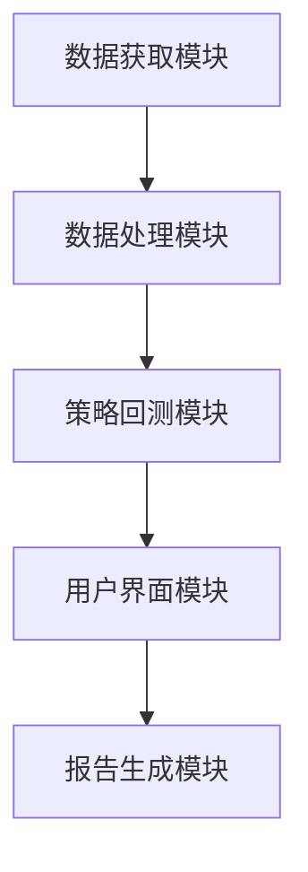

#### 3.2 数据处理模块

数据处理模块是回测平台的核心部分之一，它负责处理从数据源获取的原始数据。数据处理模块的主要任务包括：

- **数据清洗**：去除数据中的噪声和异常值，确保数据质量。
- **数据转换**：将原始数据转换为适合策略回测的格式，例如时间序列数据。
- **数据预处理**：对数据进行归一化、标准化等处理，以减少策略回测中的不确定性。

**数据处理流程图**：

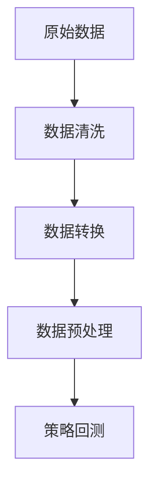

#### 3.3 策略回测模块

策略回测模块是回测平台的核心功能模块，它负责执行具体的策略回测过程。策略回测模块的主要任务包括：

- **策略加载**：加载用户定义的策略模型，包括参数设置和执行逻辑。
- **模拟交易**：模拟策略在实际市场中的执行过程，包括交易信号生成、交易执行和交易成本计算。
- **结果分析**：分析模拟交易的结果，包括收益分析、风险指标计算和策略性能评估。

**策略回测流程图**：

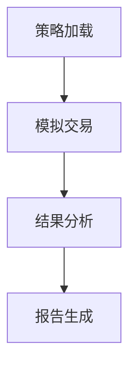

#### 3.4 界面与报告模块

界面与报告模块是回测平台的用户交互层，它为用户提供了一个直观、易用的操作界面，同时生成详细的策略回测报告。界面与报告模块的主要任务包括：

- **用户交互**：提供用户输入策略参数、查看回测结果和调整策略的功能。
- **报告生成**：生成策略回测报告，包括收益图表、风险指标统计和策略表现分析。

**界面与报告模块架构图**：

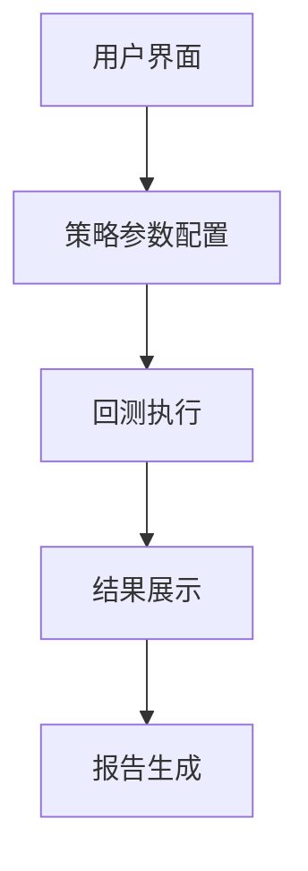

### 第4章 数据处理技术

#### 4.1 数据获取

数据获取是回测平台的关键环节，它决定了策略回测的准确性和可靠性。数据获取模块需要从多个数据源获取交易数据，包括实时数据和历史数据。实时数据通常通过交易所的数据接口或第三方数据服务商获取，而历史数据则可以从数据库或数据仓库中提取。

**数据获取流程**：

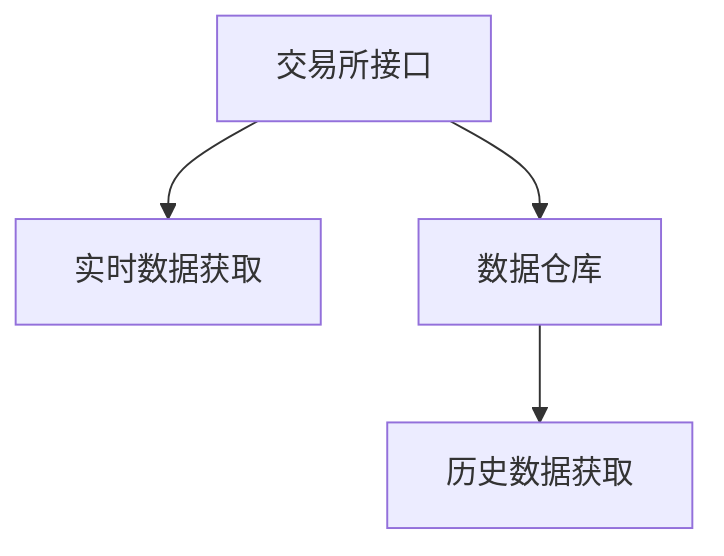

#### 4.2 数据清洗与预处理

数据清洗与预处理是确保数据质量的重要步骤。在数据获取后，数据处理模块需要对数据进行清洗和预处理，以去除噪声和异常值，并转换为适合策略回测的格式。

**数据清洗与预处理流程**：

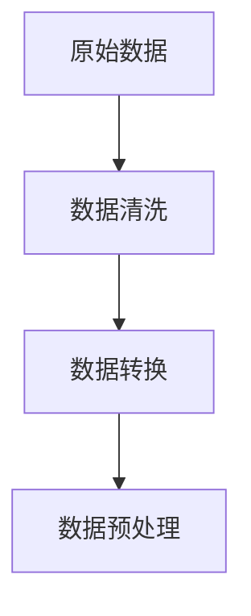

**数据清洗**：

- **缺失值处理**：对于缺失的数据，可以选择填充或删除。
- **异常值检测**：使用统计方法（如IQR法）检测并处理异常值。

**数据预处理**：

- **归一化**：将不同指标的数据归一化，使其在同一量级上。
- **标准化**：使用统计学方法（如Z-Score标准化）使数据符合正态分布。

#### 4.3 数据存储与管理

数据存储与管理是回测平台的重要组成部分，它决定了数据的可访问性和处理效率。数据处理模块需要将清洗和预处理后的数据存储在合适的存储系统上，以便后续策略回测使用。

**数据存储与管理方案**：

- **关系型数据库**：适用于结构化数据存储，如SQL数据库。
- **NoSQL数据库**：适用于非结构化或半结构化数据存储，如MongoDB。
- **数据仓库**：适用于大规模数据存储和分析，如Amazon Redshift。

**数据存储与管理流程**：

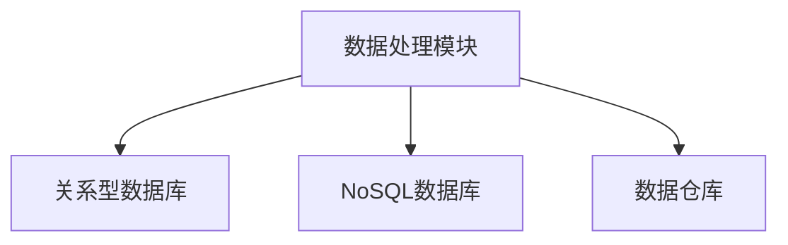

### 第5章 策略回测原理与实践

#### 5.1 回测原理

策略回测是验证交易策略的重要步骤，它通过模拟策略在实际市场中的执行过程，评估策略的潜在收益和风险。回测原理主要包括以下几个关键环节：

- **策略加载**：将用户定义的交易策略加载到回测平台中，包括策略参数和执行逻辑。
- **模拟交易**：模拟策略在实际市场中的交易过程，包括交易信号生成、交易执行和交易成本计算。
- **结果分析**：分析模拟交易的结果，包括收益分析、风险指标计算和策略性能评估。

**回测流程图**：

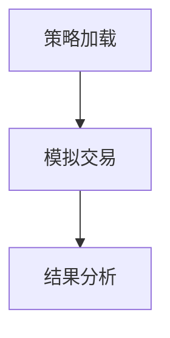

#### 5.2 实践案例

在本节中，我们将通过几个具体的实践案例，详细讲解不同类型的高频交易策略回测过程。

**案例1：事件驱动策略回测**

事件驱动策略（Event-Driven Strategies）依赖于特定事件的发生，例如公司财报发布、新闻公告等。以下是一个事件驱动策略回测的实践案例：

1. **策略加载**：加载一个基于财报数据的事件驱动策略，设定策略参数，如买入价格、卖出价格和持有时间。
2. **模拟交易**：使用历史数据，模拟策略在财报发布后的交易过程。策略在财报数据公布后立即生成买入信号，并在设定的价格和时间内执行买入和卖出操作。
3. **结果分析**：分析模拟交易的结果，计算策略的收益和风险指标，如收益波动性、最大回撤和夏普比率。

**案例2：统计套利策略回测**

统计套利策略（Statistical Arbitrage）利用市场中的定价偏差进行交易。以下是一个统计套利策略回测的实践案例：

1. **策略加载**：加载一个基于股票A和其看涨期权的统计套利策略，设定策略参数，如定价偏差阈值和交易对的价格比例。
2. **模拟交易**：使用历史数据，模拟策略在定价偏差出现时的交易过程。策略在定价偏差超过阈值时，同时买入股票A和看涨期权，并在定价偏差消除时同时卖出股票A和看涨期权。
3. **结果分析**：分析模拟交易的结果，计算策略的收益和风险指标，如收益波动性、最大回撤和夏普比率。

**案例3：趋势跟踪策略回测**

趋势跟踪策略（Trend-Following Strategies）基于历史价格趋势进行交易。以下是一个趋势跟踪策略回测的实践案例：

1. **策略加载**：加载一个基于移动平均线趋势跟踪策略，设定策略参数，如移动平均线周期和交易信号阈值。
2. **模拟交易**：使用历史数据，模拟策略在趋势形成和反转时的交易过程。策略在移动平均线向上交叉时买入，向下交叉时卖出。
3. **结果分析**：分析模拟交易的结果，计算策略的收益和风险指标，如收益波动性、最大回撤和夏普比率。

#### 5.3 回测结果分析

回测结果分析是策略优化的重要环节，它通过详细分析模拟交易的结果，评估策略的潜在收益和风险。以下是一些常见的回测结果分析指标：

- **收益指标**：包括总收益、平均收益、最大单日收益等。
- **风险指标**：包括收益波动性、最大回撤、夏普比率等。
- **策略性能评估**：包括策略的稳定性、可持续性和适应性。

**案例分析**：

假设我们使用一个基于事件驱动策略的回测案例，以下是对回测结果的分析：

1. **收益指标**：策略在回测期间的总收益为10%，平均收益为0.5%。
2. **风险指标**：策略的收益波动性为15%，最大回撤为20%，夏普比率为1.5。
3. **策略性能评估**：策略表现出较高的收益稳定性，但风险相对较高。为了提高策略的收益和风险收益比，可以考虑优化策略参数，如调整买入和卖出的时机，增加对市场情绪的分析等。

### 第6章 高频交易策略优化

#### 6.1 参数优化

参数优化是高频交易策略优化的重要环节，它通过调整策略参数，提高策略的收益和风险收益比。参数优化的方法主要包括：

- **网格搜索**：通过遍历参数空间，找到最优参数组合。
- **遗传算法**：模拟自然进化过程，逐步优化策略参数。
- **粒子群优化**：模拟群体行为，通过迭代更新策略参数。

**参数优化流程**：

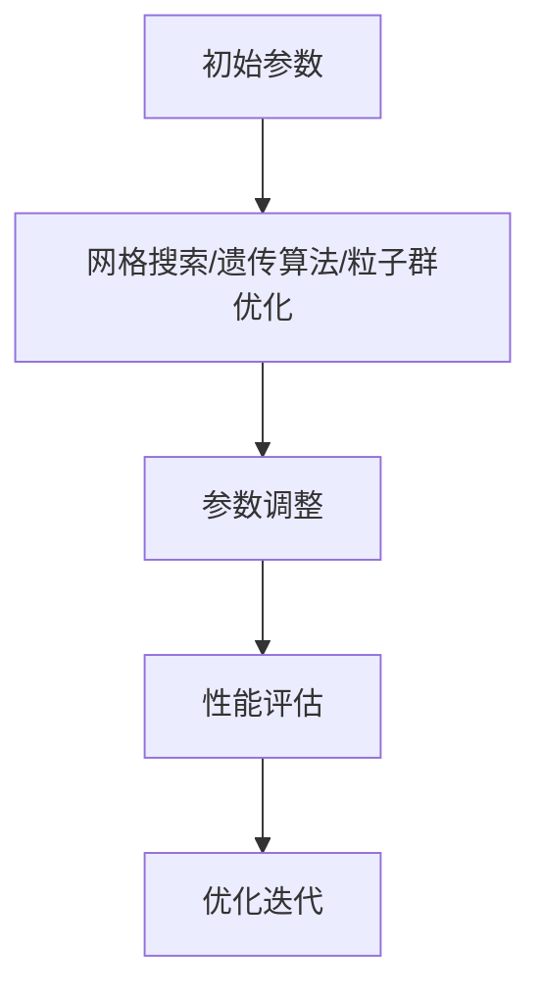

#### 6.2 策略组合

策略组合是将多个策略结合起来，以分散风险并提高收益。策略组合的方法主要包括：

- **等权重组合**：将各策略的权重设置为相等。
- **优化权重组合**：通过优化方法确定各策略的最佳权重。
- **组合优化**：通过调整组合参数，优化策略组合的收益和风险。

**策略组合流程**：

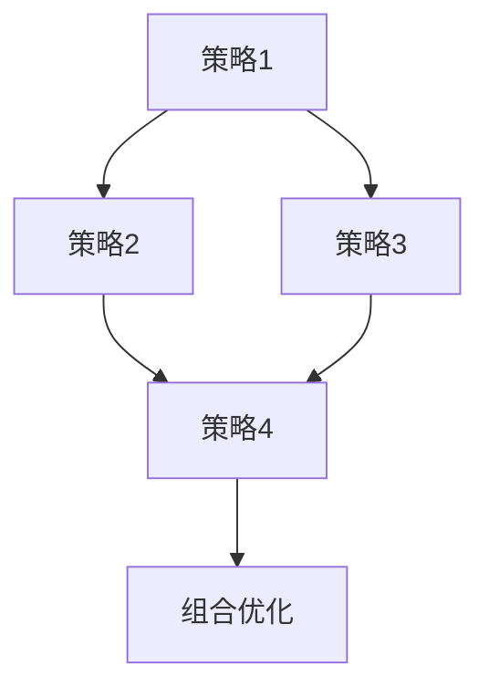

#### 6.3 策略风险管理

策略风险管理是确保策略稳健性的重要措施。策略风险管理的方法主要包括：

- **止损策略**：设定止损点，限制潜在损失。
- **资金管理**：合理分配资金，避免过度投资。
- **风险模型**：使用风险模型评估策略的风险，制定风险管理策略。

**策略风险管理流程**：

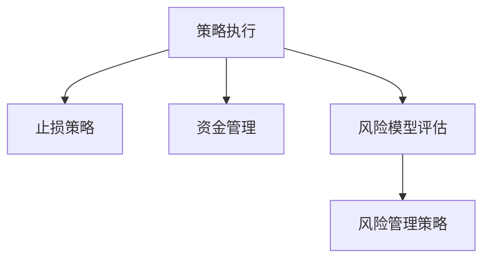

### 第7章 高频交易策略回测平台搭建

#### 7.1 开发环境准备

在搭建高频交易策略回测平台之前，需要准备以下开发环境：

- **操作系统**：Linux或Mac OS。
- **编程语言**：Python、Java或C++。
- **数据库**：MySQL、PostgreSQL或MongoDB。
- **数据接口**：交易所API或第三方数据接口。
- **开发工具**：IDE（如PyCharm、Eclipse）、版本控制工具（如Git）。

**开发环境准备流程**：

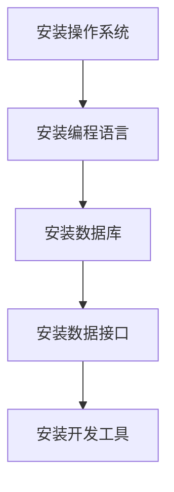

#### 7.2 数据处理模块开发

数据处理模块是回测平台的核心部分，它负责从数据源获取交易数据，并进行清洗、转换和预处理。以下是数据处理模块开发的关键步骤：

1. **数据获取**：使用交易所API或第三方数据接口，获取实时数据和历史数据。
2. **数据清洗**：去除数据中的噪声和异常值，确保数据质量。
3. **数据转换**：将原始数据转换为适合策略回测的格式，例如时间序列数据。
4. **数据预处理**：对数据进行归一化、标准化等处理，以减少策略回测中的不确定性。

**数据处理模块开发流程**：

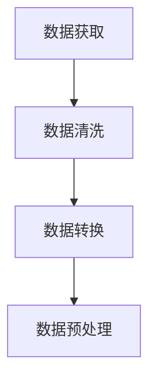

#### 7.3 策略回测模块开发

策略回测模块是回测平台的核心功能模块，它负责执行具体的策略回测过程。以下是策略回测模块开发的关键步骤：

1. **策略加载**：加载用户定义的交易策略，包括策略参数和执行逻辑。
2. **模拟交易**：模拟策略在实际市场中的执行过程，包括交易信号生成、交易执行和交易成本计算。
3. **结果分析**：分析模拟交易的结果，包括收益分析、风险指标计算和策略性能评估。

**策略回测模块开发流程**：


#### 7.4 平台集成与测试

平台集成与测试是确保回测平台稳定运行的重要步骤。以下是平台集成与测试的关键步骤：

1. **系统集成**：将各个模块集成在一起，确保系统功能完整。
2. **功能测试**：对系统功能进行测试，确保各个模块能够正常工作。
3. **性能测试**：对系统性能进行测试，确保系统在负载下的运行效率。
4. **用户测试**：邀请用户进行测试，收集用户反馈，优化用户体验。

**平台集成与测试流程**：

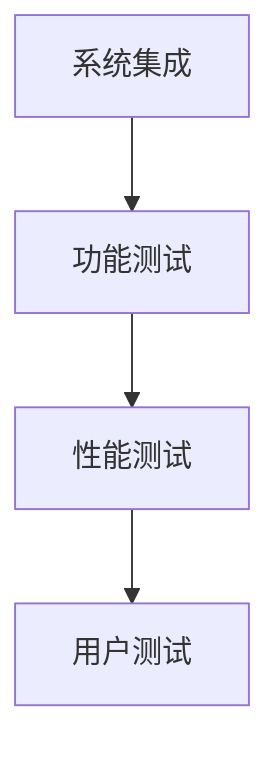

### 第8章 总结与展望

#### 8.1 总结

通过本文的探讨，我们系统地介绍了高频交易策略回测平台的设计与实现。从高频交易的基本概念、回测平台的必要性，到平台架构设计、数据处理技术、策略回测原理与实践，以及策略优化和平台搭建，本文为读者提供了一个完整的策略回测解决方案。

高频交易策略回测平台不仅能够验证和优化交易策略，还能为交易者提供可靠的数据分析和决策支持。随着金融科技的发展，高频交易策略回测平台将继续在金融市场中发挥重要作用。

#### 8.2 展望

未来，高频交易策略回测平台的发展趋势将包括：

- **数据处理速度的提升**：随着交易数据的急剧增长，平台需要不断提升数据处理速度，以应对更大的数据量。
- **算法精度的提高**：通过改进算法和优化策略，提高回测的精度和可靠性。
- **用户交互体验的优化**：提供更加直观、易用的用户界面，提升用户体验。
- **跨平台兼容性**：支持更多操作系统和编程语言，提高平台的兼容性和灵活性。

此外，潜在的研究方向包括：

- **多因子策略回测**：结合多个市场因子进行策略回测，提高策略的适应性。
- **机器学习与深度学习在回测中的应用**：利用机器学习和深度学习技术，自动识别市场趋势和异常情况。
- **分布式回测架构**：构建分布式回测平台，提高处理速度和系统稳定性。

### 附录

#### A. 参考资料

- 《高频交易：算法交易的原理与实践》（High-Frequency Trading: A Practical Guide to Algorithmic Strategies and Trading Systems） - Dr. Bernardus J. van Rhee
- 《算法交易：策略设计与实战案例》（Algorithmic Trading: Quantitative Methods and Trading Systems） - Ernie Chan
- 《Python金融数据处理与分析》（Python for Finance: Analytic Techniques for Business and Trading） - Yves Hilpisch

#### B. 代码示例

以下是一个简单的Python代码示例，用于加载策略、执行模拟交易和生成回测报告：

```python
# 导入相关库
import numpy as np
import pandas as pd
from backtesting import BacktestingFramework, Strategy
from backtesting.lib import crossover

# 定义策略
class EventDrivenStrategy(Strategy):
    def __init__(self, buy_price, sell_price, hold_time):
        self.buy_price = buy_price
        self.sell_price = sell_price
        self.hold_time = hold_time

    def next(self):
        if self.data.close[-1] > self.buy_price and \
           self.data.close[-2] <= self.buy_price:
            self.order("BUY", size=100)
        
        if self.data.close[-1] < self.sell_price and \
           self.data.close[-2] >= self.sell_price:
            self.order("SELL", size=100)

# 加载数据
data = pd.read_csv("stock_data.csv")

# 初始化回测框架
backtest = BacktestingFramework(data, EventDrivenStrategy(buy_price=100, sell_price=110, hold_time=10))

# 执行回测
backtest.run()

# 生成回测报告
backtest.plot()
```

以上代码定义了一个事件驱动策略，并在历史数据上进行回测。回测结果通过图表展示，包括策略的收益、风险指标和策略表现。通过适当调整策略参数，可以进一步优化策略性能。

