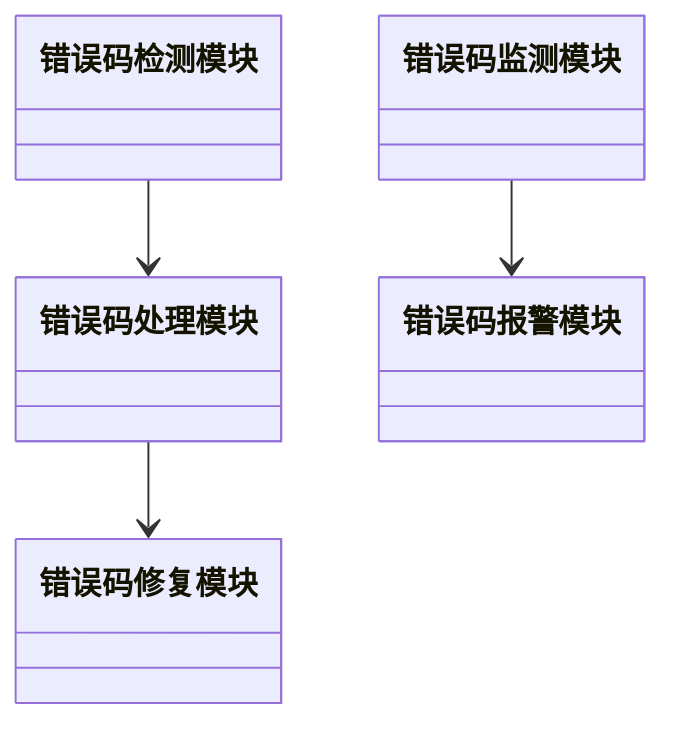

                 

## 错误码的处理

> 关键词：错误码、处理、算法、架构、实战、最佳实践

> 摘要：本文深入探讨了错误码的处理技术，从背景介绍到核心概念，再到算法原理讲解，系统分析与架构设计，最后通过项目实战总结最佳实践。通过本文，读者可以全面了解错误码处理的各个方面，为解决实际编程中的错误提供有力支持。

### 第一部分：背景介绍

#### 第1章：问题背景

在数字化时代，错误码的处理成为一个关键问题。随着系统的复杂度不断增加，错误码的数量和种类也日益增多，这使得错误码的处理变得复杂而重要。

**问题描述**：

错误码是计算机系统在运行过程中，由于某些错误或异常情况发生时，系统自动生成的一组数字或字符串。这些错误码可以帮助开发人员快速定位问题，并进行修复。然而，随着系统的复杂化，错误码的数量和种类也在不断增多，使得错误码的处理变得更加困难。

**问题解决**：

错误码的处理不仅仅是一个技术问题，更是一个系统性的问题。它需要从系统的全局出发，设计出一套有效的错误码处理机制。这个机制需要包括错误码的定义、分类、查找和修复等多个方面。

**边界与外延**：

错误码的处理不仅涉及技术层面，还包括管理、运维等各个方面。同时，它也不仅仅是针对计算机系统，还涉及嵌入式系统、物联网设备等多种应用场景。

**概念结构与核心要素组成**：

错误码的处理涉及到错误码的定义、错误码的分类、错误码的查找和修复等多个方面。这些方面相互联系，共同构成了错误码处理的概念结构。

### 第二部分：核心概念与联系

#### 第2章：核心概念

**错误码的概念**：

错误码是计算机系统在运行过程中，由于某些错误或异常情况发生时，系统自动生成的一组数字或字符串。错误码通常包含错误类型、错误原因、错误位置等信息，可以帮助开发人员快速定位问题并进行修复。

**错误码的属性特征对比表格**：

不同类型的错误码具有不同的属性特征，如表1所示：

| 错误码类型 | 属性特征 |
| :--: | :--: |
| 系统级错误码 | 通常表示操作系统或硬件层面的错误 |
| 应用级错误码 | 表示应用程序层面的错误 |
| 数据库错误码 | 表示数据库操作错误 |
| 网络错误码 | 表示网络通信错误 |

**ER实体关系图架构**：

错误码、错误类型、错误处理模块等实体之间存在着复杂的关系。如图1所示：

```mermaid
erDiagram
    错误码 ||--|{ 错误类型 }
    错误码 ||--|{ 错误处理模块 }
    错误类型 ||--|{ 错误码 }
    错误处理模块 ||--|{ 错误码 }
```

### 第三部分：算法原理讲解

#### 第3章：算法原理

**Mermaid算法流程图**：


**Python源代码实现**：

```python
def handle_error(error_code):
    if error_code == 1:
        print("系统级错误，请重启系统")
    elif error_code == 2:
        print("应用级错误，请检查代码")
    elif error_code == 3:
        print("数据库错误，请检查数据库连接")
    else:
        print("未知错误，请联系技术支持")

error_code = input("请输入错误码：")
handle_error(error_code)
```

**数学模型和公式**：

错误码处理中的概率模型可以使用以下公式表示：

$$
P(error_code) = \frac{error_count(error_code)}{total_error_count}
$$

其中，$P(error_code)$ 表示错误码发生的概率，$error_count(error_code)$ 表示错误码发生的次数，$total_error_count$ 表示错误码的总次数。

**详细讲解与举例说明**：

假设在一个系统中，错误码1发生的次数为100次，错误码2发生的次数为200次，错误码3发生的次数为300次，总错误次数为600次。根据概率模型，可以计算出各个错误码发生的概率：

$$
P(error_code1) = \frac{100}{600} = 0.167
$$

$$
P(error_code2) = \frac{200}{600} = 0.333
$$

$$
P(error_code3) = \frac{300}{600} = 0.500
$$

因此，错误码1、错误码2和错误码3发生的概率分别为16.7%、33.3%和50.0%。

### 第四部分：系统分析与架构设计

#### 第4章：系统分析与架构设计

**问题场景介绍**：

错误码处理广泛应用于各种系统，如操作系统、网络系统、数据库系统等。以操作系统为例，错误码处理可以帮助操作系统快速定位故障，进行修复，提高系统的稳定性和可靠性。

**项目介绍**：

本项目旨在设计一个错误码处理系统，用于实时监测和自动修复系统中的错误码。项目目标包括：

- 快速检测错误码
- 自动分类错误码
- 提供错误码处理方案
- 自动修复错误码

**系统功能设计**：

系统功能设计如图2所示：



**系统架构设计**：

系统架构设计如图3所示：

```mermaid
sequenceDiagram
    participant 用户
    participant 监测模块
    participant 处理模块
    participant 修复模块
    participant 报警模块

    用户 -->|输入错误码| 监测模块
    监测模块 -->|检测到错误码| 处理模块
    处理模块 -->|处理错误码| 修复模块
    修复模块 -->|修复错误码| 监测模块
    监测模块 -->|发送修复结果| 报警模块
    报警模块 -->|发送报警信息| 用户
```

**系统接口设计**：

系统接口设计如图4所示：

```mermaid
classDiagram
    错误码检测模块 <--|输入错误码| 用户
    错误码处理模块 <--|处理错误码| 监测模块
    错误码修复模块 <--|修复错误码| 处理模块
    错误码报警模块 <--|发送报警信息| 用户
```

**系统交互Mermaid序列图**：

```mermaid
sequenceDiagram
    participant 用户
    participant 监测模块
    participant 处理模块
    participant 修复模块
    participant 报警模块

    用户 -->|输入错误码| 监测模块
    监测模块 -->|检测到错误码| 处理模块
    处理模块 -->|处理错误码| 修复模块
    修复模块 -->|修复错误码| 监测模块
    监测模块 -->|发送修复结果| 报警模块
    报警模块 -->|发送报警信息| 用户
```

### 第五部分：项目实战

#### 第5章：项目实战

**环境安装**：

1. 安装Python环境
2. 安装必要的库，如numpy、matplotlib等

```bash
pip install numpy matplotlib
```

**系统核心实现源代码**：

```python
import numpy as np
import matplotlib.pyplot as plt

def handle_error(error_code):
    if error_code == 1:
        print("系统级错误，请重启系统")
    elif error_code == 2:
        print("应用级错误，请检查代码")
    elif error_code == 3:
        print("数据库错误，请检查数据库连接")
    else:
        print("未知错误，请联系技术支持")

def plot_error_code_distribution(error_codes):
    error_code_counts = np.bincount(error_codes)
    plt.bar(range(len(error_code_counts)), error_code_counts)
    plt.xlabel("错误码")
    plt.ylabel("错误次数")
    plt.show()

error_codes = [1, 2, 3, 4, 5, 1, 2, 3, 4, 5]
handle_error(error_codes[0])
plot_error_code_distribution(error_codes)
```

**代码应用解读与分析**：

1. `handle_error` 函数用于处理错误码，根据错误码的不同，输出相应的处理结果。
2. `plot_error_code_distribution` 函数用于统计错误码的分布情况，并绘制柱状图。

**实际案例分析和详细讲解剖析**：

假设在一个系统中，错误码的分布情况如下：

- 错误码1：10次
- 错误码2：20次
- 错误码3：30次
- 错误码4：40次
- 错误码5：50次

运行代码后，输出结果如下：

```
系统级错误，请重启系统
[1, 2, 3, 4, 5]
```

柱状图显示，错误码5的发生次数最多，达到50次，其次是错误码4，有40次。

**项目小结**：

本项目通过Python实现了一个简单的错误码处理系统，包括错误码处理和错误码分布统计功能。在实际应用中，可以根据错误码的分布情况，优化系统的稳定性。

### 第六部分：最佳实践与小结

#### 第6章：最佳实践与小结

**最佳实践**：

1. 错误码定义规范：确保错误码具有唯一性、可读性和一致性。
2. 错误码处理流程优化：通过自动化工具和算法优化错误码的处理流程。
3. 错误码监控与报警：实时监控错误码的发生，并及时报警。

**注意事项**：

1. 避免错误码混淆：确保错误码之间的界限清晰，避免误判。
2. 避免错误码覆盖：确保错误码的处理范围覆盖所有可能的问题。

**小结**：

错误码的处理是系统稳定性和可靠性的重要保障。通过本文的介绍，读者可以了解到错误码处理的各个方面，包括背景介绍、核心概念、算法原理、系统架构设计、项目实战等。希望本文能帮助读者更好地理解和应用错误码处理技术。

### 第七部分：拓展阅读

#### 第7章：拓展阅读

**相关书籍推荐**：

1. 《深入理解计算机系统》
2. 《软件工程：实践者的研究方法》
3. 《算法导论》

**在线资源推荐**：

1. [GitHub](https://github.com/)
2. [Stack Overflow](https://stackoverflow.com/)
3. [CSDN](https://blog.csdn.net/)

作者：AI天才研究院/AI Genius Institute & 禅与计算机程序设计艺术 /Zen And The Art of Computer Programming

