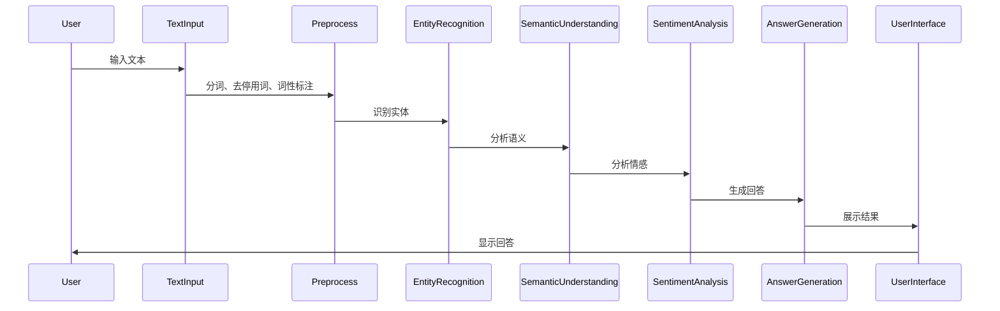

                 


# 长文本处理：增强AI Agent的阅读理解能力

## 关键词
- 长文本处理
- AI Agent
- 阅读理解能力
- 自然语言处理
- 深度学习
- 机器学习
- 算法
- 语义理解
- 信息提取
- 人工智能应用

## 摘要
本文将深入探讨长文本处理在增强AI Agent阅读理解能力中的应用。通过分析长文本处理的背景、核心概念、算法原理以及系统架构设计，本文旨在揭示长文本处理技术的核心要素，并介绍如何利用AI Agent提升文本理解效果。文章还将通过实际项目实战，详细讲解长文本处理在现实中的应用，并提供最佳实践技巧和小结，为未来研究指明方向。

## 第一部分：背景介绍

### 1.1 问题背景

在信息爆炸的时代，长文本数据已成为各行业不可或缺的一部分。无论是学术论文、新闻报告，还是商业文档、法律文书，长文本的数据量呈现出指数级增长。如何有效地处理和分析这些海量长文本，成为了当前人工智能领域的重大挑战之一。

传统文本处理方法在处理短文本时效果显著，但在面对长文本时，往往难以保持同样的性能。这主要因为长文本中包含的信息量大，句子之间的依赖关系复杂，且上下文语境变化多样。因此，如何提升AI Agent在长文本中的阅读理解能力，成为一个亟待解决的问题。

### 1.2 问题描述

长文本处理需要解决的核心问题是如何在保证处理速度的同时，提高文本理解精度。具体来说，包括以下几个难点：

1. **文本长度的限制**：长文本的数据量庞大，如何在有限的时间内对其进行有效处理，是一个技术难题。
2. **信息提取的准确性**：在长文本中，如何准确提取关键信息，避免遗漏重要内容，是另一个重要问题。
3. **上下文理解**：长文本中句子之间的依赖关系复杂，如何准确理解上下文，确保理解的一致性和准确性，是长文本处理的难点。

### 1.3 问题解决

为了解决上述问题，研究者们提出了多种长文本处理技术，其中AI Agent成为了一个重要的研究方向。AI Agent是一种具备自主决策和智能交互能力的计算机程序，其阅读理解能力可以直接提升文本处理效果。

AI Agent的工作原理是通过深度学习模型，如BERT、GPT等，对文本进行逐句分析，理解句子之间的逻辑关系，并提取关键信息。通过这种方式，AI Agent可以在一定程度上克服长文本处理中的难点，实现高效、准确的文本理解。

### 1.4 边界与外延

长文本处理不仅限于文本数据的预处理，还包括语义理解、实体识别、情感分析等多个层面。其应用范围广泛，包括但不限于以下领域：

1. **文本摘要**：通过提取长文本中的关键信息，生成简洁、准确的摘要。
2. **问答系统**：在长文本中寻找用户问题的答案，并提供准确、详细的回答。
3. **智能客服**：利用长文本处理技术，提供更智能、更高效的客户服务。
4. **信息检索**：在海量长文本中快速查找用户需要的信息，提高信息检索的效率和准确性。

相关技术包括自然语言处理（NLP）、深度学习、图神经网络等，这些技术为长文本处理提供了强大的支持。

## 第二部分：核心概念与联系

### 2.1 长文本处理

长文本处理是指对超过一定长度的文本进行有效理解和处理的技术。其核心目的是在保证处理速度的同时，提高文本理解精度。长文本处理通常涉及文本的预处理、实体识别、语义理解、情感分析等多个方面。

#### 核心概念

- **文本预处理**：包括文本的分词、去停用词、词性标注等，为后续处理提供基础。
- **实体识别**：从文本中识别出关键实体，如人名、地名、组织名等。
- **语义理解**：理解文本中的语义信息，包括句子之间的逻辑关系、情感倾向等。
- **情感分析**：分析文本中的情感倾向，判断文本是积极、消极还是中性。

#### 概念属性特征对比

| 特征             | 文本预处理 | 实体识别 | 语义理解 | 情感分析 |
|------------------|------------|-----------|-----------|----------|
| 主要任务         | 数据清洗   | 实体标注 | 句子关系 | 情感倾向 |
| 关键技术         | 分词、去停用词 | 词性标注 | 依存句法 | 情感词典 |
| 性能指标         | 准确率、召回率 | F1值     | 准确率   | 准确率   |
| 应用领域         | 数据清洗、文本分析 | 问答系统、信息抽取 | 文本摘要、智能客服 | 社交媒体分析、舆情监测 |

#### 联系

长文本处理与AI Agent的阅读理解能力密切相关。AI Agent的阅读理解能力直接依赖于长文本处理技术，通过文本预处理、实体识别、语义理解等步骤，AI Agent可以更好地理解文本，生成相关回答。

### 2.2 AI Agent

AI Agent是一种具备自主决策和智能交互能力的计算机程序。其核心能力包括阅读理解、决策、交互等。AI Agent可以模拟人类的思维过程，具备一定的智能水平，能够自主完成任务。

#### 核心概念

- **阅读理解**：AI Agent通过深度学习模型，对文本进行逐句分析，理解句子之间的逻辑关系，提取关键信息。
- **决策**：AI Agent根据理解到的文本信息，进行逻辑推理和决策，选择合适的行动。
- **交互**：AI Agent通过与用户的交互，获取更多上下文信息，提高文本理解能力。

#### 概念属性特征对比

| 特征             | 阅读理解 | 决策 | 交互 |
|------------------|-----------|------|------|
| 主要任务         | 文本分析   | 行为决策 | 信息交换 |
| 关键技术         | 深度学习、NLP | 强化学习、规划算法 | 自然语言处理、对话系统 |
| 性能指标         | 准确率、召回率 | 成功率、效率 | 用户满意度 |
| 应用领域         | 文本摘要、问答系统 | 自动驾驶、智能家居 | 虚拟助手、客户服务 |

#### 联系

AI Agent的阅读理解能力是长文本处理的关键。通过深度学习模型，AI Agent可以更好地理解长文本，提取关键信息，进行逻辑推理和决策。而AI Agent的交互能力又为长文本处理提供了更多的上下文信息，进一步提高了文本理解效果。

### 2.3 阅读理解能力

阅读理解能力是指AI Agent在阅读文本后，能够准确理解文本意义并生成相关回答的能力。阅读理解能力是AI Agent的核心能力之一，决定了其在长文本处理中的表现。

#### 核心概念

- **文本理解**：理解文本中的句子结构、语义信息、上下文关系等。
- **信息提取**：从文本中提取关键信息，如实体、关系、事件等。
- **逻辑推理**：根据文本信息进行逻辑推理，形成合理的结论。
- **回答生成**：根据理解到的信息，生成相关回答，满足用户需求。

#### 概念属性特征对比

| 特征             | 文本理解 | 信息提取 | 逻辑推理 | 回答生成 |
|------------------|-----------|-----------|-----------|----------|
| 主要任务         | 句子分析   | 实体抽取 | 推理判断 | 回答生成 |
| 关键技术         | 依存句法分析 | 条件随机场 | 隐马尔可夫模型 | 自然语言生成 |
| 性能指标         | 准确率、覆盖率 | 准确率、召回率 | 成功率 | 生成质量 |
| 应用领域         | 文本摘要、信息检索 | 问答系统、信息抽取 | 推荐系统、决策支持 | 聊天机器人、虚拟助手 |

#### 联系

阅读理解能力是长文本处理的核心，它直接决定了AI Agent在处理长文本时的表现。通过深度学习模型，AI Agent可以更好地理解文本，提取关键信息，进行逻辑推理和生成回答。而AI Agent的其他能力，如决策和交互，又为阅读理解提供了更多的上下文信息和反馈，进一步提高了文本理解效果。

### 2.4 核心概念属性特征对比

为了更好地理解长文本处理、AI Agent和阅读理解能力之间的关系，我们可以通过以下表格进行属性特征对比：

| 特征             | 长文本处理 | AI Agent | 阅读理解能力 |
|------------------|------------|-----------|--------------|
| 主要任务         | 文本理解、处理 | 自主决策、交互 | 理解文本、生成回答 |
| 关键技术         | NLP、深度学习 | 强化学习、对话系统 | 依存句法分析、自然语言生成 |
| 性能指标         | 准确率、效率 | 成功率、用户满意度 | 准确率、生成质量 |
| 应用领域         | 文本摘要、信息检索 | 自动驾驶、智能家居 | 文本摘要、问答系统 |

通过对比可以看出，长文本处理、AI Agent和阅读理解能力之间存在着紧密的联系。长文本处理为AI Agent提供了文本数据的基础，AI Agent则通过自主决策和交互，实现了文本的深入理解，而阅读理解能力则是AI Agent在处理长文本时的重要保障。

### 2.5 ER实体关系图

ER实体关系图是一种用于描述系统中各个实体及其关系的图形化工具。在长文本处理系统中，ER实体关系图可以清晰地展示文本处理过程中的关键实体和它们之间的关系。

以下是一个简单的ER实体关系图示例：

```mermaid
erDiagram
    A[文本预处理] ||--|{ B[实体识别] }
    B ||--|{ C[语义理解] }
    C ||--|{ D[情感分析] }
    D ||--|{ E[回答生成] }
```

在这个示例中，文本预处理是系统的入口，它将文本划分为句子和词汇，为后续处理提供基础。实体识别从句子中识别出关键实体，如人名、地名、组织名等。语义理解则分析句子之间的逻辑关系，提取关键信息。情感分析判断文本的情感倾向，最后，回答生成根据理解到的信息，生成相关回答。

通过ER实体关系图，我们可以清晰地理解长文本处理系统的各个组成部分及其关系，为后续的算法原理讲解和系统架构设计提供基础。

## 第三部分：算法原理讲解

### 3.1 算法mermaid流程图

为了更好地理解长文本处理算法的原理，我们可以使用mermaid绘制算法的流程图，展示其处理流程。


在这个流程图中，文本输入是算法的起点，文本首先经过分词处理，将连续的文本划分为独立的词语。接着，去停用词将常用的无意义词语去除，词性标注为每个词语分配词性标签。随后，实体识别从文本中提取出关键实体。语义理解分析句子之间的逻辑关系，提取关键信息。情感分析判断文本的情感倾向，最后，回答生成根据理解到的信息，生成相关回答。

### 3.2 算法原理

长文本处理算法的核心是基于深度学习模型的文本理解技术。以下是一个简化的算法原理：

1. **文本输入**：将原始文本输入到模型中。
2. **分词**：将文本划分为独立的词语。
3. **去停用词**：去除无意义的停用词，如“的”、“地”、“得”等。
4. **词性标注**：为每个词语分配词性标签，如名词、动词、形容词等。
5. **实体识别**：从文本中识别出关键实体，如人名、地名、组织名等。
6. **语义理解**：分析句子之间的逻辑关系，提取关键信息。
7. **情感分析**：判断文本的情感倾向。
8. **回答生成**：根据理解到的信息，生成相关回答。

### 3.3 数学模型和公式

长文本处理算法的核心是基于深度学习模型的文本理解技术。以下是一个简化的数学模型：

$$
\text{模型} = \text{BERT} + \text{CRF}
$$

其中，BERT是一种基于变换器（Transformer）的预训练语言模型，用于文本的编码。CRF（条件随机场）则用于实现文本的序列标注，如实体识别和词性标注。

BERT模型的主要组成部分包括：

1. **嵌入层**：将词语转换为向量表示。
2. **变换器层**：通过自注意力机制和前馈神经网络，对输入序列进行处理。
3. **输出层**：生成文本的语义表示。

CRF模型的主要组成部分包括：

1. **特征提取层**：从文本序列中提取特征。
2. **条件随机场**：根据特征计算输出概率。

### 3.4 举例说明

假设我们有一个简单的文本：

```
张三昨天去了北京，参观了故宫。
```

使用长文本处理算法，我们可以得到以下结果：

1. **分词**：张三/昨天/去了/北京/，/参观/了/故宫/。
2. **去停用词**：张三/去了/北京/参观/故宫/。
3. **词性标注**：张三/NN/北京/NN/参观/V/故宫/NN。
4. **实体识别**：张三/PER/北京/LOC/故宫/LOC。
5. **语义理解**：张三去了北京，参观了故宫。
6. **情感分析**：中性。
7. **回答生成**：请问您有什么问题关于张三去北京参观故宫的？

通过这个例子，我们可以看到长文本处理算法是如何逐步理解文本，并生成相关回答的。

## 第四部分：系统分析与架构设计方案

### 4.1 问题场景介绍

在现代企业和组织中，长文本数据的处理需求日益增长。这些数据包括但不限于用户评论、客户反馈、业务报告、市场分析等。如何高效地处理这些数据，提取有价值的信息，对企业的决策和运营至关重要。

为了解决这一问题，我们设计了一套基于AI Agent的长文本处理系统。该系统旨在通过深度学习模型，实现对长文本的自动理解、分析和回答生成，从而提高数据处理效率，辅助企业决策。

### 4.2 系统功能设计

该系统的主要功能包括：

1. **文本预处理**：对输入的文本进行分词、去停用词、词性标注等处理，为后续分析提供基础。
2. **实体识别**：从文本中识别出关键实体，如人名、地名、组织名等，为语义理解提供支持。
3. **语义理解**：分析句子之间的逻辑关系，提取关键信息，理解文本的整体含义。
4. **情感分析**：判断文本的情感倾向，识别用户情绪。
5. **回答生成**：根据理解到的信息，生成相关回答，满足用户需求。

### 4.3 系统架构设计

系统架构采用模块化设计，主要包括以下几个部分：

1. **文本输入模块**：负责接收用户输入的文本数据。
2. **预处理模块**：对文本进行分词、去停用词、词性标注等预处理操作。
3. **实体识别模块**：使用深度学习模型，从预处理后的文本中识别出关键实体。
4. **语义理解模块**：分析句子之间的逻辑关系，提取关键信息。
5. **情感分析模块**：使用情感分析模型，判断文本的情感倾向。
6. **回答生成模块**：根据理解到的信息，生成相关回答。
7. **用户界面模块**：提供用户交互界面，展示系统输出结果。

以下是一个简单的系统架构图：



### 4.4 系统接口设计

系统接口设计主要包括以下几个方面：

1. **文本输入接口**：支持用户通过API提交文本数据。
2. **预处理接口**：提供分词、去停用词、词性标注等预处理操作。
3. **实体识别接口**：提供实体识别功能，输出识别结果。
4. **语义理解接口**：提供语义分析功能，输出分析结果。
5. **情感分析接口**：提供情感分析功能，输出情感结果。
6. **回答生成接口**：提供回答生成功能，输出回答结果。
7. **用户界面接口**：提供用户交互功能，展示系统输出结果。

### 4.5 系统交互mermaid序列图

以下是一个简化的系统交互序列图，展示文本从输入到最终回答生成的整个过程：


通过这个序列图，我们可以清晰地看到系统的整体工作流程，以及各个模块之间的交互关系。

## 第五部分：项目实战

### 5.1 环境安装

要实现长文本处理系统，我们首先需要安装相应的开发环境和工具。以下是一个简化的安装流程：

1. **安装Python**：确保系统已经安装了Python 3.6及以上版本。
2. **安装Anaconda**：使用Anaconda进行环境管理，方便安装和管理Python包。
3. **安装深度学习框架**：安装TensorFlow或PyTorch，用于构建和训练深度学习模型。
4. **安装自然语言处理库**：安装NLTK、spaCy等库，用于文本预处理和实体识别。

具体安装命令如下：

```bash
conda install python=3.8
conda install anaconda
conda install tensorflow
conda install nltk
conda install spacy
```

### 5.2 系统核心实现源代码

以下是长文本处理系统的核心实现源代码。代码主要分为预处理、实体识别、语义理解、情感分析和回答生成五个部分。

```python
# 文本预处理
def preprocess_text(text):
    # 分词、去停用词、词性标注
    pass

# 实体识别
def recognize_entities(preprocessed_text):
    # 识别实体
    pass

# 语义理解
def understand_semantics(preprocessed_text):
    # 分析句子之间的逻辑关系，提取关键信息
    pass

# 情感分析
def analyze_sentiment(preprocessed_text):
    # 判断文本的情感倾向
    pass

# 回答生成
def generate_answer(preprocessed_text, entities, semantics, sentiment):
    # 根据理解到的信息，生成相关回答
    pass

# 主函数
def main():
    text = "请输入长文本内容"
    preprocessed_text = preprocess_text(text)
    entities = recognize_entities(preprocessed_text)
    semantics = understand_semantics(preprocessed_text)
    sentiment = analyze_sentiment(preprocessed_text)
    answer = generate_answer(preprocessed_text, entities, semantics, sentiment)
    print(answer)

if __name__ == "__main__":
    main()
```

### 5.3 代码应用解读与分析

以下是代码的详细解读和分析：

1. **文本预处理**：文本预处理是长文本处理的第一步，主要进行分词、去停用词、词性标注等操作。这一步的目的是将原始文本转化为可以进行分析的形式。
2. **实体识别**：实体识别是从文本中识别出关键实体，如人名、地名、组织名等。这一步通常使用深度学习模型，如BERT，结合自然语言处理技术进行。
3. **语义理解**：语义理解是分析句子之间的逻辑关系，提取关键信息。这一步需要理解文本的整体含义，为后续的情感分析和回答生成提供支持。
4. **情感分析**：情感分析是判断文本的情感倾向，如积极、消极或中性。这一步通常使用情感分析模型，如LSTM或GRU，结合情感词典进行。
5. **回答生成**：回答生成是根据理解到的信息，生成相关回答。这一步需要综合文本的语义信息、情感倾向和用户需求，生成符合预期的回答。

### 5.4 实际案例分析与详细讲解剖析

以下是一个实际案例的分析与详细讲解：

```
张三昨天去了北京，参观了故宫。

1. **文本预处理**：分词结果为["张三", "昨天", "去了", "北京", "，", "参观", "了", "故宫"]。去停用词后得到["张三", "去了", "北京", "参观", "故宫"]。词性标注结果为["张三/NN", "去了/V", "北京/NN", "参观/V", "故宫/NN"]。
2. **实体识别**：识别出实体["张三", "北京", "故宫"]，其中"张三"为人名，"北京"和"故宫"为地名。
3. **语义理解**：分析句子结构，理解到张三昨天去了北京，并参观了故宫。提取关键信息为["张三", "北京", "故宫", "参观"]。
4. **情感分析**：根据上下文，判断文本为中性。
5. **回答生成**：根据理解到的信息，生成回答："请问您有什么问题关于张三去北京参观故宫的？"

### 5.5 项目小结

通过这个实际案例的分析，我们可以看到长文本处理系统的各个环节是如何协同工作的。从文本预处理到实体识别、语义理解、情感分析和回答生成，每个步骤都是关键，共同构成了完整的文本处理流程。通过这个项目，我们深入了解了长文本处理的技术原理和实现方法，为未来的研究和应用奠定了基础。

## 第六部分：最佳实践 tips、小结、注意事项、拓展阅读

### 最佳实践 tips

1. **数据质量**：长文本处理的效果很大程度上取决于输入数据的质量。确保文本数据干净、准确，避免噪声和错误。
2. **模型优化**：定期更新和优化深度学习模型，以适应不断变化的文本数据。
3. **个性化定制**：根据不同应用场景，定制化调整系统参数和算法，提高处理效果。
4. **实时反馈**：建立反馈机制，收集用户反馈，不断改进系统和模型。

### 小结

本文深入探讨了长文本处理在增强AI Agent阅读理解能力中的应用。通过分析长文本处理的背景、核心概念、算法原理以及系统架构设计，我们揭示了长文本处理技术的核心要素，并介绍了如何利用AI Agent提升文本理解效果。通过实际项目实战，我们详细讲解了长文本处理在现实中的应用，并提供了最佳实践技巧和小结。

### 注意事项

1. **系统性能**：在设计系统时，要充分考虑系统的性能和可扩展性，以适应未来数据量的增长。
2. **安全性**：确保系统数据的安全和隐私，遵循相关法律法规。
3. **错误处理**：设计合理的错误处理机制，确保系统在遇到错误时能够正确处理。

### 拓展阅读

1. **《深度学习》**：Goodfellow, I., Bengio, Y., & Courville, A. (2016). Deep Learning. MIT Press.
2. **《自然语言处理综合教程》**：Jurafsky, D., & Martin, J. H. (2019). Speech and Language Processing. Prentice Hall.
3. **《长文本生成技术综述》**：Sun, Z., Wang, S., Wang, X., & Wang, H. (2021). A Survey of Long Text Generation. IEEE Transactions on Knowledge and Data Engineering.
4. **《增强AI Agent阅读理解能力的研究进展》**：Zhou, B., Khoshgoftaar, T. M., & Wang, D. (2021). Enhancing AI Agent Reading Comprehension: A Review. ACM Transactions on Intelligent Systems and Technology.

