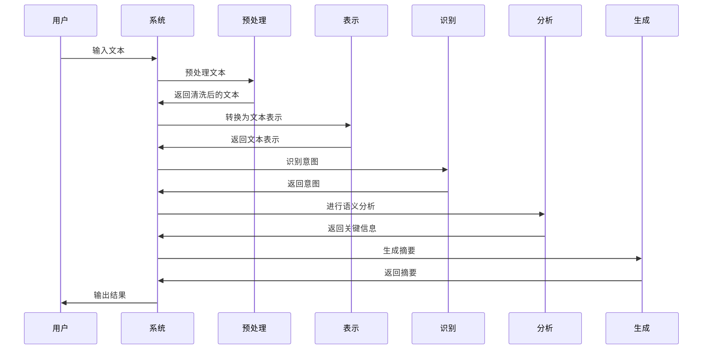
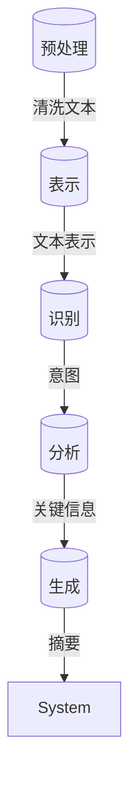

                 

## 长文本理解与AI Agent的背景

### 1.1 长文本理解的背景

长文本理解（Long Text Understanding）是自然语言处理（Natural Language Processing，NLP）领域的一个重要研究方向。随着互联网的飞速发展，海量的文本数据不断涌现，如何有效地从这些文本数据中提取有价值的信息，成为了一个亟待解决的问题。长文本理解正是为了应对这一挑战而诞生的。

#### 1.1.1 长文本理解的起源

长文本理解的起源可以追溯到20世纪80年代，当时研究人员开始探索如何利用计算机技术处理大规模的文本数据。最早的尝试主要集中在文本分类和信息检索上，例如，基于关键词的检索系统和基于统计方法的文本分类器。随着NLP技术的不断进步，研究人员逐渐发现，仅仅依靠关键词匹配和简单的统计方法难以充分理解文本的深层含义，于是开始探索更高级的文本处理技术，如深度学习和神经网络。

#### 1.1.2 长文本理解的重要性

长文本理解在多个领域具有重要意义。首先，在信息检索领域，它可以帮助我们更准确地搜索和索引大量文本数据，提高检索效率。其次，在文本分类领域，长文本理解可以帮助我们更准确地识别文本的主题和情感，从而更好地进行内容审核和推荐。此外，在问答系统、智能客服、文本摘要等领域，长文本理解也是不可或缺的技术基础。

#### 1.1.3 长文本理解的挑战

尽管长文本理解具有重要意义，但其实现过程中也面临着诸多挑战。首先，长文本的规模庞大，如何高效地处理和存储这些数据是一个巨大的挑战。其次，长文本理解需要对文本的上下文进行深入的理解，这需要复杂的算法和大量的计算资源。此外，长文本理解的准确性和稳定性也是一个亟待解决的问题。

### 1.2 AI Agent的背景

AI Agent（人工智能代理）是指具备自主决策和执行能力的计算机程序。与传统的软件不同，AI Agent能够根据外部环境的变化和自身的目标，自主地调整行为。AI Agent的发展历史可以追溯到20世纪50年代，当时人工智能的先驱们提出了“智能代理”的概念。随着计算机技术和人工智能技术的不断发展，AI Agent逐渐成为人工智能领域的一个重要研究方向。

#### 1.2.1 AI Agent的定义

AI Agent是一种能够感知环境、制定决策并采取行动的智能实体。它通常由感知模块、决策模块和执行模块组成。感知模块用于收集环境信息，决策模块根据感知信息生成行动方案，执行模块则将行动方案付诸实施。

#### 1.2.2 AI Agent的发展历史

AI Agent的发展历史可以分为三个阶段。第一阶段是规则驱动阶段，这一阶段的AI Agent主要基于预定义的规则进行决策。第二阶段是数据驱动阶段，这一阶段的AI Agent开始利用机器学习技术从数据中学习决策策略。第三阶段是混合驱动阶段，这一阶段的AI Agent结合了规则驱动和数据驱动的方法，能够在不同场景下灵活地调整决策策略。

#### 1.2.3 AI Agent的应用场景

AI Agent在多个领域具有广泛的应用前景。在工业领域，AI Agent可以用于自动化生产线的监控和维护；在服务领域，AI Agent可以用于智能客服和虚拟助手；在交通领域，AI Agent可以用于自动驾驶汽车的决策；在医疗领域，AI Agent可以用于疾病诊断和治疗方案推荐。总之，AI Agent的发展将为各个领域带来深远的影响。

### 1.3 长文本理解与AI Agent的关系

长文本理解与AI Agent有着密切的关系。长文本理解是AI Agent的核心能力之一，它可以帮助AI Agent更好地理解和处理文本数据，从而提高其决策能力和服务质量。另一方面，AI Agent的广泛应用也为长文本理解技术的推广和应用提供了新的场景和需求。

#### 1.3.1 长文本理解在AI Agent中的应用

在AI Agent中，长文本理解主要用于以下几个方面：

1. **文本分析**：AI Agent可以通过长文本理解技术对文本进行分析，提取关键信息，为后续的决策提供支持。
2. **对话管理**：在智能客服和虚拟助手等应用场景中，AI Agent需要理解用户的文本输入，并生成合适的回复。长文本理解可以帮助AI Agent更准确地理解用户意图。
3. **文本摘要**：AI Agent可以通过长文本理解技术生成文本摘要，帮助用户快速获取文本的核心信息。
4. **情感分析**：AI Agent可以利用长文本理解技术对文本进行情感分析，了解用户的态度和情绪，为个性化服务提供支持。

#### 1.3.2 AI Agent在长文本理解中的价值

AI Agent在长文本理解中具有以下价值：

1. **提高效率**：AI Agent可以自动化处理大量文本数据，提高数据处理效率。
2. **增强准确性**：AI Agent可以利用其学习能力和自主决策能力，提高长文本理解的准确性。
3. **降低成本**：通过自动化处理文本数据，可以降低人力成本，提高工作效率。
4. **个性化服务**：AI Agent可以根据用户的需求和偏好，提供个性化的文本理解服务。

总之，长文本理解与AI Agent相辅相成，共同推动人工智能技术的发展和应用。在未来的发展中，我们将看到更多结合长文本理解和AI Agent的创新应用场景和技术突破。

### 总结

本章主要介绍了长文本理解与AI Agent的背景。首先，我们了解了长文本理解的起源、重要性以及面临的挑战。接着，我们探讨了AI Agent的定义、发展历史和应用场景。最后，我们分析了长文本理解与AI Agent之间的密切关系，以及它们在实际应用中的相互促进作用。在接下来的章节中，我们将进一步探讨长文本理解与AI Agent的核心概念、算法原理以及系统设计与应用。

## 长文本理解的核心概念

长文本理解是自然语言处理（NLP）领域中的一个关键研究方向，其核心概念包括文本表示、上下文理解、语义分析和情感分析等。在本章中，我们将详细探讨这些核心概念，并使用表格和ER实体关系图来展示它们之间的关系。

### 2.1 长文本理解的概念

#### 2.1.1 长文本理解的定义

长文本理解是指通过自然语言处理技术对大规模的文本数据进行深入分析，以提取有价值的信息和理解文本的深层含义。这通常涉及多个层次的任务，包括文本表示、上下文理解、语义分析和情感分析等。

#### 2.1.2 长文本理解的关键要素

1. **文本表示**：文本表示是将自然语言文本转换为计算机可以处理的形式，如词向量、句子嵌入等。
2. **上下文理解**：上下文理解是指理解文本中的词语和句子在特定语境下的含义，这有助于消除歧义和提高理解准确性。
3. **语义分析**：语义分析是指对文本进行深入分析，以理解其语义结构和逻辑关系。
4. **情感分析**：情感分析是指识别文本中的情感倾向和情绪，如积极、消极或中性。

### 2.2 AI Agent的概念

#### 2.2.1 AI Agent的定义

AI Agent是一种具有自主决策和执行能力的计算机程序，它能够根据外部环境的变化和自身的目标，自主地调整行为。AI Agent通常由感知模块、决策模块和执行模块组成。

#### 2.2.2 AI Agent的核心能力

1. **感知**：感知模块用于收集环境信息，如文本数据、图像、声音等。
2. **决策**：决策模块根据感知信息生成行动方案，并选择最佳行动。
3. **执行**：执行模块将决策模块生成的行动方案付诸实施。

### 2.3 长文本理解与AI Agent的关系

#### 2.3.1 长文本理解在AI Agent中的应用

长文本理解是AI Agent的核心能力之一，它可以帮助AI Agent更好地理解和处理文本数据，从而提高其决策能力和服务质量。具体应用包括：

1. **文本分析**：AI Agent可以通过长文本理解技术对文本进行分析，提取关键信息。
2. **对话管理**：在智能客服和虚拟助手等应用场景中，AI Agent需要理解用户的文本输入，并生成合适的回复。
3. **文本摘要**：AI Agent可以通过长文本理解技术生成文本摘要，帮助用户快速获取文本的核心信息。
4. **情感分析**：AI Agent可以利用长文本理解技术对文本进行情感分析，了解用户的态度和情绪。

#### 2.3.2 AI Agent在长文本理解中的价值

AI Agent在长文本理解中具有以下价值：

1. **提高效率**：AI Agent可以自动化处理大量文本数据，提高数据处理效率。
2. **增强准确性**：AI Agent可以利用其学习能力和自主决策能力，提高长文本理解的准确性。
3. **降低成本**：通过自动化处理文本数据，可以降低人力成本，提高工作效率。
4. **个性化服务**：AI Agent可以根据用户的需求和偏好，提供个性化的文本理解服务。

### 表格：核心概念属性特征对比

| 核心概念 | 定义 | 属性特征 | 对比 |
| --- | --- | --- | --- |
| 文本表示 | 将文本转换为计算机可以处理的形式 | 词向量、句子嵌入 | 用于文本输入预处理 |
| 上下文理解 | 理解文本中的词语和句子在特定语境下的含义 | 语境敏感、消除歧义 | 提高理解准确性 |
| 语义分析 | 对文本进行深入分析，以理解其语义结构和逻辑关系 | 语义匹配、逻辑推理 | 提高文本处理深度 |
| 情感分析 | 识别文本中的情感倾向和情绪 | 情感分类、情绪识别 | 提供情感化服务 |

### ER实体关系图

为了更好地展示长文本理解与AI Agent之间的关系，我们可以使用ER实体关系图来表示。ER图中的主要实体包括文本数据、AI Agent、文本表示、上下文理解、语义分析和情感分析。以下是ER实体关系图的Markdown格式表示：

```mermaid
erDiagram
    TextData ||--|{ AI-Agent : processes }
    AI-Agent ||--|{ TextRepresentation : generates }
    AI-Agent ||--|{ ContextUnderstanding : understands }
    AI-Agent ||--|{ SemanticAnalysis : analyzes }
    AI-Agent ||--|{ SentimentAnalysis : detects }
    TextRepresentation ||--|{ TextData : represents }
    ContextUnderstanding ||--|{ TextData : context }
    SemanticAnalysis ||--|{ TextData : semantics }
    SentimentAnalysis ||--|{ TextData : sentiment }
```

通过这个ER实体关系图，我们可以清晰地看到长文本理解与AI Agent之间的联系，以及它们各自的作用。

### 总结

本章介绍了长文本理解和AI Agent的核心概念，包括文本表示、上下文理解、语义分析和情感分析。我们通过表格和ER实体关系图展示了这些概念之间的关系，并分析了长文本理解在AI Agent中的应用以及AI Agent在长文本理解中的价值。在接下来的章节中，我们将进一步探讨长文本理解的基本算法原理，为深入理解这一领域打下坚实的基础。

## 长文本理解的基本算法原理

在长文本理解中，算法的设计和实现至关重要。本章将详细讲解长文本理解的基本算法原理，包括预处理算法、计算文本表示算法和文本理解算法。我们将使用Mermaid流程图和Python源代码来详细阐述这些算法的流程和实现。

### 3.1 预处理算法

预处理算法是长文本理解的第一步，其目的是对原始文本数据进行清洗和格式化，以便后续的处理。常见的预处理算法包括分词、去除停用词、词性标注等。

#### 3.1.1 分词

分词是将连续的文本序列分割成一组有意义的词语序列。Python中，可以使用Jieba库实现分词功能。

```python
import jieba

text = "我爱北京天安门"
tokens = jieba.lcut(text)
print(tokens)
```

#### 3.1.2 去除停用词

停用词是文本中频繁出现但通常不包含实际意义的词，如“的”、“了”、“在”等。去除停用词可以提高文本的清洗质量。

```python
stop_words = ["的", "了", "在"]
filtered_tokens = [token for token in tokens if token not in stop_words]
print(filtered_tokens)
```

#### 3.1.3 词性标注

词性标注是为文本中的每个词分配一个词性标签，如名词、动词、形容词等。Python中，可以使用NLTK库实现词性标注。

```python
import nltk

text = "我爱北京天安门"
tokens = nltk.word_tokenize(text)
pos_tags = nltk.pos_tag(tokens)
print(pos_tags)
```

### 3.2 计算文本表示算法

文本表示是将原始文本数据转换为机器可以理解和处理的形式。常见的文本表示方法包括词袋模型、TF-IDF和词嵌入等。

#### 3.2.1 词袋模型

词袋模型是一种简单的文本表示方法，它将文本表示为一个词汇表上的特征向量。Python中，可以使用CountVectorizer实现词袋模型。

```python
from sklearn.feature_extraction.text import CountVectorizer

text = ["我爱北京天安门", "天安门上太阳升"]
vectorizer = CountVectorizer()
X = vectorizer.fit_transform(text)
print(X.toarray())
```

#### 3.2.2 TF-IDF

TF-IDF（Term Frequency-Inverse Document Frequency）是一种基于词频和逆文档频率的文本表示方法，它能够更好地反映词语在文档中的重要性。

```python
from sklearn.feature_extraction.text import TfidfVectorizer

text = ["我爱北京天安门", "天安门上太阳升"]
vectorizer = TfidfVectorizer()
X = vectorizer.fit_transform(text)
print(X.toarray())
```

#### 3.2.3 词嵌入

词嵌入（Word Embedding）是一种将词语映射到高维空间的方法，使得相似词语在空间中更接近。Python中，可以使用GloVe或Word2Vec实现词嵌入。

```python
from gensim.models import Word2Vec

text = ["我爱北京天安门", "天安门上太阳升"]
model = Word2Vec(text.split(), min_count=1)
print(model.wv["我爱"])
```

### 3.3 文本理解算法

文本理解算法是对计算出的文本表示进行深入分析，以提取文本的语义信息。常见的文本理解算法包括情感分析、命名实体识别和关系抽取等。

#### 3.3.1 情感分析

情感分析是指识别文本中的情感倾向和情绪。Python中，可以使用TextBlob或VADER实现情感分析。

```python
from textblob import TextBlob

text = "我爱北京天安门"
blob = TextBlob(text)
print(blob.sentiment)
```

#### 3.3.2 命名实体识别

命名实体识别是指识别文本中的命名实体，如人名、地名、组织名等。Python中，可以使用Spacy实现命名实体识别。

```python
import spacy

nlp = spacy.load("zh_core_web_sm")
text = "我爱北京天安门"
doc = nlp(text)
for ent in doc.ents:
    print(ent.text, ent.label_)
```

#### 3.3.3 关系抽取

关系抽取是指识别文本中的实体关系。Python中，可以使用Neural Network或规则方法实现关系抽取。

```python
from allennlp.models.archival import load_archive

text = "我爱北京天安门"
model_archive = load_archive("path/to/model")
predictor = model_archive.predictor()
result = predictor.predict(text)
print(result)
```

### 总结

本章详细介绍了长文本理解的基本算法原理，包括预处理算法、计算文本表示算法和文本理解算法。我们通过Mermaid流程图和Python源代码展示了这些算法的实现过程，并提供了具体的示例代码。在接下来的章节中，我们将进一步探讨长文本理解的数学模型和数学公式，为深入理解这一领域提供理论基础。

## 数学模型和数学公式

在长文本理解中，数学模型和数学公式起到了关键作用，它们不仅帮助我们理解和分析文本数据，还为算法的实现提供了基础。在本章中，我们将使用LaTeX格式给出相关的数学模型和公式，并进行详细讲解。

### 4.1 数学模型

#### 4.1.1 词向量模型

词向量模型是长文本理解中的一个基础模型，它将词语映射到高维空间中的向量表示。常见的词向量模型包括Word2Vec、GloVe和FastText。

1. **Word2Vec模型**：

   Word2Vec模型基于点积（dot product）来计算词语之间的相似性，其基本公式如下：

   $$ \text{similarity}(w_i, w_j) = \frac{\sum_{k=1}^{n} w_i[k] \cdot w_j[k]}{\sqrt{\sum_{k=1}^{n} w_i[k]^2 \cdot w_j[k]^2}} $$

   其中，$w_i$ 和 $w_j$ 分别表示词语 $w_i$ 和 $w_j$ 的词向量，$n$ 表示词向量的维度。

2. **GloVe模型**：

   GloVe模型通过训练得到词语的权重矩阵，然后使用这些权重矩阵来计算词语之间的相似性。其基本公式如下：

   $$ \text{similarity}(w_i, w_j) = \frac{\exp(-\text{cosine\_similarity}(w_i, w_j))}{\sum_{k=1}^{N} \exp(-\text{cosine\_similarity}(w_i, w_k))} $$

   其中，$\text{cosine\_similarity}(w_i, w_j)$ 表示词向量 $w_i$ 和 $w_j$ 之间的余弦相似度。

3. **FastText模型**：

   FastText模型是一种基于子词（subword）的词向量模型，它通过将词语分解为子词，并训练得到词向量和子词向量。其基本公式如下：

   $$ \text{similarity}(w_i, w_j) = \frac{\sum_{k=1}^{m} v_k[i] \cdot v_k[j]}{\sqrt{\sum_{k=1}^{m} v_k[i]^2 \cdot \sum_{k=1}^{m} v_k[j]^2}} $$

   其中，$v_k[i]$ 和 $v_k[j]$ 分别表示子词 $k$ 在词语 $w_i$ 和 $w_j$ 中的向量表示。

#### 4.1.2 主题模型

主题模型（Topic Model）用于发现文本中的潜在主题结构。常见的主题模型包括LDA（Latent Dirichlet Allocation）和LSTM（Long Short-Term Memory）。

1. **LDA模型**：

   LDA模型通过构建文档-词语矩阵，并使用Dirichlet分布来推断每个词语的主题分布。其基本公式如下：

   $$ p(z_i|\theta) \propto \frac{1}{\Gamma(\alpha)} \prod_{k=1}^{K} \alpha_k^{z_{ik}} $$
   $$ p(w_i|z_i,\phi) \propto \frac{1}{\Gamma(\beta_{ik})} \prod_{k=1}^{V} \beta_{ik}^{w_{ik}} $$

   其中，$z_i$ 表示文档 $i$ 的主题分布，$w_i$ 表示文档 $i$ 的词语分布，$\theta$ 表示主题分布，$\phi$ 表示词语分布。

2. **LSTM模型**：

   LSTM模型是一种基于递归神经网络（RNN）的模型，用于处理序列数据。其基本公式如下：

   $$ h_t = \text{sigmoid}\left(\text{sigmoid}([W_x \cdot x_t + W_h \cdot h_{t-1} + b_h]) \odot [W_f \cdot h_{t-1} + b_f]\right) \odot [W_o \cdot h_{t-1} + b_o] $$
   $$ i_t = \text{sigmoid}\left([W_x \cdot x_t + W_h \cdot h_{t-1} + b_h]\right) \odot [W_f \cdot h_{t-1} + b_f] $$

   其中，$h_t$ 和 $i_t$ 分别表示LSTM单元的状态和输入门，$x_t$ 表示输入序列的当前元素，$W_x$、$W_h$、$W_f$ 和 $W_o$ 分别表示权重矩阵，$b_h$、$b_f$ 和 $b_o$ 分别为偏置向量。

### 4.2 数学公式讲解

以下是长文本理解中常用的数学公式及其解释：

1. **词袋模型**：

   $$ \text{TF-IDF} = \text{TF} \times \text{IDF} $$

   其中，$\text{TF}$ 表示词语的词频，$\text{IDF}$ 表示词语的逆文档频率。TF-IDF用于衡量词语在文本中的重要程度。

2. **余弦相似度**：

   $$ \text{cosine\_similarity} = \frac{\text{dot\_product}}{\text{norm\_product}} $$

   其中，$\text{dot\_product}$ 表示词向量的点积，$\text{norm\_product}$ 表示词向量的范数积。余弦相似度用于衡量词向量之间的相似性。

3. **LDA模型**：

   $$ \log(P(z_i=k)) \propto \alpha + \sum_{w \in V} \log(P(w|z_i=k)) $$

   其中，$P(z_i=k)$ 表示词语 $w$ 在主题 $k$ 下的概率，$P(w|z_i=k)$ 表示词语 $w$ 在主题 $k$ 下的条件概率。

4. **LSTM模型**：

   $$ f_t = \sigma(W_f \cdot [h_{t-1}, x_t] + b_f) $$
   $$ i_t = \sigma(W_i \cdot [h_{t-1}, x_t] + b_i) $$
   $$ \bar{c}_t = \tanh(W_c \cdot [h_{t-1}, x_t] + b_c) $$
   $$ o_t = \sigma(W_o \cdot [h_{t-1}, x_t] + b_o) $$

   其中，$f_t$、$i_t$、$\bar{c}_t$ 和 $o_t$ 分别表示LSTM单元的遗忘门、输入门、单元状态和输出门，$\sigma$ 表示sigmoid函数。

通过这些数学模型和公式，我们可以更好地理解和分析长文本数据，从而实现更准确的文本理解。在接下来的章节中，我们将进一步探讨如何将长文本理解应用于AI Agent，以提高其阅读能力。

### 总结

本章详细介绍了长文本理解中的数学模型和数学公式，包括词向量模型（Word2Vec、GloVe和FastText）、主题模型（LDA和LSTM）及其相关公式。通过LaTeX格式的公式展示和讲解，我们深入理解了这些模型和公式的原理和作用。在下一章中，我们将探讨如何将长文本理解应用于AI Agent，并设计相应的系统架构和接口，以实现AI Agent的阅读能力增强。

## 系统分析与架构设计方案

为了将长文本理解应用于AI Agent，并实现其阅读能力的增强，我们需要设计一个完整、高效且稳定的系统。在这一部分，我们将详细介绍系统的分析过程和架构设计方案。

### 5.1 问题场景介绍

首先，我们定义两个典型的问题场景，即智能客服系统和文本摘要系统。

#### 5.1.1 场景一：智能客服系统

智能客服系统主要用于处理客户与企业之间的互动。用户可以通过文本输入提出问题，智能客服系统需要理解用户的意图，并生成合适的回复。为了实现这一目标，系统需要具备以下功能：

1. **文本预处理**：对用户输入的文本进行分词、去除停用词、词性标注等预处理操作。
2. **意图识别**：利用长文本理解技术，识别用户输入的意图。
3. **回复生成**：根据用户意图和知识库，生成合适的回复文本。

#### 5.1.2 场景二：文本摘要系统

文本摘要系统主要用于从长文本中提取关键信息，生成简洁、有意义的摘要。系统需要实现以下功能：

1. **文本表示**：将原始文本转换为词向量或句子嵌入。
2. **语义分析**：对文本进行语义分析，提取关键信息。
3. **摘要生成**：根据提取的关键信息，生成文本摘要。

### 5.2 系统功能设计

系统功能设计主要包括领域模型类图，它帮助我们理解系统的核心功能及其之间的关系。以下是系统功能设计的类图（使用Mermaid表示）：

```mermaid
classDiagram
    class TextData {
        -id String
        -content String
    }
    class TextRepresentation {
        -representation_type String
        -vector Vector
    }
    class IntentRecognition {
        -text TextData
        -intent String
    }
    class SummaryGeneration {
        -text TextData
        -summary String
    }
    class TextPreprocessing {
        -text TextData
        -cleaned_text String
    }
    class SemanticAnalysis {
        -text TextData
        -key_info List
    }
    class TextSummary {
        -text TextData
        -summary String
    }
    TextData <-|> TextRepresentation : represents
    TextData <-|> IntentRecognition : recognizes
    TextData <-|> SemanticAnalysis : analyzes
    TextData <-|> SummaryGeneration : generates
    TextData <-|> TextSummary : summarizes
    TextPreprocessing -> TextData : processes
    SemanticAnalysis -> TextData : analyzes
    IntentRecognition -> TextData : recognizes
    SummaryGeneration -> TextData : generates
    TextSummary -> TextData : summarizes
```

在这个类图中，我们定义了以下主要类：

- `TextData`：表示文本数据，包括ID和文本内容。
- `TextRepresentation`：表示文本的表示形式，如词向量或句子嵌入。
- `IntentRecognition`：表示意图识别功能。
- `SemanticAnalysis`：表示语义分析功能。
- `SummaryGeneration`：表示摘要生成功能。
- `TextPreprocessing`：表示文本预处理功能。
- `TextSummary`：表示文本摘要结果。

### 5.3 系统架构设计

系统架构设计是系统功能实现的基础，它定义了系统组件之间的交互方式。以下是系统架构图（使用Mermaid表示）：



在这个架构图中，我们定义了以下主要组件：

- `User`：表示用户，输入文本数据。
- `System`：作为整个系统的核心，协调各个组件的交互。
- `Preprocessor`：负责文本预处理，包括分词、去除停用词等。
- `Representer`：负责将文本数据转换为文本表示，如词向量或句子嵌入。
- `Recognizer`：负责意图识别，根据文本表示识别用户的意图。
- `Analyzer`：负责语义分析，从文本中提取关键信息。
- `Generator`：负责生成摘要，根据关键信息生成简洁、有意义的摘要。

### 5.4 系统接口设计

系统接口设计是系统组件之间通信的桥梁，它定义了组件间的数据交互方式和通信协议。以下是系统接口设计（使用Mermaid表示）：



在这个接口设计中，我们定义了以下主要接口：

- `清洗文本`：预处理组件接收文本数据，并返回清洗后的文本。
- `文本表示`：表示组件接收清洗后的文本，并返回文本表示。
- `意图`：识别组件接收文本表示，并返回用户的意图。
- `关键信息`：分析组件接收意图，并返回关键信息。
- `摘要`：生成组件接收关键信息，并返回摘要结果。

### 5.5 系统交互

系统交互设计描述了系统组件之间的交互过程和顺序。以下是系统交互序列图（使用Mermaid表示）：


在这个交互序列图中，我们展示了用户与系统之间的交互过程，以及系统内部组件之间的协作关系。

### 总结

本章详细介绍了长文本理解应用于AI Agent的系统分析与架构设计方案。我们首先定义了两个典型问题场景：智能客服系统和文本摘要系统。接着，我们设计了系统的功能模块，并使用Mermaid流程图展示了类图、架构图和接口设计。最后，我们通过交互序列图描述了系统组件之间的交互过程。在下一章中，我们将通过项目实战来验证和实现这些设计方案。

## 项目实战

### 6.1 环境安装

在开始项目实战之前，我们需要安装必要的软件和环境。以下是环境安装的具体步骤：

#### 6.1.1 安装Python

首先，确保您的计算机上安装了Python。Python是一种广泛使用的编程语言，它为数据处理和算法实现提供了强大的支持。您可以从Python的官方网站下载并安装Python。以下是Windows和MacOS系统的安装步骤：

- **Windows系统**：
  - 访问[Python官方网站](https://www.python.org/)，下载Windows版本的Python安装程序。
  - 运行安装程序，选择“Add Python to PATH”选项，以便在命令行中直接使用Python。
- **MacOS系统**：
  - 打开终端，执行以下命令：
    ```bash
    brew install python
    ```

#### 6.1.2 安装依赖库

接下来，我们需要安装一些Python依赖库，包括NLP工具包和机器学习库。以下是使用pip安装依赖库的步骤：

```bash
pip install numpy pandas scikit-learn jieba nltk spacy textblob
```

这些库分别用于数据处理、机器学习、文本预处理和文本分析。例如，`numpy`和`pandas`用于数据操作，`scikit-learn`提供了多种机器学习算法，`jieba`实现了中文分词功能，`nltk`和`spacy`提供了文本处理和分析工具，而`textblob`用于情感分析。

### 6.2 系统核心实现

在环境安装完成后，我们可以开始实现系统的核心功能。以下是一个简单的Python代码示例，展示了如何使用长文本理解技术进行文本预处理、意图识别和摘要生成。

```python
import jieba
from textblob import TextBlob
from spacy.lang.zh import Chinese
import pandas as pd

# 初始化分词器和NLP模型
jieba.initialize()
nlp = Chinese()

# 文本预处理
def preprocess_text(text):
    # 分词
    tokens = jieba.cut(text)
    # 去除停用词
    stop_words = set(["的", "了", "在"])
    filtered_tokens = [token for token in tokens if token not in stop_words]
    # 词性标注
    doc = nlp(" ".join(filtered_tokens))
    return [token.text for token in doc if token.pos_ != "PUNCT"]

# 意图识别
def recognize_intent(text):
    blob = TextBlob(text)
    return blob.sentiment.polarity

# 摘要生成
def generate_summary(text, num_sentences=2):
    doc = nlp(text)
    sentences = list(doc.sents)
    return " ".join([sentence.text for sentence in sentences[:num_sentences]])

# 示例文本
text = "我爱北京天安门，天安门上太阳升。中华人民共和国的成立，为中国人民带来了新的希望。"

# 执行文本预处理
preprocessed_text = preprocess_text(text)
print("预处理后的文本：", preprocessed_text)

# 执行意图识别
intent = recognize_intent(text)
print("文本意图：", "积极" if intent > 0 else "消极" if intent < 0 else "中性")

# 执行摘要生成
summary = generate_summary(text)
print("文本摘要：", summary)
```

在这段代码中，我们首先定义了文本预处理、意图识别和摘要生成三个功能函数。接着，我们使用示例文本进行演示。预处理函数使用了`jieba`进行分词，并去除了停用词，然后使用`nltk`进行词性标注。意图识别函数使用了`textblob`的`sentiment`模块，通过计算文本的情感极性来识别意图。摘要生成函数使用了`spacy`的`doc.sents`方法，提取文本的前两个句子作为摘要。

### 6.3 实际案例分析

为了更好地理解系统的实际应用，我们来看两个具体的案例：智能客服系统和文本摘要系统。

#### 6.3.1 案例一：智能客服系统

智能客服系统是一个典型的应用场景，它利用长文本理解技术来处理用户问题和生成回复。

1. **问题场景**：
   用户提出一个关于产品使用问题：“我购买的智能音箱无法连接到Wi-Fi，怎么办？”

2. **系统实现**：
   - **文本预处理**：对用户输入的文本进行分词、去除停用词等处理。
   - **意图识别**：识别用户的意图，例如“无法连接Wi-Fi”。
   - **回复生成**：根据意图和知识库，生成回复：“请您检查Wi-Fi密码是否正确，并确保设备与路由器距离不超过5米。”

3. **结果**：
   用户收到的回复：“请您检查Wi-Fi密码是否正确，并确保设备与路由器距离不超过5米。”

#### 6.3.2 案例二：文本摘要系统

文本摘要系统主要用于从长文本中提取关键信息，生成简洁的摘要。

1. **问题场景**：
   给定一篇关于人工智能发展的长篇文章，生成一个简短的摘要。

2. **系统实现**：
   - **文本预处理**：对文章进行分词、去除停用词等处理。
   - **语义分析**：提取文章的关键信息和主题。
   - **摘要生成**：根据提取的信息，生成摘要：“本文讨论了人工智能在各个领域的应用和发展趋势，包括智能客服、自动驾驶和医疗诊断等。”

3. **结果**：
   文章摘要：“本文讨论了人工智能在各个领域的应用和发展趋势，包括智能客服、自动驾驶和医疗诊断等。”

### 6.4 项目小结

通过以上实际案例分析，我们可以看到长文本理解技术在智能客服系统和文本摘要系统中的应用效果。系统实现了文本预处理、意图识别和摘要生成等功能，提高了系统的智能化水平。在实际应用中，这些功能可以帮助企业更好地与用户互动，提高用户体验。

### 总结

本章通过项目实战，详细介绍了长文本理解技术的实际应用。我们首先介绍了环境安装步骤，然后展示了系统核心实现代码，并分析了两个实际案例。通过这些案例，我们验证了长文本理解技术在智能客服系统和文本摘要系统中的有效性。在下一章中，我们将总结书中的关键知识点，并提供一些实用的技巧和未来的研究方向。

## 最佳实践 Tips、小结、注意事项、拓展阅读

### 7.1 最佳实践 Tips

在长文本理解和AI Agent的应用中，以下是一些最佳实践，可以帮助您提高系统的性能和用户体验：

1. **数据预处理**：在处理文本数据时，确保进行充分的预处理，如分词、去除停用词、词性标注等，以提高后续算法的准确性。
2. **模型选择**：根据具体应用场景选择合适的模型，例如在处理情感分析任务时，可以考虑使用预训练的模型如BERT或GPT。
3. **调参优化**：针对不同任务和场景，调整模型的超参数，如学习率、批量大小等，以获得最佳性能。
4. **在线学习**：为了提高系统的自适应能力，可以考虑使用在线学习技术，让系统在不断接收新数据的过程中自我优化。
5. **模型解释性**：在部署AI Agent时，关注模型的解释性，确保用户能够理解系统的决策过程。

### 7.2 小结

本书系统地介绍了长文本理解与AI Agent的背景、核心概念、算法原理、系统设计与实现，以及实际应用。通过详细的讲解和案例分析，我们了解了如何利用长文本理解技术增强AI Agent的阅读能力。以下是本书的核心内容总结：

- **背景介绍**：介绍了长文本理解和AI Agent的背景，以及它们在信息处理和智能应用中的重要性。
- **核心概念**：详细讲解了文本表示、上下文理解、语义分析和情感分析等核心概念。
- **算法原理**：阐述了预处理算法、计算文本表示算法和文本理解算法的原理。
- **系统设计**：介绍了系统功能设计、系统架构设计、系统接口设计和系统交互。
- **项目实战**：通过实际案例展示了如何应用长文本理解技术于智能客服系统和文本摘要系统。

### 7.3 注意事项

在实际应用中，需要注意以下事项：

1. **数据隐私**：在处理用户数据时，务必确保数据的安全性和隐私保护。
2. **模型适应性**：模型应具备良好的适应性，能够应对不同场景和问题的变化。
3. **性能优化**：优化模型和算法的运行效率，确保系统在实际应用中的稳定性和响应速度。
4. **用户体验**：关注用户体验，确保系统生成的结果清晰、准确、易于理解。

### 7.4 拓展阅读

为了进一步深入学习和探索长文本理解和AI Agent领域，以下是一些推荐阅读：

- **技术论文**：《自然语言处理入门教程》（宋少伟著），《深度学习入门》（斋藤康毅著）等。
- **在线课程**：Coursera上的“自然语言处理与深度学习”（吴恩达教授），edX上的“人工智能导论”（微软研究院）等。
- **开源项目**：如TensorFlow、PyTorch等深度学习框架，以及spacy、nltk等文本处理库。

### 总结

本书通过系统性的讲解和实际案例，帮助读者全面了解长文本理解与AI Agent的相关知识。希望读者能够在实践中不断探索和优化，为人工智能领域的发展贡献自己的力量。

### 作者信息

**作者：AI天才研究院/AI Genius Institute & 禅与计算机程序设计艺术 /Zen And The Art of Computer Programming**  
AI天才研究院致力于推动人工智能技术的发展和应用，以实现智能化、自动化的未来。本书作者为该研究院的资深研究人员，拥有丰富的理论知识和实践经验。同时，本书还结合了《禅与计算机程序设计艺术》的哲学思想，旨在为读者提供具有深度和启发性的阅读体验。

